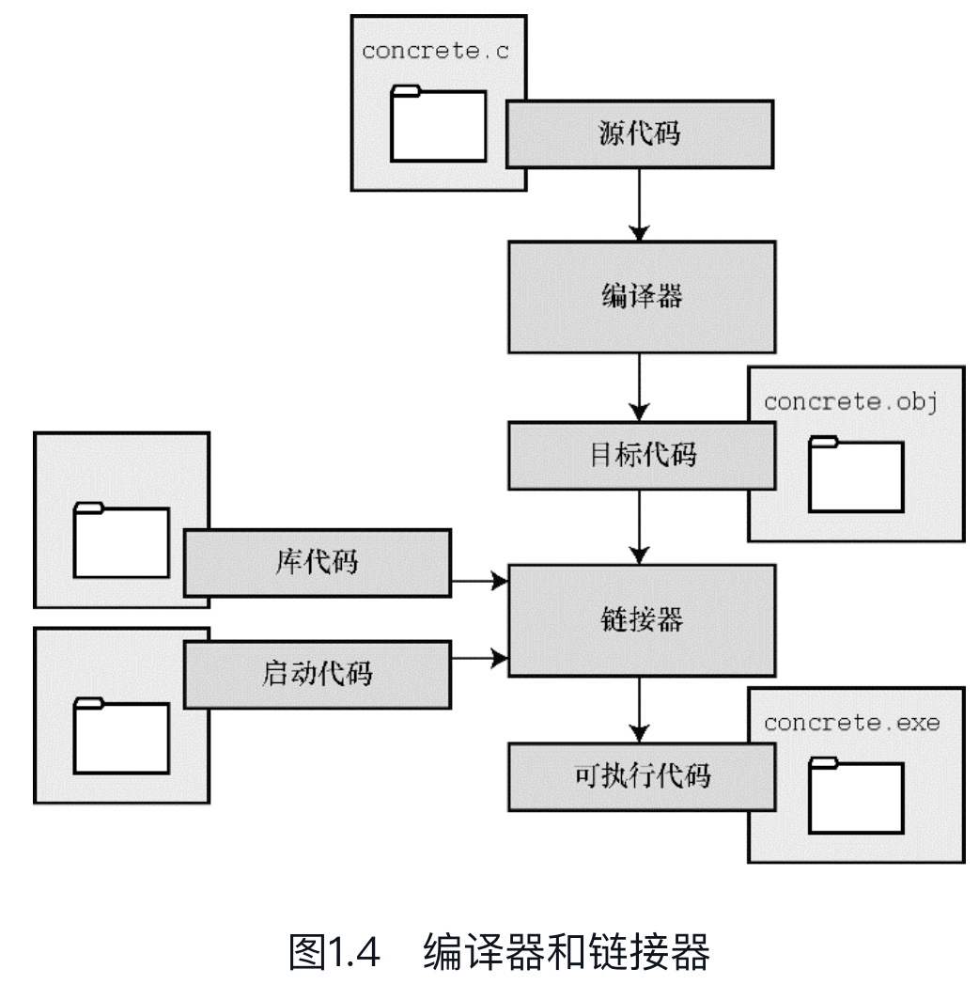
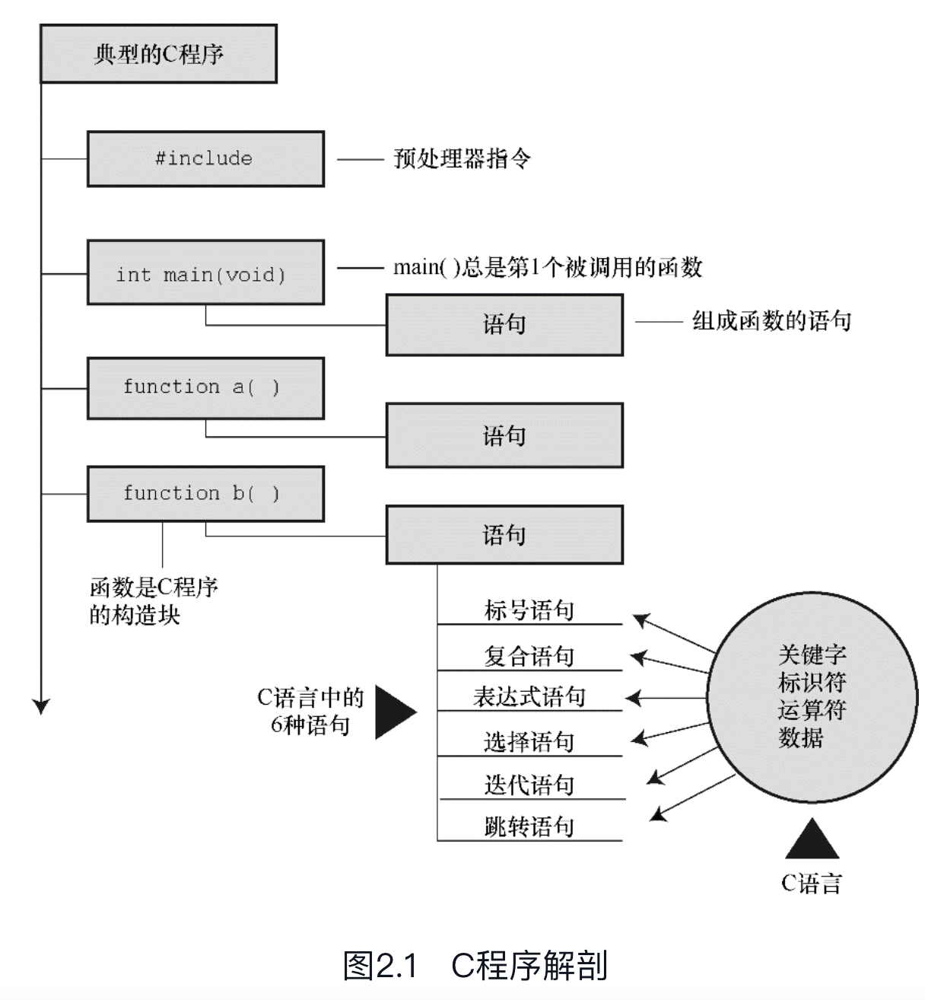
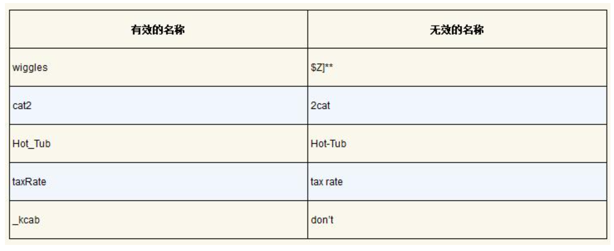

# C  Primer Plus

- 基本概念
- 编程技巧


- 预备知识
- 数据类型
- 格式化输入/输出
- 运算符
- 表达式
- 语句
- 循环
- 字符输入和输出
- 函数
- 数组和指针
- 字符和字符串函数
- 内存管理
- 文件输入和输出
- 结构
- 位操作
- C预处理器
- C库
- 高级数据表示


## 第一章

- C语言的历史
- 语言的优缺点
- 编程历史和基本原则
- C语言的运行环境


### 历史

72年，里奇和汤普逊在贝尔实验室**为了重构Unix操作系统而设计了C语言**，它基于B语言设计的。


### 优缺点

优点：

- 融合了计算机科学理论和实践的控制特性，能让用户能轻松地完成自顶向下的规划、结构化编程和模块化设计。

- 高效，C程序相对更紧凑，而且运行速度很快，C语言具有通常是汇编语言才具有的**微调控制能力**，可以写出速度和内存使用都非常优秀的程序

  > 汇编语言是为特定的中央处理单元设计的一系列内部指令，使用助记符来表示；不同的CPU系列使用不同的汇编语言

- 可移植，在一个系统中编写的C程序不需要或者稍作修改就能在其他系统运行。如需修改，也只需简单更改主程序头文件中的少许项即可，因为许多计算机体系结构都可以使用C编译器。程序中针对特认定的硬件或操作系统特殊功能的代码不可移植。

  > C编译器是把C代码转换成计算机内部指令的程序。
  >
  > 因为Unix操作系统是使用C语言写的，所以UNIX系统通常会将C编译器作为软件包的一部分，默认一并安装。
  >
  > 个人PC的不同版本和系统都能找到对应的C编译器。

- 功能强且灵活，其他多数语言的编译器和解释器都是C语言编写的。

- 可以访问硬件、操控内存中的位，C 语言有丰富的运算符，代码可以写的很简洁。

- 大多数C实现都有一个大型的库，包含众多有用的C函数，可以直接被开发者使用。


缺点：

- 紧凑简洁，结合了大量的运算符，导致写法多样且灵活，一些代码可以写得难理解
- 涉及指针的编程错误往往难以察觉
- C语言使用指针，涉及指针的编程错误难以察觉


### 应用范围

- 编写操作系统
- 开发应用层应用
- 开发编译器
- 开发游戏
- 嵌入式系统
- ...

> C++在C语言的基础上嫁接了面向对象编程工具（面向对象编程是一门哲学，它通过对语言建模来适应问题，而不是对问题建模以适应语言）
>
> 许多的微处理器都用C语言进行编程。


扩展：

学习计算机的工作原理，理解用C语言编写程序和运行C程序时所发生的事情。

现代计算机的硬件组成：

1. 中央处理单元（CPU），承担绝大部分的运算
2. 随机存取内存（RAM），存储程序和文件的工作区
3. 永久内存存储设备，硬盘
4. 各种外围设备，提供人与计算机之间的交互

CPU的工作大致流程：

它从内存中获取并执行一条指令，然后再从内存中获取并执行下一条指令。CPU中的寄存器可以存储数据。一个寄存器存储下一条指令的内存地址，CPU使用该地址来获取和更新下一条指令。在获取指令后，CPU在另一个寄存器中存储该指令，并更新第1个寄存器存储下一条指令的地址。CPU能识别的指令组成的集合被叫做指令集。存储在计算机中的所有内容都是二进制数字的组合。

编译器是把高级语言程序翻译成计算机能理解的机器语言指令集的程序。 

一般而言，不同CPU制造商使用的指令系统和编码格式不同。例如，用Intel Core i7（英特尔酷睿i7）CPU编写的机器语言程序对于ARM Cortex-A57 CPU而言什么都不是。但是，可以找到与特定类型CPU匹配的编译器。因此，使用合适的编译器或编译器集，便可把一种高级语言程序转换成供各种不同类型CPU使用的机器语言程序。


### C语言标准

市面上有多种C语言实现，在理想情况下，编写C程序时，假设该程序中未使用机器特定的编程技术，那么它的运行情况在任何实现中都应该相同。为了尽可能的实现这个需求，那么不同的实现要遵循同一个标准。

C语言从早期的非正式的K&R标准（定义了C语言，但没有定义C库，为此，UNIX实现提供的库成为了标准库），发展到1990 ISO/ANSI标准，即C89或者C90（定义了C语言和C标准库），再到C99（支持国际化编程，解决前面标准的中明显缺陷，适应科学和工程中的关键数值），并非所有的编译器都完全实现C99的所有改动，再发展到2011 ISO/IEC标准（添加了可选项支持当前使用多处理器的计算机）。


编写程序的步骤：

1. 定义程序的目标，写代码前，明确需求目标，思考你的程序需要哪些信息，要进行哪些计算和控制，以及程序应该要报告什么信息。

2. 设计程序，如何表示数据，以及用什么方法处理数据，选择一个合适的方式表示信息可以更容易地设计程序和处理数据

3. 编写代码

4. 编译源代码，编译的细节取决于编程的环境，不同的计算机使用不同的机器语言方案（指令集）。C编译器负责把C代码翻译成特定的机器语言。此外，C编译器还将源代码与C库（库中包含大量的标准函数供用户使用，如printf()和scanf()）的代码合并成最终的程序。

   > 更精确地说，应该是由一个被称为链接器的程序来链接库函数，但是在大多数系统中，编译器运行链接器

5. 运行程序，在常见环境（包括Windows命令提示符模式、UNIX终端模式和Linux终端模式）中运行程序要输入可执行文件的文件名，而其他环境可能要运行命令或一些其他机制。例如，在Windows和Mac提供的集成开发环境（IDE）中，用户可以在IDE中通过选择菜单中的选项或按下特殊键来编辑和执行C程序。最终生成的程序可通过单击或双击文件名或图标直接在操作系统中运行。

6. 测试和调试程序

7. 维护和修改代码

应该养成先规划再动手编写代码的好习惯，用纸和笔记录下程序的目标和设计框架。


### 编程机制

C是编译型语言。

生成程序的具体过程因计算机环境而异。C语言编写的项目可以放在UNIX、Linux、、Windows和Macintosh OS等系统下编译为可执行文件。了解计算机是怎么编译C语言编写的项目为可执行文件程序。

源代码文件，要求文件名以.c结尾，文件名应该满足特定计算机操作系统的特殊要求。

典型的C实现通过**编译和链接**两个步骤来完成将C源代码文件转换为可执行文件。编译器把源代码转换成中间代码，链接器把中间代码和其他代码合并，生成可执行文件。

分为两个步骤方便对程序进行模块化，可以独立编译单独的模块，稍后再用链接器合并已编译的模块。通过这种方式，如果只更改某个模块，不必因此重新编译其他模块。另外，链接器还将你编写的程序和预编译的库代码合并。


#### 目标代码文件

目标代码文件是一种中间文件。把源代码转换为机器语言代码，并把结果放在目标代码文件中，虽然目标文件中包含机器语言代码，但是并不能直接运行该文件。因为目标文件中存储的是编译器翻译的源代码，这还不是一个完整的程序。

目标代码文件缺失启动代码（startup code）。启动代码充当着程序和操作系统之间的接口。虽然同一台电脑上的不同操作系统（Windows和Linux）的CPU指令集相同，但是Windows和Linux所需的启动代码不同，因为这些系统处理程序的方式不同。

目标代码还缺少库函数。几乎所有的C程序都要使用C标准库中的函数。目标代码文件并不包含该函数的代码，它只包含了使用printf()函数的指令。printf()函数真正的代码存储在另一个被称为库的文件中。库文件中有许多函数的目标代码。


#### 可执行文件

**通过链接器，把开发者编写的目标代码、系统的标准启动代码和库代码这3部分合并成一个文件，即可执行文件。对于库代码，链接器只会把程序中要用到的库函数代码提取出来（见图1.4）。**



总结：**目标文件和可执行文件都由机器语言指令组成的。然而，目标文件中只包含编译器为你编写的代码翻译的机器语言代码，可执行文件中还包含你编写的程序中使用的库函数和启动代码的机器代码。**


### 操作系统

#### Unix

使用通用的UNIX编辑器，如emacs、jove、vi或X Window System文本编辑器编写C语言代码。

Unix操作系统中编译C语言程序，使用操作系统自带的C编译器，执行命令：cc xxx.c，然后直接输入打包生产文件的名字就可以执行该程序。

C编译器会创建一个与源代码基本名相同的目标代码文件，但是其扩展名是.o。一旦链接器生成了完整的可执行程序，就会将其删除。如果原始程序有多个源代码文件，则保留目标代码文件。

##### GNU编译器集合

GNU项目是一个开发大量自由UNIX软件的集合。GNU编译器集合，也被称为GCC，其中包含GCC C编译器是该项目的产品之一。GCC有各种版本以适应不同的硬件平台和操作系统，包括UNIX、Linux和Windows。用gcc命令便可调用GCC C编译器。


##### LLVM项目

该项目是与编译器相关的开源软件集合，它的Clang编译器处理C代码，可以通过clang调用。有多种版本供不同的平台使用，包括Linux。


GNU和LLVM都可以使用-v选项来显示版本信息，因此各系统都使用cc别名来代替gcc或clang命令。

gcc和clang命令都可以根据不同的版本选择运行时选项来调用不同C标准。

```shel
gcc -std=c99 inform.c[3]
gcc -std=c1x inform.c
gcc -std=c11 inform.c
```

第1行调用C99标准，第2行调用GCC接受C11之前的草案标准，第3行调用GCC接受的C11标准版本。Clang编译器在这一点上用法与GCC相同。


#### Linux

Linux是一个类UNIX的操作系统，可在不同平台（包括PC和Mac）上运行。在Linux中，使用GNU提供的GCC公共域C编译器。命令： gcc xxx.c

在安装Linux时，可选择是否安装GCC。如果之前没有安装GCC，则必须安装。通常，安装过程会将cc作为gcc的别名，因此可以在命令行中使用cc来代替gcc。


#### PC的命令行编译器

C编译器不是标准Windows软件包的一部分，因此需要从别处获取并安装C编译器。可以下载Cygwin和MinGW，在PC上通过命令行使用GCC编译器。

源代码文件应该是文本文件，不是字处理器文件（字处理器文件包含许多额外的信息，如字体和格式等）。

通常，C编译器生成的中间目标代码文件的扩展名是.obj（也可能是其他扩展名）。与UNIX编译器不同，这些编译器在完成编译后通常不会删除这些中间文件。有些编译器生成带.asm扩展名的汇编语言文件，而有些编译器则使用自己特有的格式。

一些编译器在编译后会自动运行链接器，另一些要求用户手动运行链接器。在可执行文件中链接的结果是，在原始的源代码基本名后面加上.exe扩展名。


#### 集成开发环境（Windows）

集成开发环境(IDE)，如：Microsoft Visual Studio。（目前，大多数IDE都是C和C++结合的编译器）这类集成开发环境都提供了各种菜单（如，命名、保存源代码文件、编译程序、运行程序等），用户不用离开IDE就能顺利编写、编译和运行程序。如果编译器发现错误，会返回编辑器中，标出有错误的行号，并简单描述情况。

IDE提供了多种目标（target），即运行程序的多种环境。例如，IDE提供了32位Windows程序、64位Windows程序、动态链接库文件（DLL）等，许多目标都涉及Windows 图形界面。

项目形式：

- Win32控制台应用程序
- DOS EXE
- Console
- Character Mode

Windows IDE既可处理C也可处理C++，因此要指定待处理的程序是C还是C++。有些产品用项目类型来区分两者，有些产品（如，Microsoft Visual C++）用.c文件扩展名来指明使用C而不是C++。当然，大多数C程序也可以作为C++程序运行。

在程序执行完毕后，执行程序的窗口立即消失。如果不希望出现这种情况，可以让程序暂停，直到按下Enter键，窗口才消失。要实现这种效果，可以在程序的最后（return这行代码之前）添加下面一行代码：

```
getchar();
```

getchar()读取一次除了enter键之外的输入，按下enter键表示结束输入，程序接收输入并继续执行。

几乎所有的C程序都能与C++程序兼容。所以，本书中的绝大多数C程序都可作为C++程序运行。或者，在选择C++选项后，将默认的源文件扩展名.cpp替换成.c，编译器便会使用C语言的规则代替C++。


#### Mac

Mac提供Xcode开发系统，Xcode使用Clang或GCC C编译器来编译C代码，它以前默认使用GCC，但是现在默认使用Clang。

GCC最基本的用法是：gcc [options] [filenames]，其中options是所需的参数，filenames是文件名。


## 第二章

### C示例代码

```c
#include <stdio.h>

int main(void)                    /* 一个简单的C程序 */
{       
     int num;                     /* 定义一个名为num的变量 该声明表明，将使用一个名为num的变量，而且num是int（整数）类型。*/
     num = 1;                     /* 为num赋一个值,把值1赋给名为num的变量。 */   

     printf("I am a simple ");    /* 使用printf()函数 该语句使用printf()函数，在屏幕上显示I am a simple，光标停在同一行。printf()是标准的C库函数。在程序中使用函数叫作调用函数。 */
     printf("computer.\n");  /*在上条语句打印出来的内容后面加上“computer”。代码\n告诉计算机另起一行，即把光标移至下一行。*/
     printf("My favorite number is %d because it is first.\n",num);  /*把num的值（1）内嵌在用双引号括起来的内容中一并打印。%d告诉计算机以何种形式输出num的值，打印在何处。*/

     return 0;  /*给调用方提供（或返回）一个数。*/
}
```

打印结果：

```
I am a simple computer.
My favorite number is 1 because it is first.
```


### 代码解释

某些窗口环境会在单独的窗口运行程序，然后在程序运行结束后自动关闭窗口。如果遇到这种情况，可以在程序中添加额外的代码，让窗口等待用户按下一个键后才关闭。一种方法是，在程序的return语句前添加一行代码：

```c
getchar()；
```

这行代码会让程序等待击键，窗口会在用户按下一个键后才关闭。





```c
#include<stdio.h>        ←包含另一个文件
```

该行告诉编译器把stdio.h中的内容包含在当前程序中。stdio.h是C编译器软件包的标准部分，它提供键盘输入和屏幕输出的支持。

相当于把stdio.h文件中的所有内容都输入该行所在的位置。include文件提供了一种方便的途径**共享许多程序共有的信息**。

#include这行代码是**一条C预处理器指令（preprocessor directive）**。通常，C编译器在编译前会对源代码做一些准备工作，即预处理（preprocessing）。


所有的C编译器软件包都提供stdio.h文件。该文件中包含了供编译器使用的输入和输出函数（如，printf()）信息。该文件名的含义是标准输入/输出头文件。通常，在C程序顶部的信息集合被称为头文件（header）。

在大多数情况下，头文件包含了编译器创建最终可执行程序要用到的信息。例如，**头文件中可以定义一些常量，或者指明函数名以及如何使用它们**。但是，函数的实际代码在一个预编译代码的库文件中。简而言之，头文件帮助编译器把你的程序正确地组合在一起。

**特定C实现的文档中应该包含对C库函数的说明。**这些说明确定了使用哪些函数需要包含哪些头文件。例如，要使用printf()函数，必须包含stdio.h头文件。


```c
int main(void)        ←函数名
```

C程序都是从main()函数开始启动执行，一个C语言项目中不能有多个main函数

int表明main()函数返回一个整数（返回给操作系统），函数名后面的圆括号中包含一些传入函数的信息。该例中没有传递任何信息。因此，圆括号内是单词void，表明main()不带任何参数。


```c
/*一个简单的程序*/

// 单行注释，C99新增
```

被/* */两个符号括起来的部分是程序的注释（可以单行，多行）。


```
{
    ...
}
```

一般而言，所有的C函数都使用花括号标记函数体的开始和结束，还可用于把函数中的多条语句合并为一个单元或块。（花括号、函数体和块）


```c
int num;  // 声明（declaration）
```

声明完成了:

1. 在函数中定义了一个名为num的变量（variable）（标识符）
2. int（关键字）表明num是一个整数

编译器使用这些信息为num变量在内存中分配存储空间。声明把特定标识符与计算机内存中的特定位置联系起来，同时也确定了存储在某位置的信息类型或数据类型。

在C语言中，所有变量都必须先声明才能使用。

以前的C语言，要求把变量声明在块的顶部，其他语句不能在任何声明的前面。C99和C11遵循C++的惯例，可以把声明放在块中的任何位置。尽管如此，首次使用变量之前一定要先声明它。


标识符命名规则：**可以用小写字母、大写字母、数字和下划线（_）来命名。而且，名称的第1个字符必须是字母或下划线，不能是数字。**



**操作系统和C库经常使用以一个或两个下划线字符开始的标识符**（如，_kcab），因此最好避免在自己的程序中使用这种名称。

C语言的名称区分大小写，即把一个字母的大写和小写视为两个不同的字符。因此，stars和Stars、STARS都不同。


```c
num = 1;
```

赋值语句。在执行int num；声明时，编译器在计算机内存中为变量num预留了空间，然后在执行这行赋值语句时，把值存储在之前预留的位置。可以给num赋不同的值。


```c
printf("I am a simple ");
printf("computer.\n");
printf("My favorite number is %d because it is first.\n", num);
```

上面使用了C语言的一个标准函数：printf()。圆括号中的内容是从main()函数传递给printf()函数的信息——实参。

当程序运行到这一行时，控制权被转给已命名的函数（该例中是printf()）。函数执行结束后，控制权被返回至主调函数（calling function），该例中是main()。

\n的意思是换行（代表一个换行符（newline character））。

换行符是一个**转义序列**（escape sequence）。转义序列用于代表难以表示或无法输入的字符。如，\t代表Tab键，\b代表Backspace键（退格键）。每个转义序列都以反斜杠字符（\）开始。

%d相当于是一个占位符，其作用是指明输出num值的位置。%提醒程序，要在该处打印一个变量，d表明把变量作为十进制整数打印。printf()函数名中的f提醒用户，这是一种格式化打印函数。printf()函数有多种打印变量的格式，包括小数和十六进制整数。


```c
return 0;
```

int main(void)中的int表明main()函数应返回一个整数。C标准要求main()这样做。有返回值的C函数要有return语句。该语句以return关键字开始，后面是待返回的值，并以分号结尾。如果遗漏main()函数中的return语句，程序在运行至最外面的右花括号（}）时会返回0。因此，可以省略main()函数末尾的return语句。


### C程序的基本结构

程序由一个或多个函数组成，必须有main()函数。函数由函数头和函数体组成。函数头包括函数名、传入该函数的信息类型和函数的返回类型。通过函数名后的圆括号可识别出函数，圆括号里可能为空，可能有参数。函数体被花括号括起来，由一系列语句、声明组成。


### 多个函数

除main()以外，如何把自己的函数加入程序中。

```c
/* two_func.c -- 一个文件中包含两个函数 */
#include <stdio.h>
void butler(void); /* ANSI/ISO C函数原型 */

int main(void)
{
     printf("I will summon the butler function.\n");
     butler();
     printf("Yes. Bring me some tea and writeable DVDs.\n");

     return 0;
}

void butler(void) /* 函数定义开始 */
{
     printf("You rang, sir?\n");
}
```

输出结果：

```
I will summon the butler function.
You rang, sir?
Yes. Bring me some tea and writeable DVDs.
```


butler()函数在程序中出现了3次:

1. 第1次是函数原型（prototype），告知编译器在程序中要使用该函数；
2. 第2次以函数调用（function call）的形式出现在main()中；
3. 最后一次出现在函数定义（function definition）中，函数定义即是函数本身的源代码。

函数原型是一种

形式，告知编译器正在使用某函数，因此函数原型也被称为函数声明（function declaration）。函数原型还指明了函数的属性。例如，butler()函数原型中的第1个void表明，butler()函数没有返回值（通常，被调函数会向主调函数返回一个值，但是butler()函数没有）。第2个void（butler(void)中的void）的意思是butler()函数不带参数。

程序的最后部分是butler()函数的定义，其形式和main()相同，都包含函数头和用花括号括起来的函数体。函数头重述了函数原型的信息：butler()不带任何参数，且没有返回值。


无论main()在程序文件中处于什么位置，所有的C程序都从main()开始执行。但是，C的惯例是把main()放在开头，因为它提供了程序的基本框架。

**C标准建议，要为程序中用到的所有函数提供函数原型。标准include文件（包含文件）为标准库函数提供了函数原型。例如，在C标准中，stdio.h文件包含了printf()的函数原型。**


## 第三章

- 如何读取数据
- 如何操作数据

C语言中的数据类型。

C语言中有两大类的多种数据类型。本章介绍**整数类型和浮点数类型**。讲它们是什么、如何声明、如何使用。

示例代码：

```c
#include <stdio.h>

int main(void)
{
	float weight;
	float value;
	
	printf("Are you worth your weight in platinum?\n");
	printf("let us check it out.\n");
	printf("Please enter your weight in pounds: ");

	scanf("%f", &weight);

	value = 1700.0 * weight * 14.5833;
	printf("Your weight in platinum is worth $%.2f.\n",value);
	printf("end\n");

	getchar();
	getchar();
	return 0;
	
}
```


声明整数类型变量： int num

声明浮点数类型变量：float num

在printf()中使用%f来处理浮点值，%.2f中的.2 用于精确控制输出，指定输出的浮点数只显示小数点后面两位。

scanf()函数用于读取键盘的输入，%f说明scanf()要读取用户从键盘输入 的浮点数，&weight告诉 scanf()把输入的值赋给名为 weight 的变量。

scanf() 函数使用&符号表明找到 weight变量的地址。

有些数据类型在程序使用之前已经预先设定好了，在整个程序的运行过程中没有变化，这些称为常量（constant）。

其他数据类型在程序运行期间可能会改变或被赋值，这些称为变量（variable），对变量而言，要在声明时指定其类型。

**C语言的基本类型关键字：**


int：表示基本的整数类型。

long、 short、unsigned和signed：用于修饰基本整数类型。比如：unsigned short int和long long int。

char：用于指定字母和其他字符，如， #、$、%和*，也可以表示较小的整数。

float、double和long double表示带小数点的数（浮点数）。

\_Bool类型表示布尔值（true或false）。

\_complex和\_Imaginary分别表示复数和虚数。


扩展：

> 位（bit），可以储存0或1。
>
> 字节（byte）是常用的计算机存储单位。对于几乎所有的机器，1字节 均为8位。这是字节的标准定义。8位就有256（2的8次方）种可能的0、1的组合。
>
> 字（word）是设计计算机时给定的**自然存储单位**。

整数和浮点数的区别是它们的书写方式不同，它们在计算机内存中储存方式不同。

**关键要理解浮点数和整数的储存方案不同**

计算机把浮点数分成小数部分和指数部分来表示，而且分开储存这两部分。计算机在内部使用二进制和2的幂进行储存，而不是10的幂。

对于一些算术运算（如，两个很大的数相减），浮点数**损失的精度**更多。


### 整数类型

C语言中整数类型int还可以细分为多种其他许多整数类型。

为什么设计多种整数类型？

因为：C语言为了最大限度的让程序员针对不同情况选择不同的类型，可以有效利用内存空间。

C语言中的不同的整数类型能表示的 数值的取值范围和所占用的内存空间也是完全相同的。一般情况使用int类型即可，但是为满足特定任务和机器的要求，还可以选择其他类型。

#### int类型

int类型是有**符号整型**，即int类型的值必须是整数，可以是正整数、负整数或零。其取值范围依计算机系统而异。**一般而言，储存一个int要占用一个机器字长。**

> 早期的16位IBM PC兼容机使用16位来储存一个int值，其取值范围（即int值的取值范围）是-32768～32767。
>
> 目前的个人计算机一般是32位，因此用32位储存一个int值。
>
> ISO C规定int的取值范围最小为-32768～32767。也就是16位二进制数能表示的数值的量。


```c
int erns;
int hogs, cows, goats;

// 初始化（initialize）变量
int hogs = 21;
int cows = 32, goats = 14;
int dogs, cats = 94; /* 有效，但是这种格式很糟糕，只初始化了cats，并未初始化dogs。*/
```


**C语言把不含小数点和指数的数作为整数。因此，22和-44都是整型常 量，但是22.0和2.2E1则不是。C语言把大多数整型常量视为int类型，但是非常大的整数除外。**


在printf函数中打印int类型值：

%d指明了在一 行中打印整数的位置。%d称为转换说明，它指定了printf()应使用什么格式 来显示一个值。格式化字符串中的每个%d都与待打印变量列表中相应的int 值匹配。这个值可以是int类型的变量、int类型的常量或其他任何值为int类型 的表达式。作为程序员，要确保转换说明的数量与待打印值的数量相同，编译器不会捕获这类型的错误，没有对应的位置将打印出内存中可能的任意值。


通常，C语言都假定整型常量是十进制数。在C语言中，用特定的前缀表示使用哪种进制。**0x或0X前缀表示十六进制值**，所以十进制数16表示成十六进制是0x10或0X10。与此类似，**0前缀表示八进制**。例如，十进制数16表示成八进制是020。


在printf函数中不同的进制要使用**不同的转换说明**。以十进制显示数字，使用**%d**；以八进制显示数字，使用**%o**； 以十六进制显示数字，使用**%x**。另外，要显示各进制数的前缀0、0x和0X， 必须分别使用%#o、%#x、%#X。


#### 其他整型

C语言提供了3个附属关键字修饰基本整数类型：short、long和unsigned。

short int类型（或者简写为short）占用的存储空间可能比int类型少，常 用于较小数值的场合以节省空间。short是有符号类型。

long int或long占用的存储空间可能比int多，适用于较大数值的场合。long是有符号类型。

long long int或long long（C99标准加入）占用的储存空间可能比long多， 适用于更大数值的场合。**该类型至少占64位**。long long是有符号类型。

unsigned int或unsigned只用于非负值的场合。例如，16位unsigned int允许的取值范围是0～65535，而int是-32768～32767。用于表示正负号的位现在用于表示另一个二进制位，所 以无符号整型可以表示更大的数。


在C90标准中，添加了unsigned long int或unsigned long和unsigned int或 unsigned short类型。C99标准又添加了unsigned long long int或unsigned long long。

在任何有符号类型前面添加关键字signed，可**强调使用有符号类型的意图**。例如，short、short int、signed short、signed short int都表示同一种类型。


**声明其他整型**

```c
long int estine;
long johns;
short int erns;
short ribs;
unsigned int s_count;
unsigned players;
unsigned long headcount;
unsigned short yesvotes;
long long ago;
```


**使用多种整数类型的原因**

C语言只规定了short占用的存储空间不能多于int， long占用的存储空间不能少于int。这样规定是为了适应不同的机器。例如， 过去的一台运行Windows 3的机器上，int类型和short类型都占16位，long类 型占32位。后来，Windows和苹果系统都使用16位储存short类型，32位储存 int类型和long类型（使用32位可以表示的整数数值超过20亿）。现在，计算 机普遍使用64位处理器，为了储存64位的整数，才引入了long long类型。

现在，个人计算机上最常见的设置是：long long占64位，long占32位， short占16位，int占16位或32位（依计算机的自然字长而定）。原则上，这4 种类型代表4种不同的大小，但是在实际使用中，有些类型之间通常有重叠。


C 标准对基本数据类型只规定了允许的最小大小。对于 16 位机，short 和 int 的最小取值范围是[−32767,32767]；对于32位机，long的最小取值范围 是[−2147483647,2147483647]。对于unsigned short和unsigned int，最小取值范 围是[0,65535]；对于unsigned long，最小取值范围是[0,4294967295]。long  long类型是为了支持64位的需求，最小取值范围是 [−9223372036854775807,9223372036854775807]；unsigned long long的最小取 值范围是[0,18446744073709551615]。


**如何声明合适的整数类型变量**

首先，考虑unsigned类型。这种类型的数常用于计数，因为计数不用负数。而且，unsigned类型可以表示更大的正数。

如果一个数超出了int类型的取值范围，且在long类型的取值范围内时， 使用long类型。然而，对于那些long占用的空间比int大的系统，使用long类 型会减慢运算速度。因此，如非必要，请不要使用long类型。

如果在long类型和int类型占用空间相同的机器上编写代码，当确实需要 32位的整数时，应使用long类型而不是int类型，以便把程序移植到16位机后 仍然可以正常工作。类似地，如果确实需要64位的整数，应使用long long类 型。

如果在int设置为32位的系统中要使用16位的值，应使用short类型以节省存储空间。通常，只有当程序使用相对于系统可用内存较大的整型数组时， 才需要重点考虑节省空间的问题。


一般，程序中的数字都是被存储为int类型，但是如果使用的数字超过int类型能表示的最大值时，编译器会用long int作为其类型。如果数字超出long可表示的 最大值，编译器则将其视为unsigned long类型。如果还不够大，编译器则将 其视为long long或unsigned long long类型。

int=>unsigned int=>long=>unsigned long =>long long => unsigned long long类型。

有时，需要编译器以long类型存储一个小的整数，为此，如果要把一个较小的常量作为long类型存储，可以在值的末尾加上L后缀。因此，在int 为16位、long为32位的系统中，会把7作为16位储存，把7L作为32位储存。l 或L后缀也可用于八进制和十六进制整数，如020L和0x10L。

类似地，在支持long long类型的系统中，也可以使用ll或LL后缀来表示 long long类型的值，如3LL。另外，u或U后缀表示unsigned long long，如 5ull、10LLU、6LLU或9Ull。


**整数溢出**

如果整数超出了相应类型的取值范围。下面分别将有符号类型和 无符号类型的整数设置为比最大值略大，看看会发生什么（printf()函数使 用%u说明显示unsigned int类型的值）。

```c
/* toobig.c-- 超出系统允许的最大int值*/
#include <stdio.h>
int main(void)
{
    int i = 2147483647;
    unsigned int j = 4294967295;
    printf("%d %d %d\n", i, i+1, i+2);
    printf("%u %u %u\n", j, j+1, j+2);
    return 0;
}

```

输出的结果是： 

2147483647     -2147483648      -2147483647

4294967295             0                           1


**打印short、long、long long和unsigned类型**

- 打印unsigned int类型的值，使用%u转换说明；
- 打印long类型的值，使 用%ld转换说明。
- 在x和o前面可以使用l前缀，%lx表示以十六进制格式打印long类型整数，%lo表示以八进制格式打印long类型整数。
- %hd表示以 十进制显示short类型的整数
- %ho表示以八进制显示short类型的整数
- %lu表示打印 unsigned long类型的值
- %lld和%llu分别表示有符号和无符号类型


```c
/* print2.c--更多printf()的特性 */
#include <stdio.h>
int main(void)
{
  unsigned int un = 3000000000; /* int为32位和short为16位的系统 */
  short end = 200;
  long big = 65537;
  long long verybig = 12345678908642;
  printf("un = %u and not %d\n", un, un);  // un = 3000000000 and not -1294967296
  printf("end = %hd and %d\n", end, end);  // end = 200 and 200
  printf("big = %ld and not %hd\n", big, big);  // big = 65537 and not 1
  printf("verybig= %lld and not %ld\n", verybig, verybig);  // verybig= 12345678908642 and not 1942899938
  return 0;
}
```

该例表明，**使用错误的转换说明**会得到意想不到的结果。第 1 行输出， 对于无符号变量 un，使用有符号整数说明——%d会生成负值！其原因是，无符号值 3000000000 和有符号值−129496296 在系统内存中的内部表示完全相同。因此，如果告诉printf()该数是无符号数，它打印一个值；如果告诉它 该数是有符号数，它将打印另一个值。


#### char类型

char类型用于储存字符（如，字母或标点符号），但是从技术层面看， char是整数类型。。因为char类型实际上储存的是整数而不是字符。

C语言把1字节定义为char类型占用的位（bit）数，因此无论是16位还是 32位系统，都可以使用char类型。

**声明char类型变量**

```c
char response;
char itable, latan;
char grade = 'A';
```

在C语言中，用单引号括起来的单个字符被称为字符常量（character constant）。编译器一发现'A'，就会将其转换成相应的代码值。单引号必不 可少。

```c
char broiled; /* 声明一个char类型的变量 */
broiled = 'T'; /* 为其赋值，正确 */
broiled = T; /* 错误！此时T是一个变量 */
broiled = "T"; /* 错误！此时"T"是一个字符串 */

char grade = 65; /* 对于ASCII，这样做没问题，但这是一种不好的编程风格 */
```

字符是以数值形式储存的，所以也可使用数字代码值来赋值。

奇怪的是，C语言将字符常量视为int类型而非char类型。例如，在int为32位、char为8位的ASCII系统中，有下面的代码：

```c
char grade = 'B';
```

本来'B'对应的数值66储存在32位的存储单元中，现在却可以储存在8位 的存储单元中（grade）。利用字符常量的这种特性，可以定义一个字符常 量'FATE'，即把4个独立的8位ASCII码储存在一个32位存储单元中。如果把 这样的字符常量赋给char类型变量grade，只有最后8位有效。因此，grade的 值是'E'。


**特殊字符**

C语言提供了3种方法表示这些字符：

1. 使用ASCII码。例如，蜂鸣字符的ASCII值是 7，因此可以这样写： char beep = 7;

2. 使用特殊的符号序列表示一些特殊的字符。这些符号序 列叫作**转义序列**（escape sequence），char nerf = '\n';
   

   警报字符（\a）：是否能产生听到或看到的警报，取决于计算机的硬件，蜂鸣是最常见的警报，在程序中把警报字符输出在屏幕上的效果是，发出 一声蜂鸣，但不会移动屏幕光标。

   换页符（\f）把活跃位置 移至下一页的开始处；（一般只在打印机上生效）

   换行符（\n）把活跃位置移至下一行的开始处；

   回车符（\r）把活跃位置移动到当前行的开始处；

   水平制表符（\t）将活跃位置 移至下一个水平制表点（通常是第1个、第9个、第17个、第25个等字符位置）；

   垂直制表符（\v）把活跃位置移至下一个垂直制表点。（一般只在打印机上生效）

3. 用十六进制形式表示字符常量


**打印字符**

printf()函数用%c指明待打印的字符。

如果用%d转换说明打印 char类型变量的值，打印的是一个整数。而%c转换说明告诉printf()打印该整数值对应的字符。


根据C90标准，C语言允许在关键字char前面使用signed或unsigned。这样，无论编译器默认char是什么类型，signed char表示有符号类型，而 unsigned char表示无符号类型。


#### \_Bool

C99标准添加了\_Bool类型，用于表示布尔值，即逻辑值true和false。因 为C语言用值1表示true，值0表示false，所以\_Bool类型实际上也是一种整数 类型。但原则上它仅占用1位存储空间。


#### 可移植类型：stdint.h和inttypes.h


## 第四章

输入和输出：printf()和scanf()。

用数组（array）存储字符串（character string）。


#### 算数运算符

- =

  赋值运算符，将等号右边的值赋值给左边的变量。实际上，等号的左侧必须是引用一个存储位置（可修改的左值）。**本质是使用那些可修改的左值标记那些可以被赋值的物理地址实体（内存位置）。**目的是把值储存到内存位置上。

  在C语言中，变量名和指针都用于指向一个存储位置。

  错误的代码：2022 = value,2022是字面常量，无法被赋值。

  ```c
  int a,b,c;
  a=b=c=3  //赋值的顺序是从右往左：首先把3赋给c，然后再赋给b，最后赋给a。
  ```

  

- +

  加法运算符，使其两侧的值相加。相加的值（运算对象）可以是变量，也可以是常量。

- -

  减法运算符（subtraction operator）用于减法运算，使其左侧的数减去右侧的数。

+和-运算符都被称为二元运算符（binary operator），即这些运算符需要 两个运算对象才能完成操作。

+和-还可以作为一元运算符，- 标明或改变一个值的代数符号；一元+运算符，它不会改变运算对象的值或符号。


- *

  符号*表示乘法

- /

  符号/表示除法。/左侧的值是被除数，右侧的值是除数。

  浮点数除法的结果是浮点数，而整数除法 的结果是整数。整数是没有小数部分的数。5除以3因为 实际结果有小数部分，但是在C语言中，整数除法结果的小数部分被丢弃，不四舍五入结果，这一过程被称为**截断（truncation）**。

  ```c
  /* divide.c -- 演示除法 */
  #include <stdio.h>
  int main(void)
  {
    printf("integer division: 5/4 is %d \n", 5 / 4);
    printf("integer division: 6/3 is %d \n", 6 / 3);
    printf("integer division: 7/4 is %d \n", 7 / 4);
    printf("floating division: 7./4. is %1.2f \n", 7. / 4.);
    printf("mixed division: 7./4 is %1.2f \n", 7. / 4);
    return 0;
  }
  
  /*
  integer division: 5/4 is 1
  integer division: 6/3 is 2
  integer division: 7/4 is 1
  floating division: 7./4. is 1.75
  mixed division: 7./4 is 1.75
  */
  ```

  计算机不能真正用浮点数除以整数，编译器会把两个运算对象转换成相同的类型。 本例中，在进行除法运算前，整数会被转换成浮点数。

  进行负数的整数除法小数点的处理方法有两种：

  1. 舍入过程采用小于或等于浮点数的最大整数。3.8取3，-3.8取-4
  2. 直接丢弃小数部分——**“趋零截断”**，3.8取3，-3.8取-3

  C99规定使用趋零截断。


扩展：c得标准数学库中提供pow函数，用以指数运算，如pow(3.5,2.2)表示3.5的2.2次幂。

术语扩展：

**数据对象**：用于储存值的数据存储区域统称为数据对象（data object）。变量名、数组的元素、结构的成员，或者使用指针表达式都是标识数据对象的方法。**且指针中储存的是它所指向对象的地址**。数据对象简称对象。

**左值**：是标识特定数据对象的**名称或表达式**。

- 可修改左值：指没有使用const关键字修饰过的变量，它可以放在赋值运算的左侧或者右侧。
- 不可修改的左值：指使用const修饰过的变量，它只能用在赋值运算符的右侧。

对象指的是实际的数据存储区域，而左值是用于标识或定位存储区域的标签（别名）。

**对象定位值**、**表达式的值**

**右值**：指的是能赋值给可修改左值的量，且本身不是左值。右值可以是变量，常量或其他可求值得表达式，函数调用。

```c
int ex;
int why;
int zee;
// 上面三个是可修改得左值，可用于赋值运算符得左右两侧。

const int TWO = 2;  // 不可变的左值，只用于赋值运算符的右侧，这里的=运算符表示初始化而不是赋值，因此并未违反规则


why = 42;  // 42 是右值，它不能引用某指定内存位置。
zee = why;
ex = TWO * (why + zee); // 表达式(why + zee)是右值，该表达式不能表示特定内存位置，而且也不能给它赋值。
```


#### 运算符优先级

乘法和除法的优先级比加法和减法高，如果两个运算符的优先级相同，则根据它们在语句中出现的顺序来执行。对大多数运算符而言，这种情 况都是按从左到右的顺序进行（=运算符除外）。使用小括号可以改变运算的优先级。

```c
butter = 25.0 + 60.0 * n / SCALE;
```

表达式树（expression tree）来表示求值的顺序：


运算符优先级为表达式中的求值顺序提供重要的依据，但是并没有规定 所有的顺序。C 给语言的实现者留出选择的余地。

```c
y = 6 * 12 + 5 * 20;
```

当运算符共享一个运算对象时，优先级决定了求值顺序。上面的12是运算符*和+的运算对象。先进行两个乘法运算6 * 12和5 * 20，再进行加法运算。**但是，优先级并未规定到底先进行哪一个乘法。**C 语言把主动权留给语言的实现者，根据不同的硬件来决定先计算前者还是后者。可能在一种硬件上采用某种方案效率更高，而在另一种硬件上采用另一种方案效率更高。


### sizeof

sizeof运算符以字节为单位返回运算对象的大小（在C中，1字节定义为char类型占用的空间大小。过去，1字节通常是8位，但是一些字符集可能使用更大的字节）。运算对象可以是具体的数据对象（如，变量名）或类型。如果运算对象是类型（如， float），则必须用圆括号将其括起来。

```c
// sizeof.c -- 使用sizeof运算符
// 使用C99新增的%zd转换说明 -- 如果编译器不支持%zd，请将其改
成%u或%lu
  #include <stdio.h>
  int main(void)
{
  int n = 0;
  size_t intsize;
  intsize = sizeof (int);
  printf("n = %d, n has %zd bytes; all ints have %zd bytes.\n",n, sizeof n, intsize);
  return 0;
}
```

C 语言规定，**sizeof 返回 size_t 类型的值**。这是一个无符号整数类型， 但它不是新类型。

%zd 转换说明用于 printf()显示 size_t 类型的值。


扩展：

C有一个 typedef机制，允许程序员**为现有类型创建别名**。

```c
typedef double real;  // real就是double的别名。现在，可以声明一个real类型的变量：
real deal; // 使用typedef
```

编译器查看real时会发现，在typedef声明中real已成为double的别名，于 是把deal创建为double 类型的变量。**类似地，C 头文件系统可以使用 typedef 把 size_t 作为 unsigned int 或unsigned long的别名。**这样，在使用size_t类型时，编译器会根据不同的系统替换标准类型。


### 求模运算符%

求模运算符（modulus operator）用于整数运算。求模运算符给出其左侧 整数除以右侧整数的余数（remainder）。

求模运算符只能用于整 数，不能用于浮点数。

求模运算符只能用于整 数，不能用于浮点数。

负数求模：如果第1个运算对象是负数，那么求模的结 果为负数；如果第1个运算对象是正数，那么求模的结果也是正数。

```c
11 / 5得2，11 % 5得1
11 / -5得-2，11 % -2得1
-11 / -5得2，-11 % -5得-1
-11 / 5得-2，-11 % 5得-1
```

如果当前系统不支持C99标准，会显示不同的结果。实际上，标准规 定：无论何种情况，只要a和b都是整数值，便可通过a - (a/b)*b来计算a%b。


#### 递增（减）运算符

递增运算符++，将其运算对象递增 1。

++出现在其作用的变量前面：先递增n，再使用

++出现在其作用的变量后面：先使用n，再递增

两种模式的区别在于递增行为发生的时间不同。


```c
/* post_pre.c -- 前缀和后缀 */
#include <stdio.h>
int main(void)
{
  int a = 1, b = 1;
  int a_post, pre_b;
  a_post = a++; // 后缀递增
  pre_b = ++b; // 前缀递增
  printf("a a_post b pre_b \n");
  printf("%1d %5d %5d %5d\n", a, a_post, b, pre_b);
  return 0;
}
```


#### 优先级

递增运算符和递减运算符的结合优先级只有圆括号的优先级比它们高。

因此，x\*y++表示的是(x)\*(y++)，而不是(x\*y)++。不过后者无 效，因为递增和递减运算符只能影响一个变量（或者，更普遍地说，只能影响一个可修改的左值），而组合x\*y本身不是可修改的左值。


#### 表达式和语句

C的基本程序步骤由语句组成，而大多数语句都由表达式构成。

表达式：由运算符和运算对象组成，运算对象是运算符操作的对象（可以是常量、变量或两者的组合）。

**每个表达式都有一个返回值**

这个值是根据优先级执行后的结果。**有赋值运算符（=）的表达式的值与赋值运算符左侧变量的值相同。**

表达式q = 5*2 作为一个整体的值是10。那么，q > 3这种关系表达式 的值不是0就是1，如果条件为真，表达式的值为1；如果条件为假，表达式的值为0。


语句（statement）是C程序的基本构建块。**一条语句相当于一条完整的计算机指令**，但并不是所有的指令都是语句。。在C中，大部分语句都以分号结尾。

legs = 4，是一个表达式

legs = 4，是一条语句

; // 空语句

x = 6 + (y = 5);   该语句中的子表达式y = 5是一条完整的指令，但是它只是语句的一部 分。因为一条完整的指令不一定是一条语句，所以分号用于识别在这种情况 下的语句。

```c
/* addemup.c -- 几种常见的语句 */
#include <stdio.h>
int main(void) /* 计算前20个整数的和 */
{
  int count, sum; /* 声明 */   // 声明不是语句
  count = 0; /* 表达式语句 */
  sum = 0; /* 表达式语句 */
  while (count++ < 20) /* 迭代语句 */
    sum = sum + count;
  printf("sum = %d\n", sum); /* 表达式语句[2] */
  return 0; /* 跳转语句 */
}

```

声明创建了名称和类型，并为其分配 内存位置。注意，声明不是表达式语句。也就是说，如果删除声明后面的分 号，剩下的部分不是一个表达式，也没有值。


#### 副作用

副作用是对数据对象或文件的修改。如：states = 50; 它的副作用是将变量的值设置为50。但这似乎更像是主要目的！ 但是**从C语言的角度看**，主要目的是对表达式求值。给出表达式4 + 6，C会对其求值得10；给出表达式states = 50，C会对其求值得50。对该表达式求值的副作用是把变量states的值改为50。跟赋值运算符一样，递增和递减运算 符也有副作用，使用它们的主要目的就是使用其副作用。

调用 printf()函数时，它显示的信息其实是副作用（printf()的返 回值是待显示字符的个数）。


#### 序列点

是程序执行的点，在该点上，所有的副作用都 在进入下一步之前发生。在 C语言中，语句中的分号标记了一个序列点。意 思是，在一个语句中，赋值运算符、递增运算符和递减运算符对运算对象做 的改变必须在程序执行下一条语句之前完成。

明白这个概念可以用于帮助分析后缀递增或递减算术运算什么时候发生。

**任何一个完整表达式的结束也是一个序列点。**

完整表达式（full expression），就是指这个表 达式不是另一个更大表达式的子表达式。例如，**表达式语句中的表达式和 while循环中的作为测试条件的表达式，都是完整表达式。**

```c
while (guests++ < 10)
  printf("%d \n", guests);
```

表达式guests++ < 10是一个完 整的表达式，因为它是while循环的测试条件，所以该表达式的结束就是一 个序列点。因此，C 保证了在程序转至执行 printf()之前发生副作用（即，递增guests）。同时，使用后缀形式保证了guests在完成与10的比较后才进行递增。

```c
y = (4 + x++) + (6 + x++);
```

表达式4 + x++不是一个完整的表达式，所以C无法保证x在子表达式4 + x++求值后立即递增x。这里，完整表达式是整个赋值表达式语句，分号标记 了序列点。所以，C 保证程序在执行下一条语句之前递增x两次。C并未指明 是在对子表达式求值以后递增x，还是对所有表达式求值后再递增x。因此， 要尽量避免编写类似的语句。


**复合语句**（compound statement）是用花括号括起来的一条或多条语句， 复合语句也称为块（block）。


#### 类型转换

C语言是一种**强类型**的语言。强类型语言是指在程序中对数据类型有严格限制的语言，即变量必须被明确指定为某种数据类型，而且类型转换需要显式地进行。在C语言中，数据类型是静态的，变量的类型在编译时就已经确定，并且**不能自动隐式转换为其他类型**。如果需要进行类型转换，必须使用强制类型转换运算符进行显式转换。因此，C语言是一种强类型的语言，这有助于提高程序的可靠性和安全性。


C语言是一种**静态类型**的语言。在C语言中，变量必须在使用前声明并指定其数据类型，而且一旦被声明后，变量的类型就不能再改变。这意味着在编译时就能够检测到类型错误，从而提高了程序的安全性和可靠性。相对于动态类型语言，静态类型语言在编译时能够检测到更多的错误，但也需要更多的代码来进行类型声明和转换。


基本的类型转换规则（这些规则主要是用于判断整型类型的）：

1. 当类型转换在表达式中时，无论是unsigned还是signed的char和short 都会被自动转换成int，如有必要会被转换成unsigned int（如果short与int的大小相同，unsigned short就比int大。这种情况下，unsigned short会被转换成 unsigned int）。由于都是从较小类型转换为较大类型，所以这些转换被称为升级 （promotion）。
2. 涉及两种类型的运算，两个值会被分别转换成两种类型的更高级别。
3. 类型的级别从高至低依次是long double、double、float、unsignedlong long、long long、unsigned long、long、unsigned int、int。例外的情况是，当 long 和 int 的大小相同时，unsigned int比long的级别高。
4. 在赋值表达式语句中，计算的最终结果会被转换成被赋值变量的类型。
5. 当作为函数参数传递时，char和short被转换成int，float被转换成 double。

类型升级通常都不会有什么问题，但是类型降级会导致真正的麻烦。原 因很简单：较低类型可能放不下整个数字。例如，一个8位的char类型变量 储存整数101没问题，但是存不下22334。

如果待转换的值与目标类型不匹配怎么办？这取决于转换涉及的类型。 待赋值的值与目标类型不匹配时，规则如下：

1. 目标类型是无符号整型，且待赋的值是整数时，**额外的位将被忽略**。 例如，如果目标类型是 8 位unsigned char，待赋的值是原始值求模256。 

2. 如果目标类型是一个有符号整型，且待赋的值是整数，结果因实现而 异。 

3. 如果目标类型是一个整型，且待赋的值是浮点数，该行为是未定义的。
4. 如果把一个浮点值转换成整数类型会怎样？当浮点类型被降级为整数类 型时，原来的浮点值会被截断。例如，23.12和23.99都会被截断为23，-23.5 会被截断为-23。

```c
/* convert.c -- 自动类型转换 */
#include <stdio.h>
int main(void)
{
  char ch;
  int i;
  float fl;
  fl = i = ch = 'C'; /* 第9行 */
  printf("ch = %c, i = %d, fl = %2.2f\n", ch, i, fl); /* 第10行 */
  ch = ch + 1; /* 第11行 */
  i = fl + 2 * ch; /* 第12行 */
  fl = 2.0 * ch + i; /* 第13行 */
  printf("ch = %c, i = %d, fl = %2.2f\n", ch, i, fl); /* 第14行 */
  ch = 1107; /* 第15行 */
  printf("Now ch = %c\n", ch); /* 第16行 */
  ch = 80.89; /* 第17行 */
  printf("Now ch = %c\n", ch); /* 第18行 */
  return 0;
}
```

输出如下： (系统中，char是8位，int是32位)

ch = C, i = 67, fl = 67.00 

ch = D, i = 203, fl = 339.00 

Now ch = S 

Now ch = P 


**强制类型转换符**

前面的类型转换都是自动完成的，应该避免自动类型转换，尤其是类型降级。

有时需要进行精确的类型转换：用强制类型转换（cast）。即在某个量的前面放置用圆括号括起来的类型名，该类型名即是希望转换成的目标类型。圆括号和它括起来的类型 名构成了强制类型转换运算符（cast operator），其通用形式是：  (type)

```c
int mice;
mice = 1.6 + 1.7;
mice = (int)1.6 + (int)1.7;
```

第1 行使用自动类型转换。首先，1.6和1.7相加得3.3。然后，为了匹配 int 类型的变量，3.3被类型转换截断为整数3。第2行，1.6和1.7在相加之前都 被转换成整数（1），所以把1+1的和赋给变量mice。这两种转换都不好。

一般而言，**不应该混合使用类型**（因此有些语言直接不允许这样做）， 但是偶尔这样做也是有用的。C语言的原则是避免给程序员设置障碍，但是程序员必须承担使用的风险和责任。


扩展：动态语言、静态语言、强类型语言、弱类型语言的区别

> 静态语言!=强类型语言，动态语言!=弱类型语言
>
> 静态/动态语言属于同一个维度来评价语言的类型系统；而强类型/弱类型语言从另一种维度来评价语言的类型系统。
>
> 静态语言并不意味着强类型，动态语言也不意味着弱类型，一种编程语言的类型系统可以是静态/动态和强/弱的任意组合，例如：


#### 带参数的函数


## 第六章

程序代码执行顺序：

1. 顺序执行
2. 循环执行
3. 选择执行


