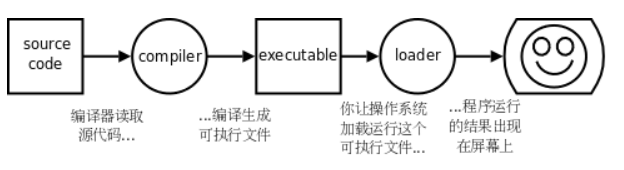
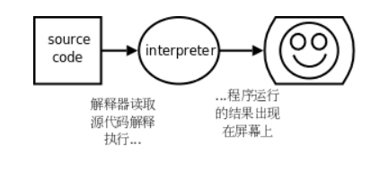
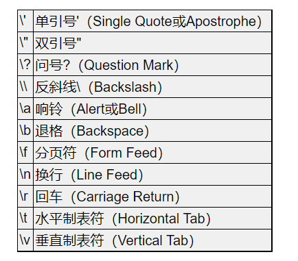
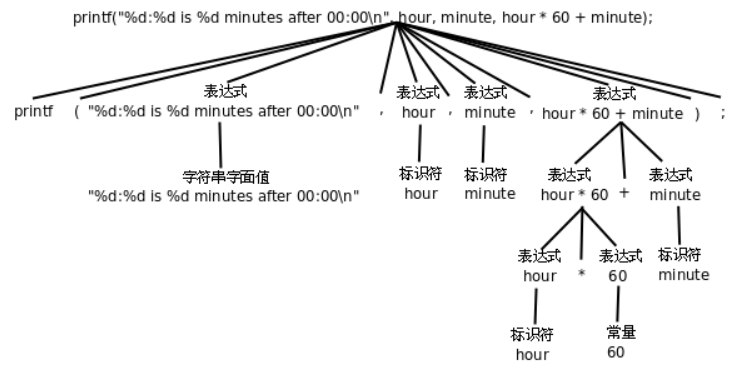
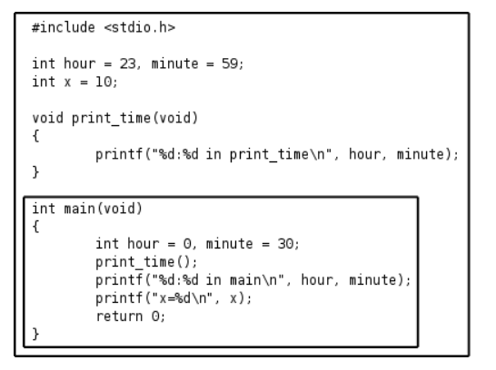
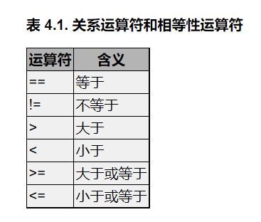
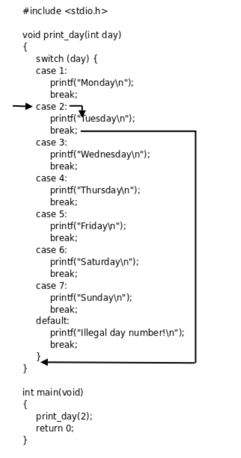
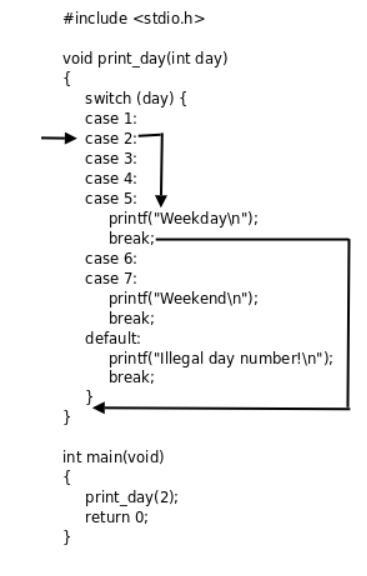

## 前言

**学习目标**

1. 具备扎实的 C 编程能力
2. 熟练使用 Linux 系统
3. 深入理解计算机体系结构、指令集、操作系统和设备驱动程序

学习编程有两种 Approach，一种是 Bottom Up，一种是 Top Down，各有优缺点，需要两者结合起来。

大学计算机专业的基础课与专业课：

1. 微积分，线性代数，随机、离散、组合、自动机、编译原理、操作系统、计算机组成原理等
2. C/C++、Java、数据库、网络、软件工程、计算机图形学等

**参考书籍**

1. How To Think Like A Computer Scientist: Learning with C++
2. Programming from the Ground Up: An Introduction to Programming using Linux Assembly Language

**对于大学教学的反思**

1. 学习一门基础学科课程之前，需要了解这门课在后来的专业课中发挥的作用，比如数学等，理解这门基础课的作用，为什么学习
2. 不同的课程之间是有联系的，不可独立看待人为划分的学科界限，需要联系之前所学
3. 注意前置知识的学习积累，比如数学、编译原理、操作系统和计算机体系结构

**特点**

1. 不孤立地讲 C 语言，而是和编译原理、操作系统、计算机体系结构结合起来讲（**以 C 语言为载体，主讲计算机的原理和程序的原理**）
2. 强调**基本概念和基本原理**，在编排顺序上非常重视概念之间的依赖关系，每次引入一个新的概念，只依赖于前面章节已经讲过的概念，而绝不会依赖后面章节要讲的概念。
3. 尽量做到每个知识点直到要用的时候才引入，过早引入一个知识点，讲完了又不用它，读者很快就会遗忘，这是不符合认知规律的。

**学前要求**

1. 熟悉基本的 Linux 系统操作（基本命令，会安装系统和软件包），《鸟哥的 Linux 私房菜》

2. 高中以上数学和英语基础

3. 多思考，理清概念之间的依赖关系

4. 数学是程序员最重要的修养，计算机科学其实就是数学的一个分支，如果数学功底很差，日后还需恶补

**章节安排**

1. C 语言入门，介绍 C 语言基本语法，理解什么是程序，怎么写程序，编程思维
2. C 语言本质，结合计算机和操作系统的原理讲解 C 程序是怎么编译、链接、运行的，同时全面介绍 C 的语法
3. Linux 系统编程，介绍各种 Linux 系统函数和内核的工作原理

**开发环境**

选 Linux 操作系统而非 Windows，因为 C 语言是偏底层的编程语言，写好 C 程序需要对操作系统的工作原理很了解，操作系统也是用 C 写的，可以用 C 写应用程序直接使用操作系统提供的接口。Linux 作为一个开源的操作系统，可以查看源码，文档，社区非常强大。而 Windows 是一种封闭的操作系统，不具备这些特点。

Windows 上的开发工具和各种集成开发环境（IDE，Integrated Development Environment）绑在一起，例如 Visual Studio、Eclipse 等，不建议初学者使用 IDE。因为 IDE 等工具屏蔽了编译器、链接器、Makefile 的概念，命令行，但这些是初学编程就应该建立起来的基本概念。

编译器、链接器和 C 语言的语法有密切的关系，不了解编译器、链接器的工作原理，也不可能真正掌握 C 的语法。

抓住概念的定义和概念之间的关系。思考题要求读者系统地总结当前小节的知识，结合以前的知识，并经过一定的推理，然后作答。

## 第一部分

### 计算机基本概念

本质上计算机是由数字电路组成的运算机器，只能对数字（二进制数）做运算。所有不同类型的数据都可以被转化为数字表示后交给计算机去处理，指令在计算机内部也是二进制数字表示的。

#### 程序

程序：程序由一系列指令（Instruction）组成的一个指令集合，每条指令都指示计算机做某种具体运算的命令。

指令的类别：

1. 输入（Input），从键盘、文件或者其它设备获取数据。
2. 输出（Output），把数据显示到屏幕，或者存入一个文件，或者发送到其它设备。
3. 基本运算，执行最基本的数学运算（加减乘除）和数据存取。
4. 测试和分支，测试某个条件，然后根据不同的测试结果执行不同的后续指令。
5. 循环，重复执行一系列操作。

**编写程序可以说是这样一个过程：把复杂的任务分解成子任务，把子任务再分解成更简单的任务，层层分解，直到最后简单得可以用以上指令来完成。**

#### 编程语言

编程语言分为：低级语言（Low-level Language）和高级语言（High-level Language）。

低级语言：直接用计算机能识别的**指令**编写程序。

1. 机器语言（Machine Language）
2. 汇编语言（Assembly Language）

高级语言：用**语句**（Statement）编写程序，语句是计算机指令的抽象表示。

1. C、C++
2. Java
3. Python...

早期编程直接使用机器语言编写，需要查大量的表格来确定每个数字表示什么意思，编写出来的程序很不直观，而且容易出错。由此，产生了汇编语言，把机器语言中一组一组的数字用助记符（Mnemonic）表示，直接用这些助记符写出汇编程序，然后让汇编器（Assembler）去查表把助记符替换成数字，也就把汇编语言翻译成了机器语言。

**同一个语句的三种表示**

| 编程语言 | 表示形式                                                           |
| -------- | ------------------------------------------------------------------ |
| C 语言   | a=b+1;                                                             |
| 汇编语言 | mov 0x804a01c, %eax <br />add $0x1, %eax <br />mov %eax, 0x804a018 |
| 机器语言 | a1 1c a0 04 08 <br />83 c0 01 <br />a3 18 a0 04 08                 |

上面表格得出的结论：

- **汇编语言和机器语言的指令是一一对应的，汇编语言有三条指令，机器语言也有三条指令，汇编器就是做一个简单的替换工作**，例如在第一条指令中，把`movl ?, %eax`这种格式的指令替换成机器码`a1 ?`，?表示一个地址，在汇编指令中是`0x804a01c`，转换成机器码之后是`1c a0 04 08`。
- **C 语言的语句和低级语言的指令之间在数量上不是简单的一一对应关系**，一条`a=b+1;`语句要翻译成三条汇编或机器指令，这个过程称为**编译（Compile）**，由编译器（Compiler）来完成。（编译需要花费时间）

C 语言的可移植的（Portable）或称为平台无关的（Platform Independent）。（平台：可以指计算机体系结构（Architecture），也可以指操作系统（Operating System），也可以指开发平台（编译器、链接器等））

不同的计算机体系结构有不同的指令集（Instruction Set），可以识别的机器指令格式是不同的，直接用某种体系结构的汇编或机器指令写出来的程序只能在这种体系结构的计算机上运行，然而各种体系结构的计算机都有各自的 C 编译器，可以把 C 程序编译成各种不同体系结构的机器指令，这意味着用 C 语言写的程序只需稍加修改甚至不用修改就可以在各种不同的计算机上编译运行。

只有和硬件关系密切的少数程序（例如驱动程序）才会用到低级语言。

**编译执行**的过程：编写源码文件，编译源码文件，生成可执行文件，操作系统加载并执行可执行文件，计算机硬件执行指令，给出执行输出结果。

编译的过程并不执行程序，而是把源代码全部翻译成机器指令，再加上一些描述信息，生成一个新的文件。（program.c=>a.out）



**解释执行**

比如 Shell 脚本就是解释执行的。

```shell
#! /bin/sh
VAR=1
VAR=$(($VAR+1))
echo $VAR

用Shell程序/bin/sh解释执行这个脚本，结果如下：
/bin/sh script.sh    //  /bin/sh称为解释器（Interpreter），它把脚本中的每一行当作一条命令解释执行，而不需要先生成包含机器指令的可执行文件再执行。
```

定义 Shell 变量`VAR`的初始值是 1，然后自增 1，然后打印`VAR`的值。

解释器（Interpreter），它把脚本中的每一行当作一条命令解释执行，而不需要先生成包含机器指令的可执行文件再执行



问题：解释型语言和编译型语言的不同。

总结：**程序**由*语句*或*指令*组成，计算机只能执行*低级语言*中的*指令*（汇编语言的指令要先转成机器码才能执行），*高级语言*要执行就必须先翻译成低级语言，翻译的方法有两种－－*编译*和*解释*，高级语言有一个好处是*平台无关性*。什么是*平台*？一种平台，就是一种*体系结构*，一种*指令集*，一种*机器语言*，这些都可看作是**一一对应**的，而高级语言和平台不是一一对应的，因此高级语言是*平台无关*的，**概念之间像这样的数量对应关系尤其重要**。那么编译和解释的过程有哪些不同？主要的不同在于什么时候翻译和什么时候执行。

#### 自然语言

自然语言（Natural Language）是人类讲的语言，比如汉语、英语等。

#### 形式语言

形式语言（Formal Language）是为了**特定应用**而**人为设计**的语言。例如数学中的数字和运算符号、化学家用的分子式、编程语言。

形式语言有**严格**的**语法（Syntax）规则**，例如，3+3=6 是一个语法正确的数学等式，而 3=+6\$则不是，$\ce{H2O}$是一个正确的分子式，而$\ce{2Zz}$则不是。

语法（Syntax）规则包含**词法规则（Token）**和**结构规则（Structure）**两部分（结构是指 Token 的排列方式）。Token 的概念相当于自然语言中的单词和标点、数学式中的数和运算符、化学分子式中的元素名和数字。

**关于 Token 的规则称为词法（Lexical）规则，而关于结构的规则称为语法（Grammar）规则。**

> Syntax 和 Grammar 通常都翻译成“语法”，这让初学者非常混乱，**Syntax 的含义其实包含了 Lexical 和 Grammar 的规则，还包含一部分语义的规则**，例如在 C 程序中变量应先声明后使用。即使在英文的文献中 Syntax 和 Grammar 也常混用，在有些文献中 Syntax 的含义不包括 Lexical 规则，只要注意上下文就不会误解。

3=+6\$的问题：

1. 词法规则方面的错误，$不是一个合法的数也不是一个事先定义好的运算符（单词拼写错误）
2. 结构规则方面的错误，加号和等号都是合法的运算符，但是不能在等号之后紧跟加号（单词间的放置顺序不对）

**要搞清楚每个词（Token）是什么意思，而且必须搞清楚整个句子的结构是什么样的**

形式语言和自然语言有很多共同之处，包括 Token、结构和语义，也有不一样的地方：

1. 歧义性（Ambiguity），自然语言充满歧义，人们通过上下文的线索和自己的常识来解决这个问题。形式语言的设计要求是清晰的、毫无歧义的，这意味着每个语句都必须有确切的含义而不管上下文如何。
2. 冗余性（Redundancy），为了消除歧义减少误解，自然语言引入了相当多的冗余。结果是自然语言经常说得啰里啰嗦，而形式语言则更加紧凑，极少有冗余。
3. 与字面意思的一致性

计算机程序是毫无歧义的，字面和本意高度一致，能够完全通过对 Token 和结构的分析加以理解。

关于阅读程序（包括其它形式语言）的建议。首先请记住形式语言远比自然语言紧凑，所以要多花点时间来读。其次，结构很重要，从上到下从左到右读往往不是一个好办法，而应该学会在大脑里解析：识别 Token，分解结构。最后，请记住细节的影响，诸如拼写错误和标点错误这些在自然语言中可以忽略的小毛病会把形式语言搞得面目全非。

#### 程序的调试

**时刻注意区分编译时和运行时（Run-time）这两个概念**，不仅在调试时需要区分这两个概念，在学习 C 语言的很多语法时都需要区分这两个概念，有些事情在编译时做，有些事情则在运行时做。

程序中的 Bug 分类：

1. 编译时错误，编译器只能编译语法完全正确的程序，否则将编译失败，无法生成可执行文件。只要有哪怕一个很小的语法错误，编译器就会输出一条错误提示信息然后停止编译。
2. 运行时错误，编译器检查不出这类错误，仍然可以生成可执行文件，但在运行时会出错而导致程序崩溃。
3. 逻辑错误和语义错误，如果程序里有逻辑错误，编译和运行都会很顺利，看上去也不产生任何错误信息，但是程序执行的结果并不是开发者想要的（程序的意思（即语义）是错的）。

### 程序的基本概念

#### 基础结构

```main.c
#include <stdio.h>

/* main: generate some simple output */
// 注释可以跨行，也可以穿插在程序之中

int main(void)
{
  printf(/* comment2 */"Hello, world.\n");  // 把消息打印到屏幕，注意语句的末尾以;号（Semicolon）结束
  return 0;
}
```

```shell
gcc main.c
./a.out
Hello, world.
```

`gcc`是 Linux 平台的 C 编译器，编译后在当前目录下生成可执行文件`a.out`，直接在命令行输入这个可执行文件的路径就可以执行它。如果不想把文件名叫`a.out`，可以用`gcc`的`-o`参数自己指定文件名：

```shell
gcc main.c -o main
./main
Hello, world.
```

> 注意`main`是一个特殊的名字，C 程序总是从`main`里面的第一条语句开始执行的，在这个程序中是指`printf`这条语句。

编译器对于语法错误是零容忍的，如果你的程序有一点拼写错误，例如第一行写成了`stdoi.h`，在编译时会得到错误提示：

```
$ gcc main.c
main.c:1:19: error: stdoi.h: No such file or directory
...
```

有些时候编译器的提示信息不是`error`而是`warning`，例如把上例中的`printf("Hello, world.\n");`改成`printf(1);`然后编译运行：

```
gcc main.c
main.c: In function ‘main’:
main.c:7: warning: passing argument 1 of ‘printf’ makes pointer from integer without a cast
./a.out
Segmentation fault
```

这个警告信息是说**类型不匹配**，但勉强还能用。警告信息不是致命错误，编译仍然可以继续，如果整个编译过程只有警告信息而没有错误信息，仍然可以生成可执行文件。有些不重要的警告信息`gcc`默认是不提示的，但这些警告信息也有可能表明程序中有 Bug。_一个好的习惯是打开`gcc`的`-Wall`选项，也就是让`gcc`提示所有的警告信息，不管是严重的还是不严重的，然后把这些问题从代码中全部消灭_。比如把上例中的`printf("Hello, world.\n");`改成`printf(0);`然后编译运行：

```
gcc main.c
./a.out
```

编译既不报错也不报警告，一切正常，但是运行程序什么也不打印。如果打开`-Wall`选项编译就会报警告了：

```
gcc -Wall main.c
main.c: In function ‘main’:
main.c:7: warning: null argument where non-null required (argument 1)
```

#### 转义序列

由双引号（Double Quote）引起来的一串字符称为字符串字面值（String Literal），或者简称字符串。

C 语言规定了一些**转义序列（Escape Sequence）**，这里的`\n`并不表示它的字面意思，也就是说并不表示\和 n 这两个字符本身，而是合起来表示一个换行符（Line Feed）。



在字符串中表示单引号和问号，既可以使用转义序列`\'`和`\?`，也可以直接用字符'和?。而在字符串中要表示\ 和 “，则必须使用转义序列，因为\字符表示转义而不表示它的字面含义，"表示字符串的界定符而不表示它的字面含义。

转义序列有两个作用：一是把普通字符转义成特殊字符，例如把字母 n 转义成换行符；二是把特殊字符转义成普通字符，例如\和"是特殊字符，转义后取它的字面值。

几个控制字符:不能用键盘直接输入，因此采用\加字母的转义序列表示。

`\a`是响铃字符，在字符终端下显示这个字符的效果是 PC 喇叭发出嘀的一声，在图形界面终端下的效果取决于终端的实现

`\b`和按下退格键的效果相同

`\t`和按下 Tab 键的效果相同

`\v`用于在终端下定位表格的下一行

`\f`是分页符，主要用于控制打印机在打印源代码时提前分页，可以避免一个函数跨两页打印

`\n`和`\r`分别表示 Line Feed 和 Carriage Return，Line Feed 是跳到下一行，Carriage Return 是回到本行开头

现在 Windows 上的文本文件用`\r\n`做行分隔符，许多应用层网络协议（如 HTTP）也用`\r\n`做行分隔符，而 Linux 和各种 UNIX 上的文本文件只用`\n`做行分隔符。

字符串字面值中的空格也算一个字符，也会出现在输出结果中，而程序中别处的空格和 Tab 多一个少一个往往是无关紧要的，不会对编译的结果产生任何影响，例如不缩进不会影响程序的结果，`main`后面多几个空格也没影响，但是`int`和`main`之间至少要有一个空格分隔开：

```c
int main    (void)
{
printf("Hello, world.\n");
return 0;
}
```

不仅空格和 Tab 是无关紧要的，换行也是如此，甚至可以把整个程序写成一行，但是`include`必须单独占一行。

**好的代码风格要求缩进整齐，每个语句一行，适当留空行。**

#### 常量

常量（Constant），有字符（Character）常量、整数（Integer）常量、浮点数（Floating Point）常量和枚举常量。

```c
printf("character: %c\n integer: %d\n floating point: %f\n", 'a', 34, 3.14);
```

字符常量用**单引号**括起来，注意单引号**只能括一个字符**而不能像双引号那样括一串字符，字符常量也可以是一个转义序列，例如`'\n'`，这时虽然单引号括了两个字符，但实际上只表示一个字符。

**如果在字符常量中要表示双引号"和问号?，既可以使用转义序列`\"`和`\?`，也可以直接用字符"和?，而要表示'和\则必须使用转义序列。**

计算机中整数和小数的内部表示方式不同，因而在 C 语言中是两种不同的类型（Type），小数在计算机术语中称为浮点数。

`printf`中的第一个字符串称为**格式化字符串（Format String）**

格式化字符串中%号（Percent Sign）后面加上字母 c、d、f 分别表示**转换说明**（Conversion Specification）

- %c：字符型

- %d：整型

- %f：浮点型

转换说明只在格式化字符串中占个位置，并不出现在最终的打印结果中，这种用法通常叫做**占位符（Placeholder）**。

转换说明和转义序列有区别：**_转义序列是编译时处理的，而转换说明是在运行时调用`printf`函数处理的_**。

源文件中的字符串字面值是`"character: %c\ninteger: %d\nfloating point: %f\n"`，`\n`占两个字符，而编译之后保存在可执行文件中的字符串是`character： %c换行integer: %d换行floating point: %f换行`，`\n`已经被替换成一个换行符，而`%c`不变，然后在运行时这个字符串被传给`printf`，`printf`再把其中的`%c`、`%d`、`%f`解释成转换说明。

#### 变量

变量（Variable）是计算机存储器中的一块命名的空间，可以在里面存储一个值（Value），存储的值是可以随时变的。

变量也有不同的类型，变量的类型也决定了它所占的存储空间的大小。例如以下四个语句**定义**了四个变量`fred`、`bob`、`jimmy`和`tom`，它们的类型分别是字符型、整型、浮点型：

```c
char fred;
int bob;
float jimmy;
double tom;
int hour, minute;
```

C 语言中的声明（**Declaration**）有:

1. 变量声明
2. 函数声明
3. 类型声明

定义（Definition）:**如果一个变量或函数在声明的同时还要求编译器为它分配存储空间**，那么也可以称为定义。定义是声明的一种。**一些变量声明不分配存储空间，只属于声明，而不是定义。**

函数的定义和声明也是这样区分的，分配存储空间的函数声明可以称为函数定义。

类型声明，声明一个类型是不分配存储空间的，但似乎叫“类型定义”听起来也不错，所以在本书中“类型定义”和“类型声明”表示相同的含义。

声明和语句类似，也是以;号结尾的，但是在语法上声明和语句是有区别的，**语句只能出现在{}括号中，而声明既可以出现在{}中也可以出现在所有{}之外。**

浮点型：

1. `float`是单精度浮点型
2. `double`是双精度浮点型
3. `long double`是精度更高的浮点型

**变量名、函数名、宏定义、结构体成员名**必须以字母或下划线\_（Underscore）开头，后面可以跟若干个字母、数字、下划线，但不能有其它字符。在 C 语言中这些统称为标识符（Identifier）

在 C 语言中有些单词有特殊意义，不允许用作标识符，这些单词称为**关键字（Keyword）或保留字（Reserved Word）**。

**_一般来说应避免使用以下划线开头的标识符_**，以下划线开头的标识符只要不和 C 语言关键字冲突的都是合法的，但是往往被编译器用作一些功能扩展，**C 标准库**也定义了很多以下划线开头的标识符，所以除非你对编译器和 C 标准库特别清楚，一般应避免使用这种标识符，以免造成命名冲突。

**_理解一个概念不是把定义背下来就行了，一定要理解它的外延和内涵，也就是什么情况属于这个概念，什么情况不属于这个概念，什么情况虽然属于这个概念但一般推荐的做法（Best Practice）是要尽量避免这种情况，这才算是真正理解了。_**

#### 赋值

赋值（Assignment）：把值存到变量所表示的存储空间里。

```c
char firstletter;
int hour, minute;
firstletter = 'a';   /* give firstletter the value 'a' */
hour = 11;           /* assign the value 11 to hour */
minute = 59;         /* set minute to 59 */


char firstletter = 'a';
int hour = 11, minute = 59;
```

注意变量一定要先声明后使用，编译器必须先看到变量声明，才知道`firstletter`、`hour`和`minute`是变量名，各自代表一块存储空间。

变量声明中的类型表明这个变量代表多大的一块存储空间，这样编译器才知道如何读写，读取多大的存储空间才是完整的。

i=i+1 在 C 语言中示把变量`i`的存储空间中的值取出来，再加上 1，得到的结果再存回`i`的存储空间中。

变量的定义和赋值也可以一步完成，这称为变量的初始化（Initialization）。在初始化语句中，等号右边的值叫做 Initializer。

**_初始化是一种特殊的声明，而不是一种赋值语句_。**（两者是不同的）

如果所赋的值和变量的类型不符会导致编译器报警告或报错（这是一种语义错误）。

变量的最小存储单位是字节（Byte），在 C 语言中`char`型变量占一个字节，其它类型的变量占多少字节在不同平台上有不同的规定。

#### 表达式

\+ - \* /称为运算符（Operator），参与运算的常量和变量称为操作数（Operand）。

> **“An expression is a sequence of operators and operands that specifies computation of a value”，表达式的定义**，即**表达式是由一系列运算符（operators）和操作数（operands）组成的。**
>
> 在 C 语言中，常量、变量、函数调用以及按 C 语言语法规则用**运算符**把**运算数**连接起来的式子都是合法的表达式 。
>
> 算术表达式 = 算术运算符 + 运算对象赋值表达式 = 赋值运算符 + 运算对象复合赋值表达式 = 复合赋值运算符 + 运算对象自增、自减表达式 = 自增、自减运算符 + 运算对象逗号表达式 = 逗号运算符 + 运算对象关系表达式 = 关系运算符 + 运算对象逻辑表达式 = 逻辑运算符 + 运算对象条件表达式 = 条件运算符 + 运算对象
>
> 变量名、常量、对于返回值不为 void 的函数调用也都是表达式，表达式的只就是他们的值或者返回值。

**_任何表达式都有值和类型两个基本属性_。**表达式`total_minute = hour * 60 + minute`的类型是`int`，它的值是多少呢？C 语言规定**等号运算符的计算结果就是等号左边被赋予的那个值**，所以这个表达式的值和`hour * 60 + minute`的值相同，也和`total_minute`的值相同。

如果一个表达式中出现多个等号，不是从左到右计算而是从右到左计算，例如：

```c
int total_minute, total;
total = total_minute = hour * 60 + minute;
```

计算顺序是先算`hour * 60 + minute`得到一个结果，然后算右边的等号，就是把`hour * 60 + minute`的结果赋给变量`total_minute`，这个结果同时也是整个表达式`total_minute = hour * 60 + minute`的值，再算左边的等号，即把这个值再赋给变量`total`。同样**优先级的运算符是从左到右计算还是从右到左计算称为运算符的结合性**（Associativity）。+ - \* /是左结合的，等号是右结合的。

**操作符**


**表达式实例**

```c
/* 变量常量表达式 */
sum;
10.5;
PI;
/* 算术表达式 */
a + b;
a - b;
+c;
a;
* b + 'A';
a / b - c + 10;
i++ + i++ + ++i;

/* 赋值表达式 */
a = b;
a*= b;;
a = b = c = 10;
a = (b=4) / (c=2);

/* 逗号表达式 */
1+2, 3+4;
(10, a*5), a+10;

/* 关系表达式 */
x == y;
x <= y;
x != y;

/* 逻辑表达式 */
10 && 200 || 1;
(a>b) && (!0);

/* 复合表达式 */
x = ( y = (a + b), z=10);

/* 表达式的应用 */
if( !100 )
{//!100为逻辑表达式 printf("expression show!");
	for(int i=10; i<10; i++)//for包含3个表达式，分别为i=10 i<10 i++ printf("expression show!");
	while( 1 ) //1也是一个表达式{
	printf("death loop!");
}

// 根据这些语法规则进一步组合可以写出更复杂的语句，比如在一条语句中完成计算、赋值和打印功能：
printf("%d:%d is %d minutes after 00:00\n", hour, minute, total_minute = hour * 60 + minute);
```

```c
printf("%d:%d is %d minutes after 00:00\n", hour, minute, hour * 60 + minute);
```



根据语法规则组合出来的表达式在语义上并不总是正确的，例如：

```c
minute + 1 = hour;
```

等号左边的表达式要求表示一个存储位置而不是一个值，这是等号运算符和+ - \* /运算符的又一个显著不同。有的表达式既可以表示一个存储位置也可以表示一个值，而有的表达式只能表示值。

例如`minute + 1`这个表达式就不能表示存储位置，放在等号左边是语义错误。表达式所表示的存储位置称为左值（lvalue）（允许放在等号左边），而以前所说的表达式的值也称为右值（rvalue）（只能放在等号右边）。_有的表达式既可以做左值也可以做右值，而有的表达式只能做右值_。目前学过的表达式中只有变量可以做左值。

```c
hour = 11;
minute = 59;
printf("%d and %d hours\n", hour, minute / 60);  // 11 and 0 hours

printf("%d hours and %d percent of an hour\n", hour, minute * 100 / 60);  // 11 hours and 98 percent of an hour
printf("%d and %f hours\n", hour, minute / 60.0); // 11 and 0.98 hours
```

在第二个`printf`中，表达式是`minute / 60.0`，60.0 是`double`型的，/运算符要求左右两边的操作数类型一致，而现在并不一致。C 语言规定了一套隐式类型转换规则，在这里编译器自动把左边的`minute`也转成`double`型来计算，整个表达式的值也是`double`型的，在格式化字符串中用`%f`转换说明与之对应。

#### 语句

语句指的是当程序运行时执行某个动作的语法结构。它改变变量的值，产生输出，或处理输入。C 语言包括 4 类语句：

1. 表达式语句

   表达式语句是最简单的一种语句，在表达式的末尾加分号就形成了一个表达式语句。表达式语句有以下形式：

   _expression_;

   最常用的表达式语句是函数调用语句和赋值语句。函数调用语句也属于表达式语句，因为函数调用(如 sin(x) )也属于表达式的一种。赋值语句的作用是将等号左边变量的值改成等号右边表达式的值。赋值语句最常用的形式为：

   _variable = expression;_

2. 语句块

   用{ }将一系列语句括起来使其大功能上相当于一条语句，这就是语句块。语句块中可以有变量声明，声明必须位于块的开始。

3. 空语句

   只有一个分号的语句，它什么也不做。

4. 控制语句

   循环语句

   - while loops
   - for loops
   - do-while loops

   选择/条件语句

   - if
   - if-else
   - switch
   - else-if

   特殊语句。

   - return
   - continus
   - break

#### 字符

字符常量或字符型变量可以当作整数参与运算。

```c
printf("%c\n", 'a'+1);   // b
```

符号在计算机内部也用数字表示，每个字符在计算机内部用一个整数表示，称为字符编码（Character Encoding），目前最常用的是 ASCII 码（American Standard Code for Information Interchange，美国信息交换标准码）。

字符也可以用 ASCII 码转义序列表示，这种转义序列由\加上 1\~3 个八进制数字组成，或者由`\x`或大写`\X`加上 1\~2 个十六进制数字组成，可以用在字符常量或字符串字面值中。例如`'\0'`表示 NUL 字符（Null Character），`'\11'`或`'\x9'`表示 Tab 字符，`"\11"`或`"\x9"`表示由 Tab 字符组成的字符串。注意`'0'`的 ASCII 码是 48，而`'\0'`的 ASCII 码是 0，两者是不同的。

#### 数学函数方法

在 C 语言中函数调用表达式的值称为函数的返回值（Return Value）。

```c
#include <math.h>  // 数学函数相关方法库
#include <stdio.h>

int main(void)
{
	double pi = 3.1416;
	printf("sin(pi/2)=%f\nln1=%f\n", sin(pi/2), log(1.0));
	return 0;
}

 /*
	* $ gcc main.c -lm
	* $ ./a.out
	* sin(pi/2)=1.000000
	* ln1=0.000000
	*/
```

函数中的术语：参数（Argument）、函数（Function）、函数调用（Function Call）、函数名（Function Designator）。函数调用也是一种表达式。函数调用运算符——()，

程序第一行的#号和`include`表示包含一个头文件（Header File），后面尖括号（Angel Bracket）中就是文件名（这些头文件通常位于`/usr/include`目录下）。头文件中声明了程序中使用的库函数，根据先声明后使用的原则，要使用`printf`函数必须包含`stdio.h`，要使用数学函数必须包含`math.h`，如果什么库函数都不使用就不必包含任何头文件，例如写一个程序`int main(void){int a;a=2;return 0;}`，不需要包含头文件就可以编译通过。

使用`math.h`中声明的库函数还有一点特殊之处，`gcc`命令行必须加`-lm`选项，因为数学函数位于`libm.so`库文件中（这些库文件通常位于`/lib`目录下），`-lm`选项告诉编译器，程序中用到的数学函数要到这个库文件里找。本书用到的大部分库函数（例如`printf`）位于`libc.so`库文件中，使用`libc.so`中的库函数在编译时不需要加`-lc`选项，当然加了也不算错，因为这个选项是`gcc`的默认选项。

#### Side Effect

一些函数调用是为了获得函数的返回值，一些则不在意函数的返回值，如 printf 函数。调用`printf`不是为了得到它的返回值，而是为了利用它所产生的副作用（Side Effect）－－打印。_C 语言的函数可以有 Side Effect，这一点是它和数学函数在概念上的根本区别_。

**改变计算机存储单元里的数据或者做输入输出操作都算 Side Effect。**

C 标准包含两部分：

1. 描述 C 的语法
2. 描述 C 标准库

C 标准库定义了一组标准头文件，每个头文件中包含一些相关的函数声明、变量声明、类型声明和宏定义。

要在一个平台上支持 C 语言，不仅要实现 C 编译器，还要实现 C 标准库，这样的实现才算符合 C 标准。不符合 C 标准的实现也是存在的，例如很多单片机的 C 语言开发工具中只有 C 编译器而没有完整的 C 标准库。

#### 自定义函数

函数的定义：

```
返回值类型 函数名(参数列表)       // 函数头  + 下面的函数体
{
	变量声明、类型声明或函数声明
	...
  语句列表项
	语句
	...
}
```

**“函数定义”和“函数声明”**

函数声明的格式是：返回值类型 函数名(参数列表);

`main`函数的返回值是返回给操作系统的，因为`main`函数是被操作系统调用的，**通常**程序执行成功就返回 0，在执行过程中出错就返回一个非零值。比如将`main`函数中的`return`语句改为`return 4;`再执行它，执行结束后可以在 Shell 中看到它的退出状态（Exit Status）：

```shell
$ ./a.out
11 and 0 hours
$ echo $?
4
```

`$?`是 Shell 中的一个特殊变量，表示上一条命令的退出状态。

其实操作系统在调用`main`函数时是传参数的，`main`函数最标准的形式应该是`int main(int argc, char *argv[])`，如果不使用系统传进来的两个参数也可以写成`int main(void)`。但除了这两种形式之外，定义`main`函数的其它写法都是错误的或不可移植的。

区分：**函数声明、函数定义、函数原型（Prototype）**

函数原型：

```c
void threeline(void);  // 声明了一个函数的名字、参数类型和个数、返回值类型，这称为函数原型，在代码中可以单独写一个函数原型，后面加;号结束，而不写函数体
```

**这种写法只能叫函数声明而不能叫函数定义，只有带函数体的声明才叫定义。**只有声明并分配存储空间的变量声明才叫变量定义，函数也是一样。

没有函数体的函数声明的作用：它为编译器提供了有用的信息，编译器在翻译代码的过程中，只有先见到函数原型（不管带不带函数体）之后才知道这个函数的名字、参数类型和返回值，这样碰到函数调用时才知道怎么生成相应的指令，所以函数原型必须出现在函数调用之前，这也是遵循“先声明后使用”的原则。

```c
#include <stdio.h>

void newline(void)
{
	printf("\n");
}

void threeline(void)
{
	newline();
	newline();
	newline();
}

int main(void)
{
	printf("Three lines:\n");
	threeline();
	printf("Another three lines.\n");
	threeline();
	return 0;
}
```

在上面的例子中，`main`调用`threeline`，`threeline`再调用`newline`，要保证每个函数的原型出现在调用之前，就只能按先`newline`再`threeline`再`main`的顺序定义了。如果使用不带函数体的声明，则可以改变函数的定义顺序：

```c
#include <stdio.h>

void newline(void);
void threeline(void);

int main(void)
{
	...
}

void newline(void)
{
	...
}

void threeline(void)
{
	...
}
```

并非所有函数声明都包含完整的函数原型，例如`void threeline();`这个声明并没有明确指出参数类型和个数，这个声明提供给编译器的信息只有函数名和返回值类型。如果在这样的声明之后调用函数，编译器不知道参数的类型和个数，就不会做语法检查，所以很容易引入 Bug。

如果在调用函数之前没有声明，编译器会报警告，但仍然能编译通过，运行结果也对。

```c
#include <stdio.h>

int main(void)
{
	printf("Three lines:\n");
	threeline();
	printf("Another three lines.\n");
	threeline();
	return 0;
}

void newline(void)
{
	printf("\n");
}

void threeline(void)
{
	newline();
	newline();
	newline();
}
```

报警告：

```
$ gcc main.c
main.c:17: warning: conflicting types for ‘threeline’
main.c:6: warning: previous implicit declaration of ‘threeline’ was here
```

这里涉及函数的隐式声明（Implicit Declaration），在`main`函数中调用`threeline`时并没有声明它，编译器认为此处隐式声明了`int threeline(void);`，**隐式声明的函数返回值类型都是`int`**，由于调用这个函数时没有传任何参数，所以编译器认为这个隐式声明的参数类型是`void`，这样函数的参数和返回值类型都确定下来了，编译器根据这些信息为函数调用生成相应的指令。然后编译器接着往下看，看到`threeline`函数的原型是`void threeline(void)`，和先前的隐式声明的返回值类型不符，所以报警告。好在也没用到这个函数的返回值，所以执行结果仍然正确。

函数调用是都有值和类型两个基本属性，而 void newline(void)这样的函数并不是说函数没有返回值，而是返回值是空值。

#### 形参实参

定义带参数的函数，需要在函数定义中指明参数的个数和每个参数的类型。定义变量时可以把相同类型的变量列在一起，而定义参数却不可以。

```c
void print_time(int hour, minute)  // 错误的形参定义方式
{
	printf("%d:%d\n", hour, minute);
}

void print_time(int hour, int minute)  // 正确
{
	printf("%d:%d\n", hour, minute);
}
```

形参（Parameter）和实参（Argument）。函数定义中有几个形参，在调用时就要传几个实参，不能多也不能少，每个参数的类型也必须对应上。

每次调用`printf`传的实参个数，因为 C 语言规定了一种特殊的参数列表格式，用命令`man 3 printf`可以查看到`printf`函数的原型：

```c
int printf(const char *format, ...);
```

第一个参数是`const char *`类型的，后面的...可以代表 0 个或任意多个参数，这些参数的类型也是不确定的，这称为可变参数（Variable Argument）。

#### 变量类别

函数中定义的变量称为局部变量（Local Variable），形参也是一种局部变量。

- 一个函数中定义的变量不能被另一个函数使用
- 每次调用函数时局部变量都表示不同的存储空间，局部变量在每次函数调用时分配存储空间，在每次函数返回时释放存储空间

全局变量定义在所有的函数体之外，它们在程序开始运行时分配存储空间，在程序结束时释放存储空间，在任何函数中都可以访问全局变量。**_虽然全局变量用起来很方便，但一定要慎用，能用函数传参代替的就不要用全局变量_。**

全局变量和局部变量重名的情况：



第一次调用`print_time`打印的是全局变量的值，第二次直接调用`printf`打印的则是`main`函数局部变量的值。

在 C 语言中每个标识符都有特定的作用域，全局变量是定义在所有函数体之外的标识符，它的作用域从定义的位置开始直到源文件结束，而`main`函数局部变量的作用域仅限于`main`函数之中。

初始化一个变量时用常量做 Initializer，也可以用表达式做 Initializer。**_局部变量可以用类型相符的任意表达式来初始化，而全局变量只能用常量表达式（Constant Expression）初始化_。**

初始化全局变量`pi`：

```c
double pi = 3.14 + 0.0016;  // 合法

double pi = acos(-1.0);  // 不合法

int minute = 360;
int hour = minute / 60;  // 这样初始化全局变量也是不合法的 虽然在编译时计算出hour的初始值是可能的，但是minute / 60不是常量表达式，不符合语法规定，所以编译器不必想办法去算这个初始值。
```

程序开始运行前要用适当的值来初始化全局变量，所以初始值必须保存在编译生成的可执行文件中，因此初始值在*编译时*就要计算出来，然而上面第二种 Initializer 的值必须在程序*运行时*调用`acos`函数才能得到，所以不能用来初始化全局变量。

**如果全局变量在定义时不初始化则初始值是 0，如果局部变量在定义时不初始化则初始值是不确定的。所以，_局部变量在使用之前一定要先赋值_，如果基于一个不确定的值做后续计算肯定会引入 Bug。**

> 错误认知：函数中的局部变量具有一直存在的固定的存储空间，每次函数调用时使用它，返回时也不释放，再次调用函数时它应该还能保持上次的值

**验证局部变量存储空间的分配和释放**：

```c
#include <stdio.h>

void foo(void)
{
	int i;
	printf("%d\n", i);
	i = 777;
}

int main(void)
{
	foo();
	foo();
	return 0;
}

```

程序运行结果如下：

```
134518128
777
```

看上去，上面的执行结果并不满足：_局部变量的存储空间在每次函数调用时分配，在函数返回时释放_ 和 _全局变量不初始化才是 0 啊，局部变量不初始化则初值不确定_ 这两个结论。

新代码：

```c
#include <stdio.h>

void foo(void)
{
	int i;
	printf("%d\n", i);
	i = 777;
}

int main(void)
{
	foo();
	printf("hello\n");
	foo();
	return 0;
}


```

结果是：

```
134518200
hello
0
```

其实局部变量不初始化，变量的值不确定，并不代表变量上存储的不能是 0，没有说不确定值不能是上次调用赋的值。

**“不确定”的准确含义是：每次调用这个函数时局部变量的初值可能不一样，运行环境不同，函数的调用次序不同，都会影响到局部变量的初值。**

**在运用逻辑推理时一定要注意，_不要把必要条件（Necessary Condition）当充分条件（Sufficient Condition）_**

例如，不要看到第二次调用打印 777 就下结论“函数中的局部变量具有一直存在的固定的存储空间，每次函数调用时使用它，返回时也不释放，再次调用函数时它应该还能保持上次的值”，这个结论倒是能推出 777 这个结果，但反过来由 777 这个结果却不能推出这样的结论。**所以说 777 这个结果是该结论的必要条件，但不是充分条件**。也不要看到第二次调用打印 0 就断定“局部变量未初始化则初值为 0”，**0 这个结果是该结论的必要条件，但也不是充分条件**。

具体原因涉及函数的调用过程。

函数声明也可以写在局部作用域：

```c
int main(void)
{
	void print_time(int, int);  // 函数声明  ，也是局部的，函数声明时参数可以只写类型而不起名
	print_time(23, 59);
	return 0;
}
```

> 注意，虽然在一个函数体中可以声明另一个函数，但不能定义另一个函数，C 语言不允许嵌套定义函数。但`gcc`的扩展特性允许嵌套定义函数

#### if 语句

```c
if (x != 0) {
	printf("x is nonzero.\n");
}

if (x != 0)
	printf("x is nonzero.\n");
```

x != 0 是控制表达式（Controlling Expression）如果条件成立，则{}中的语句被执行，否则{}中的语句不执行，直接跳到}后面。



1. 如果表达式所表示的比较关系成立则值为真（True），否则为假（False），在 C 语言中分别用`int`型的 1 和 0 表示。如果变量`x`的值是-1，那么`x>0`这个表达式的值为 0，`x>-2`这个表达式的值为 1
2. 这些运算符的两个操作数应该是相同类型的，两边都是整型或者都是浮点型可以做比较，但两个字符串不能做比较
3. ==和!=称为相等性运算符（Equality Operator），其余四个称为关系运算符（Relational Operator），相等性运算符的优先级低于关系运算符

总结一下，`if (x != 0) { ... }`这个语句的计算顺序是：首先求`x != 0`这个表达式的值，如果值为 0，就跳过{}中的语句直接执行后面的语句，如果值为 1，就先执行{}中的语句，然后再执行后面的语句。事实上控制表达式取任何非 0 值都表示真值，例如`if (x) { ... }`和`if (x != 0) { ... }`是等价的，如果`x`的值是 2，则`x != 0`的值是 1，但对于`if`来说不管是 2 还是 1 都表示真值。

**在 C 语言中，任何允许出现语句的地方既可以是由 ; 号结尾的一条语句，也可以是由{}括起来的若干条语句或声明组成的语句块（Statement Block）**语句块的}后面不需要加 ; 号。如果}后面加了;号，则这个;号本身又是一条新的语句了，在 C 语言中一个单独的;号表示一条空语句（Null Statement）。

语句块中定义局部变量：

```c
void foo(void)
{
	int i = 0;
	{
		int i = 1;
		int j = 2;
		printf("i=%d, j=%d\n", i, j);
	}
	printf("i=%d\n", i); /* cannot access j here */
}
```

每次进入语句块时为变量`j`分配存储空间，每次退出语句块时释放变量`j`的存储空间。语句块也有自己的作用域。

```c
if (x % 2 == 0)
	printf("x is even.\n");
else
	printf("x is odd.\n");


if (x > 0)
	printf("x is positive.\n");
else if (x < 0)
	printf("x is negative.\n");
else
	printf("x is zero.\n");
```

C 语言规定%运算符的两个操作数必须是整型的。如果操作数中有负数，C99 规定，如果`a`和`b`是整型，`b`不等于 0，则表达式`(a/b)*b+a%b`的值总是等于`a`。结论：**_%运算符的结果总是与被除数同号_**

C 语言规定，**_`else`总是和它上面最近的一个`if`配对_**。

```c
if (A)
	if (B)
		C;
else
	D;


if (A)
	if (B)
		C;
	else
		D;
```

`else`和`if (B)`配对。

浮点型的精度有限，不适合用==运算符做精确比较。

在 C 语言中，`a<b<c`不表示`b`既大于`a`又小于`c`。

```c
if (a < b) {
	if (b < c) {
		printf("b is between a and c.\n");
	}
}

if (a < b && b < c) {  // 逻辑与（Logical AND）运算符表示这两个条件同时成立
	printf("b is between a and c.\n");
}
```

C 语言还提供了逻辑或（Logical OR）运算符，写成两个|线（Pipe Sign），逻辑非（Logical NOT）运算符，写成一个!号（Exclamation Mark）。

在编程语言中表示真和假的数据类型叫做布尔类型，在 C 语言中通常用`int`型来表示，非 0 表示真，0 表示假。C99 也定义了专门的布尔类型`_Bool`，但目前没有被广泛使用。

一些布尔代数定理：

> AND（与）用\*号表示，OR（或）用+号表示，NOT（非）用 ¬ 表示，变量`x`、`y`、`z`的值可能是 0 也可能是 1。
>
> ¬¬x=x
>
> x\*0=0 x+1=1
>
> x\*1=x x+0=x
>
> x\*x=x x+x=x
>
> x\*¬x=0 x+¬x=1
>
> x*y=y*x x+y=y+x
>
> x*(y*z)=(x*y)*z x+(y+z)=(x+y)+z
>
> x*(y+z)=x*y+x*z x+y*z=(x+y)\*(x+z)
>
> x+x*y=x x*(x+y)=x
>
> x*y+x*¬y=x (x+y)\*(x+¬y)=x
>
> ¬(x*y)=¬x+¬y ¬(x+y)=¬x*¬y
>
> x+¬x*y=x+y x*(¬x+y)=x\*y
>
> x*y+¬x*z+y*z=x*y+¬x*z (x+y)*(¬x+z)_(y+z)=(x+y)_(¬x+z)

#### switch 语句

```
switch (控制表达式) {
  case 常量表达式： 语句列表
  case 常量表达式： 语句列表
  ...
  default： 语句列表
}
```



1. `case`后面跟表达式的必须是常量表达式，这个值和全局变量的初始值一样必须在编译时计算出来
2. C 语言规定`case`后面跟的必须是整型常量表达式
3. 进入`case`后如果没有遇到`break`语句就会一直往下执行，后面其它`case`或`default`分支的语句也会被执行到，直到遇到`break`，或者执行到整个`switch`语句块的末尾。



有时候编译器会对`switch`语句进行整体优化，使它比等价的`if/else`语句所生成的指令效率更高。

---

#### return 语句

在有返回值的函数中，`return`语句的作用是提供整个函数的返回值，并结束当前函数返回到调用它的地方。

在没有返回值的函数中也可以使用`return`语句，例如当检查到一个错误时提前结束当前函数的执行并返回：

```c
#include <math.h>

void print_logarithm(double x)
{
	if (x <= 0.0) {
		printf("Positive numbers only, please.\n");
		return;
	}
	printf("The log of x is %f", log(x));
}
```

注意：由于`x`是浮点数，应该与同类型的数做比较，所以写成 0.0。

```c
int is_even(int x)
{
	if (x % 2 == 0)
		return 1;
	else
		return 0;
}


int is_even(int x)
{
	return !(x % 2);
}


int i = 19;
if (is_even(i)) {
	/* do something */
} else {
	/* do some other thing */
}
```

函数的返回值应该这样理解：_函数返回一个值相当于定义一个和返回值类型相同的临时变量并用`return`后面的表达式来初始化_。例如上面的函数调用相当于这样的过程：

```c
int 临时变量 = !(x % 2);
函数退出，局部变量x的存储空间释放;

if (临时变量) { /* 临时变量用完就释放 */
	/* do something */
} else {
	/* do some other thing */
}
```

当`if`语句对函数的返回值做判断时，函数已经退出，局部变量`x`已经释放，所以不可能在这时候才计算表达式`!(x % 2)`的值，表达式的值必然是事先计算好了存在一个临时变量里的，然后函数退出，局部变量释放，`if`语句对这个临时变量的值做判断。注意，虽然函数的返回值可以看作是一个临时变量，但我们只是读一下它的值，读完值就释放它，而不能往它里面存新的值，换句话说，_函数的返回值不是左值，或者说函数调用表达式不能做左值_，因此下面的赋值语句是非法的：

```c
is_even(20) = 1;
```

**C 语言的传参规则是 Call by Value，按值传递，现在函数返回值也是按值传递的，即便返回语句写成`return x;`，返回的也是变量`x`的值，而非变量`x`本身，因为变量`x`马上就要被释放了。**

#### 增量式开发

增量式开发（Incremental）。**首先分析和分解问题，把大问题分解成小问题，再对小问题分别求解。**

示例：编一个程序求圆的面积，圆的半径以两个端点的座标(x1, y1)和(x2, y2)给出。

1. 由两个端点座标求半径的长度(平面上两点间距离的公式)：

   $distance= \sqrt[2]{(x_2-x_1)^2+(y_2-y_1)^2}$

   括号里的部分都可以用 C 语言表达式来表示，求平方根可以用`math.h`中的`sqrt`函数

2. 已知圆的半径之后求面积的公式是：

   $area=\pi*radius^2$

```c
double distance(double x1, double y1, double x2, double y2)
{
	double dx = x2 - x1;
	double dy = y2 - y1;
	printf("dx is %f\ndy is %f\n", dx, dy);  // 如果不确定dx和dy这样初始化行不行，先停下来，在函数里插一条打印语句把dx和dy的值打出来看看。
  double dsquared = dx * dx + dy * dy;
	printf("dsquared is %f\n", dsquared);
	double result = sqrt(dsquared);

	return result;
}

double area(double radius)
{
	return 3.1416 * radius * radius;
}
```

#### 递归

写一个计算阶乘的函数`factorial`

```c
int factorial(int n)
{
  // Base Case,有了它就不会无线递归了。
	if (n == 0)
		return 1;
  else {
		int recurse = factorial(n-1);
		int result = n * recurse;
		return result;
	}
}
```

自己直接或间接调用自己的函数称为递归函数。这里的`factorial`是直接调用自己，有些时候函数 A 调用函数 B，函数 B 又调用函数 A，也就是函数 A 间接调用自己，这也是递归函数。


实线箭头表示调用，用虚线箭头表示返回，右侧的框表示在调用和返回过程中各层函数调用的存储空间变化情况。

上图右侧存储空间的变化过程，随着函数调用的层层深入，存储空间的一端逐渐增长，然后随着函数调用的层层返回，存储空间的这一端又逐渐缩短，并且每次访问参数和局部变量时只能访问这一端的存储单元，而不能访问内部的存储单元，比如当`factorial(2)`的存储空间位于末端时，只能访问它的参数和局部变量，而不能访问`factorial(3)`和`main()`的参数和局部变量。具有这种性质的数据结构称为**堆栈或栈（Stack）**，随着函数调用和返回而不断变化的这一端称为**栈顶**，每个函数调用的参数和局部变量的**存储空间**（上图的每个小方框）称为一个**栈帧（Stack Frame）**。

操作系统为程序的运行预留了一块栈空间，函数调用时就在这个栈空间里分配栈帧，函数返回时就释放栈帧。

递归函数的正确性：

事实上并不是 debugger 每个函数调用的每一行。在调用`printf`时没有钻进去看它是怎么打印的，只是*相信*它能打印，能正确完成它的工作，然后就继续写下面的代码。

在上一节中，写了`distance`和`area`函数，然后立刻测试证明了这两个函数是正确的，然后写`area_point`时调用了这两个函数：

```c
double area_point(double x1,double x2,double y1,double y2){
  return area(distance(x1, y1, x2, y2));
}
```

在写这个函数时，并不需要 debugger`distance`和`area`函数就知道是正确的。因此调用它们去完成另外一件工作也应该是正确的。这种“相信”称为 Leap of Faith，首先相信一些结论，然后再用它们去证明另外一些结论。

```
int recurse = factorial(n-1);
int result = n * recurse;
```

从数学上严格证明一下`factorial`函数的正确性：

`factorial(n)`的正确性依赖于`factorial(n-1)`的正确性，只要后者正确，在后者的结果上乘个`n`返回也没有疑问，那么函数实现就是正确的。因此要证明`factorial(n)`的正确性就是要证明`factorial(n-1)`的正确性，同理，要证明`factorial(n-1)`的正确性就是要证明`factorial(n-2)`的正确性，依此类推下去，最后是：要证明`factorial(1)`的正确性就是要证明`factorial(0)`的正确性。而`factorial(0)`的正确性不依赖于别的函数调用，它就是程序中的一个小的分支`return 1;`，这个 1 是我们根据阶乘的定义写的，肯定是正确的，因此`factorial(1)`的实现是正确的，因此`factorial(2)`也正确，依此类推，最后`factorial(n)`也是正确的。其实这就是在中学时学的**数学归纳法（Mathematical Induction）**，用数学归纳法来证明只需要证明两点：**Base Case 正确，递推关系正确**。_写递归函数时一定要记得写 Base Case_，否则即使递推关系正确，整个函数也不正确。如果`factorial`函数漏掉了 Base Case：

```c
int factorial(int n)
{
	int recurse = factorial(n-1);
	int result = n * recurse;
	return result;
}
```

那么这个函数就会永远调用下去，直到操作系统为程序预留的栈空间耗尽程序崩溃（段错误）为止，这称为无穷递归（Infinite recursion）。

一个重要的结论就是**_递归和循环是等价的_，用循环能做的事用递归都能做，反之亦然**，事实上有的编程语言（比如某些 LISP 实现）只有递归而没有循环。

计算机指令能做的所有事情就是数据存取、运算、测试和分支、循环（或递归），在计算机上运行高级语言写的程序最终也要翻译成指令，指令做不到的事情高级语言写的程序肯定也做不到，虽然高级语言有丰富的语法特性，但也只是比指令写起来更方便而已，能做的事情是一样多的。

**练习**

1、编写递归函数求两个正整数`a`和`b`的最大公约数（GCD，Greatest Common Divisor），使用 Euclid 算法：

1. 如果`a`除以`b`能整除，则最大公约数是`b`。
2. 否则，最大公约数等于`b`和`a%b`的最大公约数。

Euclid 算法是很容易证明的，请读者自己证明一下为什么这么算就能算出最大公约数。最后，修改你的程序使之适用于所有整数，而不仅仅是正整数。

2、编写递归函数求 Fibonacci 数列的第`n`项，这个数列是这样定义的：

fib(0)=1 fib(1)=1 fib(n)=fib(n-1)+fib(n-2)

#### while 语句

循环求 n 的阶乘：

```c
int factorial(int n)
{
	int result = 1;
	while (n > 0) {
		result = result * n;
		n = n - 1;
	}
	return result;
}
```

递归能解决的问题用循环也能解决，但解决问题的思路不一样。用递归解决这个问题靠的是递推关系 n!=n·(n-1)!，用循环解决这个问题则更像是把这个公式展开了：n!=n·(n-1)·(n-2)·…·3·2·1。

在整个递归调用过程中，虽然分配和释放了很多变量，但所有变量都只在初始化时赋值，没有任何变量的值发生过改变，而上面的循环程序则通过对`n`和`result`这两个变量多次赋值来达到同样的目的。前一种思路称为函数式编程（Functional Programming），而后一种思路称为命令式编程（Imperative Programming）。

函数式编程的“函数”类似于数学函数的概念，数学函数是没有 Side Effect 的，而 C 语言的函数可以有 Side Effect，比如在一个函数中修改某个全局变量的值就是一种 Side Effect。全局变量被多次赋值会给调试带来麻烦，如果一个函数体很长，控制流程很复杂，那么局部变量被多次赋值也会有同样的问题。

不要以为“变量可以多次赋值”是天经地义的，有很多编程语言可以完全采用函数式编程的模式，避免 Side Effect，例如 LISP、Haskell、Erlang 等。用 C 语言编程主要还是采用 Imperative 的模式，但要记住，_给变量多次赋值时要格外小心，在代码中多次读写同一变量应该以一种一致的方式进行_。

`while`语句由一个控制表达式和一个子语句组成，子语句可以是由若干条语句组成的语句块。

```c
int factorial(int n)
{
	int result = 1;
	int i = 1;
	do {
		result = result * i;
		i = i + 1;
	} while (i <= n);

	return result;
}
```

#### for 语句

for (控制表达式 1; 控制表达式 2; 控制表达式 3) 语句

控制表达式 1 和 3 都可以为空，但控制表达式 2 是必不可少的，例如`for (;1;) {...}`等价于`while (1) {...}`死循环。C 语言规定，如果控制表达式 2 为空，则认为控制表达式 2 的值为真，因此死循环也可以写成`for (;;) {...}`。

++称为前缀自增运算符（Prefix Increment Operator），类似地，--称为前缀自减运算符（Prefix Decrement Operator）,如果把`++i`这个表达式看作一个函数调用，除了传入一个参数返回一个值（等于参数值加 1）之外，还产生一个 Side Effect，就是把变量`i`的值增加了 1。

`++`和`--`运算符也可以用在变量后面，例如`i++`和`i--`，为了和前缀运算符区别，这两个运算符称为后缀自增运算符（Postfix Increment Operator）和后缀自减运算符（Postfix Decrement Operator）。如果把`i++`这个表达式看作一个函数调用，传入一个参数返回一个值，返回值就等于参数值（而不是参数值加 1），此外也产生一个 Side Effect，就是把变量`i`的值增加了 1，它和`++i`的区别就在于返回值不同。同理，`--i`返回减 1 之后的值，而`i--`返回减 1 之前的值，但这两个表达式都产生同样的 Side Effect，就是把变量`i`的值减了 1。

`a+++++b`这个表达式如何理解？应该理解成`a++ ++ +b`还是`a++ + ++b`，还是`a + ++ ++b`呢？应该按第一种方式理解。编译的过程分为**词法解析和语法解析**两个阶段，**在词法解析阶段，编译器总是从前到后找最长的合法 Token**。把这个表达式从前到后解析，变量名`a`是一个 Token，`a`后面有两个以上的+号，在 C 语言中一个+号是合法的 Token（可以是加法运算符或正号），两个+号也是合法的 Token（可以是自增运算符），根据最长匹配原则，编译器绝不会止步于一个+号，而一定会把两个+号当作一个 Token。

再往后解析仍然有两个以上的+号，所以又是一个++运算符。再往后解析只剩一个+号了，是加法运算符。再往后解析是变量名`b`。词法解析之后进入下一阶段**语法解析**，`a`是一个表达式，表达式++还是表达式，表达式再++还是表达式，表达式再+b 还是表达式，语法上没有问题。

最后编译器会做一些基本的**语义分析**，这时就有问题了，**++运算符要求操作数能做左值，`a`能做左值所以`a++`没问题，但表达式`a++`的值只能做右值，不能再++了，所以最终编译器会报错。**

```c
int factorial(int n)
{
	int result = 1;
	int i;
	for(i = 1; i <= n; ++i)
		result = result * i;
	return result;
}
```

C99 规定了一种新的`for`循环语法，在控制表达式 1 的位置可以有变量定义。例如上例的循环变量`i`可以只在`for`循环中定义：

```c
int factorial(int n)
{
	int result = 1;
	for(int i = 1; i <= n; i++)
		result = result * i;
	return result;
}
```

如果这样定义，那么变量`i`只是`for`循环中的局部变量而不是整个函数的局部变量。这种语法也是从 C++借鉴的，考虑到兼容性不建议使用这种写法。

#### break 和 continue 语句

`break`语句用来跳出`switch`语句块，也可以用来跳出循环体。`continue`语句也会终止当前循环，和`break`语句不同的是，`continue`语句终止当前循环后又回到循环体的开头准备执行下一次循环。对于`while`循环和`do/while`循环，执行`continue`语句之后测试控制表达式，如果值为真则继续执行下一次循环；对于`for`循环，执行`continue`语句之后首先计算控制表达式 3，然后测试控制表达式 2，如果值为真则继续执行下一次循环。例如下面的代码打印 1 到 100 之间的素数：

```c
#include <stdio.h>

int is_prime(int n)
{
	int i;
	for (i = 2; i < n; i++)
		if (n % i == 0)
			break;
	if (i == n)
		return 1;
	else
		return 0;
}

int main(void)
{
	int i;
	for (i = 1; i <= 100; i++) {
		if (!is_prime(i))
			continue;
		printf("%d\n", i);
	}
	return 0;
}
```

> 素数：质数又称素数。一个大于 1 的自然数，除了 1 和它自身外，不能被其他自然数整除的数叫做质数;否则称为合数。
