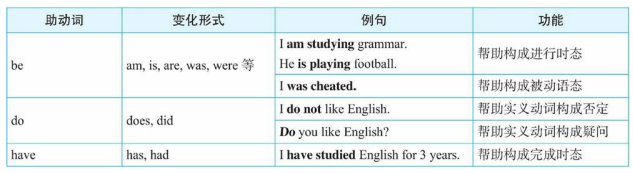
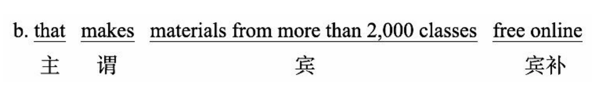

## 母语和外语

故事：

There are these two young fish swimming along and they happen to meet an older fish swimming the other way, who nods at them and says , "Morning,boys.How is the water?"

他们不知道大鱼在说什么，所以他们继续游着，没有回答。

And the two young fish swim on for a bit, and then eventually one of them looks over at the other and goes,"What the thell is water?"

对于语言也是如此：1. 水，就是母语环境; 鱼，就是母语人士。

普通母语人士，没有脱离过自己的母语环境，不能理性认识自己的母语，比如母语的语法规则，只是本能的使用母语。

语言专家或者学习过外语，且有其他外语作为参照的人士，才能了解自己母语的特点和说这种语言的人的一些**思维习惯和看世界的角度**。不学语法，很难地道且自然的表达外语，同时不要脱离语境讲语法、讲英语。

分别体会一下母语和外语示例：

对于母语：

经过一个月的努力，我的汉语水平有_\_\_\__\_\_\_很大的提高。 

A.了     B.过    C.着    D.的

我们不知道“了”和“过”的语法规则，但是我们能准确的选出正确答案。学习中文的外国人则很难。

对于英语：

> There are these two young fish swim along and they happen to meet an older fish swim the other way, who nods at them and says, “Morning, boys. How’s water?” And the two young fish swim on for a bit, and then eventually one of them looks over at another and goes，“ What the hell is the water?”

我们就很难凭借“语感”，并且根据这样的语感读出其中的英文错误。其实上面的句子中有5处错误：

1. 把两个swim改为swimming，即采用**现在分词作后置定语**。
2. 把How’s water添加the改为How’s the water，**表示特指**，即特指这里的水。
3. 把another改为the other，因为是两条鱼中的另外一条。
4. 把最后的water前面的the去掉，因为这里是**泛指含义，泛指水这种物质**，不能加the。

上面的语法术语比如“现在分词”、“后置定语”，可能对一些英语母语人士来说，根本就不知道是什么，但他们却能说出正确的句子。

要精通一门语言，就必须精通它的语法，**而学习英语语法的本质是学习英语国家人的思维习惯，就是在理解英语国家的人是如何看待一个事物，以及习惯于怎样去描述这个事物。语言是人类思维的载体，语言表达本质上是一种思维的表达。**

语法是能塑造和培养年轻人的思维的。(This stands for grammar cultivating young minds.)

> Grammar is the way to distinguish between those who know their shit, and those who know they’re shit.
>
> 语法能把人们分成是大智还是大愚。

**建立起自己的英语语法知识体系**

## 新书旧书

旧书：

1. 走近语法
2. 通悟语法
3. 驾驭语法

目的是给一个完整的、清晰的语法框架体系，因而只是对英语语法做了一个入门介绍，比较浅显，让读者有个初步了解，掌握一些基础知识。

新书：

1. 句子成分超精解
2. 定语从句超精解
3. 名词从句超精解
4. ...

新书针对每一个语法项目深入、系统地研究句子的逻辑语义关系，各种不同的结构和逻辑差异。

系列图书的特点：

1. 有文章故事
2. 提供语境背景
3. 提供思路总结
4. 提供构思过程，逻辑推理和论证，最后总结本质规律

推理示例：

交易时常说的：“你看着给吧”。

1. 根据语境，这里“给”不是give而是pay。

2. 实际上是“给一个合理的价格”，英文就是pay a fair price。

3. “你看着给”意思是“给一个你认为合理的价格”，这里有“你认为”you think，这时就需要构造一个从句，以便于把you think作为一个插入语放进去。

4. 于是想到**把形容词fair前置修饰改为后置修饰**，构造一个定语从句pay a price that is fair，然后放进插入语you think说成pay a price that you think is fair。现在可以用what替换a price that，于是说成：

   a. Pay what you think is fair.

   或者添加you can这样说：

   b. You can pay what you think is fair.

   这里what从句没有疑问意义，是一个名词性定语从句，并且具有泛指含义，因此，可以把what改为whatever说成：

   c. You can pay whatever you think is fair.

整个句子的字面意思是“你可以按照你认为合理的价格来支付”，这也就是汉语“你看着给吧”所要传达的意思。

**学习贵在坚持**

“Stay hungry; stay foolish.”——JOBS

强调做事的激情和坚持。要像傻瓜一样地坚持。真正的好东西是聪明人下笨功夫做出来的。需要长期的坚持，坚持观察、思考、总结、验证、运用等。

because引导的从句作主语:

There is a big difference between activity and accomplishment. Just because you are doing something doesn’t mean you are getting anywhere.One must evaluate one’s activity in order to have accomplishment.(忙碌并不意味着就一定会有成果，二者之间有很大不同。只是因为你在不停地忙碌并不意味着就有成果。因此，人们必须认真审视自己的忙碌，看能否取得成果。) 

the point where...定语从句：

Whatever you do, if you want to become great at it, you need to work day in and day out, almost to the point where you are addicted to it, and over a long period of time.（不论你从事什么工作，如果你想成为该领域的专家，你必须日复一日地去做，直到几乎迷恋成瘾的程度，并且要长期坚持。）

名词从句中以wh-连词引导的表语从句：

You are what you eat.(你即你所食。)

You are what you read.(你即你所读。)

对英语句子的分析将从**结构**方面展开，即句子结构分析。

**句子结构**分析是围绕**句子成分**展开的。

1. 先对句子成分进行简单的分类、组合，从而得出五种基本句型。
2. 对每一个句子成分进行深入的分析，包括这些句子成分的结构、位置、功能和语义等。
3. 介绍一下这五种简单句型是如何“进化”成复合句，为定语从句和名词从句打基础。

- 注重规则背后的英语思维的培养，而非记忆一些教条式的规则
- 理解那些例外的规则背后的思维
- 注重句子，短文以及上下文环境及其中英语思维，而不是单一的例句
- 将学到的思维规律直接转为日常对话用的语句，达到举一反三的，创造性的使用英语

---

本书特点：

1. 一般语法书教条式地罗列大量的所谓规则，不讲解背后的思维规律。
2. 一般语法书还有许多看似例外的规则加重记忆理解负担，但其实这些例外本质也是有符合逻辑的思维规律，这样就避免的纯粹的对这些例外的背诵，而是辅助于理解记忆
3. 一般语法书严重忽视句子的上下文语境，给出的例句，只为说明规则，在学习一个语法知识点的时候，需要结合有上下文语境的情况辅助和加深理解，理解器背后的思维
4. 一般语法书只是讲语法知识，而不重视真正的口语应用。

对于学习英语，如果只是死记单词，而没有训练出良好的英语思维，那么学到的不过是英文这种文本（text），而不是作为思想表达工具的英语语言 （language）。

因为没有掌握英语思维，所以在面对相对专业的文章时，甚至会不知道它在说什么，它的潜意思是什么，同时更无法在日常交流中使用英语进行交流。

**什么是英语思维？**

英语思维：从语言本身去分析，语言无非就是人们交流思想的工具。

- 发出声音，即语音（有发音单元）
- 记录声音的符号，即词汇（有词根，前缀，后缀）
- 把词组成句子的造句规则，即语法（有规律）

真正意义上的人类语言都离不开这三要素：语音、词汇、语法。

语言作为思维的载体，语言表达本质上是一种思维的表达，而**语法作为一种==语言表达规律==的归纳和总结，必然集中体现了该种语言的思维模式（语法即是思维）**，认识世界的习惯。

## 错误认知

1. 语法等于规则

   > 规则（由人制定的）一般要严格遵守。语法不是由语法专家事先确定并要求人们去遵循的。认为专门制定出来语法规则是为了规范人们的言语行为的。传统语法书也加强了人们这种错误印象。因为它们往往是先列出一些规则，然后再针对这些规则给出相应的例句，告诉读者，按照规则这么造句才是对的。久而久之，让人产生错觉：以为是先有一套语法规则、教条，然后必须按照这些规则才能制造出具体句子。
   >
   > 事实上，先有语言（人们的思维活动），在长期的人类发展过程中，语言学家不断研究，然后再从大量的语言实践中总结出人们在使用这种语言时所遵循的**一般思维规律或表达倾向**，即所谓的规则。
   >
   > 所以，**语法规则不是什么不可逾越的，而是对人们的思维规律或语言表达习惯的归纳和总结。**

2. 把语法规则当作一成不变的公式

   > 这是将语法当作规则带来的副作用，语法不像数学公式，语言是灵活多变的，同时又具有规律性。**语法规则就是对这些规律性的语言现象进行归纳和总结，但并不能涵盖所有的语言现象。**所谓的“语法规则”只不过是一种“权宜之计”的规则，是为了方便语言初学者的学习。因此，语法并不是一成不变的“公式”，也不是非此即彼的，而是存在很多“灰色地带”，因而总有“例外”存在。

3. 把语法规则当成随意的公式

   > 一些语法规则往往表现出随意性。
   >
   > 比如，对于冠词的用法，一般语法书上会有这样一条规则：“==第一次提到的单数可数名词前面用不定冠词 a 或 an，这一名词再次出现则要用定冠词 the==（中文世界里也是一样的表达习惯）”。传统语法书上往往只是给出这样的规则，但不解释为什么会这样选择冠词，这样英语学习者很容易误认为语法规则是随意的、专断的，没有什么道理可言的，因而容易死记规则，而忽略了规则背后的合乎情理的思维规律。
   >
   > 其实，很多看似随意的规则，其背后都有共同的思维规律。因此，学语法重在理解规则背后的合乎情理的思维，而不能“死记”规则。

由于以上的错误认知，导致国人和老外（native speakers of English） 在使用英语方面的最大的区别就是：我们记住了英语语法规则却没有英语思维，而老外是在用英语思维，尽管他们不懂语法规则。

国人学生学习语法规则都用来对付英语考试，而没有真正懂得规则背后的英语思维。一味僵化地记一些规则，然后简单地用这些规则来套用一个句子“符合”与“不符合”自己牢记的规则，而不去关注句子所使用的语境。这样一来学到的只是一个“虚构”的英文句子，而不能把所学到的句子活用到真实的英语交际中。这就造成学英语与现实生活中的语言交际脱节。

**语法是对语言表达习惯的归纳，总结出来的规律是为了对语言学习者正确引导，而不是严格限定。**

**把语法当作思维规律来理解，而不应该当作规则来死记。**

扩展：

第一次提到的单数可数名词前面用不定冠词 a 或 an，这一名词再次出现则要用定冠词 the在英语中的理解。

1. **第一次提到的单数可数名词前使用不定冠词 `a` 或 `an`**：
   - 当你第一次提到某个名词时，听众或读者还不清楚你具体指的是哪个事物，因此你需要使用不定冠词来表示“一个”的概念，而不指代具体的某一个。例如：
     - "I saw **a** dog in the park." 这里的 "a dog" 指的是某一只没有被明确指代的狗。
2. **再次提到该名词时使用定冠词 `the`**：
   - 当你再次提到这个事物时，听众或读者已经知道你说的是什么（因为它之前已经被提到），因此你需要用定冠词 `the` 来表示这个特定的事物。例如：
     - "The dog was very friendly." 这里的 "the dog" 指的是之前提到的那只特定的狗，听众知道是哪只。

**理解关键**：

- 不定冠词 `a/an` 用于介绍新的或不特定的事物。
- 定冠词 `the` 用于指代已经明确的、特定的事物。

**类似的中文现象**

在中文中没有像英文那样明确的冠词系统，但可以通过上下文来表达类似的概念。中文中也会有从不明确到明确的表达变化，以下是类似的现象：

1. **第一次提到某个事物时通常比较笼统、模糊**：
   - 例如："我在公园看到**一只狗**。" 这里的 "一只狗" 类似于英语中的 "a dog"，听众并不知道这只狗的具体身份或是哪一只。
2. **再次提到这个事物时，会用更加具体的描述**：
   - 例如："那只狗很可爱。" 这里的 "那只狗" 类似于英语中的 "the dog"，因为这时已经是明确提到之前的那只狗。

**举个中文例子：**

1. 第一次提到：
   - "今天早上，我在路上碰到**一个人**。" 这里的 "一个人" 没有特别说明是哪一个，和不定冠词 `a person` 的概念相似。
2. 再次提到：
   - "那个**人**告诉我，他要去超市。" 这里的 "那个人" 表示你之前提到的那个具体的人，类似于 `the person`。

**总结**

- 英文中的不定冠词 `a/an` 和定冠词 `the` 主要是用来区分提到事物的模糊性和具体性。
- 在中文中虽然没有冠词系统，但通过类似的词汇（如“一个”、“那”、“这”）以及上下文来传达不确定性和确定性，体现出类似的逻辑。

## 学习语法内容

**搞清楚学习语法知识应该包括哪些方面内容**

以单词举例子，词汇除了有发音外，还包括形式（即单词的拼写形式）、意义（即单词的含义）和用法（即单词的用法）。

语法也是一样的，有**形式（form）、意义（meaning）和用法（usage）**这三方面，同时，语法还包括了将这些单词连词成句的规律。

形式：某个语法结构是怎样构成的。比如“现在完成进行时”的构成形式是have been doing。首先要做到能够**准确地构造某个语法结构**（语法结构的准确性问题）。

意义：某个语法结构能表达什么意义。比如“现在完成进行时”可以表示“一个活动从过去一直延续到现在说话时刻”的含义，这就是现在完成时态这一结构所具备的语法意义。**特定的结构形式能够表达特定的意义**（Particular forms will express their particular meanings）（语法结构的表意性问题）。**对于一个句子，它的含义不仅仅是来自于句中所使用的词汇的含义，而是还有来自于其中特定语法结构所含有的语法意义。**

用法：关于何时／为什么使用某一语法结构。这与在实际交流中的语境有关系，即特定的语境中，采用某种特定的语法结构来表达特定的意义才合适，（语法结构的合适性问题）。用法取决于说话者想表达的意义。

某一特定的语法结构的形式、意义和用法这三者之间是相互联系的，图示如下：

学习英语最后要达到的目的：**英语学习者要能够准确地、有意义地、恰当地去运用英语语言结构**。做到这一点，才算是真正灵活使用语法规则，并进而在思维高度上来使用英语了。

### 形式与意义的关系案例

说明形式与意义的关系案例：

1. I have been coming to Beijing for fourteen years.

可能被误认为的理解：

1. 我来北京有 14 年了。
2. 我到北京一路上走了 14 年。

即使每个单词都认识，并且都知道语法结构 have been coming 是“现在完成进行时态”，尽管如此，但依然不知道这句话真正所要表达的意义。 正确的理解是：在过去这 14 年当中，我常常来北京。

由此可见，**知道语法结构的形式并不一定就懂得语法结构所要表达的真正意义。**其实，这里的 have been coming 在英文里表示的是一个重复的活动，具体来说：==用短暂动词（如 come）的完成进行时（如 have been coming）来表示到目前为止的一段时间内重复发生的动作==。

2. I have been coming to Beijing fourteen times*.

说话人是想表达“我来北京有十四次了”这样的意思。这也不对。==因为现在完成进行时态在表示重复活动时， 不能说明具体的次数，比如这里的“十四次”==。这就属于知道 have been coming 形式（现在完成进行时态）和意义（表示重复活动），但并没有真正掌握其用法，即不知道如何恰当地使用完成进行时态来表达重复意义。==由此可见，知道语法结构的正确构造形式以及所能表达的意义，也并不一定就保证能够正确使用==。

传统教学中，基本都只是强调某种句子的结构形式，然后告诉学生根据**句子形式**构造出正确的句子，重点掌握句子构造的形式，而很少把例句中的真正意义和所使用的语境交待给学生，因而学生对这些句子不知道该如何恰当地使用。致使学生学习到的都是一些死句子而不能交流。

学习英语应该从实际应用出发。认识到语法不单是一个形式（句法学）问题，还包括在合适的语言环境（语用学）来表达某种意义（语义学）。**因而在举例讲解某个语法结构时，不仅读者要学会如何在形式上达到准确性，同时也要做到恰当地运用该语法结构，把握其意义。**

扩展：

现在完成进行时（**have/has been + 动词的现在分词**）主要用于强调**动作的持续性**或**动作发生的频繁性**，但并不适合用来描述**具体的次数**。现在完成进行时更多关注的是动作的过程、时间长度或者某种持续的状态，而不是动作完成的次数。因此，在涉及具体次数时，使用现在完成进行时会导致不自然或语义不清晰的表达。

**原因分析：**

1. **现在完成进行时的重点是动作的持续性或发生的频率**：
   - 现在完成进行时强调的是某个动作从过去某一时间点开始，持续进行到现在，**可能**还会继续。这种时态的重点是动作是否还在进行或发生的频率，而不是具体的次数。
   - 比如：*I have been visiting Beijing a lot lately.* 这里并不强调具体的次数，而是在表达动作的持续或多次重复发生。
2. **现在完成时适合表示具体次数**：
   - 当你想说明具体次数时，应该使用**现在完成时**（**have/has + 过去分词**），因为现在完成时侧重于动作发生的次数或结果，而不关心动作是如何发生的。
   - 比如：*I have visited Beijing fourteen times.* 这里的 `have visited` 明确表达了动作的完成和发生的具体次数。

**例子对比：**

- **现在完成进行时（不能用具体次数）**：
  - ❌ *I have been coming to Beijing fourteen times.* —— 不合适，因为现在完成进行时强调的是动作的**持续性**或**频率**，而不是具体次数。
  - ✔ *I have been coming to Beijing frequently over the past few years.* —— 正确，因为这里没有涉及具体次数，而是强调了**频繁的动作**。
- **现在完成时（可以用具体次数）**：
  - ✔ *I have visited Beijing fourteen times.* —— 正确，明确表示了具体的动作次数，且动作已经完成。

**为什么不能用现在完成进行时表达具体次数？**

- **时态的侧重点不同**：现在完成进行时侧重于动作的持续性或重复性，适合用于表达动作正在进行或频繁发生，但不关心具体的次数。
- **逻辑不合**：当你明确提到具体的次数时，逻辑上是说明你已经完成了这个动作的某个阶段（比如去过北京十四次），因此更适合用现在完成时这种强调动作完成或结果的时态，而不是强调过程的现在完成进行时。

## 语境

一个句子的用法（什么时候说一句话），取决于你要表达的意思，意思又因为不同的语境而有所差异，而要表达的意思则由不同词义和形式的单词按照一定规律组成。在真实的语言交际过程中， 任何一个句子都不是孤立存在的，都有一个赖以生存的语境。甚至有时候，语境决定了一个句子真正要表达的意思。

比如下面这个对白发生在一位父亲与自己女儿的男朋友之间：

> Father: Do you drink?
>
> Young Man: No, thanks, I'm cool.
>
> Father: I'm not offering; I'm asking IF you drink. Do you think I'd offer alcohol to teenage drivers taking my daughter out?

这位父亲问他女儿的男朋友（其正准备开车带他女儿出门）：Do you drink? 他真正的意思是问这个年轻男子是否有饮酒的习惯，即是在询问情况，而不是问他现在想不想喝酒，即不是在提议。这就是语境对于句子意思的重要影响。

对于That was fun这个句子，知道它的语法结构形式——一般过去时态（was），以及它的意思——“这很有趣”，但不一定知道该句在什么样的场合使用才正确、恰当。

> Ted: Where did you learn to Rollerblade?
>
> Anna: Here in the park. This is only my second time.
>
> Ted: Well, it's my first time. Can you give me some lessons?
>
> Anna: Sure. Just follow me.
>
> (After a while)
>
> Ted: Hey, that was fun. Thanks for the lesson!

上面的that was fun被用在了溜冰活动结束之后，而不是在活动进行过程中（此时要说成that is fun）。在上面这个对话语境中，大多数国人可能会说that is fun。由此看到，如果不是提供这样完整的对话语境，读者就很难真正会恰当使用that was fun。

所以，在学习语法时，不仅要能够构造出形式正确、能够表达意义的句子，更要关注这个句子所能使用的语境。传统的语法书和语法教学在这方面做得相当不够，他们提供例句主要是为解释某条语法规则服务的，而句子背后的使用语境没有展现给学生。规则下面罗列的例句都是僵化的、脱离了语境的死文字。

**去分析、解释为什么英语本族语者要“这样”说（what native speakers of English actually do say and why）**

在学习某个语法规则时，不仅要知道这个语法规则是什么，结构怎么构造的，还要知道这个规则背后的为什么以及如何使用这个规则；在举例时，不仅要理解句子的中文译文，还要展现这个句子所使用的语境，或者是通过给出对话或短文来为例句提供一个完整的语境，这样就使得读者能够充分理解所学到的每个例句在具体交际中的使用。

## 英语和汉语思维

例句：我已经结婚了。句子用英语如何表达？

“我已经结婚了”为什么不是：I have married; I have been married; I got married; I married; I had married，而是 I am married.

去年结婚的。：I got married last year.

到现在结婚有一年多了。：I've been married for over a year

简单比较一下，可以看到，汉语中的“结婚”一词，用英文表达却有 am married、got married 以及 have been married 这样的区分。==而这样形式上的区分背后反映了英汉语言的一个重大思维差异：英文中有“动作 （action）”与“状态（state）”和 "时态"的区分，而这些话语特点在汉语思维中都是天然缺失的。==这就造成了：可以轻而易举地把“I am married. I got married last year. I've been married for over a year.”译成地道的中文，但反过来由中文却无法译成地道的英文，即能读懂英语句子，但在真正交际中不一定能准确地说出这样的句子，这就说明“读懂 ≠ 会用”。更严重的是，因为不懂英文思维特点，有时甚至都读不懂句子，而造成误解句义。比如下面这句：

He is interesting to listen to

是要表达什么意思呢？一定有读者这么理解： 他对听别人讲话很感兴趣。 这么理解就错了。其实这句话意思是： 听他讲话很有趣。 不能正确理解这个句子的一个根本原因是没有真正理解这个句子的 如下“深层结构”：

It is interesting to listen to him.

也就是说，在表层结构上，he 是做句子的主语（He is...），但在深层结构上，he 是作 listen to 的逻辑宾语（...listen to him）。这里不定式 to listen to 的逻辑主语是泛指大众，在句中没有明确给出，而只是隐含其中的。

所以，如果读者只满足于看懂句子意思就行了，而不去真正理解英语的思维规律，那么英语水平是无法**真正提高**的。这就是为什么大量中国英语学习者的英语水平就停留在能看懂英文文章但是说不出、写不来的尴尬境地，究其原因，还是因为没有真正“懂英文”！

## 学习建议

学习语法知识本身不是目的，目的是通过对语法知识的学习，用于进行语言交流，讲语法知识转为听说读写的能力。

建议：

1. 多思考，领悟书中的语法及其后面的思维规律，培养自己的英语思维能力
2. 不要把书中的语法当作规则，而要去理解思维
3. 多练习，大量的阅读练习和单选练习，同时包括听说读写译的练习，注重口语和写作的输出

## 丛书安排

不以词法和句法作为两大主线对英语语法做规则罗列。

初级篇以名词短语和动词为两大主线

- 首先建立名词短语概念
- 基于名词短语学习名词，限定词和形容词
- 讨论基于动词的英语的五种基本句型，树立正确的句型观念，为学习复杂的从句打基础
- 讲解一般时态和进行时态的思维特点

中级篇以从句和谓语动词为两大主线

- 讲解如何将两个简单句合并为三大从句（名词性从句，定于从句和状语从句）
- 讲解完成时态，完成进行时，虚拟语气和情态动词等谓语形式

高级篇以从句和非谓语动词作为两大主线

- 帮助读者分析和构造复杂的长难句（应对各种国内外考试的阅读与写作）
- 非谓语动词（不定式，动名词和分词）
- 三大从句和san大非谓语动词联系和转换

每一章节的内容结构安排：

首先将本章要讨论的内容以标题的形式给出，明确方向和思路

每小节都有配套的针对性练习题和各个章节后的综合练习

先阅读章节内容，在完成章节的练习

每章最后都会有总结，包括章节学习思路，重点难点和学习时间的安排建议，用于参考。

每学习完一节的内容后就先停下来，思考看自己是否真的理解本节的内容，通过练习进行测试，不要一口气读完每章所有内容而不做练习。

## 名词短语

名词短语（noun phrase）是英语句子的**核心组成部分**（a core element of a sentence）。

搞清楚名词短语的构造规则。

**名词短语中出现多个名词的情况通常表示复合名词（Compound Nouns）。复合名词是由两个或多个名词组合而成，形成一个新的名词，表示一个新的概念或事物。**

复合名词的构成有几种常见的形式：

1. 连字符形式（Hyphenated Form）：多个名词之间用连字符（-）连接，例如 "mother-in-law"（岳母）或 "well-being"（幸福感）。
2. 空格分隔形式（Space-separated Form）：多个名词之间用空格分隔，例如 "coffee table"（咖啡桌）或 "car park"（停车场）。
3. 合并形式（Solid Form）：多个名词直接合并在一起形成一个新的名词，例如 "toothbrush"（牙刷）或 "sunflower"（向日葵）。

理解复合名词时，可以将其视为一个整体，其中每个名词都为整体贡献了一部分含义。通常，前面的名词修饰后面的名词，描述了后面名词的**属性、特征或用途**。

需要注意的是，复合名词在不同语境和领域中可能有不同的含义。有时候，可以通过上下文来理解复合名词的具体含义。此外，一些复合名词也可以根据需要进行拆分，以更清晰地传达意思。

### 案例

The eighth wonder of the world is the one who can remember the other seven wonders.

“世界最著名的七大奇迹”该如何翻译成英文。对于这个表达，中文里可以说得很灵活。比如：

1. 世界最著名的七大奇迹

2. 最著名的世界七大奇迹
3. 七大世界最著名的奇迹

汉语可以如此灵活地表达，那么英语也像汉语这样灵活吗？当然不是。**英语向来以语序固定严格而著称**，因而英文被称为“固定词序语言（a fixed-word-order language）”。

那么英文该怎么说？下面提供几个译文：

1. the world's most famous seven wonders
2. the most famous Seven Wonders of the World
3. the seven world most famous wonders
4. the world's seven most famous wonders

上面的译文哪个才是正确的呢？要想回答这个问题，就必须搞清楚“名词短语”的构造规律。

语言的使用级别可以分为这样五个层次：

1．词（word）

2．短语（phrase）

3．句子（sentence）

4．段落（paragraph）

5．篇章（discourse）

在本篇中，主要就是进入句子的内部，即在“短语”这一层次来讨论句子的构造特点。英语里的短语有很多类，比如有动词短语（如 have been doing）、介词短语（如 for you）、名词短语（如 my best friend）等。其中名词短语最为重要， 它是英语造句中不可或缺的元素。

### 定义

名词短语：名词与它的修饰语一起即构成名词短语。

### 功能

看几个简单的句子，考察一下名词短语在句子中可以充当哪些成分：

1. These red roses are for you. 名词短语 these red roses 在句中充当**主语**。 
2. I have three close friends. 名词短语 three close friends 在句中充当**宾语**。 
3. I really need a new computer. 名词短语 a new computer 在句中充当**宾语**。
4. I can't find the best answer. 名词短语 the best answer 在句中充当**宾语**。
5. He is my best friend. 名词短语 my best friend 在句中充当**表语**。 
6. There are some red roses **on that small table**. 名词短语 some red roses 在句中充当**主语**；名词短语 that small table 在句中充当**介词 on 的宾语**。

==英文中的介词不能单独使用，其后面必须接宾语，所接的宾语也往往是名词短语。==

短文案例：

> National Flag
>
> The national flag of the People's Republic of China (PRC) is a red rectangle emblazoned with five stars. The red of the flag symbolizes revolution; the stars are yellow so that they will stand out brightly against the red ground. The larger star represents the Communist Party of China (CPC) and the four smaller ones, the Chinese people. This expresses the great unity of the Chinese people under the leadership of the CPC.

上面短文的名词短语分析：

1. the national flag of the People's Republic of China (PRC)
   这是一个较大的名词短语，它又可以细分成 the national flag 和 the People's Republic of China 这样两个小的名词短语。该名词短语作句子的主语。

2. a red rectangle emblazoned with five stars

   这个名词短语又可以进一步分成 a red rectangle 和 five stars 这样两个小的名词短语。该名词短语作句子的表语。

3. the red of the flag
   这个名词短语又可以进一步分成 the red 和 the flag 两部分。该名词短语作句子的主语。

4. the stars
   该名词短语作句子的主语。

5. the red ground
   该名词短语作介词 against 的宾语。

6. the larger star
   该名词短语作句子的主语。

7. the Communist Party of China (CPC)
   该名词短语作句子的宾语。

8. the four smaller ones
   该名词短语作句子的主语。

9. the Chinese people

   该名词短语作句子的宾语。

10. the great unity of the Chinese people under the leadership of the CPC

    这个名词短语又可以进一步分成 the great unity, the Chinese people 和 the leadership of the CPC 三部分。该名词短语作句子的宾语。

不论是英语的单句还是文章，都含有大量的名词短语。

扩展：

1. **so that**：
   - **"so that"** 是一个引导目的状语从句的连接词，表示动作的目的或结果。这类从句用于说明前面的主句所发生的动作是为了达到某个目的或结果。
   - 在这个句子中，**"so that"** 引导的从句解释了为什么星星是黄色的：为了让它们在红色的地面上更醒目。
2. **they will stand out brightly against the red ground**：
   - 这是一个完整的主谓结构。
     - **"they"** 是主语，指代 **"the stars"**。
     - **"will stand out"** 是谓语动词，表示星星将会突出。
     - **"brightly"** 是状语，修饰动词，表示“明亮地”。
     - **"against the red ground"** 是介词短语，说明星星与红色背景形成对比，它在句子中充当**状语**的**一部分**，具体来说是**地点状语**。
       - **against**：介词，表示与某物形成对比、背景或位置关系。
       - **the red ground**：介词的宾语，表示与“星星”形成对比的背景。
       - **"against the red ground"** 作为修饰成分，是用来修饰动词 **"stand out"** 的，因此它是**状语**，表示动作发生的背景或对比关系。这里，它描述了星星是如何**在红色背景上突出**的。

句子成分：

- **"so that they will stand out brightly against the red ground"**：目的是说明**"the stars are yellow"** 是为了使星星在红色背景上更为醒目，因此它是一个**目的状语从句**，修饰主句的谓语 **"are yellow"**。

总结：

**"so that they will stand out brightly against the red ground"** 是目的状语从句，用于解释为什么星星是黄色的，表明动作的目的。这部分句子在句子结构中充当**目的状语**。

### 构造规律

名词短语的构造——==“左二右六”的定语规律==。

名词短语是由名词与它的修饰语一起构成的。==名词的修饰语与名词的位置关系不外乎两种：一是放在被修饰名词的前面，称之为前置定语；二是放在被修饰名词的后面，称之为后置定语。==

一般来讲，名词前面有两种修饰语。一是限定词，==用来限定名词所指的范围，对名词起泛指或特指、定量或不定量等的限定修饰作用。== 比如上文中的 these, three, a, the, my 和 that。二是形容词，==是用来表示名词的性质和特征的==。比如上文中的 red, close, new, best 和 small。

在复杂的名词短语中，更常见的是后置修饰语。一个名词可以带的后置修饰语的种类很多，包括**定语从句、 同位语从句、分词短语、不定式、介词短语、形容词短语和副词短语**等，而且还有这些**不同的后置定语复式出现**的情况。

上面中心词名词是 boy，然后在 boy 的前面或后面分别添加各类修饰语，组合成不同的名词短语。

在英语里，修饰名词的定语，其语序的位置是极有规律的。

在英语里，名词的定语要么在名词的前面， 要么在名词的后面。

左置的定语只有两个：==限定词和形容词==，且可能存在多个限定词或者形容词

> the American national flag：限定词＋形容词＋形容词＋名词

右置的定语共有六种（尽管可以有副词作右置定语，但因较少用到，在此不作讨论）：==介词短语、分词短语、不定式短语、形容词短语、定语从 句以及同位语从句==。

==左置的两个定语的位置关系非常明确和严格：必须是限定词在形容词的左边，结构是：限定词＋形容词 ＋名词。==

==英语和汉语的一 个基本差别就是名词修饰语即**定语**的位置差异。汉语的定语一律是在名词的前面，而英语的定语有在名词前面的，也有在名词后面的，更多的定语是置于被修饰名词的后面，构成后置定语。所以，在**语言学** 上，**汉语被称作是“中心词（head）在后”的语言（head-last language）；英语被称作是“中心词在前”的语言（head-first language）**。==

扩展：

在英语的**名词短语**中，**限定词**和**形容词**可以出现多个，但它们在句中的排列顺序和功能有所不同。

1. **限定词（Determiners）**：

- **限定词**是用来限定名词范围的词，比如冠词（**a, an, the**）、指示代词（**this, that, these, those**）、所有格（**my, your, her**）、数量词（**some, many, few**）等。
- 一般情况下，一个名词短语中通常只能有**一个主要限定词**，但有时会有**组合使用**的情况。
- 常见的组合：
  - 限定词 + 数量词：**all the books**
  - 限定词 + 指示代词：**all those people**
  - 限定词 + 所有格：**all my friends**

2. **形容词（Adjectives）**：

- 名词前可以有多个形容词来修饰名词。

- 这些形容词的排列有一定的顺序，遵循英语中

  形容词顺序规则：

  - **数量**（Quantity）：one, two, some
  - **观点/评判**（Opinion）：beautiful, interesting
  - **大小**（Size）：big, small
  - **形状**（Shape）：round, square
  - **年龄**（Age）：old, new
  - **颜色**（Color）：blue, red
  - **起源/国籍**（Origin）：French, American
  - **材料**（Material）：wooden, metal
  - **用途**（Purpose）：writing, cooking

3. **示例**：

(1) 限定词的使用：

- 正确的句子：
  - **All my friends** （all 是数量词，my 是所有格）
  - **The two red cars** （the 是冠词，two 是数量词）

(2) 形容词的使用：

- 多个形容词修饰名词：
  - A beautiful small round old French wooden writing desk
    - 数量：a
    - 观点：beautiful
    - 大小：small
    - 形状：round
    - 年龄：old
    - 起源：French
    - 材料：wooden
    - 用途：writing
    - 名词：desk

4. **限定词与形容词一起使用**：

- 名词短语中限定词出现在最前面，而形容词紧随其后。例如：
  - All the big blue cars
    - 限定词：**all**，**the**
    - 形容词：**big**，**blue**
    - 名词：**cars**

总结：

- **限定词**一般只有一个，但有时可以组合使用（如 **all my friends**）。
- **形容词**可以有多个，并且它们按照特定顺序排列，修饰名词。

### 句子成分

一般说到句子成分，都会说是“主谓宾定状补”六大句子成分。其实，“定语”并不能算是真正意义上的句子成分。原因：

1. 定语是用来修饰或限定名词的。从上面讨论的名词短语来看，定语只是名词短语的构成成分，最多称之为“短语成分”。
2. 语言的构造级别可以分为词、短语、句子、段落和篇章这样的等级。主语、谓语、宾语、补语和状语这五种“句子成 分”都是在“句子”这一层级上的成分。而定语成分则“稍逊一层”，它属于“短语”这一层 级，是属于“短语成分”，即是组成名词短语的成分，然后通过名词短语间接地构成句子成分。

因为造成我们对英语句子理解障碍的“罪魁祸首”之一 就是英语里**复杂的定语修饰关系**。所以，前面介绍的关于**定语的结构规律**是非常重要的**英语思维规律之一**。

## 名词

名词短语的核心部分——名词。关于名词的一些列问题：

1. 何谓可数名词？

2. 何谓不可数名词？

3. 如何判断一个名词是可数还是不可数？

4. 名词复数形式的变化规则有哪些？

5. 什么时候要用's 所有格？

6. 什么时候要用 of 属格？

英语里的可数名词与不可数名词，在汉语思维里是不把名词作这一区分的。这一区分涉及了思维上的差异，而这种思维在我们汉语语言里是天然缺失的。因此，学了很多年英语的中国人，通常还是搞不清楚某个名词是可数还是不可数，因而造成大量的表达错误。比如在说话或写作中，常常“忘记”在复数名词后面加-s，或者搞不清楚某个名词的后面该不该加 s。

从思维的高度来说，可数名词与不可数名词这一区分反映了中国人与英语的 native speakers 在看待客观外界事物时所持的两种不同的世界观：**国人的脑子里想到某个名词时，不关注它是可数或不可数；但在 native speakers 的脑子里，每个名词都有可数与不可数之分**，因而对事物的理解是不一样的。

#### 分类

名词定义：用来表示**人、事物、地点以及抽象事物的名称**的（A noun is the name of a person or thing.）

- 人：John, sister, father 
- 事物：water, air, sun, computer 
- 地点：London, theater 
- 抽象事物：love, happiness, imagination, hope

分类：

专有名词：

1. 人名及头衔

2. 著作名称

3. 月份

   > January, February, March, April, May, June, July, August, September, October, November, December。
   >
   > the solar calendar：阳历
   >
   > the lunar calendar：阴历
   >
   > 阴历二月”不能说 February，而是 the second month on the lunar calendar 或者说成 the second lunar month。
   >
   > 七夕：the seventh of the seventh lunar month
   >
   > 中秋：the fifteenth of the eighth lunar month
   >
   > this first of the first  lunar month

4. 星期、四季

   > Sunday, Monday, Tuesday, Wednesday, Thursday, Friday, Saturday。
   >
   > winter, summer, spring, autumn。

5. 节日

6. 地理名称

普通名词：分为可数名词（countable noun）和不可数名词（uncountable noun）。

对于名词，最重要的分类就是可数名词与不可数名词。这一分类是学习英语名词用法的核心，因为它关系到很多问题，比如可数名词变复数的问题，限定词修饰名词的问题，还有是一个名词用作可数与用作不可数，意义上有差别。

简单名词就是组成部分不可被分割的名词，比如 story, student 和 teacher 等。英语中的名词绝大多数是简单名词。

复合名词就是由若干单词组合而构成的名词，比如 girlfriend, roommate 和 mother-in-law（岳母／婆婆） 等。

#### 名词的数

- 名词的可数性，即区分可数名词，这一角度侧重于名词的意义方面而不是构成形式方面；
- 名词的单数与复数形式，这一角度侧重于名词的构成形式方面，可数名词如何变成复数形式的规则；

从意义（meaning）与形式（form）两个方面来讨论名词。

为了表达什么样的意义就使用什么样的形式。特定的意义是通过相应的形式来传递的。

从意义上来界定英语不可数名词的特点，**可数与不可数的“相对论”，即一个名词是可数还是不可数关键在于它所表达的意义，与它所使用的上下文语境密切相关，因而不能孤立地来看待名词的可数性。**

不能按汉语的思维来理解英文名词的可数与不可数。总的来说，不可数名词有以下规律：

1. **对于一些无法分割的名词，将其看作一个整体，因而作为不可数名词**，没有复数变化（nouns that have no distinct, separate parts, we look as the whole）。这样的名词主要是一些物质名词：

   

或者按气体、液体和固体来作出分类：

2. **一些因其组成部分太小而不易数的名词**（nouns that have parts that are too small or insignificant to count）用作不可数名词。

2. **表示总称的名词通常不可数**（nouns that are classes or categories of things）。这些名词侧重于表示某类事物的总的概念，而不是具体的事物。如果要具体指出该总称概念下的具体事物，则要用其他不同的名词。

   

从形式上来总结可数名词的复数变化规则。

其他的总称名词有：

就拿 character 来说吧，很多同学在作文里谈到“特点”时，就喜欢说 characters，殊不知，character 作为“特点”讲时，是一个不可数名词，不能变成复数的。因为它真正的意思是 the combination of qualities or features that distinguishes one person, group, or thing from another，表示“使与其他人、群体或事物相区别的性质或特征的集合”，强调的是一个整体的概念，因而是没有复数形式的。

- a man of character 有个性的人

若作为可数名词，是表示“方块字”，比如汉字、韩文，或者表示文学作品中的不同“人物（a person portrayed in an artistic piece, such as a drama or novel）”。

- The characters in Chinese writing look like small pictures. 汉字看起来就像是一幅幅小图画。
- a Chinese character 一个汉字

要表示具体的、可数的“特点”，就要用 characteristic，复数就是characteristics。比如说“建设有中国特色的社会主义”，用英语说成： construct the socialism with Chinese characteristics

4. **抽象的名词一般是不可数的（nouns that are abstractions）**

   

   要特别注意的是，上面这些名词可以有其他不同的意思，因而可以转化为可数名词。

5. **表示研究学科（subjects of study）**，一般作为不可数名 词。

   

一个名词是可数还是不可数关键在于它所表达的意义，而意义又随语境的不同而改变，因而名词的可数性是与它所使用的上下文语境密切相关的。 同样一个名词，会因为在不同的语境中含义不同而导致它的可数性不同，因而不能孤立地来看待名词的可数性。

**“不可数名词”转化为“可数名词”的一些规律：**

1. **对于物质名词或总称的名词，若是表示不同的种类，或者因为特定的意思，或者是液体表示“几杯”或“几瓶”这样的数量，则转化为可数名词。**

   具体的并不是指特指的。
   
   > 1) I like *cake*, not hamburger.
   >
   > 2) My mother is making *a cake* in the kitchen. 
   >
   >    
   >
   > A: Would you like *a cake*?
   >
   > B: No, I don't like *cake*. 
   >
   > 
   >
   > 1) I don't like *milk*.
   >
   > 2) Yogurt contains a higher percentage of lactic acid than other fermented *milks*. 

以上谈的是，总称名词或物质名词在表示“不同种类或具体的事物”时转化为可数名词，此时它们的词义没有改变或改变不大。

但是，有些名词，当由不可数转为可数名词时，意思会有很大的变化。比如paper这个词，表示“纸”时是不可数名词，但表示“报纸”和“论文”时则是可数名词。

> 1) I need *some paper* to write a letter on.
>
> 2) I have *a term paper* to write on weekends.
>
> 3) I bought *a paper*. 

肉类的名词,比如chicken，作为不可数名词，表示“鸡肉”；作为可数名词，表示“鸡”这种动物。

比如glass表示“玻璃”时不可数，但表示“玻璃杯”时则可数。

> *Glass* does not rust or rot.
>
> This vase is made of *glass*. 
>
> She drank two *glasses* of wine.
>
> He broke *a glass*.  他打碎了一个玻璃杯。不能错误地理解为“他打碎了一块玻璃”。因为glass若是表示“玻璃”，则是不可数名词，因而不能用不定冠词a来修饰。“一块玻璃”应该说成a piece of glass。比如：
>
> He broke *a piece of glass*. 他打碎了一块玻璃。

此外，glass的复数形式glasses还可以表示“眼镜”，并且作为“眼镜”的意思，只能用复数形式，则“一副眼镜”应该说成a pair of glasses。

再比如，water一词是属于第一组Group A中的名词。但是，如果特指具体的某一片水体，尤其是指某一国所专门拥有的一片海域（a particular stretch ofsea or ocean, especially that of a state or country）时，则常用复数waters，此时表示“海域，领海”。比如“东海海域”就可以说成：the *waters* of the East Sea. 

液体物质名词若表示“几杯”或“几瓶”这样的数量时，则转化为可数名词。比如：Two *beers* and three *coffees*, please!

2. **对于抽象名词，若是具体化了，则转化为可数名词。并且，此时往往伴随着词义上或大或小的改变。**比如art（艺术）／an 

   art（一项技术，一门特定的艺术）；beauty（美丽）／a beauty（一个美人）；youth（青春）／a youth（一个年轻人）。

   > 1) She had great *beauty* in her youth.
   >
   > 2) She was *a beauty* in her youth. 

TOEFL考试中的句子：

> 1. Financier Andrew Mellon donated most of his magnificent art *collection* to the National Gallery of Art, where it is now located.
>
>  
>
> 2. One of the most impressive *collections* of nineteenth-century European paintings in the United States can be found at the Philadelphia Museum of Art. 
>    
>
> 在例句1）中，collection是指“艺术收藏品”这个总称的、抽象的概念，而没有具体说明是什么收藏品，所以是不可数名词。下文的单数代词it指代这个不可数名词。在例句2）中，collection是特指“19世纪欧洲油画收藏品”这样的具体事物，所以是可数名词。

在以前的TOEFL考试中，曾多次考查中国学生判断名词可数性的能力，比如下面这道改错题：

21 (A) **Accounting** is described (B)**as art** of classifying, (C)**recording**, and reporting (D)**significant**  financial events. 

正确答案 :B，应改为as an art。在该句的语境中，art就是指accounting这项具体的技能，因而转化为可数名词。既然是可数名词，在单数art的前面就需要有不定冠词an来修饰。故将B即as art改为as an art才正确。

会计是一门对重大财务事件进行分类、记录和报告的专业技术。 

**可数的名词如何转化成不可数的名词**

比如对于room这个词，表示“房间”，此时是可数名词。但是若作为“空间，余地”来理解时，则是一个抽象概念而转化成为一个不可数名词。

> There's plenty of *room* for everybody to sit down in this *room*. 
>
> You can ride with us. There's enough *room* in my car. 
>
> “站票”就是指“供你站立的一个‘空间’”，因此英文中的“站票”就是standing room，
>
> 请看例句：There's no seat now. There's standing *room* only.   没有座位了，只有站票。

更为特殊的是，即使是一般作为可数的名词，在某些特殊的语境中，也可能作为不可数名词来使用。比如husband和wife这两个名词在一般情况下都是作为可数名词，但是在特殊的语境中，可能转化为不可数名词，此时其前面不需要不定冠词修饰。比如在西方举行婚礼的场景中，牧师最后会对着新郎、新娘及众人说：I pronounce this couple to be *husband* and *wife*. You may kiss. 

这里的husband和wife都是单数，按理说，在它们的前面应该需要有不定冠词a来修饰的。但在这里，它们是表示“夫妻”这样的概念，而不是具体指某人，是作为不可数名词，所以不需要冠词修饰。 

我现在宣布这对新人成为夫妻。你们现在可以亲吻了。 

 

We are not *boyfriend* and *girlfriend*.   这里的boyfriend和girlfriend同样是转化为不可数名词了，强调的是“男女朋友”这个概念。

3. 从更广泛的意义上来说，当一个名词表示抽象的、总称的概念（abstract  or generic concept）时，一般作为不可数名词来用。而当它表示具体的、特定的事物（concrete or particular things）时，则通常用作可数名词。这就是为什么词典中对于某个单词的某一词义，后面标注的既是可数，也是不可数。此时关键要看如何使用这个词义，如果是当作具体的事物来看，则是可数；如果是当作一个概念来看，则是不可数。

拿area（面积）来说，如果是指某个地方的具体多大的“面积”，则是可数。比如：The square covers *an area* of 20,000 square meters. 另一方面，如果把“面积”作为一个总体的概念（以区别于其他的概念，比如“人口”），则是不可数。比如：Shanghai is the largest city in *area* in China, but Beijing is the largest city in population. 

另外，作为“地区、区域”来讲，area是可数名词。对于area的这些不同的词义及其可数性，读者都需要根据具体的上下文来灵活把握。来看下面的两道TOEFL考试题：

1. Large, multicolored insects (A)with four wings, dragonflies (B)play a very important role in the ecosystem of humid (C)area by (D)controlling the population of mosquitoes

正确答案：C，应改为areas。根据上下文，这里的area是“地区”的意思，是可数名词，因而要把C即area变为复数的areas，这样它的前面就可以不用限定词修饰。

蜻蜓——这一体形较大的、彩色的、带有四个翅膀的昆虫——通过控制蚊子的数量而对潮湿地区的生态系统的平衡起着重要作用。

2. Located in Canada, the Columbia Ice Field (A)covers (B)area of 120 square miles and is 3.30 feet (C)thick in some (D)places. 

正确答案：B，应改为an area。根据上下文，这里的area是表示具体的“面积”，是可数名词，因而要把B即area改为an area。 

哥伦比亚冰原位于加拿大，面积达120平方英里，在有的地方厚度达3.3英尺。

#### 不可数名词的度量

不能用具体的数字（基数）（比如 one, two, three, four）来表示不可数名词的数量，但可以借用量词来表示其量的概念。不同类型的不可数名词所使用的量词不一样，一般的规则如下：

1. piece 修饰：

   advice, bread, baggage, chalk, equipment, furniture, information, jewelry, luggage, music 和 news 等

   > a piece of news（一条消息）
   >
   > two pieces of news（两条消息）
   >
   > several pieces of furniture（几件家具）
   >
   > three pieces of luggage（三件行李）

2. 用 bottle, cup, drop 和 glass 修饰液态物质
   比如这些名词：beer, blood, coffee, milk, tea, water 和 wine 等。

   > several drops of blood（几滴血）
   > a glass of milk（一杯牛奶）
   > two glasses of wine（两杯葡萄酒）
   > two cups of coffee（两杯咖啡）

3. 其他的量词

   > a loaf of bread（一长条面包）
   >
   > a tube of toothpaste（一筒牙膏）
   >
   > a slice of meat（一片肉）

不可数名词一般不能直接被不定冠词 a/an 修饰。

不可数名词因为不能数出具体的数目，因而不可以被基数词修饰，比如“两条消息”不能说成 two news *，“五件家具”不能说成five furnitures *等等。

练习题示例：

1. These boys need to have their________cut.

   A. hair

   B. hairs

应该选 **A. hair**。

在英语中，**hair** 通常用作不可数名词，指人的头发时，通常是整体的概念，不用复数形式。句子中的 "their hair" 意思是“他们的头发”，强调的是整体，而不是单根头发。

如果使用 **hairs**，它指的是具体的单根头发，通常用在说到几根头发时，例如 "I found three hairs on my shirt"（我在衬衫上发现了三根头发）。在这道题目中，"these boys need to have their hair cut" 表示他们需要理发，适合用不可数名词 **hair**。

2. I do not like wearing .   

   A. a long hair   

   B. long hair 

   C.long hairs

应该选 **B. long hair**。

在这句话中，**long hair** 是不可数名词，表示“长头发”作为整体。英语中，描述人的头发时，通常用 **hair** 这个不可数名词，而不说“a long hair”或“long hairs”，因为它们指的是具体的单根头发，不适用于表示一头长发。

因此，正确答案是 **B. long hair**，句子应该是 **"I do not like wearing long hair."**

3.  I had some interesting________during the journey.    

   A．experiences 

   B．experience  

应该选择 **A. experiences**。

在这句话中，**"some interesting experiences"** 意思是“在旅途中有一些有趣的**经历**”。这里的 **experiences** 是可数名词，表示多个具体的经历或事件。

如果选 **B. experience**，表示“**经验**”，通常指的是抽象的、整体的概念，而不是具体的经历。在这个句子中，显然是指多个不同的、有趣的经历，因此正确答案是 **A. experiences**。

## 名词单复数

问题：

- 只用作单数的名词有哪些？
- 只用作复数的名词有哪些？
- 规则的名词如何变复数？
- 不规则的名词的复数又如何表示？
- 复合名词的复数变化规则有哪些？
- 单复数同形的名词
- 名词变复数后有新的词义的名词

前面重点在从意义上讨论如何区分可数名词和不可数名称。下面这一部分从名称的名词的构成形式方面讨论名词的单数和复数形式的问题。对于某个名词，既要判断它是可数还是不可数，同时还要区分它是单数还是复数。

**具体来说就是：不可数名词只有单数形式，没有复数形式；可数名词既有单数形式，也有复数形式，两套形式通常不同。**

因此，对于可数名词来说，存在一个变复数的问题。这一节主要是从**形式**上来总结**可数名词的复数变化规则**。

单数表示“一”；复数表示“多于一”，即表示两个或两个以上的数量。

不同语言对于单复数的概念是不同的。比如汉语不区分单复数；英语区分单复数，把“多于一”的算作复数。有些语言把名词区分为三种数的概念：“一”为单数；“二”为双数（dual number）；“二以上”为复数。也就是说，这种分类比英语更精确。这些语言把“二以上”算作复数，而英语只是把“一以上”算作复数。

> one half *day* 半天（单数）
>
> one *day* 一天（单数）
>
> one and a half *days* 一天半（复数）

英语中其实也有“双数”的概念，**比如限定词both, either和neither都只能用来指“二”，不能指“二以上”的复数概念。each可以指“二或二以上”的复数概念，而every只能指“三或三以上”的复数概念。**比如人类的性别只有“男”和“女”两种，所以只能说each sex而不能说every sex。

> *Each sex* has its own physical and psychological characteristics. 

单数是一个极端，复数是另一个极端，在这两个极端之间有一个中间的过渡状态，那就是有些名词可单数也可复数，但是含义上有差别。下面先来讨论两个极端的情况，即**某些只可用作单数的名词，以及某些只可用作复数的名词**。

### 只用作单数的名词

==在英语中，只用作单数的名词主要包括不可数名词与专有名词。这两类名词一般没有复数的变化形式。它们作主语时，谓语要用单数第三人称形式。==

### 只用作复数的名词

这些名词没有词形的变化，但都是当作复数名词来用。**它们作主语时，谓语要用复数形式**。具体分为以下几类：

1. **“**二合一**”**的复数名词。这些名词表示**由相等的两个部分合在一起构成的工具、仪器或服装**。最常见的这种“二合

   一”的名词有：

   > - 工具和仪器
   >   - glasses（眼镜）
   >   - spectacles（眼镜） / ˈspektək(ə)lz /
   >   - binocular（双筒望远镜，双目显微镜）
   >   - scales（天平）
   >   - clippers（理发剪，指甲刀）
   >   - forceps（钳子，镊子〈尤指外科医生用的镊子〉）
   >   - pincers（铁钳，钳子〈比如家用的老虎钳〉）
   >   - tongs（钳子，夹子，镊子〈比如火钳子〉）
   >   - tweezers（小钳〈比如女用的夹眉毛的小钳子〉）
   >   - scissors（剪刀）
   >   - shears（大剪刀）
   > - 服装
   >   - jeans（牛仔裤）
   >   - trousers（长裤）
   >   - shorts（短裤）
   >   - trunks（男士泳裤）
   >   - briefs（内裤）
   >   - pants（短裤）
   >   - slacks（休闲裤）
   >   - pajamas（睡衣）
   >
   > 
   >
   > 对于这些名词，要说明数量，往往要用pair（如a pair of）表示。比如：
   >
   > He picked up the hot metal with a pair of *tongs*. 他用一把钳子夹起这块热金属。
   >
   > That's *a nice pair of* pants. 那是一条漂亮的短裤。
   >
   > As I'm shortsighted I always carry *two pairs of* glasses. 因为我近视，所以我总是随身携带两副眼镜。
   >
   > 
   >
   > **既然是复数名词，所以要用复数的代词来指代，**这点不同于汉语。在汉语中，这些名词往往是单数概念的，比如我们问：
   >
   > A：我的眼镜在哪里？
   >
   > B：它不就在你的鼻子上戴着嘛！
   >
   > 这里，我们不会说“它们”，但在英语中却要用they来指代，比如上面的对话译成英文是这样
   >
   > 的：
   >
   > A: Where are my glasses?
   >
   > B: *They* are right on your nose!
   >
   > 
   
2. **“单数形式复数含义”的名词**

   有些名词虽然没有复数的标记，但用作复数，即形式上是单数但是表达复数的意义。

   - **people** 作为“人”的意思时，它相当于person的复数形式，换句话说，person相当于是people的单数形式

     > 1) There was only *one person* in the room.
     > 2) There were *many people* in the room. 

     但是，如果people用作别的意思，比如当“民族”或“部族”讲时，那就是一个普通名词，有单复数的变化。比如单数要用不定冠词a修饰，即a people（一个民族），复数要在词尾加-s，即peoples。

     > The Chinese are *an* industrious *people*. 中华民族是一个勤劳的民族。
     >
     > the English-speaking *peoples* 说英语的民族
     >
     > 不过，用作“民族”这个意思时，单数形式的people通常也用复数形式的谓语。
     >
     > The Chinese *people have* achieved a great success. 中华民族取得了巨大的成功。
     
   - cattle 表示“牛群”，故用作复数名词。作主语时，谓语用复数形式。
   
     例句： All his cattle were grazing in the field. 他所有的牛都在地里吃草。
   
   - police 该词通常表示“警察部队”，“警方”这样的含义，是一个集体名词。若表示个别的、具体的“警官”，则用a police officer，或a policeman/policewoman，复数形式是police officers/policemen/policewomen。比如：
   
     - **Police** in Guangdong Province **are** investigating an organized cheating operation in Dianbai County of the province, during national college entrance exams.
     - Why don't you ask **a policeman**? 
     - The police **are** investigating the witnesses.
   
   - poultry 是“家禽”的意思，如鸡、鸭、鹅等。若指这些活体的动物时，要当作复数名词来用。  Where are your poultry?
   
     不过，若表示家禽的肉，则要当作单数名词来用。比如： Poultry is harder to come by nowadays than beef. 如今禽肉比牛肉难买到。
   
     
   
   - livestock 表示“农场里饲养的牲畜”，是一个集体名词，当作复数名词，用复数谓语。

在英语中，有些动物与其肉制品是同一个名词，比如chicken既可以是活蹦乱跳 的“鸡”这个动物，也可以是“鸡肉”。但有些动物与其肉制品不是同一个名词，比如“猪”是pig， 而“猪肉”是pork；“牛”是ox, bull或cow，而“牛肉”是beef。

3. **“the＋形容词”——表示一类人的复数名词**

   在英文中，“the＋形容词”表示一类人，此时当作复数名词，作主语时，谓语要用复数。

   *The rich are* becoming richer. 富人变得更富。

4. **复数专有名词**

   有些专有名词只用作复数。比如：

   the Alps 阿尔卑斯山脉

   *The Himalayas are* the roof of the world. 喜马拉雅山脉是世界屋脊。

### 复数变形规则

对于大多数中国的英语初学者来说，在使用英语名词时，往往忘记把名词变为复数，这在学生的作文或口语里可以找到大量的证据。他们在该用复数名词时，因为受到汉语不发达的复数概念和形式的影响，往往“忘记”了使用名词的复数。

对于可数名词的学习，重点是要掌握可数名词复数的变化规律。

1. 一般在词尾加**-s**

   比如：desk/desks, book/books, hand/hands, dog/dogs, bee/bees, face/faces, orange/oranges等。

2. 以**-s, -x, -ch, -sh**结尾的名词加**-es**

   比如：class/classes, box/boxes, match/matches, bush/bushes等。

   特别注意：以-ch结尾的名词，若-ch发/k/音，则加-s，例如：stomach/stomachs。

3. 以**“**辅音字母＋**y”**结尾的名词，变**-y**为**-i**，再加**-es**；而以**“**元音字母＋**y”**结尾的名词，则加**-s**

   比如：country/countries, family/families, baby/babies, lady/ladies;

   play/plays, boy/boys, guy/guys, donkey/donkeys, monkey/monkeys, key/keys等。

4. 以**-o**结尾的名词，这类名词的单数变复数稍微有些复杂，因为有的是加-es，有的是加-s（普遍的情况），而有的是加-es或-s均可。下面就这三种情况分别列举：

   **1**．一般加**-es**的名词有：

   potato/potatoes（土豆）

   tomato/tomato*es*（西红柿）

   hero/hero*es*（英雄）

   Negro/Negro*es*（黑人）

   veto/veto*es*（否决）

   这些一般是以“辅音字母＋-o”结尾的名词。

5. 有关以**-f**或**-fe**结尾的名词，它一般也有三种情况：

   1. 一般直接加**-s**的名词
   2. 一般变**f, fe**为**v**，再加**-es**的词有下面**12**个
   3. 少数名词后加**-s**或变**f, fe**为**v**加**-es**均可

### 不规则的复数名词

这些名词有词形的变化，但不是像上述在词尾加-s这样的常规变化，而是比较特殊的变形， 以至于单数词形和复数词形的差别比较大。读者最熟悉的应该是man/men, woman/women以及 child/children。

此外，还有一些特殊的变化规则。这主要是指不规则名词的复数变化形式，在不规则当中又能发现一定的规则。这些规则主要是根据名词的特定词尾来变化。具体包括：

1. 以-a结尾的拉丁语名词，词尾变为-ae或-as（少数词）。
   - alga/algae（海藻）
   - alumna/alumnae（女校友／女毕业生）
   - formula/formulae/formulas（公式）
   - larva/larvae/larvas（幼虫）
2. 以-ex或-ix结尾的拉丁语名词，在词尾直接加-es，或把-ex和-ix变 为-ices。
   - apex/apexes/apices（顶点，最高点）
   - index/indexes/indices（索引）
3. 以-is结尾的希腊语名词，变-is为-es。
   - analysis/analyses（分析）
   - basis/bases（基础）
   - crisis/crises（危机）
   - thesis/theses（论文）
   - diagnosis/diagnoses（诊断）
4. 以-on或-um结尾的名词，变-on或-um为-a，有的可在词尾直接加s。
   - bacterium/bacteria（细菌）
   - criterion/criteria/criterions（标准）
   - datum/data（数据）
   - medium/media/mediums（媒介，介质）
   - phenomenon/phenomena（现象）
5. 变-oo-为-ee-。
   - foot/feet（脚） 
   - tooth/teeth（牙齿） 
   - goose/geese（鹅）
6. 变-ouse为-ice。
   - mouse/mice（老鼠） 
   - louse/lice（虱子）
7. 以-us结尾的拉丁语名词，变-us为-i，有的可在词尾直接加-es。
   - genius/genii/geniuses（天才） 
   - alumnus/alumni（男校友）
   - nucleus/nuclei/nucleuses（原子核）

### 复合名词变复数

1. 由“man/woman＋名词”构成的复合名词，两个词均须变为复数。
   - man teacher/men teachers（男老师）
   - man doctor/men doctors（男医生）
   - woman pilot/women pilots（女飞行员）
2. 以-man/-woman/-child结尾的复合名词变复数时，将-man/-woman/- child变为复数。
   - fireman/firemen（消防员）
   - chairwoman/chairwomen（女主席）
   - horseman/horsemen（骑兵）
   - grandchild/grandchildren（孙子／女）
   - Frenchman/Frenchmen（法国人）

German不是一个合成词，所以其复数形式是在词尾直接加-s， 即Germans。

3. “名词＋介词或介词短语”构成的复合名词变复数时，将主体名词 （或者说中心名词）变为复数。
   - comrade-in-arms/comrades-in-arms（战友）
   - passer-by/passers-by（过路人）
   - runner-up/runners-up（亚军）
   - looker-on/lookers-on（旁观者）
   - mother-in-law/mothers-in-law（岳母／婆婆）
   - editor-in-chief/editors-in-chief（总编辑）
   - bride-to-be/brides-to-be（即将成为新娘的人）
4. 由动词短语演变成的复合名词，一般没有主体名词，变复数时在词 尾加-s。
   - go-between/go-betweens（中间人）
   - grown-up/grown-ups（成年人）
   - take-off/take-offs（起飞）
   - babysitter/babysitters（保姆）
   - assistant director/assistant directors（助理导演）
   - breakdown/breakdowns（崩溃，衰落）
   - stand-by/stand-bys（可以信任的人）
5. “名词＋形容词”构成的复合名词变复数时，变名词为复数。
   - secretary general/secretaries general（秘书长）
   - notary public/notaries public（公证员）

### 单复数同形的名词

这样的名词通常有两类：一类是动物名称，另一类是国籍名称。

这些名词没有词形的变化，但既可以用作单数，也可以用作复数。 或者说，这些名词用作单数或复数，词形完全一样，因此这样的名词也 常常被叫做零复数名词。最常见的词是sheep，如：a sheep, two sheep。

- This sheep looks small.
- All those sheep are theirs.

永远用作零复数:sheep，deer

通常用作零复数: bison（北美野牛）  grouse（松鸡）

零复数和规则复数均可：

- fish（鱼）复数可以是fish，或者是fishes。
- antelope（羚羊）复数可以是antelope，或者是antelopes。
- shrimp（虾）复数可以是shrimp，或者是shrimps。

用零复数往往是把那些动物当作整体来看，而采用 规则复数则表示不同的个体及种类。请看例句： 

- We caught only a few fish. 我们只抓到了几条鱼。 
- the fishes of the Mediterranean 地中海的鱼

**国籍名称**

以-ese结尾的国籍名词常用零复数。常见的这类名词有：

- one Chinese /  1.3 billion Chinese

- Japanese（日本人）one Japanese/ten Japanese
- Swiss（瑞士人）one Swiss/ten Swiss 
- British（英国人）one British/ten British

这类名词不同于不变形的不可数名词（如music），不可数 名词是永远用作单数的，没有复数。这类名词也不同于不变形的复数可 数名词（如people），复数可数名词是永远用作复数的，没有单数。而 我们这里讨论的单复数同形的名词（如sheep），是既可以用作单数， 也可以用作复数的，只是没有形式的变化。

没有形式变化的名词有三类： 

1. 是不可数名词，如music，它们没有词形的变化，只能用作 单数。 
2. 是复数可数名词，如people，它们没有词形的变化，只能用 作复数。 
3. 是单复数同形的名词，如sheep，它们没有词形的变化，但 既可以用作单数，也可以用作复数。

### 有新词义的复数名词

单数名词用复数后，单词意思会发生变化。

- arm（手臂）
- arms（＝weapons 武器，军事）
  - arms control（军事管制） 
  - the arms race（军备竞赛）
  - take up arms（准备战斗；参军） 
  - troops bearing arms（荷枪实弹的军队） 
  - appeal to arms（诉诸武力）

扩展：

> troop ：*n.*[军]部队；[军]军队
>
> bear：
>
> *v.*手持，携带；（车，船）运输，运送；写有，刻有；见证，作证；承担，担负（责任）；经得起；承受，容忍；生育（孩子）；（树，植物）结（果实），长出（花）；拐弯
>
> *n.*熊；粗暴无礼的人，没教养的人；体格笨重的男人，行动迟缓的男人；（股票）卖空者，做空头者；

- custom（风俗）
- customs（海关）
  - a customs officer（海关官员）
  - pay customs duty（付关税）

- damage（损坏，损失）
- damages（赔偿金）

- letter（信）
- letters（文学）

- minute（分钟）  
- minutes（会议记录）

- spirit（精神）
- spirits（烈酒）

- security（安全）
- securities（证券）

- line（行）
- lines（台词）
  - I forgot my lines. （我当时忘了台词。）

上述这些名词在表示某一特定意思的时候，只能用作复数。

### 名词所有格

- 名词所有格的构成

- 名词所有格的逻辑语义关系
- 名词所有格修饰的名词被省略

**构成**

名词所有格“'s”主要用来表示有生命的名词的所 属关系。所以它通常用在姓名、人称、不定代词、集体名词和高等动物 等这样的名词后面。

集体名词（collective nouns）：the party's decision, the committee's decision, the company's accounts

高等动物（animals）：the horse's mouth, the horse's stable（马棚）, a bird's nest（鸟窝）

名词后面该如何添加“'s”：

1. 单数名词的所有格，在词尾加“'s”
2. 对于复数名词的所有格的构成，要分下面两种情况：
   - 不以-s或-es结尾的特殊变化的复数名词，在词尾加“'s”。
   - 以-s结尾的复数名词，在词尾加“'”构成所有格。
3. 复合名词的所有格，在最后一个词的词尾加“'s”构成。
4. 对于由and连接的并列名词，当表示“共有”的情况下，只需在最后 一个名词的词尾加“'s”；若表示“各自所有”，则须在每个名词的词尾 加“'s”。

**逻辑语义关系**

1. 所属关系（主要）
   所属关系就是指某人所拥有的人或物。

   所属关系有时是表示某物属于某一类人，而不是属于具体的某个人。  the children's books 儿童读物

2. 主谓关系

   主谓关系是指所有格名词相当于主语，而被修饰的名词相当于一个谓语。此时，这个被修饰的名词通常都是由一个动词转化过来的。

   -  Bhutto's death  = Bhutto died
   - the visitor's departure ＝the visitor departed
   - the teacher's request＝the teacher request
   - Britain's decision ＝Britain decided

3. 动宾关系

   动宾关系是指被修饰的名词（如 assassination）相当于一个谓语，且是及物动词（如assassinate）。而所有格名词（如Bhutto）相当于这个及物动词的宾语。此时，这个被修饰 的名词通常都是由一个动词转化过来的，比如assassination是由动词 assassinate转化而来。

   Bhutto's assassination rocks Pakistan.

   这里的名词短语Bhutto's assassination相当于说assassinate Bhutto，表示“刺杀布托”，即相 当于一个动宾关系。显然，这里的Bhutto's assassination不是上面所说的主谓关系，即不是表 示“布托刺杀别人”。

   - the children's education ＝(somebody) educated the children
   - the boy's punishment ＝(somebody) punished the boy

4. 同位关系

   For Washington, Bhutto's loss is incalculable.

   这里的名词短语Bhutto's loss相当于说the loss of Bhutto，表示“失去了布托这一损失”或“损 失了布托”。这里loss是中心词，表示“损失”，而Bhutto's是用来详述具体损失了什么东西，补充 说明loss，即相当于一个同位语。显然，这里的Bhutto's loss既不是上面所说的主谓关系来表 示“布托失去了（什么东西）”，也不是动宾关系来表示“某人弄丢了布托”。

s所有格用于非生命的名词。此时一般都不是表示所属关 系。具体的逻辑关系如下：

1. **表示时间或距离**

所有格“'s”用在表示时间的名词后面。比如： 

- today's newspaper 今天的报纸 
- tomorrow's weather 明天的天气 
- tonight's TV 今晚的电视节目 
- last night's storm 昨夜的暴风雨 
- a hard day's work 一整天的辛勤劳动 
- a week's holiday 一周的假期 
- a month's salary 一个月的薪水 
- three hours' delay 三小时的耽搁 
- I am very tired after a hard day's work. 苦工作了一天之后，我感到非常疲惫。 
- My birthday is in two weeks' time. 我的生日是在两周之后。 

2. **表示重量或价值等度量**

   所有格“'s”用在表示度量的名词后面。

   - two pounds' weight 两磅重 
   - a ton's weight 一吨重 
   - a ton's steel 一吨钢材 
   - two dollars' worth of sugar 两块钱的白糖 
   - ten dollars' worth of meat 10块钱的肉

3. **表示国家、城市、国际组织或地理名词等**

   - China's population 中国的人口

   - China's industrial development 中国的工业发展

   - China's exports and imports in January 中国1月份的进出口额

   - America's West Coast 美国的西海岸

   - Jinmao Tower, Shanghai's tallest building 金茂大厦，上海的第一高楼

   - the city's weather 这个城市的天气

   - the European Union's exports 欧盟的出口额

     

4. **用于交通工具及其部件的所属关系**

   - the car's exhaust 汽车的排气管
   - the plane's engine 飞机的发动机
   - the yacht's mast 游艇的桅杆
   - the ship's boiler 轮船上的锅炉

#### 名词所有格修饰的名词被省去

在下列三种情况下，名词所有格所修饰的名词通常被省去。

1. **避免名词重复**

   具体来说，若名词所有格所修饰的名词已经出现过，则在第二次出 现的所有格后面的名词可以省去，以避免重复。

   - This bike is mine, not Michael's (＝Michael's bike).
   - This is my room and that is my sister's (＝my sister's room). 
   - I don't know her name, but I can tell you her husband's (＝her husband's name).

2. **表示店铺或教堂**

   具体来说，在一些表示店铺或教堂的名词的所有格后面可省去名 词，此时所有格表示相应的场所，且一般要在所有格名词前加定冠词 the。

   - at the baker's (＝baker's shop) 在面包店 
   - at the butcher's (＝butcher's shop) 在肉铺 
   - at the chemist's (＝chemist's store) 在药店 
   - at the florist's (＝florist's shop) 在花店 
   - at the dentist's (＝dentist's clinic) 在牙医诊所 
   - at the doctor's (＝doctor's clinic) 在医生的诊所 
   - I'm going to the dentist's tomorrow afternoon (＝dentist's clinic). 明 天下午我要去看牙医。 
   - I want to pay a visit to the St. Paul's (＝St. Paul's Cathedral). 我想去 拜访一下圣保罗大教堂。

3. **表示某人的住宅**

   具体来说，在人名后的所有格省去名词时，表示某人的住宅。

   - go to my sister's (＝my sister's home) 去我姐姐家 
   - I called at my uncle's yesterday (＝my uncle's home). 我昨天拜访了我叔叔家。

**of所属格**

- of所属格的构成
- of所属格的逻辑语义关系

**of所属格的基本构成**：

N1 + of + N2

**使用场景**：

1. 表示无生命的物体的名词的所有关系

   - the roof of the church 教堂的屋顶
   - the name of the song 歌曲的名字
   - the title of the book 书名
   - the leg of the table 桌子腿

2. 当有生命的名词后面接短语或从句修饰时，也用of属格

   - What is the name of the boy sitting next to her?

     这里的boy被分词短语sitting next to her所修饰，此时要表示“这个男孩的名字”就不能用's 所有格，说成What is the boy sitting next to her's name? *而是要借助of属格来表达。如果没有这个分词短语修饰boy，则可以直接用's所有格这么说：What is the boy's name?”

   - The mother of the boy in a red suit is president of our company.

     同样不能用's所有格说成The boy in a red suit's mother is president of our company. 如果 没有介词短语in a red suit修饰boy，则可以直接说the boy's mother。

   - I took the advice of an old man I met during a journey and decided to make something of myself.

     不能用's所有格说成…an old man I met during a journey's advice... *如果没有定语从 句I met during a journey修饰man，则可以直接说an old man's advice。

**逻辑语义关系**

1. 所有关系，译成“…… 的”。

2. 主谓关系：从右往左翻译

   N1＋of＋N2，N1是由**不及物动词**变化过来的名词，表示某个行为，这一行为是由N2来发出的。N2是N1行为的执行者。

   - the arrival of my mother

     第一个名词arrival是由不及物动词arrive变化过来的，它表示一个行为；而第二个名词my mother则是这个行为的执行者，即相当于说my mother arrived。

   - the emergence of a strong center party

   - the rise of the U. S. Superpower

   - the arrival of the train 火车到达

   - the growth of agriculture 农业增长

   第一个名词（如emergence和rise） 都是由不及物动词变化过来的，此时只能是表示主谓关系，翻译时从右往左理解。

3. 动宾关系：从左往右翻译

   N1＋of＋N2，这里N1是由**及物动词**变化过来的名 词，与上述“主谓关系”相反，N2是N1行为的承受者，而不是执行者。

   - America's invasion of Iraq   美国入侵伊拉克

     invasion是由及物动词invade变化过来的，这个短语相当于说America invaded Iraq， 即第二个名词Iraq是该动作的承受者。

   - William's conquest of England     威廉王征服英国

     William conquered England，即动宾关系。

   - a statement of the facts    陈述事实

     相当于说someone stated the facts，即动宾关系。

   在以上这些例子中，第一个名词（如conquest, statement 和discussion）都是由及物动词变化过来的，此时一般表示动宾关系，翻 译时从左往右理解。

   

   

   - The reminiscences of the Prime Minister were very amusing.

     单纯这一句话不能确定是“这位总理在回忆”还是“别人在回忆这位总理”。对于这种情况下，**一般的原则**是：凡是可以理解为动宾关系的of短语，就这样理解，除非有相反的证明。如the examination of the fireman 就作为动宾关系理解为“某人正在检查消防队员”。同样，the scrutiny of the tenants作为动宾关系理解为“在调查房客”。尽管对于上述短语，倒过来理解也是完全合理的，如分别理解成the firemen's examination或the tenants' scrutiny。事实上，对某些词项来说，倒转过来理解更为可取，如the examination of the experts（专家们来检查）。

     

**对于不及物动词，则必然是从右往左按主谓关系翻译。 而对于既可作及物又可作不及物的动词，则一般按动宾关系从左往右翻译，除非上下文语境有相反的证明。**

4. 同位关系

   N1＋of＋N2，这里N2表示N1的具体内容，二者互为同位 说明。

   - the city of Rome

     相当于Rome is a city或者说The city that I mean is Rome. 这与the people of Rome中的of表达的逻辑关系显然是不同的。

   - the news of the team's victory

     相当于说The news was the team's victory.

   - the news of the team's having won

     意思是the news that the team had won或The news was that the team had won.

重点扩展：

> 从以上的讨论看到，若动词是不及物动词，则必作主谓关系理 解，如the arrival of the train。但如果动词既可作及物又可作不及物动词使用，则会产生麻烦。比如：
>
> - the shooting of the rebels
>
> 动词shoot既可作及物又可作不及物动词，因此，the shooting of the rebels既可以理 解成动宾关系，即“Someone shoots the rebels”，也可以理解为主谓关系“The rebels were shooting”。具体如何理解，就需要根据上下文来确定。
>
> 主谓关系：叛乱者开枪扫射 
>
> 动宾关系：开枪打死这些叛乱者

单词扩展：

- imprison

  [V-T]If someone **is imprisoned**, they are locked up or kept somewhere, usually in prison, as a punishment for a crime or for political opposition. 监禁

  **imprisonment**

- **murderer**

  [N-COUNT]A **murderer** is a person who has murdered someone. 谋杀者

## 冠词（限定词）

限定词（determiner）必然修饰某个名词，用于**限定名词所指的范围，或者对名词起到特指或者泛指，具体数量或者不定量等限定修饰作用**。限定词与名词的位置关系：

1. 限定词+名词
2. 限定词+形容词+名词

英语的十大词性中并没有限定词这一分类，而是对名词起到限定修饰作用的各类词的总称。

典型的限定词包括：

1. **冠词**：a，an，the
2. 基数词和序数词：one/first，two/second等
3. 指示代词：this，that，these，those
4. 物主代词：my，your，his，her，our和their
5. **数量限定**：a few，a little，much，many，a lot of，some，any，enough，several等
6. **个体限定**：ench，every，either，neither，both等
7. 名词所属格：mary\`s，his father\`s

冠词这一词性在汉语中是缺失的，但是却表现了英语的思维表达的特点。汉语中有量词来修饰一个名词。汉语中没有对应的冠词表达。

引言：

> That's one small step for man, one giant leap for mankind. 
>
> Is Neil Armstrong's moon landing quote grammatically incorrect? （尼尔·阿姆斯特朗登月时的感言从语法角度来说是不正确的吗？）
>
> 在英语中，man如果表示“成年男子（an adult male human being）”时，一般要加冠词a来修饰，比如说a man。如果表示“全人类（the human race, mankind）”，则不需要用冠词a修饰。
>
> He found the missing "a" from Armstrong's famous first words from the moon in 1969.)。也就是说，阿姆斯特朗说的是That's one small step for *man*, one giant leap for mankind. 而没有冠词a，这就意味着，这里的man是表示“人类”的意思，也就相当于mankind。因此，阿姆斯特朗说的意思实际上是One small step for *mankind*, one giant leap for *mankind*. (Without the missing "a", Armstrong essentially said, "One small step for mankind, one giant leap for mankind.") 这就成了“这对于人类来说只是一小步，但对于人类来说却是一大步”。这显然是有矛盾的。他本来应该说That's one small step for *a man*, one giant leap for mankind. 才正确。

> 01年4月中美撞机事件发生后,一名大学生在英语演讲比赛中痛斥美国野蛮的侵略行径。本来是想表达“毫无疑问，责任完全在美方”。
>
> The U. S. party should completely accept the blame for it. It is out of *the* question!
>
> 这里问题就出在out of the question这个短语上。上面这句话英文的真正意思是“责任完全在美方，这不可能”，这样一来，该句的意思显然是在为美方开脱责任！这并非演讲者本来的意思。
>
> 在英语中，out of *the question*表示“不可能”，而out of *question*才表示“毫无疑问”。有和没有这个the，意思完全相反。

英语中，冠词有三个：

1. a：用在以辅音音素开头的名词前面
2. an：用在以元音音素开头的名词前面
3. the，有两种不同的读音

a/an是不定冠词，the是定冠词。

> a boy，a student
>
> 这里的［b］和［s］都是辅音，所以，用不定冠词a。
>
> a university，a unique person 
>
> an unkind old lady
>
> 这里的三个词university, unique和unkind虽然都是以字母u开头的单词，但是前两个u读成 ［ju］，是辅音，所以用不定冠词a；而unkind中的u读成［ʌ］，是元音，所以用不定冠词an。
>
> an hour
>
> an honor
>
> 这里的hour和honor两个词虽然是以辅音字母h开头，但因为h不发音，两个单词都是读成 元音，所以冠词用an。
>
> An L letter is in the word "letter".

**冠词的用法**

学习使用冠词时需要在脑子里注意的以下几点：

1. 一定要首先能区分一个名词是可数还是不可数，如果是可数，还要区分是单数名词还是复数名词，将普通名词划分为可数名词和不可数名词是正确使用冠词的前提。

   重点区分三种情况下冠词和名词的搭配情况：

   - 不可数名词与冠词
   - 可数名词单数与冠词
   - 可数名词复数与冠词

2. 区分特指与泛指

   冠词除了要根据名词的情况选择外，还要确定是特指还是泛指。a/an不能用作特指，the一般用作特指，但也可以表示泛指。

   泛指：表示一类事物或者某类事物的总称。

   特指：表示某类事物中的具体某一个或者某一些。

   > *The lion* is a dangerous animal.
   >
   > *The lion* escaped from the zoo. 
   >
   > 
   >
   > *The tiger* is becoming almost extinct.
   >
   > *The tiger* is sleeping in the cage. 

3. 结合篇章和语境

   对于冠词用法的讨论**有时**不能仅局限于单个句子的层面，而要从篇章、语境以及文化背景等角度来分析。

4. 冠词的用法有时还会涉及其他问题。比如讨论数量限定词 few/a few和little/a little等的结构的时候，有没有冠词意思上会有区别。 讨论主谓一致时也会涉及冠词，比如：a number of people are.../the number of people is...。

冠词的特指用法会涉及说话者与听话者之间的共有信息和场景。

定冠词the**主要是表示特指的用法，其次才是表示泛指的用法**。对于不定冠词a/an来说，**不能**表示特指，主要是用来表示泛指。

### 表示泛指的四种情况

冠词的泛指用法必须结合名词分类来进行讨论。

名词可以分为：不可数名词、复数名词和单数名词。冠词与这三类名词的不同搭配，就会产生冠词的泛指概念。

一般来说，这三类名词与冠词有四种搭配使用时能表示泛指，具体就是一下4种：

- 不可数名词不加冠词——表示泛指
- 复数名词不加冠词——表示泛指
- 单数名词与定冠词（the）连用——表示泛指
- 单数名词与不定冠词连用——表示泛指

#### 不可数名词不加冠词表示泛指

不可数名词在表示泛指时，不可与定冠词the连用。如果与the连用，此时不可数名词是表示特指。

> *Life* is hard sometimes.
>
> life是指整个人类生活，而不是具体指某个人的生活，即表示泛指，所以不能说*The* life is hard sometimes.
>
> *Life* is education in itself.
>
> 
>
> The writer is writing a book about *the life* of blacks in America.
>
> life专指“美国黑人的生活”，所以是特指，要说成 the life。
>
> I am studying *the life* of Beethoven. 
>
> life专指“贝多芬的生平”，所以是特指，要说成the life。 
>
> 
>
> I love *music*, poetry and art.
>
> I don't like the film, but I like *the music* (of the film). 
>
> 
>
> *Air* is a colorless and tasteless gas.
>
> *The air* in this room is stuffy. Please open the windows. 

对于某些句子，既可以用the也可以不用the，但意思上会有差别。比如：

> I love *cheese*.   我爱吃奶酪 
>
> I love *the cheese*.   我喜欢这种（口味的）奶酪

最简单的泛指概念就是不可数名词所表示的泛指，它不像可数名词表示泛指时那样的变多变。不过，这里有个前提就是首先要能区 分一个名词是不可数还是可数。这就不只是冠词用法的问题了，而是涉及名词的用法了。

#### 复数名词不加冠词表示泛指

复数名词在表示泛指时，不可与定冠词the连用。如果与the连用，此时复数名词是表示特指。

> *Books* become more and more expensive.
>
> *Books* fill leisure time for many people.
>
> Put away *the books* on your desk.
>
> Move *the books* off that chair and sit down.
>
> 
> 
>*Tigers* are becoming almost extinct.
> 
>*Tigers* are dangerous animals.
> 
>*The tigers* are sleeping in the cage. 

从以上例句发现，**表示特指的复数可数名词或不可数名词，它们一般带有各种短语或从句作后置定语，以限定这些名词所指的事物的范围。**

也有句子既可以用the也可以不用the，但意思上会有差别。比如：

> I am afraid of *dogs*.
>
> I am afraid of *the dogs*. 

在例句1）中，dogs是表示泛指，泛指狗这类动物，说话人想到的不是某些具体的一只只狗。

在例句2）中，the dogs是表示特指，表示说话人并不是害怕所有的狗，而是专指害怕眼前的这些狗，比如因为它们个头非常大，样子凶悍，也许说话人并不害怕小狗。

一般来说，“the＋复数名词”不能用作泛指，而只表示特指。不过，有两种表示复数含义的名词与the连用却可以表示泛指：一是“the＋国籍名词”，二是“the＋形容词”。具体详述如下：

1. **the**＋国籍名词

   该结构是指一个国籍的、一个种族集团的人。例句：*The Chinese* ==are== a great people. 

   Chinese是单复数同形的名词，这里的the Chinese是表示复数的概念，这从谓语动词are可以看出来。但这里的the Chinese表示的是“整个中国人或中华民族”，即是一个泛指的概念。 

    当然不是所有的国籍名词都可以这样用，比如我们不能说the German are...*。这样用的国籍名词只限于以-ese, -sh和-ch结尾的词，具体的包括：

   - 以-ese结尾的国籍名词：Chinese, Japanese
   - 以-sh结尾的国籍名词：British, Cornish, Danish, English, Irish, Spanish, Turkish, Welsh
   - 以-ch结尾的国籍名词：Dutch, French.

2. **the**＋形容词

   在英文中，“the＋形容词”表示一类人，是泛指，==相当于在形容词的后面省去了people==，所以被看作是复数名词，作主语时，**谓语要用复数**。比如：

   *The poor* ==are== causing the nation's leaders great concern. 

   *The wise* avoid such temptations. 

   *The emotionally disturbed* and *the physically and mentally handicapped* need the aid of society.

   the unemployed ＝the unemployed people ＝people who are unemployed

#### 单数名词与定冠词the连用

单数名词和定冠词the连用，既可以表示泛指，也可以表示特指。

定冠词the与单数名词连用时，**可以**表示泛指。在语气上显得比较正式或文雅，**表示一个由典型的样品所代表的那个类别，位于动词用三人称单数**。比如：

*The tiger* is becoming almost extinct.

*Tigers* are becoming almost extinct. 

The Tiger is a dangerous animal.

Tiger**s** **are**  dangerous animal**s**.

定冠词the与单数名词连用，**还可以**表示特指，即表示某类事物中具体的某一个。请比较：

 *The tiger* is becoming almost extinct.

*The tiger* is sleeping in the cage. 

**对于“the＋单数名词”，到底是表示泛指还是表示特指，一定是要根据上下文的语境来判断的。**请比较下面的例句：

*The whale* is the largest mammal on earth.

*The whale* is dead. 

*The elephant* is the largest land mammal.

*The elephant* over there has only one tusk. 

**正因为“the＋单数名词”既可以表示泛指也可以表示特指，所以，在特指还是泛指的理解上有时会出现模棱两可的现象。**比如：

A: *The president* is too powerful.

B: Which president?

A: No, I mean presidents in general. 

在这个对话中，显然说话人B误解了A所说的the president的含义，误以为A说的the president是在特指“某一位总统”，于是B追问道Which president? 但最后A澄清自己刚才说的the president是一个泛指的概念，于是A说道：...presidents in general。

特别需要注意的是，当man表示“人类”而不是“男人”时，相当于mankind（泛指，不可数名词），不用冠词，表示泛指。

*Man* ==is== a social animal. 人是社会的动物。

Since time began, *man* ==has lived== in fear of fire. 自古以来，人类就害怕发生火灾。 

#### 单数名词与不定冠词a/an连用可以表示泛指

单数名词与不定冠词a/an连用时，也可以表示泛指。“a/an＋单数可数名词”可以表示泛指，不定冠词a/an的泛指用法**指的是某一类事物中任何一个具有代表性的成员**，所以可以用any来替换a/an。

**此用法一般仅限于处在主语位置的“a/an＋单数名词”。如果“a/an＋单数名词”是用在表语位置以及宾语位置，则失去了泛指的功能，而表现为其他的意义。**

*A tiger* is a dangerous animal.

*The tiger* is a dangerous animal.

 *Tigers* are dangerous animals. 

*A teacher* should be patient with his or her students. 

这里的a teacher相当于all teachers或any teacher，表示泛指的概念。

*A growing child* needs great nourishment. 

这里的a growing child相当于all growing children或any growing child，表示泛指的概念。

*A child* needs plenty of love. ＝*Children* need plenty of love. ＝*Any child* needs plenty of love. 

关于**a**（**n**）的泛指用法的深入讨论

不定冠词a/an的泛指用法指的是**某一类事物中任何一个具有代表性的成员**，所以可以用any来替换a/an。比如我们可以说：*A tiger* is a dangerous animal. 表示“老虎是很危险的动物”，这里的“老虎”指的是任何一只具有典型代表性的老虎，是一个泛指的概念，相当于说：*Any tiger* is a dangerous animal. 

说到这里，也许有人非得“抬杠”说：“你说任何老虎都是危险的，但是一只幼虎或者一只奄奄一息的老虎就没有什么危险。”但是，一只幼虎或奄奄一息的老虎并没有典型的代表性，不能代表“老虎”这种动物的一般特性。**正是因为a/an的泛指用法的上述特点，所以它不能用来表示那些属于整个类别的特性。**比如不能说： *A tiger* is becoming almost *extinct*.*

因为这里的extinct只适于描写整个老虎种群的特性，强调的是“种群”的灭绝，而不适于表示“老虎中每一个典型的个体”所有的一般特性。比如可以说“任何一只老虎都具有危险伤人的特性”：

*Any tiger* is a *dangerous* animal. 

却不能说“任何一只老虎都具有灭绝的特性”：

 *Any tiger* is becoming almost *extinct*.*

对于这种“整个类别”的特性，可以用复数名词或the来泛指，如在前面举过例句，此时我们可以说： *The tiger* is becoming almost *extinct*.     或者  *Tigers* are becoming almost *extinct*. 

**a/an与单数名词连用表示泛指，这主要是限于用在主语的位置，如果是处在其他位置则不表示泛指。甚至即使是在主语位置，也不一定都是表示泛指的概念。**

### 定冠词**the**的特指用法

什么叫“特指（specific reference）”：这里的specific是针对交际的双方来说的，即一方是说话者，另一方是听话者。

定冠词the表特指，就是指根据说话者和听话者共有的知识，或根据上下文，可以识别的特定的某物。换句话说，说话者用the是默认听话者能理解双方心中都知道的所指，而听话者一方“断定”或“还原”所指对象的方法有多种。

一般来说，听话者会通过当时对话的情景或者文化背景，又或者是对话的上下文判断说话者的所指对象，因而形成两种特指模式：情景／文化特指（situational/cultural reference）和上下文共指（textual co-reference）。

例句：

> Have you fed *the* cat?         比如这句话发生的场景是在家里，听话者知道说话者这里说的cat就是特指自家的宠物猫，而不是别处的猫，更不是泛指所有的猫。这里的the就是表示在“家里”这样的**特定情景下的特指**。
>
> I went to *New York City* last week. *The* traffic is awful.     这句话里的the traffic不是泛指所有的交通，而是专指纽约市的交通。这里the的指代关系就是通过上下文来建立起来的，是属于**上下文共指**（textual co-reference）。 
>
> *The* brick house *on the corner* is mine.      这句话里之所以要用the来限定brick house，是因为其后的修饰语on the corner，这个后置定语即告诉听话者这里的brick house 不是泛指任何一处的砖房，而是特指“在拐角处的那栋砖房”。这里要使用the是因为句子的结构本身带有一个后置修饰语，这也属于上下文共指（textual co-reference）。 

定冠词the的意义在于它所修饰的名词是某一具体所指物，并且说话者和听话者都可以依靠某种信息来确定或者说“还原”这一具体所指物。这些信息来源包括情景、文化、上下文以及句子结构。

#### 情景／文化特指**（**situational/cultural reference）

使用定冠词the表示特定情景／文化特指下的特指。必须依赖于说话者和听话者双方共有的知识。因为既然是要特指某事物，那么就应该是说话者与听话者双方都知道的，**或者说是说话者认为听话者应该知道的**。换句话说，我们使用定冠词the是说明“说话者（writer/speaker）可以断定听者（reader/listener）知道我在指谁或在指什么”。因此，可以这么说，冠词的用法不是单方面由说话者决定的，而是要根据交流双方共同知晓的信息而定。在实际的使用过程中，说话者首先必须估计对方（即听话者）的背景知识，然后再根据与双方共享的信息判断是否该用the来特指。所以，是否使用the需要根据不同的交际对象而定，表现出相当大的灵活性，而绝不能按照传统语法书上所讲的规则去死记！

定冠词the有一条用法，是可以表示“著名的”人或事物。比如说到大科学家“爱因斯坦”，就要用定冠词the这样说：

> Albert Einstein, *the* famous physicist 阿尔伯特·爱因斯坦，著名的物理学家
>
> 这里就不宜用不定冠词a说成：Albert Einstein, a famous physicist.*这里之所以应该用the而不用a，就是因为“爱因斯坦”举世闻名，因此说话者断定听话者应该知道“爱因斯坦”是何许人，也即说话者与听话者都共享这样一条信息——爱因斯坦是著名的物理学家。所以说话者要用the的特指用法来告诉听话者“我这里说的爱因斯坦不是别人，就是你所知道的那位著名的物理学家”。如果说话者用不定冠词a，则给人的感觉是，他断定听话者不知道“爱因斯坦”是何许人——这岂不是认为听话者太孤陋寡闻了嘛！有点侮辱听话者的常识水平的意味。

这里其实涉及这样一个问题：“著名的”的范围问题。比如在多大范围内是“著名的”，或者说对什么人来说是“著名的”。比如，当代三大中国名人“刘翔”、“刘德华”和“姚明”，尽管这三人在中国可谓家喻户晓，但在知名度上，刘翔和姚明应该是具有世界性的知名度的，而刘德华在英语世界里的知名度应该不及前两位（比如在美国知道姚明的人比知道刘德华的人肯定要多很多），这就会影响到描述他们时冠词的使用。比如提到“刘翔”，就可以这么说：

> Liu Xiang, *the* famous hurdler 刘翔，著名的跨栏运动员

媒体上关于刘翔的其他头衔称谓还有：

>  *the* 110-meter hurdles world record holder 这位110米跨栏世界纪录的保持者

这里同样是用定冠词the来表示特指。

提到“姚明”，我们可以这么说：

> Yao Ming, *the* famous basketball player 姚明，著名的篮球运动员

但是说到“刘德华”，则要区分读者对象了。如果是面向中国国内的读者，可以说：

> Andy Lau, *the* famous actor 刘德华，这位著名的演员

如果是面向世界的读者，可能要用不定冠词a来这样描述较为妥当：

> Andy Lau, *a* famous *Chinese* actor 刘德华，一名著名的中国演员。

再来看外国媒体报道中国著名演员陈冲（Joan Chen）的短文：

> Here is an article about Joan Chen, *a* famous Chinese actress. She is famous both in China, where she grew up, and in the United States, where she now lives. How did Joan become a famous actress in two countries? It's an interesting story.

这是一篇关于陈冲的文章，她是一位著名的中国女演员。她无论是在中国还是在美国都比较出名。她在中国出生，现在美国定居。关于她是如何成名的，这是一个有趣的故事。 

如果是在英语世界里非常著名的人物，那么在描述时，一般都可以用the来特指。

> Tom Cruise, *the* famous American movie star 汤姆·克鲁斯，著名的美国影星
>
> David Beckham, *the* British soccer player 大卫·贝克汉姆，英国足球明星
>
> 不过，这样一位全球知名的球星，在美国还是有很多人不知道。比如下面这篇文章的作者讲述了他老爸对大卫·贝克汉姆一无所知：
>
> **David Who? Never Heard of That Guy**
>
> It looks like *the* most famous soccer player on the face of the earth will have his work cut out for him when he arrives in the U. S. And I'm not talking about the competition he'll face on the pitch.
>
> On Saturday, I asked my dad if he'd heard that David Beckham was coming to play in the U. S.
>
> "Who?" he asked.
>
> "David Beckham, *the* famous British soccer player." I replied patiently, excusing my dad's apparent loss of hearing. He is getting old, after all.
>
> "Who's he?" Dad asked, hearing loud and clear. 
>
> 
>
> 上面这位作者，他断定他爸爸知道大卫·贝克汉姆是谁，于是就直接问他爸“是否听说了大卫·贝克汉姆要来美国踢球（if he'd heard that David Beckham was coming to play in the U. S.）的事”。在他老爸问了Who？之后，他以为他老爸是因为耳朵不好没有听清他的问题（...excusing my dad's apparent loss of hearing. He is getting old, after all.）于是耐心地回答说（replied patiently）：David Beckham, *the* famous British soccer player. 这里作者用the就表明他断定他老爸知道“贝克汉姆是著名球星”这样的信息。但是在他老爸追问Who's he?后，他才明白，他老爸根本就不知道贝克汉姆是谁！对于这位作者的老爸，如果要向他介绍小贝的话，恐怕是要用不定冠词a这样说了：David Beckham, a British soccer player。 

通过以上列举的这些名人的例子说明，在实际使用冠词的过程中，说话者首先必须估计对方（即听话者）的背景知识，然后再根据双方共享的信息作出判断，是否该用the来特指。比如上文的作者先是估计他老爸知道贝克汉姆，所以他说the famous British soccer player。如果他早断定他老爸不知道贝克汉姆，他就会说a British soccer player来介绍贝克汉姆了。所以，是否使用the需要根据不同的交际对象而定，表现出相当大的灵活性。

以上讨论的有关the表示“著名的”这样用法的例子，是在人名后面接一个带有the的名词短语，来说明这个人的身份，此时用the表示“这里所指的就是那位著名的人”。另一种情况是，在著名的人名或地方的前面加the，即结构为“the＋专有名词”。注意，此时的the读音为［ði］，用以强调。

> A: My name is James Bond. 
>
> B: What, not the James Bond?
>
> 这里B用定冠词the说the James Bond，是断定听话者A知道詹姆斯·邦德是谁，也就是说， A和B有共享的背景知识——知道詹姆斯·邦德这个人物。

He said his name was Paul McCartney. I knew he wasn't________Paul McCartney.

空格中，要还是不要加冠词the？

对于大多数中国读者（即在中国文化背景下的读者）来 说，这句话不要冠词the说成Paul McCartney理解起来非常自然。如果不要冠词the，这句话的意思是： 他说他叫保罗·麦卡特尼，我知道他并不是保罗·麦卡特尼。

显然这句话有“他在撒谎”这样的言外之意。。比如把语境补充完整就是： He said his name was Paul McCartney. I knew he wasn't Paul McCartney. He told a lie.

但对于英美读者（即在英语文化背景下的读者）来说，上面这句话说成the Paul McCartney更为自然。为什么会有这样的差异？其实这就涉及特定的读者群所拥有的文化背景知识是不同的。对于英美读者来说，他们都知道，这里的保罗·麦卡特尼是一个名人，是英国著名的“甲 壳虫（the Beatles）”乐队的成员。很多中国读者也许知道“甲壳虫”乐队，但知道其成员保罗·麦卡特尼的并不多，这就是文 化背景知识的差异，会影响到定冠词the的使用。

但在英美人士的心 中，保罗·麦卡特尼是无人不知的著名人物。所以，我们用the来特指这 位“名人”，因此将上句说成： He said his name was Paul McCartney. I knew he wasn't the Paul McCartney.   他说他叫保罗·麦卡特尼，我知道他并不是那个鼎鼎大名的保罗·麦卡特尼。

He said his name was Paul McCartney. I knew he wasn't the Paul McCartney, but he was a good singer anyway.   他说他叫保罗·麦卡特尼，我知道他并不是那个鼎鼎大名的保罗·麦卡特尼，不过他也是个不错的歌手。

显然，在这样的语境中，该句就丝毫没有“他在撒谎”之意，只不过 是与名人重名而已。

也完全可以仿造上面这样的例句，来造一个关 于叫“姚明”的句子： 

He said his name was Yao Ming. I knew he wasn't the Yao Ming, but he was a good basketball player anyway. 

这就表示：“他说他叫姚明，我知道他并不是那个鼎鼎大名的姚 明，不过他也是个不错的篮球手。”这就是关于与名人重名的问题。

比如，报纸上说，在中国有18,461人叫刘翔，有16,974人叫刘德华，有5,597人叫姚明（18461—this many Chinese have the same name as hurdler Liu Xiang. After Liu won at the 2004 Olympics, there was a surge of the number of babies being named after him. Singer Andy Lau shares his name with 16,974 other Chinese. Basketballer Yao Ming comes in third with 5,597 sharing his name.）

- I live in Rome, not the Rome, but a little village in Wales.
- I live in Beijing, not the Beijing, but a little village in Anhui.

情景／文化背景知识是有不同的大小范围的。比如对于保罗·麦卡特尼，英美人都知道，但绝大多数中国人都不知道。再比如对于“太阳（sun）”这个天体，那是全人类都知道的。因此，根据说话者与听话者共有知识的范围大小，“情景／文化特指”这一类特指用法又可以进一步分类。具体阐述如下：

1. 一般常识（general knowledge）／较大情景

“一般常识”指的就是说话者与听话者共同具有的较大情景的知识。因而定冠词the所指的对象究竟是什么， 这对双方来说都是不言而喻的。比如说到太阳（sun）。传统的语法书上说的“表示独一无二的事物要用the”就属于这个用法。所 指物对于所有人来说都知道，都是独一无二的。比如下面的例子：

- the North Pole 北极
- the Equator 赤道
- the earth 地球
- the moon 月亮
- the sky 天空
- the Renaissance （欧洲14至16世纪的）文艺复兴

实际上，对于“一般知识”其实也有一个范围问题，这个范围从大的 方面来说可以扩展到整个星球、整个人类历史或人类知识的整个领域， 从小的方面来说可以局限于某一特定的地理范围或特定的知识领域。换 句话说，较大的情景可以是世界性的（如the Pope），也可以是某一国 家的民众都知道的，比如在美国，在一定时期内，谈到the President时， 几乎人人知道他是指谁。

2. 具体知识（specific knowledge）／局部情景（local use）

说话者与听话者共有的知识只是局限在一个特定的较小的范围内， 比如对于同一个家庭或村庄的成员来说是独一无二的。

比如在一个小镇上生活的人们，彼此之间谈到the post office, the market, the church或the castle时，指的就是该镇上唯一的这些场所，或 者是他们常去的这些场所。再比如，双方谈到the pub，也许是镇上唯一的一家酒吧，或者是双方常去的那个酒吧。这里说话人说the pub，具体 指的是哪个酒吧，对于听话者来说，是不言而喻的。

> Have you visited the castle?    (在某一城镇就只有一个城堡。 )
>
> I missed both the lectures this morning. (这是一个学生对另一个学生说的话。)
>
> Let's go to the library.  (学校里就只有一个图书馆。)
>
> 
>
>
> 比如在家庭里，双方说到the car，指的就是家里的唯一一辆车。
>
> A: Do you need the car today, honey? 
>
> B: Yes. I have a lot of things to do. Why don't I drive you to work today? 
>
> A: OK. But be sure to fill the car up with gas.
>
> 
>
> It was in the newspaper, so it must be true.   (这里的newspaper前面有the来限定，可以理解为说话者之间都读的那个报纸，或一个人们 常读的著名的报纸。)
>
> 
>
> 比如两人在抱怨公共交通：
>
> A: Why is there never a bus when you want one?
>
> B: Good question. There aren't enough buses on this route.
>
> A: Sometimes I feel like writing a letter to the paper.
>
> B: Good idea. You should say that we need more subway lines, too.

3. 即时情景用法（immediate situation）

在说话的时刻，所指为双方唯一看到或听到的。此时，定冠词the的所指是从语言以外的实境（the extralinguistic situation）中推知的。

> The roses are very beautiful.  这句话是在花园里说的，指的是眼前看到的这些玫瑰花。
>
> These are the pistons.    这句话是正在讲解一辆汽车的引擎。
> Can you find the page?   这是老师上课时问学生的话。

在口语中，如果冠词所指**只为**参与者一方所知，就会造成交际中断。在实际的使用中，因说话者不可能总是了解听话者的领会情况，the的用法也就带有某种程度的猜测的意味。若听话者不十分明确说话者所指，此时他可以用which/what来提问以求弄清所指物。比如：

A: Shut the door, please! 

B: Which door?

表示听话者并不知道说话者所指的是哪扇门。

A: Where's the dessert? 

B: What dessert?

C: You were supposed to bring the dessert. 

B: I didn't know that. Nobody told me about it.

可以假设这样一个场景：大家在计划一个聚会，分派每个人带一样 吃的过来，B被分派要带甜点（dessert）的，但没有人告诉B这个决定，B并不知道这件事。这 里dessert对于A和C来说，都是双方共享的信息，所以都会用the。

另一方面，如果A和B商量好了，由B带甜点来，但B来时忘记带 了。此时对话可能就会是这样的：

A: Where's the dessert? 

B: Oh, I am sorry. I totally forgot to bring the dessert.

#### 上下文共指（textual co-reference）

指**听话者或读者**可以根据**上下文**找到所指。它可分为前指（anaphoric reference）和后指（cataphoric reference）。前指又可分为直接前指（direct anaphora）和间接前指（indirect anaphora）。

1. **直接前指**

   前面话语中已经提供的信息使后文中的某个名词短语特指某个事物，这即是前指。

   直接前指是指前面提到的某个事物，在后文中再次提到，这样前后两个名词短语是一种共指关系（co-reference），指代同一个事物。由于第一次提到的物体通常是不定指的，所以常用不定冠词 a/an来限定。可是一旦那个物体在话语中已经谈到过，就可以把它看作“从上文中已得知的东西”，此后再提到它时就要用定冠词。这就是传统语法书上所说的，“第一次提到的单数可数名词前面用不定冠词a或 an，这一名词再次出现时则要用定冠词the”。

   > I had a banana and an apple. I ate the banana and gave the apple to Clint.
   >
   > Once upon a time, there was a little girl. The girl lived with her mother and father.
   >
   > 
   >
   >
   > A man came up to a policeman and asked him a question. The policeman didn't understand the question, so he asked the man to repeat it.
   >
   > 
   >
   >
   > I did a grammar course last year. My friend is going to the course next year.
   >
   > 我去年上了一门语法课，我的朋友打算明年也上这门语法课。

   定冠词the和不定冠词a/an之间有一种互为补充的关系。 不定冠词之间则没有这样的互指关系，即不定冠词不表示与前面一个不 定指名词短语有互指关系。比如在下面这个例句中：

   > Bob lost a gold watch yesterday, and Bill was wearing a gold watch this morning.
   >
   > 鲍勃昨天丢了一块金表，比尔今早手上戴着一块金表。
   >
   > 说话者并没有声称所提的两只表是同一只表。当然也存在这样一种可能的理解：他可能在闪烁其词地暗示两只表就是同一只表。但假如他这么说：
   >
   > Bob lost a gold watch yesterday, and Bill was wearing the gold watch this morning.   鲍勃昨天丢了一块金表，比尔今早手上戴着的正是这块金表。
   >
   > 那就是宣称这两只表实际上就是同一只表，即表明Bill是或者很可 能是一个贼。
   >
   > 
   >
   >
   > Fox and Crow
   >
   > There was once a crow who stole a wedge of cheese from a kitchen window. She flew off with ==the== cheese to a nearby tree. A fox saw what ==the== crow had done, and he walked over to ==the== tree. 
   >
   > "Oh, Mistress Crow, you have such lovely black feathers, such slender feet, such a beautiful yellow beak, and such fine black eyes! You must have a beautiful voice. Would you please sing for me?" 
   >
   > ==The== crow felt very proud. She opened her beak and sang, "CAW-CAWCAW". Of course ==the== cheese fell down, and ==the== fox snatched it up and ate every bite.

   在文学作品中，作者往往在一开头就用the，来将读者引入小说中的情景，使读者有一种身临其境的感觉，来分享书中人物的世界。来看下面这个短文，它是海明威（Ernest Hemingway）写的一个故事，这是其开头的几行：

   The train went on up the track out of sight, around one of the hills of burnt timber. Nick sat down on the bundle of canvas and bedding the baggage man had pitched out of the door of the baggage car.

   这个故事从一开始就说the train, the track和the baggage man，这样使用the的目的在于使读者身临其境，似乎眼前就能看到所提到的火车、铁轨以及行李工人，而不感到陌生。

2. **间接前指／话题与定冠词the**

   间接前指，表示后面用the表示特指的名词具体的特指是因为说话者之前提及的内容和表示特指的这些名词有紧密的联系导致，而并不是有前文直接提及或者指出的事物。

   此时，在上文中往往会提到的一个与下文表示特指的名词有紧密联系的概念或谈论的话题，然后下文围绕这个话题展开讨论。

   John bought a bicycle, but when he rode it one of the wheels came off.

   根据普通常识了解bicycles是有wheels的；其次，因为a bicycle已提及，所以，这句中的the wheels可以理所当然地认为是属于the bicycle的，因而用the来限定下文的 wheels。

   I read a great novel last week. The imagery was fantastic.    上周我看了一部很棒的小说，其中的人物描述非常精彩。
   下文中的the imagery与上文的novel的概念紧密相关，听话者知道这里的the imagery就是指 上文“小说（novel）”中的“人物描述（imagery）”。

   

   I went to New York last week. The traffic is awful.

   

同样，当引入一个话题时，说话者可以使用定冠词the来指那些处在那种场合下的人或事物。例如，某个人在讲述他的一次飞行经历，在他的讲述中他可以提到：the pilot, the plane, the airport和the food 等，听者没有人会问“哪个飞行员”，因为都知道他指的是那次飞行时的飞机上的飞行员。

再比如，只要谈到a farm的话题，就可以接下去谈在这个话题下可能发生的或与这个话题相关的其他事物，如the farmer, the farm house, the pigs和the barn等。同样道理，只要谈到an orchestral concert（管弦音乐会）这个话题时，就可以继续谈the program（节 目），the audience（观众），the conductor（乐队指挥）和the second oboe（双簧管）等。由此可见，这时定冠词的使用与上下文关系密切，受语境的影响很大。

   They got married **in grand style**. The bride wore a long brocade dress, and the bride-maids wore pink taffeta. The organist played superb music, and the choir sang magnificently.     他们举行了盛大的婚礼仪式。新娘穿着长长的金银锦缎的婚纱，伴娘穿着粉红色的塔夫 绸。风琴演奏出动听的音乐，唱诗班的歌声也是美妙绝伦。
   “婚礼”这个话题是由动词短语got married引入的，于是继续谈到了the bride和the bride maids；同时还假定婚礼是在教堂里举行的，于是就说the organist和the choir。引入了married这 个话题，通过常识就能知道，必然会有新娘，所以这里的the bride就指当时这场婚礼上的新娘。

   再看下面这个短文，是作者谈论自己的一次经历：

   We went into the little sweetshop just up the road here, and we walked straight in the door, and the shopkeeper was on the phone, and we walked straight in, and just turned to the right, and there was the ice-cream deep-freeze, and we noted that it was a "Walls" deep-freeze and we knew exactly what we were looking for, the ice-cream called Magnum.

   我们来到位于马路前面的甜品店，径直走进了门。店主正在打电话，我们就朝里走，再 向右转，那有一个冰淇淋冰柜，我们注意到那个“和路雪”牌冰柜，我们完全知道我们要找什么，是找一种叫“玛格侬”的冰淇淋。

   

3. **后指／结构特指**（这个比较难辨别）

   后指也叫结构特指（structural reference），**往往出现在带有后置定语的名词短语中**。一般来说，被某个后置定语所修饰的名词的前面要用定冠词the。

   > The brick house on the corner is mine.
   >
   >
   > The role of women in today's society has been achieved through centuries of major cultural changes.
   >
   > 这里的名词role被介词短语of women修饰，所以有the来限定role，说成the role。另外，这 里的women是复数名词，表示泛指概念，所以没有用the来限定women。
   >
   >The state of women's health in the 1990s reflects the price of progress.
   > 这里的名词state被介词短语of women's health修饰，所以有the来限定state，说成the state； 同样道理，名词price被介词短语of progress修饰，所以有the来限定price，说成the price。这里的women's health和progress都是**不可数名词**，表示泛指，所以都没有用the来限定。
   > 
   >In this special health report we look into the causes and cures of your six most common health complaints.  在这份专门的健康状况报告中，我们研究了你的六项最普遍的疾病的发病原因和治疗方案。
   > 这里的名词短语causes and cures被介词短语of your six most common health complaints修 饰，所以有the来限定causes and cures，说成the causes and cures。
   
   注意**并非所有带有后置定语的名词的前面都得用the来限定**，比如下面这个句子：
   
   What makes us different from women of past decades is our range  of choices.   使我们区别于过去的女性的重要原因，是我们的选择范围扩大了。
   
   这里的名词women被介词短语of past decades修饰，但并没有the来限定women，没有说成the women。  名词 **"women"** 没有用定冠词 **"the"**，这是因为句子中的 "women" 是在泛指所有过去几十年的女性，而不是特指某些具体的女性群体。
   
   
   
   所以，**决定一个名词的前面是否要有the来限定，并不完全是看该名词的后面是否有后置定语修饰，主要还是看这个被后置定语修饰的名词是表达一个泛指概念还是特指概念。**具体分成两种情况：
   
   1. 如果被后置定语修饰的名词是表达一个没有限制的、广泛的、**不可预知的人或事物**，此时名词的前面依然不用the来限定；
   2. 如果被后置定语修饰的名词是表达某个被限定的、特殊的、**听者或读者（listener/reader）可以断定很熟悉或可以明白与之有关的人或事物**，此时名词的前面需要用 the来限定。
   
   > The women of the other team all came from London.    另一个队的女队员都来自伦敦。
   >
   >
   > In California, owners of mentally disturbed dogs are now paying for pet psychologists to help them.
   >
   > The owners of the three dangerous dogs had to pay a fine.
   >
   > 这里的 **"owners"** 是复数，因为句子表示有**多个狗主人**，他们分别拥有那三只危险的狗。这种结构是正确的，因为 **"the three dangerous dogs"** 可能由多个主人分别拥有，而 **"owners"** 就需要用复数形式。
   >
   > **"The owner of the three dangerous dogs had to pay a fine."**这意味着这三只狗有**一个主人**。
   >
   > 
   >
   > People who drink and drive should go to prison.    这里的people说的是任何醉酒驾车的人，具体是哪些人并不重要，即是一 个泛指概念，因此这里没有the来限定people。
   >
   > The people who made this mess should be ashamed of themselves.  这里的people表达的是一个明确 的、特殊的群体，即是那些把这弄得一团糟的人，是一个特指概念。作为读者的你是熟悉这些 people的，因此这里有the来限定people。
   >
   > 
   >
   > A rich person is not one who has the most, but is one who needs the least.
   >
   > 这里的one是代词，指代person。尽管one的后面有定语从句修饰，但两个 one的前面都没有the来限定，就是因为这里的one是表达泛指概念，而不是特指某些“富有的 人”。
   >
   > I think he is the one who can help you.
   >
   > 这里的one是指某个具体的人，是特指，所以在one的前面有the来限定。

扩展：

> 句子 **"In California, owners of mentally disturbed dogs are now paying for pet psychologists to help them."** 中，**"owners"** 前面没有使用 **"the"**，这是因为句子中的 **"owners"** 依然在**泛指**一类人群，而不是在特指某一具体群体。
>
> **详细解释：**
>
> 1. **泛指 vs 特指**：
>    - **"Owners of mentally disturbed dogs"** 这里是指所有符合条件的狗主人，强调的是一种**广泛的现象**，而不是特定的某个群体。句子讲的是加利福尼亚州的狗主人们正在做什么，而不是说**特定的一群人**。
>    - 如果使用了 **"the owners"**，则会让人感觉指的是特定的那一群狗主人，比如在已经明确讨论过的上下文里特指某些狗主人，而这里并没有这样的具体限定。
> 2. **没有使用定冠词 "the" 的原因**：
>    - 在没有使用 **"the"** 时，名词 **"owners"** 是泛指符合该描述的所有人，即加州那些拥有精神问题狗的主人，重点是描述这类**情况或现象**。
>    - 使用 **"the"** 则表示之前已经明确知道或提到过这一群人，或者特指某一个已知的群体。比如在前文已经提到过某些特定的狗主人时，才会用 **"the owners"**。
> 3. **语法上的泛指功能**：
>    - 当句子要表达某种常见情况、普遍现象或者大范围人群时，通常不会使用定冠词。例如：
>      - **"Doctors treat patients every day."**（泛指所有医生，不是特定的医生）
>      - **"Students are learning new skills."**（泛指所有学生，不是特定的学生）
>    - 在本句中，"owners of mentally disturbed dogs" 泛指所有加州符合条件的狗主人，而不是特定的几个主人。
>
> **举例对比：**
>
> - 泛指：
>
>   "Owners of mentally disturbed dogs are paying for pet psychologists."
>
>   - 这里没有 **"the"**，表示**泛指所有符合条件的狗主人**，强调的是现象而非某些具体的个人。
>
> - 特指：
>
>   "The owners of these dogs are paying for pet psychologists."
>
>   - 使用 **"the"**，表明已经明确是哪一些狗主人，比如我们前面提到过某几个人，现在特指这些人。
>
> **总结：**
>
> **"Owners of mentally disturbed dogs"** 没有用定冠词 **"the"**，是为了表达泛指，讨论的是加州范围内拥有精神问题狗的所有主人，而不是指特定的那几位狗主人。这种结构适合描述一种广泛的现象或趋势。

总结：

本讲讨论的是the表示特指的情况，特指就是指“根据说话者和听话者共有的知识，或听话者根据上下文，可以识别的独特的某物”。

能使用特指的情况有：共有的知识包括，情景／文化特指（situational/cultural reference）

根据情景／文化背景知识大小范围的不同，又可以分为：

1. 一般常识（general knowledge）／较大情景
2. 具体知识（specific knowledge）／局部情景（local use）
3. 即时情景用法（immediate situation）

上下文共指（textual co-reference）可以分为：

1. 前指（anaphoric reference）
   - 直接前指（direct anaphora）
   - 间接前指（indirect anaphora）
2. 后指（cataphoric reference）

### 不定冠词a/an的用法

前面讲过不定冠词和单数名词连用表示泛指的情况，此用法一般仅限于处在主语位置的“a/an＋单数名词”。

不定冠词**仅用于**限定单数可数名词。表示说话者和听话者的在现有的语境下还无法达成共同认识的人或物。所以，a/an通常用于所指事物在前面未曾提及并假定说话者或听话者对它还不熟悉的时候。

如果“a/an＋单数名词”是用在表语位置以及宾语位置，则失去了泛指的功能，而表现为其他的意义。所以讨论a/an的用法时，还需要考察a/an在句中所处的位置的。

不定冠词a/an + 单数名词的作用：

1. 用在主语中，具有**泛指功能**，指某一类事物中任何一个具有代表性的成员

   A tiger is a dangerous animal.

   这里的“老虎”指的是任何一只 具有典型代表性的老虎，是一个泛指的概念，也许有人非得“抬杠”说：“你说任何老虎都是危险的， 但是一只幼虎或者一只奄奄一息的老虎就没有什么危险。”但是，一只幼虎或奄奄一息的老虎并没有典型的代表性，**不能代表“老虎”这种动物 的一般特性**。正是因为a/an的泛指用法的上述特点，所以它不能用来表示那些属于整个类别的特性。比如不能说：A tiger is becoming almost extinct. *

   因为这里的extinct只适于描写整个老虎种群的特性，强调的是“种 群”的灭绝，而不适于表示“老虎”这类动物的一般特性。比如我们可以 说“任何一只老虎都具有危险伤人的特性”：Any tiger is a dangerous animal.   却不能说“任何一只老虎都具有灭绝的特性”：Any tiger is becoming almost extinct. *

2. 用在补足语（表语，宾补）中，表示分类，具有**描述功能**

   单数可数名词在作表语时，通常需要一个冠词。如果用 不定冠词a/an，则具有描述的功能，而没有所指功能。

   Bill is an engineer. 

   这里若用the，则表示特指。

   Bill is the engineer.这里的the engineer不是强调比尔的“工程师”身份，而是强调比尔是完成某项工作的工程师。Bill is the engineer who will design the bridge.

   另外，如果这里的人或事物的身份是独一无二的，则不用a/an，而 用the，或常常省去冠词。

3. 在宾语中，具有**所指功能**

   为了分析清楚不定冠词a/an在宾语位置的所指功能，有必要搞清楚冠词所指的确定性（specific or nonspecific）是对谁来说的：

   1. 对说话者和听话者来说都确定
   2. 对说话者来说是确定、对听话者来说不确定，
   3. 对说话者来说不确定、对听话者来说确定
   4. 对说话者和听话者来说都不确定

   示例：来自一个个学生与老师之间的对话：
   

   

   Student: How did I do on the test?

   Teacher: Well, actually you didn't do very well. Don't you have a tutor?

   Student: Yes. Mary's been tutoring me for two weeks now. It's been difficult to meet though, because I don't have a car. Mary does have a small Toyota, but it isn't always reliable.

   对于the test，显然说话者（学生）与听话者（老师）都明白这一测验的具体所指，所以用定冠词the修饰test，说成the test。由此可见，对说话者与听话者都是定指的概念， 需要用the，起特指。

   对于a tutor，说话者问“你不是有辅导老师吗？”说话者并不知道听话者的辅导老师是谁， 比如他只是因为知道每个新生都配有辅导老师这样一个学校规定而知道该学生应该是有辅导老 师的，所以对于说话者——这位老师来说，a tutor是不定指，但对于听话者——这个学生来说， 他当然知道自己的辅导老师是谁（He has a particular teacher in his mind.），所以对于听话者来 说a tutor是定指的。如果老师知道该学生的辅导老师是谁，他就会问成Don't you have the tutor? 因为“这个辅导老师（the tutor）”是“说话双方共享的信息”，所以该用the。

   对于a car，这里相当于any car，表示的是“汽车”这类交通工具，而不是指具体某一辆汽 车，所以对双方来说都是非定指。

   对于a small Toyota，说话者自然知道具体是指哪一辆汽车，但听话者并不知道。所以对 说话者来说是定指，对听话者来说是不定指。

   

   只有当被限定的名词 对说话者与听话者双方来说都是定指的（speaker—specific, listener— specific），才可以用定冠词the。就是在前文说过的“用定冠 词the必须依赖于说话双方共有的知识”。

   其他使用不定冠词的 三个地方，即a tutor, a car和a small Toyota，都因为它们不是对双方都是 定指的，所以只用不定冠词。对于a tutor，对说话者来说是不定指；对 于a car，对双方都是不定指；对于a small Toyota，对听话者来说是不定指。

   “特指”、“泛指”、“定指／不定指”这几个概念之间的相互关系：特指是对于说话双方都是定指的（如情形 一：speaker—specific, listener—specific）；泛指是对于说话双方都是不定指的（如情形四：speaker—nonspecific, listener—nonspecific）。在特指与泛指之间存在着两类过渡的指代状态，即对于说话者或听话者某一方来说是定指而对于另一方是不定指。这又可分为两种情形：对说话者不定指／对听话者定指（如情形二：speaker— nonspecific, listener—specific）与对说话者定指／对听话者不定指（如情 形三：speaker—specific, listener—nonspecific）。

   

   现在来讨论用在宾语位置的不定冠词的所指功能。   **用在宾语中的不定冠词，可能会产生歧义，原因在于说话者使用不定冠词所指的名词既可定指（specific），也可以表示不定指（nonspecific）。**

   例句：

   - John is interested in buying a car.

   可以有两种理解。

   一种：对说话者来说是定指

   对说话者来说是确定的，但对听话者 来说不确定（specific to the speaker but not to the listener），即**表示说话人知道，约翰想买的是 某一辆特定牌子的汽车或特定性能、型号或样式的汽车（a particular car that John has in mind），而不是随便别的汽车**。但对于这些信息听话人是不知道的。换句话说，此时说话的语境是“此汽车”与“彼汽车”相对照，而不是“汽车”与“自行车”相对照。

   另一种：对说话者来说是不定指

   这里的a car首先可以表示一个不定指（nonspecific），即对于说话者和听话者来说都是不确定的（nonspecific to both speaker and listener）。此时a car表示 泛指，即相当于any car，表示对说话人和听话人来说都知道，约翰想买的是“汽车”而不是“自行 车”或“摩托车”，至于是什么样的汽车则不一定，只要是汽车就行。此时说话的语境是“汽车”与 别的种类的交通工具如“自行车”相对照。

   这个句子在汉语的翻译中，如果简单地译成“约翰想买辆汽车”，则难以体现出上述含义上 的细微差别。如果真的要作区分的话，不妨把不定指意义的a car译成“约翰想买辆汽车”， 而把定指意义的a car译成“约翰看好了一辆汽车，想买。”

   

   I read a great book last week.   没有歧义，既然说话者读过了这本书，所以a great book对于说话者来说自 然是定指，但对听话者来说则是不定指（否则说话者就要说I read the great book last week. 来表 明双方都知道是哪本书）。因为是定指，所以也要用it来指代a great book。如：I read a great book last week. I borrowed it from Nick

   

   I want to read a book.   则有歧义。歧义的产生就是因为a book对于说话者来说既可以是定指，也可以是不定指。把a book作为定指来理解，表示“我想看本书，我心里想好 了是哪本书”；把a book作为不定指来理解，则表示“我想看本书，随便什么书都可以”。

   还可以用代词指代来加以区分：表示不定指的，要用不定代词one来指代book。如：I want to read a book. But I can't find one. 

   表示定指的，要用it来指代book。如：I want to read a book. But I can't find it. 

   上面讨论的歧义，具体语境或上下文会消除这一歧义。

**出于特定的意义表达的需要，可以用a/an来限定不可数名词。**

具体可能的三种情况如下：

1. 不可数名词与a/an连用，是表示“一种”或“一类”时。

   如果说话者想以某种方式来特指所说的事物，比如通常以关系从句的方式加以**限定**，或当说话者的意思是“一类”或“一种”的时候， 不可数名词前可以用a/an。

   - A cheese that I like is Camembert.
   - A washing powder I've found to be extremely good is "Snow". 

2. 对于饮料类的不可数名词，与a/an连用时，是表示“一杯”这样的饮料。

   - I'd like a beer, please. 我要一杯啤酒。

3. 有些不可数名词，当它们与a/an连用时，会有特别的意思，或者 说意思会发生改变。

   - a glass   “一个玻璃杯”
   - an iron   “一个电熨斗“

#### 不定冠词与one

不定冠词起源于非重读形式的one，现代英语中也有很多用不定冠词表示数量的功能还很常见。

在下列并列结构中，one可作为a的**强调形式**的等同词而替代a。

- a mile or two   一两英里
- one or two miles   一两英里

- a foot and a half   一英尺半
- one and a half feet   一英尺半

**三种宜用one的情况**

- 强调数量“一”时用one

  加强口吻或引人注意的时候，用one强调“只有一个／ 不超过一个，而a/an则没有这个意思，它显得比较平淡、中性。（one比a/an更强调数量）

  Customer: When will they be ready? 

  Assistant: They take a week. 

  Customer: One week, right, thanks very much.

  这里店员说a week，显得轻描淡 写地表达“一周时间”。但顾客用one来强调数字“一”的概念，显然是为了加强语气，表示他认为 一周时间有点长。

- one强调数量，所以常用于准确的对照数字

  用one，仅考虑到有关数字的方面，或只想强调只是一个而不是两个或三个。所以，当想准确地对照数字时，就要用one。
  
  A: A hundred grams of flour to one egg, yeah, mixed up in the bowl. 
  
  B: Right.
  
  
  two kilos of flour and one liter of water 两公斤面粉加一升水
  
  
  
- 讲故事中用one

  在讲故事或讲述某种经历时，我们常用one来强调人或事物，作为 我们将要讲到的一个重要话题。

  在开 始讲故事时，常说One day或One morning等。所以，one可以用在day, week, month, year, summer和winter等表示时间的名词前面，以特指某事 发生的时间。

  - One night there was a terrible storm.
  - One day a telegram arrived.
  - One day you'll be sorry for what you are doing now.

**不宜用one的情况**

1. 如果说话人想表示的是类指的话，就不能用one代替a/an

   不定冠词+单数可数名词 表示泛指一类中的任何一个典型的代表。这个时候就不能用one来替换不定冠词。 如果用one的话，表达的含义是完全不同的。比如：

   1. A shotgun is no good.      猎枪不行（这种武器不合适）。

      a shotgun是表示类指意义，意思是说“猎枪这种武器”不合适，需要别的武器。

   2. One shotgun is no good.    一支猎枪不行的（需要两枝或更多的猎枪）。

      one shotgun是强调数量，意思是说“一支猎枪”不够，需要两支或更多的猎枪。

2. 表示度量的a/an不能换成one

   用a/an来表示度量，以表示价格、速度或比率等概念。这 时的a/an相当于per（每，每一），不能换成one。

   - The rent is $100 a week.
   - ten dollars a day 
   - $5 a kilo 5
   - sixty kilometers an hour
   - four times a day

3. 表示数量的固定搭配中的a不能换成one

   比如：a few, a little, a great many以及a large number of等等。因为这些是固定短语，所 以不能把其中的a替换成one。 

#### 不定冠词与this

**在正式的口语或书面语形式中不能使用这种说法。**

**在口头叙述中**，当说话者想强调某个人、某个地方或某件事，并使他们变得更加生动时，就可以用this代替a。（在讲笑话时尤为常见）。

在用非正式的语言进行叙述、讲故事、说笑话时， 用this代替a来指代一个特殊的中心话题。

Two men are gossiping about a woman they used to work with.

First man: Apart from George she hasn't really met any nice people, eligible nice people I know of, perhaps I don't know enough. 

Second man: There was **this guy** that she was really madly in love with, that went on and ended up working on an oil rig somewhere. 

First man: Really? 

Second man: Oh yes, she really was, really loyal. Very struck on him.

#### 用与不同冠词的区别

在一类表示家居生活（table）和社会事业机构（hospital，school）的名词。在有冠词修饰（如the hospital）和没有冠词修饰 （如hospital）的两种不同情况下，意思往往是不同的。

- His mother is **in hospital** and he has been **in the hospital** to take care of her.

in hospital：生病住院

in the hospital：在医院里，但不是因为生病，而是因为其他原因

He is in prison for bribery. 

in prison表示“因为犯罪而入狱”，即他是以一个囚犯的身份在监狱里的 （He is a prisoner.）这才是与prison密切相关的活动，我们想到的并不是某一个特定的监狱。

He is often invited to the prison to give lectures.

the prison使我们想到的是某一个特定的监狱，强调的是具体的地点处所。他并不是 以囚犯的身份去监狱的，而是因为别的原因。

当不用冠词时，**表示的是人们去这些地方做在这些地方应该做的事**，**或者说做的事情与这些地方密切相关**。比如：in hospital（在医院） 就是因为“生病”，in prison（在监狱）就是因为“犯罪”，go to church（去教堂）就是为了“礼拜祷告”，go to temple（去庙里）就是为了“拜佛求签”等等。此时这些名词只表示一种抽象的概念，说话人并非特指具体的、实际的建筑物或地点，而**主要是强调在该处所的活动**。

当使用冠词时，则表示人们去这些地方不是要做与该处所密切相关的事，而是由于其他原因。比如：in the hospital（在医 院）不是因为“生病”，而是因为照顾病人或者是其他原因；in the prison（在监狱）不是因为“犯罪”，而是要放火烧监狱什么的；此时这些名词是表示具体的、实际的建筑物或地点，即强调的是处所，而不是活动。

**"In the prison"** 和 **"in prison"** 看似相似，但在用法和含义上有细微的区别，主要体现在**定冠词 "the"** 是否使用，这影响了表达的具体性。

1. **"In prison"**：

- **"In prison"** 是一个习惯用语，表示某人**正在服刑**，处于被监禁的状态。它指的是一个抽象概念，即一个人正在监狱中，执行法律判决。
- **不强调具体的监狱**，而是侧重于这个人的状态（在服刑）。

**例子**：

- **"He is in prison."**（他正在服刑。）
- **"She spent ten years in prison."**（她在监狱里服刑十年。）

在这些例子中，"in prison" 强调的是某人正在经历服刑的状态，而不是具体哪一个监狱。

2. **"In the prison"**：

- **"In the prison"** 指的是**特定的一所监狱**，更强调某个具体的监狱位置。
- 使用定冠词 **"the"**，意味着说话人和听话人已经明确知道或特指某个特定的监狱。

**例子**：

- **"He works in the prison near our house."**（他在我们家附近的监狱工作。）
- **"The guards in the prison are very strict."**（那所监狱的警卫非常严格。）

这里的 **"in the prison"** 强调的是某个**特定的监狱**，而不是一个抽象的状态。

区别总结：

1. **"In prison"**：

   - 表示一个人**正在服刑**，侧重于状态，而不是具体指某一个监狱。
   - **没有冠词**，表示概念性的、广义的“监狱”。

   **例子**：**"He was in prison for five years."** （他服刑了五年。）

2. **"In the prison"**：

   - 强调一个**特定的监狱**，可能是指说话者或听者熟知的某个具体的地方。
   - **有冠词**，指的是一个具体的监狱。

   **例子**：**"I visited him in the prison last week."**（我上周去了他所在的那所监狱探望他。）

总结：

- **"In prison"**：强调状态，表示在服刑（不强调具体的监狱）。
- **"In the prison"**：强调某个具体的监狱（通常指双方都知道的特定地点）。

这个区别类似于英语中其他无冠词和有冠词的用法区别，比如 **"in hospital"**（指住院状态）和 **"in the hospital"**（指具体的医院）。

简言之，对于表示处所或社会事业机构类的名词（如prison, church 和college等），使用冠词the，是强调处所，指的是实际的建筑物或地 点；不用冠词the，是强调活动，不是指实际的建筑物或地点，而是指 与它们相关的社会事业机构。

示例：

1. 家居生活类名词

   - at table    

     在“餐桌边”的主要活动就是“就餐”，所以at table表示“吃饭，进餐”。

   - at the table

     表示“在桌子边”，但不是在就餐，而是干别的。比如我们说The man at the table wasn't at table. 是表示“坐在桌旁的那个男子不是在吃饭”。

     

     

   - go to bed   上床睡觉  （不是要干别的）

   - go to the bed   到床边

     

     

   - in bed   在睡觉

   -  in the bed   卧在床上

   

   

2. 处所、建筑物或社会事业机构

   - go to hospital (as patients)

   - redecorate the hospital

     

     

   - in hospital

   - in the hospital

     

   - come out of hospital  （病愈）出院

   -  come out of the hospital    （因事）从医院出来

     

     

   - be in/at church (to pray)    在教堂做礼拜（强调活动）

   - admire the church    非常欣赏这座教堂（指具体的建筑物）

   

   - go to/be in town   去／在城里

   - The town is very old     这个小城很破旧

     

     

3. 关于上学（class, school, college和university等）

   - go to school   上学

   - go to the school    （因事）去学校

     

   - in school  在校念书

   -  in the school   在学校里

     

   -  go to class   去上课

   - The class works hard.

     

   - in class  在上课

   - in the class   在这个班级

     

   - go to college  上大学

   - the gates of the college   这个学院的大门

     

   - at desk   在读书，做作业

   -  at the desk    在课桌边，在课桌旁

     

4. 其他

   - go to sea (as sailors)  

     表示“当海员”或“出海航行”，总之都是与“海员（sailors）”的身份 有关，这里的sea并不指具体的大海。

   - go to the sea

     相当于说go to the seaside，表示要 去说话者与听话者都知道的“某个具体的大海边”。

     

     

   - be at sea (as passengers or crew)

     at sea表示“出海航行”，可能是以“乘客”身份或以“船员”身份。作为旅客就 是“乘船旅行”，或作为船员就是“航海”。这里的sea并不是具体指某个大海，而是具有抽象的含 义。另外，at sea的抽象意义还体现在它的一个引申意思，表示“茫然，迷惑”。
     I was all at sea about what he said. （我对他所说的感到一片茫 然。）

   - be at the sea

     相当于说at the seaside，表示“在海边”，是指具体的大海。

     

     

   - by sea

     相当于by ship，表示“乘船”。

   - by the sea

   - 相当于by the seaside，表示“在海边”，是指具体的大海。

其他一些与“处所”或“社会事业机构”等无关的名词所构成的短语，在使用与不使用冠词时，意义上也**有很大的差别**，在此也一并列举出来。有冠词与没有冠词的意义差别的区分规律是：一般来讲，没有冠词修饰的名词，这个名词往往具有一种抽象意义或者总称意义；有冠词修饰的名词，此时的名词都是具体特指某个事物或其他意思。

- in office  没有冠词修饰office，此时的office具有抽象意义，表示“职位，头衔”，in office就表示“在职”或“上台执政”。

- in the office  有定冠词the修饰office，此时office是指具体某一 个办公室，in the office就按字面理解成“在办公室里”。

  

- out of office   离职；下台，在野，不执政

- out of the office    离开办公室

- Bill Clinton came into office in 1992.

  > 句子结构分析：
  >
  > 1. **主语（Subject）**：**Bill Clinton**
  >    - 句子的主语是 **"Bill Clinton"**，指的是谁做了动作。
  > 2. **谓语（Verb Phrase）**：**came into**
  >    - 谓语动词是 **"came into"**，其中 **"came"** 是动词，表示动作 **"进入"**，而 **"into"** 是副词，与动词搭配形成了短语动词 **"come into"**，意思是 **"上任"** 或 **"开始履行职责"**。
  > 3. **宾语（Object）**：**office**
  >    - 宾语是 **"office"**，指的是他所进入的职位或职责，即他成为了总统。
  > 4. **状语（Adverbial）**：**in 1992**
  >    - **"in 1992"** 是时间状语，说明动作发生的时间。
  >
  > 谓语分析：
  >
  > - **谓语动词是 "came into"**，这部分构成了句子的核心动作。**"come into office"** 是一个固定短语，意思是某人开始担任某个职位，尤其是指政治上的上任。
  >
  > 完整的句子结构：
  >
  > - **主语**：**Bill Clinton**
  > - **谓语**：**came into**
  > - **宾语**：**office**
  > - **状语**：**in 1992**
  >
  > **总结**：句子的谓语部分是 **"came into"**，表示 **Bill Clinton** 在 1992 年**上任**成为总统。

- Bill Clinton came into the office and saw Lewinsky working there, saying, "Let's have dinner tonight."

- behind time  ，没有冠词修饰的time，此时time是一个不可数名词，意为“时间”，与 behind（落后）连用就表示“落后于时间”，即“晚点了，迟到了”。

- behind the time(s)   有冠词the修饰 time，此时特指某一段时期，所以the times表示“时代”，与behind（落后）连用就表示“落后于时 代”，即“过时了，落伍了，跟不上时代”。

  

  

- in red   in表示“穿”的意思，red是指“红色的衣服”，所以in red表示“穿红色的衣服”。 其他的比如in blue（穿蓝色的衣服）

- in the red   相当于in debt，表示“负债，亏损”。

  Woody Guthrie, American folksinger说过这样一句话：I'm not a communist necessarily, but I've been in the red all my life.

  

  

- by day   没有冠词修饰day，此时day就具有总称意义，通指“白天”，by day就表示“在 白天”，也可以说by daylight。比如“日日夜夜”就说成by day and by night。

- by the day   有定冠词 the修饰day，此时day是指具体的某一天，by the day就表示“根据这一天”，也即表示“按日计 算”。比如我们说They work only by day and get paid by the day. 是表示“他们只上白班，工资按天 算”。

  

  

- in secret   in secret是一个 具有副词功能的介词短语，表示“秘密地”

- in the secret   有冠词the修饰secret，此时的 secret具体特指某一个“秘密事件”，所以，in the secret表示“参与或知道某个秘密，知道内情

  

  

- in front of   没有冠词修饰front，此时in front of就是一个固定的介词短语，表示“（一个 物体）在（另一个物体）的前面”。

- in the front of   有冠词the修饰front，此时the front是特指某个物体的“前部”，所以in the front of表示“（一个物体）在（另一个物体内部）的前部”。比如我们说 The tree is in front of the house, and John is in the front of the house. So he can't see the tree. 是表 示“这棵树是在房子的前面，而约翰是在房子（里面）的前部，因此他当然看不到这棵树了”。

- take place   take place是一个固定的短语动词，表示“发生”。

- take the place  有定冠词the修 饰place，此时the place是指某人或某物的具体位置，所以take the place是表示“拿走这个位置”，是“取代”的意思。具体使用时，往往在后面接一个of短语，以表示“谁被取代了“。比如说John took the place of Bill in the match. 是表示“约翰取代了比尔参加了那个比赛”。

  

- out of question   ，没有定冠词修饰question，这里的question变成了一个抽象名词，表示“疑虑， 怀疑”的意思，然后加上out of（没有），于是out of question就表示“没有问题，毫无疑问”的意 思，相当于no problem。

- out of the question  有定冠词the修饰question，这里的question就变成了一个具 体名词，特指某一件具体的事，表示“要讨论的问题，要考虑的事”，然后加上out of（没有）， 于是out of the question就表示“没有这件事，不考虑这个问题”，亦即“不可能”。

  

  

-  men of age  没有冠词修饰age，此时age具有抽象意义，of age就表示“够岁数了，成年 了”，相当于old enough。

-  men of an age   有冠词an修饰age，此时age就是表示某个具体的年龄，所 以of an age表示“同一个年龄”的意思。

- keep house   做家务
- keep the house   守在家里（因生病或者受伤）

- width child   怀孕
- with a(the) child  和小孩在一起

### 其他使用冠词的场合

1. the + 形容词或者副词最高级
2. the + 序数词
3. the + only（only这里当形容词） + 名词

- the only/best way to cope with the problem 
- This is the first time I've come to Beijing

4. the + 乐器
5. the + 乐团（合唱团 + 流行音乐团体）

- the Beatles “甲壳虫”乐队
- learn the piano
- play/learn the guitar 

运动项目前不加the。比如：play chess, play football/basketball/table tennis等。

6. the + 姓氏s

   the Smiths  表示两种可能的意思：

   1. 表示夫妇两人（husband and wife）  史密斯夫妇
   2. 表示全家人，即包括孩子在内（including children）   史密 斯一家人

   具体的意思可依据上下文而定。

   如果是名门望族的姓氏，则除了表示上述两个意思之外，往 往还表示整个家族。

   the Kennedys  ：“肯尼迪总统夫妇”或“肯尼迪总统全家人”或者“肯尼迪家族”

7. the + 基数词  表示强调

   (At the airport check-in desk.) 

   Airline official: How many bags are you checking in? 

   Passenger: Just **the one**.

   

   Receptionist: So it's just one person then? 

   Customer: No, no, it's for **the two** of us. 

   Receptionist: Oh, I'm sorry. Right, two persons

### 不用冠词的情况

## 限定词二

- 数量限定词
- 个体限定词
- 有关限定词用法

在这些限定词的用法也必须以名词的可数性为基础，名词分为不可数名词、单数名词和复数名词， 在此基础上选择限定词的搭配。

### a few，few/a little，little

- a few和few的后面只能接**复数名词**，而a little和little的后面只能接**不可数名词**。
  - a few days
  - few boys
  - a little water
  - little money
- a few和a little的意思是肯定的，相当于some，表示“有一些”。而few和little的意思是否定的，表示“很少，几乎没有”。
  - His theory is rather difficult; few people understand it.  （almost no people understand it. |  but a few people understand it.）
  - I have little interest in English.
  - I have a little interest in English, so I like learning it.

与only或者very的搭配关系：

能说：only a little或only a few，而不能说：only few*或only little *。但为了强调否定的数量的程度，可说：very few或very little。

- His theory is rather difficult and\_\_\_\_\_\_\_\_students can understand it.
  - A. only few
  - B. only a few
  - C. only little
  - D. only a little

### some/any

some和any均可以与不可数名词及**可数名词复数**连用，表示“一些”。 some一般用在肯定句中，而any一般用在否定句中。

- Clint is busy. He always has some work to do. But John is lazy. He never does any work.
- Last night I was very hungry and I wanted some food to eat. But now I am not hungry and I don't want any food to eat. 
- I need some medicine to cure my cough.
- I want to buy some computer books.
- I don't have any friends here.

在疑问句中，多数情况下用any，但是在表示期待一个正面的回答或要鼓励对方说“是”时，要在疑问句中用some。

- Have you got any medicine to cure your cough?
- Would you like to give me some advice?
- Can I have some more wine?

some和any还可以与单数名词搭配，此时均有特殊的含义和用法。

**特殊用法一：any与单数名词搭配**

any + 单数名词，它的意思是“无论哪一个，任何一个”，此时可用于任何类型的句子。

- You can catch any bus. They all go to the railway station.
- You can ask any person over there. They all can tell you.

**特殊用法二：some与单数名词搭配**

some + 单数可数名词，意思表示不确定的“某一个”。

- Of the many ways of getting to prison, Soapy thought the best was to eat a big meal at *some good restaurant* and then told the manager that he didn't have money to pay.
- A mirage is an atmospheric optical illusion of *some object*.
- *Some person* at the gate is asking to see you. 
- I always just hoped that I'd meet *some nice friendly girl*, like the look of her, hope the look of me didn't make her physically sick, then pop the question and, um, settle down and be happy. It worked for my parents

注意：some的这一特殊用法可表示强烈的感情色彩，它往往暗示缺乏兴趣，甚至是 蔑视的态度。

- I don't want to spend my life in **some lonely little village.** 我可不想把自己的一生消磨在一个偏僻的小山 村里。
- A: Two buttons have been off my new jacket.  我那件新夹克已经掉了两粒扣子了。    B: Some bargain.   什么破烂货！
- A: Mike promised he'd help on this rush job. But he never showed up.      B: Some friend he is.  这叫什么朋友！
- Mrs. Gump: What does normal mean, anyway? He might be a bit on the slow side, but my boy, Forrest, is going to get the same opportunities as everyone else. He's not going to **some special school** to learn how to retread tires. We're talking about 5 little points here. There must be something can be done.   在some specialschool这个短语里，阿甘的妈妈用some来修饰一个单数名词school（一般来说some是要修饰复数名词的）， 这里的some就是一个特殊用法，在这里，它表示阿甘妈妈对“残障学校（special school）”不感兴趣，甚至是蔑视的态度，从而更加表明她要让儿子接受正式教育的决心。

**特殊用法三：some与数词连用**

some + number + nouns（大约number数量的xxx）。some在限定复数名词时，some的后面还可以先接一个数词，然后再接名词，此时some表示“大约”的意思。这一用法常常暗指这是一个给人以深刻印象的很大的数字。

- **Some 1,500 passengers** and crew died aboard the Titanic when it sank on April 14, 1912 after hitting an iceberg. It lies at a depth of **some 4,000 meters**, **some 640 kilometers** south of Newfoundland, Canada. 

这里共有三处some与数词连用，都是为了强调这些数字是相当可观的。

### each/every

个体限定词 each和every的后面都只能接单数可数名词。every/each boy，而 不说：every/each boys *。

如果他们修饰限定的名词短语作主语，句子的谓语动词要用单数。

- Every boy has a gift. 
- Each boy has a gift. 
- Every man is the master of his own fortune.

each/every的区别：

1. 词性：each不仅用作限定词，也可用作代词；而every只能用作限定词。 因此，each用作代词可以单独使用，而every只能与名词连用，不能单独使用。

   - Each has a gift.  却不能说： Every has a gilt. *    each用作代词，后面的谓语要用单数。  
   - Every boy/Each boy has a gift.   这里的each和every都用作限定词，后面只能接单数名词，如这里的boy。
   - Each of the boys has a gift.    each用作代词，后面加of短语。此时of的后面须加限定词，然后再接复数名词。不能说：each of boys *，而要说：each of these/the/my boys。但谓语依然用单数，因为each是主语核心词。 
   - Every one of the boys has a gift.    every不能单独使用，而且在与of短语连用时，只能是分开写的every one of...，而不能说：everyone of...。
   - The boys each have a gift.      each用作代词，可跟在主语后面，作主语的同位语，但此时的谓语动词用复数，因为复数名词（如这里的boys）是主语核 心词。
   - The boys have a gift each.    each用作代词时也可放在句末。
   - I give the boys each a gift.  each用作代词时也可放在间接宾语的后面。  每个男孩我都送了礼物。

   

2. 意思：each可以用来指两个或两个以上的事物。而every却总是指三个或三个以上的事物，不 能指两个。

   - Each sex has its own physical and psychological characteristics.    性别就“男”和“女”两种，故不能说：Every sex... *。

   - There are a lot of trees on each side of the street.     街道只有两旁，故不能说：...every side... *。

     

   意思：尽管each和every都可作“每一个”，但两者的意思并不完全一样。every强调整体，相当于all的意思；而each则表示个别的概念。当用each时，强调的是一个一个不同的人或事物。

   

   each：

   - 侧重个体，强调单独考虑每一个
   - 常用于谈论一组中的单个成员
   - 强调个别的性质

   

   every：

   - 侧重整体，强调一组中的所有成员
   - 通常用于谈论一组中的每个成员时，作为整体来考虑
   - 强调整体的性质

   

   - We want **every student** to succeed in the exam.    这里用every是强调整体，即表示希望“所有的学生”都能通过考试。

   - **Each student** has his own personal dream in his mind.     用each是强调个体差别，因为每个人的梦想必然是不同的。

   - Different fields create various No.1s.  **Each profession** produces its own best. 三百六十行，行行出 状元。

     

   正是因为each和every强调的重点不一样，所以，可以将两者并列起来使用，说成each and every，既强调个体差别同时又强调整体。

   - I want to welcome each and every balloon enthusiast in Philadelphia. Thank you for coming here this morning to commemorate the first balloon voyage in the United States. 

   

3. 搭配：一般来说，each不与数词连用，而every可与数词连用，然后再加复数名词。  也可以用“every＋序数词＋单数名词”这个结构，来表示同样的意思。

   - every two days   “每隔一天”还可以说成every other day。   每两天／每隔一天
   - every four years 每隔三年／每四年
   - In the United States, presidential elections are held once every four years.
   - every fourth year 每隔三年／每四年

**Each**：

- I gave each child a gift. (我分别给每个孩子送了一份礼物，强调个体)
- You should write a short speech on each one of the topics. (你应该分别为每个主题写一篇简短的演讲，强调单独处理)

**Every**：

- Every child received a gift. (每个孩子都收到了一份礼物，强调整体)
- You should write a short speech on every topic. (你应该为每个主题写一篇简短的演讲，强调整体)

“You should prepare a list of topics and write a short speech on ____ one.”

**Each one** 强调你要单独考虑和处理列表中的每一个主题，分别为每个主题写一篇演讲。

**Every one** 虽然也可以表示所有的主题，但更强调整体的概念，不太符合逐个处理每个主题的意思。

### other/another

个体限定词

another只能与单数可数名词连用， 表示不确定的“另一个”，“再一个”。

- another day  不能接复数名词，比如说： another days *
- 不能接不可数名词， another water，可以说： another cup of water 另一杯水

other可与单数名词、复数名词以及不可数名词连用，表示不确定的“另外的”，“其余 的”人或物。

- the other boy 另一个男孩
- other boys 其他男孩 
- other water 其他水

与数词的搭配，二者都可以与数词连用，但在语序和意思上都不相同。

首先，二者在词序上的差别是：数词要置于another的后面，但要放在other的前面。具体来说就是采用下面的结构：

- another＋数词＋复数名词
- 数词＋other＋复数名词

- another three days 另外三天   不说： three another days
- three other days 另外三天  而不说： other three days *

从语义上来看，两种结构所表达的意思完全不同。“another＋数词＋名词复数”这一结 构的基本意思是“在原有基础上的一个延续”。比如说：

- We will stay here for another three days.   意思是“我们要在这里再呆三天”。言外之意，我们已经在这里待过一段时日了，现在还得再加上三天。

“数词＋other＋复数名词”这一结构只是单纯地表示“其他的，另外的”。比如说： 

- I am always busy from Monday to Thursday, but I can come on three other days. 

“another＋数词＋名词复数”结构强调的是数量概念。比如another three days表 示“接下来还有三天”，是一个量的累积。而“数词＋other＋复数名词”结构强调的是类别概念。比 如three other days表示“其他三天”，说明的是特定的某三天，而不是一个数量的概念。

另外，与“another＋数词＋名词复数”这一结构意思相同的另一种结构是：“数词＋more＋复 数名词”。

- three more days 另外三天

需要注意的是，因为another不能与a连用，因此与a few搭配时，我们要说another few，而不能说another a few*。但如果与more连用，则要说成a few more，表示的意思完全一样。

- another few weeks/a few more weeks 还有几个星期
- another few boys/a few more boys 又有几个男孩

- A: What do you do when you realize that you are about to die?
- B: It's really simple. You get things right with God, and you spend as much time with those you love as you can. Then you settle up with everybody else. You know, really, you ought to live every day like you have only a few more days to live. 

虽然another不能直接与复数名词连用，但其后可以先接数词或few然后再接复数名词。

- another three days
-  three more days
- three other days

其中，1）与2）的意思完全一样，它们与3）的意思不同。

### other的其他用法

- other之前可以有其他限定词修饰

  常见的置于other前面的限定词包括：some，any，every，enough，one/two/three…，no，many 和his/my/their等。

  - You can have everything in life you want if you'll just help **enough other people** to get what they want!
  - Can you give me **some other reference** books?
  - every other day ＝every two days 每隔一天
  - no other tools
  - Have you got any other colors?

- other/others

  词尾不带-s的other只能作限定词来用，其后面必须接名词，而不能单独使用。比如不能说： other are... *。与此相反，others只能用作代词，后面不能再接名词，而只能单独使用，比如不能 说：others people are... *。

- other/the other

  “other＋名词”表示不确定的“其他的，另外的”。若有了定冠词the限定，“the other＋名词”则表示特定范围内的“剩下其余的”。

  

  **Five Balls in the Air**

  Imagine life as a game in which you are juggling some five balls in the air. You name them—work, family, health, friends and spirit, and you're keeping all these balls in the air.

  You will soon understand that work is a rubber ball. If you drop it, it will bounce back. But the other four balls are made of glass. If you drop one of these, it will be irrevocably scuffed, marked, nicked, damaged or even shattered. They will never be the same. You must understand that and strive for balance in your life.

  How?

  Don't undermine your worth by comparing yourself with others. It is because we are different that each of us is special. Don't set your goals by what other people deem important. Only you know what is best for you. 

### either/neither

个体**限定词**either/neither都与单数可数名词连用，谓语动词用单数。

- Either day is OK.
- Neither day is OK.

either/neither作限定词使用时，二者均不能再与其他的限定词（如冠词、物主代词或指示形容词等）连用。比如不说： 

- the either book * 
- either your book *

**代词**either/neither 二者不直接接名词，而是单独使用或接of短语。

- Come over on Saturday or Sunday. Either is OK.
- You can't choose Choices A and B. Neither is right

注意它们与of短语连用时的结构：“either/neither of＋**限定词（如冠词、物主代词或指示形容 词）**＋名词**复数**＋**单数**谓语动词”。

- Either of the answers is right.
- Neither of my children has done that.

either有两个意思。首先，either的基本意思是“两个当中的任何一个”，“这个或那个（one or the other）”。

另外，either有时候也指“两个中的每一个（each of two）”，特别是在与end和side连用时。例如：

- There are a lot of trees on either side of the river.
- There are a lot of trees on both sides of the river.
- There are a lot of trees on each side of the river.
- 不可以说： There are a lot of trees on every side of the river. *

neither只有一个意思，即“两者都不（not one and not the other）”。比如：

- Neither of the answers is right. 两个答案都不正确。

either...not相当于neither

**Either** of the answers **is not** correct. **＝Neither** of the answers **is** correct. 两个答案都不正确。

### 限定词总结

#### 限定词中的“二”与“三”

英语中有双数概念，比如限定词both，either和neither都只能用来指“二”，不能指“二以上”的复数概念。

- **both vs. all**

  both只表示“两者都”，而all表示“三个或三个以上都”。

  - Both of us have learned English for a year.   我们俩学习英语都有一年了。
  - All of us have learned English for a year.   我们大家学习英语都有一年了。
  - Both John and Tom have learned English for a year.
  - All of the students have learned English for a year.

- **neither vs. none**

  neither只表示“两者都不”，而none表示“三者或三者以上都不”。

  - \_\_\_\_\__\_\_of the twins was arrested, because I saw both at a party last night.

    A. None

    B. Both

    C. Neither

    D. All

    

    首先，题干中出现twins（双胞胎）以及后面的both，都表明这里只涉及两个人，因此可以排除A和D。其次，从下文的 because I saw both at a party last night的语义来看，空格处应该填入否定词，前后文的逻辑才通顺。故C，即Neither正确。 

- **the other vs. another**

  the other是表示“确定的另外一个”，常用来表示“两个中的另外一个”。因为总共就只有两个，所以若确定其中一个，则另外一个也就确定了。因此，常常构成这样的搭配： one...the other。

  another是表示“不确定的另外一个”，必然是指“三个或三个以上的另一个”。因为 总共有三个或三个以上，所以即使确定了其中一个，剩下的依然是不确定的。

  - He took her money in one hand and with________hand he grasped her mitten.

    A. other

    B. the other

    C. the others

    D. another

    

    因为一般人就只有两只手，因此是表示“确定的另外一个”，所以B，即the other正确。如果填another，则说明他至少有三只 手。

  

  

- **each vs. every**

  each表示两个或两个以上的“每一个”，而every表示从三个算起的“每 一个”。

  注意：上面讨论的both，neither及either是**只能**表示“二”的概念，而each 可以表示“二”，也可以表示“二”以上的数目。

  比如不能说： 

  - both of the three men * 
  - neither of the three men * 
  - either of the three men * 
  - 但可以说：each of the three men    三个人中的每一个

#### 限定词与可数／不可数名词

总结一下前面讨论的各个限定词与这三种名词的搭配关系。

- 只与单数可数名词搭配的限定词
  - a，an，each，every，either，neither，another和one等。
- 只与复数可数名词搭配的限定词
  - both，few，a few，fewer，a number of，many，several，these，those，two 及two以上的基数词等。
- 只与不可数名词搭配的限定词
  - little，a little，less，much，a bit of和a great amount/deal of等。
- 既可以与不可数名词也可以与复数可数名词搭配的限定词
  - a lot of，lots of，plenty of，more，most和all等
- 同时与单数可数名词、复数可数名词和不可数名词均可搭配的限定词
  - any，some，no，the，物主限定词（如your和my等），名词属格（如Tom's 和my mother's）等。

#### 限定词与of短语

有很多数量或个体限定词同时还可以用作**代词**，此时它们的后面可以接of短语连用。此时的结构一般是：

**数量或个体词＋of＋特指限定词＋复数名词或不可数名词。**

在of的后面必须有一个“特指限定词”，然后才能接名词，否则就是错误的。这里的“特指限定词”主要有下列四类： 

一，指示限定词，如this，that，these和those； 

二，物主限定词，如my，your，his，her，its，their和our。 

三，名词所有格，如Mike's，Mary's和the teacher's等。 

四，定冠词the。 

注意，这四类限定词不能没有，也不能同时出现两个或以上。

all/most/some/any of＋特指限定词＋复数可数或不可数名词

- Most of my/these/the/John's books are interesting.

如果没有“四选一”，则是典型的错误。比如不能说： Most of books are interesting. * 如果限定词不是作代词使用，必须把of去掉才正确，即说成： Most books are interesting.

many/a few/few/several/both/two/three of＋特指限定词＋复数可数名词

much/a little/little of＋特指限定词＋不可数名词

其他本身就带有of的数量词如a lot of，lots of，a couple of，plenty of，a number of和a great deal of等，则必须直接与名词连用，名词的前面不需要加特指限定词修饰。如： 4 a lot of books 不说： a lot of the books。

### 限定词之间的位置关系

根据限定词在名词前面的位置，分为三类：

- 前位限定词（pre-determiner）
- 中位限定词（central determiner）
- 后位限定词（post-determiner）

I met all my many friends.

They questioned both the last two boys.

1. 前位限定词（pre-determiner）

   主要是用来说明名词的数量，主要有三种：

   - 表示倍数关系的数量形容词。
   - 表示几分之几的数词。
   - 个体形容词：all和both。

   前位限定词一般互相排斥，不能共存。

   half my salary

   twice my salary

   one third my salary

   all my salary 

   all half my salary *(错误)

   

2. 中位限定词（central determiner）

   - 冠词：the，an和a。
   - 物主形容词：my，your，his，her，our和their。
   - 指示形容词：this，that，these和those。
   - 名词属格：John's和his father's等。

   中位限定词亦彼此排斥，不能同时出现。

   all the book 所有的书

   half an hour 

   twice the size

   all my money

   all these problems

   my the money *(错误)

   

3. 后位限定词（post-determiner）

   - 基数词或序数词：one/first，two/second，three/third和four/fourth 等。
   - 一般序数词：next，last，past，previous，subsequent，other和 another等。
   - 数量限定词：few，many，several，little，less和more等。 

   后位限定词可以同时出现在名词前。但有先后顺序问题，一般采用如下顺序：

   - 序数词／一般序数词＋基数词。
   - 序数词／一般序数词＋数量限定词。
   - 基数词／数量限定词一般置于other的前面
   - 基数词一般置于another的后面

   the two children

   his fourth birthday

   my next plan

   her subsequent response 

   my many friends

   our several achievements

   my next two plans

   several other people

   many other people

### 限定词与形容词

限定词与形容词的共同点：都可以放在名词的前面修饰名词。

区别：

1. 限定词用以限定名词所指的范围，对名词起泛指或特指、定量或不定量等限定修饰作用；而形容词则是用来表示名词的性质、特征的。
2. 限定词一般不用作表语（少数表示数量的限定词few，many和 much除外），而绝大多数形容词都可用作表语。
3. 限定词没有比较级和最高级形 式，而大多数形容词有比较级和最高级形式。
4. 限定词总是位于名词之前，而形容词作定语时有的可置于被修饰词之后。
   - the secretary general 秘书长
   - the attorney general 大律师
   - something interesting 有趣的事情
   - the notary public 公证员

## 形容词

- 形容词修饰名词的位置特点
- 形容词的比较级和最高级的构成与用法
- 形容词的ing和ed上的意义区别

### 前置修饰

#### 单个形容词修饰名词

若是单个形容词作定语修饰一个名词，其结构通常是“限定词＋形容词 ＋名词”，即形容词要放在名词的前面、限定词的后面。

- I am reading **an interesting book**. 我正在看一本有趣的书。
- He has **a beautiful smile.** 他面带灿烂的微笑。
- He is **my best friend.** 他是我最好的朋友。
- a typical mistake 一个典型的错误
- the popular songs 流行歌曲

注意：修饰 something，anything，nothing，everything，somebody/someone，anybody/anyone，nobody/no one和 everybody/everyone等**不定代词**的形容词要后置。

- I have something important to say. 
- There is something wrong with my computer.

#### 多个形容词修饰名词

一个中心名词若有多个形容词修饰，此时这些形容词先后的位置关系要遵循一定的规则。这 个规则一般是：**观点形容词（opinion adjective）＋描绘形容词（descriptive adjective | fact adjective）**

**观点形容词**：表述个人主观上对事物的看法的形容词。如：good，lovely，beautiful，handsome，comfortable等。

**描述事实形容词**：用来描述事物本身固有特征的形容词，是对事物进行客观上的表述，如事物的颜色（blue，yellow，dark，white）、事物的形状（round，square）等。

- a beautiful white table
- a good red apple

由于事物客观上的属性可以有许多种，因此，描绘形容词又有以下进一步的分类。下表：

- Li Bai was a famous ancient Chinese poet
- This beautiful, big, old, red, Chinese wooden table was my grandmother's.
- On a table in my home library rests an attractive little old yellowed book printed in 1551.
- There was a large round wooden table in the room. 
- The man was carrying a small black plastic bag.

最靠近名词的形容词是表示事物的材料、质地的，因为它是与名词的关系最为密切的，因而必然要紧靠名词。另外，如果有表示“用途（purpose）”的修饰语，则其位置是“材料＋用途＋名词”，即表示“用途”的修饰语要紧靠名词。

- a crystal, drinking glass

### 后置修饰

一般是**形容词短语**做定语才被放到名词后面。

- a typical mistake
- a mistake typical of beginners of English.     typical后面接有介词短语of beginners of English，构成形容词短语

- the popular songs
- the songs popular in the 1970s

表意单一的、形容词前置修饰的简单句子，也可以是表意更加丰富、形容词短语后置修饰的复杂句子，而且这样还能显得句式结构灵活多变。要能够善于构造形容词短语。

#### 形容词短语的构造规律

形容词短语的构成主要可以有两类

- 一类是“形容词＋补足语”构成的形容词短语，即在一个形容词的后面接一个介词短语或一个非谓语动词短语作它的补足语。
- 一类是多个形容词并列使用，从而构成形容词短语。

#### 形容词＋补足语

形容词后接不同的补足语：

- 形容词＋介词短语，a jacket similar to yours
- 形容词＋不定式短语，parents eager to support their children's efforts.         Students brave enough to attempt the course deserve to succeed
- 形容词＋动名词短语，a waiter busy serving the guests.        

A campaign on the harsh terrain of a nation **as large as California** could be longer and more difficult than some predict.   形容词短语as large as California后置修饰nation。

有时还可以在形容词的后面接一个that从句来构成形容词短语。例句：If a diamond is heated without oxygen, it will turn to graphite, a form of carbon **so soft that it is used as a lubricant**. 

在上面的例句中，构成形容词短语的中心形容词与其补足语都是紧密地连在 一起的。但有时候两者之间也可能会插入其他成分，因而造成形容词与其补足语被分隔。这种形容词短语被分隔的情况往往会增加句子理解的难度，因为读者很可能看不到形容词与其补足语遥相呼应的语义联系。

Vitamins are organic compounds necessary in small amounts in the diet for the normal growth and maintenance of life of animals, including man. 

形容词necessary，它置于名词compounds的后面。由此可以判断，这里的necessary不应该是一个孤立的形容词（否则就要前置修饰compounds了），而应该与其后面的某个成分构成形容词短语，所以要后置修饰名词compounds。那么现在的问题是，necessary是与后面的哪个成分构成语义上的呼应呢？知道necessary基本用法的读者都应该知道，necessary通常与介词for构成搭配，所以整个句子的逻辑结构如下图所示：

还有一种是把单个的形容词提到名词前，而把形容词的补足语留在名词的后面。

- a man taller than John
- a taller man than John

#### 多个形容词并列

两个或两个以上的形容词（**短语**）并列作定语，一般是放在被修饰词的后面，而且还用逗号将形容词与句子的其他部分隔开。这时，作定语的形容词通常是对所修饰词作补充性的说明或解释。

- He bought a set of furniture, simple and beautiful. 
- All countries, large or small, should be equal.  并列的形容词短语large or small后置修饰countries。这个形容词短语就具有让步状语的意味，可以改写成让步从句whether they are large or small。 

This was not a terrorist attack against the mighty and the powerful... It was aimed at ordinary, working-class Londoners, black and white, Muslim and Christian, Hindu and Jew, young and old.

这不是针对有权有势者的恐怖袭击……而是针对普通的伦敦工人阶级，包括黑人和白人、穆斯林和基督徒、印度教徒和犹 太人、年轻人和老年人的袭击。

Each person has his or her own purpose and distinct path, unique and separate from anyone else's.     人各有志，每个人的人生目标和道路都是独特的，各不相同。

并列的形容词短语unique and separate from anyone else's后置修饰path。该短语是由单个的形容词unique与形容词短语separate from anyone else's并列而成。 

有时，这样的并列形容词不是修饰名词，而是修饰动词或整个句子，此时具有状语的意味。

- Flying the F-16 straight and level is easy.    这里的straight and level是形容词短语，作状语，修饰flying。

- A man approached the official, timid and hesitant.    这里的timid and hesitant就是一个并列的形容词，作状语，描述该男子在approached the official（走近那个官员）时的神态。

### 形容词的比较级和最高级

一般，形容词（以及副词）具有原级、比较级和最高级三个等级比较。

形容词的比较级和最高级有两种方式：

- 在词尾加-er构成比较级，加-est构成最高级
- 在形容词的前面加more构成比较级，加most构成最高级

这两种构成方式与形容词的音节数目有关。

英语中还有一些形容词没有比较级和最高级的变化。

#### 单音节词

- 一般直接在词尾加-er和-est，分别构成比较级和最高级。
- 以-e结尾的词，直接在词尾加-r和-st，分别构成比较级和最高级
- 以-y结尾的词应先变y为i，再加-er和-est分别构成比较级和最高级
- 以“一个元音＋辅音”结尾的词，要先双写词尾的辅音字母，然后再加-er和-est分别构成 比较级和最高级
- 以-y结尾的双音节形容词，要先变y为i，再加-er和-est分别构成比较级和最高级

注意：像slowly这样的副词中的-ly，不同于像early这样的形容词中的-ly。前者是后缀ly（slow＋-ly→slowly），而后者是该词不可缺少的组成部分（并不是ear＋-ly→early）。这种以后缀-ly结尾的副词（尽管是以-y结尾的双音节词）通常是分别在词前加more和most来构成比较级和最高级。所以，slowly在构成比较级和最高级时，应为more slowly和most slowly。再比如： strongly—more strongly—most strongly。

- 其他绝大多数双音节词是分别在词前加more和most构成比较级和最高级
- 少数几个双音节词则分别可以用上述两种基本方法来构成比较级和最高级

常见的这样的双音节词有： common，cruel，friendly，funny，handsome，mature，noisy，pleasant，polite，quiet，stupid和 tired；以-ow结尾的词有：hollow，narrow和shallow；以-er结尾的词有：clever和tender；以-le结 尾的词有：feeble，gentle和noble等等。

在英文中，几乎所有的双音节形容词（除了以-y结尾的词外），都可以在其前面加more和most来分别构成比较级和最高级。

#### 多音节词

- 三个或更多音节的词都是分别在其前面加more和most来构成比较级和最高级

特殊形式的比较级和最高级：

1. farther (farthest)/further (furthest)

   这四个词都可以指实际的距离。不过，further/furthest可用于抽象意义，表示“进一步的，更多的，更深入的”，常与抽象名词连用。例如： 

   - further discussion（继续讨论） 
   - further debate（继续争论） 
   - further delays（继续拖延／耽搁） 
   - further demands（进一步的要求） 
   - further information（更多的信息） 
   - further study（深入研究） 
   - This was the furthest concession that he would make. 这是他愿意作的最大的让步

2. older (oldest)/elder (eldest)

   elder和eldest主要是用来表示家庭成员之间的长幼关系，而并非指年龄的大小。

   - my elder brother/sister（我的哥哥／姐姐）
   - his eldest son/daughter（他的长子／长女）

   而在有than的比较级的句子中一般不用elder，而要用older。例如：

   - I am seven years older than Rex. （不用elder）我比雷克斯大七岁。

3. later，latter，latest，last

   - later：一般用来表示时间上“较迟的”。例如：

     I am on the phone right now. Could you call me later?

   - latter：则是表示顺序上的“后者”，与former（前者）相对应。

     Like all ecological systems, a forest is made up of a living environment and a nonliving environment, the latter composed of air, rocks, soil and water.  
     同所有的生态系统一样，森林也是由有生命的环境和无生命的环境构成的，后者由空气、岩石、土壤和水组成。

     Should we take a bus or a taxi? Kim wants to take the bus, but I prefer the latter. 

   - latest：意思是“最近的，最新的”，主要用来指新近的事物。例如：

     the latest fashions（最新款式的服装）

     the latest news（最新消息）

     His latest novel is being published now. 他最新的小说正在出版中。

   - last：主要有两个意思，一是指“在目前之前的一个（the one or ones before the present one）”，或者指“一系列事物中的最后一个（after all others）”。

     A: What do you think of the writer's latest novel?    你觉得这个作家最新的小说怎么样？

     B: I like it much better than his last one.    比起上一部来，我更喜欢他这部最新的小说。

     再比如熟悉的last night和last winter等短语中的last都是第一个意思。再来看last的第 二个意思，例句：He was the last to arrive. 他是最后一个到场。

#### 不具有等级的形容词

英语中有一小部分形容词，它们表示绝对的含义，因此没有比较级和最高级形式。常见的这些词包括：

- absolute（完全的，绝对的）
- alone（单独的，独一无二的）
- dead（死的，无感觉 的）
- empty（空的，空洞的）
- equal（平等的）
- eternal（永恒的，不变的）
- final（最终的， 决定性的）
- horizontal（水平的）
- perfect（完美的）
- primary（第一位的）
- pregnant（怀孕 的，富有的）
- round（圆的，球形的）
- single（单一的）
- square（正方形的）
- straight（直 的）
- supreme（最高的，至高的）
- unique（唯一的，独特的）
- unanimous（意见一致的，无异 议的）

尽管这些词没有“等级差别”，但还是可以用下面一些表示“接近的”副词来修饰。比如： nearly, almost, the most closely和more nearly等等。比如：

- nearly perfect（接近完美的）
- almost fatal（几乎是致命的）
- nearly dead（奄奄一息的）

### 比较级的用法

具体使用比较的几种情况如下：

1. 含有than的句型

   在than的前面必须有形容词或副词的比较级形式

   被比较的两个对象是同类事物的情况

   典型句型：

   - A＋比较级＋than＋B。A，B一般是两个同类的、彼此独立的人或事物。

     This question is less difficult than that question

   被比较的两个对象不是同类事物，而是某一事物自身相比

   典型句型：

   - A＋比较级＋情形1＋than＋情形2

   He did much better in the finals this term than last term.

   Since it has been repaired, the machine works more efficiently than it did before.

   若被比较的对象不是独立的人或事物，而是具有“一事物包含另一事物”这样的所属关系，此时要用other或else将其与整体区别开来，以免造成逻辑上的矛盾。

   - She works harder than any other student in her class.

   - Iron is more useful than any other metal.

     

     She works harder than any student in her class. * 错误的，因为she属于her class中的一员，而any student in her class则包括“她自己”，这显然前后矛盾。

     

   注意：比较级的前面一般不需加定冠词the，但在有介词短语of the two出现在比较级句中的时候，比较级的前面必须加定冠词the。

   - I think this painting is the more interesting of the two.
   - I think this painting is more interesting than that one.

   解析：这两个句子中的比较级用法不同，原因在于它们的**语法结构**和**比较方式**不同。

   **I think this painting is the more interesting of the two.**

   - 这个句子使用了 **"the more interesting"**，原因是这里的结构是比较**两者之间的一个最高级**。

   - **"the more interesting"** 在这里表示**两者中更有趣的那个**。由于只是在两者之间做比较，且是在特定范围内选择一个最高程度的形容词，**"the"** 是必要的，因为它强调了**在这两个中**有一个是最有趣的。

   - 句子中的 **"of the two"** 限定了比较的范围，使得在两者之间选择更有趣的那个，所以用 **"the"** 来强调这个特定的选择。

     

   **I think this painting is more interesting than that one.**

   - 这个句子使用的是 **"more interesting"**，不用加 **"the"**，因为这是一个普通的比较级，**表示两者之间的比较**，没有在特定范围内选出最好的，而是直接说一个比另一个更有趣。
   - **"more interesting"** 是常规的比较级结构，当两个对象比较时，不用 **"the"**，因为这里只是比较两者的差异，而不是强调谁在一个特定范围内是最好的。

**adj.+ er + and + adj.+ er (more and more)句型**

用more and more双重比较来表示事物持续不断的变化，相当于汉语 中的“越来越”。

- As summer approaches, the days seem longer and longer.
- The city is becoming more and more beautiful. 

more and more不可用在单音节词前。如不说：more and more fat *。 在more and more结构中，不能重复使用形容词或副词。如不能说： more beautiful and more beautiful *。

扩展：

现在进行时与表示变化的动词搭配使用时，也可以表达“越来越……”的效果。这种用法强调某个动作或状态正在逐渐发生或增强。

**The weather is getting colder.**

- 这个句子使用了现在进行时 **"is getting"** 和表示变化的动词 **"get"**，表示天气**越来越冷**。

**The situation is becoming more complicated.**

- 使用了现在进行时 **"is becoming"** 和动词 **"become"**，表示情况**变得越来越复杂**。

**She is improving her skills every day.**

- 这里 **"is improving"** 表示技能在**不断提高**，具有逐渐变化的含义。

**The city is growing rapidly.**

- **"is growing"** 表示这个城市在**不断扩张**，变化是逐渐的。

现在进行时描述动作正在进行中，表示变化的动词如 **get, become, improve, grow** 等，能够表达变化的状态正在增强或减少的过程。

**修饰比较级的词**

用表示程度的词或短语来进行修饰形容词比较级。

a bit，a little bit，a little，a lot，a great deal，any，even，far，by far（还可用在最高级的前面），much，very much，no，rather，still和slightly 等。

- Are you feeling any better?
- Things are no better than before.  情况并没有比以前有所改善。
- He makes far fewer mistakes in spellings than before. 

这些词一般不用来修饰比较级：very，many，quite和fairly 等。比如不说： My girlfriend is very older than me. *

1. **Things are no better than before.**

- **语气更为强烈**，带有否定的语气，表示**情况和以前一样差**，甚至暗示完全没有任何改善。
- **"no better"** 是对整个比较级的彻底否定，表达出一种强烈的失望或沮丧感。
- 这种句子通常带有一种**彻底否定**或强调情况一点也没变好的意味。

例如：

- **"The situation is no better than before."** （情况一点都没有比以前好。）

2. **Things are not better than before.**

- **语气较为中性**，只是陈述一个事实，表示**情况并没有改善**，但语气没有像 **"no better"** 那样绝对。
- **"not better"** 只是单纯地说明事情没有变得更好，但可能存在其他可能，比如情况没有变差，也可能是保持不变。
- 这种句子没有像 **"no better"** 那样强烈的负面情感，语气上较为柔和。

例如：

- **"The situation is not better than before."** （情况没有比以前好。）

总结：

- **"no better"** 强调的是**绝对的否定**，表示完全没有改善，语气更强烈。
- **"not better"** 只是陈述事实，表示事情没有变得更好，但不排除没有变差，语气较为中性。

**否定意义的词＋比较级**

可以用“否定意义的词＋比较级”这种结构来表达一个最高级的意思。这样的词有：few，nothing，never和not等。

A: How have you been? 

B: It couldn't be worse.

Few are better qualified for the job than he is.   再没有谁比他更合适做这项工作的了。

never与比较级连用，是在对这个比较级的词进行强调，意思也相当于这个词的最高级，且要用在完成时的句子中。例如： I have never heard a better song.        This is the best song that I have ever heard.

### 最高级的用法

最高级是把一个群体中的一员与该群体整体进行比较。

最高级用于两者以上的事物之间进行比较； 一般的结构是：the＋形容词／副词的最高级＋比较范围。

典型句型：

1. the＋最高级＋in＋地方

   It is the most expensive car in the world.

   It is the most expensive car of the world. *

   区别在于介词的选择 **"in"** 和 **"of"**，它们在这种表达中的用法不同。

   在这里，**"in"** 表示某事物在一个广泛的空间（世界）中属于某个分类。

   **"of"** 通常用来表示**所有权、关系或从属**。

   - **The capital of the country**（这个国家的首都）

   

   The best woman in the world is my mother. The most beautiful sound in the world is my mother's voice.

2. the＋序数词＋最高级＋in＋地方 

   这一句型是在第一个句型的基础上演化而来的。

   The Yangtze River is the longest river in China, but it is the third longest river in the world.

   The Huanghe River is the second longest river in China.

   

3. the＋形容词／副词的最高级＋of＋所属范围

   Certain zoologists regard crows the most intelligent of birds.

   为什么不直接说the most intelligent bird。其实，这一句可以看作是在最高级形容词的后面省去了代词one，也即指bird。

   Certain zoologists regard crows the most intelligent one (bird) of birds.

   The youngest of the family is most successful.

   Gold is the least useful of all metals.

   The Atlantic is not the largest of the world's oceans.

   A good book is the best of friends, the same today and forever.

   还可以把“of＋范围”这一短语放置在句首。

   Of all metals, gold is the least useful. 

   Of all forms of energy, electricity is most widely used.

注意最高级与定冠词the的连用关系：

1. 形容词的最高级修饰名词用在名词之前，一般要加the。

   This is the most interesting book of all.

   

2. most有时用在形容词前，并非表示最高级，而是表示“非常， 很”之意，相当于very，very much。此时，most的前面一般不用定冠 词the。

   The story is most interesting.   这个故事非常有趣。

   It is a most difficult problem. 这是个很棘手的问题。

### 形容词ed与ing

一般都认为-ed形容词修饰“人”，而-ing形容词修饰“物”。其实不然，关键还是要看表意，意思的表达最重要。

the interesting book    interesting表示“能够引起人们兴趣的书”，即“一本有趣的书”。

the interested person    interested表示“这个人对某个事物感兴趣”，即“一个感兴趣的人”。

- -ing形容词主要是用来**描述引起人某种感觉的事物**，因此，句子的主语通常是事物   或   作定语时修饰事物（用于修饰人的情况较少）；
- -ed形容词主要是用来**描述人的感觉**，表示“**人对事物产生某种感觉**”，句子的主语通常是人或有情绪的动物，或用来做定语时修饰人或有情绪的动物（一般不指事物）。

the exciting news   激动人心的消息

the excited man   显得很激动的人

a frightened bird/boy  受到惊吓的鸟／孩子

a frightening story  让人毛骨悚然的故事

the annoyed man  被激怒的人

the annoying words   令人气愤的话

**注意：可以用-ing形容词来修饰人，而用ed形容词来修饰事物。**

对于-ing形容词修饰人，出现这种用法时要注意理解句子的意思，否则就可能会出现误解。一般来说，用-ing形容词修饰人，是说明这个人能够引起的某种情绪。

- a boring man   “一个让别人感到乏味的男子”，比如他缺乏幽默感、为人很古板等。
- a bored man  “一个对生活感到很乏味的男子”，比如他的生活不够精彩，太单调、平淡。

-ed+物：

But my **diary** is good on nature: the first time I saw a fox in the garden in 1986, the first time I saw a fox in the street, the first time I saw fox cubs in the garden, all in **excited detail.**

表面上看，excited用在了detail前面，因而它修饰了detail。但在真正的意义上，excited是 描写作者在写作当时的心境（The writer's describing her emotional state while writing.），所以 excited detail相当于汉语说“兴奋地描述了细节”，而不是“兴奋的细节”。这是一种英语表达的“经济原则”（This is economy in writing.）。

They set out with an innocent, **excited anticipation** of the journey to come, but the five men quickly encounter reality in the form of blizzards, lightning, thirst, starvation and snakes.

这里的excited虽然是修饰anticipation的，但真正是表示they的心态的。

I spend a lot of time on planes listening for that **dreaded** "Is there a doctor on board" announcement.

为何不是dreading？是用dreading还是用dreaded，关键要看作者的意图。这里的dreaded强调的是“我”的感受， 而不是强调announcement，所以用被动。另外，这里的dreaded与announcement被句子Is there a doctor on board隔开了，本来应该说成：...that dreaded announcement—“Is there a doctor on board?”作者这里是把“Is there a doctor on board”提前到announcement的前面去了。

下面是一位父亲写给孩子的忏悔信：Do you remember, later, when I was reading in the library, how you came in timidly, with a sort of hurt look in your eyes? When I glanced up over my paper, impatient at the interruption, you hesitated at the door. "What is it you want?" I snapped.

这里用过去分词hurt修饰名词look，而没有用现在分词hurting修饰look，是出于同样的道理，即这里的hurt与文中的这个小孩是被动关系，意思是讲这个小孩子的“受伤了的表情”。

- Tom had a frightening look on his face.   汤姆的表情吓死人了。

  意思是说汤姆脸上的表情非常让别人感到害怕，比如此时汤姆是怒目而 视，让人心惊胆战的。

- Tom had a frightened look on his face.   汤姆吓坏了，满脸都是惊恐的表情。

  意思是说汤姆自己被吓坏了，此时汤姆的脸上一定是惊恐 状，而不可能是怒目而视的（frightening look）。   这里的frightened修饰了“物”即“表情（look）”。

The boy said to his mother in an injured voice that she shouldn't have blamed him.   这个男孩用一种满是委屈受伤的声音对他妈妈说，她不应该责备他。

这里的injured是讲这个男孩的，与the boy构成被动关系，所以用过 去分词injured。当然如果一个动词与所讲到的人是主动关系，则会用现 在分词，比如下面这个有关达尔文的小故事：

A Charming Monkey 

Charles Darwin was once invited to dinner. He happened to be sitting with a beautiful young lady. 

"Mr. Darwin," the lady asked the scientist in a joking voice. "In your opinion, man is changed from the monkey. 

Was I changed from a monkey, too?" 

"Oh, of course you are," Darwin said politely, looking at her. "But you were not changed from a plain, but from a very charming monkey."

## 动词

前面是从短语这个层面讨论了什么是名词短语。本篇在句子层次进行讨论。

**一般一个完整的英语句子，谓语是不可或缺的**；即一个完整的英语句子可以没有主语或宾语等，但不能没有谓语。谓语部分一般由动词和动词短语的不同形式来充当。

英语句子的否定、疑问，五种基本句型，句子谓语的时态、语态，非谓语动词等，都是有关动词的语法规则。

### 动词分类

1. 动词在谓语中的基本作用，涉及助动词、情态动词和实义动词，这关系到英语句子的否定和提问等结构变化
2. 实义动词的分类，这关系到英语句子的五种结构类型，关系到英语造句

根据动词的词义和在谓语中的作用分类：

1. 实义动词（notional verb）
2. 助动词（auxiliary verb）
3. 情态动词（modal verb）

### 动词短语

**短语动词（Phrasal Verbs）** 是由**动词**与**副词、介词或两者结合**组成的短语，整体上具有独特的意义，通常与动词的原始含义不完全相同。短语动词在日常英语中非常常见，它们的意思往往通过**固定的搭配**来表达，而不能简单地从单个单词的含义推导出来。

短语动词的组成：

短语动词一般由**两部分**或**三部分**构成：

1. **动词 + 副词** (如：give up, look after)
2. **动词 + 介词** (如：look for, listen to)
3. **动词 + 副词 + 介词** (如：look forward to, get along with)

短语动词的分类：

1. **不及物短语动词**（Intransitive Phrasal Verbs）：

   - 这些短语动词后面**不接宾语**。
   - 例子：
     - **"The plane took off."**（飞机起飞了。）
     - **"She gave in."**（她让步了。）

2. **及物短语动词**（Transitive Phrasal Verbs）：

   - 这些短语动词需要**接宾语**，有时宾语可以放在动词和副词/介词之间。
   - 例子：
     - **"She gave up smoking."**（她戒烟了。）
     - **"He turned off the lights."**（他关了灯。）
     - **"He turned the lights off."**（他关了灯。）

   对于可分开的短语动词（separable phrasal verbs），宾语可以放在动词和副词之间，或者放在短语动词后面；但当宾语是代词时，通常要放在动词和副词之间。

   - 例子：
     - **"She gave it up."**（她放弃了它。）
     - **"He turned them off."**（他关掉了它们。）

3. **不可分短语动词**（Inseparable Phrasal Verbs）：

   - 有些短语动词的**动词和介词或副词不可分开**，即宾语只能放在短语动词后面。
   - 例子：
     - **"I am looking after my niece."**（我在照顾我的侄女。）
     - **"He looks after the children."**（他照顾孩子。）

短语动词的例子：

1. **动词 + 副词**：
   - Give up: 放弃
     - **"She gave up smoking."**（她戒烟了。）
   - Take off: 起飞
     - **"The plane took off at 5 p.m."**（飞机下午五点起飞了。）
2. **动词 + 介词**：
   - Look after: 照顾
     - **"I am looking after my brother."**（我在照顾我的弟弟。）
   - Look for: 寻找
     - **"I am looking for my keys."**（我在找我的钥匙。）
3. **动词 + 副词 + 介词**：
   - Look forward to: 期待
     - **"I am looking forward to the holidays."**（我很期待假期。）
   - Get along with: 与某人相处融洽
     - **"She gets along with her colleagues."**（她和同事们相处得很好。）

短语动词的难点：

1. 固定搭配：短语动词的意义有时与动词的字面意思关系不大，必须通过记忆或语境理解。
   - **"Give up"** 的意思是放弃，而 **"give"** 和 **"up"** 分开看并没有这个意思。
2. 多重含义：一个短语动词可能有多种含义，具体意义需要根据上下文来判断。
   - "Take off"：
     - 意思1：飞机起飞（The plane took off.）
     - 意思2：脱下（He took off his jacket.）

理解和使用短语动词需要熟悉这些固定搭配和它们的具体语境用法。

### 实义动词

实义动词的特点： 

1．从单词的意思来看，**实义动词具有完整的词汇意思；** 

2．从在谓语中的作用来看，实义动词能**单独**充当句子的谓语。英语中除了助动词和情态动词以外，其他的均为实义动词。

特殊的实义动词：be（是），do（做）和have（有、吃）及其变形

三个助动词be，do和have 作为助动词或实义动词，**它们在词义和谓语中的作用这两方面是完全不同的**。所以，不要混淆be作为系动词和助动词、do作为实义动词和助动词以及have作为实义动词和助动词。

### 助动词

助动词的特点： 

1．从单词意思来看，**助动词不具备词汇意义**； 

2．从在谓语中的作用的角度来看，助动词**不能单独**充当句子的谓语，它**必须和实义动词连用，以帮助构成各种时态、语态、否定和疑问等。**

英语的助动词有三个：be，do和have，它们分别具有各种变化形式。如下： 

1．be: am, is, are, was, were, been, being be

2．do: does, did do

3．have: has, had, having have

### 情态动词

情态动词的特点： 

1. 从单词意思来看，情态动词有其自身的词汇意义，用来**表示可能、建议、愿望、必要、允许、能力、怀疑**等，以表示说话者对某种行为或状态的看法或态度。 

2. 从在谓语中的作用来看，情态动词在句中**不能单独**作句子的谓语，而必须和实义动词一起构成复合谓语。

英文中的情态动词主要有下列10个： can/could, may/might, shall/should, will/would, must和had better。

另外还有一些与上述情态动词有关的短语动词： 

1. be able to（与can类似） 
2. be going to（与will类似） 
3. ought to, be supposed to（与should类似）
4. have to, have got to（与must类似） 

此外，need和dare既可以用作情态动词，也可以用作实义动词。

the man popped out(突然挖出) his glass eye and bit  it.和 he plunked down(重重甩下) his money.

问题：如何确定一个动词后面接的介词是和这个动词一起组成谓语，还是这个介词和后面的名词短语组合在一起做状语了？

要确定一个介词是与动词一起组成短语动词（即作为谓语的一部分），还是与后面的名词短语组合起来作为状语，可以依据以下几个方面来判断：

1. **意义的改变**：查看动词与介词组合后意义是否有显著变化。如果组合后的意义与单独的动词意义完全不同，这通常表明介词是与动词结合形成短语动词。例如，“look up”（查找）的意义与“look”（看）完全不同，因此“up”在这里与“look”结合，形成一个短语动词。
2. **固定搭配**：有些动词和介词的结合是固定搭配，形成特定的短语动词。通过学习和实践可以识别这些固定搭配。例如，“give up”（放弃）就是一个常见的短语动词。
3. **可移动性**：尝试改变句子结构，看介词是否可以与动词分开。如果介词可以移动到句子的其他部分而不改变意义，那么它可能是作为状语。如果移动后句子意义变得不合逻辑或不通顺，那么这个介词很可能是与动词紧密结合的。
4. **句子成分的替换测试**：尝试用不同的名词短语替换介词后面的部分，看意义是否保持一致。如果动词和介词的组合意义保持不变，即使替换了宾语，这通常意味着介词是与动词紧密结合的。

通过这些方法，你可以辨别介词是作为动词的一部分还是与名词短语结合作为状语。

### 陈述句的否定

陈述句变否定的两种情况：

1. 句子的谓语中含有助动词或者情态动词 + 实义动词

   这种情况下，句子变否定，直接在be动词或者情态动词后面加上 not 即可

   | 肯定句                 | 否定句                     |
   | ---------------------- | -------------------------- |
   | He is a teacher.       | He is not a teacher.       |
   | I can swim.            | I can not swim.            |
   | He will come to party. | He will not come to party. |

   

2. 句子的谓语中只含有实义动词

   这种情况下，句子的否定需要借助助动词do或它的各个形式的来完成。

   一般现在时的句子变否定是：do（does）+ not + 实义动词的原型

   一般过去时的句子变否定是：did + not + 实义动词的原型

   | 肯定句            | 否定句                    |
   | ----------------- | ------------------------- |
   | I like English.   | I do not like English.    |
   | He likes English. | He does not like English. |
   | I liked English.  | I did not  like English.  |

   助动词或情态动词与not连用可以使用缩写，am not 和 may not 除外。

### 一般疑问句

陈述句对应的一般疑问句两种情况：

1. 句子的谓语中含有助动词或者情态动词 + 实义动词

   这种情况下，只需要将be动词或者情态动词移动到句首即可。

   | 陈述句                 | 疑问句                 | 回答                             |
   | ---------------------- | ---------------------- | -------------------------------- |
   | He is a teacher.       | Is he a teacher?       | Yes, he is. No, he isn't.   |
   | I can swim.            | Can you swim？         | Yes, I can. No, I can't.    |
   | He will come to party. | Will he come to party. | Yes, he will. No, he won't. |

2. 句子的谓语中只含有实义动词

   这种情况下，如果陈述句是一般现在时，则使用助动词do(does)放在句首；如果是一般过去时，则使用助动词did放在句首；并且这两种情况下实义动词都需要变回原型。

   | 陈述句            | 疑问句                | 回答                               |
   | ----------------- | --------------------- | ---------------------------------- |
   | I like English.   | Do you like English?  | Yes, I do. No, I don't.       |
   | He likes English. | Does he like English? | Yes, He does. No, He doesn't. |
   | He liked English. | Did he like English?  | Yes, He did. No, He didn't.   |

   

### 特殊疑问句

特殊疑问句是基于一般疑问句得到的。结构是： 特殊疑问词 + 一般疑问句 + ？（但是针对主语部分提问的特殊疑问句不需要改变原有句子的语序，也不需要借助助动词）

英语中的特殊疑问词有：what、how、why、where、when、who、which、whose等。

特殊疑问词后面不接其他名词的情况：

1. 对人提问who

   - He can sing in English.

   - Can he sing in English?

   - Who can sing in English?

     

   - I saw him at the party last night.

   - Did you see him at the party last night?

   - Who did you see at the party last night?

   

2. 对事物或者所做的事的提问what

   - I like English.
   - Do you like English?
   - What do you like?

   

   - I am studying English grammar.
   - Are you studying English grammar (English grammar)?
   - What are you doing (studying)?

   

   - I'd like to go swimming tomorrow.
   - Would you like to go swimming tomorrow?
   - What would you like to do tomorrow?

   

3. 对时间提问when

   - I was born in 1980.
   - Were you born in 1980?
   - When were you born?

   

4. 对地点提问where

   - He lives in Beijing.

   - Does he live in Beijing?

   - Where dose he live.

5. 对方式提问how

   - He goes to school by bus.

   - Does he go to school by bus?

   - How dose he go to school?

     

   - Who goes to school by bus?

   

6. 对原因提问why

   - I often study at the library because it's quiet.
   - Do you often study at the library because it's quiet?
   - Why do you often study at the library?

特殊疑问词后面需要接其他名词的情况：

当说话者提供多种选项给听话者选择时，说话者抛出的选择疑问句用which来提问，这种情况下which后面常接一个名词。

- Could you lend me your pen?
- Sure.I have two pens. This pen has black ink. That pen has red ink. Which pen(one/which) do you want?
- That red one. thanks.

当询问谁的什么东西时，使用whose + 名词

- This is his book.
- Is this his book?
- Whose books is the?

- I borrowed Jack's car last night.
- Did you borrow Jack's car last night?
- Whose car did you borrow last night?

**How的用法**

how单独使用时，表示对动作方法进行提问。

- How do you go to work?
- I drive/ By car.
- I take a taxi/By taxi.
- I walk/On foot.

- How did he break his leg?
- He fell off the ladder.

how还常与形容词或者副词连用：

- How old are you?
- How tall is he?
- How well dose he speak English?
- How quickly can you get here?

对动作的发生频率提问：how often/ how many times

- I write to my parents once a month.
- How often do you write to your parents?
- How many times a month do you write to your parents?

- I go shopping twice a week.
- How often do you go shopping?
- How many times a week do you go shopping?

表示频率的短语：

在构造针对主语的特殊疑问句时，主要规律是直接使用**疑问代词**代替主语，而不需要改变句子的语序。

- **疑问代词代替主语**：常用的疑问代词有 **"who"**（指人）和 **"what"**（指物或事物），它们会直接取代句子中的主语。

- **句子结构保持不变**：提问时不需要颠倒主语和动词的位置，不需要助动词来辅助构造疑问句。

1. 针对**主语是人**提问：

- **陈述句**：**Tom** likes reading.
- **提问**：**Who** likes reading?
- 这里用 **"Who"** 来代替句子中的主语 **"Tom"**，句子的语序保持不变，没有倒装。

2. 针对**主语是事物**提问：

- **陈述句**：**The car** broke down.
- **提问**：**What** broke down?
- 用 **"What"** 代替句子中的主语 **"The car"**，其他部分保持原样。

3. 不需要使用助动词：

- 当提问对象是主语时，不需要像普通疑问句那样加入助动词。
- 例如：
  - **She won the prize.** → **Who won the prize?**
  - 不需要变成：**Who did win the prize?**（错误的）

对比：针对**非主语**的提问

- **陈述句**：**Tom** likes reading.
- **提问**：**What** does Tom like?（在提问宾语时，需要使用助动词，并且主语和助动词位置发生变化）

## 五大基本句型

根据**动词的词义**和其**在谓语中的作用**，把动词分为**实义动词（notional verb）**、**助动词（auxiliary verb）**和**情态助动词（modal verb）**。在三类动词中，能独立充当句子谓语的只有实义动词。

实义动词不仅是句子谓语的核心成分，更重要的是，**它决定了一个句子的骨架结构**。具体来说，**实义动词决定了一个句子是否有宾语、有几个宾语以及其他的句子成分。**

五大基本句型都直接和**实义动词的分类**直接相关。

Journalists say that when a dog bites a man that is not news,but when a man bite a dog that is news.

语言是用来交流信息的。语言的特点：一门语言可能一个句子的单词都一样，但是其中不同的单词顺序能导致不同的意思（有一些语言单词的顺序可以不变，通过变化单词的形式就能达到现代英语中需要切换单词顺序才能表达的意思）。

英语的语序不如许多其他语言灵活，也没有古代英语灵活，古英语能通过大量的单词变形来表示主语和各种宾语，而不需要靠单词的顺序，现在的英语是依赖于较为固定的词序来区分主语和宾语的。

1. A dog bites a man. ：这里的a dog是动作bites的执行者 （agent），主语；而a man是动作bites的承受者（recipient），宾语。要把这句话理解成“狗咬人”，而不能理解成“人咬狗”。但若是在其他语言中或者是在古老的英语中，通过各个词的后缀的变化，这样的词序就完全可以理解成“人咬狗”
2. A man bites a dog. ：这里的a man是动作bites的执行者，即主语；而a dog则是动作bites的承受者，即宾语。只能将其理解成“人咬狗”，而不能理解成“狗咬人”

英语这门语言的词序比较严格，**词与词之间先后位置的改变往往会使句子的意思也发生变化，所以，英文被称为“固定词序语言”（English is a "fixed-word-order" language.）**

英语一般遵循的严格词序：

1. 主语＋谓语动词＋宾语（subject-verb-object，即SVO句型），英文的句子80％都是SVO型的。

汉语是否也是按照SVO的规则来造句呢？先通过一个汉语句子“我吃了饭（I had a meal.）”来考察一下汉语的词序特点。对于这个句子，汉语中至少有下列这些说法： 

1. SVO型：我吃了饭。 
2. OVS型：饭吃了我。
3. SOV型：我饭吃了。
4. OSV型：饭我吃了。
5. VOS型：吃了饭了我。

在英语中，若按汉语“饭吃了我”的语序翻译成A meal had me.则是不通的，因为“饭”无法来“吃我”。这也就表明由于英语词序的改变导致句子的意思改变了，这就类似于英语的Dog bites man.（狗咬人）和Man bites dog.（人咬狗）中的dog与man互换位置，此时句子的意思改变了一样。但在汉语里，把主语“我”和宾语“饭”互换位置并没有改变句子的意思表达。

同样是“我吃饭”这个意思，汉语里至少可以有上述五种表达方式。由此足见中文表达的词序可以如此灵活。

语言学家的研究统计表明，人类的语言中 有三大基本的常见语序，分别是SVO（如“我吃了饭”）、SOV（如“我饭吃了”）和VSO（Most languages have SVO or SOV order; fewer have VSO）。遵从SVO语序的语言非常多，比如英语和汉 语。遵从SOV词序（即把动词放在句末）的语言主要是日语、韩语、土耳其语和波斯语等，这就是为什么在日语和韩语里，往往是把动词放在句末的道理。遵从VSO语序的语言包括希伯来语、 阿拉伯语和爱尔兰语等。

三大句型之一的VSO在汉语中一般是没有的。

其次，绝大多数语言里没有的句型在汉语里却有。比如，语言学家的研究统计表明，在众多 的人类语言中，VOS和OVS的句型极其罕见，而OSV的句型可能不存在（VOS and OVS are rare; and OSV may be nonexistent.）但这些句型在汉语中却大量存在，比如“吃了饭了我（VOS）”和“饭 吃了我（OVS）”，以及“饭我吃了（OSV）”。其他例子比如“钱他偷了（OSV）”、“书我拿走了 （OSV）”、“这个包裹你送一下（OSV）”等等OSV型的句子。

再次，关于主语与宾语的先后顺序问题。语言学家的研究统计表明，几乎所有的语言都 是“主语”在“宾语”前的（Subjects normally precede objects in almost all languages.）。对于上述中文 句子，“我吃了饭（SVO）”和“我饭吃了（SOV）”这两个是符合这个规律的，却有“饭吃了我 （OVS）”、“饭我吃了（OSV）”和“吃了饭了我（VOS）”这三个不符合该规律。

关于主语的问题。汉语不仅是主语可以在宾语之后，而且更多的是省略主语。

英汉语序的差异比较多。汉语说“上网聊天很有趣”，我们就不能按照汉语的语序把这句话翻译成up net chat very interesting，这根本就不是一个英语句子

比如有的动词后面不带宾语，例如：
1 (主)Internet dating (谓)hurts.

有的动词要有宾语。例如：
2 (主)I (谓)like (宾)chatting online.

有的动词后面要接两个宾语。例如：
3 (主)Chatting on the Internet (谓)brings (间宾)me (直宾)a lot of fun.

有的动词后面仅有一个宾语还不能够表达完整的意思，在宾语的后面还需接一个补充宾语的成分。例如：
4 (主)We (谓)can call (宾)Internet addicts (宾补)a Webaholic.

因此，可以说，动词构成了一个句子的骨架结构。因为是动词决定了一个句子是否有宾语、有几个宾语以及其他句子成分。

### 句型一：主语＋系动词＋表语

谓语动词是系动词（如be或其他系动词），联系动词（linking verb），这种动词并不表示具体的动作，而只是起连接主语和后面成分的作用。这种动词后面所接的成分是用来说明主语的特点，表明主语的性质特征的，因此称之为主语补足语，或表语（能表示主语特征的成分）。

- He looks happy.

- I am a Webaholic. 

- Chatting on the Internet is interesting. 

- Learning English is important.

- The music sounds nice.

- He became a teacher.

- The leaf will turn yellow in autumn.

除了be动词之外的其他系动词：

look（看起来是）
sound（听起来是）
smell（闻起来是）
taste（尝起来是）
feel（感觉是）
seem（似乎是）
appear（似乎是）
become（变为）
turn（转变为）

用作表语的词通常是名词（如Webaholic和teacher等）和形容词（如interesting, important, nice和yellow等）。副词一般不作表语，比如不能说：He looks happily.*

扩展：

介词短语可以作为表语使用。在句子中，表语用来描述主语的状态、特征或身份。介词短语通常提供关于主语的附加信息。

- The man is of value to the people. 

- The book is on the table.

  - 这里的 **on the table** 是介词短语，作为表语，说明书的位置。

  She is in a good mood.

  - 这里的 **in a good mood** 是介词短语，作为表语，说明她的状态。

  The painting is of great importance.

  - 这里的 **of great importance** 是介词短语，作为表语，描述画作的重要性。

介词短语作为表语时，通常用来描述主语的状态、位置、特征或身份，能够有效地补充和丰富句子的意义。

### 句型二：主语＋谓语

谓语动词是不及物动词（intransitive verb），所表示的动作没有作用对象，其本身的意思完整，其后不需带宾语。在词典中表示为vi.。

He died.

These children are playing.

Internet dating hurts.

The fire is burning.

The sun sets in the west.

They shouted loudly.

这种句型中的谓语动词的后面虽然不接宾语，但通常会接副词（如hard）或介词短语（如in the west）来说明动作的方式、地点或时间等等。英文中把这种修饰动作的成分称作状语。

### 句型三：主语＋谓语＋宾语

谓语动词是及物动词（transitive verb），由主语发出的动作所作用的对象，所作用的对象通常称之为宾语，即宾语是主语动作的承受对象，因此这类动词是带有宾语的。英文中的绝大多数动词都是及物动词，在词典中标为vt.。

These children are playing football.

英语中大多数动词既可以用作及物动词，又可以用作不及物动词，但意思和用法都不一样。这种句型的宾语后面也可以接副词或介词短语作状语。

I like chatting on the Internet.

### 句型四：主语＋谓语＋间接宾语＋直接宾语

谓语动词是双宾动词（dative verb），后面所接成分有“人”又有“物”。一般来讲，“人”表示动作的接受者，称作间接宾语（indirect object）。“物”表示动作作用的对象，是动作的承受者，称作直接宾语（direct object）。

Chatting online will bring you a lot of fun. 

He lent me ten yuan. 

I will buy you a meal. 

He showed the guard his passport. 

### 句型五：主语＋谓语＋宾语＋宾语补足语

谓语动词是宾补动词（factitive verb），这种动词的后面接宾语，而此宾语的后面又接补充说明宾语的补足语（object complement）。

We can call Internet addicts a Webaholic. 

We elected John chairman.

I found this answer wrong.

A hedge (树篱) between keeps friendship green.

区分主语＋谓语＋宾语＋宾语补足语 和 主语＋谓语＋间接宾语＋直接宾语，就是在宾语的后面加上be动词，若能构成一个语义通顺的句子，则是补足语。因为宾语与宾语补足语的语义关系就相当于主语与主语补足语的关系，即类似一个“主系表”结构，所以，在宾语的后面添上一个系动词be，自然就应该能构成一个逻辑语义通顺的句子。而间接宾语与直接宾语之间就没有这样的语义关系，所以，添上be之后，自然就不能构成一个语义通顺的句子。

英文中各种复杂的句子均是由这五种基本句型扩大、组合、省略或倒装等各种形式变化而来的。

## 句子成分

分析句子结构就是理解一个句子中的**各个组成部分**之间的**逻辑语义关系**。即分清句子成分 (constituent)，比如哪部分是句子的主语、哪部分是句子的谓语等。

### 为什么要分析句子成分？

很多英语学习者不愿意分析句子成分（**断句**），看句子只是凭借自己的感觉去理解。很多时候，如果不理性地分析句子成分，不搞清楚句子的逻辑语义结构，我们就会误解句意。

同样的一组字词线性地从左往右一字排开，不同的断句方式，造成的句意是不一样的。

汉语示例：“请带好孩子！”

这句话有两种不同的断句方式：

a. 请［带好］［孩子］

 b. 请［带］［好孩子］

如果要进行普遍性的，一般性的分析，需要借助不同的语法术语，比如句子成分的术语包括主语、 谓语、宾语等，以及不同的词性，比如名词、动词、形容词、副词等。 有了这些术语，才能进行概括、总结，才能阐述**一般规律性**的东 西，而不是进行具体例子的具体分析。

使用术语对“请带好孩子！”进行分析：

在a中，“好”是一个副词，修饰动词“带”。从句子成分的角度来 看，“带”是谓语，“好”是状语，具体来说，是方式状语，说明该怎么去带孩子。相应的译文可以是look after your children well或者take good care of your children。

在b中，“带”还是动词，但“好”不是副词而是形容词，修饰名词“孩 子”，此时“好”充当定语。相应的英语译文可以是bring along good children或者bring along well-behaved kids。

在a、b不同的断句分析中，“带”的含义是不同的：a中 的“带”是“照看”的意思，b中的“带”是“携带”的意思，因而相应的英语译文也不同。

英语示例1：

> A man was standing at a bus stop eating fish and chips (炸薯条). An old lady and her little white dog stood next to him. The dog, excited by the smell of the fish and chips, started to bark and jump up on the man’s leg. 
>
> “Do you mind if I throw him a bit?” the man said to the old lady. 
>
> “Not at all,” she said. “Go ahead.” 
>
> So the man picked up the little dog and threw it over a wall.

老太太为什么同意那个男的把她的狗扔出去呢？关键在于理解Do you mind if I throw him a bit?这句话。

老太太是**把a bit当作动词throw的直接宾语**来理解，因此她把这句话理解成“我 给你的狗扔点吃的你介意吗？”所以老太太说：“不介意，你扔吧。”但是，这名男子是**把a bit当作修饰谓语throw的状语**来理解的，因而他的本 意是“我把你这条（讨厌的）狗扔远一点你介意吗？”

这就是没能正确分析句子成分带来的误解。

英语示例2：

> How can you drop a raw egg onto a concrete floor without cracking it?

一位美国小孩的回答是：

> Any way you want, because a concrete floor is very hard to crack.

从他的回答可知，他把句末的it看成是指代concrete floor，而一般人会理解成是指代raw egg。实际上，中文译文“你往水泥地上扔生鸡蛋，怎样才能不把它打破？”里的“它”既可以指“鸡蛋”也可以指“水泥地”。这种对**代词指代对象的不同理解**，也可以看作一种断句方式。

其实在考研或者阅读中，常常会因为**把代词的指代对象搞错而误读句子的意思**。

分析句子成分的两种可能角度：

1. 分析如何断句
2. 对代词指代对象的不同理解

高考示例：

> MIT has offered a program called OpenCourseWare for ten years that makes materials from more than 2,000 classes free online.

主要问题是，该如何理解其中的这个定语从句：that makes materials from more than 2,000 classes free online。

分析方式一：

此时的make是一个接单个宾语的及物动词，意为“制作”，在这句话 中的基本搭配是make X from Y，即“用Y来制作X”，X是宾语，Y是状语。形容词短语free online作定语，后置修饰名词classes，相当于一个定语从句that are free online。

方式一的翻译：从2000多个网上的免费课程中选材来制作新的课程。

分析方式二：

此时的make是一个接复合宾语（即宾语＋宾补）的及物动词，也就是常说的“使役动词”，是“使什么怎么样”的意思，在这句话中的基 本搭配是make X Y，即“使X成为Y这个样子”，X是宾语，Y是宾语补足语。在本句中，Y就是形容词短语free online，作宾语补足语，补充说明宾语materials。此时，该形容词短语不等于定语从句that are free online。

方式二的翻译：把2000多个课程的相关材料免费放在网上。

此外，a、b两种断句方式的差异还在于句子改写方面。具体来说， a句无法进行其他改写，而对于b这种断句方式，考虑到宾语materials from more than 2,000 classes比宾补free online要长，**还可以将二者互换位置**，说成：

> that makes free online materials from more than 2,000 classes.

但是原文到底取哪种结构对应的翻译？此时就需要看上下文的语境。该句 的上文是：

> “Anyone with an Internet connection anywhere in the world can use our online courses,” Harvard President Drew Faust said during a meeting to announce the plan.

这里提到use our online courses（使用我们的网上课 程），与此意思呼应的应该是上面的b句。实际上，只需要研读主 句MIT has offered a program called OpenCourseWare for ten years，也可以断定b种断句才是正确的。定语从句所修饰的先行词是program，它就是 makes的主语。

因此，正确理解program的意思关系到如何理解makes的 意思，进而影响到makes后边的整个断句。这里的program不是指“软件 程序”，而是指“计划，项目”，这个项目的名称是OpenCourseWare。

所以整个句子可以翻译成：

> 麻省理工学院发起了一个名为“公开课件”的项目，至今已有10年， 它把2000多个课程的相关材料免费放在网上。

不会分析句子成分，会导致误判句子意思。更有甚者，面对一个句子，其中的单词都认识，但就是不知道什么意 思。

英语示例3：

> a. John killed a rich person. 
>
> ​	killed是及物动词，后边接名词短语a rich person，作宾 语。因此，这是一个“主谓宾”句型。
>
> b. John died a rich person.  （主系主补或者说主系表）
>
> ​	died是一个不及物动词，因此其后边的名词短语a rich person不可能是宾语。实际上，这里died的作用类似于一个系动词，它 把主语John和a rich person联系起来，二者表达的是同一个人。等价于：John was a rich person when he died.  
>
> 
>
> a. She will make him a good husband.  （主谓宾宾补）
>
> b. She will make him a good wife.  （主谓间宾直宾）

对于两个示例的第一个句子，都容易理解，但是后一句便存在困惑。

以上这些例子能看出准确的句子分析对于理解句子意思是多么重要。如果不能灵活地掌握句子结构，就不能正确地构造英语句子，这就会直接影响到使用英语的水平。

**练习**：

1. 不同角度解释：How can you lift an elephant with one hand?
   
2. A: My father can lift a pig with one hand. Can your dad do that? 
   B: I’m not sure. Where do you get a pig with one hand? 
3. Hairdresser: I’ve had a lot of strange customers in my time. 
   Customer: Have you ever shaved a man with a wooden leg? 
   Hairdresser: No. I always use a razor.

### 句子成分有哪些？	

一般想到的组成英语句子的六种句子成分有：“**主、谓、宾、补、 状、定**”。

其中，有 四种基本成分（basic constituents）：

1. 主语（subject） 

2. 谓语动词（main verb） 

3. 宾语（object） 

4. 补足语（complement）

   

另外两种是修饰成分（modifiers）：

5. 状语（adverbial）：这是用来修饰动词的成分（注：状语的修饰 对象不仅限于动词）
6. 定语（attribute）：这是用来修饰名词的成分

英语的句子成分的两种大分类方式：

1. 句子成分：基本成分和修饰成分；
2. 基本成分：核心成分和谓语成分；
3. 核心成分：主语和谓语；
4. 谓语成分：宾语和补足语；
5. 修饰成分：定语和状语。

宾语：直接宾语与间接宾语。

补足语：主语补足语和宾语补足语。

因为宾语和补足语都是由谓语动词决定的，故此，把宾语和补足语称为“谓语成分”，所以谓语成分不是指谓语，而是指谓语后边所能接的成分。

其实，宾语和补足语是对谓语动词的补充，所以谓语成分也可以称为谓语补足语（predicate complement）。

**句子成分的属性**

| 句子成分   | 属性                 |
| ---------- | -------------------- |
| 主语、宾语 | 名称性的             |
| 谓语       | 动词性的             |
| 补足语     | 名称性的或形容词性的 |
| 状语       | 副词性的             |
| 定语       | 形容词性的           |

副词不能充当主语补足语或者 说表语，因为表语是对主语的补充，而主语和表语都是名词性的，表语还可能是形容词性的，副词不能修饰名词，故副词不充当表语。

**表语是主语补足语的一种，即属于补足语。**

### 怎么分析句子成分？

搞清楚这些句子成分在一个句子中是怎样排列组合的。知道了它们的组合关系，理清句子各成分之间的逻辑语义关系，并最终读懂句意。

**基本句型**

英语句型的划分不涉及句子的修饰成分（即状语和定语），而只涉及句子的基本成分。

参与构成基本句型的基本成分包括：主语、谓语、间接宾语、直接宾语、宾语补足语以及主语补足语（表语）这六种句子成 分。

基本成分的不同组合就构成了英语的五种基本句型，其中**谓语动词对句子是什么基本句型起决定性的作用**。

不同的动词类型决定了不同的句子类型。所以先看一下动词的分类：

从本表的“动词分类2”中看到动词可以分为五类，因而就决定了**英语的五种基本句型**。

**五种基本句型**

1. subject + verb (vi.) 
2. subject + verb (vt.) + object 
3. subject + verb (vt.) + indirect object + direct object 
4. subject + verb (vt.) + object + object complement 
5. subject + linking verb + subject

Her love died. She loved me. She gave me a kiss. She made me happy. She is lovable.（她的爱已死。她爱过我，吻过我，让我开心过。她依然那么迷人。）

文章：Where Does the Love Go When It Dies？

> But things happened. You had failed to account for the changes that would literally pull you in different directions, that would make you a sort of new person, that would leave one or the other longing to forget about their wild days before adulthood and everything that came with it. From a distance, emotional or geographic, the rate at which you come together to share everything dwindles to nothingness. Eventually, it’s been too long to just call them back. Things have become strange, and there’s a certain metallic taste in your mouth when you think of the memories that have evaporated into thin air behind you.
>
> This lost love must still exist somewhere, transmuting into more love and better love and love for people who haven’t yet felt it. It must be there, because you still remember it. Maybe we just need to hear that they do, too.

>但世事无常。有些变化是你无法解 释清楚的，这些变化使你们各奔东西，使你们成了某种意义上的另一个 人，使你们中的一个或另一个渴望忘掉年少轻狂时那些疯狂的日子，忘 掉伴随着成年而来的一切。隔着遥远的距离——不管这距离是感情上的 还是地理上的——你们重新聚首、分享一切的机会越来越少，直至完全消失。最终，因为时间太久已无法将他/她唤回。一切都变得那么陌 生。曾经那些消失得无影无踪的记忆，如今重新回想起，这让你嘴里有 一种说不出的苦涩味道。
>
>那失去的爱一定还存在于某个地方，转化成更多的爱、更美的爱、让 没有感受过爱的人也能感受到的爱。爱一定还存在着，因为它就活在你 的记忆里。也许我们只需要知道，爱也活在他/她的记忆里。

上面既有长句也有短句，他们本质都可以归属于五种基本句型之一。长难句都是由这五种基本句型叠加、组合修饰语成分而成的。

a. But things happened

but是并列连词，表示与上文转折。主语是things，谓语是 happened，因此，这是一个“主谓”句型。

b.You had failed to account for the changes **that would literally pull you in different directions**, t**hat would make you a sort of new person**, **that would leave one or the other longing to forget about their wild days before adulthood and everything that came with it**.

这是一个主从复合句。主句是：

b1. You had failed to account for the changes you是主语，had failed to account for这个部分整个看成谓语。之所以这么看，是因为fail to do something多用于书面语，意思相当于do not do something或cannot do something。因此，这里相当于说couldn’t account for或者hadn’t been able to account for。名词短语the changes是宾语。因此，该主句属于“主谓宾”句型。

在changes后边的是三个并列的定语从句：

b2. that would literally pull..., that would make..., that would leave...with it 自然都是作定语，修饰changes。

由于这三个定语也是句子，因此还可以进一步对这三个定语从句进行分析，分析的结果依然属于上述五种基本句型。

五大基本句型必然都有主语和谓语（实际口语交际中不一定都有），不论是在主句中，在从句中也是必要的。

1. I love what I am doing.

主句层次：I love ...

主语是I，谓语动词是love，宾语是what I am doing这个宾语从句。

从句层次：...what I am doing 

在what I am doing这个宾语从句中，主语是I，谓语动词是am doing，宾语是what这个**连接代词**。

示例：

a. Money can buy you love.

b. Money can buy your love.

在a句中，谓语buy后边接 了两个宾语：you是间接宾语，love是直接宾语。因此，a句属于“主谓间宾直宾”句型。

在b句中，谓语buy后边只接一个宾语，即直接宾语your love。因此，b句属于“主谓宾”句型。

示例：Does Money Buy Happiness?

> At what point does our interest in money go too far? When we come to see money as the measure of all things; when we start to believe that money can buy happiness.
>
> Like our talents, skills, and contacts, money is a tool that can be used to make our lives better. However, true happiness is found in areas of our lives that often have little to do with money.
>
> Money may not be the root of all evil,    but it often brings us anguish, regrets and disasters.（主谓间宾直宾）
>
> Give all your money to me.（主谓间宾直宾）   （You）Let me suffer from the anguish for you（主谓宾宾补）.
>
> Money can buy a house, but not a home.（主谓宾，排比句）
>
> Well, I’m just kidding.(主谓)

### 区分句子成分与短语成分

两个修饰成分。

定语不是句子成分：剔除定语，剩下的其他五种成分才是**句子层级**的成分；

状语不是由动词决定的句子成分：剔除状语，剩下的其他四种句子成分进行不同的排列组合，从而形成五种基本句型。

**定语**

示例：

> Legendary Hollywood actress and violet-eyed beauty （截止此处前面的是同位语）Elizabeth Taylor, who captured hearts in National Velvet to launch a film career that spanned five decades, five Oscar nominations and eight marriages, died in Los Angeles at age 79.

这句话里的谓语动词是died，其前面的内容都是主语部分。在这个长长的主语中，中心词是Elizabeth Taylor，剩下的都是修饰语成分，包括前置定语（确切来说是同位语）和后置定语即定语从句。谓语动词后面分别是介词短语in Los Angeles是地点状语，介词短语at age 79是时间状语，他们都修饰died。

所以这句话就是一个**主谓句型**。（Elizabeth Taylor died.）

名词短语：名词与其定语（包括前置定语和后置定语）合起来构成名词短语（noun phrase）。

Legendary **Hollywood actress** and violet-eyed beauty Elizabeth Taylor, who captured hearts in National Velvet to launch a film career that spanned five decades, five Oscar nominations and eight marriages其实就是一个名词短语，作句子的主语。该名词短语的中 心词是Elizabeth Taylor，而其他两个定语团结在以Elizabeth Taylor为核心的周围。

定语是修饰或者限定名词的。

语言的层次划分：单词 短语 句子 段落 篇章

主语、谓语、宾语、补语、状语属于“句子”这一层级上的成分，统称为“句子成分”（sentence-level constituent）。

定语成分属于“短语”这一层级，是属于“短语成分”（phrase-level constituent），即是组成名词短语的成分，然后通过名词短语间接地成为句子成分。

英语中复杂的定语修饰关系经常造成对英语句子理解障碍。通过剔除中心名词前后的定语，能够大大简化英语句子的结构，这有助于抓住句子的核心结构，从而降低句子的阅读难度。

定语的构成方式和修饰名词的位置很大程度上体现了英语思维。

**状语**

动词决定不了状语的存在与否。实际上，状语是修饰动词的成分，**表示动作发生的时间、地点、原因、结果、方式、条件、目的**等含义。

决定状语是否存在在句子中是由句子的意思决定的。说话人根据自己表达意思的需要来选择加或不加状语。五种基本句型都可以有或没有状语，这完全取决于句意表达的需要。

示例：

a. Elizabeth Taylor died.

添加时间状语：

b. Elizabeth Taylor died on March 23, 2011.

添加地点状语：

c. Elizabeth Taylor died in Los Angeles.

同时添加时间和地点状语：

d. Elizabeth Taylor died in Los Angeles on March 23, 2011.

添加原因状语：

e. Elizabeth Taylor died of congestive heart failure.

同时添加时间、地点和原因状语：

f. Elizabeth Taylor died of congestive heart failure in Los Angeles on March 23, 2011.

虽然添加了不同长度的状语，但是主体结构仍就是：“主谓”。

主谓宾示例：

a. The students are playing football

时间状语：

b. The students are playing football now.

地点状语：

c. The students are playing football at the sports field.

原因状语：

d. The students are playing football because they love the sport

主谓双宾示例：

a. I gave him 100 yuan.

时间状语： 

b. I gave him 100 yuan yesterday.

地点状语：

c. I gave him 100 yuan in the classroom.

原因状语：

d. I gave him 100 yuan because I owed him that much.

主谓宾宾补示例：

a. I made the teacher angry.

b. I made the teacher angry this morning.

c. I made the teacher angry in the office.

d. I made the teacher angry because I didn’t do my homework.

主系表示例：

a. He looked happy.

b. He looked happy last night.

c. He looked happy at the party.

d. He looked happy because he won the game.

对于五大基本句型，添加状语并没有改变基本句型结构。状语都不是必须有的。状语自身有很大的自由度和灵 活性，不是说有了动词就必须带有状语，这是因为状语是辅佐动词的， 但不是由动词决定的。

五种基本句型只是涉及主语、谓语动 词、宾语和补足语（宾补，表语）这四种成分，没有定语和状语。

英语中的句型是一种固定的模式，各种成分的结构和规律相对固定。

### 句子成分的修饰关系

**修饰**

作为修饰成分的定语与状语，必定是要对它们所修饰的对象产生影响，作出各种改变。

定语会改变名词的形式及/或意思。比如数量词作定语就会改变名词的单复数形式。

比如people是原形，与two连用时可以说two people或two peoples，但意思不同，前者是“两个人”，后者 是“两个民族”，词形改变，意思也改变。

状语修饰动词的角度来看，状语可能会改变动词的形式和意思。

示例：

a. I miss you.   （原型）

b. I missed you yesterday.  （过去式）

在实际使用中，修饰语与修饰对象存在必有的联系，需要找到二者之间的联系， 才能读懂句子的意思。这种联系如果建立错误，就会造成对句子的不同解读。

示例：

> Customer: Have you ever shaved a man with a wooden leg? 
>
> Hairdresser: No. I always use a razor.

介词短语with a wooden leg是一个修饰语，它在语义上与名词man存在着强联系，与动词shaved存在弱联系。按理说，应该取强联系， 译成“一个装有木头腿的男子”。但理发师却取了弱联系，理解成“用木头腿给客人刮脸”，然后在此基础上，他再强调自己是“用剃刀给客人刮 脸”。这种误读或者说歧义的背后涉及修饰语与修饰对象之间的位置关系问题。

**就近修饰**

大脑在解读话语的时候习惯于试图在相邻的两个词之间建立起逻辑语义联系。语言，作为思维的载体，也必然 会反映大脑这种懒惰的天性，那就是在造句时，把语义相关的词尽量放在一起。

就近修饰：修饰语应该尽量靠近被修饰的对象（Modifiers are usually placed as close as possible to the words they describe.）。

**关于定语的就近修饰**

示例：“餐桌底下躺着一只猫”。

1. a cat
2. is lying
3. under the tabl

a. A cat is lying under the table

用倒装语序（全部倒装）：

b. Under the table is lying a cat.

添加一些修饰语：**that I bought from the flea market**

a1. A cat is lying under the table that I bought from the flea market. 

b1. Under the table is lying a cat that I bought from the flea market.

两个句子的意思发生改变。根据“就近修饰”原则，在a1 句中，定语从句that I bought from the flea market就近修饰table ；在b1句中，该定语从句就近修饰cat。

a. The science teacher uses an erector set to simulate the structure of human DNA. 

b. The science teacher simulates the structure of human DNA by using an erector set.

erector set：“积木玩具”

simulate：“模拟，模仿”

从句子结构的角度来看，a句采用 了use X to do Y句式，而b句采用了do Y by using X句式，意思都是“用X 来做Y”。虽然a、b两句结构、语序不同，但意思是一样的，都可 以译成“在生命科学课上，老师用积木玩具来模拟人类DNA的结构”。

现在要添加一个定语从句，那么此时就需要根据定语从句的含义来判断该选择a还是b：`______________________`, which she rearranges to represent different mutations and variations.

根据“就近修饰”原则，which要就近指代前面的名词，并且在从句 中作rearranges的宾语。从句的意思是“她通过重新排列它来表现不同的 基因突变和变异”。据此含义，这里的which应该指代erector set。为了让 二者位置临近，显然空格处应该填入b句而不是a句，请比较：

a1.The science teacher uses an erector set to simulate the structure of human DNA, which she rearranges to represent different mutations and variations.* 

b1.The science teacher simulates the structure of human DNA by using an erector set, which she rearranges to represent different mutations and variations.

在a1句中，erector set与which被分隔；而在b1句中， erector set与which紧靠在一起。定语从句改为简单句是:

b2. She rearranges the erector set to represent different mutations and variations.

根据“**就近修饰**”原则，b1句优于a1句。句意为“在生命科学课上， 老师用积木玩具来模拟人类DNA的结构。她通过变换积木玩具的排列方 式，以此来表现各种基因突变和变异”。

**段落层面的就近修饰**

示例：

A subway system is expanded to provide service to a growing suburb. A bike sharing program is adopted to encourage non-motorized transportation.` _____`.

请从下面四个选项中选出最佳的句子填入空格处：

A. To alleviate rush hour traffic jams in a congested downtown area, stoplight timing is coordinated.

B. Coordinating stoplight timing can help alleviate rush hour traffic jams in a congested downtown area.

C. Stoplight timing is coordinated to alleviate rush hour traffic jams in a congested downtown area.

D. In a congested downtown area, stoplight timing is coordinated to alleviate rush hour traffic jams.

> suburb   / ˈsʌbɜːb /  城郊，近郊
>
> non-motorized   / non - ˈməʊtəraɪzd /   非机动化（步行、骑自行车等方式）
>
> Be adopted to     被采用 
>
> alleviate     / əˈliːvieɪt /  减轻，缓和
>
> congested    / kənˈdʒestɪd /   v.  / adj.  挤满；超负荷 /  堵塞的，拥挤的.  
>
> rush hour     上下班高峰时间
>
> stoplight    / ˈstɒpˌlaɪt /   交通信号灯；停止行进号志
>
> coordinated   / kəʊˈɔːdɪneɪtɪd /   v./adj.   协调，配合；使身体协调

首先，如果只是从单句层面来看，这四个句子的语法都是正确的。

其次，从“就近修饰”的角度来看，介词短语in a congested downtown area应该是后置修饰rush hour traffic jams这个名词短语的，因此，应该调整该介词短语的语序。据此 可以排除D选项。

再次，从题干的两个句子结构来看，二者都采用了被动结构，如is expanded和is adopted，据此可以排除B选项。

最后，再进 一步比对句子结构，发现题干的两个句子都采用了is done to do结 构，如is expanded to provide和is adopted to encourage，据此可以排除A 选项。所以，C选项为最佳答案。

从这个例子我们看到，影响句子结构 的因素有很多，包括“就近修饰”以及上下文语境中的其他因素。

**关于状语的就近修饰**

a. The boy drew pictures of people who were waiting for their planes at an airport.

根据“就近修饰”原则，介词短语at an airport后置，修饰定语从句的 谓语动词were waiting，以说明候机的地点，而不是修饰主句的谓语 drew。据此分析，可以把这个句子译成“那个男孩为正在机场候机的人们画了一些画”。

b. The boy drew pictures of people at an airport who were waiting for their planes.

根据“就近修饰”原则，此时的at an airport修饰drew，以强调绘画的地点。此时b句译成“那个男孩在一个机场为正在候机的人画了一些 画”。

a.The chair of the school board announced a plan to build two new elementary schools during an interview with a local news reporter. 

b.During an interview with a local news reporter, the chair of the school board announced a plan to build two new elementary schools.

这里的介词短语during an interview with a local news reporter在逻辑 语义上是修饰动词announced的，因此两者应该尽量靠近。在a句中， during短语靠近动词build，会被误认为修饰build，这样就会导致句子误 译成“校董事会主席宣布了一项计划：将要在接受当地一家媒体记者的 采访过程中新建两所小学”。在b句中，during短语在句首，离动词 announced最近，只能修饰announced，从而不会引起歧义。因此，b句比 a句更好。

排序:

A. visit 

B. a day 

C. the park 

D. several thousand people 

E. during the summer months 

F. (which is) known for its waterfalls and rock formations

七种不同的排序方式：

A.Several thousand people visit the park a day, which is known for its waterfalls and rock formations during the summer months. 

时间状语during the summer months在逻辑语义上应该修饰动词 visit，即说明人们什么时候去公园，而不是修饰定语从句的谓语is known，即不是说明公园什么时候出名。因此，本句不是最佳的，主要 原因在于动词visit与其修饰语——时间状语during the summer months被 分隔了，这违背了“就近修饰”原则。

B.Several thousand people a day visit the park during the summer months known for its waterfalls and rock formations.

分词短语known for its waterfalls and rock formations在逻辑语义上应 该修饰名词park，即说明公园是以什么出名，而不能修饰紧靠其前的 months，即不能说明夏季月份以什么出名，并且其中的代词its是单数 的，不能指代复数名词months。因此，本句不是最佳的，主要原因在于 名词park与其修饰语——作定语的分词短语known for its waterfalls and rock formations被分隔了，这违背了“就近修饰”原则。

C.A day, several thousand people visit the park known for its waterfalls and rock formations during the summer months. 

一方面，a day修饰主语several thousand people，说明每天的人数， 此时应该放在people后边。另一方面，时间状语during the summer months在逻辑语义上应该修饰动词visit，即说明人们什么时候去公园， 而不是修饰过去分词known，即不是说明公园什么时候出名的。因此本句不是最佳的，主要原因在于a day的位置不对，以及动词visit与其修饰 语——时间状语during the summer months被分隔了，这违背了“就近修 饰”原则。

D.Known for its waterfalls and rock formations, several thousand people a day visit the park during the summer months.

句首的分词短语known for its waterfalls and rock formations离主语several thousand people最近，因而只能修饰该 主语。但是从逻辑语义的角度来看，该分词短语应该修饰名词park，即 说明公园是以什么出名，而不是说明人们以什么出名。因此本句不是最 佳的，主要原因在于名词park与其修饰语——作定语的分词短语known for its waterfalls and rock formations被分隔了，而该分词短语与紧跟其后 的people没有逻辑语义关系，这违背了“就近修饰”原则。

E.During the summer months, known for its waterfalls and rock formations, several thousand people a day visit the park. 

介词短语during the summer months与其所修饰的动词visit 被分隔，另一方面，分词短语known for its waterfalls and rock formations 与其所修饰的名词park被分隔。因此本句不是最佳的。

F.During the summer months, several thousand people visit the park a day which is known for its waterfalls and rock formations. 

名词短语a day修饰主语several thousand people，说明每天的人数， 而不是修饰动词visit，所以a day不应该放在visit the park的后边，而应该 放在people的后边。况且此时的a day又分隔了名词park与其修饰语—— 定语从句which is known for its waterfalls and rock formations。因此本句 不是最佳的，依然有改善的空间，因为a day的位置可以进一步优化。

G.During the summer months, several thousand people a day visit the park, which is known for its waterfalls and rock formations.

首先，句首的介词短语during the summer months紧靠（因为该介词 短语不可能修饰主语several thousand people a day）它所修饰的动词 visit，正确地修饰了动词visit。其次，a day紧跟在它所修饰的名词 people后边，正确地修饰了people。再次，定语从句which is known for its waterfalls and rock formations紧跟在它所修饰的名词park后边，正确 地修饰了park。在这三个修饰关系当中，修饰语与被修饰词的位置都是 最靠近的，符合“就近修饰”原则。因此，本句的语序是最佳的，句意 为“这个公园因其瀑布和奇特的岩石地貌而出名，在夏季，每天都能迎 来几千名游客”。

就近修饰（英文造句的一条 **基本原则**，深刻影响着英文造句的词序排列）语应该尽量靠近被修饰的对象，而不是一定要靠近。不要对“就近修饰”原则僵化地理解和运用。

**多重修饰**

多重修饰就是指一个中心词带有多个修饰语。比如某个动词带有多个状语，或者某个名词带有多个后置定语。

There is much chance `_____ `Bill will recover from his injury in time for the race.（2006天津，14） 

A. that        B. which       C. until       D. if

本题应该填that，引导一个**同位语从句**，修饰chance。对于这样一个看似简单的句子，发现很多同学都会误解。比如有人译成“比尔的病情将会在比赛时恢复，那是一个绝好的机会”。还 有考生误译成“比尔很有可能为了参加比赛而及时康复”。误解句意的同学大多是没有理解谓语动词recover后边的多重修饰关系。其实这里的三 个介词短语from his injury, in time和for the race都与recover有逻辑语义关系，分别表示地点（从哪里康复，这里的his injury含有抽象地点的意 义）、时间（什么时间康复）、目的（为什么需要及时康复）的语义关系。

**比尔很有可能会从受伤中及时康复，以便赶上参加这个比赛。**

Social support consists of the exchange of resources among people based on their interpersonal ties.

具体来说就是中心名词exchange后边带有三个定语，即介词短语of resources、介词短语 among people以及分词短语based on their interpersonal ties。这三个短语都是修饰中心名词exchange的，从而构成 一个“介词短语＋介词短语＋分词短语”的并列定语结构。

the exchange of resources，表示“资源的交换”； 

the exchange...among people，表示“人与人之间的交换”；

the exchange...based on their interpersonal ties，表示“建立在人际关系基础之上的交换”。

社会资助是由人与人之间的资源交换所构成的，而这种交换乃是建 立在他们的人际关系基础之上的。

> Two basic kinds of learning or conditioning occur, one of which is famously known as the classical conditioning. Classical conditioning happens when an animal learns to associate a neutral stimulus (signal) with a stimulus that has intrinsic meaning based on how closely in time the two stimuli are presented.
>
> 学习反射或条件反射有两种基本类型，其中之一就是众所周知的经 典条件反射。当一个动物学会将一个中性刺激（比如信号）和另一个带有内在意义的刺激（这一内在意义取决于这个刺激与中性刺激发生的时间间距）联系在一起时，就会产生经典条件反射。

## 时态

通过改变谓语中**助动词和实义动词的形式**来表示不同的时态。

英语时态对于以英语为母语的人来说，是非常自然的思维习惯；而对于国人来说，则难，以至于需要学习其规则。

汉语表达时态的：

经过一个月的努力，我们的中文水平有\__\__\__\_很大的提高。

A. 过   B．了   C．着  D．的

**中文标志时态的手段非常有限，主要是用助词“着”、 “了”、“过”以及一些时间短语如“昨天”、“今天”和“明天”等等。比如说：** 

1. 他昨天走了。 
2. 他今天走。 
3. 他明天走。

这里的谓语动词“走”丝毫没有任何变形。但在英语中，谓语动词却是要依据时态而变形的。 比如： 

1. He left yesterday. 
2. He leaves today. 
3. He will leave tomorrow

之所以leave这个单词有这些变化，本质都是它需要表达特定的意义。

对于英语时态的学习有两个重点：

1. 掌握各种时态的正确构成形式
2. 不同时态形式所表示的具体意义

英语中一共有16中时态（4种时4种态）。从宏观的角度看英语的16种时态的构造形式，并给出一个有关英语谓语的公式。

----

时态（tense and aspect）在英语中需要关注两个不同的概念，即 tense（时）和aspect（体）。与时间相联系的“时”，以及与动作的内在特点相关的是“体”，这两方面组合在一起就构成了“时态”。

- 时（tense）

  用来规定事物发生的时间。英文中主要的四种时间：

  - 现在时（present）
  - 过去时（past）
  - 将来时（future）
  - 过去将来时（past future）

- 体（aspect）

  用来规定动作完成的程度，反映说话人对事物的态度。说明有关动作内在结构特点方面的。

  英文中动作方面的体有四种：

  - 简单体（simple）
  - 进行体（continuous）
  - 完成体（perfect）
  - 完成进行体（perfect continuous）

当谈“时（tense）”的时候，关心的是这个动作发生的时间，即是在现在、过去还是将来发生的。

当谈“态 （aspect）”的时候，关心的则是这个动词表达的动作或者状态是固定不变的还是动态变化的（fixed or changing），这个动作是完成了的还是在延续的（complete or ongoing），这个动作持续的时间是很短还是很长（lasting for only a moment or for a long time）等。

谓语时态变形公式：

说明：

1. 动词必定有时，其中tense和verb是一体的
2. model部分可以表示将来
3. 括号（）表示这部分可以省略
4. prefect表示完成体
5. continuous表示进行体

时和核心动词是必不可少的，一个是表示动作发生时间的“时”，另一个是基础动词。这其实也就是英语“一般时态”的基本构成。

----

**一般时态**

一般时态的细分：

- 一般现在时(do/dose)
- 一般过去时(did)
- 一般将来时(will do)
- 过去将来时(would do)

**进行时态**

- 现在进行时(am/is/are doing)
- 过去进行时(was/were doing)
- 将来进行时(will be doing)
- 过去将来进行时(would be doing)

**完成时态**

- 现在完成时(have/has done)
- 过去完成时(had done)
- 将来完成时(will have done)
- 过去将来完成时(would have done)

**完成进行时态**

- 现在完成进行时(have/has been doing)
- 过去完成进行时(had been doing)
- 将来完成进行时(will havebeen doing)
- 过去将来完成进行时(would havebeen doing)

----

时态学习的重点：

- 时态的形式
- 时态的意义
- 时态的用法

时态的用法必须结合语境，给出具体的、真实的说话语境，这样才便于真正地理解一种时态所要表达的意义及用法。时态的表达是英语思维的重要组成部分。

每一种时态有它最基本、最稳定的中心意义。

比如，一般体的核心意义是，**被概念化的整体事件，这些事件是无法继续发展的**。简言之，一般时态具有完整和不变的核心意义。

相较于进行体。进行体表示**不完整的或未完成的**，其相关的事件或状态被看作是一个整体的某个部分，往往还有继续发展或变化的余地。请比较下列例句：

1. John lives in Beijing.   采用的是一般现在时态，把“约翰住在北京”这个情况作为一个整体事件来描述，没有任何强调发展和变化的可能。
2. John is living in Beijing.  现在进行时表示约翰在北京的居住可能是暂时的，存在发生变化的可能。此时，约翰在北京的居住是整个过程中的某个片断，因为在搬到北京生活之前，他可能住在另外的某个地方，而且将来他也可能再次搬往其他地方。

重点理解动词的体的内涵，属于同一个体的动作本质上有着相通的特点，只是说话人的时间角度不同而已。

动作规定方面的态和不同时间规定下的态的比较。

英语中体的体现有表现在两个方面：

1. 语法体：一般态，进行态和完成态
2. 动词自身上（动词体）：动词词义本身固有的一些特点，英语把动词分为“状态”和“动作”（state and action），又把动作分为“短暂动作”和“延续动作”（punctual and durative）等。

“语法体（grammatical aspect）”和“动词体（lexical aspect）”相互作用，二者的共同作用不仅影响到时态的正确使用，同时也深刻地影响着对句子意思的理解（It is important to be aware of how the interaction of lexical and grammatical aspect is typically interpreted.）所以，不仅要理解“语法 体”的核心意义，同时还要结合“动词体”的特点，考虑对于动词的不同选择对“语法体”意义的影响，只有这样才能真正地理解和使用英语时态，从而造出正确的句子。

学习时态，必须与谓语动词的特点结合起来，比如动作与状态的区分、延续动作与短暂 动作的区分，这些就是所谓的“动词体（lexical aspect）”。

## 一般现在时态

对一般现在时的一个**误解**，认为“一般现在时”就是表示“现在发生”的动作。有这个误解的原因很简单，因为“一般过去时”就是表示过去发生的动作，“一般将来时”表示将来发生的动作。其实，一般现在时态并非是表示现在发生的动作。

一般现在时（the present simple tense）的本质思维：表示从过去到现在直至将来的一段时间内发生的动作（action）或存在的状态（state）。这些动作或状态的发生不限于某个特定的时间，它们可发生于任何时间，包括现在、过去和将来，这一段时间到底有多长是不确定的。它可以是近乎无限长（如表示客观真理），也可以是人们生活中的一段时间（如人们的习惯活动）。

**一般现在时态**通常被描述为有两种基本用法：

1. 表示客观真理
2. 表示习惯活动 

（The Present Simple Tense is used to express a general truth or fact, or an action that occurs regularly or habitually.）。

#### 表示普遍的事实或真理

表示不受时间限制的科学事实、客观真理、谚语格言，以及用于**概括结论、观点**等。此时，这些动作或状态的发生不限于某个特定的时间，也即它们可发生于任何时间，包括现在、过去和将来。

**科学常识**

- Water freezes at 32 Fahrenheit and boils at 212 Fahrenheit.
- The sun rises in the east and sets in the west. 
- Water consists of hydrogen and oxygen.
- The world is round.
- The earth moves around the sun.

故事：The Farmer and the Donkey

One day a farmer's donkey fell down into a well. The animal cried piteously for hours as the farmer tried to figure out what to do. Finally he decided the animal was old and the well needed to be covered up anyway, it just wasn't worth it to retrieve the donkey. He invited all his neighbors to come over and help him. They all grabbed a shovel and began to shovel dirt into the well. At first, the donkey realized what was happening and cried horribly. Then, to everyone's amazement, he quieted down. A few shovel loads later, the farmer finally looked down the well and was astonished at what he saw. With every shovel of dirt that hit his back, the donkey was doing something amazing. He would shake it off and take a step up. As the farmer's neighbors continued to shovel dirt on top of the animal, he would shake it off and take a step up. Pretty soon, everyone was amazed as the donkey stepped up over the edge of the well and trotted off!

Life is going to shovel dirt on you, all kinds of dirt. The trick to getting out of the well is to shake it off and take a step up. Each of our troubles is a stepping stone. We can get out of the deepest wells just by not stopping, never giving up! Shake it off and take a step up!

这个故事分前后两段，作者在第一段讲故事时，因为是 在讲述过去的事情，所以用了一般过去时（详见7.4节）。在第二段， 作者说明了这个故事给我们带来的启示和人生感悟，以此来对这个故事的寓意进行评述和总结。此时他就用了一 般现在时，因为这些有关人性的东西是不会因世事变迁而改变的，即没有时间的限制，这正是一般现在时的思维用法。

**谚语、格言、名言、警句**

这句是培根在400多年前说的：

- Knowledge is power.

介绍性的文字，一般都是表示规律性的活动，同样不受时间的限制，故而要用一般 现在时。

The opening ceremony of the Olympic Games includes a parade of all the national teams through the main stadium. It also includes the end of the torch relay, which begins when the torch is lit in Olympia, Greece, several weeks or months before the games and is carried from there to the host city by a series of runners. The last runner lights the Olympic Flame in the main Olympic stadium, and the host country's head of state declares the games officially open.

**在表达概括、总结、个人观点 时，也都是用一般现在时态。**

Nothing and no one can destroy the Chinese people. They are relentless survivors. They are the oldest civilized people on earth. Their civilization passes through phases but its basic characteristics remain the same. They yield, they bend to the wind, but they never break.

#### 表示重复活动，人的日常习惯

表示经常发生的、习惯性的动作（action）或者是存在的状态 （state）。

习惯的动作：

- He **often** goes to the gym.
- I go to the gym **twice a week**.
- He walks to school **every day.**

习惯的状态：

- I **like** rice for dinner.

补充：这一用法常和一些表示动作频率的时间副词连用。

- 表示肯定的频度副词有：always，frequently，usually， sometimes，generally，occasionally和often等。
- 表示否定的频度副词有：never，seldom和rarely
- 表示频度的副词短语有：once a week，twice a year和on alternate days等

用上述这些副词时，要注意以下几点：

- **它在句子中的位置通常是：在be动词后、实义动词前。**
  - He is always late.
  - He always goes to school by bike.
- 上述否定副词不能再与否定助动词（如don't等）连用
  - He seldom comes late.
  - He doesn't seldom come late. *
- 这些副词一般放在否定助动词前，always除外。
  - The history lectures sometimes aren't interesting
  - He doesn't always leave before 6 o'clock. Sometimes he works until 7 o'clock.

**如果表示重复活动时，一般现在时和现在完成进行时之间的对比**

- I **swim** 1,000 meters every afternoon

用一般现在时swim，是指昨天以前是swim 1,000 meters， 今天也是swim 1,000 meters，明天以后还是swim 1,000 meters。至于何时开始swim 1,000 meters或何时将结束swim 1,000 meters，则不是一般现在时能够表达需要去表达的，即一般现在时态无法展示一个明确具体的时间段。

- I **have been swimming** 1,000 meters every afternoon.

完成进行时是能够表示明确的时间段概念的，这个时间段就是“从过去一直目前为止”。所以这句话要理解成“到目前为止，我是每天下午游1,000米”。

在这里加上了“到目前为止”来对应翻译英文的语言标记have been doing 这一动词变形，来潜含一个较为明确的时间段。这句话的意思是，也许“我”打算以后改变一下游泳锻炼的计划，比如说“我”决定再游得更长些。

- I have been swimming 1,000 meters every afternoon, but I think I'll make it a little longer later.

在这样的上下文语境中，就不能说：

- I swim 1,000 meters every afternoon, but I think I'll make it a little longer later. *

此外，有时说话人还会加上具体的时间状语来表明一项活动在具体 多长的时间段内重复。

- I have been winter swimming **for about four years.** There are about one hundred winter swimmers in our city. Most of them are male swimmers, but also several female swimmers like me. I am so happy and proud of my winter swimming.
- I have been winter swimming **since 1984**. I believe it is good for your health, but you need to start it carefully. 

带有这种明确的表示时间段的情况下，就不能一般现在时来进行表述了，如下的写法是不对的。

- I winter swim for about four years. *

- I winter swim since 1984.*

  

综上所述，一般现在时是在泛泛地谈时间，并没有时间段的概念；而完成进行时表示说话人的脑子里会有一个“到目前为止”的时间段的概念，甚至是给出像for about four years这样一个明确的时间段。 

#### 一般现在时的其他用法

##### 表示正在发生的动作

在某些特定的场合，可以用一般现在时表示正在发生的动作。

1. 一般现在时态用在以there或here开头的句子中，表示目前的短暂动作

   - Here comes your wife.

     这里是说话人看到your wife正在走过来，然后说的这句话，即表示正在发生的动作。 在这个结构中**不能用现在进行时态**，不能说：Here is coming your wife. *可以说：Your wife is coming.但是，此时的进行时是表示**将来动作**，所以这句话的意思是：你妻子很快就要过来了。

   - There goes our bus; we'll have to wait for the next one.

     这句话是说话人看着自己要搭乘的车正在开走时说的。同样，在这个结构中不能用现在进行时态，说成：There is going our bus. *

2. 表示现在瞬间的动作（instant actions）

   这个瞬间动作是说话人在说话的同时即刻发生的。这只适用于表达动作的动词，**表示对一些动作的解说**，比如：球赛解说、剧情介绍、解释自己正在做的事情、给别人一边说一边做的示范动作等。

   - Michael passes to Clint. Clint to Jack, Jack back to Clint—and Clint shoots—and it's a goal!  

     球赛的解说，表示在说话时刻正在发生的动作。

   - The woman is a spy, now she enters the room, opens the drawer, takes out a pistol and slips it into her pocket.

     剧情说明。

   - I select an album, remove the record from its cover and put it on the turn table.

     解释自己正在做的动作。这里是表明“我”想听音乐（I choose music to listen to.）。

   - Watch carefully. First I pick up the receiver, dial the number I want, then drop the coin into the slot as required.

     表示动作示范，说明的动作是教别人怎么打投币电话（I try to make a call.）。

##### 表示将来发生的动作

在某些特定的场合，一般现在时态有时可表示将来发生的动作。

1. 用在条件状语从句和时间状语从句中，主要用在条件状语从句（if和unless）和时间状语从句（when，as soon as，before和after等）中，表示将来的动作。

   - Please let me know when he comes back.
   - What are you going to do when you leave school? 
   - I'll be glad if she comes over to visit me.
   - I'll give the book to him as soon as I see him.

   上述从句中的动作come和see均是将在未来发生的，但要用一般现在时表示将来。

   不过若从句的动作含有“意愿”的意思，则从句中可用will。

   - If you will give me a hand with these books, I'll appreciate it
   - If they will not accept a check, we shall have to pay in cash, though it would be much trouble for both sides.

2. 在谈到未来的计划和时间安排表的时候，表示将来的动作此时句中的动词往往是表示短暂性动作的动词，如go，come， leave，start和move等。

   - The train starts at 2 o'clock.
   - We move next week.
   - They leave for Shanghai by train tomorrow evening.

3. 在从句中表示将来的动作，此时主句往往用了一个将来时

   - I will reward the person who finds my lost kitten.
   - I will give the booklet to whoever asks for it.

##### 表示过去发生的动作

表示死者的理论、著作等。因为这些理论、著作到现在仍有效；或表示一些名人名言。

- R. Descartes says that the reading of all good books is like a conversation with the finest men of past centuries.
- Francis Bacon says, "Reading makes a full man; conference a ready man; and writing an exact man."

引用书刊、报纸、通知或新近收到的信件的内容时。

- The newspaper reads, "The criminal who killed eight women has been executed."

- The sign on the washing machine says, "Out of Order."

  这里的says其实是表示过去的，因为显然是说话人看过the sign之后才说了这句话。

**一般现在时代指现在完成时**

在口语中，能这样使用的动词不多，通常有：hear，find，see，learn，tell和read等等。

- I am (＝have been) informed that you have been there.
- I hear (＝have heard) that he has left Beijing.
- I see/find (＝have seen/found) that you have you hair cut. You look terrific!
- I read (＝have read) in the newspaper that the criminal who killed eight women has been executed.

一般所说的时态，在英语中反应为两个不同的方面：

1. tense——时，它于时间相联系
2. aspect——体，与动作的内在结构相关

**时态**（Tense）是指动词的形式变化，用来表达**动作或状态**发生的时间以及与时间相关的情况。英语时态主要包含**三个关键方面**：

1. **时间**（Time）：
   - 表示动作发生的时间点或时间段。主要分为三种：
     - **过去**（Past）：表示动作已经发生。
     - **现在**（Present）：表示动作正在进行或是当前的状态。
     - **将来**（Future）：表示动作将在未来发生。
2. **体态**（Aspect）：
   - 表示动作的进展、持续或完成情况。体态通常结合时间来表达动作的完成情况、持续时间等，主要分为四类：
     - **简单时态**（Simple）：强调动作的发生，而不强调其是否完成或持续。
     - **进行时态**（Progressive/Continuous）：表示动作正在进行中。
     - **完成时态**（Perfect）：表示动作已经完成。
     - **完成进行时态**（Perfect Progressive）：表示动作不仅完成，而且强调动作的持续性或持续一段时间。
3. **语态**（Voice）：
   - 表示动作的施动者和受动者之间的关系。主要有两种：
     - **主动语态**（Active Voice）：动作由主语执行。
     - **被动语态**（Passive Voice）：动作作用于主语，即主语是动作的接受者。

具体时态种类：

英语时态结合了时间和体态，共有 **12 种常见的时态**，加上语态的变化，可以形成更加复杂的表达形式。下面按时间和体态列举出每种时态：

1. **现在时（Present）**

- 一般现在时

  （Simple Present）：表示习惯性动作、普遍事实或现状。

  - 例子：*He walks to school.*

- 现在进行时

  （Present Continuous）：表示正在进行的动作。

  - 例子：*He is walking to school.*

- 现在完成时

  （Present Perfect）：表示过去的动作对现在有影响，或在现在已经完成的动作。

  - 例子：*He has walked to school.*

- 现在完成进行时

  （Present Perfect Continuous）：表示从过去到现在一直在持续的动作。

  - 例子：*He has been walking to school.*

2. **过去时（Past）**

- 一般过去时

  （Simple Past）：表示过去的动作或状态。

  - 例子：*He walked to school yesterday.*

- 过去进行时

  （Past Continuous）：表示过去某时正在进行的动作。

  - 例子：*He was walking to school at 7 a.m.*

- 过去完成时

  （Past Perfect）：表示过去某个时间点之前已经完成的动作。

  - 例子：*He had walked to school before 8 a.m.*

- 过去完成进行时

  （Past Perfect Continuous）：表示过去某个时间点之前一直在进行的动作。

  - 例子：*He had been walking to school for an hour before it started raining.*

3. **将来时（Future）**

- 一般将来时

  （Simple Future）：表示未来将要发生的动作或状态。

  - 例子：*He will walk to school tomorrow.*

- 将来进行时

  （Future Continuous）：表示将来某一时刻正在进行的动作。

  - 例子：*He will be walking to school at 7 a.m. tomorrow.*

- 将来完成时

  （Future Perfect）：表示将来某一时刻之前已经完成的动作。

  - 例子：*He will have walked to school by 8 a.m. tomorrow.*

- 将来完成进行时

  （Future Perfect Continuous）：表示将来某一时刻之前一直在进行的动作。

  - 例子：*He will have been walking to school for an hour by the time you arrive.*

语态结合时态：

在以上的 12 种时态中，每一种时态都可以通过主动语态和被动语态进行表达。被动语态一般用来强调动作的接受者而非施动者。

- 被动语态例子：
  - **一般现在时被动语态**：*The letter is written by John.*
  - **一般过去时被动语态**：*The letter was written by John.*

小结：

英语中的时态主要结合了时间、体态和语态，表示动作发生的时间、是否持续或完成，以及动作的施动者和受动者之间的关系。

### 动词的内在结构

动词表达的动作在语义上具有一个内在的结构，可以从多个维度进行分析，比如**动作的发起者、接受者、方式、时间、结果等**。这些结构有助于更精确地理解动词在句子中的作用以及其对句子的影响。

动词动作的内在结构

1. **动作的参与者**（Agent, Patient, etc.）

   - 发起者

     （Agent）：动作的执行者，通常是句子的主语。

     - 例子：*John eats an apple.*（约翰吃苹果。）这里的“John”是动作的发起者。

   - 接受者

     （Patient）：动作的承受者或对象，通常是句子的宾语。

     - 例子：*John eats an apple.* 这里的“an apple”是动作的接受者（即被吃的东西）。

2. **动作的方式**（Manner）

   - 描述动作是如何进行的，通常与副词或介词短语配合使用。
     - 例子：*She ran **quickly**.*（她跑得很快。）这里的“quickly”描述的是动作的方式。

3. **动作的时间**（Time）

   - 描述动作发生的时间，包括动词的时态、时间状语等。
     - 例子：*He arrived **yesterday**.*（他昨天到达。）这里的“yesterday”标识动作发生的时间。

4. **动作的结果**（Result）

   - 有些动词表达的动作是带有结果的，意味着动作完成后状态发生了变化。
     - 例子：*She broke the vase.*（她打破了花瓶。）动词“broke”表示的动作有明确的结果——花瓶被打破了。

5. **动作的持续性和完成性**（Aspect）

   - 动作是持续的（Progressive）、重复的（Iterative）、完成的（Perfective）还是瞬间的，这涉及到动词的时态和体（Aspect）。
     - 例子：*She is reading.*（她正在读书。）“is reading”表示动作在进行中。

6. **动作的有意图性**（Intentionality）

   - 动作是有意图的还是无意的，这决定了动词的语义结构。
     - 例子：*He accidentally dropped the glass.*（他不小心打碎了玻璃。）这里“accidentally”表明动作是无意的。

7. **动作的可控性**（Control）

   - 动作的执行者是否能够控制动作的结果。
     - 例子：*He opened the door.*（他开了门。）这里的“open”是一个可控动作，因为执行者可以决定动作的结果。
     - 相比之下，*He fell down.*（他摔倒了。）“fell”是不可控的动作。

8. **动作的空间位置**（Location and Direction）

   - 动作发生的地点或动作的方向，通常通过介词短语来描述。
     - 例子：*He walked **into the room**.*（他走进房间。）这里“into the room”是表示动作发生的空间位置。

9. **动作的频率**（Frequency）

   - 动作发生的频率，这通常通过频率副词（如“always, often, never”）或时态（如习惯性现在时）表达。
     - 例子：*She always walks to school.*（她总是步行去学校。）这里的“always”表达动作的频率。

#### 动词动作结构的语言学分类

1. **及物动词 vs. 不及物动词**（Transitive vs. Intransitive Verbs）
   - 及物动词：需要一个宾语来完成意义的动词。及物动词的动作必须由对象接受。
     - 例子：*She **kicked** the ball.*（她踢了球。）
   - 不及物动词：不需要宾语也能完整表达意义的动词。动作不需要承受者。
     - 例子：*He **runs** fast.*（他跑得很快。）
2. **单一事件 vs. 持续事件**（Punctual vs. Durative）
   - 单一事件：动作瞬间发生并结束。
     - 例子：*She **dropped** the cup.*（她掉了杯子。）
   - 持续事件：动作在一段时间内持续发生。
     - 例子：*She **was reading** for two hours.*（她读了两个小时的书。）
3. **主动 vs. 被动**（Active vs. Passive）
   - 主动语态：动作由主语执行，关注执行者。
     - 例子：*The cat **caught** the mouse.*（猫捉住了老鼠。）
   - 被动语态：动作的接受者成为主语，强调动作的结果或承受者。
     - 例子：*The mouse **was caught** by the cat.*（老鼠被猫捉住了。）

#### 例子分析

1. **动作的参与者**（主语、宾语等）：

   - The boy threw the ball.

     （男孩扔球。）

     - **动作发起者**：the boy（男孩）
     - **动作接受者**：the ball（球）

2. **动作的时间和结果**：

   - The boy threw the ball yesterday, and it broke the window.

     （男孩昨天扔了球，结果打破了窗户。）

     - **动作时间**：yesterday（昨天）
     - **动作结果**：broke the window（打破了窗户）

3. **动作的空间位置**：

   - The boy threw the ball into the garden.

     （男孩把球扔进了花园。）

     - **动作方向**：into the garden（扔进花园）

**小结**

动词表达的动作内在结构涉及多个层面，包含参与者、动作方式、时间、结果等。这些不同的维度帮助我们全面理解动词所表达的动作是如何在时间、空间、方式等维度上展开的。

#### 时态学习重点

因为同一“体”的动作有着本质上相通的特点，区别只是说话人的“时间视角”不同罢了。其次，在以“体”为逻辑主线的前提下，分析比较不同时间规定下的同一“体”的动作以及其他各种时态之间的区别 （如现在完成时态与一般过去时态的区别）。

这段话是在讲解如何理解英语中的**时态**和**体（aspect）**，特别是强调**体**的概念在时态学习中的重要性。可以分两步来理解这段话：

1. **什么是“体（Aspect）”？**

**体**（Aspect）是语法中的一个概念，表示动作的**进行状态**或者**完成状态**。在英语中，常见的体有：

- **进行体（Progressive Aspect）**：表示动作正在进行中（如 *I am eating*）。
- **完成体（Perfect Aspect）**：表示动作已经完成，或与现在有某种联系（如 *I have eaten*）。
- **一般体（Simple Aspect）**：不特别强调动作是否正在进行或者已经完成，而只是表述动作本身（如 *I eat*）。

在不同的时间视角下，同样的动作可以有不同的体：

- *I eat*（一般体，现在时）：我吃东西。
- *I am eating*（进行体，现在时）：我正在吃东西。
- *I have eaten*（完成体，现在时）：我已经吃完了。

体的概念不仅存在于英语，还存在于许多其他语言中，它不直接表示时间，而是表示**动作的状态**。

2. **“同一体”的动作和“时间视角”的区别**

所谓“**同一体**”的动作，是指具有相同“体”的句子，虽然时态不同，但动作的**性质**是相同的。例如：

- *I was eating* 和 *I am eating* 这两个句子虽然时间不同（一个是过去，一个是现在），但它们的动作状态相同，都是**进行体**，即“正在进行”的动作。
- *I had eaten* 和 *I have eaten* 这两个句子都是**完成体**，即表示动作已经完成，但它们发生在不同的时间，一个是过去的完成动作，一个是现在的完成动作。

**时间视角**，则是指说话人从不同的时间点来看这个动作。例如：

- *I was eating* 表示过去的某个时刻我在吃东西。
- *I am eating* 表示现在此刻我在吃东西。

因此，**同一体**的动作本质上是相通的，区别在于“说话人的时间视角”不同，也就是动作发生在过去、现在还是将来。

3. **逻辑主线：从“体”出发分析时态**

这段话建议以“体”为主线，去分析同一体的动作在不同时间规定下的表现。通过比较这些时态的区别，可以更好地理解它们的语法功能。例如：

- **现在完成时**（*I have eaten*）和**一般过去时**（*I ate*）的区别就在于，**现在完成时**强调动作与现在的关系，而**一般过去时**只说明动作发生在过去，与现在无关。

4. **总结：如何理解这段话**

- **体**是表示动作的状态（如进行、完成）的语法概念，而**时态**表示动作发生的时间（如现在、过去）。
- **同一体**的动作在不同的时态下是相通的，差别在于说话人从哪个时间视角来看动作。
- 学习英语时态时，应先掌握“体”的概念，再去分析同一体的动作在不同时间下的表现。

通过理解**体**与**时态**的关系，可以更系统地学习和运用英语的时态规则，尤其是在区分像**现在完成时**和**过去时**这样的细微差别时，体的概念非常重要。

#### 动词体

**动词体（lexical aspect）**，也称为**词汇体**，是指动词本身的语义特征，用来描述一个动作或状态的**内在时间结构**或**持续性**。动词体关注的是动作本身的特性：动作是瞬间完成的，还是可以持续的；动作是有明确终点的，还是没有具体的终点。这种内在的语义特征不依赖于语法时态，而是由动词的词义本身决定的。

根据动词的内在时间特性，可以把动词划分为不同的类别。常见的动词体分类模型是**Vendler分类法**，他将动词划分为以下四种类型：

1. **瞬间动词（Achievments）**

- **定义**：表示一个**瞬间完成**的动作，通常没有持续的时间过程。例如，“打破”、“发现”、“结束”。
- **特征**：动作发生瞬间结束，通常强调动作的**开始或结束**，没有明确的持续过程。
- 例子：
  - *He found the key*（他找到了钥匙）。
  - *The window broke*（窗户破了）。

2. **活动动词（Activities）**

- **定义**：表示一个**可以持续**的动作，**没有明确的终点**。这种动词描述的是持续进行的活动，而没有结果的焦点。例如，“跑步”、“游泳”、“工作”。
- **特征**：这些动词通常可以和时间长度搭配（如“持续一小时”），并且不强调结束或完成。
- 例子：
  - *She was running*（她在跑步）。
  - *They talked for hours*（他们谈了好几个小时）。

3. **成就动词（Accomplishments）**

- **定义**：表示一个**有明确终点**的动作或过程。成就动词描述的是一个有着明确目标的行为，一旦目标达成，动作就结束。例如，“建造”、“完成”、“写完”。
- **特征**：这些动词描述的是一个过程，但动作有明确的结束点。
- 例子：
  - *She built a house*（她建了一座房子）。
  - *He wrote a book*（他写了一本书）。

4. **状态动词（States）**

- **定义**：表示**持续存在的状态**或条件，通常不涉及明显的动作或变化。例如，“爱”、“知道”、“喜欢”、“拥有”。
- **特征**：状态动词描述的不是一个具体的动作，而是一种持续的情况，**通常不能与进行时连用**（因为它们不表示动态的动作）。
- 例子：
  - *She knows the answer*（她知道答案）。
  - *He loves music*（他喜欢音乐）。

总结：

- **动词体**是一种关于动作**本质特性**的概念，它描述了动作是如何在时间中展开的。这与动词的语义有关，而不是时态这种语法上的概念。
- 通过动词体的分类，可以更好地理解一个动词的语义特征。例如，知道一个动词是**瞬间完成**的，还是**持续进行**的，可以帮助我们正确选择使用的时态和搭配的语法结构。

**示例：**

在英语中，“is loving” 这种用法确实存在，但它通常出现在特定的语法结构中，而不是像 “is running” 或 “is eating” 那样常见。以下是几种可能的用法：

1. 进行时态

“is loving” 可以用在现在进行时中，表示某人在某个时间点正在进行的动作。然而，这种情况相对少见，**因为“love” 通常被认为是状态动词（stative verb），这类动词一般不用于进行时态**。

例子：

- 罕见用法：She is loving the new song.（她正在喜欢这首歌。）
  - 这种用法虽然语法上正确，但在日常交流中不太常见。

2. 强调情感的动态变化

尽管不常见，但在某些情况下，使用进行时态可以强调情感的变化过程。

例子：

- 强调变化：He is really loving this new job.（他真的开始喜欢这份新工作了。）
  - 这里使用进行时态强调情感的变化过程，表示他正在逐渐喜欢这份工作。

3. 用于广告或夸张表达

在广告或夸张表达中，进行时态有时会被用来增加情感的即时性和生动性。

例子：

- 广告用语：You'll be loving our new product!（你会爱上我们的新产品！）
  - 这种用法在广告中较为常见，旨在传达一种积极的情感体验。

4. 用于儿童语言学习

在儿童语言学习过程中，进行时态的使用更为灵活，有时会出现“is loving”这样的表达。

例子：

- 儿童语言：The baby is loving the toy.（宝宝正在喜欢这个玩具。）
  - 这种用法在儿童语言中较为常见，因为孩子们在学习语言时可能会过度泛化语法规则。

总结

- **罕见用法**：在标准英语中，尤其是成人日常交流中，“is loving” 作为进行时态的用法较为罕见。
- **强调变化**：在某些特定情况下，可以使用进行时态来强调情感的变化过程。
- **广告和夸张表达**：在广告或夸张表达中，进行时态可以增加情感的即时性和生动性。
- **儿童语言**：在儿童语言学习过程中，这种用法更为常见。

如果你想要表达某人喜欢某物，更常见的用法是使用简单现在时：

- **常见用法**：She loves the new song.（她喜欢这首歌。）
- **常见用法**：He really loves this new job.（他真的很喜欢这份新工作。）

**学习时态，必须与谓语动词的特点结合起来，比如动作与状态的区分、延续动作与短暂动作的区分，这些就是所谓的“动词体（lexical aspect）”。**

## 一般过去式

- 基本用法
- 和现在完成时用法上的比较
- 口语中容易忽略的一般过去时的含义

1906年4月的旧金山大地震：San Francisco Was.  旧金山已成为过去。

美国商场打折：Was \$57, Now \$38.

英文和中文的重大差异是：英语通过动词的变形来潜在标识各种言外之意。比如，英语中通过用不同的be动词形态，就能完全表达出各种不同的意思，哪怕单词都基本完全相同，但是它对应的中文翻译却有非常大的不同。

这种不同叫——话语标记，这在中文中是没有的语言现象。中文中不可能通过词形的变化来表达不同的意义，因为中文中没有任何词形的变化。

英文里的时态就是一种最为重要的英文话语标记。

### 一般过去式的基本用法和含义

含义一：**过去发生的短暂动作或状态**

常表示在过去的某个特定的时间所发生的动作或存在的状态，常和表示过去的特定的时间状语连用，或过去时间由上下文及说话的场合暗示出来（The Past Simple Tense is used to express a completed action which took place at a specified time in the past. The specified time is either stated or implied.）。这些时间状语有：yesterday，yesterday eventing, last night, the night before last, last year, last spring, three days/ months /years ago等。

> **注意，这些时间状语之前不需加介词，比如不能说：at last night *，in last year *或in three years ago *等。**

例句：表示过去发生的动作。

1. I saw him in the library yesterday morning.
2. I began to learn English ten years ago.
3. I bought this computer three years ago.

例句：表示过去存在的状态。

1. He was late for school this morning. 
2. I was tired last night, so I went to bed early.

带有确定的过去时间状语的句子，都容易正确地采用一般过去时来表达。但是很多时候句子里没有明确的过去时间，而要根据上下文地语境推断出某个动作是过去发生的，这时也要用一般过去时。比如讲述自己的尴尬经历：

> The local shopping mall sells everything from tires to tuna fish. I was there around noon and stopped at the lunch counter for a slice of pizza. I ate only half of it and threw my leftovers in a nearby trash can. Then I turned to see a man standing there, hot dog in one hand, ketchup in the other, with a look of horror on his face. I asked him what was wrong. He said, "I just purchased that trash can!" 
>
> 分析：
>
> tire：轮胎
>
> tuna fish：金枪鱼肉
>
> counter：
>
> - *n.*柜台；对立面；计数器，计算器
> - *v.*反驳，驳斥；抵制，抵消；
>
> leftovers：
>
> - *n.*剩饭，剩菜（leftovers）；残存物，遗留物
> - *adj.*剩下的，多余的
>
> trash can：垃圾桶
>
> ketchup：番茄酱
>
> horror：震惊，恐惧；惧怕，憎恶；恐怖性；
>
> 
>
> 1. The local shopping mall sells everything from tires to tuna fish.  我们当地那家购物中心从汽车轮胎到金枪鱼什么都卖。
>
>    这是一个陈述句，陈述一个客观事实，所以用了一般现在时。同时主语是第三人称单数，所以动词有三人称单数形式加了s（sells）。

> An American visiting England walked into a hotel lobby and pushed a button for elevator service. "The lift will be down presently," said a nearby clerk. 
>
> "The lift?" said the American. "Oh, you mean the elevator." 
>
> "No, I mean the lift," replied the Englishman, annoyed by the American's arrogance. 
>
> "I think I should know what it's called," said the American. "After all, elevators were invented in the United States." 
>
> "Perhaps," retorted the Englishman. "But the language was invented here."
>
>
> clerk：办事员，职员；售货员，店员；（宾馆）接待员；（法庭、市政会等负责管理文书的）文书，书记员
>
> arrogance：傲慢，自大
>
> retort：
>
> - *v.*反驳，回嘴；<古>对（侮辱，伤害）进行报复；利用（对方的论据）反驳对方；蒸馏，干馏
> - *n.*反驳，回嘴；曲颈瓶，蒸馏器

**上述表示短暂动作。**

含义二：**过去一段时间内发生的重复或持续的活动**

表示过去的一段时间（a specific period of time in the past）内持续或重复的动作。

例句：**表示过去一段时间内持续的活动**

1. I slept for eight hours last night.
2. She lived in our town for three years, but now she is living in Beijing.
3. I lived in the country for ten years. 
4. He worked in that dot-com company for one year. Now he is studying in America. 

例句：**表示过去一段时间内重复发生的活动**

1. I wrote a letter once a week to my family when I was in my first college year. 
2. He used to do morning exercises.
3. He took a walk after supper when he was alive. 

### 一般过去时和现在完成时比较

一般过去时和现在完成时用于“for＋时间段”的区别

误解：**认为一般过去时态不能与“for＋时间段”连用，认为“for＋时间段”只能与现在完成时态连用。**可能是因为熟悉现在完成时态可以表示一个延续的活动，常与“for＋时间段”连用，据此就错误地认为“for＋时间段”只能用于现在完成时态而不能用于一般过去时态。

前面的一般过去时能表达**过去一段时间内发生的重复或持续的活动**看到，一般过去时态可以与“for＋时间段”连用。

例句：

1. I slept **for eight hours** last night. 
2. She lived in our town **for three years**, but now she is living in Beijing.

那么两种时态用于“for＋时间段”有何区别？

一般过去时表示的延续动作图示如下：

现在完成时表示的延续动作图示如下：

一般过去时与“for＋时间段”连 用，表示动作在过去已经结束，并没有延续到现在；而现在完成时与“for＋时间段”连用， 则表明动作延续到现在，并且还有可能延续下去。例句：

1. She lived in our town for three years.  一般过去时lived表示在过去的某一段时间内持续的动作，但这一动作现在已经结束，即“她现在不再住在这里”。

   可以继续补充说明她现在住在哪里。比如说：She lived in our town for three years, but now she is living in Beijing. 

2. She has lived in our town for three years.  现在完成时has lived表示动作一直延续到了现在，即“现在她还住在这里”，而且往往还可能延续下去。

   不能这么说：She has lived in our town for three years, but now she is living in Beijing. * 错误

既然例句2表示事件延续到了现在，因此可以在时间状语for three years的后面填上一个now，但对于例句1则不可以。比如：

1. She lived in our town for three years now. * 错误
2. She has lived in our town for three years now. 

一般过去时的这种用法是很有用的，比如当谈自己的成长经历时，就常常要表述过去某段时间内自己的种种经历。比如在作自我介绍时可以这么说：

> Hello! My name is Clint. I am 23 years old and I am Chinese American. My parents are from China and I am from the United States.
>
> I was born and raised in New York for 10 years, and then I moved to New Jersey and lived there for another 11 years.
>
> Now, I am currently residing in Tampa, Florida and attending the University of South Florida. I also attended John Hopkins University in Baltimore, Maryland from 1997 - 1999.
>
> I played football there for two years until an untimely knee injury forced me out of the game. Thereafter, I transferred to my current school, the University of South Florida, in Tampa to attain a business degree in management/marketing. 

在上面的这篇自我介绍中，用了四处一般过去时来表示一段时间内的活动，比如：

1. I was born and raised in New York for 10 years
2. and then I moved to New Jersey and lived there for another 11 years.
3.  I also attended John Hopkins University in Baltimore, Maryland from 1997 - 1999.
4. I played football there for two years until an untimely knee injury forced me out of the game.

这些活动都没有延续到现在，而只是在过去的某一段时间内持续。

泰坦尼克号沉没地点发现之前和之后的同一句话的不同表达：

Do you know when it sank to the depth of the Atlantic Ocean? Do you know who finally discovered the wreck of the Titanic? On April 14, 1912, the "unsinkable" luxury ship Titanic hit an iceberg and sank to the bottom of the sea

若是在1985年它的沉没地点发现之前，比如说在1982年，就要这么说：

Its final resting place **has remained** a mystery for 70 years now.

在1985年发现了“泰坦尼克”号之后，则要说：

Its final resting place **remained** a mystery for more than 70 years. 

因为现在“泰坦尼克”号的沉没地点已被发现，所以remained终止于过去，而并没有延续到现在。

英语的时态是相当灵活的，要根据具体的说话语境来确定该用何种时态。正是因为时态与语境密切相关，所以，中国学生往往不能灵活地使用时态，尤其是一般过去时在口语中往往会被忽略。

#### 口语示例

1. “我不知道”是该说成I don't know还是I didn't know？二者有何区别？
2. “我忘记了”是该译成I forget还是I forgot？二者有何区别？
3. “我以为”是I think还是I thought？二者有何区别？

上述这些口语表达用现在时态和过去时态都标识相同的汉语意思，但含义不同，因而使用的语境也不相同。因此，需要根据上下文的语境灵活地使用一般过去时。

**场景对话：**

> A: Do you see the person with loose pants and long hair? Is it a boy or girl?
>
> B: A girl. She is my daughter.
>
> A: Oh, please forgive me. I didn't know you were her mother.     哦，真对不起，我不知道你是她母亲。
>
> B: No, I'm her father.   不，我是她父亲。

如果句子中带有表示过去的时间状语，还容易记得要用一般过去时态。然而，对于像这个实际的口语对话，很可能就把一般过去时忘了。比如，上面对话中的“我不知道你是她母亲”这一句，很多读者的第一反应很可能就是：I don't know you are her mother.

但是，通过对上下文进行仔细的分析后，发现A说“我不知道”的时候其实他已经知道 了，因为B已经告诉他She is my daughter.了，也就是说，他的真正意思应该是“我刚才不知道”。

下面的短文是讲作者在一次不得已的情况下让一位陌生的邻居格林夫人（Mrs. Green）开车送自己去学校，后来当她知道格林夫人竟是一位癌症患者时，她的内心对此深感不安：

> Mrs. Green, the woman with cancer. I stood on the stairs, my hand covering my mouth: I had asked a person struggling with cancer to go out in a snowstorm to give me a lift to school. "Oh, Mrs. Green," I stammered, "I **didn't realize** who you were. Please forgive me." 
>
> 格林夫人——竟是那位患了癌症的女人！我站在楼梯上，手掩着嘴一时说不出话来：我竟然要一个身患癌症的病人冒着暴 风雪开车送我去学校！“噢，格林夫人，”我结结巴巴地说道，“我真不知道您就是格林夫人。请原谅我！”

黑体句子用了一般过去时态，表示作者在事先不知情的情况下给一位癌症患者带来麻烦，因而感到内疚。但她现在知道真相了。

场景：在宿舍里，你的室友正在学习，而你却把音乐放得很大声，这时他会抱怨道：“你非得把音乐放那么大声啊？能小点声吗？我明天还得考试呢！”这时你可能就会说：“对不起，没想到你能听得见。”这句话里的“没想到”该怎样说？这里的“没想到”也是表示过去，所以我们也应该用一般过去时。于是这里的对话应该是：

> Your roommate: Do you have to play that music so loud? I've got a test tomorrow!.
>
> You: Sorry, I didn't realize you could hear it.
>
>
> A: Look, I'm sorry to bother you about this, but that music's really loud. 
>
> B: Sorry, I didn't realize you could hear it. 

**场景对话：**

举出两个不同的语境来分别使用I forget和I forgot。尽管能用语法术语“一般现在时”或“一般过去时”对句子进行语法上的解释，但对于forget和forgot这两种不同形式背后所代表的意义差别，并没有真正地领悟到，因而也就不可能在具体的语境中灵活应用。

“我忘记了这个单词的意思”和“我忘记把你的随身听带来”，这两个“忘记”在汉语中丝毫没有区别，但在英文中却是大不相同，即它们发生的时间不一样。“我忘记了这个单词的 意思”是“我“现在还不知道；而“我忘记把你的随身听带来”是当“我“想起来之后说的一句话，“忘记”已成为过去。因此，这两句英文要分别说成：

1. I forget the meaning of the word.
2. I forgot to bring your walkman back.

> A: Oh, I'm sorry. I just realized that I forgot to bring the tape recorder you lent me. I left it back in my dorm.
>
> B: That's all right. I won't need it until tonight. As long as I've got it mine by then. 
>
> 
>
>
> A: I am sorry I forgot to return your physics book last night.
>
> B: I'll forgive you considering the test isn't until Friday. 

以上这两句同样都是在说话人想起来之后才有的“我忘记了”，所以都用了一般过去时态。 因此，在汉语中说“我忘记做某事”，英文一般都是说成I forgot to do...，因为这一定是当你想起来之后才能说的一句话，“忘记”已成为过去，否则你不可能说出这句话。

英文中一般说不出*I forget to do...，因为找不到使用它的语境。native speakers是将英语时态深刻地融入到了自己的思维表达之中，而我们这些“老外”却根本不注意时态，不论forget如何变形（如forgot, have forgotten和have been forgetting），我们只有一种译法 ——“忘记”，而不去考虑每一种时态表达的背后都是对应有特定的语境的。往往只注重单词本身的词义，而忽略了时态背后所潜含的思维语境。

此外，“我忘记”还可以说成It slipped my mind...。例句：

A: Did you pick up my books from Ron's house?

B: Sorry. It slipped my mind. 

A: Donna, you said you'd take this package to accounting yesterday

B: Oh, no. It must've slipped my mind.

**场景对话：**

“我以为……”。

对话：

A：我真的以为这个比赛我会赢的。 

B: Oh, well, better luck next time, Henry

其实，说“我以为……”，意思就是“我当时以为……”或者“我本来以为……”，表示“过去 是这样认为，而现在不这么认为了”，这样就具有过去时间的意味了。所以，“我以为……”用英 文当然要说成“I thought...”。就上面这句中文来说，显然是A在比赛失败后说的一句话，而“以为”是在比赛之前，所以现在已经成为过去。因此，上面这句话正确的英文应该说成：

A: I really thought that I'd win the match.

B: Oh, well, better luck next time, Henry.

若说成： I really think that I will win the match.（我真的很肯定我会赢得这场比赛。）

这就一定是在比赛之前说的话，表明自己很有信心赢得这场比赛。所以，简单来说，I thought是强调“我刚才这么想”，而现实情况往往不同（如上句的I really thought I'd win the match， 即“我本来以为我会赢”，但实际没有赢）。而I think则相当于I have an opinion（我这么认为）， 表示自己的观点。因此，两者的意思可谓是大相径庭。

再比如目前大学毕业生找工作很难，可以说出这样的一句话：开始我以为找工作很容易，但现实情况比我想的还要难。 

At first I thought it would be easy to find a job, but the real situation has proved more difficult than I thought. 

A: I thought Sam was sick.

B: So did I. But he seems to have recovered very quickly. He certainly doesn't seem to be sick now.

当说I thought Sam was sick.时，我们的意思是“我还以为萨姆生病了呢”，言外之意就是，萨姆现在并没有生病，所以才有下文中说He certainly doesn't seem to be sick now.如果我们改说成I think Sam is sick.则是说“我认为萨姆病了”，言外之意是比如我们应该送他去医院。

也许在中文里，I thought和I think都可以翻译成“我认为……”，这就看不出二者到底有什么区 别了。受此影响，我们往往就不分I think和I thought了，在什么场合都一律说成I think，这就不妥了。

在日常对话当中，需要依据上下文的具体语境来灵活地使用一般过去时态。以上讲的“我不知道”、“我忘记了”以及“我以为”还算是有规律可循。

但很多时候没有这样的规律可循，使用过去时完全取决于上下文语境的含义，这时就需要说 话者对某个特定语境中暗含的过去时间特别敏感，方能正确地使用一般过去时。关于这一点，最典型的例子莫过于美国电影《当哈里遇到萨莉》（When Harry Met Sally）中的一个场景：男女主 人公哈里（Harry）和萨莉（Sally）曾经一同驾车从芝加哥前往纽约，但在路上两人话不投机， 相处得并不是十分愉快。在事隔十多年之后，有一天萨莉和她的女友玛丽（Marie）在一家书店里与哈里不期而遇，萨莉假装没有看见哈里，而哈里却一直偷偷地盯着萨莉看，并且最终大胆地 走上前去主动和她打招呼，于是就有了下面这段对话：

> Harry: Sally Alright? 
>
> Sally: Hi, Harry. 
>
> Harry: I thought it was you. 
>
> Sally: It is.Huh... this is Marie. (Marie is already on her way down stairs.) 
>
> Sally: Was Marie. 
>
> Harry: How are you? 
>
> Sally: Fine!

在第三句里哈里用了一般过去时说道：I thought it was you. 因为刚才他是在远处看见萨莉的，并不敢确定那个人一定是萨莉，所以，他的意思是说“我刚才就觉得那个人像你。原来真的是你”。这时，萨莉把身边的女友玛丽介绍给哈里It is. Huh... this is Marie. 但是，因为玛丽知道他们俩的关系，所以很识趣地早就逃离了萨莉身边而走到了楼梯口（Marie is already on her way down stairs.）。当萨莉发现玛丽不在自己的身边时，立即改口用一般过去时说道：Was Marie. 通过This is Marie.到Was Marie.这一时态的细微改变，充分揭示出萨莉的言外之意——“刚才在我身边的那位是玛丽”。若遇到同样的场景，如果不是深谙英汉两种语言在思维表达上的差异，很难通过is到was的转变来做到精确的英语表达的。

哈里：是萨莉·奥尔布赖特吗？ 

萨莉：嗨，哈里。 

哈里：我刚才就觉得那个人像你。 

萨莉：就是我。呃……这是玛丽。 （玛丽已经走到楼梯口了。） 

萨莉：刚才在我身边的那位就是玛丽。 

哈里：你怎么样？ 

萨莉：很好！

在英语里，当两人见面刚认识，都会说“认识你很高兴”，用英语说成：  It is nice to meet you.

在两人聊天结束后，在分手告别时还不会忘记说上一 句“认识你很高兴”，这时英语就要用过去时态了，说成： It was nice meeting you.  或者说“和你聊天很开心”，用英语说成： It was nice talking to you

> 在英语中，"It was nice meeting you" 这句话里的 "meeting" 是一个动名词（gerund）。动名词的形式是动词原形加上 "-ing"，在句中作为名词使用。动名词可以作为主语、宾语或表语等，与名词一样在句中担任相同的功能。
>
> 在这个特定的句子中，"meeting you" 作为整体是句子的主语补足语。这个结构通常用来描述动作本身或者动作的经验。"It was nice" 是一个简单的陈述句，表达了感觉或判断，而 "meeting you" 详细说明了是什么事情或行为带来了这种感觉。
>
> "Meeting" 在这里表示与某人相会的行为，所以 "It was nice meeting you" 意思是跟你见面是一件愉快的事。
>
> 这种结构在英语中很常见，特别是在形容某个经历或行为时。例如：
>
> - "I enjoy swimming." (我喜欢游泳。)
> - "She is interested in learning Chinese." (她对学习中文感兴趣。)
>
> 在所有这些句子中，"-ing" 形式的动名词被用作名词。

在两人告别时，用 **"It was nice meeting you"** 而不是 **"It was nice to meet you"**，虽然两种说法都可以，但其中的细微区别在于语感和用法。

1. **"It was nice to meet you" 和 "It was nice meeting you" 的差异**：

- It was nice to meet you： 这个短语的重点在于**“见面”的动作本身**，用不定式 

  "to meet" 强调这个动作已经发生。在正式场合中，有时会使用这种表达。

  - 例如：**"It was nice to meet you today."** 表示见面这件事是令人愉快的，通常比较**正式**，更偏向于表述完成的单个动作。

- It was nice meeting you： 这个短语用的是动名词 "meeting"，其含义更偏向于整个见面和相处的过程。这种表达更加自然和口语化，尤其是在非正式场合，表示对整个相处时间的愉悦。

  - 例如：**"It was nice meeting you."** 表达的是整个相遇和互动的经历是愉快的，语气更加**随意、口语化**。

2. **为什么告别时更常用 "It was nice meeting you"？**

- **"Meeting you"** 更强调的是整个见面时互动的过程，而不仅仅是见面的那个瞬间。当你们聊天结束，表示愉快的回忆时，用 **"It was nice meeting you"** 更符合场景，因为它涵盖了你们整个会面和聊天的过程。
- **"To meet you"** 虽然也可以用，但它更强调单一的**见面动作**，而不是随后的互动。告别时，通常我们更愿意表达整个过程愉快，所以更常用 **"It was nice meeting you"**。

3. **比较总结**：

- **It was nice to meet you**： 更正式，强调见面的瞬间，适合正式的场合。
- **It was nice meeting you**： 更口语化，强调整个见面、聊天的过程，适合大多数告别场景。

4. **实际应用**：

- 刚认识时，通常会说 **"It is nice to meet you"**，因为此时重点在**“见面”**这件事。
- 结束对话和告别时，通常用 **"It was nice meeting you"**，因为此时要表达的是**对整个相处过程的愉快**。

**礼貌表达**

在口语中，一般过去时（也可用过去进行时）可以表示语气委婉， 此时的过去时丝毫没有过去的意味，而谈的是现在的情况。

- wondered if you could help me.
- Could you give me a hand?
- I was wondering if you could possibly lend me your car for this evening.

## 一般将来时态

从严格意义上来说，英文里是没有“将来时态”的， 而只有现在时态和过去时态这两种时态。

原因：

1. 从时态形式（tense form）的构成上看

   - 现在时态（present tense）的构成是用动词原形（basic verb form），或遇到单数第三人称 主语，谓语动词加-s。
   - 过去时态（past tense）的构成则是动词变为过去式（如加-ed或其他特殊变形）。
   - 将来时态，在动词的词尾却没有任何变形。

   通常引入一个情态动词will来表示将来时态，但will的引入并不是谓语动词本身的词形变化。正是因为在表示将来时间内发生的事情时，英语谓语动词的词干（stem word）不会发生任何形式的变化，因此“将来时”的说法被看作是不贴切的。所以，从这个结构意义上（in the structural sense）来说，英语中是没有将来时态的。

2. 从表达“将来时态”的各种方式来看

   - 现在时态，就用动词原形或者加-s；

   - 过去时态，就用动词过去式变形。

   - 将来时态，即人们谈论将来要发生的事情时，事实上，是采取动词形式变化以外的其他方式来达到这一目的的。具体的方式非常多，比如使用情态动词will和be going to，比如使用现在进行时（be doing）表示将来的动作，以及采用其他的句型结构，如be to do或者be about to do等。

     **英文中并不只是用will do表示将来，所以，并不能因为 will do可以表示将来的动作，就说将来时态的构成就是will do。同时will do也有可能并不是表示将来时，而是情态动词will的用法。**

3. 从是否成为事实的角度（factual or non-factual）来看

   - 发生在过去或现在的事情都已是确定无疑的，是一个事实（fact）。
   - 谈论将来要发生的事 情，就不可能成为一个确定无疑的事实，而只能是表示一种可能性，无法以事实为基础去报告将来的事件。所以，will 用来表示很有把握的预测（prediction），但不是对事实的叙述或报告。

It will rain later. 过一会会下雨。 传统上是把这里的will rain看作是一般将来时态，但实际上这 里只是情态动词will表示“推测”或确切地说“预测（prediction）”的一种 用法。

还可以用其他情态动词来表示这种预测，

- It may rain later. 过会可能会下雨。
- It might rain later. 过会或许会下雨。

may和might同样可以表示对将来事情的预测，只不过肯定程 度是递减的——will比may的把握性大，may比might的把握性大。但是，一般就不会认为may do或might do是一般将来时态。

由此可见，典型的一般将来时will do，在本质上只是情态动词will 的一种用法而已。从这个意义上来说，同样证明英语里没有将来时态。

最后，从情态意义来看。表示将来时态的will do只是情态动词的一种用法而已，因此**表示将来的事件往往是与各种情态意义联系在一起的**。比如：**预测某事将会发生，计划将来做某事，或表示愿意去做某事**。因此，对于将来时态的学习，理解以下三个概念是至关重要 的：

1. 预测（prediction）：表示说话人认为将来会发生某件事；
2. 事先计划（future plan）：表示说话人在头脑里已经做出决定将来要做某件事；
3. 意愿（willingness）：表示说话人既不是预计某事将会发生，也不是预先经过考虑决定将做某事，而是在说话的时刻立即做出决断表明他将去做某事。

本节内容：

- 各种表示将来活动的方式
- will 和 be going to的区别
- 不同的表示将来活动的方式在情态意义（预测、计划和意愿）上的差别

#### will

will最典型的用法就是对未来进行“预测”。 prediction about the future—something we expect to happen.

- Will we travel to the stars?
- Will we clone a dinosaur?
- Will a killer asteroid hit the earth?
- Will we keep evolving?
- Will we live on Mars?
- Will women still need men?

I wonder what it will be like in the 21st century. But from the great advances in these past years I assume that we will be entering a new golden age of miracles and wonders. Life will be fantastic in the 21st century.

#### be going to

还可以用be going to来表示“预测”， 即我们对未来某件事发生的可能性做出推测。

- Look at those black clouds! It's going to rain.
- It's not going to snow again tomorrow, is it? It was supposed to be warm all week.

will和be going to的区别：

1. 表示“预测”，be going to比will有更多的证据支持，而且事件发生 的时间更近。而will所表示的动作发生的时间可近可远。

   由于be going to是一个现在时态的形式（如am/is/are going to），因 此，它所表示的对将来行为的预测往往暗示与“现在”有联系，而且是在 说话后不久就将发生的。所以当有现在的证据可以支持预测时，或者说根据目前的 明显迹象来推断某件事将要发生时，我们就要用be going to，而不宜用 will。

   - With all of these typos in this resume, you are not going to make a very good impression.

     这里的typo即type error的缩写，表示“打印错误”

   - Look at the time. I'm going to miss my bus.

   - The traffic is terrible. We're going to be late.

   - You look very pale. I am sure you are going to get sick

2. be going to还往往表示当前已有迹象表明说话者无力控制的 （uncontrollable）即将发生的行为。 will则只是表明说话人认为或相信某件事将要发生。

   - Help! I'm going to fall!               Help! I'll fall. *

   - Oh, my dear! They're going to bump against that tree!

   - The traffic is terrible. We're going to be late.

     

   - There will be a lot of rainfall next spring.    这句话往往只是表示说话人的主观猜测。

     

3. will用于“在某种条件下某事才会发生”的情况。所以，在带有 条件或时间状语从句的主句中，通常用will表示预测，而不用be going to。

   - If the crop fails, there will be a famine. 
   - You'll feel better when you take this medicine.
   - You'll feel better if you take this medicine.

来看看will和be going to分别出现在同 一个句子里的差别：

- I'm going to be sick.
- I will be sick.

在例句1）中，说话人相当于说：I'm going to be sick （because I feel terrible now）．意思 是“我感觉要生病了，因为我现在很不舒服”，即有目前的迹象表明要生病了。在例句2）中，说 话人相当于说：I will be sick (if I eat any more of this ice cream). 意思是“我不能再吃冰淇淋了，再 吃就要生病了”。这种预测是附带在另一条件之上的。

- The bridge is going to collapse. 

- The bridge will collapse.

在例句1）中，说话人意指这座桥目前人或车走在它上面都会摇晃，或是看见桥面上有多 处裂纹，或是远远地在看这座桥被炸掉，然后说道“这桥马上就要坍塌了”。在例句2）中，说话 人意指将来的某一天这座桥会坍塌的，也许是因为他是造桥专家，他知道这座桥的设计明显不 合理或工程质量上有问题，是一个“豆腐渣”工程，所以他做出了“桥将会坍塌”这样的推断。而 且从时间上来看，will常常是指在较远的或不确定的将来，比如我们这样说：The bridge will collapse in an earthquake.

4. will比较正式，be going to更为不正式，常用于私人谈话中，在口语中很常用，而且be going to 在口语交流中常被读成be gonna。

   比如两个朋友在餐馆里吃饭点菜，一个会对另一个说：I'm gonna have the chicken. 但一会侍者过来为他们点菜时，这个人可能会对 侍者改口说道：I'll have the chicken. 这样以保持一定程度的正式性。

**以上都是will 和 be going to 在表示预测的情况下的不同点**

下面来讲解will 和 be going to 在表示意思上的不同。be going to表示“**计划或打算（plan or intention）**”，will表示“**意愿（willingness）**”。

对于be going to的用法，最熟悉的就是常用它来表示“计划或打算（a plan）”。此时，说话人在头脑里已经做出决定将来要做某件事，并且往往还含有已经为这一行动做了某些准备的意思。又因为只有人才能有主观的思维意识去对将来的行为做出“计划”，因此， be going to的这个用法主要是用于人称主语（person subject），而不可能用于非人称主语（non-person subject）。请看例句：

- Close your eyes. I'm going to give you a surprise.

在我们打算给对方惊喜时，我们往往会让对方做个准备活动——close the eyes。

- A: Do you mind if I turn the TV off? I am going to make a long distance call, and it's hard to hear if the TV is on. 

  B: No, that's fine. I wasn't watching it anyway.

be going to在表示“预测”时，主语可能是人称，也可能是非人称。但是在表示计划的时候主要是用于人称主语 （person subject），而不可能用于非人称主语。

换句话说，如果是非人称主语，那be going to不会是表示“计划打算”，而是表示“推测”。

- Look at those black clouds! It's going to rain.   

  这里就不可能是说老天“打算”要下一场雨，而是说话人“预测”要下雨。

**另一方面，如果是人称主语，那么be going to可能是表示“计划打算”，也可能是表示“预测”。此时，上下文的语境可以帮助很容易地区分be going to是表示“计划打算”还是“预测”。**

- A: Look at the time. I'm going to miss my bus. 

  B: Don't worry. I'll drive you to the stop. And if the bus has already left, I can get you to your apartment.

这里的be going to显然是表示“预测”，而不是表示“计划或打算”，因为不可能是“我打算赶 不上公共汽车。”

- The traffic is terrible. We're going to be late. By the time we get to the airport, Bob's plane will already have arrived, and he'll be wondering where we are.

  这里并不是说说话人打算或者计划迟到，而是根据客观事实推测自己将会迟到。

总结一下：

表示预测时，是说话人做出的预测，所以不管句子的主语是不是人都可以，因为不是主语做出的预测，说话人可以对别的什么物的情况做出预测。比如说It's going to rain时，不是天气it在做预测，而是说话人在做预测。

上面例句中的... you are not going to make a very good impression. 是说话者（speaker）的预测，而不是句子的主语 you所做的预测，因而原句的意思不是说“你”不打算留下好印象，而 是“我认为”你可能不会留下好印象。

表示打算时，却是句子的主语做出的打算（the subject's intention），比如上面的例句说...she's going to learn how to browse the Internet. 是表示she即my grandmother自己打算学习上网，而不是说话人的打算。

通过上面的这个观察，也就解释了为什么在表示“预测”时，我们并不要求主语一定是人称，因为此时是暗含“说话人”在做“预测”的意思， 已经是“人”在做预测了，所以这时与句子的主语是否是人称无关。但是，在表示“打算”时，是句子的主语在做打算，因而此时句子的主语必须是人称。

**be going to可以表示“决心”，具有强烈的感情色彩**

当be going to的“打算”或“预测”意味进一步后，就可以解释成个人的“决心（great determination）”，具有强烈的感情色彩。

- We're going to become the world's leading IT company.

被霸凌的人说：

- You're gonna be sorry! You're gonna be so sorry!

  你一定会后悔的，我决饶不了你！

**will表示“意愿”，一个当机立断的决定**

前面讲的是will做预测的用法。 现在讲will做意愿的用法。

当机立断（spontaneous decision）”，而不是事先计划好的（unplanned）。具体来说，说话人事先并不知道，而是在得知新的信息之后，在说话的时刻立即做出决断表 明他将去做某事，这是一个当机立断的决定。此时，只能用will来表达。

- A: The telephone is ringing. 

  B: I'll get it.

  B要去接电话，既不是他预测要有电话打进来，也不是事先计划好要接这个电话。B是在 说话的此刻做出的“要去接电话”这个决定。B是在说“我愿意去接这个电话”。所以，不能说I'm going to get it. *一般人不可能“预测”到有人要打电话进来而早早地等在电话机旁“打算”接这个电话。

- A: Oh, no! I've spilled coffee on my shirt. 

  B: Just a minute. I'll get a damp cloth for you.

  B不可能事先知道A会把衣服弄脏而“打算”给A拿湿布，所以不能说I am going to get a damp cloth for you. *B也不是在“预测”将来的事。

若用“物”作主语则具有拟人的意味，此时说话人往往是在抱 怨，而且通常用否定形式的won't。

- The closet door won't open. Will you try it?   这个储藏室的门就是打不开，你要试试看吗？
- My car won't start. Will you give me a ride?   我的车子就是发动不了，我能搭你的车吗？

will这种表示“意愿”的意义，若用于第二人称（you）的一般疑问句（Will you?）中，则可以用来提出“请求”。

- A: Will you help me to mail these letters? 

  B: I'll do it.

  

- A: Will you marry me? 

  B: Of course I will.

  

- A: Will you be my girlfriend? 

- B: Absolutely not. I'm in love with your brother.

Paul won't come. 这句话该如何理解了？  是理解成Paul主观的不愿意来，还是说说话人预测Paul不会来了。这需要上下文提供的信息来确定。

- Paul won't come, because he is too busy.
- Paul won't come, because he doesn't want to.

在例句1）中，will作为“推测”的用法，否定词not是重点否定主要的谓语动词come，相当于predict NOT to come。因此，例句1）可译成“我想保罗恐怕来不了，因为他太忙了”。在 例句2）中，will作为“意愿”的用法，否定词not是重点否定情态动词will，相当于NOT willing to come。因此，例句2）可译成“保罗不愿意来，因为他不想来。”

由此可知，否定形式的won't在句中会有歧义。不过，一般来讲，我 们通常把won't do等同于refuse to do来理解，即表示“不愿意”，而用 won't be doing来表达说话人的预测。

1. be going to表示说话人对未来行动的计划或打算，通常是经过事先考虑并含有已经为这一行动做了某些准备的意思。 
2. will表示意愿，表示在说话的时刻立即做出决定将去做某事，事先并没有经过考虑，更没有为这一活动做出事先的准备。

- Husband: There isn't any milk left in the fridge. 

  Wife: I'll buy some after work.

  用will，表明这是当机立断的决定，意指她丈夫先发现没有牛奶，告诉她之后，她才决定去买牛奶。

  

  

- Husband: There isn't any milk left in the fridge. 

  Wife: I'm going to buy some after work.

  用am going to，表明这是预先计划好的决定。意指她先发现没有牛奶，并已经决定去买牛奶，然后她丈夫才发现。

  

下面的每一句话都含有“预先准备”的明显证据，故都不能用will代 替be going to：

- I have bought a computer and I'm going to learn the computer science.
- My wife has bought some wool and she is going to knit a sweater for me.

下面每一句中的B都表示事先不知道，而是在说话的时刻做出的决 定，故都不能用be going to代替will：

- A: Someone is knocking at the door. 

  B: I'll go and open it.

- A: The box is too heavy. 

  B: I'll help you to carry it.

- A: I've left my watch upstairs. 

  B: I'll get it for you.

#### 现在进行时表示将来

现在进行时可以表示对最近的将来做出计划或安排（definite future plans）。

下面的例句都是表示将来确定的安排，所以都要用现在进行时为妥：

- A: The summer holidays **are coming** soon, Jack. What are your plans?

  B: Well, Mike, I **am taking** my girlfriend to Qingdao. She is a beach person, you know.

- I **am flying** to Beijing next Monday.

- I **am taking** a makeup test tomorrow.

- We **are meeting** the supplier on Tuesday.

- A: We're sending our son to a holiday camp next week. 

  B: Oh! Does he need a holiday? 

  A: No, but we do!

- A: I hear you're moving to London next week.       B: Yes, I have to because of my job.       A: Are you working for the same people?       B: Yes—my wife and our six kids!

**用现在进行时表示将来的动作要注意以下几点：**

1. 必须带有表示将来的时间状语

   用现在进行时表示将来的动作，动作发生的时间必须指出或在前文中已经指出，否则就可能会造成现在进行动作与一般将来时动作相混淆。

   - A: What are you doing next Sunday? B: I'm not going out. I'm staying at home.

2. 必须是人称主语

   现在进行时表将来的这种用法，通常是表示说话人已计划安排好的 活动，如果不是，则不能这样用。例如不能说：

   - It's raining tomorrow. *

3. 与一般现在时表示将来的区别

   一般现在时要比现在进行时听起来更正式，个人主观色彩要**淡**些。请比较：

   - I am leaving tonight.    进行时态表达的个人主观色彩要浓些，一般含有“我自己决定今晚走”的意味。

   - I leave tonight.   一般时态更加客观，比如可能是“公司安排了我出差，给我安排的是今晚动身”。

     所以说Our shop opens next week. 比Our shop is opening next week. 要 好，显得更正式。

   如果是一系列预定的将来的安排，比如旅游行程安排，用进行时态显得较累赘，而用一般时态则较简洁。

   - We leave Beijing at 9:00 tomorrow morning, arrive in Kunming around 12:00 and then we tour the World Horti-Expo Garden. 

**用be going to表示计划与进行时态表示的计划区别**

总的来说，be doing表达的将来计划要比be going to的计划更确定 （more definite）。请比较下面的例句：

- I'm taking my holiday in April.      我四月份要休假了。
- I'm going to take my holiday in April.    我打算四月份休假。

在这个场景中，am taking表示比am going to take更确定的将来计划，可以这样来解释：在例句1）中，说话人已经得到公司批准的假期了（Approval has already been given.）或已经和旅行社订好了行程。所以，可以把它译成比较确定的汉语，比如“我四月份要休假了”。在例句2）中，说话人只是表达自己的一个打算或想法意图（intention），但目前并没有得到公司的准假，更没有和旅行社订好行程。这句话相当于汉语说“我打算四月份休假”，这就没有“我四月份要休假了”听起来确定。

可以想象这样的一个场景：你在和公司老板商量你的年假安排，这时，你应该是以商量的口吻和老板说I'm going to take my holiday in April. 而不应该是很明确地、自作主张地告诉老板你已做出的决定I'm taking my holiday in April. 然而，你可以和你家人或朋友说I'm taking my holiday in April.

一个更完整的语境：

I'm going to take my holiday in April, although I have not yet had my boss's approval.   我打算在四月份休假，尽管我现在还没有得到老板的批准。

上面这句话就要比这么说： I'm taking my holiday in April, although I have not had my boss's approval.（我四月份就要休假了，尽管老板还没有批准。）  听起来更为自然。后者有你非要和老板对着干的意思。

- I'm flying to Shanghai next Monday. 
- I'm going to fly to Shanghai next Monday.

例句1）听起来比例句2）的计划更确定。比如在例句1）中，表示“我现已买好机 票”，“周一飞往上海”将是确定无疑的。而例句2）只是表明你将来的一个选择打算，比如你在 和航空公司订机票时，对方问你要什么时候的机票，你告诉对方说I'm going to fly to Shanghai next Monday. （我打算下周一飞往上海。）

两种将来的表达之所以有上述确定程度（degree of certainty）方面 的差别，原因可能还在于这两个时态本身。进行时态be doing给人的感 觉是事情马上就要发生了，因而应该是确定无疑的；而be going to因为 有表示“将来预测”的意味，这就给它带来了不确定性。

所以，be doing往往表示将来的活动是确定好的计划， 是你工作安排的一部分，已做出决定，并已写入你的时间安排表中了 （You use this tense if the action is part of a schedule or it's a definite plan. Use it when you have already made a decision, and have "put it in your diary".）相比较而言，be going to do更多的是表达一种不确定的未来计划，或者说是一种个人的意图或打算，不过这听起来要比hope to do和 would like to do要更为确定些（When we talk about things in the future that are not definite, we use "am going to＋verb". This is more certain than expressions like "hope to...", "might..." or "would like to...".）。综合上述， 用be doing谈将来的计划往往比be going to do更确定。

#### 一般现在时表示将来

#### 其他表示将来的句型结构

##### be to do   

表示已安排好要在将来发生的事，是比较正式的用法

- They are to go on a strike on July 8th.
- She is to be married next month. 
- The Premier is to visit Australia next month. 

表示强烈的命令，相当于must，should，如：父母对孩子、上 级对下级或法律条文中的规定等。

- You are to finish your homework before you go to play. 
- The form is to be filled out in ink and returned this week.
- These tablets are not to be taken orally.
- If he's to succeed in his new profession, he must try harder.

##### be about to do

用来表示即将发生的动作（比如通常在5分钟之内就会发 生），意思是“正要，马上就要”。

- The train is about to leave.
- Jack is holding a fly swatter and staring at a fly on the kitchen table. He is about to swat the fly.
- Sally has her hand on the doorknob. She is about to open the door.

##### be on the point/verge/brink/eve of doing

这一结构与be about to do的意思差不多，但其动作发生的时间比be about to do还要快一些。

- He was on the point of killing himself when she stepped into his room. 
- The child was on the verge of laughing, but he held back. 

## 进行时态

continuous tense

进行时态的意义和用法

- 现在进行时（the present continuous tense）
- 过去进行时（the past continuous tense）
- 将来进行时（the future continuous tense）
- 进行时的思维特点
- 进行时和一般时的思维差异

进行时构成：be（不是系动词而是助动词） + doing。通过be动词的不同变形来表示不同时间下（现在，过去，将来）的进行时态和不同的主语人称和单复数。

将来进行时的be动词没有人称和数的变化。

**英文的进行时态并不总是表示正在发生的动作，它有更多其他的意义和用法。**

进行时态因为往往强调在说话的时刻某活动正在发生，所以**常用进行时态表达生动、具体的场景**，所以在口语中出现的频率远远高于书面语。

所以在讨论进行时态的意义和用法时，主要是通过大量的口语对话的例子来说明。以很多电影对白作为例子，因为电影里人物之间的对白就是生动的日常口语。

### 现在进行时的含义

#### 说话时刻正在进行的动作（action happening exactly now）

在汉语表达里，也能找到进行时态的“语言标记（language mark）”——汉语通常采用语气助词“着”或词组“正在”等来表达。比如“他吃着饭了”与“他吃了饭”， 很容易理解前者是表示正在进行，而后者是表示完成的动作。

还可以进一步添加具体的时间，如“他正在吃着饭”表示**现在进行**的动作，而“他当时在吃着饭”表示**过去进行**的动作。这很像英文里的进行时态的构成和意义，比如“正在”相当于英文里表示现在时间的is，“着”相当于 doing，然后结合具体动词“吃（have）”，于是便有了He is having dinner. 这样的句子。同理，“当 时在”相当于英文里表示过去时间的was，于是便有了He was having dinner. 

进行时态最典型的一个意义——表示正在发生的动作。**进行时是强调在某个特定的（现在、过去或将来）时间点，某项活动正在发生。** 比如：

- I am watching CCTV news right now.
- I am watching CCTV news when he arrived yesterday.
- I am watching CCTV news at 7:15pm tomoroow.

进行时态往往和某一特定的时间点连用，来表示某一个活动在该时刻正在进行，比如上文中的right now和7:15等。

**这个特定的时刻可以是直接给出具体的时间，也可以是另一具体的活动（比如时间状语从句）**。

对话示例：（apartment hunting，租房）

Jenny: Hello? 

Frank: Hi, Jenny. What **are** you **doing**?    现在进行时表示现在正在做什么？

Jenny: Oh, hi, Frank. I'm doing my laundry. You?   回答现在正在洗衣服

Frank: I'm going to go look for an apartment downtown.   be going to do 表示计划做的事

Jenny: Really? You aren't content in the suburbs? 

Frank: Well, this neighborhood **is** really **booming**. It's not really a suburb any more.   这里的现在进行时表示越来越的含义

Jenny: Yeah, it **is** **getting** crowded. Where **are** you **looking** for an apartment? 

前一个现在进行时也是表示越来越的含义，后一个现在进行时表示这段时间里，在持续进行的一个短暂性的活动

Frank: Probably near the train station. I'd like to use public transportation to get around. 

Jenny: Hmm. I think you'll be hard pressed to find an affordable place there. 

Frank: Really? Is the area expensive? 

Jenny: Yes. And I know while you' **re** **not** **living** in poverty, a college student still can't afford an apartment by the train station.     这里的第一个进行时表示一个当前持续的一个状态，而不是表示正在进行的活动。

Frank: Well, OK, thanks for the advice! 

Jenny: You're welcome. 

现在进行时**最典型**的用法是表示在说话的时刻正在进行的动作（action happening at the time of speaking or exactly now）。

Frank: Hi, Jenny. What are you doing? 

Jenny: Oh, hi, Frank. I'm doing my laundry. You? 

这里的现在进行时都是表示在他们打电话的时候，两人正在从事的活动。

示例：

A: Hi, Kevin. Your roommate told me that I could find you in the TV lounge. What **are** you **doing** here? 

B: What does it look like I **am** doing? 

A: Well, it looks like you **are** **watching** television. But we have a linear algebra midterm （线性代数 期中考试）tomorrow, so I thought you **would be studying** for it and maybe I can study with you. 

B: Oh, well, I **was** just **taking** a break. This linear algebra stuff gives me a headache if I work on it too long. 

上面四句话中的黑体部分：现在进行时are doing, am doing, are watching和be studying，都是表示在说话的时刻正在发生的动作。注意最后一个进行时be studying有些特殊，因为其前面有个情态动词would，所以用了动词原形be构成进行时。

你看见自己的朋友在看电视：

A: What program **are** you **watching**? 

B: I **am watching** Friends.

打电话找人时：

A: May I speak to Clint? 

B: No, sorry. He is not available now. He **is talking** on another phone.

手机铃声响了：

A: The phone is ringing. 

B: I'll get it. 

请别人不要吵闹：

Please don't make so much noise. I **am studying.** I can't concentrate.

有人敲门：

Someone **is knocking** at the door. Can you answer it?

在上述这些场景中，进行时态都是表示此时此刻所发生的活动（action happening exactly now）。

#### 在目前一段时期内持续的一种暂时的情况（action happening around now）

表示现阶段正在持续的活动。这时进行时态表示的是一个一般性的活动， 在说话时刻这个动作并不一定正在发生（通常都不在发生），而是在目前一段时期内持续的一种相对暂时的情况（The action may not be happening exactly now, but it is happening just before and just after now, and it is not permanent or habitual.）。

上面关于租房的一段话：

Jenny: Yes. And I know while you' **re not living** in poverty, a college student still can't afford an apartment by the train station. 

这里的进行动作are living并不是强调在说话的时刻正在做什么，而是表示目前短暂的居住情况。

比如，有一天你在街上碰到你的同学，可以问：

A: What **are** you **doing** these days? 

B: I **am taking** Prof. Zhang's grammar course in New Oriental School. 

A: Oh, really? How **are** you **getting** along with your English? **Is** your English **getting** better? 

B: Yeah. Of course! I'**m coming** along. 

此时“B”并不是“正在（am taking）”上课，而是在逛街。

Long hair is really in right now. So I'**m letting** my hair grow. 

letting显然是表示一个现阶段在持续的活动。注意此句中的in表示“流行，时髦”的意思。

因为进行时态的这种用法表示目前的一种短暂的情况，所以它有时含有一种“今昔对比”。请看例句： 

I **am taking** the bus to work this week, because my car is in the garage.

这里的am taking the bus to work表示“坐公共汽车上班”是暂时的，只是在这个星期内的短暂活动，并且与过去“开车上班”形成了一个**今昔对比**。 

再比如，你告诉别人你近期的一个特殊的工作安排： 

I am not teaching English this month. I am working on a special project. 

这里的am not teaching与am working形成了一个今昔对比，即“我”通常是在“教英语”，但这个月暂时没有教，而是在干别 的。

以上这些句子中的进行时态都是表示现阶段在延续的一般活动，而不是正在发生的活动。它们也并不是恒久的或是规律性的活动（not permanent or habitual），否则就要用一般现在时态了。

#### 用于“改变”的动词时，强调“逐渐变化”的过程

现在进行时若是用于“改变”的动词，则强调“逐渐变化”的过程。常见的表示“改变”的动词有：change, come, get, become, grow和 deteriorate（恶化）等。

在“租房”的场景里，同样见到了这种句子：

Frank: Well, this neighborhood **is** really **booming**. It's not really a suburb any more. 

Jenny: Yeah, it **is** **getting** crowded.

这里的booming和getting用于进行时态显然都是表示“逐渐改变”的意思，所以分别译成“越来越繁荣”和“越来越（拥挤）”。

- It'**s getting** dark. 天渐渐黑了下来。
- Mom **is getting** old. 妈妈越来越老了。
- His health **is deteriorating.** 他的健康状况日益恶化。
- My dream **is coming** true. 我的梦想正一点点地成为现实。
- I think Jenny'**s getting** cold feet! 我认为珍妮的胆子变得越来越小了！
- I would rather read than watch TV. The program **is getting** worse and worse.

#### 现在进行时在口语中用于强烈的感情色彩的表达

Harry: You're a very attractive person. 

Sally: Thank you. 

Harry: Amanda never **said** how attractive you **were**. 

Sally: Well, maybe she doesn't think I'm attractive. 

Harry: I don't think it's a matter of opinion, empirically you are attractive. 

Sally: Amanda is my friend. 

Harry: So? 

Sally: So you'**re** **going** with her. 

Harry: So? 

Sally: So you'**re coming** on to me!

Harry: No, I wasn't.

这里的are going表示 的动作显然不是正在发生的，而是现阶段在持续的活动（action happening around now），即哈 里现在正在和阿曼达交往。

萨莉说的第二句So you're coming on to me. 中的are coming则表示 的是action happening exactly now，即此刻正在进行的动作。

在日常的口语交际中，我们要表达自己的各种强烈的感情，比如生气、激动和兴奋等，往往会在说话的过程中频繁地使用**现在进行时**。这一用法其实与“现在正在进行的动作”有关，因为一般都是在正在进行的交互对话的过程中，用现在进行时来表达我们的各种内心情感的。**不过，此时说话人用进行时态，并非是要强调某个正在进行的动作，而是要表达自己强烈的情感**。

Sally: We are just going to be friends, OK? 

Harry: Great! Friends! It's the best thing. (On the road once more.) 

Harry: You realize of course that we can never be friends. 

Sally: Why not? 

Harry: What I'**m saying** is... and this is not a come-on in any way, shape or form, is that men and women can't be friends because the sex part always gets in the way. 

Sally: That's not true. I have a number of men friends and there's no sex involved. 

Harry: No, you don't. 

Sally: Yes, I do. 

Harry: No, you don't. 

Sally: Yes, I do. 

Harry: You only think you do. 

Sally: You'**re saying** I'**m having** sex with these men without my knowledge? 

Harry: No, what I'**m saying** is they all want to have sex with you. 

Sally: They do not. 

Harry: Do, too. 

Sally: They do not. 

Harry: Do, too. 

Sally: How do you know? 

Harry: Because no man can be friends with a woman he finds attractive, he always wants to have sex with her. 

Sally: So you**'re saying** that a man can be friends with a woman he finds unattractive. 

Harry: Nuh, he pretty much wanna nail them, too. 

Sally: What if they don't want to have sex with you? 

Harry: Doesn't matter, because the sex thing is already out there so the friendship is ultimately doomed and that is the end of the story.

这段对话中黑体部分句中的现在进行时态（如I'm saying...和you're saying I'm having...）并 不是为了说明动作在说话的时刻正在进行，而是为了强调两人在陈述和坚持自己的观点，具有强烈的感情色彩。

催促别人时常这么说：What are we waiting for then? Let's get started.

生气时可以这么说：I'm not having this conversation with you.  = I don't want to talk to you about this.

表示说话人的怀疑和惊讶：

- You're not asking me to marry you, are you?
- You're not backing out of our date, are you? 

- The bank **is** only **paying** me 3 percent interest on my money.
- You are asking too much! 你的要求太过分了！
- Why **are** you **getting** so upset just because I'm two minutes late? You're making this into a bigger deal than it is.

#### 表示将来确定的安排

现在进行时在口语中还经常用来表示将来的动作（action in the future），此时现在进行时是表示在说话之前就确定的、计划好的将来的安排（a firm plan or program before speaking. The decision and plan were made before speaking.）

(Sally picks up the phone.) Sally: Hi, Harry. 

Harry: Hello, hi, hi. I, I **didn't**... know... that you **were**... that you **were** there. What **are** you **doing**?    询问现在正在做什么

Sally: I was just on my way out. 

Harry: Where are you going? 

Sally: What do you want, Harry? 

Harry: Nothing, nothing. I... just called to say I'm sorry. 

Sally: OK. (Long and awkward silence.) 

Sally: I gotta go. 

Harry: Wait a second, wait a, wait a second. What **are** you **doing** for New Year's Eve? **Are** you **going** to the Tyler's party? 'Cos I don't have a date, and if you don't have a date, we always said that if neither one of us had a date, we could be together for New Years. And we... could... you know.... why don't... 

Sally: I can't do this any more, I am not your consolation prize. Goodbye. (Sally hangs up.)

 What **are** you **doing** for New Year's Eve? **Are** you **going** to the Tyler's party? 中的进行时态are doing则不表示正在进行的动作，而是表示一个确定的、计划好的将来的活动，意思是“你除夕夜有何节目？有什么活动？”接下来的Are you going...这个进行时同样表示将来的动作，意思是“你要去参加聚会吗？”

Harry: Hmm, I'm getting married.     哈里说I'm getting married. 并不是说自己正在结婚，而是说“我要结婚了”。这里的进行时 态表示的就是一个确定的、计划好的将来的活动。

Sally: You are? 

Harry: Umm hmm. 

Sally: You are. 

Harry: Hmm, yeah. 

Sally: Who is she? 

Harry: Helen Helson, she is a lawyer, she's keeping her name. 

Sally: (Laughs.) You're getting married? 

Harry: Yeah. 

Sally: (Laughs some more.) 

Harry: What's so funny about that?

**需要说明的是，在我们用现在进行时态来谈将来确定的安排的时候，如果没有明确的上下文语境来表明将来时间的话，我们往往需要加上明确的表示将来时间的状语，如tomorrow, next year, in June和at Christmas等，以避免与正在进行的动作混淆。**

- We're eating in a restaurant.

这句话往往会被理解成正在发生的动作——“我们现在正在餐馆吃饭”。如果我们给出将来的时间状语，比如tonight，说成：We're eating in a restaurant tonight. We've already booked the table.  . （我们今晚要在餐馆吃饭，我们已经订了位置。）则是用进行时态表示的将来的动作。

下列口语句子中的现在进行时态所表示的将来安排：

补考 ：I am taking a makeup test tomorrow. 

A: What are you doing on Saturday night? 

B: I'm doing some shopping with Jane.

be doing和be going to do都可以表示将来的计划，它们有何区别？

现在进行时强调事先已经做好的安排，是比较确定 要发生的；而be going to着重表现说话者的计划和意图，并不是确定的安排。

- Frank and Jenny are getting married? I didn't even know they were going together.

  这里的进行时态are getting married表明结婚日期已确定。如果说： Frank and Jenny are going to get married. 则表示他们两人打算结婚，并没有确定将来具体的日期。

- I'm staying at Beijing.    我会待在北京。
- I'm going to stay at Beijing.     我打算待在北京。

对于静态的动词和无生命的主语，不可能使用现在进行时来 表示将来。但可以用于be going to，这时表示预测。

- The red car is belonging to me tomorrow. *
- The red car is going to belong to me tomorrow.

若是没有计划或安排可以保证相应的结果会出现，不能使**用现在进行时**

We are winning the tennis match next weekend. *

因为能否赢得比赛事先无法确定。但我们可以用be going to来表示 一个预测，因而可以说成： We are going to win the tennis match next weekend. 这里的be going to表示一个推测，该句的意思是： 我们下周会赢得那场网球比赛的。

这句话还可以解释成：be going to表达一个“决心”，因此可以理解 成： 我们下周一定要赢得那场网球比赛。

#### 与always等连用，表示多次重复，且含有感情色彩

与 always, forever, continually和constantly等连用，表示多次重复的行为。 这种反复的行为可以是积极的、让人喜欢的事情。

- Scott is very generous. He's always giving his friends gifts and inviting them out for meals.
- Although Steve is a teacher, in a sense he is a student as well. He is always learning things from his students.

但也往往表示让说话者厌烦、感觉不合情理或使人不愉快的事，即 通常具有负面的、消极的含义。

- He's always pulling my leg. He likes joking me.
- He's continually asking me for money.
- My wife is forever looking for her keys.
- He's always messing up the kitchen!
- How come Joe is always groaning about things? 

#### 总结

1. 用法一：现在此刻正在进行的活动； 
2. 用法二：现阶段在持续的活动； 
3. 用法三：用于“变化”类的动词，表示现阶段逐渐变化的过程。这同用法二相近。
4. 用法四：用于强烈的感情色彩的表达（这时并不与现在的时间有强的相关性）
5. 用法五：表示将来确定的安排
6. 用法六：与always等连用，表示多次重复，且含有感情色彩

### 过去进行时

#### 用来设置故事的背景

在讲故事时，往往会用到过去进行时态was/were doing来设置故事发生的过去背景，因为进行时态往往表示一个在持续的活动场景，所以用它来铺垫故事的背景，往往会给读者一 种身临其境的感觉。（多见于文学作品中）

- It **was getting** darker. The rain **was beating** on the windows. The wind **was rising**. A wood fire **was burning** on the hearth, and a cat **was sleeping** in front of it. A girl **was playing** the piano and **was singing** softly to herself. Suddenly, there **was** a knock on the door

在日常生活的叙事中，更多的是把“过去进行时”和“一般过去时”配合使用。过去进行时通常表示一个历时较长的体现“背景”的动作或状态；而一般过去时则表示在此“背景”下发生的一个 短暂的动作或状态。

表示在过去进行时的动作的持续期间，发生了另一个短暂动作。这两个动作之间用when或while连接。

- I was walking along the street late last night when suddenly I heard footsteps behind me. Somebody was following me. I was frightened and I started to run.

注意点：

1. 动作长短的相对性及其与时态的关系，动作的长与短是相对的

   - I was watching TV when the telephone rang.

   - I was walking past the car when it exploded.

   - I was cooking dinner last night when I cut my finger.

   - I was telephoning Harry when she arrived. 

     

   - While I was cutting my finger,...  没有这样说的

   

2. 过去进行时与一般过去时的这种搭配使用主要由when 或while连接，但两者有以下区别：

   - when的后面接短动作，用一般过去时，或者接长动作，用过去进行时
   - while的后面只能接长动作，用过去进行时
     - I was walking past the car when it exploded. 
     - The car exploded when I was walking past it. 
     - The car exploded while I was walking past it.

- I was telephoning Harry when she arrived.
- I telephoned Harry when she arrived.

在例句1）中，telephone是一个延续动作，arrive是短暂动作。用进行时telephoning是表明 在“我”打电话的过程中，她到了，即先telephone，后arrive。在例句2）中，telephone和arrive都 用一般过去时，都变成了短暂动作。此时，是表明“我”打电话是发生在她回来之后，即先 arrive，后telephone。

#### 描述一个过去的特定时刻正在发生的事情

- I was discussing my thesis with my director at this time last night.

- A: What were you doing at 10 o'clock last night? 
- B: I was having dinner with my friends.

- A: Where were you last night? 
- B: I was reading in the library.

- It was raining hard, but no one stopped working.

A: Can I see your license and registration, please? 

B: What's the matter, officer? Did I do something wrong? 

A: You were speeding. 

B: I was speeding? 

A: You certainly were. Do you have any idea how fast you were going? 

B: I'm not sure, but I think I was going about 35. 

A: This street is in a 25-mile-per-hour speed zone, you know. 

B: Is it? 

A: In this state, the speed limit in residential area is 25 unless otherwise posted. Besides, there are signs all along this street. 

B: I'm sorry, officer, I guess I didn't notice. I was thinking about my job interview. I'm on my way to it right now and I hadn't planned to come this way.

#### 表示委婉的请求或提建议（口语）

常用过去进行时来表示委婉的请求或提建议，这时并不表示过去时间的动作。这尤其适用于表示态度的动词，如 wonder，hope和think等，这些动词用过去进行时（was wondering）或现在进行时（is wondering），均表示现在的一种愿望或态度，给人一种探 询式的、犹豫不决的印象，因而显得很礼貌。

- A: Excuse me, Prof. Davidson. But I **was hoping** to talk to you about my class project for economics. 

  B: I have a class in a few minutes. Why don't you come and see me during office hours tomorrow?

  

- I **was wondering** if you'd like to lend me your car.

- I was hoping that you'd like to lend me your car.

- I was thinking that you'd like to lend me your car.

- I hope to borrow your car.
- I wonder if you can lend me your car.

则由于比较直截了当地表达了自己的态度，因而显得欠礼貌。

#### 两个过去同时在持续的动作（少见）

若句中的两个动作 都是较长的动作，则两个动作都用过去进行时，表示两个过去同时在持 续的动作。此时我们分不出哪个动作先发生。

- While I **was studying** in my dorm, my roommates **were talking** loudly with their friends
- While I **was studying** last night, my wife **was watching** TV.

都用的while。

### 将来进行时

在实际的口语交际中，常常会听到这种时态频繁出现。

如果没有很好的掌握将来进行时的思维意义，很难在实际沟通交流中正确使用和理解别人用这种时态时想要表达的真正含义。

比如如何理解下面这些句子的差异：

- He won't come. 
- He won't be coming.

- How will you be paying for this?
- How will you pay for this?

#### 将来某一特定时刻正在持续的事

想象自己或其他人在将来某一特定 时刻（at a particular time in future）正在做某事。

- A: When do you leave for Hainan? 

  B: Tomorrow. Just think, two days from now I **will be lying** on the beach in the sun. 

  A: Sounds great!

- Don't telephone me after eight tomorrow—I'll be having a meeting.

- Wait until seven o'clock so that they won't still be eating.

- He can't play golf next Sunday because he will be working.

- Do you think you will still be working here in two years' time?

#### 将来计划好的事(口语)

常用will be doing来谈一个将来计划好的事情。

- Professor Smith will be giving a lecture on American literature tomorrow evening.

现在进行时态be doing也可以表示计划好的事。

- Professor Smith is giving a lecture on American literature tomorrow evening.

此时，两者的区别不是很大。因此，表示将来安排好的事情，两种 时态可以换用。

- He is taking/will be taking a makeup test next week.
- He isn't coming/won't be coming to the party.

区别：

1. 现在进行时只表示最近的将来；而将来进行时既可以表示最近 的将来，也可表示较远的将来。

   - I am meeting him tomorrow. 我明天要见他。 
   - I will be meeting him tomorrow/next year. 我明天／明年要见他。

2. 现在进行时表示最近将来的动作时，必须有确定的表示将来的 时间状语；而将来进行时则没有这种限制。

   - He's working in this room next Monday. 
   - He'll be working in this room.

   在例句1）中，如果没有表示将来的时间状语next Monday，则该句一般理解成正在进行的 活动，表示“他现正在这个房间里工作”。在例句2）中，虽然没有表示将来的时间状语，但依然 可以表示将来的活动。

#### 表示背景动作——提供另外一个短动作发生的事件背景

同过去进行时的用法类似，将来进行时可以表示 一个背景动作，来描述在这个背景动作下，将会发生的另外一个短暂动 作。

- They probably will be watching TV when we get there.

  主句的进行时表示动作较长，从句的现在时表示将来的 某一短动作。

- Will your friends be waiting for you at the airport when you arrive?

- What do you think she'll be doing when we get there?

- If we don't hurry, the musicians will be playing by the time we arrive.

#### 用在疑问句中，表示客气地询问

许多美国电影和美国人口语中好像爱用进行时态，但动作又似乎并不是正在进行着，这样的表达有什么特别的意义吗？

书店营业员George问Joe付款方式，用的是How will you be paying for this? Joe答Cash。为何不直接用How will you pay for this? 这是一种习惯还是一种思维？

这一问题涉及将来进行时态（如will be paying）的意义及其与一般将来时态（如will pay））的区别。

“将来进行时态（will be doing）”用来“礼貌地询问”，显得比一般将来时will do更委婉客气。这是因为will be doing常表示很客观地询问事实，并不想干涉对方的决定；而will do往往带有各种感情色彩，如请求、命令、指示、 质问甚或威胁等等。

上述的will be paying就是表示一种客气的询问。店员乔治（George）当然应该 要很有礼貌地向顾客提出询问，所以在此场景中他选用了将来进行时 How will you be paying for this? 这一礼貌的询问句式。若他说How will you pay for this? 则显得比较生硬，不够礼貌，会让顾客感觉对方是在质 问自己。

场景想象：

当你在商店买完了东西正要付账时，但却发现自己的现金不够。于是你说要用银行卡结账，可是等你刷完卡输入密码后，发现密码不对， 虽然你连试多次，但密码还是不对；这时你又赶忙换个信用卡，可发现信用卡已经过期了；于是你又只好再翻遍全身的口袋，想凑足现金…… 这时，营业员可能就会一边不耐烦地瞪着你，一边抛出一句How will you pay for this? （这钱你到底想要怎么付？！）所以，我们看到，will be paying和will pay在语气上和礼貌程度上差别很大。

**“酒店入住登记（check-in）”**

Guest: Hello. My name is Tang. I've just arrived from the U. K. 

Receptionist: Good morning, sir. Do you have a reservation?

Guest: Yes. 

Receptionist: Could you tell me your full name, please? 

Guest: Jimmy Tang. 

Receptionist: Thank you, Mr. Tang... Yes, we have your reservation. You reserved a standard single room, didn't you? 

Guest: Yes, that's right. 

Receptionist: How long **will you be staying**, Mr. Tang? 

Guest: Just one night. I'll fly to America tomorrow. 

Receptionist: I see. And how **will you be paying**? 

Guest: With a traveler's check. Is that OK? 

Receptionist: Yes, that's fine.

Guest: Good evening. My name is Jennifer Thomson. I've just arrived from Canada. 

Receptionist: Welcome to our hotel, Ms. Thomson. Are you on holiday? 

Guest: No, on business. 

Receptionist: I see, and how long **will you be staying**? 

Guest: My reservation is for a week in a standard room. 

Receptionist: Thank you, Ms. Thomson. And how **will you be paying**?

Guest: By company credit card

这种礼貌询问的表达方式不只是出现在公司与客户之间，它同样适用于陌生人之间的询问与关心。

"A new play is coming to 'The Globe' soon," I said. "Will you be seeing it?"

"No," she answered. 

"Will you be spending your holidays abroad this year?" I asked. 

"No," she answered. "Will you be staying in England?" I asked. 

"No," she answered. 

In despair, I asked her whether she was enjoying her dinner. 

"Young man," she answered, "if you ate more and talked less, we would both enjoy our dinner!"

比如，一 位演员在问及导演有关角色的分配时，他是这样礼貌地提问的：  Who will I be acting with?  这里他同样用了礼貌的提问形式will be acting，表示自己只是在客观地打听事实，而不是 自己要干涉导演的安排，因而这样询问显得委婉礼貌。

Patrick was a particularly mean person. Instead of buying things he usually tried to borrow them. One Sunday he called at this next door neighbor's house and asked, "Will you be using your lawnmower this afternoon?" "Yes!" snapped his neighbor, determined not to give Patrick anything. "Great!" said Patrick. "Then can I borrow your golf clubs? You won't be using them if you're cutting your grass!"

这里有两个将来进行时态，但意义不一样。第一个将来进行时态will you be using...是表示 礼貌地询问，第二个将来进行时态won't be using是表示将来进行的动作。

1) When will you pay back the money?
2) When will you be paying back the money?

这里的两个例句因为用了不同的谓语形式来提问，因而给听话人完全不同的感觉。例句 1）用了will pay，语气显得比较强硬，似乎是在粗鲁地讨债，因此我们可以译成“你什么时候才 能还这钱啊？”相比较而言，例句2）用了will be paying，则显得较为圆滑，说话人暗示欠债还 钱是某种“当然”的事情，并且听起来语气委婉，不像will pay那么生硬，而是具有一种商量的口 吻。因此，我们可以译成“这钱你什么时候能还一下呢？”

will do往往带有各种感情 色彩，比如表达“请求”，此时我们就得用will do，而一般不用will be doing。比如“你能借给我10块钱吗？”这句话，一般不说：Will you be lending me ten dollars?* 这里的will不是在客观地询问事实，而是表示一种请求。

所以，如果我们是要客观地询问事实，宜用will be doing来提问； 而若是其他语气，比如请求或命令等，我们则要用will do来提问。再看下面这对句子： 

1) Will you be staying in this evening?   今晚你不出去吧？
2) Will you stay in this evening?    今晚你别出去了，好吗？   今晚你不要再出门了行不行？！

#### 用来表示客观的将来，以避免与表示“意愿”的will do混淆

will be doing用于 陈述句中所产生的一些特殊的语义效果。

- A: It's already 10 o'clock. I guess Bob and Amy won't be coming to the party. 

  B: They called at nine to say that they'd been held up.

上面这个对话中的将来进行时态won't be coming并非像我们通常理解的那 样，表示“在将来某一特定的时刻正在做某事”，即并不是进行时态要表达的典型意义。也许有 读者会问：那为什么要用won't be coming这种较为复杂的形式呢？句中为什么不用更为简单的 谓语形式won't come呢？可不可以用won't come？两者有何区别？

这里涉及情态动词will的意义和用法问题。我们知 道，will可以用来表示意愿（willingness）和意图（intention）等情态意义，所以will do往往表示 主观意愿，如will do有“蓄意为之”的含义，而won't do则有“不愿意为之”的含义。但将来进行时 态will be doing则是表示客观的将来时间，侧重于对将来事件的客观陈述，表示在正常情况下预 计要发生的事件，而不表达个人意图。总而言之，will be doing较客观，will do较主观，所以用will be doing来表示客观的将来时间，以避免与表示主观意愿的will do混淆。

比如上面的对话中，说话人用won't be coming是想强调鲍勃和艾米可能是因为其他事情耽 误了而“来不了”这一客观事实，而不是主观意愿上的“不愿来”。下文紧接着就说明了他们来不 了的原因是they had been held up（他们有事耽误了）。如果说：Bob and Amy won't come to the party. 因为won't do的意思往往相当于refuse to do，表示“拒绝做，不愿意做”。所以，对于这句话 人们一般会理解为“鲍勃和艾米不愿意来参加聚会”。

- Mary won't be paying this bill.     我想玛丽不会付账的。

- Mary won't pay this bill.    玛丽不愿意付账，她拒绝付账。

在例句1）中，用将来进行时表示说话人的一种猜测，而并非玛丽本人的意图，意思 是“我想玛丽不会付账的”，但事实上玛丽很可能会付。例句2）则表示玛丽本人的意图或意愿， 意思是“玛丽不愿意付账、她拒绝付账”，这样，玛丽就真的是不付钱了。

- He won't resign.
- He won't be resigning.

例句1）相当于He refuses to resign. 表示“他拒绝辞职”。won't do一般的含义即指refuse to do。例句2）等于I guess he will not resign. 表示“我想他不会辞职”。

#### 总结

1. 想象自己或其他人在将来的某一特定时刻正在做某事；
2. 表示计划好的事；
3. 表示背景动作。提供另外一个短动作发生的事件背景。
4. **用在疑问句中**，表示客气地询问
5. 用来表示客观的将来，以避免与表示“意愿”的will do混淆

### 进行时的思维特征

在英语中，并不是所有的动词都可以与进行体连用（并不是所有的动词都有进行时态），比如要表达“是的，我现在懂了”，就不能说：Yes, I am understanding you now. *  这里的谓语动词understand就不能与进行时态搭配使用。

有很多动词，比如wash，尽管可以与进行时态搭配使用，但却不能使用在某些句子表达中。不能说：Tom was washing three cars. *  可以说： Tom was washing cars.

关于上述这两方面的问题，都与“体”有关。

关注动词的两方面特性：

1. 语法体方面的特性
2. 动词自身含义方面的属性

谈到“时”时，关心的是这个动作发生的时间，即是在现在、过去还是将来发生的。

谈到“体”时，关心的则是这个动作是固定不变的还是动态变化的（fixed or changing）；这个动作是完成了的还是在延续的（complete or ongoing）；这个动作持续的时间是很短还是很长 （lasting for only a moment or for a long time）。

动词自身含义方面的属性通过两个方面来表达：

1. 语法体（grammatical aspect）
2. 动词体 （lexical aspect）标示动词词义本身所固有的特点（the inherent properties of the verb's meaning）的。在这方面，英语把动词分为状态和动作（state and action），又把动作分为短暂动作和延续动作 （punctual and durative）等。

二者的共同作用不仅影响到时态的正 确使用，同时也深刻地影响着对句子意思的理解。

比如：Tom was washing three cars. *这个句子的误用是与进行体的核心意义有关的；Yes, I am understanding you now. *这个句子的误用则是与understand这个动词的特点有关。

一个动词是否能够使用某种语法体，比如是否能使用进行时态，完成时态等，除了句子上下文的语境以外还要看动词自身的词汇方面的含义。

对于进行时态的语法体，它一般有三个方面的含义：

1. 事件的持续性（ongoing）：表示的是一个事件 或活动在某个特定的时间正在持续；
2. 事件的短暂性（temporary）：表明事件的持续时间是有限 的。如果是无限的，即表达一个长期的、恒久的含义，那么就该用一般现在时态。
3. 事件的未完成性（incomplete）：既然强调动作的持续性，那 么就表明这个动作还没有结束。

当然具体的句子不必同时都包含这三个特点。

总的来说，现在进行时用于描述在有限的时间内正在进行的动作，而一般现在时常与状态相联系。

**不适于用进行体的情形**

因为进行时态强调的是动作在一段时间里的持续性，因此这一活动必须时连续不断的，如果把动作分割开来，就违背了进行时态的核心意义——持续性。

下面的两种情况会把动作分割开，所以不能用进行时的两种情况：

1. 在同一段时间内同时做两件互斥的事情时，不能用进行时态

   - I am painting the room and cooking dinner.(错误)

     I am painting the room and after that I will cook dinner.(正确)

   - Tom was washing three cars.(错误，给人感觉tom有三只手在同时洗三辆车)

     Tom was washing cars.(正确)

     Tom washed three cars.(正确)

如果两个动作不是同一时间内互斥的，则是可以同时使用进行时态的。

- She was knitting and listening to the radio.

- I was watching the news and having dinner.

2. 不能用进行时态谈论活动的次数，当说到做一件事的次数的时候，也就把动作分割开来了，违背了进行时的动作持续性的特点。

   - I was ringing the bell six times.（错误）

     I rang the bell six times.(正确)

   - I will be knocking three times if your door is closed.（错误）

     I will knock three times if your door is closed.(正确)

**进行时态与动词体**

对于一般时态，不需要对动词词义本身的特点，即动词体，进行分析，因为一般动作是“零”体态的，所以其用法与“动词体”没有多大的关系。

进行时态的使用与动词词义本身所固有的特点（the inherent properties of the verb's meaning）是密切相关的。比如它是表示动 作还是状态，是短暂动词还是延续动词等。比如understand就不能用进行时态，这个它本身词义的特点有关。

对于动词的自身含义来说，可以把动词分为：**静态动词，动态动词（dynamic verb）：（短暂动词，延续动词）**。三种动词都可以用进行时态。

1. **静态动词**

   静态动词与变化无关，一般不能用于进行体。在词义方面表达的是一种稳定的状态，这种状况会或长或短地持续下去。而进行时态表达的是一种动作的有限时间内的持续，二者之间存在着基本的语义冲突。

   静态动词分类：

   1. 感官动词：smell，see，taste，fell
   2. 心理知觉：know，believe，imagine，want，think，remember，forget，understand，mean，doubt
   3. 所属关系：possess，have，lack，belong，owe
   4. 情绪态度动词：like，love，envy，fear，mind，hate，dislike，need
   5. 度量动词：equal，measure，weigh，cost
   6. 互相关系：contain，entail，consist of
   7. 描述动词：be，resemble，sound，seem，look

   - We understand the questions. 
   - And we know the answers.
   - We like our English class.

   

   - I am knowing the answer.(错误)

   但是，很多静态动词有多种意义：有的是表示静态意义而不能用于进行体；有的是用于非静态意义而转化为动态动词，从而可以用于进行时态。**英语中没有静态动词，而只有静态“意义”的动词。说某些动词是“静态动词”，主要是因为这些动词的典型意义是表示静态的，但它们也可能具有其他的动态意义。**

   必须从静态“意义”而非静态“动词”的角度去分析考虑进行体的使用限制。换句话说，不能用于进行体的是静态“意义”或者说是静态“意义”的动词，而非静态“动词”。

   **常见的静态动词在用于进行时态后往往具有特殊的含义。**

   1. **施动与受动**

      可以从句子的主语与谓语动作之间的关系，来判断某个静态动词用于某一特定意义时是否可以用进行时态。谓语动作是主语有意识地发出的，即句子的主语是施动者，此时谓语一般都可以用进行时态。反之，如果主语并非有意识地发出谓语动作，而只是被动的接受者即受动者，此时谓语一般都不能用进行时态。

      因为进行时态主要只用于有意识的动作。因此在英文中，一些表示无意识的、自发的动作（spontaneous action）的动词，如人们的心理活动（know，understand和 believe等）、感情状态（like，love和hate等）以及其他静态动词，均不能用于进行时态。

      首先，来看taste，smell，feel，look和appear这些感观动词。当它们用作系动词时，句子的主语都是受动者，所以不能用进行时态；当它们用作非系动词时，此时句子的主语通常是施动者，所以一般可以用于进行时态。

      - The chef is tasting the soup.

        taste不是系动词，而是一个及物动词，表示“品尝”的动作。此时句子的主语chef是施动者，即有意识地发出 taste这个动作的人，所以可以用于进行时态。

      - And it tastes good.

        taste是系动词，表示“尝起来”，是一个状态。此时句子的主语it（指 the soup）并非施动者，即it并没有发出taste这个动作（只有人才可以taste〈品尝〉），而是受动者，所以这里的taste不能用进行 时态，即我们不能说It is tasting good. *

      区分施动者还是受动者并不是根据主语是人还是物，并不是说“人”作句子的主语就一定是施动者，关键还是要看主语是否是“有意识”地发出某个动作。

      - I taste ginger in these spring rolls.   这里的主语是I，即人称主语，但I并不是施动者，因为这里的谓语taste并不是I“有意识”地发出的。这里的taste并不是表示“品尝”这个动作，而是表示“尝到……的味道”这样的状态。从整个句子的意思来看，“我”并不是有意识地“品尝”ginger（生姜），而是无意识地“尝到”了生姜的味道。所以，这里的主语I是一个受动者，因 此该句不能用进行时态说成：I am tasting ginger in these spring rolls. *

      

      

      

      - He is smelling the chicken 
      - And it smells nice. 
      - I smell something burning in the kitchen.

      在例句1）中，smell不是系动词，而是一个及物动词，表示“闻”的动作。此时句子的主语 he是施动者，即有意识地发出smell这个动作，所以可以用于进行时态。在例句2）中，smell是 系动词，表示“闻起来”，是一个状态。此时句子的主语it（指the chicken）并非施动者，即it并没 有发出smell这个动作，而是受动者，所以这里的taste不能用进行时态，即我们不能说It is smelling nice. *在例句3）中，smell不是系动词，而是一个及物动词，表示“闻到，嗅出”的结果， 是一个状态。此时句子的主语I不是施动者，即并非有意识地发出smell这个动作，而是被动地接 受了一个结果，所以不能用于进行时态，即我们不能说I am smelling something burning in the kitchen. *

      
    
      - I am looking at the picture. 
      - It looks beautiful. 
      - I see the picture.

​      

​      

      
    
      - I am listening to the music. 
      - It sounds nice.
      - I hear the music.

   综上所述，表示人的五官感觉的动词可能有三方面含义： 一是系动词； 二是表示结果，此时表示的是一个状态，而不是主语有意识地发出 的动作； 三是表示动作的过程，此时是主语有意识的动作。

   

2. **短暂动词**

   短暂动词往往表示一个不能持续的或持续时间极短的动作（acts which do not extend through time），往往与“时间点（point in time）”有联系。比如kick，hit和smash等。

   - He kicked the ball.

   - It hit the window.

     

   虽然短暂动词不具有延续性，或者说其延续性较差，这似乎与进行体的核心意义“动作有限的延续性”相矛盾。但是短暂动词可以与进行体连用，短暂动词用进行时态表达一种反复，重复的含义。

   短暂动词通过其“重复”的意义来与进行 体的核心意义“延续”基本达成一致，即一系列类似持续动作的重复。

   - He is nodding his head in agreement.   他不断地点头表示同意。
   - Henry is kicking the soccer ball around the backyard.
   - Someone is coughing.   有人在咳嗽。
   - Joe is realizing his mistakes. (表示事件的开始)
   - I am starting the car.（潜意思：感觉这车难发动，我正在努力的把它发动起来）

   上面例句中的谓语动词nod，kick和cough都是典型的短暂动词，这 里用于进行时态表示的是重复动作，即不断地“点头”、“踢球”和“咳嗽”。

   用于进行体的短暂动词也可以表示一个事件的开始。比如：

   - Joe is realizing his mistakes. 乔开始意识到自己的错误。

   或者有其他特殊的含义。比如：

   - I am starting the car.

   这里的短暂动词start用于进行体，我们要朝着动作“延续”性的方向来解释——这句话给人 的感觉是这辆汽车很难发动，说话人正试图努力地把它发动起来。

   

3. **延续动词**

   延续动词表示一个可以持续的活动或过程 （activities or processes），用来描述一个可以延续的场景（describe situations that typically extend through time）。比如run，swim，walk， work，write，become，change，grow和learn等等。

   

   

**延续状态、短暂动作与延续动作**

短暂动词往往与一个场景的改变有联系，而延续动词则是与一个场景的维持不变相关。

我们每天的生活中都要经历延续动作与 短暂动作的转换。比如每天要“上床睡觉”：

- go to bed   一个短暂动作，表示一个状态的改变——人从床下到床上了。
- fall asleep   一个短暂动作，表示一个状态的改变——人从醒着转为睡 着了。
- sleep | be asleep  都是延续状态，是一个状态的维持——一直睡着的状态。
- wake up    一个短暂动作，是一个状态的改变——人从睡着转为醒来。
- be awake   一个延续状态，是一个状态的维持——人处在一直醒着的状 态。
- get up  一个短暂动作，是一个状态的改变——人从床上转为床下。
- be up   一个延续状态，是一个状态的延续——人一直在床下活动了。

学习英语的时态，就必须对英语的状态与动作以及短暂动词与延续动词等的区分要非常敏感。

在汉语里，在说出一个活动或事件时，一般是不考虑它是表示一个状态还是一个动作的，也不考虑这个动作是短暂的还是延续的。因为汉语远不像英语那样重视时间的精确表达。既然英语非常强调时间，而状态和动作以及短暂动作与延续动作， 在时间的持续性方面是有很大不同的，所以，英语语言自然要对这些概念进行细致的分辨，从而影响到句子时态的使用。

- Time to get up. 

  那么如何表示起床的“状态”？比如你妈妈叫你起床，其实你已经起来了，这时你说“我起来了，我已经起床了”，这就是一个状态表达。 要说成： 20 I'm up. 而不能说成： I get up *   在英文里说I get up. *这样的短句是没有意思的，因为无法找到 一个合适的语境来使用这个句子。

  没有合适的使用语境的原因就在于， get up表示的是一个短暂动作，只能发生在某一时刻，而不能用于表示延续的状态。但是be up表示状态，就能很好地表示我“起床了”这样的延续状态。

  除非get up加上时间状语，这样来表示一个习惯动作。

  - I often get up very late on Sundays.

    这里就是表示“起床”的动作在每个周日的某一时刻发生。所以，短 暂动作与时间点（point of time）联系得非常紧密，对时态的要求也敏感。

  - It was Sunday. I never get up early on Sundays. I sometimes stay in bed until lunchtime. Last Sunday I got up very late.

    这里的两个“起床”都是“动作表达”，所以都要用get up，并且，前 者表示日常规律，所以用现在时态get up；而后者表示过去的动作，所 以用一般过去时态got up。

在汉语里常说“我来找某某人”，这里的“我来”该怎么说？此时，同样要注意状态与动作的区分。如果用状态表达，可以说成：

- I am here to visit Mr. Zhang.

  这里的am here就表示“我人现在在这里”的一个状态，所以用的是一般现在时态。

   但是如果你用了动词come，就不能用一般现在时态说成： I come here to visit Mr. Zhang. *

  因为你“来（come）”这个短暂动作在你说话时已经结束了，所以我 们要改用其他时态来表达。我们可以用一般过去时，说成：

  - I came here to visit Mr. Zhang.

    或者是现在完成时，说成：

  - I've come here to visit Mr. Zhang.

  这时，前台接待人员一般会问你：“你和他约好的吗？”这句话该如何表达？同样要考虑是用“状态”还是用“动作”，因为这关系到不同时态的使用。用“状态”表达，我们要用一般现在时态，说成： 

  - Do you have an appointment with him? 

    这里用的是静态动词have。若是用“动作”表达，则要用现在完成时态，说成： 

  - Have you made an appointment with him? 

    这里用的是动态动词make。 

    从上述例句中的am here/have come以及do you have/have you made， 可以看出，“状态／动作”的区分与时态是如此的密切相关。这一区分同样影响着进行时态的使用。 

    

**延续动词与进行时态**

延续动词与进行体连用最自然，因为进行体的核心意义是表示“动 作有限的延续性”，延续动词也是表示动作的延续性，因此二者在语义上非常吻合。

- it looks like you are watching television.

- so I thought you would be studying for it and maybe I can study with you.

- What are you doing here?

  这里的do，watch和study都是延续动词。

## 单词部分

fundamental:

- *adj.*根本的，基本的；必需的，必不可少的；不能再分的
- *n.*基本原理；基音，**基频**

**train**：

- n. 火车，列车；（行进中的）行列，队列；随从，扈从；一系列，一连串（事件或想法）；裙裾，拖裾；（转动的）轮系，齿轮组；（引爆炸药用的）导火线

- v. **培训，训练**；（为准备体育赛事而）操练；锻炼，培养（某一素质或能力）；训（兽）；（尤指用枪、照相机）对准，瞄准；使（植物）朝某方向生长，修整

**cultivate**

- *v.* 开垦，耕作；栽培，培育；陶冶，培养；建立（友谊），结交

**lad**

A **lad** is a young man or boy. 小伙子

- *n.*男孩，小伙子；<英，非正式>伙伴，哥们儿；

**eligible**  

Someone who is **eligible** **to** do something is qualified or able to do it, for example, because they are old enough.

- *adj.*符合条件的，合格的；（婚姻）合适的，合意的   
- *n.*合格者，适任者
