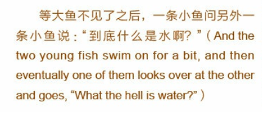
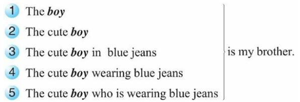
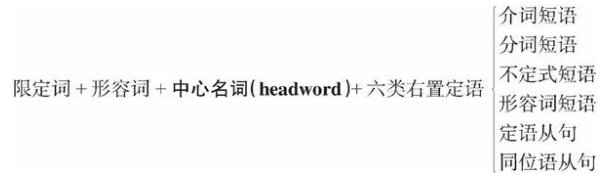
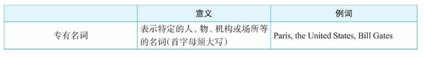
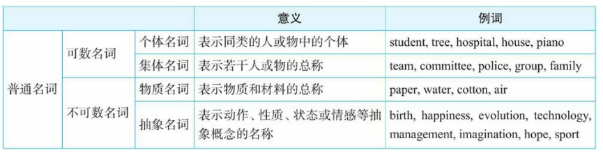
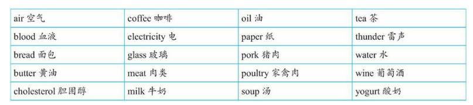
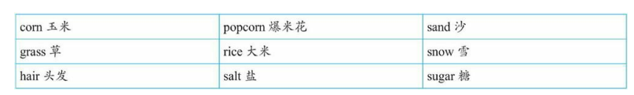
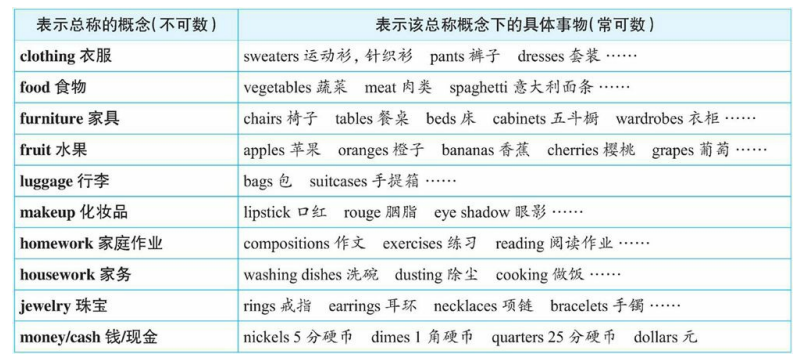
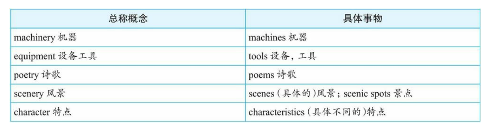
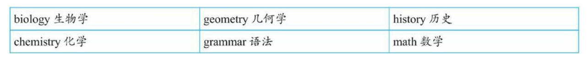

## 母语和外语

故事：

他们不知道大鱼在说什么，所以他们继续游着，没有回答。

对于语言也是如此：1. 水，就是母语环境; 鱼，就是母语人士。

普通母语人士，没有脱离过自己的母语环境，不能理性认识自己的母语，比如不同的自己母语的语法规则，只是本能的使用母语。

语言专家或者学习过外语，且有其他外语作为参照的人士，才能了解自己母语的特点和说这种语言的人的一些思维习惯和看世界的角度。

不学语法，很难说地道且自然的表达外语，不要脱离语境讲语法、讲英语。

分别体会一下母语和外语示例：

对于母语：

经过一个月的努力，我的汉语水平有________很大的提高。 

A.了

B.过

C.着

D.的

我们不知道“了”和“过”的语法规则，但是我们能准确的选出正确答案。学习中文的外国人则很难。

对于英语：

> There are these two young fish swim along and they happen to meet an older fish swim the other way, who nods at them and says, “Morning, boys. How’s water?” And the two young fish swim on for a bit, and then eventually one of them looks over at another and goes，“ What the hell is the water?”

我们就很难凭借“语感”，并且根据这样的语感读出其中的英文错误。其实上面的句子中有5处错误：

1. 把两个swim改为swimming，即采用**现在分词作后置定语**。
2. 把How’s water添加the改为How’s the water，**表示特指**，即特指这里的水。
3. 把another改为the other，因为是两条鱼中的另外一条。
4. 把最后的water前面的the去掉，因为这里是**泛指含义，泛指水这种物质**，不能加the。

上面的语法术语比如“现在分词”、“后置定语”，可能对一些英语母语人士来说，根本就不知道是什么，但他们却能说出正确的句子。

要精通一门语言，就必须精通它的语法，**而学习英语语法的本质是学习英语国家人的思维习惯，就是在理解英语国家的人是如何看待一个事物，以及习惯于怎样去描述这个事物。语言是人类思维的载体，语言表达本质上是一种思维的表达。**

语法是能塑造和培养年轻人的思维的。(This stands for grammar cultivating young minds.)

> Grammar is the way to distinguish between those who know their shit, and those who know they’re shit.
>
> 语法能把人们分成是大智还是大愚。

**建立起自己的英语语法知识体系**

## 新书旧书

旧书：

1. 走近语法
2. 通悟语法
3. 驾驭语法

目的是给一个完整的、清晰的语法框架体系，因而只是对英语语法做了一个入门介绍，比较浅显，让读者有个初步了解，掌握一些基础知识。

新书：

1. 句子成分超精解
2. 定语从句超精解
3. 名词从句超精解
4. ...

新书针对每一个语法项目深入、系统地研究句子的逻辑语义关系，各种不同的结构和逻辑差异。

系列图书的特点：

1. 有文章故事
2. 提供语境背景
3. 提供思路总结
4. 提供构思过程，逻辑推理和论证，最后总结本质规律

推理示例：

交易时常说的：“你看着给吧”。

1. 根据语境，这里“给”不是give而是pay。

2. 实际上是“给一个合理的价格”，英文就是pay a fair price。

3. “你看着给”意思是“给一个你认为合理的价格”，这里有“你认为”you think，这时就需要构造一个从

   句，以便于把you think作为一个插入语放进去。

4. 于是想到把形容词fair前置修饰改为后置修饰，构造一个定语从句pay a price that is fair，然后放进插入语you think说成pay a price that you think is fair。现在可以用what替换a price that，于是说成：

   a. Pay what you think is fair.

   或者添加you can这样说：

   b. You can pay what you think is fair.

   这里what从句没有疑问意义，是一个名词性定语从句，并且具有泛指含义，因此，可以把what改为whatever说成：

   c. You can pay whatever you think is fair.

整个句子的字面意思是“你可以按照你认为合理的价格来支付”，这也就是汉语“你看着给吧”所要传达的意思。

**学习贵在坚持**

“Stay hungry; stay foolish.”——JOBS

强调做事的激情和坚持。要像傻瓜一样地坚持。真正的好东西是聪明人下笨功夫做出来的。需要长期的坚持，坚持观察、思考、总结、验证、运用等。

because引导的从句作主语:

There is a big difference between activity and accomplishment. Just because you are doing something doesn’t mean you are getting anywhere.One must evaluate one’s activity in order to have accomplishment.(忙碌并不意味着就一定会有成果，二者之间有很大不同。只是因为你在不停地忙碌并不意味着就有成果。因此，人们必须认真审视自己的忙碌，看能否取得成果。) 

the point where...定语从句：

Whatever you do, if you want to become great at it, you need to work day in and day out, almost to the point where you are addicted to it, and over a long period of time.（不论你从事什么工作，如果你想成为该领域的专家，你必须日复一日地去做，直到几乎迷恋成瘾的程度，并且要长期坚持。）

名词从句中以wh-连词引导的表语从句：

You are what you eat.(你即你所食。)

You are what you read.(你即你所读。)

## 本书的结构

对英语句子的分析将从**结构**方面展开，即句子结构分析。

**句子结构**分析是围绕**句子成分**展开的。

1. 先对句子成分进行简单的分类、组合，从而得出五种基本句型。
2. 对每一个句子成分进行深入的分析，包括这些句子成分的结构、位置、功能和语义等。
3. 介绍一下这五种简单句型是如何“进化”成复合句，为定语从句和名词从句打基础。

结构：

第一章 句子成分概述

第二章 句子成分详述

第三章 简单句与复合句

- 注重规则背后的英语思维的培养，而非记忆一些教条式的规则
- 理解那些例外的规则背后的思维
- 注重句子，短文以及上下文环境及其中英语思维，而不是单一的例句
- 将学到的思维规律直接转为日常对话用的语句，达到举一反三的，创造性的使用英语

对于学习英语，如果只是死记单词，而没有训练出良好的英语思维，那么学到的不过是英文这种文字 （word）或文本（text），而不是作为思想表达工具的英语这门语言 （language）。

英语思维：从语言本身去分析，语言无非就是人们交流思想的工具。

- 发出声音，即语音（有发音单元）
- 记录声音的符号，即词汇（有词根，前缀，后缀）
- 把词组成句子的造句规则，即语法（有规律）

真正意义上的人类语言都离不开这三要素：语音、词汇、语法。

语言作为思维的载体， 而**语法作为一种语言表达规律的归纳和总结，必然集中体现了该种语言的思维模式（语法即是思维）**。

## 错误认知

1. 语法等于规则

   > 规则（由人制定的）一般要严格遵守。语法不是由语法专家事先确定并要求人们去遵循的。把“语法”当成“法律”，认为专门制定出来语法规则是为了规范人们的言语行为的。传统语法书也加强了人们这 种错误印象。因为它们往往是先列出一些规则，然后再针对这些规则给 出相应的例句，告诉读者，按照规则这么造句才是对的。久而久之，让 人产生错觉：以为是先有一套语法规则、教条，然后必须按照这些规则才能制造出具体句子。
   >
   > 事实上，先有语言（人们的思维活动），在长期的人类发展过程中，语言学家不断研究，然后再从大量的语言实践中总结出人们在使用这种语言时所遵循的**一般思维规律或表达倾向**，即所谓的规则。
   >
   > 所以，**语法规则不是什么不可逾越的，而是对人们的思维规律或语言表达习惯的归纳和总结。**

2. 把语法规则当作一成不变的公式

   > 语法不像数学公式，语言是灵活多变的，同时又具有规律性。**语法规则就是对这些规律性的语言现象进行归纳和总结，但并不能涵盖所有的语言现象。**所谓的“语法规则”只不过是一种“权宜 之计”的规则，是为了方便语言初学者的学习。因此，语法并不是一成不变的“公式”，也不是非此即彼的，而是存在很多“灰色地带”，因而总有“例外”存在。

3. 把语法规则当成随意的公式

   > 比如，对于冠词的用法，一般语法书上会有这样一条规 则：“第一次提到的单数可数名词前面用不定冠词 a 或 an，这一名词再次出现则要用定冠词 the”。传统语法书上往往只是给出这样的规则，但不解释为什么会这样选择冠词，英语学习者很容易误认为语法规则是随意的、专断的，没有什么道理可言的，因而容易死记规则，而忽略了规则背后的合乎情理的思维规律。
   >
   > 其实，很多看似随意的规则，其背后都有共同的思维规律。因此，学语法重在理解规则背后的合乎情理的思维，而不能“死记”规则。

由于以上的错误认知，导致国人和老外（native speakers of English） 在使用英语方面的最大的区别就是：我们记住了英语语法规则却没有英语思维，而老外是在用英语思维，尽管他们不懂语法规则。

国人学生学习语法规则都用来对付英语考试，而没有真正懂得规则背后的英语思维。一味僵化地记一些规则，然后简单地用这些规则来套用一个句子“符合”与“不符合”自己牢记的规则，而不去关注句子所使用的语境。这样一来学到的只是一个“虚构”的英文句子，而不能把所学到的句子活用到真实的英语交际中。这就造成学英语与现实生活中的语言交际脱节。

**语法是对语言表达习惯的归纳，总结出来的规律是为了对语言学习者正确引导，而不是严格限定。**

**把语法当作思维规律来理解，而不应该当作规则来死记。**

学会用英语和理解英语思维。

一般语法书教条式地罗列大量的所谓规则，不讲解背后的思维规律。同时还有许多看似例外的规则加重记忆理解负担，但其实这些例外本质也是有相同的思维规律的。一般语法书严重忽视句子的上下文语境，只为说明规则。

语言表达本质上是一种思维的表达，一种人类交流思想的**工具**。

语言本身分为三个部分：

1. 语音
2. 语音对应的符号——词汇
3. 把词汇组成句子的规则——语法

语言作为思维的载体，而语法作为一种语言表达规律的**归纳和总结**，集中体现了该种语言的思维模式，认识世界的习惯。

英语语法不是规定的规则，所以并不存在严格遵守一说。语法是源自语言，是先有语言，然后再从大量的语言实践中**总结**出人们在使用这种语言时所遵循的**一般思维规律或表达倾向**，即所谓的规则。语法规则不是什么不可逾越的规则，而是对人们的思维规律或语言表达习惯的归纳和总结。

语法规则不是一成不变的公式，语言是灵活多变的，同时又具有规律性。语法规则就是对这些规律性的语言现象进行归纳和总结，但并不能涵盖所有的语言现象。从这个意义上讲，“语法规则”只不过是一种“权宜之计”的规则，是为了方便语言初学者的学习。因此，语法并不是一成不变的“公式”，也不是黑白分明的，而是存在很多“模糊区域”或“灰色地带”，因而总有“例外”存在。

语法规则也不是随意的公式，比如：比如，对于冠词的用法，一般语法书上只会给出这样一条规则：“第一次提到的单数可数名词前面用不定冠词a或an，这一名词再次出现则要用定冠词the”。但是并不解释背后的和逻辑的思维规律，导致这些规则看上去就很随意。

传统的英语教学中，导致我们往往只是僵化地牢记一些规则，然后简单地用这些规则来辨别一个句子“符合”与“不符合”自己牢记的规则，而不去关注句子所使用的语境。导致学了无法致用。

## 学习语法内容

**搞清楚学习语法规则应该包括哪些方面内容**

以单词举例子，词汇除了有发音外，还包括形式（即单词的拼写形式）、意义（即单词的含义）和用法（即单词的用法）。

语法也是一样的，有形式（form）、意义（meaning）和用法（usage）这三方面，同时，语法还包括了将这些单词连词成句的规律。

形式：某个语法结构是怎样构成的。比如“现在完成进行时”的构成形式是have been doing。首先要做到能够**准确地构造某个语法结构**（语法结构的准确性问题）。

意义：某个语法结构能表达什么意义。比如“现在完成进行时”可以表示“一个活动从过去一直延续到现在说话时刻”的含义，这就是现在完成时态这一结构所具备的语法意义。**特定的结构形式能够表达特定的意义**（Particular forms will express their particular meanings）（语法结构的表意性问题）。**对于一个句子，它的含义不仅仅是来自于句中所使用的词汇的含义，而是还有来自于其中特定语法结构所含有的语法意义。**

用法：关于何时／为什么使用某一语法结构。这与在实际交流中的语境有关系，即特定的语境中，采用某种特定的语法结构来表达特定的意义才合适，（语法结构的合适性问题）。用法取决于说话者想表达的意义。

某一特定的语法结构的形式、意义和用法这三者之间是相互联系的，图示如下：

学习英语最后要达到的目的：**英语学习者要能够准确地、有意义地、恰当地去运用英语语言结构**。做到这一点，才算是真正灵活使用语法规则，并进而在思维高度上来使用英语了。

### 形式与意义的关系案例

说明形式与意义的关系案例：

1. I have been coming to Beijing for fourteen years.

可能被误认为的理解：

1. 我来北京有 14 年了。
2. 我到北京一路上走了 14 年

即使每个单词都认识，并且都知道语法结构 have been coming 是“现在完成进行时态”，尽管如此，但依然不知道这句话真正所要表达的意义。 正确的理解是：在过去这 14 年当中，我常常来北京。

由此可见，**知道语法结构的形式并不一定就懂得语法结构所要表达的真正意义。**其实，这里的 have been coming 在英文里表示的是一个重复的活动，具体来说：==用短暂动词（如 come）的完成进行时（如 have been coming）来表示到目前为止的一段时间内重复发生的动作==。

2. I have been coming to Beijing fourteen times.

说话人是想表达“我来北京有十四次了”这样的意思。这样对吗？这也不对。为什么？==因为现在完成进行时态在表示重复活动时， 不能说明具体的次数，比如这里的“十四次”==。这就属于知道 have been coming 形式（现在完成进行时态）和意义（表示重复活动），但并没有真正掌握其用法，即不知道如何恰当地使用完成进行时态来表达重复意义。==由此可见，知道语法结构的正确构造形式以及所能表达的意义，也并不一定就保证能够正确使用==。

传统教学中，基本都只是强调某种句子的结构形式，然后告诉学生根据句子形式构造出正确的句子，重点掌握句子构造的形式，而很少把例句中的真正意义和所使用的语境交待给学生，因而学生对这些句子不知道该如何恰当地使用。致使学生学习到的都是一些死句子而不能交流。

学习英语应该从实际应用出发。认识到语法不单是一个形式（句法学）问题，还包括在合适的语言环境（语用学）来表达某种意义（语义 学）。**因而在举例讲解某个语法结构时，不仅读者要学会如何在形式上达到准确性，同时也要做到恰当地运用该语法结构，把握其意义。**

## 语境

一个句子的用法（什么时候使用说一句话），取决于你要表达的意思，意思又因为不同的语境而有所差异，而要表达的意思则由不同词性和形式的单词按照一定规律组成。在真实的语言交际过程中， 任何一个句子都不是孤立存在的，都有一个赖以生存的语境。甚至有时候，语境决定了一个句子真正要表达的意思。

比如下面这个对白发生在一位父亲与自己女儿的男朋友之间：

> Father: Do you drink?
>
> Young Man: No, thanks, I'm cool.
>
> Father: I'm not offering; I'm asking IF you drink. Do you think I'd offer alcohol to teenage drivers taking my daughter out?

这位父亲问他女儿的男朋友（其正准备开车带他女儿出门）：Do you drink? 他真正的意思是问这个年轻男子是否有饮酒的习惯，即是在询问情况，而不是问他现在想不想喝酒，即不是在提议。这就是语境对于句子意思的重要影响。

> Ted: Where did you learn to Rollerblade?
>
> Anna: Here in the park. This is only my second time.
>
> Ted: Well, it's my first time. Can you give me some lessons?
>
> Anna: Sure. Just follow me.
>
> (After a while)
>
> Ted: Hey, that was fun. Thanks for the lesson!

对于That was fun这个句子，知道它的语法结构形式——一般过去时态（was），以及它的意思——“这很有趣”，但不一定知道该句在什么样的场合使用才正确、恰当。

上面的that was fun被用在了溜冰活动结束之后，而不是在活动进行过程中（此时要说成that is fun）。在上面这个对话语境中，大多数国人可能会说that is fun。由此我们看到，如果不是提供这样完整的对话语境，读者就很难真正会恰当使用that was fun。

所以，在学习语法规则时，不仅要能够构造出形式正确、能够表达意义的句子，更要关注这个句子所能使用的语境。传统的语法书和语法教学在这方面做得相当不够，他们提供例句主要是为解释某条语法规则服务的，而句子背后的使用语境没有展现给学生。规则下面罗列的例句都是僵化的、脱离了语境的死文字。

**去分析、解释为什么英语本族语者要“这样”说（what native speakers of English actually do say and why）**

在学习某个语法规则时，不仅要知道这个语法规则是什么，结构怎么构造的，还要知道这个规则背后的为什么以及如何使用这个规则；在举例时，不仅要理解句子的中文译文，还要展现这个句子所使用的语境，或者是通过给出对话或短文来为例句提供一个完整的语境，这样就使得读者能够充分理解所学到的每个例句在具体交际中的使用。

## 英语和汉语思维

例句：我已经结婚了。句子用英语如何表达？

“我已经结婚了”为什么不是：I have married; I have been married; I got married; I married; I had married，而是 I am married.

去年结婚的。：I got married last year.

到现在结婚有一年多了。：I've been married for over a year

简单比较一下，读者可以看到，汉语中的“结婚”一词，用英文表达却有 am married、got married 以及 have been married 这样的区分。==而这样形式上的区分背后反映了英汉语言的一个重大思维差异：英文中有“动作 （action）”与“状态（state）”和 "时态"的区分，而这些话语特点在汉语思维中都 是“盲点”，是天然缺失的。==这就造成这样的窘境：可以轻而易举地 把“I am married. I got married last year. I've been married for over a year.”译成地道的中文，但反过来由中文却无法译成地道的英文，即能读懂英语句子，但在真正交际中不一定能准确地说出这样的句子，这就 说明“读懂 ≠ 会用”。更严重的是，因为不懂英文思维特点，有时甚至都读不懂句子，而造成误解句义。比如下面这句：

He is interesting to listen to

是要表达什么意思呢？一定有读者这么理解： 他对听别人讲话很感兴趣。 这么理解就错了。其实这句话意思是： 听他讲话很有趣。 不能正确理解这个句子的一个根本原因是没有真正理解这个句子的 如下“深层结构”：

It is interesting to listen to him.

也就是说，在表层结构上，he 是做句子的主语（He is...），但在深层结构上，he 是作 listen to 的逻辑宾语（...listen to him）。这里不定式 to listen to 的逻辑主语是泛指大众，在句中没有明确给出，而只是隐含其中的。

所以，如果读者只满足于看懂句子意思就行了，而不去真正理解英语的思维规律，那么英语水平是无法**真正提高**的。这就是为什么大量中国英语学习者的英语水平就停留在能看懂英文文章但是说不出、写不来的尴尬境地，究其原因，还是因为没有真正“懂英文”！

## 名词短语

名词短语（noun phrase，简称 NP）是英语句子的核心组成部分（a core element of a sentence）。

搞清楚名词短语的构造规则。

### 案例

“世界最著名的七大奇迹”该如何翻译成英文。对于这个表达，笔者认为中文里可以说得很灵活。比如：

1. 世界最著名的七大奇迹

2. 最著名的世界七大奇迹
3. 七大世界最著名的奇迹

汉语可以如此灵活地表达，那么英语也像汉语这样灵活吗？当然不是。**英语向来以语序固定严格而著称**，因而英文被称为“固定词序语言（a fixed-word-order language）”。

那么英文该怎么说？我们下面提供几个译文：

1. the world's most famous seven wonders
2. the most famous Seven Wonders of the World
3. the seven world most famous wonders
4. the world's seven most famous wonders

上面的译文哪个才是正确的呢？要想回答这个问题，就必须搞清楚“名词短语”的构造规律。

语言的构造级别可以分为这样五个层次：

1．词（word）

2．短语（phrase）

3．句子（sentence）

4．段落（paragraph）

5．篇章（discourse）

在本篇中，我们主要就是进入句子的内部来分析，即在“短语”这一层次来讨论句子的构造特点。英语里的短语有很多类，比如有动词短语（如 have been doing）、介词短语（如 for you）、名词短语（如 my best friend）等。其中名词短语最为重要， 因为它是英语造句中不可或缺的元素。

### 定义

名词短语：名词与它的修饰语一起即构成名词短语。

### 功能

先来看几个简单的句子，考察一下名词短语在句子中可以充当哪些成分：

1. These red roses are for you. 名词短语 these red roses 在句中充当**主语**。 译文：这些红玫瑰是送给你的。
2. I have three close friends. 名词短语 three close friends 在句中充当**宾语**。 译文：我有三个要好的朋友。
3. I really need a new computer. 名词短语 a new computer 在句中充当**宾语**。译文：我真的很需要一台新电脑。
4. I can't find the best answer. 名词短语 the best answer 在句中充当**宾语**。译文：我找不到最佳答案。
5. He is my best friend. 名词短语 my best friend 在句中充当**表语**。 译文：他是我最好的朋友。
6. There are some red roses **on that small table**. 名词短语 some red roses 在句中充当**主语**；名词短语 that small table 在句中充当**介词 on 的宾语**。 译文：在那张小餐桌上有一些红玫瑰。

==英文中的介词不能单独使用，其后面必须接宾语，所接的宾语也往往是名词短语。==

短文案例：

> National Flag
>
> The national flag of the People's Republic of China (PRC) is a red rectangle emblazoned with five stars. The red of the flag symbolizes revolution; the stars are yellow so that they will stand out brightly against the red ground. The larger star represents the Communist Party of China (CPC) and the four smaller ones, the Chinese people. This expresses the great unity of the Chinese people under the leadership of the CPC.

国旗

中华人民共和国的国旗是五星红旗。国旗旗面的红色象征革命；五角星用黄色是为了在红色旗面上更引人注目。大五角星代表中共，四颗小五角星代表中国人民。五颗五角星相互依存，象征中共领导下的人民大团结。

上面短文的名词短语分析：

1. the national flag of the People's Republic of China (PRC)
   这是一个较大的名词短语，它又可以细分成 the national flag 和 the People's Republic of China 这样两个小的名词短语。该名词短语作句子的主语。

2. a red rectangle emblazoned with five stars

   这个名词短语又可以进一步分成 a red rectangle 和 five stars 这样两个小的名词短语。该名词短 语作句子的表语。

3. the red of the flag
   这个名词短语又可以进一步分成 the red 和 the flag 两部分。该名词短语作句子的主语。

4. the stars
   该名词短语作句子的主语。

5. the red ground
   该名词短语作介词 against 的宾语。

6. the larger star
   该名词短语作句子的主语。

7. the Communist Party of China (CPC)
   该名词短语作句子的宾语。

8. the four smaller ones
   该名词短语作句子的主语。

9. the Chinese people

   该名词短语作句子的宾语。

10. the great unity of the Chinese people under the leadership of the CPC

    这个名词短语又可以进一步分成 the great unity, the Chinese people 和 the leadership of the CPC 三部分。该名词短语作句子的宾语。

不论是英语的单句还是文章，都含有大量的名词短语。

### 构造规律

名词短语的构造——==“左二右六”的定语规律==。

名词短语是由名词与它的修饰语一起构成的。==名词的修饰语与名词 的位置关系不外乎两种：一是放在被修饰名词的前面，称之为前置定语或定语；二是放在被修饰名词的后面，称之为后置定语。==

一般来讲，名词前面有两种修饰语。一是限定词，==用来限定名词所指的范围，对名词起泛指或特指、定量或不定量等的限定修饰作用。== 比如上文中的 these, three, a, the, my 和 that。二是形容词，==是用来表示名词的性质和特征的==。比如上文中的 red, close, new, best 和 small。

在复杂的名词短语中，更常见的是后置修饰语。一个名词可以带的后置修饰语的种类很多，包括**定语从句、 同位语从句、分词短语、不定式、介词短语、形容词短语和副词短语**等，而且还有这些**不同的后置定语复式出现**的情况。

的中心词名词是 boy，然后在 boy 的前面或后面分别添加各类修饰语，组合成不同的名词短语。

在英语里，修饰名词的定语，其语序的位置是极有规律的。

在英语里，名词的定语要么在名词的前面或者叫左边， 要么在名词的后面或者叫右边。位于名词前面的定语，可以叫前置定语，或左置定语，或定语；而在名词后面的定语，可以叫后置定语，或右置定语。

左置的定语只有两个：==限定词和形容词==，且可能存在多个限定词或者形容词

> the American national flag：限定词＋形容词＋形容词＋名词

右置的定语共有六种（尽管可以有副词作右置定语，但因较少用到，在此不作讨论）：==介词短语、分词短语、不定式短语、形容词短语、定语从 句以及同位语从句==。

==左置的两个定语的位置关系非常明确和严格：必须是限定词在形容词的左边，结构是：限定词＋形容词 ＋名词。==

==英语和汉语的一 个基本差别就是名词修饰语即**定语**的位置差异。汉语的定语一律是在名词的前面，而英语的定语有在名词前面的，也有在名词后面的， 多的定语是置于被修饰名词的后面，构成后置定语。所以，在**语言学** 上，**汉语被称作是“中心词（head）在后”的语言（head-last language）；英语被称作是“中心词在前”的语言（head-first language）**。==

### 句子成分

一般说到句子成分，都会说是“主谓宾定状补”六大句子成分。其实，“定语”并不能算是真正意义上的句子 成分。原因：

1. 定语是用来修饰或 限定名词的。从上面讨论的名词短语来看，定语只是名词短语的构成成分，最多称之为“短语成分”。
2. 语言的构造级别可以分为词、短语、句子、段落 和篇章这样的等级。主语、谓语、宾语、补语和状语这五种“句子成 分”都是在“句子”这一层级上的成分。而定语成分则“稍逊一层”，它属于“短语”这一层 级，是属于“短语成分”，即是组成名词短语的成分，然后通过名词短语 间接地构成句子成分。

因为造成我们对英语句子理解障碍的“罪魁祸首”之一 就是英语里**复杂的定语修饰关系**。所以，前面介绍的关于**定语的结构规律**是非常重要的**英语思维规律之一**，建议读者在今后无论是读英语还是写英语，都要给予极大的关注。

## 名词

名词短语的核心部分——名词。关于名词的一些列问题：

1. 何谓可数名词？

2. 何谓不可数名词？

3. 如何判断一个名词是可数还是不可数？

4. 名词复数形式的变化规则有哪些？

5. 什么时候要用's 所有格？

6. 什么时候要用 of 属格？

英语里的可数名词与不可数名词来 说，汉语思维里是不把名词作这一区分的。这一区分涉及了思维上的差异，而这种思维在我们汉语语言里是天然缺失的。因此，学了很 多年英语的中国人，通常还是搞不清楚某个名词是可数还是不可数，因 而造成大量的表达错误。比如在说话或写作中，大批的中国学生常 常“忘记”在复数名词后面加-s，或者搞不清楚某个名词的后面该不该加 s。

从思维的高度来说，可数名词与不可数名词这一区分反映了中国人与英语的 native speakers 在看待客观外界事物时所持的两种不同的 世界观：**国人的脑子里想到某个名词时，不关注它是可数或不可数；但在 native speakers 的脑子里，每个名词都有可数与不可数之分**，因而对事物的理解是不一样的。

#### 分类

名词定义：用来表示人、事物、地点以及抽象事物的名称的（A noun is the name of a person or thing.）

分类：

专有名词：

1. 人名及头衔

2. 著作名称

3. 月份

   > January, February, March, April, May, June, July, August, September, October, November, December。
   >
   > the solar calendar：阳历
   >
   > the lunar calendar：阴历
   >
   > 阴历二月”不能说 February，而是 the second month on the lunar calendar 或者说成 the second lunar month。
   >
   > 七夕：the seventh of the seventh lunar month
   >
   > 中秋：the fifteenth of the eighth lunar month

4. 星期、四季

   > Sunday, Monday, Tuesday, Wednesday, Thursday, Friday, Saturday。
   >
   > winter, summer, spring, autumn。

5. 节日

6. 地理名称

普通名词：分为可数名词（countable noun）和不可数名词（uncountable noun）。

1. 可数名词变复数？
2. 限定词修饰名词？
3. 名词用作可数与用作不可数，意义上的差别？

根据名词的构成，可将名词分为简单名词和复合名词。对于名词，最重要的分类就是可数名词与不可数名词。这一分类是学习英语名词用法的核心，因为它关系到很多问题，比如可数名词变复数的问题，限定词修饰名词的问题，还有是一个名词用作可数与用作不可数，意义上有差别。

简单名词就是组成部分不可被分割的名词，比如 story, student 和 teacher 等。英语中的名词绝大多数是简单名词。复合名词就是由若干单词组合而构成的名词，比如 girlfriend, roommate 和 mother-in-law（岳母／婆婆） 等

#### 名词的数

- 名词的可数性，即区分可数名词，这一角度侧重于名词的意义方面而不是构成形式方面；
- 名词的单数与复数形式，这一角度侧重于名词的构成形式方面；

从意义（meaning）与形式（form）两个 方面来讨论名词。

为了表达什么样的意义就使用什么样的形式。特定的意义是通过相应的形式来传递的。

从意义上来界定英语不可数名词的特点，**可数与不可数的“相对论”，即一个名词是可数还是不可数关键 在于它所表达的意义，与它所使用的上下文语境密切相关，因而不能孤 立地来看待名词的可数性。**

不能按汉语的思维来理解英文 名词的可数与不可数。总的来说，不可数名词有以下规律：

1. **对于一些无法分割的名词，将其看作一个整体，因而作为不可数名词**，没有复数变化（nouns that have no distinct, separate parts, we look as the whole）。这样的名词主要是一些物质名词：

   

或者按气体、液体和固体来作出分类：

2. **一些因其组成部分太小而不易数的名词**（nouns that have parts that are too small or insignificant to count）用作不可数名词。

2. **表示总称的名词通常不可数**（nouns that are classes or categories of things）。这些名词侧重于表示某类事物的总的概念，而不是具体的事物。如果要具体指出该总称概念下的具体事物，则要用其他 不同的名词。

   

从形式上来总结可数名词的复数变化规则。

其他的总称名词有：

就拿 character 来说吧，很多同学在作文里谈到“特点”时，就喜欢说 characters，殊不知，character 作为“特点”讲时，是一个不可数名词，不 能变成复数的。因为它真正的意思是 the combination of qualities or features that distinguishes one person, group, or thing from another，表 示“使与其他人、群体或事物相区别的性质或特征的集合”，强调的是一 个整体的概念，因而是没有复数形式的。

4. **抽象的名词一般是不可数的（nouns that are abstractions）**

   

   要特别注意的是，上面这些名词可以有其他不同的意 思，因而可以转化为可数名词。

5. 表示研究学科（subjects of study），一般作为不可数名 词。

   

#### 不可数名词的度量

不能用具体的数字（基数）（比如 one, two, three, four）来表示不可 数名词的数量，但可以借用量词来表示其量的概念。不同类型的不 可数名词所使用的量词不一样，一般的规则如下：

1. piece 修饰：

   advice, bread, baggage, chalk, equipment, furniture, information, jewelry, luggage, music 和 news 等

   > a piece of news（一条消息）
   >
   > two pieces of news（两条消息）
   >
   > several pieces of furniture（几件家具）
   >
   > three pieces of luggage（三件行李）

2. 用 bottle, cup, drop 和 glass 修饰液态物质
   比如这些名词：beer, blood, coffee, milk, tea, water 和 wine 等。

   > several drops of blood（几滴血）
   > a glass of milk（一杯牛奶）
   > two glasses of wine（两杯葡萄酒）
   > two cups of coffee（两杯咖啡）

3. 其他的量词

   > a loaf of bread（一长条面包）
   >
   > a tube of toothpaste（一筒牙膏）
   >
   > a slice of meat（一片肉）

不可数名词一般不能直接被不定冠词 a/an 修饰。

## 冠词（限定词）

限定词（determiner）必然修饰某个名词，用于限定名词所指的范围，或者对名词起到特指或者泛指，具体数量或者不定量。限定词与名词的位置关系：

1. 限定词+名词
2. 限定词+形容词+名词

英语的十大词性中并没有限定词这一分类。而是对名词起到限定作用的各类词的总称。

典型的限定词包括：

1. 冠词：a，an，the
2. 基数词和序数词：one/first，two/second等
3. 指示代词：this，that，these，those
4. 物主代词：my，your，his，her，our和their
5. 数量限定：a few，a little，much，many，a lot of，some，any，enough，several等
6. 个体限定：ench，every，either，neither，both等
7. 名词所属格：mary\`s，his father\`s

冠词这一词性在汉语中是缺失的，但是却表现了英语的思维表达的特点。

英语中，冠词有三个：

1. a：用在以辅音音素开头的名词前面
2. an：用在以元音音素开头的名词前面
3. the

a/an是不定冠词，the是定冠词。

> a boy
>
> a student
>
> a university
>
> a unique person 
>
> an unkind old lady
>
> an hour
>
> an honor
>
> An L letter is in the word "letter".

冠词的用法

1. 将普通名词划分为可数名词和不可数名词是正确使用冠词的前提。

   重点区分三种情况下冠词和名词的搭配情况：

   - 不可数名词与冠词
   - 可数名词单数与冠词
   - 可数名词复数与冠词

2. 区分特指与泛指

   冠词除了要根据名词的情况选择外，还要确定是特指还是泛指。a/an不能用作特指，the用作特指。

   泛指：表示一类事物或者某类事物的总称。

   特指：表示某类事物中的具体某一个或者某一些

3. 结合篇章和语境

### 泛指

- 不可数名词不加冠词——表示泛指
- 复数名词不加冠词——表示泛指
- 单数名词与定冠词（the）连用——表示泛指
- 单数名词与不定冠词连用——表示泛指

## 动词

一般来讲，对于一个完整的英语句子来说，谓语是不可或缺的；也就是说，一个完整的英语句子可以没有主语或宾语等成分，但不能没有谓语。谓语部分一般有动词和动词的不同形式来充当。

英语句子的否定、疑问，五种基本句型，句子谓语的时态、语态、语气，非谓语动词等，都是有关动词的语法规则。

### 动词分类

1. 句子的谓语构造的基本分类，涉及助动词、情态动词和实义动词，这关系到英语句子的否定和提问等结构变化
2. 实义动词的分类，这关系到英语句子的五种结构类型，关系到英语造句

根据动词的词义和在谓语中的作用分类：

1. 实义动词（notional verb）
2. 助动词（auxiliary verb）
3. 情态动词（modal verb）

### 实义动词

实义动词的特点： 

1．从词义的角度来看，**实义动词具备完整的词汇意义；** 

2．从在谓语中的作用的角度来看，实义动词能**单独**充当句子的谓语。英语中除了助动词和情态动词以外，其他的均为实义动词。

特殊的实义动词：be，do和have

三个助动词be，do和have，可以用作实义动词或者助动词。而作为助动词或实义动词，它们在词义和谓语中的作用这两方面是完全不同的。所以，不要混淆be作为系动词和助动词、do作为实义动词和助动词以及have作为实义动词和助动词。

### 助动词

助动词的特点： 

1．从词义的角度来看，**助动词不具备词汇意义**； 

2．从在谓语中的作用的角度来看，助动词**不能单独**充当句子的谓语，它**必须和实义动词连用，以帮助构成各种时态、语态、语气、否定和疑问等。**

英语的助动词有三个：be，do和have，它们分别具有各种变化形式。如下： 

1．be: am, is, are, was, were, been, being 

2．do: does, did 

3．have: has, had, having

同时这些各种形式的助动词还有各种变化形式。

### 情态动词

情态动词的特点： 

1. 从词义的角度来看，情态动词有其自身的词汇意义，如用来**表示可能、建议、愿望、必要、允许、能力、怀疑**等，以表示说话者对某种行为或状态的看法或态度。 

2. 从在谓语中的作用的角度来看，情态动词在句中**不能单独**作句子的谓语，而必须和实义动词一起构成复合谓语。

英文中的情态动词主要有下列10个： can/could, may/might, shall/should, will/would, must和had better。

另外还有一些与上述情态动词有关的短语动词： 

1. be able to（与can类似） 
2. be going to（与will类似） 
3. ought to, be supposed to（与should类似）
4. have to, have got to（与must类似） 

此外，need和dare既可以用作情态动词，也可以用作实义动词。

## 五大基本句型

根据**动词的词义**和其**在谓语中的作用**，把动词分为**实义动词（notional verb）**、**助动词（auxiliary verb）**和**情态助动词（modal verb）**。在三类动词中，能独 立充当句子谓语的只有实义动词。

实义动词不仅是句子谓语的核心成分，更重要的是，**它决定了一个句子的骨架结构**。具体来说，**实义动词决定了一个句子是否有宾语、有几个宾语以及其他的句子成分。**

五大基本句型都直接和**实义动词的分类**直接相关。

英语的语序不如许多其他语言灵活，现在的英语是依赖于较为固定的词序来区分主语和宾语的。

1. A dog bites a man. ：这里的a dog是动作bites的执行者 （agent），语法术语叫做主语；而a man是动作bites的承受者（recipient），语法术语叫做宾语。
2. A man bites a dog. ：这里的a man是动作bites的执行者，即主语；而a dog则是动作bites的 承受者，即宾语。

英语这门语言的词序比较严格，**词与词之间先后位置的改变往往会使句子的意思也发生变化，所以，英文被称为“固定词序语言”（English is a "fixed-word-order" language.）**

英语一般遵循的严格词序：

1. 主语＋谓语动词＋宾语（subject-verb-object，即SVO句型）

汉语是否也是按照SVO的规则来造句呢？先通过一个非常简单的汉语句子“我吃了饭（I had a meal.）”来考察一下汉语的词序特点。对于这个句子，汉语中至少有下列这些说法： 

1. SVO型：我吃了饭。 
2. OVS型：饭吃了我。
3. SOV型：我饭吃了。
4. OSV型：饭我吃了。
5. VOS型：吃了饭了我。

同样是“我吃饭”这个意思，汉语里至少可以有上述五种表达方式。由此足见中文表达的词序可以如此灵活。

语言学家的研究统计表明，人类的语言中 有三大基本的常见语序，分别是SVO（如“我吃了饭”）、SOV（如“我饭吃了”）和VSO（Most languages have SVO or SOV order; fewer have VSO）。遵从SVO语序的语言非常多，比如英语和汉 语。遵从SOV词序（即把动词放在句末）的语言主要是日语、韩语、土耳其语和波斯语等，这就 是为什么在日语和韩语里，往往是把动词放在句末的道理。遵从VSO语序的语言包括希伯来语、 阿拉伯语和爱尔兰语等。

三大句型之一的VSO在汉语中一般是没有的。

其次，绝大多数语言里没有的句型在汉语里却有。比如，语言学家的研究统计表明，在众多 的人类语言中，VOS和OVS的句型极其罕见，而OSV的句型可能不存在（VOS and OVS are rare; and OSV may be nonexistent.）但这些句型在汉语中却大量存在，比如“吃了饭了我（VOS）”和“饭 吃了我（OVS）”，以及“饭我吃了（OSV）”。其他例子比如“钱他偷了（OSV）”、“书我拿走了 （OSV）”、“这个包裹你送一下（OSV）”等等OSV型的句子。

再次，关于主语与宾语的先后顺序问题。语言学家的研究统计表明，几乎所有的语言都 是“主语”在“宾语”前的（Subjects normally precede objects in almost all languages.）。对于上述中文 句子，“我吃了饭（SVO）”和“我饭吃了（SOV）”这两个是符合这个规律的，却有“饭吃了我 （OVS）”、“饭我吃了（OSV）”和“吃了饭了我（VOS）”这三个不符合该规律。

关于主语的问题。汉语不仅是主语可以在宾语之后，而且更多的是省略主语。

英汉语序的差异比较多。汉语说“上网聊天很有趣”，我们就不能按照汉 语的语序把这句话翻译成up net chat very interesting，这根本就不是一个英语句子

## 句子成分

分析句子结构就是理解一个句子中的**各个组成部分**之间的**逻辑语义关系**。即分清句子成分 (constituent)，比如哪部分是句子的主语、哪部分是句子的谓语等。

### 为什么要分析句子成分？

很多英语学习者不愿意分析句子成分（**断句**），看句子只是凭借自己的感觉去理解。很多时候，如果不理性地分析句子成分，不搞清楚句子的逻辑语义结构，我们就会误解句意。

同样的一组字词线性地从左往右一字排开，不同的断句方式，造成的句意是不一样的。

汉语示例：“请带好孩子！”

这句话有两种不同的断句方式：

a. 请［带好］［孩子］

 b. 请［带］［好孩子］

如果要进行普遍性的，一般性的分析，需要借助不同的语法术语，比如句子成分的术语包括主语、 谓语、宾语等，以及不同的词性，比如名词、动词、形容词、副词等。 有了这些术语，才能进行概括、总结，才能阐述**一般规律性**的东 西，而不是进行具体例子的具体分析。

使用术语对“请带好孩子！”进行分析：

在a中，“好”是一个副词，修饰动词“带”。从句子成分的角度来 看，“带”是谓语，“好”是状语，具体来说，是方式状语，说明该怎么去带孩子。相应的译文可以是look after your children well或者take good care of your children。

在b中，“带”还是动词，但“好”不是副词而是形容词，修饰名词“孩 子”，此时“好”充当定语。相应的英语译文可以是bring along good children或者bring along well-behaved kids。

在a、b不同的断句分析中，“带”的含义是不同的：a中 的“带”是“照看”的意思，b中的“带”是“携带”的意思，因而相应的英语译文也不同。

英语示例1：

> A man was standing at a bus stop eating fish and chips (炸薯条). An old lady and her little white dog stood next to him. The dog, excited by the smell of the fish and chips, started to bark and jump up on the man’s leg. 
>
> “Do you mind if I throw him a bit?” the man said to the old lady. 
>
> “Not at all,” she said. “Go ahead.” 
>
> So the man picked up the little dog and threw it over a wall.

老太太为什么同意那个男的把她的狗扔出去呢？关键在于理解Do you mind if I throw him a bit?这句话。

老太太是**把a bit当作动词throw的直接宾语**来理解，因此她把这句话理解成“我 给你的狗扔点吃的你介意吗？”所以老太太说：“不介意，你扔吧。”但是，这名男子是**把a bit当作修饰谓语throw的状语**来理解的，因而他的本 意是“我把你这条（讨厌的）狗扔远一点你介意吗？”

这就是没能正确分析句子成分带来的误解。

英语示例2：

> How can you drop a raw egg onto a concrete floor without cracking it?

一位美国小孩的回答是：

> Any way you want, because a concrete floor is very hard to crack.

从他的回答可知，他把句末的it看成是指代concrete floor，而一般人会理解成是指代raw egg。实际上，中文译文“你往水泥地上扔生鸡蛋，怎样才能不把它打破？”里的“它”既可以指“鸡蛋”也可以指“水泥地”。这种对**代词指代对象的不同理解**，也可以看作一种断句方式。

其实在考研或者阅读中，常常会因为**把代词的指代对象搞错而误读句子的意思**。

分析句子成分的两种可能角度：

1. 分析如何断句
2. 对代词指代对象的不同理解

高考示例：

> MIT has offered a program called OpenCourseWare for ten years that makes materials from more than 2,000 classes free online.

主要问题是，该如何理解其中的这个定语从句：that makes materials from more than 2,000 classes free online。

分析方式一：

此时的make是一个接单个宾语的及物动词，意为“制作”，在这句话 中的基本搭配是make X from Y，即“用Y来制作X”，X是宾语，Y是状语。形容词短语free online作定语，后置修饰名词classes，相当于一个定语从句that are free online。

方式一的翻译：从2000多个网上的免费课程中选材来制作新的课程。

分析方式二：

此时的make是一个接复合宾语（即宾语＋宾补）的及物动词，也就是常说的“使役动词”，是“使什么怎么样”的意思，在这句话中的基 本搭配是make X Y，即“使X成为Y这个样子”，X是宾语，Y是宾语补足语。在本句中，Y就是形容词短语free online，作宾语补足语，补充说明宾语materials。此时，该形容词短语不等于定语从句that are free online。

方式二的翻译：把2000多个课程的相关材料免费放在网上。

此外，a、b两种断句方式的差异还在于句子改写方面。具体来说， a句无法进行其他改写，而对于b这种断句方式，考虑到宾语materials from more than 2,000 classes比宾补free online要长，**还可以将二者互换位置**，说成：

> that makes free online materials from more than 2,000 classes.

但是原文到底取哪种结构对应的翻译？此时就需要看上下文的语境。该句 的上文是：

> “Anyone with an Internet connection anywhere in the world can use our online courses,” Harvard President Drew Faust said during a meeting to announce the plan.

这里提到use our online courses（使用我们的网上课 程），与此意思呼应的应该是上面的b句。实际上，只需要研读主 句MIT has offered a program called OpenCourseWare for ten years，也可以断定b种断句才是正确的。定语从句所修饰的先行词是program，它就是 makes的主语。

因此，正确理解program的意思关系到如何理解makes的 意思，进而影响到makes后边的整个断句。这里的program不是指“软件 程序”，而是指“计划，项目”，这个项目的名称是OpenCourseWare。

所以整个句子可以翻译成：

> 麻省理工学院发起了一个名为“公开课件”的项目，至今已有10年， 它把2000多个课程的相关材料免费放在网上。

不会分析句子成分，会导致误判句子意思。更有甚者，面对一个句子，其中的单词都认识，但就是不知道什么意 思。

英语示例3：

> a. John killed a rich person. 
>
> ​	killed是及物动词，后边接名词短语a rich person，作宾 语。因此，这是一个“主谓宾”句型。
>
> b. John died a rich person.  （主系主补或者说主系表）
>
> ​	died是一个不及物动词，因此其后边的名词短语a rich person不可能是宾语。实际上，这里died的作用类似于一个系动词，它 把主语John和a rich person联系起来，二者表达的是同一个人。等价于：John was a rich person when he died.  
>
> 
>
> a. She will make him a good husband.  （主谓宾宾补）
>
> b. She will make him a good wife.  （主谓间宾直宾）

对于两个示例的第一个句子，都容易理解，但是后一句便存在困惑。

以上这些例子能看出准确的句子分析对于理解句子意思是多么重要。如果不能灵活地掌握句子结构，就不能正确地构造英语句子，这就会直接影响到使用英语的水平。

**练习**：

1. 不同角度解释：How can you lift an elephant with one hand?
   
2. A: My father can lift a pig with one hand. Can your dad do that? 
   B: I’m not sure. Where do you get a pig with one hand? 
3. Hairdresser: I’ve had a lot of strange customers in my time. 
   Customer: Have you ever shaved a man with a wooden leg? 
   Hairdresser: No. I always use a razor.

### 句子成分有哪些？	

一般想到的组成英语句子的六种句子成分有：“**主、谓、宾、补、 状、定**”。

其中，有 四种基本成分（basic constituents）：

1. 主语（subject） 

2. 谓语动词（main verb） 

3. 宾语（object） 

4. 补足语（complement）

   

另外两种是修饰成分（modifiers）：

5. 状语（adverbial）：这是用来修饰动词的成分（注：状语的修饰 对象不仅限于动词）
6. 定语（attribute）：这是用来修饰名词的成分

英语的句子成分的两种大分类方式：

1. 句子成分：基本成分和修饰成分；
2. 基本成分：核心成分和谓语成分；
3. 核心成分：主语和谓语；
4. 谓语成分：宾语和补足语；
5. 修饰成分：定语和状语。

宾语：直接宾语与间接宾语。

补足语：主语补足语和宾语补足语。

因为宾语和补足语都是由谓语动词决定的，故此，把宾语和补足语称为“谓语成分”，所以谓语成分不是指谓语，而是指谓语后边所能接的成分。

其实，宾语和补足语是对谓语动词的补充，所以谓语成分也可以称为谓语补足语（predicate complement）。

**句子成分的属性**

| 句子成分   | 属性                 |
| ---------- | -------------------- |
| 主语、宾语 | 名称性的             |
| 谓语       | 动词性的             |
| 补足语     | 名称性的或形容词性的 |
| 状语       | 副词性的             |
| 定语       | 形容词性的           |

副词不能充当主语补足语或者 说表语，因为表语是对主语的补充，而主语和表语都是名词性的，表语还可能是形容词性的，副词不能修饰名词，故副词不充当表语。

**表语是主语补足语的一种，即属于补足语。**

### 怎么分析句子成分？

搞清楚这些句子成分在一个句子中是怎样排列组合的。知道了它们的组合关系，理清句子各成分之间的逻辑语义关系，并最终读懂句意。

**基本句型**

英语句型的划分不涉及句子的修饰成分（即状语和定语），而只涉及句子的基本成分。

参与构成基本句型的基本成分包括：主语、谓语、间接宾语、直接宾语、宾语补足语以及主语补足语（表语）这六种句子成 分。

基本成分的不同组合就构成了英语的五种基本句型，其中**谓语动词对句子是什么基本句型起决定性的作用**。

不同的动词类型决定了不同的句子类型。所以先看一下动词的分类：

从本表的“动词分类2”中看到动词可以分为五类，因而就决定了**英语的五种基本句型**。

**五种基本句型**

1. subject + verb (vi.) 
2. subject + verb (vt.) + object 
3. subject + verb (vt.) + indirect object + direct object 
4. subject + verb (vt.) + object + object complement 
5. subject + linking verb + subject

Her love died. She loved me. She gave me a kiss. She made me happy. She is lovable.（她的爱已死。她爱过我，吻过我，让我开心过。她依然那么迷人。）

文章：Where Does the Love Go When It Dies？

> But things happened. You had failed to account for the changes that would literally pull you in different directions, that would make you a sort of new person, that would leave one or the other longing to forget about their wild days before adulthood and everything that came with it. From a distance, emotional or geographic, the rate at which you come together to share everything dwindles to nothingness. Eventually, it’s been too long to just call them back. Things have become strange, and there’s a certain metallic taste in your mouth when you think of the memories that have evaporated into thin air behind you.
>
> This lost love must still exist somewhere, transmuting into more love and better love and love for people who haven’t yet felt it. It must be there, because you still remember it. Maybe we just need to hear that they do, too.

>但世事无常。有些变化是你无法解 释清楚的，这些变化使你们各奔东西，使你们成了某种意义上的另一个 人，使你们中的一个或另一个渴望忘掉年少轻狂时那些疯狂的日子，忘 掉伴随着成年而来的一切。隔着遥远的距离——不管这距离是感情上的 还是地理上的——你们重新聚首、分享一切的机会越来越少，直至完全消失。最终，因为时间太久已无法将他/她唤回。一切都变得那么陌 生。曾经那些消失得无影无踪的记忆，如今重新回想起，这让你嘴里有 一种说不出的苦涩味道。
>
>那失去的爱一定还存在于某个地方，转化成更多的爱、更美的爱、让 没有感受过爱的人也能感受到的爱。爱一定还存在着，因为它就活在你 的记忆里。也许我们只需要知道，爱也活在他/她的记忆里。

上面既有长句也有短句，他们本质都可以归属于五种基本句型之一。长难句都是由这五种基本句型叠加、组合修饰语成分而成的。

a. But things happened

but是并列连词，表示与上文转折。主语是things，谓语是 happened，因此，这是一个“主谓”句型。

b.You had failed to account for the changes **that would literally pull you in different directions**, t**hat would make you a sort of new person**, **that would leave one or the other longing to forget about their wild days before adulthood and everything that came with it**.

这是一个主从复合句。主句是：

b1. You had failed to account for the changes you是主语，had failed to account for这个部分整个看成谓语。之所以这么看，是因为fail to do something多用于书面语，意思相当于do not do something或cannot do something。因此，这里相当于说couldn’t account for或者hadn’t been able to account for。名词短语the changes是宾语。因此，该主句属于“主谓宾”句型。

在changes后边的是三个并列的定语从句：

b2. that would literally pull..., that would make..., that would leave...with it 自然都是作定语，修饰changes。

由于这三个定语也是句子，因此还可以进一步对这三个定语从句进行分析，分析的结果依然属于上述五种基本句型。

五大基本句型必然都有主语和谓语（实际口语交际中不一定都有），不论是在主句中，在从句中也是必要的。

1. I love what I am doing.

主句层次：I love ...

主语是I，谓语动词是love，宾语是what I am doing这个宾语从句。

从句层次：...what I am doing 

在what I am doing这个宾语从句中，主语是I，谓语动词是am doing，宾语是what这个**连接代词**。

示例：

a. Money can buy you love.

b. Money can buy your love.

在a句中，谓语buy后边接 了两个宾语：you是间接宾语，love是直接宾语。因此，a句属于“主谓间宾直宾”句型。

在b句中，谓语buy后边只接一个宾语，即直接宾语your love。因此，b句属于“主谓宾”句型。

示例：Does Money Buy Happiness?

> At what point does our interest in money go too far? When we come to see money as the measure of all things; when we start to believe that money can buy happiness.
>
> Like our talents, skills, and contacts, money is a tool that can be used to make our lives better. However, true happiness is found in areas of our lives that often have little to do with money.
>
> Money may not be the root of all evil,    but it often brings us anguish, regrets and disasters.（主谓间宾直宾）
>
> Give all your money to me.（主谓间宾直宾）   （You）Let me suffer from the anguish for you（主谓宾宾补）.
>
> Money can buy a house, but not a home.（主谓宾，排比句）
>
> Well, I’m just kidding.(主谓)

### 区分句子成分与短语成分

两个修饰成分。

定语不是句子成分：剔除定语，剩下的其他五种成分才是**句子层级**的成分；

状语不是由动词决定的句子成分：剔除状语，剩下的其他四种句子成分进行不同的排列组合，从而形成五种基本句型。

**定语**

示例：

> Legendary Hollywood actress and violet-eyed beauty （截止此处前面的是同位语）Elizabeth Taylor, who captured hearts in National Velvet to launch a film career that spanned five decades, five Oscar nominations and eight marriages, died in Los Angeles at age 79.

这句话里的谓语动词是died，其前面的内容都是主语部分。在这个长长的主语中，中心词是Elizabeth Taylor，剩下的都是修饰语成分，包括前置定语（确切来说是同位语）和后置定语即定语从句。谓语动词后面分别是介词短语in Los Angeles是地点状语，介词短语at age 79是时间状语，他们都修饰died。

所以这句话就是一个**主谓句型**。（Elizabeth Taylor died.）

名词短语：名词与其定语（包括前置定语和后置定语）合起来构成名词短语（noun phrase）。

Legendary **Hollywood actress** and violet-eyed beauty Elizabeth Taylor, who captured hearts in National Velvet to launch a film career that spanned five decades, five Oscar nominations and eight marriages其实就是一个名词短语，作句子的主语。该名词短语的中 心词是Elizabeth Taylor，而其他两个定语团结在以Elizabeth Taylor为核心的周围。

定语是修饰或者限定名词的。

语言的层次划分：单词 短语 句子 段落 篇章

主语、谓语、宾语、补语、状语属于“句子”这一层级上的成分，统称为“句子成分”（sentence-level constituent）。

定语成分属于“短语”这一层级，是属于“短语成分”（phrase-level constituent），即是组成名词短语的成分，然后通过名词短语间接地成为句子成分。

英语中复杂的定语修饰关系经常造成对英语句子理解障碍。通过剔除中心名词前后的定语，能够大大简化英语句子的结构，这有助于抓住句子的核心结构，从而降低句子的阅读难度。

定语的构成方式和修饰名词的位置很大程度上体现了英语思维。

**状语**

动词决定不了状语的存在与否。实际上，状语是修饰动词的成分，**表示动作发生的时间、地点、原因、结果、方式、条件、目的**等含义。

决定状语是否存在在句子中是由句子的意思决定的。说话人根据自己表达意思的需要来选择加或不加状语。五种基本句型都可以有或没有状语，这完全取决于句意表达的需要。

示例：

a. Elizabeth Taylor died.

添加时间状语：

b. Elizabeth Taylor died on March 23, 2011.

添加地点状语：

c. Elizabeth Taylor died in Los Angeles.

同时添加时间和地点状语：

d. Elizabeth Taylor died in Los Angeles on March 23, 2011.

添加原因状语：

e. Elizabeth Taylor died of congestive heart failure.

同时添加时间、地点和原因状语：

f. Elizabeth Taylor died of congestive heart failure in Los Angeles on March 23, 2011.

虽然添加了不同长度的状语，但是主体结构仍就是：“主谓”。

主谓宾示例：

a. The students are playing football

时间状语：

b. The students are playing football now.

地点状语：

c. The students are playing football at the sports field.

原因状语：

d. The students are playing football because they love the sport

主谓双宾示例：

a. I gave him 100 yuan.

时间状语： 

b. I gave him 100 yuan yesterday.

地点状语：

c. I gave him 100 yuan in the classroom.

原因状语：

d. I gave him 100 yuan because I owed him that much.

主谓宾宾补示例：

a. I made the teacher angry.

b. I made the teacher angry this morning.

c. I made the teacher angry in the office.

d. I made the teacher angry because I didn’t do my homework.

主系表示例：

a. He looked happy.

b. He looked happy last night.

c. He looked happy at the party.

d. He looked happy because he won the game.

对于五大基本句型，添加状语并没有改变基本句型结构。状语都不是必须有的。状语自身有很大的自由度和灵 活性，不是说有了动词就必须带有状语，这是因为状语是辅佐动词的， 但不是由动词决定的。

五种基本句型只是涉及主语、谓语动 词、宾语和补足语（宾补，表语）这四种成分，没有定语和状语。

英语中的句型是一种固定的模式，各种成分的结构和规律相对固定。

### 句子成分的修饰关系

**修饰**

作为修饰成分的定语与状语，必定是要对它们所修饰的对象产生影响，作出各种改变。

定语会改变名词的形式及/或意思。比如数量词作定语就会改变名词的单复数形式。

比如people是原形，与two连用时可以说two people或two peoples，但意思不同，前者是“两个人”，后者 是“两个民族”，词形改变，意思也改变。

状语修饰动词的角度来看，状语可能会改变动词的形式和意思。

示例：

a. I miss you.   （原型）

b. I missed you yesterday.  （过去式）

在实际使用中，修饰语与修饰对象存在必有的联系，需要找到二者之间的联系， 才能读懂句子的意思。这种联系如果建立错误，就会造成对句子的不同解读。

示例：

> Customer: Have you ever shaved a man with a wooden leg? 
>
> Hairdresser: No. I always use a razor.

介词短语with a wooden leg是一个修饰语，它在语义上与名词man存在着强联系，与动词shaved存在弱联系。按理说，应该取强联系， 译成“一个装有木头腿的男子”。但理发师却取了弱联系，理解成“用木头腿给客人刮脸”，然后在此基础上，他再强调自己是“用剃刀给客人刮 脸”。这种误读或者说歧义的背后涉及修饰语与修饰对象之间的位置关系问题。

**就近修饰**

大脑在解读话语的时候习惯于试图在相邻的两个词之间建立起逻辑语义联系。语言，作为思维的载体，也必然 会反映大脑这种懒惰的天性，那就是在造句时，把语义相关的词尽量放在一起。

就近修饰：修饰语应该尽量靠近被修饰的对象（Modifiers are usually placed as close as possible to the words they describe.）。

**关于定语的就近修饰**

示例：“餐桌底下躺着一只猫”。

1. a cat
2. is lying
3. under the tabl

a. A cat is lying under the table

用倒装语序（全部倒装）：

b. Under the table is lying a cat.

添加一些修饰语：**that I bought from the flea market**

a1. A cat is lying under the table that I bought from the flea market. 

b1. Under the table is lying a cat that I bought from the flea market.

两个句子的意思发生改变。根据“就近修饰”原则，在a1 句中，定语从句that I bought from the flea market就近修饰table ；在b1句中，该定语从句就近修饰cat。

a. The science teacher uses an erector set to simulate the structure of human DNA. 

b. The science teacher simulates the structure of human DNA by using an erector set.

erector set：“积木玩具”

simulate：“模拟，模仿”

从句子结构的角度来看，a句采用 了use X to do Y句式，而b句采用了do Y by using X句式，意思都是“用X 来做Y”。虽然a、b两句结构、语序不同，但意思是一样的，都可 以译成“在生命科学课上，老师用积木玩具来模拟人类DNA的结构”。

现在要添加一个定语从句，那么此时就需要根据定语从句的含义来判断该选择a还是b：`______________________`, which she rearranges to represent different mutations and variations.

根据“就近修饰”原则，which要就近指代前面的名词，并且在从句 中作rearranges的宾语。从句的意思是“她通过重新排列它来表现不同的 基因突变和变异”。据此含义，这里的which应该指代erector set。为了让 二者位置临近，显然空格处应该填入b句而不是a句，请比较：

a1.The science teacher uses an erector set to simulate the structure of human DNA, which she rearranges to represent different mutations and variations.* 

b1.The science teacher simulates the structure of human DNA by using an erector set, which she rearranges to represent different mutations and variations.

在a1句中，erector set与which被分隔；而在b1句中， erector set与which紧靠在一起。定语从句改为简单句是:

b2. She rearranges the erector set to represent different mutations and variations.

根据“**就近修饰**”原则，b1句优于a1句。句意为“在生命科学课上， 老师用积木玩具来模拟人类DNA的结构。她通过变换积木玩具的排列方 式，以此来表现各种基因突变和变异”。

**段落层面的就近修饰**

示例：

A subway system is expanded to provide service to a growing suburb. A bike sharing program is adopted to encourage non-motorized transportation.` _____`.

请从下面四个选项中选出最佳的句子填入空格处：

A. To alleviate rush hour traffic jams in a congested downtown area, stoplight timing is coordinated.

B. Coordinating stoplight timing can help alleviate rush hour traffic jams in a congested downtown area.

C. Stoplight timing is coordinated to alleviate rush hour traffic jams in a congested downtown area.

D. In a congested downtown area, stoplight timing is coordinated to alleviate rush hour traffic jams.

> suburb   / ˈsʌbɜːb /  城郊，近郊
>
> non-motorized   / non - ˈməʊtəraɪzd /   非机动化（步行、骑自行车等方式）
>
> Be adopted to     被采用 
>
> alleviate     / əˈliːvieɪt /  减轻，缓和
>
> congested    / kənˈdʒestɪd /   v.  / adj.  挤满；超负荷 /  堵塞的，拥挤的.  
>
> rush hour     上下班高峰时间
>
> stoplight    / ˈstɒpˌlaɪt /   交通信号灯；停止行进号志
>
> coordinated   / kəʊˈɔːdɪneɪtɪd /   v./adj.   协调，配合；使身体协调

首先，如果只是从单句层面来看，这四个句子的语法都是正确的。

其次，从“就近修饰”的角度来看，介词短语in a congested downtown area应该是后置修饰rush hour traffic jams这个名词短语的，因此，应该调整该介词短语的语序。据此 可以排除D选项。

再次，从题干的两个句子结构来看，二者都采用了被动结构，如is expanded和is adopted，据此可以排除B选项。

最后，再进 一步比对句子结构，发现题干的两个句子都采用了is done to do结 构，如is expanded to provide和is adopted to encourage，据此可以排除A 选项。所以，C选项为最佳答案。

从这个例子我们看到，影响句子结构 的因素有很多，包括“就近修饰”以及上下文语境中的其他因素。

**关于状语的就近修饰**

a. The boy drew pictures of people who were waiting for their planes at an airport.

根据“就近修饰”原则，介词短语at an airport后置，修饰定语从句的 谓语动词were waiting，以说明候机的地点，而不是修饰主句的谓语 drew。据此分析，可以把这个句子译成“那个男孩为正在机场候机的人们画了一些画”。

b. The boy drew pictures of people at an airport who were waiting for their planes.

根据“就近修饰”原则，此时的at an airport修饰drew，以强调绘画的地点。此时b句译成“那个男孩在一个机场为正在候机的人画了一些 画”。

a.The chair of the school board announced a plan to build two new elementary schools during an interview with a local news reporter. 

b.During an interview with a local news reporter, the chair of the school board announced a plan to build two new elementary schools.

这里的介词短语during an interview with a local news reporter在逻辑 语义上是修饰动词announced的，因此两者应该尽量靠近。在a句中， during短语靠近动词build，会被误认为修饰build，这样就会导致句子误 译成“校董事会主席宣布了一项计划：将要在接受当地一家媒体记者的 采访过程中新建两所小学”。在b句中，during短语在句首，离动词 announced最近，只能修饰announced，从而不会引起歧义。因此，b句比 a句更好。

排序:

A. visit 

B. a day 

C. the park 

D. several thousand people 

E. during the summer months 

F. (which is) known for its waterfalls and rock formations

七种不同的排序方式：

A.Several thousand people visit the park a day, which is known for its waterfalls and rock formations during the summer months. 

时间状语during the summer months在逻辑语义上应该修饰动词 visit，即说明人们什么时候去公园，而不是修饰定语从句的谓语is known，即不是说明公园什么时候出名。因此，本句不是最佳的，主要 原因在于动词visit与其修饰语——时间状语during the summer months被 分隔了，这违背了“就近修饰”原则。

B.Several thousand people a day visit the park during the summer months known for its waterfalls and rock formations.

分词短语known for its waterfalls and rock formations在逻辑语义上应 该修饰名词park，即说明公园是以什么出名，而不能修饰紧靠其前的 months，即不能说明夏季月份以什么出名，并且其中的代词its是单数 的，不能指代复数名词months。因此，本句不是最佳的，主要原因在于 名词park与其修饰语——作定语的分词短语known for its waterfalls and rock formations被分隔了，这违背了“就近修饰”原则。

C.A day, several thousand people visit the park known for its waterfalls and rock formations during the summer months. 

一方面，a day修饰主语several thousand people，说明每天的人数， 此时应该放在people后边。另一方面，时间状语during the summer months在逻辑语义上应该修饰动词visit，即说明人们什么时候去公园， 而不是修饰过去分词known，即不是说明公园什么时候出名的。因此本句不是最佳的，主要原因在于a day的位置不对，以及动词visit与其修饰 语——时间状语during the summer months被分隔了，这违背了“就近修 饰”原则。

D.Known for its waterfalls and rock formations, several thousand people a day visit the park during the summer months.

句首的分词短语known for its waterfalls and rock formations离主语several thousand people最近，因而只能修饰该 主语。但是从逻辑语义的角度来看，该分词短语应该修饰名词park，即 说明公园是以什么出名，而不是说明人们以什么出名。因此本句不是最 佳的，主要原因在于名词park与其修饰语——作定语的分词短语known for its waterfalls and rock formations被分隔了，而该分词短语与紧跟其后 的people没有逻辑语义关系，这违背了“就近修饰”原则。

E.During the summer months, known for its waterfalls and rock formations, several thousand people a day visit the park. 

介词短语during the summer months与其所修饰的动词visit 被分隔，另一方面，分词短语known for its waterfalls and rock formations 与其所修饰的名词park被分隔。因此本句不是最佳的。

F.During the summer months, several thousand people visit the park a day which is known for its waterfalls and rock formations. 

名词短语a day修饰主语several thousand people，说明每天的人数， 而不是修饰动词visit，所以a day不应该放在visit the park的后边，而应该 放在people的后边。况且此时的a day又分隔了名词park与其修饰语—— 定语从句which is known for its waterfalls and rock formations。因此本句 不是最佳的，依然有改善的空间，因为a day的位置可以进一步优化。

G.During the summer months, several thousand people a day visit the park, which is known for its waterfalls and rock formations.

首先，句首的介词短语during the summer months紧靠（因为该介词 短语不可能修饰主语several thousand people a day）它所修饰的动词 visit，正确地修饰了动词visit。其次，a day紧跟在它所修饰的名词 people后边，正确地修饰了people。再次，定语从句which is known for its waterfalls and rock formations紧跟在它所修饰的名词park后边，正确 地修饰了park。在这三个修饰关系当中，修饰语与被修饰词的位置都是 最靠近的，符合“就近修饰”原则。因此，本句的语序是最佳的，句意 为“这个公园因其瀑布和奇特的岩石地貌而出名，在夏季，每天都能迎 来几千名游客”。

就近修饰（英文造句的一条 **基本原则**，深刻影响着英文造句的词序排列）语应该尽量靠近被修饰的对象，而不是一定要靠近。不要对“就近修饰”原则僵化地理解和运用。

**多重修饰**

多重修饰就是指一个中心词带有多个修饰语。比如某个动词带有多个状语，或者某个名词带有多个后置定语。

There is much chance `_____ `Bill will recover from his injury in time for the race.（2006天津，14） 

A. that        B. which       C. until       D. if

本题应该填that，引导一个**同位语从句**，修饰chance。对于这样一个看似简单的句子，发现很多同学都会误解。比如有人译成“比尔的病情将会在比赛时恢复，那是一个绝好的机会”。还 有考生误译成“比尔很有可能为了参加比赛而及时康复”。误解句意的同学大多是没有理解谓语动词recover后边的多重修饰关系。其实这里的三 个介词短语from his injury, in time和for the race都与recover有逻辑语义关系，分别表示地点（从哪里康复，这里的his injury含有抽象地点的意 义）、时间（什么时间康复）、目的（为什么需要及时康复）的语义关系。

**比尔很有可能会从受伤中及时康复，以便赶上参加这个比赛。**

Social support consists of the exchange of resources among people based on their interpersonal ties.

具体来说就是中心名词exchange后边带有三个定语，即介词短语of resources、介词短语 among people以及分词短语based on their interpersonal ties。这三个短语都是修饰中心名词exchange的，从而构成 一个“介词短语＋介词短语＋分词短语”的并列定语结构。

the exchange of resources，表示“资源的交换”； 

the exchange...among people，表示“人与人之间的交换”；

the exchange...based on their interpersonal ties，表示“建立在人际关系基础之上的交换”。

社会资助是由人与人之间的资源交换所构成的，而这种交换乃是建 立在他们的人际关系基础之上的。

> Two basic kinds of learning or conditioning occur, one of which is famously known as the classical conditioning. Classical conditioning happens when an animal learns to associate a neutral stimulus (signal) with a stimulus that has intrinsic meaning based on how closely in time the two stimuli are presented.
>
> 学习反射或条件反射有两种基本类型，其中之一就是众所周知的经 典条件反射。当一个动物学会将一个中性刺激（比如信号）和另一个带有内在意义的刺激（这一内在意义取决于这个刺激与中性刺激发生的时间间距）联系在一起时，就会产生经典条件反射。
