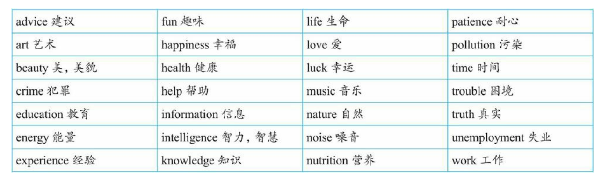

## 母语和外语

故事：

There are these two young fish swimming along and they happen to meet an older fish swimming the other way, who nods at them and says , "Morning,boys.How is the water?"

他们不知道大鱼在说什么，所以他们继续游着，没有回答。

And the two young fish swim on for a bit, and then eventually one of them looks over at the other and goes,"What the thell is water?"

对于语言也是如此：1. 水，就是母语环境; 鱼，就是母语人士。

普通母语人士，没有脱离过自己的母语环境，不能理性认识自己的母语，比如母语的语法规则，只是本能的使用母语。

语言专家或者学习过外语，且有其他外语作为参照的人士，才能了解自己母语的特点和说这种语言的人的一些思维习惯和看世界的角度。不学语法，很难地道且自然的表达外语，不要脱离语境讲语法、讲英语。

分别体会一下母语和外语示例：

对于母语：

经过一个月的努力，我的汉语水平有________很大的提高。 

A.了     B.过    C.着    D.的

我们不知道“了”和“过”的语法规则，但是我们能准确的选出正确答案。学习中文的外国人则很难。

对于英语：

> There are these two young fish swim along and they happen to meet an older fish swim the other way, who nods at them and says, “Morning, boys. How’s water?” And the two young fish swim on for a bit, and then eventually one of them looks over at another and goes，“ What the hell is the water?”

我们就很难凭借“语感”，并且根据这样的语感读出其中的英文错误。其实上面的句子中有5处错误：

1. 把两个swim改为swimming，即采用**现在分词作后置定语**。
2. 把How’s water添加the改为How’s the water，**表示特指**，即特指这里的水。
3. 把another改为the other，因为是两条鱼中的另外一条。
4. 把最后的water前面的the去掉，因为这里是**泛指含义，泛指水这种物质**，不能加the。

上面的语法术语比如“现在分词”、“后置定语”，可能对一些英语母语人士来说，根本就不知道是什么，但他们却能说出正确的句子。

要精通一门语言，就必须精通它的语法，**而学习英语语法的本质是学习英语国家人的思维习惯，就是在理解英语国家的人是如何看待一个事物，以及习惯于怎样去描述这个事物。语言是人类思维的载体，语言表达本质上是一种思维的表达。**

语法是能塑造和培养年轻人的思维的。(This stands for grammar cultivating young minds.)

> Grammar is the way to distinguish between those who know their shit, and those who know they’re shit.
>
> 语法能把人们分成是大智还是大愚。

**建立起自己的英语语法知识体系**

## 新书旧书

旧书：

1. 走近语法
2. 通悟语法
3. 驾驭语法

目的是给一个完整的、清晰的语法框架体系，因而只是对英语语法做了一个入门介绍，比较浅显，让读者有个初步了解，掌握一些基础知识。

新书：

1. 句子成分超精解
2. 定语从句超精解
3. 名词从句超精解
4. ...

新书针对每一个语法项目深入、系统地研究句子的逻辑语义关系，各种不同的结构和逻辑差异。

系列图书的特点：

1. 有文章故事
2. 提供语境背景
3. 提供思路总结
4. 提供构思过程，逻辑推理和论证，最后总结本质规律

推理示例：

交易时常说的：“你看着给吧”。

1. 根据语境，这里“给”不是give而是pay。

2. 实际上是“给一个合理的价格”，英文就是pay a fair price。

3. “你看着给”意思是“给一个你认为合理的价格”，这里有“你认为”you think，这时就需要构造一个从句，以便于把you think作为一个插入语放进去。

4. 于是想到**把形容词fair前置修饰改为后置修饰**，构造一个定语从句pay a price that is fair，然后放进插入语you think说成pay a price that you think is fair。现在可以用what替换a price that，于是说成：

   a. Pay what you think is fair.

   或者添加you can这样说：

   b. You can pay what you think is fair.

   这里what从句没有疑问意义，是一个名词性定语从句，并且具有泛指含义，因此，可以把what改为whatever说成：

   c. You can pay whatever you think is fair.

整个句子的字面意思是“你可以按照你认为合理的价格来支付”，这也就是汉语“你看着给吧”所要传达的意思。

**学习贵在坚持**

“Stay hungry; stay foolish.”——JOBS

强调做事的激情和坚持。要像傻瓜一样地坚持。真正的好东西是聪明人下笨功夫做出来的。需要长期的坚持，坚持观察、思考、总结、验证、运用等。

because引导的从句作主语:

There is a big difference between activity and accomplishment. Just because you are doing something doesn’t mean you are getting anywhere.One must evaluate one’s activity in order to have accomplishment.(忙碌并不意味着就一定会有成果，二者之间有很大不同。只是因为你在不停地忙碌并不意味着就有成果。因此，人们必须认真审视自己的忙碌，看能否取得成果。) 

the point where...定语从句：

Whatever you do, if you want to become great at it, you need to work day in and day out, almost to the point where you are addicted to it, and over a long period of time.（不论你从事什么工作，如果你想成为该领域的专家，你必须日复一日地去做，直到几乎迷恋成瘾的程度，并且要长期坚持。）

名词从句中以wh-连词引导的表语从句：

You are what you eat.(你即你所食。)

You are what you read.(你即你所读。)

对英语句子的分析将从**结构**方面展开，即句子结构分析。

**句子结构**分析是围绕**句子成分**展开的。

1. 先对句子成分进行简单的分类、组合，从而得出五种基本句型。
2. 对每一个句子成分进行深入的分析，包括这些句子成分的结构、位置、功能和语义等。
3. 介绍一下这五种简单句型是如何“进化”成复合句，为定语从句和名词从句打基础。

- 注重规则背后的英语思维的培养，而非记忆一些教条式的规则
- 理解那些例外的规则背后的思维
- 注重句子，短文以及上下文环境及其中英语思维，而不是单一的例句
- 将学到的思维规律直接转为日常对话用的语句，达到举一反三的，创造性的使用英语

一般语法书教条式地罗列大量的所谓规则，不讲解背后的思维规律。同时还有许多看似例外的规则加重记忆理解负担，但其实这些例外本质也是有相同的思维规律的。一般语法书严重忽视句子的上下文语境，只为说明规则。

对于学习英语，如果只是死记单词，而没有训练出良好的英语思维，那么学到的不过是英文这种文字 （word）或文本（text），而不是作为思想表达工具的英语这门语言 （language）。

英语思维：从语言本身去分析，语言无非就是人们交流思想的工具。

- 发出声音，即语音（有发音单元）
- 记录声音的符号，即词汇（有词根，前缀，后缀）
- 把词组成句子的造句规则，即语法（有规律）

真正意义上的人类语言都离不开这三要素：语音、词汇、语法。

语言作为思维的载体， 而**语法作为一种语言表达规律的归纳和总结，必然集中体现了该种语言的思维模式（语法即是思维）**，认识世界的习惯。

## 错误认知

1. 语法等于规则

   > 规则（由人制定的）一般要严格遵守。语法不是由语法专家事先确定并要求人们去遵循的。认为专门制定出来语法规则是为了规范人们的言语行为的。传统语法书也加强了人们这 种错误印象。因为它们往往是先列出一些规则，然后再针对这些规则给 出相应的例句，告诉读者，按照规则这么造句才是对的。久而久之，让 人产生错觉：以为是先有一套语法规则、教条，然后必须按照这些规则才能制造出具体句子。
   >
   > 事实上，先有语言（人们的思维活动），在长期的人类发展过程中，语言学家不断研究，然后再从大量的语言实践中总结出人们在使用这种语言时所遵循的**一般思维规律或表达倾向**，即所谓的规则。
   >
   > 所以，**语法规则不是什么不可逾越的，而是对人们的思维规律或语言表达习惯的归纳和总结。**

2. 把语法规则当作一成不变的公式

   > 这是将语法当作规则带来的副作用，语法不像数学公式，语言是灵活多变的，同时又具有规律性。**语法规则就是对这些规律性的语言现象进行归纳和总结，但并不能涵盖所有的语言现象。**所谓的“语法规则”只不过是一种“权宜 之计”的规则，是为了方便语言初学者的学习。因此，语法并不是一成不变的“公式”，也不是非此即彼的，而是存在很多“灰色地带”，因而总有“例外”存在。

3. 把语法规则当成随意的公式

   > 比如，对于冠词的用法，一般语法书上会有这样一条规则：“第一次提到的单数可数名词前面用不定冠词 a 或 an，这一名词再次出现则要用定冠词 the”。传统语法书上往往只是给出这样的规则，但不解释为什么会这样选择冠词，英语学习者很容易误认为语法规则是随意的、专断的，没有什么道理可言的，因而容易死记规则，而忽略了规则背后的合乎情理的思维规律。
   >
   > 其实，很多看似随意的规则，其背后都有共同的思维规律。因此，学语法重在理解规则背后的合乎情理的思维，而不能“死记”规则。

由于以上的错误认知，导致国人和老外（native speakers of English） 在使用英语方面的最大的区别就是：我们记住了英语语法规则却没有英语思维，而老外是在用英语思维，尽管他们不懂语法规则。

国人学生学习语法规则都用来对付英语考试，而没有真正懂得规则背后的英语思维。一味僵化地记一些规则，然后简单地用这些规则来套用一个句子“符合”与“不符合”自己牢记的规则，而不去关注句子所使用的语境。这样一来学到的只是一个“虚构”的英文句子，而不能把所学到的句子活用到真实的英语交际中。这就造成学英语与现实生活中的语言交际脱节。

**语法是对语言表达习惯的归纳，总结出来的规律是为了对语言学习者正确引导，而不是严格限定。**

**把语法当作思维规律来理解，而不应该当作规则来死记。**

## 学习语法内容

**搞清楚学习语法规则应该包括哪些方面内容**

以单词举例子，词汇除了有发音外，还包括形式（即单词的拼写形式）、意义（即单词的含义）和用法（即单词的用法）。

语法也是一样的，有**形式（form）、意义（meaning）和用法（usage）**这三方面，同时，语法还包括了将这些单词连词成句的规律。

形式：某个语法结构是怎样构成的。比如“现在完成进行时”的构成形式是have been doing。首先要做到能够**准确地构造某个语法结构**（语法结构的准确性问题）。

意义：某个语法结构能表达什么意义。比如“现在完成进行时”可以表示“一个活动从过去一直延续到现在说话时刻”的含义，这就是现在完成时态这一结构所具备的语法意义。**特定的结构形式能够表达特定的意义**（Particular forms will express their particular meanings）（语法结构的表意性问题）。**对于一个句子，它的含义不仅仅是来自于句中所使用的词汇的含义，而是还有来自于其中特定语法结构所含有的语法意义。**

用法：关于何时／为什么使用某一语法结构。这与在实际交流中的语境有关系，即特定的语境中，采用某种特定的语法结构来表达特定的意义才合适，（语法结构的合适性问题）。用法取决于说话者想表达的意义。

某一特定的语法结构的形式、意义和用法这三者之间是相互联系的，图示如下：

学习英语最后要达到的目的：**英语学习者要能够准确地、有意义地、恰当地去运用英语语言结构**。做到这一点，才算是真正灵活使用语法规则，并进而在思维高度上来使用英语了。

### 形式与意义的关系案例

说明形式与意义的关系案例：

1. I have been coming to Beijing for fourteen years.

可能被误认为的理解：

1. 我来北京有 14 年了。
2. 我到北京一路上走了 14 年

即使每个单词都认识，并且都知道语法结构 have been coming 是“现在完成进行时态”，尽管如此，但依然不知道这句话真正所要表达的意义。 正确的理解是：在过去这 14 年当中，我常常来北京。

由此可见，**知道语法结构的形式并不一定就懂得语法结构所要表达的真正意义。**其实，这里的 have been coming 在英文里表示的是一个重复的活动，具体来说：==用短暂动词（如 come）的完成进行时（如 have been coming）来表示到目前为止的一段时间内重复发生的动作==。

2. I have been coming to Beijing fourteen times.

说话人是想表达“我来北京有十四次了”这样的意思。这也不对。==因为现在完成进行时态在表示重复活动时， 不能说明具体的次数，比如这里的“十四次”==。这就属于知道 have been coming 形式（现在完成进行时态）和意义（表示重复活动），但并没有真正掌握其用法，即不知道如何恰当地使用完成进行时态来表达重复意义。==由此可见，知道语法结构的正确构造形式以及所能表达的意义，也并不一定就保证能够正确使用==。

传统教学中，基本都只是强调某种句子的结构形式，然后告诉学生根据句子形式构造出正确的句子，重点掌握句子构造的形式，而很少把例句中的真正意义和所使用的语境交待给学生，因而学生对这些句子不知道该如何恰当地使用。致使学生学习到的都是一些死句子而不能交流。

学习英语应该从实际应用出发。认识到语法不单是一个形式（句法学）问题，还包括在合适的语言环境（语用学）来表达某种意义（语义学）。**因而在举例讲解某个语法结构时，不仅读者要学会如何在形式上达到准确性，同时也要做到恰当地运用该语法结构，把握其意义。**

## 语境

一个句子的用法（什么时候说一句话），取决于你要表达的意思，意思又因为不同的语境而有所差异，而要表达的意思则由不同词性和形式的单词按照一定规律组成。在真实的语言交际过程中， 任何一个句子都不是孤立存在的，都有一个赖以生存的语境。甚至有时候，语境决定了一个句子真正要表达的意思。

比如下面这个对白发生在一位父亲与自己女儿的男朋友之间：

> Father: Do you drink?
>
> Young Man: No, thanks, I'm cool.
>
> Father: I'm not offering; I'm asking IF you drink. Do you think I'd offer alcohol to teenage drivers taking my daughter out?

这位父亲问他女儿的男朋友（其正准备开车带他女儿出门）：Do you drink? 他真正的意思是问这个年轻男子是否有饮酒的习惯，即是在询问情况，而不是问他现在想不想喝酒，即不是在提议。这就是语境对于句子意思的重要影响。

> Ted: Where did you learn to Rollerblade?
>
> Anna: Here in the park. This is only my second time.
>
> Ted: Well, it's my first time. Can you give me some lessons?
>
> Anna: Sure. Just follow me.
>
> (After a while)
>
> Ted: Hey, that was fun. Thanks for the lesson!

对于That was fun这个句子，知道它的语法结构形式——一般过去时态（was），以及它的意思——“这很有趣”，但不一定知道该句在什么样的场合使用才正确、恰当。

上面的that was fun被用在了溜冰活动结束之后，而不是在活动进行过程中（此时要说成that is fun）。在上面这个对话语境中，大多数国人可能会说that is fun。由此看到，如果不是提供这样完整的对话语境，读者就很难真正会恰当使用that was fun。

所以，在学习语法规则时，不仅要能够构造出形式正确、能够表达意义的句子，更要关注这个句子所能使用的语境。传统的语法书和语法教学在这方面做得相当不够，他们提供例句主要是为解释某条语法规则服务的，而句子背后的使用语境没有展现给学生。规则下面罗列的例句都是僵化的、脱离了语境的死文字。

**去分析、解释为什么英语本族语者要“这样”说（what native speakers of English actually do say and why）**

在学习某个语法规则时，不仅要知道这个语法规则是什么，结构怎么构造的，还要知道这个规则背后的为什么以及如何使用这个规则；在举例时，不仅要理解句子的中文译文，还要展现这个句子所使用的语境，或者是通过给出对话或短文来为例句提供一个完整的语境，这样就使得读者能够充分理解所学到的每个例句在具体交际中的使用。

## 英语和汉语思维

例句：我已经结婚了。句子用英语如何表达？

“我已经结婚了”为什么不是：I have married; I have been married; I got married; I married; I had married，而是 I am married.

去年结婚的。：I got married last year.

到现在结婚有一年多了。：I've been married for over a year

简单比较一下，可以看到，汉语中的“结婚”一词，用英文表达却有 am married、got married 以及 have been married 这样的区分。==而这样形式上的区分背后反映了英汉语言的一个重大思维差异：英文中有“动作 （action）”与“状态（state）”和 "时态"的区分，而这些话语特点在汉语思维中都是天然缺失的。==这就造成了：可以轻而易举地 把“I am married. I got married last year. I've been married for over a year.”译成地道的中文，但反过来由中文却无法译成地道的英文，即能读懂英语句子，但在真正交际中不一定能准确地说出这样的句子，这就 说明“读懂 ≠ 会用”。更严重的是，因为不懂英文思维特点，有时甚至都读不懂句子，而造成误解句义。比如下面这句：

He is interesting to listen to

是要表达什么意思呢？一定有读者这么理解： 他对听别人讲话很感兴趣。 这么理解就错了。其实这句话意思是： 听他讲话很有趣。 不能正确理解这个句子的一个根本原因是没有真正理解这个句子的 如下“深层结构”：

It is interesting to listen to him.

也就是说，在表层结构上，he 是做句子的主语（He is...），但在深层结构上，he 是作 listen to 的逻辑宾语（...listen to him）。这里不定式 to listen to 的逻辑主语是泛指大众，在句中没有明确给出，而只是隐含其中的。

所以，如果读者只满足于看懂句子意思就行了，而不去真正理解英语的思维规律，那么英语水平是无法**真正提高**的。这就是为什么大量中国英语学习者的英语水平就停留在能看懂英文文章但是说不出、写不来的尴尬境地，究其原因，还是因为没有真正“懂英文”！

## 名词短语

名词短语（noun phrase，简称 NP）是英语句子的核心组成部分（a core element of a sentence）。

搞清楚名词短语的构造规则。

名词短语中出现多个名词的情况通常表示复合名词（Compound Nouns）。复合名词是由两个或多个名词组合而成，形成一个新的名词，表示一个新的概念或事物。

复合名词的构成有几种常见的形式：

1. 连字符形式（Hyphenated Form）：多个名词之间用连字符（-）连接，例如 "mother-in-law"（岳母）或 "well-being"（幸福感）。
2. 空格分隔形式（Space-separated Form）：多个名词之间用空格分隔，例如 "coffee table"（咖啡桌）或 "car park"（停车场）。
3. 合并形式（Solid Form）：多个名词直接合并在一起形成一个新的名词，例如 "toothbrush"（牙刷）或 "sunflower"（向日葵）。

理解复合名词时，可以将其视为一个整体，其中每个名词都为整体贡献了一部分含义。通常，前面的名词修饰后面的名词，描述了后面名词的属性、特征或用途。

需要注意的是，复合名词在不同语境和领域中可能有不同的含义。有时候，可以通过上下文来理解复合名词的具体含义。此外，一些复合名词也可以根据需要进行拆分，以更清晰地传达意思。

### 案例

“世界最著名的七大奇迹”该如何翻译成英文。对于这个表达，中文里可以说得很灵活。比如：

1. 世界最著名的七大奇迹

2. 最著名的世界七大奇迹
3. 七大世界最著名的奇迹

汉语可以如此灵活地表达，那么英语也像汉语这样灵活吗？当然不是。**英语向来以语序固定严格而著称**，因而英文被称为“固定词序语言（a fixed-word-order language）”。

那么英文该怎么说？下面提供几个译文：

1. the world's most famous seven wonders
2. the most famous Seven Wonders of the World
3. the seven world most famous wonders
4. the world's seven most famous wonders

上面的译文哪个才是正确的呢？要想回答这个问题，就必须搞清楚“名词短语”的构造规律。

语言的构造级别可以分为这样五个层次：

1．词（word）

2．短语（phrase）

3．句子（sentence）

4．段落（paragraph）

5．篇章（discourse）

在本篇中，主要就是进入句子的内部来分析，即在“短语”这一层次来讨论句子的构造特点。英语里的短语有很多类，比如有动词短语（如 have been doing）、介词短语（如 for you）、名词短语（如 my best friend）等。其中名词短语最为重要， 因为它是英语造句中不可或缺的元素。

### 定义

名词短语：名词与它的修饰语一起即构成名词短语。

### 功能

先来看几个简单的句子，考察一下名词短语在句子中可以充当哪些成分：

1. These red roses are for you. 名词短语 these red roses 在句中充当**主语**。 译文：这些红玫瑰是送给你的。
2. I have three close friends. 名词短语 three close friends 在句中充当**宾语**。 译文：我有三个要好的朋友。
3. I really need a new computer. 名词短语 a new computer 在句中充当**宾语**。译文：我真的很需要一台新电脑。
4. I can't find the best answer. 名词短语 the best answer 在句中充当**宾语**。译文：我找不到最佳答案。
5. He is my best friend. 名词短语 my best friend 在句中充当**表语**。 译文：他是我最好的朋友。
6. There are some red roses **on that small table**. 名词短语 some red roses 在句中充当**主语**；名词短语 that small table 在句中充当**介词 on 的宾语**。 译文：在那张小餐桌上有一些红玫瑰。

==英文中的介词不能单独使用，其后面必须接宾语，所接的宾语也往往是名词短语。==

短文案例：

> National Flag
>
> The national flag of the People's Republic of China (PRC) is a red rectangle emblazoned with five stars. The red of the flag symbolizes revolution; the stars are yellow so that they will stand out brightly against the red ground. The larger star represents the Communist Party of China (CPC) and the four smaller ones, the Chinese people. This expresses the great unity of the Chinese people under the leadership of the CPC.

上面短文的名词短语分析：

1. the national flag of the People's Republic of China (PRC)
   这是一个较大的名词短语，它又可以细分成 the national flag 和 the People's Republic of China 这样两个小的名词短语。该名词短语作句子的主语。

2. a red rectangle emblazoned with five stars

   这个名词短语又可以进一步分成 a red rectangle 和 five stars 这样两个小的名词短语。该名词短 语作句子的表语。

3. the red of the flag
   这个名词短语又可以进一步分成 the red 和 the flag 两部分。该名词短语作句子的主语。

4. the stars
   该名词短语作句子的主语。

5. the red ground
   该名词短语作介词 against 的宾语。

6. the larger star
   该名词短语作句子的主语。

7. the Communist Party of China (CPC)
   该名词短语作句子的宾语。

8. the four smaller ones
   该名词短语作句子的主语。

9. the Chinese people

   该名词短语作句子的宾语。

10. the great unity of the Chinese people under the leadership of the CPC

    这个名词短语又可以进一步分成 the great unity, the Chinese people 和 the leadership of the CPC 三部分。该名词短语作句子的宾语。

不论是英语的单句还是文章，都含有大量的名词短语。

### 构造规律

名词短语的构造——==“左二右六”的定语规律==。

名词短语是由名词与它的修饰语一起构成的。==名词的修饰语与名词 的位置关系不外乎两种：一是放在被修饰名词的前面，称之为前置定语；二是放在被修饰名词的后面，称之为后置定语。==

一般来讲，名词前面有两种修饰语。一是限定词，==用来限定名词所指的范围，对名词起泛指或特指、定量或不定量等的限定修饰作用。== 比如上文中的 these, three, a, the, my 和 that。二是形容词，==是用来表示名词的性质和特征的==。比如上文中的 red, close, new, best 和 small。

在复杂的名词短语中，更常见的是后置修饰语。一个名词可以带的后置修饰语的种类很多，包括**定语从句、 同位语从句、分词短语、不定式、介词短语、形容词短语和副词短语**等，而且还有这些**不同的后置定语复式出现**的情况。

上面中心词名词是 boy，然后在 boy 的前面或后面分别添加各类修饰语，组合成不同的名词短语。

在英语里，修饰名词的定语，其语序的位置是极有规律的。

在英语里，名词的定语要么在名词的前面， 要么在名词的后面。

左置的定语只有两个：==限定词和形容词==，且可能存在多个限定词或者形容词

> the American national flag：限定词＋形容词＋形容词＋名词

右置的定语共有六种（尽管可以有副词作右置定语，但因较少用到，在此不作讨论）：==介词短语、分词短语、不定式短语、形容词短语、定语从 句以及同位语从句==。

==左置的两个定语的位置关系非常明确和严格：必须是限定词在形容词的左边，结构是：限定词＋形容词 ＋名词。==

==英语和汉语的一 个基本差别就是名词修饰语即**定语**的位置差异。汉语的定语一律是在名词的前面，而英语的定语有在名词前面的，也有在名词后面的， 多的定语是置于被修饰名词的后面，构成后置定语。所以，在**语言学** 上，**汉语被称作是“中心词（head）在后”的语言（head-last language）；英语被称作是“中心词在前”的语言（head-first language）**。==

### 句子成分

一般说到句子成分，都会说是“主谓宾定状补”六大句子成分。其实，“定语”并不能算是真正意义上的句子 成分。原因：

1. 定语是用来修饰或 限定名词的。从上面讨论的名词短语来看，定语只是名词短语的构成成分，最多称之为“短语成分”。
2. 语言的构造级别可以分为词、短语、句子、段落 和篇章这样的等级。主语、谓语、宾语、补语和状语这五种“句子成 分”都是在“句子”这一层级上的成分。而定语成分则“稍逊一层”，它属于“短语”这一层 级，是属于“短语成分”，即是组成名词短语的成分，然后通过名词短语 间接地构成句子成分。

因为造成我们对英语句子理解障碍的“罪魁祸首”之一 就是英语里**复杂的定语修饰关系**。所以，前面介绍的关于**定语的结构规律**是非常重要的**英语思维规律之一**。

## 名词

名词短语的核心部分——名词。关于名词的一些列问题：

1. 何谓可数名词？

2. 何谓不可数名词？

3. 如何判断一个名词是可数还是不可数？

4. 名词复数形式的变化规则有哪些？

5. 什么时候要用's 所有格？

6. 什么时候要用 of 属格？

英语里的可数名词与不可数名词，在汉语思维里是不把名词作这一区分的。这一区分涉及了思维上的差异，而这种思维在我们汉语语言里是天然缺失的。因此，学了很多年英语的中国人，通常还是搞不清楚某个名词是可数还是不可数，因而造成大量的表达错误。比如在说话或写作中，常常“忘记”在复数名词后面加-s，或者搞不清楚某个名词的后面该不该加 s。

从思维的高度来说，可数名词与不可数名词这一区分反映了中国人与英语的 native speakers 在看待客观外界事物时所持的两种不同的世界观：**国人的脑子里想到某个名词时，不关注它是可数或不可数；但在 native speakers 的脑子里，每个名词都有可数与不可数之分**，因而对事物的理解是不一样的。

#### 分类

名词定义：用来表示人、事物、地点以及抽象事物的名称的（A noun is the name of a person or thing.）

分类：

专有名词：

1. 人名及头衔

2. 著作名称

3. 月份

   > January, February, March, April, May, June, July, August, September, October, November, December。
   >
   > the solar calendar：阳历
   >
   > the lunar calendar：阴历
   >
   > 阴历二月”不能说 February，而是 the second month on the lunar calendar 或者说成 the second lunar month。
   >
   > 七夕：the seventh of the seventh lunar month
   >
   > 中秋：the fifteenth of the eighth lunar month
   >
   > this first of the first  lunar month

4. 星期、四季

   > Sunday, Monday, Tuesday, Wednesday, Thursday, Friday, Saturday。
   >
   > winter, summer, spring, autumn。

5. 节日

6. 地理名称

普通名词：分为可数名词（countable noun）和不可数名词（uncountable noun）。

对于名词，最重要的分类就是可数名词与不可数名词。这一分类是学习英语名词用法的核心，因为它关系到很多问题，比如可数名词变复数的问题，限定词修饰名词的问题，还有是一个名词用作可数与用作不可数，意义上有差别。

简单名词就是组成部分不可被分割的名词，比如 story, student 和 teacher 等。英语中的名词绝大多数是简单名词。复合名词就是由若干单词组合而构成的名词，比如 girlfriend, roommate 和 mother-in-law（岳母／婆婆） 等。

#### 名词的数

- 名词的可数性，即区分可数名词，这一角度侧重于名词的意义方面而不是构成形式方面；
- 名词的单数与复数形式，这一角度侧重于名词的构成形式方面；

从意义（meaning）与形式（form）两个方面来讨论名词。

为了表达什么样的意义就使用什么样的形式。特定的意义是通过相应的形式来传递的。

从意义上来界定英语不可数名词的特点，**可数与不可数的“相对论”，即一个名词是可数还是不可数关键 在于它所表达的意义，与它所使用的上下文语境密切相关，因而不能孤 立地来看待名词的可数性。**

不能按汉语的思维来理解英文 名词的可数与不可数。总的来说，不可数名词有以下规律：

1. **对于一些无法分割的名词，将其看作一个整体，因而作为不可数名词**，没有复数变化（nouns that have no distinct, separate parts, we look as the whole）。这样的名词主要是一些物质名词：

   

或者按气体、液体和固体来作出分类：

2. **一些因其组成部分太小而不易数的名词**（nouns that have parts that are too small or insignificant to count）用作不可数名词。

2. **表示总称的名词通常不可数**（nouns that are classes or categories of things）。这些名词侧重于表示某类事物的总的概念，而不是具体的事物。如果要具体指出该总称概念下的具体事物，则要用其他 不同的名词。

   

从形式上来总结可数名词的复数变化规则。

其他的总称名词有：

就拿 character 来说吧，很多同学在作文里谈到“特点”时，就喜欢说 characters，殊不知，character 作为“特点”讲时，是一个不可数名词，不 能变成复数的。因为它真正的意思是 the combination of qualities or features that distinguishes one person, group, or thing from another，表 示“使与其他人、群体或事物相区别的性质或特征的集合”，强调的是一 个整体的概念，因而是没有复数形式的。

4. **抽象的名词一般是不可数的（nouns that are abstractions）**

   

   要特别注意的是，上面这些名词可以有其他不同的意 思，因而可以转化为可数名词。

5. 表示研究学科（subjects of study），一般作为不可数名 词。

   

**“不可数名词”转化为“可数名词”的一些规律：**

1. **对于物质名词或总称的名词，若是表示不同的种类，或者因为特定的意思，或者是液体表示“几杯”或“几瓶”这样的数量，则转化为可数名词。**

   > 1) I like *cake*, not hamburger.
   >
   > 2) My mother is making *a cake* in the kitchen. 
   >
   >    
   >
   > A: Would you like *a cake*?
   >
   > B: No, I don't like *cake*. 
   >
   > 
   >
   > 1) I don't like *milk*.
   >
   > 2) Yogurt contains a higher percentage of lactic acid than other fermented *milks*. 

以上谈的是，总称名词或物质名词在表示“不同种类或具体的事物”时转化为可数名词，此时它们的词义没有改变或改变不大。

但是，有些名称，当由不可数转为可数名词时，意思会有很大的变化。比如paper这个词，表示“纸”时是不可数名词，但表示“报纸”和“论文”时则是可数名词。

> 1) I need *some paper* to write a letter on.
>
> 2) I have *a term paper* to write on weekends.
>
> 3) I bought *a paper*. 

肉类的名词,比如chicken，作为不可数名词，表示“鸡肉”；作为可数名词，表示“鸡”这种动物。

比如glass表示“玻璃”时不可数，但表示“玻璃杯”时则可数。

> *Glass* does not rust or rot.
>
> This vase is made of *glass*. 
>
> She drank two *glasses* of wine.
>
> He broke *a glass*.  他打碎了一个玻璃杯。不能错误地理解为“他打碎了一块玻璃”。因为glass若是表示“玻璃”，则是不可数名词，因而不能用不定冠词a来修饰。“一块玻璃”应该说成a piece of glass。比如：
>
> He broke *a piece of glass*. 他打碎了一块玻璃。

此外，glass的复数形式glasses还可以表示“眼镜”，并且作为“眼镜”的意思，只能用复数形式，则“一副眼镜”应该说成a pair of glasses。

再比如，water一词是属于第一组Group A中的名词。但是，如果特指具体的某一片水体，尤其是指某一国所专门拥有的一片海域（a particular stretch ofsea or ocean, especially that of a state or country）时，则常用复数waters，此时表示“海域，领海”。比如“东海海域”就可以说成：the *waters* of the East Sea. 

液体物质名词若表示“几杯”或“几瓶”这样的数量时，则转化为可数名词。比如：Two *beers* and three *coffees*, please!

2. **对于抽象名词，若是具体化了，则转化为可数名词。并且，此时往往伴随着词义上或大或小的改变。**比如art（艺术）／an 

   art（一项技术，一门特定的艺术）；beauty（美丽）／a beauty（一个美人）；youth（青春）／a youth（一个年轻人）。

   > 1) She had great *beauty* in her youth.
   >
   > 2) She was *a beauty* in her youth. 

TOEFL考试中的句子：

> 1. Financier Andrew Mellon donated most of his magnificent art *collection* to the National Gallery of Art, where it is now located.
>
>  
>
> 2. One of the most impressive *collections* of nineteenth-century European paintings in the United States can be found at the Philadelphia Museum of Art. 
>    
>
> 在例句1）中，collection是指“艺术收藏品”这个总称的、抽象的概念，而没有具体说明是什么收藏品，所以是不可数名词。下文的单数代词it指代这个不可数名词。在例句2）中，collection是特指“19世纪欧洲油画收藏品”这样的具体事物，所以是可数名词。

在以前的TOEFL考试中，曾多次考查中国学生判断名词可数性的能力，比如下面这道改错题：

21 (A) **Accounting** is described (B)**as art** of classifying, (C)**recording**, and reporting (D)**significant**  financial events. 

正确答案 :B，应改为as an art。在该句的语境中，art就是指accounting这项具体的技能，因而转化为可数名词。既然是可数名词，在单数art的前面就需要有不定冠词an来修饰。故将B即as art改为as an art才正确。

会计是一门对重大财务事件进行分类、记录和报告的专业技术。 

**可数的名词如何转化成不可数的名词**

比如对于room这个词，表示“房间”，此时是可数名词。但是若作为“空间，余地”来理解时，则是一个抽象概念而转化成为一个不可数名词。

> There's plenty of *room* for everybody to sit down in this *room*. 
>
> You can ride with us. There's enough *room* in my car. 
>
> “站票”就是指“供你站立的一个‘空间’”，因此英文中的“站票”就是standing room，
>
> 请看例句：There's no seat now. There's standing *room* only.   没有座位了，只有站票。

更为特殊的是，即使是一般作为可数的名词，在某些特殊的语境中，也可能作为不可数名词来使用。比如husband和wife这两个名词在一般情况下都是作为可数名词，但是在特殊的语境中，可能转化为不可数名词，此时其前面不需要不定冠词修饰。比如在西方举行婚礼的场景中，牧师最后会对着新郎、新娘及众人说：I pronounce this couple to be *husband* and *wife*. You may kiss. 

这里的husband和wife都是单数，按理说，在它们的前面应该需要有不定冠词a来修饰的。但在这里，它们是表示“夫妻”这样的概念，而不是具体指某人，是作为不可数名词，所以不需要冠词修饰。 

我现在宣布这对新人成为夫妻。你们现在可以亲吻了。 

 

We are not *boyfriend* and *girlfriend*.   这里的boyfriend和girlfriend同样是转化为不可数名词了，强调的是“男女朋友”这个概念。

3. 从更广泛的意义上来说，当一个名词表示抽象的、总称的概念（abstract  or generic concept）时，一般作为不可数名词来用。而当它表示具体的、特定的事物（concrete or particular things）时，则通常用作可数名词。这就是为什么词典中对于某个单词的某一词义，后面标注的既是可数，也是不可数。此时关键要看如何使用这个词义，如果是当作具体的事物来看，则是可数；如果是当作一个概念来看，则是不可数。

拿area（面积）来说，如果是指某个地方的具体多大的“面积”，则是可数。比如：The square covers *an area* of 20,000 square meters. 另一方面，如果把“面积”作为一个总体的概念（以区别于其他的概念，比如“人口”），则是不可数。比如：Shanghai is the largest city in *area* in China, but Beijing is the largest city in population. 

另外，作为“地区、区域”来讲，area是可数名词。对于area的这些不同的词义及其可数性，读者都需要根据具体的上下文来灵活把握。我们来看下面的两道TOEFL考试题：

1. Large, multicolored insects (A)with four wings, dragonflies (B)play a very important role in the ecosystem of humid (C)area by (D)controlling the population of mosquitoes

正确答案：C，应改为areas。根据上下文，这里的area是“地区”的意思，是可数名词，因而要把C即area变为复数的areas，这样它的前面就可以不用限定词修饰。

蜻蜓——这一体形较大的、彩色的、带有四个翅膀的昆虫——通过控制蚊子的数量而对潮湿地区的生态系统的平衡起着重要作用。

2. Located in Canada, the Columbia Ice Field (A)covers (B)area of 120 square miles and is 3.30 feet (C)thick in some (D)places. 

正确答案：B，应改为an area。根据上下文，这里的area是表示具体的“面积”，是可数名词，因而要把B即area改为an area。 

哥伦比亚冰原位于加拿大，面积达120平方英里，在有的地方厚度达3.3英尺。

#### 不可数名词的度量

不能用具体的数字（基数）（比如 one, two, three, four）来表示不可 数名词的数量，但可以借用量词来表示其量的概念。不同类型的不可数名词所使用的量词不一样，一般的规则如下：

1. piece 修饰：

   advice, bread, baggage, chalk, equipment, furniture, information, jewelry, luggage, music 和 news 等

   > a piece of news（一条消息）
   >
   > two pieces of news（两条消息）
   >
   > several pieces of furniture（几件家具）
   >
   > three pieces of luggage（三件行李）

2. 用 bottle, cup, drop 和 glass 修饰液态物质
   比如这些名词：beer, blood, coffee, milk, tea, water 和 wine 等。

   > several drops of blood（几滴血）
   > a glass of milk（一杯牛奶）
   > two glasses of wine（两杯葡萄酒）
   > two cups of coffee（两杯咖啡）

3. 其他的量词

   > a loaf of bread（一长条面包）
   >
   > a tube of toothpaste（一筒牙膏）
   >
   > a slice of meat（一片肉）

不可数名词一般不能直接被不定冠词 a/an 修饰。

----

前面重点在从意义上讨论如何区分可数名词和不可数名称。下面这一部分从名称的名词的构成形式方面讨论名词的单数和复数形式的问题。对于某个名词，既要判断它是可数还是不可数，同时还要区分它是单数还是复数。

**具体来说就是：不可数名词只有单数形式，没有复数形式；可数名词既有单数形式，也有复数形式，两套形式通常不同。**

因此，对于可数名词来说，存在一个变复数的问题。这一节主要是从**形式**上来总结**可数名词的复数变化规则**。

单数表示“一”；复数表示“多于一”，即表示两个或两个以上的数量。

不同语言对于单复数的概念是不同的。比如汉语不区分单复数；英语区分单复数，把“多于一”的算作复数。与这两种语言不同的是，有些语言把名词区分为三种数的概念：“一”为单数；“二”为双数（dual number）；“二以上”为复数。也就是说，这种分类比英语更精确。这些语言把“二以上”算作复数，而英语只是把“一以上”算作复数。

> one half *day* 半天（单数）
>
> one *day* 一天（单数）
>
> one and a half *days* 一天半（复数）

英语中也有“双数”的概念，比如限定词both, either和neither都只能用来指“二”，不能指“二以上”的复数概念。each可以指“二或二以上”的复数概念，而every只能指“三或三以上”的复数概念。比如人类的性别只有“男”和“女”两种，所以只能说each sex而不能说every sex。

> *Each sex* has its own physical and psychological characteristics. 

单数是一个极端，复数是另一个极端，在这两个极端之间有一个中间的过渡状态，那就是有些名词可单数也可复数，但是含义上有差别。下面先来讨论两个极端的情况，即**某些只可用作单数的名词，以及某些只可用作复数的名词**。

### 只用作单数的名词

==在英语中，只用作单数的名词主要包括不可数名词与专有名词。这两类名词一般没有复数的变化形式。它们作主语时，谓语要用单数第三人称形式。==

### 只用作复数的名词

这些名词没有词形的变化，但都是当作复数名词来用。它们作主语时，谓语要用复数形式。具体分为以下几类：

1. **“**二合一**”**的复数名词。这些名词表示**由相等的两个部分合在一起构成的工具、仪器或服装**。最常见的这种“二合

   一”的名词有：

   > - 工具和仪器
   >   - glasses（眼镜）
   >   - spectacles（眼镜）
   >   - binocular（双筒望远镜，双目显微镜）
   >   - scales（天平）
   >   - clippers（理发剪，指甲刀）
   >   - forceps（钳子，镊子〈尤指外科医生用的镊子〉）
   >   - pincers（铁钳，钳子〈比如家用的老虎钳〉）
   >   - tongs（钳子，夹子，镊子〈比如火钳子〉）
   >   - tweezers（小钳〈比如女用的夹眉毛的小钳子〉）
   >   - scissors（剪刀）
   >   - shears（大剪刀）
   > - 服装
   >   - jeans（牛仔裤）
   >   - trousers（长裤）
   >   - shorts（短裤）
   >   - trunks（男士泳裤）
   >   - briefs（内裤）
   >   - pants（短裤）
   >   - slacks（休闲裤）
   >   - pajamas（睡衣）
   >
   > 
   >
   > 对于这些名词，要说明数量，往往要用pair（如a pair of）表示。比如：
   >
   > He picked up the hot metal with a pair of *tongs*. 他用一把钳子夹起这块热金属。
   >
   > That's *a nice pair of* pants. 那是一条漂亮的短裤。
   >
   > As I'm shortsighted I always carry *two pairs of* glasses. 因为我近视，所以我总是随身携带两副眼镜。
   >
   > 
   >
   > **既然是复数名词，所以要用复数的代词来指代，**这点不同于汉语。在汉语中，这些名词往往
   >
   > 是单数概念的，比如我们问：
   >
   > A：我的眼镜在哪里？
   >
   > B：它不就在你的鼻子上戴着嘛！
   >
   > 这里，我们不会说“它们”，但在英语中却要用they来指代，比如上面的对话译成英文是这样
   >
   > 的：
   >
   > A: Where are my glasses?
   >
   > B: *They* are right on your nose!
   >
   > 

2. **“单数形式复数含义”的名词**

   有些名词虽然没有复数的标记，但用作复数，即形式上是单数但是表达复数的意义。

   - **people** 作为“人们，人民”的意思时，它相当于person的复数形式，换句话说，person相当于是people的单数形式

     > 1) There was only *one person* in the room.
     > 2) There were *many people* in the room. 

     但是，如果people用作别的意思，比如当“民族”或“部族”讲时，那就是一个普通名词，有单复数的变化。比如单数要用不定冠词a修饰，即a people（一个民族），复数要在词尾加-s，即peoples。

     > The Chinese are *an* industrious *people*. 中华民族是一个勤劳的民族。
     >
     > the English-speaking *peoples* 说英语的民族
     >
     > 不过，用作“民族”这个意思时，单数形式的people通常也用复数形式的谓语。
     >
     > The Chinese *people have* achieved a great success. 中华民族取得了巨大的成功。

3. **“the＋形容词”——表示一类人的复数名词**

   在英文中，“the＋形容词”表示一类人，此时当作复数名词，作主语时，谓语要用复数。

   *The rich are* becoming richer. 富人变得更富。

4. **复数专有名词**

   有些专有名词只用作复数。比如：

   the Alps 阿尔卑斯山脉

   *The Himalayas are* the roof of the world. 喜马拉雅山脉是世界屋脊。

### 复数变形规则

对于大多数中国的英语初学者来说，在使用英语名词时，往往忘记把名词变为复数，这在学生的作文或口语里可以找到大量的证据。他们在该用复数名词时，因为受到汉语不发达的复数概念和形式的影响，往往“忘记”了使用名词的复数。

对于可数名词的学习，重点是要掌握可数名词复数的变化规律。

1. 一般在词尾加**-s**

   比如：desk/desks, book/books, hand/hands, dog/dogs, bee/bees, face/faces, orange/oranges等。

2. 以**-s, -x, -ch, -sh**结尾的名词加**-es**

   比如：class/classes, box/boxes, match/matches, bush/bushes等。

   特别注意：以-ch结尾的名词，若-ch发/k/音，则加-s，例如：stomach/stomachs。

3. 以**“**辅音字母＋**y”**结尾的名词，变**-y**为**-i**，再加**-es**；而以**“**元音字母＋**y”**结尾的名词，则加**-s**

   比如：country/countries, family/families, baby/babies, lady/ladies;

   play/plays, boy/boys, guy/guys, donkey/donkeys, monkey/monkeys, key/keys等。

4. 有关以**-o**结尾的名词，这类名词的单数变复数稍微有些复杂，因为有的是加-es，有的是加-s（普遍的情况），而有的是加-es或-s均

   可。下面就这三种情况分别列举：

   **1**．一般加**-es**的名词有：

   tomato/tomato*es*（西红柿）

   hero/hero*es*（英雄）

   Negro/Negro*es*（黑人）

   veto/veto*es*（否决）

   这些一般是以“辅音字母＋-o”结尾的名词。

5. 有关以**-f**或**-fe**结尾的名词，它一般也有三种情况：

   1. 一般直接加**-s**的名词
   2. 一般变**f, fe**为**v**，再加**-es**的词有下面**12**个
   3. 少数名词后加**-s**或变**f, fe**为**v**加**-es**均可

## 冠词（限定词）

限定词（determiner）必然修饰某个名词，用于限定名词所指的范围，或者对名词起到特指或者泛指，具体数量或者不定量等限定修饰作用。限定词与名词的位置关系：

1. 限定词+名词
2. 限定词+形容词+名词

英语的十大词性中并没有限定词这一分类。而限定词是对名词起到限定修饰作用的各类词的总称。

典型的限定词包括：

1. 冠词：a，an，the
2. 基数词和序数词：one/first，two/second等
3. 指示代词：this，that，these，those
4. 物主代词：my，your，his，her，our和their
5. 数量限定：a few，a little，much，many，a lot of，some，any，enough，several等
6. 个体限定：ench，every，either，neither，both等
7. 名词所属格：mary\`s，his father\`s

冠词这一词性在汉语中是缺失的，但是却表现了英语的思维表达的特点。汉语中有的是量词来修饰一个名词。

引言：

> That's one small step for man, one giant leap for mankind. 
>
> Is Neil Armstrong's moon landing quote grammatically incorrect? （尼尔·阿姆斯特朗登月时的感言从语法角度来说是不正确的吗？）
>
> 在英语中，man如果表示“成年男子（an adult male human being）”时，一般要加冠词a来修饰，比如说a man。如果表示“全人类（the human race, mankind）”，则不需要用冠词a修饰。
>
> He found the missing "a" from Armstrong's famous first words from the moon in 1969.)。也就是说，阿姆斯特朗说的是That's one small step for *man*, one giant leap for mankind. 而没有冠词a，这就意味着，这里的man是表示“人类”的意思，也就相当于mankind。因此，阿姆斯特朗说的意思实际上是One small step for *mankind*, one giant leap for *mankind*. (Without the missing "a", Armstrong essentially said, "One small step for mankind, one giant leap for mankind.") 这就成了“这对于人类来说只是一小步，但对于人类来说却是一大步”。这显然是有矛盾的。他本来应该说That's one small step for *a man*, one giant leap for mankind. 才正确。

> 001年4月中美撞机事件发生后,一名大学生在英语演讲比赛中痛斥美国野蛮的侵略行径。本来是想表达“毫无疑问，责任完全在美方”。
>
> The U. S. party should completely accept the blame for it. It is out of *the* question!
>
> 这里问题就出在out of the question这个短语上。上面这句话英文的真正意思是“责任完全在美方，这不可能”，这样一来，该句的意思显然是在为美方开脱责任！这并非演讲者本来的意思。
>
> 在英语中，out of *the question*表示“不可能”，而out of *question*才表示“毫无疑问”。有和没有这个the，意思完全相反。

英语中，冠词有三个：

1. a：用在以辅音音素开头的名词前面
2. an：用在以元音音素开头的名词前面
3. the

a/an是不定冠词，the是定冠词。

> a boy
>
> a student
>
> a university
>
> a unique person 
>
> an unkind old lady
>
> an hour
>
> an honor
>
> An L letter is in the word "letter".

冠词的用法

1. 将普通名词划分为可数名词和不可数名词是正确使用冠词的前提。

   重点区分三种情况下冠词和名词的搭配情况：

   - 不可数名词与冠词
   - 可数名词单数与冠词
   - 可数名词复数与冠词

2. 区分特指与泛指

   冠词除了要根据名词的情况选择外，还要确定是特指还是泛指。a/an不能用作特指，the一般用作特指，但也可以表示泛指。

   泛指：表示一类事物或者某类事物的总称。

   特指：表示某类事物中的具体某一个或者某一些。

   > *The lion* is a dangerous animal.
   >
   > *The lion* escaped from the zoo. 
   >
   > 
   >
   > *The tiger* is becoming almost extinct.
   >
   > *The tiger* is sleeping in the cage. 

3. 结合篇章和语境

冠词的特指用法会涉及说话者与听话者之间的共有信息和场景。

对于the来说，就是特指和泛指。定冠词**主要是表示特指的用法，其次才是表示泛指的用法**。但对于不定冠词a/an来说，不能表示特指，主要是用来表示泛指。此

### 表示泛指的四种情况

冠词的泛指用法必须结合名词分类来进行讨论。

名词可以分为：不可数名词、复数名词和单数名词。冠词与这三类名词的不同搭配，就会产生冠词的泛指概念。

一般来说，这三类名词与英语的冠词有四种不同的搭配使用规则，从而衍生出四种不同的模式来表示泛指意义。具体就是一下4种：

- 不可数名词不加冠词——表示泛指
- 复数名词不加冠词——表示泛指
- 单数名词与定冠词（the）连用——表示泛指
- 单数名词与不定冠词连用——表示泛指

#### 不可数名词不加冠词表示泛指

不可数名词在表示泛指时，不可与定冠词the连用。如果与the连用，此时不可数名词是表示特指。

> *Life* is hard sometimes.
>
> life是指整个人类生活，而不是具体指某个人的生活，即表示泛指，所以不能说*The* life is hard sometimes.
>
> *Life* is education in itself.
>
> 
>
> The writer is writing a book about *the life* of blacks in America.
>
> life专指“美国黑人的生活”，所以是特指，要说成 the life。
>
> I am studying *the life* of Beethoven. 
>
> life专指“贝多芬的生平”，所以是特指，要说成the life。 
>
> 
>
> I love *music*, poetry and art.
>
> I don't like the film, but I like *the music* (of the film). 
>
> 
>
> *Air* is a colorless and tasteless gas.
>
> *The air* in this room is stuffy. Please open the windows. 

对于某些句子，既可以用the也可以不用the，但意思上会有差别。比如：

> I love *cheese*.
>
> I love *the cheese*. 

#### 复数名词不加冠词表示泛指

复数名词在表示泛指时，不可与定冠词the连用。如果与the连用，此时复数名词是表示特指。

> *Books* become more and more expensive.
>
> *Books* fill leisure time for many people.
>
> Put away *the books* on your desk.
>
> Move *the books* off that chair and sit down.
>
> 
> 
>
> *Tigers* are becoming almost extinct.
>
> *Tigers* are dangerous animals.
>
> *The tigers* are sleeping in the cage. 

从以上例句发现，**表示特指的复数可数名词或不可数名词，它们一般带有各种短语或从句作后置定语，以限定这些名词所指的事物的范围。**

也有句子既可以用the也可以不用the，但意思上会有差别。比如：

> I am afraid of *dogs*.
>
> I am afraid of *the dogs*. 

在例句1）中，dogs是表示泛指，泛指狗这类动物，说话人想到的不是某些具体的一只只狗。

在例句2）中，the dogs是表示特指，表示说话人并不是害怕所有的狗，而是专指害怕眼前的这些狗，比如因为它们个头非常大，样子凶悍，也许说话人并不害怕小狗。

一般来说，“the＋复数名词”不能用作泛指，而只表示特指。不过，有两种特殊的表示复数的名词与the连用却可以表示泛指：一是“the＋国籍名词”，二是“the＋形容词”。具体详述如下：

1. **the**＋国籍名词

   该结构是指一个国籍的、一个种族集团的人。例句：*The Chinese* are a great people. 

   Chinese是单复数同形的名词，这里的the Chinese是表示复数的概念，这从谓语动词are可以看出来。但这里的the Chinese表示的是“整个中国人或中华民族”，即是一个泛指的概念。 

    当然不是所有的国籍名词都可以这样用，比如我们不能说the German are...*。这样用的国籍名词只限于以-ese, -sh和-ch结尾的词，具体的包括：

   - 以-ese结尾的国籍名词：Chinese, Japanese
   - 以-sh结尾的国籍名词：British, Cornish, Danish, English, Irish, Spanish, Turkish, Welsh
   - 以-ch结尾的国籍名词：Dutch, French.

2. **the**＋形容词

   在英文中，“the＋形容词”表示一类人，是泛指，相当于在形容词的后面省去了people，所以被看作是复数名词，作主语时，**谓语要用复数**。比如：

   *The poor* are causing the nation's leaders great concern. 

   *The wise* avoid such temptations. 

    *The emotionally disturbed* and *the physically and mentally handicapped* need the aid of

   society.

   the unemployed ＝the unemployed people ＝people who are unemployed

#### 单数名词与定冠词the连用可以表示泛指

定冠词the与单数名词连用时，**可以**表示泛指。在语气上显得比较正式或文雅，表示一个由典型的样品所代表的那个类别。比如：

*The tiger* is becoming almost extinct.

 *Tigers* are becoming almost extinct. 

定冠词the与单数名词连用，**可以**表示特指，即表示某类事物中具体的某一个。请比较：

 *The tiger* is becoming almost extinct.

*The tiger* is sleeping in the cage. 

**对于“the＋单数名词”，到底是表示泛指还是表示特指，一定是要根据上下文的语境来判断的。**请比较下面的例句：

*The whale* is the largest mammal on earth.

*The whale* is dead. 

*The elephant* is the largest land mammal.

*The elephant* over there has only one tusk. 

**正因为“the＋单数名词”既可以表示泛指也可以表示特指，所以，在特指还是泛指的理解上有时会出现模棱两可的现象。**比如：

A: *The president* is too powerful.

B: Which president?

A: No, I mean presidents in general. 

在这个对话中，显然说话人B误解了A所说的the president的含义，误以为A说的the president是在特指“某一位总统”，于是B追问道Which president? 但最后A澄清自己刚才说的the president是一个泛指的概念，于是A说道：...presidents in general。

特别需要注意的是，当man表示“人类”而不是“男人”时，相当于mankind，不用冠词，表示泛指。

*Man* is a social animal. 人是社会的动物。

Since time began, *man* has lived in fear of fire. 自古以来，人类就害怕发生火灾。 

#### 单数名词与不定冠词a/an连用可以表示泛指

单数名词与不定冠词a/an连用时，也可以表示泛指。“a/an＋单数可数名词”可以表示泛指，不定冠词a/an的泛指用法指的是某一类事物中任何一个具有代表性的成员，所以可以用any来替换a/an。

*A tiger* is a dangerous animal.

*The tiger* is a dangerous animal.

 *Tigers* are dangerous animals. 

*A teacher* should be patient with his or her students. 

*A growing child* needs great nourishment. 

*A child* needs plenty of love. ＝*Children* need plenty of love. ＝*Any child* needs plenty of love. 

关于**a**（**n**）的泛指用法的深入讨论

不定冠词a/an的泛指用法指的是**某一类事物中任何一个具有代表性的成员**，所以可以用any来替换a/an。比如我们可以说：*A tiger* is a dangerous animal. 表示“老虎是很危险的动物”，这里的“老虎”指的是任何一只具有典型代表性的老虎，是一个泛指的概念，相当于说：*Any tiger* is a dangerous animal. 

说到这里，也许有人非得“抬杠”说：“你说任何老虎都是危险的，但是一只幼虎或者一只奄奄一息的老虎就没有什么危险。”但是，一只幼虎或奄奄一息的老虎并没有典型的代表性，不能代表“老虎”这种动物的一般特性。**正是因为a/an的泛指用法的上述特点，所以它不能用来表示那些属于整个类别的特性。**比如不能说： *A tiger* is becoming almost *extinct*.*

因为这里的extinct只适于描写整个老虎种群的特性，强调的是“种群”的灭绝，而不适于表示“老虎”这类动物的一般特性。比如我们可以说“任何一只老虎都具有危险伤人的特性”：

*Any tiger* is a *dangerous* animal. 

却不能说“任何一只老虎都具有灭绝的特性”：

 *Any tiger* is becoming almost *extinct*.*

对于这种“整个类别”的特性，可以用复数名词或the来泛指，如在前面举过例句，此时我们可以说： *The tiger* is becoming almost *extinct*.     或者  *Tigers* are becoming almost *extinct*. 

**a/an与单数名词连用表示泛指，这主要是限于用在主语的位置，如果是处在其他位置则不表示泛指。甚至即使是在主语位置，也不一定都是表示泛指的概念。**

### 定冠词**the**的特指用法

什么叫“特指（specific reference）”：这里的specific是针对交际的双方来说的，即一方是说话者，另一方是听话者。

定冠词the表特指，就是指根据说话者和听话者共有的知识，或根据上下文，可以识别的独特的某物。换句话说，说话者用the是想要听话者找到双方心中都知道的所指，而听话者一方“断定”或“还原”所指对象的方法有多种。

一般来说，听话者会通当时对话的情景或者文化背景，又或者是对话的上下文判断说话者的所指对象，因而形成两种特指模式：情景／文化特指（situational/cultural reference）和上下文共指（textual co-reference）。

例句：

> Have you fed *the* cat?         比如这句话发生的场景是在家里，听话者知道说话者这里说的cat就是特指自家的宠物猫，而不是别处的猫，更不是泛指所有的猫。这里的the就是表示在“家里”这样的**特定情景下的特指**。
>
> I went to *New York City* last week. *The* traffic is awful.     这句话里的the traffic不是泛指所有的交通，而是专指纽约市的交通。这里the的指代关系就是通过上下文来建立起来的，是属于**上下文共指**（textual co-reference）。 
>
> *The* brick house *on the corner* is mine.      这句话里之所以要用the来限定brick house，是因为其后的修饰语on the corner，这个后置定语即告诉听话者这里的brick house 不是泛指任何一处的砖房，而是特指“在拐角处的那栋砖房”。这里要使用the是因为句子的结构本身带有一个后置修饰语，这也属于上下文共指（textual co-reference）。 

定冠词the的意义在于它所修饰的名词是某一具体所指物，并且说话者和听话者都可以依靠某种信息来确定或者说“还原”这一具体所指物。这些信息来源包括情景、文化、上下文以及句子结构。

#### 情景／文化特指**（**situational/cultural reference）

使用定冠词the表示特定情景／文化特指下的特指。必须依赖于说话者和听话者双方共有的知识。因为既然是要特指某事物，那么就应该是说话者与听话者双方都知道的，或者说是说话者认为听话者应该知道的。换句话说，我们使用定冠词the是说明“说话者（writer/speaker）可以断定听者（reader/listener）知道我在指谁或在指什么”。因此，可以这么说，冠词的用法不是单方面由说话者决定的，而是要根据交流双方共同知晓的信息而定。在实际的使用过程中，说话者首先必须估计对方（即听话者）的背景知识，然后再根据与双方共享的信息判断是否该用the来特指。所以，是否使用the需要根据不同的交际对象而定，表现出相当大的灵活性，而绝不能按照传统语法书上所讲的规则去死记！

定冠词the有一条用法，是可以表示“著名的”人或事物。比如说到大科学家“爱因斯坦”，就要用定冠词the这样说：

> Albert Einstein, *the* famous physicist 阿尔伯特·爱因斯坦，著名的物理学家
>
> 这里就不宜用不定冠词a说成：Albert Einstein, a famous physicist.*这里之所以应该用the而不用a，就是因为“爱因斯坦”举世闻名，因此说话者断定听话者应该知道“爱因斯坦”是何许人，也即说话者与听话者都共享这样一条信息——爱因斯坦是著名的物理学家。所以说话者要用the的特指用法来告诉听话者“我这里说的爱因斯坦不是别人，就是你所知道的那位著名的物理学家”。如果说话者用不定冠词a，则给人的感觉是，他断定听话者不知道“爱因斯坦”是何许人——这岂不是认为听话者太孤陋寡闻了嘛！有点侮辱听话者的常识水平的意味。

这里其实涉及这样一个问题：“著名的”的范围问题。比如在多大范围内是“著名的”，或者说对什么人来说是“著名的”。比如，当代三大中国名人“刘翔”、“刘德华”和“姚明”，尽管这三人在中国可谓家喻户晓，但在知名度上，刘翔和姚明应该是具有世界性的知名度的，而刘德华在英语世界里的知名度应该不及前两位（比如在美国知道姚明的人比知道刘德华的人肯定要多很多），这就会影响到描述他们时冠词的使用。比如提到“刘翔”，就可以这么说：

> Liu Xiang, *the* famous hurdler 刘翔，著名的跨栏运动员

媒体上关于刘翔的其他头衔称谓还有：

>  *the* 110-meter hurdles world record holder 这位110米跨栏世界纪录的保持者

这里同样是用定冠词the来表示特指。

提到“姚明”，我们可以这么说：

> Yao Ming, *the* famous basketball player 姚明，著名的篮球运动员

但是说到“刘德华”，则要区分读者对象了。如果是面向中国国内的读者，可以说：

> Andy Lau, *the* famous actor 刘德华，这位著名的演员

如果是面向世界的读者，可能要用不定冠词a来这样描述较为妥当：

> Andy Lau, *a* famous *Chinese* actor 刘德华，一名著名的中国演员。

再来看外国媒体报道中国著名演员陈冲（Joan Chen）的短文：

> Here is an article about Joan Chen, *a* famous Chinese actress. She is famous both in China, where she grew up, and in the United States, where she now lives. How did Joan become a famous actress in two countries? It's an interesting story.

这是一篇关于陈冲的文章，她是一位著名的中国女演员。她无论是在中国还是在美国都比较出名。她在中国出生，现在美国定居。关于她是如何成名的，这是一个有趣的故事。 

如果是在英语世界里非常著名的人物，那么在描述时，一般都可以用the来特指。

> Tom Cruise, *the* famous American movie star 汤姆·克鲁斯，著名的美国影星
>
> David Beckham, *the* British soccer player 大卫·贝克汉姆，英国足球明星
>
> 不过，这样一位全球知名的球星，在美国还是有很多人不知道。比如下面这篇文章的作者讲述了他老爸对大卫·贝克汉姆一无所知：
>
> **David Who? Never Heard of That Guy**
>
> It looks like *the* most famous soccer player on the face of the earth will have his work cut out for him when he arrives in the U. S. And I'm not talking about the competition he'll face on the pitch.
>
> On Saturday, I asked my dad if he'd heard that David Beckham was coming to play in the U. S.
>
> "Who?" he asked.
>
> "David Beckham, *the* famous British soccer player." I replied patiently, excusing my dad's apparent loss of hearing. He is getting old, after all.
>
> "Who's he?" Dad asked, hearing loud and clear. 
>
> 
>
> 上面这位作者，他断定他爸爸知道大卫·贝克汉姆是谁，于是就直接问他爸“是否听说了大卫·贝克汉姆要来美国踢球（if he'd heard that David Beckham was coming to play in the U. S.）的事”。在他老爸问了Who？之后，他以为他老爸是因为耳朵不好没有听清他的问题（...excusing my dad's apparent loss of hearing. He is getting old, after all.）于是耐心地回答说（replied patiently）：David Beckham, *the* famous British soccer player. 这里作者用the就表明他断定他老爸知道“贝克汉姆是著名球星”这样的信息。但是在他老爸追问Who's he?后，他才明白，他老爸根本就不知道贝克汉姆是谁！对于这位作者的老爸，如果要向他介绍小贝的话，恐怕是要用不定冠词a这样说了：David Beckham, a British soccer player。 

以上讨论的有关the表示“著名的”这样用法的例子，是在人名后面接一个带有the的名词短语，来说明这个人的身份，此时用the表示“这里所指的就是那位著名的人”。

另一种情况是，在著名的人名或地方的前面加the，即结构为“the＋专有名词”。注意，此时的the读音为［ði］，用以强调。

## 限定词限定词

- 数量限定词
- 个体限定词
- 有关限定词用法

在限定词的用法也必须以名词的可数性为基础，名词分为不可数名词、单数名词和复数名词， 在此基础上选择限定词的搭配。

### a few，few/a little，little

- a few和few的后面只能接**复数名词**，而a little和little的后面只能接**不可数名词**。
  - a few days
  - few boys
  - a little water
  - little money
- a few和a little的意思是肯定的，相当于some，表示“有一些”。而few和little的意思是否定的，表示“很少，几乎没有”。
  - His theory is rather difficult; few people understand it.  （almost no people understand it. |  but a few people understand it.）
  - I have little interest in English.
  - I have a little interest in English, so I like learning it.

能说：only a little或only a few，而不能说：only few*或only little *。但为了强调否定的数量的程度，可说：very few或very little。

- His theory is rather difficult and\_\_\_\_\_\_\_\_students can understand it.
  - A. only few
  - B. only a few
  - C. only little
  - D. only a little

### some/any

some和any均可以与不可数名词及**可数名词复数**连用，表示“一些”。 some一般用在肯定句中，而any一般用在否定句中。

- Clint is busy. He always has some work to do. But John is lazy. He never does any work.
- Last night I was very hungry and I wanted some food to eat. But now I am not hungry and I don't want any food to eat. 
- I need some medicine to cure my cough.
- I want to buy some computer books.
- I don't have any friends here.

在疑问句中，多数情况下用any，但是在表示期待一个正面的回答或要鼓励对方说“是”时，要在疑问句中用some。

- Have you got any medicine to cure your cough?
- Would you like to give me some advice?
- Can I have some more wine?

some和any还可以与单数名词搭配，此时均有特殊的含义和用法。

**特殊用法一：any与单数名词搭配**

any + 单数名词，它的意思是“无论哪一个，任何一个”，此时可用于任何类型的句子。

- You can catch any bus. They all go to the railway station.
- You can ask any person over there. They all can tell you.

**特殊用法二：some与单数名词搭配**

some + 单数可数名词，意思表示不确定的“某一个”。

- Of the many ways of getting to prison, Soapy thought the best was to eat a big meal at *some good restaurant* and then told the manager that he didn't have money to pay.
- A mirage is an atmospheric optical illusion of *some object*.
- *Some person* at the gate is asking to see you. 
- I always just hoped that I'd meet *some nice friendly girl*, like the look of her, hope the look of me didn't make her physically sick, then pop the question and, um, settle down and be happy. It worked for my parents

注意：some的这一特殊用法可表示强烈的感情色彩，它往往暗示缺乏兴趣，甚至是 蔑视的态度。

- I don't want to spend my life in **some lonely little village.** 我可不想把自己的一生消磨在一个偏僻的小山 村里。
- A: Two buttons have been off my new jacket.  我那件新夹克已经掉了两粒扣子了。    B: Some bargain.   什么破烂货！
- A: Mike promised he'd help on this rush job. But he never showed up.      B: Some friend he is.  这叫什么朋友！
- Mrs. Gump: What does normal mean, anyway? He might be a bit on the slow side, but my boy, Forrest, is going to get the same opportunities as everyone else. He's not going to **some special school** to learn how to retread tires. We're talking about 5 little points here. There must be something can be done.   在some specialschool这个短语里，阿甘的妈妈用some来修饰一个单数名词school（一般来说some是要修饰复数名词的）， 这里的some就是一个特殊用法，在这里，它表示阿甘妈妈对“残障学校（special school）”不感兴趣，甚至是蔑视的态度，从而更加表明她要让儿子接受正式教育的决心。

**特殊用法三：some与数词连用**

some + number + nouns（大约number数量的xxx）。some在限定复数名词时，some的后面还可以先接一个数词，然后再接名词，此时some表示“大约”的意思。这一用法常常暗指这是一个给人以深刻印象的很大的数字。

- **Some 1,500 passengers** and crew died aboard the Titanic when it sank on April 14, 1912 after hitting an iceberg. It lies at a depth of **some 4,000 meters**, **some 640 kilometers** south of Newfoundland, Canada. 

这里共有三处some与数词连用，都是为了强调这些数字是相当可观的。

### each/every

个体限定词 each和every的后面都只能接单数可数名词。every/each boy，而 不说：every/each boys *。

如果他们修饰限定的名词短语作主语，句子的谓语动词要用单数。

- Every boy has a gift. 
- Each boy has a gift. 
- Every man is the master of his own fortune.

each/every的区别：

1. 词性：each不仅用作限定词，也可用作代词；而every只能用作限定词。 因此，each用作代词可以单独使用，而every只能与名词连用，不能单独使用。

   - Each has a gift.  却不能说： Every has a gilt. *    each用作代词，后面的谓语要用单数。  
   - Every boy/Each boy has a gift.   这里的each和every都用作限定词，后面只能接单数名词，如这里的boy。
   - Each of the boys has a gift.    each用作代词，后面加of短语。此时of的后面须加限定词，然后再接复数名词。不能说：each of boys *，而要说：each of these/the/my boys。但谓语依然用单数，因为each是主语核心词。 
   - Every one of the boys has a gift.    every不能单独使用，而且在与of短语连用时，只能是分开写的every one of...，而不能说：everyone of...。
   - The boys each have a gift.      each用作代词，可跟在主语后面，作主语的同位语，但此时的谓语动词用复数，因为复数名词（如这里的boys）是主语核 心词。
   - The boys have a gift each.    each用作代词时也可放在句末。
   - I give the boys each a gift.  each用作代词时也可放在间接宾语的后面。  每个男孩我都送了礼物。

   

2. 意思：each可以用来指两个或两个以上的事物。而every却总是指三个或三个以上的事物，不 能指两个。

   - Each sex has its own physical and psychological characteristics.    性别就“男”和“女”两种，故不能说：Every sex... *。

   - There are a lot of trees on each side of the street.     街道只有两旁，故不能说：...every side... *。

     

   意思：尽管each和every都可作“每一个”，但两者的意思并不完全一样。every强调整体，相当于all的意思；而each则表示个别的概念。当用each时，强调的是一个一个不同的人或事物。

   

   each：

   - 侧重个体，强调单独考虑每一个
   - 常用于谈论一组中的单个成员
   - 强调个别的性质

   

   every：

   - 侧重整体，强调一组中的所有成员
   - 通常用于谈论一组中的每个成员时，作为整体来考虑
   - 强调整体的性质

   

   - We want **every student** to succeed in the exam.    这里用every是强调整体，即表示希望“所有的学生”都能通过考试。

   - **Each student** has his own personal dream in his mind.     用each是强调个体差别，因为每个人的梦想必然是不同的。

   - Different fields create various No.1s.  **Each profession** produces its own best. 三百六十行，行行出 状元。

     

   正是因为each和every强调的重点不一样，所以，可以将两者并列起来使用，说成each and every，既强调个体差别同时又强调整体。

   - I want to welcome each and every balloon enthusiast in Philadelphia. Thank you for coming here this morning to commemorate the first balloon voyage in the United States. 

   

3. 搭配：一般来说，each不与数词连用，而every可与数词连用，然后再加复数名词。  也可以用“every＋序数词＋单数名词”这个结构，来表示同样的意思。

   - every two days   “每隔一天”还可以说成every other day。   每两天／每隔一天
   - every four years 每隔三年／每四年
   - In the United States, presidential elections are held once every four years.
   - every fourth year 每隔三年／每四年

**Each**：

- I gave each child a gift. (我分别给每个孩子送了一份礼物，强调个体)
- You should write a short speech on each one of the topics. (你应该分别为每个主题写一篇简短的演讲，强调单独处理)

**Every**：

- Every child received a gift. (每个孩子都收到了一份礼物，强调整体)
- You should write a short speech on every topic. (你应该为每个主题写一篇简短的演讲，强调整体)

“You should prepare a list of topics and write a short speech on ____ one.”

**Each one** 强调你要单独考虑和处理列表中的每一个主题，分别为每个主题写一篇演讲。

**Every one** 虽然也可以表示所有的主题，但更强调整体的概念，不太符合逐个处理每个主题的意思。

### other/another

个体限定词

another只能与单数可数名词连用， 表示不确定的“另一个”，“再一个”。

- another day  不能接复数名词，比如说： another days *
- 不能接不可数名词， another water，可以说： another cup of water 另一杯水

other可与单数名词、复数名词以及不可数名词连用，表示不确定的“另外的”，“其余 的”人或物。

- the other boy 另一个男孩
- other boys 其他男孩 
- other water 其他水

与数词的搭配，二者都可以与数词连用，但在语序和意思上都不相同。

首先，二者在词序上的差别是：数词要置于another的后面，但要放在other的前面。具体来说就是采用下面的结构：

- another＋数词＋复数名词
- 数词＋other＋复数名词

- another three days 另外三天   不说： three another days
- three other days 另外三天  而不说： other three days *

从语义上来看，两种结构所表达的意思完全不同。“another＋数词＋名词复数”这一结 构的基本意思是“在原有基础上的一个延续”。比如说：

- We will stay here for another three days.   意思是“我们要在这里再呆三天”。言外之意，我们已经在这里待过一段时日了，现在还得再加上三天。

“数词＋other＋复数名词”这一结构只是单纯地表示“其他的，另外的”。比如说： 

- I am always busy from Monday to Thursday, but I can come on three other days. 

“another＋数词＋名词复数”结构强调的是数量概念。比如another three days表 示“接下来还有三天”，是一个量的累积。而“数词＋other＋复数名词”结构强调的是类别概念。比 如three other days表示“其他三天”，说明的是特定的某三天，而不是一个数量的概念。

另外，与“another＋数词＋名词复数”这一结构意思相同的另一种结构是：“数词＋more＋复 数名词”。

- three more days 另外三天

需要注意的是，因为another不能与a连用，因此与a few搭配时，我们要说another few，而不能说another a few*。但如果与more连用，则要说成a few more，表示的意思完全一样。

- another few weeks/a few more weeks 还有几个星期
- another few boys/a few more boys 又有几个男孩

- A: What do you do when you realize that you are about to die?
- B: It's really simple. You get things right with God, and you spend as much time with those you love as you can. Then you settle up with everybody else. You know, really, you ought to live every day like you have only a few more days to live. 

虽然another不能直接与复数名词连用，但其后可以先接数词或few然后再接复数名词。

- another three days
-  three more days
- three other days

其中，1）与2）的意思完全一样，它们与3）的意思不同。

### other的其他用法

- other之前可以有其他限定词修饰

  常见的置于other前面的限定词包括：some，any，every，enough，one/two/three…，no，many 和his/my/their等。

  - You can have everything in life you want if you'll just help **enough other people** to get what they want!
  - Can you give me **some other reference** books?
  - every other day ＝every two days 每隔一天
  - no other tools
  - Have you got any other colors?

- other/others

  词尾不带-s的other只能作限定词来用，其后面必须接名词，而不能单独使用。比如不能说： other are... *。与此相反，others只能用作代词，后面不能再接名词，而只能单独使用，比如不能 说：others people are... *。

- other/the other

  “other＋名词”表示不确定的“其他的，另外的”。若有了定冠词the限定，“the other＋名词”则表示特定范围内的“剩下其余的”。

  

  **Five Balls in the Air**

  Imagine life as a game in which you are juggling some five balls in the air. You name them—work, family, health, friends and spirit, and you're keeping all these balls in the air.

  You will soon understand that work is a rubber ball. If you drop it, it will bounce back. But the other four balls are made of glass. If you drop one of these, it will be irrevocably scuffed, marked, nicked, damaged or even shattered. They will never be the same. You must understand that and strive for balance in your life.

  How?

  Don't undermine your worth by comparing yourself with others. It is because we are different that each of us is special. Don't set your goals by what other people deem important. Only you know what is best for you. 

### either/neither

个体**限定词**either/neither都与单数可数名词连用，谓语动词用单数。

- Either day is OK.
- Neither day is OK.

either/neither作限定词使用时，二者均不能再与其他的限定词（如冠词、物主代词或指示形容词等）连用。比如不说： 

- the either book * 
- either your book *

**代词**either/neither 二者不直接接名词，而是单独使用或接of短语。

- Come over on Saturday or Sunday. Either is OK.
- You can't choose Choices A and B. Neither is right

注意它们与of短语连用时的结构：“either/neither of＋**限定词（如冠词、物主代词或指示形容 词）**＋名词**复数**＋**单数**谓语动词”。

- Either of the answers is right.
- Neither of my children has done that.

either有两个意思。首先，either的基本意思是“两个当中的任何一个”，“这个或那个（one or the other）”。

另外，either有时候也指“两个中的每一个（each of two）”，特别是在与end和side连用时。例如：

- There are a lot of trees on either side of the river.
- There are a lot of trees on both sides of the river.
- There are a lot of trees on each side of the river.
- 不可以说： There are a lot of trees on every side of the river. *

neither只有一个意思，即“两者都不（not one and not the other）”。比如：

- Neither of the answers is right. 两个答案都不正确。

either...not相当于neither

**Either** of the answers **is not** correct. **＝Neither** of the answers **is** correct. 两个答案都不正确。

### 限定词总结

#### 限定词中的“二”与“三”

英语中有双数概念，比如限定词both，either和neither都只能用来指“二”，不能指“二以上”的复数概念。

- **both vs. all**

  both只表示“两者都”，而all表示“三个或三个以上都”。

  - Both of us have learned English for a year.   我们俩学习英语都有一年了。
  - All of us have learned English for a year.   我们大家学习英语都有一年了。
  - Both John and Tom have learned English for a year.
  - All of the students have learned English for a year.

- **neither vs. none**

  neither只表示“两者都不”，而none表示“三者或三者以上都不”。

  - \_\_\_\_\__\_\_of the twins was arrested, because I saw both at a party last night.

    A. None

    B. Both

    C. Neither

    D. All

    

    首先，题干中出现twins（双胞胎）以及后面的both，都表明这里只涉及两个人，因此可以排除A和D。其次，从下文的 because I saw both at a party last night的语义来看，空格处应该填入否定词，前后文的逻辑才通顺。故C，即Neither正确。 

- **the other vs. another**

  the other是表示“确定的另外一个”，常用来表示“两个中的另外一个”。因为总共就只有两个，所以若确定其中一个，则另外一个也就确定了。因此，常常构成这样的搭配： one...the other。

  another是表示“不确定的另外一个”，必然是指“三个或三个以上的另一个”。因为 总共有三个或三个以上，所以即使确定了其中一个，剩下的依然是不确定的。

  - He took her money in one hand and with________hand he grasped her mitten.

    A. other

    B. the other

    C. the others

    D. another

    

    因为一般人就只有两只手，因此是表示“确定的另外一个”，所以B，即the other正确。如果填another，则说明他至少有三只 手。

  

  

- **each vs. every**

  each表示两个或两个以上的“每一个”，而every表示从三个算起的“每 一个”。

  注意：上面讨论的both，neither及either是**只能**表示“二”的概念，而each 可以表示“二”，也可以表示“二”以上的数目。

  比如不能说： 

  - both of the three men * 
  - neither of the three men * 
  - either of the three men * 
  - 但可以说：each of the three men    三个人中的每一个

#### 限定词与可数／不可数名词

总结一下前面讨论的各个限定词与这三种名词的搭配关系。

- 只与单数可数名词搭配的限定词
  - a，an，each，every，either，neither，another和one等。
- 只与复数可数名词搭配的限定词
  - both，few，a few，fewer，a number of，many，several，these，those，two 及two以上的基数词等。
- 只与不可数名词搭配的限定词
  - little，a little，less，much，a bit of和a great amount/deal of等。
- 既可以与不可数名词也可以与复数可数名词搭配的限定词
  - a lot of，lots of，plenty of，more，most和all等
- 同时与单数可数名词、复数可数名词和不可数名词均可搭配的限定词
  - any，some，no，the，物主限定词（如your和my等），名词属格（如Tom's 和my mother's）等。

#### 限定词与of短语

有很多数量或个体限定词同时还可以用作**代词**，此时它们的后面可以接of短语连用。此时的结构一般是：

**数量或个体词＋of＋特指限定词＋复数名词或不可数名词。**

在of的后面必须有一个“特指限定词”，然后才能接名词，否则就是错误的。这里的“特指限定词”主要有下列四类： 

一，指示限定词，如this，that，these和those； 

二，物主限定词，如my，your，his，her，its，their和our。 

三，名词所有格，如Mike's，Mary's和the teacher's等。 

四，定冠词the。 

注意，这四类限定词不能没有，也不能同时出现两个或以上。

all/most/some/any of＋特指限定词＋复数可数或不可数名词

- Most of my/these/the/John's books are interesting.

如果没有“四选一”，则是典型的错误。比如不能说： Most of books are interesting. * 如果限定词不是作代词使用，必须把of去掉才正确，即说成： Most books are interesting.

many/a few/few/several/both/two/three of＋特指限定词＋复数可数名词

much/a little/little of＋特指限定词＋不可数名词

其他本身就带有of的数量词如a lot of，lots of，a couple of，plenty of，a number of和a great deal of等，则必须直接与名词连用，名词的前面不需要加特指限定词修饰。如： 4 a lot of books 不说： a lot of the books。

## 形容词

- 形容词修饰名词的位置特点
- 形容词的比较级和最高级的构成与用法
- 形容词的ing和ed上的意义区别

### 前置修饰

#### 单个形容词修饰名词

结构通常是“限定词＋形容词 ＋名词”，即形容词要放在名词的前面、限定词的后面。

- I am reading **an interesting book**. 我正在看一本有趣的书。
- He has **a beautiful smile.** 他面带灿烂的微笑。
- He is **my best friend.** 他是我最好的朋友。
- a typical mistake 一个典型的错误
- the popular songs 流行歌曲

注意：修饰 something，anything，nothing，everything，somebody/someone，anybody/anyone，nobody/no one和 everybody/everyone等不定代词的形容词要后置。

- I have something important to say. 
- There is something wrong with my computer.

#### 多个形容词修饰名词

一个中心名词若有多个形容词修饰，此时这些形容词先后的位置关系要遵循一定的规则。这 个规则一般是：**观点形容词（opinion adjective）＋描绘形容词（descriptive adjective | fact adjective）**

**观点形容词**：表述个人主观上对事物的看法的形容词。如：good，lovely，beautiful，handsome，comfortable等。

**描述事实形容词**：用来描述事物本身固有特 征的形容词，是对事物进行客观上的表述，如事物的颜色（blue，yellow，dark，white）、事物 的形状（round，square）等。

- a beautiful white table
- a good red apple

由于事物客观上的属性可以有许多种，因此，描绘形容词又有以下进一步的分类。下表：

- Li Bai was a famous ancient Chinese poet
- This beautiful, big, old, red, Chinese wooden table was my grandmother's.
- On a table in my home library rests an attractive little old yellowed book printed in 1551.
- There was a large round wooden table in the room. 
- The man was carrying a small black plastic bag.

最靠近名词的形容词是表示事物的材料、质地的，因为它是与名词的 关系最为密切的，因而必然要紧靠名词。另外，如果有表示“用途（purpose）”的修饰语，则其位 置是“材料＋用途＋名词”，即表示“用途”的修饰语要紧靠名词。

- a crystal, drinking glass

### 后置修饰

一般是形容词短语做定于才被放到名词后面。

- a typical mistake
- a mistake typical of beginners of English.     typical后面接有介词短语of beginners of English，构成形容词短语

- the popular songs
- the songs popular in the 1970s

表意单一的、形容词前置修饰的简单句子，也可以是表意更加丰富、形容词短语后置修饰的复杂句子，而且这样还能显得句式结构灵活多变。要能够善于构造形容词短语。

#### 形容词短语的构造规律

形容词短语的构成主要可以有两类

- 一类是“形容词＋补足语”构成的形容词短语，即在一个形容词的后面接一个介词短语或一个非谓语动词短语作它的补足语。
- 一类是多个形容词并列使用，从而也构成形容词短语。

#### 形容词＋补足语

形容词后接不同的补足语：

- 形容词＋介词短语，a jacket similar to yours
- 形容词＋不定式短语，parents eager to support their children's efforts.         Students brave enough to attempt the course deserve to succeed
- 形容词＋动名词短语，a waiter busy serving the guests.        

A campaign on the harsh terrain of a nation **as large as California** could be longer and more difficult than some predict.   形容词短语as large as California后置修饰nation。

有时还可以在形容词的后面接一个that从句来构成形容词短语。例句：If a diamond is heated without oxygen, it will turn to graphite, a form of carbon **so soft that it is used as a lubricant**. 

在上面的例句中，构成形容词短语的中心形容词与其补足语都是紧密地连在 一起的。但有时候两者之间也可能会插入其他成分，因而造成形容词与其补足语被分隔。这种形 容词短语被分隔的情况往往会增加句子理解的难度，因为读者很可能看不到形容词与其补足语遥相呼应的语义联系。

Vitamins are organic compounds necessary in small amounts in the diet for the normal growth and maintenance of life of animals, including man. 

形容词necessary，它置于名词compounds的后面。由此可以判断，这里的necessary不应该是一个孤立的形容词（否则就要前置修饰compounds了），而应该与其后面的某个成分构成形容词短 语，所以要后置修饰名词compounds。那么现在的问题是，necessary是与后面的哪个成分构成语义上的呼应呢？知道necessary基 本用法的读者都应该知道，necessary通常与介词for构成搭配，所以整个句子的逻辑结构如下图所示：

还有一种是把单个的形容词提到名词前，而把形容词的补足语留在名词的后面。

- a man taller than John
- a taller man than John

#### 多个形容词并列

两个或两个以上的形容词（**短语**）并列作定语，一般是放在被修饰词的后面，而且还用逗号将形容词与句子的其他部分隔开。这时，作定语的形容词通常是对所修饰词作补充性的说明或解释。

- He bought a set of furniture, simple and beautiful. 
- All countries, large or small, should be equal.  并列的形容词短语large or small后置修饰countries。这个形容词短语就具有让步状语的意味，可以改写成让步从句whether they are large or small。 

This was not a terrorist attack against the mighty and the powerful... It was aimed at ordinary, working-class Londoners, black and white, Muslim and Christian, Hindu and Jew, young and old.

这不是针对有权有势者的恐怖袭击……而是针对普通的伦敦工人阶级，包括黑人和白人、穆斯林和基督徒、印度教徒和犹 太人、年轻人和老年人的袭击。

Each person has his or her own purpose and distinct path, unique and separate from anyone else's.     人各有志，每个人的人生目标和道路都是独特的，各不相同。

并列的形容词短语unique and separate from anyone else's后置修饰path。该短语是由单个的形容词unique与形容词短语separate from anyone else's并列而成。 

有时，这样的并列形容词不是修饰名词，而是修饰动词或整个句子，此时具有状语的意味。

- Flying the F-16 straight and level is easy.    这里的straight and level是形容词短语，作状语，修饰flying。

- A man approached the official, timid and hesitant.    这里的timid and hesitant就是一个并列的形容词，作状语，描述该男子在approached the official（走近那个官员）时的神态。

### 形容词的比较级和最高级

一般来说，形容词（以及副词）具有原级、比较级和最高级这样的三个等级比较。

形容词的比较级和最高级有两种方式：

- 在词尾加-er构成比较级，加-est构成最高级
- 在形容词的前面加more构成比较级，加most构成最高级

这两种构成方式与形容词的音节数目有关。

英语中还有一些形容词没有比较级和最高级的变化。

#### 单音节词

- 一般直接在词尾加-er和-est，分别构成比较级和最高级。
- 以-e结尾的词，直接在词尾加-r和-st，分别构成比较级和最高级
- 以-y结尾的词应先变y为i，再加-er和-est分别构成比较级和最高级
- 以“一个元音＋辅音”结尾的词，要先双写词尾的辅音字母，然后再加-er和-est分别构成 比较级和最高级
- 以-y结尾的双音节形容词，要先变y为i，再加-er和-est分别构成比较级和最高级

注意：像slowly这样的副词中的-ly，不同于像early这样的形容词中的-ly。前者是后缀ly（slow＋-ly→slowly），而后者是该词不可缺少的组成部分（并不是ear＋-ly→early）。这种以后缀-ly结尾的副词（尽管是以-y结尾的双音节词）通常是分别在词前加more和most来构成比较级和最高级。所以，slowly在构成比较级和最高级时，应为more slowly和most slowly。再比如： strongly—more strongly—most strongly。

- 其他绝大多数双音节词是分别在词前加more和most构成比较级和最高级
- 少数几个双音节词则分别可以用上述两种基本方法来构成比较级和最高级

常见的这样的双音节词有： common，cruel，friendly，funny，handsome，mature，noisy，pleasant，polite，quiet，stupid和 tired；以-ow结尾的词有：hollow，narrow和shallow；以-er结尾的词有：clever和tender；以-le结 尾的词有：feeble，gentle和noble等等。

在英文中，几乎所有的双音节形容词（除了以-y结尾的词外），都可以在其前面加more和most来分别构成比较级和最高级。

#### 多音节词

- 三个或更多音节的词都是分别在其前面加more和most来构成比较级和最高级

特殊形式的比较级和最高级：

1. farther (farthest)/further (furthest)

   这四个词都可以指实际的距离。不过，further/furthest可用于抽象意义，表示“进一步的，更 多的，更深入的”，常与抽象名词连用。例如： 

   - further discussion（继续讨论） 
   - further debate（继续争论） 
   - further delays（继续拖延／耽搁） 
   - further demands（进一步的要求） 
   - further information（更多的信息） 
   - further study（深入研究） 
   - This was the furthest concession that he would make. 这是他愿意作的最大的让步

2. older (oldest)/elder (eldest)

   elder和eldest主要是用来表示家庭成员之间的长幼关系，而并非指年龄的大小。

   - my elder brother/sister（我的哥哥／姐姐）
   - his eldest son/daughter（他的长子／长女）

   而在有than的比较级的句子中一般不用elder，而要用older。例如：

   - I am seven years older than Rex. （不用elder）我比雷克斯大七岁。

3. later，latter，latest，last

   - later：一般用来表示时间上“较迟的”。例如：

     I am on the phone right now. Could you call me later?

   - latter：则是表示顺序上的“后者”，与former（前者）相对应。

     Like all ecological systems, a forest is made up of a living environment and a nonliving environment, the latter composed of air, rocks, soil and water.  
     同所有的生态系统一样，森林也是由有生命的环境和无生命的环境构成的，后者由空气、岩石、土壤和水组成。

     Should we take a bus or a taxi? Kim wants to take the bus, but I prefer the latter. 

   - latest：意思是“最近的，最新的”，主要用来指新近的事物。例如：

     the latest fashions（最新款式的服装）

     the latest news（最新消息）

     His latest novel is being published now. 他最新的小说正在出版中。

   - last：主要有两个意思，一是指“在目前之前的一个（the one or ones before the present one）”，或者指“一系列事物中的最后一个（after all others）”。

     A: What do you think of the writer's latest novel?    你觉得这个作家最新的小说怎么样？

     B: I like it much better than his last one.    比起上一部来，我更喜欢他这部最新的小说。

     再比如熟悉的last night和last winter等短语中的last都是第一个意思。再来看last的第 二个意思，例句：He was the last to arrive. 他是最后一个到场。

#### 不具有等级的形容词

英语中有一小部分形容词，它们表示绝对的含义，因此没有比较级和最高级形式。常见的这些词包括：

- absolute（完全的，绝对的）
- alone（单独的，独一无二的）
- dead（死的，无感觉 的）
- empty（空的，空洞的）
- equal（平等的）
- eternal（永恒的，不变的）
- final（最终的， 决定性的）
- horizontal（水平的）
- perfect（完美的）
- primary（第一位的）
- pregnant（怀孕 的，富有的）
- round（圆的，球形的）
- single（单一的）
- square（正方形的）
- straight（直 的）
- supreme（最高的，至高的）
- unique（唯一的，独特的）
- unanimous（意见一致的，无异 议的）

 尽管这些词没有“等级差别”，但还是可以用下面一些表示“接近的”副词来修饰。比如： nearly, almost, the most closely和more nearly等等。比如：

- nearly perfect（接近完美的）
- almost fatal（几乎是致命的）
- nearly dead（奄奄一息的）

### 比较级的用法

### 最高级的用法

## 动词

前面是从短语这个层面讨论了什么是名词短语。本篇在句子层次进行讨论。

**一般一个完整的英语句子，谓语是不可或缺的**；即一个完整的英语句子可以没有主语或宾语等，但不能没有谓语。谓语部分一般由动词和动词短语的不同形式来充当。

英语句子的否定、疑问，五种基本句型，句子谓语的时态、语态，非谓语动词等，都是有关动词的语法规则。

### 动词分类

1. 动词在谓语中的基本作用，涉及助动词、情态动词和实义动词，这关系到英语句子的否定和提问等结构变化
2. 实义动词的分类，这关系到英语句子的五种结构类型，关系到英语造句

根据动词的词义和在谓语中的作用分类：

1. 实义动词（notional verb）
2. 助动词（auxiliary verb）
3. 情态动词（modal verb）

### 实义动词

实义动词的特点： 

1．从单词的意思来看，**实义动词具有完整的词汇意思；** 

2．从在谓语中的作用来看，实义动词能**单独**充当句子的谓语。英语中除了助动词和情态动词以外，其他的均为实义动词。

特殊的实义动词：be（是），do（做）和have（有、吃）及其变形

三个助动词be，do和have 作为助动词或实义动词，**它们在词义和谓语中的作用这两方面是完全不同的**。所以，不要混淆be作为系动词和助动词、do作为实义动词和助动词以及have作为实义动词和助动词。

### 助动词

助动词的特点： 

1．从单词意思来看，**助动词不具备词汇意义**； 

2．从在谓语中的作用的角度来看，助动词**不能单独**充当句子的谓语，它**必须和实义动词连用，以帮助构成各种时态、语态、否定和疑问等。**

英语的助动词有三个：be，do和have，它们分别具有各种变化形式。如下： 

1．be: am, is, are, was, were, been, being be

2．do: does, did do

3．have: has, had, having have

### 情态动词

情态动词的特点： 

1. 从单词意思来看，情态动词有其自身的词汇意义，用来**表示可能、建议、愿望、必要、允许、能力、怀疑**等，以表示说话者对某种行为或状态的看法或态度。 

2. 从在谓语中的作用来看，情态动词在句中**不能单独**作句子的谓语，而必须和实义动词一起构成复合谓语。

英文中的情态动词主要有下列10个： can/could, may/might, shall/should, will/would, must和had better。

另外还有一些与上述情态动词有关的短语动词： 

1. be able to（与can类似） 
2. be going to（与will类似） 
3. ought to, be supposed to（与should类似）
4. have to, have got to（与must类似） 

此外，need和dare既可以用作情态动词，也可以用作实义动词。

the man popped out(突然挖出) his glass eye and bit  it.和 he plunked down(重重甩下) his money.

问题：如何确定一个动词后面接的介词是和这个动词一起组成谓语，还是这个介词和后面的名词短语组合在一起做状语了？

要确定一个介词是与动词一起组成短语动词（即作为谓语的一部分），还是与后面的名词短语组合起来作为状语，可以依据以下几个方面来判断：

1. **意义的改变**：查看动词与介词组合后意义是否有显著变化。如果组合后的意义与单独的动词意义完全不同，这通常表明介词是与动词结合形成短语动词。例如，“look up”（查找）的意义与“look”（看）完全不同，因此“up”在这里与“look”结合，形成一个短语动词。
2. **固定搭配**：有些动词和介词的结合是固定搭配，形成特定的短语动词。通过学习和实践可以识别这些固定搭配。例如，“give up”（放弃）就是一个常见的短语动词。
3. **可移动性**：尝试改变句子结构，看介词是否可以与动词分开。如果介词可以移动到句子的其他部分而不改变意义，那么它可能是作为状语。如果移动后句子意义变得不合逻辑或不通顺，那么这个介词很可能是与动词紧密结合的。
4. **句子成分的替换测试**：尝试用不同的名词短语替换介词后面的部分，看意义是否保持一致。如果动词和介词的组合意义保持不变，即使替换了宾语，这通常意味着介词是与动词紧密结合的。

通过这些方法，你可以辨别介词是作为动词的一部分还是与名词短语结合作为状语。

### 陈述句的否定

陈述句变否定的两种情况：

1. 句子的谓语中含有助动词或者情态动词 + 实义动词

   这种情况下，句子变否定，直接在be动词或者情态动词后面加上 not 即可

   | 肯定句                 | 否定句                     |
   | ---------------------- | -------------------------- |
   | He is a teacher.       | He is not a teacher.       |
   | I can swim.            | I can not swim.            |
   | He will come to party. | He will not come to party. |

   

2. 句子的谓语中只含有实义动词

   这种情况下，句子的否定需要借助助动词do或它的各个形式的来完成。

   一般现在时的句子变否定是：do（does）+ not + 实义动词的原型

   一般过去时的句子变否定是：did + not + 实义动词的原型

   | 肯定句            | 否定句                    |
   | ----------------- | ------------------------- |
   | I like English.   | I do not like English.    |
   | He likes English. | He does not like English. |
   | I liked English.  | I did not  like English.  |

   助动词或情态动词与not连用可以使用缩写，am not 和 may not 除外。

### 一般疑问句

陈述句对应的一般疑问句两种情况：

1. 句子的谓语中含有助动词或者情态动词 + 实义动词

   这种情况下，只需要将be动词或者情态动词移动到句首即可。

   | 陈述句                 | 疑问句                 | 回答                             |
   | ---------------------- | ---------------------- | -------------------------------- |
   | He is a teacher.       | Is he a teacher?       | Yes, he is. No, he isn't.   |
   | I can swim.            | Can you swim？         | Yes, I can. No, I can't.    |
   | He will come to party. | Will he come to party. | Yes, he will. No, he won't. |

2. 句子的谓语中只含有实义动词

   这种情况下，如果陈述句是一般现在时，则使用助动词do(does)放在句首；如果是一般过去时，则使用助动词did放在句首；并且这两种情况下实义动词都需要变回原型。

   | 陈述句            | 疑问句                | 回答                               |
   | ----------------- | --------------------- | ---------------------------------- |
   | I like English.   | Do you like English?  | Yes, I do. No, I don't.       |
   | He likes English. | Does he like English? | Yes, He does. No, He doesn't. |
   | He liked English. | Did he like English?  | Yes, He did. No, He didn't.   |

   

### 特殊疑问句

特殊疑问句是基于一般疑问句得到的。结构是： 特殊疑问词 + 一般疑问句 + ？

英语中的特殊疑问词有：what、how、why、where、when、who、which、whose等。

特殊疑问词后面不接其他名词的情况：

1. 对人提问who

   - He can sing in English.

   - Can he sing in English?

   - Who can sing in English?

     

   - I saw him at the party last night.

   - Did you see him at the party last night?

   - Who did you see at the party last night?

   

2. 对事物或者所做的事的提问what

   - I like English.
   - Do you like English?
   - What do you like?

   

   - I am studying English grammar.
   - Are you studying English grammar (English grammar)?
   - What are you doing (studying)?

   

   - I'd like to go swimming tomorrow.
   - Would you like to go swimming tomorrow?
   - What would you like to do tomorrow?

   

3. 对时间提问when

   - I was born in 1980.
   - Were you born in 1980?
   - When were you born?

   

4. 对地点提问where

   - He lives in Beijing.

   - Does he live in Beijing?

   - Where dose he live.

5. 对方式提问how

   - He goes to school by bus.

   - Does he goes to school by bus?

   - How dose he goes to school?

     

   - Who goes to school by bus?

   

6. 对原因提问why

   - I often study at the library because it's quiet.
   - Do you often study at the library because it's quiet?
   - Why do you often study at the library?

特殊疑问词后面需要接其他名词的情况：

当说话者提供多种选项给听话者选择时，说话者抛出的选择疑问句用which来提问，这种情况下which后面常接一个名词。

- Could you lend me your pen?
- Sure.I have two pens. This pen has black ink. That pen has red ink. Which pen(one/which) do you want?
- That red one. thanks.

当询问谁的什么东西时，使用whose + 名词

- This is his book.
- Is this his book?
- Whose books is the?

- I borrowed Jack's car last night.
- Did you borrow Jack's car last night?
- Whose car did you borrow last night?

**How的用法**

how单独使用时，表示对动作方法进行提问。

- How do you go to work?
- I drive/ By car.
- I take a taxi/By taxi.
- I walk/On foot.

- How did he break his leg?
- He fell off the ladder.

how还常与形容词或者副词连用：

- How old are you?
- How tall is he?
- How well dose he speak English?
- How quickly can you get here?

对动作的发生频率提问：how often/ how many times

- I write to my parents once a month.
- How often do you write to your parents?
- How many times a month do you write to your parents?

- I go shopping twice a week.
- How often do you go shopping?
- How many times a week do you go shopping?

表示频率的短语：

## 五大基本句型

根据**动词的词义**和其**在谓语中的作用**，把动词分为**实义动词（notional verb）**、**助动词（auxiliary verb）**和**情态助动词（modal verb）**。在三类动词中，能独立充当句子谓语的只有实义动词。

实义动词不仅是句子谓语的核心成分，更重要的是，**它决定了一个句子的骨架结构**。具体来说，**实义动词决定了一个句子是否有宾语、有几个宾语以及其他的句子成分。**

五大基本句型都直接和**实义动词的分类**直接相关。

Journalists say that when a dog bites a man that is not news,but when a man bite a dog that is news.

语言是用来交流信息的。一门语言中不同的单词顺序能导致不同的意思（有一些语言单词的顺序可以不变，通过变化单词的形式就能达到现代英语中需要切换单词顺序才能表达的意思）。

英语的语序不如许多其他语言灵活，也没有古代英语灵活，古英语能通过大量的单词变形来表示主语和各种宾语，而不需要靠单词的顺序，现在的英语是依赖于较为固定的词序来区分主语和宾语的。

1. A dog bites a man. ：这里的a dog是动作bites的执行者 （agent），主语；而a man是动作bites的承受者（recipient），宾语。要把这句话理解成“狗咬人”，而不能理解成“人咬狗”。但若是在其他语言中或者是在古老的英语中，通过各个词的后缀的变化，这样的词序就完全可以理解成“人咬狗”
2. A man bites a dog. ：这里的a man是动作bites的执行者，即主语；而a dog则是动作bites的 承受者，即宾语。只能将其理解成“人咬狗”，而不能理解成“狗咬人”

英语这门语言的词序比较严格，**词与词之间先后位置的改变往往会使句子的意思也发生变化，所以，英文被称为“固定词序语言”（English is a "fixed-word-order" language.）**

英语一般遵循的严格词序：

1. 主语＋谓语动词＋宾语（subject-verb-object，即SVO句型），英文的句子80％都是SVO型的。

汉语是否也是按照SVO的规则来造句呢？先通过一个汉语句子“我吃了饭（I had a meal.）”来考察一下汉语的词序特点。对于这个句子，汉语中至少有下列这些说法： 

1. SVO型：我吃了饭。 
2. OVS型：饭吃了我。
3. SOV型：我饭吃了。
4. OSV型：饭我吃了。
5. VOS型：吃了饭了我。

在英语中，若按汉语“饭吃了我”的语序翻译成A meal had me.则是不通的，因为“饭”无法来“吃我”。这也就表明由于英语词序的改变导致句子的意思改变了，这就类似于英语的Dog bites man.（狗咬人）和Man bites dog.（人咬狗）中的dog与man互换位置，此时句子的意思改变了一样。但在汉语里，把主语“我”和宾语“饭”互换位置并没有改变句子的意思表达。

同样是“我吃饭”这个意思，汉语里至少可以有上述五种表达方式。由此足见中文表达的词序可以如此灵活。

语言学家的研究统计表明，人类的语言中 有三大基本的常见语序，分别是SVO（如“我吃了饭”）、SOV（如“我饭吃了”）和VSO（Most languages have SVO or SOV order; fewer have VSO）。遵从SVO语序的语言非常多，比如英语和汉 语。遵从SOV词序（即把动词放在句末）的语言主要是日语、韩语、土耳其语和波斯语等，这就是为什么在日语和韩语里，往往是把动词放在句末的道理。遵从VSO语序的语言包括希伯来语、 阿拉伯语和爱尔兰语等。

三大句型之一的VSO在汉语中一般是没有的。

其次，绝大多数语言里没有的句型在汉语里却有。比如，语言学家的研究统计表明，在众多 的人类语言中，VOS和OVS的句型极其罕见，而OSV的句型可能不存在（VOS and OVS are rare; and OSV may be nonexistent.）但这些句型在汉语中却大量存在，比如“吃了饭了我（VOS）”和“饭 吃了我（OVS）”，以及“饭我吃了（OSV）”。其他例子比如“钱他偷了（OSV）”、“书我拿走了 （OSV）”、“这个包裹你送一下（OSV）”等等OSV型的句子。

再次，关于主语与宾语的先后顺序问题。语言学家的研究统计表明，几乎所有的语言都 是“主语”在“宾语”前的（Subjects normally precede objects in almost all languages.）。对于上述中文 句子，“我吃了饭（SVO）”和“我饭吃了（SOV）”这两个是符合这个规律的，却有“饭吃了我 （OVS）”、“饭我吃了（OSV）”和“吃了饭了我（VOS）”这三个不符合该规律。

关于主语的问题。汉语不仅是主语可以在宾语之后，而且更多的是省略主语。

英汉语序的差异比较多。汉语说“上网聊天很有趣”，我们就不能按照汉 语的语序把这句话翻译成up net chat very interesting，这根本就不是一个英语句子

比如有的动词后面不带宾语，例如：
1 (主)Internet dating (谓)hurts.

有的动词要有宾语。例如：
2 (主)I (谓)like (宾)chatting online.

有的动词后面要接两个宾语。例如：
3 (主)Chatting on the Internet (谓)brings (间宾)me (直宾)a lot of fun.

有的动词后面仅有一个宾语还不能够表达完整的意思，在宾语的后面还需接一个补充宾语的成分。例如：
4 (主)We (谓)can call (宾)Internet addicts (宾补)a Webaholic.

因此，可以说，动词构成了一个句子的骨架结构。因为是动词决定了一个句子是否有宾语、有几个宾语以及其他句子成分。

### 句型一：主语＋系动词＋表语

谓语动词是系动词（如be或其他系动词），联系动词（linking verb），这种动词并不表示具体的动作，而只是起连接主语和后面成分的作用。这种动词后面所接的成分是用来说明主语的特点，表明主语的性质特征的，因此称之为主语补足语，或表语（能表示主语特征的成分）。

He looks happy.

I am a Webaholic. 

Chatting on the Internet is interesting. 

Learning English is important.

The music sounds nice.

He became a teacher.

The leaf will turn yellow in autumn.

除了be动词之外的其他系动词：

look（看起来是）
sound（听起来是）
smell（闻起来是）
taste（尝起来是）
feel（感觉是）
seem（似乎是）
appear（似乎是）
become（变为）
turn（转变为）

用作表语的词通常是名词（如Webaholic和teacher等）和形容词（如interesting, important, nice和yellow等）。副词一般不作表语，比如不能说：He looks happily.*

### 句型二：主语＋谓语

谓语动词是不及物动词（intransitive verb），所表示的动作没有作用对象，其本身的意思完整，其后不需带宾语。在词典中表示为vi.。

He died.

These children are playing.

Internet dating hurts.

The fire is burning.

The sun sets in the west.

They shouted loudly.

这种句型中的谓语动词的后面虽然不接宾语，但通常会接副词（如hard）或介词短语（如in the west）来说明动作的方式、地点或时间等等。英文中把这种修饰动作的成分称作状语。

### 句型三：主语＋谓语＋宾语

谓语动词是及物动词（transitive verb），由主语发出的动作所作用的对象，所作用的对象通常称之为宾语的，即宾语是主语动作的承受对象，因此这类动词是带有宾语的。英文中的绝大多数动词都是及物动词，在词典中标为vt.。

These children are playing football.

英语中大多数动词既可以用作及物动词，又可以用作不及物动词，但意思和用法都不一样。这种句型的宾语后面也可以接副词或介词短语作状语。

I like chatting on the Internet.

### 句型四：主语＋谓语＋间接宾语＋直接宾语

谓语动词是双宾动词（dative verb），后面所接成分有“人”又有“物”。一般来讲，“人”表示动作的接受者，称作间接宾语（indirect object）。“物”表示动作作用的对象，是动作的承受者，称作直接宾语（direct object）。

Chatting online will bring you a lot of fun. 

He lent me ten yuan. 

I will buy you a meal. 

He showed the guard his passport. 

### 句型五：主语＋谓语＋宾语＋宾语补足语

谓语动词是宾补动词（factitive verb），这种动词的后面接宾语，而此宾语的后面又接补充说明宾语的补足语（object complement）。

We can call Internet addicts a Webaholic. 

We elected John chairman.

I found this answer wrong.

A hedge (树篱) between keeps friendship green.

区分主语＋谓语＋宾语＋宾语补足语 和 主语＋谓语＋间接宾语＋直接宾语，就是在宾语的后面加上be动词，若能构成一个语义通顺的句子，则是补足语。因为宾语与宾语补足语的语义关系就相当于主语与主语补足语的关系，即类似一个“主系表”结构，所以，在宾语的后面添上一个系动词be，自然就应该能构成一个逻辑语义通顺的句子。而间接宾语与直接宾语之间就没有这样的语义关系，所以，添上be之后，自然就不能构成一个语义通顺的句子。

英文中各种复杂的句子均是由这五种基本句型扩大、组合、省略或倒装等各种形式变化而来的。

## 时态

通过改变谓语中**助动词和实义动词的形式**来表示不同的时态。

英语时态对于以英语为母语的人来说，是非常自然的思维习惯；而对于国人来说，则难，以至 于需要学习其规则。

汉语表达时态的：

经过一个月的努力，我们的中文水平有\__\__\__\_很大的提高。

A. 过   B．了   C．着  D．的

中文标志时态的手段非常有限，主要是用助词“着”、 “了”、“过”以及一些时间短语如“昨天”、“今天”和“明天”等等。比如说： 

1. 他昨天走了。 
2. 他今天走。 
3. 他明天走。

这里的谓语动词“走”丝毫没有任何变形。但在英语中，谓语动词却是要依据时态而变形的。 比如： 

1. He left yesterday. 
2. He leaves today. 
3. He will leave tomorrow

之所以leave这个单词有这些变化，本质都是它需要表达特定的意义。

对于英语时态的学习有两个重点：

1. 掌握各种时态的正确构成形式
2. 不同时态形式所表示的具体意义

英语中一共有16中时态（4种时4种态）。从宏观的角度看英语的16种时态的构造形式，并给出一个有关英语谓语的公式。

----

时态（tense and aspect）在英语中反映的是两个不同的概念，即 tense（时）和aspect（态或体）。与时间相联系的“时”，以及与动作的内在结构相关的是“体”或“态”，这两方面组合在一起就构成了“时态”。

- 时（tense）

  用来规定事物发生的时间。英文中主要的四种时间：

  - 现在时（present）
  - 过去时（past）
  - 将来时（future）
  - 过去将来时（past future）

- 态（aspect）

  用来规定动作完成的程度，反映说话人对事物的态度。说明有关动作内在结构特点方面的。

  英文中动作方面的态有四种：

  - 简单体（simple）
  - 进行体（continuous）
  - 完成体（perfect）
  - 完成进行体（perfect continuous）

当谈“时（tense）”的时候，关心的是这个动作发生的时间，即是在现在、过去还是将来发生的。当谈“态 （aspect）”的时候，关心的则是这个动作是固定不变的还是动态变化的（fixed or changing），这个动作是完成了的还是在延续的（complete or ongoing），这个动作持续的时间是很短还是很长（lasting for only a moment or for a long time）等。

谓语时态变形公式：

说明：

1. 动词必定有时，其中tense和verb是一体的
2. model部分可以表示将来
3. 括号（）表示这部分可以省略
4. prefect表示完成体
5. continuous表示进行体

时和核心动词是必不可少的，一个是表示动作发生时间的“时”，另一个是基础动词。这其实也 就是英语“一般时态”的基本构成。

----

### 一般时态

一般时态的细分：

- 一般现在时(do/dose)
- 一般过去时(did)
- 一般将来时(will do)
- 过去将来时(would do)

### 进行时态

- 现在进行时(am/is/are doing)
- 过去进行时(was/were doing)
- 将来进行时(will be doing)
- 过去将来进行时(would be doing)

### 完成时态

- 现在完成时(have/has done)
- 过去完成时(had done)
- 将来完成时(will have done)
- 过去将来完成时(would have done)

### 完成进行时态

- 现在完成进行时(have/has been doing)
- 过去完成进行时(had been doing)
- 将来完成进行时(will havebeen doing)
- 过去将来完成进行时(would havebeen doing)

----

时态学习的重点：

- 时态的形式
- 时态的意义
- 时态的用法

时态的用法必须结合语境，给出具体的、真实的说话语境，这样才便于真正地理解一种时态所要表达的意义及用法。时态的表达是英语思维的重要组成部分。

每一种时态有它最基本、最稳定的中心意义。

比如，一般体的核心意义是，**被概念化的整体事件，这些事件是无法继续发展的**。简言之，一般时态具有完整和不变的核心意义。

相较于进行体。进行体表示**不完整的或未完成的**，其相关的事件或状态被看作是一个整体的某个部分，往往还有继续发展或变化的余地。请比较下列例句：

1. John lives in Beijing.   采用的是一般现在时态，把“约翰住在北京”这个情况作为一个整体事件来描述，没有任何强调发展和变化的可能。
2.  John is living in Beijing.  现在进行时表示约翰在北京的居住可能是暂时的，存在发生变化的可能。此时，约翰在北京的居住是整个过程中的某个片断，因为在搬到北京生活之前，他可能住在另外的某个地方，而且将来他也可能再次搬往其他地方。

重点理解动词的态的内涵，属于同一个态的动作本质上有着相通的特点，只是说话人的时间角度不同而已。

动作规定方面的态和不同时间规定下的态的比较。

英语中态的体现有表现在两个方面：

1. 语法体：一般态，进行态和完成态
2. 动词自身上（动词体）：动词词义本身固有的一些特点，英语把动词分为“状态”和“动作”（state and action），又把动作分为“短暂动作”和“延续动作”（punctual and durative）等。

“语法体（grammatical aspect）”和“动词体（lexical aspect）”相互作用，二者的共同作用不仅影响到时态的正确使用，同时也深刻地影响着对句子意思的理解（It is important to be aware of how the interaction of lexical and grammatical aspect is typically interpreted.）所以，不仅要理解“语法 体”的核心意义，同时还要结合“动词体”的特点，考虑对于动词的不同选择对“语法体”意义的影响，只有这样才能真正地理解和使用英语时态，从而造出正确的句子。

学习时态，必须与谓语动词的特点结合起来，比如动作与状态的区分、延续动作与短暂 动作的区分，这些就是所谓的“动词体（lexical aspect）”。

## 一般现在时态

对一般现在时的一个误解，认为“一般现在时”就是表示“现在发生”的动作。有这个误解的原因很简单，因为“一般过去时”就是表示过去发生的动作，“一般将来时”表示将来发生的动作。其实，一般现在时态并非是表示现在发生的动作。

一般现在时（the present simple tense）的本质思维特征：表示从过去到现在直至将来的一段时间内发生 的动作（action）或存在的状态（state）。这些动作或状态的发生不限于某个特定的 时间，它们可发生于任何时间，包括现在、过去和将来，这一段时间到底有多长是不确定的。它可以是近乎无限长（如表示客观真理），也可以是人们生活中的一段时间（如人们的习惯活 动）。

一般现在时态通常被描述为有两种基本用法：

1. 表示客观真理，
2. 表示习惯活动 

（The Present Simple Tense is used to express a general truth or fact, or an action that occurs regularly or habitually.）。

具体来说，可用一般现在时来表示：

1．不受时间限制的科学事实、客观真理、谚语格言，以及用于概括、结论、观点等；

2．或者表示人们 日常的生活习惯及重复活动

## 句子成分

分析句子结构就是理解一个句子中的**各个组成部分**之间的**逻辑语义关系**。即分清句子成分 (constituent)，比如哪部分是句子的主语、哪部分是句子的谓语等。

### 为什么要分析句子成分？

很多英语学习者不愿意分析句子成分（**断句**），看句子只是凭借自己的感觉去理解。很多时候，如果不理性地分析句子成分，不搞清楚句子的逻辑语义结构，我们就会误解句意。

同样的一组字词线性地从左往右一字排开，不同的断句方式，造成的句意是不一样的。

汉语示例：“请带好孩子！”

这句话有两种不同的断句方式：

a. 请［带好］［孩子］

 b. 请［带］［好孩子］

如果要进行普遍性的，一般性的分析，需要借助不同的语法术语，比如句子成分的术语包括主语、 谓语、宾语等，以及不同的词性，比如名词、动词、形容词、副词等。 有了这些术语，才能进行概括、总结，才能阐述**一般规律性**的东 西，而不是进行具体例子的具体分析。

使用术语对“请带好孩子！”进行分析：

在a中，“好”是一个副词，修饰动词“带”。从句子成分的角度来 看，“带”是谓语，“好”是状语，具体来说，是方式状语，说明该怎么去带孩子。相应的译文可以是look after your children well或者take good care of your children。

在b中，“带”还是动词，但“好”不是副词而是形容词，修饰名词“孩 子”，此时“好”充当定语。相应的英语译文可以是bring along good children或者bring along well-behaved kids。

在a、b不同的断句分析中，“带”的含义是不同的：a中 的“带”是“照看”的意思，b中的“带”是“携带”的意思，因而相应的英语译文也不同。

英语示例1：

> A man was standing at a bus stop eating fish and chips (炸薯条). An old lady and her little white dog stood next to him. The dog, excited by the smell of the fish and chips, started to bark and jump up on the man’s leg. 
>
> “Do you mind if I throw him a bit?” the man said to the old lady. 
>
> “Not at all,” she said. “Go ahead.” 
>
> So the man picked up the little dog and threw it over a wall.

老太太为什么同意那个男的把她的狗扔出去呢？关键在于理解Do you mind if I throw him a bit?这句话。

老太太是**把a bit当作动词throw的直接宾语**来理解，因此她把这句话理解成“我 给你的狗扔点吃的你介意吗？”所以老太太说：“不介意，你扔吧。”但是，这名男子是**把a bit当作修饰谓语throw的状语**来理解的，因而他的本 意是“我把你这条（讨厌的）狗扔远一点你介意吗？”

这就是没能正确分析句子成分带来的误解。

英语示例2：

> How can you drop a raw egg onto a concrete floor without cracking it?

一位美国小孩的回答是：

> Any way you want, because a concrete floor is very hard to crack.

从他的回答可知，他把句末的it看成是指代concrete floor，而一般人会理解成是指代raw egg。实际上，中文译文“你往水泥地上扔生鸡蛋，怎样才能不把它打破？”里的“它”既可以指“鸡蛋”也可以指“水泥地”。这种对**代词指代对象的不同理解**，也可以看作一种断句方式。

其实在考研或者阅读中，常常会因为**把代词的指代对象搞错而误读句子的意思**。

分析句子成分的两种可能角度：

1. 分析如何断句
2. 对代词指代对象的不同理解

高考示例：

> MIT has offered a program called OpenCourseWare for ten years that makes materials from more than 2,000 classes free online.

主要问题是，该如何理解其中的这个定语从句：that makes materials from more than 2,000 classes free online。

分析方式一：

此时的make是一个接单个宾语的及物动词，意为“制作”，在这句话 中的基本搭配是make X from Y，即“用Y来制作X”，X是宾语，Y是状语。形容词短语free online作定语，后置修饰名词classes，相当于一个定语从句that are free online。

方式一的翻译：从2000多个网上的免费课程中选材来制作新的课程。

分析方式二：

此时的make是一个接复合宾语（即宾语＋宾补）的及物动词，也就是常说的“使役动词”，是“使什么怎么样”的意思，在这句话中的基 本搭配是make X Y，即“使X成为Y这个样子”，X是宾语，Y是宾语补足语。在本句中，Y就是形容词短语free online，作宾语补足语，补充说明宾语materials。此时，该形容词短语不等于定语从句that are free online。

方式二的翻译：把2000多个课程的相关材料免费放在网上。

此外，a、b两种断句方式的差异还在于句子改写方面。具体来说， a句无法进行其他改写，而对于b这种断句方式，考虑到宾语materials from more than 2,000 classes比宾补free online要长，**还可以将二者互换位置**，说成：

> that makes free online materials from more than 2,000 classes.

但是原文到底取哪种结构对应的翻译？此时就需要看上下文的语境。该句 的上文是：

> “Anyone with an Internet connection anywhere in the world can use our online courses,” Harvard President Drew Faust said during a meeting to announce the plan.

这里提到use our online courses（使用我们的网上课 程），与此意思呼应的应该是上面的b句。实际上，只需要研读主 句MIT has offered a program called OpenCourseWare for ten years，也可以断定b种断句才是正确的。定语从句所修饰的先行词是program，它就是 makes的主语。

因此，正确理解program的意思关系到如何理解makes的 意思，进而影响到makes后边的整个断句。这里的program不是指“软件 程序”，而是指“计划，项目”，这个项目的名称是OpenCourseWare。

所以整个句子可以翻译成：

> 麻省理工学院发起了一个名为“公开课件”的项目，至今已有10年， 它把2000多个课程的相关材料免费放在网上。

不会分析句子成分，会导致误判句子意思。更有甚者，面对一个句子，其中的单词都认识，但就是不知道什么意 思。

英语示例3：

> a. John killed a rich person. 
>
> ​	killed是及物动词，后边接名词短语a rich person，作宾 语。因此，这是一个“主谓宾”句型。
>
> b. John died a rich person.  （主系主补或者说主系表）
>
> ​	died是一个不及物动词，因此其后边的名词短语a rich person不可能是宾语。实际上，这里died的作用类似于一个系动词，它 把主语John和a rich person联系起来，二者表达的是同一个人。等价于：John was a rich person when he died.  
>
> 
>
> a. She will make him a good husband.  （主谓宾宾补）
>
> b. She will make him a good wife.  （主谓间宾直宾）

对于两个示例的第一个句子，都容易理解，但是后一句便存在困惑。

以上这些例子能看出准确的句子分析对于理解句子意思是多么重要。如果不能灵活地掌握句子结构，就不能正确地构造英语句子，这就会直接影响到使用英语的水平。

**练习**：

1. 不同角度解释：How can you lift an elephant with one hand?
   
2. A: My father can lift a pig with one hand. Can your dad do that? 
   B: I’m not sure. Where do you get a pig with one hand? 
3. Hairdresser: I’ve had a lot of strange customers in my time. 
   Customer: Have you ever shaved a man with a wooden leg? 
   Hairdresser: No. I always use a razor.

### 句子成分有哪些？	

一般想到的组成英语句子的六种句子成分有：“**主、谓、宾、补、 状、定**”。

其中，有 四种基本成分（basic constituents）：

1. 主语（subject） 

2. 谓语动词（main verb） 

3. 宾语（object） 

4. 补足语（complement）

   

另外两种是修饰成分（modifiers）：

5. 状语（adverbial）：这是用来修饰动词的成分（注：状语的修饰 对象不仅限于动词）
6. 定语（attribute）：这是用来修饰名词的成分

英语的句子成分的两种大分类方式：

1. 句子成分：基本成分和修饰成分；
2. 基本成分：核心成分和谓语成分；
3. 核心成分：主语和谓语；
4. 谓语成分：宾语和补足语；
5. 修饰成分：定语和状语。

宾语：直接宾语与间接宾语。

补足语：主语补足语和宾语补足语。

因为宾语和补足语都是由谓语动词决定的，故此，把宾语和补足语称为“谓语成分”，所以谓语成分不是指谓语，而是指谓语后边所能接的成分。

其实，宾语和补足语是对谓语动词的补充，所以谓语成分也可以称为谓语补足语（predicate complement）。

**句子成分的属性**

| 句子成分   | 属性                 |
| ---------- | -------------------- |
| 主语、宾语 | 名称性的             |
| 谓语       | 动词性的             |
| 补足语     | 名称性的或形容词性的 |
| 状语       | 副词性的             |
| 定语       | 形容词性的           |

副词不能充当主语补足语或者 说表语，因为表语是对主语的补充，而主语和表语都是名词性的，表语还可能是形容词性的，副词不能修饰名词，故副词不充当表语。

**表语是主语补足语的一种，即属于补足语。**

### 怎么分析句子成分？

搞清楚这些句子成分在一个句子中是怎样排列组合的。知道了它们的组合关系，理清句子各成分之间的逻辑语义关系，并最终读懂句意。

**基本句型**

英语句型的划分不涉及句子的修饰成分（即状语和定语），而只涉及句子的基本成分。

参与构成基本句型的基本成分包括：主语、谓语、间接宾语、直接宾语、宾语补足语以及主语补足语（表语）这六种句子成 分。

基本成分的不同组合就构成了英语的五种基本句型，其中**谓语动词对句子是什么基本句型起决定性的作用**。

不同的动词类型决定了不同的句子类型。所以先看一下动词的分类：

从本表的“动词分类2”中看到动词可以分为五类，因而就决定了**英语的五种基本句型**。

**五种基本句型**

1. subject + verb (vi.) 
2. subject + verb (vt.) + object 
3. subject + verb (vt.) + indirect object + direct object 
4. subject + verb (vt.) + object + object complement 
5. subject + linking verb + subject

Her love died. She loved me. She gave me a kiss. She made me happy. She is lovable.（她的爱已死。她爱过我，吻过我，让我开心过。她依然那么迷人。）

文章：Where Does the Love Go When It Dies？

> But things happened. You had failed to account for the changes that would literally pull you in different directions, that would make you a sort of new person, that would leave one or the other longing to forget about their wild days before adulthood and everything that came with it. From a distance, emotional or geographic, the rate at which you come together to share everything dwindles to nothingness. Eventually, it’s been too long to just call them back. Things have become strange, and there’s a certain metallic taste in your mouth when you think of the memories that have evaporated into thin air behind you.
>
> This lost love must still exist somewhere, transmuting into more love and better love and love for people who haven’t yet felt it. It must be there, because you still remember it. Maybe we just need to hear that they do, too.

>但世事无常。有些变化是你无法解 释清楚的，这些变化使你们各奔东西，使你们成了某种意义上的另一个 人，使你们中的一个或另一个渴望忘掉年少轻狂时那些疯狂的日子，忘 掉伴随着成年而来的一切。隔着遥远的距离——不管这距离是感情上的 还是地理上的——你们重新聚首、分享一切的机会越来越少，直至完全消失。最终，因为时间太久已无法将他/她唤回。一切都变得那么陌 生。曾经那些消失得无影无踪的记忆，如今重新回想起，这让你嘴里有 一种说不出的苦涩味道。
>
>那失去的爱一定还存在于某个地方，转化成更多的爱、更美的爱、让 没有感受过爱的人也能感受到的爱。爱一定还存在着，因为它就活在你 的记忆里。也许我们只需要知道，爱也活在他/她的记忆里。

上面既有长句也有短句，他们本质都可以归属于五种基本句型之一。长难句都是由这五种基本句型叠加、组合修饰语成分而成的。

a. But things happened

but是并列连词，表示与上文转折。主语是things，谓语是 happened，因此，这是一个“主谓”句型。

b.You had failed to account for the changes **that would literally pull you in different directions**, t**hat would make you a sort of new person**, **that would leave one or the other longing to forget about their wild days before adulthood and everything that came with it**.

这是一个主从复合句。主句是：

b1. You had failed to account for the changes you是主语，had failed to account for这个部分整个看成谓语。之所以这么看，是因为fail to do something多用于书面语，意思相当于do not do something或cannot do something。因此，这里相当于说couldn’t account for或者hadn’t been able to account for。名词短语the changes是宾语。因此，该主句属于“主谓宾”句型。

在changes后边的是三个并列的定语从句：

b2. that would literally pull..., that would make..., that would leave...with it 自然都是作定语，修饰changes。

由于这三个定语也是句子，因此还可以进一步对这三个定语从句进行分析，分析的结果依然属于上述五种基本句型。

五大基本句型必然都有主语和谓语（实际口语交际中不一定都有），不论是在主句中，在从句中也是必要的。

1. I love what I am doing.

主句层次：I love ...

主语是I，谓语动词是love，宾语是what I am doing这个宾语从句。

从句层次：...what I am doing 

在what I am doing这个宾语从句中，主语是I，谓语动词是am doing，宾语是what这个**连接代词**。

示例：

a. Money can buy you love.

b. Money can buy your love.

在a句中，谓语buy后边接 了两个宾语：you是间接宾语，love是直接宾语。因此，a句属于“主谓间宾直宾”句型。

在b句中，谓语buy后边只接一个宾语，即直接宾语your love。因此，b句属于“主谓宾”句型。

示例：Does Money Buy Happiness?

> At what point does our interest in money go too far? When we come to see money as the measure of all things; when we start to believe that money can buy happiness.
>
> Like our talents, skills, and contacts, money is a tool that can be used to make our lives better. However, true happiness is found in areas of our lives that often have little to do with money.
>
> Money may not be the root of all evil,    but it often brings us anguish, regrets and disasters.（主谓间宾直宾）
>
> Give all your money to me.（主谓间宾直宾）   （You）Let me suffer from the anguish for you（主谓宾宾补）.
>
> Money can buy a house, but not a home.（主谓宾，排比句）
>
> Well, I’m just kidding.(主谓)

### 区分句子成分与短语成分

两个修饰成分。

定语不是句子成分：剔除定语，剩下的其他五种成分才是**句子层级**的成分；

状语不是由动词决定的句子成分：剔除状语，剩下的其他四种句子成分进行不同的排列组合，从而形成五种基本句型。

**定语**

示例：

> Legendary Hollywood actress and violet-eyed beauty （截止此处前面的是同位语）Elizabeth Taylor, who captured hearts in National Velvet to launch a film career that spanned five decades, five Oscar nominations and eight marriages, died in Los Angeles at age 79.

这句话里的谓语动词是died，其前面的内容都是主语部分。在这个长长的主语中，中心词是Elizabeth Taylor，剩下的都是修饰语成分，包括前置定语（确切来说是同位语）和后置定语即定语从句。谓语动词后面分别是介词短语in Los Angeles是地点状语，介词短语at age 79是时间状语，他们都修饰died。

所以这句话就是一个**主谓句型**。（Elizabeth Taylor died.）

名词短语：名词与其定语（包括前置定语和后置定语）合起来构成名词短语（noun phrase）。

Legendary **Hollywood actress** and violet-eyed beauty Elizabeth Taylor, who captured hearts in National Velvet to launch a film career that spanned five decades, five Oscar nominations and eight marriages其实就是一个名词短语，作句子的主语。该名词短语的中 心词是Elizabeth Taylor，而其他两个定语团结在以Elizabeth Taylor为核心的周围。

定语是修饰或者限定名词的。

语言的层次划分：单词 短语 句子 段落 篇章

主语、谓语、宾语、补语、状语属于“句子”这一层级上的成分，统称为“句子成分”（sentence-level constituent）。

定语成分属于“短语”这一层级，是属于“短语成分”（phrase-level constituent），即是组成名词短语的成分，然后通过名词短语间接地成为句子成分。

英语中复杂的定语修饰关系经常造成对英语句子理解障碍。通过剔除中心名词前后的定语，能够大大简化英语句子的结构，这有助于抓住句子的核心结构，从而降低句子的阅读难度。

定语的构成方式和修饰名词的位置很大程度上体现了英语思维。

**状语**

动词决定不了状语的存在与否。实际上，状语是修饰动词的成分，**表示动作发生的时间、地点、原因、结果、方式、条件、目的**等含义。

决定状语是否存在在句子中是由句子的意思决定的。说话人根据自己表达意思的需要来选择加或不加状语。五种基本句型都可以有或没有状语，这完全取决于句意表达的需要。

示例：

a. Elizabeth Taylor died.

添加时间状语：

b. Elizabeth Taylor died on March 23, 2011.

添加地点状语：

c. Elizabeth Taylor died in Los Angeles.

同时添加时间和地点状语：

d. Elizabeth Taylor died in Los Angeles on March 23, 2011.

添加原因状语：

e. Elizabeth Taylor died of congestive heart failure.

同时添加时间、地点和原因状语：

f. Elizabeth Taylor died of congestive heart failure in Los Angeles on March 23, 2011.

虽然添加了不同长度的状语，但是主体结构仍就是：“主谓”。

主谓宾示例：

a. The students are playing football

时间状语：

b. The students are playing football now.

地点状语：

c. The students are playing football at the sports field.

原因状语：

d. The students are playing football because they love the sport

主谓双宾示例：

a. I gave him 100 yuan.

时间状语： 

b. I gave him 100 yuan yesterday.

地点状语：

c. I gave him 100 yuan in the classroom.

原因状语：

d. I gave him 100 yuan because I owed him that much.

主谓宾宾补示例：

a. I made the teacher angry.

b. I made the teacher angry this morning.

c. I made the teacher angry in the office.

d. I made the teacher angry because I didn’t do my homework.

主系表示例：

a. He looked happy.

b. He looked happy last night.

c. He looked happy at the party.

d. He looked happy because he won the game.

对于五大基本句型，添加状语并没有改变基本句型结构。状语都不是必须有的。状语自身有很大的自由度和灵 活性，不是说有了动词就必须带有状语，这是因为状语是辅佐动词的， 但不是由动词决定的。

五种基本句型只是涉及主语、谓语动 词、宾语和补足语（宾补，表语）这四种成分，没有定语和状语。

英语中的句型是一种固定的模式，各种成分的结构和规律相对固定。

### 句子成分的修饰关系

**修饰**

作为修饰成分的定语与状语，必定是要对它们所修饰的对象产生影响，作出各种改变。

定语会改变名词的形式及/或意思。比如数量词作定语就会改变名词的单复数形式。

比如people是原形，与two连用时可以说two people或two peoples，但意思不同，前者是“两个人”，后者 是“两个民族”，词形改变，意思也改变。

状语修饰动词的角度来看，状语可能会改变动词的形式和意思。

示例：

a. I miss you.   （原型）

b. I missed you yesterday.  （过去式）

在实际使用中，修饰语与修饰对象存在必有的联系，需要找到二者之间的联系， 才能读懂句子的意思。这种联系如果建立错误，就会造成对句子的不同解读。

示例：

> Customer: Have you ever shaved a man with a wooden leg? 
>
> Hairdresser: No. I always use a razor.

介词短语with a wooden leg是一个修饰语，它在语义上与名词man存在着强联系，与动词shaved存在弱联系。按理说，应该取强联系， 译成“一个装有木头腿的男子”。但理发师却取了弱联系，理解成“用木头腿给客人刮脸”，然后在此基础上，他再强调自己是“用剃刀给客人刮 脸”。这种误读或者说歧义的背后涉及修饰语与修饰对象之间的位置关系问题。

**就近修饰**

大脑在解读话语的时候习惯于试图在相邻的两个词之间建立起逻辑语义联系。语言，作为思维的载体，也必然 会反映大脑这种懒惰的天性，那就是在造句时，把语义相关的词尽量放在一起。

就近修饰：修饰语应该尽量靠近被修饰的对象（Modifiers are usually placed as close as possible to the words they describe.）。

**关于定语的就近修饰**

示例：“餐桌底下躺着一只猫”。

1. a cat
2. is lying
3. under the tabl

a. A cat is lying under the table

用倒装语序（全部倒装）：

b. Under the table is lying a cat.

添加一些修饰语：**that I bought from the flea market**

a1. A cat is lying under the table that I bought from the flea market. 

b1. Under the table is lying a cat that I bought from the flea market.

两个句子的意思发生改变。根据“就近修饰”原则，在a1 句中，定语从句that I bought from the flea market就近修饰table ；在b1句中，该定语从句就近修饰cat。

a. The science teacher uses an erector set to simulate the structure of human DNA. 

b. The science teacher simulates the structure of human DNA by using an erector set.

erector set：“积木玩具”

simulate：“模拟，模仿”

从句子结构的角度来看，a句采用 了use X to do Y句式，而b句采用了do Y by using X句式，意思都是“用X 来做Y”。虽然a、b两句结构、语序不同，但意思是一样的，都可 以译成“在生命科学课上，老师用积木玩具来模拟人类DNA的结构”。

现在要添加一个定语从句，那么此时就需要根据定语从句的含义来判断该选择a还是b：`______________________`, which she rearranges to represent different mutations and variations.

根据“就近修饰”原则，which要就近指代前面的名词，并且在从句 中作rearranges的宾语。从句的意思是“她通过重新排列它来表现不同的 基因突变和变异”。据此含义，这里的which应该指代erector set。为了让 二者位置临近，显然空格处应该填入b句而不是a句，请比较：

a1.The science teacher uses an erector set to simulate the structure of human DNA, which she rearranges to represent different mutations and variations.* 

b1.The science teacher simulates the structure of human DNA by using an erector set, which she rearranges to represent different mutations and variations.

在a1句中，erector set与which被分隔；而在b1句中， erector set与which紧靠在一起。定语从句改为简单句是:

b2. She rearranges the erector set to represent different mutations and variations.

根据“**就近修饰**”原则，b1句优于a1句。句意为“在生命科学课上， 老师用积木玩具来模拟人类DNA的结构。她通过变换积木玩具的排列方 式，以此来表现各种基因突变和变异”。

**段落层面的就近修饰**

示例：

A subway system is expanded to provide service to a growing suburb. A bike sharing program is adopted to encourage non-motorized transportation.` _____`.

请从下面四个选项中选出最佳的句子填入空格处：

A. To alleviate rush hour traffic jams in a congested downtown area, stoplight timing is coordinated.

B. Coordinating stoplight timing can help alleviate rush hour traffic jams in a congested downtown area.

C. Stoplight timing is coordinated to alleviate rush hour traffic jams in a congested downtown area.

D. In a congested downtown area, stoplight timing is coordinated to alleviate rush hour traffic jams.

> suburb   / ˈsʌbɜːb /  城郊，近郊
>
> non-motorized   / non - ˈməʊtəraɪzd /   非机动化（步行、骑自行车等方式）
>
> Be adopted to     被采用 
>
> alleviate     / əˈliːvieɪt /  减轻，缓和
>
> congested    / kənˈdʒestɪd /   v.  / adj.  挤满；超负荷 /  堵塞的，拥挤的.  
>
> rush hour     上下班高峰时间
>
> stoplight    / ˈstɒpˌlaɪt /   交通信号灯；停止行进号志
>
> coordinated   / kəʊˈɔːdɪneɪtɪd /   v./adj.   协调，配合；使身体协调

首先，如果只是从单句层面来看，这四个句子的语法都是正确的。

其次，从“就近修饰”的角度来看，介词短语in a congested downtown area应该是后置修饰rush hour traffic jams这个名词短语的，因此，应该调整该介词短语的语序。据此 可以排除D选项。

再次，从题干的两个句子结构来看，二者都采用了被动结构，如is expanded和is adopted，据此可以排除B选项。

最后，再进 一步比对句子结构，发现题干的两个句子都采用了is done to do结 构，如is expanded to provide和is adopted to encourage，据此可以排除A 选项。所以，C选项为最佳答案。

从这个例子我们看到，影响句子结构 的因素有很多，包括“就近修饰”以及上下文语境中的其他因素。

**关于状语的就近修饰**

a. The boy drew pictures of people who were waiting for their planes at an airport.

根据“就近修饰”原则，介词短语at an airport后置，修饰定语从句的 谓语动词were waiting，以说明候机的地点，而不是修饰主句的谓语 drew。据此分析，可以把这个句子译成“那个男孩为正在机场候机的人们画了一些画”。

b. The boy drew pictures of people at an airport who were waiting for their planes.

根据“就近修饰”原则，此时的at an airport修饰drew，以强调绘画的地点。此时b句译成“那个男孩在一个机场为正在候机的人画了一些 画”。

a.The chair of the school board announced a plan to build two new elementary schools during an interview with a local news reporter. 

b.During an interview with a local news reporter, the chair of the school board announced a plan to build two new elementary schools.

这里的介词短语during an interview with a local news reporter在逻辑 语义上是修饰动词announced的，因此两者应该尽量靠近。在a句中， during短语靠近动词build，会被误认为修饰build，这样就会导致句子误 译成“校董事会主席宣布了一项计划：将要在接受当地一家媒体记者的 采访过程中新建两所小学”。在b句中，during短语在句首，离动词 announced最近，只能修饰announced，从而不会引起歧义。因此，b句比 a句更好。

排序:

A. visit 

B. a day 

C. the park 

D. several thousand people 

E. during the summer months 

F. (which is) known for its waterfalls and rock formations

七种不同的排序方式：

A.Several thousand people visit the park a day, which is known for its waterfalls and rock formations during the summer months. 

时间状语during the summer months在逻辑语义上应该修饰动词 visit，即说明人们什么时候去公园，而不是修饰定语从句的谓语is known，即不是说明公园什么时候出名。因此，本句不是最佳的，主要 原因在于动词visit与其修饰语——时间状语during the summer months被 分隔了，这违背了“就近修饰”原则。

B.Several thousand people a day visit the park during the summer months known for its waterfalls and rock formations.

分词短语known for its waterfalls and rock formations在逻辑语义上应 该修饰名词park，即说明公园是以什么出名，而不能修饰紧靠其前的 months，即不能说明夏季月份以什么出名，并且其中的代词its是单数 的，不能指代复数名词months。因此，本句不是最佳的，主要原因在于 名词park与其修饰语——作定语的分词短语known for its waterfalls and rock formations被分隔了，这违背了“就近修饰”原则。

C.A day, several thousand people visit the park known for its waterfalls and rock formations during the summer months. 

一方面，a day修饰主语several thousand people，说明每天的人数， 此时应该放在people后边。另一方面，时间状语during the summer months在逻辑语义上应该修饰动词visit，即说明人们什么时候去公园， 而不是修饰过去分词known，即不是说明公园什么时候出名的。因此本句不是最佳的，主要原因在于a day的位置不对，以及动词visit与其修饰 语——时间状语during the summer months被分隔了，这违背了“就近修 饰”原则。

D.Known for its waterfalls and rock formations, several thousand people a day visit the park during the summer months.

句首的分词短语known for its waterfalls and rock formations离主语several thousand people最近，因而只能修饰该 主语。但是从逻辑语义的角度来看，该分词短语应该修饰名词park，即 说明公园是以什么出名，而不是说明人们以什么出名。因此本句不是最 佳的，主要原因在于名词park与其修饰语——作定语的分词短语known for its waterfalls and rock formations被分隔了，而该分词短语与紧跟其后 的people没有逻辑语义关系，这违背了“就近修饰”原则。

E.During the summer months, known for its waterfalls and rock formations, several thousand people a day visit the park. 

介词短语during the summer months与其所修饰的动词visit 被分隔，另一方面，分词短语known for its waterfalls and rock formations 与其所修饰的名词park被分隔。因此本句不是最佳的。

F.During the summer months, several thousand people visit the park a day which is known for its waterfalls and rock formations. 

名词短语a day修饰主语several thousand people，说明每天的人数， 而不是修饰动词visit，所以a day不应该放在visit the park的后边，而应该 放在people的后边。况且此时的a day又分隔了名词park与其修饰语—— 定语从句which is known for its waterfalls and rock formations。因此本句 不是最佳的，依然有改善的空间，因为a day的位置可以进一步优化。

G.During the summer months, several thousand people a day visit the park, which is known for its waterfalls and rock formations.

首先，句首的介词短语during the summer months紧靠（因为该介词 短语不可能修饰主语several thousand people a day）它所修饰的动词 visit，正确地修饰了动词visit。其次，a day紧跟在它所修饰的名词 people后边，正确地修饰了people。再次，定语从句which is known for its waterfalls and rock formations紧跟在它所修饰的名词park后边，正确 地修饰了park。在这三个修饰关系当中，修饰语与被修饰词的位置都是 最靠近的，符合“就近修饰”原则。因此，本句的语序是最佳的，句意 为“这个公园因其瀑布和奇特的岩石地貌而出名，在夏季，每天都能迎 来几千名游客”。

就近修饰（英文造句的一条 **基本原则**，深刻影响着英文造句的词序排列）语应该尽量靠近被修饰的对象，而不是一定要靠近。不要对“就近修饰”原则僵化地理解和运用。

**多重修饰**

多重修饰就是指一个中心词带有多个修饰语。比如某个动词带有多个状语，或者某个名词带有多个后置定语。

There is much chance `_____ `Bill will recover from his injury in time for the race.（2006天津，14） 

A. that        B. which       C. until       D. if

本题应该填that，引导一个**同位语从句**，修饰chance。对于这样一个看似简单的句子，发现很多同学都会误解。比如有人译成“比尔的病情将会在比赛时恢复，那是一个绝好的机会”。还 有考生误译成“比尔很有可能为了参加比赛而及时康复”。误解句意的同学大多是没有理解谓语动词recover后边的多重修饰关系。其实这里的三 个介词短语from his injury, in time和for the race都与recover有逻辑语义关系，分别表示地点（从哪里康复，这里的his injury含有抽象地点的意 义）、时间（什么时间康复）、目的（为什么需要及时康复）的语义关系。

**比尔很有可能会从受伤中及时康复，以便赶上参加这个比赛。**

Social support consists of the exchange of resources among people based on their interpersonal ties.

具体来说就是中心名词exchange后边带有三个定语，即介词短语of resources、介词短语 among people以及分词短语based on their interpersonal ties。这三个短语都是修饰中心名词exchange的，从而构成 一个“介词短语＋介词短语＋分词短语”的并列定语结构。

the exchange of resources，表示“资源的交换”； 

the exchange...among people，表示“人与人之间的交换”；

the exchange...based on their interpersonal ties，表示“建立在人际关系基础之上的交换”。

社会资助是由人与人之间的资源交换所构成的，而这种交换乃是建 立在他们的人际关系基础之上的。

> Two basic kinds of learning or conditioning occur, one of which is famously known as the classical conditioning. Classical conditioning happens when an animal learns to associate a neutral stimulus (signal) with a stimulus that has intrinsic meaning based on how closely in time the two stimuli are presented.
>
> 学习反射或条件反射有两种基本类型，其中之一就是众所周知的经 典条件反射。当一个动物学会将一个中性刺激（比如信号）和另一个带有内在意义的刺激（这一内在意义取决于这个刺激与中性刺激发生的时间间距）联系在一起时，就会产生经典条件反射。

## 一般时态

时态就是和谓语直接相关，通过不同的助动词和实义动词的组合表示不同的时态。

- 一般现在时态
- 一般过去时态
- 一般将来时态

一般现在时的思维特点：错误的认知是认为一般现在时就是表示现在发生的动作，但并非如此。确切的说，一般现在时的思维特点是表示从过去到现在直到将来的一段时间内发生的动作或者存在的状态。即动作的发生或者状态的发生不限于某个特定的时间，它可以发生于任何时间，包括现在，过去和将来，这段时间具体有多长，我们也不知道，他可以无限长（如客观真理），也可以是人们生活中的一段时间（如人的习惯活动）。

一般现在时的两种基本用法：

1. 用来表示不受时间限制的科学事实，客观真理，谚语格言，以及用于概括、结论、观点等
2. 表示人日常的生活习惯以及重复的活动

## 一般过去式

- 基本用法
- 和现在完成时用法上的比较
- 口语中容易忽略的一般过去时的含义

1906年4月的旧金山大地震：San Francisco Was.  旧金山已成为过去。

美国商场打折：Was \$57, Now \$38.

英文和中文的重大差异是：英语通过动词的变形来潜在标识各种言外之意。比如，英语中通过用不同的be动词形态，就能完全表达出各种不同的意思，哪怕单词都基本完全相同，但是它对应的中文翻译却有非常大的不同。

这种不同叫——话语标记，这在中文中是没有的语言现象。中文中不可能通过词形的变化来表达不同的意义，因为中文中没有任何词形的变化。

英文里的时态就是一种最为重要的英文话语标记。

### 一般过去式的基本用法和含义

含义一：**过去发生的短暂动作或状态**

一般过去时态常表示在过去时间所发生的动作或存在的状态，常和表示过去的特定的时间状语连用，或过去时间由上下文及说话的场合暗示出来（The Past Simple Tense is used to express a completed action which took place at a specified time in the past. The specified time is either stated or implied.）。这些时间状语有：yesterday，yesterday eventing, last night, the night before last, last year, last spring, three days/ months /years ago等。

> 注意，这些时间状语之前不需加介词，比如不能说：at last night *，in last year *或in three years ago *等等。

例句：表示过去发生的动作。

1. I saw him in the library yesterday morning.
2. I began to learn English ten years ago.
3. I bought this computer three years ago.

例句：表示过去存在的状态。

1. He was late for school this morning. 
2. I was tired last night, so I went to bed early.

带有确定的过去时间状语的句子，都容易正确地采用一般过去时来表达。但是很多时候句子里没有明确的过去时间，而要根据上下文地语境推断出某个动作是过去发生的，这时也要用一般过去时。比如讲述自己的尴尬经历：

> The local shopping mall sells everything from tires to tuna fish. I was there around noon and stopped at the lunch counter for a slice of pizza. I ate only half of it and threw my leftovers in a nearby trash can. Then I turned to see a man standing there, hot dog in one hand, ketchup in the other, with a look of horror on his face. I asked him what was wrong. He said, "I just purchased that trash can!" 
>
> 分析：
>
> tire：轮胎
>
> tuna fish：金枪鱼肉
>
> counter：
>
> - *n.*柜台；对立面；计数器，计算器
> - *v.*反驳，驳斥；抵制，抵消；
>
> leftovers：
>
> - *n.*剩饭，剩菜（leftovers）；残存物，遗留物
> - *adj.*剩下的，多余的
>
> trash can：垃圾桶
>
> ketchup：番茄酱
>
> horror：震惊，恐惧；惧怕，憎恶；恐怖性；
>
> 
>
> 1. The local shopping mall sells everything from tires to tuna fish.  我们当地那家购物中心从汽车轮胎到金枪鱼什么都卖。
>
>    这是一个陈述句，陈述一个客观事实，所以用了一般现在时。同时主语是第三人称单数，所以动词有三人称单数形式加了s（sells）。

> An American visiting England walked into a hotel lobby and pushed a button for elevator service. "The lift will be down presently," said a nearby clerk. 
>
> "The lift?" said the American. "Oh, you mean the elevator." 
>
> "No, I mean the lift," replied the Englishman, annoyed by the American's arrogance. 
>
> "I think I should know what it's called," said the American. "After all, elevators were invented in the United States." 
>
> "Perhaps," retorted the Englishman. "But the language was invented here."
>
>
> clerk：办事员，职员；售货员，店员；（宾馆）接待员；（法庭、市政会等负责管理文书的）文书，书记员
>
> arrogance：傲慢，自大
>
> retort：
>
> - *v.*反驳，回嘴；<古>对（侮辱，伤害）进行报复；利用（对方的论据）反驳对方；蒸馏，干馏
> - *n.*反驳，回嘴；曲颈瓶，蒸馏器

**上述表示短暂动作。**

含义二：**过去一段时间内发生的重复或持续的活动**

表示过去的一段时间（a specific period of time in the past）内持续或重复的动作。

例句：**表示过去一段时间内持续的活动**

1. I slept for eight hours last night.
2. She lived in our town for three years, but now she is living in Beijing.
3. I lived in the country for ten years. 
4. He worked in that dot-com company for one year. Now he is studying in America. 

例句：**表示过去一段时间内重复发生的活动**

1. I wrote a letter once a week to my family when I was in my first college year. 
2. He used to do morning exercises.
3. He took a walk after supper when he was alive. 

### 一般过去时和现在完成时比较

一般过去时和现在完成时用于“for＋时间段”的 区别

误解：**认为一般过去时态不能与“for＋时间段”连用，认 为“for＋时间段”只能与现在完成时态连用。**可能是因为熟悉现在完成时态可以表示一个延续的活动，常与“for＋时间段”连用，据此就错误地认为“for＋时间段”只能用于现在完成时态而不能用于一般过去时态。

前面的一般过去时能表达**过去一段时间内发生的重复或持续的活动**看到，一般过去时态可以与“for＋时间段”连用。

例句：

1. I slept **for eight hours** last night. 
2. She lived in our town **for three years**, but now she is living in Beijing.

那么两种时态用于“for＋时间段”有何区别？

一般过去时表示的延续动作图示如下：

现在完成时表示的延续动作图示如下：

一般过去时与“for＋时间段”连 用，表示动作在过去已经结束，并没有延续到现在；而现在完成时与“for＋时间段”连用， 则表明动作延续到现在，并且还有可能延续下去。例句：

1. She lived in our town for three years.  一般过去时lived表示在过去的某一段时间内持续的动作，但这一动作现在已经结束，即“她现在不再住在这里”。

   可以继续补充说明她现在住在哪里。比如说：She lived in our town for three years, but now she is living in Beijing. 

2. She has lived in our town for three years.  现在完成时has lived表示动作一直延续到了现在，即“现在她还住在这里”，而且往往还可能延续下去。

   不能这么说：She has lived in our town for three years, but now she is living in Beijing. * 错误

既然例句2表示事件延续到了现在，因此可以在时间状语for three years的后面填上一个now，但对于例句1则不可以。比如：

1. She lived in our town for three years now. * 错误
2. She has lived in our town for three years now. 

一般过去时的这种用法是很有用的，比如当谈自己的成长经历时，就常常要表述过去某 段时间内自己的种种经历。比如在作自我介绍时可以这么说：

> Hello! My name is Clint. I am 23 years old and I am Chinese American. My parents are from China and I am from the United States.
>
> I was born and raised in New York for 10 years, and then I moved to New Jersey and lived there for another 11 years.
>
> Now, I am currently residing in Tampa, Florida and attending the University of South Florida. I also attended John Hopkins University in Baltimore, Maryland from 1997 - 1999.
>
> I played football there for two years until an untimely knee injury forced me out of the game. Thereafter, I transferred to my current school, the University of South Florida, in Tampa to attain a business degree in management/marketing. 

在上面的这篇自我介绍中，用了四处一般过去时来表示一段时间内的活动，比如：

1. I was born and raised in New York for 10 years
2. and then I moved to New Jersey and lived there for another 11 years.
3.  I also attended John Hopkins University in Baltimore, Maryland from 1997 - 1999.
4. I played football there for two years until an untimely knee injury forced me out of the game.

这些活动都没有延续到现在，而只是在过去的某一段时间内持续。

泰坦尼克号沉没地点发现之前和之后的同一句话的不同表达：

Do you know when it sank to the depth of the Atlantic Ocean? Do you know who finally discovered the wreck of the Titanic? On April 14, 1912, the "unsinkable" luxury ship Titanic hit an iceberg and sank to the bottom of the sea

若是在1985年它的沉没地点发现之前，比如说在1982年，就要这么说：

Its final resting place **has remained** a mystery for 70 years now.

在1985年发现了“泰坦尼克”号之后，则要说：

Its final resting place **remained** a mystery for more than 70 years. 

因为现在“泰坦尼克”号的沉没地点已被发现，所以remained终止于过去，而并没有延续到现在。

英语的时态是相当灵活的，要根据具体的说话语境来确定该用何种时态。正是因为时态与语境密切相关，所以，中国学生往往不能灵活地使用时态，尤其是一般过去时在口语中往往会被忽略。

### 口语示例

1. “我不知道”是该说成I don't know还是I didn't know？二者有何区别？
2. “我忘记了”是该译成I forget还是I forgot？二者有何区别？
3. “我以为”是I think还是I thought？二者有何区别？

上述这些口语表达用现在时态和过去时态都标识相同的汉语意思，但含义不同，因而使用的语境也不相同。因此，需要根据上下文的语境灵活地使用一般过去时。

**场景对话：**

> A: Do you see the person with loose pants and long hair? Is it a boy or girl?
>
> B: A girl. She is my daughter.
>
> A: Oh, please forgive me. I didn't know you were her mother.     哦，真对不起，我不知道你是她母亲。
>
> B: No, I'm her father.   不，我是她父亲。

如果句子中带有表示过去的时间状语，还容易记得要用一般过去时态。然而，对于像这个实际的口语对话，很可能就把一般过去时忘了。比如，上面对话中的“我 不知道你是她母亲”这一句，很多读者的第一反应很可能就是：I don't know you are her mother.

但是，通过对上下文进行仔细的分析后，发现A说“我不知道”的时候其实他已经知道 了，因为B已经告诉他She is my daughter.了，也就是说，他的真正意思应该是“我刚才不知道”， 因此正确的英文应该说成：

下面的短文是讲作者在一次不得已的情况下让一位陌生的邻居格林夫人（Mrs. Green）开车送自己去学校，后来当她知道格林夫人竟是一位癌症患者时，她的内心对此深感不安：

> Mrs. Green, the woman with cancer. I stood on the stairs, my hand covering my mouth: I had asked a person struggling with cancer to go out in a snowstorm to give me a lift to school. "Oh, Mrs. Green," I stammered, "I **didn't realize** who you were. Please forgive me." 
>
> 格林夫人——竟是那位患了癌症的女人！我站在楼梯上，手掩着嘴一时说不出话来：我竟然要一个身患癌症的病人冒着暴 风雪开车送我去学校！“噢，格林夫人，”我结结巴巴地说道，“我真不知道您就是格林夫人。请原谅我！”

黑体句子用了一般过去时态，表示作者在事先不知情的情况下给一位癌症患者带来麻烦，因而感到内疚。但她现在知道真相了。

场景：在宿舍里，你的室友正在学习，而你却把音乐放得很大声，这时他会抱怨道：“你非得把音乐放那么大声啊？能小点声吗？我明天还得考试呢！”这时你可能就会说：“对不起，没想到你能听得见。”这句话里的“没想到”该怎样说？这里的“没想到”也是表示过去，所以我们也应该用一般过去时。于是这里的对话应该是：

> Your roommate: Do you have to play that music so loud? I've got a test tomorrow!.
>
> You: Sorry, I didn't realize you could hear it.
>
>
> A: Look, I'm sorry to bother you about this, but that music's really loud. 
>
> B: Sorry, I didn't realize you could hear it. 

**场景对话：**

举出两个不同的语境来分别使用I forget和I forgot。尽管能用语法术语“一般现在时”或“一般过去时”对句子进行语法上的解释，但对于forget和forgot这两种不同形式背后所代表的意义差别，并没有真正地领悟到，因而也就不可能在具体的语境中灵活应用。

“我忘记了这个单词的意思”和“我忘记把你的随身听带来”，这两个“忘记”在汉语中丝毫没有区别，但在英文中却是大不相同，即它们发生的时间不一样。“我忘记了这个单词的 意思”是“我“现在还不知道；而“我忘记把你的随身听带来”是当“我“想起来之后说的一句话，“忘记”已成为过去。因此，这两句英文要分别说成：

1. I forget the meaning of the word.
2. I forgot to bring your walkman back.

> A: Oh, I'm sorry. I just realized that I forgot to bring the tape recorder you lent me. I left it back in my dorm.
>
> B: That's all right. I won't need it until tonight. As long as I've got it mine by then. 
>
> 
>
>
> A: I am sorry I forgot to return your physics book last night.
>
> B: I'll forgive you considering the test isn't until Friday. 

以上这两句同样都是在说话人想起来之后才有的“我忘记了”，所以都用了一般过去时态。 因此，在汉语中说“我忘记做某事”，英文一般都是说成I forgot to do...，因为这一定是当你想起来之后才能说的一句话，“忘记”已成为过去，否则你不可能说出这句话。

英文中一般说 不出*I forget to do...，因为找不到使用它的语境。native speakers是将英语时态深刻地融入到了自己的思维表达之中，而我们这些“老外”却根本不注意时态，不论forget如何变形（如forgot, have forgotten和have been forgetting），我们只有一种译法 ——“忘记”，而不去考虑每一种时态表达的背后都是对应有特定的语境的。往往只注重单词本身的词义，而忽略了时态背后所潜含的思维语境。

此外，“我忘记”还可以说成It slipped my mind...。例句：

A: Did you pick up my books from Ron's house?

B: Sorry. It slipped my mind. 

A: Donna, you said you'd take this package to accounting yesterday

B: Oh, no. It must've slipped my mind.

**场景对话：**

“我以为……”。

对话：

A：我真的以为这个比赛我会赢的。 

B: Oh, well, better luck next time, Henry

其实，我们说“我以为……”，意思就是“我还以为……”或者“我本来以为……”，表示“过去 是这样认为，而现在不这么认为了”，这样就具有过去时间的意味了。所以，“我以为……”用英 文当然要说成“I thought...”。就上面这句中文来说，显然是A在比赛失败后说的一句话，而“以为”是在比赛之前，所以现在已经成为过去。因此，上面这句话正确的英文应该说成：

A: I really thought that I'd win the match.

B: Oh, well, better luck next time, Henry.

若说成： I really think that I will win the match.（我真的很肯定我会赢得这场比赛。）

这就一定是在比赛之前说的话，表明自己很有信心赢得这场比赛。所以，简单来说，I thought是强调“我刚才这么想”，而现实情况往往不同（如上句的I really thought I'd win the match， 即“我本来以为我会赢”，但实际没有赢）。而I think则相当于I have an opinion（我这么认为）， 表示自己的观点。因此，两者的意思可谓是大相径庭。

再比如目前大学毕业生找工作很难，可以说出这样的一句话：开始我以为找工作很容易，但现实情况比我想的还要难。 

At first I thought it would be easy to find a job, but the real situation has proved more difficult than I thought. 

A: I thought Sam was sick.

B: So did I. But he seems to have recovered very quickly. He certainly doesn't seem to be sick now.

当说I thought Sam was sick.时，我们的意思是“我还以为萨姆生病了呢”，言外之意就是，萨姆现在并没有生病，所以才有下文中说He certainly doesn't seem to be sick now.如果我们改说成I think Sam is sick.则是说“我认为萨姆病了”，言外之意是比如我们应该送他去医院。

也许在中文里，I thought和I think都可以翻译成“我认为……”，这就看不出二者到底有什么区 别了。受此影响，我们往往就不分I think和I thought了，在什么场合都一律说成I think，这就不妥了。

在日常对话当中，需要依据上下文的具体语境来灵活地使用一般过去时态。以上讲的“我不知道”、“我忘记了”以及“我以为”还算是有规律可循。

但很多时候没有这样的规律可循，使用过去时完全取决于上下文语境的含义，这时就需要说 话者对某个特定语境中暗含的过去时间特别敏感，方能正确地使用一般过去时。关于这一点，最 典型的例子莫过于美国电影《当哈里遇到萨莉》（When Harry Met Sally）中的一个场景：男女主 人公哈里（Harry）和萨莉（Sally）曾经一同驾车从芝加哥前往纽约，但在路上两人话不投机， 相处得并不是十分愉快。在事隔十多年之后，有一天萨莉和她的女友玛丽（Marie）在一家书店 里与哈里不期而遇，萨莉假装没有看见哈里，而哈里却一直偷偷地盯着萨莉看，并且最终大胆地 走上前去主动和她打招呼，于是就有了下面这段对话：

> Harry: Sally Alright? 
>
> Sally: Hi, Harry. 
>
> Harry: I thought it was you. 
>
> Sally: It is.Huh... this is Marie. (Marie is already on her way down stairs.) 
>
> Sally: Was Marie. 
>
> Harry: How are you? 
>
> Sally: Fine!

在第三句里哈里用了一般过去时说道：I thought it was you. 因为刚才他是在远处看见萨莉的，并不敢确定那个人一定是萨莉，所以，他的意思是说“我刚才就觉得那个人像你。原来真的是你”。这时，萨莉把身边的女友玛丽介绍给哈里It is. Huh... this is Marie. 但是，因为玛丽知道他们俩的关系，所以很识趣地早就逃离了萨莉身边而走到了楼梯口（Marie is already on her way down stairs.）。当萨莉发现玛丽不在自己的身边时，立即改口用一般过去时说道：Was Marie. 通过This is Marie.到Was Marie.这一时态的细微改变，充分揭示出萨莉的言外之意——“刚才在我身边的那位是玛丽”。若遇到同样的场景，如果不是深谙英汉两种语言在思维表达上的差异，很难通过is到was的转变来做到精确的英语表达的。由此 可见，英语语言对时间的表达是如此精确和微妙。

哈里：是萨莉·奥尔布赖特吗？ 

萨莉：嗨，哈里。 

哈里：我刚才就觉得那个人像你。 

萨莉：就是我。呃……这是玛丽。 （玛丽已经走到楼梯口了。） 

萨莉：刚才在我身边的那位就是玛丽。 

哈里：你怎么样？ 

萨莉：很好！

在英语里，当两人见面刚认识，都会说“认识你很高兴”，用英语说成：  It is nice to meet you.

在两人聊天结束后，在分手告别时还不会忘记说上一 句“认识你很高兴”，这时英语就要用过去时态了，说成： It was nice meeting you.  或者说“和你聊天很开心”，用英语说成： It was nice talking to you

> 在英语中，"It was nice meeting you" 这句话里的 "meeting" 是一个动名词（gerund）。动名词的形式是动词原形加上 "-ing"，在句中作为名词使用。动名词可以作为主语、宾语或表语等，与名词一样在句中担任相同的功能。
>
> 在这个特定的句子中，"meeting you" 作为整体是句子的主语补足语。这个结构通常用来描述动作本身或者动作的经验。"It was nice" 是一个简单的陈述句，表达了感觉或判断，而 "meeting you" 详细说明了是什么事情或行为带来了这种感觉。
>
> "Meeting" 在这里表示与某人相会的行为，所以 "It was nice meeting you" 意思是跟你见面是一件愉快的事。
>
> 这种结构在英语中很常见，特别是在形容某个经历或行为时。例如：
>
> - "I enjoy swimming." (我喜欢游泳。)
> - "She is interested in learning Chinese." (她对学习中文感兴趣。)
>
> 在所有这些句子中，"-ing" 形式的动名词被用作名词。

