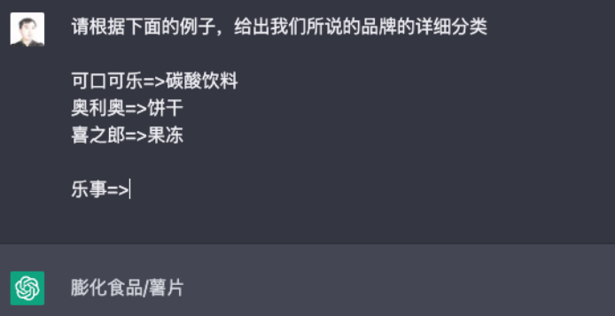
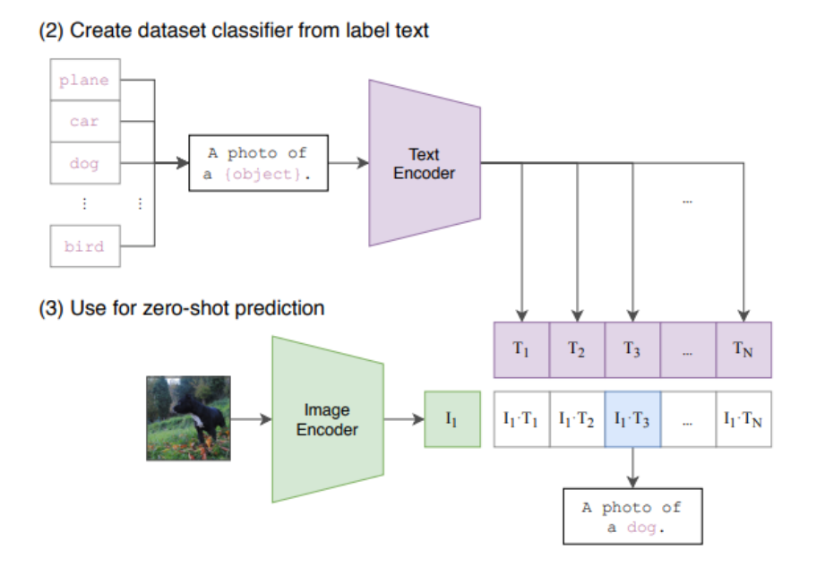
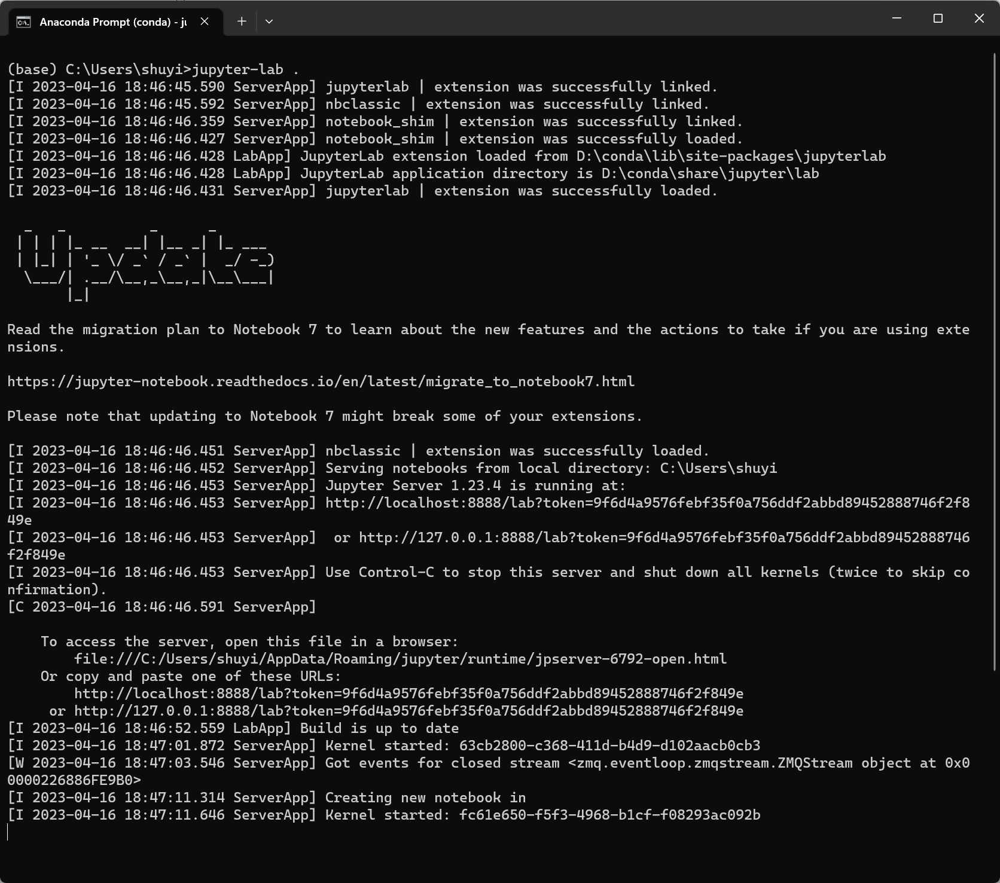
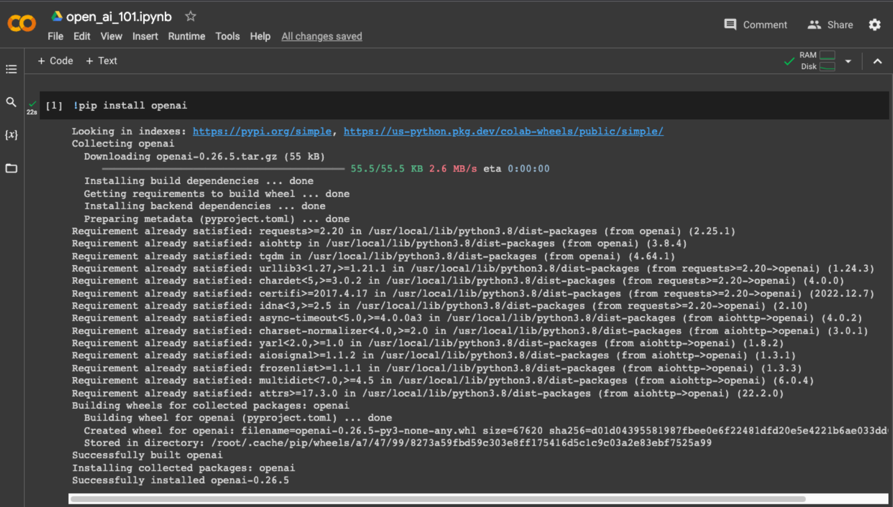

编译原理、操作系统、图形学和人工智能

各种机器学习模型，开源软件包和各种云平台提供的解决方案。

chatGPT之前的人工智能的特点：有多少人工就有多少智能，所有的“智能”都来自于大量的人工数据标注，通过数据标注、模型的训练，甚至很多硬编码的业务规则。导致在一些特殊情况下，人工智能表现不佳。

现在借助chatGPT可以做许多事，用 OpenAI 提供的各种 API。了解新一代AI应用的能力，通过代码使用AI，并研发出应用。

以前算法工程师和机器学习研究人员是AI领域的能力，现在一般工程师也能通过AI进行学习工作和开发。

学习新一代AI应用开发的方法。

学习AI开发新应用的原因：

1. **这一轮的 AI 浪潮里，开发新的 AI 应用的门槛大大降低**

   以前学习并应用AI门槛很高，需要的基础有：

   - 数学基础，微积分，线性代数和概率论；
   - 掌握大量机器学习和深度学习知识；了解各种基础模型，比如逻辑回归、SVM、CNN、LSTM 等的原理和实现；
   - 学会使用各种机器学习的编程框架，比如 TensorFlow 或者 PyTorch；
   - 一块价格不菲的 GPU 尝试训练模型；
   - 理解在实际应用里锤炼机器学习的各种实战技巧和模型，比如各种各样的特征工程方式、Dropout 等正则化方法、超参数调优等；
   - 培养周期至少一两年以上；

   本轮AI浪潮伴随着 GPT-3、Stable Diffusion 这样预训练好的大型基础模型的出现，以及这些模型的能力通过开放 API 的形式提供出来，即使没有任何机器学习的理论知识，只需要一两天时间，就能做出一个能解决实际问题的 AI 应用。

2. **这一轮的 AI 浪潮里，对应技术能够应用的范围非常广泛**

   - 80 年代学习理论（Learning Theory）的发展，使得 SVM 在实践中被大量应用
   - 00年代海量参数的分布式机器学习被广泛运用在搜索、推荐和广告的业务中
   - 2012 年 AlexNet 的发布，深度学习和卷积神经网络（CNN）带来了计算机视觉的爆发

   上面的基础AI发展的特点：这些AI的发展，往往只是某一个细分领域上的进步。而且这个过程里，对于每一个具体问题都要单独收集数据、训练单独的机器学习模型来解决里面某一个小问题。

   从 2020 年的 GPT-3 开始，拥有**海量参数的大模型**出现，直接使用预训练好的大语言模型，无需任何微调，就能解决**情感分析、命名实体识别、机器翻译**等一系列的自然语言处理问题。而对于很多 AI 没见过的问题，也只要通过自然语言给到 AI 几个例子，通过“小样本学习”（Few-Shot Learning），AI 就能给出正确的回答。（零样本以及小样本学习的能力，使得一个大模型可以一次性解决不同类型的很多问题）

   

   

   在计算机视觉上，2021 年 OpenAI 发表的 CLIP 这样的模型也有类似的效果。对于图片的分类不再局限于预先的人工数据标注的类别，而是可以扩展到任何类别上去。在自然语言、语音、视觉，乃至这些领域相互融合的多模态领域里，AI 同时在加速发展。（通过 4 亿个（图片, 文本）对的训练，对于图片的分类可以任意扩展，而不需要预先标注。）

   

3. **这个浪潮带来的变化会对每一个人的工作带来巨大的冲击**
   让 AI 帮写代码，翻译英文资料，修改写过的文章，为文章配图等。

   善用 AI 的团队和公司接下来一定会有更高的效率和产出。AI 会像一个助手一样随时陪伴，随时帮解决简单的知识性工作，甚至在很多时候给出创意性的启发。

   整个 AI 基于基础大模型发展出来的能力，堪比一次工业革命。**固然，这个改变对很多人的职业生涯来说，也是一场危机。但是就像丘吉尔所说的，“不要浪费一场危机”，尽早去拥抱这个变化，你就有机会像在 2008 年 App Store 发布的时候去学习移动 App 开发一样，把握住未来的机会。**


**如何学习AI应用开发**

1. 从实践问题触发，每节课正对一个需求解决问题，比如，用户对于商家评论的情感分析，能够记住上下文的聊天机器人，如何通过用户输入的关键词搜索图片等
2. 对 OpenAI 的 API 的讲解，也会去尝试一些开源模型，也会去覆盖语音、视觉的应用场景，体验语音识别、语音合成、AI 作画等一系列应用开发；使用 OpenAI 的 API或者选用本地部署的开源模型
3. 学习现在 AI 有什么能力，实际使用 AI 的套路，比如分类、搜索、推荐、问答这些问题，应该如何用现有模型的能力来解决，有什么固定的模式可以解决这些问题
4. 组合多个 API、开源模型和开源库去解决复杂的真实问题的场景


**课程安排**

1. 基础知识篇，探究大型语言模型的基本能力。通过提示语（Prompt）和嵌入式表示（Embedding）这两个核心功能，看看大模型能帮解决哪些常见的任务。通过这一部分，熟悉 OpenAI 的 API，以及常见的分类、聚类、文本摘要、聊天机器人等功能实现。
2. 实战提高篇，进入真实的应用场景。够把自己系统里面的信息，和 AI 系统结合到一起去，以解决和优化实际的业务问题。比如优化传统的搜索、推荐；或者进一步让 AI 辅助读书读文章；乃至于让 AI 自动根据我们的代码撰写单元测试；最后，还能够让 AI 去决策应用调用什么样的外部系统，来帮助客户解决问题。
3. 语音与视觉篇，体验语音识别、语音合成，以及唇形能够配合语音内容的数字人。如何利用现在最流行的 Stable Diffusion 这样的开源模型，去生成所需要的图片。并在最后，把聊天和画图结合到一起去。


如何学习本专栏？基于AI，现在的学习方式可以发生什么样变化？

多体验，多尝试，多思考。这个专栏不将AI背后的数学原理和模型理论知识，而是重在实践应用AI技术。

1. 拿到每节课中的代码内容，去执行查看结果，去修改
2. 多去体验各类AI应用，比如ChatGPT，StableDiffusion
3. 学以致用


通过AI改变自己的学习和工作，将AI嵌入生活和工作的方方面面，提高效率。

工具：

1. chatGPT，问问题时，不要问一些很宽泛的问题，让问题更有针对性；追问，解释代码。
2. Quora 发布的 [Poe](https://poe.com/)中可以使用 ChatGPT 的模型，也可以使用好几个其他的大语言模型
3. 使用[彩云小译](https://fanyi.caiyunapp.com/#/)浏览器插件，将要看的内容变成中英文对照的版本。快速先浏览中文翻译，如果觉得翻译得有些看不懂，或者内容特别有价值，再去看英文原文
4. 使用语音识别和文本摘要插件工具生成文本信息，然后通过 ChatGPT 背后的语言模型生成一个摘要，[Glarity](https://chrome.google.com/webstore/detail/glarity-summary-for-googl/cmnlolelipjlhfkhpohphpedmkfbobjc/related)浏览器插件
5. [AI 辅助读论文网站](https://typeset.io/)
6. [AI辅助阅读PDF](https://www.chatpdf.com/)
7. [写代码辅助工具Copilot](https://www.chatpdf.com/)
8. 写作AI工具[notion.ai](https://www.notion.so/product/ai)
9. 绘图工具Midjourney、Dall-E 2


使用 OpenAI 的 API 来和 AI 应用沟通，使用的是 OpenAI 的 GPT-3.5 系列的大语言模型。

**准备工作**

1. 账号创建，注册一个可以使用 OpenAI 的 API 的账号，[入口](https://platform.openai.com/overview)

   

2. 获取API key，点击右上角用户头像图标，然后点击 “View API Keys”，进入管理 API Keys 的页面

   

   

3. 点击 Create new secret key，创建一个新的 API Key

   

4. 之后调用 OpenAI 的接口都需要使用这个 API Key

> 现在 OpenAI 为所有免费注册的用户都提供了 5 美元（最早是 18 美元）的免费使用 API 的额度，这个额度用来体验 API 的功能

5. 本地搭建Jupyter Labs开发环境，这里用python语言，[Python 语言的官网](https://www.python.org/downloads/)下载并安装对应的开发环境

6. 安装python包管理器，包管理和环境管理工具，推荐：[Conda](https://docs.conda.io/en/latest/miniconda.html)  ,python自带的包管理工具：pip

7. 通过包管理工具，配置一个独立的 Python 3.10 的环境，并安装好 JupyterLab、OpenAI 以及后面要用到的一系列开发包

   ```shell
   conda create --name py310 python=3.10
   conda activate py310
   conda install -c conda-forge jupyterlab
   conda install -c conda-forge ipywidgets
   conda install -c conda-forge openai
   ```

8. 将API Key 设置到环境变量中，然后启动 JupyterLab

   ```shell
   
   export OPENAI_API_KEY=在这里写你获取到的ApiKey
   
   jupyter-lab .   // 这是启动JupyterLab
   ```

   

   

9. 可以选择新建 Python 3 的 Notebook，来体验交互式地运行 Python 代码调用 OpenAI 的 API， 环境准备结束


**不在本地搭建开发环境的方法**

使用 Google 提供的叫做[Colab](https://colab.research.google.com/) 的线上 Python Notebook 环境。Colab 可以免费使用一些 GPU 的资源，在需要使用 GPU 尝试训练一些深度学习模型，而又没有一张比较好的显卡的时候，就可以直接使用它。

线上的Colab需要安装openAI的python依赖包：!pip install openai  和设置API key：`%env OPENAI_API_KEY=在这里写你获取到的ApiKey`



如果需要将 Notebook 分享出去，记得把其中 OpenAI 的 API key 删除掉，免得别人的调用，花费都算在了自己头上。


**体验openai的API**

在JupyterLab或者Colab环境中创建一个文件并编写下面的代码

```py
import openai
import os

openai.api_key = os.environ.get("OPENAI_API_KEY")  // 或者openai.api_key = "your openai_key"
COMPLETION_MODEL = "text-davinci-003"

prompt = """
Consideration product : 工厂现货PVC充气青蛙夜市地摊热卖充气玩具发光蛙儿童水上玩具

1. Compose human readable product title used on Amazon in english within 20 words.
2. Write 5 selling points for the products in Amazon.
3. Evaluate a price range for this product in U.S.

Output the result in json format with three properties called title, selling_points and price_range
"""

def get_response(prompt):
    completions = openai.Completion.create (
        engine=COMPLETION_MODEL,
        prompt=prompt,
        max_tokens=512,
        n=1,
        stop=None,
        temperature=0.0,        
    )
    message = completions.choices[0].text
    return message

print(get_response(prompt)) 
```

执行结果：

```json
{
    "title": "Glow-in-the-Dark Inflatable PVC Frog Night Market Hot Selling Water Toy for Kids",
    "selling_points": [
        "Made of durable PVC material",
        "Glow-in-the-dark design for night play",
        "Inflatable design for easy storage and transport",
        "Perfect for water play and outdoor activities",
        "Great gift for kids"
    ],
    "price_range": "$10 - $20"
}
```

上述代码的目的：

这段代码里面，调用了 OpenAI 的 Completion 接口，然后向它提了一个需求，也就是为一个在 1688 上找到的中文商品名称做三件事情：

1. 为这个商品写一个适合在亚马逊上使用的英文标题。
2. 给这个商品写 5 个卖点。
3. 估计一下，这个商品在美国卖多少钱比较合适。

同时，告诉 OpenAI，希望返回的结果是 JSON 格式的，并且上面的三个事情用 title、selling_points 和 price_range 三个字段返回。


案例代码中，openAI完成的几个点：

1. 翻译，将给的中文商品名称恰当的改为英文的
2. 理解自然语言去生成文本，希望它写一个在亚马逊电商平台上适合人读的标题，所以在返回的英文结果里面，AI 没有保留原文里有的“工厂现货”的含义，因为那个明显不适合在亚马逊这样的平台上作为标题。下面 5 条描述也没有包含“工厂现货”这样的信息。而且，其中的第三条卖点 “Inflatable design for easy storage and transport”，也就是作为一个充气的产品易于存放和运输，这一点其实是从“充气”这个信息 AI **推理**出来的，原来的中文标题里并没有这样的信息
3. 利用 AI 自己有的知识给商品定价，它为这个商品定的价格是在 10～20 美元之间。而用 “Glow-in-the-Dark frog” 在亚马逊里搜索，搜索结果的第一行里，就有一个 16 美元发光的青蛙
4. 根据要求把想要的结果，通过一个 JSON 结构化地返回，尽管没有提出要求，但是 AI 还是贴心地把 5 个卖点放在了一个数组里，方便后续只选取其中的几个来用


**案例二**

```py
import openai
import os

openai.api_key = os.environ.get("OPENAI_API_KEY")  // 或者openai.api_key = "your openai_key"
COMPLETION_MODEL = "text-davinci-003"

prompt = """
Man Utd must win trophies, says Ten Hag ahead of League Cup final

请将上面这句话的人名提取出来，并用json的方式展示出来
"""

def get_response(prompt):
    completions = openai.Completion.create (
        engine=COMPLETION_MODEL,
        prompt=prompt,
        max_tokens=512,
        n=1,
        stop=None,
        temperature=0.0,        
    )
    message = completions.choices[0].text
    return message

print(get_response(prompt))
```

输出结果：

```js
{
  "names": ["Ten Hag"]
}
```

给了它一个英文的体育新闻的标题，然后让 AI 把其中的人名提取出来。可以看到，返回的结果也准确地把新闻里面唯一出现的人名——曼联队的主教练滕哈格。

这个例子里，希望 AI 处理的内容是英文，给出的指令则是中文。不过 AI 都处理得很好，而且输入完全是自然的中英文混合在一起，并没有使用特定的标识符或者分隔符。

这里的两个例子，其实对应着很多不同的问题，其中就包括**机器翻译、文本生成、知识推理、命名实体识别**等。在传统的机器学习领域，对于其中任何一个问题，都可能需要一个独立的机器学习模型。就算把这些模型都免费提供，把这些独立的机器学习模型组合到一起实现上面的效果，还需要海量的工程研发工作。没有一个数十人的团队，工作量根本看不到头。

然而，OpenAI 通过一个包含 1750 亿参数的大语言模型，就能理解自然的语言输入，直接完成各种不同的问题。


参考资料：

- OpenAI 提供的[示例](https://platform.openai.com/examples/)
- [GPT、GPT-2、GPT-3 论文精读](https://www.bilibili.com/video/BV1AF411b7xQ/)
- [GPT3应用案例](https://gpt3demo.com/#)
- [copilot指导](https://docs.github.com/en/copilot/quickstart)
- [GitHub Pro指导](https://xiaoma.cool/2022/10/26/GitHub%E5%AD%A6%E7%94%9F%E5%8C%85%E7%99%BD%E5%AB%96Jetbrains%E5%85%A8%E5%AE%B6%E6%A1%B6%E7%AD%89%E6%9D%83%E7%9B%8A/#)


## 情感分析

OpenAI 只提供了 Complete 和 Embedding 两个接口，其中，Complete 可以让模型根据输入进行自动续写，Embedding 可以将输入的文本转化成向量。

传统的二分类方法：朴素贝叶斯与逻辑回归

“情感分析”：指根据一段文字，去判断它的态度是正面的还是负面的。传统的解决方案就是把它当成是一个分类问题，也就是先拿一部分评论数据，人工标注一下这些评论是正面还是负面的。把标注好的数据，喂给一个机器学习模型，训练出一组参数。然后把剩下的没有人工标注过的数据也拿给训练好的模型计算一下。模型就会给你一个分数或者概率，告诉你这一段评论的感情是正面的，还是负面的。

**朴素贝叶斯算法**来进行垃圾邮件分类：简单地统计每个单词和垃圾邮件和普通邮件之间的条件概率。一般来说，如果一个词语在差评里出现的概率比好评里高得多，那这个词语所在的评论，就更有可能是一个差评。

