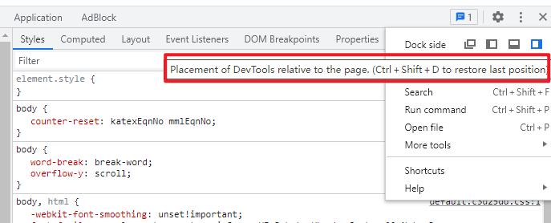

# Chrome DevTools

**面板简介：**

1. 元素面板

   作用：操作 `DOM` 和 `CSS` 来布局和改变样式
   

2. 控制台面板
   作用：查看报错，警告信息、作为shell与`JavaScript` 交互
   

3. 源代码面板
   作用：设置源码断点来调试 `JavaScript` ，或者通过 `Workspaces`（工作区）连接本地文件来使用开发者工具的实时编辑器

   

4. 网络面板
   作用：了解请求和下载的资源文件并优化网页加载性能，模拟不同网络环境，查看资源时间轴
   

5. 性能面板
   可以记录和查看网站生命周期内发生的各种事件的运行时性能

   

6. 内存面板

   跟踪变量的内存使用，项目的内存使用和内存泄漏

   

7. 应用面板
   检查加载的`IndexedDB` 与 `Web SQL` 数据库，本地和会话存储，`cookie` ，应用程序缓存，图像，字体和样式表

   

8. 安全面板

   调试混合内容问题，证书问题

   

对 `DevTools` 里面数据进行 **复制** 或者 **保存** 的操作

**copy()**

通过在控制台面板（console）中使用全局的copy()方法复制任何页面中任何全局的数据或者指定对象的属性或者方法。然后再ctrl + v实现粘贴。

**Store as global**

如果在 `console` 中打印了一堆数据，然后想对这些数据在不影响它原来值的情况下，做一些额外的操作。可以将它转换成一个全局变量，只需要 **右击** 它，并选择 “`Store as global variable`” (保存为全局变量) 选项。

第一次使用的话，它会创建一个名为 `temp1` 的变量，第二次创建 `temp2`，第三次 ... 。

**保存堆栈信息**

用于定位各种报错问题。可以直接把堆栈跟踪的信息保存为一个文件，而不只是截图发给同事。

**Copy HTML**

在Element面板，右击或者点击在 `HTML` 元素边上的省略号 (...) 就可以将它 `copy` 到剪贴板中。也可以使用[ctrl] + [c]。

**快捷键**

切换 `DevTools` 窗口的展示布局：

使用一个快捷键 `ctrl + shift + D` (`⌘ + shift + D` Mac) 来实现位置的切换。

切换 `DevTools` 的面板：

- 按下 `ctrl + [` 和 `ctrl + ]` 可以从当前面板的分别向左和向右切换面板。

- 按下 `ctrl + 1` 到 `ctrl + 9`可以直接转到编号`1`...`9`的面板(`ctrl + 1` 转到元素面板，`ctrl + 4` 转到网络信息面板)，这组快捷键默认被禁用，可以通过 `DevTools`>>`Settings` >>`Preferences`>>`Appearance` 打开这个选项。

  

**递增/递减**

使用 `带有` 或者 `不带有修饰键` 的 `上` / `下` 箭头按键， 可以实现递增和递减 `0.1` ， `1` 或者 `10` 这样数值类型的值。

**查找**

elements， logs， sources & network 中，每一个都支持 `[ctrl] + [f]` 快捷方式。

- 在 `Elements` 面板中 - 通过 `string` ，选择器 或者 `XPath` 来查找

- 而在 `Console`， `Network` 以及 `Source` 面板 - 通过区分大小写，或者可以被视为表达式的 `strings`， 来查找

  

**Command**

`Command` 菜单可以帮助快速找到那些被隐藏起来的功能。

- 在 `Chrome` 的调试打开的情况下 按下 [ `Ctrl]` + `[Shift]` + `[P]` (Mac： `[⌘]` + `[Shift]`+ `[P]` )

- 或者使用 `DevTools` 的 `dropdown` 按钮下的这个选项

  

  可供选择的命令列表，归为几个部分：
  

**截图**

**切换面板布局**

将 `样式面板` 从 `html预览` 的底部移动到右边或者周围其他的位置

打开 `Commands` 菜单并且输入 `layout` ，你会看到 `2` 到 `3` 个可供选择的项(这里不再显示已经激活的选项)：

- 使用横向面板布局
- 使用纵向面板布局
- 使用自动面板布局

from langchain.llms import OpenAIChat

from langchain.text_splitter import SpacyTextSplitter

from llama_index import GPTListIndex, LLMPredictor, SimpleDirectoryReader

documents = SimpleDirectoryReader('./data/mr_fujino').load_data()

llm_predictor = LLMPredictor(llm=OpenAIChat(temperature=0, model_name="gpt-3.5-turbo", max_tokens=1024))

list_index = GPTListIndex(documents, llm_predictor=llm_predictor, 

                          text_splitter=SpacyTextSplitter(pipeline="zh_core_web_sm", chunk_size = 2048))

response = list_index.query("下面鲁迅先生以第一人称‘我’写的内容，请你用中文总结一下:", response_mode="tree_summarize")

print(response)

**切换主题**

在 `Commands` 菜单中寻找与 `theme` 相关的选项，实现 `明亮` & `暗黑` 两种主题之间的切换。

**代码块复用**

对于一个脚本只是偶尔运行一下，记住一段这样的脚本会很麻烦。使用Snippets，存放 `JavaScript` 代码到 `DevTools` 中，方便复用这些 `JavaScript` 代码块。

进入到 `Sources` 面板，在导航栏里选中 `Snippets` 这栏，点击 `New snippet(新建一个代码块)` ，然后输入的代码之后保存，现在可以通过右击菜单或者快捷键： `[ctrl] + [enter]` 来运行它：

在 `Chrome` 的 `Elements` 面板中， `$0` 是对我们当前选中的元素节点的引用。$1 是对上一次我们选择的节点的引用，`$2` 是对在那之前选择的节点的引用，等等。一直到 $4。

**$和 ?**

$: 如果没有在 `App` 中定义过 `$` 变量 (例如 `jQuery` )的话，它在 `console` 中就是对这一大串函数 `document.querySelector` 的别名。

?:它不仅执行 `document.querySelectorAll` 并且它返回的是：一个节点的 **数组** ，而不是一个 `Node list`,本质上来说 `Array.from(document.querySelectorAll('div')) === ?('div')`。

**`$_`**

调试的过程中，经常会通过打印查看一些变量的值，但如果想看一下上次执行的结果，可以不用再输入一次代码执行。直接使用`$_`,`$_` 是对上次执行的结果的 **引用** 。

**$i**

在 `Dev Tools` 里面来使用 `npm` 插件。有时只是想试一下新出的 `npm` 包，现在不用再大费周章去建一个项目测试了，只需要在 [Chrome插件:Console Importer](https://link.juejin.cn/?target=https%3A%2F%2Fchrome.google.com%2Fwebstore%2Fdetail%2Fconsole-importer%2Fhgajpakhafplebkdljleajgbpdmplhie%2Frelated) 的帮助之下，快速的在 `console` 中引入和测试一些 `npm` 库。

运行 `$i('lodash')` 或者 `$i('moment') `几秒钟后，就可以获取到 `lodash / momentjs` 。

**console.log 的 "bug"**

当使用console.log来打印某个对象，并且两次打印之间，还会对这个对象进行修改，最后查看打印的结果发现，修改前的打印和修改后的打印，竟然是一样的。

可以看到，一共有两次打印，一次期望打印原始信息，一次期望打印修改后的信息，并且把属性 `a` 从 `0` 改成 `1` ，`name` 属性从 `Tomek` 改成 `Not Tomek`。但是都是打印修改后的结果。

原因：`console` 中打印出的对象，在你打印出他内容之前，是以引用的方式保存的。

为此应对方法：

- 打印一个从这个对象复制出来的对象。
- 使用资源面中的断点来调试
- 使用 `JSON.stringify()` 方法处理打印的结果

**异步console**

- `Storage` 系统的 **占用数** 和 **空闲数**

- 设备的 **电池信息**

- **媒体能力**

- **Cache storage keys**

**条件断点**

有时设置的断点被执行了太多次，假设有一个包含 `200` 次的循环，但是只对第 `110` 次循环的结果感兴趣，又或者只对一些满足某些条件的结果感兴趣，这时就使用条件断点。

`Conditional breakpoints` 条件断点

- 右击行号，选择 `Add conditional breakpoint...(添加条件断点)`
- 或者右击一个已经设置的断点并且选择 `Edit breakpoint(编辑断点)`
- 然后输入一个执行结果为 `true` 或者 `false` 的表达式（它的值其实不需要完全为 `true` 或者 `false` 尽管那个弹出框的描述是这样说的）。
- 在这个表达式中你可以使用任何这段代码可以获取到的值（当前行的作用域）。

如果条件成立，这个断点就会暂停代码的执行：

**自定义格式转换器**

`DevTools` 的 `console` 有默认的对 `object` 的转换格式，但有时候想用不同的方式来处理，那我们就可以自定义输出对象的函数，它通常被称为 `Custom Formatter` 。

