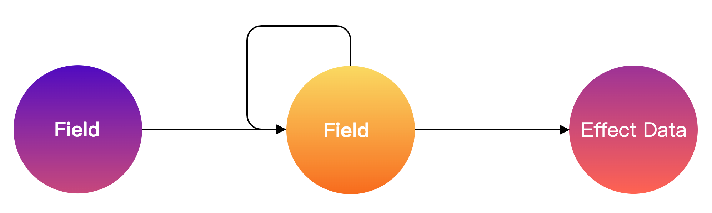

## 传统表单的问题

- 表单字段数量多后性能降低
- 字段关联逻辑复杂
  - 一对多(异步)
  - 多对一(异步)
  - 多对多(异步)
  - 字段的某些状态属性与某些数据的相互联动或者单方面联动
- 表单数据管理复杂
  - 表单值转换逻辑复杂(前后端格式不一致)，数据传给后端前需要格式化，后端传给前端也需要格式化
  - 同步默认值与异步默认值合并逻辑复杂
  - 跨表单数据通信
- 表单状态管理复杂，让数组数据在移动，删除过程中，字段状态能够做到跟随移动（自增列表场景）
- 难进行表单复用
- 动态渲染
- 难以进行字段配置化（命令式编程）
- 没有跨端渲染
- 表单布局多样
  - 纵向布局
  - 横向布局
  - 网格布局
  - 弹性布局
  - 自由布局
- 在表单协议中描述逻辑


## Formily的核心设计思路


### 什么是Formily

一款面向前端中后台复杂场景的 **数据 + 协议** 驱动的表单框架。 完成各种复杂的页面表单需求，也提供了一个表单设计器，可以快速搭建表单。

Formily 解决方案在 MVVM 中应该是什么样的定位是：**Formily 它提供了 View 和 ViewModel 两层能力**，View 则是@formily/react @formily/vue，专门用来与@formily/core 做桥接通讯的。


核心特点：

1. 高性能，在有大量表单字段和高频率输入数据时，能有O(1)的时间复杂度
2. 框架无关，兼容React，React-Native，Vue
3. 生态完备，formiy在组件的桥接层支持多种UI库
4. 协议驱动，可以借助Formily，让后端通过一份JSON来动态驱动表单渲染，实现表单的可配置，可搭建


设计原则：

1. 单一职责
2. 优雅命名


核心架构：


Formily 分为了内核层+协议层，UI 桥接层，扩展组件层，和配置应用层。

内核层是表单相关而与UI 无关的领域模型系统，它保证了用户管理的逻辑和状态是不耦合任何一个框架。

协议层是基于JSONScheme扩展出来的一个表单协议。

UI 桥接层是基于formily内核与各种前端框架对接的中间层。

扩展组件层是建立在UI桥接层和各种组件库对接的中间层。

配置应用层是借助formily可以构建纯源码，低代码，无代码等各种应用解决方案。

JSON Schema 独立存在，给 UI 桥接层消费，保证了协议驱动在不同 UI 框架下的绝对一致性，不需要重复实现协议解析逻辑。


## 具体设计思路


### 精确渲染

在 React 场景下实现一个表单需求，因为要收集表单数据，实现一些联动需求，大多数都是通过 setState 来实现表单字段数据收集，简单且 学习成本低，但是却又引入了性能问题，因为每次输入都会导致所有字段全量渲染，虽然在 DOM 更新层面是有 diff，但是 diff 也是有计算成本的，浪费了很多计算资源，如果用时间复杂度来看的话，初次渲染表单是 O(n)，字段输入时也是 O(n)，不合理。

采用MVVM设计模式，将视图模型抽象出来，然后在 DSL 模板层消费，DSL 借助某种依赖收集机制，然后在视图模型中统一调度，保证每次输入都是精确渲染的。

采用Mobx状态管理解决方案，核心依赖收集机制和响应式模型的抽象能力。


### 领域模型

表单的联动可以非常复杂，包含了字段间的各种关系，大多数表单联动，基本上都是基于某些字段的值改变引发的联动，但是，实际业务需求可能会比较恶心，不仅要基于某些字段值引发联动，还会基于其他副作用值引发联动，比如应用状态，服务端数据状态，页面 URL，**某个字段 UI 组件内部数据**，当前字段自身的其他数据状态，某些特殊异步事件等等。

想要达成一个联动关系，核心是将字段的某些状态属性与某些数据关联起来，这里的某些数据可以是外界数据，也可以是自身数据，比如字段的显示/隐藏与某些数据的关联，又比如字段的值与某些数据关联，还比如字段的禁用/编辑与某些数据关联。

如果要表达一个字段，那么字段的路径一定要有，因为要描述整个表单树结构；

要管理起字段对应 UI 组件的属性，比如 Input 和 Select 都有它的属性，举个例子，Input 的 placeholder 与某些数据关联，或者 Select 的下拉选项与某些数据关联；



根据这些需求，抽象出一个接口Filed：

```ts
interface Field {
   path:string[],
   value:any,
   visible:boolean,
   disabled:boolean,
   component:[Component,ComponentProps]
}
```

**component 属性，它代表了字段所对应的 UI 组件和 UI 组件属性**，这样就实现了某些数据与字段组件属性关联，甚至是与字段组件关联的能力。

**字段的外包裹容器，通常都叫 FormItem，它主要负责字段的外围的交互样式，比如字段标题，错误提示的样式**，如果想要囊括更多联动，比如某些数据与 FormItem 的联动，那就得把外包裹容器也加进去。

**抽象出字段模型，它包含了字段相关的所有状态，只要去操作这些状态就能引发联动。**


**这样的表单模型，解决的是表单领域问题，所以也称之为领域模型**，有了这样的领域模型，就能让表单的联动变得可枚举可预测，这样也为后面要说的协议描述联动打下了坚实基础。


### 路径系统

在表单领域模型中的字段模型，必须还要有一个表单模型作为顶层模型，**顶层模型管理着所有字段模型，每个字段都有着自己的路径。**

如何查找表单字段，Formily 的路径系统 @formily/path 很好的解决了这个问题，让字段查找变得优雅，它还能通过解构表达式去处理前后端数据结构不一致的问题。


### 生命周期

借助 Mobx 和路径系统，抽象了表单方案之后，方案就像个黑盒，外界无法感知到方案内部状态流转过程，想要在某个过程阶段内实现一些逻辑则无法实现，所以，需要另外一个概念，生命周期，只要将整个表单生命周期作为事件钩子暴露给外界，这样就能做到了既有抽象，但又灵活的表单方案。


### 协议驱动

要实现动态可配置表单，那必然是需要将表单结构变得可序列化，序列化的方式有很多种，可以是以 UI 为思路的 UI 描述协议，也可以是以数据为思路的数据描述协议，因为表单本身就是为了维护一份数据，对于表单场景而言，数据协议最适合不过，想要描述数据结构，采用了JSON-sheme协议。因为 JSON Schema 协议上本身就有很多校验相关的属性，这就天然和表单校验关联上了。

UI 描述协议适合更通用的 UI 表达，描述表单当然不在话下，只是它会更偏前端协议，相反，JSON-Schema，在后端模型层，都是可表达的，在描述数据上更通用，所以两种协议，各有所长，只是在单纯表单领域，JSON-Schema 会更偏领域化一些。

**如果选用 JSON-Schema，怎么描述 UI，怎么描述逻辑呢？**单纯的描述数据，想要输出实际业务可用的表单页面，不太现实。

[react-jsonschema-form](https://github.com/rjsf-team/react-jsonschema-form)的解法是，数据是数据，UI 是 UI，各个协议都是非常纯净的协议，但是却带来了较大的维护成本和理解成本，用户要开发一个表单，需要不断的在两种协议心智上做切换，所以，如果从技术视角来看这样的拆分，其实是非常合理的，但是从产品视角来看的话，拆分则是把成本抛给了用户，所以，**Formily 的表单协议会更加倾向于在 JSON-Schema 上做扩展。扩展了void类型来描述数据无关的布局容器或者控件；为了不污染标准 JSON-Schema 属性，统一以`x-*`格式来描述UI控件与控件的属性。**

```json
{
  "type": "string",
  "title": "字符串",
  "description": "这是一个字符串",
  "x-component": "Input",
  "x-component-props": {
    "placeholder": "请输入"
  }
}
```

UI 协议与数据协议混合在一起，只要有一个统一的扩展约定，也还是能保证两种协议职责单一。同时可以将临时状态（数据）封装在渲染引擎或者组件内部。


**在某些字段上包裹一个 UI 容器,Formily 定义了一个新的 schema type，叫`void`。在 JSON Schema 中，引入 void，代表一个虚数据节点，表示该节点并不占用实际数据结构。**

```json
{
  "type": "void",
  "title": "卡片",
  "description": "这是一个卡片",
  "x-component": "Card",
  "properties": {
    "string": {
      "type": "string",
      "title": "字符串",
      "description": "这是一个字符串",
      "x-component": "Input",
      "x-component-props": {
        "placeholder": "请输入"
      }
    }
  }
}
```

这样就可以描述了一个 UI 容器了，因为可以描述 UI 容器，就能轻易封装一个场景化的组件。

描述字段间联动:

```json
{
  "type": "object",
  "properties": {
    "source": {
      "type": "string",
      "title": "Source",
      "x-component": "Input",
      "x-component-props": {
        "placeholder": "请输入"
      }
    },
    "target": {
      "type": "string",
      "title": "Target",
      "x-component": "Input",
      "x-component-props": {
        "placeholder": "请输入"
      },
      "x-reactions": [
        {
          "dependencies": ["source"],
          "when": "{{$deps[0] == '123'}}",
          "fulfill": {
            "state": {
              "visible": true
            }
          },
          "otherwise": {
            "state": {
              "visible": false
            }
          }
        }
      ]
    }
  }
}
```

借助`x-reactions`描述了 target 字段，依赖了 source 字段的值，如果值为`'123'`的时候则显示 target 字段，否则隐藏，这种联动方式是一种**被动联动**


主动联动：只需要将`x-reactions`换个位置，放到 source 字段上，然后再指定一个 target 即可。

```json
{
  "type": "object",
  "properties": {
    "source": {
      "type": "string",
      "title": "Source",
      "x-component": "Input",
      "x-component-props": {
        "placeholder": "请输入"
      },
      "x-reactions": [
        {
          "when": "{{$self.value == '123'}}",   // 条件
          "target": "target",   // 目标字段
          "fulfill": {   // 条件满足的动作

            "state": {
              "visible": true
            }
          },
          "otherwise": {  // 条件不满足的动作

            "state": {
              "visible": false
            }
          }
        }
      ]
    },
    "target": {
      "type": "string",
      "title": "Target",
      "x-component": "Input",
      "x-component-props": {
        "placeholder": "请输入"
      }
    }
  }
}
```


### 分层架构

Formily的架构设计


Formily 分为了内核层，UI 桥接层，扩展组件层，和配置应用层。

内核层是 UI 无关的，它保证了用户管理的逻辑和状态是不耦合任何一个框架。

**JSON Schema 独立存在，给 UI 桥接层消费，保证了协议驱动在不同 UI 框架下的绝对一致性，不需要重复实现协议解析逻辑。**


## 学习建议

Formily是一个抽象了表单领域模型的 MVVM 表单解决方案。

1. 了解 Formily 的领域模型到底是咋样的
2. 解决了哪些问题
3. 如何消费这个领域模型的视图层（看具体组件的文档）

**顺序：引言介绍=>快速开始=>组件文档/核心库文档=>场景案例**


## @formily/core

这个包的目的：将领域模型从 UI 框架中抽离出来

- 方便 formily 开发者从 UI 与逻辑的耦合
- 让 formily 拥有跨终端，跨框架的能力
- 负责管理表单的状态，表单校验，联动


**表单问题分解：**

- 数据管理问题
- 字段管理问题
- 校验管理问题
- 联动管理问题


### 架构图


可以在响应器(Reactions)中消费 Form/Field/ArrayField/ObjectField/VoidField 模型中的任意属性，当依赖的属性发生变化，响应器就会重复执行。

Formily 它提供了 View 和 ViewModel 两层能力，View 则是@formily/react @formily/vue，专门用来与@formily/core 做桥接通讯的，所以，@formily/core 的定位就是 ViewModel 层。


### 表单模型的具体领域逻辑

表单模型核心子模型：

- 字段管理模型
- 字段模型
- 数据模型
- 联动模型
- 路径系统


#### 字段管理模型

主要包含：

- 字段添加

  > 通过 createField/createArrayField/createObjectField/createVoidField 方法来创建字段，如果字段已经存在，则不会重复创建。

- 字段查询

  > 通过 query 方法来查询字段，query 方法可以传入字段的路径或者正则表达式来匹配字段。调用 query 方法会返回一个 Query 对象。该对象上的方法：
  >
  > 1. 批量遍历所有字段的 forEach/map/reduce 方法
  > 2. 只取查询到的第一个字段的 take 方法
  > 3. 直接读取字段属性的 get 方法
  > 4. 可以深层读取字段属性的 getIn 方法

- 导入字段集

  > 通过 setFormGraph 来导入字段集，入参格式是一个扁平对象格式，key 是字段的绝对路径，value 是字段的状态，使用该 API 主要在一些需要做时间旅行的场景，将 Immutable 字段状态导入至表单模型中。

- 导出字段集

  > 通过 getFormGraph 来导出字段集，导出格式是一个扁平对象格式，key 是字段的绝对路径，value 是字段的状态，与导入字段集入参一致，因为返回的数据是一个 Immutable 的数据，所以是可以完全做持久化存储的，方便时间旅行。

- 清空字段集

  > 通过 clearFormGraph 来清空字段集。


#### 字段模型

主要包含了：

数据型字段（核心是负责维护表单数据(表单提交时候的值)）

- Field 模型，主要负责管理**非自增型字段**状态，比如 Input/Select/NumberPicker/DatePicker 这些组件
- ArrayField 模型，主要负责管理**自增列表字段**状态，可以对列表项进行增删移动的。在继承 Field 的基础上扩展了数组相关的方法，比如 push/pop/insert/move，不只是对字段的数据做处理，它内部还提供了对 ArrayField 子节点的状态转置处理主要为了保证字段的顺序与数据的顺序是一致。
- ObjectField 模型，主要负责管理**自增对象字段**状态，可以对对象的 key 做增删操作。ObjectField 就提供了 addProperty/removeProperty/existProperty 3 个 API 。


ArrayField 和 ObjectField 都继承自 Field，Field 的定位就是维护**非自增型数据字段**，并不是说 Field 就不能存数组类型或者对象类型的数据，Field 其实可以存任意数据类型的数据，只是，如果用户期望实现数组的添加删除移动这样的交互，则需要使用 ArrayField，对象属性的添加删除交互，则需要使用 ObjectField，如果没有这样的需求，所有数据类型统一用 Field 即可。


##### Field 领域规则

- 路径规则

  > 表单结构本身就是一个树结构，所以在 Formily 中，每个字段在表单模型中都会有一个绝对路径，大致描述了字段在表单数据中的位置。通过绝对路径可以找到任意一个字段，同时还能表达字段间的父子关系。
  >
  > 字段模型中，定义了 address 属性来表达字段的绝对路径，主要用点语法来描述，比如 a.b.c 这样的路径代表了字段 c 的父亲是字段 b，字段 b 的父亲是 a。
  >
  > VoidField 作为虚数据字段，它同样也有自己的绝对路径，因为它可以作为数据字段的父亲，如果我们只有绝对路径， 就无法让一个数据字段正确的往表单数据里写入字段数据。读取数据也会读错位置。
  >
  > 其实还需要一个数据路径作为专门用于数据字段写入数据和读取数据的，用 path 来描述字段的数据路径。
  >
  > Address 永远是代表节点的绝对路径，Path 是会跳过 VoidField 的节点路径，但是如果是 VoidField 的 Path，是会保留它自身的路径位置。
  >
  > 不管是 Field 还是 VoidField，都会有它的 Address 和 Path，所以我们在用 query 方法查询字段的时候，既可以用 Address 规则查询，也可以用 Path 规则查询。

- 显隐规则

  > 字段的显示隐藏，主要用 display 属性来表达：
  >
  > - display 为 none 代表字段 UI 隐藏，同时不保留字段数据
  > - display 为 hidden 代表字段 UI 隐藏，保留字段数据
  > - display 为 visible 代表字段 UI 显示，同时恢复字段数据
  >
  > 还提供了两个便捷属性
  >
  > 1. visible，如果为 true 代表 display 等于 visible，如果为 false 代表 display 等于 none
  > 2. hidden，如果为 true 代表 display 等于 hidden，如果为 false 代表 display 等于 visible

- 数据读写规则
  >一般通过path 属性来寻址，读取的方式是直接读取 value/initialValue 。
  >
  >写入的方式主要有：
  >
  >- 直接修改 value/initialValue 属性
  >- 调用 onInput 会写入数据，同时设置字段的 inputValue 为入参数据，inputValues 为多参数据，然后设置 modified 属性为 true，代表该字段被手动修改过，最后触发 triggerType 为 onInput 的校验规则
  >- 调用 setValue 方法

- 数据源规则

  > 字段的值来源不是只有通过 Input 输入框输入的，还有会从一个数据源中选取的，比如下拉框之类的，所以字段模型加了一个数据源的属性 dataSource，专门用于读取数据源。

- 字段组件规则

  > 如果没有代理 UI 组件信息，那就没法实现更加精细化的联动控制了，比如 A 字段的值变化要控制 B 字段的 placeholder，那就必须将字段的属性给代理起来，所以 formily 提供了 component 属性，专门用于代理 UI 组件信息，component 是一个数组`[Component,ComponentProps]`，第一个元素代表是哪个组件，第二个代表组件的属性有哪些。
  >
  > 写入组件信息的方式主要有：
  >
  > - 直接修改 component 属性，传入数组
  > - 调用 setComponent 方法，第一个参数是组件，第二个是组件属性
  > - 调用 setComponentProps 方法，直接会设置组件属性

- 字段装饰器规则

  > 字段装饰器主要用来维护字段的包裹容器，比如 FormItem，更偏 UI 布局的控制，用 decorator 属性来描述字段装饰器。
  >
  > 读取装饰器信息的方式直接读取 decorator 属性即可。
  >
  > 写入装饰器信息的方式主要有：
  >
  > - 直接修改 decorator 属性，传入数组
  > - 调用 setDecorator 方法，第一个参数是组件，第二个是组件属性
  > - 调用 setDecoratorProps 方法，直接会设置组件属性

- 校验规则

  > 主要包含：
  >
  > - 校验器
  >
  >   校验器主要用 validator 属性描述，在字段初始化的时候可以给字段传入 validator，初始化之后也可以再次修改 validator。
  >
  >   validator 的几种传值方式：
  >
  >   1. 纯字符串格式校验，比如`"phone" | validator = "url" | validator= "email"` ，这样的格式校验是正则规则的简写形式，formily 内部提供了一些标准的正则规则，当然用户也能通过 **registerValidateFormats** 来手动创建规则，方便复用
  >   2. 自定义函数校验，有 3 种返回值模式：
  >      - `(value)=>"message"`，返回字符串代表有错误，不返回字符串代表无错误
  >      - `(value)=>({type:"error",message:"message"})`，返回对象形式，可以指定 type 是 error 或 warning 或 success
  >      - `{validator:()=>false,message:"message"}`，返回布尔形式，错误消息会复用对象结构的 message 字段
  >   3. 对象结构校验，是一种更完备的表达，比如：
  >      - `{format:"url"}` 这样可以指定正则格式
  >      - `{required:true}`这样可以指定必填
  >      - 还有更多的规则属性可以参考 API 文档，同时我们还能通过 registerValidateRules 来注册类似的校验规则
  >   4. 对象数组结构校验，是前面三种的组合表达，其实前 3 种，都会转换成对象数组结构，比如：
  >      - `["url",{required:true},(value)=>"message"]`其实相当于 `[{format:"url"},{required:true},{validator:(value)=>"message"}]`
  >
  > - 校验时机
  >
  >   希望某些校验规则只在聚焦或者失焦的时候触发，可以在每个校验规则对象中加一个 triggerType，比如`{validator:(value)=>"message",triggerType:"onBlur"}` 这样就可以精确的控制某个校验规则只在某个事件中执行校验，这里的 triggerType 主要有`"onInput" | "onBlur" | "onFocus"` ，如果调用`form.validate`，是会一次性校验所有 triggerType 的规则，如果手动调用`field.validate`，则可以在入参中指定 triggerType，不传参就会校验所有。
  >
  > - 校验策略
  >
  >   希望某个字段的校验策略是，执行所有校验规则的时候，如果某个校验规则校验失败则立即返回结果，只需要在 field 初始化的时候传入参数 validateFirst 为 true 即可，默认是 false，也就是校验失败也会继续校验，拿到的校验结果是一个数组。
  >
  > - 校验结果
  >
  >   对于校验结果，在字段模型中主要是存放在 feedbacks 属性中的，feedbacks 是由 Feedback 对象组成的数组，每个 Feedback 的结构是：
  >
  >   ```ts
  >   interface Feedback {
  >     path: string //字段数据路径
  >     address: string //字段绝对路径
  >     type: 'error' | 'success' | 'warning' //校验结果类型
  >     code: //校验结果编码
  >     | 'ValidateError'
  >       | 'ValidateSuccess'
  >       | 'ValidateWarning'
  >       | 'EffectError'
  >       | 'EffectSuccess'
  >       | 'EffectWarning'
  >     messages: string[] //校验消息
  >   }
  >   ```
  >
  >   读取方式主要有 4 种：
  >
  >   - 直接读取 feedbacks 属性
  >   - 读取 errors 属性，相当于是从 feedbacks 中过滤出 type 为 error 的所有校验结果
  >   - 读取 warnings 属性，相当于是从 feedbacks 中过滤出 type 为 warning 的所有校验结果
  >   - 读取 successes 属性，相当于是从 feedbacks 中过滤出 type 为 success 的所有校验结果


虚数据型字段（更多的是作为容器**维护一批字段的 UI 形式**）

- VoidField 模型，主要负责管理**虚字段**状态，虚字段是一种不会污染表单数据的节点存在，但是**它可以控制它的子节点显示隐藏，交互模式**。相比于 Field，主要是阉割了数据读写规则、数据源规则和校验规则，用户使用的时候，主要还是使用显隐规则和组件，装饰器规则。


#### 数据模型

主要包含：

- 表单值(values)管理

  > 表单值管理，其实就是一个对象结构的 values 属性，同时借助了 @formily/reactive 的深度 observer 能力，监听了它任意属性变化，如果发生变化，便会触发 onFormValuesChange 的生命周期钩子。

- 表单默认值(initialValues)管理

  > 默认值管理也是一个对象结构的 initialValues 属性，同样会深度监听属性变化，触发 onFormInitialValues 的生命周期钩子。

- 字段值(value)管理

  > 字段值管理，是在每个数据型字段的 value 属性上体现的，formily 会给每个字段维护一个叫 path 的数据路径属性，然后 value 的读写，都是对顶层表单的 values 进行读写，这样保证了字段的值与表单的值是绝对幂等的，同理字段默认值也一样。

- 字段默认值(initialValue)管理

- 值与默认值的选择合并策略

  

**值的管理，都是在顶层表单上管理的，字段的值与表单的值是通过 path 来实现的绝对幂等。**


#### 校验模型

核心是对数据的合法性校验，然后将校验结果管理起来，主要包含了：

- 校验规则管理
- 校验结果管理


#### 联动模型

在 formily2.x 中，在主动联动模型上新增了被动联动模型，同样是一句表达式表达：

```ts
subscribe(Dependencies, Reactions)
```

核心就是针对依赖数据变化做响应，依赖的数据可以是表单模型属性，也可以是任意字段模型的属性，响应的动作可以是改任意字段模型的属性，也可以是做其他异步动作。


#### 路径系统

给表单模型提供了几个能力：

- 它可以用来从字段集中查找任意一个字段，同时支持按照规则批量查找
- 它可以用来表达字段间关系的模型，**借助路径系统，可以实现查找某个字段父亲，能查找父亲，也就能实现树级别的数据继承能力，同样，也能查找某个字段的相邻节点**
- 它可以用来实现字段数据的读写，带解构的数据读写


### API

1. createForm：创建一个 Form 实例，作为 VM 给 UI 框架层消费


## @formily/reactive

这个库的核心思想是借鉴的Mobx。


## 快速开始

### 安装依赖

```shell
npm install --save @formily/core   // 责管理表单的状态，表单校验，联动等
npm install --save @formily/react  // 一个 UI 库来接入内核数据，用来实现最终的表单交互效果
npm install --save antd moment @formily/antd  // 
```


### 使用

```ts
import React from 'react'
import { createForm } from '@formily/core'
import { FormProvider, Field } from '@formily/react'
import { FormItem, Input } from '@formily/antd'
```


### 代码示例

```js
import React from 'react'
import { createForm } from '@formily/core'
import { FormProvider, FormConsumer, Field } from '@formily/react'
import {
  FormItem,
  FormLayout,
  Input,
  FormButtonGroup,
  Submit,
} from '@formily/antd'

const form = createForm()

export default () => {
  return (
    <FormProvider form={form}>
      <FormLayout layout="vertical">
        <Field
          name="input"
          title="输入框"
          required
          initialValue="Hello world"
          decorator={[FormItem]}
          component={[Input]}
        />
      </FormLayout>
      <FormConsumer>
        {() => (
          <div
            style={{
              marginBottom: 20,
              padding: 5,
              border: '1px dashed #666',
            }}
          >
            实时响应：{form.values.input}
          </div>
        )}
      </FormConsumer>
      <FormButtonGroup>
        <Submit onSubmit={console.log}>提交</Submit>
      </FormButtonGroup>
    </FormProvider>
  )
}
```


createForm：创建表单核心领域模型，VM

FormProvider：作为视图层，用来桥接表单模型的入口，它只有一个参数，就是接收 createForm 创建出来的 Form 实例，并将 Form 实例以上下文形式传递到子组件中

FormLayout：用来批量控制**FormItem样式的组件**，这里指定布局为上下布局，也就是标签在上，组件在下

FormItem：相比于 Antd 的 FormItem，它支持的功能更多，同时它的定位是纯样式组件，不管理表单状态，所以也会更轻量，更方便定制

Field：用来承接普通字段的组件

- decorator 属性，代表**字段的 UI 装饰器**，通常我们都会指定为 FormItem
- decorator 属性传递的是数组形式，第一个参数代表指定组件类型，第二个参数代表指定组件属性
- component：代表字段的**输入控件**，可以是 Input，也可以是 Select，等

FormConsumer：是作为响应式模型的响应器而存在，它核心是一个 render props 模式，在作为 children 的回调函数中，会自动收集所有依赖，如果依赖发生变化，则会重新渲染

FormButtonGroup：作为表单按钮组容器而存在，主要负责按钮的布局

Submit：作为表单提交的动作触发器而存在，也可以直接使用 form.submit 方法进行提交，但是使用 Submit 的好处是不需要每次都在 Button 组件上写 onClick 事件处理器，同时它还处理了 Form 的 loading 状态，如果 onSubmit 方法返回一个 Promise，且 Promise 正在 pending 状态，那么按钮会自动进入 loading 状态
