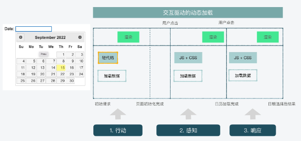
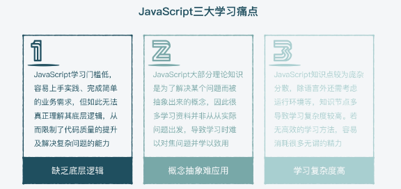
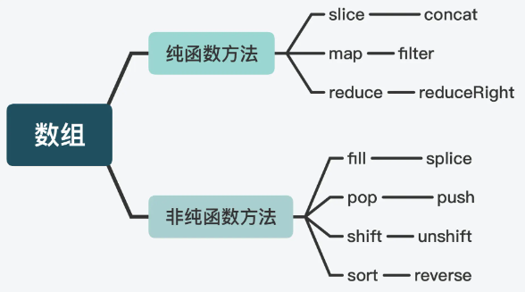

# JS进阶

## 前置知识

非专栏文章内容。

函数式编程中的基本概念。

- 函数式编程（Functional programming）与面向对象编程（Object-oriented programming）和过程式编程（Procedural programming）三种**编程范式**。
- 最主要的特征是，函数是[第一等公民](https://llh911001.gitbooks.io/mostly-adequate-guide-chinese/content/ch2.html)。
- 强调将计算过程分解成可复用的函数，典型例子就是`map`方法和`reduce`方法组合而成 [MapReduce 算法](https://zh.wikipedia.org/wiki/MapReduce)。
- 只有[纯的](https://zh.wikipedia.org/wiki/纯函数)、没有[副作用](https://zh.wikipedia.org/wiki/函数副作用)的函数，才是合格的函数。


### 范畴论

**概念**

函数式编程起源于范畴论，范畴论认为世界上的所有的**概念体系**都可以抽象归属成一个个的"范畴"（category）。

范畴：范畴就是使用箭头连接的物体。（In mathematics, a category is an algebraic structure that comprises "objects" that are linked by "arrows". ）。

范畴是指把事物作归类整理所依据的**共同性质**，就是说：范畴是事物种类的本质。因为一个种类的本质往往由多个性质所构成，而本质与构成它的各个性质之间又总是以一定的结构方式互相联系着的，也就是说，彼此之间存在某种关系的概念、事物、对象等等，都构成"范畴"。随便什么东西，只要能找出它们之间的关系，就能定义一个"范畴"。


上图中，各个点与它们之间的箭头，就构成一个范畴。

**箭头**表示**范畴成员**之间的关系，正式的名称叫做"态射"（morphism）。**范畴论认为，同一个范畴的所有成员，就是不同状态的"变形"（transformation）。通过"态射"，一个成员可以变形成另一个成员。**


**数学模型**

既然"范畴"是满足某种变形关系的所有对象，就可以总结出它的数学模型。

- 所有成员是一个集合
- 变形关系是函数

也就是说，范畴论是集合论更上层的抽象，简单的理解就是"集合 + 函数"。

理论上通过函数，就可以从范畴的一个成员，算出其他所有成员。


**范畴与容器**

可以把"范畴"想象成是一个容器，里面包含两样东西。

- 值（value）
- 值的变形关系，也就是函数。

下面使用代码，定义一个简单的范畴。

```JS
class Category {
  constructor(val) { 
    this.val = val; 
  }

  addOne(x) {
    return x + 1;
  }
}
```

上面代码中，`Category`是一个类，也是一个容器，里面包含一个值（`this.val`）和一种变形关系（`addOne`）。这里的范畴，就是所有彼此之间相差`1`的数字。

注意，本文后面的部分，凡是提到"容器"的地方，全部都是指"范畴"。


**范畴论与函数式编程的关系**

范畴论使用函数表达范畴成员之间的关系。

伴随着范畴论的发展，就发展出一整套函数的运算方法。这套方法起初只用于数学运算，后来有人将它在计算机上实现了，就变成了今天的"函数式编程"。**本质上，函数式编程只是范畴论的运算方法，跟数理逻辑、微积分、行列式是同一类东西，都是数学方法，只是碰巧它能用来写程序。**

所以，为什么函数式编程要求函数必须是纯的，不能有副作用？因为它是一种数学运算，原始目的就是求值，不做其他事情，否则就无法满足函数运算法则了。

总之，在函数式编程中，函数就是一个管道（pipe）。这头进去一个值，那头就会出来一个新的值，没有其他作用。


### 函数的合成和柯里化

函数式编程有两个最基本的运算：**合成和柯里化**。

**合成**

如果一个值要经过多个函数，才能变成另外一个值，就可以把所有中间步骤合并成一个函数，这叫做"函数的合成"（compose）。


上图中，`X`和`Y`之间的变形关系是函数`f`，`Y`和`Z`之间的变形关系是函数`g`，那么`X`和`Z`之间的关系，就是`g`和`f`的合成函数`g·f`。

上图的代码实现

```js
const compose = function (f, g) {
  return function (x) {
    return f(g(x));
  };
}
```

函数的合成还必须满足结合律。


```js
compose(f, compose(g, h))
// 等同于
compose(compose(f, g), h)
// 等同于
compose(f, g, h)
```

合成也是函数必须是纯的一个原因。因为一个不纯的函数，怎么跟其他函数合成？怎么保证各种合成以后，它会达到预期的行为？

前面说过，函数就像数据的管道（pipe）。那么，函数合成就是将这些管道连了起来，让数据一口气从多个管道中穿过。


**柯里化**

`f(x)`和`g(x)`合成为`f(g(x))`，有一个隐藏的前提，就是`f`和`g`都只能接受一个参数。如果可以接受多个参数，比如`f(x, y)`和`g(a, b, c)`，函数合成就非常麻烦。

这时就需要函数柯里化了。所谓"柯里化"，就是把一个多参数的函数，转化为单参数函数。

```js
// 柯里化之前
function add(x, y) {
  return x + y;
}

add(1, 2) // 3

// 柯里化之后
function addX(y) {
  return function (x) {
    return x + y;
  };
}

addX(2)(1) // 3
```


### 函子

函数不仅可以用于同一个范畴之中值（成员）的转换，还可以用于将一个范畴转成另一个范畴。这就涉及到了函子（Functor）。

**概念**

函子是函数式编程里面最重要的数据类型，也是基本的运算单位和功能单位。

它首先是一种范畴，也就是说，是一个容器，包含了值和变形关系。**比较特殊的是，它的变形关系可以依次作用于每一个值，将当前容器变形成另一个容器。**


上图中，左侧的圆圈就是一个函子，表示人名的范畴。外部传入函数`f`，会转成右边表示早餐的范畴。

下面是一张更一般的图。


上图中，函数`f`完成值的转换（`a`到`b`），将它传入函子，就可以实现范畴的转换（`Fa`到`Fb`）。


**代码实现**

任何具有`map`方法的数据结构，都可以当作函子的实现。

```js
class Functor {
  constructor(val) { 
    this.val = val; 
  }

  map(f) {
    return new Functor(f(this.val));
  }
}
```

上面代码中，`Functor`是一个函子，它的`map`方法接受函数`f`作为参数，然后返回一个新的函子，里面包含的值是被`f`处理过的（`f(this.val)`）。

**一般约定，函子的标志就是容器具有`map`方法。该方法将容器里面的每一个值，映射到另一个容器。**

用法示例：

```js
(new Functor(2)).map(function (two) {
  return two + 2;
});
// Functor(4)

(new Functor('flamethrowers')).map(function(s) {
  return s.toUpperCase();
});
// Functor('FLAMETHROWERS')

(new Functor('bombs')).map(_.concat(' away')).map(_.prop('length'));
// Functor(10)
```

上面的例子说明，函数式编程里面的运算，都是通过函子完成，即运算不直接针对值，而是针对这个值的容器----函子。函子本身具有对外接口（`map`方法），各种函数就是运算符，通过接口接入容器，引发容器里面的值的变形。

因此，**学习函数式编程，实际上就是学习函子的各种运算。**由于可以把运算方法封装在函子里面，所以又衍生出各种不同类型的函子，有多少种运算，就有多少种函子。函数式编程就变成了运用不同的函子，解决实际问题。


#### of 方法

上面生成新的函子的时候，用了`new`命令。这实在太不像函数式编程了，因为`new`命令是面向对象编程的标志。

**函数式编程一般约定，函子有一个`of`方法，用来生成新的容器。**

下面就用`of`方法替换掉`new`。

```js
Functor.of = function(val) {
  return new Functor(val);
};
```

然后，前面的例子就可以改成下面这样。

```js
Functor.of(2).map(function (two) {
  return two + 2;
});
// Functor(4)
```


#### Maybe 函子

函子接受各种函数，处理容器内部的值。这里就有一个问题，容器内部的值可能是一个空值（比如`null`），而外部函数未必有处理空值的机制，如果传入空值，很可能就会出错。

```js
Functor.of(null).map(function (s) {
  return s.toUpperCase();
});
// TypeError
```

上面代码中，函子里面的值是`null`，结果小写变成大写的时候就出错了。

Maybe 函子就是为了解决这一类问题而设计的。简单说，它的`map`方法里面设置了空值检查。

```javascript
class Maybe extends Functor {
  map(f) {
    return this.val ? Maybe.of(f(this.val)) : Maybe.of(null);
  }
}


Maybe.of(null).map(function (s) {
  return s.toUpperCase();
});
// Maybe(null)
```


#### Either 函子

条件运算`if...else`是最常见的运算之一，函数式编程里面，使用 Either 函子表达。

Either 函子内部有两个值：左值（`Left`）和右值（`Right`）。右值是正常情况下使用的值，左值是右值不存在时使用的默认值。

```javascript
class Either extends Functor {
  constructor(left, right) {
    this.left = left;
    this.right = right;
  }

  map(f) {
    return this.right ? 
      Either.of(this.left, f(this.right)) :
      Either.of(f(this.left), this.right);
  }
}

Either.of = function (left, right) {
  return new Either(left, right);
};


var addOne = function (x) {
  return x + 1;
};

Either.of(5, 6).map(addOne);
// Either(5, 7);

Either.of(1, null).map(addOne);
// Either(2, null);
```

上面代码中，如果右值有值，就使用右值，否则使用左值。通过这种方式，Either 函子表达了条件运算。

Either 函子的常见用途是提供默认值。下面是一个例子。

```js
Either
  .of({address: 'xxx'}, currentUser.address)
  .map(updateField);
```

上面代码中，如果用户没有提供地址，Either 函子就会使用左值的默认地址。

Either 函子的另一个用途是代替`try...catch`，使用左值表示错误。

```js
function parseJSON(json) {
  try {
    return Either.of(null, JSON.parse(json));
  } catch (e: Error) {
    return Either.of(e, null);
  }
}
```

上面代码中，左值为空，就表示没有出错，否则左值会包含一个错误对象`e`。一般来说，所有可能出错的运算，都可以返回一个 Either 函子。


#### ap 函子

函子里面包含的值，完全可能是函数。我们可以想象这样一种情况，一个函子的值是数值，另一个函子的值是函数。

```javascript
function addTwo(x) {
  return x + 2;
}

const A = Functor.of(2);
const B = Functor.of(addTwo)
```

上面代码中，函子`A`内部的值是`2`，函子`B`内部的值是函数`addTwo`。有时，想让函子`B`内部的函数，可以使用函子`A`内部的值进行运算。这时就需要用到 ap 函子。ap 是 applicative（应用）的缩写。凡是部署了`ap`方法的函子，就是 ap 函子。

```javascript
class Functor {
  constructor(val) { 
    this.val = val; 
  }
  
  of(val){
    return new Functor(val)
  }

  map(f) {
    return new Functor(f(this.val));
  }
}

class Ap extends Functor {
  ap(F) {  // F是另一个函子
    return Ap.of(this.val(F.val));
  }
}

Ap.of(addTwo).ap(Functor.of(2))
// Ap(4)
```

ap 函子的意义在于，对于那些多参数的函数，就可以从多个容器之中取值，实现函子的链式操作。

```javascript
function add(x) {
  return function (y) {
    return x + y;
  };
}

Ap.of(add).ap(Maybe.of(2)).ap(Maybe.of(3));
// Ap(5)
```

上面代码中，函数`add`是柯里化以后的形式，一共需要两个参数。通过 ap 函子，我们就可以实现从两个容器之中取值。它还有另外一种写法。

```js
Ap.of(add(2)).ap(Maybe.of(3));
```


#### Monad 函子

函子是一个容器，可以包含任何值。函子之中再包含一个函子，也是完全合法的。但是，这样就会出现多层嵌套的函子。

```js
Maybe.of(
  Maybe.of(
    Maybe.of({name: 'Mulburry', number: 8402})
  )
)
```


上面这个函子，一共有三个`Maybe`嵌套。如果要取出内部的值，就要连续取三次`this.val`。这当然很不方便，因此就出现了 Monad 函子。

**Monad 函子的作用是，总是返回一个单层的函子。**它有一个`flatMap`方法，与`map`方法作用相同，唯一的区别是如果生成了一个嵌套函子，它会取出后者内部的值，保证返回的永远是一个单层的容器，不会出现嵌套的情况。

```js

class Monad extends Functor {
  join() {
    return this.val;
  }
  flatMap(f) {
    return this.map(f).join();
  }
}
```

上面代码中，如果函数`f`返回的是一个函子，那么`this.map(f)`就会生成一个嵌套的函子。所以，`join`方法保证了`flatMap`方法总是返回一个单层的函子。这意味着嵌套的函子会被铺平（flatten）。


#### IO 操作

Monad 函子的重要应用，就是实现 I/O （输入输出）操作。

I/O 是不纯的操作，普通的函数式编程没法做，这时就需要把 IO 操作写成`Monad`函子，通过它来完成。

```javascript
var fs = require('fs');

var readFile = function(filename) {
  return new IO(function() {
    return fs.readFileSync(filename, 'utf-8');
  });
};

var print = function(x) {
  return new IO(function() {
    console.log(x);
    return x;
  });
}
```

上面代码中，读取文件和打印本身都是不纯的操作，但是`readFile`和`print`却是纯函数，因为它们总是返回 IO 函子。

如果 IO 函子是一个`Monad`，具有`flatMap`方法，那么我们就可以像下面这样调用这两个函数。

```javascript
readFile('./user.txt')
.flatMap(print)
```

这就是神奇的地方，上面的代码完成了不纯的操作，但是因为`flatMap`返回的还是一个 IO 函子，所以这个表达式是纯的。我们通过一个纯的表达式，完成带有副作用的操作，这就是 Monad 的作用。

由于返回还是 IO 函子，所以可以实现链式操作。因此，在大多数库里面，`flatMap`方法被改名成`chain`。

```javascript
var tail = function(x) {
  return new IO(function() {
    return x[x.length - 1];
  });
}

readFile('./user.txt')
.flatMap(tail)
.flatMap(print)

// 等同于
readFile('./user.txt')
.chain(tail)
.chain(print)
```

上面代码读取了文件`user.txt`，然后选取最后一行输出。


# 专栏部分

早期网站是静态信息展示功能，JavaScript就实现一些简单的脚本，没什么交互。后面基于AJAX可以开发动态交互的页面。直到今天js的底层变化并不大（即使可以使用js开发大型复杂引用）。当时的 JavaScript 本身并没有太大变化，仍然无法像 Java 或 C++ 一样，拥有强大的标准库，因此开发者们需要自己想办法去解决很多问题，比如当时最大的问题，就是要解决系统兼容性，这也导致当年涌现了很多第三方库。

**随着应用使用者的大规模增加，很多问题产生的副作用也会呈现指数级上升**，性能、安全等非功能性的问题也会不断显露。

一个大型订票应用的开发，由于业务流程复杂、业务需求多变、高并发。因此一个很小的副作用就会造成大量订单问题，这时就要用到纯函数思想中的幂等，来保证任意多次执行结果与一次执行结果相同，避免订单的重复提交。

在大量访问的情况下，一个很小的资源加载对资源的消耗就是指数级的，**能够实现对资源的有效控制，对业务来说是十分关键的一点**。比如说，如果通过函数式 + 响应式编程，就可以通过用户的实时需求动态加载资源，从而能够节省不必要的资源预加载成本。


和十几年前相比较，JavaScript 加入了很多功能和语法糖，但是它的核心原理并没有太大变化。

在前端开发中，应用面对的是 UI 客户端，所以应用背后的程序，就需要处理大量的用户和网络触发的事件，并根据事件的状态来做出响应。


学习建议：

1. **基于语言的特点来学习**编程模式、数据结构和算法，能更好地理解这些知识的应用。例如：脱离了实际的语言和它解决的问题来解释编程模式，可能会比较抽象。

   函数式和响应式编程是因为实际应用的场景需求，在前端开发中，应用是 UI 客户端，所以应用背后的程序，就需要处理大量的用户和网络触发的事件，并根据事件的状态来做出响应，而函数编程能很好的适应这点。

   在前端，基本都是根据用户的行为或者网络触发事件来进行响应，响应具体做些什么工作，要通过工具来处理，比如事件处理、状态管理。函数就是这个工具，它的核心就是 IO 输入输出。给函数一个输入值（数据结构），它进行处理（算法），然后给我们一个输出值（返回值）。

   Monad 的核心，就是围绕一个“**值**”来组织各种方法。所以无论是 JavaScript 本身带的 array.map，还是常用的 React.js 里面的 observer、reducer。

2. 在学习 JavaScript 的引擎、浏览器和编译原理的过程中，来理解各种数据结构和算法，这样更能理解这门语言的运行机制和原理，起到和专门讲算法的课程相辅相成的作用。

3. **学习每一节课尽量一鼓作气，有些概念即使模糊，硬着头皮看下去也比停顿去深入了解某个点强。**实在遇到困难的地方，你可以简单查下资料，但只要查到刚刚能让你继续往下读的内容即可，千万不要偏离了每节课的主题。


结合 JS 语言对函数式编程的支持，以及它相关领域的前端应用来。在前端开发中，人机交互复杂。比如加载了一个界面后，根本不知道用户会做出什么反应，或者点击哪个按钮。这第一步就是先把初始页面加载下来，**行动**。

当用户点击了一个按钮，比如一个日历的时候，就进行到了第二步，即**感知**到用户想要选择一个日期。所以，就可以给这个按钮加上事件处理器（event handler），完成相关的日历组件或模块加载，通过之前“记住”的用户需求，展示加载后的日历，这也就是第三步，**响应**。



- 类似异步懒加载的逻辑流程
- 在这个过程当中，要通过工具来处理很多事，比如事件处理、状态管理。**函数就是这个工具**，它的核心就是 IO 输入输出。给函数一个输入值（数据结构），它进行处理（算法），然后给一个输出值（返回值）。

**使用函数式编程的时候，考虑的是“生产力”，使用面向对象的时候，考虑的更多是“生产关系”。**

JavaScript 中的继承，是基于原型链的继承，更偏向 delegation（委托） 而不是 inheritance（继承）。即使在面向对象设计本身，也是追求多用组合少用继承。所以用JS面向对象编程时，有自己的一些特点来组织生产关系。

通过学习 JavaScript 的引擎、浏览器和编译原理的过程中，来理解数据结构和算法，这样更能理解这门语言的运行机制和原理，起到和专门讲算法的课程相辅相成的作用。


学习JS的模式的痛点：

1. 如果已经学过传统的面向对象语言，那么在学 JavaScript 的时候，很可能**对函数式的理解和运用不够深入**；
2. 如果一开始就学习 JavaScript，只停留在开发一些简单应用上，可以说**对它的面向对象的理解和运用不会很深入**。

注意点：




课程模块：

1. 学习函数式和面向对象编程（编程范式）及其中的核心概念，结合JS特性，在合适的时候选择合适的编程范式解决实际问题
2. 学习JavaScript 的底层逻辑和底层所用到的数据结构与算法，JS 引擎及浏览器在编译和运行时的一些特点
3. JS的设计模式
4. 学习 JavaScript 中的常用工具及其背后的使用原理、使用场景
5. 前端的趋势


## 函数式编程

从编程范式的角度看 JavaScript是**结构化的、事件驱动的动态语言，且支持声明式和命令式两种模式**。所以JS是一种可以采用不同模式开发应用的语言，而一些语言可能有它的侧重模式，比如JAVA侧重于使用面向的模式编程等。


JS最常用面向对象编程（OOP object oriented programming）和函数式编程（FP functional programming）范式来开发应用。

对于只掌握了一门语言的人来说，可能的情况是：

- 已经学过传统的面向对象语言，很可能对函数式的理解和运用不够深入；
- 如果一开始就学习 JavaScript，只是停留在开发一些简单应用上，可能对它的面向对象的理解和运用不会很深入。

**在函数式编程中，通常会把各种干扰叫做副作用（Side effect）。**

研究在动态情况下如何做到系统控制，其中很重要的一点就是**处理波动和干扰**。而在函数式编程中，我们通常会把各种干扰，就叫做**副作用（Side effect）**。

了解 JavaScript 语言的核心思想，然后**因地制宜**地使用这两种编程模式来解决问题。


函数式编程，了解下函数是什么、它是做什么用的、在编程中可能会有哪些副作用，以及如何利用 JavaScript 的核心设计思想和工具，解决这些副作用。

### 函数、如何使用

一个函数由输入、函数和输出组成，和数学上的函数一个概念，**函数是数据集到目标的一种关系**，它所做的就是把行为封装起来，从而达到目标。

函数的输入值可以是一个基础类型数据（primitive type），对象类型数据（object type），函数。函数是输入或输出值，把这种函数就叫做**高阶函数（higher order functions）**。


### 函数中的副作用

函数里相对就是可控的，而比较不可控的是**外部环境**。常见的副作用：

1. 函数中最常见的副作用，就是**全局变量（global variable）**。下面例子中，没法保证这些函数没有改变这个变量的值，也没法保证每次输出的结果是 1。所以从输入开始，这种不确定性就存在了。

   ```js
   var x = 1;
   foo();
   console.log( x );
   bar();
   console.log( x );
   baz();
   console.log( x );
   ```

2. IO 影响（IO effects），这里的 IO 说的不是函数里的参数和返回值，而是类似前端浏览器中的用户行为，比如鼠标和键盘的输入，或者如果是服务器端的 Node，就是文件系统、网络连接以及 stream 的 stdin（标准输入）和 stdout（标准输出）。

3. 网络请求（HTTP request），比如要针对一个用户下单的动作发起一个网络请求，需要先获得用户 ID，再连着用户的 ID 一起发送。如果还没获取到用户 ID，就发起下单请求，可能就会收到报错。


**下面是减少副作用的方法**

### 纯函数

在函数式编程中，有两个核心概念：纯函数（pure function）和不可变（immutability）。

纯函数：**一个函数的返回结果的变化只依赖其参数，并且执行过程中没有副作用，只要传入的参数一样，那每次执行的结果一定都一样。**纯函数就可以通过减少对外界变量的使用，来减少副作用。（对内）

```js
var rate = 0.05;   // 放在函数外作为变量时，函数就不是一个纯函数了，因为随着这个变量的变化，计算结果会有所不同。
function calculateGST( productPrice ) {
  return productPrice * rate;
}
calculateGST(100); // return 5


function calculateGST( productPrice ) {  // 纯函数
    return productPrice * 0.05;
}
calculateGST(100); // return 5
```

非纯函数：指函数体中的代码依赖了函数体外的变量或者值，或者函数体内部采用了可变的量，比如采用一个随机数。

在计算机中，幂等的意思是一个程序执行多次结果是一样的。


### 不可变

不可变：在减少程序被外部变量影响的同时，也减少对外界的影响。如果把一个外部变量作为参数作为输入，在函数里做了改变，作为输出返回。那么这个过程中，可能不知道这种变化会对整个系统造成什么样的结果。 **也就是函数不对外界传入的参数产生影响。**（对外）

```js
const beforeList = [1,2,3,4]
console.log(beforeList.splice(0,2))
console.log(beforeList.splice(0,2))
//[ 1, 2 ]
//[ 3, 4 ]

const beforeList = [1,2,3,4]
console.log(beforeList.slice(0,2))
console.log(beforeList.slice(0,2))
//[ 1, 2 ]
//[ 1, 2 ]
```



可变：就是指对于外部传入的实参，直接进行修改，这样是存在隐患的，因为不确定外部是否会基于原来的那个变量的值进行其他后续操作。


**对于函数体要使用的数据，可以通过闭包或者对象冻结的方式进行隐藏或者限制操作**


如何利用 JavaScript 的核心设计思想和工具解决这些副作用？

函数式编程最核心的地方，就是输入输出和中间的算法，要解决的核心问题就是副作用（effect）。而为了解决副作用，需要掌握两个重要的概念，一个是纯函数，一个是不可变。**纯函数强调的是自身的稳定性，对结果只影响一次；而不可变强调的是和外界的交互中，尽量减少相互间负面的影响。**


**纯函数就是在减少程序被外界影响，不可变就是减少对外界的影响。**


## 面向对象编程

在做业务系统开发的时候，会面对各种各样的业务对象，比如“表单”“购物车”“订单”，这些都可以看做是对象。而工具和方法通常是服务于对象的。

**如果说在使用函数式编程的时候，考虑的是“生产力”，那在使用面向对象的时候，考虑的更多是“生产关系”。**如果说函数加对象组成了生产力，那么封装、重用和继承则可以用来组成生产关系。


**重用**就是把可以重复使用的功能抽象到一个类里，每次只是创建一个它的实例对象来使用。

可以把通用功能放到抽象类；而一些特定的行为或属性，可以通过继承放到实现类中，这样在继承了基础的父类（parent class）功能的基础上（extend），能够在子类（child class）中作一些改动。但是如果一个程序中，父子的层级过于复杂，如果父类有了问题，就会牵一发动全身，而且抽象的层级过多，也会让代码难以理解。

在面向对象中，也有**组合**的概念，就是一个子类不是继承的某个父类，而是通过组合多个类，来形成一个类，而不是强调依靠某种从属关系。所以，在面向对象的编程中，也有“组合”优于“继承”的概念。不过在实际情况下，继承也不是完全不可取的，在开发中，使用哪种思想还是要根据情况具体分析。


### 基于原型的继承

JavaScript 中的类和其它面向对象的语言，有什么不同？

对于传统的面向对象的编程语言来说，比如 Java，一个对象是基于一个类来创建的。但是在 JavaScript 中，就没有这种类和对象的拷贝从属关系。实际上，JS 里的对象和类，是构建函数之间原型链接链接的关系。

在下图左边基于类的例子中，以一个类作为蓝图，可以创建两个实例。而右边基于原型的例子里，可以看到通过一个构建函数构建出的两个对象，是通过原型链和构建函数的原型相连接的，它们并不是基于一个蓝图的复制拷贝和从属关系。


```js
function Widget(widgetName) {
    this.widgetName= widgetName;
}
 
Widget.prototype.identify = function() {
    return "这是" + this.widgetName;
};
 
function Notice(widgetName) {
    Widget.call(this, widgetName);
}
 
Notice.prototype = Object.create(Widget.prototype);
 
Notice.prototype.display= function() {
    console.log("你好， " + this.identify() + ".");
};
 
var notice1 = new Notice("应用A");
var notice2 = new Notice("应用B");

Object.getPrototypeOf(notice1) === Notice.prototype //true
Object.getPrototypeOf(notice2) === Notice.prototype //true

notice1.display(); // "你好，这是应用A"
notice2.display(); // "你好，这是应用B"
```

在传统的面向对象语言，比如 Java 里，当用到继承时，一个类的属性和功能是可以被基于这个类创建的对象“拷贝”过去的。但是在 JavaScript 里，虽然用 Notice 创建了 notice1 和 notice2，但是它俩并没有将其属性和功能拷贝过来，而是默认通过原型链来寻找原型中的功能，然后利用“链接”而不是“拷贝”来。


**面向对象编程最核心的点就是服务业务对象，最需要解决的问题就是封装、重用和继承。**在 JavaScript 中，面向对象的特殊性是基于原型链的继承，这种继承更像是“授权”，而不是传统意义的“父子”继承。而且为了解决继承的层级过多的情况，在面向对象中，也有组合优于继承的思想。


函数式编程和面向对象编程，它们一个是管理和解决副作用，一个是服务于业务对象。

JavaScript 中的常量（const，constant）算不算不可变呢？

> 分清楚是值不可变，还是变量的不可变。比如我们给num赋值数组，值还是可变。  
>
> const num = [3];  
>
> num[0] = 5; // 返回：5 
>
> 反之，没法拷贝原数组，slice后再赋值给原来的变量 
>
> const sliceNums = [1,2,3,4,5]; 
>
> sliceNums = sliceNums.slice(0,2); // 返回错误 
>
> 所以const还是蛮多坑的，在Java中用的就是final，而不是const。 
>
> 也是因为这些坑，在JS中，通常const更多用于原始类型的值，比如数理常量、字节顺序或版本号： 
>
> const H0 = 74;               // 哈勃常数 (km/s/Mpc) 
>
> const PI = 3.141592;       // 圆周率 
>
> const C = 299792.458;   // 光速 (km/s)


## 用闭包、对象管理数据

在不可变的原则下，管理项目中的数据以及他的变化？在状态更新的同时做到不可变。

在 JavaScript 中，值一般被分为两种：**基本数据类型和引用数据类型**。

原始数据类型本身是不可变的。例如 2 = 2.5 得到的结果会是 invalid，这就证明了不可能改变一个原始类型的值。


对象数据类型，这类数据像是一种**数据结构或容器**。那这样的值是可变的。

目的：**在使用对象类型的值来存储数据的时候，要如何在更新数据的同时做到不可变。**

当应用有状态数据时，就需要围绕这个状态数据编写一系列函数或者方法。在这个过程中，需要考虑的就是一个值的结构性不可变的问题。


围绕值的一些列操作，都有哪些数据类型可以选择。——闭包和对象

### 围绕值的不同组织结构

**围绕值的结构性操作的数据类型**

闭包（closure）和对象（object），这二者都可以对一个状态值进行封装（创建）和编写行为（组织操作状态值的方法或者函数）。

**有一个说法是：闭包是带数据的行为，对象是带行为的数据。**

#### 闭包

闭包最大的特点是**可以突破生命周期和作用域的限制**，也就是时间和空间的控制。

```js
function counter() {
    let name = "计数";
    let curVal = 0;
    function counting() {
        curVal++;
    }
    function getCount() {
        console.log(
            `${name}是${curVal}`
        );
    }
    return {counting,getCount}
}

var counter1 = counter();

counter1.counting();  
counter1.counting();  
counter1.counting();  
counter1.getCount();  // 计数是3
```


#### 对象

```js
var counter = {
    name: "计数",
    curVal: 0,
    counting() {
        this.curVal++;
        console.log(
            `${this.name}是${this.curVal}`
        );
    }
};

counter.counting(); // 计数是1
counter.counting(); // 计数是2
counter.counting(); // 计数是3
```


单纯从值的管理和围绕值的一系列行为的角度来看，可以说闭包和对象能达到类似的效果。上面**闭包中的状态数据**对应**对象中的属性**，在**闭包中创建的针对值的行为**对应**在对象中的方法**。


### 闭包和对象的不同

它们在隐藏性、状态拷贝（state cloning）和性能（performance）上有差别，而这些差别在结构性地处理值的问题上，具有不同的优劣势。


#### 隐私

在闭包中，除非是通过接口，也就是在函数中返回的内部函数，不然内部的值是对外不可见的。所以它可以更精确的（细粒度的）地控制想要暴露或隐藏的属性，以及相关的操作。


在对象中，不需要特殊的方式，就可以获取对象中的属性和重新赋值。如果想要遵循不可变的原则，有一个 Object.freeze() 的方法，可以把所有的对象设置成只读 writable: false。通过 freeze 会让对象所有的属性变得只读，而且不可逆。


#### 拷贝

当拿到的数据是对象类型的数据时，如何遵循不可变原则？

方法是：不对原始的对象和数组值做改变，而是拷贝之后，在拷贝的版本上做变更。

```js
// 数组浅拷贝
var a = [ 1, 2 ];
var b = [ ...a ];
b.push( 3 );
a;  // [1,2]
b;  // [1,2,3]

// 对象浅拷贝
var o = {
    x: 1,
    y: 2
};
var p = { ...o };
p.y = 3; 
o.y;  // 2
p.y;  // 3
```

数组和对象都是很容易拷贝的，而闭包则相对更难拷贝。

对对象的状态进行拷贝后，是可以做到不可变，不过随之而来的就是**性能问题**。

#### 拷贝性能

如果这个值只改变一两次，那就没问题。但假设系统中有值不停在改变，如果每次都拷贝的话，就会占据大量内存。这样一来，应该如何处理？

**实际上，在这种情况下，有一个解决方案就是用到一个类似链表的结构，当中有一组对象记录改变的指数和相关的值。**

比如下面的 [3, 1, 0, 7] 这组数组中，我们把第 0 个值变成 2，第 3 个值变成 6，第 4 个值添加 1，形成了 [2, 1, 0, 6, 1]。那么如果我们只记录变化的话，就是 0:2、3:6 和 4:1 这三组对象，减少了很多内存占用。


在社区已经有很多成熟的三方库比如 immutable.js，它们会有自己的数据结构，比如 array list 和 object map，以及相关算法来解决类似的问题。


#### 性能

从性能的角度来讲，对象的内存和运算通常要优于闭包。比如，在下面第一个闭包的例子中，每次使用都会创建一个新的函数表达。

```js
// 闭包
function PrintMessageA(name) {
    return function printName(){
        return `${name}, 你好！`;
    };
}

var greetings1 = PrintMessageA( "先生" );
greetings1();  // 先生，你好！
```


第二个对象的例子中，通过 bind 将 this 绑定到 greetings2 上，这样一来，PrintMessageB 就会引用 greetings2.name 来作为 this.name，从而达到和闭包一样的效果。但不需要创建一个闭包，只需要将 this 指向引用的对象即可。

```js
// 对象
function PrintMessageB(){
   return `${this.name}, 你好！`;
}
var greetings2 = PrintMessageB.bind( {
    name: "先生"
} );
greetings2();  // 先生，你好！
```


**重点关注的是对象和闭包在处理不可变问题上的不同优势。**

- 在属性和方法的隐藏方面，闭包天然对属性有保护作用，同时它也可以按需暴露接口，来更精确地获取或重新给状态赋值。
- 对象可以轻松做到 props 整体不可变，而且在需要 state 变化时，在拷贝上也更有优势。不过从性能的角度来看，如果拷贝的量不大，也许它们的性能差不多，但如果是一个高频交互的界面，微小的差别可能就会被放大。

在 React.js 中，它选择使用对象作为 props 和 state 的值类型，能更容易保证属性和状态值的整体不可变；而且面对状态的变化，它也更容易拷贝；在处理高频交互时，它的性能也会更好。而闭包虽然有隐私上的优势和更细粒度的操作，可是在应用交互和状态管理这个场景下，它并没有什么实际的作用。

如果要实现值的绝对不可变应该使用深拷贝，这样对拷贝出来的复杂数据结构进行修改时才能保证不会对原始数据造成影响。


## 函数具象化

通过部分应用和柯里化使得函数更加具体。在输入、计算和输出中，最难控制的是输入。因为它来自外界，而计算是在相对封闭的环境中，至于输出只是一个结果。

**现在则要对输入进行控制。**

在编写一个函数时，需要传入多个实参，其中一部分实参是先明确的，另一部分是后明确的，该如何处理？即通过**部分应用（partial application）和柯里化（currying）这类工具函数实现**。函数式编程中，**突破在调用点（call-site）传参的限制**，做到部分传参和后续执行。

**函数式编程重在声明式和可读性，而且强调每个函数尽量解决一个单一问题。**


### 部分应用

例子：假设orderEventHandler函数需要3个参数才能正常执行，现在已经知道一个参数值，另两个未知。现在希望orderEventHandler函数能被正常执行。

```js
function orderEventHandler(url,data,callback) {
    // ..
}
```

可以基于orderEventHandler函数衍生出另一个函数fetchOrder，提前预置了已知参数 url，减少了后面需要传入的参数数量，同时也增加了代码的可读性（函数变得更加具体）。 

```js
function fetchOrder(data,cb) {
    orderEventHandler( "http://some.api/order", data, cb );
}
```

但是，这种方式并不灵活，如果还有一个函数，该函数接受两个参数，现在知道了其中一个参数值，为此不得不再编写一个类似fetchOrder函数的另一个函数，且这个函数值接受一个参数，且内部调用那个接受两参数的函数，例如：

```js
function getCurrentOrder(cb) {
    fetchOrder( { order: 12343504 }, cb );
}
```

为了提高灵活性，在函数时编程中通常会使用**部分应用**。提供一个抽象的 partial 工具函数，**在先预制部分参数的情况下，后续再传入剩余的参数值。**如以下代码所示：

```js
var fetchOrder = partial( orderEventHandler, "http://some.api/order" );
var getCurrentOrder = partial( fetchOrder, { order: 12343504 } );
```


 **partial 工具函数的实现**

借助闭包和展开运算符（...）

- 闭包：保存参数功能
- 展开运算符：处理预置的和后置的实参

```js
function partial(fn,...args1){
  return function (...args2){
    return fn(...args1,...args2)
  }
}
```


也可以借助bind函数来实现类似于partial函数的作用：

bind 通常是在面向对象中用来绑定 this 的，用作模拟partial函数时，不绑定 this，所以第一个参数会设置为 null。

```js
var fetchOrder = httpEvntHandler.bind( null, "http://some.api/order" );
```


### 柯里化

柯里化的结果就是每次只传一个参数。

```js
var curriedOrderEvntHandler = curry( orderEventHandler );

var fetchOrder = curriedHttpEvntHandler( "http://some.api/order" );

var getCurrentOrder = fetchOrder( { order: CURRENT_ORDER_ID } );

getCurrentOrder( function editOrder(order){ /* .. */ } );
```


**实现一个curry工具函数**

```js
function curry(fn,arity = fn.length){
  let argsArrs = []
  return function curried(...args){
    argsArrs.push(args)
    if(argsArrs.length>=arity){
      return fn(argsArrs)
    }else{
      return curried
    }
  }
}
```


扩展知识：

> **Function.length**
>
> **`length`** 属性指明函数的形参个数。
>
> `length` 是函数对象的一个属性值，指该函数期望传入的参数数量，即形参的个数。
>
> **形参的数量不包括剩余参数个数，仅包括第一个具有默认值之前的参数个数。**
>
> 与之对比的是，[`arguments.length`](https://developer.mozilla.org/zh-CN/docs/Web/JavaScript/Reference/Functions/arguments/length) 是函数被调用时实际传参的个数。
>
> ```js
> function func1(a,...args) {}
> 
> function func2(a, b) {}
> 
> function func1(a,b=2) {}
> 
> console.log(func1.length);
> // Expected output: 1
> 
> console.log(func2.length);
> // Expected output: 2
> 
> console.log(func3.length);
> // Expected output: 1
> ```


函数式编程处理未知的能力，这里的未知指的是编程时的未知，比如有些参数是提前知道的，而有一些是后面加入的。

一个普通的函数通常是在调用点执行时传入参数的，而通过部分应用和柯里化，做到了可以先传入部分已知参数，再在之后的某个时间传入部分参数，这样从时间和空间上，就将一个函数分开了。

这样的好处：**比如处理未知，让函数从抽象变具体、让具体的函数每次只专心做好一件事、减少参数数量，还有一个更抽象的好处，就是体现了函数式底层的声明式思想。**


在函数式编程中，把参数的数量叫做 arity（元数）。

部分应用可以减少每次函数调用时需要传入的参数，而柯里化更是把函数调用时需要传入的参数数量，降到了 1。它们实际上都起到了**控制参数数量**的作用。

而在函数式编程中，其实还有很多可以帮助处理参数输入的工具。


### 其他参数处理工具函数

**unary、constant 和 identity**


#### unary

一元参数（unary）

作用：作用是把一个能接收多个参数的函数，变成一个只接收一个参数的函数。

实现：

```js
function unary(fn) {
    return function oneArg(arg){
        return fn( arg );
    };
}
```

使用案例：

当通过 parseInt，把一组数字字符串通过 map 来映射成整数数组，但是 parseInt 会接收两个参数，而如果直接输入 parseInt 的话，它的第二个参数会是索引，这肯定不是期待的结果。所以这时候，unary 可以让 parseInt 只接收一个参数，

```js
["1","2","3","4","5"].map( unary( parseInt ) ); // [1,2,3,4,5]
```

除了一元，还有二元binary，三元 tenary。


#### constant

改造**参数**

对于 JavaScript promise 中的 then， **从函数签名的角度来看**，它只接收函数，而不接收其他值类型作为参数。比如下面例子中，34 这个值就是不能被接收的，但不会报错。

```js
promise1.then( action1 ).then( 34 ).then( action3 );
```

函数签名：**一般包含了参数及其类型返回值，还有类型可能引发或传回的异常，以及相关的方法在面向对象中的可用性信息（如关键字 public、static 或 prototype）**。

在 C 或 C++ 中，会有类似这样的签名，如下所示：

```c++
// C
int main (int arga, char *argb[]) {}

// C++
int main (int argc, char **argv) {/** ... **/ }
```

在JS中没有这些静态规则。那么遇到 then 这种情况怎么办？

在这种情况下，可以编写一个只返回值的 constant 函数，这样就解决了接收的问题。

```js
function constant(v) {
    return function value(){
        return v;
    };
}
```

然后，就可以把值包装在 constant 函数里，通过这样的方式，就可以把值作为函数参数传入了。

```js
promise1.then( action1 ).then( constant( 34 ) ).then( action3 );
```


#### identity

不做改造。

它既不改变函数，也不改变参数。它的功能就是输入一个值，返回一个同样的值。

```js
function identity(v) {
    return v;
}
```

作用：

- 作为断言（predicate）, 来过滤掉空值

比如在下面的例子中，它可以作为断言（predicate）， 来过滤掉空值。在函数式编程中，断言是一个可以用来做判断条件的函数，在这个例子里，identity 就作为判断一个值是否为空的断言。

```js
var words = "   hello world  ".split( /\s|\b/ );
words; // ['', '', '', 'hello', 'world', '', '']

words.filter( identity ); // ['hello', 'world']
```

- 做默认的转化工具（默认值）

比如以下例子中，创建了一个 transLogger 函数，可以传入一个数据和相关的 lower 功能函数，来将文字转化成小写。

```js
function transLogger (msg,formatFn = identity) {
    msg = formatFn( msg );
    console.log( msg );
}

function lower(txt) {
    return txt.toLowerCase();
}

transLogger( "Hello World" );            // Hello World
transLogger( "Hello World", lower );     // hello world
```


在面对不可控时，函数式编程很重要的一点就是**控制好输入**。可以尽量提高接口的适应性和适配性，增加过滤和转化的能力，以及增加代码的可读性。

还有更复杂一些的工具来解决参数问题。比如在讲部分应用和柯里化的时候，提到它在给我们带来一些灵活性的同时，也仍然会有一些限制，即**参数的顺序问题**，必须按照一个顺序来执行。而有些三方库提供的一些工具，就可以将参数倒排或重新排序。

重新排序的方式有很多，可以通过解构（destructure），从数组和对象参数中提取值，对变量进行赋值时重新排序；或通过延展操作符把一个对象中的一组值，“延展”成单独的参数来处理；又或者通过 .toString() 和正则表达式解析函数中的参数做处理。


反柯里化（uncurry）是函数式编程中的一个概念，它与柯里化（currying）相反。在JavaScript中，柯里化是指将一个多参数的函数转换为多个单参数函数的过程，每个单参数函数返回另一个接收下一个参数的函数，直到所有参数都被接收完毕。

而反柯里化则是**将一个柯里化的函数或者是一个期望接收多个参数的函数转换为一个接受单一参数数组的函数**。这样做的好处是，你可以一次性传递所有参数给函数，而不是逐步传递。

假设有一个柯里化的函数`add`：

```js
function add(x) {
  return function(y) {
    return x + y;
  }
}
```

那么它的反柯里化版本可能如下所示：

```js
function uncurryAdd(args) {
  return args.reduce((acc, curr) => add(acc)(curr));
}

// 使用展开运算符来直接应用参数数组
function uncurryAdd(...args) {
  return args.reduce((acc, curr) => add(acc)(curr));
}
```

对于非柯里化的函数，如果想要将其转化为只接受一个参数数组的形式，你可以这样做：

```js
function add(x, y) {
  return x + y;
}

function uncurry(func) {
  return function (args) {
    return func.apply(this, args);
  };
}

const uncurriedAdd = uncurry(add);
console.log(uncurriedAdd([1, 2])); // 输出: 3
```

反柯里化的用途通常是在需要适应不同的API设计时，比如某些库或框架期望函数以特定的方式接收参数。此外，当处理高阶函数时，可能会遇到需要调整参数接收方式的情况。

需要注意的是，上述`uncurryAdd`的例子假设了原始函数是一个严格意义上的柯里化函数，并且只适用于特定情况。在更一般的情况下，你应该使用类似`uncurry`函数的方法来适配各种函数。另外，现代JavaScript提供了内置的`Function.prototype.bind`方法和扩展运算符，可以更加方便地进行参数的处理。


## 函数抽象化

组合、管道和reducer把一些列具体的函数变为一个抽象的函数。

**函数从具体到抽象，本质是把不同的函数封装在只有一个入口和出口的函数当中。**在函数式编程里，组合（Composition）就是把函数组合起来，形成一个新的函数。

组合函数的简单案例：创建一个“判断一个数是否为奇数”的 isOdd 函数，可以先写一个“计算目标数值除以 2 的余数”的函数，然后再写一个“看结果是不是等于 1”的函数。这样，isOdd 函数就是建立在两个组件函数的基础上。

```js
var isOdd = compose(equalsToOne, remainderOfTwo);
```

但是，上面这个函数的传参顺序是反直觉的，因为如果按照正常的顺序，应该是先把 remainderByTwo 放在前面来计算余数，然后再执行后面的 equalsToOne。

为什么以这样的方式传参？**因为组合函数内部是按照传参顺序来排列（包裹）的。即：equalsToOne(remainderOfTwo(x))**

在 lodash 函数编程模块中，`compose` 方法接受多个函数作为参数，并返回一个新的函数。这个新的函数按照从右到左的顺序依次执行传入的函数。

```js
const greet = (name) => `Hello, ${name}!`;
const capitalize = (str) => str.toUpperCase();
const exclaim = (str) => `${str}!!!`;

const welcome = _.compose(exclaim, capitalize, greet);
console.log(welcome('John'));  // 输出：HELLO, JOHN!!!
```


### 组合Compose

**Point-Pree**：是函数式编程中的一种编程风格，其中的 Point 是指参数，free 是指没有。Point-Free 的意思就是没有参数的函数。看上去没有直接写明需要在函数调用时的传参，但是实际上只是隐藏掉了，并不代表不用传参。

为什么要有没有参数的函数？作用是：可以将一个函数和另外一个函数结合起来，形成一个新函数。比如，为了要创建 isOdd 函数，通过这种方式，就可以把这两个函数“组合”在一起，得到 isOdd。

```js
var isOdd = (x) => equalsToOne(remainderOfTwo(x));
```

point free的理解：把参数去掉，是指参数的含义已经体现在函数声明（名字）里面了，比如equalsToOne，那就是说传入的值是否等于1，如果是equalsToA，那么这个A就得传为参数，加上要比较的x就是两个参数了。这就是所谓“**暴露给使用者的就是功能本身**”。


**最基本的函数**

例子：先定义两个基础函数，dividedBy，它的作用是计算 x 除以 y 的余数；equalsTo，它是用来看余数是否等于 1。这两个最基础的函数，就像React中最基础的组件一样，所以可以称为组件函数，它们的目的就是衍生出其他高级一些的函数。

这两个函数的特点：都只专注于处理一个小任务。

```js
var dividedBy = (y) => {
    return function forX(x) {
        return x % y;
    }
}
var equalsTo = (y) => {
    return function forX(x) {
        return x === y;
    }
}
```


在 dividedBy 和 equalsTo 的基础上，就可以创建两个 Point-Free 的函数，remainderOfTwo 和 equalsToOne。

```js
var remainderOfTwo = dividedBy(2);
var equalsToOne = equalsTo(1);
```

最后，使用时只需要传入参数 x，就可以计算相应的 isOdd 的结果。

```js
var isOdd = (x) => equalsToOne(remainderOfTwo(x));
```

函数是可以通过写成组件来应用的。这里其实就是用到了函数式编程**声明式**的思想，equalsToOne 和 remainderByTwo，不仅把过程进行了封装，而且把参数也去掉了，暴露给使用者的就是**功能本身**。所以，我们只需要把这两个函数组件的功能结合起来，就可以实现 isOdd 函数。


**组合函数**

```js
function compose(...fns) {
    return fns.reverse().reduce( function reducer(fn1,fn2){
        return function composed(...args){
            return fn2( fn1( ...args ) );
        };
    } );
}
```

使用compose工具函数生成isOdd函数

```js
var isOdd = compose(equalsToOne, remainderOfTwo);  // equalsToOne(remainderOfTwo(x))
```

经过componse包装后的函数，在传参时，是后传的实参函数放在外层后被调用。这还是有些反直觉的，因此想要一种更直观的顺序来完成一系列操作。解决方案就是用函数式编程中的**管道**。


**管道 Pipeline**

函数式编程中的管道，是另外一种函数的创建方式。这样创建出来的函数的特点是：**一个函数的输出会作为下一个函数的输入，然后按顺序执行。**所以，管道就是以组合反过来的方式来处理的。

管道的概念最早是源于 Unix/Linux，这个概念的创始人道格拉斯·麦克罗伊（Douglas McIlroy）在贝尔实验室的文章中，曾经提到过两个很重要的点：

1. 让每个程序只专注做好一件事。如果有其它新的任务，那么应该重新构建，而不是通过添加新功能使旧程序复杂化。

2. 让每个程序的输出，可以成为另一个程序的输入。

例子：找到当前目录下面所有的 JavaScript 文件。

```shell
$ ls -1 | grep "js$" | wc -l
```

这个管道有竖线“ | ”隔开的三个部分。第一个部分 ls -1，列出并返回了当前目录下所有的文件，这个结果作为了第二步 grep "js$" 的输入；第二个部分会过滤出所有的以 js 结尾的文件；然后第二步的结果会作为第三部分的输入，在第三步，会看到最后计算的结果。


**JS中的管道**

IsOdd函数如何通过管道实现。只需要通过一个 reverseArgs 函数，将 compose 中接收参数的顺序反过来即可。

把参数做倒序处理，生成一个新的函数。在函数式编程中高阶函数的例子。

```js
function reverseArgs(fn) {
    return function argsReversed(...args){
        return fn( ...args.reverse() );
    };
}

var pipe = reverseArgs( compose );

// 或者
function pipe(...fns) {
    return fns.reduce( function reducer(fn1,fn2){
        return function piped(...args){
            return fn2( fn1( ...args ) );
        };
    } );
}


const isOdd = pipe(remainderOfTwo, equalsToOne);  // 这次，把 remainderOfTwo 和 equalsToOne 按照比较直观的方式进行排序。在前面的函数现执行

isOdd(1); // 返回 true
isOdd(2); // 返回 false
```


### 转导 Transduction

函数式编程中的很多概念，都来自于对复杂、动态系统研究与控制。而转导主要为了更好的，更系统的控制数据。React中的reducer就使用到了transducing。

transduce 和 reducer 的作用以及原理。**reducer 最主要的作用其实是解决在使用多个 map、filter、reduce 操作大型数组时，可能会发生的性能问题。**

通过使用 transducer 和 reducer，就可以优化一系列 map、filter、reduce 操作，**使得输入数组只被循环一次并直接产生输出结果，而不需要创建任何中间数组**。

不用tansducer 或 reducer的例子：

```js
var oldArray = [36, 29, 18, 7, 46, 53];
var newArray = oldArray
  .filter(isEven)
  .map(double)
  .filter(passSixty)
  .map(addFive);
  
console.log (newArray); // 返回：[77,97]
```

在这个例子里，对一组数组进行了一系列的操作，先是筛选出奇数，再乘以二，之后筛出大于六十的值，最后加上五。在这个过程中，会不断生成中间数组。这个实际发生的过程如下图所示。


如果使用 reducer 的话，对每个值只需要操作一次，就可产出最终的结果。如下图的所示。


```js
const { filterTR, mapTR, composeReducer } = (() => {
	function applyTypeForFunction(fn, type) {
		fn.type = type;
		return fn;
	}

	function filterTR(fn) {
		return applyTypeForFunction(fn, "filter");
	}

	function mapTR(fn) {
		return applyTypeForFunction(fn, "map");
	}

	function composeReducer(inputArray, fnArray) {
		return inputArray.reduce((sum, element) => {
			let tmpVal = element;
			let tmpFn;

			for (let i = 0; i < fnArray.length; i++) {
				tmpFn = fnArray[i];
				if (tmpFn.type === "filter" && tmpFn(tmpVal) === false) {
					console.log(`failed to pass filter: ${element} `);
					return sum;
				}
				if (tmpFn.type === "map") {
					tmpVal = tmpFn(tmpVal);
				}
			}

			console.log(`${element} pass, result = ${tmpVal}`);
			sum.push(tmpVal);

			return sum;
		}, []);
	}

	return {
		filterTR,
		mapTR,
		composeReducer
	};
})();

const isEven = (v) => v % 2 === 0;
const passSixty = (v) => v > 60;
const double = (v) => 2 * v;
const addFive = (v) => v + 5;

var oldArray = [36, 29, 18, 7, 46, 53];
var newArray = composeReducer(oldArray, [
	filterTR(isEven),
	mapTR(double),
	filterTR(passSixty),
	mapTR(addFive)
]);

console.log(newArray);  // 返回：[77,97]

// sum []  temVal = 36  temFn
```


如何实现？

先将一个函数，比如 isEven 作为输入，放到了一个 transducer （一个经典的高阶函数）里，然后作为输出，我们得到的是一个 isEvenR 的 reducer 函数（即输入一个函数，得到一个新的函数）。

像 double 和 addFive 都具有**映射类**的功能，所以可以通过一个类似 mapReducer 这样的一个 transducer，来把它们转换成 reducer。而像 isEven 和 passSixty 都是**筛选类**的功能，所以我们可以通过一个类似 filterReducer 这样的一个 transducer，来把它们转换成 reducer。

composeReducer 用的就是一个类似组合的功能。


在这节，是先从一个抽象层面理解了 reducer，不过可能仍然对 map、filter、reduce 等概念和具体实现感到有些陌生。下节进一步了解这一系列针对值的操作工具的机制，以及 functor 和 monad。

**reduce 可以用来实现 map 和 filter ，那么你知道这背后的原理吗？**


扩展：

> Array.prototype.reduce()
>
> **`reduce()`** 方法对数组中的每个元素按顺序执行一个由开发者提供的 **reducer** 函数，每一次运行 **reducer** 会将先前元素的计算结果作为reducer的第一个参数传入，最后将其结果汇总为单个返回值。
>
> 第一次执行回调函数时，不存在“上一次的计算结果”。如果需要回调函数从数组索引为 0 的元素开始执行，则需要传递初始值。否则，数组索引为 0 的元素将被作为初始值 *initialValue*，迭代器将从第二个元素开始执行（索引为 1 而不是 0）。
>
> ```js
> Array.prototype.reduce(function(previousValue, currentValue, currentIndex, array) { /* … */ } [, initialValue])
> ```
>
> 开发者传入的reducer（callbackFn）函数会接收到四个参数：
>
> - `previousValue`：上一次调用 `callbackFn` 时的返回值。在第一次调用时，若指定了初始值 `initialValue`，其值则为 `initialValue`，否则为数组索引为 0 的元素 `array[0]`。
>
> - `currentValue`：数组中正在处理的元素。在第一次调用时，若指定了初始值 `initialValue`，其值则为数组索引为 0 的元素 `array[0]`，否则为 `array[1]`。
>
> - `currentIndex`：数组中正在处理的元素的索引。若指定了初始值 `initialValue`，则起始索引号为 0，否则从索引 1 起始。
>
> - `array`：用于遍历的数组。
>
>   
>
> `initialValue` 可选
>
> 作为第一次调用 `callback` 函数时参数 *previousValue* 的值。若指定了初始值 `initialValue`，则 `currentValue` 则将使用数组第一个元素；否则 `previousValue` 将使用数组第一个元素，而 `currentValue` 将使用数组第二个元素。


**使用reduce实现 map 和 filter** 

```js
Array.prototype.mapReduce = function (cb, initValue) {
  return this.reduce(function (mappedArray, curValue, curIndex, array) {
    mappedArray[curIndex] = cb.call(initValue, curValue, curIndex, array);
    return mappedArray;
  }, []);
};

Array.prototype.filterReduce = function (cb, initValue) {
  return this.reduce(function (mappedArray, curValue, curIndex, array) {
    if (cb.call(initValue, curValue, curIndex, array)) {
      mappedArray.push(curValue);
    }
    return mappedArray;
  }, []);
};

// 这里利用了reduce的第二个参数的初始值可以是一个“空数组”，映射或过滤后，放入“新数组”。
```


## transduce的原理

通过 JS 中数组自带的功能方法，进一步了解 transduce 的原理。以及由 map 作为 functor（函子）可以引申出的 monad 的概念，如何让函数间更好地进行交互。	


扩展：

> 在函数式编程中，函子（Functor）是一个抽象概念，它来源于范畴论。一个函子表示一种可以被映射的数据或者数据类型（结构），它可以是列表、集合、可能的值（如Option或Maybe类型）、结果（如Result或Either类型），或者其他任何类型的容器。
>
> 具体来说，一个函子必须满足两个条件：
>
> 1. 它提供了一个 `map` 函数（也被称为 `fmap` 或者 `<$>` 在某些语言中），这个函数接收一个从类型 A 到类型 B 的函数，并返回一个新的函子，该函子包含的是将原函子中的每个元素应用给定函数后的结果。
> 2. 它必须遵守函子定律，即恒等律和组合律：
>    - 恒等律：对一个函子使用 `map` 并传递一个恒等函数（即不改变输入的函数）应该不会改变该原函子的内容。
>    - 组合律：连续使用 `map` 应该与将两个函数组合后使用 `map` 一次具有相同的效果。
>
> 例如，在JavaScript中，数组（Array）就是一个函子，因为可以对数组调用 `.map()` 方法来创建一个新的数组，其中包含原始数组元素经过转换函数处理后的结果，而不会改变原始数组。
>
> ```js
> const numbers = [1, 2, 3];
> const doubled = numbers.map(x => x * 2); // 结果是 [2, 4, 6]
> ```
>
> 在这个例子中，`numbers.map` 是一个函子上的操作，它接受一个函数 `x => x * 2` 并返回一个新的数组 `[2, 4, 6]`，同时保持了原始数组 `[1, 2, 3]` 不变。这就是为什么可以说 JavaScript 中的数组实现了函子接口。


### map 映射和函子

函子：是一个带运算方法的**数据类型**或**数据结构值**。例如：在 JavaScript 中，字符串（string）就是一个数据类型，而数组（array）既是一个数据类型也是一个数据结构。

如果想让下图中的每个字母都变成大写，那么就是一个转换和映射的过程。


这是一段抽象的代码来表示一个字符串的映射函子 stringMap。

```js
stringMap( uppercaseLetter, "Hello World!" ); // HELLO WORLD!
```


这是一段抽象的代码一个数组的映射函子 arrayMap。

```js
["1","2","3","4","5"].map( unary( parseInt ) ); // [1,2,3,4,5]
```


### filter

过滤器（filter）和断言（predicate）

filter 可以是双向的，可以过滤掉（filter out）不想要的，也可以筛选出（filter in）出不想要的。


**断言：一个具有一定筛选功能的函数就可以称为断言。**

在函数式编程中，断言就是一个个的筛选条件，所以在过滤器中，经常会使用断言函数。


isOdd是一个用于判断是否是奇数的函数，符合断言定义。

````js
[1,2,3,4,5].filter( isOdd ); // [1,3,5]
````

在 Javascript 中也有自带的 some() 和 every() 断言方法。它们的作用就是可以判断数组中的一组元素是不是都符合判断条件。但是对比 filter() ，它们就显得没有那么“函数式”了，因为它们的返回值只是一个 true 或 false，而没有像 filter 一样返回一组数据作为输出，继续用来进行后续一系列的函数式的操作。


### reduce 和缩减器

缩减（reduce）主要的作用就是**把列表中的值合成一个值**。在 reduce 当中，有一个**缩减器（reducer）**函数和一个初始值。


**函数reduce的功能可以用映射 map 和过滤 filter 的方法来实现。**这是因为 reduce 的初始值可以是一个空数组[]，这样就可以把迭代的结果当成另一个数组了。

```js
var half = v => v / 2;
[2,4,6,8,10].map( half ); // [1,2,3,4,5]

[2,4,6,8,10].reduce(
    (list,v) => (
        list.push( half( v ) ),
        list
    ), []
); // [1,2,3,4,5]


var isEven = v => v % 2 == 0;
[1,2,3,4,5].filter( isEven ); // [2,4]

[1,2,3,4,5].reduce(
    (list,v) => (
        isEven( v ) ? list.push( v ) : undefined,
        list
    ), []
); // [2,4]
```

可以发现，这里故意利用了一个副作用。 array.push 是一个非纯函数的方法，它会改变原数组，而不是复制后修改。而如果想完全避免副作用，可以用 concat。但是， concat 虽然遵循的是纯函数、不可变的原则，但是有一点是需要注意的，就是它在面对大量的复制和修改时会产生性能上的问题。这里就是故意利用了副作用来提高性能！

这里严格来讲其实并没有副作用，因为在原则上，**做的这些变化都是在函数内部的**，而前面说过，副作用一般多是来自外部。所以在这个例子中，没有必要为了几乎没有负面影响的副作用而牺牲性能。而 transducer 正是利用了副作用，才做到的性能提升。


## monad 单子

扩展：

> Monad 是函数式编程中的一个概念，它也是一种函子（Functor），但具有额外的特性。具体来说，除了函子提供的 `map` 方法外，monad 还提供了一个称为 `flatMap` 或 `bind` 的方法。此外，monad 通常还包含一个名为 `of` 或 `return` 的方法，用于将值包装到 monad 容器中。
>
> Monad 必须满足三个定律：
>
> 1. **左单位律 (Left identity)**: 使用 `of` 包装一个值，然后使用 `flatMap` 应用一个函数，等价于直接应用该函数。
> 2. **右单位律 (Right identity)**: 对一个 monad 使用 `flatMap` 并传递 `of` 函数，应该返回原始 monad。
> 3. **结合律 (Associativity)**: 当你连续两次使用 `flatMap` 时，结果不应该依赖于 `flatMap` 调用的分组方式。
>
> 在 JavaScript 中，某些结构可以被视为 Monad。例如，Promise 就是一个 Monad。可以看看如何通过 Promise 来体现这些概念：
>
> ```js
> // of 相当于 Promise.resolve
> const m = Promise.resolve(5); // 创建一个已完成的 Promise
> 
> // flatMap 相当于 Promise.prototype.then
> m.then(x => Promise.resolve(x * 2)) // 返回一个新的 Promise
>   .then(console.log); // 输出 10
> ```
>
> 在这个例子中，`Promise.resolve` 将值放入 Promise 容器中，而 `.then` 方法既可以用来模拟 `map` 操作（如果返回的是非 Promise 值），也可以用来模拟 `flatMap` 操作（如果返回的是另一个 Promise）。
>
> 另一个常见的 Monad 示例是 Maybe/Option 类型，它用于处理可能不存在的值（类似于 JavaScript 中的 `null` 或 `undefined`）。虽然 JavaScript 本身没有内置的 Maybe 类型，但是可以通过创建一个自定义的类来实现它：
>
> ```js
> class Maybe {
>   static of(value) {
>     return new Maybe(value);
>   }
> 
>   constructor(value) {
>     this._value = value;
>   }
> 
>   map(fn) {
>     if (this._value == null) {
>       return this;
>     } else {
>       return Maybe.of(fn(this._value));
>     }
>   }
> 
>   flatMap(fn) {
>     if (this._value == null) {
>       return this;
>     } else {
>       return fn(this._value);
>     }
>   }
> }
> 
> // 使用 Maybe Monad
> Maybe.of(42)
>   .flatMap(x => Maybe.of(x + 1))
>   .map(x => console.log(x)); // 输出 43
> ```
>
> 在这个 Maybe 实现中，定义了 `of` 方法来创建新的 Maybe 实例，`map` 方法来对存在的值进行转换，以及 `flatMap` 方法来链接多个可能的操作，同时保持处理潜在缺失值的能力。如果在任何时候值为 `null` 或 `undefined`，后续的 `map` 和 `flatMap` 操作都会短路，不会抛出错误。


由 map 作为 functor 引申出的 monad 概念，让函数间更好地进行交互。

> 函子：是一个带运算工具的**数据类型**或**数据结构值**。
>
> stringMap( uppercaseLetter, "Hello World!" ); // HELLO WORLD!
>
> ["1","2","3","4","5"].map( unary( parseInt ) ); // [1,2,3,4,5]

monad 和 functor 有什么区别呢？函子（functor）其实就是一个值和围绕值的一些方法。array.map 可以被看做是一个 functor，它有一组值，而如 map 这样的方法可以作用于数组里面的每一个值，提供了一个映射的功能。	

**monad 就是在 functor 的基础上，又增加了一些特殊功能，其中最常见的就是 chain(链式调用) 和应用函子（applicative)。**


### array 作为 functor

array就是一个函子，它是一个自带方法的对象，这个对象有类似 map 这样的映射功能。那么同样地，也可以自己写一个带有映射方法的 Just Monad 数据结构，用它来包装一个值（val）。这个时候，monad 相当于是一个基于值形成的新的数据结构，这个数据结构里有 map 的方法函数。

可以自己写一个带有映射方法的 Just Monad，用它来包装一个值（val）。这个时候，monad 相当于是一个基于值形成的新的数据结构，这个数据结构里有 map 的方法函数。

```js
function Just(val) {
  // 也可以写在前面  function map(fn) { return Just( fn( val ) ); }
  return { map };
  function map(fn) { return Just( fn( val ) ); }
}

var A = Just( 10 );
var B = A.map( v => v * 2 ); // 20

A.map(console.log)  // 10 
b.map(console.log)  // 20 
```

它的使用方式就类似于 array.map 映射。比如在下面的例子里，用 map 将一个函数 v => v * 2 运用到了 Just monad 封装的值 10 上，它返回的就是 20。


```js
function Just(val) {
  return { map, log };

  function map(fn) {
    return Just(fn(val));
  }

  function log() {
    return `Just(${val})`;
  }
}

var A = Just(10);

var B = A.map((v) => v * 2); // 20
console.log(B.log());   // Just(20)
console.log(A.log());   // Just(10)

```


### chain 作为 bind、flatMap

chain 通常又叫做 flatMap 或 bind，它的作用是 flatten 或 unwrap，它可以展开被 Just 封装的值 val。可以**使用 chain 将一个函数作用到一个包装的值上**，返回一个结果值。如下代码所示：

```js
function Just(val) {
  return { map, chain };

  function map(fn) {
    return Just(fn(val));
  }

  // aka: bind, flatMap
  function chain(fn) {
    return fn(val);
  }
}
```

例子：用 chain 方法函数把一个加一的函数作为参数运用到 monad A 上，得到了一个 15+1=16 的结果，那么之后返回的就是一个 flatten 或 unwrap 展开的 16 了。

```js
var A = Just( 15 );
var B = A.chain( v => v + 1 );

B;          // 16
typeof B;   // "number"
```


### monoid

函数签名一致性，举个例子如果前一个函数返回了一个字符串，后一个函数接收的输入是数字，那么它们是没办法组合的。所以，compose 函数接收的函数都要符合一致性的 fn :: v -> v 函数签名，也就是函数接收的参数和返回的值类型要一样。

不同的 monad 也可以相互组合。

满足这些类型签名的函数就组成了 monoid。它的概念就是基于之前说到过的 identity 函数。在 TypeScript 中，identity 也是泛型使用中的一个例子。

在 C# 和 Java 这样的语言中，泛型可以用来创建可重用的组件，一个组件可以支持多种类型的数据。 这样用户就可以以自己的数据类型来使用组件。它的基本原理也是基于这样的一个 identity 函数。

```ts
function identity<T>(arg: T): T {
    return arg;
}

function identity(v) {
    return v;
}
```

identity 在 monad 中有一个用处，就是如果把 identity 作为一个参数，可以起到检查 inspect 的作用。比如，先用 Just 来封装 15 这个值，然后调用 chain 的方法时，把 identity 作为参数，返回的就是一个 flatten 或 unwrap 展开的 15。所以我们可以看出，它也这里也起到了一个 log 的作用。

```js
var A = Just( 15 );
A.chain (identity) // 返回 15
```


扩展：

> Monoid 是一个抽象代数中的概念，它描述了一种具有特定属性的二元运算和一个集合。具体来说，monoid 是一个带有两个特性的代数结构：
>
> 1. **关联性（Associativity）**：对于所有在集合中的元素 `a`、`b` 和 `c`，组合操作满足 `(a • b) • c = a • (b • c)`。这里 `•` 代表该集合上的二元运算。
> 2. **单位元（Identity element）**：存在一个特殊的元素 `e`，使得对于集合中的任意元素 `a`，都有 `e • a = a • e = a`。这个特殊元素被称为单位元或者中性元素。
>
> 在函数式编程中，monoid 的概念可以应用于各种类型的数据，并且通常与折叠（fold）操作一起使用，因为 monoid 的性质确保了我们可以安全地将一组值合并为单个值，而不必担心顺序或缺少起始点的问题。
>
> **JavaScript 中的 Monoid 示例**
>
> 在 JavaScript 中，许多常见的数据类型和操作都可以形成 monoid 结构。例如，数字加法和字符串连接都是 monoids：
>
> - 数字加法：
>   - 二元运算：`(+)`
>   - 单位元：`0` （因为任何数加上 0 都等于其本身）
>
> ```
> function addMonoid(a, b) {
>     return a + b;
> }
> 
> // 使用示例
> console.log(addMonoid(5, 3)); // 输出 8
> ```
>
> - 字符串连接：
>   - 二元运算：`concat` 或者 `+`
>   - 单位元：空字符串 `""` （因为任何字符串与空字符串连接都等于其本身）
>
> ```
> function stringMonoid(a, b) {
>     return a.concat(b);
> }
> 
> // 或者更简单地使用 + 操作符
> function stringMonoidSimple(a, b) {
>     return a + b;
> }
> 
> // 使用示例
> console.log(stringMonoid("hello", "world")); // 输出 helloworld
> ```
>
> - 布尔逻辑运算也可以形成 monoid，比如布尔 AND 和 OR 运算：
>   - 对于 AND，单位元是 `true`，因为任何值与 true 进行 AND 运算都不会改变原值。
>   - 对于 OR，单位元是 `false`，因为任何值与 false 进行 OR 运算都不会改变原值。
>
> ```
> function andMonoid(a, b) {
>     return a && b;
> }
> 
> function orMonoid(a, b) {
>     return a || b;
> }
> 
> // 使用示例
> console.log(andMonoid(true, false)); // 输出 false
> console.log(orMonoid(true, false));  // 输出 true
> ```
>
> 此外，在函数式编程库（如 Ramda 或 lodash/fp）中，常常会提供工具来处理 monoid 结构，允许你更容易地定义和使用自定义的 monoid 类型。这些库可能会提供类似 `reduce` 的函数，它可以在不知道内部细节的情况下根据 monoid 的规则来聚合列表中的元素。


### applicative

应用函子（applicative），简称 ap。它的作用是**可以把一个封装过的函子应用到另一个包装过的值上**。

```js
function Just(val) {

  function map(fn) { return Just( fn( val ) ); }

  function ap(anotherMonad) { return anotherMonad.map( val ); }

  return { map, ap };
}
```

例子：ap 把 monad B 里的值取出来，通过 monad A 的映射把它应用到了 monad A 上。因为映射接受的值类型是函数，所以这里我们传入的是柯里化的 add 函数，它先通过闭包的记忆功能，记住第一个参数 6，之后再加上传入的 10，最后输出的结果就是 16。

```js
var A = Just( 6 );
var B = Just( 10 );

function add(x,y) { return x + y; }

// curry 柯里化函数
var C = A.map( curry( add ) ).ap( B );

C.chain(identity); // 返回 16
```

如果把上面几个功能加在一起，其大致实现就如下所示：

```js
function Just(val) {
  return { map, chain, ap, log };

  // *********************

  function map(fn) { return Just( fn( val ) ); }

  // aka: bind, flatMap
  function chain(fn) { return fn( val ); }

  function ap(anotherMonad) { return anotherMonad.map( val ); }

  function log() {
    return `simpleMonad(${ val })`;
  }
}
```

说到函子和应用函子，在数组中，有一个 array.of 的工厂方法，它的作用是接收一组参数，形成一个新数组。

```js
var arr = Array.of(1,2,3,4,5); // 返回：[1,2,3,4,5]
```

在函数式编程中，称实现了 of 工厂方法的函子是 pointed 函子。通过 pointed 函子，可以把一组值放到了一个数组的容器中，之后还可以通过映射函子对每个值做映射。而应用函子，（applicative functor）就是实现了应用方法的 pointed 函子。

在函数式编程当中其实还有 either、IO 之类的概念。其中 either 是用来代替比如 if else 或者是 try catch 的条件运算，它的 value 里保存的是一个值；而 IO 可以用来延迟函数的执行，它的 value 里面存储的是一个函数。

从函数式编程的思维视角来看， JavaScript 中的 promise 算是 monad 吗？


## 动态加载

**从空间的角度来看**，函数式编程中，副作用通常是来自于函数外部，多在输入的过程。

这节**从时间的角度来看**，异步中的事件引起的副作用，以及要如何管理这种副作用。


### 处理异步事件中的时间状态

在函数式编程中讨论异步时，经常会说到信任（trustable）和承诺（promise）。

程序中出现异步任务时面临的问题：

有 getUser 和 getOrders 两个函数，都分别通过用户 ID 来获取用户信息和订单信息。如果 getUser 先得到响应的话，那么它就没法获得订单信息。同样地，如果 getOrders 先得到响应的话，那么它就没办法获得用户信息。这两个函数就形成了一个竞争条件（Race Condition）。

```js
var user;

getUser( userId, function onUser(userProfile){
    var orders = user ? user.orders : null;
    user = userProfile;
    if (orders) {
        user.orders = orders;
    }
} );

getOrders( userId, function onOrders(userOrders){
    if (!user) {
        user = {};
    }
    user.orders = userOrders;
} );
```

**虽然把它们一前一后分开处理就没有办法做到并行，只能串行，而串行所花的总时间一般会高于并行。**

在这里，**时间就是状态**。在同步操作中不需要考虑时间；而在异步中时间就产生了。时间不仅仅是状态，还是最难管理的状态。

在做出承诺和承诺兑现之前就需要时间。所以在 JavaScript 里，解决异步问题的工具就叫承诺（promise）。

下面的代码隐藏了时间的概念：

```js
var userPromise = getUser( userId );
var ordersPromise = getOrders( userId );

userPromise.then( function onUser(user){
    ordersPromise.then( function onOrders(orders){
        user.orders = orders;
    } );
} );
```

这样是并行获取的用户和订单信息，在处理的时候通过 then 按照同步处理时的先后顺序，来更新订单信息到用户对象上。


### 处理循环事件中的时间状态

对于循环和用户事件，也都可以通过隐藏时间的方式来处理异步事件。 通过观察者模式解决，被观察者的状态发生变化时，他会通知观察者。

下面是一个相对抽象的异步循环事件的例子。不过在现实当中，遇到的用户输入，比如鼠标的点击、键盘的输入等等的 DOM 事件也是异步的。

```js
/* 例如使用RxJS，一个响应式JS的扩展 */

// 懒惰生产者
var producer = Rx.Observable.create( function onObserve(observer){
    setInterval( function everySecond(){
        observer.next( Math.random() );
    }, 1000 );
});

// 消费者
var consumer = producer.map( function triple(v){
    return v * 3;
});
consumer.subscribe( function onValue(v){
    console.log( v );
});
```


### 处理用户事件中的时间状态

前端处理页面内容的动态加载时使用的一些方法——**动态导入**。

网页上的一个模块从加载到执行的顺序：

1. 加载
2. 解析
3. 编译
4. 执行

如果是动态加载，就是在初始化之后，根据需求再继续加载。


动态导入基本可以分成两类，一类是可视时加载（load on visibility），一种是交互时加载（load on interaction）。

可视时加载(懒加载)：经常用在长页面当中，不需要一上来就加载整个页面，而是当用户滑动到了某个部分的时候，再加载相关的内容。

交互时加载：当用户和页面进行交互时，比如点击了某个按钮后，可能产生的加载。

加载过程中的性能指标，在初始化的加载中（页面首次加载）：

1. 首次渲染时间（FCP，First Contentful Paint）
2. 最大内容渲染时间（LCP，Largest Contentful Paint）

在后续的动态加载中：

1. 首次交互时间（TTI，Time to Interactive）：就是当用户开始从首屏开始往下滑动，或者点击了某个按钮开启了日历弹窗的时候。


通过一些打包工具，比如用 Webpack 先加载核心的组件，渲染主程序，之后根据交互的需要，按需加载某个模块。

对于动态的加载，也有很多三方的库可以支持，其中一个例子就是 React 中的 Suspense。

如果是 Node 服务器端的加载渲染，有Loadable Components 库。


在使用动态导入前，一般应该先考虑**预加载（pre-load）或预获取（pre-fetch）**。

预加载：在页面开始加载时就提前开始加载后面需要用到的元素；

预获取：在页面的主要功能都加载完成后，再提前加载后面需要用到的素材。

不适合做预加载的情况：要预加载的内容过大，而且用户不一定会使用预加载的内容的时候。这个时候如果你事先加载，一是会使用到用户的网络，占用了用户手机的存储空间；二是也会增加自己的 CDN 和服务器的资源消耗。

页面渲染的两种基础渲染模式。

一种是浏览器渲染，在客户端渲染（CSR，client side rendering）模式下，是先下载 HTML、JS 和 CSS，包括数据，所有的内容都下载完成，然后再开始渲染。

一种是服务器端渲染，服务器端渲染（SSR，server side rendering）模式下，是先让用户能看到一个完整的页面，**但是无法交互。**只有等相关数据从服务器端加载和 hydrate 后，比如说一个按钮加上了的相关事件处理之后，才能交互，但可能在加载和 hydrate 前点击某个按钮的时候，就会发现某个组件没反应。

为此，Google开源了一个叫JSAction 的小工具，它的作用就是先加载一部分轻代码（tiny code），这部分代码可以“记住”用户的行为，然后根据用户的交互来加载组件，等加载完成再让组件执行之前“记住”的用户请求。


## 私有和静态属性

JS 的对象构建和面向对象的编程模式。

对象的属性：

1. 私有属性或方法
2. 静态属性或方法
3. 公有属性或方法
4. 静态私有属性或方法

一个对象可以有对外分享的、别人可以获取的公开属性，也有不对外暴露的、别人不可以随便获取的私有属性。静态属性是属于类，而不是单独属于对象的，静态属性也包含公开属性和私有属性。

在ES13后，可以创建私有属性和静态属性，但是在此之前，人们就通过其它方式，试着实现类似的功能。


### 创建私有属性

当用 JavaScript 创建一个对象时，无论是使用 class、对象字面量还是函数构造式，一般的情况下，在定义了属性和方法后就可以公开调用，并没有任何限制。

```js
// 示例1：类class
class WidgetA {
  constructor() {
    this.appName =  "天气应用"
  }
  getName(){
    return this.appName;
  }
}
var widget1 = new WidgetA();
console.log(widget1.appName); // 返回 “天气应用”
console.log(widget1.getName()); // 返回 “天气应用”

// 示例2：对象字面量
var WidgetB = {
  appName : "天气应用",
  getName : function (){
    return this.appName;
  }
}

console.log(WidgetB.appName); // 返回 “天气应用”
console.log(WidgetB.getName()); // 返回 “天气应用”

// 示例3：函数构造式
function WidgetC(){
  this.appName = "天气应用";
  this.getName = function (){
    return "天气应用";
  };
}

var widget3 = new WidgetC();
console.log(widget3.appName); // 返回 “天气应用”
console.log(widget3.getName()); // 返回 “天气应用”
```


**用 # 符号创建私有属性**

最新的ES13 规范，可以通过 # 符号，来定义一个私有的属性。

首先，声明了一个 #appName，在构建者 constructor 里，给它赋值为“天气应用”。这时，当直接调取 appName 时，会看到返回的结果就是未定义的。但如果通过 getName 方法，就可以获取 appName 的值。

```js
class WidgetD {
  #appName;
  constructor(){
      this.#appName = "天气应用";
  }
  getName(){
    return this.#appName;
  } 
}

var widget4 = new WidgetD();
console.log(widget4.appName); // 返回 undefined
console.log(widget4.getName()); // 返回 “天气应用”
```


在 # 问世之前，是怎么实现私有属性的。主要有闭包、WeakMap 和 Symbol 这三种方式。

**用闭包和 IIFE 创建私有属性**

在对象字面量中创建私有属性。

```js
// 对象字面量
var WidgetE;

(function(){
  var appName = "天气应用";
  WidgetE = {
    getName: function(){
      return appName;
    }
  };
}());

WidgetE.appName; // 返回 undefined
WidgetE.getName(); // 返回 “天气应用”
```


**通过构造函数构造私有属性**

```js
// 构造函数
function WidgetF() {
  var appName = "天气应用";
  this.getName = function(){
    return appName;
  }
}

var widget6 = new WidgetF();
console.log(widget6.appName); // 返回 undefined
console.log(widget6.getName()); // 返回 “天气应用”
```

这个例子有一个问题，就是每次在创建一个新对象的时候，私有属性都会被重新创建一次，这样就会造成重复工作和冗余内存。解决这个问题的办法就是把通用的属性和功能赋值给 prototype，这样通过同一个构建者创建的对象，可以共享这些隐藏的属性。


给 WidgetG 的原型赋值了一个函数返回的对象，函数中包含了私有属性，返回的对象中包含了获取属性的方法。这样我们在创建一个 widget7 的对象之后，就能看到它可以获取天气应用支持的机型。

```js
function WidgetG() {
  var appName = "天气应用";
  this.getName = function(){
    return appName;
  }
}

WidgetG.prototype = (function(){
  var model = "支持安卓";
  return {
    getModel: function(){
      return model;
    }   
  }
}());

var widget7 = new WidgetG();
console.log(widget7.getName()); // 返回 “天气应用”
console.log(widget7.getModel()); // 返回 “支持安卓”
```


**用 WeakMap 创建私有属性**

ES6引入的Set 和 Map 的数据结构主要用于数据重组和数据储存。

Set 用的是集合的数据结构，Map 用的是字典的数据结构。Map 具有极快的查找速度。而WeakMap，它的特点是只接受对象作为键名，键名是弱引用，键值可以是任意的。


首先声明了一个 WidgetH变量。接下来，建立一个块级作用域，在这个作用域里，再声明一个 privateProps 的 WeakMap 变量。然后给 WidgetH 赋值一个函数声明，在里面给 WeakMap 的键名设置为 this，键值里面的 appName 为“天气应用”。下一步，基于 WidgetH的 prototype 来创建一个 getName 方法，里面返回了 appName 的值，就可以同时达到对 appName 的封装和通过 getName 在外部对私有属性值的获取。

```js
var WidgetH;
{
  let privateProps = new WeakMap();
  
  WidgetH = function(){
    privateProps.set(this,{appName : "天气应用"});
  }
  
  WidgetH.prototype.getName = function(){
    return privateProps.get(this).appName;
  }
}
  
var widget8 = new WidgetH();
console.log(widget8.appName); // 返回 undefined
console.log(widget8.getName()); // 返回 “天气应用”
```


**用 Symbol 创建私有属性**

```js
var WidgetI;
{
  let privateProps = Symbol();
  
  WidgetI = function(){
    this[privateProps] = {appName : "天气应用"};
  }
  
  WidgetI.prototype.getName = function(){
    return this[privateProps].appName;
  }
}
  
var widget9 = new WidgetI();
console.log(widget9.getName()); // 返回 “天气应用”
```


> 用 Symbol 创建私有属性、用 WeakMap 创建私有属性和闭包是不同的。闭包主要利用的是内层函数对外层函数内变量的访问。symbol主要是利用了唯一值的特点，实现私有属性。 而用weakmap，可以对属性存储，避免了用this对属性的获取。并且和map相比，它只能用对象作为键名，键值会随着对象销毁。这样可以避免不同对象用同一个map时之间相互的影响；以及对象销毁了后，map依然存在的问题。


### 创建静态属性

静态的属性是属于构造函数的属性，而不是构造的对象实例的属性。

**创建公开静态属性**

通过 static 这个关键词来创建公开的静态属性。静态属性只能作用于 class 本身。

```js
class WidgetJ {
  static appName = "天气应用";
  static getName(){
    return this.appName;
  } 
}

console.log(WidgetJ.appName); // 返回 “天气应用”
console.log(WidgetJ.getName()); // 返回 “天气应用”

var widget10 = new WidgetJ();
console.log(widget10.appName); // 返回 undefined
console.log(widget10.getName()); // 返回 undefined
```


**创建私有静态属性**

私有的静态属性，是它不只是供构造者使用的，也是被封装在构建者之内的。用**\# 符号和 static 关键词相加**

```js
class WidgetM {
  static #appName = "天气应用";
  static staticGetName(){
    return WidgetM.#appName; 
  }
  instanceGetName(){
    return WidgetM.#appName; 
  }
}

console.log(WidgetM.staticGetName()); // 返回 “天气应用”

var widget13 = new WidgetM();
console.log(widget13.instanceGetName()); // 返回 “天气应用”
```

**从单个对象延伸到对象间的“生产关系”，来进一步理解面向对象的编程模式。**


## 继承、委托和组合

为了提高js的可复用性的几个核心思想和方法：

1. 继承

   class + extends

2. 多态

   super

3. 授权

   Object.create()

4. 组合

   在一个构造函数或者实例对象上挂载一个其他构造函数的实例对象

5. 借用

   函数的apply和call方法

6. 拷贝

   将其他对象上的属性和方法原样添加到自身对象上。典型的有浅拷贝和深拷贝：

   - Object.assign()
   - 扩展运算符
   - JSON.parse(JSON.stringify()
   - 递归深拷贝

使用这些编程思想的目的是为了**提高代码的复用性**。

一个面向对象的核心思想：**组合优于继承**。


JS中是通过哪些方法来解决代码复用，以及在使用不同的方法时，它们各自解决了什么问题、又引起了什么问题。以在实际项目中选择合适的方法解决实际问题。


### 继承

继承（Inheritance）和多态（Polymorphism）。继承是在父类的基础上创建一个子类，能继承父类的属性和方法。多态则允许在子类里面调用父类的构建函数或者方法，或者直接覆盖父类里的方法。

在 JavaScript 里如何通过构造函数来做继承。

**继承：**

ES6通过 extends 的方式来做继承。

```js
class Widget {
  appName = "核心微件";  // 实例属性
  getName () {  // 原型方法
    return this.appName;
  }
}

class Calendar extends Widget {}

var calendar = new Calendar();
console.log(calendar.hasOwnProperty("appName")); // 返回 true
console.log(calendar.getName()); // 返回 "核心微件"

calendar.appName = "日历应用"
console.log(typeof calendar.getName); // 返回 function
console.log(calendar.getName()); // 返回 “日历应用”
```


**多态：**

ES6通过super 在子类构建函数里面调用父类的构建函数，并且覆盖父类里的属性。

```js
class Widget {
  constructor() {
    this.appName = "核心微件";
  }
  
  getName () {
    return this.appName;
  }
}

class Calendar extends Widget {
  constructor(){
    super();
    this.appName = "日历应用";
  }
}

var calendar = new Calendar();
console.log(calendar.hasOwnProperty("appName")); // 返回 true
console.log(calendar.getName()); // 返回 "日历应用"
console.log(typeof calendar.getName); // 返回 function
```


### 授权

授权（Delegation），这里的授权不是领导（父类）给下属（子类）授权，而是作为对象可以授权给一个统筹调度对象来和其他对象一起做一件事。

> **`Object.create()`** 方法用于创建一个新对象，使用现有的对象来作为新创建对象的原型（prototype）。
>
> ```
> const newObj = Object.create(proto, propertiesObject)   // 一个新对象，带着指定的原型对象及其属性。
> ```
>
> proto：
>
> 新创建对象的原型对象。
>
> `propertiesObject` 可选：
>
> 如果该参数被指定且不为 [`undefined`](https://developer.mozilla.org/zh-CN/docs/Web/JavaScript/Reference/Global_Objects/undefined)，则该传入对象的自有可枚举属性（即其自身定义的属性，而不是其原型链上的枚举属性）将为新创建的对象添加指定的属性值和对应的属性描述符。这些属性对应于 [`Object.defineProperties()`](https://developer.mozilla.org/zh-CN/docs/Web/JavaScript/Reference/Global_Objects/Object/defineProperties) 的第二个参数。


**通过授权做到重用**

js通过原型本身来做授权。ES5的Object.create() 的方法。例子：

```js
var Widget = {
  setCity : function(City) {this.city = City; },
  outputCity : function() {return this.city;}
};

var Weather = Object.create(Widget);

Weather.setWeather = function (City, Tempreture) {
  this.setCity(City);
  this.tempreture = Tempreture;
};

Weather.outputWeather = function() {
  console.log(this.outputCity()+ ", " + this.tempreture);
}

var weatherApp1 = Object.create(Weather);
var weatherApp2 = Object.create(Weather);

weatherApp1.setWeather("北京","26度");
weatherApp2.setWeather("南京","28度");

weatherApp1.outputWeather(); // 北京, 26度
weatherApp2.outputWeather(); // 南京, 28度
```

创建的 Weather对象，授权给了 Widget，让 Widget 在得到授权的情况下，帮助 Weather 来设定城市和返回城市。Widget 对象在这里更像是一个平台，它在得到 Weather 的授权后为 Weather 赋能。而 Weather 对象可以在这个基础上，专注于实现自己的属性和方法，并且产出 weatherApp1 和 weatherApp2 的实例。

那授权同样可以通过 class 来实现。比如想在上一讲提到过的集合（Set）和字典（Map）的基础上，加上计数的功能，可以通过继承 Set 来实现。但是也可以反之，在把部分功能授权给 Map 的基础上，自己专注实现一些类似 Set 的 API 接口。

```js
class SetLikeMap {
    // 初始化字典
    constructor() { this.map = new Map(); }
    // 自定义集合接口
    count(key) { /*...*/ }
    add(key) { /*...*/ }
    delete(key) { /*...*/ }
    // 迭代返回字典中的键
    [Symbol.iterator]() { return this.map.keys(); }
    // 部分功能授权给字典
    keys() { return this.map.keys(); }
    values() { return this.map.values(); }
    entries() { return this.map.entries(); }
}
```


### 组合

上面说的授权，广义上其实就是一种组合。但是这种组合更像是“个体和平台的合作”；而另一种组合更像是“团队内部的合作”，它也有很多的应用和实现方式。


**如何通过借用做到重用？**

js函数有自带的 apply 和 call 。可以通过 apply 或 call 来“借用”一个功能。这种方式，也叫**隐性混入**（Implicit mixin）。

```js
function argumentSlice() {
    var args = [].slice.call(arguments, 1, 3);
    return args;
}

// example
argumentSlice(1, 2, 3, 4, 5, 6); // returns [2,3]
```


**如何通过拷贝赋予重用？**

把其他对象的属性和方法拷贝到自己的身上。这种方式也叫**显性混入**（Explicit mixin）。

> `Object.assign(target, ...sources)` 方法将所有[可枚举](https://developer.mozilla.org/zh-CN/docs/Web/JavaScript/Reference/Global_Objects/Object/propertyIsEnumerable)（`Object.propertyIsEnumerable()` 返回 true）的[自有](https://developer.mozilla.org/zh-CN/docs/Web/JavaScript/Reference/Global_Objects/Object/hasOwnProperty)（`Object.hasOwnProperty()` 返回 true）属性从一个或多个源对象复制到目标对象，返回修改后的对象。就是浅拷贝。
>
> target：
>
> 目标对象，接收源对象属性的对象，也是修改后的返回值。
>
> sources：
>
> 源对象，包含将被合并的属性。

```js
var widget = {
  appName : "核心微件"
}
var calendar = Object.assign({
  appVersion: "1.0.9"
}, widget);

console.log(calendar.hasOwnProperty("appName")); // 返回 true
console.log(calendar.appName); // 返回 “核心微件”
console.log(calendar.hasOwnProperty("appVersion")); // 返回 true
console.log(calendar.appVersion); // 返回 “1.0.9”
```


浅拷贝：

```js
function shallowCopy(parent, child) {
  var i;
  child = child || {};
  for (i in parent) {
    if (parent.hasOwnProperty(i)) {
      child[i] = parent[i];
    }
  }
  return child;
}
```


深拷贝：

```js
function deepCopy(o) { return JSON.parse(JSON.stringify(o)); }


function deepCopy(parent, child) {
  var i,
      toStr = Object.prototype.toString,
      astr = "[object Array]";
  child = child || {};
  for (i in parent) {
    if (parent.hasOwnProperty(i)) {
      if (typeof parent[i] === "object") {
        child[i] = (toStr.call(parent[i]) === astr) ? [] : {};
        deepCopy(parent[i], child[i]);
      } else {
        child[i] = parent[i];
      }
    }
  }
  return child;
}
```


在 React 当中，也可以看到组合优于继承，并且它同样体现在两个方面，一个是“团队内部的合作”，另一个是“个体与平台合作”。

“团队内部的合作”的例子，WelcomeDialog 就是嵌入在 FancyBorder 中的一个团队成员。

```jsx
function FancyBorder(props) {
  return (
    <div className={'FancyBorder FancyBorder-' + props.color}>
      {props.children}
    </div>
  );
}

function WelcomeDialog() {
  return (
    <FancyBorder color="blue">
      <h1 className="Dialog-title">
        Welcome
      </h1>
      <p className="Dialog-message">
        Thank you for visiting our spacecraft!
      </p>
    </FancyBorder>
  );
}

```


“个体与平台合作”的例子，WelcomeDialog 是一个“专业”的 Dialog，它授权给 Dialog 这个平台，借助平台的功能，实现自己的 title 和 message。

```jsx
function Dialog(props) {
  return (
    <FancyBorder color="blue">
      <h1 className="Dialog-title">
        {props.title}
      </h1>
      <p className="Dialog-message">
        {props.message}
      </p>
    </FancyBorder>
  );
}

function WelcomeDialog() {
  return (
    <Dialog
      title="Welcome"
      message="Thank you for visiting our spacecraft!" />
  );
}
```


## this绑定

作用域：

> 静态词法作用域（Lexical Scope），也称为静态作用域（Static Scope），是一种确定变量和函数在程序中可见性的方法。**它基于代码的书写位置来决定，而不是基于程序执行时的状态或调用栈。**
>
> 在词法作用域中，一个函数或代码块可以访问其自身作用域内定义的变量，也可以访问其外部包含它的所有作用域中的变量，直到全局作用域。**这种嵌套关系是在编写代码时就确定的，因此叫做“静态”。**
>
> **特点**
>
> - **编译时确定**：词法作用域能够在编译阶段就确定下来，这意味着工具可以在不运行代码的情况下分析变量的作用范围。
> - **封闭性**：内部函数会记住它们被创建时的作用域环境，即使这些函数在其被创建的作用域之外被调用也是如此。这也就是闭包（Closure）的概念。
> - **嵌套层次**：每个新的代码块（如函数、循环、条件语句等）都可以引入一个新的作用域层次，该层次嵌套在其父作用域之内。
>
> **示例**
>
> 以下是一个使用 JavaScript 编写的词法作用域的例子：
>
> ```js
> function outerFunction(outerVariable) {
>     // 外部函数的作用域开始
>     return function innerFunction(innerVariable) {
>         // 内部函数的作用域开始
>         console.log('Outer Variable:', outerVariable);
>         console.log('Inner Variable:', innerVariable);
>         // 内部函数的作用域结束
>     };
> }
> 
> const newFunction = outerFunction('outside');
> newFunction('inside'); // 输出: Outer Variable: outside, Inner Variable: inside
> ```
>
> 在这个例子中，`innerFunction` 可以访问 `outerFunction` 的参数 `outerVariable`，这是因为 `innerFunction` 在 `outerFunction` 的词法作用域内定义。即使 `innerFunction` 是在 `outerFunction` 返回后被调用的，它仍然能够访问 `outerVariable`。
>
> **词法作用域与闭包**
>
> 词法作用域是闭包的基础。闭包是指一个函数保存了其词法作用域的能力，即使当这个函数在其原始作用域外被调用时。JavaScript 中的闭包允许我们创建工厂函数、模块模式，并且对于事件处理和其他异步编程模型非常重要。
>
> 总之，词法作用域为程序员提供了一种直观的方式去理解和预测变量的可见性，有助于写出更清晰、可维护的代码。


> 编程语言中的作用域（scope）定义了变量或其它标识符的可见性和生命周期。除了词法作用域（Lexical Scope），还有其他几种作用域的概念，它们在不同的编程语言中以不同方式实现：
>
> 1. **动态词法作用域 (Dynamic Scope)**：
>    - 在动态作用域中，变量的作用范围是基于函数调用栈的。也就是说，一个函数可以访问其调用者的局部变量，无论这些调用者是在哪里定义的。
>    - 这种作用域规则在早期的 Lisp 实现中被使用过，但如今大多数现代编程语言都更倾向于词法作用域。
> 2. **块级作用域 (Block Scope)**：
>    - 块级作用域指的是变量只在其定义的代码块内可见，比如在 `{}` 内部。当控制流离开该块时，块级作用域内的变量就不再可访问。
>    - 例如，在 JavaScript 中，`let` 和 `const` 关键字引入了块级作用域，而 `var` 定义的变量则具有函数作用域或全局作用域。
> 3. **函数作用域 (Function Scope)**：
>    - 函数作用域意味着变量仅在定义它的函数内部可见。这是许多编程语言默认的作用域类型，包括早期版本的 JavaScript（对于 `var` 关键字）。
>    - 在函数作用域中，即使有嵌套的代码块，只要是在同一个函数内定义的变量，都是在整个函数体内可见的。
> 4. **模块作用域 (Module Scope)**：
>    - 模块作用域是指变量在一个**模块文件内**是私有的，不会泄露到全局命名空间中。这种作用域在支持模块化的语言中很常见，如 ES6 的 JavaScript、Python 等。
>    - 模块作用域有助于避免命名冲突，并促进代码的封装和重用。
> 5. **类作用域 (Class Scope)** 或 **对象作用域 (Object Scope)**：
>    - 类作用域或对象作用域通常指在面向对象编程语言中，成员变量和方法只能在类或对象实例内部直接访问。
>    - 例如，在 Java 或 C++ 中，类的私有成员只有在类的方法中是可见的。
> 6. **全局作用域 (Global Scope)**：
>    - 全局作用域意味着变量可以在程序的任何地方访问。尽管方便，但是过多使用全局变量可能会导致代码难以维护和调试，因此不推荐广泛使用。
> 7. **包作用域 (Package Scope)**（适用于某些语言，如 Go）：
>    - 包作用域是指标识符在定义它的包内可见，但在包外不可见。这提供了比全局作用域更好的封装性，同时又比严格限制的函数或块级作用域更加宽松。
>
> 每种作用域都有其特定的应用场景和优点，选择合适的作用域能够提高代码的清晰度和安全性。随着编程语言的发展，新的作用域概念也可能被引入以解决特定的问题或满足特定的需求。


在 js中，this 是在运行时而不是编写时绑定的。所以要正确地使用它，需要考虑到函数调用时的执行上下文。


**默认绑定**

```js
function aLogger() {
    console.log( this.a );
}
var a = 2;
aLogger(); // 2
```

这种默认的绑定只在非 strict mode 的情况下成立。如果在 strict mode 下，这种默认的的绑定是不成立的，则会返回 TypeError: this is undefined。


**隐式绑定**

```js
function aLogger() {
    console.log( this.a );
}

var obj = {
    a: 3,
    logger: aLogger
};

var a = 2;

obj.logger(); // 3
```

当把对象里的方法赋值给一个全局变量时，这种绑定就消失了。

```js
function logger() {
    console.log( this.a );
}

var obj = {
    a: 3,
    logger: logger
};

var a = 2;

var objLogger = obj.logger; 

objLogger(); // 2
```


**显式绑定**

使用的是 call 或者 apply。

```js
function logger() {
    console.log( this.a );
}

var obj = {
    a: 3
};

logger.call( obj ); // 3
```

这种显式绑定会产生一些副作用，比如在通过 wrapper 包装的 new String，new Boolean 或 new Number 的时候，这种绑定就会消失。


**硬性绑定**

用bind 来绑定，通过这种方式，无论后续怎么调用 hardBinding 函数，logger 都会把 obj 当做 this 来获取它的 a 属性的值。

```js
function logger() {
    console.log( this.a );
}

var obj = {
    a: 3
};

var hardBinding = logger.bind( obj );

setTimeout( hardBinding, 1000 ); // 3

hardBinding.call( window ); // 3
```


**new**

使用 new 创建一个新的实例的时候，这时函数体中的this就指向新的对象。

```js
function logger(a) {
    this.a = a;
    console.log( this.a );
}

var loggerA = new logger( 2 ); // 2
```


硬性绑定和new绑定的对比，**new优先级大于hard binding**。

在 bind 中是有一个逻辑判断的，它会看新的实例是不是通过 new 来创建的，如果是，那么 this 就绑定到新的实例上。

```js
this instanceof fNOP && oThis ? this : oThis
// ... and:
fNOP.prototype = this.prototype;
fBound.prototype = new fNOP();
```


```js
function logger(a) {
    this.a = a;
}

var obj1 = {};

var hardBinding = logger.bind( obj1 );  // 将hardBinding的this强制绑定为obj1

hardBinding( 2 );

console.log( obj1.a ); // 2

var obj2 = new hardBinding( 3 );

console.log( obj1.a ); // 2
console.log( obj2.a ); // 3
```


> function.bind(thisArg[, arg1[, arg2[, ...]]])
>
> **`bind()`** 方法创建一个新的函数，在 `bind()` 被调用时，这个新函数的 `this` 被指定为 `bind()` 的第一个参数，而其余参数将作为新函数的参数，供调用时使用。
>
> 
>
> thisArg
>
> 调用绑定函数时作为 `this` 参数传递给目标函数的值。如果使用[`new`](https://developer.mozilla.org/zh-CN/docs/Web/JavaScript/Reference/Operators/new)运算符构造绑定函数，则忽略该值。当使用 `bind` 在 `setTimeout` 中创建一个函数（作为回调提供）时，作为 `thisArg` 传递的任何原始值都将转换为 `object`。如果 `bind` 函数的参数列表为空，或者`thisArg`是`null`或`undefined`，执行作用域的 `this` 将被视为新函数的 `thisArg`。


bind polyfill：

```js
// 我的，没有考虑到new调用的情况
Function.prototype.myBind(newThis,...argsOutter){
  const self = this
  return function (...argsInner){
    newThis.temFn = self
    const result = newThis.temFn(...argsOutter,...argsInner)
    delete newThis.temFn
    return result
  }
}


Function.prototype.mybind = function (context,...args1) {
  let that = this
  function fBind(...args2) { // 执行bind函数
    return that.apply(this instanceof fBind ? this : context, args1.concat(args2))
  }
  function Fn(){} // 两个类的原型并未公用，而是通过原型链的方式找到该原型方法
  Fn.prototype = this.prototype
  fBind.prototype = new Fn()
  return fBind
}
```


call polyfill：

```js
Function.prototype.mycall = function (context,...args) {
  context = context == undefined ? window : new Object(context)
  context.fn = this
  let r = context.fn(...args) // 执行函数fun，并传入参数
  delete context.fn
  return r
}
```


用 new 的好处是可以帮助忽略 hard binding，同时可以预设函数的实参。用 bind 的好处是任何 this 之后的实参，都可以当做是默认的实参，实现部分应用或者函数柯里化。

```js
function fullFunc (x, y, z) {
  return x + y + z;
}

const partialFunc = fullFunc.bind(this, 1, 2);
partialFunc(9); // 12
```


**软性绑定**

可以在 global 为 undefined 的情况下，将 this 绑定到一个默认的 obj 上。

```js
if (!Function.prototype.softBind) {
  Function.prototype.softBind = function(obj) {
    var fn = this,
        curried = [].slice.call( arguments, 1 ),
        bound = function bound() {
          return fn.apply(
            (!this ||
             (typeof window !== "undefined" &&
              this === window) ||
             (typeof global !== "undefined" &&
              this === global)
            ) ? obj : this,
            curried.concat.apply( curried, arguments )
          );
        };
    bound.prototype = Object.create( fn.prototype );
    return bound;
  };
}
```


```js
function logger() {
   console.log("name: " + this.name);
}
var obj1 = { name: "obj1" },
    obj2 = { name: "obj2" },
    obj3 = { name: "obj3" }；

var logger1 = logger.softBind( obj1 );
logger1(); // name: obj1

obj2.logger = logger.softBind( obj1 );
obj2.logger(); // name: obj2   

logger1.call( obj3 ); // name: obj3   

setTimeout( obj2.logger, 1000 ); // name: obj1
```


**箭头函数**

当使用箭头函数的时候，this 是在词法域里面的，而不是根据函数执行时的上下文。

```js
function logger() {
    return (a) => {
        console.log( this.a );
    };
}

var obj1 = {
    a: 2
};

var obj2 = {
    a: 3
};

var logger1 = logger.call( obj1 );

logger1.call( obj2 ); // 2
```


## 数据类型

JavaScript 当中有8种类型的值。

两大类：原始类型（Primitive Type）和对象类型（Object Type）。

原始数据类型：数字、布尔、字符串、BigInt、null、undefined，symbol，这些数据类型的值都是不可变的（immutable）。

对象数据类型：对象，对象的值是可变的（mutable）。对象再细分的话，包含数组（array）、函数（function）、Date、RegExp，Map 和 Set。


通过不同类型在实际应用时会出现的各种问题，来进一步了解它们的原理和使用方法。


### number 数字

为什么 0.1+0.2 不等于 0.3？


JavaScript 中的数字类型包括了两类：浮点数和整数。

JavaScript 所采用的IEEE 754 是**二进制浮点数**算术标准。这个标准里规定了 4 种浮点数算术方式：单精确度、双精确度、延伸单精确度与延伸双精确度。JavaScript 在这里选择的是双精确度（64 位）这种方式，通常也叫 double 或者 float64 类型。

这种方式有 64 位比特。其中包含了 1 个比特的符号位（sign）、11 个比特的有偏指数（exponent）、还有 52 个比特的小数部分（fraction）。

因为把十进制转化为二进制的算法是用十进制的小数乘以 2 直到没有了小数为止，所以十进制下的有些小数无法被精确地表示成二进制小数。而既然这里的浮点数是二进制，因此小数就会存在精度丢失的问题。

而且当使用加减法的时候，由于需要先对齐（也就是把指数对齐，过程中产生移位），再计算，所以这个精度会进一步丢失。并且根据 JavaScript 引擎实际返回的小数点后的位数，可能会出现第三次丢失。这样下来，最后的结果就和实际相加减的数有偏离。


**如何解决浮点数精度问题？**

通常对于这个问题的处理，是通过按比例放大再缩小。例子：假如要设置一个 19.99 元的商品，我们可以把它先变成 1999，这样就可以做加法计算，之后再缩小。

```js
var priceBigInt = 1999n;
var priceStr = String(priceBigInt);
var priceYuan = `￥${priceStr.slice(0,-2)}.${priceStr.slice(-2)}`;
console.log(priceYuan);
```


1. 在 IEEE 754 中，NaN 虽然代表的是“不是数字”的意思，但是如果我们用 typeof NaN 来获取，会发现它返回的是 number。
2. 原始类型有个特点，就是两个数据的数值一样，会被当做是等同的。而对象类型则相反，即使两个数据的数值一样，也会被当做是不同的数值，每一个数值都有一个唯一的身份。
3. `NaN === NaN // 返回 false`
4. JavaScript 中会通过 isNaN 来判断一个值是不是数字，但是当我们输入一个字符串，它也会被当做是一个数字。因为在这个过程中，“0”这个字符串被转换成了数字。 `isNaN("0") // 返回 false`


**如何判断一个值是不是数字？**

通过判断值的类型，并加上一个 isFinite 这种方式来判断。isFinite 是 JavaScript 中的一个内置函数，通过它可以过滤掉 NaN 和 Infinity。

```js
isFinite(NaN)  // false
isFinite(Infinity)  // false
```

该全局 **`isFinite()`** 函数用来判断被传入的参数值是否为一个有限数值（finite number）。**在必要情况下，参数会首先转为一个数值。**可以用这个方法来判定一个数字是否是有限数字。`isFinite` 方法检测它参数的数值。如果参数是 `NaN`，正无穷大或者负无穷大，会返回`false`，其他返回 `true`。


```js
var isNum = function isNum(value){
  return typeof value === 'number' && isFinite(value);
}
```


### string 字符串

**原始类型的数据除了 undefined 和 null 以外，都有内置的包装对象（object wrapper）。**

```js
var str = new String("hello");
str.length // 返回 5;
typeof str // 返回 'object'


var str = "hello";
str.length // 返回 5
typeof str // 返回 'string'
```

即使不用 constructor 这种方式，也仍然可以用字面量的方式来获取字符串的长度（length）。在这个过程中，同样可以看到长度结果的返回。而且，当再用 typeof 来获取它的类型时，收到的结果仍然是字符串，而不是对象。

这是因为在使用 length 这个方法的时候，JavaScript 引擎临时创建了一个字符串的包装对象。当这个字符串计算出长度后，这个对象也就消失了。所以当再回过头来看 str 的类型时，返回的是字符串而不是对象。


### boolean 布尔


### null

用 typeof 来获取 null 的种类时，返回的结果是’object’，也就是说它是属于对象类型。这是一个 bug，但是也并非完全没有逻辑的 bug，因为 null 实际是一个空的对象指针。

如何判断一个值是不是 null?

不用 typeof，而是直接将值和null做严格比较。除了 null 以外，另外一个和它类似的是 undefined。如果说 null 代表值是空对象，undefined 代表的就是没有值。但是当对比它们的值时，它们却是相等的；另外严格比较它们的数据类型的时候，又会发现它们是不同的。

```js
null == undefined // 返回 true
null === undefined // 返回 false
```


**什么时候用 undefined，什么时候用 null 呢？**

通常是不用 undefined 的，而是把它作为系统的返回值或系统异常。比如当声明了一个变量，但是没有赋值的情况下，结果就是 undefined。而当想特意定义一个空的对象的时候，可以用 null。


### 对象类型

对象类型的问题，更多是在不同场景下、不同的使用方式所体现出的优劣势。

要创建一个对象，既可以通过字面量也可以通过 constructor 的模式，如果进一步基于一个对象创建实例，并且用到面向对象编程模式中提到的 Object.create() 的话，这样的情况下，没法用 instanceOf 来判断新的实例属于哪个对象。因为这里的两个对象间更像是授权而不是继承的关系，之间没有从属关系，所以返回的是错误。而通过经典的基于原型的继承方式创建的实例，则可以通过 instanceOf 获取这种从属关系。

```js
// 方式1：字面量
var objA = {name: "Object A"};
var objB = Object.create(objA);
console.log(objB instanceof objA); // 返回 类型错误

// 方式2：constructor
var objA = new Object();
objA.name = "Object A";
var objB = Object.create(objA);
console.log(objB instanceof objA); // 返回 类型错误

// 经典的基于原型的继承
var objA = function() {
  /* more code here */
}
objB = new objA();
console.log(objB instanceof objA); // 返回 true
```


**如何识别一个数组？**

当用 typeof 来获取对象和数组的种类时，返回的都是 object。

ES5的isArray

```js
if (myVal && 
    typeof myVal === "object" && 
    typeof myVal.length === "number" &&
    !(myVal.propertyIsEnumerable("length"))) {
    console.log("yes");
}


if (typeof Array.isArray === 'undefined') {
  Array.isArray = function (arg) {
    return Object.prototype.toString.call(arg) === "[object Array]";
  };
}
```


**function**

函数在 JavaScript 中主要有两种写法，表达式和声明式。

**声明式函数**

什么是声明，都有哪些形式的声明。


声明式函数最大的好处就是可以用于函数提升 hoisting。可以说，除了有特殊需求会用到表达式以外，声明式就是默认的写法，下面是一个声明式函数的抽象语法树 AST（abstract syntax tree）。


```js
function a = {} // 声明式
```


**表达式**

```js
var a = function() {} // 表达式
var a = () => {}; // 表达式-箭头函数
```


**如何将一个值从一种类型转换到另外一种类型呢？**

可以用到强制多态 coercion。强制多态一般分为两种方式：一种是通过显性 explicit 的；另外一种是通过隐性 implicit 的。

可以通过显式 explicit，将一个字符串转化成为一个数字。

```js
var a = 42;
var b = a + ""; // implicit coercion
var c = String(a); // explicit coercion
```

在ECMAScript 的官方文档中，有相关的运行时的判断条件，实际浏览器会通过类似以下的算法来判断对应的处理。


## 闭包原理

函数有函数作用域和函数的生命周期，函数体中定义的变量一般都只存在在这个生命周期时间段内。但是闭包可以突破这个生命周期的时间和空间上的限制。

从JS的编译原理和堆栈内存角度解释闭包。


### 静态和动态作用域

静态作用域，取决于变量和函数**在何处声明**，并在它执行之前，进行词法分析后就确定了。所以静态作用域又被称为**词法作用域**（lexical scope）。

动态作用域，函数的作用域是在函数调用的时候才决定的，所以取决于在何处调用。

JS代码的作用域是在编译过程中通过分析它在何处声明来确定的，属于静态（词法）作用域。


函数的作用域在代码编译的阶段的定义，以及它在执行阶段的生命周期。


**代码编译**

一段代码从编译到执行的过程总览：


1. 初始化执行环境
2. 读取到一段JS代码
3. 词法分析，语法分析
4. 解释器根据AST生成中间字节码
5. 解释器执行中间字节码
6. 热点代码监控
7. 编译器优化热点代码
8. 编译器优化反优化热点代码


存放程序数据的栈空间和堆空间：

**栈空间**：一种线性且内存连续的数据结构，用来管理JS中作用之间的调用关系。

在栈空间中，存放的数据有：

1. 基本数据类型的值
2. 引用数据类型的数据在堆内存中的内存地址
3. 函数执行状态
4. this值
5. outer


**堆空间**：一种树形内存空间不连续的数据类型。用于存储应用类型的数据。


示例代码：

```js
var base = 0;
var scope = "global";
function addOne () {
    var base = 1;
    return base +1;
}

function displayVal () {
    var base = 2;
    var scope = "local"
    increment = addOne();
    return base + increment;
}
```


**分词或词法分析**（tokenizing/lexing）：JS代码字符串被拆分成段，一个变量或者函数的作用域就是在这个阶段被确定的。


**语法分析**：解析（parsing）词法分析后的一段段的代码，被转换成一个抽象语法树（AST, Abstract Syntax Tree）

语法树的顶端有一个父节点：var 变量的声明。在这个父节点的下面，有两个子节点：一个子节点是标识符 base；另外一个子节点就是等号的赋值表达。等号赋值表达的节点下面，还有一个子节点就是数字表面量 0。


**作用域开始工作**：在词法分析后，JavaScript 引擎会在做语法分析的**同时**，更新全局作用域。


根据流程图中的红色虚线框部分所示，在词法分析后，JavaScript 引擎会在做语法分析的同时，更新全局作用域和创建局部作用域。在这个代码例子中，全局作用域里增加了 base 和 scope 变量，displayVal 里有 base、scope 和 increment 变量，而 addOne 里有 base 变量。


## 设计模式


### 代理模式


结构型设计模式。在结构型模式中，最经典的是代理模式。Vue.js 的一个大的特点是用了响应式编程（Reactive Programming），基于代理模式实现。

#### 应用场景

代理对象作为主体对象的接口。代理对象在调用者和主体对象之间，主要起到的作用是保护和控制调用者对主体对象的访问。代理会拦截所有或部分要在主体对象上执行的操作，有时会增强或补充它的行为。

> 接口（interface）是一种抽象类型，它能定义类、模块、或者子系统的功能和属性。接口规定了一个实体应该具有哪些方法、属性、事件等，但是并不规定具体实现。
>
> 在面向对象编程中，接口通常作为类的属性，用来规定类应该实现哪些方法和属性。一个类可以实现多个接口，从而具备多种功能。接口可以大大提高代码的可重用性和可维护性，同时也方便了代码的扩展和升级。
>
> ```js
> // 定义一个接口
> class ShapeInterface {
>   calculateArea() {}
>   calculatePerimeter() {}
> }
> 
> // 定义一个类，实现接口中的方法
> class Rectangle extends ShapeInterface {
>   constructor(width, height) {
>     super();
>     this.width = width;
>     this.height = height;
>   }
>   calculateArea() {
>     return this.width * this.height;
>   }
>   calculatePerimeter() {
>     return 2 * (this.width + this.height);
>   }
> }
> 
> // 测试代码
> const rectangle = new Rectangle(4, 5);
> console.log(rectangle.calculateArea()); // 输出 20
> console.log(rectangle.calculatePerimeter()); // 输出 18
> ```
>
> 


**延迟初始化**

例如在需要时才创建对象，而不是一上来就先创建对象，然后等待着被调用。

```js
// 定义一个原始对象
class RealObject {
  constructor() {
    console.log("创建了一个真实对象");
  }
  operation() {
    console.log("执行了真实对象的操作");
  }
}

// 定义一个代理对象，用于延迟初始化
class ProxyObject {
  constructor() {
    console.log("创建了一个代理对象");
  }
  operation() {
    // 在代理对象中延迟初始化真实对象
    if (!this.realObject) {
      console.log("延迟初始化真实对象");
      this.realObject = new RealObject();
    }
    console.log("执行了代理对象的操作");
    this.realObject.operation();
  }
}

// 测试代码
const proxy = new ProxyObject();
proxy.operation();
```

这种技术在一些需要创建大量对象的场景中非常有用，例如缓存、图片加载等。

图片加载：

```js
// 定义一个图片对象
class ImageObject {
  constructor(url) {
    this.url = url;
    console.log(`创建了一个图片对象，url为 ${url}`);
  }
  load() {
    console.log(`加载图片 ${this.url}`);
  }
}

// 定义一个代理对象，用于延迟加载图片
class ImageProxy {
  constructor(url) {
    this.url = url;
    console.log(`创建了一个代理对象，url为 ${url}`);
  }
  load() {
    // 在代理对象中延迟加载图片
    if (!this.imageObject) {
      console.log(`延迟加载图片 ${this.url}`);
      this.imageObject = new ImageObject(this.url);
    }
    this.imageObject.load();
  }
}

// 测试代码
const image1 = new ImageProxy("https://example.com/image1.jpg");
const image2 = new ImageProxy("https://example.com/image2.jpg");
const image3 = new ImageProxy("https://example.com/image3.jpg");

// 在需要加载图片时，调用代理对象的 load 方法即可
image1.load();
image2.load();
setTimeout(() => {
  image3.load();
}, 3000);
```

缓存：

```js
// 定义一个数据对象
class DataObject {
  constructor(id) {
    this.id = id;
    console.log(`创建了一个数据对象，id为 ${id}`);
  }
  getData() {
    console.log(`从服务器获取数据，id为 ${this.id}`);
    // 模拟从服务器获取数据的过程
    return `数据 ${this.id}`;
  }
}

// 定义一个代理对象，用于缓存数据
class DataProxy {
  constructor(id) {
    this.id = id;
    console.log(`创建了一个代理对象，id为 ${id}`);
  }
  getData() {
    // 在代理对象中实现缓存
    if (!this.dataObject) {
      console.log(`从缓存中获取数据，id为 ${this.id}`);
      this.dataObject = new DataObject(this.id);
    }
    return this.dataObject.getData();
  }
}

// 测试代码
const data1 = new DataProxy(1);
const data2 = new DataProxy(2);
const data3 = new DataProxy(1);

// 第一次获取数据，从服务器获取
console.log(data1.getData());

// 第二次获取数据，从缓存获取
console.log(data2.getData());

// 第三次获取数据，从缓存获取
console.log(data3.getData());
```

数据验证：在将输入转发给主体之前对输入的内容进行验证，确保无误后，再传给后端。

```js
// 定义一个数据对象
class DataObject {
  constructor(data) {
    this.data = data;
    console.log("创建了一个数据对象", data);
  }
  getData() {
    console.log("获取数据", this.data);
    return this.data;
  }
}

// 定义一个代理对象，用于验证数据
class DataProxy {
  constructor(data) {
    this.dataObject = new DataObject(data);
    console.log("创建了一个代理对象", data);
  }
  getData() {
    this.validate();
    return this.dataObject.getData();
  }
  validate() {
    console.log("验证数据", this.dataObject.getData());
    // 在代理对象中实现数据验证
    if (this.dataObject.getData().name.length < 3) {
      throw new Error("名称长度不能小于 3");
    }
    if (this.dataObject.getData().age < 18) {
      throw new Error("年龄不能小于 18");
    }
  }
}

// 测试代码
const data1 = new DataProxy({
  name: "Tom",
  age: 20
});
console.log(data1.getData()); // 输出 { name: "Tom", age: 20 }

try {
  const data2 = new DataProxy({
    name: "Li",
    age: 16
  });
  console.log(data2.getData());
} catch (error) {
  console.log(error.message); // 输出 "名称长度不能小于 3"
}
```

安全验证：用来验证客户端是否被授权执行操作，只有在检查结果为肯定的情况下，才将请求发送给后端。

```js
// 定义一个用户对象
class UserObject {
  constructor(id, name) {
    this.id = id;
    this.name = name;
    console.log(`创建了一个用户对象，id为 ${id}，name为 ${name}`);
  }
  operation() {
    console.log(`执行了用户 ${this.name} 的操作`);
  }
}

// 定义一个代理对象，用于安全验证
class UserProxy {
  constructor(id, name, password) {
    this.userObject = new UserObject(id, name);
    this.password = password;
    console.log(`创建了一个代理对象，id为 ${id}，name为 ${name}`);
  }
  operation() {
    // 在代理对象中实现安全验证
    if (this.password !== "123456") {
      console.log(`用户 ${this.userObject.name} 的操作被拒绝`);
      throw new Error("密码错误");
    }
    this.userObject.operation();
  }
}

// 测试代码
const user1 = new UserProxy(1, "Tom", "123456");
user1.operation(); // 输出 "执行了用户 Tom 的操作"

try {
  const user2 = new UserProxy(2, "Jerry", "123123");
  user2.operation();
} catch (error) {
  console.log(error.message); // 输出 "密码错误"
}
```

日志记录：

```js
// 定义一个数据库对象
class DBObject {
  constructor() {
    console.log("创建了一个数据库对象");
  }
  save(data) {
    console.log(`保存数据 ${JSON.stringify(data)} 到数据库`);
  }
}

// 定义一个代理对象，用于日志记录
class DBProxy {
  constructor() {
    this.dbObject = new DBObject();
    console.log("创建了一个代理对象");
  }
  save(data) {
    console.log(`保存数据 ${JSON.stringify(data)}`);
    this.dbObject.save(data);
    console.log(`数据 ${JSON.stringify(data)} 保存完成`);
  }
}

// 测试代码
const db = new DBProxy();
db.save({ name: "Tom", age: 20 });
```


典型的应用是Vue.js中的响应式编程。

Vue.js 实现依赖收集的主要机制是基于**观察者模式**，通过【`Object.defineProperty`】(在 Vue 2.x 中) 或【`Proxy`】(在 Vue 3.x 中) 对数据进行劫持。这种机制使 Vue 能够在数据变化时通知相关的依赖。以下是 Vue 依赖收集的基本步骤：

1. **初始化阶段**：当你创建一个 Vue 实例时，Vue 会遍历 `data` 对象的所有属性，并使用 Object.defineProperty 或 Proxy 进行数据劫持，为每个属性创建一个 `Dep` 实例。`Dep` 实例负责管理与该属性相关的所有依赖。
2. **依赖收集**：当 Vue 模板中引用了某个属性时（如 `{{ message }}`），会触发该属性的 getter 方法。在 getter 方法中，Vue 会检查当前是否有活跃的计算属性或观察者（即 `Dep.target`）。如果存在活跃的观察者，Vue 会将其添加到当前属性的 `Dep` 实例中。这样，当属性发生变化时，`Dep` 实例就知道需要通知哪些观察者。
3. **更新**：当属性发生变化时，会触发属性的 setter 方法。在 setter 方法中，Vue 会通知与该属性关联的 `Dep` 实例进行更新。`Dep` 实例会遍历其内部的观察者列表，通知每个观察者执行更新操作。观察者会根据新的属性值重新计算或渲染，从而实现数据的响应式更新。

```js
let currentWatcher = null;

class Watcher {
  constructor(update) {
    this.update = update;
      this.run()
  }
  run() {
    currentWatcher = this;
    this.update();
    currentWatcher = null;
  }
}

function defineReactive(obj, key, value) {
  let watchers = [];

  Object.defineProperty(obj, key, {
    configurable: true,
    enumerable: true,
    get() {
      if (currentWatcher) {
        watchers.push(currentWatcher);
      }
      return value;
    },
    set(newValue) {
      console.log(`设置属性 ${key} 的值: ${newValue}`);
      value = newValue;
      watchers.forEach(watcher => watcher.run());
    }
  });
}

function observe(obj) {
  if (!obj || typeof obj !== 'object') {
    return;
  }

  Object.keys(obj).forEach(key => {
    defineReactive(obj, key, obj[key]);
  });
}

const data = { name: 'Tom', age: 20 };

observe(data);

new Watcher(() => {
  console.log(`模板中使用了数据 ${data.name}`);
});

data.name = 'Jerry'; 
// 输出 
// 模板中使用了数据 Tom
// 设置属性 name 的值: Jerry
// 模板中使用了数据 Jerry
```


#### 实现方式

1. 对象组合
   - 使主体保持不变
   - 必须手动 delegate 所有方法

```js
class Calculator {
  constructor () {
    /*...*/
  }
  plus () { /*...*/ }
  minus () { /*...*/ }
}

class ProxyCalculator {
  constructor (calculator) {
    this.calculator = calculator
  }
  // 代理的方法
  plus () { return this.calculator.divide() }
  minus () { return this.calculator.multiply() }
}

var calculator = new Calculator();
var proxyCalculator = new ProxyCalculator(calculator);
```


2. 对象字面量加工厂模式

```js
function factoryProxyCalculator (calculator) {
  return {
    // 代理的方法
    plus () { return calculator.divide() },
    minus () { return calculator.multiply() }
  }
}

var calculator = new Calculator();
var proxyCalculator = new factoryProxyCalculator(calculator);
```


3. 对象增强
   - 不需要 delegate 所有方法
   - 改变了主体对象，会造成函数式编程思想中的“副作用“

```js

function patchingCalculator (calculator) {
  var plusOrig = calculator.plus
  calculator.plus = () => {
    // 额外的逻辑
    // 委托给主体
    return plusOrig.apply(calculator)
  }
  return calculator
}
var calculator = new Calculator();
var safeCalculator = patchingCalculator(calculator);
```


4. Proxy
   - 不需要手动的去 delegate 所有的方法，也不会改变主体对象，保持了主体对象的不变性
   - 它没有 polyfill，如果使用内置的代理，就要考虑在兼容性上做出一定的牺牲

```js

var ProxyCalculatorHandler = {
  get: (target, property) => {
    if (property === 'plus') {
      // 代理的方法
      return function () {
        // 额外的逻辑
        // 委托给主体
        return target.divide();
      }
    }
    // 委托的方法和属性
    return target[property]  // Reflect
  }
}
var calculator = new Calculator();
var proxyCalculator = new Proxy(calculator, ProxyCalculatorHandler);
```

