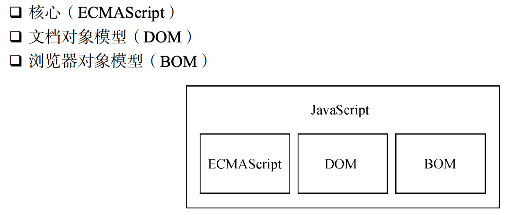

第四版涵盖内容：

- 覆盖 ECMAScript2019（基础和高级特性，js 起源，最新技术）

- 前端开发者必须掌握的 JS 技术（基础和高级特性）
- ECMAScript 标准和 DOM 标准

- js 基本概念（类，期约，迭代器，代理等）
- 客户端检测，事件，动画和，表单，错误处理和 JSON
- FetchAPI，模块，工作者线程，服务线程，新 API 和规范

JavaScript 的应用场景：

- 服务器
- 浏览器
- 桌面应用
- 原生 App

JavaScript 最佳实践 和 JavaScript 工具不断变化

早期是没有前端应用程序一说的，初期的 JavaScript 代码并不能组成程序，只是一系列函数的简单组合。在 jquery 之后便开始逐渐演变出前端应用程序一说。到现在前端模型，数据绑定，路由管理金和反应式视图都能实现了。前端程序也越发成熟。

ECMA-262 规范定义的是 JavaScript 的基本语法，但对这些规范的实现则有许多不同的方式，而 js 实际的实现是需要看各个浏览器厂商的，所以 js 没有唯一正确的实现。 JavaScript 能做什么，主要由 JavaScript 的宿主环境决定（这门语言与其宿主关系密切），宿主为 JavaScript 定义了与外 界交互所需的全部 API，宿主环境提供什么样的 api 接口（DOM，网络请求，系统硬件，存储，事件，文件，加密等）给 JavaScript 去调用，JavaScript 才能实现相应的能力。

JavaScript 没有唯一正确的实现，ECMA-262 定义的是 JavaScript 的基本语法，但是对这个规范的实现则有许多，但是 js 实际的实现是需要看各个浏览器厂商的，所以 js 没有唯一正确的实现。JavaScript 能做什么，主要由 JavaScript 的宿主环境决定，宿主环境提供什么样的 api 接口（DOM，网络请求，系统硬件，存储，事件，文件，加密等）给 JavaScript 去调用，JavaScript 才能实现相应的能力。

每款浏览器及其 JavaScript 引擎都有一些自己特定的 api 实现。Chrome 有 Blink/V8，Firefox 有 Gecko/SpiderMonkey，Safari 有 WebKit/JavaScriptCore，微软有 Trident/EdgeHTML/Chakra。因此，对 JavaScript 更准确的定位应该是一组浏览器实现。

## 第一章 JS 的发史

浏览器以合规的方式运行绝大多数 JavaScript 规范，但也有各种浏览器偏好的页面。因此，对 JavaScript 更准确的定位应该是一组浏览器实现。

### 早期 js 的目的

95 年问世，目的：**代替服务器端语言处理输入验证**。在此之前，要验证某个必填字段是否已填写，或者某个输入的值是否有效，需要与服务器的一次往返通信。那时网速非常慢，所以与服务器通信需要很长时间，为此 js 可以减少与服务器通信的次数。

js 中不存在方法重载，子类可以重写父类方法。 多态：js 中有一个操作类似重载但不是重载，根据传参的不同，走不同逻辑。


早期，网景和微软都开发了自己的浏览器脚本语言，意味着出现了两个版本的 JavaScript。当时 JS 还没有规范其语法或特性的标准， 两个版本并存让这个问题更加突出。最后 JavaScript 开始制定标准规范。97 年，JavaScript 1.1 作为提案被提交给欧洲计算机制造商协会（Ecma）第 39 技术委员会（TC39），。标准化一门通用、跨平台、厂商中立的脚本语言的语法和语义——ECMA-262。各家浏览器均以 ECMAScript 作为自己 JavaScript 实现的依据，虽然具体实现 各有不同。

JavaScript 包含以下三部分：



> 1. ECMAScript( ECMA-262 定义的语言，并不局限于 Web 浏览器，ECMA-262 将这门语言作为一个基准来定义，以便在它之上再构建更稳健的脚本语言。)
>
>    > 它规定了 JS 中的基础语法、句型、关键字、数据类型，保留字，全局对象，操作符等（JS 是对 ECMAScript 的实现）
>    >
>    > 对于实现了 ECMA-262 中定义的规范的一门语言都可以称为 ECMAScript。
>
>    ECMAScript 不同版本：
>
>    ECMA-262 的第 1 版本质上跟网景的 JavaScript 1.1 相同， 只不过删除了所有浏览器特定的代码，外加少量细微的修改。
>
>    ECMA-262 第 2 版只是做了一些编校工作，主要是为了更新之后严格符合 ISO/IEC-16262 的要求， 并没有增减或改变任何特性。
>
>    ECMA-262 第 3 版第一次真正对这个标准进行更新，更新了字符串处理、错误定义和数值输出。此 外还增加了对正则表达式、新的控制语句、try/catch 异常处理的支持和国际化。
>
>    ECMA-262 第 4 版在正式发布之前被放弃，改动太大,几乎是定义了一门全新的语言,该语言包括强类型变量,新语句和数据结构,真正的类和经典的继承,以及操作数据的新手段。
>
>    ECMAScript 3.1 变成了 ECMA-262 的第 5 版(09 年底发布)，新功能包括原生的解析和序列化 JSON 数据的 JSON 对象、方便 继承和高级属性定义的方法，以及新的增强 ECMAScript 引擎解释和执行代码能力的严格模式。
>
>    ECMA-262 第 6 版，俗称 ES6、ES2015 或 ES Harmony（和谐版），ES6 正式支持了类、模块、迭代器、生成器、箭头 函数、期约、反射、代理和众多新的数据类型。
>
>    ECMA-262 第 7 版，也称为 ES7 或 ES2016，于 2016 年 6 月发布。这次修订只包含少量语法层面的 增强，如 Array.prototype.includes 和指数操作符。
>
>    ECMA-262 第 8 版，也称为 ES8、ES2017，完成于 2017 年 6 月。这一版主要增加了异步函数（async/ await）、SharedArrayBuffer 及 Atomics API，以及 Object.values()/Object.entries()/Object. getOwnPropertyDescriptors()和字符串填充方法，另外明确支持对象字面量最后的逗号。
>
>    ECMA-262 第 9 版，也称为 ES9、ES2018，发布于 2018 年 6 月。这次修订包括异步迭代、剩余和 扩展属性、一组新的正则表达式特性、Promise finally()，以及模板字面量修订。
>
>    ECMA-262 第 10 版，也称为 ES10、ES2019，发布于 2019 年 6 月。这次修订增加了 Array.prototype. flat()/flatMap()、String.prototype.trimStart()/trimEnd()、Object.fromEntries()方 法，以及 Symbol.prototype.description 属性，明确定义了 Function.prototype.toString() 的返回值并固定了 Array.prototype.sort()的顺序。
>
> 2. DOM（文档对象模型）W3C 制定的 DOM 标准
>
>    > DOM 将整个页面抽象为一组分层节点，提供了各种 API（方法或属性），让 JS 能操作或者获取页面中任何 HTML 元素及其身上的属性。可以让开发者在不刷新页面的情况下修改页面样式，内容和结构。
>    >
>    > DOM1 规范由 DOMCore 和 DOM HTML 组成，为的是映射文档结构，从而方便访问和操作文档任意部分。
>    >
>    > DOM2 则增加了鼠标和用户界面事件，范围，遍历(迭代 DOM 节点的方法)能力, 通过增加对象属性和方法的方式支持了操作层叠样式表(CSS).
>    >
>    > - DOM 视图：描述追踪文档不同视图（如应用 CSS 样式前后的文档）的接口
>    > - DOM 事件：描述事件及事件处理的接口
>    > - DOM 样式：描述处理元素 CSS 样式的接口
>    > - DOM 遍历和范围：描述遍历和操作 DOM 树的接口
>    >
>    > 接口其实就是 js 对象上的一系列的属性或者方法。比如：
>    >
>    > - 事件属性 addEventlistener
>    > - 样式属性：classList
>    > - ......
>    >
>    > DOM3 增加了以统一的方式加载和保存文档的方法（包含在一个叫 DOM Load and Save 的新模块中），还有验证文档的方法（DOM Validation）。
>    >
>    > DOM4 新增的内容包括替代 Mutation Events 的 Mutation Observers。
>
> 3. BOM（浏览器对象模型）由 HTML5 规划标准
>
>    > 它提供了各种浏览器层级的 API，让 JS 能操控浏览器页面以外的部分，用于支持访问和操作浏览器的窗口。BOM 主要针对浏览器窗口和子窗口（frame），不过人们通常会把任何特定于浏览器的 扩展都归在 BOM 的范畴内。
>    >
>    > 弹出新浏览器窗口的能力；
>    >
>    > 移动、缩放和关闭浏览器窗口的能力；
>    >
>    > navigator 对象，提供关于浏览器的详尽信息；
>    >
>    > location 对象，提供浏览器加载页面的详尽信息；
>    >
>    > screen 对象，提供关于用户屏幕分辨率的详尽信息；
>    >
>    > performance 对象，提供浏览器内存占用、导航行为和时间统计的详尽信息(性能监控)；
>    >
>    > 对 cookie 的支持；
>    >
>    > 其他自定义对象，如 XMLHttpRequest

## 第二章

### script 标签的属性(都是可选属性)

`<script>`是 html 标签

> 1. async（异步）：表示立即下载脚本，但是不能阻止其他页面动作,比如资源的下载或其他脚本的加载（只对外部脚本有效）。
>
> 2. defer（推迟）：脚本延迟到文档完全被解析和渲染之后再执行（只对外部脚本有效）。
>
> 3. crossorigin：配置相关请求的 CORS（跨域资源共享）设置，默认不使用 CORS。值："anonymous"：文件请求不必设置凭据标志；"use-credentials"：设置凭据标志，出站请求会包含凭据。
>
> 4. src：外部 JS 文件的 URL。如果 src 引入的是其他类型的文件（如 .css 等），但是文件内的代码是语法正确的 js 代码，在 type 为"text/javascript"时，该文件也是能被解析执行的。
> 5. type：表示代码块中脚本语言的类型（MIME 类型）。值："text/javascript"、"application/javascript"、module **（module 表示代码被当成 ES6 模块，并在代码中允许出现 import 和 export 关键字）**
>
> 6. integrity：允许比对接收到的资源和指定的加密签名以验证子资源完整性（SRI， Subresource Integrity），如果接收到的资源的签名与这个属性指定的签名不匹配，则页面会报错， 脚本不会执行。确保内容分发网络（CDN，Content Delivery Network）不会提供恶意内容。
> 7. charset:使用 src 属性指定的代码字符集（不重要）

浏览器在解析 html 时，在遇到`<script>`标签或者`<script>`标签外部引入 JS 脚本时，在解析执行或下载并解析执行完 js 脚本（先发送网络请求获取该 JS 脚本的代码内容，然后让 JS 引擎执行该代码，当代码执行完毕后恢复解析）之前，页面的剩余内容是不会被解析和显示的（阻塞解析，更阻塞渲染、同步；script 阻塞了浏览器对 HTML 的解析，如果获取 JS 脚本的网络请求迟迟得不到响应，或者 JS 脚本执行时间过长，都会导致白屏），除非人为设置 defer 属性或者 async 属性。同时`<script>`标签能实现跨域请求（只支持 get 请求,但是请求回来的脚本中如果由发送到其他域的 Ajax 请求,则这些请求任然是受跨域限制的）,这是 JSONP 的实现原理。


带有 async 属性的 script 时，请求该脚本的网络请求是异步的，不会阻塞浏览器解析 HTML，一旦网络请求回来之后，如果此时 HTML 还没有解析完，浏览器会暂停解析，先让 JS 引擎执行代码，执行完毕后再进行解析，图示如下：


如果在 JS 脚本请求回来之前，HTML 已经解析完毕了，立即执行 JS 代码，如下图所示：


**所以 async 是不可控的，因为执行时间不确定，如果在异步 JS 脚本中获取某个 DOM 元素，有可能获取到也有可能获取不到。而且如果存在多个 async 的时候，它们之间的执行顺序也不确定，完全依赖于网络传输结果，谁先到执行谁。异步脚本保证会在页面的 load 事件前执行，但可能会在 DOMContentLoaded 之 前或之后。**

带有 defer 属性的 script 时，获取该脚本的网络请求也是异步的，不会阻塞浏览器解析 HTML，一旦网络请求回来之后，如果此时 HTML 还没有解析完，浏览器不会暂停解析并执行 JS 代码，而是等待 HTML 解析完毕再执行 JS 代码，图示如下：


如果存在多个 defer script 标签，浏览器（IE9 及以下除外）会保证它们按照在 HTML 中出现的顺序执行，不会破坏 JS 脚本之间的依赖关系。HTML5 规范要求脚本应该按照它们出现的顺序执行，因此第一个推迟的脚 本会在第二个推迟的脚本之前执行，而且两者都会在 DOMContentLoaded 事件之前执行。不过在实际当中，推迟执行的脚本不一定总会按顺序执行或者在 DOMContentLoaded 事件之前执行。

> **面试点**
>
> JSONP 原理：（动态加载脚本）通过 JavaScript 向 DOM 中动态添加 script 元素同样可以加载指定的脚本。
>
> let script=document.createElemnt('script')
>
> script.src='外部 js 文件 URL'
>
> document.body.appendChild(script) //在把 HTMLElement 元素添加到 DOM 且执行到这段代码之前不会发送请求。以这种方式创建的 script 元素是以异步方式加载的，相当于添加了 async 属性。
>
> 不过这样做可能会 有问题，因为所有浏览器都支持 createElement()方法，但不是所有浏览器都支持 async 属性。因此， 如果要统一动态脚本的加载行为，可以明确将其设置为同步加载：
>
> let script = document.createElement('script');
>
> script.src = 'gibberish.js';
>
> script.async = false;
>
> document.head.appendChild(script);
>
> 以这种方式获取的资源对浏览器**预加载器**是不可见的。这会严重影响它们在资源获取队列中的优先级。根据应用程序的工作方式以及怎么使用，这种方式可能会严重影响性能。要想让预加载器知道这些动态请求文件的存在，可以在文档头部显式声明它们： `<link rel="preload" href="gibberish.js">`

> **面试点**
>
> script 标签 defer 和 async 的区别：
>
> async：浏览器在解析 html 时，解析到带有 async 属性和 src 属性的 script 标签时，浏览器就会立即发起请求下载外部脚本，与此同时继续解析页面，这样就解决了阻塞问题。带有 async 的脚本往往是下载好后就马上开始解析执行的，而什么时候下载完成是不确定的。所以这就导致了脚本执行的时间点的不确定性，有时页面还没有解析完就执行了，也有可能页面解析完成后再执行。**所以对于脚本是需要修改 DOM 的，就可能会出错，因此 async 比较适合一些第三方脚本。并且多个脚本之间应该没有依赖关系**。异步脚本保证会在页面的 load 事件前执行，但可能会在 DOMContentLoaded 之前或之后。
>
> defer：浏览器在解析 html 时，解析到带有 defer 属性和 src 属性的 script 标签时，浏览器就会立即进行下载外部脚本，与此同时继续解析页面，这样也解决了阻塞问题。但是不管脚本是否立马下载完毕，都会等待浏览器解析完 html 以后再执行脚本，因此 defer 可以用于和 DOM 有关联的脚本。
>
> 在页面中有多个设置的 defer 属性的标签，脚本应该按照它们出现的顺序执行，并且两者都会在 DOMContentLoaded 事件之前执行。不过在实际当中，推迟执行的脚本不一定总会按顺序执行或者在 DOMContentLoaded 事件之前执行，因此最好只包含一个这样的脚本。
>
> async、defer 都只适用于外部脚本。同时还有浏览器不能支持这两个属性的。

### script 标签的位置

> 把所有 JavaScript 文件都放在` <head>` 里，也就意味着必须把所有 JavaScript 代码都下载、解析和执行完成后，才能开始继续解析 HTML 结构和 css 渲染。对于需要很多 JavaScript 的页面，这会导致页面渲染明显延迟，在此期间浏览器窗口完全空白。为解决这个问题，现代 Web 应用程序通常将所有 JavaScript 引用放在元素中的页面内容后面。

### 文档模式

文档模式的不同带来的影响主要体现在 CSS 渲染方面，但对 JS 也有一些关联影响

- 混杂模式（怪异模式）:支持一些非标准特性，以省略文档开头的 doctype 声明作为开关。

- 标准模式:兼容标准特性

  > ```
  > <!-- HTML 4.01 Strict -->
  > <!DOCTYPE HTML PUBLIC "-//W3C//DTD HTML 4.01//EN"
  > "http://www.w3.org/TR/html4/strict.dtd">
  >
  > <!-- XHTML 1.0 Strict -->
  > <!DOCTYPE html PUBLIC
  > "-//W3C//DTD XHTML 1.0 Strict//EN"
  > "http://www.w3.org/TR/xhtml1/DTD/xhtml1-strict.dtd">
  >
  > <!-- HTML5 -->
  > <!DOCTYPE html>
  > ```

<! DOCTUPE ~~~~>;在 html 一开头省略文档声明语句就会开启混杂模式.

- 准标准模式:支持没有标准模式那么多的标准特性，通过过渡性文档类型（Transitional）和框架集文档类型（Frameset）来触发。

  > ```html
  > <!-- HTML 4.01 Transitional -->
  > <!DOCTYPE html PUBLIC "-//W3C//DTD HTML 4.01 Transitional//EN" "http://www.w3.org/TR/html4/loose.dtd">
  >
  > <!-- HTML 4.01 Frameset -->
  > <!DOCTYPE html PUBLIC "-//W3C//DTD HTML 4.01 Frameset//EN" "http://www.w3.org/TR/html4/frameset.dtd">
  >
  > <!-- XHTML 1.0 Transitional -->
  > <!DOCTYPE html PUBLIC "-//W3C//DTD XHTML 1.0 Transitional//EN" "http://www.w3.org/TR/xhtml1/DTD/xhtml1-transitional.dtd">
  >
  > <!-- XHTML 1.0 Frameset -->
  > <!DOCTYPE html PUBLIC "-//W3C//DTD XHTML 1.0 Frameset//EN" "http://www.w3.org/TR/xhtml1/DTD/xhtml1-frameset.dtd">
  > ```

### 预解析（变量提升）-- 只发生在当前执行上下文中

在执行栈中，js 代码执行前，浏览器会默认的把所有 var 与 function 的变量声明和函数定义进行提前（预解析）。var 声明变量只是提升声明，并不提升赋值操作。function 定义函数 提升函数声明并定义。（但是函数内部的变量声明和函数定义并不提升，因为函数体是字符串形式的。只有当函数被调用时,函数入栈，形成该函数的执行上下文，才会在新的执行上下文中对函数体中的代码进行预解析）

在全局作用域中，变量声明加 var 与不加 var ，前者会有变量提升操作，后者没有。所以对于后者，在变量之前使用，会报错。 不加 var 直接给一个变量赋值，相当于给 window 增加了一个变量名属性，并赋值； 加 var 后给一个变量赋值，相当于给 window 增加了一个变量名属性与赋值，也相当于给全局作用域增加了一个全局变量(非严格模式下)。

函数的预解析先于 var 定义的变量的预解析.

函数体中 return**下面(后面)**的代码不会执行，但是会进行预解析。return 语句**后面**的**返回内容部分**不会进行预解析,但是 return 语句下面的语句会预解析。在全局作用域下，自执行函数的定义是不进行预解析的，但是执行到自执行函数行时，自执行函数内部会进行预解析。

```javascript
if (!("num" in window)) {
  var num = 12; //这步预解析把 var num 提升变量了
}
console.log(num); //undefined
// 在预解析的时候上面代码中的条件语句中用var定义的变量，不论条件是否成立，都会进行变量提升
```

```javascript
var  fn = 13
function fn () {
    console.log('ok')
}
console.log(fn) // 打印的是13 而不是函数体
fn() //报错

代码的解析过程如下：
预解析函数fn的声明,同时对该变量赋值函数的堆内存引用地址,因为fn已经预解析声明过了,所以var声明的fn将不再重复声明，然后预解析结束。接下来执行到fn=13，将fn的值由内存地址变为了一个基本数据类型的值--13。

之前错误的理解:解析提升fn ，并且值为undefined，然后解析函数定义但是没有重新再声明变量，只是将fn的值改为了一个函数体对应的内存地址


结论：
函数的预解析先于var定义的变量的预解析，同名变量的预解析，后面函数定义代码的预解析会覆盖前面代码的预解析值。

之前错误的理解:
函数和变量定义的预解析没有谁先谁后的问题，预解析都是按照代码的顺序来进行的


fn()   // 2
function fn(){ console.log(1) }  //首先预解析提升，声明了fn 并赋值为一个函数  console.log(1)
fn()   // 2
var fn=10  // 这步也会考虑变量提升，但预解析已经生成一个叫fn的，所以就不再提升了
fn()  // 报错
function fn(){ console.log(2)}  //这步也会考虑变量提升，但预解析已经生成一个叫fn的，但是并不妨碍重新赋值，所以fn对应的值就变为了  console.log(2)
fn()  // 不会被执行
```

### 堆内存与栈内存

栈内存：存放了基本数据类型的值，并提供一个供 js 代码执行的环境（ECStack）。

堆内存：存放引用类型的值（对象存的是属性名和属性值，**如果对象的属性名对应的属性值是一个自执行函数，则该函数会立即执行，而属性名内存放的真实值是该自执行函数的返回值**。函数存的是代码字符串）

浏览器会在计算机内存中分配一块内存，专门用来供代码执行的**栈内存**，称作**执行环境栈**(**ECStack**) 同时会创建一个全局对象(GO)，将内置的属性方法( `isNaN`、`setInterval`、`setTimeout`... )存放到一块**单独的堆内存空间**，并且使用 window 指向全局对象(GO)。

在执行代码前，还需要创建一个**全局执行上下文**( **EC(G)** ), 创建完成后，进入到栈内存中去执行( **进栈** )； 在当前全局执行上下文中，因为会创建很多变量并且赋值，所以会创建一个**变量对象** **VO(Variable Object)** 来进行保存，在函数私有上下文中的变量对象叫做**变量对象(VO)或者活动对象(AO)(Activation Object)** （ps: 每个执行上下文都有一个单独的变量对象）。

VO 是在函数入栈开始执行后被激活为 AO 的.

**执行环境栈 ECStack** ( **Execution Context Stack** )：专门用来供代码执行的**栈内存**

**全局对象 GO**(**Global Object**)：存放内置的属性方法，window 指向

**全局执行上下文 EC(G)** ( **Execution Context(G)** )：页面加载后进栈、销毁后出栈

**变量对象 VO** (**Variable Object**)：存放当前执行上下文中创建的变量和值

**活动对象 AO** (**Activation Object**)：函数私有上下文中的变量对象


全局代码的执行流程：

1. ECStack 、GC、GO、EC、VO、AO

2. 预解析（变量与函数的提升）

3. 全局代码执行

   ```
   var x = [12, 23]
   先在堆内存中开辟空间存放一个引用类型的值 [12, 23]
   再创建一个变量 x
   最后将变量与值进行关联
   当创建的值是引用类型时，会在堆内存中开辟新的内存空间用了保存值，创建完成后，会将堆内存地址(通常是16进制)保存到栈内存中； 如果创建的值是基本类型时，会直接保存到栈内存中
   ```

   

   

   

   

   

   ```
   function fn(y) {
      y[0] = 100;
      y = [100]
      y[1] = [200]
   }


   函数也是引用类型，也需要开辟堆内存空间进行保存，不同于数组和对象保存的是键值对，JS会将函数体通过字符串包裹进行保存，同时也会保存函数相关的属性，例如 函数名 name: fn、形参个数length: 1 等。同时，更重要的是，创建函数的时候，就确定了函数的作用域链。
   在这个例子中，函数fn 的父级作用域就是全局执行上下文，标识为 [[scope]]:EC(G)
   ```

   

   

   

   

   ```
fn(x)
fn(x) 相当于 AAAFFF111(AAAFFF000)
在执行函数体代码之前，我们需要知道的是：

每次函数执行，都会创建一个函数私有执行上下文，创建完之后，需要压入到栈内存中去执行，此时，执行栈中的全局执行上下文就会被压入到栈底(压栈)

同时，需要创建一个活动对象 AO 存放当前函数执行上下文中创建的变量和值等

在完成函数执行上下文入栈后，接下来会做以下几件事

初始化作用域链 scopeChain:  作用域链通常标记为 <当前函数执行上下文, 函数被创建时的父作用域> ，而作用域链是为了函数执行过程中，当活动对象中不存在某个变量时，会沿着作用域链向上找到

初始化 this 指向 : 本例子中，this 等于 window

初始化实参集合 arguments

形参赋值  y = x = AAAFFF111

执行函数体 紧接着就是执行函数体内容，在执行完成后，当前函数的执行上下文就会出栈，退出执行栈，而被压入栈底的全局执行上下文又被推到了栈顶，此时会继续执行全局上下文中的代码

链接：https://juejin.cn/post/6898737453612400653
```


### 内存释放（垃圾回收）

堆内存释放：

对象数据类型或函数在定义的时候首先都会开辟一个堆内存，堆内存有一个引用的内存地址，如果有变量引用了该内存地址，该堆内存就不能被销毁。如果让变量指向 null，则浏览器之后就会自动回收该堆内存。

栈内存释放：

- 全局作用域释放：只有在页面关闭的时候，全局作用域才会销毁。
- 函数作用域释放：一般当函数体代码执行完成后，函数作用域会自动释放并销毁；
  - 特殊情况 （闭包）：
    - 函数执行并返回一个引用数据类型的值，且引用类型的值中用到了函数作用中存在遍变量，该被返回的引用类型的值被外部的变量引用。
    - 在函数作用域中给 dom 元素对象的事件绑定方法。

## 第三章

语法，操作符，数据类型和内置功能。

### 标识符

JS 中的变量、函数名、操作符都是区分大小写的，同一个单词大小写相差一个都代表不同（如：typeof 是操作符，而 Typeof 则表示一个标识符）
**标识符**：是变量、函数、属性或函数参数的名称。

标识符可以由**一或多个**下列字符组成：

 第一个字符必须是一个字母、下划线（\_）或美元符号（$）；

 剩下的其他字符可以是字母、下划线、美元符号或数字。

 汉字也可以作为标识符（字母可以是 ASCII（Extended ASCII）中的字母，也可以是 Unicode 的字母字符）

```js
var ~;
let ~;
const ~;
function ~ (){};
class ~ {};
import ~ from 'path';
```

ES5 增加严格模式，严格模式是另一种 js 解析和执行的模式，ES3 中不安全的写法在严格模式下报错。启用严格模式"use strict"（预处理指令）。

推荐：js 语句后加分号；if 语句即使只有一条也使用花括号。

### 声明变量的方式

js 变量的特点：松散类型的变量。

基于$开头：一般代表使用JQ或者其它使用$的类库获取的内容

基于\_开头：一般代表是全局或者公共的变量

基于数字区分相似名称的变量

建议变量名以驼峰形式表示，如：firstTimer

- var
  - 有函数作用域和全局作用域
  - **存在变量提升，提升至当前作用域**
  - 使用 var 声明变量时，变量会被自动添加到最接近的上下文。在函数中，最接近的上下文就是函数的局部上下文。在 with 语句中，最接近的上下文也是函数上下文。
  - 同一个作用域下可以重复声明
- let

  - 有块级作用域、函数作用域和全局作用域

  - 不能在同一个作用域内重复声明，JavaScript 引擎会记录用于变量声明的标识符及其所在的块作用域，因此嵌套使用相同的标识符不会报错，而这是因为同一个块中没有重复声明

  - **不存在变量提升, 一个作用域中，声明语句之前的都是暂时性区域都是暂时性死区**

  - 在全局作用域声明的变量不会成为 window 的属性

  - 在 for 循环中 let 声明的计数器 i 中，小括号内的 i 和循环体内部的 i 分别处于两个作用域中。

    ```
    for(let i=0;i<3;i++){
    	let i='abc'
    	console.log(i)
    }
  
    输出结果：
    abc
    abc
    abc
    ```

- const

  - 声明变量的同时必须初始化变量，且之后不能再对变量做内存地址修改

  - 有块级作用域、函数作用域和全局作用域

  - 不能在同一个作用域内重复声明

  - 一个作用域中，声明语句之前的都是暂时性区域都是暂时性死区

  - 在全局作用域声明的变量不会成为 window 的属性

  - 不存在变量提升,常量一般全部大写字母表示

    > 本质是保证变量的内存地址不得变动
    >
    > 简单数据类型中，值就保存在变量指向的内存地址中，改变值就等于改变了内存地址
    >
    > 引用数据类型中，变量对应的内存地址中的值是另一个内存地址，只要该内存地址不变，它指向的数据结构怎么变化都不会导致报错
    >
    > ***
    >
    > 如果想要禁止对应用类型的数据内部的属性、方法或者元素进行修改操作，可以使用 Object.freeze(要禁止修改的引用数据类型实例 )方法

- class 变量名

- function 变量名

- import 变量名

**避免在块级作用域中声明函数，如果确实需要，也应该写成函数表达式的形式而不是函数声明式语句。**

### 数据类型

- String、Number、Boolean、Null、Undefined、Symbol、BigInt、Object
- BigInt：管理超过安全数值的数字（BigInt（数字）），了解即可
- typeof 操作符用于检测变量或字面量的数据类型，其**返回值都是字符串**形式

  - "string"、"number"、"boolean"、"object"、"function"、"symbol"、”bigint“
  - 缺点：在检测对象类型时，object 和 null 都返回 "object" ，它对引用值的用处不大，无法检测出它是什么类型的对象。

- undefined 和 null 存在相似，其中 **null == undefined 结果为 true** ，但是对于一个变量初始值是赋 undefined 还是 null 需要注意

  - 对于要之后要用保存对象数据类型的变量时，一开始最好赋初始值为 null

- **用到了 Boolean（）方法将其他数据类型转为布尔数据类型的情况：**
  > | 数据类型  |        转为 true 的值        | 转换为 false 的值 |
  > | :-------- | :--------------------------: | :---------------: |
  > | Boolean   |             true             |     **false**     |
  > | String    | 非空字符串，包括纯空格字符串 |      **""**       |
  > | Number    |           非零数值           |    **0、NaN**     |
  > | Object    |           任意对象           |     **null**      |
  > | Undefined |            不存在            |   **undefined**   |

```js
Symbol() == true; // false
Symbol() == false; // false
Boolean(Symbol()); // true
```

在条件判断语句中，对数据进行隐式的类型转换的话，用的就是 Boolean（）方法，但是数据本身并没有转为布尔值。

对于!!,只用 ”0/NaN/null/undefined/空字符串''为 false，其余全部为 true。

Boolean(' ') //true

**!! [ ] 为 true，底层并没有将 [ ] 转为空字符串，而是直接将 [ ] 转为了布尔类型的对应值。**

因为存储浮点值使用的内存空间是存储整数值的两倍，所以 ECMAScript 总是想方设法把值转换为 整数。在小数点后面没有数字的情况下，数值就会变成整数。类似地，如果数值本身就是整数，只是小 数点后面跟着 0（如 1.0），那它也会被转换为整数。

- 对于 number 数据类型，注意一个函数：**isNaN( )**

  - 该函数接受一个任意数据类型的参数

  - 对于非数字类型的参数，isNaN( ) 先通过调用 Number( ) 函数将数据进行转换，再用 isNaN 方法进行判断。

        + Number( )函数的转换规则：
      
          + 参数是布尔值，true转为1，false转为0
          + **参数是null，返回 0**
          + **参数是undefined，返回 NaN**
          + 参数是纯数字组成（包括小数、负数）的字符串，直接转为对应的十进制数字，如果字符串包含有效的十六进制格式如"0xf"，则会转换为与该十六进制值对应的十进制整数值。
          + **参数是空字符串或者纯空格，返回 0**
          + 参数是字符串且含有非数字的字符时，直接转换为 NaN
          + 不能把symbol转为数字类型，强转报错
          + 参数是函数时都是NaN
          + 参数是对象，先把对象转换为字符串，再把字符串转为数字。调用valueOf ( ) 或者toString () 方法转换为上述情况之一的，得到结果。

    > isNaN('13px') //true
    >
    > isNaN(false) //false
    >
    > isNaN([]) //false 先把[]用 toString（）转换为字符串： ""，再把""用 Number()转换为数字：0
    >
    > isNaN([10]) //false 先把[10]用 toString（）转换为字符串： "10"，再把"10"用 Number()转换为数字：10
    >
    > isNaN([12,13]) //true 先把[12，13]用 toString（）转换为字符串： "12，13"，再把"12，13"用 Number()转换为数字：NaN
    >
    > isNaN(undefined) // true
    >
    > Number('true') //NaN
    >
    > **({}).toString() // [object Object]**
    >
    > 10/0 //Infinity
    >
    > **0/0 // NaN**
    >
    > NaN == NaN //false

  - **parseInt(string, radix);**

  **专门用于字符串**,如果处理的值不是字符串，需要先转为字符串然后再去转为 Number 类型

要求第一个参数是字符串，如果参数不是一个字符串，则将其转换为字符串(使用 `ToString `隐式操作)。字符串开头的空白符将会被忽略。 字符串参数开头和结尾的空格会被忽略。

radix：从 `2` 到 `36`，表示字符串的基数。例如指定 16 表示被解析值是十六进制数。请注意，10 和 0 表示十进制。radix 小于 `2` 或大于 `36` ，或第一个非空格字符不能转换为数字，则直接返回 NaN.

parseInt('123', 5) // 将'123'看作 5 进制数，返回十进制数 38 => `1*5^2 + 2*5^1 + 3*5^0 = 38`

parseInt('126', 5) // 将'12'看作 5 进制数，返回十进制数 38 => `1*5^1 + 2*5^0 = 7`

parseInt("546011", 2) //从第一位开始不符合 2 进制要求，所以后面的也不再考虑，返回 NaN

```
let arr=[10.18,0,10,25,23]
arr = arr.map(paresInt)
console.log(arr）
本题考出了三个点：
1.map的使用
2.进制转换
3.parseInt()的使用
答案：[10,NaN,2,2,11]

parseInt('') // NaN
```

- parseFloat () 专门用于字符串，如果处理的值不是字符串，需要先转为字符串然后再去转为 Number 类型。该函数始终忽略字符串开头的零；十六进制数始终返回 0，因为该函数只解析十进制值，因此不能指定底数。

要求第一个参数是字符串，如果不是字符串将被转换成字符串，而且，在进行转换之前，字符串参数的左侧符合进制数所使用字符集的字符被截取出来用于进制数的转换。 parseInt(String(param).trim(),radix) 字符串参数开头和结尾的空格会被忽略。

- **parseInt（true） //NaN,先将 true 转为字符串‘true’，再将字符串尝试转为数字。**
- **parseInt（‘’） // NaN**

判断一个变量是否是 NaN:

- isNaN(variable)

- variable != variable 返回 true ，则说明 variable 是 NaN; 返回 false 说明 variable 不是 NaN。

- Object.is（variable1，variable2）返回 true 说明两个变量是同一个值。不会进行类型转换。对于基本数据类型是比较值，而对于引用数据类型比较的是内存地址。

  Object.is（-0，+0）=> false

### String

- 单引号或双引号或者反引号包裹
  - es6 新增了模板字符串，用反引号（``）包裹
  - 反引号内部用 ${ } 将变量、函数调用、对象插入
    - 任何插入的变量也会从它们最接近的作用域中取值
    - 所有插入的值都会使用 toString()强制转型为字符串
    - 任何 JavaScript 表达式都可以用于插值
  - **普通对象转换为字符串都是 "[object Object]"，数组对象转换为字符串是 "第一项,第二项..."（逗号分隔数组中的每一项）**

* 标签函数

  - 一个函数，不通过括号传参的方式调用，而是在调用时，在函数名的后面接上一个模板字符串

  - 通过标签函数可以自定义插值行为

  - 标签函数会默认接收被插值记号（${ }）分隔后的模板字符组成的一个数组 和 每个表达式求值的结果 作为参数

    ```javascript
    var person = 'Mike';
    var age = 28;
    var output = myTag`that ${ person } is a ${ age }`;
    function myTag(strings, personExp, ageExp) {
      var str0 = strings[0]; // "that "
      var str1 = strings[1]; // " is a "
      var ageStr;
      if (ageExp > 99){
        ageStr = 'centenarian';
      } else {
        ageStr = 'youngster';
      }
      return str0 + personExp + str1 + ageStr;
    }
    
    console.log(output);  //输出字符串that Mike is a youngster
    
    console.log `aaa${1}bbb`
    //['aaa','bbb'] 1
    console.log `aaa${1}b${2}bb`
    //['aaa','b','bb'] 1 2


    function Tag(strings, personExp，ageExp,...)
    //strings:字符串数组，这个其实就是以${}分分隔符分割得到的数组
    //personExp：模板字符串中第一个${}的值
    //ageExp：模板字符串中第二个${}的值
    //...：模板字符串中第n个${}的值
    Tag`string${value}string...`
    ```

  - 字符串转换

    - xxx.toString(), 注意 null 和 undefined 没有该方法，toString 在被**数值类型**的数据调用时，可以接受一个表示进制的参数，以让数字以特定进制输出为字符串。
    - String(xxx)

### Symbol（符号）

- 符号实例是唯一、不可变的，不能和其他数据类型的值进行运算
- 用于做对象的属性名（非字符串形式的属性名），确保不会出现属性名冲突的情况
- 对象的 symbol 属性名无法用 for...in 循环遍历得出,Reflect.ownkeys 获取对象所有键名
- 创建符号实例的方法：let 变量名=Symbol（[''描述符'']）；let 变量名=`Symbol.for([" 描述符" ])` ,Symbol()函数不能与 new 关键字一起作为构造函数使用
- 凡是可以用字符串或者数值作为对象属性的地方都可以用 symbol 代替

  - > let s1=Symbol('foo') //方式一
    >
    > let o={
    >
    > [s1] : 'foo Val',
    >
    > [Symbol('sym')] : 'sym Val' //方式二
    >
    > }
    >
    > Object.defineProperty(o,s1,value:'bar Val'}) //方式三

* 使用全局符号注册表

  如果运行时的不同部分需要共享和重用符号实例，那么可以用一个字符串作为键，在全局符号注册 表中创建并重用符号。为此，需要使用 Symbol.for()方法。

  Symbol.for()第一次使用某个字符串调用时，它会检查全局运行时注册表，发现不存在对应的符号，就会生成一个新符号实例并添加到注册表中，后续使用相拥的字符串的调用同样会检查注册表，发现存在与该字符出串对应的符号，则返回该符号实例。

  ```js
  let S1 = Symbol.for("abc");
  let S2 = Symbol.for("abc");
  S1 === S2; // true
  ```

#### 获取对象属性的方法：

- Object.getOwnPropertyName (obj) ,本方法返回一个由对象实例的常规属性的属性名组成的数组

  > ```let obj ={
  > let obj ={
  >     name:'tom',
  >     age:18,
  >     gender:'male',
  >     [Symbol('foo')]:'qwe'
  > }
  > Object.getOwnPropertyNames(obj)    //["name", "age", "gender"]
  > ```

- Object.getOwnPropertySymbols(obj),本方法返回一个由对象实例的符号属性的属性名组成的数组

  > let obj ={ name:'tom', age:18, gender:'male',
  >
  > `[Symbol('foo'`)]='qwe'
  >
  > }
  >
  > Object.getOwnPropertySymbols(obj) //[Symbol(foo)]

- Object.getOwnPropertyDescriptors(obj),本方法返回一个由对象实例的常规属性和符号属性的属性名组成的对象

  > 1. _{name: {…}, age: {…}, gender: {…}, Symbol(foo): {…}}_
  >
  > 2. - age: {value: 18, writable: true, enumerable: true, configurable: true}
  >    - gender: {value: "male", writable: true, enumerable: true, configurable: true}
  >    - name: {value: "tom", writable: true, enumerable: true, configurable: true}
  >    - Symbol(foo): {value: "qwe", writable: true, enumerable: true, configurable: true}
  >    - proto\_\_: Object

- Reflect.ownKeys(obj),本方法返回一个由实例属性和符号属性的键组成的数组

  > ["name", "age", "gender", Symbol(foo)]

#### ES6 内置的符号属性

- 这些符号属性存在于对象、数组或函数的原型或原型链上
- 用途：用于开发者去重新定义、模拟它们，从而改变原生数据的行为。
- 所有内置的符号属性都是不可写、不可枚举、不可配置的。

  > 1. `Symbol.asyncIterator`
  >
  >    - 该属性的属性值是一个方法，该方法返回对象默认的 AsyncIterator。由 for-await-of 语句使用。
  >
  > 2. Symbol.hasInstance
  >
  >    - 该属性定义在 Function 的原型上
  >
  >    - 对象的 Symbol.hasInstance 属性，指向一个内部方法。当其他对象使用 instanceof 运算符，判断是否为该对象的实例时，会调用这个方法。foo instanceof Foo 在语言内部，实际调用的是`Foo[Symbol.hasInstance](foo)`。
  >
  >    - instanceof 操作符可以确认一个对象实例的原型链上是否有原型
  >
  >    - Funct[Symbol.hasInstance] (obj)
  >
  >      ```javascript
  >      class MyClass {}
  >      var x = new MyClass();
  >      console.log(x instanceof MyClass); // true
  >      console.log(MyClass[Symbol.hasInstance](x)); //true
  >      class Even {
  >        static [Symbol.hasInstance](obj) {
  >          return Number(obj) % 2 === 0;
  >        }
  >      }
  >      x = new Even();
  >      console.log(1 instanceof Even); //false
  >      console.log(2 instanceof Even); //true
  >      console.log(x instanceof Even); //false  原本判断x是否为Even的实例的方法，被改成了传入的数字%2===0。所以此刻是false。
  >      ```
  >
  > 3. Symbol.isConcatSpreadable
  >
  >    - Array.prototype.concat(obj)方法会读取该符号属性的值，然后根据接收到的对象类型 和 参数 obj 上该符号属性的值 选择如何将一个类数组对象拼接成数组实例。
  >
  >    - 该属性的属性值是一个布尔值
  >
  >    - 在参数 obj 为数组对象默认情况下会被打平到已有的数组，同时：
  >
  >      - 值为 true，则意味着对象应该用 Array.prototype.concat()打平其数组元素
  >
  >      - 值为 false 或假值会导致整个数组被追加到数组末尾。
  >
  >        > ```javascript
  >        > let initial = ["foo"];
  >        > let array = ["bar"];
  >        > console.log(array[Symbol.isConcatSpreadable]); // undefined
  >        > console.log(initial.concat(array)); // ['foo', 'bar']
  >        > array[Symbol.isConcatSpreadable] = false;
  >        > console.log(initial.concat(array)); // ['foo', Array(1)]
  >        > ```
  >
  >    - 参数 obj 为类数组对象默认情况下会被追加到数组末尾
  >
  >      - true 或真值会导致这个类数组对象被打平到数组实例
  >
  >        > ```javascript
  >        > let initial = ["foo"];
  >        > let arrayLikeObject = { length: 1, 0: "baz" };
  >        > console.log(arrayLikeObject[Symbol.isConcatSpreadable]); // undefined
  >        > console.log(initial.concat(arrayLikeObject)); // ['foo', {...}]
  >        > arrayLikeObject[Symbol.isConcatSpreadable] = true;
  >        > console.log(initial.concat(arrayLikeObject)); // ['foo', 'baz']
  >        > ```
  >
  >    - 参数 obj 不是类数组对象的对象在 Symbol.isConcatSpreadable 被设置为 true 的情况下将被忽略。
  >
  >      > ```javascript
  >      > let initial = ["foo"];
  >      > let otherObject = new Set().add("qux");
  >      > console.log(otherObject[Symbol.isConcatSpreadable]); // undefined
  >      > console.log(initial.concat(otherObject)); // ['foo', Set(1)]
  >      > otherObject[Symbol.isConcatSpreadable] = true;
  >      > console.log(initial.concat(otherObject)); // ['foo']
  >      > ```
  >
  > 4. Symbol.iterator
  >
  >    - 该属性的值是一个方法,该方法返回对象默认的迭代器。for-of 循环这样的语言结构会利用这个函数执行迭代操作。循环时，它们会调用以 Symbol.iterator 为键的函数，并默认这个函数会返回一个实现迭代器 API 的对象。

### Object

- 对象就是一组数据和方法的无序集合。Object 是派生其他对象的基类。Object 类型的所有属性和方法在派生 的对象上同样存在。
  - 每个 Object 对象实例的隐式原型上都有的方法：
    - constructor：表示创建当前实列对象的构造函数
    - hasOwnProperty ( ”property Name“):用于判断当前对象实例自身身上是否存在给定的属性
    - isPrototypeOf ( object ):用于判断当前对象是否为另一个对象的原型
    - propertyIsEnumerable("property Name"):用于判断给定的属性是否可以使用 for-in 语句枚举
    - toLocaleString（）：返回对象的字符串表示，该字符串反应对象所在的本地化执行环境
    - toString（）：返回对象的字符串表示
    - valueOf（）：返回对象的字符串表示、数值或布尔表示

### 操作符

数学操作符，位操作符，关系操作符，相等操作符等。

#### 一元操作符

- n++ 与 ++n 都是在自身基础上累加 1，但是对于 n++与++n，当 n 不是数字类型时浏览器会默认将其转换为数字类型再累加 n++ => n=Number(n) + 1。对于（n-- 与 --n 都是同一个道理）

  -  对于字符串，如果是有效的数值形式，则转换为数值再应用改变。变量类型从字符串变成数值。
  -  对于字符串，如果不是有效的数值形式，则将变量的值设置为 NaN 。变量类型从字符串变成 数值。
  -  对于布尔值，如果是 false，则转换为 0 再应用改变。变量类型从布尔值变成数值。
  -  对于布尔值，如果是 true，则转换为 1 再应用改变。变量类型从布尔值变成数值。
  -  对于浮点值，加 1 或减 1。
  -  如果是对象，则调用其（第 5 章会详细介绍的）valueOf()方法取得可以操作的值。对得到的 值应用上述规则。如果是 NaN，则调用 toString()并再次应用其他规则。变量类型从对象变成 数值。

- a + = 1 与 a = a + 1 都是在自身基础上累加 1，**如果 a 是纯数字组成的字符串，也是将字符串拼接的效果**

- n++ 与 n+=1 是可能存在差异的。

* 在 n 是纯数字组成的字符串时，n++是将字符串转为数字再加 1

* 在 n 是纯数字组成的字符串时，n+=1 是字符串拼接

  

- 通过一元加和减号进行数据转换时，会执行 Number（）函数

- 逻辑非（ ！）：会让数据先用 Boolean（）转为布尔值后再取反

- 逻辑或（||）和逻辑与（&&）都是短路操作符

#### 位操作符

用于数值的底层操作，操作内存中的比特（位）。JS 中数据是以 64 位存储，但是在进行位运算时不直接使用 64 位的进行操作，而是 64 位转位 32 位再操作，完成后转为 64 位。

有符号整数第 32 位表示正负（符号位），0 为正 1 为负。正数以真正的二进制格式存储。负数以二补数（补码）的二进制编码存储。

计算一个数的二补数步骤：

- 确定该数值的绝对值的二进制表示
- 取正数的二进制数反码，1 变 0，0 变 1
- 结果加 1

在对 ECMAScript 中的数值应用位操作符时，后台会发生转换：64 位数值会转换为 32 位数值，然 后执行位操作，最后再把结果从 32 位转换为 64 位存储起来。整个过程就像处理 32 位数值一样。

特殊值 NaN 和 Infinity 在位操作中都会被当成 0 处理。

如果将位操作符应用到非数值，首先会使用 Number()函数将该值转换为数值（这个过程是自 动的），然后再应用位操作。最终结果是数值。

1. 按位非（~）

   作用是返回一个数的反码（补数）,按位非的最终效果是对 数值取反并减 1。

   ```js
   let num1 = 25; // 二进制 00000000000000000000000000011001
   let num2 = ~num1; // 二进制 11111111111111111111111111100110
   console.log(num2); // -26
   ```

2. 按位与（&）是将两个数的每一个位对齐， 然后基于真值表中的规则，对每一位执行相应的与操作。 

   ```js
   let result = 25 & 3;
   console.log(result); // 1

   25 = 0000 0000 0000 0000 0000 0000 0001 1001
    3 = 0000 0000 0000 0000 0000 0000 0000 0011
   ---------------------------------------------
   AND = 0000 0000 0000 0000 0000 0000 0000 0001
   ```

3. 按位或( | ) 按位或操作在至少一位是 1 时返回 1，两位都是 0 时返回 0。
   

   ```js
   let result = 25 | 3;
   console.log(result); // 27
   
   可见 25 和 3 的按位或操作的结果是 27：
    25 = 0000 0000 0000 0000 0000 0000 0001 1001
    3 = 0000 0000 0000 0000 0000 0000 0000 0011
   ---------------------------------------------
    OR = 0000 0000 0000 0000 0000 0000 0001 1011
   
   ```

   4. 按位异 ( ^ )

      

      ```JS
      let result = 25 ^ 3;
      console.log(result); // 26
      可见，25 和 3 的按位异或操作结果为 26，如下所示：
       25 = 0000 0000 0000 0000 0000 0000 0001 1001
       3 = 0000 0000 0000 0000 0000 0000 0000 0011
      ---------------------------------------------
      XOR = 0000 0000 0000 0000 0000 0000 0001 1010
      ```

   5. 左移( << )

      按照指定的位数将数值的所有位向左移动。

      ```js
      let oldValue = 2; // 等于二进制 10
      let newValue = oldValue << 5; // 等于二进制 1000000，即十进制 64
      ```

      在移位后，数值右端会空出 5 位。**左移会以 0 填充这些空位**，让结果是完整的 32 位数值。左移会保留它所操作数值的符号。 

      6. 有符号右移(>>)

         将数值的所有 32 位都向右移，同时保留符号（正或负）。 有符号右移实际上是左移的逆运算。

         ```js
         let oldValue = 64; // 等于二进制 1000000
         let newValue = oldValue >> 5; // 等于二进制 10，即十进制 2
         ```

         移位后就会出现空位。不过，右移后空位会出现在左侧，且在符号位之后（见图 3-3）。 ECMAScript 会**用符号位的值来填充这些空位**，以得到完整的数值。

         

      7. 无符号右移(>>>) 会将数值的所有 32 位都向右移。对于正数，无符号右移与 有符号右移结果相同。对于负数，有时候差异会非常大。与有符号右移不同，无符号右移会给空位补 0，而不管符号位是 什么。无符号右移操作符将负数的二进制表示当成正数的二进制表示来处理。因为负数是其绝对值的二补数，所以右移之后结果变 得非常之大，如下面的例子所示：

         ```js
         let oldValue = -64; // 等于二进制 11111111111111111111111111000000
         let newValue = oldValue >>> 5; // 00000111111111111111111111111110，即 134 217 726。
         ```

   #### 布尔操作符

   1. 逻辑非（ ！）

      首先将操作数转换为布尔值，然后再对其取反。

   2. 逻辑与( && ) 逻辑与操作符是一种短路操作符，意思就是如果第一个操作数决定了结果，那么永远不会对第二个 操作数求值。

      

   3. 逻辑或( || ) 逻辑或操作符也具有短路的特性。

      

#### 乘性操作符

乘法、除法和取模。如果乘性操作符有 不是数值的操作数，则该操作数会在后台被使用 Number()转型函数转换为数值。

如果乘性操作符有不是数值的操作数，则该操作数会在后台被使用 Number()转型函数转换为数值。这意味着空字符串会被当成 0，而布尔值 true 会被当成 1。

- 关系操作符执行比较两个值的操作(小于（<）、大于（>）、小于等于（<=）和大于等于（>=）):

   如果操作数都是数值，则执行数值比较。

   如果操作数都是字符串，则逐个比较字符串中对应字符的编码。

   如果有任一操作数是数值，则将另一个操作数转换为数值，执行数值比较。

  > 1<'ASD' //FALSE 1<NaN
  >
  > 1>'ASD' //FALSE 1>NaN

   如果有任一操作数是对象，则调用其 valueOf()方法，取得结果后再根据前面的规则执行比较。 如果没有 valueOf()操作符，则调用 toString()方法，取得结果后再根据前面的规则执行比较。

   如果有任一操作数是布尔值，则将其转换为数值再执行比较。

  > true > 'asd' //false

#### 等于（==）和不等于（!=）

比较之前执行转换，转换规则：

 如果一个操作数是对象，另一个操作数不是，则调用对象的 valueOf()方法取得其原始值，再 根据前面的规则进行比较。

- 对象==数字，对象转为数字

- 布尔值 == 数字，布尔值用 Number（）转为数字后比较

- 字符串 == 数字，尝试将字符串转换为数值（用 Number（）），再比较是否相等。

- 字符串 == 布尔 ，布尔和字符串都转为数字类型再比较

- **对象 == 布尔 ，都转为数字后再比较**

- 对象 == 对象，比较内存地址

- 对象==字符串 ，对象转为字符串后比较

 null 和 undefined 相等。

 **null 和 undefined 不能转换为其他类型的值再进行比较。**

 **null == 0 为 false**

 如果有任一操作数是 NaN，则相等操作符返回 false，不相等操作符返回 true。记住：即使两 个操作数都是 NaN，相等操作符也返回 false，因为按照规则，NaN 不等于 NaN。

 如果两个操作数都是对象，则比较它们是不是同一个对象。如果两个操作数都指向同一个对象， 则相等操作符返回 true。否则，两者不相等。

 null == undefined 为 true。

- 全等(===)和不全等(!==)

  比较之前不执行转换

  null === undefined 为 false

#### 对两个布尔类型的值进行加法操作，而两个布尔值都要先转为数值后进行相加

Number( )函数的转换规则：

- 参数是布尔值，true 转为 1，false 转为 0

- 参数是数字，直接返回数字

- **参数是 null，返回 0**

- **参数是 undefined，返回 NaN**

- 参数是纯数字组成（包括小数、负数）的字符串，直接转为对应的十进制数字

- **参数是空字符串或者纯空格，返回 0**

- 参数是字符串含有非数字的字符时，直接转换为 NaN

- 参数是对象，先调用对象的 valueOf（）转换为上述情况之一的，如果是 NaN ，则再用对象的 toString () 方法，转换为上述情况之一的，得到结果。

  > isNaN('13px') //true
  >
  > isNaN(false) //false
  >
  > isNaN([]) //false
  >
  > isNaN([12]) //false
  >
  > isNaN([12,13]) //true
  >
  > 10/0 //Infinity

除了加法以外，其余的数学运算在遇到非数字类型的数据时，都需要隐式的调用 Number（）进行数据类型转换后，再尝试进行运算。

true - '12' 为-11

[10] + 20 为 1020。在把数组转为了字符串 ‘10’ 就和 20 进行拼接了。对象的 Number（）方法在转为数字时，对于对象需要先转为字符串格式，再转为数字类型。因为中间经历了转为字符串那步，所以在转为字符串后就直接拼接起来了。

**1+true 为 2 ，因为 true 在调用 Number（）方法时，不会转为先转为字符串再转为数字，而是直接转为数字了。**

**1+undefined** //NaN

#### 数学运算符

除了加法以外，其余的情况都是数学运算（如果遇到非数字类型，需要基于 Number 把其强制转换为数字类型，然后在进行运算的）；加号在 JS 中既有数学运算，也有字符串拼接的意思（只要加号两边的任意一边出现字符串，则变为字符串拼接）；

```javascript
console.log(1 + {}); //=>"1[object Object]"    在把{}转换为数字过程中，先把他转换为字符串"[object Object]"(toString)串，则不再是数学运算，而是字符串拼接了

console.log(1 + []); //=>'1'
console.log([10] + true); //=>"10true"  在转换[10]到数字的过程中，先把其转换为字符串"10"，此时操作变为字符串拼接(和数学运算没关系了)
console.log(10 - null); //=>10
console.log(3 * undefined); //=>NaN
console.log(true - "12"); //=>1-12 =>-11
```

#### 三元运算符

condition ？ value1 ：value2

如果只是想在条件成立或者不成立的时候进行操作，则使用 null 或者 undefined 来占位，不占位则报错。

如果需要执行多条语句，则需要用小括号包裹起来，语句之间用逗号分隔。

三元运算符可以嵌套

#### 数据类型检测

1. typeof value

   typeof 检测的返回结果是一个字符串，字符串包含对应的数据类型。

   typeof null 的结果是 ‘object’，这是浏览器的 bug，所有的值在计算机底层都是以二进制编码存储的，浏览器中把前三是 000 的当作对象，而 null 的二进制前三位就是 000，所以被识别为对象，但是它不是对象，而是一个空指针，是基本数据类型。

   typeof 对于对象类型数据的检测无法进行进一步的细分。

2. value instanceof class

3. value.constrcutor === class

4. Object.prototype.toString.call ( value )

### 语句

- for 循环

  - for(let i=0;i<length;i++){ 循环体 }

    执行流程：

    1. 设置初始值（只执行一次）

    2. 验证条件（零到多次）

    3. 执行循环体

    4. 步长累加

    5. 再次验证条件

    6. 执行循环体

       ...

- for-in 语句

  - 用于枚举对象中的**非符号键属性**,也可以用于**数组**
  - 开发者自己定义在对象原型上的属性或方法也能被循环到，除非手动设置属性描述符 Enumerable：false
  - for (let key in expression) statement key 为属性名或索引号
  - 遍历时，优先从小到大遍历数字属性名（如果有数字作为 key）

- for-of 语句

  - for (let value of expression) statement

  - 用于遍历可迭代对象的元素

- 标签语句

  - label: statement
  - 可以在后面通过 break 或 continue 语句引用，以退出指定循环

- break

  - 用于立即退出循环，强制执行循环后的下一条语句。

- continue

  - 用于立即跳过本轮循环，但会再次从循环顶部开始执行。

- return 语句

  - 只要碰到 return 语句，函数就会立即停止执行并退出。因此，return 语句后面的 代码不会被执行。

- with 语句

  - 用途是将代码作用域设置为特定的对象

  - with (expression) statement;

  - 主要场景是针对一个对象反复操作，这时候将代码作用域设置为该对象能提供便 利。

  - > ```javascript
    > let qs = location.search.substring(1);
    > let hostName = location.hostname;
    > let url = location.href;
    >
    > 上面代码中的每一行都用到了 location 对象。如果使用 with 语句，就可以少写一些代码：
    >
    > with(location) {
    >  let qs = search.substring(1);
    >  let hostName = hostname;
    >  let url = href;
    > }
    > ```
    >
    > 这里，with 语句用于连接 location 对象。这意味着在这个语句内部，每个变量首先会被认为是 一个局部变量。如果没有找到该局部变量，则会搜索 location 对象，看它是否有一个同名的属性。如 果有，则该变量会被求值为 location 对象的属性。 严格模式不允许使用 with 语句，否则会抛出错误。

- switch 语句

  - 在比较每个条件的值时会**使用全等操作符**，因此不会强制转换数据类型.

    ```js
    var num = 10;
    switch (num) {
      case 10:
        console.log(1);
        num++;
      case 5:
        console.log(2); //该行也会走
        num--;
        break;
      default:
        break;
    }
    console.log(num); // 10
    ```

### 函数

- 函数的创建过程：
  1. 在堆内存中开辟空间并赋 16 进制内存地址；
  2. 把函数体中代码当作字符串存入堆内存中；
  3. 将堆内存地址放在栈内存中；
  4. 在栈内存中创建变量；
  5. 将栈内存中的 16 进制内存地址与变量名关联。
- 函数的调用过程：

  1. 先形成一个私有作用域（也是一个栈内存），把堆中的字符串代码复制一份到该作用域
  2. 如果有形参，先给形参赋值，确定 this 指向，arguments
  3. 对函数作用域进行预解析，包括 return 语句后面的代码也会预解析
  4. 函数体中遇到 return 语句并执行后，之后的函数体语句将不再执行，函数会立即停止执行并退出
  5. return 的作用有 返回函数处理后的结果或者在一定条件下中止函数执行

  **无论函数在哪里被调用，也无论它如何被调用，它的词法作用域都只由函数被声明时所处的位置决定。**

  在堆内存中，对象存储的是键值对，而函数存的是代码字符串。

## 第四章

### JS 中的变量是松散类型的

JavaScript 中的变量是**松散类型**的，变量不过就是特定时间点一个特定值的名称而已。由于没有规则定义变量必须包含什么数据类型，变量的值和数据类型在脚本生命期内可以改变。JS 中的变量内存放的值分为两种大的数据。

1. 基本数据类型

   - 保存基本数据类型值的变量被访问时，是**按值**访问的。值存储在栈内存中。

2. 引用数据类型

   - 保存引用数据类型值的变量被访问时，是**按引用**访问的。值存在堆内存中。

3. 通过变量复制基本数据类型和引用数据类型的不同：**面试点**

   > - 在通过变量把一个基本数据类型的值赋值给另一个变量时，基本数据类型值会被复制到一个新的栈内存地址。
   > - 两个变量值虽然相等，但是值所在的栈内存地址不同，这就使得两个变量彼此独立，互不干扰。

   

   > - 把引用数据类型的值从一个变量复制给另一个变量时，存储在变量中的值也会被复制给新的变量的位置，但是这个值是一个堆内存地址，并不是引用数据本身
   > - 因为两个变量内部保存的都是指向同一个对象的内存地址，所以通过两者中的任何一个去操作对象，都会在另一个变量中反应

   

   在函数中，参数的传递就可能出现通过变量进行赋值的情况，所以需要考虑上述情况。

   #### 执行上下文（作用域）**面试点**

   函数作用域和全局作用域。

   变量或函数的所在的上下文决定 了它们可以访问哪些数据，以及它们的行为。

   每个执行上下文都有一个与之关联的**变量对象**（VO），该变量对象内，存放的是对应执行上下文内定义的所有变量和函数，该变量对象只供后台使用，开发者无法访问。

   最外层的上下文是全局上下文，不同 JS 宿主环境对应的全局上下文不同，在浏览器中常常是 window。

   上下文在它的代码执行完后自动销毁，其对应的变量对象也一并销毁。（全局上下文在退出程序时被销毁）

   找变量和函数时，沿着作用域链上的变量对象进行查找，右查询找不到就报错。

   每个函数调用都有自己的上下文。**当代码执行流进入函数时，函数的上下文被推到一个上下文栈上。** 在函数执行完之后，上下文栈会弹出该函数上下文，将控制权返还给之前的执行上下文。ECMAScript 程序的执行流就是通过这个上下文栈进行控制的。上下文中的代码在执行的时候，会创建**变量对象**的一个作用域链（scope chain）。这个**作用域链决定 了各级上下文中的代码在访问变量和函数时的顺序**。

   作用域是根据名称查找变量的一套规则,这套规则用来管理 js 引擎根据标识符名称如何查找变量。而一系列的嵌套作用域就形成了作用域链。当某个函数第一次被调用时，就会创建一个执行环境(execution context)以及相应的作用域链，并把作用域链赋值给一个特殊的内部属性([scope])。然后使用 this，arguments(arguments 在全局环境中不存在)和其他命名参数的值来初始化函数的活动对象(activation object)（将 VO 激活为 AO）。当前执行环境的变量对象始终在作用域链的第 0 位。

   正在执行代码的上下文对象的变量对象位于作用域链条的最前端。如果上下文对象是函数，那么函数的活动对象（AO）将作为变量对象。

   

   代码正在执行的上下文的变量对象始终位于作用域链的最前端。如果上下文是函数，则其活动对(activation object)用作**变量对象**。**活动对象**最初只有 一个定义变量：arguments。（全局上下文中没有这个变量。）作用域链中的下一个变量对象来自包含上 下文，再下一个对象来自再下一个包含上下文。以此类推直至全局上下文；全局上下文的变量对象始终是作用域链的最后一个变量对象。

   每当一个函数被调用的时候，就会随之创建一个执行上下文，在 Javascript 解释器内部处理执行上下文有两个步骤： ​ 第一步：创建阶段 （在函数调用之后，函数体执行之前），解释器扫描传递给函数的参数或 arguments，本地函数声明和本地变量声明，并创建 executionContextObj 对象。扫描的结果将完成变量对象的创建创建作用域链 （Scope Chain) 扫描上下文中声明的形式参数、函数以及变量，并依次填充变量对象的属性

   函数的形参：形参作为属性，对应的实参作为值。对于没有实参的形参，值为 undefined。

   函数声明（FunctionDeclaration FD）:由函数对象创建出相应的名、值，名就是函数名、值就是函数体。如果变量对象已经包含了同名的属性，就会替换掉它的值。变量声明（VariableDeclaration）:属性名是变量名，值初始化为 undefined。如果变量名和已经存在的属性同名，不会影响到同名的属性。 注意：函数表达式（FunctionExpression FE）不会成为变量对象的属性，也就是说函数表达式不会影响到变量对象。 求出上下文“this”的值

   第二步：代码执行阶段 这一阶段就会给第一步中初始值为 undefined 的变量赋上相应的值

   代码执行时的标识符解析是通过沿作用域链逐级搜索标识符名称完成的。搜索过程始终从作用域链 的最前端开始，然后逐级往后，直到找到标识符。（如果没有找到标识符，那么通常会报错。）

   局部作用域中定义的变量可用于在局部上下文中替换全局变量。

   内部上下文可以通过作用域链访问外部上下文中的一切，但外部上下文无法访问内部上下文中的任何东西。

### ECStack，EC，VO, AO

ECStack（Execution Context Stack）：存放执行环境的唯一一个执行栈。

EC（Execution Context）：执行环境（执行上下文），全局 EC 和函数 EC

每当程序的执行流进入到一个可执行的代码时，就进入到了一个执行环境中。执行环境是 ECMA-262 中用以区分不同的可执行代码的抽象概念。可执行代码的类型可以为分为：

1. 全局代码：程序载入后的默认环境，是运行在程序级别的代码。
2. 函数代码：当执行流进入一个函数后。
3. Eval 代码：Eval 内部的代码。

执行流依次进入的执行环境在逻辑上形成了一个栈，栈的底部永远是全局环境，栈的顶部则是处于活动状态当前的执行环境(浏览器总是执行处于栈顶的上下文)。当执行流进入一个函数时，函数的环境就会被推入这个环境栈中，当函数执行完毕之后，栈将这个执行环境弹出，然后把控制权返回给之前的执行环境。这样实现的原因是由于 Javascript 解释器是单线程的，也就是同一时刻只能发生一件事情，其他等待执行的上下文或事件就会在这个环境栈中排队等待。值得注意的一点是：每次函数的调用都会创建一个执行环境压入栈中，无论是函数内部的函数、还是递归调用等。

VO（Variable Object）：变量对象 ，全局变量对象和函数变量对象

存储了在上下文中定义的变量和函数声明；除了开发者无法访问它外，和普通对象没什么区别。对于函数，在执行流刚进入函数内部时，会初始化变量对象，在执行流没有进入函数内部时，是无法访问变量对象内部的属性或者方法的。变量对象内存放着：

1. arguments，形参声明，this 指向
2. 变量与函数的声明

AO（activation object）：活动对象，全局活动对象和函数活动对象

对于函数，执行前的初始化阶段叫变量对象，执行阶段就变成了活动对象，所以活动对象和变量对象其实是一个东西，只是处于执行环境的不同生命周期。

### 作用域链增强

某些语句会导致在作用域链前端临时添加一个上下文，这个上下文在代码执 行后会被删除。通常在两种情况下会出现这个现象，即代码执行到下面任意一种情况时：

- try/catch 语句的 catch 块：创建一个新的变量对象，这个变量对象会包含要抛出的错误 对象的声明；
- with 语句：会向作用域链前端添 加指定的对象；在 with 语句中使用 var 声明的变量 url 会成为函数 上下文的一部分，可以作为函数的值被返回。

### 垃圾回收

JS 是有垃圾回收机制的，执行环境负责在代码执行时管理内存。通过自动内存管理实现内存分配和闲置资源回收。基本思路：确定哪个变量不会再使用，然后释放它占用的内存。这个过程是周期性的，即垃圾回收程序每隔一定时间（或者说在代码执 行过程中某个预定的收集时间）就会自动运行。

浏览器标记未使用的变量不同的实现方式：

- 标记清理（最常用的垃圾回收策略）

  给变量加标记的方式有很多种。比如，当变量进入上下文时，反转某一位；或者可以维护“在上下 文中”和“不在上下文中”两个变量列表，可以把变量从一个列表转移到另一个列表。

- 引用计数（没那么常用的垃圾回收策略）

  其思路是对每个值都记录它被 引用的次数。声明变量并给它赋一个引用值时，这个值的引用数为 1。如果同一个值又被赋给另一个变 量，那么引用数加 1。类似地，如果保存对该值引用的变量被其他值给覆盖了，那么引用数减 1。当一 个值的引用数为 0 时，就说明没办法再访问到这个值了，因此可以安全地收回其内存了。垃圾回收程序 下次运行的时候就会释放引用数为 0 的值的内存。问题是：循环引 用，就是对象 A 有一个指针指向对象 B，而对象 B 也引用了对象 A。

### 性能

垃圾回收程序会周期性的运行，这也消耗性能，所以注意控制垃圾回收程序的时间调度有利于性能。

### 内存泄漏

内存泄漏的情况：

1. 意外声明全局变量（即声明变量时没有用关键字 var/let/const 三者中的一个）
2. 定时器的回调通过闭包引用了外部变量
3. 正常闭包的使用也容易导致内存泄漏

### 内存管理

为了避免运行大量 JavaScript 的网页耗尽系 统内存而导致操作系统崩溃。这个内存限制不仅影响变量分配，也影响调用栈以及能够同时在一个线程 中执行的语句数量。

1. 将内存占用量保持在一个较小的值可以让页面性能更好。
2. 优化内存占用的最佳手段就是保证在执行 代码时只保存必要的数据。如果数据不再必要，那么把它设置为 null，从而释放其引用。这也可以叫作**解除引用**。解除对一个值的引用并不会自动导致相关内存被回收。解除引用的关键在于确保相关 的值已经不在上下文里了，因此它在下次垃圾回收时会被回收。
3. 通过 const 和 let 声明提升性能，有助于改进垃圾回收的过程。因为 const 和 let 都以块（而非函数）为作用域，所以相比于使用 var，使用这两个新关键字可能会更早地让垃圾回 收程序介入，尽早回收应该回收的内存。
4. 隐藏类和删除操作，V8 会将创建的对象与隐藏类关联起来，以跟踪它们的属性特征。能够共享相同隐藏类 的对象性能会更好，V8 会针对这种情况进行优化，但不一定总能够做到。
5. 避免 JavaScript 的“先创建再补充”（ready-fire-aim）式的动态属性赋值，并在 构造函数中一次性声明所有属性
6. 使用 delete 关键字会导致生成相同的隐藏类片段。而要把不想要的属性设置为 null。

## 第五章（内置对象）

引用数据类型值往往是某个构造函数的实例对象。对内置对象的定义：任何由 ECMAScript 实现提供、与宿主环境无关，并在 ECMAScript 程序开始执行时就存在的对象。

### Date

Date（）构造函数的实例对象上默认有和时间日期相关的属性和方法。

- let now =new Date ( ) ,不传参数时，创建的对象将保存当前的日期和时间。如果要及其特定日期和时间创建日期对象，传入的参数必须时毫秒表示。

  > now.toLocaleDateString() //返回字符串形式的本地时间 如："2020/12/10"
  >
  > now.toString() //返回带时区星系的日期和时间 如："Thu Dec 10 2020 23:57:58 GMT+0800 (中国标准时间)"
  >
  > now.valueOf() //返回日期的毫秒数 如：1607615878546
  >
  > 常用的日期实例对象上的方法：
  >
  > 1. getTime() //返回实例对象的日期的毫秒数（时间戳）
  > 2. setTime(milliseconds | dateObj2) //接受一个时间戳，用来把一个日期时间赋值给另一个 `Date `实例对象。
  > 3. getFullYear() //返回四位数的年分
  > 4. getMonth() //返回日期的月份（从 0 到 11）
  > 5. getDate() //返回日期中的日期号数（从 1 到 31）
  > 6. getDay() //返回日期中表示的周几的数值（从 0 到 6）
  > 7. getHours() //返回日期中的小时数（从 0 到 23）
  > 8. getMinutes() //返回日期中的分钟数
  > 9. getSeconds() //返回日期中的秒数
  > 10. Date.now() //返回表示方法执行时的日期和时间的毫秒数

### RegExp（正则）

#### 基础

let expression=new RegExp ('' pattern'' , ''flags'' ) （构造函数形式）

let expression = /pattern/flags （字面量形式）

查找符合某些复杂规则的字符串，也可以提取字符串中符合规则的内容。

某个字符串**匹配**某个正则表达式，通常 是指这个字符串里有一部分（或几部分分别）能满足表达式给出的条件。

> pattern:正则表达式 包含 字符类，限定符，分组，向前查找和反向引用。
>
> flags：匹配模式 零个或者多个
>
> - g:全局匹配，表示查找字符串的全部内容，而不是找到第一个匹配的内容就结束
> - i:不区分大小写
> - m:多行匹配
> - y:起始查找索引号
>
> 对于正则中的元字符（如：（、[、{、^、$、)、]、}、?、\*、+、. ）,在匹配它们时，必须用反斜杠(`\`)转义
>
> 正则实例自身有一些属性，表示正则对象的各种信息
>
> 正则实例的方法：
>
> - exec(),它接受一个字符串形式的参数或者值为字符串的变量，返回值是一个真数组或者 null。
>
>   
>
>   index：表示匹配模式的起始位置
>
>   input:表示要查找的字符串
>
>   数组的第一个元素：匹配整个模式的字符串
>
>   上图中开启了分组匹配
>
>   如果模式设置了全局标记，则每次调用 exec()方法会返回一个匹配的信息。如果没有设置全局标 记，则无论对同一个字符串调用多少次 exec()，也只会返回第一个匹配的信息。如果在这个模式上设置了 g 标记，则每次调用 exec()都会在字符串中向前搜索下一个匹配项。在全局匹配模式下，每次调用 exec()都会 更新 lastIndex 值，以反映上次匹配的最后一个字符的索引。
>
> - test(),它接受一个字符串形式的参数或者值为字符串的变量，返回 true 或者 false

#### RegExp 构造函数属性

RegExp 构造函数本身也有几个属性（静态属性）。这些属性适用 于作用域中的所有正则表达式，而且会根据最后执行的正则表达式操作而变化。

| 全 名        | 简 写 | 说 明                                     |
| ------------ | ----- | ----------------------------------------- |
| input        | $\_   | 最后搜索的字符串（非标准特性）            |
| lastMatch    | $&    | 最后匹配的文本                            |
| lastParen    | $+    | 最后匹配的捕获组（非标准特性）            |
| leftContext  | $`    | input 字符串中出现在 lastMatch 前面的文本 |
| rightContext | $'    | input 字符串中出现在 lastMatch 后面的文本 |

通过这些属性可以提取出与 exec()和 test()执行的操作相关的信息

**RegExp 还有其他几个构造函数属性，可以存储最多 9 个捕获组的匹配项。这些属性通过 RegExp. $1~RegExp.$9 来访问，分别包含第 1~9 个捕获组的匹配项，配合小括号一起使用。**在调用 exec()或 test()时，这些属性就会被填充。

```javascript
let text = "this has been a short summer";
let pattern = /(..)or(.)/g;
if (pattern.test(text)) {
  console.log(RegExp.$1); // sh 捕获组
  console.log(RegExp.$2); // t  捕获组
}
```

查找元字符本身的话，比如查找.,或者\*,就出现了问题：你没办法指定它们，因为它们会被解释成别的意思。这时你就得使用\来取消这些字符的特殊意义。因此，你应该使用`\.`和`\*`。当然，要查找\本身，你也得用`\\`.

| 代码      | 说明                                                               |
| --------- | ------------------------------------------------------------------ |
| \         | 转义字符 （将普通字符转为特殊字符或者将特殊字符转为普通字符）      |
| .         | 匹配除换行符（\n）以外的任意字符                                   |
| \n        | 换行符                                                             |
| \w        | 匹配字母或数字或下划线或汉字                                       |
| \W        | 匹配除了字母或数字或下划线的其他字符                               |
| \s        | 匹配任意的空白符，包括空格、制表符、换页符等，等价于 [ \f\n\r\t\v] |
| \d        | 匹配数字（0-9）                                                    |
| \D        | 匹配除了任意数字                                                   |
| \b        | 匹配单词的开始或结束                                               |
| \t        | 表示一个制表符（一个 tab 键：四个空格）                            |
| ^         | 匹配字符串的开始                                                   |
| $         | 匹配字符串的结束                                                   |
| x \| y    | x 或者 y 中的一个字符                                              |
| [ a -z ]  | 匹配任意小写字母                                                   |
| [ A - Z ] | 匹配任意大写字母                                                   |
| [A -z ]   | 匹配任意字母                                                       |
| [abc]     | 匹配 a 或者 b 或者 c                                               |
| [^ab ]    | 判断有无 a 或 b 以外的字符出现                                     |
| ^b        | 判断是否以 b 开口，不同于`[^b]`                                    |
| [xyz ]    | 表示 x 或者 y 或者 z 中任意的一个字符                              |
| [^xyz ]   | 除了 x 或 y 或 z 以外的任意字符                                    |
| （）      | 正则中的分组符号                                                   |
| （?:）    | 只匹配不捕获                                                       |
| （?=）    | 正向预查                                                           |
| （?!）    | 负向预查                                                           |

| 代码/语法 | 说明              |
| --------- | ----------------- |
| \*        | 重复零次或更多次  |
| +         | 重复一次或更多次  |
| ?         | 重复零次或一次    |
| {n}       | 重复 n 次         |
| {n,}      | 重复 n 次或更多次 |
| {n,m}     | 重复 n 到 m 次    |

#### 正则案例

```javascript
let reg =/^\d/  //字符串以数字开头
reg.test('abcde')  //false
reg.test('123abcd')  //true
reg.test('abcd123')  //false

let reg =/\d$/  //字符串以数字结尾
reg.test('abcde')  //false
reg.test('123abcd')  //false
reg.test('abcd123')  //true

let reg =/\d+/   //字符串有数字出现即可（一个或连续出现多个）

let reg =/^\d+$/  //必须以一个完整不间断的数字组成的字符串开始并结束
console.log(reg.test('123'));  //true
console.log(reg.test('1234ZXASA56'));  //false

let reg =/^\d$/  //必须以一个数字的字符串开始并马上结束
console.log(reg1.test('123')); //false
console.log(reg1.test('3')); //true


let reg =/^2.3$/
let reg =/^2\.3$/


let reg =/^18|29$/  //本意是想匹配字符串18或者29中的一个(乱)，建议和小括号联合使用
reg.test('18')  //true   等价于：^(18)|(29)$或者/^(18|29)$/
reg.test('29')  //true   等价于：^(18)|(29)$或者/^(18|29)$/
reg.test('189')   //true  等价于：^1(8|2)9$
reg.test('129')   //true  等价于：^1(8|2)9$
reg.test('1829')  //true 等价于：(^18)|(29$)
reg.test('829')  //true   等价于：(^18)|(29$)
reg.test('182')  //true   等价于：(^18)|(29$)

[]：中括号中不存在多位数；  中括号中出现的字符一般都代表本身 含义
[@+]  :并不是表示@符出现1到多次，就是表示+本身
[\d]  ：并不表示\或d，而是0-9中的一个
[18]  :并不表示18，而是1或者8
[10-39] :并不表示10到39之间的一个数字，而代表1或者0到3之间的某个数字或者9
[(10-29)]  :并不表示10到29之间的某个数字，而是 （ 或者 1 或者 0-2 或者 9 或者 ） 中的某一个
let reg =/[@+]/  //表示字符串中出现@或者+中的其中一个就行
let reg =/^[@+]$/  //表示字符串中出现就只出现#或者+中的一个字符

```

#### 常用正则表达式

```javascript
验证有效数字
规则分析：
1. 可能出现+或者- 号，也可能不出现
2. 如果为个位数，0-9都可以；如果为多位数，第一位不能有0
3. 小数部分可能有可能没有，一旦有，后面必须是小数点和纯数字结尾
let reg=/[+-]?(\d|([1-9]\d+))(\.\d+)?$)/

验证密码
规则分析：
数字，字母，下划线
6-16位
let reg =/^\w{6,16}$/

验证用户姓名
规则分析：
1. 汉字
2. 名字长度2-10位
3. 有译名·汉字情况
let reg = /^[\u4E00-\u9FA5]{2,10}(·[\u4E00-\u9FA5]{2,10}{0,2})$/

验证邮箱

```

#### 正则捕获字符串中符合正则规则那部分

### 原始值包装类型

**问题**：当在对基本数据类型的 string、number 和 boolean 调用方法或者属性时可以成功。而方法是引用数据类型的数据才有的，但是基本数据类型好像也可以调用。

**原因**：这是因为后台会更具基本数据类型值创建一个相应原始值的包装类型对象，从而暴露出一些方法或属性。

当对基本数据类型调用属性或方法时，后台的操作：

- 创建一个基本数据类型对应的实例对象
- 调用实例对象上的方法或者属性，并给出返回值
- 销毁实例

引用类型与原始值包装类型的主要区别在于对象的生命周期。在通过 new 实例化引用类型后，得到 的实例会在离开作用域时被销毁，而自动创建的原始值包装对象则只存在于访问它的那行代码执行期 间。这意味着不能在运行时给原始值添加属性和方法。

Number 包装类型对象实例的方法：（可以直接被值为数字的变量调用）

- toFixed（n），该方法返回包含指定小数点位数的字符串。

- toString() 方法可选地接收一个表示基数的参数，并返回相应基数形式的数值字符串。

  let num = 10; console.log(num.toString()); // "10" console.log(num.toString(2)); // "1010" console.log(num.toString(8)); // "12"

- toExponential()，返回以科学记数法（也称为指数记数法）表 示的数值字符串。

  let num = 10; console.log(num.toExponential(1)); // "1.0e+1"

- Number.isInteger()方法，用于辨别一个数值是否保存为整数。（ES6）

  console.log(Number.isInteger(1)); // true console.log(Number.isInteger(1.00)); // true console.log(Number.isInteger(1.01)); // false

**String 对象实例的方法或属性：**

- str.length //返回字符串的长度

- str.charAt ( n ) //返回给定索引位置的字符，等价于 **str [ n ]** ，但是与 str[ n ] 不同的地方在于，获取不存在的索引项时，str[ n ]返回 undefined，而 str.charAt ( n ) 返回空字符串。str.charAt ( n ) 容错性更好。

- str.charCodeAt ( n ) //返回指定索引位置字符对应的编码值

- String . fromCharCode ( 编码值 1 [，编码值 2，编码值 3...] ) //接受任意多个编码值，返回将所有编码值对应字符拼接起来的字符串

- > str1.concat ( "str2"，"str3"，"str4"... ) //接受一个或多个字符串或者字符串变量作为参数，返回 str1 和这些参数字符串的拼接新字符串，**不改变原字符串 str1** 等价于用 “+ ”拼接字符串.

- > 截取字符串的方法：
  >
  > - str.slice ( startNum [, endNum ] )
  >
  > - str.substring ( startNum [, endNum ] )
  >
  > - str.substr ( startNum [, endNum ] )
  >
  >   上面三个方法都返回字符串 str 的一个子字符串 ，第一个参数都表示截取字符串的起始位置，如果没有第二个参数，则从起始位置截取到字符串结尾。**slice、substring 的第二个参数 endNum 表示截取结束位置，但是不包含该位置。** **substr 的 endNum 表示截取子字符的数量。**
  >
  >   **它们都不修改原字符串，而是返回新截取的字符串。**它们的差异才于参数是负值的时候。
  >
  >   slice()方法将所有负值参数都当成字 符串长度加上负参数值。
  >
  >   substr()方法将第一个负参数值当成字符串长度加上该值，将第二个负参数值转换为 0。
  >
  >   substring()方法会将所有负参数值都转换为 0,并可能自动调整参数位置。
  >
  >   let stringValue = "hello world"; console.log(stringValue.slice(-3)); // "rld" console.log(stringValue.substring(-3)); // "hello world" console.log(stringValue.substr(-3)); // "rld" console.log(stringValue.slice(3, -4)); // "lo w" console.log(stringValue.substring(3, -4)); // "hel" console.log(stringValue.substr(3, -4)); // "" (empty string)

- > 确定字符串位置的方法：
  >
  > - str.indexOf('str' [,搜索的起始位置：n]) //从前往后
  >
  > - str.lastIndexOf('str' [,搜索的起始位置：n]) //从后往前
  >
  > 作用：定位在字符串中等位参数字符串的索引位置。
  >
  > 返回值：找到参数字符串就返回对应的索引号，没有则返回 -1
  >
  > 特殊值：参数字符串是空字符时（''）,对于所有的字符串都是返回 0
  >
  > - str.includes()
  >
  > let stringValue = "Lorem ipsum dolor sit amet, consectetur adipisicing elit";
  >
  > let positions = new Array();
  >
  > let pos = stringValue.indexOf("e");
  >
  > while(pos > -1) {
  >
  > positions.push(pos);
  >
  > pos = stringValue.indexOf("e", pos + 1);
  >
  > }
  >
  > console.log(positions); // [3,24,32,35,52]

- > 确定字符串中是否包含参数字符串的方法：（ES6 新增）
  >
  > str.startsWith("str2") //判断 str 是否以 str2 开头，可接受第二个参数，表示搜索的起始位置
  >
  > str.eddsWith("str2") //判断 str 是否以 str2 结尾，可接受第二个参数，表示应当当作字符串末尾的位置
  >
  > str.includes("str2") //判断 str 是否包含 str2，可接受第二个参数，表示搜索的起始位置
  >
  > 作用：用于判断字符串 str 中是否包含另一个字符串
  >
  > 返回值：true | false

- > str.trim（） 返回 str 字符串的副本，但是删除了 str 前后所有空格符。**不影响原字符串。**
  >
  > 扩展：trimLeft（）与 trimRight（）

- > str.repeat( n ) 复制字符串 n 次并返回。

- > str.padStrar(n [,"str"])
  >
  > str.padEnd(n [,"str"])
  >
  > 作用：返回一个指定长度（n）的字符串，长度不够用 str 填充， str 默认是空格。可以用于时钟。
- 字符串对象的原型上有迭代器 iterator 方法，这使得字符串可以使用 for...of 循环遍历每一个字符。

- > str.toLowerCase ( ) //返回字符串的全小写形式，不影响原字符串
  >
  > str.toUpperCase ( ) //返回字符串的全大写形式，不影响原字符串

  > **可以和正则连用的字符串对象实例的方法**
  >
  > str.match ( )
  >
  > 作用：等价于正则实例的 exec（）方法
  >
  > 参数：接受一个参数，该参数可以是正则的字面量形式或者正则对象
  >
  > 返回值：匹配到的符合正则的字符串组成的数组
  >
  > str.search ( )
  >
  > 返回值：返回模式第一个匹配的位置的**索引号**，**如果没有找到就返回-1**
  >
  > 参数：接受一个参数，该参数可以是正则的字面量形式或者正则对象
  >
  > str.replace（）
  >
  > **`replace()`** 方法返回一个由替换值（`replacement`）替换部分或所有的模式（`pattern`）匹配项后的新字符串。模式可以是一个字符串或者一个正则表达式，替换值可以是一个字符串或者一个每次匹配都要调用的**回调函数**。**如果`pattern`是字符串，则仅替换第一个匹配项。**
  >
  > 注意点：
  >
  > - 原字符串不会改变
  > - str.replace(regexp|substr, newSubStr|function)
  > - `function` (replacement)：一个用来创建新子字符串的函数，该函数的返回值将替换掉第一个(或全部)参数匹配到的结果。该函数的第一个参数是正则匹配到的符合正则的字符串
  >
  > > var text = ' 123{{name}}\*\*{{age}}456'
  > >
  > > var reg=/ `\{\{(.+?)\}\}`/g //小括号括起来的部分代表的正则中的分组，有一对小括号代表一个分组
  > >
  > > let newstr=text.replace(reg,functon(str,g1[,其他分组参数]){
  > >
  > > console.log(str) //{{name}} {{age}}
  > >
  > > console.log(g1) //name age
  > >
  > > return '--'
  > >
  > > })
  > >
  > > console.log(newstr) //'123--\*\*--456
  >
  > str.split()
  >
  > 参数：
  >
  > 接收一个参数作为分隔符，该参数可以是字符串也可以是正则对象，方法使用指定的分隔符字符串将一个`String`对象分割成子字符串数组，以一个指定的分割字串来决定每个拆分的位置。
  >
  > 接受一个空字符串，则表示将字符串的每个字符（包括空格）都分割为数组中的一项元素。
  >
  > 什么参数都不传则直接将整个字符串作为一个数组元素放入数组中

### Global 对象

Global 对象上存放了不属于任何对象的属性和方法。isNaN()、isFinite()、parseInt()和 parseFloat()，实际上都是 Global 对象的方法。在全局作用域中定义的变量和函数都会变成 Global 对象的属性 。

Global 对象上另外一些方法：

- encodeURI()和 encodeURIComponent()方法用于编码统一资源标识符（URI），以便传给浏览器。 有效的 URI 不能包含某些字符，比如空格。使用 URI 编码方法来编码 URI 可以让浏览器能够理解它们， 同时又以特殊的 UTF-8 编码替换掉所有无效字符。encodeURI()不会编码属于 URL 组件的特殊字符，比如冒号、斜杠、问号、 井号，而 encodeURIComponent()会编码它发现的所有非标准字符。

```
let uri = "http://www.wrox.com/illegal value.js#start";
// "http://www.wrox.com/illegal%20value.js#start"
console.log(encodeURI(uri));
// "http%3A%2F%2Fwww.wrox.com%2Fillegal%20value.js%23start"
console.log(encodeURIComponent(uri));
```

与 encodeURI()和 encodeURIComponent()相对的是 decodeURI()和 decodeURIComponent()。

- eval()方法：这个方法就是一个完 整的 ECMAScript 解释器，它接收一个参数，即一个要执行的 ECMAScript（JavaScript）字符串。通过 eval()执行的代码属于该调用所在上下文，被执行的代码与该上下文拥有相同的作用域链。这意 味着定义在包含上下文中的变量可以在 eval()调用内部被引用。

  ```
  let msg = "hello world";
  eval("console.log(msg)"); // "hello world"
  
  eval("function sayHi() { console.log('hi'); }");
  sayHi();
  
  eval("let msg = 'hello world';");
  console.log(msg); // Reference Error: msg is not defined
  
  通过 eval()定义的任何变量和函数都不会被提升，这是因为在解析代码的时候，它们是被包含在
  一个字符串中的。它们只是在 eval()执行的时候才会被创建。
  
  在严格模式下，在 eval()内部创建的变量和函数无法被外部访问。换句话说，最后两个例子会报
  错。同样，在严格模式下，赋值给 eval 也会导致错误.
  这个方法会对 XSS 利用暴露出很大的攻击面。
  ```

Global 对象上另外一些方法：

- undefined、NaN 和 Infinity
- 所有原生引用类型构造函数，比如 Object 和 Function

### window 对象

ECMA-262 没有规定直接访问 Global 对象的方式，但浏览器将 window 对象实现为 Global 对象的代理。因此，所有全局作用域中声明的变量和函数都变成了 window 的属性。

另一种获取 Global 对象的方式：

let global = function() { return this; }(); 当一个函数在没有明确 （通过成为某个对象的方法，或者通过 call()/apply()）指定 this 值的情况下执行时，this 值等于 Global 对象。

### Math

Math 对象不是构造函数，不用 new 去调用。

它内部有一些属性，它们对应数学中的一些特殊值；

它内部的方法：

- Math.max（）

- Math.min（）

  用于确定一组数值中的最大值或最小值，参数都是一个一个的数字，数字之间用逗号隔开。

  结合 ES6 中的扩展操作符（`...`），可以快速得出一个数组中的最大值或最小值。 Math.max（...[2,24,36,5,7,42]） //42

- Math.abs() //取绝对值

- Math.pow(n1,n1) //n1 的 n2 次方

- Math.sqrt(n) //开平方根

- Math.ceil() //返回向上取整后的数值或者 NaN

- Math.floor() //返回向下取整后的数值或者 NaN

- Math.round() //返回四舍五入后的数值或者 NaN

- Math.random() //返回一个 0 到 1 范围内的随机数，含有 0 不含 1

  > Math.round(Math.random()\*x) //返回一个[0,x]之间的随机数
  >
  > Math.round(Math.random()\*(y-x)+x) //返回一个[x,y]之间的随机数

## 第六章

### 数组

1. 创建数组的方式：

   - let arr=new Array()

     如果知道数组中元素的数量，那么可以给构造函数传入一个数值，然后 length 属性就会被自动创 建并设置为这个值。

     可以给 Array 构造函数传入要保存的元素。

- let arr= [ ] Array.from() //ES6 新增构造函数 Array 的静态方法，用于将类数组结构转为数组实例

  - 该方法可以接收三个参数：
    1.  类数组对象,任何可迭代的结构，或者有一个 length 属性 和可索引元素的结构。
    2.  可选的映射函数，生成的数组中的每个元素都会被作为实参依次传给该映射函数,而无须像 调用 Array.from().map()那样先创建一个中间数组。
    3.  第三个可选参数用于指定映射函数中的 this 值
        > 可用于将 arguements 对象转为数组 ---------------------------**（面试）**
        >
        > 在函数内用：**Array.from（arguements）**
        >
        > **Array.prototype. slice.call(arguments)**
        >
        > Array.prototype.forEach.call (arguments,function(item) { } )
        >
        > Array.from(arguments).forEach( function(item) { })
        >
        > // 字符串会被拆分为单字符数组
        >
        > console.log(Array.from("Matt")); // ["M", "a", "t", "t"]
        >
        > //可以使用 from()将集合和映射转换为一个新数组
        >
        > const m = new Map().set(1, 2) .set(3, 4);
        >
        > console.log(Array.from(m)); // [[1, 2], [3, 4]]
        >
        > const s = new Set().add(1) .add(2) .add(3) .add(4);
        >
        > console.log(Array.from(s)); // [1, 2, 3, 4]
        >
        > // Array.from()对现有数组执行浅复制
        >
        > const a1 = [1, 2, 3, 4];
        >
        > const a2 = Array.from(a1);
        >
        > console.log(a1); // [1, 2, 3, 4]
        >
        > alert(a1 === a2); // false

  * Array.of() //ES6 新增构造函数 Array 的静态方法，用于将一组参数转为数组实例

    > console.log(Array.of(2)); // [2]
    >
    > console.log(Array.of(undefined)); // [undefined]

- **数组的基本操作**

  - 获取数组某项：arr [ 索引 ]

  - 修改数组某项值： arr[ 索引 ] = value

  - 获取数组最后一项： arr [ length-1 ]

  - 修改数组最后一值： arr [ length-1 ] = value

  - 删除数组某项的值： delete arr [ 索引 ] ；注意点：删除项的键值都被删除，但是其余项的索引还是原来的数值，数组 length 也不会变化，被删除项在控制台中显示为 empty，一般删除不用 delete

  - 删除数组最后一项：arr.length--

- **检测变量是否是数组：**

  - **value instanceof Array**

    ```javascript
    function myinstanceof(value, Fun) {
      const dataType = ["string", "number", "boolean", "undefined", "symbol"];
      if (dataType.includes(typeof value)) {
        return false;
      }
      let proto = Fun.prototype;
      value = value.__proto__;
      while (true) {
        if (value === null) {
          return false;
        }
        if (value === proto) {
          return true;
        }
        value = value.__proto__;
      }
    }
    ```

  - **Array.isArray（ value ）**

* **数组内置方法（在 Array.prototype 中）**

  - arr.push ( @params)

    > 参数：接受任意数量和类型的参数
    >
    > 作用：将参数添加到数组末尾
    >
    > 返回值：数组的最新长度
    >
    > 影响原数组
    >
    > arr[arr.length]=value

  - arr.pop ( )

    > 参数：不接收参数
    >
    > 作用：删除数组中的最后一项，同时减少数组的 length 值
    >
    > 返回值：被删除的元素项
    >
    > 影响原数组
    >
    > arr.length--

  - arr.shift ( )

    > 作用：删除数组第一项元素，数组 length 值减 1
    >
    > 返回值：被删除的该项元素
    >
    > 参数：不接受参数
    >
    > 影响原数组

  - arr.unshift ( )

    > 参数：接受任意数量与类型的参数
    >
    > 作用：将参数添加到数组开头
    >
    > 返回值：数组的最新长度
    >
    > 影响原数组

  - arr.splice ( )

    > 作用：可以根据参数的数值不同达到删除、插入和替换数组元素的目的
    >
    > 参数：
    >
    > 1. 传一个参数，从参数项索引开始删除数组元素直到数组最后一项 （删除）
    >
    > 2. 传两个参数，第一个表示要删除的第一个元素的位置和要删除的元素的数量 （删除）
    >
    > 3. 传多个参数：第一个表示要删除的元素的位置，第二个是 0 第三个为要插入的元素... （插入）
    >
    > 4. 传多个参数：第一个表示要被替换的元素的位置，第二个是 1 第三个为要替换的元素... （替换）
    >
    > 返回值：返回被删除元素组成的新数组或者空数组
    >
    > 影响原数组

  - arr.reverse ( )

    > 作用：将数组反向排列
    >
    > 参数：不接受参数
    >
    > 返回值：反向排列后的原数组
    >
    > 原数组也反向排列

  - arr.sort ( )

    > 作用：对数组进行排序，默认升序（从小到大），该方法默认会调用 String（）方法转换数组中的每一项元素进行比较。
    >
    > 参数：可以接受一个比较函数（比较函数接受两个数组元素作为参数，根据两个数值间的差值正负来判断升序或降序），进行升序或降序排序
    >
    > 返回值：返回原数组，只是原数组的排列顺序变化了。
    >
    > 影响原数组

    - arr.concat ( )

      > 作用：数组拼接，将创建 arr 数组的副本，然后将括号中的参数添加到副本末尾
      >
      > 返回值：拼接后的新数组
      >
      > 参数：可以是多个单个的数据、类数组对象或者数组（数组默认会被被强制打平）
      >
      > 不影响原数组
      >
      > 打平的行为可以根据内置的符号属性来进行重写，方法是在参数数组或类数组上指定 Symbol.isConcatSpreadable，它的值为 true 时强制打平，为 false 时强制不打平

    - arr.slice（）

      > 作用：用于截取数组元素或类数组对象
      >
      > 返回值：从索引开始位置到结束索引位置的前一项元素所组成的新数组
      >
      > 参数：接受一个或两个参数，表述开始索引的位置和结束索引的位置

  - **arr.join( " 字符串分隔符 ") ：返回包含所有元素项的字符串**,如果不给 join()传入任何参数，或者传入 undefined，则仍然使用逗号作为 分隔符。

  - toString（）：调用数组中每一项元素的 toString（）或者 String(),将元素转为字符串，元素转为字符串之后，元素之间用逗号隔开。

  - valueOf() 返回的还是数组本身。typeof ([12,23,45].valueOf ( ) ) // "object"

    - indexOf（item,[beginIndex]）

    - lastIndexOf （item,[beginIndex]）

    - includes （）ES7 新增

      > 作用：都用于进行严格相等（===）的查找数组元素项
      >
      > 参数：要查找的元素和一个可选的起始搜索位置
      >
      > 返回值：indexOf（）与 lastIndexOf （） 返回要查找的元素在数组中的索引号，如果没找到就返回-1
      >
      > includes（）返回布尔值，表示是否至少找到一个与指定元素匹配的项

    - find（）

    - findIndex（）

      > 作用：根据开发者提供的条件函数去筛选数组元素，数组的每项元素都会调用该条件函数，根据条件函数的返回值是否为真值表示是否匹配
      >
      > 参数：两个方法都接受一个条件函数作为参数，还可以接收第二个可选参数用与指定条件函数中的 this 指向；而条件参数本身可以接收 3 个参数，单个数组元素项，元素的对应索引，数组本身
      >
      > 返回值：find（）返回第一个匹配的元素
      >
      > findIndex（）返回第一个匹配元素的索引
      >
      > 找到匹配项后都不在继续往后找

    - > 以下方法都接收两个参数：一个是以每一项元素为参数运行的函数，以及可选的作为函数运行上下文的作用域对象（指定 this 指向）
      >
      > 传给每个方法的函数接受 3 个参数：数组元素，元素索引和数组本身。
      >
      > 这些方法都不影响原数组
      >
      > arr.every（）
      >
      > - 如果对每一项元素，函数都返回 true，则该方法返回 true
      > - 如果数组中检测到有一个元素不满足，则整个表达式返回 _false_ ，且剩余的元素不会再进行检测。
      >
      > arr.filter ( )
      >
      > - 该方法返回条件函数返回 true 的元素项组成的新数组
      >
      > arr.forEach ( )
      >
      > - 对数组每一项都运行传入的函数，没有返回值
      >
      > arr.map（）
      >
      > - 返回由每次函数调用的结果构成的新数组
      >
      > arr.some()
      >
      > - 如果有一项元素让函数返回 true，则该方法返回 true

    - arr.reduce ( )

    - arr.reduceRight ( )

      > 作用：迭代数组中的所有项，并在此基础上构建一个最终返回值
      >
      > 参数：第一个参数——归并函数；第二个参数（**可选**）——归并起点的初始值
      >
      > 归并函数接受四个参数：上一个归并值，当前项，当前项的索引和数组本身
      >
      > 此归并函数的任何返回值都会作为下一次调用该归并函数的第一个参数;
      >
      > 如果不传第二个参数，则第一次执行归并函数时，initalval 的值是数组的第一项的值，item 为数组的第二项的值。
      >
      > arr.reduce(function(initalval,item,index,origin){
      >
      > },initalValue)

  - arr.forEach（ function（item，index）{ } ）：也可以被类数组对象借用。

  迭代器方法:

  - arr.keys()：返回数组索引的迭代器
  - arr.values()：返回数组元素的迭代器
  - arr.entries()：返回 索引/值对的迭代器

  因为这些方法都返回迭代器，所以可以将它们的内容通过 Array.from()直接转换为数组实例

  复制和填充方法：

  - 批量复制方法 copyWithin()
  - 填充数组方法 fill()

### Map（映射）

Map 可以使用任何 JavaScript 数据类型作为键。基本上相当于使用严格对象相等的标准来检查键的匹配性，映射的值是没有限制。与 Object 类型的一个主要差异是，Map 实例会维护键值对的插入顺序，因此可以根据插入顺序执 行迭代操作。

#### 基本 API

- 创建空映射

  const m=new Map ( )

- 创建映射并初始化

  const m = new Map ( 数组或可迭代对象 )

  const m = new Map( [ ["key1", "val1"], ["key2", "val2"], ["key3", "val3"] ] );

- m.size //获取映射中 键/值 对的数量，返回映射实例本身，所以可以链式调用

- m.set ( 键，值 ) //添加 键/值 对 ,set()方法返回映射实例，因此可以把多个操作连缀起来，包括初始化声明

  const m = new Map().set("key1", "val1"); m.set("key2", "val2") .set("key3", "val3"); alert(m.size); // 3

- m.get ( 键 ) //获取键对应的值

- m.has ( 键 ) //查询键对应的值

- m.delete( 键') //删除键/值对

- m.clear ( ) //清除映射实例中的所有 键/值 对

- m.keys ( ) //返回键组成的迭代器对象

- m.values ( ) //返回值组成的迭代器对象

- m.entries ( ) //返回键值对组成的迭代器对象

- map 在控制台中显示的 0，1，2 并非是索引，而只是代表顺序，正真的 key 是花括号中箭头左边的值

!


#### 与对象的不同

对象只能使用数字、字符串或者符号作为键，Map 则可以使用 JS 中的任何数据类型作为键。

Map 实例会维护键值对的插入顺序，可以根据插入顺序执行迭代操作.。

Map 实现了 Iterator 接口，可以用 扩展运算符 和 for of 进行遍历。

### Set（集合）

表示无重复值的有序列表

#### 基本 API

- 创建空集合

  const s = new Set()

  可接受一个可迭代的参数（内有 Iterator 接口的数据类型），最常传的参数是数组。

- s.size //返回元素数量

- s.add (元素) //追加元素并返回添加了元素的集合对象，所以可以将多个添加操作连缀起来使用

- s.has(元素) //查询集合中是否含有某参数

- s.delete(元素) //删除元素，返回值是布尔类型，表示集合中是否存在要删除的值

- s.clear() //清空集合

#### Set ( )的应用

1. 数组去重

   ```
   let arr=[1,5,9,6,3,3,1,5,7]
   let result=[...new Set(arr)]    //[1,5,9,6,3,7]
   ```

2. 数组取交集

   ```
   let arr=[1,5,9,6,3,3,1,5,7]
   let arr2=[5,3,4,6]
   let result=[...new Set(arr)].filter(item=>{
   	let s2=new Set(arr2)
   	if(s2.has(item)){
   		return true
   	}else{
   		return false
   	}
   })
   ```

3. 数组取并集

   let union =[...new Set ( [ ...arr , arr2 ] ) ]

4. 数组取差集（主体不同，结果可能不同）

   ```
   let arr=[1,5,9,6,3,3,1,5,7]
   let arr2=[5,3,4,6]
   let result=[...new Set(arr)].filter(item=>{
   	let s2=new Set(arr2)
   	if(s2.has(item)){
   		return false
   	}else{
   		return true
   	}
   })
   ```

## 第七章

### 迭代器

对于可迭代的数据类型，比如：数组、Set、Map、字符串、arguments 等，这些数据类型的原型上有一个默认迭代器属性 [ Symbol.iterartor ] （也成称为 迭代器工厂函数 ），该属性的键是一个符号类型的数据。该属性对应的属性值是一个函数。当调用该函数后，它会返回一个对象（迭代器），该返回的对象中又有一个方法叫 next ( ) ，对于调用来自同一个返回对象的 next（ ）方法，它们会引用同一个闭包类的索引号，以实现对某个可迭代对象的遍历。

for 循环存在的不足：

- 迭代之前需要先知道如何使用数据结构
- 遍历顺序并不是数据结构固有的

内置的实现了 Iterable 接口的数据类型（它们的原型上都有叫 [ Symbol.iterator ] 的属性，它对应一个方法）：

- 字符串
- 数组
- 映射
- 集合
- argument 对象
- NodeList 等 DOM 集合类型

可以直接通过上述数据类型显式地调用 [ Symbol.iterator ] 来生成迭代器，然后再调用迭代器的 next（）方法。也可以通过执行一些内置语句或方法，再由他们去调用 [ Symbol.iterator ] 和它返回的对象中的 next ( ) ，这些语句或方法有：

- for-of 循环
- 扩展运算符
- 数组结构
- Array.from（）
- 创建集合
- 创建映射
- Promise.all（）
- yield \*操作符

迭代器是一种一次性使用的对象，用于迭代与其关联的可迭代对象。每个迭代器都表示对可迭代对象的一次性有序遍历。不同迭代器的实例相互之间没有联系，只会独 立地遍历可迭代对象。迭代器并不与可迭代对象某个时刻的快照绑定，而仅仅是使用游标来记录遍历可迭代对象的历程。 如果可迭代对象在迭代期间被修改了，那么迭代器也会反映相应的变化。

如果一个实例对象的原型链上有实现 Iterable 接口，那该对象也就实现了该接口。

迭代器对象的 next ( ) 方法会返回一个对象（对象的内容是动态生成的，可迭代 对象在迭代期间被修改也会反应到迭代返回的对象上），该对象中包含两个属性：done 与 value 。每个迭代器都表示对可迭代对象的单次有序遍历。不同迭代器对象的实例相互没有联系，互不影响。 **迭代器维护着一个指向可迭代对象的引用，因此迭代器会阻止垃圾回收程序回收可 迭代对象。**（闭包）

```javascript
class Counter {
  constructor(limit) {
    this.limit = limit;
  }
  [Symbol.iterator]() {
    let count = 1,
      limit = this.limit;
    return {
      //调用迭代器工厂函数，返回的是一个对象，但是对象内部引用了工厂函数中定义的变量，座椅形成了闭包。
      next() {
        if (count <= limit) {
          return { done: false, value: count++ };
        } else {
          return { done: true, value: undefined };
        }
      },
    };
  }
}
let counter = new Counter(3);
for (let i of counter) {
  console.log(i);
}
// 1
// 2
// 3
```

### 生成器

生成器是一种特殊的函数，本质是用一个生成器函数生成一个内部包含一系列函数的对象（lterator 对象），分步调用。该迭代器对象有一个 next()方法，每次执行的时候会返回一个对象，对象内有两个属性，value 和 done。

普通函数一旦执行，将一次性执行完函数体。生成器函数则可以执行中暂停下来输出与输入。在调用生成器函数时，函数并不会立即执行，而是返回一个生成器的迭代器对象，迭代器对象内有 next（）方法，每调用一个 next（）方法，返回一个值对象。遇到 return 语句，则值对象中的 done 变为 true。

作用：能在生成器函数内暂停和恢复代码执行的能力。生成器函数在遇到 yield 关键字之前会正常执行。遇到这个关键字后，执行会停止，函数作用域的状态会被保留。停止执行的生 成器函数只能通过在生成器对象上调用 next()方法来恢复执行。**yield 关键字可以同时用于输入和输出。**

通过 yield 关键字退出的生成器函数会处在 done: false 状态；通过 return 关键字退出的生成器函 数会处于 done: true 状态

定义方式： 只要是可以定义函数的地方，就可以定义生成器。箭头函数不能用来定义生成器函数。

1. function \* 函数名（）{ }
2. let 函数名 = function\* （）{}
3. let foo = { \* generatorFn ( ) { } }
4. class Foo { \* 函数名（）{ } }
5. class Foo { static \* 函数名（）{ } }

调用生成器函数会产生一个生成器对象。生成器对象一开始处于暂停执行（suspended）的状态。

```javascript
模拟生成器函数;
function generateFun(item) {
  let index = 0;
  return {
    next() {
      let done = index === item.length;
      let value = done ? undefined : item[index++];
      return {
        value,
        done,
      };
    },
  };
}
let arr = ["js", "node", "css", "ts"];
let Iterater = generateFun(arr);
let result;
do {
  result = Iterater.next();
  console.log(result);
} while (!result.done);
```

```javascript
function* go(a) {
  console.log(1);
  let b = yield a; //yield右边的值是输出值，yield左边是输入值（由next方法输入）
  console.log(2);
  let result = yield b;
  console.log(3);
  return result;
}

let it = go(参数);
let r1 = it.next(); //迭代器的第一次next（）传入参数没有意义，要在第一段代码区间传入参数，需要在生成器函数调用时传参。
let r2 = it.next("b");
let r3 = it.next("c");
```

```javas
	function getUser (){
      setTimeout(
        ()=>{
          let userdata = "用户数据"
          lter.next(userdata)
        }
        ,1000)
    }
    function getproductdata (userdata){
      setTimeout(
        ()=>{
          console.log(userdata)
          let productdata = "商品数据"
          lter.next(productdata)
        }
        ,2000)
    }
    function getmessagedata (productdata){
      setTimeout(
        ()=>{
          console.log(productdata)
          let messagedata = "商品内容"
          console.log(messagedata)
        }
        ,3000)
    }

    function *gen() {
      let userdata = yield getUser()
      let productdata = yield getproductdata(userdata)
      let messagedata = yield getmessagedata(productdata)
    }
    let lter = gen()
    lter.next()
```

### Promise

Promise 是一个构造函数

基本使用：

```javascript
let p = new Promise(function (resolve, reject) {
  //这路一般放异步代码，但是也可以放同步代码
});
p.then();
```

迭代器和生成器是理解 koa 的基础，也是理解 async await 的基础。

### 异步的发展过程

纯回调函数=>事件监听=>发布订阅=>Promise/A=>生成器函数=>async/await

发展的结果：让异步代码的书写格式越来越像同步代码。

纯回调函数的不足：

- 无法捕获异常
- 也无法直接用 return 返回回调函数的执行结果
- 回调地狱，因为回调地狱是串联执行的，所以异步函数要排队执行而不能并行，这降低了效率

### js 中函数作为一定公民

函数既可以是普通函数，也可以是构造函数，也可以是对象。既可以作为函数返回值返回，也可以作为函数实参传递。

## 第八章

### 对象

#### 创建方式：

1. let obj = new Object ( )
   - obj.key=value
   - obj[varity] = value
2. let obj = { key:value, key2: value2 ... }

对象的属性值（key）不能是引用数据类型且不能重复,如果是引用类型的话，会自动转为字符串类型，value 可以是任意数据类型的值

```面试
let obj = {
    123:'abc',
    name:'javk',
    true:true,
    [{}]:123,
    [[10,20]]:456,
    [Symbol('abc')]:10,
    null:'qwe',
    undefined:'true',
    // Symbol('abc'):'tom'  //报错
}
    console.dir(obj)
    //Object
		10,20: 456
		123: "abc"
		[object Object]: 123
		name: "javk"
		null: "qwe"
		true: true
        undefined: "true"
		Symbol(abc): 10
		__proto__: Object
    console.log(obj[undefined]);   //true
    console.log(obj.null);  //qwe
    console.log(obj[{}]);  //123
    console.log(obj[[10,20]]);  //456

obj[true] === obj["true"]  //true 其它非字符串数据作为属性名和其对应的字符串格式作为属性名没啥区别

obj[0] === obj['0']   //true   其它非字符串数据作为属性名和其对应的字符串格式作为属性名没啥区别

obj[undefined] === obj['undefined']  其它非字符串数据作为属性名和其对应的字符串格式作为属性名没啥区别

obj[{}]='string'   // [object Object]:'string'

obj[[10,20]]='number'  //10,20:'number'

let n = { x: 100};
let m = [100, 200];
let obj = {};
obj[n] = "珠峰"; //=>obj[{x:100}](错误) 但是对象不能作为属性名，需要把其转换为字符串 =>{"[object Object]":"珠峰" }
obj[m] = "培训"; //=>obj[[100,200]] =>{ "100,200":"培训" }
>如果非要让属性名是个对象，只能基于ES6中的新数据结构 Map 处理
```

上述创建方式的不足：创建具有同样接口的多个对象需要重复编写很多代码。

#### 对象的属性的属性描述符：

对象的每个属性的都有对该属性的底层描述特性项。

1. 数据属性（可读可写）

   默认情况下，所有**直接定义在对象上的属性**的 Configurable，Enumerable，Writable 特性都是 true。在**调用 Object.defineProperty()定义对象上的属性**时，configurable、enumerable 和 writable 的值如果不指定，则都默认为 false。

   - Configurable : true（对于实例属性：默认） | false //表示属性是否可以通过 delete 删除并重新定义，是否可以修改该属性的描述符以及是否可以把它改为访问器属性。 某个属性的该描述特征项被设置为 false 后，再次调用 Object.defineProperty（）并修改该属性的任何非 writable 属性都会导致错误。

   - Enumerable：true（对于实例属性：默认） | false //表示属性是否可以通过 for in 循环返回，数据属性独有

   - Writable：true（对于实例属性：默认） | false //表示属性的值是否可以被修改

   - value：属性实际值，默认：undefined。

   修改对象属性的描述性特征项必须使用： **Object.defineProperty（）**，该方法接受三个参数：

   1. 添加或修改属性的对象（要修改某个属性描述特征项的对象）

2. 新属性名（要修改某个属性描述特征项的属性） 3. 描述符对象

3. 访问器属性（**无法存放数据**）**访问器属性无法直接定义，必须使用 Object.defineProperty（）去定义**

   访问器属性的典型使用场景，即设置一个属性值会导致一些其他变化发生。

   - Configurable : true（对于实例属性：默认） | false //表示属性是否可以通过 delete 删除并重新定义，是否可以修改该属性的特性以及是否可以把它改为访问器属性。

   - Enumerable：true（对于实例属性：默认） | false //表示属性是否可以通过 for in 循环返回

     访问属性独有：

   - get //获取函数，在读取访问器属性时调用该函数，该函数的返回值作为该读取访问器属性的值。

   - set //监视函数，在设置访问器属性时调用该函数，在该函数的函数体内部执行对于相关数据的设置。

   - get 和 set 函数不一定都要定义，非严格模式下只定义其中一个不会报错。

   > let book = { year\_: 2017, edition: 1}; //存放了数据本体
   >
   > Object.defineProperty(book, "year", {
   >
   > get() {
   >
   > return this.year\_; //实现 year 对真正数据 year 的代理
   >
   > },
   >
   > set(newValue) { if (newValue > 2017) {
   >
   > this.year\_ = newValue; this.edition += newValue - 2017; //实现在对 year 进行操作时，顺便处理其他任务，或更新真正数据的 year
   >
   > }
   >
   > }
   >
   > });
   >
   > book.year = 2018;
   >
   > console.log(book.edition); // 2

#### **对象方法**

1. 在调用 Object.defineProperty（ ）时，Configurable、 Enumerable 与 Writable 的值如果不指定，则默认都为 false。

2. 在一个对象上一次性定义多个访问器属性并设置描述特性项，使用 Object.defineProperties（ ）,他接受两个参数：

   1. 要为之添加或修改属性的对象
   2. 另一个描述符对象，其属性与要添加或修改的属性一一对应。

   ```javascript
   let book = {};
   Object.defineProperties(book, {
    year_: {
      value: 2017
    },
    edition: {
      value: 1
    },
    year: {
      get() {
        return this.year_;
      },
      set(newValue) {
        if (newValue > 2017) {
          this.year_ = newValue;
          this.edition += newValue - 2017;
        }
      }
    }
   });
   这段代码在 book 对象上定义了两个数据属性 year_和 edition，还有一个访问器属性 year。且数据属性的
   configurable、enumerable 和 writable 特性值都是 false。
   ```

3. Object.getOwnPropertyDescriptor ( ) ：

   - 作用：用于获取**指定对象**的**指定属性的属性描述符**

   - 参数：对象 和 要获取其属性特征的属性名
   - 返回值：对象，对象内的属性名是上述的属性描述符

4. Object.getOwnPropertyDescriptors ( ) ：

   - 作用：用于获取**指定对象**的**所有自有属性的属性特征**
   - 返回值：一个对象，对象的属性名：指定对象的自有属性名来充当，属性值是由该属性的属性描述符组成对象
   - 参数：一个对象实例

5. Object.assign ( ) ：“合并”（merge）两个对象，也被称为“混入”（mixin）。

   - 作用：**合并**两个或者多个对象，把 源对象 所有的 本地属性（可枚举和自有属性） 一起复制到 目标对象 上
   - 参数：两个或多个，第一个参数是：目标对象 ，其余都是源对象
   - 返回值：会修改目标对象也会返回修改后的目标对象
   - 注意点：
     1. Object.assign() 对每个源对象执行的是**浅复制**。（复制 源对象 上属性值为对象类型的数据的内存地址）
     2. 如果多个源对象都有相同的属性，则使 用最后一个复制的值
     3. 从源对象访问器属性取得的值，比如获取函数，会作为一个静态值赋给目 标对象
     4. 如果混合过程中出错，那后面的混合会停止，已经完成的混合会被保留下来。

6. 相等判断

   这些情况在不同 JavaScript 引擎中表现不同，但仍被认为相等

   console.log(+0 === -0); // true

   console.log(+0 === 0); // true

   console.log(-0 === 0); // true

   要确定 NaN 的相等性，必须使用 isNaN()

   console.log(NaN === NaN); // false

   console.log(isNaN(NaN)); // true

   **Object.is()**方法就是对上述情况的弥补

   要检查超过两个值，递归地利用相等性传递即可：

   ```
   function recursivelyCheckEqual(x, ...rest) {
   	return Object.is(x, rest[0]) && (rest.length < 2 || recursivelyCheckEqual(...rest));
   }
   ```

#### 对象语法糖

- 对象外已经定义的变量如果要作为对象的同名的属性值，可以直接简写
- 可计算属性，在**对象字面量中**完成动态属性名的赋值，中括号包围的对象属性告诉运行时 将其作为 JavaScript 表达式而不是字符串来求值
- 对象方法的简写

- 对象的解构赋值
  - 可以在解构赋值的同时定义默认值
  - 解构赋值不一定与对象的属性匹配。赋值的时候可以忽略某些属性，而如果引用的属性不存在，则 该变量的值就是 undefined
  - null 和 undefined 不能被解构，否则会抛出错误
  - 可以通过解构来复制 对象属性 ，但是复制的是对象的引用
  - **多个属性的解构赋值是一个输出无关的顺序化操作**
  - 如果一个解构表达式涉及 多个赋值，开始的赋值成功而后面的赋值出错，则整个解构赋值只会完成一部分

### 创建对象

#### 方式：

##### let obj = new Object ( )

- obj.key=value

不足：创建具 有同样接口的多个对象需要重复编写很多代码

##### let obj = { key:value, key2: value2 ... }

不足：创建具 有同样接口的多个对象需要重复编写很多代码

##### 工厂模式

不足：工厂模式虽然可以解决创建多个类似对象的问题，但**没有解决对象标识问题**（即新创建的对象是什么类型），对于对象中相同的方法，每调用一次就会新开辟一个空间去存放，**存在内存浪费问题**。

```javascript
function createPerson(name, age, job) {
  let o = new Object();
  o.name = name;
  o.age = age;
  o.job = job;
  o.sayName = function () {
    console.log(this.name);
  };
  //等价于：
  // let o={name,age,job,sayName : function() {
  //   console.log(this.name);
  // }}
  return o;
}
let person1 = createPerson("Nicholas", 29, "Software Engineer");
let person2 = createPerson("Greg", 27, "Doctor");
```

##### 构造函数模式（创建特定类型对象）

不足：对于对象中相同的方法，每调用一次就会新开辟一个空间去存放，**存在内存浪费问题**。

构造函数方式相对于工厂函数方式的区别：

1. **没有显式地创建对象**

2. 属性和方法直接赋值给了 this
3. **没有手动 return**
4. 构造函数函数名 的首字母大写（惯例）
5. **自定义构造函数可以确保实例被标识为特定类型**

```javascript
//方式一：函数声明的形式
function Person(name, age, job) {
  this.name = name;
  this.age = age;
  this.job = job;
  this.sayName = function () {
    console.log(this.name);
  };
}
let person1 = new Person("Nicholas", 29, "Software");
let person2 = new Person("Greg", 27, "Doctor");

//方式二：赋值给变量的函数表达式
let Person = function (name, age, job) {
  this.name = name;
  this.age = age;
  this.job = job;
  this.sayName = function () {
    console.log(this.name);
  };
};

//构造函数的改良：解决了相同逻辑的函数重复定义的问题，但是污染了全局命名空间
function Person(name, age, job) {
  this.name = name;
  this.age = age;
  this.job = job;
  this.sayName = sayName;
}
function sayName() {
  console.log(this.name);
}
```

以构造函数方式创建对象实例会执行以下操作：

1. 在内存中创建一个新对象
2. 这个新对象内部的`__proto__`被赋值为构造函数的 prototype 属性
3. 构造函数内部的 this 被赋值为这个新对象（即 this 指向新对象）
4. 执行构造函数内部的代码（给新对象添加属性）
5. **如果构造函数中开发者主动写了 return 语句，且返回引用数据类型，则该构造函数返回该数据；如果主动返回一个基本数据类型的数据，则构造函数默认忽视该 return 语句，而直接返回刚创建的 this 指向的新对象**
6. 整个构造函数内部的其他 js 代码也是会正常执行的

构造函数于普通函数的区别：

- 唯一的区别就是调用方式不同

##### 增强构造函数方式

对类（构造函数）实例化时，先对类进行实例化，再扩展实例化后的对象后返回该扩展的实例对象而不影响原类(构造函数)。

特征：

- 在工厂内部创建类的实例化对象（寄生）
- 对实例化对象进行扩展（增强）
- 将实例化对象返回（工厂）

```
实例：
function People(name, age ,sex){
	//实例属性
	this.name = name;
	this.age = age;
	this.sex = sex;
}
//原型方法或者属性
People.prototype.intro = function(){
	console.log(`我是${this.name}`)
}

增强构造函数：
function factory (name,age,sex){
	let p =new People(name,age,sex)
	if(p.sex === '女'){
		p.msg='hello'
		p.say = function(){
			console.log(this.msg)
		}
	}
	return p
}

let p1=factory('jack'，20，'男') //没有say（）与msg
let p2=factory('rose'，21，'女') //有say（）与msg

let p3 = new People('mary'，21，'女') //没有say（）与msg
```

##### 安全工厂模式

```
在js中，创建内置对象实例时，可以不用new关键字，如：
let arr1=new Array(1,2,3)
let arr2= Array(4,5,6)
他们得到的都是正确的数组对象实例

如果要对自己定义的构造函数也达到这种想过，如下：
function People(name,age,sex){
	if(this instanceof People){
		this.name=name;
		this.age=age;
		this.sex=sex;
	}else{
		return new People(name,age,sex)
	}
}
People.prototype.intro = function(){
	console.log(`我是${this.name}`)
}

let p1 = new People('mary'，21，'女')
let p2 = People('rose'，21，'女')
上两者都正确
```

##### 类的工厂方法

在多个构造函数中，选择一个来创建实例。 本质是在函数内部对多个类进行封装。

```
function Dag(name){
	this.type = "dog"
	this.name = name
}

function Cat(name){
	this.type="cat"
	this.name = name
}

function Pig(name){
	this.type ="pig"
	this.name = name
}


function Animal(name,type){
	if(type==="dog"){
		return new Dag(name)
	}else if(type==="cat"){
		return new Cat(name)
	}else if(type==="pig"){
		return new Pig(name)
	}
}
```

#### 原型

- 每个函数作为普通对象看，它都有一个 prototype 属性，该属性值对应一个对象（某个构造函数的实列对象）。这便是构造函数（函数被当作构造函数使用时）和构造函数实例的原型对象。

- 用原型对象的好处 是，在它上面定义的属性和方法可以被对象实例共享。

- 构造函数的原型对象上的 constructor 属性指回与之关联的构造函数。

- 每次调用构造函数创建一个新实例，这个实例的内部[[Prototype]]指针就会被赋值为构 造函数的原型对象。

- 正常的原型链都会终止于 Object 的原型对象 ，Object 原型的原型是 null

- **instanceof 检查实例的原型链中是否包含指定构造函数的原型**( instanceof 的作用原理)

#### 原型相关方法：

1. isPrototypeOf ( )

   作用：确定两个对象之间的关系，obj1.isPrototypeOf( obj2) , 判断 obj1 是不是 obj2 的原型对象

2. Object.getPrototypeOf (obj)

   作用：返回实例对象参数的内部特性 `__Prototype__` (返回实例的原型对象)

3. Object.setPrototypeOf（ obj1，obj2 ）

   作用：将 obj2 设置为 obj1 的原型对象。Object.setPrototypeOf()可能会严重影响代码性能。等价：`obj1.__proto__=obj2`

4. **Object.create(proto，[propertiesObject])** 代替 Object.setPrototypeOf ( )

   作用：返回一个新对象，使用现有的实例对象（proto）来作为新创建的对象的原型。新创建的对象的`__proto__`引用 proto 对象的堆内存地址。两者的编辑可以相互影响。

   proto：新创建对象的原型对象。

   propertiesObject：可选。需要传入一个对象，该对象的属性类型参照[`Object.defineProperties()`]的第二个参数。如果该参数被指定且不为 [`undefined`]，该传入对象的自有可枚举属性(即其自身定义的属性，而不是其原型链上的枚举属性)将为新创建的对象添加指定的属性值和对应的属性描述符。

   ```javascript
   模拟create方法; //面试
   Object.mycreate = function (proto) {
     function Fun() {}
     Fun.prototype = proto;
     Fun.prototype.constructor = Fun;
     return new Fun();
   };
   ```

   ```javascript
   //使用Object.create()来实现对单个构造函数的继承
   // Shape - 父类(superclass)
   function Shape() {
     this.x = 0;
     this.y = 0;
   }
   
   // 父类的方法
   Shape.prototype.move = function (x, y) {
     this.x += x;
     this.y += y;
     console.info("Shape moved.");
   };
   
   // Rectangle - 子类(subclass)
   function Rectangle() {
     Shape.call(this); // call super constructor.
   }
   
   // 子类续承父类
   Rectangle.prototype = Object.create(Shape.prototype);
   Rectangle.prototype.constructor = Rectangle;
   
   //继承到多个对象
   function MyClass() {
     SuperClass.call(this);
     OtherSuperClass.call(this);
   }
   
   // 继承一个类
   MyClass.prototype = Object.create(SuperClass.prototype);
   // 混合其它
   Object.assign(MyClass.prototype, OtherSuperClass.prototype);
   // 重新指定constructor
   MyClass.prototype.constructor = MyClass;
   
   MyClass.prototype.myMethod = function () {
     // do a thing
   };
   ```

#### 原型完全重写

之前给函数的原型添加属性或者方法：

```javascript
function Person() {}
Person.prototype.name = "Nicholas";
Person.prototype.age = 29;
Person.prototype.job = "Software Engineer";
Person.prototype.sayName = function () {
  console.log(this.name);
};
```

新的给函数的原型添加属性或者方法：

```javascript
//直接重写整个原型
function Person() {}
Person.prototype = {
  name: "Nicholas",
  age: 29,
  job: "Software Engineer",
  sayName() {
    console.log(this.name);
  },
};

//存在的问题：
//重写之后，Person.prototype 的 constructor 属性就不存在了。
//在创建函数时，也会创建它的 prototype 对象，同时会自动给这个原型的 constructor 属性赋
//值。而上面的写法完全重写了默认的 prototype 对象，因此其 constructor 属性也指向了完全不同
//的新对象（Object 构造函数），不再指向原来的构造函数。

//解决方法：
function Person() {}
Person.prototype = {
  name: "Nicholas",
  age: 29,
  job: "Software Engineer",
  sayName() {
    console.log(this.name);
  },
};
// 恢复 constructor 属性
Object.defineProperty(Person.prototype, "constructor", {
  enumerable: false,
  value: Person,
});
```

#### 原型重写对于实例的影响：

实例的[[Prototype]]指针是在调用构造函数时自动赋值的，这个指针即使在创建实例对象之后把构造函数的原型修改为不同的对象已经创造出来的实例对象的原型执行也不会变。重写整个原型会切断最初原型与构造函数的联系，但之前的实例引用的仍然是最初的原型。

可以对 JS 内置对象的构造函数的原型添加方法或属性，同时内置对象的所有默认方法都是定义在它们对应的原型对象上的。

#### 对象属性的访问

通过对象访问属性时，会按照这个属性的名称开始搜索。搜索开始于对象实例本身。如果在这个 实例上发现了给定的名称，则返回该名称对应的值。如果没有找到这个属性，则搜索会沿着指针进入原 型对象，然后在原型对象上找到属性后，再返回对应的值。如果没有找到，最后返回 undefined。

虽然可以通过实例读取原型对象上的值，但不可能通过实例重写这些值。如果在实例上添加了一个 与原型对象中同名的属性，那就会在实例上创建这个属性，这个属性会遮住原型对象上的属性。使用 delete 操作符可以完全删除实例上的这个属性，从而让标识符解析过程能够继续搜索 原型对象。

##### 对象属性相关方法：

1. obj.hasOwnProperty ( )

   - 作用：用于确定某个属性是在实例上还是在原型对象上。**属性只有存在于调用它的对象实例上时才会返回 true。**

2. in （操作符）

   - 使用方式：单独使用 或者 **`for...in`语句**

   - 作用：

     - 单独使用时，用于判断某个属性是否存在于某个对象实例上或者实例的原型上（不管该属性存在于实例上还是原型上都可以），返回 true 或者 false 。

     - **`for...in`语句**在遍历时，开发者扩展在构造函数原型上的方法或者属性的 propertyIsEnumerable 属性对应的值是 false ，默认不可枚举。但是 for in 循环可以遍历到。如果只需要遍历私有属性，可以采用下列方法：

       ```javascript
       常见于框架源码中
       方式一:
       for(let key in obi){
           if(obj.propertyIsEnumerable(key)){
               ......
           }
       }
    
       方式二:
       for(let key in obi){
           if(obj.hasOwnProperty (key)){
               ......
           }
       }
       ```

3. 自定义检测某属性是否为公有属性

   ```javascript
   function hasPublicProperty(obj, attr) {
     return attr in obj && !obj.hasOwnProperty(attr);
   }
   ```

4. **Object.keys(obj)**

   - 作用：返回一个由给定对象的**自身**可枚举属性组成的所有元素为字符串的数组。

5. **Object.getOwnPropertyNames(obj)**

   - 作用：返回一个由指定对象的所有自身属性的属性名（包括不可枚举属性但不包括 Symbol 值作为名称的属性）组成的数组。

6. **Object.getOwnPropertySymbols(obj)**

   - 作用：方法返回一个给定对象自身的所有 Symbol 属性的数组。

### 对象迭代

迭代方法（静态方法，遇到引用数据类型的对象值，执行浅复制，符号属性无法迭代）：

1. Object.values ( obj )

   - 作用：返回一个给定对象自身的所有可枚举属性的属性值组成的数组

2. Object.entries（obj）

   - 作用：返回一个数组，数组中每一项又是一个由对象的每个 键与值 构成的数组。可以将 Object 转为 Map。

### **继承(面试重点)**

JavaScript 中的继承是通过原型链实现的，其基本思想就是通过原型去继承（引用）多个引用类型实例的属性和方法（构造函数的原型指向另一个构造函数的实例）。

#### 原型链：

原型链是实例对象和构造函数的原型之间构造的一条原型链。 每个对象都可以有一个原型`_proto_`，这个原型还可以有它自己的原型，以此类推，形成一个原型链。

#### 原型、实例与构造函数

- 构造函数与实例之间的关系的确定方式：
  - obj instanceof Function 操作符 //原理：如果一个实例的原型链中出现过相应的构造函数的原型，则 instanceof 返回 true。
  - 原型对象 . isPrototypeOf ( obj ) //判断该原型对象是不是该实例的原型。只要实例的原型链中包含这个原型，这个方法就返回 true。

#### super 关键字

在某个对象上，自身有一个方法可以调用，同时该对象的原型上也有该同名的方法，如果直接对象.方法名调用，则调用的是对象自身上的方法，如果想在调用对象自身的方法上调用同名的原型上的方法，可以使用 ： super.方法名（）。

### 继承的方式

#### 方式一：

完全基于原型链的继承（原型式继承）

注意点：

- 如果要在子类的原型上添加新方法或者属性，希望子类的实例可以使用这些方法或属性。则必需在子类构造函数的原型被赋值为父类构造函数的实例对象之后才能添加新方法或者属性。
- 以对象字面量的方式完全重写构造函数的原型后，之前的原型链将断裂。
- **原型中包含的引用值会在所有实例间共享。**
- **子类型在实例化时不能给父类型的构造函数传参。**
- 子类构造函数原型上的 constructor 属性已经不存在，但访问到的是父类实例的原型上的构造函数，它指向父类构造函数。
- 子类通过原型链可能对父类的原型进行重写

```javascript
function Father(name) {
  this.property = true;
  this.name = name;
}
Father.prototype.getSuperValue = function () {
  return this.property;
};

function Son() {
  this.subproperty = false;
}
// 继承 SuperType
Son.prototype = new Father();
let son = new Son();
son.name = undefined;
```

#### 方式二：

盗用构造函数方法继承（“对象伪装”或“经典继承”）

在子类构造函数中调用父类构造函数。因为**函数就是在特定上下文中执行代码的简单对象，所以可以使用 apply()和 call()方法以新创建的对象为上下文执行构造函数。**

注意点：

- 相比于方式一，该方式可以在子类构造函数中向父类构造函数传参。
- 父级实例中包含的引用值只会在单独是子类实例存在，而不影响其他实例。
- 问题：必须在构造函数中定义方法，因此子类的实例不能重用。
- 问题：**子类不能访问父类原型上定义的方法**
- 问题：**无法使用 instanceof 方法判断，因为子类的 prototype 根本没有改变**

```javascript
function Father() {
  this.colors = ["red", "blue", "green"];
}
Father.prototype.fun = function () {
  console.log(this.colors);
};
function Son() {
  Father.call(this); // 继承 SuperType
}
let instance1 = new Son();
instance1.colors.push("black");
console.log(instance1.colors); // "red,blue,green,black"
instance1.fun(); // 报错
instance1.colors; //"red,blue,green,black"
let instance2 = new Son();
console.log(instance2.colors); // "red,blue,green"

//能很好的复用父类的实例属性

function Father(name) {
  this.name = name;
}
function Son() {
  // 继承 SuperType 并传参
  Father.call(this, "Nicholas");
  // 实例属性
  this.age = 29;
}
let instance = new Son();
console.log(instance.name); // "Nicholas";
console.log(instance.age); // 29
```

#### 方式三：

组合继承（伪经典继承）：综合方式一和二。

组合继承弥补了原型链和盗用构造函数的不足，是 JavaScript 中使用最多的继承模式。而且组合继承也保留了 instanceof 操作符和 isPrototypeOf()方法识别合成对象的能力。

组合继承的不足：父类构造函数始终会被调用两次。父类实例上的属性会作为子类原型上的属性，同时子类的实例上也会有一组完全同子类的原型上一样的属性存在。

```javascript
function SuperType(name) {
  this.name = name;
  this.colors = ["red", "blue", "green"];
}
SuperType.prototype.sayName = function () {
  console.log(this.name);
};
function SubType(name, age) {
  // 继承属性
  SuperType.call(this, name); //第二次调用
  this.age = age;
}
// 继承方法
SubType.prototype = new SuperType(); //第一次调用    //SubType.prototype=Object.create(SuperType.prototype)
SubType.prototype.sayAge = function () {
  console.log(this.age);
};
let instance1 = new SubType("Nicholas", 29);
instance1.colors.push("black");
console.log(instance1.colors); // "red,blue,green,black"  打印的是子类实例上的属性，
instance1.sayName(); // "Nicholas";
instance1.sayAge(); // 29
let instance2 = new SubType("Greg", 27);
console.log(instance2.colors); // "red,blue,green"
instance2.sayName(); // "Greg";
instance2.sayAge(); // 27
```

#### 方式四：

原型式继承：本质上，object()是对传入的对象执行了一次**浅复制**,类似于 Object.create()

```javascript
function object(obj) {
  function F() {}
  F.prototype = obj;
  return new F();
}
//类似于第一种继承方式，obj等价于某个父类构造函数的实例对象。
```

#### 方式四：

寄生式继承

```javascript
写法一：
function createAnother(protoObj){
    function object(obj) {
        function F() {}
        F.prototype = obj;
        return new F();
    }
     let clone = object(protoObj); // 通过调用函数创建一个新对象
     clone.sayHi = function() { // 以某种方式增强这个对象
     	console.log("hi");
     };
     return clone; // 返回这个对象
}

写法二：
function inherit(child,parent){
    function Fun(){
        this.constructor=child
    }
    Fun.prototype=parent.prototype
    child.prototype = new Fun()
    //for(let key in parent){
    //  if(parent.hasOwnProperty(key){ child[key]=parent[key] })
	//}    注释这步只要是为了继承父类构造函数的静态方法与属性
    return child
}
//主要是为了继承父类构造函数原型上的数据
```

#### 其他方式：

```js
var triangle = {a: 1, b: 2, c: 3};

function ColoredTriangle() {
  this.color = 'red';
}

方式一：
ColoredTriangle.prototype = triangle;
ColoredTriangle.prototype.constructor === ColoredTriangle   //true


方式二：
Object.assign(ColoredTriangle.prototype, triangle)
ColoredTriangle.prototype.constructor === ColoredTriangle// true

var c = new ColoredTriangle();
var c2 = Object.assign({},c)
console.log(c2.color); //red
console.log(c2.a); //undefined
Object.assing 是不能拷贝到继承或原型上的方法的。
```

### 类

#### 定义类

1. class 类名（首字母大写）{}

2. const 类名 = class {}

##### 类定义的注意点

- 定义类的方式： 类声明式（class 类名{ } ），类表达式（const 变量名 = class{ } ）

- 类声明式不存在变量提升的情况，类的使用必须要在定义之后

- 类存在块级作用域

- typeof 类名 // function

- 实例名 instanceof 类名

- 不能在类块中给原型添加原始值或对象作为成员数据

  ```
  class Person {
   name: 'Jake'
  }
  // Uncaught SyntaxError: Unexpected token
  ```

- 类定义语法支持在原型和类本身上定义生成器方法

#### 类的内部组成

- 构造器函数（constructor），构造器函数中可以手动返回一个其他对象，而不再是类的实例
- 构造器函数中定义的属性或方法都将作为实例的自有属性与方法
- 实例共有的方法
- 静态方法
- getter
- setter

#### 创建类实例的过程

- 在内存中创建一个新对象
- 新对象内部的`__proto__`属性被赋值为构造函数的 prototype 属性值
- this 指向新创建的对象
- 执行构造器函数内部代码
- 如果构造函数返回非空对象，则返回该对象；否则返回刚创建的对象

#### 类的继承（单继承）

使用关键字 extends，可以继承任何拥有[[Construct]]和原型的对象。

子类的方法可以通过 super 关键字引用它们的原型。这个关键字只能在子类中使用，而且仅限于类构造函数、实例方法和静态方法内部。

在子类构造函数（constructor）中使用 super 可以调用父类构造函数。

```
class Vehicle {
 constructor() {
 this.hasEngine = true;
 }
}
class Bus extends Vehicle {
 constructor() {
 // 不要在调用 super()之前引用 this，否则会抛出 ReferenceError
 super(); // 相当于 super.constructor()
 console.log(this instanceof Vehicle); // true
 console.log(this); // Bus { hasEngine: true }
 }
}
new Bus( );
```

在子类的静态方法中可以通过 super 调用继承的父类上定义的静态方法

```
class Vehicle {
 static identify() {
 console.log('vehicle');
 }
}
class Bus extends Vehicle {
 static identify() {
 super.identify();
 }
}
Bus.identify(); // vehicle
```

使用 super 关键字的注意点：

- super 只能在派生类构造函数和静态方法中使用

- 不能单独引用 super 关键字，要么用它调用构造函数，要么用它引用静态方法

- 调用 super()会调用父类构造函数，并将返回的实例赋值给 this

- super()的行为如同调用构造函数，如果需要给父类构造函数传参，则需要手动传入

- 如果子类中没有显式的定义 constructor 函数，则在创建字类实例对象时会自动在默认的 constructor 函数中调用 super()，而且会传入所有传给子类的参数

  ```
  class Vehicle {
   constructor(licensePlate) {
   this.licensePlate = licensePlate;
   }
  }
  class Bus extends Vehicle {}
  console.log(new Bus('1337H4X')); // Bus { licensePlate: '1337H4X' }
  ```

- 在子类的构造函数中，不能在调用 super()之前引用 this

- 如果在派生类中显式定义了构造函数，则要么必须在其中调用 super()，要么必须在其中返回 一个对象

  ```javascript
  class Vehicle {}
  class Car extends Vehicle {}
  class Bus extends Vehicle {
    constructor() {
      super();
    }
  }
  class Van extends Vehicle {
    constructor() {
      return {};
    }
  }
  console.log(new Car()); // Car {}
  console.log(new Bus()); // Bus {}
  console.log(new Van()); // {}
  ```

  #### 基类

  基类可供其他类继承，但本身不会被实例化。

  new.target 保存通过 new 关键字调 用的类或函数。通过在实例化时检测 new.target 是不是抽象基类，可以阻止对抽象基类的实例化。

  ```javascript
  class Vehicle {
    constructor() {
      console.log(new.target);
      if (new.target === Vehicle) {
        throw new Error("Vehicle cannot be directly instantiated");
      }
    }
  }
  // 派生类
  class Bus extends Vehicle {}
  new Bus(); // class Bus {}
  new Vehicle(); // class Vehicle {}
  // Error: Vehicle cannot be directly instantiated
  ```

  通过在抽象基类构造函数中进行检查，可以要求派生类必须定义某个方法。因为原型方法在 调用类构造函数之前就已经存在了，所以可以通过 this 关键字来检查相应的方法

  ```javascript
  // 抽象基类
  class Vehicle {
    constructor() {
      if (new.target === Vehicle) {
        throw new Error("Vehicle cannot be directly instantiated");
      }
      if (!this.foo) {
        throw new Error("Inheriting class must define foo()");
      }
      console.log("success!");
    }
  }
  // 派生类
  class Bus extends Vehicle {
    foo() {}
  }
  // 派生类
  class Van extends Vehicle {}
  new Bus(); // success!
  new Van(); // Error: Inheriting class must define foo()
  ```

#### 类混入

将多个类的方法集中到一个类上面。Object.assign()方法是为了混入对象行为而设计的。需要混入类的行为要自己实现混入表达式。

，extends 关键字后面是一个 JavaScript 表达式,任何可以解析为一个类或一 个构造函数的表达式都是有效的。

```javascript
class Vehicle {}
function getParentClass() {
  console.log("evaluated expression");
  return Vehicle;
}
class Bus extends getParentClass() {}
```

混入模式可以通过在一个表达式中连缀多个混入元素来实现，这个表达式最终会解析为一个可以被继承的类。

**用 es5 模拟 es6 中类的实现,类只能通过 new 关键字来调用。（面试题）**

```javascript
class Parent{
    constructor(name){
        this.name=name  //constructor定义的都是实例属性或者方法
    }
    //这里定义的可能是静态方法，也可能是原型方法
     getName(){
        console.log(this.name)
    }
    getId(){
    	console.log(123)
    }
    static hello(){
        console.log('hello')
    }
}

let p1 =Parent('bob')  // VM1021:1 Uncaught TypeError: Class constructor Parent cannot be invoked without 'new'
let p2 =new Parent('jack')

上述代码转为ES5：

"use strict";

//检查instance是不是Constructor的实例化对象
function _instanceof(left, right) {
  if (
    right != null &&
    typeof Symbol !== "undefined" &&
    right[Symbol.hasInstance]
  ) {
    return !!right[Symbol.hasInstance](left);
  } else {
    return left instanceof right;
  }
}


function _classCallCheck(instance, Constructor) {
  if (!_instanceof(instance, Constructor)) {
    throw new TypeError("Cannot call a class as a function");
  }
}

function _defineProperties(target, props) {
  for (var i = 0; i < props.length; i++) {
    var descriptor = props[i];
      //设置可枚举 for in 循环可以遍历到
    descriptor.enumerable = descriptor.enumerable || false;
      //设置可配置  可以通过delete删除该属性
    descriptor.configurable = true;
      //设置可修改
    if ("value" in descriptor) descriptor.writable = true;
      //为该构造函数（Parent）设置原型方法或静态方法
    Object.defineProperty(target, descriptor.key, descriptor);
  }
}


//Constructor：构造函数
//protoProps：添加到类的原型上的方法
//staticProps：添加到类上的静态方法
function _createClass(Constructor, protoProps, staticProps) {
  if (protoProps) _defineProperties(Constructor.prototype, protoProps);
  if (staticProps) _defineProperties(Constructor, staticProps);
  return Constructor;
}

var Parent =(function () {
    //定义类的构造函数
  function Parent(name) {
      //检查构造函数是否是通过new的方式调用的，如果不是通过new调用的Parent，则this指向window
    _classCallCheck(this, Parent);

    this.name = name;
  }

    //为构造函数Parent添加原型上的方法或者添加静态方法
  _createClass(Parent, [
      {
        key: "getName",
        value: function getName() {
          console.log(this.name);
        }
      },
      {
        key: "getId",
        value: function getId() {
          console.log(123);
        }
      }
    ],
    [
      {
        key: "hello",
        value: function hello() {
          console.log("hello");
        }
      }
    ]);

  return Parent;
})();  //自执行函数是为了形成私有作用域

let p1 = Parent("bob");  // Cannot call a class as a function
var p2 = new Parent("jack");

```

**class 中的继承用 es5 来模拟实现**

```javascript
class Parent{
    constructor(name){
        this.name=name  //constructor定义的都是实例属性或者方法
    }
    //这里定义的可能是静态方法，也可能是原型方法
     getName(){
        console.log(this.name)
    }
    getId(){
    	console.log(123)
    }
    static hello(){
        console.log('hello')
    }
}

class Child extends Parent(){

  constructor(name,age){
       super(name)
    this.age=age
  }

  getAge(){
    console.log(this.age)
  }
}


上述代码转为ES5：

"use strict";

function _typeof(obj) {
  "@babel/helpers - typeof";
  if (typeof Symbol === "function" && typeof Symbol.iterator === "symbol") {
    _typeof = function _typeof(obj) {
      return typeof obj;
    };
  } else {
    _typeof = function _typeof(obj) {
      return obj &&
        typeof Symbol === "function" &&
        obj.constructor === Symbol &&
        obj !== Symbol.prototype
        ? "symbol"
        : typeof obj;
    };
  }
  return _typeof(obj);
}

function _instanceof(left, right) {
  if (
    right != null &&
    typeof Symbol !== "undefined" &&
    right[Symbol.hasInstance]
  ) {
    return !!right[Symbol.hasInstance](left);
  } else {
    return left instanceof right;
  }
}

function _inherits(subClass, superClass) {
    //如果父类不是函数且父类 不等于null
  if (typeof superClass !== "function" && superClass !== null) {
    throw new TypeError("Super expression must either be null or a function");
  }
    //给子类的构造函数重写原型prototype，非常干净的只继承了父类构造函数原型上的属性与方法（superClass.prototype），而没有继承父类实例上的属性与方法
  subClass.prototype = Object.create(superClass && superClass.prototype, {
      //重新定义subClass.prototype上constructor的指向。
    constructor: { value: subClass, writable: true, configurable: true }
  });
  if (superClass) _setPrototypeOf(subClass, superClass);
}

//让子类的隐士原型__proto__等于父类，这是为了继承父类上的静态方法
function _setPrototypeOf(subClass, superClass) {
  _setPrototypeOf =
    Object.setPrototypeOf ||
    function _setPrototypeOf(subClass, superClass) {   //让子类的隐士原型__proto__等于父类，这是为了继承父类上的静态方法
      subClass.__proto__ = superClass;
      return subClass;
    };
  return _setPrototypeOf(subClass, superClass);
}

function _createSuper(Derived) {
  var hasNativeReflectConstruct = _isNativeReflectConstruct();
  return function _createSuperInternal() {
    var Super = _getPrototypeOf(Derived),
      result;
    if (hasNativeReflectConstruct) {
      var NewTarget = _getPrototypeOf(this).constructor;
      result = Reflect.construct(Super, arguments, NewTarget);
    } else {
      result = Super.apply(this, arguments);
    }
    return _possibleConstructorReturn(this, result);
  };
}

function _possibleConstructorReturn(self, call) {
  if (call && (_typeof(call) === "object" || typeof call === "function")) {
    return call;
  }
  return _assertThisInitialized(self);
}

function _assertThisInitialized(self) {
  if (self === void 0) {
    throw new ReferenceError(
      "this hasn't been initialised - super() hasn't been called"
    );
  }
  return self;
}

function _isNativeReflectConstruct() {
  if (typeof Reflect === "undefined" || !Reflect.construct) return false;
  if (Reflect.construct.sham) return false;
  if (typeof Proxy === "function") return true;
  try {
    Date.prototype.toString.call(Reflect.construct(Date, [], function () {}));
    return true;
  } catch (e) {
    return false;
  }
}

function _getPrototypeOf(o) {
  _getPrototypeOf = Object.setPrototypeOf
    ? Object.getPrototypeOf
    : function _getPrototypeOf(o) {
        return o.__proto__ || Object.getPrototypeOf(o);
      };
  return _getPrototypeOf(o);
}

function _classCallCheck(instance, Constructor) {
  if (!_instanceof(instance, Constructor)) {
    throw new TypeError("Cannot call a class as a function");
  }
}

function _defineProperties(target, props) {
  for (var i = 0; i < props.length; i++) {
    var descriptor = props[i];
    descriptor.enumerable = descriptor.enumerable || false;
    descriptor.configurable = true;
    if ("value" in descriptor) descriptor.writable = true;
    Object.defineProperty(target, descriptor.key, descriptor);
  }
}

function _createClass(Constructor, protoProps, staticProps) {
  if (protoProps) _defineProperties(Constructor.prototype, protoProps);
  if (staticProps) _defineProperties(Constructor, staticProps);
  return Constructor;
}

var Parent = /*#__PURE__*/ (function () {
  function Parent(name) {
    _classCallCheck(this, Parent);

    this.name = name; //constructor定义的都是实例属性或者方法
  } //这里定义的可能是静态方法，也可能是原型方法

  _createClass(
    Parent,
    [
      {
        key: "getName",
        value: function getName() {
          console.log(this.name);
        }
      },
      {
        key: "getId",
        value: function getId() {
          console.log(123);
        }
      }
    ],
    [
      {
        key: "hello",
        value: function hello() {
          console.log("hello");
        }
      }
    ]
  );

  return Parent;
})();

var Child =  (function (_Parent) {
  _inherits(Child, _Parent);

  var _super = _createSuper(Child);

  function Child(name, age) {
    var _this;

    _classCallCheck(this, Child);

    _this = _super.call(this, name);
    _this.age = age;
    return _this;
  }

  _createClass(Child, [
    {
      key: "getAge",
      value: function getAge() {
        console.log(this.age);
      }
    }
  ]);

  return Child;
})(Parent());

```

#### 闭包与 IIFE 对类的控制

一个函数和对其周围状态（**lexical environment，词法环境**）的引用捆绑在一起（或者说函数被引用包围），这样的组合就是**闭包**（**closure**）。闭包是一个受到保护的变量空间，由内嵌函数产生。闭包产生的条件。

```javascript
例如：
let People = (function(){
    let id = 0;
    function People(name){
        this.name=name;
        if(id >= 5){
            throw new Error('最多只能创建5个People类实例对象')
        }
        this.id=id++
    }
    return People
})()

let p1=new People('小白')
let p1=new People('小红')
let p1=new People('小紫')
let p1=new People('小蓝')
let p1=new People('小明')
let p1=new People('小明')  //报错  id=5

//通过私有变量控制类的行为
```

## 第九章

### 代理模式

- 开发者不直接操作一个目标对象上的属性或者方法，而是通过一个代理对象在操作传到目标对象之前进行一系列的逻辑处理
- 代理模式就是为目标对象创造一个代理对象，以实现对目标对象的访问
- 可以在代理对象里增加一些逻辑判断、调用前或者调用后执行一些操作，从而实现了扩展目标对象的功能

代理和反射为开发者提供了**拦截**并**向基本操作嵌入额外行为的能力**。可以给目标对象定义一个关联的代理对象，而这个代理对象可以作为抽象的目标对象来使用。在对 目标对象的各种操作影响目标对象之前，可以在代理对象中对这些操作加以控制。目标对象既可以直接被操作，也可以通过代理来操作。

代理在 ECMAScript 中是新的基础性语言能力，babel 语法也没法转化，必须由环境原生支持。

#### 创建代理对象

对于空代理，默认情况下，在代理对象 上执行的所有操作都会无障碍地传播到目标对象。空代理对应的处理程序对象是一个空对象。

代理是使用 Proxy 构造函数创建的。这个构造函数接收两个参数：**目标对象**和**处理程序对象**。缺 少其中任何一个参数都会抛出 TypeError。

```javascript
const target = {
  id: "target",
};
const handler = {};
const proxy = new Proxy(target, handler);

// id 属性会访问同一个值
console.log(target.id); // target
console.log(proxy.id); // target
// 给目标属性赋值会反映在两个对象上
// 因为两个对象访问的是同一个值

target.id = "foo";
console.log(target.id); // foo
console.log(proxy.id); // foo
// 给代理属性赋值会反映在两个对象上
// 因为这个赋值会转移到目标对象

proxy.id = "bar";
console.log(target.id); // bar
console.log(proxy.id); // bar
// hasOwnProperty()方法在两个地方
// 都会应用到目标对象

console.log(target.hasOwnProperty("id")); // true
console.log(proxy.hasOwnProperty("id")); // true

// Proxy.prototype 是 undefined
// 因此不能使用 instanceof 操作符
console.log(target instanceof Proxy);
// TypeError: Function has non-object prototype 'undefined' in instanceof check
console.log(proxy instanceof Proxy);
// TypeError: Function has non-object prototype 'undefined' in instanceof check

// 严格相等可以用来区分代理和目标
console.log(target === proxy); // false
```

#### 捕获器（拦截器）

使用代理的主要目的是可以定义**捕获器（trap）**。捕获器是在处理程序对象中的一个个方法，通过代理对象的特定操作，能触发其中的某个或者某些方法。每个捕获器都对应一种基本操作，可以直接或间接在代理对象上调用。。每次在代理对象上调用这些基本操作时，代理可以在这些操作传播到目标对 象之前先调用捕获器函数，从而拦截并修改相应的行为。

```js
const target = {
  foo: "bar",
};
const handler = {
  // 捕获器在处理程序对象中以方法名为键
  get() {
    return "handler override";
  },
};
const proxy = new Proxy(target, handler);
console.log(proxy.foo); // handler override

console.log(target["foo"]); // bar
console.log(proxy["foo"]); // handler override

console.log(Object.create(target)["foo"]); // bar
console.log(Object.create(proxy)["foo"]); // handler override
```

**可撤销代理**

中断代理对象与目标对象之间的联系。使用 new Proxy（）创建的普通代理对象的代理效果会在该代理对象没有销毁前一直存在。

```js
const { proxy, revoke } = Proxy.revocalbe(target, handler);
```

**捕获器:**

代理对象可以捕获 13 种对目标对象进行基本操作的行为。

**get()** ：拦截对目标对象上属性或方法的读取操作。对应的反射 API 方法为 Reflect.get()

参数：会接收到**目标对象**、**要查询的属性**和**代理对象或继承代理对象的对象**三个参数。

返回值：即可以返回目标对象上的属性与方法，也可以什么都不返回。

触发 get 捕获器的基本操作：

- proxy.property
- proxy[property]
- Object.create(proxy)[property]
- Reflect.get(proxy, property, receiver)

捕获器不变式 ：

如果 target.property 不可写且不可配置，则处理程序返回的值必须与 target.property 匹配。 如果 target.property 不可配置且[[Get]]特性为 undefined，处理程序的返回值也必须是 undefined。

```javascript
const myTarget = {};
const proxy = new Proxy(myTarget, {
  get(target, property, receiver) {
    console.log("get()");
    return Reflect.get(...arguments);
  },
});
proxy.foo;
// get()
```

**set()**：拦截对目标对象上属性或方法的设置操作。对应的反射 API 方法为 Reflect.set()。

参数：会接收到**目标对象**、**要查询的属性**、**设置值**和**代理对象**四个参数。

返回值：返回 true 表示成功；返回 false 表示失败，严格模式下会抛出 TypeError。

触发 set 捕获器的基本操作：

- proxy.property = value
- proxy[property] = value
- Object.create(proxy)[property] = value
- Reflect.set(proxy, property, value, receiver)

捕获器不变式

如果 target.property 不可写且不可配置，则不能修改目标属性的值。 如果 target.property 不可配置且[[Set]]特性为 undefined，则不能修改目标属性的值。 在严格模式下，处理程序中返回 false 会抛出 TypeError。

```
const myTarget = {};
const proxy = new Proxy(myTarget, {
 set(target, property, value, receiver) {
 console.log('set()');
 return Reflect.set(...arguments)
 }
});
proxy.foo = 'bar';
// set()
```

**has()**：拦截对目标对象上属性或方法的 in 操作符操作。对应的反射 API 方法为 Reflect.has()。

参数：会接收到**目标对象**和**要查询的属性**

返回值: 返回 true 表示成功；返回 false 表示失败，严格模式下会抛出 TypeError

触发 has 捕获器的基本操作：

- property in proxy
- property in Object.create(proxy)
- with(proxy) {(property);}
- Reflect.has(proxy, property)

捕获器不变式

如果 target.property 存在且不可配置，则处理程序必须返回 true。 如果 target.property 存在且目标对象不可扩展，则处理程序必须返回 true。

**deleteProperty()**：捕获器会在 Object.defineProperty()中被调用。对应的反射 API 方法为 Reflect.defineProperty()。

参数：

- target：目标对象。
- property：引用的目标对象上的字符串键属性。
- descriptor：包含可选的 enumerable、configurable、writable、value、get 和 set 定义的对象。

返回值: 必须返回布尔值，表示属性是否成功定义。返回非布尔值会被转型为布尔值。

触发 deleteProperty 捕获器的基本操作：

- Object.defineProperty(proxy, property, descriptor)
- Reflect.defineProperty(proxy, property, descriptor)

捕获器不变式

如果目标对象不可扩展，则无法定义属性。

如果目标对象有一个可配置的属性，则不能添加同名的不可配置属性。

如果目标对象有一个不可配置的属性，则不能添加同名的可配置属性。

其他捕获器不再写...

## 第十章

函数即是函数也是对象，从对象角度考虑，则每个函数对象都是**Function 构造函数**创建的实例对象。所以函数对象的隐士原型指向了 Function 构造函数的显式原型。把函数想象为对 象，把函数名想象为指针。

### **定义函数的方式：**

- 函数声明式 function 名 ( ) { }
- 函数表达式 let 名 =function \[名\] ( ) { }；
- 箭头函数，箭头函数内部没有 arguments、super 和 new.target，不能用作构造函数，也没有 prototype 属性
- new Function ( ) :接收任意多个**字符串**参数，**最后一个参数始终会被当成函数体**，而之前的参数都是新函数的参数。let sum = new Function("num1", "num2", "return num1 + num2");

箭头函数的注意点：

```javascript
//对于函数体只有一条语句且省略了大括号的情况，箭头函数的返回值并不是undefined，而是要赋值给变量的那个值
let value = {};
let setName = (x) => (x.name = "jack");
console.log(setName(value)); //jack
console.log(value); //{name: "jack"}

let value = {};
let setName = (x) => {
  x.name = "jack";
};
console.log(setName(value)); //undefined

let obj1 = {
  name: "jack",
  getName: () => {
    console.log(this.name);
  },
};

let obj2 = {
  name: "bob",
  getName: obj1.getNmae,
};

obj2.getName(); //''
```

因为函数是引用数据类型，所以一个函数可以被多个变量名所引用。

所有**函数对象**都有一个只读的 name 属性，这个属性中保存的就是函数标识符，或者说是一个**字符串化**的变量名。即使函数没有名称， 也会如实显示成空字符串。如果它是使用 Function 构造函数创建的，则会标识成"anonymous"：

```javascript
function foo() {}
let bar = function () {};
let baz = () => {};

console.log(foo.name); // foo
console.log(bar.name); // bar
console.log(baz.name); // baz
console.log((() => {}).name); //（空字符串）
console.log(new Function().name); // anonymous
```

如果函数是一个获取函数、设置函数，或者使用 bind()实例化，那么标识符前面会加上一个前缀：

```javascript
function foo() {}
console.log(foo.bind(null).name); // bound foo
let dog = {
  years: 1,
  get age() {
    return this.years;
  },
  set age(newAge) {
    this.years = newAge;
  },
};
let propertyDescriptor = Object.getOwnPropertyDescriptor(dog, "age");
console.log(propertyDescriptor.get.name); // get age
console.log(propertyDescriptor.set.name); // set age
```

### **形参**

函数传参的数量不是固定的，可多传也可以少传或者不传。因为 ECMAScript 函数的参数在内部表现为一个类数组。arguments 对象是一个类数组对象（但不是 Array 的实例），可以使用中括号语法访问其中的 元素（第一个参数是 arguments[0]，第二个参数是 arguments[1]）。可以访问 arguments.length 属性。

arguments 对象的值始终会与对应的命名参数同步。

```javascript
function doAdd(num1, num2) {
  arguments[1] = 10;
  console.log(arguments[0] + num2);
}
//这个 doAdd()函数把第二个参数的值重写为 10。因为 arguments 对象的值会自动同步到对应的命名参数，所以修改 arguments[1]也会修改 num2 的值，因此两者的值都是 10。但这并不意味着它们都访问同一个内存地址，它们在内存中还是分开的，只不过会保持同步而已。另外还要记住一点：如果只传了一个参数，然后把 arguments[1]设置为某个值，那么这个值并不会反映到第二个命名参数。这是因为 arguments 对象的长度是根据传入的参数个数，而非定义函数时给出的命名参数个数确定的。严格模式下，arguments 会有一些变化。首先，像前面那样给 arguments[1]赋值不会再影响 num2的值。就算把 arguments[1]设置为 10，num2 的值仍然还是传入的值。其次，在函数中尝试重写arguments 对象会导致语法错误。（代码也不会执行。）
```

如果函数是使用箭头语法定义的，那么传给函数的参数将不能使用 arguments 关键字访问，而只 能通过定义的命名参数访问。**虽然箭头函数中没有 arguments 对象，但可以在包装函数中把它提供给箭头函数**：

```javascript
function foo() {
  let bar = () => {
    console.log(arguments[0]); // 5
  };
  bar();
}
foo(5);
```

**没有重载**

其它语言中，一个函数可以有两个定义， 只要签名（接收参数的类型和数量）不同就行。ECMAScript 函数没有签名，因为参数是由包含零个或多个值的数组表示的。没有函数签名，自然也就没有重载。**可以通过检查参数的类型和数量，然后分别执行不同的逻辑来模拟函数重载。**

### **函数默认参数**

在 ECMAScript5.1 及以前，实现默认参数的一种常用方式就是检测某个参数是否等于 undefined， 如果是则意味着没有传这个参数，那就给它赋一个值：

```javascript
function makeKing(name) {
  name = typeof name !== "undefined" ? name : "Henry";
  return `King ${name} VIII`;
}
console.log(makeKing()); // 'King Henry VIII'
console.log(makeKing("Louis")); // 'King Louis VIII'

//ES6写法
function makeKing(name = "Henry") {
  return `King ${name} VIII`;
}
```

给参数传 undefined 相当于没有传值，不过这样可以利用多个独立的默认值：

```javascript
function makeKing(name = "Henry", numerals = "VIII") {
  return `King ${name} ${numerals}`;
}
console.log(makeKing()); // 'King Henry VIII'
console.log(makeKing("Louis")); // 'King Louis VIII'
console.log(makeKing(undefined, "VI")); // 'King Henry VI'
```

**在使用默认参数时，arguments 对象的值不反映参数的默认值，只反映传给函数的参数。当然， 跟 ES5 严格模式一样，修改命名参数也不会影响 arguments 对象，它始终以调用函数时传入的值为准：**

```
function makeKing(name = 'Henry') {
 name = 'Louis';
 return `King ${arguments[0]}`;
}
console.log(makeKing()); // 'King undefined'
console.log(makeKing('Louis')); // 'King Louis'
```

默认参数值并不限于原始值或对象类型，也可以使用调用函数返回的值。

函数的默认参数只有在函数被调用时才会在函数作用域中进行定义，而不会在函数定义时定义形参。形参的默认值赋值操作只有在调用函数但未传相应实参时才会被执行。

### **函数形参位置的参数作用域和暂时性死区**

因为在调用函数并给形参赋值时，可以赋值为一个对象或者函数的执行结果，所以函数的参数部分是存在一个作用域的。给多个参数定义默认值实际上跟使用 let 关键字顺序声明变量一样。

```javascript
function makeKing(name = "Henry", numerals = "VIII") {
  return `King ${name} ${numerals}`;
}
console.log(makeKing()); // King Henry VIII

//类比于：
function makeKing() {
  let name = "Henry";
  let numerals = "VIII";
  return `King ${name} ${numerals}`;
}
```

因为参数是按顺序初始化的，所以后定义默认值的参数可以引用先定义的参数。

```javascript
//可行，参数初始化顺序遵循“暂时性死区”规则，即前面定义的参数不能引用后面定义的。
function makeKing(name = "Henry", numerals = name) {
  return `King ${name} ${numerals}`;
}
console.log(makeKing()); // King Henry Henry

//报错
function makeKing(name = numerals, numerals = "VIII") {
  return `King ${name} ${numerals}`;
}
```

**参数也存在于自己的作用域中，它们不能引用函数体内的作用域中定义的变量：**

```javascript
//报错
function makeKing(name = "Henry", numerals = defaultNumeral) {
  let defaultNumeral = "VIII";
  return `King ${name} ${numerals}`;
}
```

### 扩展操作符（...）

可以用于集合数据。扩展操作符最常见的应用场景：函数定义时用于接受实参；函数调用时，用于拆分实参。

### 函数声明式和函数表达式的解析区别

函数声明式会存在变量提升并赋值的操作，而函数表达式则只存在变量提升的可能但是不存在赋值提升。

### 函数内部的参数

- argumnets

  类数组对象，内部存放调用函数时传给函数的实参，同时也有一个属性：callee，它指向函数本身。严格模式下访问 arguments.callee 会报错。

- this

  一般函数中，this 指向只有在调用函数时才能确定。箭头函数中，this 指向的是定义箭头函数的外层 this。

- caller

  这个属性指向调用当前函数的函数，如果是在全局作用域中调用的，那 caller 为 null

- new.target

  检测函数是否使用 new 关键字调用的 new.target 属性。如果函数是正常调用的，则 new.target 的值是 undefined；如果是使用 new 关键字调用的，则 new.target 将引用被调用的构造函数。

  ```javascript
  function King() {
    if (!new.target) {
      throw 'King must be instantiated using "new"';
    }
    console.log('King instantiated using "new"');
  }
  new King(); // King instantiated using "new"
  King(); // Error: King must be instantiated using "new"
  ```

### 函数作为对象时的属性和方法

- length：保存定义函数时，函数形参的个数
- prototype
- `__proto__`
- name

### 函数递归

```javascript
//方式一：强耦合
function factorial(num) {
  if (num <= 1) {
    return 1;
  } else {
    return num * factorial(num - 1);
  }
}

//方式二：严格模式下不可用
function factorial(num) {
  if (num <= 1) {
    return 1;
  } else {
    return num * arguments.callee(num - 1);
  }
}

//方式三：
const factorial = function f(num) {
  if (num <= 1) {
    return 1;
  } else {
    return num * f(num - 1);
  }
};
```

### 尾调用优化（内存管理优化机制）

适用的场景：外部函数的返回值是一个内部函数的返回值。

```javascript
function outerFunction() {
  return innerFunction(); // 尾调用
}
```

在 ES6 优化之前，执行这个例子会在内存中发生如下操作。

(1) 执行到 outerFunction 函数体，第一个栈帧被推到栈上。

(2) 执行 outerFunction 函数体，到 return 语句。计算返回值必须先计算 innerFunction。

(3) 执行到 innerFunction 函数体，第二个栈帧被推到栈上。

(4) 执行 innerFunction 函数体，计算其返回值。

(5) 将返回值传回 outerFunction，然后 outerFunction 再返回值。

(6) 将栈帧弹出栈外。

在 ES6 优化之后，执行这个例子会在内存中发生如下操作。

(1) 执行到 outerFunction 函数体，第一个栈帧被推到栈上。

(2) 执行 outerFunction 函数体，到达 return 语句。为求值返回语句，必须先求值 innerFunction。

(3) 引擎发现把第一个栈帧弹出栈外也没问题，因为 innerFunction 的返回值也是 outerFunction 的返回值。

(4) 弹出 outerFunction 的栈帧。

(5) 执行到 innerFunction 函数体，栈帧被推到栈上。

(6) 执行 innerFunction 函数体，计算其返回值。

(7) 将 innerFunction 的栈帧弹出栈外。

第一种情况下每多调用一次嵌套函数，就会多增加一个栈帧。而第二种情况下无论调用多 少次嵌套函数，都只有一个栈帧。这就是 ES6 尾调用优化的关键：如果函数的逻辑允许基于尾调用将其 销毁，则引擎就会那么做。

#### 尾调用优化触发的条件

- 代码在严格模式下执行；
- 外部函数的返回值是对尾调用函数的调用；
- 尾调用函数返回后不需要执行额外的逻辑；
- 尾调用函数不是引用外部函数作用域中自由变量的闭包。

不符合尾调用优化的例子：

```javascript
"use strict";
// 无优化：尾调用没有返回
function outerFunction() {
  innerFunction();
}
// 无优化：尾调用没有直接返回
function outerFunction() {
  let innerFunctionResult = innerFunction();
  return innerFunctionResult;
}
// 无优化：尾调用返回后必须转型为字符串
function outerFunction() {
  return innerFunction().toString();
}
// 无优化：尾调用是一个闭包
function outerFunction() {
  let foo = "bar";
  function innerFunction() {
    return foo;
  }
  return innerFunction();
}
```

符合尾调用优化的情况：

```javascript
"use strict";
// 有优化：栈帧销毁前执行参数计算
function outerFunction(a, b) {
  return innerFunction(a + b);
}
// 有优化：初始返回值不涉及栈帧
function outerFunction(a, b) {
  if (a < b) {
    return a;
  }
  return innerFunction(a + b);
}
// 有优化：两个内部函数都在尾部
function outerFunction(condition) {
  return condition ? innerFunctionA() : innerFunctionB();
}
```

### 闭包

闭包指的是那些引用了另一个函数作用域中变量的函数，通常是在嵌套函数中实现的。因为内层函数的作用域链包含外层函数的作用域。内层函数的作用域链上包含外层函数的活动对象（AO）。

函数执行时，每个执行上下文中都会有一个包含其中变量的对象。全局上下文中的叫变量对象，它 会在代码执行期间始终存在。而函数局部上下文中的叫活动对象，只在函数执行期间存在。在定义函数时，就会为它创建作用域链，预装载全局变量对象，并保存在内部的[[Scope]]中。。在 调用这个函数时，会创建相应的执行上下文，然后通过复制函数的[[Scope]]来创建其作用域链。接着 会创建函数的活动对象（用作变量对象）并将其推入作用域链的前端。

**作用域链其实是一个包含指针的列表，每个指针分别指向一个变量对象，但物理上并不会包含相应的对象。**

在**外层函数**执行完毕后，其**执行上下文的作用域链**会销毁，但它的**活动对象**仍然会保留在内存中，直到匿名函数被销毁后才会被销毁。

## 第十一章

JavaScript 运行时会把回调函数推到自己的消息队列上去等待执行。推到队列之后，回调什么时候出列被执行对 JavaScript 代码就完全不可见。

### Promise

promise 实例的三种状态：

- 待定（pending）

- 兑现（fulfilled，“解决”，resolved）

- 拒绝（rejected）

#### 预备知识点

##### 区分函数对象与实例对象（实例对象一般简称对象）

对于任何一个函数，如果函数在定义时首字母大写，并不合适称它就是构造函数，对于任何一个函数，只有 new 关键字调用函数时，才能说它是构造函数。函数的三种身份：

- 普通函数
- 构造函数
- 函数对象：作为对象，所有函数都是 Function 构造函数的实例。

##### 两类回调函数

- 同步回调函数

  ```javascript
  const arr = [1, 3, 5];
  arr.forEach(function (item) {
    console.log(item);
  });
  console.log("abc");
  //forEach()方法是同步执行的，同时传给forEach的回调函数本身也是同步执行的。
  ```

- 异步回调函数

  ```javascript
  setTimeout(function () {
    console.log(1);
  }, 0);
  console.log("abc");
  //setTimeout()方法是同步执行的，但是传给setTimeout的回调函数本身却是异步执行的，被放入了任务队列。
  ```

  ##### 内置错误

  - Error：所有错误类型的父类

  - ReferenceError：引用错误，如引用的变量不存在

  - TypeError：数据类型错误，比如 null.xxx

  - RangeError：数据值不在其所允许的范围内，错误递归调用导致栈溢出

  - SyntaxError：语法错误

  - throw value | new Error('message')

    错误不捕获处理会中止代码执行。

  **错误处理**

  ```javascript
  try {
  } catch (error) {
    console.log(error.message);
    console.log(error.stack);
  }
  ```

#### Promise 的基本使用

##### 理解：

- promise 是 js 中异步编程的一种解决方案
- promise 从语法上来说是一个构造函数

- promise 实例对象中封装了一个异步操作并可以获取异步操作的结果

  ##### promise 的基本状态

  pending、fulfilled 与 rejected

  pending=>fulfilled

  pending=>rejected


let p =new Promise(执行器函数) //执行器函数是同步执行的，但是执行器函数内部可以开启异步回调函数

##### promise 的基本使用

```javascript
let p = new Promise(function (resolve, reject) {
  //执行器函数是同步回调函数
  setTimeout(function () {
    //启动了异步任务
    const time = Date.now();
    if (time % 2 === 1) {
      resolve("奇数time：" + time);
    } else {
      reject("偶数time：" + time);
    }
  }, 1000);
});

p.then(
  (value) => {
    console.log(value);
  },
  (reason) => {
    console.log(reason);
  }
);
```

#### promise 解决的情况

以前的纯回调函数获取异步任务执行的结果时，传给异步任务的回调函数必须先定义好，然后才能在异步任务内部调用。而 promise 指定回调函数的方式更加灵活: 可以在异步任务开启后而异步任务完成前指定回调函数，也可以在异步任务完成结束后指定回调函数。支持链式调用，解决回调地狱。

- 回调地狱是串联执行的，所以总的异步操作的耗时是各个异步耗时的累加值。
- 不方便阅读和错误处理，每个异步对应特定的错误处理。

#### promise 的 API

1.  Promise 构造函数：Promise（executor）

    executor：同步执行的回调函数 function（resolve，reject）{ }

2.  Promise.prototype.then( )：function（onFulfilled，onRejected）{ }

    onFulfilled：成功的回调函数

    onRejected：失败的回调函数

    then（）返回一个 promise 实例对象

3.  Promise.prototype.catch( )：function （onRejected）{ }

4.  Promise.prototype.finally()

5.  Promise.resolve()

6.  Promise.reject 方法: (reason) => {}

7.  Promise.all 方法: (promises) => {}

    - 该方法接收一个可迭代的数据类型（Array，Map，Set 都属于 ES6 的 iterable 类型）做参数，该参数中的具体每一项可以是一个 promise 实例对象或者其他数据类型。

    - 该方法返回一个 promise 实例对象，返回的这个 promise 实例对象是执行 resolve（）还是 reject（）要根据传入的参数决定； 所有输入的 promise 的 resolve 回调都结束，或者输入的 iterable 里没有 promise 了的时候执行实例对象的 resolve（），并且传给 resolve（）的参数是所有 promise 对象成功回调的 value 组成的数组；它的 reject 回调执行是，只要任何一个输入的 promise 的 reject 回调执行或者输入不合法的 promise 就会立即抛出错误，并且 reject 的是第一个抛出的错误信息。

    - 返回值将会按照参数内的 `promise` 顺序排列，而不是由调用 `promise` 的完成顺序决定。

           ```javascript
           const promise1 = Promise.resolve(3);
           const promise2 = 42;
           const promise3 = new Promise((resolve, reject) => {
             setTimeout(resolve, 2000, 'foo');
           });

      <<<<<<< HEAD

=======

> > > > > > > a8bed6c1f5c70b03110496df78c3fea56e422481

     Promise.all([promise1, promise2, promise3]).then((values) => {
       console.log(values);
     });
     // expected output: Array [3, 42, "foo"]  //过两秒后输出的
     ```

8.  Promise.race 方法: (promises) => {}

    - 该方法接收一个可迭代的数据类型（Array，Map，Set 都属于 ES6 的 iterable 类型）做参数，该参数中的具体每一项可以是一个 promise 实例对象或者其他数据类型。

    - 该方法返回一个 promise 实例对象，返回的这个 promise 实例对象是执行 resolve（）还是 reject（）要根据传入的参数决定，采用第一个 promise 执行调用 resolve 或者 reject 的 promise 的 value 值 或者 reason 值 作为它的值。

    - 它可以是完成（ resolves），也可以是失败（rejects），这要取决于第一个完成的方式是两个中的哪个。

    - 如果传的迭代是空的，则返回的 promise 将永远等待。

           ```javascript
           var p1 = new Promise(function (resolve, reject) {
             setTimeout(resolve, 500, 'one');
           });
           var p2 = new Promise(function (resolve, reject) {
             setTimeout(resolve, 100, 'two');
           });

      <<<<<<< HEAD

=======

> > > > > > > a8bed6c1f5c70b03110496df78c3fea56e422481

     Promise.race([p1, p2]).then(function (value) {
       console.log(value); // "two"
       // 两个都完成，但 p2 更快
     });

<<<<<<< HEAD

=======

> > > > > > > a8bed6c1f5c70b03110496df78c3fea56e422481

     var p3 = new Promise(function (resolve, reject) {
       setTimeout(resolve, 100, 'three');
     });
     var p4 = new Promise(function (resolve, reject) {
       setTimeout(reject, 500, 'four');
     });

<<<<<<< HEAD

=======

> > > > > > > a8bed6c1f5c70b03110496df78c3fea56e422481

     Promise.race([p3, p4]).then(
       function (value) {
         console.log(value); // "three"
         // p3 更快，所以它完成了
       },
       function (reason) {
         // 未被调用
       }
     );

<<<<<<< HEAD

=======

> > > > > > > a8bed6c1f5c70b03110496df78c3fea56e422481

     var p5 = new Promise(function (resolve, reject) {
       setTimeout(resolve, 500, 'five');
     });
     var p6 = new Promise(function (resolve, reject) {
       setTimeout(reject, 100, 'six');
     });

<<<<<<< HEAD

=======

> > > > > > > a8bed6c1f5c70b03110496df78c3fea56e422481

     Promise.race([p5, p6]).then(
       function (value) {
         // 未被调用
       },
       function (reason) {
         console.log(reason); // "six"
         // p6 更快，所以它失败了
       }
     );
     ```

9. Promise.any()

   - 接收一个`Promise`可迭代对象。本质上，这个方法和`Promise.all()`是相反的。
   - 如果传入的参数是一个空的可迭代对象，则返回一个 **已失败（already rejected）** 状态的 promise。
   - 如果传入的参数不包含任何 `promise`，则返回一个 **异步完成** （**asynchronously resolved**）的 promise
   - 只要传入的迭代对象中的任何一个 `promise` 变成成功（resolve）状态，或者其中的所有的 `promises` 都失败，那么返回的 `promise` 就会 **异步地**（当调用栈为空时） 变成成功/失败（resolved/reject）状态。

#### promise 中关键点

1.  改变 promise 实例对象的 status 的方法

    - resolve（）：pending=>fulfilled
    - reject（）：pending=>rejected
    - 执行器函数抛出错误：pending=>rejected

    ```javascript
    new Promise(function (resolve, reject) {
      // resolve(1)
      // reject(2)
      // throw new Error('message')
    });
    ```

2.  为同一个 promise 实例指定多个成功与失败的回调，这些回调当 peomise 状态值改变后相应的回调都会被执行

    ```javascript
    let p = new Promise(function (resolve, reject) {
      // resolve(1)
      // reject(2)
      // throw new Error('message')
    });

    p.then(
      function (value) {},
      function (reason) {}
    );

    p.then(
      function (value) {},
      function (reason) {}
    );
    ```

3.  改变 promise 实例对象的状态和指定回调函数可以随意调整前后顺序

    - 一般先指定回调函数并保存到实例对象中，后再改变状态的同时顺便执行回调函数

      ```javascript
      let p = new Promise(function (resolve, reject) {
        setTimeout(function () {
          //启动了异步任务
          const time = Date.now();
          if (time % 2 === 1) {
            resolve("奇数time：" + time);
          } else {
            reject("偶数time：" + time);
          }
        }, 1000);
      });

      p.then(
        function (value) {},
        function (reason) {}
      );

      //先执行new promise构造函数内部代码，并同步执行executor回调函数，executor中开启了异步任务，异步任务被推入任务队列中，然后主执行栈继续执行p.then()为实例对象p绑定（存放在promise实例对象上）成功的回调和失败的回调。当主执行栈中的全部任务执行完成后，通过事件循环机制，取出任务队列中的异步任务放入主执行栈中执行，触发 resolve或者reject  异步调用实例对象p中已经存放好的各个回调函数(这些成功或失败的回调函数是异步的)并传入参数。
      ```

    - 先改变状态并存放异步任务的结果给实例对象，再指定回调函数并立即执行回调函数

           - 如何做到改变状态再指定回调函数
          
             - 在 executor 函数中直接调用 resolve（）或者 reject（）或者 抛出错误。
             - 让实例的 then 方法延迟到 executor 内部的的异步任务执行完成之后再执行
          
             ```javascript
             let p = new Promise(function (resolve, reject) {
               resolve(1);
             });

      <<<<<<< HEAD

=======

> > > > > > > a8bed6c1f5c70b03110496df78c3fea56e422481

       p.then(
         function (value) {},
         function (reason) {}
       );

<<<<<<< HEAD

       //同步执行executor回调函数，executor中并没有开启异步任务而直接调用 resolve 或者 reject 修改了实例对象p的状态，同时存放的传给resolve（）的value值到promise实例对象上，再循环实例对象p中已经存的存放回调函数的空数组并传入参数，因为数组为空，所以等价于没有做任何处理。但是将执行的结果保存在了实例对象p 的属性上了。之后，同步代码执行到p.then（），then方法内部直接判断p的状态值后直接调用对应的成功回调或失败回调，并通过取出实例对象的属性做实参传入。

=======

       //同步执行executor回调函数，executor中并没有开启异步任务而直接调用 resolve 或者 reject 修改了实例对象p的状态，同时存放的传给resolve（）的value值到promise实例对象上，再循环实例对象p中已经存的存放回调函数的空数组并传入参数，因为数组为空，所以等价于没有做任何处理。但是将执行的结果保存在了实例对象p 的属性上了。之后，同步代码执行到p.then（），then方法内部直接判断p的状态值后直接调用对应的成功回调或失败回调，并通过取出实例对象的属性做实参传入。

> > > > > > > a8bed6c1f5c70b03110496df78c3fea56e422481

       let p = new Promise(function (resolve, reject) {
         setTimeout(function () {
           //启动了异步任务
           const time = Date.now();
           if (time % 2 === 1) {
             resolve('奇数time：' + time);
           } else {
             reject('偶数time：' + time);
           }
         }, 1000);
       });
       setTimeout(function () {
         //启动了异步任务
         p.then(
           function (value) {},
           function (reason) {}
         );
       }, 1000);
       ```

- 异步任务的执行结果传给 resolve 或者 reject 之后再传给成功回调和失败回调函数

  - 在先指定完回调函数后再调用 resolve 或者 reject ，可以直接传递给回调函数
  - 在先改变状态再指定回调函数时，先调用 resolve 或者 reject，并将异步任务的结果保存在 promise 实例对象的某个属性上，然后在执行实例对象的 then（）方法时，让 onFulfilled 或者 onRejected 通过实例对象的该属性进行传递参数

- 实例对象 then 中传递成功或失败的回调函数都是异步执行的，即使同步执行到 then 方法时，实例对象的状态值已经改变了。

4.  promise 可以链式调用，promise.then( )返沪的新 promise 对象的状态值的决定情况：

    - 如果成功或者失败的回调抛出错误，则新 promise 实例对象的状态值为 rejected，reason 为错误信息

    - 如果返回的是非 promise 对象的其他任意值，新 promise 对象的状态值为 resolved，value 为该任意值

    - 如果返回另一个新的 promise 对象，则该 promise 对象的结果成为新 promise 对象的结果

           ```javascript
           new Promise(function (resolv, reject) {
             resolve(1);
           })
             .then(
               (value) => {
                 console.log('then1 ' + value); // then1 1
               },
               (reason) => {
                 console.log('then1 ' + reason);
               }
             )
             .then(
               (value) => {
                 console.log('then2 ' + value); // then2 undefined
               },
               (reason) => {
                 console.log('then2 ' + reason);
               }
             );

      <<<<<<< HEAD

=======

> > > > > > > a8bed6c1f5c70b03110496df78c3fea56e422481

     new Promise(function (resolv, reject) {
       reject(2);
     })
       .then(
         (value) => {
           console.log('then1 ' + value);
         },
         (reason) => {
           console.log('then1 ' + reason); // then1 2
         }
       )
       .then(
         (value) => {
           console.log('then2 ' + value); // then2 undefined
         },
         (reason) => {
           console.log('then2 ' + reason);
         }
       );
     ```

5. promise 异常传透

   - 在链式调用 promise 实例的 then（）方法时，有一步中没有传递任何成功或者失败回调函数，则采用默认的回调函数进行传递，then 方法继续执行下一个 then 方法并正常传参，也可以只在最后用 then 或者 catch 接受失败异步任务的结果来执行回调，前面出现的任何异常都可以传到到最后。 value =>value 与 reason =>{ throw reason }

6. 中断 promise 的 then 链

   - 在某一环节的 then 的回调函数中返回一个状态值为 pending 的 promise 对象

### async/await

async 关键字用于声明异步函数。这个关键字可以用在函数声明、函数表达式、箭头函数和方法上：

- async function foo() {}
- let bar = async function() {};
- let baz = async () => {};
- class Qux { async qux() {} }

### 异步任务

#### 宏队列

#### 微队列

ES6 三大核心：

- class 类相关

  - 类的修饰器
  - 类继承
  - 描述符

- Promise

  - 是什么
  - 怎么用
  - 解决什么
  - 最终解决方案是什么——async/await 来源于生成器，生成器生成迭代器

- module

迭代器，生成器，Promise，async/await

迭代和遍历的区别

迭代（模式）：能按照特定的顺序方式依次逐个提取出目标源数据。

- 目标源必须是一种有序（以数字最为顺序）且连续的结构

遍历： 一次性循环所有数据并输出。

for of 循环遍历内部是消费数据原型上 Symbol.iterator 迭代器

```javascript
let arr = [1, 2, 3, 4, 5, 6];
function myIterator(arr) {
  let index = 0;
  return {
    next() {
      if (index < arr.length) {
        return { value: arr[index++], done: false };
      }
      return { value: undefined, done: true };
    },
  };
}

//自定义实现对象的迭代器
let obj = {
  //无序
  a: 123,
  b: 456,
  c: 789,
  [Symbol.interator]() {
    let index = 0;
    let map = new Map();
    for (let key in this) {
      map.set(key, value);
    }
    let mapArr = [...map.entries()]; //有序
    return {
      next() {
        if (index < map.size) {
          return { value: mapArr[index++], done: false };
        }
        return { value: undefined, done: true };
      },
    };
  },
};
```

## 闭包的难面试题

```js
function fun(n, o) {
  console.log(o);
  return {
    fun: function (m) {
      return fun(m, n);
    },
  };
}
var a = fun(0);
a.fun(1);
a.fun(2);
a.fun(3);

let b = fun(0).fun(1).fun(2).fun(3);

let c = fun(0).fun(1);
c.fun(2);
c.fun(3);
```
