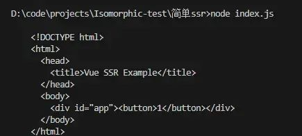

用同构渲染技术，优化项目首屏加载时间和SEO。

目前主流框架都已经提供了SSR技术，直接使用next.js（react）或nuxt.js(vue)来进行开发。


## CSR

打开一个网页应用，打开chrome控制台 - 网络面板，查看第一条html文件请求，能看到当前页面向服务器请求的html资源；如果是CSR，这个html的body中是没有什么实际内容的。打包工具将打包生成的js文件以script脚本的方式插入到html中，通过请求并执行该js文件以实现页面渲染。因为页面的渲染是在浏览器中而非服务器端进行的，所以被称为客户端渲染。

CSR的优势：

页面跳转时不需要刷新浏览器，用户体验好。

CSR的不足：

1. 在请求第一个页面的时候需要下载js并执行，直至页面渲染出来这段时间，页面会因为没有任何内容而出现白屏（尤其是js文件体积大和逻辑复杂时）。
2. 由于使用了CSR的网站，会先下载一个空的html，然后才通过js进行渲染；这个空的html会导致某些搜索引擎无法通过爬虫正确获取网站信息，从而影响网站的搜索引擎排名


## SSR

把渲染过程放在了在服务器端，服务器将渲染完毕的html以字符串的形式发送给用户即可。

SSR的优势：不存在客户端的白屏和seo问题。

SSR的不足：

1. 每次跳转页面都要向服务器重新请求，意味着用户每次切换页面都要等待一小段时间，所以用户体验方面则不如客户端。
2. SSR相比CSR会占用较多的服务器端资源。


## 同构(Isomorphic)

只要把CSR和SSR二者结合起来，就能实现理想的渲染方法，也就是同构渲染。最开始请求结果由SSR处理，将生成的html字符串返回给用户即可；但同时可以将CSR生成的JS也一并发送给用户；这样用户在接收到SSR生成的html后，页面还会再执行一次CSR的流程。


## 案例

对于SSR，vue和react都提供了renderToString函数，只要将组件传入这个函数，可以直接将组件渲染成html字符串。

> 在客户端渲染里会使用`createApp`来创建一个vue应用实例，但在同构渲染中则需要替换成`createSSRApp`。如果仍然使用原本的`createApp`，会导致首屏页面先在服务器端渲染一次，浏览器端又重复渲染一次。
>
> 而使用了`createSSRApp`，vue就会在浏览器端渲染前先进行一次检查，如果结果和服务器端渲染的结果一致，就会停止首屏的客户端渲染过程，从而避免了重复渲染的问题。

```js
import { renderToString } from 'vue/server-renderer'
import { createSSRApp } from 'vue'

// 一个计数的vue组件
function createApp() {
  // 通过createSSRApp创建一个vue实例
  return createSSRApp({
    data: () => ({ count: 1 }),
    template: `<button @click="count++">{{ count }}</button>`,
  });
}

const app = createApp();

// 通过renderToString将vue实例渲染成字符串
renderToString(app).then((html) => {
  // 将字符串插入到html模板中
  const htmlStr = `
    <!DOCTYPE html>
    <html>
      <head>
        <title>Vue SSR Example</title>
      </head>
      <body>
        <div id="app">${html}</div>
      </body>
    </html>
  `;
  console.log(htmlStr);
});
```

将上述代码拷贝进任意`.js`文件，然后执行`node xxx.js`，即可看到控制台打印出渲染好的字符串，如下:




通过服务器发送服务端渲染的html：

```js
import express from 'express'
import { renderToString } from 'vue/server-renderer'
import { createSSRApp } from 'vue'

// 一个计数的vue组件
function createApp() {
  return createSSRApp({
    data: () => ({ count: 1 }),
    template: `<button @click="count++">{{ count }}</button>`,
  });
}

// 创建一个express实例
const server = express();

// 通过express.get方法创建一个路由, 作用是当浏览器访问'/'时, 对该请求进行处理
server.get('/', (req, res) => {

  // 通过createSSRApp创建一个vue实例
  const app = createApp();
  
  // 通过renderToString将vue实例渲染成字符串
  renderToString(app).then((html) => {
    // 将字符串插入到html模板中
    const htmlStr = `
      <!DOCTYPE html>
      <html>
        <head>
          <title>Vue SSR Example</title>
        </head>
        <body>
          <div id="app">${html}</div>
        </body>
      </html>
    `;
    // 通过res.send将字符串返回给浏览器
    res.send(htmlStr);
  });
})

// 监听3000端口
server.listen(3000, () => {
  console.log('ready http://localhost:3000')
})
```


上述代码存在的问题：**如果你访问过上面的地址，就会发现页面上的按钮是点不动的。这是因为通过renderToString渲染出来的页面是完全静态的，这时候就要进行客户端激活。**


**激活客户端渲染**

激活的方法其实就是执行一遍**客户端渲染**逻辑，在vue里面就是执行`app.mount`。可以创建一个js，在里面写入客户端激活的代码，然后通过`script`标签把这个文件插入到`html模板`中，这样浏览器就会请求这个js文件了。


