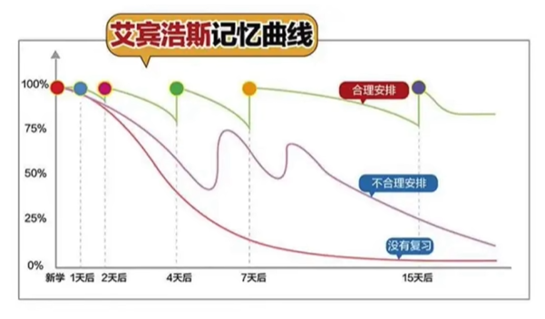
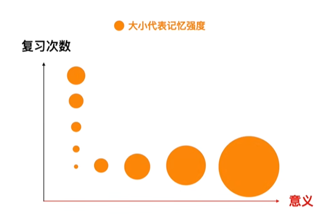
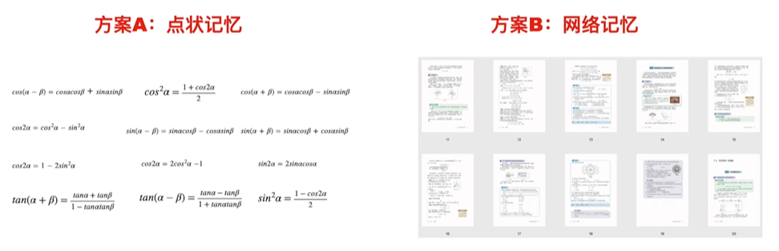

艾宾浩斯记忆曲线图，研究的是对于那些**无意义的音节的记忆规律**。

但是日常学习的知识都是普遍具有联系的，不和艾宾浩斯记忆研究的场景高度相似。

**正确的学习姿势**

学习过程中不能忽略知识点之间意义的存在。
高效学习的**前提**是看到知识点背后的意义。

如果给你一系列的三角函数数学公式和一本涉及这些公式推导过程的几十页的材料。

方案一：可以直接选择记忆这些公式，反复回忆

方案二：可以阅读那几十页的材料，理解公式之间的联系和意义，反复回忆这些材料内容，以这种方式去尝试记忆

对于点状记忆法，将每个信息当作的独立的点进行处理，这种记忆很快就遗忘。

 

