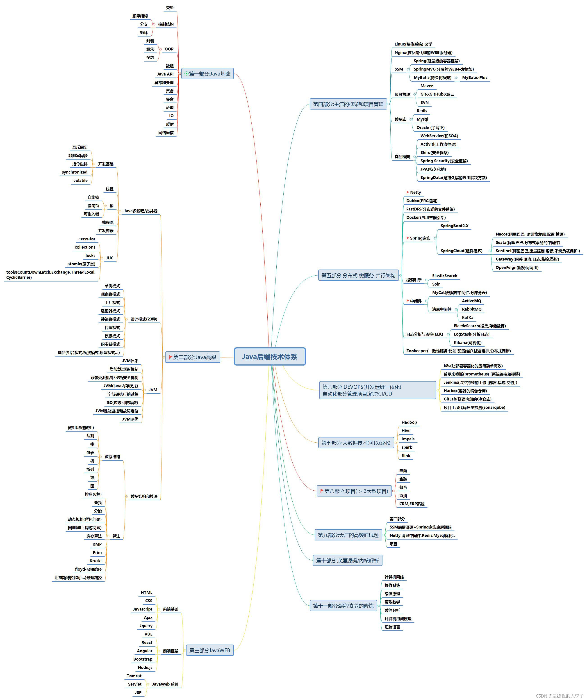

**正确的学习姿势**

学习过程中不能忽略知识点之间意义的存在。高效学习的**前提**是看到知识点背后的意义。

如果给你一系列的三角函数数学公式和一本涉及这些公式推导过程的几十页的材料。

方案一：可以直接选择记忆这些公式，反复回忆

方案二：可以阅读那几十页的材料，理解公式之间的联系和意义，反复回忆这些材料内容，以这种方式去尝试记忆

对于点状记忆法，将每个信息当作的独立的点进行处理，这种记忆很快就遗忘。

----

 

基础认知：

1. 计算机专业不是你按部就班的学习完学校的课程就能找到好工作的，甚至所有科目都考高分用处也不大。

2. 大学学的东西和实际找工作和工作中要用到的东西差别很大，有用但不一定是最重要的
3. 上课有时反而影响个人的学习，记住要的是学习而非上课
4. 对于职场人，上班有时会影响自己工作，要的是工作不是上班

方法论建议：

1. 学习一门课或者一个技术（这个技术是指完全能用于实际生产或者的技能，比如MySQL，开源框架，甚至是Linux操作系统底层）之前一定要有大局观

2. 主流编程语言有哪些，程序员有哪些具体的细分工种，每种工种需要使用的语言和其他技术都有哪些，每种主流的编程语言的主要应用场景有哪些，这些都是大局观，先有一个了解，这样也好知道从事某个工种，需要的必备必须的，工作中要用到的技能与知识（建议去招聘网站上看看各个工种的JD，其中会列出你所需要具备的技能点，然后自己通过网络或者AI去大致了解某个技术点是什么）

3. 同时注意以动态的视野来看各个工种，有一些语言可能逐渐变得弱势，而另一些语言在不断壮大（这方面B站多少会有一些视频会介绍）

4. 不要停留在一直看书和视频的阶段，当程序员一定要尽快的把程序跑起来，然后再慢慢迭代（必须注意的点）

5. 推荐哈佛大学SC50，自己去实践里面的东西（记着国内计算机教育普遍有点垃圾，需要最最主要还是看我们自己）

6. 互联网时代，世界顶尖课程都能找到（建议：学校每一门课，只要网上有，建议多考虑网上的课程，如果决定学习那门课，那直接翘课学习也完全没关系）

7. 面对学校的课，做一下老师安排的课，考试前突击一下没啥压力（博主计算机相关课程几乎从不听老师讲）

8. 有学习英文的意识，逐渐培养阅读英文原版图书的能力（英语好，未来的路和选择会宽非常非常多），学习英语能贯穿大学四年，可以慢慢培养

9. 可以考虑参加比赛（ACM-ICPC），注意要么别碰，要么all in，建议不要参加ACM的情况：

   - 学校非常强，而自己是零基础的，因为和你竞争的基本人家高中就开始卷计算机了（比不过，溜了溜了），要的是和那群人差异化竞争
   - 学校氛围差就不用考虑

   数学建模比赛，基础是算法，机器学习已经学过才去考虑数学建模

10. 必须要有项目经验（项目基本就是实际企业在做的产品），目的就一个，为了毕业进公司就能干活，具体建议：

    - 先掌握自己所选择项目开发需要的技术，比如前端典型代表就是：html，css，js，vue，react，nodejs等
    - 看技术栈的官方文档，教学视频，切记不要：**一直看书，视频而不自己敲代码，或者跟着视频写代码**。 学到了就用它来开发自己的小玩具（个人网站等）

11. 要尽早开始团队协作

    - game jam 或者 hackathon这种游戏或者软件极限开发活动
    - 去github参加开源项目，贡献代码或者修改文档（summer of code）

12. 能力差不多了就尽早开启自己的实习，千万别建议等学校叫你实习才考虑实习，哪怕学校课不上了也要去实习，尽量去多几家不同规模的公司实习（目的：尽量多体验不同规模，行业的企业）；实在走不开，远程兼职也可以

13. 力扣算法题，越早开始刷越好，也可以找工作实现前突击一下

下面的可以在自己准备求职和找实习的时候在参考：

1. 面经一定要多刷，项目如果介绍，如何根据自己的项目去引导面试官
2. 投简历要越多越好，不管大小企业，去了不管能不能上都是经验（先用烂公司练手）

## 语言

在中国的主流开发语言

- java
- golang
- python
- c
- c++
- c#
- JS，TS
- OC
- Rust
- ArkTs

**当下所有开发语言国内都很卷，对卷是持一个中性态度。**

下面讲得薪水都是一个整个行业得大多数人(学历一半，资历方面)够得着的情况，不是极端的情况。

语言之间的区别

- 使用最多的java，如果没得选或者不知道怎么选，选java就没错
- java语言相关的开发就业是最宽的（大小城市都有工作岗）
- java薪水天花板（架构师）更高，竞争激烈
- java适合业务开发首选
- 100w-200w

- Golang完全替代了PHP，很大程度上**能**替代了C和java做开发
- Golang语言因为新设计的，语言本身的机制会更优秀
- golang的劣势业务生态不及java完善
- golang也可以做后端业务开发
- golang结合云原生优势大
- 在国内golang的就业机会主要存在中国的一二线，大企业中常用，选golang一般说明你的目标是大企业
- 字节，百度大量使用golang，b站后台整体使用golang开发
- golang主要是用于开发互联网业务，很少做传统业务开发使用golang
- 70-80w

- python非专业开发者的首选语言
- 爬虫，数据分析
- 薪水整体偏低
- 自动化测试，运维
- 开发一些自动化的小工具
- 可以作为业余时开发一些产品的语言选择，但主要做python开发的话，就业面窄，不建议作为找工作的主要技术方向
- 30-40w

- C用于嵌入式，嵌入式相对容易就业，薪水低一些（入门的话，可能对比入门java或者golang的一半左右）
- 嵌入式除非深入到在硬件上写操作系统，或者进行操作系统的二次开发，这能走得长远
- 之所以说嵌入式可能发展不错，是因为考虑到中美对抗带来的计算机产业的脱钩的情况，国内替代的需求，硬件厂商的需求
- c是一门重点在写底层的开发语言，造轮子的语言，写驱动，汽车应用
- 50-60w

- C++什么都能做，C和C++是交叉的
- 不是做具体业务开发，因为开发产品的效率比其他语言低很多
- C++程序效率非常高，一般用于写引擎（poenGL，游戏引擎，图像处理，影视频处理的应用，效率要求高的应用程序）
- C++语言有难度，起薪水不错
- 即使是使用C++进行开发的各个方向，一旦切换，学习成本也是很大的，就是开发引擎和音视频处理等之间的跨度大，虽然都是用C++写
- 50-60w

- C#写起来和用起来都非常优秀的语言，但是因为是微软的产品，不开源，因为不开源，国内用的少且涉及安全而不一定敢用
- C#生态对微软平台非常依赖，在国内不怎么行，但国外非常流行
- 不建议作为主要方向
- 上位机开发用c#的比较多
- 游戏前端脚本用c#或者js比较多（cocos 2d，unity 3d）

- js和ts主攻的就是前端
- 结合nodejs也可以开发后端
- 入门相较于后端容易
- 竞争最激烈的，需要去卷源码，架构方面，算法方面的知识和能力
- 50w左右

- OC，switf等用于开发原生安卓或者苹果app的都在势微，机会越来越少

- rust很优秀，安全，写并发程序容易，但太新了，学习曲线很高

- 作为兴趣可以去了解，但不建议作为主页去研究（当下几年内看不到发生的方向）

  

- ArkTs可以算作TS的超集，在鸿蒙上用于开发

如果一个企业招聘全站工程师，自己需要小心，一般优秀的企业都会前后端分离。

全世界来说后台服务器选用的操作系统95%是linux。

不需要学习多种语言。对于程序员来说，最后的成长是需要超越技术的，回归到业务中的，让技术赋能业务。

优秀的程序员不要局限在具体的某种语言上

如果就业遇到问题，要思考是行业原因还是自己的原因，外部原因自己无法改变，所以重点还是在自己。

如果选择java深入，需要考虑两大核心：大数据量和大并发量，以这两大核心为目的去学习相关的技术栈。

大并发系列的技术点有：分布式，微服务和框架的使用，中间件的使用，缓存的使用，消息的使用，存储的使用等，最好在加上云原生的落地。

大数据量方面：从数据的处理，存储，清洗处理数据壶和数据仓库。

**需要让自己知道，我学了那些东西和技能后大概能达到一个什么样的高度和拿到什么样的薪水。（不同薪水段需要学习的内容）。对于大厂，面试也一定会涉及设计模式，算法和开源项目源码。**

 

架构师：

1. 后端架构师
2. 大数据架构师
3. 技术架构师（前两者的结合）
4. 业务架构师
5. 解决方案架构师

## 行业

行业和语言是交叉的，比如后端可以用java，golang，python等语言来开发。

从长远的角度来看，一个项目的技术负责人往往出自后端，因为后端主要管理着整个业务逻辑数据的各种流转（本质还是对业务的了解度）。

对于前端，往往是上升到前端项目的带头人，很少上升到整个整个技术部门的带头人。

随着在职场的不断向后发展，年龄的增长，转管理和转架构对于后端来说都更友好一些。

在刚入行时，一般只是一精。当自己将所在公司的业务甚至是行业了解的比较清楚后，再想带领一个团队时，这是往往需要自己建立对所开发产品使用到的技术的全景，不需要做到和专攻某一方面的专业人士一样，但需要大致了解，能不被其他方面的专业人士忽悠就行（整体是一个一精多专的状态）。

### 后端

传统的后端开发工作内容主要包括以下几个方面：

1. **服务器端逻辑设计与实现**：这是后端开发的核心工作，包括创建和维护服务器端应用程序的逻辑。这通常涉及数据库交互、后端框架的使用、API的设计和实现等。
2. **数据库管理**：后端开发者需要设计、实现和管理数据库。这涉及到数据模型的创建、数据库架构的设计、性能优化以及数据的安全性和完整性保障。
3. **服务器管理和部署**：包括配置服务器、部署应用程序以及监控服务器性能。随着云计算的普及，这也可能涉及云服务的管理和优化。
4. **API设计与开发**：设计和实现应用程序编程接口（API），以便前端应用程序能够与后端系统进行通信。
5. **安全性保障**：确保服务器和应用程序的安全，防止数据泄露、非法访问和其他安全威胁。
6. **性能优化**：分析和改进应用程序的性能，确保快速响应和高效运行。
7. **代码测试和调试**：编写测试用例和进行代码测试以确保应用程序的稳定性和可靠性，以及调试和修复代码中的错误。
8. **文档编写与维护**：编写和更新技术文档，帮助团队成员理解和使用系统。
9. **团队合作与沟通**：与项目经理、前端开发人员、设计师等其他团队成员合作，确保项目顺利进行。

Java后端开发技术栈大图：https://developer.aliyun.com/article/1106956

### 前端

浏览器中能看到的所有部分和功能都直接与前端相关。

学习路线参考：https://mp.weixin.qq.com/s/_8lvpPDArM_Z-MI9iul1AA

### AI

AI的方向的常见工种：

1. AI算法工程师，研究各种不同方向的算法（CV图形识别处理，自然语言处理，大模型，推荐算法，SLAM，语音等），这些算法一般用c++或者c
2. AI的API调用工程师 ，这类工程师就是调用上面AI算法工程师的工作成果吗，做业务应用，和其他语言的开发者薪水差异不大，调用API的一般都是java，golang，python语言

国内算法工程师的职位都在规模超大的大企业中，对学历要求高，岗位数量少，薪水起点很高。 这些团队中的带头人基本都是985博士，组员大都也是985，少量211的研究生。所以自己评估如果能达到这些情况，可以选择去卷AI。如果认为不行，建议挑选其他就业面更加宽泛的方向。

### 大数据

发展情况，薪资情况，技术栈要求

技术栈：参考https://mp.weixin.qq.com/s/dm2Qm4zZhHxEvcFgNS_mrA

大数据平台开发主要用的是java。技术栈并没有传统后端那么多或者说难学，只要用它能找到工作，基本就是大企业且金融类企业偏多，所以薪水也是很不错的（华东一带），二三线城市工作岗位很少。

岗位不算多，但是能进入这个行业薪水还是不错（50-60w）。岗位：

- 大数据挖掘，结合AI进行，商业智能和数据挖掘
- 数据开发和处理
- 大数据平台的开发（重底层技术）
- 大数据运维
- 大数据分析

行业特点：职位基本也是集中在一二线城市，公司规模大（做量化，金融的居多）。

后端开发和大数据之类的开发并不冲突，所有有些培训班会将两者融合在一起来学习。

### 测试

入行测试要学得东西会简单不少，工作内容相对容易，所以平均薪水要低一些，一般是开发的一半。

当然非常优秀的测试薪水也是非常高的，但是相对于其他工种，占比很少（比如java架构能拿50w以上的占30%-40%以上，而测试就只有3%-4%）

测试的提升方向：

- 自动化测试
- 测试管理
- 测试平台开发
- 质量控制

测试的岗位比开发岗位少。

### 运维

云原生没有出来时，运维的工作面很宽，很多企业需要运维，管理企业的数据库，硬件设备和网络，但是云原生出来后，很多运维岗位直接砍掉了，全部转为自动化运维且有开发顺带处理了。

现在的运维发展方向（前四个都需要掌握）：

- 自动化运维
- 运维开发一体化（DevOps）辅助开发（开发完后开发人员直接自己进行自动化测试，部署和上线，出问题时自动化回滚）
- 大数据运维
- 云原生运维
- 安全运维（另一个大方向）

### 游戏

进到特别优秀的游戏大厂的好的项目组中（腾讯，网易，米哈游等）挣钱很多（爆款游戏要运气），对学历要求不算高。

开发语言之前用c++多，后来变为java，golang来开发游戏的后台服务器。游戏的前端一块大都用的是游戏引擎和脚本来开发的。

### 其他

区块链，web3和元宇宙都是当下前言的方向，在海外展开业务的偏多，国内的政治环境基本决定很多东西不给你去中心化。

安全方面厉害的非常底层，直接研究操作系统底层源码漏洞这种，对技术深度要求很好。如果只浮于基础的话，行业和前端相似。

