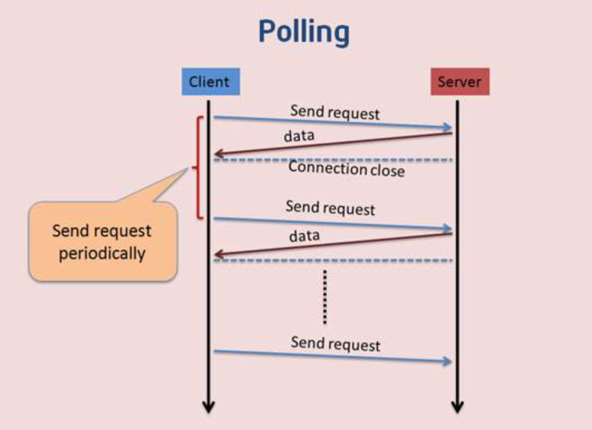

# 实时通讯

## HTTP的架构模式

Http是客户端/服务器模式中请求-响应所用的协议，在这种模式中，客户端(一般是web浏览器)向服务器提交HTTP请求，服务器响应请求的资源

### 特点

- HTTP是半双工协议，也就是说，在同一时刻数据只能单向流动，客户端向服务器发送请求(单向的)，然后服务器响应请求(单向的)
- 服务器不能主动推送数据给浏览器
- 无状态


## 双向通信

Comet是一种用于web的推送技术，能使服务器能实时地将更新的信息传送到客户端，而无须客户端发出请求，目前有三种实现方式:轮询（polling） 长轮询（long-polling）和iframe流（streaming）。


### 轮询

#### 不足

- 轮询是客户端和服务器之间会一直进行连接，每隔一段时间就询问一次
- 这种方式连接数会很多，一个接受，一个发送。而且每次发送请求都会有Http的Header，会很耗流量，也会消耗CPU的利用率





#### 代码

服务端：

```js
let express = require('express');
let app = express();
app.use(express.static(__dirname));
app.use(function(req,res,next){
    res.header('Access-Control-Allow-Origin', 'http://localhost:8000');
    res.end(new Date().toLocaleTimeString());
});
app.listen(8080);
```


客户端：

```html
<body>
  <div id="clock"></div>
  <script>
    setInterval(function () {
      let xhr = new XMLHttpRequest();
      xhr.open('GET', 'http://localhost:8080', true);
      xhr.onreadystatechange = function () {
        if (xhr.readyState == 4 && xhr.status == 200) {
          document.querySelector('#clock').innerHTML = xhr.responseText;
        }
      }
      xhr.send();
    }, 1000);
  </script>
</body>
```


### 长轮询

#### 不足

- 长轮询是对轮询的改进版，客户端发送HTTP给服务器之后，看有没有新消息，如果没有新消息，就一直等待
- 当有新消息的时候，才会返回给客户端。在某种程度上减小了网络带宽和CPU利用率等问题
- 由于http数据包的头部数据量往往很大（通常有400多个字节），但是真正被服务器需要的数据却很少（有时只有10个字节左右），这样的数据包在网络上周期性的传输，难免对网络带宽是一种浪费


```html
<body>
  <div id="clock"></div>
  <script>
    (function poll() {
      let xhr = new XMLHttpRequest();
      xhr.open('GET', 'http://localhost:8080', true);
      xhr.onreadystatechange = function () {
        if (xhr.readyState == 4 && xhr.status == 200) {
          document.querySelector('#clock').innerHTML = xhr.responseText;
          poll();
        }
      }
      xhr.send();
    })();
  </script>
</body>
```

上面的代码，当服务器超时不返回数据，则链接断开后不会再出发客户端再次发送请求。long poll 需要有很高的并发能力。


### iframe流

- 通过在HTML页面里嵌入一个隐藏的iframe,然后将这个iframe的src属性设为对一个长连接的请求,服务器端就能源源不断地往客户推送数据。


#### 代码

```js
const express = require('express');
const app = express();
app.use(express.static(__dirname));
app.get('/clock', function (req, res) {
  setInterval(function () {
    res.write(`  // 不能关闭http链接
            <script type="text/javascript">
                parent.document.getElementById('clock').innerHTML = "${new Date().toLocaleTimeString()}";
            </script>
        `);
  }, 1000);
});
app.listen(8080);
```


```htmnl
<div id="clock"></div>
<iframe src="/clock" style="display:none" />
```


`iframe`窗口的父级窗口用parent获取。

#### 不足

页面的favicon图标会一直在加载状态。


### EventSource流

- HTML5规范中提供了服务端事件EventSource，浏览器在实现了该规范的前提下创建一个EventSource连接后，便可收到服务端发送的消息，这些消息需要遵循一定的格式，对于前端开发人员而言，只需在浏览器中侦听对应的事件皆可
- SSE的简单模型是：一个客户端去从服务器端订阅一条`流`，之后服务端可以发送消息给客户端直到服务端或者客户端关闭该“流”，所以eventsource也叫作`"`server-sent-event`
- EventSource流的实现方式对客户端开发人员而言非常简单，兼容性良好
- 对于服务端，它可以兼容老的浏览器，无需upgrade为其他协议，在简单的服务端推送的场景下可以满足需求


webpack中的热更新的加载就使用到了EventSource流。

#### 代码

浏览器端

- 浏览器端，需要创建一个`EventSource`对象，并且传入一个服务端的接口URI作为参
- 默认EventSource对象通过侦听`message`事件获取服务端传来的消息
- `open`事件则在http连接建立后触发
- `error`事件会在通信错误（连接中断、服务端返回数据失败）的情况下触发
- 同时`EventSource`规范允许服务端指定自定义事件，客户端侦听该事件即可

```html
<script>
  var eventSource = new EventSource('/eventSource');
  eventSource.onmessage  = function(e){
    console.log(e.data);
  }
  eventSource.onerror  = function(err){
    console.log(err);
  }
</script>
```


服务端

- 事件流的对应MIME格式为`text/event-stream`，而且其基于HTTP长连接。针对HTTP1.1规范默认采用长连接，针对HTTP1.0的服务器需要特殊设置。

- event-source必须编码成

  ```
  utf-8
  ```

  的格式，消息的每个字段使用"\n"来做分割，并且需要下面4个规范定义好的字段：

  - Event: 事件类型
  - Data: 发送的数据
  - ID: 每一条事件流的ID
  - Retry： 告知浏览器在所有的连接丢失之后重新开启新的连接等待的时间，在自动重新连接的过程中，之前收到的最后一个事件流ID会被发送到服务端


```js
const  express = require('express');
const app = express();
app.use(express.static(__dirname));
let sendCount = 1;
app.get('/eventSource',function(req,res){
  res.header('Content-Type','text/event-stream',);
  setInterval(() => {
    res.write(`event:message\nid:${sendCount++}\ndata:${Date.now()}\n\n`);  // \n\n 表示整个消息的结束
  }, 1000)
});
app.listen(8888);
```


```js
let  express = require('express');
let app = express();
app.use(express.static(__dirname));
const SseStream = require('ssestream');
let sendCount = 1;
app.get('/eventSource',function(req,res){
  const sseStream = new SseStream(req);
  sseStream.pipe(res);
  const pusher = setInterval(() => {
    sseStream.write({
      id: sendCount++,
      event: 'message',
      retry: 20000, // 告诉客户端,如果断开连接后,20秒后再重试连接
      data: {ts: new Date().toTimeString()}
    })
  }, 1000)

  res.on('close', () => {
    clearInterval(pusher);
    sseStream.unpipe(res);
  })
});
app.listen(8888);
```


上面的方式使用的都是基于HTTP协议进行通信的。既然是HTTP协议就避免不了请求头的体积过大；有跨域问题。


## WebSocket

- [WebSockets_API](https://developer.mozilla.org/en-US/docs/Web/API/WebSockets_API) 规范定义了一个 API 用以在网页浏览器和服务器建立一个 socket 连接。通俗地讲：在客户端和服务器保有一个持久的连接，两边可以在任意时间开始发送数据。
- HTML5开始提供的一种浏览器与服务器进行全双工通讯的网络技术
- 属于应用层协议，它基于TCP传输协议，并复用HTTP的握手通道。


###  websocket 优势 

- 支持双向通信，实时性更强。
- 更好的二进制支持。
- 较少的控制开销。连接创建后，ws客户端、服务端进行数据交换时，协议控制的数据包头部较小（只有两个字节大小）。
- 可以跨域。


