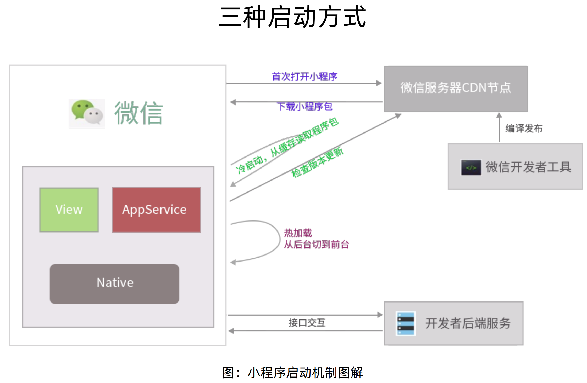

语言和技术都是为产品服务的，没有哪种技术或者语言是最好的，也不偏重于某一门语言或技术，只要在当前的时代对某些领域的产品开发是合适的，就可以去学习和使用。

1. 在实践中学习，知行合一
2. 优先学会一门语言，其他语言触类旁通
3. 不要只是看和听，必须敲代码，复原代码和运行效果

## 为什么学习小程序开发

小程序的优势：

1. 与App对比的下载安装体验
2. 与Web对比的启动和运营体验，H5页面每次打开都需要重新下载和渲染，而小程序可以从后台直接切换到前台，渲染上可以像App一样局部渲染

**学习小程序的难点**

小程序组件和接口如何使用

具体的软件中实现具体的某些功能（如：单击头像侧滑菜单如何实现，多个商品分类实现横向滚动）

## 工具、原理与实践

第一章和第九章讲授。

第一章：工具安装，项目创建，小程序的运行原理等。

第九章：补充一些第三方框架的内容，扩展学习

### 小程序运行机制

在小程序诞生之前，最成熟的混合App开发技术是Hybrid，Hybrid的优势：

1. 跨平台
2. 热更新
3. 类原生app的交互体验

Hybrid原理：

它是由native通过JSBridge等方法，提供统一的底层API，然后用html+css实现界面，JS实现业务逻辑。JS调用底层API和后端接口，最后的页面在webview中渲染展示。

在这种模式下，安卓和ios的底层API有一致性，所以可以跨平台开发。

微信小程序相当于运行在微信这个特定环境下的Hybrid技术。

#### 运行机制

微信小程序的双线程运行机制。

逻辑层和视图层分开，他们通过微信底层的WeixinJSBridge进行通信。像在小程序js代码中使用的setData，改变视图层绑定的数据，在底层其实对应执行的是evaluateJavaScript这个函数。

当视图层的交互事件触发了，由视图层向逻辑层传递事件信息时，也是通过evaluateJavaScript进行，evaluateJavaScript的参数是文本，每次调用都需要进行原始类型到文本再到原始类型的转，并且是单通道的，不像golang，c++那样的并发线程特征。所以该evaluateJavaScript方法非常慢。有时小程序页面卡顿，其实不是页面卡，大概率是底层的evaluateJavaScript函数执行效率地下导致。

从4个方面介绍小程序的运行机制和创新点。

小程序的启动机制

小程序有两种启动机制：

1. 冷启动
   用户首次打开小程序或者是小程序被微信主动销毁后再次打开，这是小程序需要重新加载并启动，这就是冷启动。
2. 热启动
   假如用户已经打开过某个小程序，一段时间内再次打开，此时不需要重新启动，只需要将后台状态的小程序切换到前台，这个过程就是热启动

小程序从本地读取缓存后，当小程序有版本更新时，什么时候可以应用最新的小程序版本？

小程序冷启动时，如果发现有新的版本，将会异步下载新版本的代码包，并同时用客户端本地缓存的上一次的小程序代码包进行启动，而新版本的小程序则在下一次冷启动时才会被使用。如果想马上使用最新版本的小程序，可以使用wx.getUpdateManager接口处理。

#### 小程序的启动情况

#### 小程序的销毁

小程序被主动销毁的情况：

1. 当小程序进入后台，在后台维持运行超过一定时间（目前大概5分钟），就会被微信主动销毁
2. 当短时间内（目前为5秒），连续两次以上收到系统内存的警告，微信就会对小程序进行一个主动销毁，这时一般会收到一条提示语：”运行内存不足，请重新打开小程序。“  单击确定后，小程序直接退出，不利于用户体验。必要时可以使用wx.onMemoryWarning接口监听内存的告警事件，提前做一些处理。

#### 小程序的状态

与小程序冷、热启动相关的，是小程序的两种状态： 

1. 前台状态 
2. 后台状态

微信为什么使用WXS这门类似JS的语言来开发

## 基础

第二章：小程序组件介绍和使用

第三章：开发常用API介绍和使用

## 项目实践

第四章：