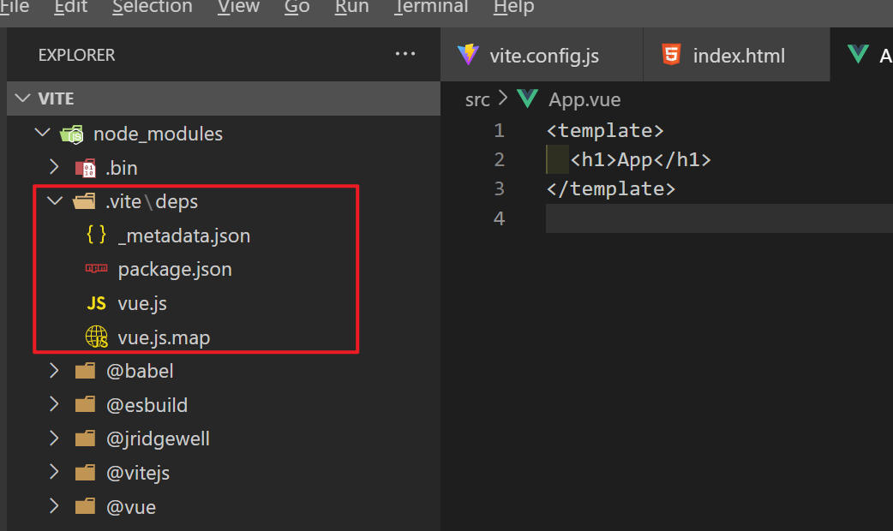
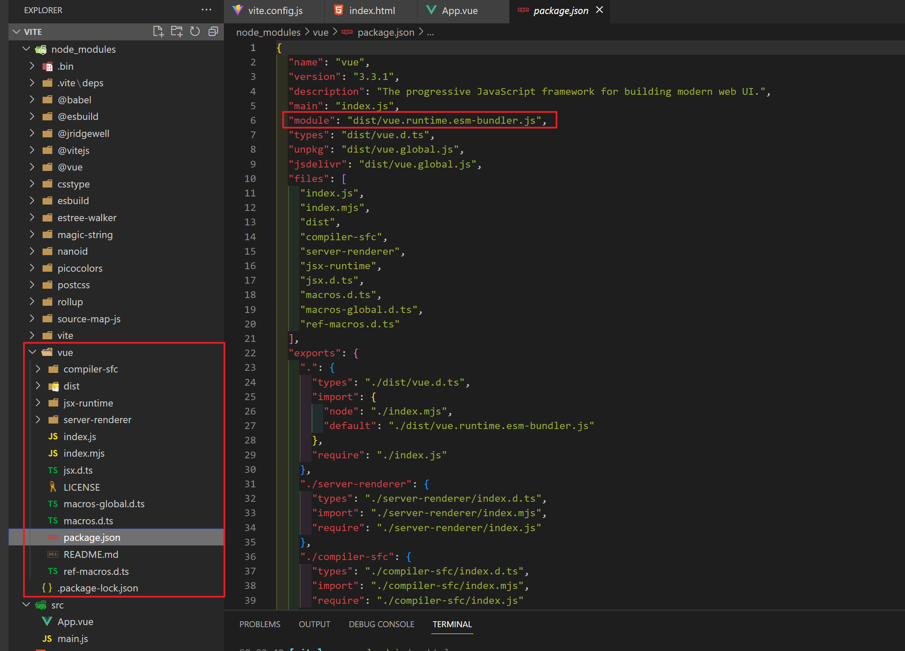
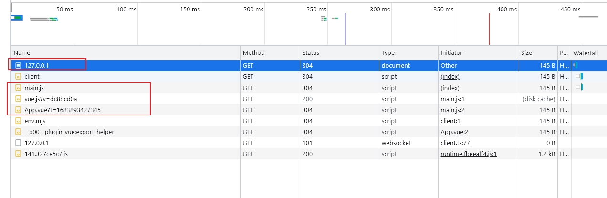
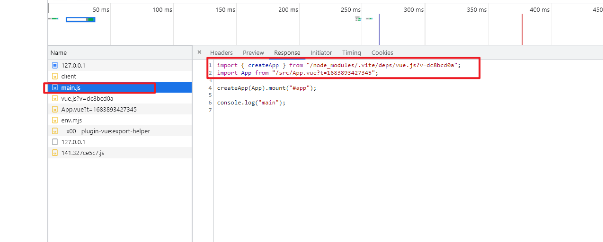
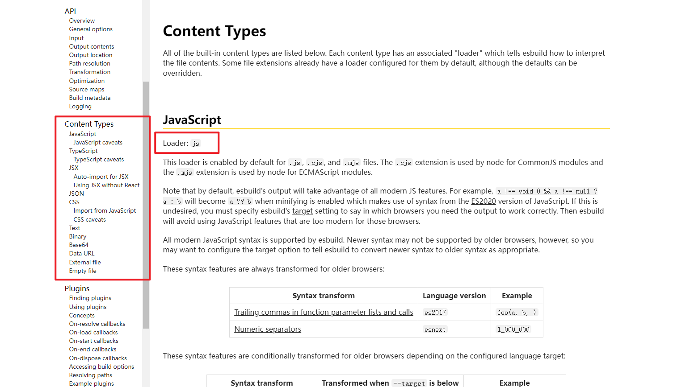
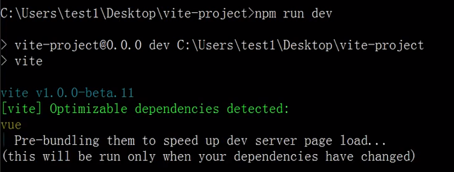
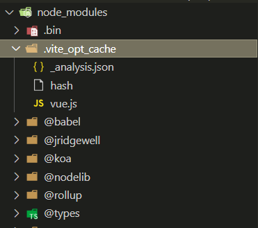
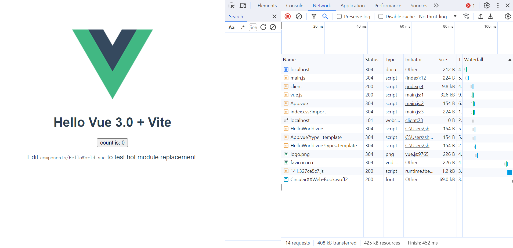
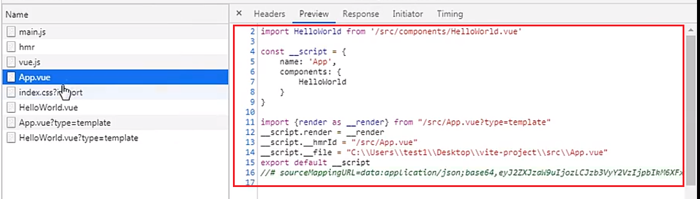

# Vite

新一代前端构建打包工具，提高开发阶段的体验。

组成：

1. 一个开发服务器，它基于 [原生 ES 模块](https://developer.mozilla.org/en-US/docs/Web/JavaScript/Guide/Modules) 提供了 [丰富的内建功能](https://vitejs.cn/vite3-cn/guide/features.html)，如极快的[模块热更新（HMR）](https://vitejs.cn/vite3-cn/guide/features.html#hot-module-replacement)。
2. 一套构建指令，它使用 [Rollup](https://rollupjs.org/) 打包代码，预设了配置的，可输出生产环境的优化过的静态资源。

“打包” : 使用工具抓取、处理并将源码模块串联成可以在浏览器中运行的文件。


打包工具的发展：

ES模块化在浏览器原生支持前后的开发方式变化

在ES模块得到原生支持之前，JavaScript没有原生的模块系统，开发者必须依赖其他方法实现模块化，比如CommonJS或AMD，或者使用IIFE来避免全局污染。后来，打包工具比如Webpack、Browserify、Rollup出现了，它们可以把这些模块打包成一个文件，解决依赖管理和浏览器兼容性问题。

ES模块之前，可能用CommonJS的require和module.exports，或者AMD的define，但浏览器不支持这些，所以必须用工具转译和打包。

在浏览器支持ES模块化之后，可以直接用import和export，实现项目的开发，但可能无法对源代码进行一系列的优化，比如打包压缩，tree-shaking，代码分割等。

为什么打包工具在浏览器支持ES模块之后仍然有用，因为完全只使用es模块化来开发项目，没法做项目优化等方面的工作，比如性能优化、兼容旧浏览器、处理非JS资源等。所以即使支持ES模块，打包工具仍有其价值，但可以简化配置。

原生 ESM 由于嵌套导入会导致额外的网络往返，在生产环境中发布未打包的 ESM 仍然效率低下（即使使用 HTTP/2）。为了在生产环境中获得最佳的加载性能，最好还是将代码进行 tree-shaking、懒加载和 chunk 分割（以获得更好的缓存），还是需要打包工具的。


**浏览器不支持 ES 模块时期的开发：**

```js
// math.js
function add(a, b) { return a + b }
function subtract(a, b) { return a - b }

// 通过立即执行函数隔离作用域
var MathUtils = (function() {
  return {
    add: add,
    subtract: subtract
  };
})();

// app.js
var result = MathUtils.add(1, 2);
console.log(result);

// 需要手动管理依赖顺序
<script src="math.js"></script>
<script src="app.js"></script>
```

或者使用commonjs模块化规范 + require的Polyfill进行开发。

```js
// math.js
exports.add = (a, b) => a + b;
exports.subtract = (a, b) => a - b;

// app.js
const math = require('./math.js');
console.log(math.add(1, 2));
```


**浏览器支持 ES 模块后:**

```js
<!-- 直接使用 type="module" -->
<script type="module">
  // math.js
  export function add(a, b) { return a + b }
  export function subtract(a, b) { return a - b }
</script>

<!-- 或更好的方式：拆分文件 -->
<!-- index.html -->
<script type="module" src="app.js"></script>

// math.js
export function add(a, b) { return a + b }

// app.js
import { add } from './math.js';
console.log(add(1, 2)); // 3
```


使用webpack做打包工具的不足：

当开始构建越来越大型的应用时，需要处理的 JavaScript 代码量也快速增长。基于 JavaScript 开发的打包工具webpack就会开始遇到性能瓶颈：通常需要很长时间才能启动开发服务器，即使使用模块热替换（HMR），文件修改后的效果也需要几秒钟才能在浏览器中反映出来。影响开发者的开发效率和幸福感。

当冷启动开发服务器时，webpack必须优先抓取并构建整个应用，然后才能提供服务。


Vite 通过在一开始将应用中的模块区分为 **依赖** 和 **源码** 两类，改进了开发服务器启动时间。

- **依赖** 大多为在开发时不会变动的纯 JavaScript。一些较大的依赖（例如有上百个模块的组件库）处理的代价也很高。依赖也通常会存在多种模块化格式（例如 ESM 或者 CommonJS）。

  Vite 将使用 [esbuild](https://esbuild.github.io/) [预构建依赖](https://vitejs.cn/vite3-cn/guide/dep-pre-bundling.html)

- **源码** 通常包含一些并非直接是 JavaScript 的文件，需要转换（例如 JSX，CSS 或者 Vue/Svelte 组件），时常会被编辑。同时，并不是所有的源码都需要同时被加载（例如基于路由拆分的代码模块）。

Vite 以 [原生 ESM](https://developer.mozilla.org/en-US/docs/Web/JavaScript/Guide/Modules) 方式提供源码。让浏览器接管了打包程序的部分工作：Vite 只需要在浏览器**请求源码时进行转换并按需提供源码**。根据情景动态导入代码，即只在当前屏幕上实际使用时才会被处理。


webpack的打包原理：


基于es模块化的vite打包原理：


----


- 简单使用
- 工作原理
- 具体实现

Vite分为两部分：

1. node服务器端
2. client客户端

执行过程，执行原理和bundless打包的设计思想。

早期的面向文件编程到模块化编程再到现在的boundless，这些方案的开发模式的转变都是基于js和浏览器技术的不断发展的。


关于vite的面试题：

1. 说一下对vite的理解，什么又是bundless？

   bundless和模块化的发展过程有关，所以模块化的发展过程可以提一下

   bundless是基于浏览器对esm规范的支持下才能发展出来的一种低打包构建方案

   

   bundless是什么？

   bundle和bundless的典型代表工具就是webpack和vite。

   bundless并不是完全不打包，而是尽量的少打包（如果一个项目的文件都是基于esmodule模块化规范的js文件，那么这个项目可以不用打包而就能在浏览器中运行起来）。

   webpack就是典型的bundle打包构建工具，它基于模块化，去递归遍历分析整个项目的所有资源模块，构建依赖图，然后基于loader和plugin对不同的资源模块进行处理后，将属于一个个chunk的模块打包最后生成一个个的输出文件。

   vite就是典型的bundless打包构建工具，它并不能完全避免不打包，能是尽量的少打包，因为现在的工程化项目中不可避免的要使用到第三方依赖库，ts，jsx，vue等这些文件并无法直接在浏览器中执行，都需要转为js代码，这个过程就免不了要编译打包。

   在vite中，开发环境下，用esbuild对各种文件进行编译打包。

   

2. vite的构建过程和实现原理？

   假设项目中有如下代码：

   ```html
   <script type='module' src='./index.js'></script>
   ```

   index.js

   ```js
   import './1.ts'  
   ```

   1.ts

   ```ts
   interface IUser {
       name:string,
       age:number
   }
   
   const user:IUser = {
       name:'asd',
       age:18
   }
   
   console.log(user)
   ```

   在开发环境下，打开浏览器访问html后，发送一个请求1.ts的请求，请求回来后，浏览器无法识别它的文件内容为有效的js文件，所以直接报错。

   为此，vite在开发环境下，自己内部创建了一个开发服务器，当通过浏览器访问各种文件时，开发服务器会监控到需要访问的文件资源，当访问的文件资源是浏览器不能直接识别的，比如访问的是ts，vue，jsx文件时，它先拦截这个请求，然后调用esbuild对这些文件进行实时的编译，然后将编译后的文件内容返回给前端，这时浏览器就能正常识别和使用的。这时请求的虽然是ts，vue，jsx等类型的文件，但是文件内容将会是合法的js代码，能被执行。

   类似开发服务器完成了如下的功能：

   针对ts文件

   

   针对css文件，还需要将其转为动态创建style标签并加入到head中的逻辑。

   

   

   在开发环境下vite还提供了一系列的优化：

   1. 编译内容的缓存
   2. 增量编译
   3. hmr

   

   在打包构建环境下，vite是使用rollup进行打包。

   

   

3. vite为什么在开发环境下使用的是esbuild，而在构建环境下使用的是rollup进行打包？

   

   在 Vite 中，开发环境下使用的是 **esbuild**，而构建环境下使用的是 **Rollup**，这是基于两种工具在不同场景下的优势和设计哲学。以下是详细原因：

   ------

   **1. 开发环境为何选择 esbuild？**

   Vite 的目标是提供极快的开发体验，因此在开发环境下，优先选择了高性能的工具 **esbuild**。**esbuild** 是一个高性能的 JavaScript 和 TypeScript 构建工具，其核心特点是速度极快。这些特点特别适合开发阶段的需求：

   **性能优先：**

   - **极快的编译速度：** esbuild 使用 Go 语言编写，性能远超基于 JavaScript 的工具。在开发环境中，编译速度是关键，esbuild 的性能可以显著加速代码的即时编译与热更新。这对于开发时频繁的文件更改、重新编译至关重要。
   - **增量更新：** esbuild 支持增量构建和热更新（HMR），可以快速反馈代码改动的效果，提升开发体验。

   **模块支持：**

   - 在开发环境中，Vite 利用浏览器原生的 [ES Module](https://developer.mozilla.org/zh-CN/docs/Web/JavaScript/Guide/Modules) 支持，而不是打包所有文件。这意味着：
     - 浏览器直接请求 `.js` 文件，Vite 只编译被请求的模块。
     - esbuild 只需要快速处理和转换这些模块，而不需要打包整个项目。

   - esbuild 原生支持 ES Modules (ESM)，这与 Vite 的开发模式完美契合。开发阶段 Vite 使用浏览器原生的 ESM 加载机制，而 **esbuild 只负责将现代语言特性快速转译为浏览器支持的代码**。

   **简单的需求：**

   - 开发阶段只需要**快速转译和依赖解析**，**不需要复杂的打包优化**（如代码拆分或压缩）。esbuild 专注于效率，可以省去开发中的很多额外步骤。

     

   ------

   **2. 构建环境为何选择 Rollup？**

   在生产环境下，代码的优化和最终的输出质量是重点，Rollup 的设计更适合满足生产环境的需求：

   **高度可定制化**

   - Rollup 是一个成熟的打包工具，提供了丰富的插件系统，可以处理多种复杂需求，例如：
     - Tree-shaking（去除未使用代码）
     - 代码分割（Code Splitting）
     - 动态导入的处理
     - 打包成不同格式（如 ES Module、CommonJS、UMD 等，在打包时可以根据目标环境输出不同格式的代码，适应各种使用场景。

   **插件生态：**

   - Rollup 有强大的插件生态，支持更丰富的功能扩展，例如代码压缩、资源内联、动态导入优化等。这些特性在生产环境中非常重要，用于优化代码性能和加载速度。

   **代码优化：**

   - 在生产环境中，Rollup 能更细致地处理模块依赖关系，进行优化（如 chunk 划分、代码分割）。这种优化可以提高最终应用的加载性能。
   - 构建环境需要进行代码压缩、静态资源优化（CSS、图片等），以及模块间的依赖打包优化。这些功能是 Rollup 的强项。

   **成熟与稳定：**

   - Rollup 是许多库和工具（如 Vue、React）的官方打包器，具有良好的兼容性和稳定性，适合生成生产级的代码。

   ------

   **对比 esbuild 和 Rollup**

   | 特性         | esbuild        | Rollup                           |
   | ------------ | -------------- | -------------------------------- |
   | **编译速度** | 极快           | 较慢                             |
   | **模块支持** | 专注于现代 ESM | 支持多种模块格式                 |
   | **代码优化** | 基础优化       | 高级优化（Tree Shaking、分块等） |
   | **插件生态** | 基础插件       | 丰富的插件生态                   |
   | **适用场景** | 开发阶段       | 生产环境                         |

   ------

   **总结：不同工具对应不同阶段的需求**

   - **开发阶段：** Vite 使用 esbuild 的主要原因是它的 **极速编译能力** 和对 ESM 的天然支持，满足开发者对快速反馈的需求。
   - **构建阶段：** Vite 选择 Rollup 因为其灵活性、插件生态以及针对生产环境的优化能力，可以生成高质量的打包产物。

   这种组合最大化地发挥了两种工具的优势，为开发者提供了流畅的开发体验和高效的生产构建方案。

   

   esbuild的其他不适合使用在生产环境的原因：

   在使用 **esbuild** 时，提到 **"dts 文件需要自行处理"** 和 **"ES5 以下不支持"**，这是因为 esbuild 的设计原则和特性对这些场景有以下限制：

   ------

   **1. dts 文件需要自行处理**

   **什么是 dts 文件？**

   - `.d.ts` 文件是 TypeScript 的类型声明文件，用于描述代码的类型信息，通常与库的构建一起分发，供开发者在使用该库时获得类型提示和类型安全。

   **为何 esbuild 不处理 `.d.ts` 文件？**

   - **核心原因：esbuild 专注于代码的快速编译和转译。**
     esbuild 的设计目标是高性能，而类型文件的生成和处理是 TypeScript 编译器的职责。生成 `.d.ts` 文件需要完整的类型检查，这是 esbuild 明确不支持的功能。
   - **esbuild 的 TypeScript 支持是"不完全的"：**
     esbuild 只负责将 TypeScript 代码中的语法（如类型注解）去除，转译为 JavaScript，而不会执行任何类型检查或生成 `.d.ts` 文件。

   **如何处理 `.d.ts` 文件？**

   - 通常需要结合 tsc（TypeScript 编译器）来生成 .d.ts 文件。典型工作流如下：

     1. 使用 `esbuild` 编译和打包代码。
     2. 使用 `tsc` 单独生成 `.d.ts` 文件。 例如，在 `package.json` 的 `scripts` 中：

     ```json
     {
       "scripts": {
         "build:js": "esbuild src/index.ts --bundle --outfile=dist/index.js",
         "build:types": "tsc --emitDeclarationOnly"
       }
     }
     ```

     执行时：

     ```bash
     npm run build:js
     npm run build:types
     ```

   ------

   **2. ES5 以下不支持了**

   **esbuild 的目标：现代构建工具**

   - **esbuild 主要支持现代 JavaScript 特性**，专注于优化现代开发环境，主要目标是 ES6（ECMAScript 2015）及更高版本。
   - 对于低于 ES5 的环境（如 IE8），支持已经被 esbuild 明确放弃。这是因为：
     1. **性能原因：** 支持旧环境会导致额外的复杂性和性能开销。
     2. **市场趋势：** 大多数现代开发者已经放弃对 ES5 以下环境的支持，因为它们的市场份额非常小。

   **具体体现：**

   - esbuild 不能将代码转译到 ES5 以下的目标（如 ES3）。如果你尝试在 esbuild

      中设置 target为 es3，会报错：

     ```bash
     error: Unsupported target environment "es3"
     ```

   - esbuild 会针对现代浏览器优化代码，不会处理低版本浏览器的兼容性问题（例如不支持 `Object.assign` 或 `Promise`）。

   **解决方案：如果需要支持 ES5 或以下版本**

   - 使用工具链配合更强大的转译器（如 Babel）：

     1. 用 `esbuild` 打包代码。

     2. 在打包后的代码上使用 Babel 转译为更低的 JavaScript 版本：

        ```bash
        esbuild src/index.ts --bundle --outfile=dist/index.js
        npx babel dist/index.js --presets=@babel/preset-env --out-file dist/index.es5.js
        ```

   ------

   **总结**

   1. **dts 文件自行处理：**

      - esbuild 不支持 `.d.ts` 文件的生成，因为其设计不包含类型检查。
      - 需要使用 TypeScript 编译器（`tsc`）来单独生成类型声明文件。

   2. **ES5 以下不支持：**

      - esbuild 不支持 ES5 以下的 JavaScript 转译，目标是现代开发环境。

      - 如果必须支持老旧环境，建议配合 Babel 等工具完成更低版本的兼容性处理。

        

4. 如果你要设计一个打包工具，你如何设计，从哪些方面去考虑？

   - 设计思想
   - 设计目标
   - 目前市面上打包构建工具的不足


原理从浅入深，架构设计，执行流程。


```html
<script type='module' src='./index.js'></script>
```

index.js

```js
import './1.js'  // 因为没有依赖打包构建工具，所以不能省略js后缀。
```

1.js

```js
import './2.js'
console.log(1)
```

2.js

```js
import './3.js'
console.log(2)
```

3.js

```js
console.log(3)
```

直接启动服务器后在浏览器中访问index.html文件，则控制会发出3个网络请求，去请求index.js，1.js，2.js，3.js这三个文件。控制的打印输出为：3，2，1。

如果在上面的代码中引入一个css文件，则会报错：


浏览器并不直接支持直接通过esm引入css等类型的文件。这就需要打包工具去处理。


让html中的script标签引入的脚本支持esm规范的化，需要加一个type='module' 同时结合web服务器的服务方式才能生效，直接通过浏览器打开html文件其中设置了type='module'的script的外部脚本的请求会发生跨域限制。


没有type='module'的script标签引入的js脚本文件中如果使用了import 或者export等语句，则会报错说不能使用这些语句。


本地开发服务器，支持热更新，基于开发服务器做编译工作。

产物构建不是依赖于打包工具，而是依赖于编译工具。

vite中为了将各种浏览器无法直接识别的文件资源统一管理，它设计了一套插件机制。

- 整个插件系统的架构
- 插件基座的设计
- 插件的执行流程


开发环境：

- 执行vite命令
- 项目初始化，读取vite.config.js配置文件
- 基于connect启动开发服务器
- 按需编译
- HMR，基于websocket
- source-maps


生产环境：

- 执行 vite build 命令
- 项目初始化，读取vite.config.js配置文件
- 分析入口
- 依赖分析
- rollup插件初始化
- 执行编译
- 资源优化
- 缓存处理
- 输出内容


## 定义

vite是下一代前端开发和构建工具，是一个**非打包开发服务器**，它做到了本地快速开发启动，实现按需编译和不再等待整个应用编译完成。vite在开发环境下使用esbuild打包，在生成环境下用rollup打包。

在开发阶段等价于开发服务器加上esbuild打包；构建阶段使用rollup打包。

非打包：即在开发环境下不需要任何打包，快速启动。

vite的特点：

1. 启动速度快，webpack启动慢是因为需要编译打包文件
1. 使用原生的ESM文件，无需打包
1. 快速的热更新（HMR）
1. 对ts，less，scss，jsx等开箱即用
1. 打包构建使用的是rollup，所以可以复用rollup插件
1. 支持ts语法提示


扩展：

> **裸模块**
>
> 裸模块（bare module）在JavaScript模块系统中指的是那些没有指定相对或绝对路径的模块导入，而是直接使用模块名称的导入方式。比如`import React from 'react'`中的`'react'`就是一个裸模块，因为它没有以`./`或`/`开头，也没有使用文件扩展名。
>
> 为什么在浏览器中直接使用裸模块会报错。
>
> 裸模块在不同环境下的处理方式。比如在Node.js中，裸模块会被解析到`node_modules`目录，而浏览器本身不支持这种解析，需要依靠打包工具如Webpack、Vite等来处理。
>
> 如何正确使用裸模块，或者遇到问题时的解决方法。比如在Vite项目中配置别名，或者使用特定的插件来处理CommonJS模块。
>
> 
>
> **JavaScript 中的裸模块（Bare Module）** 是指 **没有明确路径或协议前缀的模块导入标识符**，通常直接使用包名引用第三方依赖。这种写法常见于 Node.js 和现代前端工具链（如 Webpack、Vite 等）中，但浏览器原生 ES 模块并不直接支持裸模块。
>
> ```js
> // 裸模块写法（直接使用包名）
> import React from 'react';                // ✅ 工具链支持
> import { debounce } from 'lodash-es';     // ✅ 工具链支持
> 
> // 非裸模块写法（明确路径或协议）
> import utils from './utils.js';           // 相对路径
> import data from '/src/data.json';       // 绝对路径
> import pkg from 'https://cdn.com/pkg.js'; // URL 协议
> ```
>
> 
>
> 浏览器原生 ES 模块 **无法直接解析裸模块**：
>
> ```html
> <!-- 浏览器中直接使用会报错 -->
> <script type="module">
>   import React from 'react'; // ❌ 报错：找不到模块
> </script>
> ```
>
> 浏览器要求所有模块路径必须是 **完整 URL** 或 **相对/绝对路径**。
>
>
> Node.js 能解析裸模块，是因为它会自动搜索 `node_modules` 目录：
>
> ```js
> // Node.js 中有效（CommonJS）
> const fs = require('fs');           // 核心模块
> const React = require('react');     // node_modules 中的模块
> ```
>
>
> 现代构建工具（Webpack、Vite、Rollup 等）会将裸模块转换为浏览器可识别的路径：
>
> ```js
> import { foo } from 'my-dep';
> 
> // 转换为真实路径
> import { foo } from '/node_modules/my-dep/lib/index.js';
> ```
>
> 

### 功能

1. **NPM 依赖解析和预构建**

   原生 ES 导入不支持这样的裸模块导入：`import { someMethod } from 'my-dep'`

   上面的代码会在浏览器中抛出一个错误。Vite 将会检测到所有被加载的源文件中的此类裸模块导入，并执行以下操作:

   1. [预构建](https://vitejs.cn/vite3-cn/guide/dep-pre-bundling.html) 提高页面加载速度较少http请求次数，并将 CommonJS / UMD 转换为 ESM 格式。预构建这一步由 [esbuild](http://esbuild.github.io/) 执行，快。
   2. 重写导入语句为合法的 URL，例如 `/node_modules/.vite/deps/my-dep.js?v=f3sf2ebd` 以便浏览器能够正确导入它们。
   3. Vite 通过 HTTP 头来缓存请求得到的依赖

2. **模块热替换**

   Vite 提供了一套原生 ESM 的 [HMR API](https://vitejs.cn/vite3-cn/guide/api-hmr.html)。 具有 HMR 功能的框架可以利用该 API 提供即时、准确的更新，而无需重新加载页面或清除应用程序状态。

3. **对TypeScript支持良好**

   默认支持`.ts` 文件，Vite 仅执行 `.ts` 文件的转译工作，并 **不** 执行任何类型检查。


## 基本使用

@vitejs/plugin-vue库让vite支持vue。

```shell
mkdir vite-learn
cd vite-learn

npm init -y
npm install vue -S 
npm intall vite @vitejs/plugin-vue -D
```


 vite.config.js:

```js
import { defineConfig } from "vite";
import vue from "@vitejs/plugin-vue";

export default defineConfig({
  plugins: [vue()],
});
```


package.json:

```json
{
  "scripts": {
    "build": "vite build",
    "dev": "vite"
  }
}    
```


index.html:

```html
<!DOCTYPE html>
<html lang="en">
  <head>
    <meta charset="UTF-8" />
    <meta http-equiv="X-UA-Compatible" content="IE=edge" />
    <meta name="viewport" content="width=device-width, initial-scale=1.0" />
    <title>Document</title>
  </head>
  <body>
    <div id="app"></div>
    <script src="./src/main.js" type="module"></script>
  </body>
</html>
```


src/main.js:

```js
import { createApp } from "vue";
import App from "./App.vue";

createApp(App).mount("#app");
```


App.vue:

```vue
<template>
  <h1>App</h1>
</template>
```


简单解释一下vite的开发环境构建工作要点：

1. 当运行npm run dev后，启动一个本地项目的服务器，vite会以index.html文件为入口， 找到html中的main.js，再分析main.js文件中的依赖包(开发阶段依靠的是esbuild)，如果依赖包是第三方库，那vite会去node_modules中找到对应的库，读取里面package.json中的module字段指向的文件（如果有的话），以该文件作为来源打包（同时该文件中依赖的其他文件也会被一并打包，减少http请求数），如果没有，同时源文件是commonjs 的话，需要转为esmodule格式

2. 将上面找到的文件及其依赖整体打包放到node_modules中的.vite/deps中，名字就是对应的库的名字

   

   内部的_metadata.json中存放着原第三方依赖库的基本数据

   ```js
   {
     "hash": "6fd45ff7",
     "browserHash": "79a0c776",
     "optimized": {
       "vue": {
         "src": "../../vue/dist/vue.runtime.esm-bundler.js",  // 库的源文件地址，vue3的运行时的esm规范版本
         "file": "vue.js",
         "fileHash": "290fd2b2",
         "needsInterop": false  // 说明时esm模块文件，不需要转换即可使用，如果源文件是commonjs则就需要转为esm
       }
     },
     "chunks": {}
   }
   ```

   这个库文件——vue.runtime.esm-bundler.js是vue3的运行时的ESmodule版本文件。同时vue的源码库中的package.json中的module字段也是指向这个库文件的。如下图：

   


4. 当浏览器启动来访问本地开发服务器时，先请求index.html，再请求其中的main.js，而main.js中引用的第三方包的地址将变为node_modules/.vite/deps中对应的库文件。如下图：

   

   

> 注意：如果第三方库不支持es module，则需要进行转换后才能使用，内部进行转换。

package.json中的module字段的值一般指向的是esm模块化规范的打包文件，如果库不支持esm模块化规范，则需要考虑将cjs规范转为esm规范后才能使用。


当浏览器发起对App.vue文件的请求后，服务器会拦截对该文件的请求，并动态的对该文件源码进行编译，返回的该文件的内容其实并不是App.vue的源码文件内容，而是编译为js代码后的名字叫App.vue的文件，请求回来后，浏览器才能识别并执行。


### 静态资源引入

- [静态资源处理](https://cn.vitejs.dev/guide/assets.html)
- 服务时引入一个静态资源会返回解析后的公共路径

```js
import imgUrl from './img.png'
document.getElementById('hero-img').src = imgUrl
```

例如，`imgUrl` 在开发时会是 `/img.png`，在生产构建后会是 `/assets/img.2d8efhg.png`。行为类似于 Webpack 的 `file-loader`。区别在于导入既可以使用绝对公共路径（基于开发期间的项目根路径），也可以使用相对路径。

- `url()` 在 CSS 中的引用也以同样的方式处理。
- 如果 Vite 使用了 Vue 插件，Vue SFC 模板中的资源引用都将自动转换为导入。

```vue
<template>
  
  
</template>

<script setup>
  import imgUrl from './assets/avatar.jpg'
</script>

<style scoped>
.avatar{
  width:200px;
  height:200px;
  background-image: url(./assets/avatar.jpg);
  background-size: contain;
}
</style>
```


### public目录

如果有下列这些资源：

- 不会被源码引用（例如 `robots.txt`）
- 必须保持原有文件名（没有经过 hash）
- 或者压根不想引入该资源，只是想得到其 URL。

那么可以将该资源放在指定的 `public` 目录中，它应位于项目根目录。该目录中的资源在开发时能直接通过 `/` 根路径访问到，并且打包时会被完整复制到目标目录的根目录下。

目录默认是 `<root>/public`，但可以通过 [`publicDir` 选项](https://cn.vitejs.dev/config/shared-options.html#publicdir) 来配置。

请注意：

- 引入 `public` 中的资源永远应该使用根绝对路径 —— 举个例子，`public/icon.png` 应该在源码中被引用为 `/icon.png`。
- `public` 中的资源不应该被 JavaScript 文件引用。


### 路径别名

```diff
import { defineConfig } from 'vite'
import vue from '@vitejs/plugin-vue'
+import {resolve} from 'path';

// https://vitejs.dev/config/
export default defineConfig({
+ resolve:{
+   alias:{
+    '@':resolve('src')
+   }
+ },
  plugins: [vue()]
})
```


使用：

```diff
<template>
+ 
  
  <div class="avatar"></div>
  <HelloWorld msg="Hello Vue 3 + Vite" />
</template>

<script setup>
//https://github.com/vuejs/rfcs/blob/master/active-rfcs/0040-script-setup.md
+import HelloWorld from "@/components/HelloWorld.vue";
+import avatarUrl from "@/assets/avatar.jpg";
</script>

<style scoped>
.avatar {
  width: 200px;
  height: 200px;
+ background-image: url(@/assets/avatar.jpg);
  background-size: contain;
}
</style>
```


### 样式处理

vite自带识别css样式文件的能力，可以直接在源码中使用css即可。全局生效的样式一般在main.js中引入。

局部样式：

- 当 `<style>` 标签有 `scoped` 属性时，它的 CSS 只作用于当前组件中的元素
- 它使用了`data-v-hash`的方式来使css有了它对应模块的标识

```diff
<template>
  <h1>{{ msg }}</h1>
+  <a>超链接</a>
</template>

+<style scoped>
+a {
+  color: #42b983;
+}
+</style>
```


**CSS Modules**

外联css模块化使用：

任何以 `.module.css` 为后缀名的 CSS 文件都被认为是一个 [CSS modules 文件](https://github.com/css-modules/css-modules)。导入这样的文件会返回一个相应的模块对象：

```css
/* example.module.css */
.red {
  color: red;
}
```


```js
import classes from './example.module.css'
document.getElementById('foo').className = classes.red
```

CSS modules 行为可以通过 [`css.modules` 选项](https://cn.vitejs.dev/config/shared-options.html#css-modules) 进行配置。

如果 `css.modules.localsConvention` 设置开启了 camelCase 格式变量名转换（例如 `localsConvention: 'camelCaseOnly'`），你还可以使用按名导入。

```js
// .apply-color -> applyColor
import { applyColor } from './example.module.css'
document.getElementById('foo').className = applyColor
```


内联css模块化使用：

```diff
<template>
  <h1>{{ msg }}</h1>
+ <a :class="$style.link">超链接</a>
</template>
+<style module>
+.link {
+  color: #42b983;
+}
+</style>
```


### CSS 预处理器

Vite 也同时提供了对 `.scss`, `.sass`, `.less`, `.styl` 和 `.stylus` 文件的内置支持。没有必要为它们安装特定的 Vite 插件，但必须安装相应的预处理器依赖：

```
# .scss and .sass
npm add -D sass

# .less
npm add -D less

# .styl and .stylus
npm add -D stylus
```

如果使用的是单文件组件，可以通过 `<style lang="sass">`（或其他预处理器）自动开启。

Vite 为 Sass 和 Less 改进了 `@import` 解析，以保证 Vite 别名也能被使用。另外，`url()` 中的相对路径引用的，与根文件不同目录中的 Sass/Less 文件会自动变基以保证正确性。

由于 Stylus API 限制，`@import` 别名和 URL 变基不支持 Stylus。

你还可以通过在文件扩展名前加上 `.module` 来结合使用 CSS modules 和预处理器，例如 `style.module.scss`。


###  PostCSS

- [postcss](https://cn.vitejs.dev/guide/features.html#postcss)
- 如果项目包含有效的 PostCSS 配置 (任何受 postcss-load-config 支持的格式，例如 postcss.config.js)，它将会自动应用于所有已导入的 CSS

```
npm install autoprefixer --save
```

postcss.config.js

```js
module.exports = {
  plugins: [
      require('autoprefixer')
  ]
}
```

.browserslistrc

```js
>0.2%
not dead
not op_mini all
```

源码中直接使用即可。


### TS

```shell
cnpm install typescript @babel/core @babel/preset-env  @babel/preset-typescript --save-dev
```


.babelrc

```js
{
    "presets": [
        ["@babel/preset-env"],
        "@babel/preset-typescript"
    ]
}
```


tsconfig.json

```json
{
  "compilerOptions": {
    "target": "esnext",
    "module": "esnext",
    "moduleResolution": "node",
    "strict": true,
    "jsx": "preserve",
    "sourceMap": true,
    "resolveJsonModule": true,
    "esModuleInterop": true,
    "lib": ["esnext", "dom"]
  },
  "include": ["src/**/*.ts", "src/**/*.d.ts", "src/**/*.tsx", "src/**/*.vue"]
}
```


```vue
<template>
  <h1>{{ msg }}</h1>
  <h2>less</h2>
  <h3>sass</h3>
  <div class="postcss"></div>
  <button @click="handleClick">{{state.count}}</button>
</template>

<script setup lang="ts">
import { reactive,defineProps } from 'vue'
defineProps({
  msg:String
})
interface State {
  count:number;
}
let state = reactive<State>({count:0});
const handleClick = ()=>{
  console.log(state.count);
  state.count++;
}
</script>
```


shims-vue.d.ts

- 让typescript识别支持`.vue`文件

src\shims-vue.d.ts

```js
declare module '*.vue' {
  import { DefineComponent } from 'vue'
  const component: DefineComponent<{}, {}, any>
  export default component
}
```


vite-env.d.ts

- 如果你的库依赖于某个全局库，使用/// 指令
- 三斜线指令仅可放在包含它的文件的最顶端
- 三斜线引用告诉编译器在编译过程中要引入的额外的文件

src\vite-env.d.ts

```js
/// <reference types="vite/client" />
```


### 配置代理

- [server-proxy](https://cn.vitejs.dev/config/#server-proxy)
- 为开发服务器配置自定义代理规则
- 期望接收一个 { key: options } 对象。如果 key 值以 ^ 开头，将会被解释为 RegExp。configure 可用于访问 proxy 实例。

vite.config.js

```diff
import { defineConfig } from 'vite'
import vue from '@vitejs/plugin-vue'
import { resolve } from 'path';

// https://vitejs.dev/config/
export default defineConfig({
  resolve: {
    alias: {
      '@': resolve('src')
    }
  },
+ server: {
+   proxy: {
+     '/api': {
+       target: 'http://jsonplaceholder.typicode.com',
+       changeOrigin: true,
+       rewrite: (path) => path.replace(/^\/api/, '')
+     }
+   }
+ },
  plugins: [vue()]
})
```


```vue
<script setup>
fetch('/api/todos/1')
  .then(response => response.json())
  .then(json => console.log(json))
</script>
```


### mock

- [vite-plugin-mock](https://www.npmjs.com/package/vite-plugin-mock)

```js
npm i mockjs vite-plugin-mock -D
node ./node_modules/vite-plugin-mock/node_modules/esbuild/install.js
```

 vite.config.js

```diff
import { defineConfig } from 'vite'
import vue from '@vitejs/plugin-vue'
import { resolve } from 'path';
+import { viteMockServe } from "vite-plugin-mock";
// https://vitejs.dev/config/
export default defineConfig({
  resolve: {
    alias: {
      '@': resolve('src')
    }
  },
  server: {
    proxy: {
      '/api': {
        target: 'http://jsonplaceholder.typicode.com',
        changeOrigin: true,
        rewrite: (path) => path.replace(/^\/api/, '')
      }
    }
  },
+  plugins: [vue(),viteMockServe({})]
})
```


mock\test.ts

```js
import { MockMethod } from 'vite-plugin-mock';
export default [
    {
        url: '/api/get',
        method: 'get',
        response: ({ query }) => {
            return {
                code: 0,
                data: {
                    name: 'vben',
                },
            };
        },
    },
] as MockMethod[];
```


### ESLint

```shell
npm install eslint eslint-plugin-vue  @vue/eslint-config-typescript @typescript-eslint/parser @typescript-eslint/eslint-plugin --save-dev

```


.eslintrc.js

```js
module.exports = {
    root: true,
    env: {
        browser: true,
        es2021: true,
        node: true
    },
    extends: [
        "plugin:vue/vue3-recommended",
        "eslint:recommended",
        "@vue/typescript/recommended"
    ],
    parserOptions: {
        ecmaVersion: 2021
    },
    rules: {
       "no-unused-vars": "off",
       "@typescript-eslint/no-unused-vars": "off",
    }
}
```


.eslintignore

```js
*.css
*.jpg
*.jpeg
*.png
*.gif
*.d.ts
```


package.json

```json
{
    "scripts": {
        "dev": "vite",
        "build": "vite build",
        "serve": "vite preview",
        "lint":"eslint --ext .ts,vue src/** --no-error-on-unmatched-pattern --quiet",
        "lint:fix":"eslint --ext .ts,vue src/** --no-error-on-unmatched-pattern --fix"
    },
}
```


### Prettier

- 代码风格规则 (code-formatting rules)
  - max-len
  - no-mixed-spaces-and-tabs
  - keyword-spacing
  - comma-style
  - ...

- [eslint-plugin-prettier](https://github.com/prettier/eslint-plugin-prettier#options)

```js
npm install prettier eslint-plugin-prettier  @vue/eslint-config-prettier --save-dev
```

.eslintrc.js

```diff**
module.exports = {
  root: true,
  env: {
    browser: true,
    es2021: true,
    node: true,
  },
  extends: [
    "plugin:vue/vue3-recommended",
    "eslint:recommended",
    "@vue/typescript/recommended",
+   "@vue/prettier",
+   "@vue/prettier/@typescript-eslint",
  ],
  parserOptions: {
    ecmaVersion: 2021,
  },
  rules: {
    "no-unused-vars": "off",
    "@typescript-eslint/no-unused-vars": "off",
+   "prettier/prettier": ["error", { endOfLine: "auto" }],
  },
};
```


### 单元测试

- [next.vue-test-utils.vuejs.org](https://next.vue-test-utils.vuejs.org/)
- [vue-jest/tree/v3](https://github.com/vuejs/vue-jest/tree/v3)
- [jestjs](https://www.jestjs.cn/docs/getting-started)


```shell
npm i jest@next babel-jest@next @types/jest vue-jest@next ts-jest@next @vue/test-utils@next --save-dev
```


- [vue-jest](https://github.com/vuejs/vue-jest/tree/v3)Jest Vue transformer with source map support
- [babel-jest](https://www.npmjs.com/package/babel-jest)Babel jest plugin
- [ts-jest](https://www.npmjs.com/package/ts-jest)A Jest transformer with source map support that lets you use Jest to test projects written in TypeScript

jest.config.js

```js
module.exports = {
  testEnvironment: "jsdom",
  transform: {
    "^.+\\.vue$": "vue-jest",
    "^.+\\.jsx?$": "babel-jest",
    "^.+\\.tsx?$": "ts-jest",
  },
  moduleNameMapper: {
    "^@/(.*)$": "<rootDir>/src/$1",
  },
  testMatch: ["**/tests/**/*.spec.[jt]s"],
};
```


tests\test.ts

```js
import { mount } from '@vue/test-utils'
const MessageComponent = {
  template: '<p>{{ msg }}</p>',
  props: ['msg']
}
test('displays message', () => {
  const wrapper = mount(MessageComponent, {
    props: {
      msg: 'Hello world'
    }
  })
  expect(wrapper.text()).toContain('Hello world')
})
```


tsconfig.json

```diff
{
  "compilerOptions": {
    "target": "esnext",
    "module": "esnext",
    "moduleResolution": "node",
    "strict": true,
    "jsx": "preserve",
    "sourceMap": true,
    "resolveJsonModule": true,
    "esModuleInterop": true,
    "lib": ["esnext", "dom"],
+   "types":["vite/client","jest"],
+   "baseUrl": "./",
+   "paths": {
+     "@": ["./src"]
+   }
  },
+ "include": ["src/**/*.ts", "src/**/*.d.ts", "src/**/*.tsx", "src/**/*.vue","tests/**/*.spec.ts", "tests/test.ts"]
}
```


package.json

```diff
{
   "scripts": {
    "dev": "vite",
    "build": "vite build",
    "serve": "vite preview",
    "lint": "eslint --ext .ts,vue src/** --no-error-on-unmatched-pattern --quiet",
    "lint:fix": "eslint --ext .ts,vue src/** --no-error-on-unmatched-pattern --fix",
+   "test": "jest  --passWithNoTests"
  }
}
```


### git hook

- 可以在`git commit`之前检查代码，保证所有提交到版本库中的代码都是符合规范的
- 可以在`git push`之前执行单元测试,保证所有的提交的代码经过的单元测试
- [husky](http://www.zhufengpeixun.com/strong/html/[husky](https://www.npmjs.com/package/husky))可以让我们向项目中方便添加git hooks
- [lint-staged](https://www.npmjs.com/package/lint-staged)用于实现每次提交只检查本次提交所修改的文件
- [lint-staged#configuration](https://github.com/okonet/lint-staged#configuration)
- [Commitlint](http://www.zhufengpeixun.com/strong/html/103.16.vite.basic.html)可以规范`git commit -m ""`中的描述信息

注释规范

- commitlint 推荐我们使用 config-conventional 配置去写 commit

- 提交格式

   

  ```
  git commit -m <type>[optional scope]: <description>
  ```

  - type ：用于表明我们这次提交的改动类型，是新增了功能？还是修改了测试代码？又或者是更新了文档？
  - optional scope：一个可选的修改范围。用于标识此次提交主要涉及到代码中哪个模块
  - description：一句话描述此次提交的主要内容，做到言简意赅


type类型

| 类型     | 描述                                                   |
| :------- | :----------------------------------------------------- |
| build    | 编译相关的修改，例如发布版本、对项目构建或者依赖的改动 |
| chore    | 其他修改, 比如改变构建流程、或者增加依赖库、工具等     |
| ci       | 持续集成修改                                           |
| docs     | 文档修改                                               |
| feature  | 新特性、新功能                                         |
| fix      | 修改bug                                                |
| perf     | 优化相关，比如提升性能、体验                           |
| refactor | 代码重构                                               |
| revert   | 回滚到上一个版本                                       |
| style    | 代码格式修改                                           |
| test     | 测试用例修改                                           |


安装

```js
cnpm i husky lint-staged @commitlint/cli @commitlint/config-conventional --save-dev
```


配置脚本

- `prepare`脚本会在`npm install`(不带参数)之后自动执行
- 当我们执行npm install安装完项目依赖后会执行`husky install`命令，该命令会创建`.husky/`目录并指定该目录为`git hooks`所在的目录

```js
npm set-script prepare "husky install"
npm run prepare
```


创建hooks

```js
npx husky add .husky/pre-commit "lint-staged"
npx husky add .husky/commit-msg "npx --no-install commitlint --edit $1"
npx husky add .husky/pre-push "npm run test"
```


commitlint.config.js

```js
module.exports = {
  extends: ["@commitlint/config-conventional"],
  rules: {
    "type-enum": [
      2,
      "always",
      [
        "feature",
        "update",
        "fixbug",
        "refactor",
        "optimize",
        "style",
        "docs",
        "chore",
      ],
    ],
    "type-case": [0],
    "type-empty": [0],
    "scope-empty": [0],
    "scope-case": [0],
    "subject-full-stop": [0, "never"],
    "subject-case": [0, "never"],
    "header-max-length": [0, "always", 72],
  },
};
```


## Esbuild

vite在开发环境打包是用的Esbuild，[ESbuild](https://esbuild.github.io/api/) 是一款基于 Golang 开发的一款打包工具，相比传统的打包工具，主打性能优势，在构建速度上可以快 10~100 倍。


```shell
npm install esbuild -D
```


main.js:

```js
console.log("title");
```


esbuild.js:

```js
require("esbuild").buildSync({  // 以同步的方式编译文件
  entryPoints: ["main.js"],  // 入口文件
  outfile: "out.js",  // 打包生成文件
});
```


### esbuild内容类型

- [content-types](https://esbuild.github.io/content-types/#javascript)
- 每个类型的文件（可以理解为每种文件类型）都有一个关联的`加载器`，加载器会告诉 esbuild 如何解释文件内容。默认情况下，某些文件扩展名已经为它们配置了加载器，但是可以覆盖默认值，类似于webpack中的各种类型文件的loader。

js文件的加载器是js，ts文件的加载器是ts或者tsx，jsx文件的加载器是jsx或者tsx，json的文件用json加载，css的是css等等。




使用：

main.js

```js
let title = <h1>hello</h1>;
console.log(title);
```

默认情况下，无法识别其中的jsx语法，需要配置jsx加载器来处理。

esbuild.js

```js
require("esbuild").buildSync({
  entryPoints: ["main.js"],
  bundle: true,
  loader: { ".js": "jsx" },  // js类型的文件用jsx加载器来加载
  outfile: "out.js",
});
```


out.js：

```js
let title = /* @__PURE__ */ React.createElement('h1',null,'hello');
console.log(title);
```


### Esbuild插件

- [plugins](https://esbuild.github.io/plugins/#finding-plugins)
- [plugins](https://github.com/esbuild/community-plugins)
- 一个 esbuild 插件是一个包含 name 和 setup 函数返回的**对象**或者直接就是一个对象
- 它们以数组的形式传递给构建 API 调用，`setup`函数在每次`BUILD API`调用时都会**运行一次**，挂载好，后面使用
- 如果某个插件通过onResolve或者onLoad注册的回调并被命中，同时有具体的返回值时，其他插件的通过onResolve或者onLoad注册的回调将不再继续执行，类似于tapable库中的bailHook钩子函数（一旦有具体的返回值，后续的同类型函数就不再执行）
-  build.onLoad 过滤匹配上，执行回调，如果 onLoad 返回内容，直接会进行解析流程，不再走读取文件操作（和rollup中的load hook类似）


**插件中涉及的概念：**

**命名空间**

- 每个模块都有一个关联的命名空间。默认情况下，esbuild 默认所有解析的文件一开始都是在 file 命名空间，归属于该命名空间上的所有模块默认被认为是对应于文件系统上的真实文件的，如果该文件不存在，则后面在试图查找并读取该文件的时候会因为找不到而报错
- 但是 esbuild 也可以处理在文件系统上没有对应位置的“虚拟”模块，这时就要在插件中捕获这种类型的文件，将它放置到自定义的命名空间中，并在后续进行特定处理
- 插件可用于创建虚拟模块。虚拟模块通常使用自己的命名空间，而不是 file 。将它们与文件系统模块区分开来，通常命名空间特定于创建它们的插件
- 类似于分组，当编译一个模块的时候，属于同一个命名空间的插件才有资格被该插件的处理，默认所有的文件模块的初始命名空间都是file


**过滤器**

- 每个build上的onResolve或者onLoad工具函数的第一个对象参数中都必须提供一个正则表达式作为过滤器。当路径与其过滤器不匹配时，esbuild 使用它来跳过通过前面的工具函数注册的回调函数

- 命名空间也可用于过滤。回调必须提供过滤正则表达式，但也可以选择提供命名空间以进一步限制匹配的路径

  

```ts
interface OnResolveOptions {
  filter: RegExp;
  namespace?: string;
}
```


#### Resolve 回调

- 通过build上的工具函数——onResolve注册的回调函数将在 esbuild 解析每个模块中的每个导入语句时运行

- 回调可以自定义 esbuild 如何进行导入语句中导入的库的路径解析。例如，它可以拦截导入路径并将它们重定向到其他地方。它还可以将路径标记为外部，标记为外部模块后就不会打包到源代码中

- 回调可以返回而不提供将路径解析的责任传递给下一个回调的路径。对于给定的导入路径，通过onResolve 注册的所有插件的所有回调都将按照它们注册的顺序运行，**直到有某个回调函数解析了路径并返回**（类似于tapaable库中的bail类的钩子函数）。如果没有回调返回路径，esbuild 将运行其默认路径解析逻辑（默认解析就是去本地相对路径的位置查找并读取文件，或者去node_modules目录下查找并读取文件），找不到就报错

  

- onResolve函数的第二个参数是一个回调函数，如下的接口是esbuild调用时会传给该回调，**参数的接口类型**如下：

  ```ts
  interface OnResolveArgs {
    path: string;  // 引入的模块的名字
    importer: string;  // 引入path路径这个模块的模块的路径
    namespace: string; // 命名空间
    resolveDir: string;   
    kind: ResolveKind;
    pluginData: any;
  }
  
  type ResolveKind =
    | 'entry-point'
    | 'import-statement'
    | 'require-call'
    | 'dynamic-import'
    | 'require-resolve'
    | 'import-rule'
    | 'url-token'
  ```

- onResolve函数的的第二个参数是一个回调函数，该回调函数的**返回值的接口**如下：

  ```ts
  interface OnResolveResult {
    errors?: Message[];
    external?: boolean;  // 外部模块不做任何处理
    namespace?: string;  // 可以返回非file的自定义值，以重写命名空间
    path?: string;
    pluginData?: any;
    pluginName?: string;
    sideEffects?: boolean;
    suffix?: string;
    warnings?: Message[];
    watchDirs?: string[];
    watchFiles?: string[];
  }
  
  interface Message {
    text: string;
    location: Location | null;
    detail: any; // The original error from a JavaScript plugin, if applicable
  }
  
  interface Location {
    file: string;
    namespace: string;
    line: number; // 1-based
    column: number; // 0-based, in bytes
    length: number; // in bytes
    lineText: string;
  }
  ```

  


##### Resolve 参数

- 当 esbuild 调用由注册的回调时 onResolve，它将为这些参数提供有关导入路径的信息
- path 这是来自底层模块源代码的逐字未解析路径
- namespace 这是包含要解析的此导入的模块的名称空间


#### onLoad 回调

- 该函数的参数的值依赖于前面onResolve函数的第二个回调函数的返回值

- onLoad 将为每个未标记为外部的唯一路径/命名空间对运行添加的回调

- **它的工作是返回模块的内容并告诉 esbuild 如何解释它**

- 回调可以在不提供模块内容的情况下返回。在这种情况下，加载模块的责任被传递给下一个注册的回调。对于给定的模块，onLoad 所有插件的所有回调都将按照它们注册的顺序运行，直到有人负责加载模块。如果没有回调返回模块的内容，esbuild 将运行其默认的模块加载逻辑

- onLoad 函数的的第二个参数是一个回调函数，该回调函数的是esbuild调用时会传给该回调，参数的接口类型如下：

  ```ts
  interface OnLoadArgs {
    path: string;
    namespace: string;
    suffix: string;
    pluginData: any;
  }
  ```
  
- onLoad 函数的的第二个参数是一个回调函数，该回调函数饿返回值的接口如下：

  ```ts
  interface OnLoadResult {
    contents?: string | Uint8Array;
    errors?: Message[];
    loader?: Loader;
    pluginData?: any;
    pluginName?: string;
    resolveDir?: string;
    warnings?: Message[];
    watchDirs?: string[];
    watchFiles?: string[];
  }
  
  interface Message {
    text: string;
    location: Location | null;
    detail: any; // The original error from a JavaScript plugin, if applicable
  }
  
  interface Location {
    file: string;
    namespace: string;
    line: number; // 1-based
    column: number; // 0-based, in bytes
    length: number; // in bytes
    lineText: string;
  ```

  


##### onLoad 选项

- filter 每个回调都必须提供一个过滤器，它是一个正则表达式。当路径与此过滤器不匹配时，将跳过注册的回调
- namespace 这是可选的。如果提供，回调仅在提供的命名空间中的模块内的路径上运行


##### load 结果

- contents 将此设置为字符串以指定模块的内容。如果设置了此项，则不会针对此已解析路径运行更多加载回调。如果未设置，esbuild 将继续运行在当前回调之后注册的加载回调。然后，如果内容仍未设置，如果解析的路径在 file 命名空间中，esbuild 将默认从文件系统加载内容
- loader 这告诉 esbuild 如何解释内容。例如，js 加载器将内容解释为 JavaScript，css 加载器将内容解释为 CSS。js 如果未指定，则加载程序默认为。有关所有内置加载程序的完整列表，请参阅内容类型页面。


#### 插件示例

被打包文件：entry.js，其中引入的env模块实际并不存在，现在想实现一个插件专门去处理模块中导入env的情况，并通过插件为这个导入语句赋值一个结果。

```js
import { OS } from 'env';  // 注意这个env既不是第三方依赖也不是node原生库，也没有本地真实文件
console.log(OS);
```


启动esbuild进行打包文件：

```js
//webpack loader pitch 读文件 normal
const envPlugin = require('./envPlugin.js')

require('esbuild')
  .build({
    entryPoints: ['entry.js'],
    bundle: true,
    plugins: [envPlugin],
    outfile: 'out.js'
  }).catch((error) => console.log(error))

```

直接运行启动esbuild进行打包的文件会报错，因为entry.js中引入了env，但是实际上是没有的。


#### envPlugin插件

这个插件对env这种**虚拟模块**进行**模块拦截**

```js
let envPlugin = {
  name: 'env',//插件的名字
    
  //setup函数在每次BUILD API调用时都会运行一次
  setup(build) {
    // build类似webpack源码中的compiler对象
      
    // webpack resolveLoader rollup resolveId 它们都是在获取此模块的绝对路径
      
    // onResolve 将在 esbuild 解析的每个模块中的每个导入路径时运行
    // 在编译每个模块的时候,会用模块的路径和此回调的filter正则进行匹配,匹配上执行回调,匹配不上则跳过此回调
    // 如果不写onResolve回调,esbuild会默认去硬盘上找模块路径
    build.onResolve({ filter: /^env$/, namespace: 'file' }, ({ path,importer,namespace,resolveDir,kind,pluginData }) => {
      return {
        external: false,//是否是外部模块,如果是外部的话不处理了
        namespace: 'env-namespace',//表示此模块属于env-namespace命名空间了，重写了这个路径所属的命名空间
        //C:\aproject\webpack202208\14.vite\env.js
        path: path  // env 解析得到的路径 ,在默认情况下,如果是普通模块的话,会返回普通模块文件系统中的绝对路径
      }
    });
    /* build.onResolve({ filter: /^vue$/, namespace: 'file' }, ({ path }) => {
      return {
        external: true,
        path
      }
    }); */
      
    // 下面的这个filter是用来匹配上面onResolve函数中回调函数返回的path对应的值的。
    build.onLoad({ filter: /^env$/, namespace: 'env-namespace' }, ({ path }) => {
      return {
        contents: JSON.stringify(process.env),
        loader: 'json' // 表示上面的contents内容用json这个加载器处理
      }
    });

  }
}

//webpack loader pitch 读文件 normal
require('esbuild')
  .build({
    entryPoints: ['entry.js'],
    bundle: true,
    plugins: [envPlugin],
    outfile: 'out.js'
  }).catch((error) => console.log(error))

module.exports = envPlugin; 

/**
{
  path: 'env',//引入的模块的名字
  namespace: 'file',//命名空间的名字 ,可以用来过滤
  importer: 'C:\\aproject\\webpack202208\\14.vite\\entry.js',  //从哪里引入的,或者说是哪个模块引入的这个env
  resolveDir: 'C:\\aproject\\webpack202208\\14.vite',//根目录
  kind: 'import-statement',//导入语句
  pluginData:undefined
} 
*/
```


严格来说，如果一个项目的所有模块都是用esmodule模块化来编写的，可以完全不用esbuild进行打包就可以直接在浏览器中运行项目了（但是不支持tree-shaking了），之所以还使用esbuild进行开发打包（预编译），是为了能更好的处理第三方依赖，使用esbuild将第三方库中的所有相关的esmodule模块化的文件统一打包合并后方法node_modules/.vite/deps目录中，减少大量因为文件依赖而发起的http请求数量。同时还能处理只支持commonjs模块化语法的库，将commonjs转为esmodule。

**esbuild默认情况下就支持引入并打包第三方依赖模块（即node_modules下面的包），而rollup则不支持。**


## vite实现

```shell
npm init -y 

npm install connect es-module-lexer resolve check-is-array esbuild fast-glob fs-extra serve-static magic-string chokidar ws  hash-sum --save
```


### vite依赖的第三方模块说明

#### connect

- [connect](https://www.npmjs.com/package/connect)是一个后端服务器框架，它使用模块化组件作为中间件，以可重用的方式实现 web 程序的逻辑

- 在 Connect 中，中间件组件是一个函数，它拦截 HTTP 服务器提供的请求和响应，执行逻辑，或者结束响应，或者把它传递给下一个中间件组件

- Connect 用分配器把中间件`连接`在一起

- Express 是构建在 Connect 之上的更高层的框架

  

基本使用：

```js
const connect = require("connect");
const http = require("http");

const middlewares = connect();
middlewares.use(function (req, res, next) {
  console.log("middleware1");
  next();
});
middlewares.use(function (req, res, next) {
  console.log("middleware2");
  next();
});
middlewares.use(function (req, res, next) {
  res.end("Hello from Connect!");
});
http.createServer(middlewares).listen(3000);
```


#### serve-static

- [serve-static](https://www.npmjs.com/package/serve-static)是一个静态文件中间件，将指定的目录作为服务器的一个静态资源托管目录

基本使用：

```js
const connect = require('connect');
const static = require('serve-static');
const http = require('http');
//connect=>express=>koa
const app = connect();
app.use(static(__dirname));
http.createServer(app).listen(3000, () => console.log('3000'));
```


#### es-module-lexer

- **[es-module-lexer](https://www.npmjs.com/package/es-module-lexer)是一个 JS 模块语法解析器**，用于分析各个模块的导入导出情况。

基本使用：

```js
const { init, parse } = require("es-module-lexer");
(async () => {
  await init;
  const [imports, exports] = parse(`import _ from 'lodash';\n export var p = 5`);
  console.log(imports);
  console.log(exports);
})();
```


#### resolve

- [resolve](https://www.npmjs.com/package/resolve)实现了 node 的`require.resolve()`算法，就是得到一个文件的绝对路径的库。

基本使用：

```js
const resolve = require('resolve')
const res = resolve.sync('check-is-array', { basedir: __dirname });  // 返回该第三方模块入口文件的绝对路径
console.log(res);
//C:\aproject\webpack202208\vite50\node_modules\check-is-array\index.js
```


#### fast-glob

- [fast-glob](https://www.npmjs.com/package/fast-glob)该包提供了一些方法，用于遍历文件系统，并根据`Unix Bash shell`使用的规则返回与指定模式的定义集匹配的路径名
- 用途就是用来找文件


```js
const fg = require("fast-glob");
(async () => {
  const entries = await fg(["**/*.js"]);
  console.log(entries);
})();
```


#### magic-string

- [magic-string](https://www.npmjs.com/package/magic-string)是一个用来操作字符串的库，rollup作者写的，rollup中也在使用。


基本使用：

```js
const MagicString = require("magic-string");
const ms = new MagicString("var age = 10");
ms.overwrite(10, 12, "11");
console.log(ms.toString());
```


### 实现命令行


package.json：

```json
{
  "bin":{
    "vite":"./bin/vite.js"
  }
}
```


bin/vite.js:

```
#!/usr/bin/env node
require("../lib/cli");
```


lib/cli.js:

```js
console.log("vite3");
```


```shell
npm link 
```


扩展：

> npm link 
>
> npm rooot -g
>
> 包的链接分为两步:
>
> 1. 在一个包文件夹内执行 `npm link` 将在全局文件 **{prefix}/npm/node_modules/** 内，创建一个符号链接（symlink），这个链接指向 `npm link` 命令执行的地方。
>
> 2. 到其它目录下，执行 `npm link packageName` 命令，将会创建一个从全局安装的 **packageName** 到当前文件内的 **node_modules** 下的符号链接。
>
>    需要注意的的是， **packageName** 是取自包的 **package.json** 中 **name** 字段，不是文件夹名称。
>
>    包的名称可能有作用域前缀，如果有， **packageName** 也要对应加上。
>
> 解除 link：npm **unlink** --**no**-save **package** && npm install


### 实现http服务器

lib\cli.js

```diff
+let { createServer } = require('./server');
+(async function () {
+  const server = await createServer();
+  server.listen(9999, async () => {
+    console.log(`dev server running at: http://localhost:${9999}`);
+  });
+})();
```


lib\server\index.js

```js
const connect = require("connect");

async function createServer() {
  const middlewares = connect();
  const server = {
    async listen(port,callback) {
      require("http")
        .createServer(middlewares)
        .listen(port, callback);
    },
  };
  return server;
}

exports.createServer = createServer;
```


### 实现静态文件中间件

lib\server\index.js

```diff
const connect = require('connect');
+const serveStaticMiddleware = require('./middlewares/static');
+const resolveConfig = require('../config');
async function createServer() {
+ const config = await resolveConfig()
  const middlewares = connect();
+ middlewares.use(serveStaticMiddleware(config))
  const server = {
    async listen(port) {
      require('http').createServer(middlewares)
        .listen(port, async () => {
          console.log(`dev server running at: http://localhost:${port}`)
        })
    }
  }
  return server;
}
exports.createServer = createServer;
```


lib\server\middlewares\static.js

```js
const static = require("serve-static");
function serveStaticMiddleware({ root }) {
  return static(root);
}
module.exports = serveStaticMiddleware;
```


lib\config.js

```js
const { normalizePath } = require("./utils");
async function resolveConfig() {
  const root = normalizePath(process.cwd());
  let config = {
    root,
  };
  return config;
}
module.exports = resolveConfig;
```


lib\utils.js

```js
function normalizePath(id) {
  return id.replace(/\\/g, "/");
}
exports.normalizePath = normalizePath;
```


index.html

```html
<!DOCTYPE html>
<html lang="en">
  <head>
    <meta charset="UTF-8" />
    <meta http-equiv="X-UA-Compatible" content="IE=edge" />
    <meta name="viewport" content="width=device-width, initial-scale=1.0" />
    <title>vite2</title>
  </head>

  <body>
    <div id="app">app</div>
    <script type="module" src="/src/main.js"></script>
  </body>
</html>
```


main.js

```js
console.log("main");
```


1. 执行vite的命令行脚本启动项目时，从html的入口js文件开始，扫描整个项目（借助就是esbuild进行抽象语法树的分析查找），找到依赖的第三方模块 

2. 通过esbuild编译将这些node_modules下的第三方模块进行打包（打包后的文件都是esm模块化规范的），放到node_modules/.vite/deps目录中，并生成一个_metadata.json 文件

   以上两步叫做依赖的预构建。

3. 重写源码中第三方模块的导入路径，指向编译打包后node_modules/.vite/deps中的对应文件，比如源码中的 

   ```js
   import {createApp} from 'vue'
   // 变为
   import {createApp} from '/node_modules/.vite/deps/vue.js?v=1bb2afd1'
   ```
   
4. 客户端请求服务器的时候，服务器返回编译后的文件


### 分析第三方依赖

vite通过实现一套类似rollup的插件机制，来调用插件，也可以和rollup的插件进行兼容。

```js
function normalizePath(path) {
  //保证所有的路径路径分隔符全部是/,而非\
  return path.replace(/\\/g, '/');
}

/**
 * 创建插件的容器
 * @param  plugins 插件的数组，它的格式和rollup插件是一样的 {name,resolveId}
 * @param root 根目录
 * @return 容器对象
 */
async function createPluginContainer({ plugins }) {
  // 注册的插件（plugins）通过闭包保存着
  const container = {
    async resolveId(path, importer) {
      let resolveId = path;
      for (const plugin of plugins) {
        // 如果过某个插件对象中没有resolveId方法，则直接跳过这个插件
        if (!plugin.resolveId) continue;

        // 如果有，则执行该插件的这个resolveId方法
        const result = await plugin.resolveId.call(null, path, importer);

        // 如果这个插件的resolveId方法执行后有值返回，则不再继续执行其他插件对象中的resolveId方法，而直接返回结果
        if (result) {
          resolveId = result.id || result;
          break;
        }
      } // \ 变成 /
      return { id: normalizePath(resolveId) };
    },
    load() {},
    transform() {}
  };

  // 返回插件容器，该容器中提供了resolveId，load，transform方法，他们会分别从
  // 注册的插件对象，依顺序取出插件中对应resolveId，load或者transform方法来执行，这些方法可能没有
  // 这就是一个简单插件系统
  return container;
}
exports.createPluginContainer = createPluginContainer;
```


1. 以index.html为入口文件，扫描整个项目，找到依赖的第三方模块进行**预构建**

2. 编译这些第三方模块，放到.vite/deps目录中 

3. 重写返回的导入路径，指向编译后的文件

   main.js：

   ```js
   import { createApp } from 'vue'; 
   
   import { createApp } from '/node_modules/.vite/deps/vue.js'; 
   ```

4. 请求服务器的时候,服务器可以返回/node_modules/.vite/deps/vue.js


## Vite源码阅读思考

```js
const path = require('path');
async function resolveConfig() {
  //root指的是当前命令所在的目录，也就是根目录
  const root = process.cwd();//  __dirname
  const cacheDir = path.resolve(`node_modules/.vite`);
  const config = {
    root,
    cacheDir
  }
  return config;
}
module.exports = resolveConfig;
```

上面的源码中，会将vite命令行命令执行的当前目录作为项目的根目录——process.cwd()，同时会有一个node_modules/.vite目录作为预构建文件的缓存目录，用于存放经过esbuild打包生成的一个个的esm模块化规范文件，以提供给前端直接使用的。

lib\server\index.js：

```js
const connect = require('connect');
const serveStaticMiddleware = require('./middlewares/static');
const resolveConfig = require('../config');
const { createOptimizeDepsRun } = require('../optimizer');
async function createServer() {
  const config = await resolveConfig();
  const middlewares = connect();
  middlewares.use(serveStaticMiddleware(config));
  const server = {
    async listen(port, callback) {
      //在项目启动前进行依赖的预构建
      //1.找到本项目依赖的第三方模块
      await runOptimize(config, server);
      require('http')
        .createServer(middlewares)
        .listen(port, callback)
    }
  }
  return server;
}

async function runOptimize(config, server) {
  // 创建优化后的依赖createOptimizeDepsRun
  const optimizeDeps = await createOptimizeDepsRun(config);
  server._optimizeDepsMetadata = optimizeDeps.metadata;
}

exports.createServer = createServer;
```

上面的源码中，看到vite的源码中依赖了connect这个服务端框架，同时使用serve-static库将process.cwd()目录作为了静态文件根目录。

然后再启动服务器之前，也就是调用server对象的listen之前，首先调用了runOptimize方法，这个方法又调用了createOptimizeDepsRun方法。

optimizer/index.js：

```js
const scanImports = require('./scan');
const { build } = require('esbuild');
const fs = require('fs-extra');
const path = require('path');
const { normalizePath } = require('../utils');

/**
 * 分析项目依赖的第三方模块
 * @param {*} config 
 */
async function createOptimizeDepsRun(config) {
  //deps={ vue: 'C:/vite50use/node_modules/vue/dist/vue.runtime.esm-bundler.js'}
  const deps = await scanImports(config);
  
  // 在解析完依赖之后，接下来需要对第三方依赖进行预编译打包，放到缓存目录，并生成一个_metadata.json文件
  //cacheDir =node_modules\.vite50
  const { cacheDir } = config;
  //depsCacheDir =node_modules\.vite50\deps
  const depsCacheDir = path.resolve(cacheDir, 'deps');
  const metaDataPath = path.join(depsCacheDir, '_metadata.json');
  const metadata = {
    optimized: {}  //就是要写入_metadata.json中的那个对象
  }
  for (const id in deps) {
    const entry = deps[id];
    //内存里存的绝对路径，写入硬盘是相对路径
    const file = path.resolve(depsCacheDir, id + '.js');
    metadata.optimized[id] = {
      //C:/vite50use/node_modules/vue/dist/vue.runtime.esm-bundler.js
      src: entry,
      //C:\vite50use\node_modules\.vite\deps\vue.js
      file
    }
      
    //使用esbuild进行预编译并打包 
    await build({
      absWorkingDir: process.cwd(),
      entryPoints: [deps[id]],
      outfile: file,//打包后写入的路径
      bundle: true,
      write: true,
      format: 'esm'
    });
  }
  //写入metadata文件
  await fs.writeFile(metaDataPath, JSON.stringify(metadata, (key, value) => {
    if (key === 'file' || key === 'src') {
      return normalizePath(path.relative(depsCacheDir, value));
    }
    return value;
  }));
  return { metadata };
}
exports.createOptimizeDepsRun = createOptimizeDepsRun;
```

在createOptimizeDepsRun中，首先调用了scanImports方法

scan.js：借助esbuild对项目依赖进行扫描

```js
const { build } = require('esbuild');
const path = require('path');
const getScanPlugin = require('./getScanPlugin');
/**
 * 扫描项目中导入第三方模块
 * @param {*} config 
 */
async function scanImports(config) {
  //存放依赖导入
  const depImports = {};
  //创建一个esbuild的扫描插件
  const scanPlugin = await getScanPlugin(config, depImports);
  //刚才我们的确是把index.html进行打包了，但是它的目的是找依赖
  await build({
    absWorkingDir: config.root,//当前的工作目录
    entryPoints: [path.resolve('./index.html')],//指定编译的入口
    bundle: true,
    format: 'esm',
    outfile: './dist/bundle.js',
    write: true,//在真实的代码write=false,因为不需要写入硬盘.这里改为true是要看到打包效果
    plugins: [scanPlugin]  // 使用插件
  });
  return depImports;
}
module.exports = scanImports;
```


getScanPlugin.js：

```js
const fs = require('fs-extra');
const htmlTypesRE = /\.html$/;
const scriptModuleRE = /<script\s+type="module"\s+src\="(.+?)">/;
const { createPluginContainer } = require('../server/pluginContainer');
const resolvePlugin = require('../plugins/resolve');
const { normalizePath } = require('../utils');
/**
 * 获取esbuild扫描插件的工厂方法
 * @param {*} config 配置对象 root
 * @param {*} depImports 将用来存放导入的模块
 */
async function getScanPlugin(config, depImports) {
  const container = await createPluginContainer(
    { plugins: [resolvePlugin(config)], root: config.root }
  );
  const resolve = async function (path, importer) {
    //由插件容器进行路径解析，返回绝对路径
    return await container.resolveId(path, importer);
  }
  //rollup讲过如何写插件 {resolveId(path,importer){return 绝地路径}}
  //没有讲这个插件是如何运行的，插件机制是如何实现
  return {
    name: 'scan',//依赖扫描插件
    setup(build) {
      //如果遇到vue文件，则返回它的绝对路径，并且标识为外部依赖，不再进一步解析了
      build.onResolve({ filter: /\.vue$/ }, async ({ path: id, importer }) => {
        //把任意路径转成绝对路径 path可能是相对./index.html 绝对c:/index.html也可能是第三方 index
        const resolved = await resolve(id, importer)
        if (resolved) {
          return {
            path: resolved.id || resolved,
            external: true
          }
        }
      });
        
      //入口文件是index.html,找index.html它的真实路径，
      build.onResolve({ filter: htmlTypesRE }, async ({ path, importer }) => {
        //把任意路径转成绝对路径 path可能是相对./index.html 绝对c:/index.html也可能是第三方 index
        const resolved = await resolve(path, importer)
        if (resolved) {
          return {
            path: resolved.id || resolved,
            namespace: 'html'
          }
        }
      });
        
      build.onResolve({ filter: /.*/ }, async ({ path, importer }) => {
        //把任意路径转成绝对路径 path可能是相对./index.html 绝对c:/index.html也可能是第三方 index
        const resolved = await resolve(path, importer)
        if (resolved) {
          const id = resolved.id || resolved;//此模块的绝对路径
          if (id.includes('node_modules')) {
            depImports[path] = normalizePath(id);//key是包名，值是此包esmodule格式的入口文件的绝对路径
            return {
              path: id,
              external: true//表示这是一个外部模块，不需要进一步处理了
            }
          } else {
            return {
              path: id
            }
          }
        }
      });
        
        // 专门针对html文件的处理
      build.onLoad({ filter: htmlTypesRE, namespace: 'html' }, ({ path }) => {
        //需要把html转成JS才能进行后续的处理
        const html = fs.readFileSync(path, 'utf8');
        let [, src] = html.match(scriptModuleRE);
        let jsContent = `import ${JSON.stringify(src)}`;//import "/src/main.js"
        return {
          contents: jsContent,
          loader: 'js'  // 使用js对应的loader来加载该内容
        }
      });
    }
  }
}
module.exports = getScanPlugin;
```


### vite插件系统的实现

前面在将rollup的时候，讲解的是rollup插件的实现。 但是并没有讲解rollup底层是如何管理和调度插件的。

vite实现了一套类似rollup的插件机制，可以兼容rollup的插件。

getScanPlugin.js：

```js
const { createPluginContainer } = require('../server/pluginContainer');
const resolvePlugin = require('../plugins/resolve');  

// 创建一个插件容器
const container = await createPluginContainer(
    { plugins: [resolvePlugin(config)], root: config.root }
);

const resolve = async function (path, importer) {
    //由插件容器进行路径解析，返回绝对路径
    return await container.resolveId(path, importer);
}
```


plugins/resolve.js：

这个文件也是一个vite插件，该插件专门用于处理导入的依赖的文件路径的。

```js
const pathLib = require('path');
const resolve = require('resolve');  // 这个模块专门用于查找第三方依赖包的路径
const fs = require('fs-extra');
//既是一个vite插件也是一个rollup 插件
function resolvePlugin({ root }) {
  return {
    name: 'resolve',
    //path绝对,相对,第三方,别名
    resolveId(path, importer) {
      //如果path是一个绝对路径
      //  /src/main.js
      if (path.startsWith('/')) {//如果path以/开头，说明它是一个根目录下的绝对路径
        return { id: pathLib.resolve(root, path.slice(1)) };
      }
      if (pathLib.isAbsolute(path)) {
        return { id: path };
      }
      //如果是相对路径的话
      if (path.startsWith('.')) {
        const baseDir = importer ? pathLib.dirname(importer) : root;
        const fsPath = pathLib.resolve(baseDir, path);
        return { id: fsPath }
      }
      /* if (path.startsWith('@')) {
        const baseDir = alias['@'];
        const fsPath = pathLib.resolve(baseDir, path);
        return { id: fsPath }
      } */
      //如果是第三方的话
      let res = tryNodeResolve(path, importer, root);
      if (res) return res;
    }
  }
}
function tryNodeResolve(path, importer, root) {
  //vue/package.json
  const pkgPath = resolve.sync(`${path}/package.json`, { basedir: root });
  const pkgDir = pathLib.dirname(pkgPath);
  const pkg = JSON.parse(fs.readFileSync(pkgPath, 'utf8'));
  const entryPoint = pkg.module;//module字段指的是是es module格式的入口
  const entryPointPath = pathLib.join(pkgDir, entryPoint);
  //C:\vite50use\node_modules\vue\dist\vue.runtime.esm-bundler.js
  //现在返回的vue的es module的入口文件
  return { id: entryPointPath }
}
module.exports = resolvePlugin;
```


server/pluginContainer.js：

插件容器就是用于存放注册的插件的。

容器的属性名和暴露的钩子的名字是一样的。插件容器的resolveId方法会调用注册插件上的resolveId方法，load方法也是一样的。

```js
const { normalizePath } = require('../utils');
/**
 * 创建插件的容器
 * @param  plugins 插件的数组，它的格式和rollup插件是一样的 {name,resolveId} 
 * @param root 根目录
 * @return 容器对象
 */
async function createPluginContainer({ plugins }) {
  //插件上下文类
  class PluginContext {
    //里面有很多很多工具方法 emitFile写在插件容器里不合适
    async resolve(id, importer) {
      return await container.resolveId(id, importer);
    }
  }
    
  //容器只是用管理插件的，里面放置了很多的插件
  const container = {
    async resolveId(path, importer) {
      let resolveId = path;
      const ctx = new PluginContext();
      for (const plugin of plugins) {
        if (!plugin.resolveId) continue;
        const result = await plugin.resolveId.call(ctx, path, importer);
        if (result) {
          resolveId = result.id || result;
          break;
        }
      }// \ 变成 /
      return { id: normalizePath(resolveId) };
    },
      
    async load(id) {
      const ctx = new PluginContext();
      for (const plugin of plugins) {
        if (!plugin.load) continue;
        const result = await plugin.load.call(ctx, id);
        if (result) {
          return result;
        }
      }
      return null;
    },
      
    async transform(code, id) {
      const ctx = new PluginContext();
      for (const plugin of plugins) {
        if (!plugin.transform) continue;
        const result = await plugin.transform.call(ctx, code, id);
        if (!result) {
          continue;
        } else {
          code = result.code || result;
        }
      }
      return { code };
    }
  }
  
  return container;
}
exports.createPluginContainer = createPluginContainer;
```


### 命令行工具的源代码调试

1. 在命令行工具需要调试的地方加上断点代码

2. 用vscode打开使用命令行工具的目录

3. 点击左侧的debug，创建一个launch.json文件

   ```json
   {
     "version": "0.2.0",
     "configurations": [
       {
         "type": "node",
         "request": "launch",
         "name": "vite",
         "runtimeExecutable": "npm", // 调试使用npm执行脚本的那个程序，自动进入断点模式 
         "runtimeArgs": [
           "start"  //  npm run start
         ],
         "skipFiles": [
           "<node_internals>/**"
         ]
       }
     ]
   }
   ```

4. 在使用命令行工具的目录下的package.json文件中定义脚本命令

   ```json
     "scripts": {
       "start": "vite50"
     },
   ```

5. 通过在终端执行npm run start就可以进入断点调试源代码了


## vue插件实现

也就是@vitejs/plugin-vue插件的实现。

让源代码中支持vue类型的文件编写，能将该类型的文件转为正确的js代码。

```vue
<template>
	<h1>app</h1>
</template>

<script>
export default {
   name:'app'
}
</script>
```


经过插件编译后得到的结果：

```js
const _sfc_main = {
  name: 'app'
}

import { openBlock as _openBlock, createElementBlock as _createElementBlock } from "/node_modules/.vite/deps/vue.js?v=0ccbdf11"

function _sfc_render(_ctx, _cache) {
  return (_openBlock(), _createElementBlock("h1", null, "app"))
}

_sfc_main.render = _sfc_render;

export default _sfc_main;

//每个vue组件文件最终返回的其实是这样的一段JS代码
// vue文件中的template部分被编译为了一个render函数，并最后挂载到组件对应的对象的render属性上。
```


## 热更新

**手动** HMR API 主要用于框架和工具作者。作为最终用户，HMR 可能已经在特定于框架的启动器模板中处理过了。

Vite 通过特殊的 `import.meta.hot` 对象暴露手动 HMR API。

```ts
interface ImportMeta {
  readonly hot?: ViteHotContext
}

type ModuleNamespace = Record<string, any> & {
  [Symbol.toStringTag]: 'Module'
}

interface ViteHotContext {
  readonly data: any

  accept(): void
  accept(cb: (mod: ModuleNamespace | undefined) => void): void
  accept(dep: string, cb: (mod: ModuleNamespace | undefined) => void): void
  accept(
    deps: readonly string[],
    cb: (mods: Array<ModuleNamespace | undefined>) => void,
  ): void

  dispose(cb: (data: any) => void): void
  prune(cb: (data: any) => void): void
  invalidate(message?: string): void

  // `InferCustomEventPayload` provides types for built-in Vite events
  on<T extends string>(
    event: T,
    cb: (payload: InferCustomEventPayload<T>) => void,
  ): void
  off<T extends string>(
    event: T,
    cb: (payload: InferCustomEventPayload<T>) => void,
  ): void
  send<T extends string>(event: T, data?: InferCustomEventPayload<T>): void
}
```


当服务器端检查到本地有文件发生改变，会通过websocket向浏览器发送更新消息。

当一个模块发生变化的时候，会向上通知，如果有一个模块能够接收自己的改变，那么就到此为止，让此接收的模块执行回调，处理更新；如果一直向上通知，没有任何一个模块能接收，直接刷新浏览器。（类似冒泡）


建立websocket服务器


### import.meta

`import.meta`是一个给 JavaScript 模块暴露特定上下文的元数据属性的对象。它包含了这个模块的信息，比如说这个模块的 URL。

`import.meta`通常情况下`"import."`是作为一个属性访问的上下文，但是在这里**`"import"`不是一个真正的对象**。

`import.meta`对象是由 ECMAScript 实现的，它带有一个[`null`](https://developer.mozilla.org/zh-CN/docs/Web/JavaScript/Reference/Operators/null)的原型对象。这个对象可以扩展，并且它的属性都是可写，可配置和可枚举的。

**示例**

```html
<script type="module" src="my-module.mjs"></script>
```

my-module.mjs：

```js
console.log(import.meta); // { url: "file:///home/user/my-module.mjs" }
```

它返回一个带有`url`属性的对象，指明模块的基本 URL。也可以是外部脚本的 URL，还可以是内联脚本所属文档的 URL。

url 也可能包含参数或者哈希（比如后缀`?`或`#`）。


## 另一次课的内容

什么是vite，为什么会有vite，vite原理，它和webpack的关系。

vite是一个基于Vue3的单文件组件的**非打包开发服务器**，它做到了本地快速开发启动，实现按需编译和不再等待整个应用编译完成。vite在开发环境下使用esbuild打包，在生成环境下用rollup打包。

非打包：即在开发环境下不需要任何打包，快速启动。

### 基本使用

```shell
npm install create-vite-app -g

create-vite-app projectName
cd projectName
npm install 
npm run dev

npm init vite-app projectName
cd projectName
npm install 
npm run dev
```

 第一次启动项目时，vite会进行一次优化：

```shell
PS C:\Users\shuyi\Desktop\projectName> npm run dev

> projectName@0.0.0 dev
> vite

[vite] Optimizable dependencies detected:
vue

  Dev server running at:
  > Network:  http://192.168.110.67:3000/
  > Local:    http://localhost:3000/
```




优化依赖，在node_modules目录下生成一个.vite_opt_cache目录用于放优化文件。




访问本地启动的项目时，查看网络面板，他会把首屏需要用到所有资源都去请求回来，他会请求回来一些浏览器没有办法直接识别的文件，比如.vue结尾的文件，但是如果点开这些文件，可以看到该vue文件中的内容并不是典型的.vue单文件内容了，而是已经被后台编译过的，浏览器可以直接识别的文件内容了。







源码中的main.js文件：

```js
import { createApp } from 'vue'
import App from './App.vue'

createApp(App).mount('#app')
```

本地服务器请求回来的main.js的内容：

```js
import { createApp } from '/@modules/vue.js'
import App from '/src/App.vue'

createApp(App).mount('#app')
```

区别是在vue改为了 /@modules/vue.js。


源码中的App.vue文件：

```vue
<template>
<div>{{count}}</div>
<button @click="handleAdd">+1</button>
</template>

<script>
  import {reactive,toRefs} from 'vue'
  export default {
    name: 'App',
    setup(){
      let state = reactive({count:0})

      function handleAdd(){
        state.count++
      }

      return {
        ...toRefs(state),
        handleAdd
      }
    }
  }
</script>

```


本地服务器请求回来的App.vue的内容：

```js
import {reactive, toRefs} from '/@modules/vue.js'
const __script = {
    name: 'App',
    setup() {
        let state = reactive({
            count: 0
        })

        function handleAdd() {
            state.count++
        }

        return {
            ...toRefs(state),
            handleAdd
        }
    }
}

import {render as __render} from "/src/App.vue?type=template"
__script.render = __render
__script.__hmrId = "/src/App.vue"
typeof __VUE_HMR_RUNTIME__ !== 'undefined' && __VUE_HMR_RUNTIME__.createRecord(__script.__hmrId, __script)
__script.__file = "C:\\Users\\shuyi\\Desktop\\projectName\\src\\App.vue"
export default __script
//# sourceMappingURL=data:application/json;base64,eyJ2ZXJzaW9uIjozLCJzb3VyY2VzIjpbIkM6XFxVc2Vyc1xcc2h1eWlcXERlc2t0b3BcXHByb2plY3ROYW1lXFxzcmNcXEFwcC52dWUiXSwibmFtZXMiOltdLCJtYXBwaW5ncyI6IjtBQU1BLENBQUMsQ0FBQyxDQUFDLENBQUMsQ0FBQyxFQUFFLENBQUMsQ0FBQyxDQUFDLENBQUMsQ0FBQyxDQUFDLENBQUMsQ0FBQyxDQUFDLENBQUMsQ0FBQyxDQUFDLENBQUMsQ0FBQyxDQUFDLENBQUMsRUFBRSxDQUFDLENBQUMsQ0FBQyxFQUFFLENBQUMsQ0FBQyxDQUFDLENBQUM7QUFDbEMsQ0FBQyxDQUFDLENBQUMsQ0FBQyxDQUFDLEVBQUUsQ0FBQyxDQUFDLENBQUMsQ0FBQyxDQUFDLENBQUMsRUFBRTtFQUNiLENBQUMsQ0FBQyxDQUFDLENBQUMsRUFBRSxDQUFDLENBQUMsQ0FBQyxDQUFDLENBQUM7RUFDWCxDQUFDLENBQUMsQ0FBQyxDQUFDLENBQUMsQ0FBQyxDQUFDO0lBQ0wsQ0FBQyxDQUFDLEVBQUUsQ0FBQyxDQUFDLENBQUMsQ0FBQyxFQUFFLEVBQUUsQ0FBQyxDQUFDLENBQUMsQ0FBQyxDQUFDLENBQUMsQ0FBQyxDQUFDLENBQUMsQ0FBQyxDQUFDLENBQUMsQ0FBQyxDQUFDLENBQUMsQ0FBQyxDQUFDLENBQUM7O0lBRTlCLENBQUMsQ0FBQyxDQUFDLENBQUMsQ0FBQyxDQUFDLENBQUMsRUFBRSxDQUFDLENBQUMsQ0FBQyxDQUFDLENBQUMsQ0FBQyxDQUFDLENBQUMsQ0FBQyxDQUFDLENBQUM7TUFDbEIsQ0FBQyxDQUFDLENBQUMsQ0FBQyxDQUFDLENBQUMsQ0FBQyxDQUFDLENBQUMsQ0FBQyxDQUFDLENBQUM7SUFDZDs7SUFFQSxDQUFDLENBQUMsQ0FBQyxDQUFDLENBQUMsRUFBRTtNQUNMLENBQUMsQ0FBQyxDQUFDLENBQUMsQ0FBQyxDQUFDLENBQUMsQ0FBQyxDQUFDLENBQUMsQ0FBQyxDQUFDLENBQUMsQ0FBQyxDQUFDLENBQUM7TUFDaEIsQ0FBQyxDQUFDLENBQUMsQ0FBQyxDQUFDLENBQUMsQ0FBQyxDQUFDO0lBQ1Y7RUFDRjtBQUNGIiwiZmlsZSI6IkM6L1VzZXJzL3NodXlpL0Rlc2t0b3AvcHJvamVjdE5hbWUvc3JjL0FwcC52dWUiLCJzb3VyY2VSb290IjoiIiwic291cmNlc0NvbnRlbnQiOlsiPHRlbXBsYXRlPlxuICA8ZGl2Pnt7Y291bnR9fTwvZGl2PlxuICA8YnV0dG9uIEBjbGljaz1cImhhbmRsZUFkZFwiPisxPC9idXR0b24+XG48L3RlbXBsYXRlPlxuXG48c2NyaXB0PlxuaW1wb3J0IHtyZWFjdGl2ZSx0b1JlZnN9IGZyb20gJ3Z1ZSdcbmV4cG9ydCBkZWZhdWx0IHtcbiAgbmFtZTogJ0FwcCcsXG4gIHNldHVwKCl7XG4gICAgbGV0IHN0YXRlID0gcmVhY3RpdmUoe2NvdW50OjB9KVxuXG4gICAgZnVuY3Rpb24gaGFuZGxlQWRkKCl7XG4gICAgICBzdGF0ZS5jb3VudCsrXG4gICAgfVxuXG4gICAgcmV0dXJuIHtcbiAgICAgIC4uLnRvUmVmcyhzdGF0ZSksXG4gICAgICBoYW5kbGVBZGRcbiAgICB9XG4gIH1cbn1cbjwvc2NyaXB0PlxuIl19

```


1. 使用的esmodule模块化规范，每一个import都会发起一个网络请求
2. 在后端将main.js 中的内容进行改写操作 ，将所有不带`./ ..//`的 全部增加一个/@modules
3. 将vue文件中的模板变为了render函数（是在后端完成的，前端直接请求回来的是可以识别的js内容）


