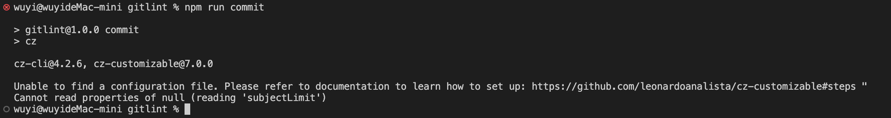
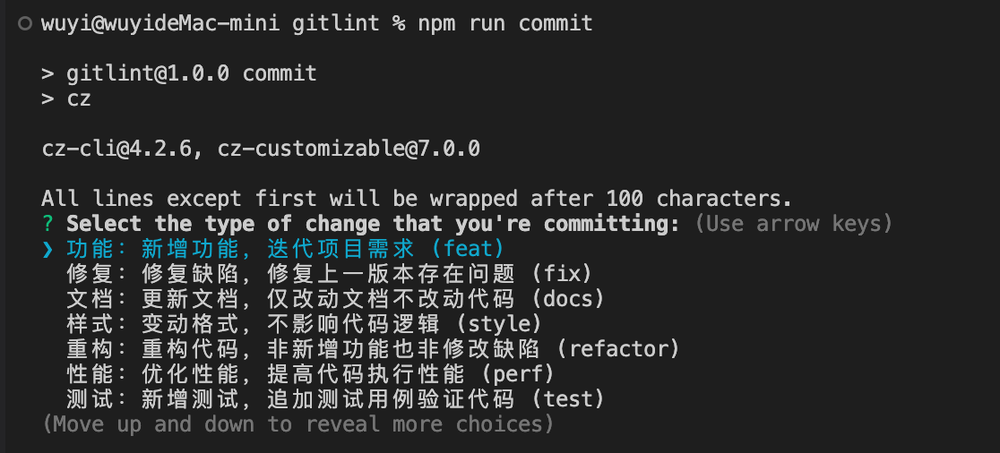
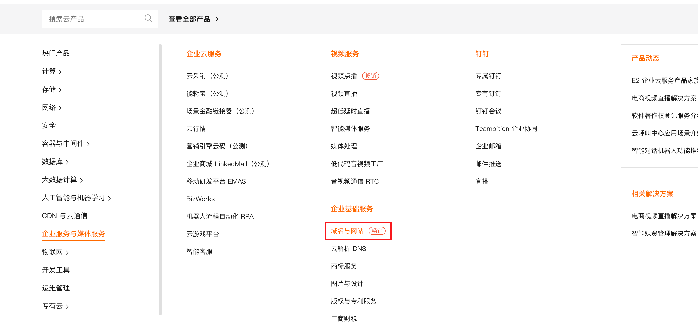
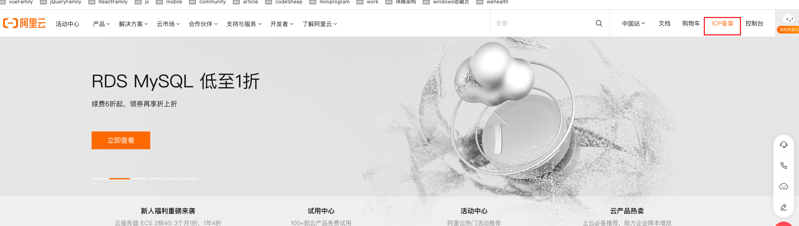

# 前端工程化

根据自身业务设计出一套符合当前业务需求的前端架构。


定义：指对前端开发过程中使用到的技术、工具、流程、经验、方案等指标**标准化**。
特点：**模块化、组件化、规范化、自动化**，也就是需要从这几个方面考虑前端工程化工作。


未做好前端工程化的项目常遇到的问题：

- 项目的构建工具的配置文件混乱，低效
- 缺少公共组件，工具函数等代码片段，**每次新建立的项目针对需要复用的代码都只能复制粘贴**
- 多人开发时，代码风格各不相同，且还能将这些不同风格的代码提交到代码仓库
- 前端开发中的使用的开发环境，项目依赖各不相同，没有团队协作规范和项目文档

`前端工程化`不是某个具体的工具，而是**对项目的整体架构与整体规划，使开发者能在未来可判时间内动态规划发展走向，以提升整个项目对用户的服务周期**。

学习前端工程化**需要清楚一个项目的完整流程**，还能根据自身知识储备制定一些可扩展流程，甚至预见项目的未来发展方向。


- 明确前后端任务分离的能力，判断一个任务属于前端还是后端，划分好前后端的职责更利于`前端工程化`的接入。
- 掌握**模块化**、**组件化**、**规范化**和**自动化**，知道它们如何实现，各自标准是什么。


前端工程化的典型应用：`脚手架`、`组件库`、`工具库`、`多包仓库`、`私有仓库`、`接口系统`、`文档系统`、`监控系统`、`CI/CD`、`可移植容器`等。让项目从手动处理流程替换为自动处理流程，以解放团队双手，让其他成员更专注于自身业务需求。


1. 规范：熟悉模块化规范，代码规范和提交规范，通过规范约束开发，统一风格
2. 服务：掌握整体部署与工具配置，学会独立上线应用与服务（部署服务环境）
3. 环境：独立搭建一个`接口服务`，实践`环境/镜像/数据/进程`四种`Node`应用方式（部署开发环境）
4. 构建：学习打包构建工具，打包类库模块，独立封装一个`类库模块`，结合`测试用例`保障代码的质量
5. 组织：熟悉`Monorepo模式`管理多包仓库，独立维护一个`多包仓库`，结合`Npm Scope`发布模块到公共仓库
6.  部署：熟悉`自动化工具`部署前端项目，独立打造一个`私有仓库`与`文档站点`，结合`CI/CD`在提交代码时自动部署到公网


**模块化着重在文件层面对代码与资源实现拆分与组装（将一个大文件拆分为互相依赖的小文件，再统一拼装与加载），组件化着重在功能层面对交互与设计实现拆分与组装**。

模块化：指将一个前端项目按照一般规范，划分文件夹和文件（文件夹和文件的命名也有一个规范），对内实现数据私有化，对外暴露接口与其它模块通信。

Web项目目录结构的划分参考（没有包含工具链配置文件）：

```txt
project
├─ dist          # 输出目录
│  ├─ prod         # 生产环境执行代码
│  └─ test         # 测试环境执行代码
├─ src           # 源码目录
│  ├─ apis         # 接口模块：包括全局接口请求的功能，控制数据定向转换
│  ├─ assets       # 资源模块：包括样式、脚本、字体、图像、音频、视频等资源文件
│  ├─ components   # 组件模块：包括全局通用的基础组件、皮肤主题和字体图标
│  ├─ layouts      # 布局模块：包括以布局为最小粒度的组件集合
│  ├─ flows        # 流程模块：包括以流程为最小粒度的组件集合，通常是一些弹窗类型的业务模块
│  ├─ pages        # 页面模块：包括以页面为最小粒度的组件集合
│  ├─ routes       # 路由模块：包括全局页面跳转的功能，控制页面自由切换
│  ├─ stores       # 数据模块：包括全局数据状态的功能，控制数据驱动视图
│  ├─ views        # 视图模块：包括以视图为最小粒度的组件集合，由至少一个基础组件组成
│  ├─ utils        # 工具模块：包括全局通用的常量与方法
│  ├─ index.html   # 模板入口文件
│  ├─ index.js     # 脚本入口文件
│  └─ index.scss   # 样式入口文件
└─ package.json
```

**视图与页面的区别：一个页面对应一个URL，但是可以在一个页面内多换多个视图，而还是同一个URL，所以一个页面可包含多个视图，一个页面只对应一个URL，但多个视图可对应一个URL，这些视图只能通过页面的不同状态展示或隐藏。**


node后端项目目录结构的划分参考（没有包含工具链配置文件）：

```txt
project
├─ dist          # 输出目录
│  ├─ prod         # 生产环境执行代码
│  └─ test         # 测试环境执行代码
├─ src           # 源码目录
│  ├─ assets       # 资源模块：包括样式、脚本、字体、图像、音频、视频等资源文件
│  ├─ models       # 模型模块：包括全局数据模型的功能
│  ├─ routes       # 路由模块：包括全局接口请求的功能
│  ├─ utils        # 工具模块：包括全局通用的常量与方法
│  └─ index.js     # 脚本入口文件
└─ package.json
```


组件化：将一个具备通用交互功能的设计UI划分为一个独立的模板、样式和逻辑组成的功能单元，对内管理内部状态满足交互需求，对外提供属性接口扩展用户需求。实现代码的复用性。**高内聚低耦合**，`组件化`利于`单元测试`的进行。

组件化的考量点：

- 将设计图划分为最小组件层级
- 使用预设规范创建组件静态版本
- 确定组件内部最小且完整的状态的表示、存放方式
- 实现数据流的正向传递与反向传递


规范化：将一系列预设规范接入工程各个阶段，通过各项指标标准化开发者的工作流程。


自动化：将一系列繁琐重复的工作流程交由程序根据预设脚本自动处理，无需人工参与。常见`自动化`场景包括但不限于`自动化构建`、`自动化测试`、`自动化打包`、`自动化发布`和`自动化部署`、`持续集成`、`持续交付`和`持续部署`。

以`自动化构建`为例，又可将其划分为以下子任务，这些子任务分布在`自动化构建`不同阶段，在不同阶段的最佳时刻会调用相关工具处理相关流程。

| 任务           | 职责          |
| -------------- | ------------- |
| **Stylelint**  | 校验样式代码  |
| **Eslint**     | 校验脚本代码  |
| **Postcss**    | Postcss → CSS |
| **Sass**       | SASS → CSS    |
| **Less**       | LESS → CSS    |
| **Babel**      | ES6 → ES5     |
| **TypeScript** | TS → JS       |


前端工程化的思考方向：	

- **前后分离**：前端应自成体系且与后端分离，包括但不限于**规范、服务、环境、构建、组织和部署**方面
- **技术选型**：不能以一个框架满足所有业务场景，需制定多套框架解决方案
- **重构封装**：新生技术不断涌现就要避免完全的重构，重复需求不断出现就要封装
- **工程设计**：解决方案要合理分层且互相独立，随时应对各种变化，任何一层可低成本被替换与淘汰

前端工程化得清楚当前流程的所有步骤以及使用何种工具互相搭配与配置完成针对流程的处理。


前端工程化常涉及的环境和工具，每个流程涉及至少一种环境或一种工具。


## 部署Node的ESM开发环境

一般在node中使用的是commonjs模块化规范。web开发一般使用es module模块化规范。

需要解决的问题：`Node`无法直接使用`ESM`编码。

在实际开发中，**一个模块就是一个文件**。javascript模块化方案：


`同步加载`包括`IIFE`与`CJS`，`异步加载`包括`AMD`、`CMD`和`ESM`。浏览器可兼容`IIFE`与`AMD`，服务器可兼容`CJS`，浏览器与服务器都兼容`CMD`、`UMD`和`ESM`。


CJS`与`ESM比较：

| -            | **CJS**                                             | **ESM**                                         |
| ------------ | --------------------------------------------------- | ----------------------------------------------- |
| **语法类型** | 动态                                                | 静态                                            |
| **关键声明** | `require`,`module.exports`                          | `export`与`import`                              |
| **加载方式** | 运行时加载                                          | 编译时加载                                      |
| **加载行为** | 同步加载                                            | 异步加载                                        |
| **书写位置** | 任何位置                                            | 顶层位置                                        |
| **指针指向** | `this`指向`当前模块`                                | `this`指向`undefined`                           |
| **执行顺序** | 首次引用时`加载模块` 再次引用时`读取缓存`           | 引用时生成`只读引用` 执行时才是正式取值         |
| **属性引用** | 基本类型属于`赋值不共享` 引用类型属于`浅拷贝且共享` | 所有类型属于`动态只读引用`                      |
| **属性改动** | 工作空间可修改引用的值                              | 工作空间不可修改引用的值 但可通过引用的方法修改 |


- **运行时加载**指整体加载模块生成一个对象，再从对象中获取所需的属性方法去加载。最大特性是`全部加载`，只有运行时才能得到该对象，无法在编译时做静态优化。
- **编译时加载**指直接从模块中获取所需的属性方法去加载。最大特性是`按需加载`，在编译时就完成模块加载，效率比其他方案高，无法引用模块本身(`本身不是对象`)，但可拓展`JS`高级语法(`宏与类型校验`)。

**ESM不能直接在Node环境中使用。**


### 高版本Node支持ESM模块方案

`2017年10月31日`，`Node`发布了`v8.9.0`，从此只要在命令中加上`--experimental-modules`，`Node`就可象征性地支持`ESM`。

```shell
node --experimental-modules index.js
```

`低版本 Node`依然无法直接支持`ESM`解析，需要借助babel将对代码进行编译。生成polyfill才能兼容ES Module。

`Node`发布了`v13.2.0`，正式取消`--experimental-modules`启动参数。在原有基础上实现对`ESM`的实验性支持并默认启动。


Node中支持ESM：

- 使用type指定模块方案
  - 在`package.json`中指定`type`为`commonjs`（或者不写），则使用`CJS`
  - 在`package.json`中指定`type`为`module`，则使用`ESM`
- 使用--input-type指定入口文件的模块方案，与type一样
  - 命令中加上`--input-type=commonjs`，则使用`CJS`
  - 命令中加上`--input-type=module`，则使用`ESM`
- 支持新文件后缀.cjs
  - 文件后缀使用`.cjs`，则使用`CJS`
- 支持新文件后缀.mjs
  
  - 文件后缀使用`.mjs`，则使用`ES Modules`
- 使用--es-module-specifier-resolution指定文件名称引用方式
  - 命令中加上`--es-module-specifier-resolution=explicit`，则引用模块时必须使用文件后缀(`默认`)
  - 命令中加上`--es-module-specifier-resolution=node`，则引用模块时无需使用文件后缀
- 使用main根据type指定模块方案加载文件
  - 在`package.json`中指定`mian`后会根据`type`指定模块方案加载文件
  
  

`Node`要求使用`ESM`的模块化规范的文件采用`.mjs`后缀，只要文件中存在`import/export命令`就必须使用`.mjs`后缀。若不希望修改文件后缀，可在`package.json`中指定`type`为`module`。基于此，若其他文件使用`CJS`，就需将其文件后缀改成`.cjs`。若在`package.json`中未指定`type`或指定`type`为`commonjs`，则以`.js`为后缀的文件会被解析为`CJS`。

简而言之，`mjs文件`使用`ESM`解析，`cjs文件`使用`CJS`解析，`js文件`使用基于`package.json`指定的`type`解析(`type=commonjs`使用`CJS`，`type=module`使用`ESM`)。


`Node v13.2.0`在默认情况下，会启动对`ESM`的实验支持，无需在命令中加上`--experimental-modules`参数。那`Node`是如何区分`CJS`与`ESM`？简而言之，`Node`会将以下情况视为`ESM`。

-  文件后缀为`.mjs`
-  文件后缀为`.js`且在`package.json`中指定`type`为`module`
-  命令中加上`--eval cmd`


### commonjs和ESM的不同

直接在node中使用ES6的模块化语法会直接报错。

例子：

```js
 // 01.js
 import a from "./02";
 console.log(a)
 
 // 02.js
 let a = { a: 1 };
 export default a;
```


在node中使用es6模块化规范的解决方法：

1. 在项目的package.json文件中指定type为module，则开启使用ESM；默认不写和指定type为commonjs，则都是使用CJS模块化规范； 当指定了type字段后，如果被引用的文件没有加文件类型后缀，会报错。


    

​	高版本Node在默认情况下，对import命令的文件后缀存在强制性，因此import "./02"并不等于import ./02.js。其次CJS的自动后缀处理行为可通过--es-module-specifier-resolution=node开启，但模块主入口并不会受到ESM的影响，例如import Path from "path"照样可正常运行。在命令中加上--es-module-specifier-resolution=node就能解决显示文件名称的问题。

```shell
node --es-module-specifier-resolution=node 01.js
```

2. 当不指定package.json文件中指定type为module，则需要采用.mjs作为文件的类型后缀；

**在node中使用es6模块化语法的其他问题： ES6模块化不再提供Node某些特性，不能灵活引用json文件，dirname、 filename、require、module和exports这几个特性将无法使用。**

解决方法：

-   **filename与**dirname可用import.meta对象重建
-   require、module和exports可用import与export代替
    -   json文件的引用可用Fs模块的readFileSync与JSON.parse()代替


```js
 import { readFileSync } from "fs";
 import { dirname } from "path";
 import { fileURLToPath } from "url";
 
 const __filename = fileURLToPath(import.meta.url);
 const __dirname = dirname(__filename);
 console.log(__filename, __dirname);
 
 const json = readFileSync("./info.json");
 const info = JSON.parse(json);
```


扩展：

> `import.meta`是一个给 JavaScript 模块暴露特定上下文的元数据属性的对象。它包含了这个模块的信息，比如说这个模块的 URL。
>
> `import.meta`对象由一个关键字`"import"`,一个点符号和一个`meta`属性名组成。通常情况下`"import."`是作为一个属性访问的上下文，但是在这里`"import"`不是一个真正的对象。
>
> `import.meta`对象是由 ECMAScript 实现的，它带有一个[`null`](https://developer.mozilla.org/zh-CN/docs/Web/JavaScript/Reference/Operators/null)的原型对象。这个对象可以扩展，并且它的属性都是可写，可配置和可枚举的。
>
> 示例：
>
> ```
> <script type="module" src="my-module.mjs"></script>
> 可以通过 import.meta 对象获取这个模块的元数据信息。
> console.log(import.meta); // { url: "file:///home/user/my-module.mjs" }
> ```

[import.meta](https://developer.mozilla.org/zh-CN/docs/Web/JavaScript/Reference/Operators/import.meta)


CJS的循环依赖关系已通过缓存各个模块的module.exports对象解决，但ESM用了所谓的绑定。简而言之，ESM模块不会导出值而是变量。

-   导入引用模块可访问该引用但无法修改它。

```js
 // 01.js
 import a, {b}from "./02.js";
 
 b = 2
 console.log(a)
 
 // 02.js
 let a = { a: 1 };
 
 export let b = 1
 export default a;
```


-   导出引用模块可为引用该模块的模块重新分配值且该值由导入引用模块使用

```js
 // 01.js
 import a, {b}from "./02.js";
 setInterval(()=>{
     console.log(b,'01.js');  
 },1000)
 console.log(a)
 
 // 02.js
 let a = { a: 1 };
 export let b = 1
 setInterval(()=>{b+=1},1000)
 export default a;
```


-   在CJS中， 导出的如果是基本数据类型的变量，则导出的是值，如果导出的是引用类型的变量，则导出的是引用值的内存地址；允许在任何时间点将引用分配给模块的module.exports对象，让这些改动仅部分反映在其他模块。

```js
 //  04.js
 let b = 1
 
 setInterval(()=>{
     b+=1
 },1000)
 
 module.exports  = { b }
 
 // 03.js
 let b = require('./04')
 
 setInterval(()=>{
     console.log(b)
 },1000)
```


```js
 // 03.js
 let b = require('./04')
 
 setInterval(()=>{
     b.b = b.b+1
 },1000)
 
 // 04.js
 let b = 1
 
 setInterval(()=>{
     console.log(b)
     console.log(module.exports,'module.exports');
 },1000)
 
 module.exports  = { b }
```


### 通用的Node支持ESM模块化方案

在node中使用第三方模块时，可能很多第三方模块都使用CJS编码，因为同时使用require与export/import会报错，所以单个模块可能无法切换到ESM。 **使用babel将代码从ESM转换为CJS**，使用babel编译ESM代码是低版本Node支持ESM最稳定的方案。 在Node v8.9.0前的版本无法使用--experimental-modules支持ESM，也就需babel解决该问题。 **当然在任何版本中，babel都能让新语法转换为与旧环境兼容的代码，因此在高版本Node中也同样适用。**

```
 npm i @babel/cli @babel/core @babel/node @babel/preset-env -D
```

-   @babel/cli：提供支持@babel/core的命令运行环境
-   @babel/core：提供转译函数
-   @babel/node：提供支持ESM的命令运行环境
-   @babel/preset-env：提供预设语法转换集成环境

安装完毕，在package.json中指定babel相关配置，node xxx.js替换为babel-node xxx.js。

该方案无需在package.json中指定engines，毕竟其目的还是将代码的模块方案从ESM转换为CJS。若需兼容更低版本Node，可在package.json中指定babel的targets。

```json
{
	"babel": {
		"presets": [
			["@babel/preset-env", { "targets": { "node": "8.0.0" } }]
		]
	}
}
```


## 代码规范

用于约束团队成员的`编码规范`与`编码风格`。使用代码校验工具（Lint）和格式化工具实现代码规范，检测代码中的错误或漏洞，根据提供的修复方案格式化出正确代码，让代码更严谨。

**部署VSCode的代码格式化**

Lint是编辑器中运行的一个脚本进程，将代码解析为`抽象语法树`，遍历`抽象语法树`并通过预设规则做一些判断与改动，再将新的`抽象语法树`转换为规范的代码（可阅读`babel源码`或`eslint源码`了解抽象语法树工作原理）。

`代码规范`适合使用`一次部署全局运行`的方式处理，不用为每个项目重复的复制粘贴配置`Lint`。若使用该方案，能将所有项目的`stylelint/eslint/tslint/prettier`相关依赖与配置文件全部删除，使项目结构变得简洁。


注意点：

- `Tslint官方`已废弃`tslint`，改用`eslint`代替其所有校验功能
- `eslint`部分配置与`prettier`部分配置存在冲突且互相影响，为了保障格式化性能就放弃接入`prettier`

`VSCode`只需安装`Stylelint`与`Eslint`两个插件。这两个插件集成了各自的依赖包。

```shell
# stylelint及其依赖
npm i stylelint stylelint-config-standard stylelint-order postcss-html postcss-scss postcss-less
```


```shell
# eslint及其依赖
npm i @babel/core @babel/eslint-parser @babel/preset-react eslint eslint-config-standard eslint-plugin-html eslint-plugin-import eslint-plugin-n eslint-plugin-promise eslint-plugin-react eslint-plugin-react-hooks eslint-plugin-vue vue-eslint-parser
```


```shell
# typescript-eslint及其依赖
npm i -D @typescript-eslint/eslint-plugin @typescript-eslint/parser typescript eslint-config-standard-with-typescript
```


**CSS类型**有`html/css/scss/less/vue文件`

**JS类型**有`html/js/ts/jsx/tsx/vue文件`。

`Stylelint`的配置文件可同时校验`html/css/scss/less/vue文件`

`Eslint`需配置不同文件分别校验`html/js/ts/jsx/tsx/vue文件`。

两个插件可在`settings.json`中通过指定字段覆盖默认配置。settings.json是VSCode的配置文件，用户可通过插件暴露的字段自定义编辑器功能。

因为配置文件太多不好管理，可以将这些配置文件整合起来，原作者封装了一个[@yangzw/bruce-std](https://link.juejin.cn/?target=https%3A%2F%2Fgithub.com%2FJowayYoung%2Fbruce%2Ftree%2Fmain%2Fpackages%2Fstd)。这样就能跳过上述的依赖安装，执行以下命令安装`@yangzw/bruce-std`。


项目中的文件说明：

- stylelint文件夹
  - [stylelintrc.js](https://link.juejin.cn/?target=https%3A%2F%2Fgithub.com%2FJowayYoung%2Fbruce%2Fblob%2Fmain%2Fpackages%2Fstd%2Fstylelint%2Fstylelintrc.js)：校验`html/css/scss/less/vue文件`
- **eslint文件夹**：校验`html/js/jsx/vue文件`
  -  [eslintrc.js](https://link.juejin.cn/?target=https%3A%2F%2Fgithub.com%2FJowayYoung%2Fbruce%2Fblob%2Fmain%2Fpackages%2Fstd%2Feslint%2Feslintrc.js)：校验`html/js文件`
  -  [eslintrc.react.js](https://link.juejin.cn/?target=https%3A%2F%2Fgithub.com%2FJowayYoung%2Fbruce%2Fblob%2Fmain%2Fpackages%2Fstd%2Feslint%2Feslintrc.react.js)：校验`html/jsx文件`
  -  [eslintrc.vue.js](https://link.juejin.cn/?target=https%3A%2F%2Fgithub.com%2FJowayYoung%2Fbruce%2Fblob%2Fmain%2Fpackages%2Fstd%2Feslint%2Feslintrc.vue.js)：校验`html/vue文件`
- **tslint文件夹**：校验`html/ts/tsx/vue文件`(`tslint`已弃用，使用`eslint`代替)
  -  [tsconfig.json](https://link.juejin.cn/?target=https%3A%2F%2Fgithub.com%2FJowayYoung%2Fbruce%2Fblob%2Fmain%2Fpackages%2Fstd%2Ftslint%2Ftsconfig.json)：配置`TypeScript`
  -  [tslintrc.js](https://link.juejin.cn/?target=https%3A%2F%2Fgithub.com%2FJowayYoung%2Fbruce%2Fblob%2Fmain%2Fpackages%2Fstd%2Ftslint%2Ftslintrc.js)：校验`html/ts文件`
  -  [tslintrc.react.js](https://link.juejin.cn/?target=https%3A%2F%2Fgithub.com%2FJowayYoung%2Fbruce%2Fblob%2Fmain%2Fpackages%2Fstd%2Ftslint%2Ftslintrc.react.js)：校验`html/tsx文件`
  -  [tslintrc.vue.js](https://link.juejin.cn/?target=https%3A%2F%2Fgithub.com%2FJowayYoung%2Fbruce%2Fblob%2Fmain%2Fpackages%2Fstd%2Ftslint%2Ftslintrc.vue.js)：校验`html/vue文件`

配置文件中的`rules`可根据自身`编码规范`与`编码风格`适当调整。推荐使用`@yangzw/bruce-std`默认规则，若校验规则不喜欢可自行调整。

- 配置`Stylelint`可查看[Stylelint规则](https://link.juejin.cn/?target=https%3A%2F%2Fstylelint.io%2Fuser-guide%2Frules%2Flist)
- 配置`Eslint`可查看[Eslint规则](https://link.juejin.cn/?target=https%3A%2F%2Feslint.org%2Fdocs%2Frules)
- 配置`TypeScriptEslint`可查看[TypeScriptEslint规则](https://link.juejin.cn/?target=https%3A%2F%2Fgithub.com%2Ftypescript-eslint%2Ftypescript-eslint%2Fblob%2Fmaster%2Fpackages%2Feslint-plugin%2FREADME.md)
- 配置`VueEslint`可查看[VueEslint规则](https://link.juejin.cn/?target=https%3A%2F%2Feslint.vuejs.org%2Frules)


文件 → 首选项 → 设置，设置中可选用户或工作区.

- **用户**：配置生效后会作用于全局项目(`若很多项目都是单一的React应用或Vue应用推荐使用全局配置`)
- **工作区**：配置生效后只会作用于当前打开项目

设置setting.json文件：

```json
{
	// 默认自定义配置
	"css.validate": false,
	"less.validate": false,
	"scss.validate": false,
	"editor.codeActionsOnSave": {
		"source.fixAll.eslint": true,
		"source.fixAll.stylelint": true
	},
	// 扩展自定义配置
	"eslint.nodePath": "path/@yangzw/bruce-std/node_modules",
	"eslint.options": {
		"overrideConfigFile": "path/@yangzw/bruce-std/eslint/eslintrc.js" // 可变❗
	},
	"stylelint.configBasedir": "path/@yangzw/bruce-std",
	"stylelint.configFile": "path/@yangzw/bruce-std/stylelint/stylelintrc.js",
	"stylelint.customSyntax": "postcss-scss", // 可变❗
	"stylelint.stylelintPath": "path/@yangzw/bruce-std/node_modules/stylelint",
	"stylelint.validate": ["html", "css", "scss", "less", "vue"]
}
```

上述配置的`path`为`@yangzw/bruce-std`模块所在的**Npm根目录**，可执行`npm config get prefix`获取**Npm根目录**并替换`path`。Mac系统下注意有差异。

 

上述安装行为使用了`Npm`，那`settings.json`的`eslint.packageManager`必须配置为`npm`(小写)，但最新版本`Eslint`已默认此项，所以无需配置。若执行`yarn global add @yangzw/bruce-std`，那必须在`settings.json`中加入以下内容。

后续遇到的工程化问题也可借鉴本节思路，将一些具备全局特征的配置分离出来统一管理，利用`模块化`的特性分离部分构建代码以减少项目结构的复杂度，使得项目更具条理性。

本节就是一件事： **中心化管理配置文件, 易于维护和管理 ,且所有项目都使用统一的配置，而无需单独配置。**


## 部署Git的提交格式化

使用git管理项目版本。每次提交都必须书写`Commit Message`。规范的`Message`能帮助别人`Review` ，还能有效地输出`Changelog`，甚至对项目的`Quality`都有很大提升。在日常开发中经常遇到一些不规范的提交说明，例如中英文混合使用、各种不规范的英文单词等。这让`Review`这些提交说明时会经常搞不清它们到底是干什么的，导致后续代码维护成本。

准备一套项目的`Git`提交说明的`规范化模板`。


### 提交的message规范

不规范的提交说明：

无法快速得知项目有何变化，从这样的提交说明中是无法获取任何有效信息的。


解决办法：

直接利用市面上已成熟的`提交规范`，例如**Angular提交规范**。


Angular提交规范的格式：

`Angular提交规范`的格式包括`Header`、`Body`和`Footer`三个内容。`Header`为必填项，`Body`与`Footer`为可缺省项，这些内容通过以下结构组成一个完整的提交格式。

```
<type>(<scope>): <subject>    <header>
# 空一行
<body>
# 空一行
<footer>
```


**Header**

仅书写一行，包括三个字段，分别是`type`、`scope`和`subject`。

- **type**：用于说明`commit`的提交类型，必选
- **scope**：用于说明`commit`的影响范围，可选
- **subject**：用于说明`commit`的细节描述，可选


`type`用于说明`commit`的提交类型，包括以下选项:

| 类型         | 功能 | 描述                               |
| ------------ | ---- | ---------------------------------- |
| **feat**     | 功能 | 新增功能，迭代项目需求             |
| **fix**      | 修复 | 修复缺陷，修复上一版本存在问题     |
| **docs**     | 文档 | 更新文档，仅修改文档不修改代码     |
| **style**    | 样式 | 变动格式，不影响代码逻辑           |
| **refactor** | 重构 | 重构代码，非新增功能也非修复缺陷   |
| **perf**     | 性能 | 优化性能，提高代码执行性能         |
| **test**     | 测试 | 新增测试，追加测试用例验证代码     |
| **build**    | 构建 | 更新构建，改动构建工具或外部依赖   |
| **ci**       | 脚本 | 更新脚本，改动CI或执行脚本配置     |
| **chore**    | 事务 | 变动事务，改动其他不影响代码的事务 |
| **revert**   | 回滚 | 回滚版本，撤销某次代码提交         |
| **merge**    | 合并 | 合并分支，合并分支代码到其他分支   |
| **sync**     | 同步 | 同步分支，同步分支代码到其他分支   |
| **impr**     | 改进 | 改进功能，升级当前功能模块         |


`scope`用于说明`commit`的影响范围。简要说明本次改动的影响范围，例如根据功能可划分为`数据层`、`视图层`和`控制层`，根据交互可划分为`组件`、`布局`、`流程`、`视图`和`页面`。


`subject`用于说明`commit`的细节描述。文字一定要精简精炼，无需太多备注，因为`Body`部分可备注更多细节，同时尽量遵循以下规则。

- 以动词开头
- 使用第一人称现在时
- 首个字母不能大写
- 结尾不能存在句号(`.`)

例如提交说明的`subject`的中文是`改变按钮的颜色`，根据上述规则转换为英文就是`change the color of the button`。

理解好`Header`三个字段各自含义，每次提交说明通过上述规范的约束就变成以下模样。

```txt
feat(View): 新增主题皮肤切换按钮
feat(View): new the button for theme skin switching
```


**Body**

该部分可书写多行，对`subject`做更详尽的描述，内容应包括`改动动机`与`改动前后对比`。


**Footer**

该部分只适用两种情况，分别是`不兼容变动`与`问题关闭`。

- **不兼容变动**：当前代码与上一版本不兼容，则以`BREAKING CHANGE`开头，关联`变动描述`、`变动理由`和`迁移方法`
- **问题关闭**：当前代码已修复某些`Issue`，则以`Closes`开头，关联目标`Issue`


### 提交规范

**commitizen**

每次执行`git commit`命令时，需根据上述规范整理提交说明的格式，但提交说明本身并不是项目开发的必须项， 所以借工具完成`提交规范`。

`commitizen`是一个基于模板驱动的约束规范工具，可扩展性很强，推荐使用[commitizen](https://link.juejin.cn/?target=https%3A%2F%2Fgithub.com%2Fcommitizen%2Fcz-cli)。

使用`commitizen`的`git cz`或者`cz`命令可代替原生的`git commit`命令，帮助开发者生成符合规范的提交说明。在此还需指定一个符合`Angular提交规范`的书写配置[cz-conventional-changelog](https://link.juejin.cn/?target=https%3A%2F%2Fgithub.com%2Fcommitizen%2Fcz-conventional-changelog)，使得`commitizen`根据指定规范帮助开发者生成提交说明。


`commitizen`与`cz-conventional-changelog`可全局部署也可局部部署。


**全局部署**

```shell
npm i -g commitizen cz-conventional-changelog
```

不同系统中创建`.czrc`文件，具体情况如下，加入以下内容。

- `Windows系统`：在`C:/Users/$USER`目录中创建`.czrc`文件
- `MacOS系统`：在`~`目录中创建`.czrc`文件

```txt
{ "path": "cz-conventional-changelog" }
```


**局部部署**

```shell
npm i -D commitizen cz-conventional-changelog
```

在`package.json`中指定`scripts`与`config`。

```json
{
	"script": {
		"commit": "git-cz"
	},
	"config": {
		"commitizen": {
			"path": "node_modules/cz-conventional-changelog"
		}
	}
}
```


如果单独安装和使用commitizen，没有一套默认的提交规范提示。而cz-conventional-changelog 这个包是一个为commitizen提供根据angular的提交规范预设的一些提交说明。所以当需要制定一份符合自己团队的提交规范，需要使用其他包带定制——cz-customizable。

同时，有一个中文版本的提交日志插件——cz-conventional-changlog-zh。


对于`全局部署`，全局安装`cz-customizable`，在`.czrc`中重新指定`path`。

```shell
npm i -g cz-customizable
```

```json
{ "path": "cz-customizable" }
```


对于`局部部署`，局部安装`cz-customizable`，在`package.json`中重新指定`config`。

```shell
npm i -D cz-customizable
```


```bash
{
	"config": {
		"commitizen": {
			"path": "node_modules/cz-customizable"
		}
	}
}
```

如果这时候直接执行npm run commit命令会因为没有配置文件而报错，如下：



所以还需要一个配置文件，不同系统中创建`.cz-config.js`文件，具体情况如下，制定一份符合自己团队的`提交规范`。

- 在`Windows系统`全局部署：在`C:/Users/$USER`目录中创建`.cz-config.js`文件
- 在`MacOS系统`中全局部署：再`~`目录中创建`.cz-config.js`文件
- 在项目中局部部署：在根目录中创建`.cz-config.js`文件

该文件的具体内容大致参考：

```js
module.exports = {
  allowBreakingChanges: ["feat", "fix"],
  allowCustomScopes: true,
  scopes: [],
  types: [{
    name: "功能：新增功能，迭代项目需求 (feat)",
    value: "feat"
  }, {
    name: "修复：修复缺陷，修复上一版本存在问题 (fix)",
    value: "fix"
  }, {
    name: "文档：更新文档，仅改动文档不改动代码 (docs)",
    value: "docs"
  }, {
    name: "样式：变动格式，不影响代码逻辑 (style)",
    value: "style"
  }, {
    name: "重构：重构代码，非新增功能也非修改缺陷 (refactor)",
    value: "refactor"
  }, {
    name: "性能：优化性能，提高代码执行性能 (perf)",
    value: "perf"
  }, {
    name: "测试：新增测试，追加测试用例验证代码 (test)",
    value: "test"
  }, {
    name: "构建：更新构建，改动构建工具或外部依赖 (build)",
    value: "build"
  }, {
    name: "脚本：更新脚本，改动CI或执行脚本配置 (ci)",
    value: "ci"
  }, {
    name: "事务：变动事务，改动其他不影响代码的事务 (chore)",
    value: "chore"
  }, {
    name: "回滚：回滚版本，撤销某次代码提交 (revert)",
    value: "revert"
  }, {
    name: "合并：合并分支，合并分支代码到其他分支 (merge)",
    value: "merge"
  }, {
    name: "同步：同步分支，同步分支代码到其他分支 (sync)",
    value: "sync"
  }, {
    name: "改进：改进功能，升级当前功能模块 (impr)",
    value: "impr"
  }]
};
```

再次输入npm run commit 时，将是下面的效果：




### 强制校验提交规范

借助[commitment](https://link.juejin.cn/?target=https%3A%2F%2Fgithub.com%2Fconventional-changelog%2Fcommitlint)规范地校验提交说明。`commitlint`也需一套校验配置。推荐与`Angular提交规范`相关校验配置[@commitlint/config-conventional](https://link.juejin.cn/?target=https%3A%2F%2Fgithub.com%2Fconventional-changelog%2Fcommitlint)。

```shell
npm i -D @commitlint/cli @commitlint/config-conventional
```

在根目录中创建`.commitlintrc.js`文件，加入以下内容。

```js
module.exports = {
	extends: [
		"@commitlint/config-conventional"
	],
	rules: {}
};
```


可能`Commitlint校验规范`的某些情况不适合，可通过[commitlint-config-cz](https://link.juejin.cn/?target=https%3A%2F%2Fgithub.com%2Fwhizark%2Fcommitlint-config-cz)制定一份符合自己团队的`校验规范`。

局部安装`commitlint-config-cz`。

```bash
npm i -D commitlint-config-cz
```

在`.commitlintrc.js`中重新指定`extends`与`rules`

```js
module.exports = {
  extends: [
    "cz"
  ],
  rules: {}
};
```


目前如果使用git commit -m 'xxxx' 这种不符合规范的提交说明时仍然可以通过。为此，必须引入husky。

具体步骤如下：

```shell
npm install husky --save-dev

npx husky install

npx husky add .husky/commit-msg  'npx --no -- commitlint --edit ${1}'
```

这时再次提交时就会触发提交规范的校验。


## 云服务器

服务器包括`物理服务器`与`云服务器`。

传统的物理服务器的不足：

1. **高成本**，设备费用，维护成本
2. **低安全**，难阻止`MAC欺骗`与`ARP攻击`，安全功能需要额外花钱，普遍存在漏洞挂马、端口扫描等问题


云服务器指简单高效、安全可靠、处理能力可弹性伸缩的计算服务。

常见`云服务器`包括但不限于来自**阿里云**、**腾讯云**、**百度云**、**华为云**等厂商。

| 云服务器   | 产品 | 成本 | 速度 | 性能 | 生态 | 防御 | 售后 | 推荐  |
| ---------- | ---- | ---- | ---- | ---- | ---- | ---- | ---- | ----- |
| **阿里云** | 丰富 | 较高 | 较快 | 稳定 | 丰富 | 一般 | 较好 | ★★★★★ |
| **腾讯云** | 丰富 | 较低 | 较快 | 稳定 | 丰富 | 一般 | 较差 | ★★★★☆ |
| **百度云** | 一般 | 一般 | 一般 | 稳定 | 一般 | 较弱 | 一般 | ★★★☆☆ |
| **华为云** | 丰富 | 较高 | 一般 | 稳定 | 一般 | 较强 | 一般 | ★★★★☆ |


选择云服务的建议：

- **建议每个身份证只绑定一个账号**：在首次选购云计算产品时可得到最大优惠力度
- **建议使用同一平台的云计算产品**：同时部署不同平台的云计算产品会招来很多麻烦
- **建议首次选购云服务器时先试用**：试用一个月后再根据自身情况选购合理配置
- **建议新用户以低价购买多年使用权限的云服务器**：名额用完后的`云服务器`年费价格贵
- **在特殊节日购买折扣大**


配置：

`云服务器`都是以`X核Y内存Z带宽`的形式租售。

| 配置                      | 访量       | 场景                                                       |
| ------------------------- | ---------- | ---------------------------------------------------------- |
| **1核CPU/1G内存/1M带宽**  | `500以下`  | 适合个人捣鼓学习的网站                                     |
| **1核CPU/2G内存/1M带宽**  | `500~2000` | 适合活跃度与访问量较低的网站：`个人博客`、`静态官网`等     |
| **2核CPU/4G内存/3M带宽**  | `0.2~1万`  | 适合活跃度与访问量较高的网站：`门户网站`、`论坛网站`等     |
| **2核CPU/8G内存/5M带宽**  | `1~5万`    | 适合提升形象、品牌和知名度的网站：`政府网站`、`企业网站`等 |
| **4核CPU/8G内存/8M带宽**  | `5~10万`   | 适合高并发快响应与庞大数据的网站：`购物网站`、`视频网站`等 |
| **8核CPU/16G内存/8M带宽** | `10万以上` | 适合配置与计算性能要求较高的网站：`资源网站`、`游戏网站`等 |


### 购买服务器

以阿里云为例：

打开[阿里云官网](https://link.juejin.cn/?target=https%3A%2F%2Fwww.aliyun.com)，选择`产品 → 弹性计算 → 云服务器 → 云服务器ECS`。


进入`云服务器`界面，点击`立即购买`。


进入选购界面，根据我选项选择配置，点击`免费试用`。


| 配置             | 选项              | 说明                                              |
| ---------------- | ----------------- | ------------------------------------------------- |
| **业务场景**     | `搭建网站`        |                                                   |
| **使用身份**     | `个人开发者`      |                                                   |
| **产品规格**     | `1核2G`           | 不要选择高配置，试用期过后回归`1核2G`后会有失落感 |
| **操作系统**     | `CentOS 8.5 64位` | 选购后还可重置为其他操作系统及其版本              |
| **预装应用**     | ~                 | 无需选择，自己动手                                |
| **网络带宽**     | `3M`              | 试用期过后回归`1M`                                |
| **云盘大小**     | `40G`             | 够用，选`100G`压根就使用不上                      |
| **产品规格族**   | `ecs.n4`          | 试用期过后还是推荐选购`2核4G`的`ECS S6 共享型`    |
| **产品所在地域** | `华东2(上海)`     | 自行选择离自己较近的区域                          |

后续想升降级`云服务器`配置，可查看以下各大平台的`云服务器`规格族，根据自身需求完成升降级操作。

- [阿里云云服务器规格族](https://link.juejin.cn/?target=https%3A%2F%2Fhelp.aliyun.com%2Fdocument_detail%2F25378.html)
- [腾讯云云服务器规格族](https://link.juejin.cn/?target=https%3A%2F%2Fcloud.tencent.com%2Fdocument%2Fproduct%2F213%2F11518)
- [百度云云服务器规格族](https://link.juejin.cn/?target=https%3A%2F%2Fcloud.baidu.com%2Fdoc%2FBCC%2Fs%2Fwjwvynogv)
- [华为云云服务器规格族](https://link.juejin.cn/?target=https%3A%2F%2Fsupport.huaweicloud.com%2Fproductdesc-ecs%2Fzh-cn_topic_0159822360.html)


选购的活动链接：

- 新用户可查看[新用户专享](https://link.juejin.cn/?target=https%3A%2F%2Fwww.aliyun.com%2Fdaily-act%2Fecs%2Factivity_selection%3FuserCode%3D4wp3mtmn)，推荐选购`2核4G`的`ECS S6 共享型`
- 老用户可查看[老用户专享](https://link.juejin.cn/?target=https%3A%2F%2Fwww.aliyun.com%2Fdaily-act%2Fecs%2Factivity_selection%3FuserCode%3D4wp3mtmn)，推荐选购`2核4G`的`ECS C5 计算型`
- 新用户还可查看[代金券专享](https://link.juejin.cn/?target=https%3A%2F%2Fwww.aliyun.com%2Fminisite%2Fgoods%3FtaskPkg%3Damb618all%26pkgSid%3D443337%26recordId%3D4188129%26userCode%3D4wp3mtmn)，记得领券选购适合的`云服务器`

`新用户`指未在身份证绑定的任何账号中购买过云计算产品的用户，首次优惠力度很大。


购买好服务器后，准备操作服务器的工具：

1. CMD工具(`命令行工具`)，`Windows系统`中可选[Cmder](https://link.juejin.cn/?target=https%3A%2F%2Fcmder.net)，在`MacOS系统`中可选[iTerm](https://link.juejin.cn/?target=https%3A%2F%2Fiterm2.com)
2. FTP工具(`文件传输工具`),`Windows系统`中可选[FinalShell](https://link.juejin.cn/?target=https%3A%2F%2Fwww.hostbuf.com)，在`MacOS系统`中可选[Cyberduck](https://link.juejin.cn/?target=https%3A%2F%2Fcyberduck.io)。


### 连接服务器

打开[阿里云官网](https://link.juejin.cn/?target=https%3A%2F%2Fwww.aliyun.com)，选择`右上角的控制台 → 左上角的菜单 → 云服务器ECS → 实例`。第一修改实例名称，第二重置实例密码。若不重置密码就无法连接`云服务器`。


操作完毕`云服务器`就会自行重启，当其状态显示为`运行中`就可用`CMD工具`连接`云服务器`。每个`云服务器`对应一个实例。

打开`CMD工具`，登录服务器。执行`ssh root@aaa.bbb.ccc.ddd`连接实例，输出以下信息表示连接成功。 

- `root`：实例用户名
- `aaa.bbb.ccc.ddd`：实例公有IP

```bash
Welcome to Alibaba Cloud Elastic Compute Service
```

执行`lsb_release -a`查看系统信息，输出以下信息表示查看成功。系统版本为`CentOS 8.5.2111`，符合创建`云服务器`时选择的版本。

```bash
LSB Version:	:core-4.1-amd64:core-4.1-noarch
Distributor ID:	CentOS
Description:	CentOS Linux release 8.5.2111
Release:	8.5.2111
Codename:	n/a
```

执行`exit`断开实例，输出以下信息表示断开成功。

```bash
Connection to aaa.bbb.ccc.ddd closed
```

当连接服务器次数过多，再次登录可能会出现以下情况。虽然严重地告知系统可能遭到入侵，但实际上可能过去连接过该服务器并将其加入到`known_hosts`中，而服务器可能修改了某些配置导致通过`ssh`命令连接时出现警告信息。

```bash
@@@@@@@@@@@@@@@@@@@@@@@@@@@@@@@@@@@@@@@@@@@@@@@@@@@@@@@@@@@
@    WARNING: REMOTE HOST IDENTIFICATION HAS CHANGED!     @
@@@@@@@@@@@@@@@@@@@@@@@@@@@@@@@@@@@@@@@@@@@@@@@@@@@@@@@@@@@
IT IS POSSIBLE THAT SOMEONE IS DOING SOMETHING NASTY!
Someone could be eavesdropping on you right now (man-in-the-middle attack)!
It is also possible that a host key has just been changed.
The fingerprint for the ECDSA key sent by the remote host is
SHA256:xyz
Please contact your system administrator.
Add correct host key in /Users/$USER/.ssh/known_hosts to get rid of this message.
Offending ECDSA key in /Users/$USER/.ssh/known_hosts:2
ECDSA host key for aaa.bbb.ccc.ddd has changed and you have requested strict checking.
Host key verification failed.
```

执行`ssh-keygen -R aaa.bbb.ccc.ddd`删除`实例公有IP`在`known_hosts`中的记录，输出以下信息表示删除成功。

```bash
/Users/$USER/.ssh/known_hosts updated.
Original contents retained as /Users/$USER/.ssh/known_hosts.old
```

重新执行`ssh root@aaa.bbb.ccc.ddd`连接实例。

> 重命名主机名

可通过以下方式给实例改名字。

```bash
[root@iZwz9bdhhyw3yk6es6uxh7Z ~]#
```

- 执行`hostname`查看主机名
- 执行`vim /etc/hostname`修改主机名
- 执行`shutdown -r now`重启实例让新主机名生效

[Vim教程](https://link.juejin.cn/?target=https%3A%2F%2Fwww.runoob.com%2Flinux%2Flinux-vim.html)

具体选择哪个版本CentOS对用户来说不存在太大区别，可能就是安装某些软件的方式可能不太一样，例如`Nginx`，在`CentOS7`与`CentOS8`中安装`Nginx`完全不一样，但可通过`Nginx`官方文档解决。

- 国内很多第三方平台都支持更换系统更换镜像的服务
- 开发时发现当前系统不符合自己需求也可即时更换
- 更换过程相当重装实例且不收取任何费用
- 系统停止维护并不代表不能用，相反其稳定性还是很好的


**更换操作系统**

打开[阿里云官网](https://link.juejin.cn/?target=https%3A%2F%2Fwww.aliyun.com)，选择`右上角的控制台 → 左上角的菜单 → 云服务器ECS → 实例`。再选择`云盘与镜像 → 更换操作系统`。


**系统的包管理工具**

`CentOS`有一个相当`Npm`那样的包管理工具，可在服务器环境中轻松管理各种软件包。

`yum`是一个在`Fedora`、`RedHat`和`CentOS`中的**Shell软件包管理器**。其基于`Rpm包管理`，可从指定的服务器自动安装`Rpm包`，可自动处理依赖关系并一次性地安装所有依赖的软件包，整个过程与`Npm`有点像，只需掌握以下命令就能操作`yum`。

| 命令                  | 功能           |
| --------------------- | -------------- |
| `yum install <pkg>`   | 安装软件包     |
| `yum remove <pkg>`    | 卸载软件包     |
| `yum upgrade <pkg>`   | 升级软件包     |
| `yum downgrade <pkg>` | 降级软件包     |
| `yum search <pkg>`    | 搜索软件包     |
| `yum reinstall <pkg>` | 重装软件包     |
| `yum list <pkg>`      | 罗列软件包     |
| `yum info <pkg>`      | 展示软件包信息 |
| `yum clean <pkg>`     | 清理软件包缓存 |

执行`yum install nginx`安装`Nginx`，输出以下信息表示镜像出错。**现在不会了，内部链接已经被替换成了阿里云源镜像**，yum install nginx就能成功	。

```bash
Invalid configuration value: failovermethod=priority ...
CentOS Linux 8 - AppStream
Errors during downloading metadata for repository "appstream": ...
```

查看阿里云相关文档可知：`2021年12月31日`根据社区规则，`CentOS8`源镜像`https://mirror.centos.org/centos/8`的内容已删除，目前第三方镜像站中都已删除`CentOS8`源镜像。阿里云源镜像`https://mirrors.cloud.aliyuncs.com`与`https://mirrors.aliyun.com`也无法同步`CentOS8`源镜像。若继续在实例中使用默认配置的`CentOS8`源镜像会发生上述报错。

可通过以下方式将源镜像根据不同网络环境切换。

- **yum源**：`https://mirrors.cloud.aliyuncs.com/centos-vault/8.5.2111/`
- **epel源**：`https://mirrors.cloud.aliyuncs.com/epel-archive/8/`

> 备份原版repo文件

```bash
rename ".repo" ".repo.bak" /etc/yum.repos.d/*.repo
```

> 下载最新repo文件

```bash
wget https://mirrors.aliyun.com/repo/Centos-vault-8.5.2111.repo -O /etc/yum.repos.d/Centos-vault-8.5.2111.repo
wget https://mirrors.aliyun.com/repo/epel-archive-8.repo -O /etc/yum.repos.d/epel-archive-8.repo
```

> 替换repo文件中的链接

```bash
sed -i "s/mirrors.cloud.aliyuncs.com/url_tmp/g" /etc/yum.repos.d/Centos-vault-8.5.2111.repo
sed -i "s/mirrors.aliyun.com/mirrors.cloud.aliyuncs.com/g" /etc/yum.repos.d/Centos-vault-8.5.2111.repo
sed -i "s/url_tmp/mirrors.aliyun.com/g" /etc/yum.repos.d/Centos-vault-8.5.2111.repo
sed -i "s/mirrors.aliyun.com/mirrors.cloud.aliyuncs.com/g" /etc/yum.repos.d/epel-archive-8.repo
```

> 重建缓存

```bash
yum clean all && yum makecache
```

执行`yum install nginx`安装`Nginx`，再执行`nginx -v`，输出版本表示安装成功。


## 选购与部署域名系统

**域名系统**简称`DNS`，指一个将域名与`IP地址`互相映射的分布式数据库。`DNS`使用`TCP`与`UDP端口53`，对于每级域名长度的限制是`63`个字符，域名总长度则不能超过`253`个字符。

**域名解析流程**

1. 浏览器首先会在自身缓存中查找是否有该域名对应`IP地址`，若命中则解析结束，未命中继续下一步
2. 浏览器自动检查用户计算机`系统Hosts文件`的`DNS缓存`中查找是否有该域名对应`IP地址`，未命中继续下一步
3. 进入路由器缓存中检查`DNS缓存`中查找是否有该域名对应`IP地址`，未命中继续下一步
4. 上述都未命中该域名，则请求`本地域名服务器`解析该域名，一般位于当前城市，大约`80%`的域名解析到此就完成任务，未命中继续下一步
5. `本地域名服务器`请求`根域名服务器`解析该域名。后者收到请求后会查找区域文件记录，若有侧返回，若无则，将其管辖范围内`顶级域名服务器`的`IP地址`告知`本地域名服务器`。
6. `本地域名服务器`会发送请求给上一步返回的`顶级域名服务器`，`顶级域名服务器`收到请求后查找区域文件记录，若有侧返回，若无则将其管辖范围内`主域名服务器`的`IP地址`告诉`本地域名服务器`。
7. `本地域名服务器`会继续发送请求给上一步返回的`主域名服务器`，`主域名服务器`收到请求后查找自己的缓存，若无则返回相关`下一级域名服务器`的`IP地址`并重复该步骤直至找到正确记录。
8. `本地域名服务器`把返回的结果保存到缓存中以备下一次使用，同时将该结果反馈给客户端，客户端通过该`IP地址`与`Web服务器`建立链接。


域名选购：

- 短小方便记忆
- 域名后缀.com`、`.cn`和`.net，这些域后缀因为使用人数较多，搜索引擎就会慎重对待，不会轻易打击这类域名
- 针对个人域名，尽量选择自己的中文名拼音缩写或英文名，一般选择`vip`、`top`、`xyz`、`site`等小众但使用人数也够多的个人域名，大众域名后缀价格较高


### 选购

打开[阿里云官网](https://link.juejin.cn/?target=https%3A%2F%2Fwww.aliyun.com)，选择`产品 → 企业服务与媒体服务 → 域名与网站 `。




### 域名备案

若域名未备案会导致网站面临着罚款与关闭的危机。未备案域名是无法打开网站访问的，任何搜索引擎都无法收录该域名，后续的线上工作都会无从下手。

打开[阿里云官网](https://link.juejin.cn/?target=https%3A%2F%2Fwww.aliyun.com)，点击右上角的`ICP备案`，进入备案界面后点击`开始备案`，根据提示填写相关资料就能发起申请流程。中途有疑问可拨打`95187-3-2`，，若资料无问题可在`7~10`天内完成域名备案。





域名备案通过后，点击右上角的`ICP备案`，进入备案界面后点击`我的备案`。


### 域名解析

域名最终会通过`DNS`解析为`IP地址`，所以将域名解析到服务器后，域名就完全等于`IP地址`。

打开[阿里云官网](https://link.juejin.cn/?target=https%3A%2F%2Fwww.aliyun.com)，选择`右上角的控制台 → 左上角的菜单 → 域名 → 域名列表 → 解析`。再点击`添加记录`，增加域名解析的配置。


域名记录由以下主要配置组成。

-  记录类型：指向某个解析地址
-  **A**：将域名指向一个`IPV4地址`
-  **CNAME**：将域名指向另外一个域名
-  **AAAA**：将域名指向一个`IPV6地址`
-  **NS**：将子域名指向其他`DNS服务器`
-  **MX**：将域名指向邮件服务器地址
-  **SRV**：记录提供指定服务的服务器
-  **TXT**：文本长度限制512，通常做`SPF记录`
-  **CAA**：`CA证书`颁发机构授权校验
-  主机记录：域名形式
-  **@**：直接解析主域名`yangzw.vip`
-  *****：泛解析，匹配其他所有域名`*.yangzw.vip`
-  **www**：将域名解析为`www.yangzw.vip`
-  **二级域名**：在域名前增加前缀，将域名解析为二级域名，例如`abc.yangzw.vip`
-  记录值：填写`实例公有IP`、


例子：

增加两条记录

- 记录类型选择`A`，主机记录填写`@`，解析线路选择`默认`，记录值填写`实例公有IP`，`TTL`选择`10分钟`
- 记录类型选择`A`，主机记录填写`www`，解析线路选择`默认`，记录值填写`实例公有IP`，`TTL`选择`10分钟`

打开[站长工具-DNS查询](https://link.juejin.cn/?target=https%3A%2F%2Ftool.chinaz.com%2Fdns)，输入域名，看看能否解析成功。若`响应IP`对应`实例公有IP`，则域名解析成功，否则重试上述操作。


推荐使用二级域名表示子网站，这样用户看第一个单词就能知道该网站是干嘛的。以下是我对自己名下所有子网站的二级域名命名，后续还会有更多类似的子网站。

- **主站**：`https://yangzw.vip`
- **接口站点**：`https://api.yangzw.vip`
- **文档站点**：`https://doc.yangzw.vip`
- **仓库站点**：`https://npm.yangzw.vip`
- **资源站点**：`https://static.yangzw.vip`


> 注意：如果在阿里云选购域名然后进行域名备案时，域名要选择关联的云服务器，此时对云服务器要求至少是三个月的时长的，所以还是需要买一个云服务才能往下玩哦


## 基于Nginx反向代理应用与服务

访问网站不是简单地将网站源码丢到服务器，还需`Web服务器`的加持，这样用户才能访问网站。通过`Nginx`完成一些日常`站服务器`的工作，个人官网、域名映射、跨域问题、动静分离、反向代理等。


### 站服务器

**站服务器**又称`Web服务器`或`网站服务器`，简称`WS`，指驻留在因特网中的网络应用程序，用于处理客户端的请求并返回响应。

只要是遵循`HTTP`设计的网络应用程序都可认为是`站服务器`。其工作原理分为三个过程，分别是`连接过程`、`请求过程`和`应答过程`。

在软件开发与使用时，`站服务器`等同于`HTTP服务器`。不同`站服务器`间有细节上的差异，但其基础原理都是一样的。

常见的Web服务器有`Nginx`、`Apache`和`Tomcat`。


### 基于Nginx反向代理应用与服务

`Nginx`与`Node`有着很多相似理念，例如`HTTP服务器`、`事件驱动`、`非阻塞式I/O模型`等，而`Nginx`很多功能使用`Node`也可实现，但两者并不冲突。`Nginx`擅长底层服务器资源的处理，`Node`擅长顶层具体业务逻辑的处理。

**安装**

执行`yum info nginx`查看最新版本。

```
上次元数据过期检查：1:09:43 前，执行于 2022年05月29日 星期日 04时56分26秒。
已安装的软件包 # 当前版本
名称         : nginx
时期         : 1
版本         : 1.14.0
...

可安装的软件包 # 最新版本
名称         : nginx
时期         : 1
版本         : 1.22.0
...
```


在`yum install nginx`时会安装最新版本的`Nginx`。执行`vim /etc/yum.repos.d/nginx.repo`，加入以下内容。

```
[nginx-stable]
name=nginx stable repo
baseurl=https://nginx.org/packages/centos/$releasever/$basearch/
gpgcheck=1
enabled=1
gpgkey=https://nginx.org/keys/nginx_signing.key
module_hotfixes=true

[nginx-mainline]
name=nginx mainline repo
baseurl=https://nginx.org/packages/mainline/centos/$releasever/$basearch/
gpgcheck=1
enabled=0
gpgkey=https://nginx.org/keys/nginx_signing.key
module_hotfixes=true
```


打开`FTP工具`，发现很多`Nginx配置文件`存放在`/ect/nginx`目录中。虽然配置文件众多，但只需关注`/etc/nginx/conf.d`目录，该目录用于存放用户自定义的子配置文件。

主配置文件`nginx.conf`中有一行`include /etc/nginx/conf.d/*.conf`代码，其作用是当`Nginx`运行时，主配置文件会默认加载`/etc/nginx/conf.d`目录中所有子配置文件。


**操作**

启动`Nginx`后，得益其安全稳定的特性，若未遇到特殊情况几乎都不会再重启，只需掌握以下命令就能操作`nginx`。

| 命令                | 功能     |
| ------------------- | -------- |
| `nginx`             | 启动进程 |
| `nginx -t`          | 验证配置 |
| `nginx -s reload`   | 重启进程 |
| `nginx -s stop`     | 杀掉进程 |
| `ps -ef grep nginx` | 查看进程 |


`Nginx`主配置文件是`/etc/nginx/nginx.conf`，可用`vim /etc/nginx/nginx.conf`查看配置。以下是`nginx.conf`的主体结构。

```txt
nginx.conf # 全局配置
├── events # 配置影响：Nginx服务器与用户的网络连接
├── http   # 配置功能：代理、缓存、日志等功能
│   ├── upstream # 配置后端地址：负载均衡不可或缺的部分
│   ├── server   # 配置虚拟主机：一个http块可包括多个server块
│   ├── server
│   │   ├── location # 一个server块可包括多个location块
│   │   ├── location # location块指令用于匹配URI
│   │   └── ...
│   └── ...
└── ...
```

- 配置文件由`指令`与`指令块`组成
- 指令以`分号`结尾，指令与参数以`空格`分隔
- 指令块以`大括号`将多条指令组织在一起
- 使用`$`表示变量，提高复用性
- 使用`#`加入注释，提高可读性
- 部分指令的参数支持正则表达式
- `include`语句允许组合多个配置文件以提升配置的可维护性

`Nginx变量`众多，可查看[Nginx预定义变量](https://link.juejin.cn/?target=https%3A%2F%2Fwww.jianshu.com%2Fp%2Fd082c216d08e)。


**防火墙**

启动`Nginx`后，若`CentOS`开启防火墙，还需在防火墙中加入需开放的端口让网站正常访问。`CentOS`默认安装了`firewalld`，可操作`firewalld`控制指定端口是否开放。

`firewalld`的基本使用可通过`systemctl`管理。`systemctl`是`CentOS`服务管理工具中的主要工具，其融合`service`与`chkconfig`的功能于一体，只需掌握以下命令就能操作`firewalld`。

| 命令                          | 功能           |
| ----------------------------- | -------------- |
| `systemctl start firewalld`   | 开启防火墙     |
| `systemctl stop firewalld`    | 关闭防火墙     |
| `systemctl status firewalld`  | 查看防火墙状态 |
| `systemctl disable firewalld` | 开机禁用防火墙 |
| `systemctl enable firewalld`  | 开机启用防火墙 |


通过执行以下命令就可开放或关闭一个指定端口，以`9999`端口为例。

- 查看防火墙版本，确保防火墙已安装：`firewall-cmd --version`
- 查看防火墙状态，确保防火墙已开启：`firewall-cmd --state`
- 查看所有打开的端口，若端口已开放则无需继续执行命令：`firewall-cmd --zone=public --list-ports`
- 开放指定端口：`firewall-cmd --zone=public --add-port=9999/tcp --permanent`
- 重载防火墙配置：`firewall-cmd --reload`
- 查看指定端口是否已开放：`firewall-cmd --zone=public --query-port=9999/tcp`
- 删除指定端口：`firewall-cmd --zone=public --remove-port=9999/tcp --permanent`

开放指定端口时追加`--permanent`表示开放端口永久生效，无该参数则重启防火墙会失效。在默认情况下，`CentOS`的防火墙是关闭的，因此无需主动开放指定端口。


**配置nginx**


**个人官网**

在根目录中创建`www`文件夹，该文件夹中再创建两个文件夹，分别是`client`与`server`。`client`用于存放`Web应用源码`，`server`用于存放`Node应用源码`。


准备好个人官网源码，在`client`文件夹中创建`yangzw`文件夹，把源码拖到`yangzw`中，最终的入口文件路径是`/www/client/yangzw/index.html`。


在`/etc/nginx/conf.d`目录中创建`yangzw.vip.conf`文件，执行`vim /etc/nginx/conf.d/yangzw.vip.conf`，加入以下内容。

```bash
server {
	listen 80;
	server_name yangzw.vip www.yangzw.vip;
	location / {
		root /www/client/yangzw;
		index index.html;
	}
}
```

打开[阿里云官网](https://link.juejin.cn/?target=https%3A%2F%2Fwww.aliyun.com)，选择`右上角的控制台 → 左上角的菜单 → 云服务器ECS → 安全组 → 配置规则`。再点击`手动添加`，增加安全组的配置。


手动增加`80`端口。执行`nginx -t`验证`Nginx`配置，再执行`nginx -s reload`重启`Nginx`进程。在浏览器地址栏中输入域名，就可正常访问个人官网。


**域名映射**

在服务器中配置一个全新的`static.yangzw.vip`二级域名，该域名用于托管所有`静态资源`。

在`www`文件夹中创建`static`文件夹，该文件夹用于存放静态资源。

在`/etc/nginx/conf.d`目录中创建`static.yangzw.vip.conf`文件，执行`vim /etc/nginx/conf.d/static.yangzw.vip.conf`，加入以下内容。

```bash
server {
	listen 80;
	server_name static.yangzw.vip;
	location / {
		root /www/static;
		index index.html;
	}
}
```

在`/www/static`目录中创建`index.html`文件。

在浏览器地址栏中输入[static.yangzw.vip](https://link.juejin.cn/?target=http%3A%2F%2Fstatic.yangzw.vip)，就可直接跳转到刚才创建的`/www/static`目录中。

通过上述方式可映射各种资源文件，例如在`/www/static`目录中创建`img`文件夹并复制一张图像`nice.png`，可通过`http://static.yangzw.vip/img/nice.png`访问该图像。


**跨域问题**

可通过配置`Nginx`的`header`解决跨域问题，继续以上述配置文件为例。

```
server {
	listen 80;
	server_name static.yangzw.vip;
	# 新增部分-开始
	add_header "Access-Control-Allow-Origin" $http_origin; # 当前请求域名，不支持携带Cookie的请求
	add_header "Access-Control-Allow-Credentials" "true"; # 请求可携带Cookie
	add_header "Access-Control-Allow-Methods" "GET, POST, OPTIONS"; # 允许的请求方式
	add_header "Access-Control-Allow-Headers" $http_access_control_request_headers; # 允许的请求Header，可设置为*
	add_header "Access-Control-Expose-Headers" "Content-Length,Content-Range";
	if ($request_method = "OPTIONS") {
		add_header "Access-Control-Max-Age" 18000000; # 请求的有效期：在有效期内无需发出另一条预检请求
		add_header "Content-Length" 0;
		add_header "Content-Type" "text/plain; charset=utf-8";
	}
	# 新增部分-结束
	location / {
		root /www/static;
		index index.html;
	}
}
```


**动静分离**

两种方案：

1. 将静态资源存放到独立的二级域名中，例如上述创建的`static.yangzw.vip`
2.  动态跟静态资源混合发布，通过`Nginx`配置区分

若使用`Nginx`配置动静分离，就无需使用二级域名了。上述在`www`文件夹中创建的`client`文件夹用于存放`Web`应用源码，创建的`static`文件夹用于存放静态资源。

```bash
server {
	listen 80;
	server_name yangzw.vip www.yangzw.vip
	location / {
		root /www/client; # 存放动态资源(Web应用)
		index index.html;
	}
	location /static/ {
		root /www/staic; # 存放静态资源
		autoindex on; # 开启资源目录
	}
}
```


**反向代理**

`反向代理`经常被用于处理跨域问题：

- 将请求转发到本机的另一个服务中
- 根据访问路径跳转到不同端口的服务中

创建二级域名`api.yangzw.vip`用于管理接口，在服务器的`9999`端口运行一个提供接口功能的`Node服务`。现在需将两者关联在一起，即在客户端中通过`api.yangzw.vip`可访问到服务端中`127.0.0.1:9999`的接口功能。

在`/etc/nginx/conf.d`目录中创建`api.yangzw.vip.conf`文件，执行`vim /etc/nginx/conf.d/api.yangzw.vip.conf`，加入以下内容。

```bash
server {
	listen 80;
	server_name api.yangzw.vip;
	location / {
		proxy_pass http://127.0.0.1:9999;
	}
}
```


**负载均衡**

`负载均衡`是把负载均匀合理地分发到多个服务器中，实现压力分流的作用。

`Nginx`提供以下`负载均衡`方式，默认为`轮询`。

-  **轮询**：无需配置，每个请求根据时间顺序逐一分配到不同服务器，若其中一个服务挂了会自动被剔除
-  **weight**：根据权重分配，指定每个服务器的轮询几率，权重越高其被访问的概率越大，可解决服务器性能不均的问题
-  **ip_hash**：根据访问`IP`的`Hash结果`分配，每个访客固定访问一个服务器，可解决动态网页`Session共享`的问题
-  **fair**：根据服务器响应时间分配，响应时间短的服务器会优先分配，需安装`nginx-upstream-fair`

```bash
http {
	upstream api.yangzw.vip {
		# ip_hash; # IpHash方式
		# fair; # Fair方式
		server 127.0.0.1:9999; # 负载均衡目的服务地址：可设置多个服务器
		server 127.0.0.1:8888;
		server 127.0.0.1:7777 weight=10; # 配置权重：不配置默认为1
	}
	server {
		location / {
			proxy_pass api.yangzw.vip;
			proxy_connect_timeout 10;
		}
	}
}
```


上面一旦设计nginx配置文件的修改，都要在编辑完毕后执行`nginx -t`验证`Nginx`配置，再执行`nginx -s reload`重启`Nginx`进程。


## 部署HTTPS


## webpack打包优化

大多数脚手架本质上是一个增强版的`webpack`。

`webpack`是一个现代`JS应用程序`的静态模块打包器。当`webpack`处理应用程序时，它会递归地构建一个依赖关系图，其中包括应用程序所需的每个模块，然后将这些模块打包为一个或多个`bundle文件`。

随着项目的不断文件的增加，可能引发构建速度慢，打包时间过长，打包出来的代码体积大。


#### 多进程打包

Webpack是单线程运行的，所以模块需要一个个的去处理。如果在多核CPU中，就没能发挥多核CPu的优势。利用HappyPack把任务分解给多个子进程去并发的执行，子进程处理完后再把结果发送给主进程，就能加快打包构建速度。

> 由于 JavaScript 是单线程模型，要想发挥多核 CPU 的能力，只能通过多进程去实现，而无法通过多线程实现。
>
> HappyPack 对file-loader、url-loader 支持的不友好，不建议对该loader使用。


安装：

```shell
npm i -D happypack
```

机制：


使用：

```javascript
const HappyPack = require('happypack');
const os = require('os');

const happyThreadPool = HappyPack.ThreadPool({ size: os.cpus().length });

module.exports = {
  module: {
    rules: [
      {
        test: /\.js$/,
        //把对.js 的文件处理交给id为happyBabel 的HappyPack 的实例执行
        loader: 'happypack/loader?id=happyBabel',
        //排除node_modules 目录下的文件
        exclude: /node_modules/
      },
    ]
  },
  plugins: [
    new HappyPack({
      //用id来标识 happypack处理那里类文件
      id: 'happyBabel',
      //如何处理  用法和loader 的配置一样
      loaders: [{
        loader: 'babel-loader',
        options:{
          cacheDirectory:true
        }
      }],
      //共享进程池
      threadPool: happyThreadPool,
      //允许 HappyPack 输出日志
      verbose: true,
    })
  ]
}
```


- 在 Loader 配置中，指定类型文件的处理都交给 `happypack/loader` 去处理，使用紧跟其后的 querystring `?id=babel` 去告诉 `happypack/loader` 去选择哪个 HappyPack 实例去处理文件。
- 在 Plugin 配置中，新增了一个 HappyPack 实例（可以增加多个）用于告诉 `happypack/loader` 去如何处理 .js 文件。选项中的 `id` 属性的值和上面 querystring 中的 `?id=babel` 相对应，选项中的 loaders 属性和 Loader 配置中一样。


插件实例对应的传参：

- `id: String` 用唯一的标识符 id 来代表当前的 HappyPack 实例是用来处理一类特定的文件.

- `loaders: Array` 用法和 webpack Loader 配置中一样.

- `threads: Number` 代表开启几个子进程去处理这一类型的文件，默认是3个，类型必须是整数。

- `verbose: Boolean` 是否允许 HappyPack 输出日志，默认是 true。

- `threadPool: HappyThreadPool` 代表共享进程池，即多个 HappyPack 实例都使用同一个共享进程池中的子进程去处理任务，以防止资源占用过多。

- `verboseWhenProfiling: Boolean` 开启`webpack --profile` ,仍然希望HappyPack产生输出。

- `debug: Boolean`  启用debug 用于故障排查。默认 `false`。

  


## 工程化基建


负责：

- 负责架构设计和核心开发
- 工程方案调研和选型以及团队管理
- 人才梯队建设


- 如何打造一个顺滑的工程化流程，提升研发效率
- 如何建设一个稳定可靠的基础设施，让业务稳定


简历上：

- 「精通 Vue.js，看过 Vue.js 源码」=== 「能熟记Object.defineProperty/ Proxy，也知道发布订阅模式」
- 「精通 AST」===「知道 AST 是抽象语法树，知道能用它做些什么」
- 「熟练使用并了解 Babel」===「能记清楚很多 Babel 配置项，甚至默写出 Babel Plugin 模板代码」

  更加深入的是：Vue完整版和运行时版的区别？vue运行时版本不包含模板编译器部分的代码，Vue在模板编译环节具体做了什么。如果只知道几个API，实现数据劫持和发布订阅模式，又何谈精通原理。

请你手写一个“匹配有效括号”算法？

手写一个匹配有效括号算法。力扣上关于编译原理的简单算法题。解不出来那么何谈分词、AST 这些概念。

如何设计一个 C 端 Polyfill 方案？如果不清楚@babel/preset-env的useBuiltIns不同配置背后的设计理念，又何谈了解 Babel，更别说设计一个性能更好的降级方案。

设计一个性能更好的降级方案。


避免相似的工作做三年，而是具备了三年的工作经验。

如果资质平平，又缺少团队中“大牛”的指点，工作内容就是在已有项目中写几个页面或运营活动，如此往复技术无法提高，三四年后和应届校招生也许并无差别。


好项目是指从0~1，打造应用的基础建设，制定应用的工程化方案，实现应用的构建和发布流程，设计应用中公共方法和底层架构。

- 那么如何设计工作流程
- 如何做好依赖管理和公共库管理
- 如何深入理解框架，真正做到框架的精通和技术选型的准确拿捏
- 如何设计一个稳定灵活的多端fetch库
- 如何统一中后台项目架构
- 如何借力 Low Code / No Code 技术，实现应用搭建方案
- 如何开发设计一套适合业务的组件库，封装分层样式
- 如何制定跨端方案
- 如何处理各种模块化规范以及精确做到代码拆分的最佳实践
- 如何区分开发边界


工作中遇到的问题：

- 配置文件出错，简单搜索后解决问题了事，而不深入报错的底层

- 项目依赖报错后，卸载项目依赖包后重新安装不报错了事

- 为了实现一个通用功能，为了找到一个函数的参数用法不得不翻看项目中的垃圾代码浪费时间，而不敢重构代码

  

前端架构设计和工程化建设：不是简单的思维模式输出，也不是webpack配置罗列和原理复述。而是从项目中的痛点提取基础建设的意义，从个人发展瓶颈总结工程化架构和底层设计。


专栏内容安排：

1. 前端工程化管理工具
   - npm 和 Yarn 包管理工具
   - vite和webpack
   - 技术原理和演变
2. 现代化前端开发
3. 架构生态核心框架原理
4. 代码设计模式
   - 体验经典代码
   - 设计模式和数据结构的技术
5. 前端架构设计实战
   - 实现一个完整的应用项目或公共库，比如设计前端加移动端离线包方案
   - 编译和构建
   - 部署和发布
6. 前端全链路
7. nodejs全栈开发
   - 企业级网关
   - 权限和代理
   - 异步消息队列
   - 数据存储以及相关微服务


## 前端发展历史

- 从整体上梳理前端开发的演进历史
- 从渲染方案升级

前端的技术发展轨迹：


1. 静态网页 + 后端 MVC 技术架构时期，Web 工程师主要集中在后端方向，通过 Model 模型层进行数据的存储和读取、Controller 控制层对数据进行处理并实现业务逻辑需求，最终在 View 视图层展示数据。每次请求都对应了一个静态页面的生成过程
2. 05 年 Ajax 技术的出现，出现了真正意义上的前后端分离概念。前端通过 Ajax 技术获取数据，进行页面的展现和交互，而后端往往通过 Restful 接口，和前端进行协作。


## npm包安装机制

npm的职责：

- 依赖的安装和维护
- 通过 npm scripts 串联起各个职能部分

问题：

- 项目依赖出现问题时，即删除 node_modules 和 lockfiles，再重新 install，这样操作是否存在风险？其中的作用原理是什么？这样的操作是否规范？
- 所有依赖都安装到 dependencies 中，不区分 devDependencies 是否会有问题？
- 应用依赖了公共库 A 和公共库 B，同时公共库 A 也依赖了公共库 B，那么公共库 B 会被多次安装或重复打包？
- 一个项目中，既有人用 npm，也有人用 Yarn，这会引发什么问题？
- 是否应该提交 lockfiles 文件到项目仓库？


### npm包安装

- 全局安装
- 项目安装

npm会优先安装依赖包到当前项目目录，使得不同应用项目的依赖各成体系，同时还减轻了包作者的 API 兼容性压力，不足之处“：如果项目 A 和项目 B，都依赖了相同的公共库 C，那么公共库 C 一般都会在项目 A 和项目 B 中，各被安装一次。

对于命令行工具，既可以全局安装也可以安装到项目中。


npm包安装流程：

1. npm install 执行

2. 检查并获取 npm 配置，配置文件的优先级为：项目级的 .npmrc 文件 > 用户级的 .npmrc 文件> 全局级的 .npmrc 文件 > npm 内置的 .npmrc 文件

3. 检查项目中是否有 package-lock.json 文件

   3.1 如果没有，则根据 package.json 递归构建依赖树。然后按照构建好的依赖树下载完整的依赖资源，在下载时就会检查是否存在相关资源缓存：

   - 存在，则将缓存内容解压到 node_modules 中
   - 不存在，就先从 npm 远程仓库下载包，校验包的完整性，并添加到缓存，同时解压到 node_modules
   - 最后生成 package-lock.json

   3.2 如果有，则检查 package-lock.json 和 package.json 中声明的依赖是否一致：

   - 一致，直接使用 package-lock.json 中的信息，从缓存或网络资源中加载依赖；

   - 不一致，按照 npm 版本进行处理

     > 判断是否一致的具体规则
     >
     > 在 npm 中，`package.json` 和 `package-lock.json` 的一致性判断规则主要基于以下几个方面：
     >
     > **一致性检查的关键点**
     >
     > 1. **依赖声明的匹配**：
     >
     >    - 如果 `package.json` 中的版本范围（如 `"^1.0.0"`) 能够涵盖 `package-lock.json` 中锁定的具体版本（如 `"1.2.3"`），则 `npm install` 会认为一致。
     >    - 如果 `package-lock.json` 中的版本超出了 `package.json` 的范围（如 `"~1.0.0"` 需要 `1.0.x`，但锁定的版本是 `1.1.0`），`npm` 会重新解析依赖。
     >
     > 2. **依赖项的完整性**：
     >
     >    - `package-lock.json` 是否完整记录了所有由 `package.json` 定义的依赖及其子依赖（包括名称、版本号和完整的依赖树）。
     >
     > 3. **未声明的依赖**：
     >
     >    - 如果 `package.json` 中新增了依赖，但 `package-lock.json` 中未记录该依赖，`npm` 会重新解析依赖，并将新的依赖添加到锁文件。
     >    - 如果 `package.json` 中删除了某个依赖，但它仍然存在于 `package-lock.json`，`npm` 会将其移除。
     >
     > 4. **版本解析策略**：
     >
     >    - 如果 `package.json` 的版本范围未发生变化，并且 `package-lock.json` 中记录的版本满足该范围，`npm` 认为一致。
     >
     >    
     >
     > **`devDependencies` 和 `dependencies` 的区别**
     >
     > - `package-lock.json` 会区分 `dependencies` 和 `devDependencies`。
     >
     > - 如果 `package.json` 中的某个依赖从 `dependencies` 转移到 `devDependencies`（或反之），`npm` 会重新解析依赖，并更新锁文件。
     >
     >   
     >
     >   **一致性示例**
     >
     >   | 状态                                           | 一致性 | 结果                                     |
     >   | ---------------------------------------------- | ------ | ---------------------------------------- |
     >   | `package.json` 和 `package-lock.json` 都未改动 | 是     | 使用现有的 `package-lock.json` 安装依赖  |
     >   | `package.json` 中版本范围变更                  | 否     | 重新解析依赖，并更新 `package-lock.json` |
     >   | `package-lock.json` 缺失某个依赖               | 否     | 重新解析依赖，并更新 `package-lock.json` |
     >   | `package-lock.json` 中有多余依赖               | 否     | 移除多余依赖，并更新 `package-lock.json` |
     >
     > 
     >
     > **严格模式 vs 宽松模式**
     >
     > 1. **`npm install`（宽松模式）**：
     >    - 检查 `package.json` 和 `package-lock.json` 的一致性。
     >    - 如果有不一致，`npm` 会尝试修复并更新 `package-lock.json`。
     > 2. **`npm ci`（严格模式）**：
     >    - 完全依赖 `package-lock.json`，忽略 `package.json` 中的版本范围。
     >    - 如果 `package-lock.json` 和 `package.json` 不一致，`npm ci` 会报错并停止执行。


构建依赖树时，当前项目的依赖不管其是直接依赖还是间接依赖，都按照扁平化原则，优先将其放置在 node_modules 根目录（最新版本 npm 规范）。在这个过程中，遇到多个库依赖的相同第三方库就判断已放置在依赖树中的库版本是否符合后面这个依赖库要求的版本范围，如果符合则跳过；不符合则在这个依赖库自己目录下的 node_modules 下放置该模块（最新版本 npm 规范）。


**npm 使用的团队最佳实践：同一个项目团队，应该保证 npm 版本的一致。**


- 有一个前端项目，其中自己的项目依赖的A的2.0版本，同时，项目依赖的B也依赖了A，但是B依赖的是A的1.0版本，如果通过npm install 安装是否会存在冲突

当前端项目中有这样的依赖冲突时（你的项目依赖 `A@2.0`，同时 `B` 又依赖 `A@1.0`），如果你直接通过 `npm install`，默认情况下会发生以下情况：

1. **嵌套依赖**：
   - `npm` 会将你的项目中的 `A@2.0` 安装在顶层 `node_modules`。
   - `B` 的依赖 `A@1.0` 则会安装在 `B` 的 `node_modules` 中，形成一个嵌套的结构。
2. **无版本冲突的运行**：
   - 由于 Node.js 模块解析的机制，当 `B` 使用 `A` 时，它会优先查找自身目录下的 `node_modules` 中的 `A@1.0`。
   - 你的代码中直接使用的 `A` 会是顶层的 `A@2.0`。

这种方式解决了依赖版本不一致的问题，但可能会导致一些问题，例如：

- 如果 `A` 的不同版本间存在不兼容的全局状态或逻辑，可能会导致运行时错误。
- 如果 `B` 中的 `A@1.0` 和项目中的 `A@2.0` 都包含同名的全局样式或资源文件，可能会发生冲突。


**解决方案**

根据具体需求和项目复杂性，可以采用以下方案之一：

1. **让 B 升级依赖**

- 检查 `B` 是否有新版本支持 `A@2.0`，如果有，更新 `B` 的版本。
- 更新后运行测试，确保兼容性。

2. **手动强制单一版本**

- 如果 `A@2.0` 与 `A@1.0` 之间的变更不会影响 `B`，你可以使用 `npm` 的 **resolutions** 功能（需要 `npm` >=7 或 `yarn`）。

- 编辑 package.json 添加：

  ```json
  "resolutions": {
    "A": "2.0.0"
  }
  ```

- 然后运行 `npm install` 或 `yarn install`。

3. **Webpack 别名（Alias）**

- 如果项目是通过 Webpack 构建的，可以通过配置 resolve.alias来确保所有地方使用的是同一个 A 版本：

  ```js
  resolve: {
    alias: {
      'A': path.resolve(__dirname, 'node_modules/A')
    }
  }
  ```

- 这样可以强制 `B` 使用 `A@2.0`。

4. **保持现状（默认行为）**

- 如果你对 `A@1.0` 和 `A@2.0` 的分开使用没有问题，可以保持默认的安装方式，确保两个版本互不影响。

5. **迁移到 pnpm**

- 如果你使用 `pnpm`，默认情况下会严格隔离依赖。每个包的依赖会被安装到独立的目录，这样可以避免全局污染。


**如果A的2.0和1.0存在兼容风险，那项目在使用webpack打包时，会同时打包A库的两个版本的源代码到最终的生成文件中吗？**

如果 `A@2.0` 和 `A@1.0` 同时被安装在你的 `node_modules` 中，并且都被你的项目代码直接或间接使用，那么在使用 Webpack 打包时，默认情况下会将这两个版本的代码都包含到最终的生成文件中。

**具体原因**

1. **模块解析机制**：
   - 如果你的项目代码使用了 A@2.0，而 B 使用了 A@1.0，Webpack 会将两者分别打包，因为它们是两个独立的模块，路径不同：
     - 项目直接依赖的 `A@2.0` 在 `node_modules/A` 下。
     - `B` 的依赖 `A@1.0` 在 `node_modules/B/node_modules/A` 下。
2. **模块标识（Module Identifier）不同**：
   - Webpack 根据模块的绝对路径来区分模块，因此即使两个版本的模块名称相同，但路径不同，Webpack 仍然会认为它们是两个不同的模块，分别打包。


**如何减少重复打包**

如果 `A@1.0` 和 `A@2.0` 存在兼容性问题，但你希望避免两个版本都被打包，可以尝试以下解决方法：

1. **分析打包内容**

- 使用 Webpack 的分析工具查看打包内容：

  ```bash
  npm run build -- --json > stats.json
  ```

  然后使用工具（如 Webpack Visualizer或 Source Map Explorer）检查是否重复打包了 A 的两个版本。

2. **强制单版本解决**

- 确保项目和 B 使用相同的版本，通过以下方式实现：

  - Resolutions（对于 Yarn 或 npm >= 7）：

    ```json
    "resolutions": {
      "A": "2.0.0"
    }
    ```

    然后重新安装依赖。

  - 依赖覆盖（override，对于 npm >= 8）：

    ```json
    "overrides": {
      "A": "2.0.0"
    }
    ```

3. **使用 `resolve.alias`**

- 在 Webpack 配置中添加别名，强制使用单一版本：

  ```js
  resolve: {
    alias: {
      'A': path.resolve(__dirname, 'node_modules/A') // 强制所有依赖使用项目根目录的 A
    }
  }
  ```

4. **检查依赖升级**

- 如果 `B` 依赖的 `A@1.0` 可以安全升级到 `A@2.0`，尝试联系 `B` 的维护者，或者查看是否有兼容的版本。

5. **动态加载（分包处理）**

- 如果无法避免两个版本的共存，可以将 A分成独立的动态加载模块，减少主包的体积。例如：

  ```js
  import(/* webpackChunkName: "A" */ 'A').then(A => {
    // 使用 A
  });
  ```


### npm 缓存机制

如果安装包每次都通过网络下载获取，无疑会增加安装时间成本。

对于一个依赖包的同一版本进行本地化缓存，是当代依赖包管理工具的一个常见设计。

```bash
npm config get cache
```

得到npm安装包的缓存的根目录。window下：C:\AppData\Local\npm-cache。在 npm v5 版本之后，缓存数据均放在根目录中的_cacache文件夹中。


可以使用以下命令清除 /Users/cehou/.npm/_cacache 中的文件：  npm cache clean —force

打开_cacache文件：


- content-v2 里面基本都是一些二进制文件。为了使这些二进制文件可读，把二进制文件的扩展名改为 .tgz，然后进行解压，得到的结果其实就是 npm 包资源。
- index-v5 文件中，采用跟刚刚一样的操作就可以获得一些描述性的文件，事实上这些内容就是 content-v2 里文件的索引。


**缓存存储过程：**

npm 在本地维护一个全局缓存目录（通常位于 `~/.npm` 或其他默认路径），用于存储已下载的依赖包。缓存的主要作用是：

1. **加速安装**：避免重复下载已缓存的包。
2. **离线安装**：在没有网络的情况下，如果依赖包已缓存，可以直接从本地缓存安装。
3. 使用 `npm config set cache <path>` 可以更改缓存目录。

npm 在下载依赖时，先下载到缓存当中，通过pacote把相应的包解压在对应的 node_modules 下。pacote 依赖npm-registry-fetch来下载包，npm-registry-fetch 可以通过设置 cache 属性，在给定的路径下根据IETF RFC 7234生成缓存数据。

npm 缓存的包是以 **压缩文件（tarball）** 的形式存储的，每个包对应一个唯一的路径：

- 路径规则是基于包的名称、版本和源 URL 生成的哈希值。

- 例如，缓存文件路径可能是：

  ```bash
  ~/.npm/_cacache/content-v2/sha512/12/34abcd...
  ```

- 这些压缩文件包含了完整的依赖包内容。


**下次使用缓存的过程：**

在每次安装资源时，根据 package-lock.json 中存储的 integrity、version、name 信息生成一个唯一的 key，这个 key 能够对应到 index-v5 目录下的缓存记录。如果发现有缓存资源，就会找到 tar 包的 hash，根据 hash 再去找缓存的 tar 包，并再次通过pacote把对应的二进制文件解压到相应的项目 node_modules 下面，省去了网络下载资源的开销。

这里提到的缓存策略是从 npm v5 版本开始的。在 npm v5 版本之前，每个缓存的模块在 ~/.npm 文件夹中以模块名的形式直接存储，储存结构是：{cache}/{name}/{version}。


**npm使用技巧**

1. **自定义 npm init**

   npm 支持自定义 npm init，快速创建一个符合自己需求的自定义项目。npm init 命令其实就是调用 shell 脚本输出一个初始化的 package.json 文件。那么相应地，要自定义 npm init 命令，就是写一个 node 脚本而已，它的 module.exports 即为 package.json 配置内容。

   可以使用 prompt() 方法，获取用户输入并动态产生的内容：

   ```js
   const desc = prompt('请输入项目描述', '项目描述…')
   module.exports = {
       key: 'value',
       name: prompt('name?', process.cwd().split('/').pop()),
       version: prompt('version?', '0.0.1'),
       description: desc,
       main: 'index.js',
       repository: prompt('github repository url', '', function (url) {
           if (url) {
               run('touch README.md');
               run('git init');
               run('git add README.md');
               run('git commit -m “first commit”');
               run(`git remote add origin ${url}`);
               run('git push -u origin master');
           }
           return url;
       })
   }
   ```

   假设该脚本名为 .npm-init.js，执行下述命令来确保 npm init 所对应的脚本指向正确的文件：

   ```bash
   npm config set init-module ~.npm-init.js
   ```

   也可以通过配置 npm init 默认字段来自定义 npm init 的内容：

   ```bash
   npm config set init.author.name “xxxx”
   npm config set init.author.email “xxxxxxx@gmail.com”
   npm config set init.author.url “xxxxxxxx.com”
   npm config set init.license “MIT”
   ```

   

2. **npm link**

   当开发一个公共包时，困扰：假如开发一个组件库，某个组件开发完成之后，如何验证该组件能在我的业务项目中正常运行，有以下方式：

   - 写一个完备的测试
   - 在组件库开发中，设计 examples 目录或者一个 playground，启动一个开发服务，以验证组件的运行情况
   - 发布一个不安全的包版本供业务项目使用
   - 手动复制粘贴组件并打包产出到业务项目的 node_modules 中进行验证，但是这种做法既不安全也会使得项目混乱，变得难以维护，同时过于依赖手工执行

   如何高效率在本地调试以验证包的可用性？可以使用 npm link。它可以将模块链接到对应的业务项目中运行。

   具体场景：假设你正在开发项目 project 1，其中有个包 package 1，对应 npm 模块包名称是 npm-package-1，在 package 1 项目中加入了新功能 feature A，现在要验证在 project 1 项目中能否正常使用 package 1 的 feature A，应该怎么做？

   1. 先在 package 1 目录中，执行 npm link，这样 npm link 通过链接目录和可执行文件，实现 npm 包命令的全局可执行。
   2. 然后在 project 1 中创建链接，执行 npm link npm-package-1 命令时，它就会去 /usr/local/lib/node_modules/ 这个路径下寻找是否有这个包，如果有就建立软链接。
   3. 这样一来，就可以在 project 1 的 node_module 中会看到链接过来的模块包 npm-package-1，此时的 npm-package-1 就带有最新开发的 feature A，这样一来就可以在 project 1 中正常开发调试 npm-package-1。调试结束后可以执行 npm unlink 以取消关联。

   npm link 的本质就是软链接，它主要做了两件事：

   - 为目标 npm 模块（npm-package-1）创建软链接，将其链接到全局 node 模块安装路径 /usr/local/lib/node_modules/ 中；

   - 为目标 npm 模块（npm-package-1）的可执行 bin 文件创建软链接，将其链接到全局 node 命令安装路径 /usr/local/bin/ 中。


3. **npx 的作用**

   npx 由 npm v5.2 版本引入，解决了 npm 的一些使用快速开发、调试，以及项目内使用全局模块的痛点。

   在传统 npm 模式下，如果需要使用代码检测工具 ESLint，就要先通过 npm install 安装：npm install eslint —save-dev

   然后在项目根目录下执行：

   ```bash
   ./node_modules/.bin/eslint —init
   ./node_modules/.bin/eslint yourfile.js
   ```

   或者通过项目脚本和 package.json 的 npm scripts 字段调用 ESLint。

   使用 npx 只需要下面 2 个操作步骤：

   - npx eslint —init
   - npx eslint yourfile.js

   npx可以直接执行 node_modules/.bin 文件夹下的文件。在运行命令时，npx 可以自动去 node_modules/.bin 路径和环境变量 $PATH 里面检查命令是否存在，而不需要再在 package.json 中定义相关的 script。

   npx 执行模块时会优先安装依赖，但是在安装执行后便删除此依赖，这就避免了全局安装模块带来的问题。


### 多源镜像和企业级部署私服原理

npm 中的源（registry），其实就是一个查询服务。以 npmjs.org 为例，它的查询服务网址是 https://registry.npmjs.org/。这个网址后面跟上模块名，就会得到一个 JSON 对象，里面是该模块所有版本的信息。比如，访问 https://registry.npmjs.org/react，就会看到 react 模块所有版本的信息。

可以通过npm config set命令来设置安装源或者某个 scope 对应的安装源，很多企业也会搭建自己的 npm 源。常常会碰到需要使用多个安装源的项目，这时就可以通过 npm-preinstall 的钩子，通过 npm 脚本，在安装公共依赖前自动进行源切换：

```json
“scripts”: {
    “preinstall”: “node ./bin/preinstall.js”
}
```

preinstall.js 脚本内容，具体逻辑为通过 node.js 执行npm config set命令，代码如下：

```js
require('child_process').exec('npm config get registry', function(error, stdout, stderr) {
    if (!stdout.toString().match(/registry.x.com/)) {
        exec(`npm config set @xscope:registry https://xxx.com/npm/`))
    }
})
```

使用 nrm（npm registry manager） 镜像源管理工具，使用它可以快速地在 npm 源间切换，


公司部署一个私有 npm 镜像？公司为什么要这样做？

虽然 npm 并没有被屏蔽，但是下载第三方依赖包的速度依然较缓慢，这严重影响 CI/CD 流程或本地开发效率。部署镜像后，一般可以确保高速、稳定的 npm 服务，而且使发布私有模块更加安全。除此之外，审核机制也可以保障私服上的 npm 模块质量和安全。

**如何部署一个私有 npm 镜像？**

社区上主要有 3 种工具来搭建 npm 私服：nexus、verdaccio 以及 cnpm。

它们的工作原理相同，通过 nexus 的架构示例了解一下：


nexus 工作在 client 和外部 npm 之间，并通过 group repository 合并 npm 仓库以及私有仓库，这样就起到了代理转发的作用。

**npm 配置作用优先级**

npm 可以通过默认配置帮助预设好 npm 对项目的影响动作，但是 npm 的配置优先级需要开发者确认了解。

如下图所示，优先级从左到右依次降低。在使用 npm 时需要了解 npm 的设置作用域，排除干扰范围，以免操作之后，并没有找到相应的起作用配置。


 npm 镜像和依赖安装可以通过设置安装源镜像来解决


## Yarn 包安装

新的 JavaScript 包管理器。为了解决早期 npm 的某些不足（比如 npm 对于依赖的完整性和一致性保障，以及 npm 安装速度过慢的问题等）， npm 经过版本迭代汲取了 Yarn 一些优势特点（比如一致性安装校验算法等）。

 npm 在 v3 时， Yarn 的包管理方案出现。16 年，npm 还没有 package-lock.json 文件，安装速度很慢，稳定性也较差，而 Yarn 的理念很好地解决了以下问题。

- **确定性：**通过 yarn.lock 等机制，保证了确定性。即不管安装顺序如何，相同的依赖关系在任何机器和环境下，都可以以相同的方式被安装。（在 npm v5 之前，没有 package-lock.json 机制。）
- **采用模块扁平安装模式**：将依赖包的不同版本，按照一定策略，归结为单个版本，以避免创建多个副本造成冗余（npm 目前也有相同的优化）。
- **网络性能更好：**Yarn 采用了请求排队的理念，类似并发连接池，能够更好地利用网络资源；
- 引入了更好的安装失败时的重试机制。
- 采用缓存机制，实现了离线模式（npm 目前也有类似实现）。

 yarn.lock 结构：

```json
“@babel/cli@^7.1.6”, “@babel/cli@^7.5.5”:
version “7.8.4”
resolved “http://npm.in.zhihu.com/@babel%2fcli/-/cli-7.8.4.tgz#505fb053721a98777b2b175323ea4f090b7d3c1c“
integrity sha1-UF+wU3IamHd7KxdTI+pPCQt9PBw=
dependencies:
commander “^4.0.1”
convert-source-map “^1.1.0”
fs-readdir-recursive “^1.1.0”
glob “^7.0.0”
lodash “^4.17.13”
make-dir “^2.1.0”
slash “^2.0.0”
source-map “^0.5.0”
optionalDependencies:
chokidar “^2.1.8”
```

该结构整体和 package-lock.json 结构类似，只不过 yarn.lock 并没有使用 JSON 格式，而是采用了一种自定义的标记格式，新的格式仍然保持了较高的可读性。

yarn.lock 中子依赖的版本号不是固定版本。这就说明单独一个 yarn.lock 确定不了 node_modules 目录结构，还需要和 package.json 文件进行配合。

有一个专门的 synp 工具，它可以将 yarn.lock 转换为 package-lock.json，反之亦然。

查看yarn的缓存：yarn cache dir

Yarn 默认使用 prefer-online 模式，即优先使用网络数据。如果网络数据请求失败，再去请求缓存数据。

Yarn 所独有的命令：

```bash
yarn import
yarn licenses
yarn pack
yarn why
yarn autoclean
```

npm 独有的命令是：npm rebuild。


###  Yarn 的安装机制

Yarn 的安装过程主要有以下 5 大步骤：

检测（checking）→ 解析包（Resolving Packages） → 获取包（Fetching Packages）→ 链接包（Linking Packages）→ 构建包（Building Packages）


**检测包（checking）**

检测项目中是否存在一些 npm 相关文件，比如 package-lock.json 等。如果有，会提示用户注意：这些文件的存在可能会导致冲突。也会检查系统 OS、CPU 等信息。


**解析包（Resolving Packages）**

解析依赖树中每一个包的版本信息。首先获取当前项目中 package.json 定义的 dependencies、devDependencies、optionalDependencies 的内容，这属于首层依赖。

接着遍历首层依赖获取依赖包的版本信息，以及递归查找每个依赖下嵌套依赖的版本信息，并将解析过和正在解析的包用一个 Set 数据结构来存储，这样就能保证同一个版本范围内的包不会被重复解析。

- 对于没有解析过的包 A，首次尝试从 yarn.lock 中获取到版本信息，并标记为已解析；
- 如果在 yarn.lock 中没有找到包 A，则向 Registry 发起请求获取满足版本范围的已知最高版本的包信息，获取后将当前包标记为已解析。

**在经过解析包这一步之后，就确定了所有依赖的具体版本信息以及下载地址。**


**获取包（Fetching Packages）**

首先需要检查缓存中是否存在当前的依赖包，同时将缓存中不存在的依赖包下载到缓存目录。如何判断缓存中是否存在当前的依赖包？其实 Yarn 会根据 cacheFolder+slug+node_modules+pkg.name 生成一个 path，判断系统中是否存在该 path，如果存在证明已经有缓存，不用重新下载。这个 path 也就是依赖包缓存的具体路径。


对于没有命中缓存的包，Yarn 会维护一个 fetch 队列，按照规则进行网络请求。如果下载包地址是一个 file 协议，或者是相对路径，就说明其指向一个本地目录，此时调用 Fetch From Local 从离线缓存中获取包；否则调用 Fetch From External 获取包。最终获取结果使用 fs.createWriteStream 写入到缓存目录下。


**链接包（Linking Packages）**

将项目中的依赖复制到项目 node_modules 下，同时遵循扁平化原则。


**构建包（Building Packages）**

如果依赖包中存在二进制包需要进行编译。


### 依赖地狱

早期 npm（npm v2）的设计非常简单，在安装依赖时将依赖放到项目的 node_modules 文件中；同时如果某个直接依赖 A 还依赖其他模块 B，作为间接依赖，模块 B 将会被下载到 A 的 node_modules 文件夹中，依此递归执行，最终形成了一颗巨大的依赖模块树。


这种node_modules 结构，简单明了、符合预期，但对大型项目在某些方面却不友好，比如可能有很多重复的依赖包，而且会形成“嵌套地狱”。且项目依赖树的层级非常深，不利于调试和排查问题；

依赖树的不同分支里，可能存在同样版本的相同依赖。比如直接依赖 A 和 B，但 A 和 B 都依赖相同版本的模块 C，那么 C 会重复出现在 A 和 B 依赖的 node_modules 中。

这种安装浪费了较大的空间资源，也使得安装过程过慢，甚至会因为目录层级太深导致文件路径太长，最终在 Windows 系统下删除 node_modules 文件夹出现失败情况。


 npm v3 之后，node_modules 的结构改成了扁平结构，按照上面的例子（项目直接依赖模块 A，A 还依赖其他模块 B），得到下面的图示：


当项目新添加了 C 依赖，而它依赖另一个版本的 B v2.0。这时候版本要求不一致导致冲突，B v2.0 没办法放在项目平铺目录下的 node_moduls 文件当中，npm v3 会把 C 依赖的 B v2.0 安装在 C 的 node_modules 下：


在 npm v3 中，假如现在还需要依赖一个 D，而 D 也依赖 B v2.0 ，会得到如下结构：


**为什么 B v1.0 出现在项目顶层 node_modules，而不是 B v2.0 出现在 node_modules 顶层？**

其实这取决于模块 A 和 C 的安装顺序。因为 A 先安装，所以 A 的依赖 B v1.0 率先被安装在顶层 node_modules 中，接着 C 和 D 依次被安装，C 和 D 的依赖 B v2.0 就不得不安装在 C 和 D 的 node_modules 当中了。因此，模块的安装顺序可能影响 node_modules 内的文件结构。

假设这时候项目又添加了一个依赖 E ，E 依赖了 B v1.0 ，安装 E 之后，会得到这样一个结构：


此时对应的 package.json 中，依赖包的顺序如下：

```json
{
    A: “1.0”,
    C: “1.0”,
    D: “1.0”,
    E: “1.0”
}
```

如果想更新模块 A 为 v2.0，而模块 A v2.0 依赖了 B v2.0，npm v3 会怎么处理呢？

整个过程是这样的：

- 删除 A v1.0；
- 安装 A v2.0；
- 留下 B v1.0 ，因为 E v1.0 还在依赖；
- 把 B v2.0 安装在 A v2.0 下，因为顶层已经有了一个 B v1.0。


npm 包的安装顺序对于依赖树的影响很大。模块安装顺序可能影响 node_modules 内的文件数量。


过了一段时间，模块 E v2.0 发布了，并且 E v2.0 也依赖了模块 B v2.0 ，npm v3 更新 E 时会怎么做？

- 删除 E v1.0；
- 安装 E v2.0；
- 删除 B v1.0；
- 安装 B v2.0 在顶层 node_modules 中，因为现在顶层没有任何版本的 B 了。


可以明显看到出现了较多重复的依赖模块 B v2.0。我们可以删除 node_modules，重新安装，利用 npm 的依赖分析能力，得到一个更清爽的结构。

实际上，更优雅的方式是使用 npm dedupe 命令，得到：


而Yarn 在安装依赖时会自动执行 dedupe 命令。整个优化的安装过程，就是上面提到的扁平化安装模式。


安装顺序最理想情况下的依赖结构是下图这样的：


## CI 环境上的 npm 优化

能够解决非本地环境下（一般是在容器上）使用包管理工具解决相关问题。

### npm ci

npm ci 就是专门为 CI 环境准备的**安装命令**，相比 npm install 它的不同之处在于：

- npm ci 要求项目中必须存在 package-lock.json 或 npm-shrinkwrap.json；
- npm ci 完全根据 package-lock.json 安装依赖，这可以保证整个开发团队都使用版本完全一致的依赖；
- 因为 npm ci 完全根据 package-lock.json 安装依赖，在安装过程中，它不需要计算求解依赖满足问题、构造依赖树，因此安装过程会更加迅速；
- npm ci 在执行安装时，会先删除项目中现有的 node_modules，然后全新安装；
- npm ci 只能一次安装整个项目所有依赖包，无法安装单个依赖包；
- 如果 package-lock.json 和 package.json 冲突，那么 npm ci 会直接报错，并非更新 lockfiles；
- npm ci 永远不会改变 package.json 和 package-lock.json。

在 CI 环境使用 npm ci 代替 npm install，一般会获得更加稳定、一致和迅速的安装体验。

在 npm 中，`npm ci` 是严格模式下的依赖安装方式，它会严格遵循 `package-lock.json` 中的依赖树和版本信息。如果 `package-lock.json` 与 `package.json` 之间存在冲突，`npm ci` 会直接报错，而不会尝试更新 `package-lock.json`。以下是一些被视为冲突的情况：

**冲突的具体情况**

1. **版本范围不一致**

- **表现**：`package.json` 中某个依赖的版本范围不再覆盖 `package-lock.json` 中锁定的具体版本。

- 示例：

  - package.json:

    ```
    {
      "dependencies": {
        "example-package": "^2.0.0"
      }
    }
    ```

  - package-lock.json:

    ```
    {
      "dependencies": {
        "example-package": {
          "version": "1.5.0"
        }
      }
    }
    ```

  - 冲突原因：`^2.0.0` 的范围要求 `>=2.0.0 <3.0.0`，而 `package-lock.json` 锁定的版本是 `1.5.0`，不符合新版本范围。

2. **依赖缺失**

- **表现**：`package.json` 中新增了某个依赖，但 `package-lock.json` 中没有相关记录。

- 示例：

  - package.json:

    ```
    {
      "dependencies": {
        "new-package": "^1.0.0"
      }
    }
    ```

  - package-lock.json:

    ```
    {
      "dependencies": {}
    }
    ```

  - 冲突原因：`package-lock.json` 没有锁定 `new-package` 的具体版本信息。

3. **依赖被移除**

- **表现**：`package.json` 中删除了某个依赖，但 `package-lock.json` 中仍然存在该依赖的锁定信息。

- 示例：

  - package.json:

    ```
    {
      "dependencies": {}
    }
    ```

  - package-lock.json:

    ```
    {
      "dependencies": {
        "old-package": {
          "version": "1.0.0"
        }
      }
    }
    ```

  - 冲突原因：`old-package` 已经从 `package.json` 中删除，但仍然存在于 `package-lock.json` 中。


------

4. **依赖类型变更**

- **表现**：某个依赖在 `package.json` 中从 `dependencies` 转移到了 `devDependencies`（或反之），但 `package-lock.json` 中记录的位置未更新。

- 示例：

  - package.json:

    ```
    {
      "dependencies": {},
      "devDependencies": {
        "moved-package": "^1.0.0"
      }
    }
    ```

  - package-lock.json:

    ```
    {
      "dependencies": {
        "moved-package": {
          "version": "1.0.0"
        }
      }
    }
    ```

  - 冲突原因：`moved-package` 的位置不同步。

------

5. **锁定文件损坏或格式不正确**

- **表现**：`package-lock.json` 文件损坏（如语法错误、不完整内容）或与 `package.json` 无法解析出一致的依赖树。
- 示例：
  - `package-lock.json` 缺少子依赖的信息，或者 JSON 格式不正确。
  - 冲突原因：无法解析 `package-lock.json` 内容。


### package.lock.json文件

对于应用项目，建议上传 package-lock.json 到仓库中，以保证依赖安装的一致性。事实上，如果项目中使用了 package-lock.json 一般还可以显著加速依赖安装时间。这是因为package-lock.json 中已经缓存了每个包的具体版本和下载链接，你不需要再去远程仓库进行查询，即可直接进入文件完整性校验环节，减少了大量网络请求。

CI 环境上，缓存 node_modules 文件也是企业级使用包管理工具常用的优化做法。 


**package-lock.json 的作用机制**

```json
“@babel/core”: {
    “version”: “7.2.0”,
    “resolved”: “http://npm.in.zhihu.com/@babel%2fcore/-/core-7.2.0.tgz“,
    “integrity”: “sha1-pN04FJAZmOkzQPAIbphn/voWOto=”,
    “dev”: true,
    “requires”: {
    “@babel/code-frame”: “^7.0.0”,
    // …
},
“dependencies”: {
    “@babel/generator”: {
    “version”: “7.2.0”,
    “resolved”: “http://npm.in.zhihu.com/@babel%2fgenerator/-/generator-7.2.0.tgz“,
    “integrity”: “sha1-6vOCH6AwHZ1K74jmPUvMGbc7oWw=”,
    “dev”: true,
    “requires”: {
    “@babel/types”: “^7.2.0”,
    “jsesc”: “^2.5.1”,
    “lodash”: “^4.17.10”,
    “source-map”: “^0.5.0”,
    “trim-right”: “^1.0.1”
}
},
// …
}
},
// …
}
```

一个 package-lock.json 的 dependency 主要由以下部分构成:

- Version：依赖包的版本号
- Resolved：依赖包安装源（可简单理解为下载地址）
- Integrity：表明包完整性的 Hash 值
- Dev：表示该模块是否为顶级模块的开发依赖或者是一个的传递依赖关系
- requires：依赖包所需要的所有依赖项，对应依赖包 package.json 里 dependencies 中的依赖项
- dependencies：依赖包 node_modules 中依赖的包（特殊情况下才存在）

并不是所有的子依赖都有 dependencies 属性，只有子依赖的依赖和当前已安装在根目录的 node_modules 中的依赖冲突之后，才会有这个属性。这就涉及嵌套情况的依赖管理，前文做了说明。


**为什么要 lockfiles，要不要提交 lockfiles 到仓库？**

从 npm v5 版本开始，增加了 package-lock.json 文件。package-lock.json 文件的作用是锁定依赖安装结构，目的是保证在任意机器上执行 npm install 都会得到完全相同的 node_modules 安装结果。

为什么单一的 package.json 不能确定唯一的依赖树：不同版本的 npm 的安装依赖策略和算法不同；npm install 将根据 package.json 中的 semver-range version 更新依赖，某些依赖项自上次安装以来，可能已发布了新版本。因此，保证能够完整准确地还原项目依赖，就是 lockfiles 出现的原因。

如果开发一个应用，建议把 package-lock.json 文件提交到代码版本仓库。这样可以保证项目组成员、运维部署成员或者 CI 系统，在执行 npm install 后，能得到完全一致的依赖安装内容。

如果目标是开发一个给外部使用的库，那就要谨慎考虑了，因为库项目一般是被其他项目依赖的，在不使用 package-lock.json 的情况下，就可以复用主项目已经加载过的包，减少依赖重复和体积。

如果我们开发的库依赖了一个精确版本号的模块，那么提交 lockfiles 到仓库可能会造成同一个依赖不同版本都被下载的情况。如果作为库开发者，真的有使用某个特定版本依赖的需要，一个更好的方式是定义 peerDependencies。

因此，一个推荐的做法是：把 package-lock.json 一起提交到代码库中，不需要 ignore。但是执行 npm publish 命令，发布一个库的时候，它应该被忽略而不是直接发布出去。


**为什么有 xxxDependencies？**

npm 设计了以下几种依赖类型声明：

- dependencies 项目依赖，这些依赖都会成为线上生产环境中的代码组成部分。

- devDependencies 开发依赖，不会被自动下载，因为 devDependencies 一般只在开发阶段起作用或只是在开发环境中需要用到。比如 Webpack，预处理器 babel-loader、scss-loader，测试工具 E2E、Chai 等，这些都是辅助开发的工具包，无须在生产环境使用。

  > 并不是只有在 dependencies 中的模块才会被一起打包，而在 devDependencies 中的依赖一定不会被打包。实际上，依赖是否被打包，完全取决于项目里是否被引入了该模块。dependencies 和 devDependencies 在业务中更多的只是一个规范作用，自己的应用项目中，使用 npm install 命令安装依赖时，dependencies 和 devDependencies 内容都会被下载。

- peerDependencies 同版本依赖，如果你安装我，那么你最好也安装我对应的依赖。举个例子，假设 react-ui@1.2.2 只提供一套基于 React 的 UI 组件库，它需要宿主环境提供指定的 React 版本来搭配使用，因此我们需要在 React-ui 的 package.json 中配置：

  ```json
  “peerDependencies”: {
      “React”: “^17.0.0”
  }
  ```

  场景实例：对于插件类 (Plugin) 项目，比如开发一个 Koa 中间件，很明显这类插件或组件脱离（Koa）本体是不能单独运行且毫无意义的，但是这类插件又无须声明对本体（Koa）的依赖声明，更好的方式是使用宿主项目中的本体（Koa）依赖。这就是peerDependencies 主要的使用场景。这类场景有以下特点：

  - 插件不能单独运行
  - 插件正确运行的前提是核心依赖库必须先下载安装
  - 不希望核心依赖库被重复下载
  - 插件 API 的设计必须要符合核心依赖库的插件编写规范
  - 在项目中，同一插件体系下，核心依赖库版本最好相同

- bundledDependencies 捆绑依赖，和 npm pack 打包命令有关

  假设 package.json 中有如下配置：

  ```json
  {
      “name”: “test”,
      “version”: “1.0.0”,
      “dependencies”: {
      “dep”: “^0.0.2”,
      …
  },
  “devDependencies”: {
      …
      “devD1”: “^1.0.0”
  },
  “bundledDependencies”: [
      “bundleD1”,
      “bundleD2”
  ]
  }
  ```

  在执行 npm pack 时，就会产出一个 test-1.0.0.tgz 压缩包，且该压缩包中包含了 bundle D1 和 bundle D2 两个安装包。业务方使用 npm install test-1.0.0.tgz 命令时，也会安装 bundle D1 和 bundle D2。

  在 bundledDependencies 中指定的依赖包，必须先在 dependencies 和 devDependencies 声明过，否则在 npm pack 阶段会进行报错。

- optionalDependencies 可选依赖，就是说即使对应依赖项安装失败了，也不会影响整个安装过程。


### 版本规范

npm 遵循 SemVer 版本规范

**SemVer（Semantic Versioning，语义化版本）** 它的核心思想是通过版本号传达清晰的变更信息，从而帮助开发者理解和管理依赖关系。

SemVer 的版本号格式是：

`MAJOR.MINOR.PATCH`

- **MAJOR（主版本号）**：进行重大更改或引入非向后兼容的改动。
- **MINOR（次版本号）**：添加功能，但保持向后兼容。
- **PATCH（修订版本号）**：修复问题或进行小的改进，保持向后兼容。


npm 中依赖版本的范围表达式基于 SemVer，可通过多种方式指定范围：

1. **固定版本**

- 表示只能安装指定的版本。
- 示例：`1.0.0`（只能安装 `1.0.0`）。

2. **波浪号（~）**

- 允许修订版本更新，但限制主版本和次版本号。
- 示例：
  - `~1.2.3`：允许 `>=1.2.3 <1.3.0` 的版本。
  - `~1.2`：允许 `>=1.2.0 <1.3.0`。

3. **插入符号（^）**

- 允许次版本和修订版本更新，但限制主版本号。
- 示例：
  - `^1.2.3`：允许 `>=1.2.3 <2.0.0`。
  - `^0.2.3`：允许 `>=0.2.3 <0.3.0`（对于 `0.x`，次版本号改变可能破坏兼容性）。
  - `^0.0.3`：允许 `>=0.0.3 <0.0.4`。

4. **范围表达式**

- 用逻辑运算符定义范围。
- 示例：
  - `>=1.2.0 <2.0.0`：允许从 `1.2.0` 到 `1.x.x` 的任何版本。
  - `1.2.x`：允许 `1.2` 系列的任何修订版本。

5. **最新版本**

- 使用 `latest` 标签获取最新的稳定版本（通常是最高的非先行版本）。
- 示例：
  - `"example-package": "latest"`


依赖库锁版本行为：

Vue 官方有这样的内容：每个 vue 包的新版本发布时，一个相应版本的 vue-template-compiler 也会随之发布。编译器的版本必须和基本的 vue 包保持同步，这样 vue-loader 就会生成兼容运行时的代码。这意味着你每次升级项目中的 vue 包时，也应该匹配升级 vue-template-compiler。

作为库开发者，如何保证依赖包之间的强制最低版本要求？

先看看 create-react-app 的做法，在 create-react-app 的核心 react-script 当中，它利用 verify PackageTree 方法，对业务项目中的依赖进行比对和限制。源码如下：

```js
function verifyPackageTree() {
    const depsToCheck = [
        ‘babel-eslint’,
        ‘babel-jest’,
        ‘babel-loader’,
        ‘eslint’,
        ‘jest’,
        ‘webpack’,
        ‘webpack-dev-server’,
    ];
    const getSemverRegex = () =>
    /\bv?(?:0|[1-9]\d).(?:0|[1-9]\d).(?:0|[1-9]\d)(?:-[\da-z-]+(?:.[\da-z-]+))?(?:+[\da-z-]+(?:.[\da-z-]+)*)?\b/gi;
    const ownPackageJson = require('../../package.json');
    const expectedVersionsByDep = {};
    depsToCheck.forEach(dep => {
        const expectedVersion = ownPackageJson.dependencies[dep];
        if (!expectedVersion) {
            throw new Error('This dependency list is outdated, fix it.');
        }
        if (!getSemverRegex().test(expectedVersion)) {
            throw new Error(
                The ${dep} package should be pinned, instead got version ${expectedVersion}.
            );
    }
                        expectedVersionsByDep[dep] = expectedVersion;
});

let currentDir = __dirname;
while (true) {
    const previousDir = currentDir;
    currentDir = path.resolve(currentDir, ‘..’);
    if (currentDir === previousDir) {
        // We’ve reached the root.
        break;
    }
    const maybeNodeModules = path.resolve(currentDir, ‘node_modules’);
    if (!fs.existsSync(maybeNodeModules)) {
        continue;
    }
    depsToCheck.forEach(dep => {
        const maybeDep = path.resolve(maybeNodeModules, dep);
        if (!fs.existsSync(maybeDep)) {
            return;
        }
        const maybeDepPackageJson = path.resolve(maybeDep, ‘package.json’);
        if (!fs.existsSync(maybeDepPackageJson)) {
            return;
        }
        const depPackageJson = JSON.parse(
            fs.readFileSync(maybeDepPackageJson, ‘utf8’)
        );
        const expectedVersion = expectedVersionsByDep[dep];
        if (!semver.satisfies(depPackageJson.version, expectedVersion)) {
            console.error(//…);
                process.exit(1);
                }
    });
}
}
```

create-react-app 会对项目中的 babel-eslint、babel-jest、babel-loader、ESLint、Jest、webpack、webpack-dev-server 这些核心依赖进行检索——是否符合 create-react-app 对这些核心依赖的版本要求。如果不符合依赖版本要求，那么 create-react-app 的构建过程会直接报错并退出。

create-react-app 这么做的理由是：需要上述依赖项的某些确定版本，以保障 create-react-app 源码的相关功能稳定。

这样做看似强硬且无理由，实则是对前端社区、npm 版本混乱现象的一种妥协。这种妥协确实能保证 create-react-app 的正常构建工作。因此现阶段来看，也不失为一种值得推荐的做法。而作为 create-react-app 的使用者，依然可以通过 SKIP_PREFLIGHT_CHECK 这个环境变量，跳过核心依赖版本检查，对应源码：

```js
const verifyPackageTree = require(‘./utils/verifyPackageTree’);
if (process.env.SKIP_PREFLIGHT_CHECK !== ‘true’) {
    verifyPackageTree();
}
```


### 最佳实践

- npm使用高版本
- 第一次搭建使用 npm install 安装依赖包，并提交 package.json、package-lock.json，不提交 node_modules 目录。
- 其他项目成员首次 checkout/clone 项目代码后，执行一次 npm install 安装依赖包
- 对于升级依赖包的需求：
  - 依靠 npm update 命令升级到新的小版本；
  - 依靠 npm install @ 升级大版本；
  - 也可以手动修改 package.json 中版本号，并执行 npm install 来升级版本；
  - 本地验证升级后新版本无问题，提交新的 package.json、package-lock.json 文件。
  - 对于降级依赖包的需求：执行 npm install @ 命令，验证没问题后，提交新的 package.json、package-lock.json 文件。
- 删除某些依赖：
  - 执行 npm uninstall 命令，验证没问题后，提交新的 package.json、package-lock.json 文件；
  - 或者手动操作 package.json，删除依赖，执行 npm install 命令，验证没问题后，提交新的 package.json、package-lock.json 文件。
  - 任何团队成员提交 package.json、package-lock.json 更新后，其他成员应该拉取代码后，执行 npm install 更新依赖。
  - 任何时候都不要修改 package-lock.json。
  - 如果 package-lock.json 出现冲突或问题，建议将本地的 package-lock.json 文件删除，引入远程的 package-lock.json 文件和 package.json，再执行 npm install 命令。


## 构建工具

构建工具背后的架构理念。

如何真正了解构建流程，甚至能够自己开发一个构建工具？明白构建工具要做什么、怎么做。

Webpack 的构建主要依赖了插件和 loader，因此它的能力虽然强大，但配置信息较为烦琐。
而 Parcel 的设计目标之一就是零配置，开箱即用，但是在功能的集成上相对有限。

以 Webpack 为首的工具中，历史上编译构建速度较慢，即便监听文件启动增量构建，也无法解决初始时构建时间过长的问题。而 Parcel 主要内置了多核并行构建，利用多线程实现编译能力，在初始构建阶段就能获得较理想的构建速度。同时 Parcel 还内置了文件系统缓存，可以保存每个文件的编译结果。这一方面 Webpack 新版本（v5）也都有相应跟进。


**Code Splitting，即代码分割**。这意味着在构建打包时，能够导出公共模块，避免重复打包，以及在页面加载运行时，实现最合理的按需加载策略。

**Hashing，即对打包资源进行版本信息映射**。对于构建工具来说，为了实现更合理的 hash 机制，构建工具就需要分析各种打包资源，导出模块间依赖关系，依据依赖关系上下文决定产出包的哈希值。因为一个资源的变动，将会引起其依赖下游的关联资源变动，因此构建工具进行打包的前提就是对各个模块依赖关系进行分析，并根据依赖关系，支持开发者自行定义哈希策略

**如何区分 Webpack 中的 hash/chunkhash/contenthash？**

- hash 反映了项目的构建版本，因此同一次构建过程中生成的 hash 都是一样的。换句话说，如果项目里某个模块发生更改，触发项目的重新构建，那么文件的 hash 值将会相应地改变。

  如果使用 hash 策略，存在一个问题：即使某个模块的内容压根没有改变，但是重新构建后会产生一个新的 hash 值，使得缓存命中率较低。

- chunkhash 会根据入口文件（Entry）进行依赖解析。

- contenthash 则会根据文件具体内容，生成 hash 值。

应用项目中做到了把公共库和业务项目入口文件区分开单独进行打包，采用 chunkhash 策略，如果改动了业务项目入口文件，就不会引起公共库的 hash 值改变。对应以下示例：

```json
entry:{
    main: path.join(dirname,’./main.js’),
    vendor: [‘react’]
},
output:{
    path:path.join(dirname,’./build’),
    publicPath: ‘/build/‘,
    filname: ‘bundle.[chunkhash].js’
}
```


在 index.js 中出现了对 index.css 的引用：

```js
require(‘./index.css’)
```

因为 index.js 和 index.css 具有依赖关系，所以共用相同的 chunkhash 值。如果 index.js 内容发生变化，index.css 即使没有改动，在使用 chunkhash 策略时，被单独拆分的 index.css 的 hash 值也发生了变化。如果想让 index.css 完全根据文件内容来确定 hash 值，就可以使用 contenthash 策略。


**Importing Modules，即依赖机制**。

前端开发者一般要面对包括 ESM、CommonJS 等不同模块化方案。而一个构建工具的设计当然也就要兼容不同类型的 modules importing 方案。


**Non-JavaScript Resources，是指对其他非 JavaScript 类型资源导入的支持能力。**如： HTML 文档、CSS 样式资源、JSON 资源、富媒体资源等。


Output Module Formats 构建输出内容的模块化方式也需要更加灵活，比如开发者可配置 ESM、CommonJS 等规范的构建内容导出。

Transformations，编译/转义过程。比如对 JavaScript 代码的压缩、对无用代码的删除（DCE）等。


## Vite 

Vite，一个基于浏览器原生 ES imports 的开发服务器。利用浏览器去解析 imports，在服务器端按需编译返回，完全跳过了打包这个概念，服务器随起随用。同时不仅有 Vue 文件支持，还搞定了热更新，而且热更新的速度不会随着模块增多而变慢。针对生产环境则可以把同一份代码用 Rollup 打包。

- Vite 基于 ESM，因此实现了快速启动和即时模块热更新能力；
- Vite 在服务端实现了按需编译。

开发者在代码中写到的 ESM 导入语法会直接发送给服务器，而服务器也直接将 ESM 模块内容运行处理后，下发给浏览器。接着，现代浏览器通过解析 script module，对每一个 import 到的模块进行 HTTP 请求，服务器继续对这些 HTTP 请求进行处理并响应。


### Vite 实现原理

使用vite快速创建一个项目。

```json
“scripts”: {
    “dev”: “vite”,
    // …
},
```

Vite 源码中，命令行实现部分：

```js
if (!options.command || options.command === ‘serve’) {
    runServe(options)  // 开发模式下启动了一个 koaServer，来实现对浏览器请求的响应
} else if (options.command === ‘build’) {
    runBuild(options)
} else if (options.command === ‘optimize’) {
    runOptimize(options)
} else {
    console.error(chalk.red(unknown command: ${options.command}))
    process.exit(1)
}
```

根据不同的命令行命令，执行不同的入口函数。

runServer 实现如下：

```js
const server = require('./server').createServer(options)
// createServer 方法实现，精简为以下内容：
export function createServer(config: ServerConfig): Server {
    const {
        root = process.cwd(),
        configureServer = [],
        resolvers = [],
        alias = {},
        transforms = [],
        vueCustomBlockTransforms = {},
        optimizeDeps = {},
        enableEsbuild = true
    } = config
    // 创建 Koa 实例
    const app = new Koa()
    const server = resolveServer(config, app.callback())
    const resolver = createResolver(root, resolvers, alias)
    // 相关上下文信息
    const context: ServerPluginContext = {
        root,
        app,
        server,
        resolver,
        config,
        port: config.port || 3000
    }
    // 一个简单中间件，扩充 context 上下文内容
    app.use((ctx, next) => {
        Object.assign(ctx, context)
        ctx.read = cachedRead.bind(null, ctx)
        return next()
    })
    const resolvedPlugins = [
        // …
    ]

    resolvedPlugins.forEach((m) => m && m(context))
    
    const listen = server.listen.bind(server)
    
    server.listen = (async (port: number, …args: any[]) => {
        if (optimizeDeps.auto !== false) {
            await require(‘../optimizer’).optimizeDeps(config)
        }
        const listener = listen(port, …args)
        context.port = server.address().port
        return listener
    }) as any
    
    return server
}
```

当出现 script 标签 type 属性为 module 时，浏览器将会请求模块相应内容。

import 对应的路径只支持 “/“”./“或者 “../“ 开头的内容，直接使用模块名 import，会立即报错。
