# 数学基础

提升编程能力，打牢基础。复杂度如何计算、某个代码优化是否降低了时间复杂度，或者是动态规划的状态转移方程问题等。这的确是在学习数据结构中遇到的困难，**但本质上都是数学问题**。

## 为什么学习

1. 写出高效率的代码，降低代码的复杂度

例子：对于一个**有序数组**中查找目标值的问题，应该采用二分查找算法。而且随着数组元素越来越多，二分查找相对全局遍历而言，性能上的优势会越来越明显。从数学视角来看，这是因为当 x 很大时，lnx <<x。比如 x=100，ln100=4.6 << 100。


二分查找的效率高，但是代码依赖递归，实现起来自然没有for循环简单。


例子：一个数组中，只有数字n出现了一次，其他数字都出现了两次。请查找出n，约束为 O(n) 的时间复杂度、O(1) 的空间复杂度。例如在数组 a = [2,1,4,3,4,2,3] 中，则输出 1。因为 2、3、4 都出现了两次，唯独 1 只出现一次。

这是个在无序数组中，涉及与其他元素匹配的查找问题。常规解法的复杂度应该是：O(n²) 时间复杂度、O(1) 空间复杂度，或者 O(n) 时间复杂度、O(n) 空间复杂度。显然，这并不符合题目的约束。

要想解决这个问题，需要借助数学的**异或运算**。借助异或运算，只需要把数组 a 中所有元素计算一下异或就可以得到n。实现起来，就是如下所示的 O(n) 时间复杂度的 for 循环，且不需要额外开辟复杂变量。

具体的布尔代数的细节：

> 在一组数字依次进行二进制异或逻辑运算时，有一些规律和特征可以观察到：
>
> 1. 异或运算的交换律：异或运算符（^）满足交换律，即`a ^ b = b ^ a`。因此，对于给定的一组数字，无论其顺序如何，异或运算的结果是相同的。
> 2. 异或运算的结合律：异或运算符满足结合律，即`a ^ (b ^ c) = (a ^ b) ^ c`。这意味着对于任意数量的数字进行异或运算，可以通过任意分组方式得到相同的结果。
> 3. 相同数字的异或结果为0：对于任何数字a，`a ^ a = 0`。这意味着如果一组数字中存在重复的数字，它们的异或结果将为0。
> 4. 交换两个数字的位置不影响结果：交换两个数字的位置不会改变异或运算的结果。例如，对于数字a和b，`a ^ b ^ a = a ^ a ^ b`，由于异或运算满足交换律和结合律，可以简化为`0 ^ b = b`。
> 5. 异或运算可用于查找单个数字：如果一组数字中只有一个数字出现奇数次，而其他数字都出现偶数次，那么对所有数字进行异或运算的结果将是这个出现奇数次的数字。

```python
a = [2,1,4,3,4,2,3]
result = a[0]
for i in range(1,len(a)):
  result = result ^ a[i]
print result
```


**工作场景之外，在求职面试中**，大量的算法题也是对程序员数学能力的考察，与其直接海量刷题，不如先打好知识基础和建好思维逻辑，再有方法论地刷题，才能有备无患。


## 如何学习

1. 学什么
   从数学的知识体系至少包括微积分、线性代数、几何、概率论、数理统计等内容。而对于程序员，只需要精通那些**对代码开发有指导性帮助的数学知识**就足够了。哪些数学是必要的？又如何区分必备的数学知识的边界？
2. 如何将数学理论用于实践
   自己很难想到利用“异或”去查找前面数组中的 n。先从编程思想来看：时间复杂度是 O(n)，这就意味着可以使用一个 for 循环；空间复杂度是 O(1)，这就意味着处理过程只能做一些基本运算。接着围绕题目来看，除了 n 以外的元素都出现两次。突发奇想一下，如果可以有一个类似于“连连看”的计算，能把相同元素清掉，最终不就只保留了 n 吗？“相同元素”清掉，这就是异或运算口诀中的“同零异一”，这就与异或的数学运算构建了联系。因此，**学习数学时，死读书是没用的，必须落地到实践**。
3. 在学习数学的时候，必须掌握学习方法，提高学习效率（因为自己没有大量的时间）

放弃学生时代学习数学的思路，建议遵循以下学习理念：

1. 首先，聚焦自己的工作领域，明确哪些是你必备的。例如，位运算、数学归纳法、最优化算法等。对这些知识的精通，可以奠定知识体系的基础。
2. 所有的学习都要落地在实践。需要不断复习巩固知识、加深对知识点的理解深度，达到灵活运用的状态。在实际工作中，利用数学思想去解决问题。


## 进制

进制可以简单理解为数数的方法或者规定。进制中最重要的因素是**基数**。假设设置基数为 10 来数数，那就是在用十进制计数法；如果设置基数为 2，就是在用二进制计数法。

同一数字在不同进制下其数量是完全不同的。为了避免混淆，需要对不同进制下的数字做了区分。

十进制使用的数字符号是 [0,1,2,3,4,5,6,7,8,9]；对于二进制和八进制，它们仍然沿用十进制的数字符号，[0,1]和[0,1,2,3,4,5,6,7]。在十六进制中，由于十进制下的数字符号不够用，这就需要额外补充。一般用 [A,B,C,D,E,F]（一般不会特别区分字母的大小写），用来分别代表十进制下的 [10,11,12,13,14,15]。

- 一般而言，没有额外说明的数字都是十进制下的数字；
- 表示二进制时，会用 0b 作为数字的前缀；
- 表示八进制时，会用 0o 或者 0 作为数字的前缀；
- 表示十六进制时，会用 0x 作为数字的前缀。

这里 b、o、x 三个英文字母的选择均来自数制的英文单词。

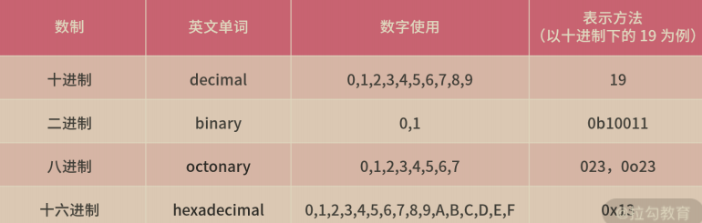

### 进制转换

**其他进制数转为十进制数**

这个方法一般被称为换基法，是对于任意一个基数 N 进制下的数字 X，它转换为十进制的方法。如下图的公式所示：原进制若是 N 进制，转换时的基数便取 N。

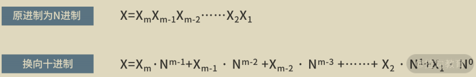


**十进制数转为其他进制数**

采用的方法叫除余法，转向的目标进制为 N 进制，则以 N 为除数不断地做除法，将最后的商和之前的余数**逆序**串联在一起，就是最终的结果（每次的余数必定是小于N进制的一个数）。

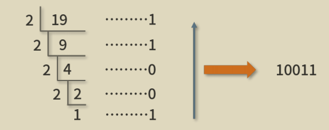

除余法除了适用于十进制向二进制的转换，也**适用于十进制向任何数制的转换**。

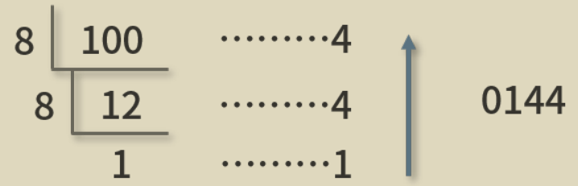

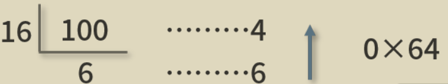


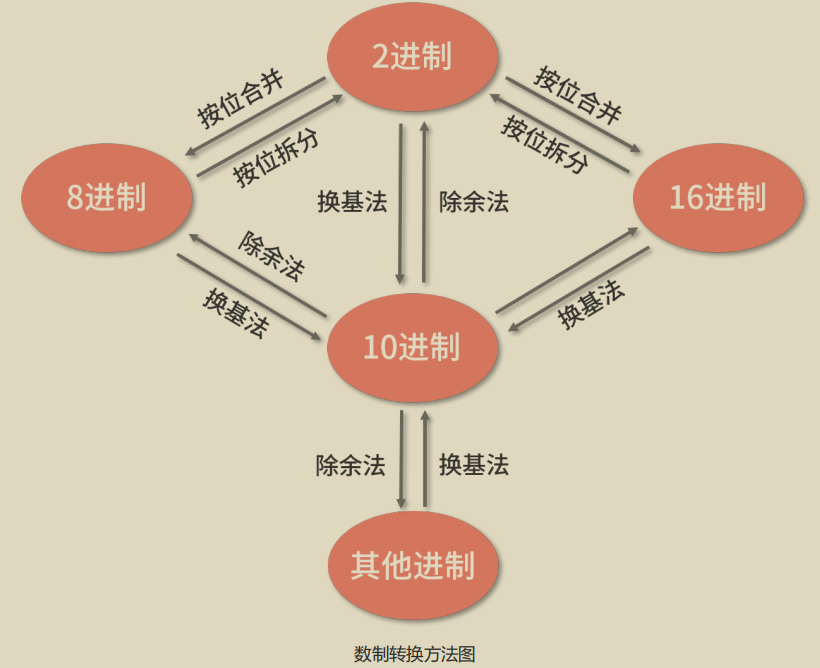

**借助进制转换解决问题实例**

1. 判断一个整数 a，是否是 2 的整数次幂。

   解析：如果是十进制，判断一个数是否是 10 的整数次幂，只需要看这个数字的形式是否为一个“1”和若干个“0”构成。例如，一个“1”和两个“0”构成“100”，它是 10 的 2 次幂；一个“1”和 4 个“0”构成“10000”，它是 10 的 4 次幂。

   因此这个题目的解法就是，把 a 转换为二进制，看看 bin(a) 的形式是否为一个“1”和若干个“0”构成，代码如下：

   ```python
   a = 8
   b = str(bin(a))
   total = 0
   for i in range(2,len(b)):
     total += int(b[i])
     
   if total == 1 and b[2] == '1':
       print 'yes'
   else:
       print 'no'
   ```

   - 第 1～2 行，变量 a 为待判断的整数；变量 b 是 a 的二进制形式，并且被我们强制转化为 string 类型，这样 b 的值就是 0b1000。
   - 如果形式为一个“1”和若干个“0”，则需要满足以下两个性质：**第一，首位为“1”；第二，所有位加和为“1”。**
   - 在代码中，第 4～6 行，计算了所有位数的加和，并保存在 total 变量中。
   - 在第 8～11 行，根据两个性质，对结果进行判断，并打印 yes 或者 no。


还可以利用位运算的**与**，来判断二进制数字 x 的形式是否为一个“1”和若干个“0”。判断的方法是，计算 x & (x-1)，如果结果为 0 则是，如果结果非 0 则不是。这样可以得到更简单的实现代码，代码如下：

```python
a = 80
if a & (a-1) == 0:
  print 'yes'
else:
  print 'no'
```


## 逻辑

语言沟通本质是人类思维的沟通。沟通的句子与句子，事件与事件之间一般都有关联词联系，以形成一定的逻辑关系。

MECE原则、与或非异或、文氏图。

常用的逻辑关系词：如“而且”、“或者”、“但是”、“如果...那么...”、“因为...所以...”等关联词。在使用这些词汇的时候，都是在表达事件之间的**逻辑关系**，如果你的逻辑是混乱的或者是不清晰的，就会出现关联词乱用的情况，从而造成沟通效率低下，甚至传递错误信息。

> 事情背景是某个系统需要从 A 环境迁移过渡至 B 环境：
>
> “为了保证系统的稳定过渡，**并且**保证在过渡期，各个使用方的需求正常迭代，**因此**系统拟定共分为三期：过渡期、实验期、切换期。其中，过渡期采用某技术，保证数据系统打通；实验期通过AB 实验，验证流程正确。”

从逻辑的视角来看，上面一段话至少包含了以下几个问题：

- “保证系统的稳定过渡”和“在过渡期内，各个使用方的需求正常迭代”，这二者的语意是包含关系，并不是并列关系，用 “并且” 进行连接，不合理。
- 为了保证系统的稳定过渡，因此需要分为三期。这里构不成因果关系，用 **“因此”** 进行连接，不合理。
- 过渡期怎样怎样，实验期怎样怎样，切换期呢？丢了一个重要环节，不知道需要做什么事情。

**这些问题看似是语文问题，实际是背后思考的逻辑问题。**


### MECE 原则

Mutually Exclusive Collectively Exhaustive——“相互独立，完全穷尽”，简而言之，能够做到不重叠、不遗漏，兼顾排他性和完整性，MECE 原则是一种用于业务分析的结构化思考方式。

例子：公园的票价问题。公园的门票价格是 20 元，优惠票包括了老人票和儿童票。价格制度为：

- 不到 10 岁的儿童免费；

- 10 岁以上的未成年人半价；

- 60 岁及以上的老人免费；

- 其他成年人无折扣。

用 MECE 原则来看一下这里的定价制度，就会发现这个制度不满足“不遗漏”“不重叠”的要求。比如，10 岁很尴尬，到底是算不到 10 岁免费呢？还是 10 岁以上未成年的半价呢？至少，从上面的描述是看不出来的。

在解决类似的逻辑问题时，**一定要注意所有边界值的可能性**。原则上，每个可行值（尤其是边界值）能且只能落在一个策略分支中。

一个常用的分析方法就是画线法，如下图所示。画一根数轴，代表所有的可行值，再使用 if 语句分解问题，空心点表示开区间，实心点表示闭区间。

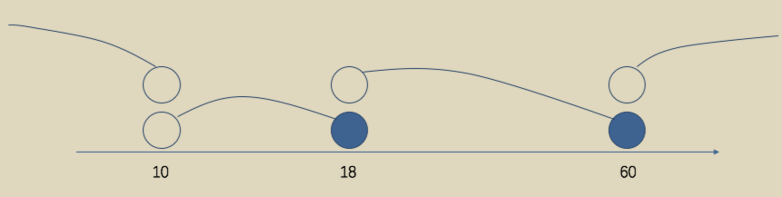


### 逻辑运算

命题：**命题是一个描述客观事物的陈述，它包含了正确或错误两个可能性。**

逻辑运算的对象是命题，它根据命题的真假进行计算，并且最终再输出真或者假，作为结果。

- 逻辑“与”—— A 并且 B，只有命题 A 和命题 B 同时为真的时候，A and B才是真，否则都是假；
- 逻辑“或”—— A 或者 B，命题 A 或者命题 B 有一个为真的时候，A or B 就是真，否则为假；
- 逻辑“非”——不是 A，命题 A 为假的时候，not A 就是真，否则为假

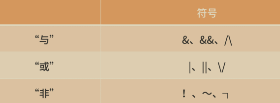

- 逻辑“异或”——命题 A 和命题 B 的真假不同时，则 A^B 为真，否则为假。


### 文氏图

一个形象判断逻辑关系的方法是，便是**文氏图**，如下图所示，假设在文氏图中有两个命题 A 和 B，用椭圆形的区域表示一个命题为真的地方，而椭圆区域外则表示这个命题为假的区域。


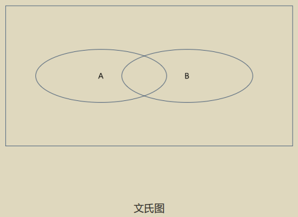


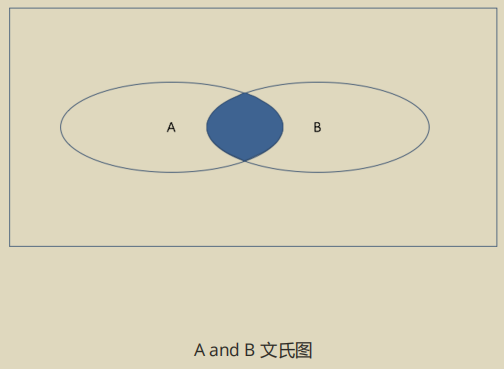


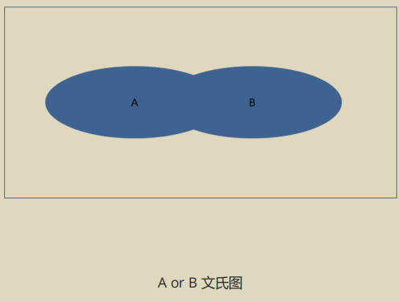


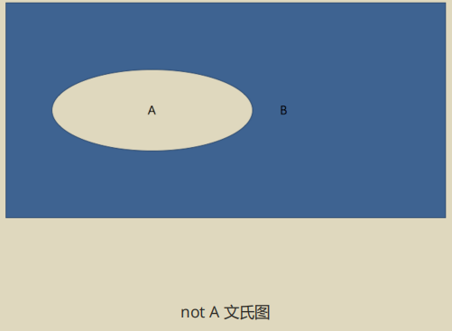


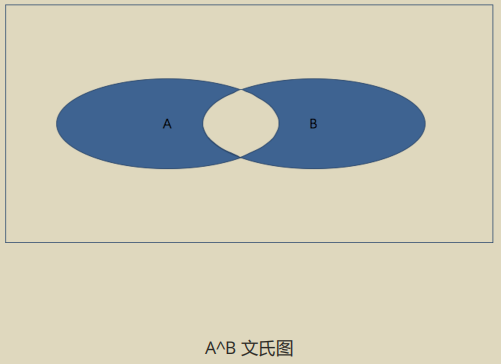

“A^B”的蓝色区域，就是上面“A or B”区域减去“A and B”区域，即A^B = (A or B) - (A andB)


### 实践

**不遗漏原则**

当在处理逻辑关系时，不管有多少个可能的 if 语句，哪怕你已经在 if 中穷举了所有的可能性，也尽可能用**else**进行一个兜底，**这是对代码潜在风险的规避**。

**不重复原则**

**每个可能的输入，只能进入唯一 一个策略分支**，否则就有可能造成结果不受控制。这就说明，在代码开发中，尽可能少用多个 if 语句，而改用 else if 语句。


“因为...所以...”的文氏图表达如下图所示，A 包含于 B，B 包含了 A，在 A 区域内，也一定会在 B 区域内，因为存在于 A，所以存在于 B，这是个由"小"推导出"大"的过程。

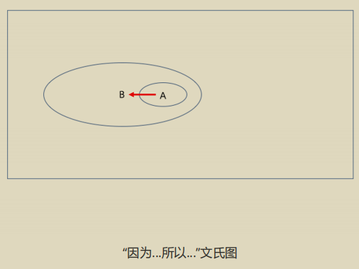

在使用“因为...所以...”沟通时，一定要注意命题之间是否具备了**充足的因果关系**。

> 因为小琳聪明漂亮（命题 A），所以小琳很漂亮（命题 B）。

可以看出命题 A 和 命题 B 两者有充足的包含和被包含的因果关系。

> **因为**要保证系统的稳定过渡，并且保证在过渡期内，各个使用方的需求正常迭代，所以系统拟定共
>
> 分为三期：过渡期、实验期、切换期。
>
> 长话短说，即“因为要保证稳定过渡，所以拆分为三期”。

那么要保证稳定过渡，就必须拆分为三期吗？显然并不是，拆分为四期、五期，全凭开发者自己的设计方案，都是可以的，显然这两者不具备强烈的因果关系。


虽然……但是……

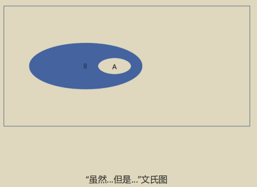


## 卡塔兰数


卡塔兰数可以组成一个数列（卡塔兰数列），是组合数学中一个重要的数列，许多计算组合数量的问题的本质就是卡塔兰数列。


【背景问题】姐妹洗碗问题

姐姐和妹妹一起洗5个互不相同的碗，姐姐洗好的碗一个一个往上摞，妹妹再从最上面一个一个地拿走放入碗柜摞成一摞，姐姐一边洗，妹妹一边拿，那么妹妹摞好的碗一共有多少种不同的摞法?


**2n个人排队进电影院，票价是50元。在这2n个人当中，其中n个人只有50元，另外n个人只有100元面钞。愚蠢的电影院开始卖票时1分钱也没有。问：有多少种排队方法使得每当一个拥有100元面钞的人买票时，电影院都有50元找钱？** 


这个问题实质上是一个关于括号匹配的问题，可以通过动态规划或递归的方法解决。在这个场景中，我们可以将有50元的人视为左括号"("，将有100元的人视为右括号")"。这样，问题转化为：有多少种方式可以排列这些"括号"，使得在任何时刻，左括号的数量都不小于右括号的数量。

这个问题是卡特兰数 (Catalan number) 的一个实例。第n个卡特兰数给出了这类问题的解的数量，其公式为:

$$ C_n = \frac{1}{n+1} {2n \choose n} = \frac{(2n)!}{(n+1)!n!} $$

其中，$C_n$ 是第n个卡特兰数，*n* 是拥有50元的人的数量（也是拥有100元的人的数量），${2n \choose n}$ 是从2n个人中选择n个人的组合数。

让我们计算对于给定的*n*的值的卡特兰数。

当有3对人（即3个持有50元和3个持有100元）时，存在5种排队方式，使得每当一个持有100元的人买票时，电影院都有50元找钱。


如果只考虑2n个人的排队组合，而不考虑支付顺序的限制（即不考虑50元和100元的支付问题），那么问题简化为确定这2n个人的排列数。2n个不同的人排成一队的方式是一个简单的排列问题，其解为`(2n)!`，表示的是2n个人的全排列数量。

公式为：

$(2*n)!=2*n×(2*n−1)×…×1$

这里的"!"表示阶乘，即从1乘到指定的数。例如，如果有6个人（即n=3，因此2n=6），那么排列方式的总数为`6!`。让我们计算这个值。

当有6个人（即3对人）排队进电影院时，一共有720种不同的排队方式。这个计算基于所有人都是不同的个体，并且没有考虑任何关于支付的额外条件。


**12枚金币用天平称三次，称出其中的一枚假币问题，要确定假币是重还是轻，并且具体是哪一枚。**


找出12枚金币中的一枚假币，假设不知道假币是重是轻，可以通过天平称三次来解决。这个过程需要策略性地分组和比较，以便在最少的比较次数内确定假币。以下是一个可能的解决方案：

### 第一次称重：4对4

1. 将12枚金币分为三组，每组4枚。记它们为A组、B组和C组。
2. 首先，称比较A组和B组。
   - 如果天平平衡，说明假币在C组。
   - 如果天平不平衡，说明假币在A组或B组。

### 第二次称重：根据第一次的结果决定

- 如果A组和B组天平不平衡

  （假设A组较轻）：

  1. 保留A组中的3枚金币，并从B组或C组借1枚真金币加入（记为D），再取B组的2枚金币（记为E）和两枚未称过的金币（记为F）。
  2. 比较D+E和F。如果平衡，则剩下的一枚是假币，通过重量判断是轻是重。如果不平衡，根据轻重确定假币组。

- 如果A组和B组天平平衡

  ，说明假币在C组：

  1. 从C组取3枚金币进行比较，另外1枚放一边。
  2. 如果平衡，剩下的那一枚是假币；如果不平衡，根据轻重确定假币。

### 第三次称重：确定假币

- 根据第二次称重的结果，你会有3枚金币（包含一枚假币）或者直接知道哪一枚是假币。
- 如果你有3枚金币，取其中两枚比较。
  - 如果平衡，未称的那一枚是假币。
  - 如果不平衡，根据重量判断假币。

通过这种方式，无论假币是重是轻，都能在三次称重内准确找出假币。这个解决方案依赖于逻辑推理和排除法，确保每一次称重都能最大限度地减少可能的假币候选。

