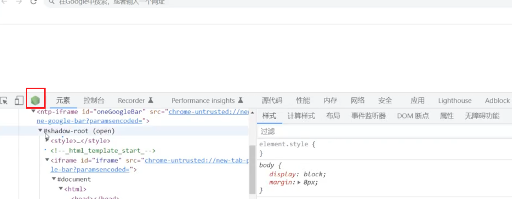
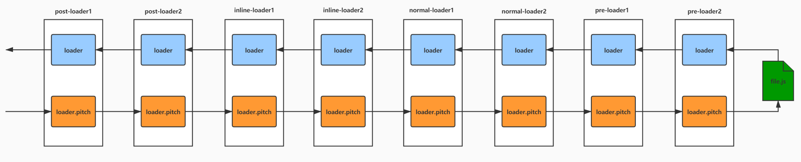
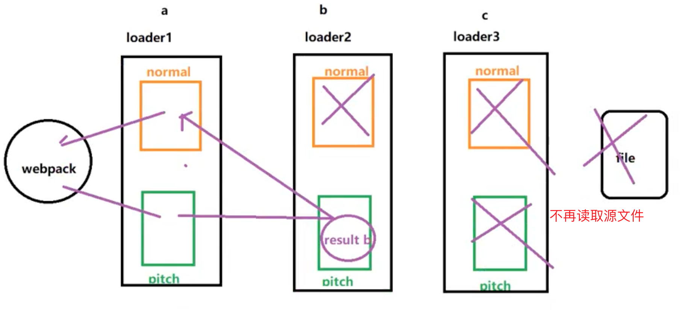

# 前端工程化

- webpoack使用，原理和优化
- rollup使用和手写实现
- vite3的实现


## Webpack

webpack 是一个JavaScript 应用程序的静态打包工具。

在 webpack 中会将各种各样的文件都看作一个模块，模块之间可能相互依赖。webpack 打包所有的这些资源文件编译为一些前端环境(浏览器环境)能识别的一些文件（静态资源），比如 js，css，png 等。

```shell
npm init -y
npm install webpack webpack-cli --save-dev
```

- webpack：核心包
- webpack-cli：命令行工具，主要是在执行 webpack 命令时，解析命令行中设置的一些列参数，加载 webpack 配置文件（默认 webpack.config.js），它提供了一组命令和选项，用于配置和运行Webpack的构建过程。通过webpack-cli，可以在命令行中指定Webpack的配置文件、执行不同的构建模式（如开发模式或生产模式）、观察文件变化并自动重新构建等。

在命令行中输入 `webpack` 并附带一些选项时，Webpack CLI会执行以下步骤来处理命令：

1. 解析命令行参数：Webpack CLI会解析命令行中输入的选项和参数，并根据它们的值进行配置。
2. 加载配置文件：Webpack CLI会尝试加载默认的配置文件 `webpack.config.js`，如果存在的话。如果命令行中使用了 `--config` 选项指定了其他配置文件，Webpack CLI会加载该文件。
3. 合并配置：Webpack CLI会将命令行选项和配置文件中的配置合并，以形成最终的Webpack配置对象。
4. 创建Webpack编译器：Webpack CLI使用合并后的配置创建一个Webpack编译器，该编译器将负责处理打包过程。
5. 执行Webpack编译器：Webpack编译器开始执行打包过程。它会根据配置中的入口文件和依赖关系，递归地解析和处理各个模块，并将它们打包成最终的输出文件。
6. 输出打包结果：一旦Webpack编译器完成打包过程，它会将生成的输出文件写入指定的输出目录。

在执行过程中，Webpack CLI还可以根据命令行选项和配置文件中的其他配置，执行一些额外的操作，例如启动开发服务器、监听文件变化并自动重新打包等。


## 浏览器直接使用 ES module

```html
<script src="./src/index.js" type="module"></script>
// 这样就可以了，必须指明type为module
```

ES6 模块化语法：

```js
// index.js:
import { sum, mul } from './js/math.js';

console.log(sum(20, 30));
console.log(mul(20, 30));
```

```js
math.js:
export const sum =(num1,num2)=>{
    return num1 + num2
}

export const mul =(num1,num2)=>{
    return num1 * num2
}
```

**ES6 的模块化规范在浏览器中是需要发起网络请求：**


在上面，直接使用 file 协议打开本地的 index.html 文件，产生跨域请求，同时网络面板中也有针对index.js的网络请求。说明 ES6 的 import 语法是需要发起网络请求的。


## entry

- 入口(entry point)告诉 webpack 使用哪个模块，来作为构建其内部依赖图(dependency graph) 的开始。进入入口后，webpack 会找出有哪些模块和库是入口起点（直接和间接）依赖的

- 默认值是 `./src/index.js`，但可以通过在 `webpack configuration` 中配置 `entry` 属性，来指定一个（或多个）不同 src 入口起点

- **webpack 的配置文件中的 entry 中配置的相对路径会以脚本命令执行时所在的路径（process.cwd()）作为基准路径。**

  比如：当前项目根目录为test，该目录下有webpack.config.js文件，其中的entry字段值为：'./src/index.js'，如果跳转到test的上级目录下，执行webpack --config  ./test/webpack.config.js，那么将因为找不到入口文件而报错。

  报错信息如下： 

  

  ```
  PS C:\Users\dukkha\Desktop\webpack202208\test> cd ..
  PS C:\Users\dukkha\Desktop\webpack202208> npx webpack --config .\test\webpack.config.js
  Active code page: 65001
  asset index.html 2.62 KiB [emitted]
  asset main.js 99 bytes [emitted] (name: main)
  
  ERROR in main
  Module not found: Error: Can't resolve './src/index.js' in 'C:\Users\dukkha\Desktop\webpack202208'
  resolve './src/index.js' in 'C:\Users\dukkha\Desktop\webpack202208'
    using description file: C:\Users\dukkha\package.json (relative path: ./Desktop/webpack202208)
      Field 'browser' doesn't contain a valid alias configuration
  ```

  

```js
entry: './src/index.js';

entry: {
  main: './src.index.js';
}
```


## output

- `output` 属性告诉 webpack 在哪里输出它所创建的 bundle，以及**如何命名这些文件**

- output 中的 path 路径则是一个绝对路径，具体打包后生成的打包文件夹在哪里取决于 path 的值。

- **如果不配置 output 中的 path 选项，则该项的默认值是：process.cwd()，而不是'./dist'这种相对路径或者 path.resolve(\_\_dirname, "dist")。**


## loader

- webpack 只能理解 `JavaScript` 和 `JSON` 文件
- loader 让 `webpack` 能够去处理其他类型的文件，并将它们转换为有效模块，以供应用程序使用，以及被添加到依赖图中

loader 的几种使用方式：

- import '**style-loader!css-loader!**../css/creatediv.css' （内联式，不推荐）

- CLI 方式（不推荐）

  package.json:

  ```
  {
      "build":"webpack --module-bind 'css=style-loader!css-loader'"
  }
  ```

- webpack 配置文件中写 loader

  对应规则下面的 loader 是从右向左执行的，最右侧的 loader 接收到是对应类型的文件的源码，最左侧zz的 loader 一定会返回一个 js 模块。

  ```js
  module.exports ={
      module:{
          rule:[
              {
                  test:/.css$/,
                  use:['style-loader','css-loader']
              }
          ]
      }
  }
  ```


## plugin

插件可以用于执行范围更广的任务。包括：打包优化，资源管理，注入环境变量

- clean-webpack-plugin

  ```js
  const { CleanWebpackPlugin } = require('clean-webpack-plugin');
  
  plugins: [new CleanWebpackPlugin()];
  ```

  **现在可以在 webpack 的 output 配置项中编写一个字段 clean：boolean 实现 clean-webpack-plugin 插件的能力。**

  ```js
  {
    output: {
      path: path.resolve(__dirname, 'dist'),
      filename: 'main.js',
      clean: true,
    },
  }
  ```

- html-webpack-plugin

  html-webpack-plugin 插件在调用时如果不传递模板参数，则该包的内部有一个默认的 ejs 模板可供使用----default_index.ejs

  ```ejs
  <!DOCTYPE html>
  <html>
    <head>
      <meta charset="utf-8">
      <title><%= htmlWebpackPlugin.options.title %></title>
    </head>
    <body>
    </body>
  </html>
  ```

  ```js
  const HtmlWebpackPlugin = require('html-webpack-plugin');

  plugins: [
    new HtmlWebpackPlugin({
      title: 'hello world',
      template: './public/index.html'
    })
  ];
  ```

- copy-webpack-plugin

  用于将文件或文件夹从源目录复制到构建目录。它可以用于复制任何类型的文件，包括JavaScript文件。copy-webpack-plugin本身并不会自动将复制的JavaScript文件插入到打包后的HTML文件中。它的主要功能是复制文件，而不涉及HTML文件的修改或处理。

  **注意，该插件只是将指定目录下的文件拷贝一份到打包输出的文件夹中，但是并不将拷贝后的文件自动引入到打包生成的 html 中**。

  [文档](https://www.webpackjs.com/plugins/copy-webpack-plugin#root)
  
  ```js
  const CopyWebpackPlugin  = require('copy-webpack-plugin')
  
  plugins:[
      new CopyWebpackPlugin({
          patterns:[
              {
                  from:'src/public', to: 'public'  // 将src/public目录下的文件复制到构建目录的public目录下
                  globOptions:{
                      ignore:[
                          "**/index.html",   // 排除public下的index.html
                          "**/.DS_Store",
                          ...
                      ]
                  }
              }
          ]
      })
  ]
  ```
  
  如果希望将复制的JavaScript文件插入到HTML文件中，可以使用其他插件或工具来实现这个功能。常见的做法是使用HtmlWebpackPlugin插件，它可以自动生成HTML文件，并将打包后的JavaScript文件自动插入到HTML文件中。可以在Webpack的配置文件中同时配置copy-webpack-plugin和HtmlWebpackPlugin来实现文件复制和自动插入的功能。


## 模式(mode)

- 一套开发时使用，构建结果用于本地开发调试，不进行代码压缩，打印 debug 信息，需要 sourcemap 文件，热更新

- 一套构建时使用，生成打包文件直接应用于线上的，即代码都是压缩后，运行时不打印 debug 信息，不包括 sourcemap，可能需要分离 CSS 成单独的文件，以便多个页面共享同一个 CSS 文件

- webpack 4.x 版本引入的 [mode](https://webpack.docschina.org/configuration/mode/) 的概念  

- 当指定使用 production mode 时，默认会启用各种性能优化的功能，包括构建结果优化以及 webpack 运行性能优化

- 如果是 development mode 的话，则会开启 debug 工具，运行时打印详细的错误信息，以及更加快速的增量编译构建


| 选项 | 描述 |
| :-- | :-- |
| development | 会将 process.env.NODE_ENV 的值设为 development。启用 NamedChunksPlugin 和 NamedModulesPlugin |
| production | 会将 process.env.NODE_ENV 的值设为 production。启用 FlagDependencyUsagePlugin, FlagIncludedChunksPlugin, ModuleConcatenationPlugin, NoEmitOnErrorsPlugin, OccurrenceOrderPlugin, SideEffectsFlagPlugin 和 UglifyJsPlugin |

```js
module.export = {
  mode: 'development', // 等于开启下面的这些配置

  devtool: 'eval',
  cache: true,
  performace: {
    hints: false
  },
  output: {
    pathinfo: true
  },
  optimization: {
    moduleIds: 'named',
    chunkIds: 'named',
    mangleExports: false,
    nodeEnv: 'development',
    flagIncludedOrder: false,
    concatenateModules: false,
    splitChunks: {
      hidePathInfo: false,
      minSize: 10000,
      maxAsyncRequests: Infinity,
      maxInitialRequests: Infinity
    },
    emitOnErrors: true,
    checkWasmTypes: false,
    removeAvailableModules: false,
    plugins: [
      new webpack.DefinePlugin({
        'process.env.NODE_ENV': JSON.stringify('development')
      })
    ]
  }
};
```

```js
module.export = {
  mode: 'production', // 等于开启下面的这些配置

  devtool: false,
  cache: false,
  performace: {
    hints: 'warning'
  },
  output: {
    pathinfo: false
  },
  optimization: {
    moduleIds: 'deterministic',
    chunkIds: 'deterministic',
    mangleExports: 'deterministic',
    nodeEnv: 'production',
    flagIncludedOrder: true,
    concatenateModules: false,
    splitChunks: {
      hidePathInfo: false,
      minSize: 10000,
      maxAsyncRequests: Infinity,
      maxInitialRequests: Infinity
    },
    emitOnErrors: true,
    checkWasmTypes: false,
    removeAvailableModules: false,
    plugins: [
      new webpack.DefinePlugin({
        'process.env.NODE_ENV': JSON.stringify('production')
      }),
      new TerserPlugin(/*...*/)
      // ...
    ]
  }
};
```


## 区分环境

读取变量的两个地方：

- webpack 配置文件被读取时所在的 node 环境，该环境的全局对象上有 process 进程对象

- 项目的源码文件实际运行所在的浏览器环境中，浏览器全局对象上没有 process 进程对象，访问则报错

  

1. **`--mode`用来间接设置模块内（源代码中）的`process.env.NODE_ENV`**

- 可以在模块内(**项目源文件代码中**)通过`process.env.NODE_ENV`获取该`process.env.NODE_ENV`对应的字符串值（development 或者 production）并进行替换，这是在**编译阶段**做的替换工作，它和 webpack 配置文件中通过进程对象（process）中的环境变量对象(env) 上的 NODE_ENV 是两个完全不同的概念

```json
"script":{
    "build":"webpack --mode=development"
}
```

具体过程：`webpack --mode=development` => 设置 webpack.config.js 文件中 mode 的值为 development => mode 为开发模式（development ）下时，webpack 内部通过 webpack.definePlugin 插件设置字符串 process.env.NODE_ENV 在项目源码中的代表的实际值为 development， **在编译阶段，当解析到项目源码中有用到变量：process.env.NODE_ENV 时，直接将它替换为字符串（development）**，process.env.NODE_ENV 字符串除外。 webpack --mode=production 也是一样的原理。

其中通过命令行的--mode 和配置文件中的 mode 取指定环境，都是一个原理，如果两者同时存在，则命令行--mode 的优先级更高。


2. **`--env`用来设置 webpack 配置文件的函数参数**

- 无法在模块内通过`process.env.NODE_ENV`访问
- 可以在 webpack 配置文件中通过配置文件导出的**函数**获取当前环境变量

```json
"script":{
    "build":"webpack --env=development"
}
```

webpack.config.js

```js
const path = require('path');
const webpack = require('webpack');
const HtmlWebpackPlugin = require('html-webpack-plugin');

console.log(process.env.NODE_ENV)   // 值为undefined

module.exports = function (env, argv) {
  console.log(env)  // development:true
  console.log(argv)
  return {
    mode: 'production',
    entry:'./src/index.js'
    output: {
      path: path.resolve(__dirname, './dist'),
      filename: '[name].js'
    },
    module: {
      rules: [
        {
          test: /\.css$/,
          use: ['style-loader', 'css-loader']
        }
      ]
    },
    plugins: [
      new HtmlWebpackPlugin({
        template: './public/index.html',
        filename: 'index.html'
      }),
      new webpack.DefinePlugin({
        FIRTS_VAR: "'wuyibo'"
      })
    ]
  };
};
```

**`--env` 用来设置 webpack 配置文件导出的函数的参数**，并不直接在项目的模块文件中生效。

在 script 脚本中使用 --env=development 的效果是为 webpack 配置文件默认导出的是函数时，可以在函数的参数中获取到该命令行中设置的参数。例如 script 脚本中：`"build": "webpack --env=development"` 那么下面代码中的 env 就是：`{ WEBPACK_BUNDLE: true, WEBPACK_BUILD: true, development: true }`。argv 的结构则是：`{ env: { WEBPACK_BUNDLE: true, WEBPACK_BUILD: true, development: true } }`，但是因为 mode 默认没有设置时使用的是 production 模式，所以打包出来代码中的 process.env.NODE_ENV 变量的取值仍旧是 production 字符串。


3. **`cross-env`用来设置 node 环境的`process.env.NODE_ENV`**

```
"scripts": {
  "build": "cross-env NODE_ENV=development webpack"
}
```

--env=development 只是在执行脚本时，给**函数类型**的 webpack 配置传入参数。如果在 webpack 配置文件中访问 process.env.NODE_ENV 的话，是没有值的，为 undefined。如果想修改 webpack 配置文件中访问的变量的值，可以在命令行中设置 webpack 配置文件运行的环境的环境变量。

```json
"scripts": {

  "build": "set NODE_ENV=development webpack",  // windows下的写法。webpack 配置文件中访问 process.env.NODE_ENV ，则它的值就为development

  "build": "cross-env NODE_ENV=development webpack"  // 解决操作系统层面的命令兼容性包

},
```

webpack 配置文件中读取的是 node 配置的环境变量，可以通过 cross-env key=value 来设置。 然后在 webpack 配置文件中可以访问到设置的环境变量，然后再用这个环境变量作为 webpack 配置项中的值，从而来改变项目模块内的变量的值或者打包方式。

cross-env 设置的环境变量在项目的模块文件中是无法访问到的。

例子：

```json
"scripts": {
	"build": "cross-env NODE_ENV=production FIRST_ENV=one webpack"
}
```

在 webpack 配置文件中可以访问到：

```
console.log(process.env.NODE_ENV);  // production
console.log(process.env.FIRST_ENV);   // one
```

在项目中的文件 index.js：

```js
console.log(process.env.NODE_ENV); // production  ,是由mode为production模式下的DefinePlugin插件设置的
console.log(process.env.FIRST_ENV); //  process.env.FIRST_ENV则直接在打包后文件中存在，运行时报错
```

**vue 中可以通过.env 格式的文件向 node 环境中设置变量。借助的是一个第三方库：dotenv-expand。**


4. **`DefinePlugin`用来设置模块内(源码中)的全局变量**

- 设置全局变量(全局变量不是`window`),所有模块都能读取到该变量的值
- 可以在任意模块内通过 `process.env.xxx`等任意字段表示自己设置好的值
- 但无法在`node环境`(webpack 配置文件中)下获取当前的变量
- 注意在值为字符串是需要用引号包裹代引号的字符串

```js
plugins:[
   new webpack.DefinePlugin({
      'process.env.NODE_ENV':JSON.stringify(process.env.NODE_ENV)，
       'back_end_url':'"http://xxxx.xxx/xxx"'
   })
]
```

通过插件 DefinePlugin 设置的变量可以直接在整个项目的源码中直访问。比如：

```js
const path = require('path');
const webpack = require('webpack');
const HtmlWebpackPlugin = require('html-webpack-plugin');

module.exports = function (env, argv) {
  return {
    mode: 'production',
    entry: {
      main: './src/index.js'
    },
    output: {
      path: path.resolve(__dirname, './dist'),
      filename: '[name].js'
    },
    module: {
      rules: [
        {
          test: /\.css$/,
          use: ['style-loader', 'css-loader']
        }
      ]
    },
    plugins: [
      new HtmlWebpackPlugin({
        template: './public/index.html',
        filename: 'index.html'
      }),
      new webpack.DefinePlugin({
        FIRTS_VAR: "'wuyibo'"
      })
    ]
  };
};
```

源码 index.js 中：

```js
console.log(FIRTS_VAR); // 在打包编译后的文件中直接就用  wuyibo 字符串进行的替换
```

在 vue 项目中的 index.html 文件中有: `<% BASE_URL %> favicon.ico` ,其中 BASE_URL 是要取全局下的该变量对应的值。

```js
const { DefinePlugin } = require('webpack');

plugins: [
  new DefinePlugin({
    BASE_URL: "'./'"
  })
];
```

webpack 的配置文件的模块导出可以是一个函数，也可以是一个配置对象。其中函数可以接受命令行传递的参数。


## Browserlist

在不同的前端工具之间共用目标浏览器和 node 版本的配置文件。它主要被以下工具使用(许多的 webpack 插件会依赖它)：

```
Autoprefixer
Babel
post-preset-env
eslint-plugin-compat
stylelint-unsupported-browser-features
postcss-normalize
```

Browserlist 可以编写的字段：

- defaults : Browserslist 的默认浏览器 (> 0.5%,last 2 versions, Firefox ESR, not dead)。
- 5%:通过全局使用情况统计信息选择的浏览器版本。 >=，<和<=工作过
  - 5% in Us:使用美国使用情况统计信息。它接受两个字母的国家/地区代码。
  - \>5%in alt-As:使用亚洲地区使用情况统计信息，有关所有区域代码的列表，请参见 aniuse-lite/data/reqions
  - \>5%in my stats:使用自定义用法数据
  - \>5% in browserslist-config-mycompany stats :使用 来自的自定义使用情况数据 browserslist-onfig-mycompany/browserslist-stats,json.
  - cover 99.5%:提供覆盖率的最受欢迎的浏览器
  - cover 99.5%in us:与上述相同，但国家/地区代码由两个字母组成
  - cover 99.5%in my stats:使用自定义用法数据
- dead:24 个月内没有官方支持或更新的浏览器，现在是 E 10 Mob 11 BlackBerry 10Blackery7，Samsung 4 和 OperaMobile 12.1.
- last 2versions:每个浏览器的最后 2 个版本。
  - last 2 Chrome versions:最近 2 个版本的 Chrome 浏览器
  - last2 major versions 或 last 2 ios major versions:最近 2 个主要版本的所有次要/补丁版本
- not ie<= 8:排除先前查询选择的浏览器。
- browserslist config:在 Browserslist 配置中定义的浏览器。在差异服务中很有用，可用于修改用户的配置。

可以编写类似于这样的配置:

> \> 1% last 2 versions not dead

那么之后，这些工具会根据配置来获取相关的浏览器信息，以方便决定是否需要进行兼容性的支持:

- 条件查询使用的是 caniuse-lite 的工具，这个工具的数据来自于 caniuse 的网站上;

直接使用 browserslist 命令行工具查询根据条件匹配到的浏览器：

```
npx browserslist ">1%, last 2 version, not dead"
```


Browserlist 可以编写的位置：

- 在 package.json 中的配置

  ```json
  {
    "browserslist": [
      "last 1 version",
      "> 1%",
      "maintained node versions",
      "not dead"
    ]
  }

  或者

  "browserslist": {
      "production": [
          "> 1%",
          "ie 10"
      ],
      "development": [
          "last 1 chrome version",
          "last 1 firefox version"
      ]
  }

  ```

- 单独的一个配置文件.browserslistrc 文件

  ```
  # 注释是这样写的，以#号开头
  > 1%  #代表全球超过1%使用的浏览器
  last 1 version #最后的一个版本
  maintained node versions #所有还被 node 基金会维护的 node 版本
  not dead
  
  或者
  
  [production staging]
  > 1%
  last 2 version
  not dead
  
  [development]
  last 1 chrome version
  last 1 firefox version
  
  不配置默认为：**> 0.5%, last 2 versions, Firefox ESR, not dead**
  ```


## webpack-dev-server

| 类别 | 配置名称 | 描述 |
| :-- | :-- | :-- |
| output | path | 指定打包生成的输出到硬盘上的目录 |
| output | publicPath | 表示的是打包生成的 index.html 文件里面引用资源的前缀 |
| devServer | publicPath | 表示的是打包生成的静态文件所在的位置(若是 devServer 里面的 publicPath 没有设置，则会认为是 output 里面设置的 publicPath 的值) |
| devServer | static | 用于配置提供额外静态文件内容的目录 |

内部依赖的是 express 框架。onBeforeSetupMiddleware 在 webpack-dev-server 静态资源中间件处理之前，可以用于拦截部分请求返回特定内容，或者实现简单的数据 mock。

```js
module.exports ={
    devServer:{
        static:path.resolve(__dirname,'public'),
        port:8080,
        open:true,
        proxy:{
            '/api':'http://localhost:3000',
            '/api2':{
                target:'http://localhost:3001',
                pathRewrite:{"^/api":''}
            }
        },
        // webpack-dev-server 内部就是一个express服务器，devServer就是express执行返回值
        onBeforeSetupMiddleware(devServer){// express()
            // 简单模拟一个后端接口
            devServer.app.get('/api/users', (req, res) => {
                res.json([{ id: 1 }, { id: 2 }]);
            });
        }
    }
}
```

使用 webpack-dev-server 时，内部会使用 webpack 的配置文件模拟打包，并将打包后生成文件的文件根目录和 static 字段指定的文件夹合并后，作为 web 服务器的根目录（/），当访问该地址时，默认访问的就是根目录下的 index.html 文件。而 devServer 配置项指定的目录中的文件也会直接放在本地服务器的根目录下。


## css-loader 配置

```js
{
    test:/\.css$/,
    use:[
        'style-loader',
        {
            loader:'css-loader',  //会读取源CSS文件，并且自动可以识别里面import语句并把对应CSS内容合并过来
            options:{
                url: boolean,   // 比如背景图中的url能否被识别
                import:boolean, // 是否允许css中使用@import css语法
                modules:boolean,  // 是否开启css模块化   import style from './index.css'
                source-map:boolean,
                importLoaders:boolean | number,
                esModules:boolean  // import style from './index.css'   style.defalut.xxx  默认为true
            }
        }
    ]
}
```

> importLoaders:boolean | number, // importloaders Allows to enables/disables or setups number of loaders applied before CSS loader for @import at-rules

css-loader 在 css 文件中默认支持 **~ 符号**表示 node_modules 文件路径，不需要用户去配置。

- @是 webpack 设置的路径别名在，在 webpack 配置文件中设置以后，也可以在 css 中使用
- Starting with version 4.0.0, absolute paths are parsed based on the server root
- To import assets from a node modules path (include resolve.modules) and for alias, prefix it with a ~

```js
{
  resolve:{
    alias:{
      "@':path.resolve('src')
    }
  }
}
```

```css
bg{
  width:100px;
  height:100px;
  background-image: url(images/kf.jpg);
  background-image: url(@/images/kf.jpg);
  background-image:; url(~module/images/a.jpg);  // 取node_modules/module/images/a.jpg
}
```

不能在 js 文件中不配置就使用“~”，比如不能：import img from '~module/images/a.jpg'

node-sass sass-loader；sass：老版后缀；scss：新版本后缀

node-sass 负责将 scss 或者 sass 编译为 css，原始的 sass 包使用 ruby 写的，本地安装的话需要编译，node-sass 是 node 写的，比较好安装执行。


## webpack-dev-middleware

[webpack-dev-middleware](https://www.npmjs.com/package/)就是在 Express 中提供 `webpack-dev-server` 静态服务能力的一个中间件

npm install webpack-dev-middleware --save-dev

```js
const express = require('express');
const app = express();
const webpack = require('webpack');
const webpackDevMiddleware = require('webpack-dev-middleware');
const webpackOptions = require('./webpack.config');

const compiler = webpack(webpackOptions);
app.use(webpackDevMiddleware(compiler, {}));
app.listen(3000);
```

- webpack-dev-server 的好处是相对简单，直接安装依赖后执行命令即可
- 而使用`webpack-dev-middleware`的好处是可以在既有的 Express 代码基础上快速添加 webpack-dev-server 的功能，同时利用 Express 来根据需要添加更多的功能，如 mock 服务、代理 API 请求等


## CSS 兼容性

PostCSS 是一个独立的工具，可以脱离 webpack 单独使用（postcss-cli 在命令行单独使用 postcss 时需要安装该插件）。可以通过 JavaScript 来转换样式，css 的转换和适配，自动添加浏览器厂商前缀，css 样式重置，css 单位转换。

还需要结合 Browserlist 的版本兼容配置文件来使用。

```shell
npm i postcss-loader postcss-preset-env -D
```

- [postcss-loader](https://github.com/webpack-contrib/postcss-loader)可以使用 PostCSS 处理 CSS
- [postcss-preset-env](https://github.com/csstools/postcss-preset-env)把现代的 CSS 转换成大多数浏览器能理解的插件集合
- PostCSS Preset Env 已经包含了`autoprefixer`和`browserlists`选项

postcss 配置文件：

postcss.config.js

```js
let postcssPresetEnv = require('postcss-preset-env');
module.exports={
    plugins:[postcssPresetEnv({
        browsers: 'last 5 version'
    })]
}


module.exports = {
    plugins:[
        // require("autoperfixer")  or
        // require("postcss-preset-env") or
        "postcss-preset-env"
    ]
}


{
    test:/\.css/,
		use:[
        {loader:'style-loader'},
        'css-loader',
        {
            loader:'postcss-loader',
            options:{
               postcssOptions:{
                    plugins:[
                        // require("autoprefixer"),//这个插件可以不再写了，因为postcss-preset-env中内置使用了autoprefixer
                        require("postcss-preset-env")
                        //or
                    	// require('pluginName')(传参)
                    ]
                }
                // plugins:["postcss-preset-env"]   这是另一种写法
            }
        }    //postcss-loader内部会调用options配置中指定的postcss插件对样式文件加兼容性前缀
    ]
}
```

配置文件的内容也可以写在 package.json 文件中。

```diff
{
+  "browserslist": {
+    "development": [
+      "last 1 chrome version",
+      "last 1 firefox version",
+      "last 1 safari version"
+    ],
+    "production": [
+      ">0.2%"
+    ]
+  }
}
```


## 资源模块

- [Rule.type](https://webpack.js.org/configuration/module/#rule)
- [asset-modules](https://webpack.js.org/guides/asset-modules/)

type 的四种类型：

1. asset/resource
2. asset/source
3. asset/inline
4. asset

```js
output:{
    filename:'js/bundle.js',
    path:path.resolve(__dirname,"./build"),

    assetModuleFilename:"img/[name].[hash:6][ext]"     //这会是下面图片资源打包后存放了目录,所有通过 assetModule打包的文件都放在设置的值的目录下，当然后面可以针对每个loader进行不同的配置
}


{
    test:/\.(jpg|png|svg|gif|jpeg)$/,
   	type:"asset/resource"
}
```

- 资源模块是一种模块类型，它允许使用资源文件（字体，图标等）而无需配置额外 loader
- `raw-loader` => `asset/source` 导出资源的源代码
- `file-loader` => `asset/resource` 发送一个单独的文件并导出 URL

  ```js
  output:{
      filename:'bundle.js',
      path:path.resolve(__dirname,"./build")
  }
  
  {
      test:/\.(jpg|png|svg|gif|jpeg)$/,
      type:"asset/resource",
      generator:{
        filename:"img/[name].[hash:6][ext]"   //img会是图片资源打包后存放了目录
      }
  }
  ```

- `url-loader` => `asset/inline` 导出一个资源的 base64

  ```js
  output:{
    filename:'bundle.js',
    path:path.resolve(__dirname,"./build")
  }
  
  {
    test:/\.(jpg|png|svg|gif|jpeg)$/,
    type:"asset/inline"  // 不要配置文件打包路径，因为没有输出文件，都在js中以base64表示了
  }


- asset 在导出一个 data URI 和发送一个单独的文件之间自动选择。之前通过使用 `url-loader`，并且配置资源体积限制实现

  ```js
  output:{
    filename:'bundle.js',
    path:path.resolve(__dirname,"./build")
  }
  
  {
    test:/\.(jpg|png|svg|gif|jpeg)$/,
    type:"asset",
    generator:{
      filename:"img/[name].[hash:6][ext]"
    },
    parser:{
      dataUrlCondition:{
        maxSize: 10 *1024   // 小于该体积（10kb）则打包为base64
      }
    }
  }


  ```diff
module.exports = {
	output:{
		path:path.resolve(__dirname,'dist')
		filename:'main.js',
+   	assetModuleFilename:'assets/[hash][ext][query]'  // 指定打包输出文件的名字（方式一）
	}
    module:{
        rules: [
+           {
+               test: /\.png$/,
+               type: 'asset/resource',   // file-loader
+               generator:{
+									filename:'images/[hash][ext]'  (方式二 )
+               }
+           },
+           {
+               test: /\.ico$/,
+               type: 'asset/inline'   // url-loader
+           },
+           {
+               test: /\.txt$/,
+               type: 'asset/source'   // raw-loader
+           },
+           {
+               test: /\.jpg$/,
+               type: 'asset',
+               parser: {
+                   dataUrlCondition: {
+                     maxSize: 4 * 1024 // 4kb
+                   }
+               }，
+               generator:{
+					filename:'images/[hash][ext]'  (方式二 )
+               }
+           }
        ]
    },
  experiments: {
    asset: true
  },
};
  ```


```js
{
    test:/\.(ttf|eot|woff|woff2)$/,
    type:'asset/resource',
    generator:{
        filename:"font/[name].[hash:6][ext]"
    }
}
```

### query

```
assetModuleFilename:'assets/[hash][ext][query]'
```

query 表示查询参数，比如在源码中：

```js
import png from './assets/images/logo.png?time=2022-8-21';
```

那么打包后生成的，在引入这个文件的时候会在 url 地址的 query 中加上上面设置的值。


项目中使用图片：

- css 中 background-image

  ```css
  #box {
    background-image: url('../asset/images/xx/xxx.jpg');
  }
  ```

- img 标签的 src 属性

  ```js
  const imgEl = new Image()
  imgEl.src = require('./src/asset/images/xx/xx.jpg').default   file-loader 5版本中的特点
  
  import imgSrc from './src/asset/images/xx/xx.jpg'
  const imgEl = new Image()
  imgEl.src = imgSrc

有时经过 webpack 打包后的文件希望保留源文件的名字再外加一些特别的标识符进行表示。

这时候可以借助 webpack 中占位符来实现。常用的占位符：

- [ext] 文件扩展名

- [name] 原文件名

- [hash] 本地打包的 hash 值

- [contentHash] 该文件内容对应的 hash 值

- [hash:length] 指定长度的 hash 值

- [path] 文件相对于 webpack 配置文件的路径

现在无法直接在 webpack5 中使用 file-loader，url-loader 来打包 CSS 文件中的图片了，而需要改动：

现在不能直接像上图一样在 css 中引用图片了：具体参考文章https://blog.csdn.net/w184167377/article/details/118930758

  ```js
{
  test: /\.(jpe?g|png|svg|gif)$/,
  use: [
          {
              loader: "url-loader",
              options: {
                  name: "[name]-[hash:6].[ext]",
                  esModule: false,
                  limit: 100 * 1024
              }
          }
   ],
   type: "javascript/auto"
}
  ```


## JS 兼容性处理

- Babel 默认只转换新的最新 ES 语法,比如箭头函数

让 babel 能转换其他新语法需要借助包或者 babel 插件

- [babel-loader](https://www.npmjs.com/package/babel-loader)使用 Babel 和 webpack 转译 JavaScript 文件,用来读取加载项目源码中的 js 文件
- [@babel/core](https://www.npmjs.com/package/@babel/core)Babel 编译的核心包,babel-loader 读取的源码传给@babel/core，由@babel/core 将源码转为 AST 语法树，但是它不知道怎么转为代码，它需要将不同的 ast 部分转发给不同插件或者预设取处理
- [@babel/preset-env](https://www.babeljs.cn/docs/babel-preset-env)
- [@babel/preset-react](https://www.npmjs.com/package/@babel/preset-react) React 插件的 Babel 预设
- [@babel/plugin-proposal-decorators](https://babeljs.io/docs/en/babel-plugin-proposal-decorators) 把类和对象装饰器编译成 ES5
- [@babel/plugin-proposal-class-properties](https://babeljs.io/docs/en/babel-plugin-proposal-class-properties) 转换静态类属性以及使用属性初始值化语法声明的属性

```shell
npm i babel-loader @babel/core @babel/preset-env @babel/preset-react  -D
npm i @babel/plugin-proposal-decorators @babel/plugin-proposal-class-properties @babel/plugin-proposal-private-property-in-object  @babel/plugin-proposal-private-methods -D
```

```diff
  module: {
    rules: [
+      {
+        test: /\.jsx?$/,
+        use: {
+          loader: 'babel-loader',
+          options: {
+            presets: ["@babel/preset-env", '@babel/preset-react'],
+            plugins: [
+              ["@babel/plugin-proposal-decorators", { legacy: true }],
+              ["@babel/plugin-proposal-private-property-in-object", { "loose": true }],
+              ["@babel/plugin-proposal-private-methods", { "loose": true }],
+              ["@babel/plugin-proposal-class-properties", { loose: true }],
+            ],
+          },
+        },
+      },
      ]
  }
```

装饰器的写法：

```js
function readonly(target,key,descriptor){
    descriptor.writable = false
}

class Person {
    @readonly PI =3.14
}

let person = new Person()
person.PI = 3.15
console.log(person)  // PI还是3.14


function decode(target,key,descriptor){

}
// 写法一：  legacy（传奇）:true 表示老的规则,可以这么写
@decode
class Person {}

// 写法二（新写法）：
class @decode Person {}

```

loose：true 表示可以以 obj.xxx 的方式给对象添加属性，为 false 的话表示 babel 最后以 object.defineProperty 的方式给对象添加属性。


## eslint

### 旧版配置

```shell
npm install eslint eslint-loader babel-eslint --D
```

```diff
module: {
    rules: [
+      {
+        test: /\.jsx?$/,
+        loader: 'eslint-loader',
+        enforce: 'pre',   //   值：不写  pre前置  post后置 确定针对同一个文件的规则匹配的优先级
+        options: { fix: true },
+        exclude: /node_modules/,
+      }, // 先检查代码风格，在进行编译
    ]
}
```

.eslintrc.js：

```js
module.exports = {
  root: true, // 为true说明该文件是根配置文件，可以被其他配置文件继承规则，为true是就不能再写extends继承字段了
  parser: 'babel-eslint', // 代码中有es6以后的写法，默认情况下可能不认识，需要使用babel-eslint识别新语法
  //指定解析器选项
  parserOptions: {
    sourceType: 'module',
    ecmaVersion: 2015
  },
  //指定脚本的运行环境
  env: {
    browser: true,
    node: true
  },
  // 启用的规则及其各自的错误级别
  rules: {
    indent: 'off', //缩进风格
    quotes: 'off', //引号类型
    'no-console': 'error' //禁止使用console
  }
};
```

```shell
npm i eslint-config-airbnb eslint-loader eslint eslint-plugin-import eslint-plugin-react eslint-plugin-react-hooks eslint-plugin-jsx-a11y -D
```

```js
module.exports = {
  // 删除root文件，同时继承airbnb
  parser: 'babel-eslint',
  extends: 'airbnb',
  rules: {
    semi: 'error',
    'no-console': 'off',
    'linebreak-style': 'off',
    'eol-last': 'off'
    //"indent":["error",2]
  },
  env: {
    browser: true,
    node: true
  }
};
```


### 新版配置

npm install eslint -D

npx eslint. --init 问答式选择生产.eslintrc.js 文件，同时会安装一些配置预设和插件。

以前通过配置 loader 实现在编译阶段对源代码规范的校验并在不规范的情况下报错。

现在则改为插件的形式。同时原来的解析器 babel-eslint 已经停止维护了，现在使用@babel/eslint-parser。

```js
// webpack.config.js

const ESLintPlugin = require('eslint-webpack-plugin');

plugins: [
  new ESLintPlugin({
    fix: true
  })
];
```

.eslintrc.js

```js
module.exports = {
  env: {
    browser: true,
    es2021: true,
    node: true
  },
  parser: '@babel/eslint-parser', // 不用这个解析器则是用eslint默认的
  extends: ['plugin:react/recommended', 'airbnb'],
  overrides: [],
  parserOptions: {
    ecmaVersion: 'latest',
    sourceType: 'module'
  },
  plugins: ['react'],
  rules: {
    'no-unused-vars': 'error',
    'no-undef': 'error'
  }
};
```


## webpack 原理预备知识

- `Symbol.toStringTag` 是一个内置 symbol，它通常作为对象的属性使用，对应的属性值应该为字符串类型，这个字符串用来表示该对象的自定义类型标签
- 通常只有内置的 `Object.prototype.toString()` 方法会去读取这个标签并把它包含在自己的返回值里。

```js
console.log(Object.prototype.toString.call('foo')); // "[object String]"
console.log(Object.prototype.toString.call([1, 2])); // "[object Array]"
console.log(Object.prototype.toString.call(3)); // "[object Number]"
console.log(Object.prototype.toString.call(true)); // "[object Boolean]"
console.log(Object.prototype.toString.call(undefined)); // "[object Undefined]"
console.log(Object.prototype.toString.call(null)); // "[object Null]"

let myExports = {};
Object.defineProperty(myExports, Symbol.toStringTag, { value: 'Module' });
console.log(Object.prototype.toString.call(myExports)); //[object Module]   自定义某个数据的标识
```


webpack.config.js

```js
const path = require('path');
const HtmlWebpackPlugin = require('html-webpack-plugin');

module.exports = {
  mode: 'development',
  devtool: false,
  entry: './src/index.js',
  output: {
    path: path.resolve(__dirname, 'dist'),
    filename: 'main.js'，
    clean:true
  },
  plugins: [
    new HtmlWebpackPlugin({
      template: './src/index.html',
      filename: 'index.html'
    })
  ],
};
```


入口文件 index.js

```js
let title = require('./title.js');
console.log(title);
```


title.js:

```js
module.exports = 'title';
```


打包后生成文件：

```js
// modules存放项目除了入口模块之外依赖的所有模块（依赖关系图的生成结果）， key（模块id）是模块对于项目的所在根目录的相对路径，值是函数，函数体内容由模块文件的内容组成
var modules = {
  //不管源码中是模块路径，相对或绝对路径，最后都转为相对于项目根目录的相对路径
  './src/title.js': (module, exports, require) => {
    module.exports = 'title';
  }
};

// 缓存已经被引入过的模块
var cache = {};

// require方法，相当于webpack在浏览器端实现一个require的polyfull的方法
function require(moduleId) {
  if (cache[moduleId]) {
    return cache[moduleId].exports;
  }

  var module = cache[moduleId] = {
    id: moduleId,
    loaded: false,
    exports: {}
  }z;

  modules[moduleId](module, module.exports, require);
  return module.exports;
}

var exports = {};

let title = require('./src/title.js');   // 可以看出整个代码是同步执行的
console.log(title);
```

当 index.js 中引入两个依赖文件 test1.js 和 test2.js 时的打包结果：

```js
var webpackModules = {
  './src/test/test1.js': (module, unusedWebpackExports, webpackRequire) => {
    module = webpackRequire.nmd(module);
    module.export = 'test1';
  },

  './src/test/test2.js': (module, unusedWebpackExports, webpackRequire) => {
    module = webpackRequire.nmd(module);
    module.export = 'test2';
  }
};

var webpackModuleCache = {};

function webpackRequire(moduleId) {
  var cachedModule = webpackModuleCache[moduleId];
  if (cachedModule !== undefined) {
    return cachedModule.exports;
  }
  var module = (webpackModuleCache[moduleId] = {
    id: moduleId,
    loaded: false,
    exports: {}
  });
  webpackModules[moduleId](module, module.exports, webpackRequire);
  module.loaded = true;
  return module.exports;
}

webpackRequire.nmd = (module) => {
  module.paths = [];
  if (!module.children) module.children = [];
  return module;
};

var webpackExports = {};

const test1 = webpackRequire('./src/test/test1.js');
const test2 = webpackRequire('./src/test/test2.js');
console.log(test1);
console.log(test2);
```

在 webpack 中有两种模块化规范，commonjs 和 esmodule，他们之间可以相会转换和混用。并且在 webpack 打包后都统一使用 commonJS 模块规范。


### common.js 加载 common.js

```js
// index.js:
let title = require('./title');
console.log(title.name);
console.log(title.age);

// title.js
exports.name = 'title_name';
exports.age = 'title_age';

// 打包结果
var modules = {
  // 定义了一个对象，将每一个加载的模块以及模块对应的代码，添加到该函数内部，然后该函数作为值，而模块的路径对应key。 在commonjs中并没有将入口文件加入到__webpack_modules__对象内部作为一个属性。而在ES6的中是做了。可以看下面的ES6打包文件
  './src/title.js': (module, exports) => {
    exports.name = 'title_name';
    exports.age = 'title_age';
  }
};

var cache = {}; // 一旦整个项目中有一个文件引入了一个模块后，后续该项目中的其他文件再引入相同的文件，则实际上都是同一个导出。

function require(moduleId) {
  var cachedModule = cache[moduleId];
  if (cachedModule !== undefined) {
    return cachedModule.exports;
  }
  var module = (cache[moduleId] = {
    exports: {}
  });
  modules[moduleId](module, module.exports, require);
  return module.exports;
}

var exports = {};

let title = require('./src/title.js');
console.log(title.name);
console.log(title.age);
```


### common.js 加载 ES6 modules

```js
// index.js:
let title = require('./title');
console.log(title.default);
console.log(title.age);

// title.js
export default 'title_name'; // 默认导出
export const age = 'title_age'; // 命名导出

// 打包结果
(() => {
  // 模块定义
  var modules = {
    './src/title.js': (module, exports, require) => {
      // es module转commonjs

      const _DEFAULT_EXPORT__ = 'title_name';  // 注意这里是const定义的变量，所以在导入该模块的文件中是无法修改该变量的值的
      const age = 'title_age';

      require.r(exports); // r函数用于标识exports是一个es module的导出

      require.d(exports, {
        default: () => _DEFAULT_EXPORT__,
        age: () => age // 从这里可以看出esmodule的导出，导出的是变量本身，这不同于commonjs导出的是值或者对象引用，而且在定义时，并没有提供对应属性的setter方法，所以导入该模块的其他模块是无法修改该导出变量的值的。 而且该模块中在后续修改了该变量对应的值后，其他模块再次访问导出的变量时，会是最新的值。
      });

    }
  };

  var cache = {};

  function require(moduleId) {
    var cachedModule = cache[moduleId];
    if (cachedModule !== undefined) {
      return cachedModule.exports;
    }
    var module = (cache[moduleId] = {
      exports: {}
    });
    modules[moduleId](module, module.exports, require);
    return module.exports;
  }

  // 给对象定义属性
  require.d = (exports, definition) => {
    for (var key in definition) {
      if (require.o(definition, key) && !require.o(exports, key)) {
        Object.defineProperty(exports, key, { enumerable: true, get: definition[key]   // 只定义了getter
      }
    }
  };

  require.o = (obj, prop) => Object.prototype.hasOwnProperty.call(obj, prop);

  // r函数用于标识exports是一个es module的导出
  require.r = (exports) => {
    // 宿主环境支持symbol数据类型
    if (typeof Symbol !== 'undefined' && Symbol.toStringTag) {
      Object.defineProperty(exports, Symbol.toStringTag, { value: 'Module' }); // [object Module]
    }

    // 宿主环境不支持symbol数据类型时
    Object.defineProperty(exports, '__esModule', { value: true }); // exports.__esModule = true，通过该属性就能知道该模块文件是采用的commonJS模块还是esModule模块规范
  };

  let title = require('./src/title.js');
  // title默认是引入的那个模块
  console.log(title.default); // es6中默认导出在commonjs中是通过default属性获取的。
  console.log(title.age);
})();
```


### ES6 modules 加载 ES6 modules

```js
//  index.js
import name, { age } from './title';
console.log(name);
console.log(age);

// title.js
export default 'title_name';
export const age = 'title_age';

// 打包结果

var modules = {
  './src/title.js': (module, exports, require) => {
    require.r(exports);
    let _DEFAULT_EXPORT__ = 'title_name';
    let age = 'title_age';

    setTimeout(() => {
      age = 'new';
    }, 1000);

    require.d(exports, {
      default: () => _DEFAULT_EXPORT__,
      age: () => age
    });
  }
};

var cache = {};

function require(moduleId) {
  var cachedModule = cache[moduleId];
  if (cachedModule !== undefined) {
    return cachedModule.exports;
  }
  var module = (cache[moduleId] = {
    exports: {}
  });
  modules[moduleId](module, module.exports, require);
  return module.exports;
}

require.d = (exports, definition) => {
  for (var key in definition) {
    if (require.o(definition, key) && !require.o(exports, key)) {
      Object.defineProperty(exports, key, { enumerable: true, get: definition[key] });
    }
  }
};

require.o = (obj, prop) => Object.prototype.hasOwnProperty.call(obj, prop);

require.r = (exports) => {
  if (typeof Symbol !== 'undefined' && Symbol.toStringTag) {
    Object.defineProperty(exports, Symbol.toStringTag, { value: 'Module' });
  }
  Object.defineProperty(exports, '__esModule', { value: true });
};

var exports = {};

require.r(exports);
var _title_0__ = require('./src/title.js');
console.log(_title_0__['default']);
console.log(_title_0__.age);
```


### ES6 modules 加载 common.js

```js
// index.js
import name, { age } from './title';
console.log(name); // 这里的默认导入实际上就是被导入的commonjs模块的module.exports对象
console.log(age);

// title.js
module.exports = {
  name: 'title_name',
  age: 'title_age'
};

// 打包结果
(() => {
  var modules = {
    './src/title.js': (module) => {
      module.exports = {
        name: 'title_name',
        age: 'title_age'
      };
    }
  };

  var cache = {};

  function require(moduleId) {
    var cachedModule = cache[moduleId];
    if (cachedModule !== undefined) {
      return cachedModule.exports;
    }
    var module = (cache[moduleId] = {
      exports: {}
    });
    modules[moduleId](module, module.exports, require);
    return module.exports;
  }

  require.n = (module) => {
    var getter = module && module.__esModule ? () => module['default'] : () => module;
    require.d(getter, { a: getter });
    //给getter添加一个a属性，a的值就是getter的返回值 getter.a
    return getter;
  };

  require.d = (exports, definition) => {
    for (var key in definition) {
      if (require.o(definition, key) && !require.o(exports, key)) {
        Object.defineProperty(exports, key, { enumerable: true, get: definition[key] });
      }
    }
  };

  require.o = (obj, prop) => Object.prototype.hasOwnProperty.call(obj, prop);

  require.r = (exports) => {
    Object.defineProperty(exports, Symbol.toStringTag, { value: 'Module' });
    Object.defineProperty(exports, '__esModule', { value: true });
  };

  var exports = {};

  (() => {
    //只要打包前的模块是一个es module,那么就会调用require.r方法进行标识
    require.r(exports);
    var _title_0__ = require('./src/title.js');
    var _title_0___default = require.n(_title_0__);
    console.log(_title_0___default());
    console.log(_title_0__.age);
  })();
})();
```

在 a 模块中使用 commonjs 的 require 语法加载 b 模块，b 模块使用 ES Module 进行默认导出和命名导出，则在 a 模块中得到的是 b 模块对应的模块对象，其中包含命名导出和 default 默认导出属性。

```js
// index.js:
let title = require('./title');
console.log(title); // title是title.js模块对象
console.log(title.age);

// title.js
export default 'title_name'; // 默认导出
export const age = 'title_age'; // 命名导出
```


面试：commonjs 和 es Module 导出的区别？

- commonjs 是在导入模块中是值和引用
- es module 是在导入模块中是对导出模块导出对象或者值的内存引用

```js
// index.js
import title, { age } from './title.js';
setTimeout(() => {
  console.log(age); // 打印 20
}, 3000);

// title.js
export var age = 10;
export default {};
setTimeout(() => {
  age = 20;
}, 1000);
```

```js
// index.js
let title = require('./title.js');
setTimeout(() => {
  console.log(title.age); // 打印 10
  console.log(title.obj.name); // 456
}, 3000);

// title.js
var age = 10;
var obj = {
  name: 123
};
module.exports = {
  age,
  obj
};
setTimeout(() => {
  age = 20;
  obj.name = 456;
}, 1000);
```


## 异步加载

懒加载和代码分割，原生的代码分割点，可以分割模块为一个个单独的文件一个个加载。 

```js
// index.js  import返回的结果是一个promise实例，返回的结果不管源文件是commonjs还是esmodule，都包装为esmodule
import(/* webpackChunkName: "hello" */ './hello.js').then((result) => {
  console.log(result.default);
});

// hello.js
export default 'hello';
```

打包后，用户访问打包后的 html 文件，该文件引入了整个项目的启动 js 文件（build.js 或者 main.js）,不会加载拆包后没有用到的 js 文件。当在浏览器中执行启动 js 文件时，该文件会将用到的 js 文件通过创建 script 标签的形式去加载拆包的 js 文件，请求回来的 js 文件一解析执行就会触发已经在前端被定义好的方法——webpackJsonpCallback，这个方法会将请求回来 js 的文件依次内容挂载到 modules，同时执行相应文件之前准备的 promise 的 resolve 方法。当所有文件都加载完成且 promise 的 resolve 方法都成功调用后，将触发 Promise.all，然后在 promise.all 的 then 方法中依次触发 require 方法，加载并执行已经挂载到 modules 上的请求回来的 js 文件内容。

```js
debugger;
var modules = {}; // 模块定义存放在这个对象中
var cache = {};

function require(moduleId) {
  var cachedModule = cache[moduleId];
  if (cachedModule !== undefined) {
    return cachedModule.exports;
  }
  var module = (cache[moduleId] = {
    exports: {}
  });
  modules[moduleId](module, module.exports, require);
  return module.exports;
}

require.d = (exports, definition) => {
  for (var key in definition) {
    if (require.o(definition, key) && !require.o(exports, key)) {
      Object.defineProperty(exports, key, {
        enumerable: true,
        get: definition[key]
      });
    }
  }
};

require.o = (obj, prop) => Object.prototype.hasOwnProperty.call(obj, prop);

require.r = (exports) => {
  if (typeof Symbol !== 'undefined' && Symbol.toStringTag) {
    Object.defineProperty(exports, Symbol.toStringTag, {
      value: 'Module'
    });
  }
  Object.defineProperty(exports, '__esModule', {
    value: true
  });
};

function webpackJsonpCallback([chunkIds, moreModules]) {
  const resolves = [];
  for (let i = 0; i < chunkIds.length; i++) {
    const chunkId = chunkIds[i];
    resolves.push(installedChunks[chunkId][0]);
    installedChunks[chunkId] = 0;
  }
  for (const moduleId in moreModules) {
    modules[moduleId] = moreModules[moduleId];
  }
  //依次取出promise的resolve方法，让它对应的promise变成成功态
  while (resolves.length) {
    resolves.shift()();
  }
}

//已经安装过的，或者说已经加载好的代码块
//key是代码块的名字，值是代码块的状态
//main就是默认代码块的名称 0表示已经加载完成
var installedChunks = {
  main: 0
  //当一个代码块它的值是一个数组的时候表示此代码块对应的JS文件正在加载中
  //'src_hello_js':[resolve,reject,promise]=>0
};

require.f = {};
require.p = ''; // 这个值取的是webpack文件中output配置项中的publicPath的值。
require.u = (chunkId) => chunkId + '.js';
require.l = (url) => {
  let script = document.createElement('script');
  script.src = url;
  document.head.appendChild(script);
  script.onload = () => {
    script.remove();
  };
};

//jsonp 通过JSONP的方式加载chunkId对应的JS文件，生成一个promise放到promises数组里
require.f.j = (chunkId, promises) => {
  let installedChunkData = installedChunks[chunkId];
  if (installedChunkData === 0) {
    return;
  }
  const promise = new Promise((resolve, reject) => {
    installedChunkData = installedChunks[chunkId] = [resolve, reject];
  });
  installedChunkData[2] = promise;
  //installedChunkData=[resolve,reject,promise]
  promises.push(promise);
  const url = require.p + require.u(chunkId);
  require.l(url);
};

require.e = (chunkId) => {
  let promises = [];
  require.f.j(chunkId, promises);
  return Promise.all(promises);
};

const chunkLoadingGlobal = (window['webpackChunk_2_bundle'] = []);

chunkLoadingGlobal.push = webpackJsonpCallback;

require
  .e('src_hello_js')
  .then(require.bind(require, './src/hello.js'))
  .then((result) => {
    console.log(result.default);
  });

//代码块其实就模块的集合
```

```js
(self['webpackChunk_2_bundle'] = self['webpackChunk_2_bundle'] || []).push([
  ['src_hello_js'],
  {
    './src/hello.js': (module, exports, require) => {
      require.r(exports);
      require.d(exports, {
        default: () => _DEFAULT_EXPORT__
      });
      const _DEFAULT_EXPORT__ = 'hello';
    }
  }
]);
```

代码块：webpack 中每个入口都会对应一个代码块，代码块又是许多模块的集合。但是代码块又不局限于以入口 entry 来作为区分条件。 事实上每个 entry 和异步加载的模块都会产生一个代码块，该代码块由该入口文件及它的直接和间接依赖的模块所组成。（chunk） 每个 chunk 都会有一个 id。 id 可能是 entry 入口中设置的名字，也能是默认生产的名字。

懒加载一定意味着代码分割。


## AST

- 抽象语法树（Abstract Syntax Tree，AST）是源代码结构的一种抽象表示
- 它以树状的形式表现编程语言的代码结构，树上的每个节点都表示源代码中的一种结构
- 原理都是通过`JavaScript Parser`把代码转化为一颗抽象语法树（AST），这颗树定义了代码的结构，通过操作这颗树，可以精准的定位到声明语句、赋值语句、运算语句等，实现对代码的分析、优化、变更等操作

### 用途

- 代码语法、风格检查，代码的格式化、高亮、错误提示、自动补全等
- 优化变更代码，改变代码结构使达到想要的结构


第一步：词法解析，拆成最小词法单元，一个个分词（token）都有自己的含义。

第二步：语法分析，生成 ast，程序由一行行代码组成，每行代码都是 body 中的某个元素，body 本身是数组格式，每个元素都有一个类型（如：变量声明）是一个节点。

`JavaScript Parser`是把 JavaScript 源码转化为抽象语法树的解析器


在 JavaScript 社区中，有几个常用的 JavaScript 解析器（Parser）。以下是其中一些常见的 JavaScript 解析器：

1. Acorn: 一个轻量、快速的 JavaScript 解析器，完全由js代码实现，它以可扩展的方式解析 JavaScript 代码，并将其转换为抽象语法树（AST）。Acorn 被广泛用于各种工具和项目中。
2. Esprima: Esprima 可以将 JavaScript 代码解析为标准的 ECMAScript 5.1 语法树。Esprima 也支持扩展，可以通过插件机制实现对 ECMAScript 6+ 的解析。
3. Babel Parser: Babel Parser（以前称为 Babylon）是 Babel 项目中使用的 JavaScript 解析器。它支持解析最新的 ECMAScript 规范，并且与 Babel 的转换工具链紧密集成。
4. Shift Parser: Shift Parser 是一个可扩展的 ECMAScript 解析器框架，它提供了一组 API 和工具，用于构建自定义的 JavaScript 解析器。Shift Parser 的目标是提供一个通用的解析器框架，适用于各种 ECMAScript 版本和语言扩展。

### AST 节点

- [estree](https://github.com/estree/estree)规范
- [spec.md](https://github.com/babel/babel/blob/main/packages/babel-parser/ast/spec.md)
- [astexplorer](https://astexplorer.net/)
- AST 节点（node）
  - File 文件
  - Program 程序
  - Literal 字面量，代表一个值， NumericLiteral（数字） StringLiteral（字符串） BooleanLiteral（布尔）
  - Identifier 标识符，代表一个变量
  - Statement 语句
  - Declaration 声明语句
  - Expression 表达式
  - Class 类
  - VariableDeclaration 变量声明，一个 VariableDeclaration 中可能存在多个 VariableDeclarator，一行声明多个变量
  - VariableDeclarator
  - FunctionDeclaration，函数声明
  - BlockStatement，块级语句


```js
var ast = 'test'
```

上面的js代码使用acorn解析器生成的ast内容如下：

```js
{
  "type": "Program",
  "start": 0,
  "end": 16,
  "body": [
    {
      "type": "VariableDeclaration",
      "start": 0,
      "end": 16,
      "declarations": [
        {
          "type": "VariableDeclarator",
          "start": 4,
          "end": 16,
          "id": {
            "type": "Identifier",
            "start": 4,
            "end": 7,
            "name": "ast"
          },
          "init": {
            "type": "Literal",
            "start": 10,
            "end": 16,
            "value": "test",
            "raw": "'test'"
          }
        }
      ],
      "kind": "var"
    }
  ],
  "sourceType": "module"
}
```


### 遍历语法树

AST**是深度优先遍历**

选用esprima解析器及其配套工具。

它们提供了对 Esprima 解析器的补充和扩展功能。以下是一些与 Esprima 解析器相关的常见工具库：

1. Escodegen: Escodegen 是一个 JavaScript 代码生成器，它使用 esprima 解析器生成的抽象语法树（AST），将其转换回等效的 JavaScript 代码。Escodegen 允许你根据需要自定义生成的代码的格式和风格。
2. Esquery: Esquery 是一个用于在 JavaScript AST 中执行 CSS 风格查询的库。它允许你使用选择器语法从 JavaScript AST 中选择和提取特定的节点。Esquery 可以与 Esprima 解析器一起使用，以便在 AST 上执行高级的查询操作。
3. Esprima-walk: Esprima-walk 是一个用于遍历和访问 JavaScript AST 的工具库。它提供了一组简单的 API，使你能够轻松地访问 AST 中的节点，并执行自定义的操作或分析。
4. Estraverse: Estraverse 是一个 JavaScript AST 遍历器，它提供了对 AST 的深度优先遍历功能。它允许你在遍历 AST 时执行自定义的回调函数，并对节点进行修改或分析。
5. Eslevels: Eslevels 是一个用于静态分析和提取 JavaScript 代码中声明的变量和函数的库。它使用 Esprima 解析器解析 JavaScript 代码，并生成一组声明节点，使你能够分析代码中的变量作用域和依赖关系。

```shell
npm install esprima estraverse escodegen -S
```

esprima：把 JS 源代码转成 AST 语法树

estraverse：遍历语法树,修改树上的节点

escodegen：把 AST 语法树重新转换成代码

```js
let esprima = require('esprima'); //把JS源代码转成AST语法树
let estraverse = require('estraverse'); ///遍历语法树,修改树上的节点
let escodegen = require('escodegen'); //把AST语法树重新转换成代码

let code = `function ast(){}`;
let ast = esprima.parse(code);

let indent = 0;
const padding = () => ' '.repeat(indent);

// 深度优先遍历
estraverse.traverse(ast, {
  enter(node) {
    console.log(padding() + node.type + '进入');
    if (node.type === 'FunctionDeclaration') {
      node.id.name = 'newAst'; // 修改函数名字
    }
    indent += 2;
  },
  leave(node) {
    indent -= 2;
    console.log(padding() + node.type + '离开');
  }
});

const result = escodegen.generate(AST);
console.log(result); // 重新生成代码
```

```
Program进入
  FunctionDeclaration进入
    Identifier进入
    Identifier离开
    BlockStatement进入
    BlockStatement离开
  FunctionDeclaration离开
Program离开
```


```json
{
  "type": "Program",
  "body": [
    {
      "type": "FunctionDeclaration",
      "id": {
        "type": "Identifier",
        "name": "ast",
      },
      "params": [],
      "body": {
        "type": "BlockStatement",
        "body": [],
      },
      "generator": false,
      "expression": false,
      "async": false
    }
  ],
  "sourceType": "module",
}
```


Babel Parser 和 Esprima 是两个独立的 JavaScript 解析器，它们具有相似的目标，即解析 JavaScript 代码并生成相应的抽象语法树（AST）。尽管它们有相似的功能，但它们是由不同的团队开发和维护的，并且有一些区别。

下面是 Babel Parser 和 Esprima 之间的一些关系和区别：

1. 代码基础：Babel Parser 是 Babel 项目中的一部分，它是作为 Babel 的默认解析器而开发的。它的代码基础是基于 Babylon 项目，该项目在后来改名为 Babel Parser。而 Esprima 是一个独立的项目，由独立的团队进行开发和维护。
2. ECMAScript 版本支持：Babel Parser 的设计目标是支持最新的 ECMAScript 语法和功能，包括 ECMAScript 2015+ 的特性，以及尚未被主流浏览器完全支持的提案。Esprima 则主要支持 ECMAScript 5.1 的语法，虽然它也可以通过插件进行扩展以支持 ECMAScript 6+ 的特性。
3. 插件生态系统：Babel Parser 配合 Babel 的插件生态系统使用，这使得开发人员可以添加和使用各种转换和插件来修改或转换 JavaScript 代码。Esprima 本身并没有提供类似的插件系统，但可以与其他工具库结合使用，实现类似的功能。


## Babel

工作过程分为三个部分：

- Parse(解析) 将源代码转换成抽象语法树，树上有很多的[estree 节点](https://github.com/estree/estree)

- Transform(转换) 对抽象语法树进行转换

- Generate(代码生成) 将上一步经过转换过的抽象语法树生成新的代码


### babel 插件

- [@babel/parser](https://github.com/babel/babel/tree/master/packages/@babel/parser) 可以把源码转换成 AST
- [@babel/traverse](https://www.npmjs.com/package/babel-traverse)用于对 AST 的遍历，维护了整棵树的状态，并且负责替换、移除和添加节点
- [@babel/generate](https://github.com/babel/babel/tree/master/packages/@babel/generate) 可以把 AST 生成源码，同时生成 sourcemap

- [@babel/types](https://github.com/babel/babel/tree/master/packages/babel-types) 用于 AST 节点的工具库, 它包含了构造节点、验证节点类型以及变换 AST 节点的方法，帮助修改语法树
- [@babel/template](https://www.npmjs.com/package/@babel/template)可以简化 AST 的创建逻辑，快速创建结点
- [@babel/code-frame](https://www.npmjs.com/package/@babel/code-frame)可以打印代码位置
- [@babel/core](https://www.npmjs.com/package/@babel/core) Babel 的编译器，核心 API 都在这里面，比如常见的 transform、parse,并实现了插件功能，在 Babel 转换过程中，`@babel/parser` 被 `@babel/core` 使用，用于解析输入的 JavaScript 代码。`@babel/parser` 将代码解析为 AST，并将 AST 传递给 `@babel/core`，后者在 AST 上应用各种 Babel 插件和转换规则，执行代码转换操作。因此，`@babel/parser` 是 `@babel/core` 的一个重要依赖模块，用于提供代码解析的功能。
- [babylon](https://www.npmjs.com/package/babylon) Babel 的解析器，以前的babel parser,是基于 acorn 扩展而来，扩展了很多语法,可以支持 es2020、jsx、typescript 等语法
- [babel-types-api](https://babeljs.io/docs/en/next/babel-types.html)
- [Babel 插件手册](https://github.com/brigand/babel-plugin-handbook/blob/master/translations/zh-Hans/README.md#asts)
- [babeljs.io](https://babeljs.io/en/repl.html) babel 可视化编译器
- [babel-types](https://babeljs.io/docs/en/babel-types)
- [类型别名](https://github.com/babel/babel/blob/main/packages/babel-types/src/ast-types/generated/index.ts#L2489-L2535)
- [DefinitelyTyped](https://github.com/DefinitelyTyped/DefinitelyTyped/tree/master/types)


## AST 的前置知识

### 访问器模式

- 访问者模式 Visitor 对于某个对象或者一组对象，不同的访问者，产生的结果不同，执行操作也不同
- **Visitor 的对象中定义了用于 AST 中获取具体节点的方法**
- **Visitor 上挂载以节点的 `type` 命名的方法，当遍历 AST 的时候，如果匹配上 type，就会执行对应的方法**
- **说白了 Visitor 就是一个对象，该对象可以提供许多不同的方法（这些方法的名字就是 AST 中不同节点的名字），供给不同的访问者调用不同的方法**
- 插件就是一个访问器对象，每个插件只关注一个 AST 中不同的节点类型，并对这些关注的节点进行操作


javascript中的另一种访问器模式代码例子：

访问器模式（Accessor Pattern）通过定义访问器方法来**封装对对象属性的访问和修改操作**。访问器模式提供了一种间接访问对象属性的方式，以便在访问和修改属性时可以执行额外的逻辑或进行验证。 

在访问器模式中，有两种类型的访问器方法：

1. Getter（获取器）：Getter方法用于获取对象属性的值。它通过定义一个函数来访问对象属性，并在访问时执行特定的逻辑。Getter方法通常以`get`关键字为前缀，后面跟着属性名，例如`get propertyName()`。
2. Setter（设置器）：Setter方法用于设置对象属性的值。它通过定义一个函数来修改对象属性，并在修改时执行特定的逻辑。Setter方法通常以`set`关键字为前缀，后面跟着属性名，例如`set propertyName(value)`。

```js
const person = {
  firstName: 'John',
  lastName: 'Doe',
  
  get fullName() {
    return this.firstName + ' ' + this.lastName;
  },
  
  set fullName(value) {
    const parts = value.split(' ');
    this.firstName = parts[0];
    this.lastName = parts[1];
  }
};

console.log(person.fullName); // 输出: "John Doe"

person.fullName = 'Jane Smith';
console.log(person.firstName); // 输出: "Jane"
console.log(person.lastName); // 输出: "Smith"
```


### path

语法树上的每个节点会对应一个路径（path 和 node 一一对应）。[path](https://github.com/babel/babel/blob/main/packages/babel-traverse/src/path/index.ts)

路径对象上的属性或者方法：

- node 当前 AST 节点
- parent 父 AST 节点
- parentPath 父 AST 节点的路径
- scope 作用域
- get(key) 获取某个属性的 path
- set(key, node) 设置某个属性
- is 类型(opts) 判断当前节点是否是某个类型
- find(callback) 从当前节点一直向上找到根节点(包括自己)
- findParent(callback)从当前节点一直向上找到根节点(不包括自己)
- insertBefore(nodes) 在之前插入节点
- insertAfter(nodes) 在之后插入节点
- replaceWith(replacement) 用某个节点替换当前节点
- replaceWithMultiple(nodes) 用多个节点替换当前节点
- replaceWithSourceString(replacement) 把源代码转成 AST 节点再替换当前节点
- remove() 删除当前节点
- traverse(visitor, state) **遍历当前节点的子节点,第 1 个参数是节点，第 2 个参数是用来传递数据的状态**
- skip() 跳过当前节点子节点的遍历
- stop() 结束所有的遍历

每个路径对应一个节点。


### scope

[scope](https://github.com/babel/babel/blob/main/packages/babel-traverse/src/scope/index.ts)对象上的属性或者方法：

- scope.bindings 当前作用域内声明的所有变量
- scope.path 生成作用域的节点对应的路径
- scope.references 所有的变量引用的路径
- getAllBindings() 获取从当前作用域一直到根作用域的集合
- getBinding(name) 从当前作用域到根作用域查找变量
- getOwnBinding(name) 在当前作用域查找变量
- parentHasBinding(name, noGlobals) 从当前父作用域到根作用域查找变量
- removeBinding(name) 删除变量
- hasBinding(name, noGlobals) 判断是否包含变量
- moveBindingTo(name, scope) 把当前作用域的变量移动到其它作用域中
- generateUid(name) 生成作用域中的唯一变量名,如果变量名被占用就在前面加下划线


### 转换箭头函数插件

```js
const core = require('@babel/core');
const types = require('@babel/types');
const arrowFunctionPlugin = require('@babel/plugin-transform-arrow-functions').default;

let arrowFunctionPlugin2 = {
  // visitor属性是固定的，babel内部就是写死取的这个属性
  visitor: {
    // 这个个的方法名字就是抽象语法树中各种节点对应的类型type
    ArrowFunctionExpression(path) {
      const { node } = path;
      node.type = 'FunctionExpression';
     
      const body = node.body;
      //判断body节点是不是BlockStatement
      if (!types.isBlockStatement(body)) {
        //快速方便的构建节点
        node.body = types.blockStatement([types.returnStatement(body)]);
      }
        
       hoistFunctionEnvironment(path);
    }
  }
};

function hoistFunctionEnvironment(path) {
  //1.看看当前节点里有没有使用到this
  const thisPaths = getThisPaths(path);
  if (thisPaths.length > 0) {
    //可以用来生成_this变量的路径
    const thisEnv = path.findParent((parent) => {
      //如果是函数，但是不是箭头函数的话就返回true
      //return types.isFunctionDeclaration(parent)|| parent.isProgram();;
      return (parent.isFunction() && !parent.isArrowFunctionExpress()) || parent.isProgram();
    });
    let thisBindings = '_this';
    //如果此路径对应的作用域中没_this这个变量
    if (!thisEnv.scope.hasBinding(thisBindings)) {
      //向它对应的作用域里添加一个变量 ，变量名_this,变量的值this
      const thisIdentifier = types.identifier(thisBindings);
      thisEnv.scope.push({
        id: thisIdentifier,
        init: types.thisExpression()
      });
      thisPaths.forEach((thisPath) => {
        thisPath.replaceWith(thisIdentifier);
      });
    }
  }
}

function getThisPaths(path) {
  let thisPaths = [];
  //遍历此路径所有的子路径
  path.traverse({
    ThisExpression(thisPath) {
      thisPaths.push(thisPath);
    }
  });
  return thisPaths;
}

//这是JS源代码，用字符串表示
const sourceCode = `
const sum = (a,b)=>{
  const minis = (a,b)=>{
    console.log(this);
    return a-b;
  }
  return a+b;
}
`;

const result = core.transform(sourceCode, {
  plugins: [arrowFunctionPlugin2]
});
console.log(result.code);

/**
var _this = this;
const sum = (a,b)=>{
   console.log(_this);
  return a+b;
}
 */
```


### 日志插件

`state.file.opts.filename` 表示当前正在处理的文件的路径。

```js
const core = require('@babel/core');
const types = require('@babel/types');
const pathLib = require('path');
//state代表状态，用在在插件处理的过程传递一些值或者变量
let consolePlugin = {
  visitor: {
    CallExpression(path, state) {
      state.age = 100;
      const { node } = path;
      if (types.isMemberExpression(node.callee)) {
        if (node.callee.object.name === 'console') {
          if (['log', 'info', 'warn', 'error', 'debug'].includes(node.callee.property.name)) {
            //获取这个console.log节点所在的行和列
            const { line, column } = node.loc.start;
            const filename = pathLib.relative(__dirname, state.file.opts.filename);
            node.arguments.unshift(types.stringLiteral(`${filename} ${line}:${column}`));
          }
        }
      }
    },
    FunctionExpression(path, state) {
      console.log(state.age); // 100
    }
  }
};
//实现一个日志插件
const sourceCode = `
  console.log('hello');
`;
const result = core.transform(sourceCode, {
  filename: 'main.js',
  plugins: [consolePlugin]
});
console.log(result.code);
```


要实现在每个 console.log 语句中添加打印文件、行数和列数的信息，你可以编写一个自定义的 Babel 插件。以下是一个简单的示例插件，可实现该功能：

在项目根目录下创建一个名为 `.babelrc` 的文件，配置 Babel 的转换规则和插件：

```rc
{
  "presets": ["@babel/preset-env"],
  "plugins": ["console-log-info"]  // 需要发布这个包
}
```

或者在webpack配置文件中：

```js
const consolePlugin = require('./plugins/consolePlugin.js');

module.exports = {

  module: {
    rules: [
      {
        test: /.jsx?$/,
        use: {
          loader: 'babel-loader',
          options: {
            presets: ['@babel/preset-env'],
            plugins: [consolePlugin]
          }
        }
      },
    ]
  },
};

```


```js
// 这个插件可以直接在webpack中的babel-loader中配置即可使用
const pathLib = require('path');

module.exports = function ({ types }) {
  return {
    visitor: {
      CallExpression(path, state) {
        state.age = 100;
        const { node } = path;
        if (types.isMemberExpression(node.callee)) {
          if (node.callee.object.name === 'console') {
            if (['log', 'info', 'warn', 'error', 'debug'].includes(node.callee.property.name)) {
              //获取这个console.log节点所在的行和列
              const { line, column } = node.loc.start;
              const filename = pathLib.relative(__dirname, state.file.opts.filename);
              node.arguments.unshift(types.stringLiteral(`${filename} ${line}:${column}`));
            }
          }
        }
      }
    }
  };
};

```

打印表示：


```js
const pathLib = require('path');

module.exports = function ({ types }) {
  return {
    visitor: {
      CallExpression(path, state) {
        state.age = 100;
        const { node } = path;
        if (types.isMemberExpression(node.callee)) {
          if (node.callee.object.name === 'console') {
            if (['log', 'info', 'warn', 'error', 'debug'].includes(node.callee.property.name)) {
              const fileInfo = state.file.opts.filename.split('/');
              const fileName = fileInfo[fileInfo.length - 1];
              const line = path.node.loc.start.line;
              const column = path.node.loc.start.column;

              const logStatement = types.stringLiteral(`[${fileName}:${line}:${column}]`);
              const args = path.node.arguments;
              args.unshift(logStatement);

              path.replaceWith(types.callExpression(types.identifier('console.log'), args));
            }
          }
        }
      }
    }
  };
};

```

打印表示：


### 数据埋点

当调用方法时，向服务器发送一个请求，通知服务器。

```js
const core = require('@babel/core');
const autoTrackerPlugin = require('./auto-tracker-plugin');

const sourceCode = `
	function sum(a, b){
		return a + b
	};
	
	const multiply = function(a, b){
		return a * b 
	};
	
	const minus = (a, b)=>a + b;
	
	class Calculator{
		divide(a, b){
			return a/b
		}
	}
`;
const result = core.transform(sourceCode, {
  plugins: [
    autoTrackerPlugin({
      name: 'logger',
      whiteList: ['sum'] // 针对叫这个函数的名的函数添加数据埋点
    })
  ]
});
console.log(result.code);
```

数据埋点中的 babel 插件在这里导出的是一个函数，该函数返回一个对象。

auto-tracker-plugin.js：

```js
const core = require('@babel/core');
const types = require('@babel/types');
const template = require('@babel/template');
const importModule = require('@babel/helper-module-imports');
/**
 * babel插件可以写为一个对象，也可以写为一个函数，写为函数是，可以调用函数并传参
 * 实现此插件需要二步
 * 1.判断是否源代码里已经引入了logger模块，如果引入了直接用，如果没有引入要手工引入
 * 2.找到代码中所有的函数，向里面插件调用logger方法
 */
const autoTrackerPlugin = (options) => {
  return {
    visitor: {
      Program: {
        enter(path, state) {
          let loggerId;
          path.traverse({
            ImportDeclaration(path) {
              //此方法会进入多次
              const importedModuleName = path.get('source').node.value;
              if (importedModuleName === options.name) {
                const specifierPath = path.get('specifiers.0');
                if (
                  specifierPath.isImportDefaultSpecifier() || //默认导入 import logger from 'logger'
                  specifierPath.isImportSpecifier() || //普通导入 import {logger} from 'logger'
                  specifierPath.ImportNamespaceSpecifier()
                ) {
                  //命名空间导入  import * as logger from
                  loggerId = specifierPath.node.local.name;
                }
                path.stop(); //不再遍历了，跳过后续的所有的查找和遍历
              }
            }
          });
          //如果loggerId在遍历完了以后还是undefined。说明源码中没有主动引入logger
          if (!loggerId) {
            //  import xx from 'logger' , 构建一个抽象语法树节点
            loggerId = importModule.addDefault(path, options.name, {
              nameHint: path.scope.generateUid(options.name)
            });
          }
          //ejs 模板引擎 返回的是一个语法树的节点
          state.loggerNode = template.statement(`LOGGER();`)({
            LOGGER: loggerId
          });
        }
      },
      'FunctionDeclaration|FunctionExpression|ArrowFunctionExpression|ClassMethod'(path, state) {
        const { node } = path;
        // 白名单
        if (node.id && options.whiteLists.includes(node.id.name)) {
          ///如果它的body已经是一个语句块了，直接在块的开始添加方法调用即可
          if (types.isBlockStatement(node.body)) {
            node.body.body.unshift(state.loggerNode);
          } else {
            const newNode = types.blockStatement([
              state.loggerNode,
              types.expressionStatement(node.body)
            ]);
            path.get('body').replaceWith(newNode);
          }
        }
      }
    }
  };
};
module.exports = autoTrackerPlugin;
```

转化后的代码：

```js
const sourceCode = `
	import logger from 'logger'
	
	function sum(a, b){
		logger()
		return a + b
	};
	
	const multiply = function(a, b){
		logger()
		return a * b 
	};
	
	const minus = (a, b)=>{
		logger()
		return a + b
	};
	
	class Calculator{
		divide(a, b){
			logger()
			return a/b
		}
	}
`;
```


### 模拟 eslint

```js
function eslintPlugin({ fix }) {
  return {
    // 遍历语法树之前执行该pre函数
    pre(file) {
      file.set('errors', []);
    },
    visitor: {
      CallExpression(path, state) {
        const { node } = path;
        const errors = state.file.get('errors');
        if (node.callee.object && node.callee.object.name === 'console') {
          Error.stackTraceLimit = 0; // 设置调用栈的长度
          errors.push(path.buildCodeFrameError(`代码中不能出现console.log语句`), Error); // 构建代码错误
          if (fix) {
            path.parentPath.remove();
          }
        }
      }
    },
    post(file) {
      console.log(file.get('errors'));
    }
  };
}
module.exports = eslintPlugin;
```


### 代码压缩

uglifyPlugin.js

其中的 Scopable 是类型别名，其实就是一系列 ast 节点名的组合，类似于 TS 的联合类型。

- [类型别名](https://github.com/babel/babel/blob/main/packages/babel-types/src/ast-types/generated/index.ts#L2174-L2191)

```js
function uglifyPlugin() {
  return {
    visitor: {
      Scopable(path) {
        Object.entries(path.scope.bindings).forEach(([key, binding]) => {
          //在当前的作用域中生成一个不重复的变量名
          const newName = path.scope.generateUid('t');
          // age => ? name=？
          binding.path.scope.rename(key, newName);
        });
      }
    }
  };
}
module.exports = uglifyPlugin;
```


### 按需加载

以 lodash 为例子，babel-plugin-import，且这个库只支持 antd，antd-mobile，lodash，materia-ui。

webapck.config.js:

```js
const path = require('path');

module.exports = {
  mode: 'development',
  entry: './src/index.js',
  output: {
    path: path.resolve('dist'),
    filename: 'bundle.js'
  },
  module: {
    rules: [
      {
        test: /\.js$/,
        use: {
          loader: 'babel-loader',
          options: {
            plugins: [
              [
                'babel-plugin-import',
                {
                  libraryName: 'lodash', // 查看lodash的核心包，可以发现，lodash中每个功能函数都直接放在loadsh文件夹的根目录中，而babel-plugin-import插件默认是取目标库下面的lib文件夹中找对应的文件，所以还需要设置库的目标文件所在的目录。
                  libraryDirectory: '' // 这个值默认是lib
                }
              ]
            ]
          }
        }
      }
    ]
  }
};
```

按需加载的本质：

```js
import { flatten, concat } from 'lodash';
// 转为下面的代码形式
import flatten from 'lodash/flatten';
import concat from 'lodash/flatten';
```


转为：


编译顺序为首先`plugins`从左往右,然后`presets`从右往左。

```js
//babel核心模块
const core = require('@babel/core');
//用来生成或者判断节点的AST语法树的节点
let types = require('@babel/types');

const visitor = {
  ImportDeclaration(path, state) {
    const { node } = path; //获取节点
    const { specifiers } = node; //获取批量导入声明数组
    const { libraryName, libraryDirectory = 'lib' } = state.opts; //获取选项中的支持的库的名称
    //如果说此节点导入的包名和配置的按需加载包名是一样的，并且不是默认导入的话
    if (
      node.source.value === libraryName &&
      //并且导入不是默认导入才会进来
      !types.isImportDefaultSpecifier(specifiers[0])
    ) {
      //遍历批量导入声明数组
      const declarations = specifiers.map((specifier) => {
        //返回一个importDeclaration节点
        return types.importDeclaration(
          //导入声明importDefaultSpecifier flatten
          [types.importDefaultSpecifier(specifier.local)],
          //导入模块source lodash/flatten
          types.stringLiteral(
            libraryDirectory
              ? `${libraryName}/${libraryDirectory}/${specifier.imported.name}`
              : `${libraryName}/${specifier.imported.name}`
          )
        );
      });
      path.replaceWithMultiple(declarations); //替换当前节点
    }
  }
};

module.exports = function () {
  return {
    visitor
  };
};
```

注意，在 webpack 配置文件中配置该插件后，传给插件的参数的方式是以下这种：

```js
{
  test: /\.js$/,
  use: {
    loader: "babel-loader",
    options:{
      plugins:[
        [
        	'babel-plugin-import',
          {
          libraryName:'lodash',
          libraryDirectory:''
          }
        ]
      ]
    }
  },
},
```

这种方式传参时，对应插件中获取这些参数的方式是通过下面这种方式获取：

```
const { libraryName, libraryDirectory = 'lib' } = state.opts;//获取选项中的支持的库的名称
```

在 webpack 中使用自己编写的 bable 插件：

```js
const path = require('path');
module.exports = {
  mode: 'development',
  entry: './src/index.js',
  output: {
    path: path.resolve('dist'),
    filename: 'bundle.js'
  },
  module: {
    rules: [
      {
        test: /\.js$/,
        use: {
          loader: 'babel-loader',
          options: {
            plugins: [
              [
                path.resolve(__dirname, 'plugins/babel-plugin-import.js'),
                {
                  libraryName: 'lodash',
                  libraryDirectory: ''
                }
              ],
              [
                path.resolve(__dirname, 'plugins/babel-plugin-import.js'),
                {
                  libraryName: 'antd'
                }
              ]
            ]
          }
        }
      }
    ]
  }
};
```

上面的代码中@babel/types 两个作用 1.判断某个节点是不是某个类型 2.快速通过工厂方法创建节点实例

[Babel 插件手册](https://github.com/brigand/babel-plugin-handbook/blob/master/translations/zh-Hans/README.md#asts)

**babel 参考资料：**

- [Babel 插件手册](https://github.com/brigand/babel-plugin-handbook/blob/master/translations/zh-Hans/README.md#asts)
- [babel-types](https://github.com/babel/babel/tree/master/packages/babel-types)
- [不同的 parser 解析 js 代码后得到的 AST](https://astexplorer.net/)
- [在线可视化的看到 AST](http://resources.jointjs.com/demos/javascript-ast)
- [babel 从入门到入门的知识归纳](https://zhuanlan.zhihu.com/p/28143410)
- [Babel 内部原理分析](https://octman.com/blog/2016-08-27-babel-notes/)
- [babel-plugin-react-scope-binding](https://github.com/chikara-chan/babel-plugin-react-scope-binding)
- [transform-runtime](https://www.npmjs.com/package/babel-plugin-transform-runtime) Babel 默认只转换新的 JavaScript 语法，而不转换新的 API。例如，Iterator、Generator、Set、Maps、Proxy、Reflect、Symbol、Promise 等全局对象，以及一些定义在全局对象上的方法（比如 Object.assign）都不会转译,启用插件 `babel-plugin-transform-runtime` 后，Babel 就会使用 babel-runtime 下的工具函数
- [ast-spec](https://github.com/babel/babylon/blob/master/ast/spec.md)
- [babel-handbook](https://github.com/jamiebuilds/babel-handbook/blob/master/translations/zh-Hans/README.md)

扩展：使用 babel 中的 types 库和 template 库创建 ast 节点的差别。

当有一个非常复杂或者源码非常多的一个代码段需要创建，那么 types 库只能一个个一层层的创建然后再一个个一层层的组合。 而 template 库可以基于源代码字符串快速创建其对应的抽象语法树。

```js
const template = require('@babel/template');
let astNode = template.statement('xxx')({
  xxx: `源码部分`
});
```


## webpack 工作流

面试问

### 调试 webpack

**方式一：**

package.json 中

```json
{
  "script": {
    "build": "webpack"
  }
}
```

当执行这个脚本命令时，找到项目根目录下 node_modules 目录下的.bin 目录下的 webpack.cmd，该文件中执行的是 node_modules 目录下的 webpack/bin/webpack.js 文件，该文件中会去调用 webpack-cli 目录中的 bin 目录中的 cli.js 文件。所以可以直接调试 cli 文件：

```js
node --inspect-brk ./node_modules/webpack/bin/webpack.js


node --inspect-brk ./node_modules/webpack-cli/bin/cli.js
```

> 然后打开 Chrome 浏览器控制台调试




**方式二：**

在 vscode 中通过调试文件进行 webpack 源码调试。

- 打开工程目录，点击调试按钮，再点击小齿轮的配置按钮系统就会生成 `launch.json` 配置文件
- 修改好了以后直接点击 F5 就可以启动调试

.vscode\launch.json

```json
{
  "version": "0.2.0",
  "configurations": [
    {
      "type": "node",
      "request": "launch",
      "name": "debug webpack",
      "skipFiles": ["<node_internals>/**"], // 跳过node核心模块代码
      "cwd": "${workspaceFolder}",
      "program": "${workspaceFolder}/node_modules/webpack-cli/bin/cli.js"
    }
  ]
}
```

> 在 webpack-cli 包中的 cli.js 文件中添加断点后便可以开始调试。


**方式三：**

vscode 中启动该文件进行调试 debugger.js:

```js
const webpack = require('webpack');
const webpackConfig = require('./webpack.config');
dubugger;
const compiler = webpack(webpackConfig);
//4.执行Compiler对象的 run 方法开始执行编译
compiler.run((err, stats) => {
  if (err) {
    console.log(err);
  } else {
    //stats代表统计结果对象
    console.log(
      stats.toJson({
        assets: true, // 其实它是一个代码块（chunk）到文件的对应关系
        chunks: true, // 从入口模块出发，找到此入口模块依赖的模块，或者依赖的模块依赖的模块，合在一起组成一个代码块，懒加载模块及其依赖也是一个chunk
        modules: true // 打包的模块，项目源码仓库中的每个文件都是一个模块（js文件，jsx文件，图片，html，css等）
      })
    );
  }
});
```

打包后生产文件需要注意的地方：

index.js 源文件：

```js
const title = require('./title.js');

console.log('entry1', title);
```

title.js 源文件：

```js
const msg = require('./msg.js');

console.log(msg, 'msg');

module.exports = 'title';
```

msg.js 源文件：

```js
module.exports = 'msg';
```

index.js 是项目的入口文件。

打包后生成的结果：

```js
(() => {
  var modules = {
    './src/msg.js': (module) => {
      module.exports = 'msg';
    },
    './src/title.js': (module) => {
      let msg = require('./src/msg.js'); // 源码中是./msg.js

      module.exports = 'title' + msg;
    }
  };
  var cache = {};
  function require(moduleId) {
    var cachedModule = cache[moduleId];
    if (cachedModule !== undefined) {
      return cachedModule.exports;
    }
    var module = (cache[moduleId] = {
      exports: {}
    });
    modules[moduleId](module, module.exports, require);
    return module.exports;
  }
  var exports = {};
  (() => {
    let title = require('./src/title.js'); // 源码中是./title.js
    console.log('entry1', title);
  })();
})();
```

从中可以看到，在源文件的源码中，引入其他模块文件时，使用的都是从该模块文件出发到目标文件的相对路径，**但是**打包后生成的文件中，所有源码中的模块导入语句中的路径都变成了以项目根目录为统一出发点的相对路径。


### loader

webpack 的 loder 的本质就是一个 JavaScript 函数，用于转换或者翻译 webpack 不能识别的模块转为 js 或者 json 模块。

webpack.config.js:

```js
module.exports = {
    module:{
        rules:[
            {
                test:/\.xxx$/,
                use:[
                    path.resolve(__dirname,'loaders/loader1.js')
                    path.resolve(__dirname,'loaders/loader2.js')
                ]
            }
        ]
    }
}
```

loaders/loader1.js:

```js
function loader1(source) {
  return source + '------';
}

module.exports = loader1;
```

loaders/loader2.js:

```js
function loader2(source) {
  // return source+'++++'
  return `module.exports = ${source}+++++++`;
}

module.exports = loader2;
```


### tapable

- tapable 是一个类似于 Node.js 中的 EventEmitter 的库，但更专注于自定义事件的触发和处理
- webpack 通过 tapable 将 实现 与 流程 解耦，所有具体实现通过插件的形式存在

```js
class SyncHook {
  constructor(args) {
    this.args = args;
    this.argsLength = args ? args.length : 0;
    this.taps = [];
  }
  tap(name, fn) {
    this.taps.push(fn);
  }
  call() {
    let args = Array.prototype.slice.call(arguments, 0, this.argsLength);
    this.taps.forEach((tap) => tap(...args));
  }
}

let hook = new SyncHook();

hook.tap('some name', () => {
  console.log('some name');
});

class Plugin {
  apply() {
    hook.tap('Plugin', () => {
      console.log('Plugin ');
    });
  }
}
new Plugin().apply();
hook.call();
```


### plugin

在 webpack 中，有非常多类似 SyncHook 这种构造函数的**实例属性值**，写插件就是在这些实例属性值的订阅数组中添加一系列的方法。然后在 webpack 开始打包编译之后在各个阶段调用这些实例属性值中订阅好的方法，并执行逻辑。

webpack 插件的格式是固定的，插件是一个类，需要实例化，实例化后的值有一个原型方法 apply。

**插件的之间的书写顺序并不会影响各个插件的执行顺序，但是如果两个插件监听的是一个 hook，那么书写顺序就和执行顺序有关了。**

插件的挂载或者说监听是在 webpack 启动编译前全部挂载的。具体由哪些 hook 实例属性值，可以在官网中查看。

plugins/run1-plugin.js

```js
class RunPlugin {
  apply(compiler) {
    // 在此插件里可以监听run这个钩子
    // compiler上面就有许多的hook类的实例，比如run
    compiler.hooks.run.tap('RunPlugin', () => {
      console.log('run1:开始编译');
    });
  }
}
module.exports = RunPlugin;
```

plugins/run2-plugin.js

```js
class RunPlugin {
  apply(compiler) {
    compiler.hooks.run.tap('RunPlugin', () => {
      console.log('run2:开始编译');
    });
  }
}
module.exports = RunPlugin;
```

plugins/done-plugin.js

```js
class DonePlugin {
  apply(compiler) {
    compiler.hooks.done.tap('DonePlugin', () => {
      console.log('done:结束编译');
    });
  }
}
module.exports = DonePlugin;

/* let compiler = {
  hooks: {
    run:new Hook(),
    done:new Hook()
  }
} */
```

webpack.config.js

```js
const path = require('path');
const Run1Plugin = require('./plugins/run1-plugin');
const Run2Plugin = require('./plugins/run2-plugin');
const DonePlugin = require('./plugins/done-plugin');

module.exports = {
  mode: 'development',
  devtool: false,
  entry: {
    main: './src/index.js'
  },
  output: {
    path: path.resolve(__dirname, 'dist'),
    filename: '[name].js'
  },
  plugins: [
    //插件的挂载或者说监听是在编译启动前全部挂载的
    new Run1Plugin(),
    new Run2Plugin(),
    new DonePlugin()
  ]
};
```

babel 和 webpack 的关系是什么？ 执行顺序是？ webpack 在编译的时候，如果遇到 js 文件，会调用 babel-loader 进行文件内容的转换在 babel 转换的时候会使用 babel 插件来转换。


在Webpack的配置中，当有多个Loader应用于同一文件类型时，它们的处理顺序是从后往前的。也就是说，对于相同文件类型的规则，最后一个Loader先处理，然后将处理结果传递给前一个Loader，以此类推。

```javascript
module: {
    rules: [
        {
            test: /\.txt$/,
            // 在没有主动配置enforce字段的情况下
            use: [loader1]
        },
        {
            test: /\.txt$/,
            use: [loader2]
        }
    ]
}
```

示例中，两个规则都匹配`.txt`文件类型，并且它们分别使用了`loader1`和`loader2`。因此，在处理`.txt`文件时，先应用`loader2`，然后将其处理结果传递给`loader1`。

以下是处理过程的示例：

1. `loader2`首先处理`.txt`文件，生成处理后的结果。
2. `loader1`接收到`loader2`的处理结果，对其进行进一步处理，并返回最终结果。

这意味着`loader2`的处理结果会被传递给`loader1`，并且最终的处理结果将由`loader1`返回。

请注意，如果希望`loader2`的处理结果直接传递给`loader1`，而不是先经过默认的处理链路，可以在`loader2`中使用`pitch`方法来控制处理顺序。通过在`loader2`的`pitch`方法中返回结果，可以绕过后续的Loader处理。但是，这种情况需要特殊的处理逻辑和慎重考虑，以确保代码的正确性和可维护性。


### webpack 编译流程

配置文件参考：

webpack.config.js:

```js
const path = require('path');
const Run1Plugin = require('./plugins/run1-plugin');
const Run2Plugin = require('./plugins/run2-plugin');
const DonePlugin = require('./plugins/done-plugin');

module.exports = {
  mode: 'development',
  devtool: false,
  cache: {
    type: 'filesystem'
  },
  entry: {
    entry1: './src/entry1.js',
    entry2: './src/entry2.js' // name就是此模块属于哪个模块
  },
  output: {
    path: path.resolve(__dirname, 'dist'),
    filename: '[name].js'
  },
  resolve: {
    extensions: ['.js', '.jsx', '.ts', '.tsx']
  },
  module: {
    rules: [
      {
        test: /\.js$/,
        use: [
          //最左则的loader需要返回合法的JS
          path.resolve(__dirname, 'loaders/loader2.js'),
          //最右侧的loader拿到的是源代码
          path.resolve(__dirname, 'loaders/loader1.js')
        ]
      }
    ]
  },
  plugins: [
    //插件的挂载或者说监听是在编译启动前全部挂载的
    new Run1Plugin(),
    new Run2Plugin(),
    new DonePlugin()
  ]
};
```

1. **初始化参数：从配置文件和 Shell 语句中读取并合并参数,得出最终的配置对象**

2. **用上一步得到的配置对象初始化 `Compiler` 对象**

3. **加载(挂载)所有配置的插件，插件是在编译开始之前全部挂载（订阅）好的，等到后面编译过程中触发插件的中各种订阅函数**

4. **执行 Compiler 对象的 run 方法开始执行编译**

5. **根据配置中的`entry`找出入口文件**

6. **从入口文件出发,调用所有配置的`Loader`对模块进行编译**

7. **再找出该模块依赖的模块，再递归本步骤直到所有入口依赖的文件都经过了本步骤的处理**

8. **根据入口和模块之间的依赖关系，组装成一个个包含多个模块的 Chunk**

9. **再把每个 Chunk 转换成一个单独的文件加入到输出列表**

10. **在确定好输出内容后，根据配置确定输出的路径和文件名，把文件内容写入到文件系统**

    在以上过程中，Webpack 会在特定的时间点广播出特定的事件，插件在监听到对应的事件后会执行特定的逻辑，并且插件可以调用 Webpack 提供的 API 改变 Webpack 的运行结果。

    dubugger.js:

    ```js
    const webpack = require('./webpack');
    const webpackConfig = require('./webpack.config');
    dubugger;
    const compiler = webpack(webpackConfig);
    //4.执行`Compiler`对象的 run 方法开始执行编译
    compiler.run((err, stats) => {
      if (err) {
        console.log(err);
      } else {
        //stats代表统计结果对象
        console.log(
          stats.toJson({
            files: true, //代表打包后生成的文件
            assets: true, //其它是一个代码块到文件的对应关系
            chunks: true, //从入口模块出发，找到此入口模块依赖的模块，或者依赖的模块依赖的模块，合在一起组成一个代码块
            modules: true //打包的模块
          })
        );
      }
    });
    ```

    webpack.js:

    ```js
    const Compiler = require('./Compiler');
    
    function webpack(options) {
      // 1.初始化参数：从配置文件和 Shell 语句中读取并合并参数,得出最终的配置对象
      //argv[0]是Node程序的绝对路径 argv[1] 正在运行的脚本
      const argv = process.argv.slice(2); // 真正需要的shell参数
      const shellOptions = argv.reduce((shellOptions, options) => {
        // options = '--mode=development'
        const [key, value] = options.split('=');
        shellOptions[key.slice(2)] = value;
        return shellOptions;
      }, {});
    
      const finalOptions = { ...options, ...shellOptions }; // 这里就体现的shell中设置参数的权重更高的原因
    
      //2.用上一步得到的参数初始化 `Compiler` 对象，单例的，compiler实例对象管理着整个打包过程
      const compiler = new Compiler(finalOptions);
    
      //3.加载所有配置的插件  plugins这就是插件类的实例组成的数组
      const { plugins } = finalOptions;
      for (let plugin of plugins) {
        plugin.apply(compiler);
      }
      return compiler;
    }
    
    module.exports = webpack;
    ```

    Compiler.js:

    ```js
    const { SyncHook } = require('tapable');
    const Compilation = require('./Compilation');
    const fs = require('fs');
    const path = require('path');
    
    // Compiler代表整个编译过程，在编译一启动时创建，贯穿整个编译打包的生命周期且是单例的，整个编译打包过程中就一个实例。
    class Compiler {
      constructor(options) {
        this.options = options;
        this.hooks = {
          // Compiler 实例上有许多构造函数实例化后的钩子
          run: new SyncHook(), // 在开始编译之前调用
          done: new SyncHook() // 在编译完成时执行
        };
      }
    
      run(callback) {
        this.hooks.run.call(); // 在编译开始前触发run钩子执行
    
        // 在编译的过程中会收集所有依赖的模块或者说文件
        // stats指的是统计信息 modules chunks  files=bundle assets指的是文件名和文件内容的映射关系
        const onCompiled = (err, stats, fileDependencies) => {
          console.log('stats', stats);
          console.log('fileDependencies', fileDependencies);
          //10.在确定好输出内容后，根据配置确定输出的路径和文件名，把文件内容写入到文件系统
          for (let filename in stats.assets) {
            let filePath = path.join(this.options.output.path, filename);
            fs.writeFileSync(filePath, stats.assets[filename], 'utf8');
          }
          callback(err, { toJson: () => stats });
          for (let fileDependency of fileDependencies) {
            //监听依赖的文件变化，如果依赖的文件变化后会开始一次新的编译
            fs.watch(fileDependency, () => this.compile(onCompiled));
          }
          this.hooks.done.call(); // 在编译完成时触发done钩子执行
        };
    
        // 调用compile方法进行编译
        this.compile(onCompiled);
      }
    
      // 开启一次新的编译
      compile(callback) {
        // 每次编译 都会创建一个新的Compilation实例
        let compilation = new Compilation(this.options, this);
        compilation.build(callback);
      }
    }
    
    module.exports = Compiler;
    ```

    Compilation.js:

    ```js
    const path = require('path');
    const fs = require('fs');
    const parser = require('@babel/parser');
    const types = require('@babel/types');
    const traverse = require('@babel/traverse').default;
    const generator = require('@babel/generator').default;
    
    const baseDir = normalizePath(process.cwd());
    function normalizePath(path) {
      return path.replace(/\\/g, '/');
    }
    
    class Compilation {
      constructor(options, compiler) {
        this.options = options;
        this.compiler = compiler;
        this.modules = []; // 这里放置本次编译涉及的所有的模块
        this.chunks = []; // 本次编译所组装出的代码块
        this.assets = {}; // key是文件名,值是文件内容
        this.files = []; // 代表本次打包出来的文件
        this.fileDependencies = new Set(); // 本次编译依赖的文件或者说模块
      }
    
      build(callback) {
        // 5.根据配置中的entry找出入口文件
        let entry = {};
        if (typeof this.options.entry === 'string') {
          entry.main = this.options.entry;
        } else {
          entry = this.options.entry;
        }
    
        for (let entryName in entry) {
          //   const baseDir = normalizePath(process.cwd());
          let entryFilePath = path.posix.join(baseDir, entry[entryName]); // 将entry中的相对地址转为从磁盘根路径出发的绝对地址
    
          this.fileDepxendencies.add(entryFilePath);
          // 6.从入口文件出发,调用所有配置的Loader对模块进行编译
          let entryModule = this.buildModule(entryName, entryFilePath);
          // this.modules.push(entryModule);
          // 8.根据入口和模块之间的依赖关系，  Chunk
          let chunk = {
            name: entryName,
            entryModule,
            modules: this.modules.filter((module) => module.names.includes(entryName))
          };
          this.chunks.push(chunk);
        }
    
        //9.再把每个 Chunk 转换成一个单独的文件加入到输出列表
        this.chunks.forEach((chunk) => {
          const filename = this.options.output.filename.replace('[name]', chunk.name);
          this.files.push(filename);
          this.assets[filename] = getSource(chunk);
        });
    
        callback(
          null,
          {
            modules: this.modules,
            chunks: this.chunks,
            assets: this.assets,
            files: this.files
          },
          this.fileDependencies
        );
      }
      /**
       * 编译模块
       * @param {*} name 模块所属的代码块(chunk)的名称，也就是entry配置项的key entry1 entry2
       * @param {*} modulePath 模块的路径，绝对路径
       */
      buildModule(name, modulePath) {
        //1.读取文件的内容
        let sourceCode = fs.readFileSync(modulePath, 'utf8'); // 同步读取文件内容
        let { rules = [] } = this.options.module;
        //根据规则找到所有的匹配的loader
        let loaders = [];
        rules.forEach((rule) => {
          // 从这段代码逻辑可以看出，针对某个类型的文件会遍历webpack配置文件中的所有rule，命中其中符合test规则的文件，然后用loader进行处理，如果有多个规则都能命中同一个文件，那么都会对前面rule处理过的文件源码进行进一步处理。
          if (modulePath.match(rule.test)) {
            loaders.push(...rule.use);
          }
        });
        //调用所有配置的Loader对模块进行转换
        sourceCode = loaders.reduceRight((sourceCode, loader) => {
          return require(loader)(sourceCode);
        }, sourceCode);
    
        // 7.再找出该模块依赖的模块，再递归本步骤直到所有入口依赖的文件都经过了本步骤的处理 ， 找出某个模块文件中依赖的其他模块则是通过AST查找获取
        // 声明当前模块的ID
        let moduleId = './' + path.posix.relative(baseDir, modulePath); // relative方法返回一个相对的路径
        //创建一个模块，ID就是相对于根目录的相对路径，dependencies就是此模块依赖的模块
        //name是模块所属的代码块的名称, 如果一个模块属于多个代码块，那么name就是一个数组（比如一个模块被多个入口中的其他模块都引用了。）
        let module = { id: moduleId, dependencies: [], names: [name] };
        let ast = parser.parse(sourceCode, { sourceType: 'module' });
        //Visitor是babel插件中的概念，此处没有
        traverse(ast, {
          CallExpression: ({ node }) => {
            if (node.callee.name === 'require') {
              let depModuleName = node.arguments[0].value; // "./title"
              let depModulePath;
              if (depModuleName.startsWith('.')) {
                //暂时先不考虑node_modules里的模块，先只考虑相对路径
                const currentDir = path.posix.dirname(modulePath);
                //要找当前模块所有在的目录下面的相对路径
                depModulePath = path.posix.join(currentDir, depModuleName);
                //此绝对路径可能没有后续，需要尝试添加后缀
                const extensions = this.options.resolve.extensions;
                depModulePath = tryExtensions(depModulePath, extensions);
              } else {
                //如果不是以.开头的话，就是第三方模块
                depModulePath = require.resolve(depModuleName);
              }
              this.fileDependencies.add(depModulePath);
              //获取依赖的模块的ID,修改语法树，把依赖的模块名换成模块ID
              let depModuleId = './' + path.posix.relative(baseDir, depModulePath);
              node.arguments[0] = types.stringLiteral(depModuleId);
              //把依赖的模块ID和依赖的模块路径放置到当前模块的依赖数组中
              module.dependencies.push({
                depModuleId,
                depModulePath
              });
            }
          }
        });
        //使用改造后的ast语法要地重新生成新的源代码
        let { code } = generator(ast);
        module._source = code;
    
        // 递归当前模块依赖的其他模块
        module.dependencies.forEach(({ depModuleId, depModulePath }) => {
          //判断此依赖的模块是否已经打包过了或者说编译过了
          let existModule = this.modules.find((module) => module.id === depModuleId);
          if (existModule) {
            existModule.names.push(name);
          } else {
            let depModule = this.buildModule(name, depModulePath); // 这里的name使用的是第一次传入的那个值，如entry1和entry2
            this.modules.push(depModule);
          }
        });
        return module;
      }
    }
    
    function tryExtensions(modulePath, extensions) {
      if (fs.existsSync(modulePath)) {
        return modulePath;
      }
      for (let i = 0; i < extensions.length; i++) {
        let filePath = modulePath + extensions[i];
        if (fs.existsSync(filePath)) {
          return filePath;
        }
      }
      throw new Error(`找不到${modulePath}`);
    }
    
    function getSource(chunk) {
      return `
      (() => {
        var modules = {
          ${chunk.modules
            .map(
              (module) => `
          "${module.id}": (module, exports, require) => {
            ${module._source}
          }
        `
            )
            .join(',')}
        };
        var cache = {};
        function require(moduleId) {
          var cachedModule = cache[moduleId];
          if (cachedModule !== undefined) {
            return cachedModule.exports;
          }
          var module = cache[moduleId] = {
            exports: {}
          };
          modules[moduleId](module, module.exports, require);
          return module.exports;
        }
        var exports = {};
        (() => {
          ${chunk.entryModule._source}
        })();
      })();
      `;
    }
    module.exports = Compilation;
    ```

compiler 和 compilation 概念辨析：

`compiler`实例对象上挂载着 webpack 环境所有的配置信息，包括 loader，plugins，entry 等等，`compiler`实例对象是在启动 webpack 的时候实例化好的，它是全局唯一的，可以理解为 webpack 实例

`Compiler` 模块是 webpack 的主要引擎，它通过 [CLI](https://www.webpackjs.com/api/cli) 或者 [Node API](https://www.webpackjs.com/api/node) 传递的所有选项创建出一个 compilation 实例。 它扩展（extends）自 `Tapable` 类，**用来注册和调用插件**。 大多数面向用户的插件会首先在 `Compiler` 上注册。

compilation 对象代表了一次资源版本的构建。它包含了当前的模块资源(modules)、编译生成资源(asset)、变化的文件(files)、以及被跟踪依赖的状态信息(fileDependencies)等。当 webpack 以开发模式运行时，每当检测到一个依赖文件发生变化变化，一次新的 compilation 将被创建。compilation 对象也提供了很多事件回调供插件做扩展。通过 compilation 也可以读取到 compiler 对象。

`Compilation` 模块会被 `Compiler` 用来创建新的 compilation 对象（或新的 build 对象）。 `compilation` 实例能够访问所有的模块和它们的依赖（大部分是循环依赖）。 它会对应用程序的依赖图中所有模块， 进行字面上的编译(literal compilation)。 在编译阶段，模块会被加载(load)、封存(seal)、优化(optimize)、 分块(chunk)、哈希(hash)和重新创建(restore)。

`Compilation` 类扩展(extend)自 `Tapable`，并提供了以下生命周期钩子。 可以按照 compiler 钩子的相同方式来调用 tap。

扩展：

> tapable 是 webpack 的一个核心工具，它暴露了 tap、tapAsync、tapPromise 方法，可以使用这些方法来触发 compiler 钩子，使得插件可以监听 webpack 在运行过程中广播的事件，然后通过 compiler 对象去操作 webpack。也可以使用这些方法注入自定义的构建步骤，这些步骤将在整个编译过程中的不同时机触发。
>
> deps 的变化会导致整个依赖链路上的内容都重新编译还是只编译变化部分？
>
> 如果有文件变化的话，在 webpack5 以前会全部会重新编译，比较慢，所以在 webpack5 以前可以使用：cache hardsource dllplugin 等方法提升打包构建速度，但是 webpack5 以后，内置这些缓存机制。


## loader

- loader 是一个模块文件导出的函数。它接收上一个 loader 产生的结果或者资源文件(resource file)作为入参。也可以用多个 loader 函数组成 loader chain
- compiler 需要得到最后一个 loader 产生的处理结果。这个处理结果应该是 String 或者 Buffer（被转换为一个 string）

### loader 执行时机


### loader 分类

loader 有四种执行时机分类，它们的组合是有顺序的。

- post(后置)
- inline(内联)
- normal(正常)
- pre(前置)

一个 loader 在被具体配置到 webpack 之前，是没办法区分它是在具体的哪个时机被调用的。

因为 loader 配置可以是由多个配置文件合并而来，为了保证执行的时候按我们希望的顺序执行，所以可以给 loader 区分调用时机。

如何表示某个 loader 被放置在这四种执行时机中的哪一种？

1. 通过每个 rule 规则中，设置 enforce 配置项的值来解决，`enforce:'pre'|'post'|'normal',`不写默认 normal
2. 或者通过 loader 的内联写法实现，`inline-loader1!inline-loader2!${entryFile}`

### loader 的工作



loader 的调用是依赖**loader-runner**这个库进行的。

```js
const { runLoaders } = require('loader-runner');
const path = require('path');
const fs = require('fs'); // webpack-dev-server启开发服务器的时候 memory-fs
const entryFile = path.resolve(__dirname, 'src/index.js');
//如何配置行内
let request = `inline-loader1!inline-loader2!${entryFile}`;
let rules = [
  {
    test: /\.js$/,
    use: ['normal-loader1', 'normal-loader2']
  },
  {
    test: /\.js$/,
    enforce: 'post',
    use: ['post-loader1', 'post-loader2']
  },
  {
    test: /\.js$/,
    enforce: 'pre',
    use: ['pre-loader1', 'pre-loader2']
  }
];
let parts = request.split('!'); // [inline-loader1,inline-loader2, xxx/xxx/xx/src/index.js]
let resource = parts.pop(); // 弹出最后一个元素 entryFile=src/index.js

let inlineLoaders = parts; // [inline-loader1,inline-loader2]
let preLoaders = [],
  postLoaders = [],
  normalLoaders = [];

for (let i = 0; i < rules.length; i++) {
  let rule = rules[i];
  if (rule.test.test(resource)) {
    if (rule.enforce === 'pre') {
      preLoaders.push(...rule.use);
    } else if (rule.enforce === 'post') {
      postLoaders.push(...rule.use);
    } else {
      normalLoaders.push(...rule.use);
    }
  }
}

let loaders = [...postLoaders, ...inlineLoaders, ...normalLoaders, ...preLoaders];

let resolveLoader = (loader) => path.resolve(__dirname, 'loaders-chain', loader); // loaders-chain是自己创建的文件夹，里面是自己写的loader

//把loader数组从名称变成绝对路径
loaders = loaders.map(resolveLoader);

runLoaders(
  {
    resource, //你要加载的资源
    loaders,
    context: { name: 'zhufeng', age: 100 }, //保存一些状态和值
    readResource: fs.readFile.bind(this)
  },
  (err, result) => {
    console.log(err); //运行错误
    console.log(result); //运行的结果
    console.log(result.resourceBuffer ? result.resourceBuffer.toString('utf8') : null); //读到的原始的文件
  }
);
```

### 内联 loader 的特殊配置

- [loaders/#configuration](https://webpack.js.org/concepts/loaders/#configuration)

| 符号 | 变量 | 含义 |  |
| :-- | :-- | :-- | --- |
| `-!` | noPreAutoLoaders | 不要前置和普通 loader | Prefixing with -! will disable all configured preLoaders and loaders but not postLoaders |
| `!` | noAutoLoaders | 不要普通 loader | Prefixing with ! will disable all configured normal loaders |
| `!!` | noPrePostAutoLoaders | 不要前后置和普通 loader,只要内联 loader | Prefixing with !! will disable all configured loaders (preLoaders, loaders, postLoaders) |

```js
// loader分类跟loader自己没有关系，跟使用时候的配置有关系
// eslint-loader中配置的pre  babel-loader=normal
/**
 * Auto=Normal
 * !  noAuto
 * -! noPreAuto
 * !! noPrePostAuto
 */
```

```js
let request = `!inline-loader1!inline-loader2!${entryFile}`;

let request = `-!inline-loader1!inline-loader2!${entryFile}`;

let request = `!!inline-loader1!inline-loader2!${entryFile}`;
```

源码实现：

```diff
const { runLoaders } = require("./loader-runner");
const path = require("path");
const fs = require("fs");//webpack-dev-server启开发服务器的时候 memory-fs
const entryFile = path.resolve(__dirname, "src/index.js");
//如何配置行内
let request = `inline-loader1!inline-loader2!${entryFile}`;
let rules = [
  {
    test: /\.js$/,
    use: ["normal-loader1", "normal-loader2"],
  },
  {
    test: /\.js$/,
    enforce: "post",
    use: ["post-loader1", "post-loader2"],
  },
  {
    test: /\.js$/,
    enforce: "pre",
    use: ["pre-loader1", "pre-loader2"],
  },
];
+ let parts = request.replace(/^-?!+/,'').split('!');
let resource = parts.pop();//弹出最后一个元素 entryFile=src/index.js
let inlineLoaders = parts;//[inline-loader1,inline-loader2]
let preLoaders = [],postLoaders=[],normalLoaders=[];
for(let i=0;i<rules.length;i++){
    let rule = rules[i];
    if(rule.test.test(resource)){
        if(rule.enforce==='pre'){
            preLoaders.push(...rule.use);
        }else if(rule.enforce==='post'){
            postLoaders.push(...rule.use);
        }else{
            normalLoaders.push(...rule.use);
        }
    }
}
+ let loaders = [];
+ if(request.startsWith('!!')){
+     loaders = [...inlineLoaders];
+     //noPreAutoLoaders
+ }else if(request.startsWith('-!')){
+     loaders = [...postLoaders,...inlineLoaders];
+ }else if(request.startsWith('!')){
+     //noAutoLoaders
+     loaders = [...postLoaders,...inlineLoaders,...preLoaders];
+ }else{
+     loaders = [...postLoaders,...inlineLoaders,...normalLoaders,...preLoaders];
+ }

let resolveLoader = loader=>path.resolve(__dirname,'loaders-chain',loader)
//把loader数组从名称变成绝对路径
loaders= loaders.map(resolveLoader);
runLoaders({
    resource,//你要加载的资源
    loaders,
    context:{name:'zhufeng',age:100},//保存一些状态和值
    readResource:fs.readFile.bind(this)
},(err,result)=>{
    console.log(err);//运行错误
    console.log(result);//运行的结果
    console.log(result.resourceBuffer?result.resourceBuffer.toString('utf8'):null);//读到的原始的文件
});
```

### pitch

- 比如 a!b!c!module, 正常调用顺序应该是 c、b、a，但是真正调用顺序是 a(pitch)、b(pitch)、c(pitch)、c、b、a，如果其中任何一个 pitching loader 返回了非空值就相当于在它以及它右边的 loader 已经执行完毕
- 比如，如果 b 的 pitch 返回了字符串"result b", 接下来只有 a 会被系统执行，且 a 的 loader 收到的参数是 result b，并且源文件也没有被读取过
- loader 根据返回值可以分为两种，一种是返回 js 代码（一个 module 的代码，含有类似 module.export 语句）的 loader，还有不能作为最左边 loader 的其他 loader
- 有时候想把两个第一种 loader chain 起来，比如 style-loader!css-loader! 问题是 css-loader 的返回值是一串 js 代码，如果按正常方式写 style-loader 的参数就是一串代码串，为了解决这种问题，我们需要在 style-loader 里执行 require(css-loader!resources)，**(使用pitch的时机)**

pitch 与 loader 本身方法的执行顺序图

```
|- a-loader `pitch`
  |- b-loader `pitch`
    |- c-loader `pitch`
      |- requested module is picked up as a dependency
    |- c-loader normal execution
  |- b-loader normal execution
|- a-loader normal execution
```




一旦有某个 loader 的有 pitch，并且被执行后返回不为假值，则并不会进行源文件的读取操作。

> 在Webpack中，Loader的`pitch`函数接收四个参数。这些参数分别是：
>
> 1. `remainingRequest`：表示当前模块的剩余请求路径。它是一个字符串，包含了当前模块的相对路径，以及在处理当前模块之前还需要加载的其他模块的请求路径。
> 2. `previousRequest`：表示当前模块的前一个请求路径。它是一个字符串，包含了前一个处理该模块的Loader的请求路径。
> 3. `data`：一个可选的参数，是一个对象，可以用于在Loader之间共享数据。
> 4. `context`：表示Loader的上下文对象。它是一个对象，包含了与当前模块相关的一些信息，如当前模块的绝对路径、请求路径等。
>
> 这些参数可以帮助Loader在处理模块时进行更精细的控制和决策。通过分析和操作这些参数，Loader可以根据需要修改模块请求的顺序、路径等，以满足特定的需求。

**扩展知识**

runSyncOrAsync 既可以是同步也可以是异步。

```js
function runSyncOrAsync(fn, callback) {
  let sync = true;
  global.async = () => {
    sync = false;
    return callback;
  };
  fn();
  if (sync) {
    callback();
  }
}

// 这个方法是同步还是异步，取决于fn中的代码逻辑
// 同步的使用方式：
function normal() {
  // 函数体中不能有调用global.async的语句
  //const callback= global.async();
  console.log('normal');
  //setTimeout(callback,3000);
}

// 异步的使用方式：
function normal() {
  const callback = global.async();
  console.log('normal');
  setTimeout(callback, 3000);
}

function callback() {
  console.log('callback');
}

runSyncOrAsync(normal, callback);
```

### babel-loader

```shell
npm install @babel/core @babel/preset-env -D
```

webpack.config.js:

```json
{
  test:/\.js$/,
  exclude:/node_modules/,
  resolveLoader:{
    alias:{
      'bable-loader':path.resolve(__dirname,'/loaders/babel-loader.js')  // 方式二，起别名的方式
    }

    modules:[path.resolve(__dirname,'loaders'),'node_modules']  // 方式三
  },

  use:{
    loader:path.resolve(__dirname,'/loaders/babel-loader.js'),  // 方式一

    loader:'babel-loader',  // 方式二和方式三公用，起别名的方式


    options:{
      presets:['@babel/preset-env']
    }
  }
}
```

### babel-loader.js

- [babel-loader](https://github.com/babel/babel-loader/blob/master/src/index.js)
- [@babel/core](https://babeljs.io/docs/en/next/babel-core.html)
- [babel-plugin-transform-react-jsx](https://babeljs.io/docs/en/babel-plugin-transform-react-jsx/)

```js
const babel = require('@babel/core');
const path = require('path');
function loader(source,ast,inputSourceMap) {

  // 在loader里this其实是一个称为loaderContext的对象，上面有很多方法可以使用,其中就包括getOptions
  // 需要把loader的执行从同步变成异步
  // https://webpack.docschina.org/api/loaders/#thisresourcepath
  // 告诉 loader-runner 这个 loader 将会异步地回调。返回 this.callback
  // console.log(this);
  const callback = this.async();
  let options = this.getOptions();
  let babelOptions = {
    ...options,
    ast:true,
    sourceMaps: true,// 当前转换babel的时候要生成sourcemap
    inputSourceMap// 接收上一个份sourcemap
  }
  
  // transformAsyncAst  异步
  babel.transformAsync(source, babelOptions).then(({ code，ast, map }) => {
    // 在loader执行完成后才让调用callback表示本loader 已经完成了，才能继续向下执行下一个loader或者后续的编译
    callback(null, code, ast, map);
    // this.callback(null,code);
  });
}
module.exports = loader;


/*
同步转换
function loader(source) {
  //在loader里this其实是一个称为loaderContext的对象
  let options = this.getOptions();
  const { code} = babel.transformSync(source,options);  // transformSync同步编译
  return code;
} */

/**
 * babel-loader只是提供一个转换函数，但是它并不知道要干啥要转啥
 * @babel/core 负责把源代码转成AST，然后遍历AST，然后重新生成新的代码
 * 但是它并不知道如何转换语换法，它并不认识箭头函数，也不知道如何转换
 * @babel/transform-arrow-functions 插件其实是一个访问器，它知道如何转换AST语法树
 * 因为要转换的语法太多，插件也太多。所以可一堆插件打包大一起，成为预设preset-env
 */
```

### style-loader

- previousRequest 前面的 loader
- currentRequest 自己和后面的 loader+资源路径
- remainingRequest 后面的 loader+资源路径
- data: 和普通的 loader 函数的第三个参数一样,而且 loader 执行的全程用的是同一个对象
- 注意`sourceMaps`最后有个`s`

```js
//css文本代码 export default
const path = require('path');

function loader(source) {}

function normalize(path) {
  return path.replace(/\\/g, '/');
}

// pitch是loader的一个方法
loader.pitch = function (remainingRequest) {
  console.log('remainingRequest', remainingRequest);
  console.log('context', this.context); //index.less模块所在的目录 可以用作解析其他模块成员的上下文
  //1.获取剩下的请求
  //2.用!分割得到各个部分的绝对路径前面是loader路径，后面是文件路径
  //3.把路径从绝对路径变成相对于根目录的相对路径
  //路径的前面要加上!!,只使用行内loader,不使用rule里面配置的loader,不然就会死循环了
  /*   const request = "!!"+(remainingRequest.split('!').map(
    //request => this.utils.contextify(this.context, request)
    //这个路径其实就是模块的ID
    requestAbsPath => ("./" + path.posix.relative(normalize(this.context), normalize(requestAbsPath)))
  ).join('!'));
  console.log('request', request);
   */
  const request =
    '!!' +
    remainingRequest
      .split('!')
      .map((request) => this.utils.contextify(this.context, request))
      .join('!');
  console.log('request', request);
  let script = `
     let styleCSS = require(${JSON.stringify(request)});
     let style = document.createElement('style');
     style.innerHTML =styleCSS;
     document.head.appendChild(style);
   `;
  return script;
};
module.exports = loader;
//require("!!../loaders/less-loader.js!./index.less");

/**
[
  C:\aproject\webpack202208\5.loader\loaders\less-loader.js,
 C:\aproject\webpack202208\5.loader\src\index.less
]
request=[
 ./loaders\less-loader.js,
 .\src\index.less
]
 * 
 */
```


### less-loader

```js
const less = require('less');
function loader(source) {
  // 该loader函数中的this就是由loader-runner库绑定的，里面有一些方法和属性
  let callback = this.async();
  less.render(source, { filename: this.resource }, (err, output) => {
    callback(err, `module.exports = ${JSON.stringify(output.css)}`);
  });
}
module.exports = loader;  
```


### loader-runner 实现

loader-runner 的使用：

```js
const { runLoaders } = require('./loader-runner');
const path = require('path');
const fs = require('fs');

const entryFile = path.resolve(__dirname, 'src/index.js');

let request = `inline-loader1!inline-loader2!${entryFile}`;
const rules = [
  {
    test: /\.js$/,
    use: ['normal-loader1', 'normal-loader2']
  },
  {
    test: /\.js$/,
    enforce: 'pre',
    use: ['pre-loader1', 'pre-loader2']
  },
  {
    test: /\.js$/,
    enforce: 'post',
    use: ['post-loader1', 'post-loader2']
  }
];
const parts = request.replace(/^-?!+/, '').split('!');
let resource = parts.pop();
let inlineLoaders = parts;
let preLoaders = [],
  postLoaders = [],
  normalLoaders = [];
for (let i = 0; i < rules.length; i++) {
  let rule = rules[i];
  if (resource.match(rule.test)) {
    if (rule.enforce == 'pre') {
      preLoaders.push(...rule.use);
    } else if (rule.enforce == 'post') {
      postLoaders.push(...rule.use);
    } else {
      normalLoaders.push(...rule.use);
    }
  }
}
let loaders = [];
if (request.startsWith('!!')) {
  loaders = inlineLoaders;
} else if (request.startsWith('-!')) {
  loaders = [...postLoaders, ...inlineLoaders];
} else if (request.startsWith('!')) {
  loaders = [...postLoaders, ...inlineLoaders, ...preLoaders];
} else {
  loaders = [...postLoaders, ...inlineLoaders, ...normalLoaders, ...preLoaders];
}
//把loader从一个名称变成一个绝对路径
loaders = loaders.map((loader) => path.resolve(__dirname, 'loader-chain', loader));
debugger;

runLoaders(
  {
    resource, //要处理的资源文件
    loaders, //资源文件需要经过发些loader的处理
    context: { age: 18, author: 'zhufeng' },
    readResource: fs.readFile //读文件用哪个方法
  },
  (err, result) => {
    //finalCallback
    console.log(err);
    console.log(result.result[0].toString()); //转换后的结果
    //转换前源文件的内容
    console.log(result.resourceBuffer);
    console.log(result.resourceBuffer ? result.resourceBuffer.toString() : null);
  }
);
```

**loader 的运行流程**


**实现**

- [LoaderRunner.js](https://github.com/webpack/loader-runner/blob/v2.4.0/lib/LoaderRunner.js)
- [NormalModuleFactory.js](https://github.com/webpack/webpack/blob/v4.39.3/lib/NormalModuleFactory.js#L180)
- [NormalModule.js](https://github.com/webpack/webpack/blob/v4.39.3/lib/NormalModule.js#L292)


每个 loader 导出的函数中的 this 都是由 loader-runner 这个库绑定的。

```js
/**
 * 根据loader的绝对路径创建loader对象
 * @param {*} loaderAbsPath
 */
function createLoaderObject(loaderAbsPath) {
  const normal = require(loaderAbsPath);
  const pitch = normal.pitch;
  //如果设置normal.raw属性为true的话，那么loader的normal函数参数就是一个Buffer,否则就是一个字符串
  const raw = normal.raw;
  return {
    path: loaderAbsPath,
    normal,
    pitch,
    raw,
    data: {}, //每个loader都有一个自已的自定久对象，可以有用来保存和传递数据
    pitchExecuted: false, //表示此loader的pitch已经执行过了
    normalExecuted: false //表示此loader的normal函数已经执行过了
  };
}

/**
 * 转换loader的参数
 * @param {*} args 参数
 * @param {*} raw 布尔值，表示loader想要字符串还是想要Buffer
 */
function convertArgs(args, raw) {
  if (raw && !Buffer.isBuffer(args[0])) {
    args[0] = Buffer.from(args[0]);
  } else if (!raw && Buffer.isBuffer(args[0])) {
    args[0] = args[0].toString();
  }
}

function iterateNormalLoaders(processOptions, loaderContext, args, pitchingCallback) {
  if (loaderContext.loaderIndex < 0) {
    return pitchingCallback(null, args);
  }
  let currentLoader = loaderContext.loaders[loaderContext.loaderIndex];
  if (currentLoader.normalExecuted) {
    loaderContext.loaderIndex--;
    return iterateNormalLoaders(processOptions, loaderContext, args, pitchingCallback);
  }
  let fn = currentLoader.normal; //就是loader里的normal函数
  currentLoader.normalExecuted = true;
  convertArgs(args, currentLoader.raw);
  //要以同步或者异步的方式执行fn
  runSyncOrAsync(fn, loaderContext, args, (err, ...returnArgs) => {
    if (err) pitchingCallback(err);
    return iterateNormalLoaders(processOptions, loaderContext, returnArgs, pitchingCallback);
  });
}


function runSyncOrAsync(fn, loaderContext, args, runCallback) {
  let isSync = true; //默认fn的的执行是同步
  let isDone = false; //表示当前的函数是否已经完成了
  loaderContext.callback = (err, ...args) => {
    if (isDone) {
      throw new Error('callback(): The callback was already called.');
    }
    isDone = true;
    //callback 是不是要判断下isSync的值啊
    runCallback(err, ...args);
  };
  loaderContext.async = () => {
    isSync = false;
    return loaderContext.callback;
  };
  let result = fn.apply(loaderContext, args);
  //如果当前的执行是同步的话
  if (isSync) {
    isDone = true;
    runCallback(null, result);
  }
  //如果是异步，不会立刻调用runCallback,需要你在loader的内部手工触发callback,然后执行runCallback
}


function processResource(processOptions, loaderContext, pitchingCallback) {
  processOptions.readResource(loaderContext.resource, (err, resourceBuffer) => {
    processOptions.resourceBuffer = resourceBuffer; //要加载的资源的二进制数组 Buffer
    loaderContext.loaderIndex--;
    iterateNormalLoaders(processOptions, loaderContext, [resourceBuffer], pitchingCallback);
  });
}
function iteratePitchingLoaders(processOptions, loaderContext, pitchingCallback) {
  if (loaderContext.loaderIndex >= loaderContext.loaders.length) {
    return processResource(processOptions, loaderContext, pitchingCallback);
  }
  //获取当前索引对应的loader对象
  let currentLoader = loaderContext.loaders[loaderContext.loaderIndex];
  if (currentLoader.pitchExecuted) {
    loaderContext.loaderIndex++;
    return iteratePitchingLoaders(processOptions, loaderContext, pitchingCallback);
  }
  //因为我们要保证一个loader pitch或者说normal只走一次
  //获取当前loader对应的pitch函数
  let fn = currentLoader.pitch;
  currentLoader.pitchExecuted = true;
  if (!fn) {
    return iteratePitchingLoaders(processOptions, loaderContext, pitchingCallback);
  }
  runSyncOrAsync(
    fn,
    loaderContext,
    [loaderContext.remainingRequest, loaderContext.previousRequest, loaderContext.data],
    (err, ...returnArgs) => {
      //判断pitch方法的返回值有没有，如果有则跳过后面的loader,返回头执行前一个loader
      if (returnArgs.length > 0 && returnArgs.some((item) => item)) {
        loaderContext.loaderIndex--;
        iterateNormalLoaders(processOptions, loaderContext, args, pitchingCallback);
      } else {
        return iteratePitchingLoaders(processOptions, loaderContext, pitchingCallback);
      }
    }
  );
}

function runLoaders(options, finalCallback) {
  //resource要处理的资源，或者说要编译的模块路径
  //loaders处理此路径的loaders
  //context指的是loader函数在执行的时候this指针
  //readResource读取文件的方法fs.readFile
  const { resource, loaders = [], context = {}, readResource } = options;
  //loaders现在是一个loader模块的绝对路径，转成一个对象
  const loaderObjects = loaders.map(createLoaderObject);
  const loaderContext = context; //这个对象就是loader执行的时候的this指针
  loaderContext.resource = resource; //加载的模块
  loaderContext.readResource = readResource; //读取文件的方法
  loaderContext.loaders = loaderObjects; //存放loaders对象数组
  loaderContext.loaderIndex = 0; //当前正在处理的loader的索引
  loaderContext.callback = null; //可以手工调用此方法向后执行下一个loader
  loaderContext.async = null; //可以把loader运行从同步变为异步,并返回this.callback
  //代表整个请求
  Object.defineProperty(loaderContext, 'request', {
    get() {
      //把loader的绝对路径和要加载的资源的绝对路径用!拼在一起
      return loaderContext.loaders
        .map((loader) => loader.path)
        .concat(loaderContext.resource)
        .join('!');
    }
  });

  Object.defineProperty(loaderContext, 'remainingRequest', {
    get() {
      //把loader的绝对路径和要加载的资源的绝对路径用!拼在一起
      return loaderContext.loaders
        .slice(loaderContext.loaderIndex + 1)
        .map((loader) => loader.path)
        .concat(loaderContext.resource)
        .join('!');
    }
  });

  Object.defineProperty(loaderContext, 'currentRequest', {
    get() {
      //把loader的绝对路径和要加载的资源的绝对路径用!拼在一起
      return loaderContext.loaders
        .slice(loaderContext.loaderIndex)
        .map((loader) => loader.path)
        .concat(loaderContext.resource)
        .join('!');
    }
  });

  Object.defineProperty(loaderContext, 'previousRequest', {
    get() {
      //把loader的绝对路径和要加载的资源的绝对路径用!拼在一起
      return loaderContext.loaders
        .slice(0, loaderContext.loaderIndex)
        .map((loader) => loader.path)
        .join('!');
    }
  });

  Object.defineProperty(loaderContext, 'data', {
    get() {
      return loaderContext.loaders[loaderContext.loaderIndex].data;
    }
  });

  const processOptions = {
    readResource, //fs.readFile
    resourceBuffer: null //要读取的资源的源代码，它是一个Buffer,就二进制字节数组
  };
  iteratePitchingLoaders(processOptions, loaderContext, (err, result) => {
    //pitchingCallback
    finalCallback(err, {
      result, //是最终处理的结果 ,其实就是最左则的loader的normal 返回值
      resourceBuffer: processOptions.resourceBuffer
    });
  });
}

exports.runLoaders = runLoaders;
```

一个面试题，同一个函数，有时候希望它是同步执行的，有时候希望它是异步执行的，如何实现这个函数？

```js
function runSyncOrAsync(fn,loaderContent,args,runCallback){
    let isSync = true;// 默认同步
    let isDone = false
    loaderContext.callback = (err,...args)=>{
        if(isDone){
            thorow new Error('已经执行过callback函数，无法再次执行')
        }
        isDone = true
        return runCallback(err,...args)
    }
    loaderContext.async = ()=>{
        isSync = false;
        return loaderContext.callback
    }
    let result = fn.apply(loaderContext,args);
    if(isSync){
        isDone = true
        runCallback(null,result)
    }
}
```


模拟同步：

```js
function normal(){
    console.log('normal')
    return 'normal'
}

function callback(value){
    cons.log('callback'+value)
}

function runSyncOrAsync(fn,callback){
    const result = fn()
    callback(result)
}

runSyncOrAsync(normal,callback)
```


模拟异步：

```js
function normal() {
  console.log('normal');
  const callback = this.async();
  setTimeout(() => {
    callback('normal');
  });
}

function callback(value) {
  console.log('callback' + value);
}

function runSyncOrAsync(fn, callback) {
  const contextFn = {
    sync: true
  };

  contextFn.async = function () {
    contextFn.sync = false;
    return callback;
  };

  const result = fn.call(contextFn);
  if (contextFn.sync) {
    callback(result);
  }
}

runSyncOrAsync(normal, callback);
```


## 插件

### 前置知识

面试的时候手写并发，并发控制，异步机制代码，都可以参考 tapable 库的这些方法。tapable 可以独立使用。

异步任务的并发数控制函数。

例题：

> 请实现如下的函数，可以批量请求数据，所有的 URL 地址在 urls 参数中，同时可以通过 max 参数控制请求的并发度，当所有请求结束之后，需要执行 callback 回调函数，发请求的函数可以直接使用 fetch 即可。
>
> function sendRequest(urls:string[],max:number,callback:()=>void){ }


#### 插件核心 tapable

webpack 插件机制：

- webpack 实现插件机制的大体方式是：
  - 创建 - webpack 在其内部对象上创建各种钩子；（如compiler对象上的hooks上的run或者done）
  - 注册 - 插件将自己的方法注册到对应钩子上，交给 webpack；
  - 调用 - webpack 编译过程中，会适时地触发相应钩子，因此也就触发了插件的方法。
  
- Webpack 本质上是一种事件流的机制，它的工作流程会将各个插件串联起来，而实现这一切的核心就是 Tapable，webpack 中最核心的负责编译的 Compiler 和负责创建 bundle 的 Compilation 都是 Tapable 的实例

  所以webpack中插件的勾子函数分布在Compiler ，Compilation 等实例对象上，也就可以选择在这些对象的勾子上注册自己的插件。

- 通过事件和注册和监听，触发 webpack 生命周期中的函数方法

webpack 插件钩子（生命周期函数）可视化工具：[wepback-plugin-visualizer](https://www.npmjs.com/package/wepback-plugin-visualizer)

```js
const {
  SyncHook,
  SyncBailHook,
  SyncWaterfallHook,
  SyncLoopHook,
  AsyncParallelHook,
  AsyncParallelBailHook,
  AsyncSeriesHook,
  AsyncSeriesBailHook,
  AsyncSeriesWaterfallHook
} = require('tapable');
```

#### tapable 分类

1. ##### 按同步异步分类

   - Hook 类型可以分为`同步Sync`和`异步Async`，异步又分为`并行`(一起开始，全部结束才结束)和`串行`（前一个结束后一个才开始） 

2. **按返回值分类**

   

   - basic：执行每一个事件函数，不关心函数的返回值,有 SyncHook、AsyncParallelHook、AsyncSeriesHook

     

   - waterfall：如果前一个事件函数的结果 `result !== undefined`，则 result 会作为后一个事件函数的第一个参数,有 SyncWaterfallHook，AsyncSeriesWaterfallHook

     

     ```js
     const { SyncWaterfallHook } = require('tapable');
     /**
      * 形参数组
      * 形参的名义没有意义
      */
     const hook = new SyncWaterfallHook(['name', 'age']);
     /**
      * tap的第一个参数是回调函数的名称，但是这个名字只是给程序员看的
      */
     hook.tap('1', (name, age) => {
       console.log(1, name, age);
       return 'result1';
     });
     hook.tap('2', (name, age) => {
       console.log(2, name, age);
       return 'result2';
     });
     hook.tap('3', (name, age) => {
       console.log(3, name, age);
     });
     hook.call('zhufeng', 18);
     ```

   - bail：执行每一个事件函数，遇到第一个钩子的返回值结果 `result !== undefined` ，则不再继续往后执行。有：SyncBailHook、AsyncSeriesBailHook, AsyncParallelBailHook

     

   - loop：不停的循环执行事件函数，直到所有函数结果 `result === undefined`,有 SyncLoopHook 和 AsyncSeriesLoopHook

     

     ```js
     const { SyncLoopHook } = require('tapable');
     /**
      * 不停的执行回调函数，直到结果等于undefined
      */
     const hook = new SyncLoopHook(['name', 'age']);
     let counter1 = 0,
       counter2 = 0,
       counter3 = 0;
     
     hook.tap('1', (name, age) => {
       console.log(1, 'counter1', counter1);
       if (++counter1 === 1) {
         counter1 = 0;
         return;
       }
       return true;
     });
     
     hook.tap('2', (name, age) => {
       console.log(2, 'counter2', counter2);
       if (++counter2 === 2) {
         counter2 = 0;
         return;
       }
       return true;
     });
     
     hook.tap('3', (name, age) => {
       console.log(3, 'counter3', counter3);
       if (++counter3 == 3) {
         counter3 = 0;
         return;
       }
       return true;
     });
     hook.call('zhufeng', 18);
     ```


###  插件

插件向第三方开发者提供了 webpack 引擎中完整的能力。使用阶段式的构建回调，开发者可以引入它们自己的行为到 webpack 构建流程中。webpack 内部也是通过大量内部插件实现的，插件几乎能够任意更改 webpack 编译结果。

在 webpack 中，不同类型的实例对象很多，对象上的钩子也有很多。

webpack 内部可以加载插件的常用对象：

| 对象 | 钩子 |
| :-- | :-- |
| [Compiler](https://github.com/webpack/webpack/blob/v4.39.3/lib/Compiler.js) | run,compile,compilation,make,emit,done... |
| [Compilation](https://github.com/webpack/webpack/blob/v4.39.3/lib/Compilation.js) | buildModule,normalModuleLoader,succeedModule,finishModules,seal,optimize,after-seal... |
| [Module Factory](https://github.com/webpack/webpack/blob/master/lib/ModuleFactory.js) | beforeResolver,afterResolver,module,parser... |
| Module |  |
| [Parser](https://github.com/webpack/webpack/blob/master/lib/Parser.js) | program,statement,call,expression... |
| [Template](https://github.com/webpack/webpack/blob/master/lib/Template.js) | hash,bootstrap,localVars,render... |

[Compiler](https://github.com/webpack/webpack/blob/v4.39.3/lib/Compiler.js)(编译器对象)

- run：开启编译
- compile：开始编译
- compilation：开始创建一次新的编译
- make：构建
- emit：准备输出结果
- done：完成编译

[Compilation](https://github.com/webpack/webpack/blob/v4.39.3/lib/Compilation.js)（编译器对象），每当开启一次新的编译就创建一个新的 compilation

- buildModule：构建模块
- normalModuleLoader：加载普通模块
- succeedModule：成功编译一个模块
- finishModules：所有模块都编译完成
- seal：封装代码块
- optimize：优化
- after-seal：封装完成

[Module Factory](https://github.com/webpack/webpack/blob/master/lib/ModuleFactory.js) （模块工厂）

- beforeResolver：解析之前（解析：拿到对应模块的需要被那些 loader 处理的 loader 文件的路径和该模块资源本身）
- afterResolver：解析后（解析：拿到对应模块的需要被那些 loader 处理的 loader 文件的路径和该模块资源本身）
- module：创建模块
- parser：通过语法树解析模块依赖

[Parser](https://github.com/webpack/webpack/blob/master/lib/Parser.js) （解析语法树）

遍历语法树时遇到下面这些节点就触发这些节点名函数

- program
- statement
- call
- expression

[Template](https://github.com/webpack/webpack/blob/master/lib/Template.js)，根据模板生成最后的源代码

- hash
- bootstrap
- localVars
- render

**创建插件**

- 插件是一个类
- 类上有一个 apply 的实例方法
- apply 的参数是 compiler

```js
class DonePlugin {
  constructor(options) {
    this.options = options;
  }
  apply(compiler) {
    // ...
  }
}
module.exports = DonePlugin;
```

在插件开发中最重要的两个资源就是`compiler`和`compilation`对象。理解它们的角色是扩展 webpack 引擎重要的第一步。

- compiler 对象代表了完整的 webpack 环境配置。这个对象在启动 webpack 时被一次性建立，并配置好所有可操作的设置，包括 options，loader 和 plugin。当在 webpack 环境中应用一个插件时，插件将收到此 compiler 对象的引用。可以使用它来访问 webpack 的主环境。
- compilation 对象代表了一次资源版本构建。当运行 webpack 开发环境中间件时，每当检测到一个文件变化，就会创建一个新的 compilation，从而生成一组新的编译资源。一个 compilation 对象表现了当前的模块资源、编译生成资源、变化的文件、以及被跟踪依赖的状态信息。compilation 对象也提供了很多关键时机的回调，以供插件做自定义处理时选择使用。


## AsyncQueue

采用缓存，懒编译和并行编译等方式提升编译速度。而AsyncQueue是webpack5中新增加的优化机制。AsyncQueue可以实现并行执行指定数量的异步任务。内部对任务进行并发的控制或者说管理。 

给你一系列的异步任务，要求写一个管理器去并发控制他们的执行，同时能指定并发的数量。

使用：

```js
let AsyncQueue = require('webpack/lib/util/AsyncQueue');
function processor(module, callback) {
    setTimeout(() => {
        console.log('process',module);
        callback(null, module);
    }, 3000);
}
const getKey = (item) => {
    return item.key;
}

// 创建一个异步队列的实例
let queue  = new AsyncQueue({
    name:'createModule', // 队列的名字
    parallelism:3,  // 允许的并发数量
    processor, // 处理模块的方法
    getKey // 通过这个方法获取每个任务唯一标识
});

const start = Date.now();
let item1 = {key:'module1'};

// 向队列中添加任务，add的第一个参数标识要处理模块的信息
queue.add(item1,(err,result)=>{
    console.log(err,result);
    console.log(Date.now() - start);
});
queue.add(item1,(err,result)=>{
    console.log(err,result);
    console.log(Date.now() - start);
});
queue.add({key:'module2'},(err,result)=>{
    console.log(err,result);
    console.log(Date.now() - start);
});
queue.add({key:'module3'},(err,result)=>{
    console.log(err,result);
    console.log(Date.now() - start);
});
queue.add({key:'module4'},(err,result)=>{
    console.log(err,result);
    console.log(Date.now() - start);
});

```

源码：

````javascript
const QUEUED_STATE = 0;//已经 入队，待执行
const PROCESSING_STATE = 1;//处理中
const DONE_STATE = 2;//处理完成
class ArrayQueue {
    constructor() {
        this._list = [];
    }
    enqueue(item) {
        this._list.push(item);//[1,2,3]
    }
    dequeue() {
        return this._list.shift();//移除并返回数组中的第一个元素
    }
}
class AsyncQueueEntry {
    constructor(item, callback) {
        this.item = item;//任务的描述
        this.state = QUEUED_STATE;//这个条目当前的状态
        this.callback = callback;//任务完成的回调
    }
}

class AsyncQueue {
    constructor({ name, parallelism, processor, getKey }) {
        this._name = name;//队列的名字
        this._parallelism = parallelism;//并发执行的任务数
        this._processor = processor;//针对队列中的每个条目执行什么操作
        this._getKey = getKey;//函数，返回一个key用来唯一标识每个元素
        this._entries = new Map();
        this._queued = new ArrayQueue();//将要执行的任务数组队列 
        this._activeTasks = 0;//当前正在执行的数，默认值1
        this._willEnsureProcessing = false;//是否将要开始处理
    }
    add = (item, callback) => {
        const key = this._getKey(item);//获取这个条目对应的key
        const entry = this._entries.get(key);//获取 这个key对应的老的条目
        if (entry !== undefined) {
            if (entry.state === DONE_STATE) {
                process.nextTick(() => callback(entry.error, entry.result));
            } else if (entry.callbacks === undefined) {
                entry.callbacks = [callback];
            } else {
                entry.callbacks.push(callback);
            }
            return;
        }
        const newEntry = new AsyncQueueEntry(item, callback);//创建一个新的条目
        this._entries.set(key, newEntry);//放到_entries
        this._queued.enqueue(newEntry);//把这个新条目放放队列
        if (this._willEnsureProcessing === false) {
            this._willEnsureProcessing = true;
            setImmediate(this._ensureProcessing);
        }
    }
    _ensureProcessing = () => {
        //如果当前的激活的或者 说正在执行任务数行小于并发数
        while (this._activeTasks < this._parallelism) {
            const entry = this._queued.dequeue();//出队 先入先出
            if (entry === undefined) break;
            this._activeTasks++;//先让正在执行的任务数++
            entry.state = PROCESSING_STATE;//条目的状态设置为执行中
            this._startProcessing(entry);
        }
        this._willEnsureProcessing = false;
    }
    _startProcessing = (entry) => {
        this._processor(entry.item, (e, r) => {
            this._handleResult(entry, e, r);
        });
    }
    _handleResult = (entry, error, result) => {
        const callback = entry.callback;
        const callbacks = entry.callbacks;
        entry.state = DONE_STATE;//把条目的状态设置为已经完成
        entry.callback = undefined;//把callback
        entry.callbacks = undefined;
        entry.result = result;//把结果赋给entry
        entry.error = error;//把错误对象赋给entry
        callback(error, result);
        if (callbacks !== undefined) {
            for (const callback of callbacks) {
                callback(error, result);
            }
        }
        this._activeTasks--;
        if (this._willEnsureProcessing === false) {
            this._willEnsureProcessing = true;
            setImmediate(this._ensureProcessing);
        }
    }
}
module.exports = AsyncQueue;
````


## webpack 优化

1. 查找模块时，尽量缩小查找范围

   ```javascript
   module.exports = {
       resolve:{
           extensions:['js','jsx','ts','json'],  // 配置后，在项目中require或import其他模块时，可以省略文件扩展名
           alias:{
           	@:path.resolve(__dirname,'src'),
           	myLib:'具体的库所在目录'
       	},
   		modules:['my_modules','node_modules'], // 对于查找第三方库，webpack默认使用nodejs的默认规则，即去node_modules目录中查找，如果自己的库想模拟这个查找路径，就可以在这个字段中配置
       	mainFields:['browser', 'module', 'main'], // 默认值，指的是对于引入一个包，查找文件时，依次参考package.json文件中的哪个字段指向的文件
       	mainFiles:['index.js'], // 默认值，当目录下没有 package.json 文件时，会默认使用目录下的 index.js 这个文件可以在这里配置
   	},
       // resolveLoader 用于配置解析 loader 时的 resolve 配置,默认的配置
       resolveLoader:{
           modules: ['node_modules'],
           extensions: [ '.js', '.json' ],
           mainFields: [ 'loader', 'main' ],
       },
       module:{
               // 可以用于配置哪些模块文件的内容不需要进行解析,不需要解析依赖（即无依赖） 的第三方大型类库等，可以通过这个字段来配置，以提高整体的构建速度
               // 一般来说我们拿到模块后要分析里面的依赖的模块import/require
               // 有些模块我们知道它肯定没有依赖别的模块如jquery lodash,所以可以省这一步
               //noParse: /jquery|lodash/, // 正则表达式
               // 或者使用函数
           noParse(content) {
               return /jquery|lodash/.test(content)
           },
        },
        plugins:[
            // IgnorePlugin用于忽略某些特定的模块，让 webpack 不把这些指定的模块打包进去
             new webpack.IgnorePlugin({
                contextRegExp:/moment$/,  // 目标库的正则   匹配引入模块路径的正则表达式
                resourceRegExp: /^\.\/locale/   // 库中需要忽略文件夹的正则   匹配模块的对应上下文，即所在目录名
             })
        ]
   }
   
   
   

 IgnorePlugin 的典型使用就是用于忽略 moment 这个包的语言库文件，对于自己需要的语言文件，自己自行单独导入到项目中即可。 


```js
import moment from 'moment';
import 'moment/locale/zh-cn'; // 自行导入
console.log(moment().format('MMMM Do YYYY, h:mm:ss a'));
```


2. 打包耗时分析

   ```js
   const SpeedMeasureWebpackPlugin = require('speed-measure-webpack-plugin');
   const smw = new SpeedMeasureWebpackPlugin();
   module.exports =smw.wrap({
   	// ...
   });
   ```

3. 打包体积分析

   ```js
   const { BundleAnalyzerPlugin } = require('webpack-bundle-analyzer');
   module.exports = {
     plugins: [new BundleAnalyzerPlugin()]
   };
   ```


## webpack 构建库

- [outputlibrarytarget](https://webpack.js.org/configuration/output/#outputlibrarytarget)
- 在使用 webpack 编写自己开发的库给别人使用时，需要配置这个字段中的值
- 当用 Webpack 去构建一个可以被其他模块导入使用的库时需要用到
- `output.library` 配置导出库的名称
- `output.libraryExport` 配置要导出的模块中哪些子模块需要被导出。 它只有在 output.libraryTarget 被设置成 commonjs 或者 commonjs2 时使用才有意义
- `output.libraryTarget` 配置以何种方式导出库,是字符串的枚举类型，支持以下配置

| libraryTarget | 使用者的引入方式                      | 使用者提供给被使用者的模块的方式         |
| :------------ | :------------------------------------ | :--------------------------------------- |
| var           | 只能以 script 标签的形式引入我们的库  | 只能以全局变量的形式提供这些被依赖的模块 |
| commonjs      | 只能按照 commonjs 的规范引入我们的库  | 被依赖模块需要按照 commonjs 规范引入     |
| commonjs2     | 只能按照 commonjs2 的规范引入我们的库 | 被依赖模块需要按照 commonjs2 规范引入    |
| amd           | 只能按 amd 规范引入                   | 被依赖的模块需要按照 amd 规范引入        |
| this          |                                       |                                          |
| window        |                                       |                                          |
| global        |                                       |                                          |
| umd           | 可以用 script、commonjs、amd 引入     | 按对应的方式引入                         |

```js
module.exports = {
  entry: './src/index.js',
  output: {
    path: path.resolve('build'),
    filename: '[name].js',
    library: 'myTools',
    libraryTarget: 'var'
  }
};
```


## 提取 CSS

```shell
npm install  mini-css-extract-plugin --save-dev
```

```diff
const path = require('path');
const HtmlWebpackPlugin = require('html-webpack-plugin');
+const MiniCssExtractPlugin = require('mini-css-extract-plugin');
module.exports = {
  mode: 'development',
  devtool: false,
  entry: './src/index.js',
  output: {
    path: path.resolve(__dirname, 'dist'),
    filename: '[name].js',
+    publicPath: '/'
  },
  module: {
    rules: [
+      { test: /\.css$/, use: [MiniCssExtractPlugin.loader, 'css-loader'] },
+      { test: /\.less$/, use: [MiniCssExtractPlugin.loader, 'css-loader', 'less-loader'] },
+      { test: /\.scss$/, use: [MiniCssExtractPlugin.loader, 'css-loader', 'sass-loader'] },
    ]
  },
  plugins: [
    new HtmlWebpackPlugin({ template: './src/index.html' }),
+   new MiniCssExtractPlugin({
+      filename: 'style/[name].css'
+   })
  ]
};
```


## 开发模式下压缩文件

- [optimize-css-assets-webpack-plugin](https://www.npmjs.com/package/optimize-css-assets-webpack-plugin)是一个优化和压缩 CSS 资源的插件
- [terser-webpack-plugin](https://www.npmjs.com/package/terser-webpack-plugin)是一个优化和压缩 JS 资源的插件

```diff
const path = require('path');
const HtmlWebpackPlugin = require('html-webpack-plugin');
const MiniCssExtractPlugin = require('mini-css-extract-plugin');
+ const OptimizeCssAssetsWebpackPlugin = require('optimize-css-assets-webpack-plugin');
+ const TerserPlugin = require('terser-webpack-plugin');

module.exports = {
+  mode: 'none',   // 如果mode是production,会自动启用压缩插件,如果配置为none表示不会启用压缩插件，但可以自己配
  devtool: false,
  entry: './src/index.js',
+  // js文件的压缩
+  optimization: {
+    minimize: true,
+    minimizer: [
+      new TerserPlugin(),
+    ],
+  },
  output: {
    path: path.resolve(__dirname, 'dist'),
    filename: '[name].js',
    publicPath: '/',
  },
  devServer: {
    contentBase: path.resolve(__dirname, 'dist'),
    compress: true,
    port: 8080,
    open: true,
  },
  module: {
    rules: [
      {
        test: /\.(jpg|png|gif|bmp|svg)$/,
        type:'asset/resource',
        generator:{
          filename:'images/[hash][ext]'
        }
      },
      {
        test: /\.html$/,
        loader: 'html-loader',
      },
    ],
  },
  plugins: [

+   // html文件压缩
    new HtmlWebpackPlugin({
    template: './src/index.html',
+     minify: {
+        collapseWhitespace: true,
+        removeComments: true
      }
    }),
    new MiniCssExtractPlugin({
      filename: 'css/[name].css',
    }),
+    new OptimizeCssAssetsWebpackPlugin(),  // css文件压缩
  ],
};
```


## CDN

- [public-path](https://webpack.js.org/guides/public-path/#root)
- [external-remotes-plugin](https://npmmirror.com/package/external-remotes-plugin)

- HTML 文件不缓存，放在自己的服务器上，关闭自己服务器的缓存，静态资源的 URL 变成指向 CDN 服务器的地址
- 静态的 JavaScript、CSS、图片等文件开启 CDN 和缓存，并且文件名带上 HASH 值
- 为了并行加载不阻塞，把不同的静态资源分配到不同的 CDN 服务器上
- 可以通过在 HTML HEAD 标签中 加入`<link rel="dns-prefetch" href="http://img.zhufengpeixun.cn">`去预解析域名，以降低域名解析带来的延迟


## 文件指纹

- 打包后输出的文件名和后缀
- hash 一般是结合 CDN 缓存来使用，通过 webpack 构建之后，生成对应文件名自动带上对应的 MD5 值。如果文件内容改变的话，那么对应文件哈希值也会改变，对应的 HTML 引用的 URL 地址也会改变，触发 CDN 服务器从源服务器上拉取对应数据，进而更新本地缓存。
- **如果 webpack 打包时任何文件都没有变动，则本次打包的 hash 和上一次的 hash 一样**

指纹占位符

| 占位符名称  | 含义                                                               |
| :---------- | :----------------------------------------------------------------- |
| ext         | 资源后缀名                                                         |
| name        | 文件名称                                                           |
| path        | 文件的相对路径                                                     |
| folder      | 文件所在的文件夹                                                   |
| hash        | 每次 webpack 构建时生成一个唯一的 hash 值                          |
| chunkhash   | 根据 chunk 生成 hash 值，来源于同一个 chunk，则 chunkhash 值就一样 |
| contenthash | 根据内容生成 hash 值，文件内容相同 hash 值就相同                   |

- hash：每次构建项目生成的唯一hash值，所有文件共享同一个hash值。只要项目文件有任何改变，整个项目的hash值都会改变。因此，如果你使用了hash并且只是改变了项目中的一个文件，所有文件都会生成一个新的hash，这将导致客户端需要重新下载所有文件，即使大部分文件实际上并未改变。

```diff
const path = require("path");
const glob = require("glob");
const PurgecssPlugin = require("purgecss-webpack-plugin");  // 删除多余的css
const MiniCssExtractPlugin = require('mini-css-extract-plugin');
const PATHS = {
  src: path.join(__dirname, 'src')
}
module.exports = {
  mode: "production",
+  entry: {
+    main: './src/index.js',
+    vender:['lodash']
+  },
  output:{
    path:path.resolve(__dirname,'dist'),
+    filename:'[name].[hash:8].js'
  },
  module: {
    rules: [
      {
        test: /\.css$/,
        include: path.resolve(__dirname, "src"),
        exclude: /node_modules/,
        use: [
          {
            loader: MiniCssExtractPlugin.loader,
          },
          "css-loader",
        ],
      },
    ],
  },
  plugins: [
    new MiniCssExtractPlugin({
+      filename: "[name].[hash:8].css"
    }),
    new PurgecssPlugin({
      paths: glob.sync(`${PATHS.src}/**/*`,  { nodir: true }),
    }),
  ],
};

```

- chunkhash：它根据不同的入口文件(Entry)或者不同的chunk进行依赖文件解析、构建对应的 chunk，生成对应的哈希值。在生产环境里把一些公共库和程序入口文件区分开，单独打包构建，接着采用 chunkhash 的方式生成哈希值，那么只要不改动公共库的代码，就可以保证其哈希值不会受影响。
  只有所属chunk的内容改变时，hash值才会改变。这就意味着，如果你在项目中改变了一个文件，只有这个文件所在的chunk的hash值会改变，其他的chunk不会改变。这实际上可以让客户端只下载改变了的文件，而不是所有文件。

```diff
const path = require("path");
const glob = require("glob");
const PurgecssPlugin = require("purgecss-webpack-plugin");
const MiniCssExtractPlugin = require('mini-css-extract-plugin');
const PATHS = {
  src: path.join(__dirname, 'src')
}
module.exports = {
  mode: "production",
  entry: {
    main: './src/index.js',
    vender:['lodash']
  },
  output:{
    path:path.resolve(__dirname,'dist'),
+    filename:'[name].[chunkhash].js'
  },
  plugins: [
    new MiniCssExtractPlugin({
+      filename: "[name].[chunkhash].css"
    })
  ],
};

```

- contenthash：使用 chunkhash 存在一个问题，就是当在一个 JS 文件中引入 CSS 文件，编译后它们的 chunkhash 是相同的，而且只要 js 文件发生改变 ，关联的 css 文件 chunkhash 也会改变，这个时候可以使用`mini-css-extract-plugin`里的`contenthash`值，保证即使 css 文件所处的模块里就算其他文件内容改变，只要 css 文件内容不变，那么不会重复构建

```diff
const path = require("path");
const MiniCssExtractPlugin = require('mini-css-extract-plugin');

module.exports = {
  output:{
    path:path.resolve(__dirname,'dist'),
    filename:'[name].[chunkhash].js'
  },
  plugins: [
    new MiniCssExtractPlugin({
+      filename: "[name].[contenthash].css"
    }),
  ],
};
```

打包后的内容上传到自己的服务器后，CDN 服务器并不会主动请求我们的服务器以更新最新的资源文件，但可以开发一个插件，将打包后的文件自动推送到 CDN 服务器上。

不同 hash 的特点：


```js
function createHash() {
  return require('crypto').createHash('md5');
}

// 两个入口文件
let entry = {
  entry1: 'entry1',
  entry2: 'entry2'
};

// 两个文件内部的具体内容
let entry1 = "requir('depModule1')"; //模块entry1
let entry2 = "require('depModule2')"; //模块entry2

// 两个入口文件分别依赖的模块文件中的内容
let depModule1 = 'depModule1'; //模块depModule1
let depModule2 = 'depModule2'; //模块depModule2

//如果都使用hash的话，因为这是工程级别的，即每次修改任何一个文件，所有文件名的hash至都将改变。所以一旦修改了任何一个文件，整个项目的文件缓存都将失效
let hash = createHash()
  .update('entry1ID') // 并不是使用的模块文件中的内容生成hash，而是使用的模块的id名字来生成hash，一旦有文件变化，这个模块ID就会变化
  .update('entry2ID')
  .update('depModule1ID')
  .update('depModule2ID')
  .digest('hex');
console.log('hash', hash);

//chunkhash根据不同的入口文件(Entry)进行依赖文件解析、构建对应的chunk，生成对应的哈希值。
//在生产环境里把一些公共库和程序入口文件区分开，单独打包构建，接着采用chunkhash的方式生成哈希值，那么只要不改动公共库的代码，就可以保证其哈希值不会受影响
let entry1ChunkHash = createHash().update('entry1ID').update('depModule1ID').digest('hex');
console.log('entry1ChunkHash', entry1ChunkHash);

let entry2ChunkHash = createHash().update('entry2ID').update('depModule2ID').digest('hex');
console.log('entry2ChunkHash', entry2ChunkHash);

let entry1ContentHash = createHash().update(entry1).update(depModule1).digest('hex');
console.log('entry1ContentHash', entry1ContentHash);

let entry2File = entry2 + depModule2;
let entry2ContentHash = createHash().update(entry2).update(depModule2).digest('hex');
console.log('entry2ContentHash', entry2ContentHash);
```

自己写的修改 hash 的 plugin：

```js
class HashPlugin {
  constructor(options) {
    this.options = options;
  }
  apply(compiler) {
    compiler.hooks.compilation.tap('HashPlugin', (compilation, params) => {
      //如果你想改变hash值，可以在hash生成这后修改
      compilation.hooks.afterHash.tap('HashPlugin', () => {
        let fullhash = 'fullhash'; //时间戳
        console.log('本次编译的compilation.hash', compilation.hash);
        compilation.hash = fullhash; //output.filename [fullhash]
        for (let chunk of compilation.chunks) {
          console.log('chunk.hash', chunk.hash);
          chunk.renderedHash = 'chunkHash'; //可以改变chunkhash  renderedHash就是chunkhash
          console.log('chunk.contentHash', chunk.contentHash);
          chunk.contentHash = {
            javascript: 'javascriptContentHash',
            'css/mini-extract': 'cssContentHash'
          };
        }
      });
    });
  }
}
module.exports = HashPlugin;
/**
 * 三种hash
 * 1. hash compilation.hash
 * 2. chunkHash 每个chunk都会有一个hash
 * 3. contentHash 内容hash 每个文件会可能有一个hash值
 */
```


## moduleIds & chunkIds 的优化

- module: 每一个文件(js,css,jpg,字体等)其实都可以看成一个 module
- chunk: webpack 打包最终的代码块，代码块会生成文件，一个文件对应一个 chunk，同时每个entry入口都会对应一个chunk，一个chunk都会对应的一个文件。但是反之，一个文件并不一定都是根据entry来生成的，有可能是import动态导入导致代码分割生成的文件 
- 在 webpack5 之前，不是根据 entry 配置打包生成的 chunk 文件（**通过 import 方法动态导入的模块**），都会以 1、2、3...的文件命名方式输出,删除某些文件可能会导致缓存失效
- 在生产模式下，默认启用这些功能 chunkIds: "deterministic", moduleIds: "deterministic"，此算法采用`确定性`的方式将短数字 ID(3 或 4 个字符)，短 hash 值分配给 modules 和 chunks
- chunkId 设置为 deterministic，则 output 中 chunkFilename 里的[name]会被替换成确定性短数字 ID
- 虽然 chunkId 不变(不管值是 deterministic | natural | named)，但更改 chunk 内容，chunkhash 还是会改变的

| 可选值                  | 含义                           | 示例          |
| :---------------------- | :----------------------------- | :------------ |
| natural（默认值）自然数 | 按使用顺序的数字 ID            | 1             |
| named                   | 方便调试的高可读性 id          | src_two_js.js |
| deterministic           | 根据模块名称生成简短的 hash 值 | 915           |
| size                    | 根据模块大小生成的数字 id      | 0             |

webpack.config.js

```diff
const path = require('path');
module.exports = {
    mode: 'development',
    devtool:false,
+   optimization:{
+       moduleIds:'deterministic',
+       chunkIds:'deterministic'
+   }
}
```


src\index.js

```js
import('./one');
import('./two');
import('./three');
```


实现微前端的方式：

1. iframe
2. qiankun
3. 模块联邦

## 模块联邦

一般用于实现微前端。 典型的产品：qiankun。

- Module Federation 的动机是为了不同开发小组间共同开发一个或者多个应用

- 应用将被划分为更小的应用块，一个应用块，可以是比如头部导航或者侧边栏的前端组件，也可以是数据获取逻辑的逻辑组件
- 每个应用块由不同的组开发
- 应用或应用块共享其他其他应用块或者库

- **使用 Module Federation 时，每个应用块都是一个独立的构建，有自己的打包配置，这些构建都将编译为容器**
- 容器可以被其他应用或者其他容器应用
- 一个被引用的容器被称为 remote，引用者被称为 host ， remote 暴露模块给 host，host 则可以使用这些暴露的模块，这些模块被成为 remote 模块


**模块联邦必须异步导入（ import('xxxx.js') ）。**

使用了模块联邦后的项目不同的容器项目可以选择不同的技术栈，但是可能比较难进行不同应用块之间的组件间通信，但是必须都依赖于 webpack5。

| 字段     | 类型   | 含义                                                                   |
| -------- | ------ | ---------------------------------------------------------------------- |
| name     | string | 必传值，即输出的模块名，被远程引用时路径为${name}/${expose}            |
| library  | object | 声明全局变量的方式，name 为 umd 的 name                                |
| filename | string | 构建输出的文件名                                                       |
| remotes  | object | 远程引用的应用名及其别名的映射，使用时以 key 值作为 name               |
| exposes  | object | 被远程引用时可暴露的资源路径及其别名                                   |
| shared   | object | 与其他应用之间可以共享的第三方依赖，使你的代码中不用重复加载同一份依赖 |


## 代码分割

### **方式一**

通过配置 entry 为多个入口实现代码分割，每个入口和它的依赖都会生成一个代码块而生成单独的文件

这种方式的不足：

1. 不够灵活，一个入口对应一个代码块，对应一个文件，不能将核心的应用程序进行拆分
2. 如果入口 chunks 之间包含重复的模块(如：lodash)，那些重复模块都会被引入到各自生成的文件中

```js
{
  entry: {
    entry1: "./src/entry1.js",
    entry2: "./src/entry2.js",
  },
}
```

entry1.js 和 entry.js 代码：

```js
const title = require('./title');
console.log(title);
```

title.js:

```js
module.exports = 'title';
```

打包生成两个文件 entry1.js 和 entry2.js，它们内部都有以下代码段：

```js
var webpackModules = {
  './src/title.js': (module) => {
    module.exports = 'title';
  }
};
```

html 中：

```html
<script defer src="entry1.js"></script>
<script defer src="entry2.js"></script>
```

### **方式二**

动态导入和懒加载。

import()是一个 JS 语法，webpack 在打包编译的时候，如果遇到 import 语法会把它转换成 require.e，require.e 是通过动态创建 script 标签实现的。

- 用户当前需要用什么功能就只加载这个功能对应的代码，也就是所谓的按需加载，在给单页应用做按需加载优化时
- 一般采用以下原则：
  - 对网站功能进行划分，每一类一个 chunk
  - 对于首次打开页面需要的功能直接加载，尽快展示给用户,某些依赖大量代码的功能点可以按需加载
  - 被分割出去的代码需要一个按需加载的时机、

webpack.config.js：

```js
const HtmlWebpackPlugin = require('html-webpack-plugin');

module.exports = {
  output: {
    clean: true
  },
  mode: 'development',
  devtool: false,
  plugins: [
    new HtmlWebpackPlugin({
      template: './src/index.html'
    })
  ]
};
```

video.js

```js
module.exports = 'video';
```

index.js

```js
document.getElementById('btn').addEventListener('click', function () {
  import('./video').then((result) => {
    console.log(result);
  });
});
```

index.html

```html
<button id="play">播放</button>
```

以上面的代码打包后，生成文件放到浏览器中运行时，浏览器先请求 html 文件，html 文件内容有如下代码段：

```html
<script defer src="main.js"></script></head>
<body>
  <div id="btn">按钮</div>
</body>
```

这会再去请求 main.js 文件，该文件请求回来后进行执行，给 button 绑定上 click 事件，但是因为没有触发该点击事件，所以不会自动的去加载对应的懒加载文件，当点击后才会发起网络请求并加载对应的文件。

点击按钮前的网络面板请求面板如下：


点击按钮后，网络面板如下：


**与方式二相关的 preload 和 prefetch**

import(/\*_ webpackPreload:true _/ "./video")中的魔法注释要生效，必须配置一个插件才行。`@vue/preload-webpack-plugin `。

为了能尽快的加载需要的文件（比如加载完主要文件后，自动去加载一些懒加载文件，不用点击按钮再加载那些懒加载文件），这是就需要使用 prefetch 或者 preload 解决方案了。具体如下：

```shell
npm install @vue/preload-webpack-plugin -D
```

以前的就包名叫： webpackpreload-webpack-plugin。@vue/preload-webpack-plugin 则是新包名。

**preload**

- preload 通常用于本页面要用到的关键资源，包括关键 js、字体、css 文件
- preload 将会把资源得下载顺序权重提高，使得关键数据提前下载好,优化页面打开速度
- 在资源上添加预先加载的注释，你指明该模块需要立即被使用
- 一个资源的加载的优先级被分为五个级别,分别是
  - Highest 最高
  - High 高
  - Medium 中等
  - Low 低
  - Lowest 最低
- 未作 preload 或者 prefetch 处理的异步/延迟/插入的脚本（无论在什么位置）在网络优先级中是 `Low`
- [link-rel-prefetch-preload-in-webpack](https://medium.com/webpack/link-rel-prefetch-preload-in-webpack-51a52358f84c)
- [Support for webpackPrefetch and webpackPreload](https://github.com/jantimon/html-webpack-plugin/issues/1317)
- [preload-webpack-plugin](https://www.npmjs.com/package/@vue/preload-webpack-plugin)
- [webpackpreload-webpack-plugin](https://www.npmjs.com/package/webpackpreload-webpack-plugin)
- [ImportPlugin.js](https://github.com/webpack/webpack/blob/c181294865dca01b28e6e316636fef5f2aad4eb6/lib/dependencies/ImportParserPlugin.js#L108-L121)


webpack.config.js：

```diff
const HtmlWebpackPlugin = require("html-webpack-plugin");
+ const PreloadWebpackPlugin = require("@vue/preload-webpack-plugin");

module.exports = {
  output: {
    clean: true,
  },
  mode: "development",
  devtool: false,
  plugins: [
    new HtmlWebpackPlugin({
      template: "./src/index.html",
    }),
+    new PreloadWebpackPlugin(),
  ],
};
```

index.js：

```js
document.getElementById('btn').addEventListener('click', function () {
  import(/** webpackPreload:true  */ './video').then((result) => {
    // 多了webpack魔法注释
    console.log(result);
  });
});
```

其他的 video.js，html 模板文件都没变。

执行打包操作后生成的 html 文件中有如下代码段：

```html
<head>
	<script defer src="main.js"></script>
  <link href="src_video_js.js" rel="preload" as="script"></link>  // 多出了这行预加载代码，这就是那个插件的原理
</head>

<body>
  <div id="btn">按钮</div>
</body>
```

项目在浏览器中打开后，网络面板的情况：


可以看到，在没有点击按钮的情况下，懒加载文件就被预先加载到本地了，但是按钮的点击事件并没有执行，控制台并没有打印内容，当点击按钮后，没有再发起网络情况，而直接打印了懒加载文件的内容。这就加速的资源文件的获取速度，实现的想要的目的。

**自行实现@vue/preload-webpack-plugin 插件，完全一摸一样的实现。该插件不会去读取 import 函数中编写的魔法注释，只要是 import 方法加载的模块，都会自动加上其对应`<link href="moduleID.js" rel="preload" as="script">`**

```js
/**
 * 原理和思路
 * 此插件会查找本项目中所有的异步代码块，
 * 把这些异步代码块对应的JS文件都添加一个link标签, <link href="moduleID.js" rel="preload" as="script">
 */
const HtmlWebpackPlugin = require('html-webpack-plugin');

class PreloadWebpackPlugin {
  constructor() {}
  apply(compiler) {
    // 监听compilation钩子，获取compilation对象
    compiler.hooks.compilation.tap('PreloadWebpackPlugin', function (compilation) {
      // 获取HtmlWebpackPlugin向compilation添加的钩子,alterAssetTags
      HtmlWebpackPlugin.getHooks(compilation).alterAssetTags.tap(
        'PreloadWebpackPlugin',
        (htmlData) => {
          const { chunks } = compilation;
          const files = chunks
            .filter((chunk) => !chunk.canBeInitial())
            .reduce((files, chunk) => {
              return files.add(...chunk.files);
            }, new Set());
          files.forEach((file) => {
            htmlData.assetTags.styles.unshift({
              tagName: 'link',
              attributes: {
                rel: 'preload',
                href: file
              }
            });
          });
        }
      );
    });
  }
}

module.exports = PreloadWebpackPlugin;
```

从插件的源码可以得到 preload 的原理是在 webpack 打包阶段就将所有的异步加载的文件，生成一一对应的`<link href="moduleID.js" rel="preload" as="script">`，然后直接添加到 head 标签中。当浏览器一加载到 index.html 中，在解析 link 标签时就会直接去阻塞加载并执行对应的脚本文件。

preload 不是 webpack 原生支持的，必须安装对应的插件，并且该插件不会根据 webpack 魔法注释来设置指定脚本的 preload，而是直接将项目中所有的异步加载脚本都 preload，所以需要慎用。

**prefetch(预先拉取)**

- prefetch 跟 preload 不同，它的作用是告诉浏览器未来可能会使用到的某个资源，浏览器就会在**闲时**去加载对应的资源，若能预测到用户的行为，比如懒加载，点击到其它页面等则相当于提前预加载了需要的资源
- prefetch 魔法注释是 webpack 原生就支持的，不需要配置任何插件，而且 webpack 对于`/* webpackPrefetch:true */`魔法注释是能识别的，只有加了`/* webpackPrefetch:true */`的脚本才会有 prefetch 的效果
- prefetch 的原理是，在打包的脚本中动态的为需要 prefetch 的脚本创建 link 标签`<link rel="prefetch" as="script" href="url/moduleID">`并添加到 head 中，并不是在 webpack 打包阶段就创建并加入到 index.html 中

**prefetch 实例**

index.js:

```js
document.getElementById('btn').addEventListener('click', function () {
  // 一个有prefetch魔法注释，一个没有
  import(/* webpackPrefetch:true  */ './video').then((result) => {
    console.log(result);
  });
  import('./title').then((result) => {
    console.log(result);
  });
});
```

title.js 和 video.js：

```js
export default "title";


export default "video.js";
```

index.html:

```html
<!DOCTYPE html>
<html lang="en">
  <head>
    <meta charset="UTF-8" />
    <meta http-equiv="X-UA-Compatible" content="IE=edge" />
    <meta name="viewport" content="width=device-width, initial-scale=1.0" />
    <title>Document</title>
  </head>
  <body>
    <div id="btn">按钮</div>
  </body>
</html>
```

webpack.config.js：

```js
const HtmlWebpackPlugin = require('html-webpack-plugin');

module.exports = {
  output: {
    clean: true
  },
  mode: 'development',
  devtool: false,
  plugins: [
    new HtmlWebpackPlugin({
      template: './src/index.html'
    })
  ]
};
```

打包后生成结果：


index.html：

```html
<!DOCTYPE html>
<html lang="en">
  <head>
    <meta charset="UTF-8" />
    <meta http-equiv="X-UA-Compatible" content="IE=edge" />
    <meta name="viewport" content="width=device-width, initial-scale=1.0" />
    <title>Document</title>
    <script defer src="main.js"></script>
  </head>
  <body>
    <div id="btn">按钮</div>
  </body>
</html>
```

main.js:

```js
var webpackModules = {};
var webpackModuleCache = {};
function webpackRequire(moduleId) {
  var cachedModule = webpackModuleCache[moduleId];
  if (cachedModule !== undefined) {
    return cachedModule.exports;
  }
  var module = (webpackModuleCache[moduleId] = {
    exports: {}
  });
  webpackModules[moduleId](module, module.exports, webpackRequire);
  return module.exports;
}
webpackRequire.m = webpackModules;

var deferred = [];
webpackRequire.O = (result, chunkIds, fn, priority) => {
  if (chunkIds) {
    priority = priority || 0;
    for (var i = deferred.length; i > 0 && deferred[i - 1][2] > priority; i--)
      deferred[i] = deferred[i - 1];
    deferred[i] = [chunkIds, fn, priority];
    return;
  }
  var notFulfilled = Infinity;
  for (var i = 0; i < deferred.length; i++) {
    var [chunkIds, fn, priority] = deferred[i];
    var fulfilled = true;
    for (var j = 0; j < chunkIds.length; j++) {
      if (
        (priority & (1 === 0) || notFulfilled >= priority) &&
        Object.keys(webpackRequire.O).every((key) => webpackRequire.O[key](chunkIds[j]))
      ) {
        chunkIds.splice(j--, 1);
      } else {
        fulfilled = false;
        if (priority < notFulfilled) notFulfilled = priority;
      }
    }
    if (fulfilled) {
      deferred.splice(i--, 1);
      var r = fn();
      if (r !== undefined) result = r;
    }
  }
  return result;
};

webpackRequire.F = {};
webpackRequire.E = (chunkId) => {
  Object.keys(webpackRequire.F).map((key) => {
    webpackRequire.F[key](chunkId);
  });
};

var getProto = Object.getPrototypeOf ? (obj) => Object.getPrototypeOf(obj) : (obj) => obj.proto;
var leafPrototypes;
webpackRequire.t = function (value, mode) {
  if (mode & 1) value = this(value);
  if (mode & 8) return value;
  if (typeof value === 'object' && value) {
    if (mode & 4 && value.esmodule) return value;
    if (mode & 16 && typeof value.then === 'function') return value;
  }
  var ns = Object.create(null);
  webpackRequire.r(ns);
  var def = {};
  leafPrototypes = leafPrototypes || [null, getProto({}), getProto([]), getProto(getProto)];
  for (
    var current = mode & 2 && value;
    typeof current == 'object' && !~leafPrototypes.indexOf(current);
    current = getProto(current)
  ) {
    Object.getOwnPropertyNames(current).forEach((key) => (def[key] = () => value[key]));
  }
  def['default'] = () => value;
  webpackRequire.d(ns, def);
  return ns;
};

webpackRequire.d = (exports, definition) => {
  for (var key in definition) {
    if (webpackRequire.o(definition, key) && !webpackRequire.o(exports, key)) {
      Object.defineProperty(exports, key, {
        enumerable: true,
        get: definition[key]
      });
    }
  }
};

webpackRequire.f = {};
webpackRequire.e = (chunkId) => {
  return Promise.all(
    Object.keys(webpackRequire.f).reduce((promises, key) => {
      webpackRequire.f[key](chunkId, promises);
      return promises;
    }, [])
  );
};

webpackRequire.u = (chunkId) => {
  return '' + chunkId + '.js';
};

webpackRequire.g = (function () {
  if (typeof globalThis === 'object') return globalThis;
  try {
    return this || new Function('return this')();
  } catch (e) {
    if (typeof window === 'object') return window;
  }
})();

webpackRequire.o = (obj, prop) => Object.prototype.hasOwnProperty.call(obj, prop);

var inProgress = {};
var dataWebpackPrefix = '01split:';
webpackRequire.l = (url, done, key, chunkId) => {
  if (inProgress[url]) {
    inProgress[url].push(done);
    return;
  }
  var script, needAttach;
  if (key !== undefined) {
    var scripts = document.getElementsByTagName('script');
    for (var i = 0; i < scripts.length; i++) {
      var s = scripts[i];
      if (
        s.getAttribute('src') == url ||
        s.getAttribute('data-webpack') == dataWebpackPrefix + key
      ) {
        script = s;
        break;
      }
    }
  }
  if (!script) {
    needAttach = true;
    script = document.createElement('script');
    script.charset = 'utf-8';
    script.timeout = 120;
    if (webpackRequire.nc) {
      script.setAttribute('nonce', webpackRequire.nc);
    }
    script.setAttribute('data-webpack', dataWebpackPrefix + key);
    script.src = url;
  }
  inProgress[url] = [done];
  var onScriptComplete = (prev, event) => {
    script.onerror = script.onload = null;
    clearTimeout(timeout);
    var doneFns = inProgress[url];
    delete inProgress[url];
    script.parentNode && script.parentNode.removeChild(script);
    doneFns && doneFns.forEach((fn) => fn(event));
    if (prev) return prev(event);
  };
  var timeout = setTimeout(
    onScriptComplete.bind(null, undefined, {
      type: 'timeout',
      target: script
    }),
    120000
  );
  script.onerror = onScriptComplete.bind(null, script.onerror);
  script.onload = onScriptComplete.bind(null, script.onload);
  needAttach && document.head.appendChild(script);
};

webpackRequire.r = (exports) => {
  if (typeof Symbol !== 'undefined' && Symbol.toStringTag) {
    Object.defineProperty(exports, Symbol.toStringTag, {
      value: 'Module'
    });
  }
  Object.defineProperty(exports, 'esmodule', {
    value: true
  });
};

var scriptUrl;
if (webpackRequire.g.importScripts) scriptUrl = webpackRequire.g.location + '';
var document = webpackRequire.g.document;
if (!scriptUrl && document) {
  if (document.currentScript) scriptUrl = document.currentScript.src;
  if (!scriptUrl) {
    var scripts = document.getElementsByTagName('script');
    if (scripts.length) {
      var i = scripts.length - 1;
      while (i > -1 && !scriptUrl) scriptUrl = scripts[i--].src;
    }
  }
}
if (!scriptUrl) throw new Error('Automatic publicPath is not supported in this browser');
scriptUrl = scriptUrl
  .replace(/#.*$/, '')
  .replace(/\?.*$/, '')
  .replace(/\/[^\/]+$/, '/');
webpackRequire.p = scriptUrl;

var installedChunks = {
  main: 0
};
webpackRequire.f.j = (chunkId, promises) => {
  var installedChunkData = webpackRequire.o(installedChunks, chunkId)
    ? installedChunks[chunkId]
    : undefined;
  if (installedChunkData !== 0) {
    if (installedChunkData) {
      promises.push(installedChunkData[2]);
    } else {
      if (true) {
        var promise = new Promise(
          (resolve, reject) => (installedChunkData = installedChunks[chunkId] = [resolve, reject])
        );
        promises.push((installedChunkData[2] = promise));
        var url = webpackRequire.p + webpackRequire.u(chunkId);
        var error = new Error();
        var loadingEnded = (event) => {
          if (webpackRequire.o(installedChunks, chunkId)) {
            installedChunkData = installedChunks[chunkId];
            if (installedChunkData !== 0) installedChunks[chunkId] = undefined;
            if (installedChunkData) {
              var errorType = event && (event.type === 'load' ? 'missing' : event.type);
              var realSrc = event && event.target && event.target.src;
              error.message =
                'Loading chunk ' + chunkId + ' failed.\n(' + errorType + ': ' + realSrc + ')';
              error.name = 'ChunkLoadError';
              error.type = errorType;
              error.request = realSrc;
              installedChunkData[1](error);
            }
          }
        };
        webpackRequire.l(url, loadingEnded, 'chunk-' + chunkId, chunkId);
      }
    }
  }
};
webpackRequire.F.j = (chunkId) => {
  if (
    (!webpackRequire.o(installedChunks, chunkId) || installedChunks[chunkId] === undefined) &&
    true
  ) {
    installedChunks[chunkId] = null;
    var link = document.createElement('link');
    if (webpackRequire.nc) {
      link.setAttribute('nonce', webpackRequire.nc);
    }
    link.rel = 'prefetch';
    link.as = 'script';
    link.href = webpackRequire.p + webpackRequire.u(chunkId);
    document.head.appendChild(link);
  }
};
webpackRequire.O.j = (chunkId) => installedChunks[chunkId] === 0;
var webpackJsonpCallback = (parentChunkLoadingFunction, data) => {
  var [chunkIds, moreModules, runtime] = data;
  var moduleId,
    chunkId,
    i = 0;
  if (chunkIds.some((id) => installedChunks[id] !== 0)) {
    for (moduleId in moreModules) {
      if (webpackRequire.o(moreModules, moduleId)) {
        webpackRequire.m[moduleId] = moreModules[moduleId];
      }
    }
    if (runtime) var result = runtime(webpackRequire);
  }
  if (parentChunkLoadingFunction) parentChunkLoadingFunction(data);
  for (; i < chunkIds.length; i++) {
    chunkId = chunkIds[i];
    if (webpackRequire.o(installedChunks, chunkId) && installedChunks[chunkId]) {
      installedChunks[chunkId][0]();
    }
    installedChunks[chunkId] = 0;
  }
  return webpackRequire.O(result);
};
var chunkLoadingGlobal = (self['webpackChunk_01split'] = self['webpackChunk_01split'] || []);
chunkLoadingGlobal.forEach(webpackJsonpCallback.bind(null, 0));
chunkLoadingGlobal.push = webpackJsonpCallback.bind(
  null,
  chunkLoadingGlobal.push.bind(chunkLoadingGlobal)
);

webpackRequire.O(
  0,
  ['main'],
  () => {
    webpackRequire.E('src_video_js');
  },
  5
);

var webpackExports = {};
document.getElementById('btn').addEventListener('click', function () {
  webpackRequire
    .e('src_video_js')
    .then(webpackRequire.t.bind(webpackRequire, './src/video.js', 23))
    .then((result) => {
      console.log(result);
    });
  webpackRequire
    .e('src_title_js')
    .then(webpackRequire.bind(webpackRequire, './src/title.js'))
    .then((result) => {
      console.log(result);
    });
});
webpackExports = webpackRequire.O(webpackExports);
```

其中 main.js 中有段代码如下：

```js
webpackRequire.F.j = (chunkId) => {
  if (
    (!webpackRequire.o(installedChunks, chunkId) || installedChunks[chunkId] === undefined) &&
    true
  ) {
    installedChunks[chunkId] = null;
    var link = document.createElement('link');
    if (webpackRequire.nc) {
      link.setAttribute('nonce', webpackRequire.nc);
    }
    link.rel = 'prefetch'; // ++++++++++++++++++++++++++++
    link.as = 'script'; // ++++++++++++++++++++++++++++
    link.href = webpackRequire.p + webpackRequire.u(chunkId);
    document.head.appendChild(link);
  }
};
```

从这段代码就能看出 prefetch 的工作原理和 preload 的不同了。

当打开 index.html 时，网络面板的情况：


当点击按钮后，网络面板的情况：


video.js 因为 prefetch 而直接走本地缓存了，而 title.js 因为没有配置 prefetch，所以走的是网络请求。

**prefetch 和 preload 混用的情况**


对于@vue/preload-webpack-plugin 插件，即使配置了 preload 的魔法注释也不会生效，默认还是将全部懒加载的模块都设置为 preload。这样所有懒加载资源优先级都提高了很多，存在隐患。（如果想一个 script 脚本设置为 preload，预先拉取，他的优先级是非常高的，它应该和 main.js 并行加载，所以说不可能把插件 preload 脚本的的动作放在 main.js 里面执行时加载，只能把这个工作交给 html-webpack-plugin,动态的向 html 文件里插入链接）。

为了解决 preload 无法生效的问题，自己写了一个插件：webpackpreload-webpack-plugin。

```js
const HtmlWebpackPlugin = require('html-webpack-plugin');
const WebpackPreloadWebpackPlugin = require('webpackpreload-webpack-plugin');

module.exports = {
  output: {
    clean: true
  },
  mode: 'development',
  devtool: false,
  plugins: [
    new HtmlWebpackPlugin({
      template: './src/index.html'
    }),
    new WebpackPreloadWebpackPlugin()
  ]
};
```

webpackpreload-webpack-plugin：

```js
const HtmlWebpackPlugin = require('html-webpack-plugin');
class WebpackpreloadWebpackPlugin {
  apply(compiler) {
    compiler.hooks.compilation.tap('PreloadWebpackPlugin', (compilation) => {
      HtmlWebpackPlugin.getHooks(compilation).alterAssetTags.tap(
        'PreloadWebpackPlugin',
        (htmlData) => {
          const { publicPath, assetTags } = htmlData;
          const { entrypoints, moduleGraph, chunkGraph } = compilation;
          for (const entrypoint of entrypoints) {
            // webpack内部已经识别好魔法注释中的prefetch和preload了，并将preload放置在getChildrenByOrders方法的返回值中了
            const preloaded = entrypoint[1].getChildrenByOrders(moduleGraph, chunkGraph).preload; // is ChunkGroup[] | undefined
            if (!preloaded) return;
            const chunks = new Set();
            for (const group of preloaded) {
              for (const chunk of group.chunks) chunks.add(chunk);
            }
            const files = new Set();
            for (const chunk of chunks) {
              for (const file of chunk.files) files.add(file);
            }
            const links = [];
            for (const file of files) {
              links.push({
                tagName: 'link',
                attributes: {
                  rel: 'preload',
                  href: `${publicPath}${file}`
                }
              });
            }
            assetTags.styles.unshift(...links);
          }
        }
      );
    });
  }
}
module.exports = WebpackpreloadWebpackPlugin;
```

webpack 获取到源代码后，将源代码转为语法数进行遍历，遍历时捕获 import 节点，识别魔法注释。

plugins\ImportPlugin.js：

```js
class ImportPlugin {
  apply(compiler) {
    compiler.hooks.compilation.tap('ImportPlugin', (compilation, { normalModuleFactory }) => {
      normalModuleFactory.hooks.parser.for('javascript/auto').tap('ImportPlugin', (parser) => {
        parser.hooks.importCall.tap('ImportParserPlugin', (expr) => {
          const { options } = parser.parseCommentOptions(expr.range);
          console.log(options);
        });
      });
    });
  }
}
module.exports = ImportPlugin;
```

这个 webpack 插件的作用是为了解析 JavaScript 源代码中的 import 语句，并且提取出注释中的选项信息。

具体来说，该插件在 Webpack 编译过程中的"compilation"阶段，注册了一个钩子函数用于处理普通模块工厂(normalModuleFactory)中的 JavaScript 模块。当解析 JavaScript 源代码时，该插件会在 import 调用的语法树节点中注册一个钩子函数，用于解析注释中的选项信息，并将其输出到控制台中。

因此，这个插件的作用并不是修改代码的行为，而是提供了一种在 Webpack 编译过程中对代码进行静态分析的方式，以便于进行代码构建和优化。

### 方式三

**提取公共代码**

- [split-chunks-plugin](https://webpack.js.org/plugins/split-chunks-plugin)
- [split-chunks-plugin](https://webpack.docschina.org/plugins/split-chunks-plugin/)
- [common-chunk-and-vendor-chunk](https://github.com/webpack/webpack/tree/master/examples/common-chunk-and-vendor-chunk)
- 配置单页应用，配置多页应用

为什么需要提取公共代码

- 大网站有多个页面，每个页面由于采用相同技术栈和样式代码，会包含很多公共代码，如果都包含进来会有问题
- 相同的资源被重复的加载，浪费用户的流量和服务器的成本；
- 每个页面需要加载的资源太大，导致网页首屏加载缓慢，影响用户体验。
- 如果能把公共代码抽离成单独文件进行加载能进行优化，可以减少网络传输流量，降低服务器成本

如何提取

- 基础类库，方便长期缓存
- 页面之间的公用代码
- 各个页面单独生成文件

module chunk bundle

- module：就是 js 的模块化（一个文件就是一个模块），webpack 支持 commonJS、ES6 等模块化规范
- chunk: chunk 是 webpack 根据功能拆分出来的，包含三种情况
  - 项目入口（entry）
  - 通过 import()动态引入的代码
  - 通过 splitChunks 拆分出来的代码
- bundle：bundle 是 webpack 打包之后的各个文件，一般就是和 chunk 是一对一的关系，bundle 就是对 chunk 进行编译压缩打包等处理之后的产出


**默认值**

默认情况下，它只会影响到按需加载的 chunks，因为修改 initial chunks 会影响到项目的 HTML 文件中的脚本标签。

webpack 将根据以下条件自动拆分 chunks：

- 新的 chunk 可以被共享，或者模块来自于 `node_modules` 文件夹
- 新的 chunk 体积大于 20kb（在进行 min+gz 之前的体积）
- 当按需加载 chunks 时，并行请求的最大数量小于或等于 30
- 当加载初始化页面时，并发请求的最大数量小于或等于 30

当尝试满足最后两个条件时，最好使用较大的 chunks。

webpack.config.js 默认值：

```js
module.exports = {
  //...
  entry: {
    page1: './src/page1.js',
    page2: './src/page2.js',
    page3: './src/page3.js'
  },
  optimization: {
    splitChunks: {
      chunks: 'async',
      minSize: 20000,
      minRemainingSize: 0,
      minChunks: 1,
      maxAsyncRequests: 30,
      maxInitialRequests: 30,
      enforceSizeThreshold: 50000,
      cacheGroups: {
        // 缓存组 ， 当一个模块命中多个缓存组的规则时，则根据priority的值进行拆包
        defaultVendors: {
          test: /[\\/]node_modules[\\/]/,
          priority: -10, // 越大，优先级高
          reuseExistingChunk: true
        },
        default: {
          minChunks: 2, // 这里如果配置了，则这里的minChunks会覆盖外层的minChunks
          priority: -20,
          reuseExistingChunk: true
        }
        // .. 其他自定义规则即拆包名字
      }
    },
    //把运行时当成一个代码块进行单独提取
    //runtime 为了让打包后的代码在浏览器里能运行 要模拟一个require方法 这个就叫运行时
    //可以把runtimeChunk设置为true就可以把运行时代码块单独提取，实现长期缓存
    //因为运行时代码只是一个工具代码，跟业务无关，不管你的业务如何写，它始终不变
    runtimeChunk: true
  },
  plugins: [
    new HtmlWebpackPlugin({
      template: './src/index.html',
      filename: 'page1.html',
      chunks: ['page1'] // 把page1和page1分拆出去的代码块生成的文件插入此模块
    }),
    new HtmlWebpackPlugin({
      template: './src/index.html',
      filename: 'page2.html',
      chunks: ['page2']
    }),
    new HtmlWebpackPlugin({
      template: './src/index.html',
      filename: 'page3.html',
      chunks: ['page3']
    }),
    new webpackPreloadWebpackPlugin(),
    new ImportPlugin(),
    new AssetWebpackPlugin()
  ]
};
```


```js
{
  optimization: {
    //指定代码块的分割方式 表示选择哪些代码块进行分割，async(异步import) initial(同步) all（全部）
    splitChunks: {
      chunks: 'all',
      //表示分割出去的代码块最小的体积 0就是不限制分割出去的代码块的体积
      minSize: 0,
      //加载入口文件时，并行请求的最大数量 默认为5
      maxInitialRequests: 5,//一个chunk最多拆成5个包
      // page1 module1 module2 jquery
      //按需加载文件时，并行请求的最大数量 默认为3
      maxAsyncRequests: 3,
      //表示在提取公共代码的时候，一个模块被多少个入口用入才会进行提取
      //minChunks: 2,
      //在以前是没有cacheGroups这个概念
      //默认情况下有二个缓存组 defaultVendors default

      cacheGroups: {
        defaultVendors: false,
        default: false,
        xxx: {
          minChunks: 1,//按这个条件，如果一个模块被 引用了1次以上，就需要被 提取到单独的代码块中
          //需要把index.js提到到common代码块中，提取了以后main里就要删除index.js模块
          //最终会有两个代码块 1个是空的main,一个是包括index.js的common
          //重用现在的代码块 false 不重用
          //本来我要提取分割index.js,那么新分割出去的代码块里只有一个index.js
          //但是发现在现在main里也刚好有我想提取的代码块，直接把main当成分割出去代码复用
          reuseExistingChunk: true//如果能重用，就不会再生成一个新的common代码块了，直接重用main.js
          // reuseExistingChunk表示如果当前的代码包含已经被从主bundle中分割出去的模块，它将会被重用，而不会生成一个新的代码块
        }
        //第三方
        //覆盖默认缓存组，因为我们有两个默认缓存组 defaultVendors,default
        /*  defaultVendors: {
           test: /node_modules/,//如果模块的路径里有node_modules的话就属于这个vendor缓存组
           priority: -10
         },
         default: {
           minChunks: 2,
           priority: -20
         } */
      }
  }
}
```

```js
{
    optimization: {
        splitChunks: {
            // 表示选择哪些 chunks 进行分割，可选值有：async，initial和all
            chunks: 'all',
            // 表示新分离出的chunk必须大于等于minSize，默认为30000，约30kb。
            minSize: 0,//默认值是20000,生成的代码块的最小尺寸
            cacheGroups: {
                defaultVendors: {
                    test: /[\\/]node_modules[\\/]/, //条件
                    priority: -10 ///优先级，一个chunk很可能满足多个缓存组，会被抽取到优先级高的缓存组中,为了能够让自定义缓存组有更高的优先级(默认0),默认缓存组的priority属性为负值.
                },
                default: {
                    minChunks: 2,////被多少模块共享,在分割之前模块的被引用次数
                    priority: -20
                },
            },
        },
    },
}
```

打包生成情况：

```js
//入口代码块
page1.js
page2.js
page3.js
//异步加载代码块
src_asyncModule1_js.js
//defaultVendors缓存组对应的代码块
defaultVendors-node_modules_jquery_dist_jquery_js.js
defaultVendors-node_modules_lodash_lodash_js.js
//default代缓存组对应的代码块
default-src_module1_js.js
default-src_module2_js.js
```

模拟过程：

```js
let page1Chunk = {
  name: 'page1',
  modules: ['A', 'B', 'C', 'lodash']
};

let page2Chunk = {
  name: 'page2',
  module: ['C', 'D', 'E', 'lodash']
};

let cacheGroups = {
  vendor: {
    test: /lodash/
  },
  default: {
    minChunks: 2
  }
};

let vendorChunk = {
  name: `vendor~node_modules_lodash_js`,
  modules: ['lodash']
};
let defaultChunk = {
  name: `default~page1~page2`,
  modules: ['C']
};
```

**工作流程**

1. SplitChunksPlugi 先尝试把`minChunks`规则的模块抽取到单独的`Chunk`中
2. 判断该 Chunk 是否满足`maxInitialRequests`配置项的要求
3. 判断体积是否满足`minSize`的大小，如果小于`minSize`则不分包，如果大于`minSize`判断是否超过`maxSize`,如果大于`maxSize`则继续拆分成更小的包

[maxInitialRequest](http://www.zhufengpeixun.com/front/html/103.13.splitChunks.html)：用于设置 Initial Chunk 最大并行请求数。

[maxAsyncRequests](http://www.zhufengpeixun.com/front/html/103.13.splitChunks.html)：用于设置 Async Chunk 最大并行请求数。

请求数是指加载一个`Chunk`时所需要加载的所有的分包数量,包括`Initial Chunk`，但不包括`Async Chunk`和`runtimeChunk`


## Rollup

webpack 打包的特点：

1. 打包后的代码会带有 webpack 自身的逻辑代码，且体积大
2. 打包速度慢，且配置可以很多样复杂
3. 开发 JS 类库不适合使用 webpack 来进行打包

### 先导

rollup 是专门用于打包开发的 JS 类库，支持打包生成 umd/commonjs/es 的 js 代码，学习 rollup 为 vite 打基础。vite 开发时用的是 esbuild（也是一个打包工具，用 Go 语言写的）打包；上线时使用的是 rollup 打包，而且 vite 内部的插件机制也是复用 rollup 的插件机制。

rollup 插件和 vite 插件可以复用，vite 插件是一个简化版的 rollup 插件，webpack 使用的是 commonjs 规范，rullup 使用的是 ESM 规范吗？ webpack 和 rollup 都会支持 esm 和 commonjs 但是打包出来的结果 webpack 只能是 commonjs，rollup 可以打包出 commonjs 也可以打包出 esm。rollup 自带支持 Tree-shaking，本质是消除无用的 js 代码，只处理函数和顶层的 import/export 变量

- amd：`Asynchronous Module Definition`异步模块定义
- ES6 module：es6 提出了新的模块化方案
- `IIFE(Immediately Invoked Function Expression)`：立即执行函数表达式，声明一个函数，声明完了立即执行
- UMD：`Universal Module Definition`，通用模块定义
- `cjs`：nodejs 采用的模块化标准，commonjs 使用方法`require`来引入模块,这里`require()`接收的参数是模块名或者是模块文件的路径

```shell
npm i @rollup/plugin-commonjs @rollup/plugin-node-resolve @rollup/plugin-typescript lodash rollup  postcss rollup-plugin-postcss rollup-plugin-terser tslib typescript rollup-plugin-serve rollup-plugin-livereload -D
```

```json
{
  "script": {
    "build": "rollup --config"
  }
}
```

rollup 配置文件

rollup.config.js：

```js
export default {
  input: './src/main.js',
  output: {
    file: 'dist/bundle.cjs.js', //输出的文件路径和文件名
    format: 'cjs', //五种输出的格式 amd/es/iife/umd/cjs
    name: 'libName' //当format格式为iife和umd的时候必须提供变量名，该变量名会挂载到全局对象上。
  }
};
```

### 引入 Babel

```shell
npm install @rollup/plugin-babel @babel/core @babel/preset-env -D
```

```js
import babel from '@rollup/plugin-babel';

export default {
  // ...
  plugins: [
    babel({
      exclude: /node_modules/
    })
  ]
};
```

.babelrc

```
{
  "presets": [
    [
      "@babel/preset-env",
      {
        "modules": false
      }
    ]
  ]
}
```

要让 rollup 的 tree-shaking 生效，必须使用 esmodule 模块化规范编写代码，只处理函数和顶层的 import/export 变量，并有作用域提升的效果。

### 使用第三方 npm 模块

rollup.js 编译源码中的模块引用默认只支持 ES6+的模块方式`import/export`。大量的 npm 模块是基于 CommonJS 模块方式，这就导致了大量 npm 模块不能直接编译使用。所以辅助 rollup.js 编译支持 npm 模块和 CommonJS 模块方式的插件就应运而生。

- @rollup-plugin-node-resolve 插件允许加载第三方模块（node_modules 中的库）
- @rollup/plugin-commons 插件将它们转换为 ES6 版本

```shell
npm install @rollup/plugin-node-resolve @rollup/plugin-commonjs -D
```

```js
import resolve from '@rollup/plugin-node-resolve';
import commonjs from '@rollup/plugin-commonjs';

export default {
  input: './src/main',
  output: {
    file: './dist/bundle.js',
    format: 'cjs',
    name: 'bundleName'
  },
  plugins: [resolve(), commonjs()]
};
```

### 支持 CDN

第三方库通过 cdn 引入，不直接出现在打包后的源码中。

src/main.js:

```js
import _ from 'lodash';
import $ from 'jquery';
console.log(_.concat([1, 2, 3], 4, 5));
console.log($);
export default 'main';
```

index.html:

```html
<!DOCTYPE html>
<html lang="en">
  <head>
    <meta charset="UTF-8" />
    <meta http-equiv="X-UA-Compatible" content="IE=edge" />
    <meta name="viewport" content="width=device-width, initial-scale=1.0" />
    <title>Document</title>
  </head>

  <body>
    <script src="https://cdn.jsdelivr.net/npm/lodash/lodash.min.js"></script>
    <script src="https://cdn.jsdelivr.net/npm/jquery/jquery.min.js"></script>
    <script src="bundle.js"></script>
    引入打包后的js文件
  </body>
</html>
```

rollup.config.js:

```diff
import babel from 'rollup-plugin-babel';
import resolve from '@rollup/plugin-node-resolve';
import commonjs from '@rollup/plugin-commonjs';
export default {
    input:'src/main.js',
    output:{
        file:'dist/bundle.cjs.js',//输出文件的路径和名称
        format:'iife',// 使用iife
        name:'bundleName',//当format为iife和umd时必须提供，将作为全局变量挂在window下
+       globals:{
+           lodash:'_', //告诉rollup全局变量_即是lodash
+           jquery:'$' // $即是jquery
+       }
    },
    plugins:[
        babel({
            exclude:"node_modules/**"
        }),
        resolve(),
        commonjs()
    ],
+   external:['lodash','jquery']
}
```

打包生成文件的内容：


### 支持 TS

```shell
npm install @rollup/plugin-typescript -D

npx tsc --init
```

rollup.config.js

```js
import typescript from '@rollup/plugin-typescript';

export default {
  input: 'src/main.ts',
  output: {
    file: 'dist/bundle.js',
    format: 'cjs'
  },
  plugins: [typescript()]
};
```

### 支持压缩

```js
import { terser } from 'rollup-plugin-terser';

export default {
  // ...
  plugins: [terser()]
};
```

### 支持 CSS

本质也是在 head 中加入 style 标签。

```js
import postcss from 'rollup-plugin-postcss';

export default {
  // ...
  plugins: [postcss()]
};
```

### 支持开发服务器

```json
{
  "scripts": {
    "build": "rollup --config",
    "dev": "rollup --config -w"
    // "build": "rollup --config rollup.config.build.js",
    // "dev": "rollup --config rollup.config.dev.js -w"
  }
}
```

```js
import serve from 'rollup-plugin-serve';

export default {
  // ...
  plugins: [
    serve({
      open: true,
      port: 8080,
      contentBase: './dist'
    })
  ]
};
```

### 热更新

```js
import livereload from 'rollup-plugin-livereload';

export default {
  // ...
  plugins: [livereload()]
};
```

### Rollup 原理

#### **前置知识**

rollup 使用了 `acorn` 和 `magic-string` 两个库。

[magic-string](https://link.juejin.cn/?target=https%3A%2F%2Fwww.npmjs.com%2Fpackage%2Fmagic-string)是一个操作字符串和生成 source-map 的工具,`magic-string` 是 rollup 作者写的。下面是 github 上的示例：

```js
var MagicString = require('magic-string');
var magicString = new MagicString('export var name = "beijing"');
//类似于截取字符串
//裁剪出原始字符串开始和结束之间所有的内容
//返回一个克隆后的MagicString的实例
console.log(magicString.snip(0, 6).toString()); // export
//从开始到结束删除字符串(索引永远是基于原始的字符串，而非改变后的)
console.log(magicString.remove(0, 7).toString()); // var name = "beijing"

//很多模块，把它们打包在一个文件里，需要把很多文件的源代码合并在一起
let bundleString = new MagicString.Bundle();
bundleString.addSource({
  content: 'var a = 1;',
  separator: '\n'
});
bundleString.addSource({
  content: 'var b = 2;',
  separator: '\n'
});
/* 
let str = '';
str += 'var a = 1;\n'
str += 'var b = 2;\n'
console.log(str); 
*/
console.log(bundleString.toString());
// var a = 1;
// var b = 2;
```

#### **AST**

[astexplorer](https://astexplorer.net/)

使用 JavaScript 编写的 JavaScript 解析器：

- [Esprima](https://link.juejin.cn/?target=https%3A%2F%2Fgithub.com%2Fjquery%2Fesprima)
- [Acorn](https://link.juejin.cn/?target=https%3A%2F%2Fgithub.com%2Fternjs%2Facorn)

上面两个解析出来的 AST 都符合 [The Estree Spec](https://link.juejin.cn/?target=https%3A%2F%2Fgithub.comb%2Festree%2Festree) 规范，本质是一个带有层级的 js 对象。

rollup 和 Webpack 解析代码用的是 Acorn。

- [UglifyJS 2](https://link.juejin.cn/?target=https%3A%2F%2Fgithub.com%2Fmishoo%2FUglifyJS2)：一个 JavaScript 代码压缩器，其实它自带了一个代码解析器，也可以输出 AST，但是它的功能更多还是用于压缩代码
- [Shift](https://link.juejin.cn/?target=https%3A%2F%2Fgithub.com%2Fshapesecurity%2Fshift-parser-js)

- Parse(解析) 将源代码转换成抽象语法树，树上有很多的 estree 节点
- Transform(转换) 对抽象语法树进行转换
- Generate(代码生成) 将上一步经过转换过的抽象语法树生成新的代码


Acorn 的解析 API：

- **ecmaVersion**，设置要解析的 JavaScript 的 ECMA 版本，默认是 ES7。
- **sourceType**，这个配置项有两个值：`module` 和 `script`，默认是 `script`。主要是严格模式和 `import/export` 的区别。ES6 中的模块是严格模式，也就是无须添加 `use strict`。通常浏览器中使用的 script 是没有 `import/export` 语法的。
- **locations**，默认值是 `false`，设置为 `true` 之后会在 AST 的节点中携带多一个 `loc` 对象来表示当前的开始和结束的行数和列数。
- **ranges**，显示范围
- **onComment**，传入一个回调函数，每当解析到代码中的注释时会触发，可以获取注释内容，参数列表是：`[block, text, start, end]`。`block` 表示是否是块注释，`text` 是注释内容，`start` 和 `end` 是注释开始和结束的位置。

使用 acorn 进行词法分析结果 API：const tokens = [...acorn.tokenizer(code, options)]。

词法分析例子：

```js
const acorn = require('acorn');

const code = `
import { name } from "hello.js";
console.log(name);
`;

const tokens = [...acorn.tokenizer(code)];

console.log(tokens);
```

打印结果：

```
[
  Token {
    type: TokenType {
      label: 'import',
      keyword: 'import',
      beforeExpr: false,
      startsExpr: true,
      isLoop: false,
      isAssign: false,
      prefix: false,
      postfix: false,
      binop: null,
      updateContext: null
    },
    value: 'import',
    start: 1,
    end: 7
  },
  Token {
    type: TokenType {
      label: '{',
      keyword: undefined,
      beforeExpr: true,
      startsExpr: true,
      isLoop: false,
      isAssign: false,
      prefix: false,
      postfix: false,
      binop: null,
      updateContext: [Function (anonymous)]
    },
    value: undefined,
    start: 8,
    end: 9
  },
  Token {
    type: TokenType {
      label: 'name',
      keyword: undefined,
      beforeExpr: false,
      startsExpr: true,
      isLoop: false,
      isAssign: false,
      prefix: false,
      postfix: false,
      binop: null,
      updateContext: [Function (anonymous)]
    },
    value: 'name',
    start: 10,
    end: 14
  },
  Token {
    type: TokenType {
      label: '}',
      keyword: undefined,
      beforeExpr: false,
      startsExpr: false,
      isLoop: false,
      isAssign: false,
      prefix: false,
      postfix: false,
      binop: null,
      updateContext: [Function (anonymous)]
    },
    value: undefined,
    start: 15,
    end: 16
  }
	// ...
]
```

ATS 节点：

符合[The Estree Spec](https://link.juejin.cn/?target=https%3A%2F%2Fgithub.com%2Festree%2Festree)规范的 AST 节点用 `Node` 对象来标识，`Node` 对象应该符合这样的接口：

```js
interface Position {
  line: number; // >= 1
  column: number; // >= 0
}

interface SourceLocation {
  source: string | null;
  start: Position;
  end: Position;
}

interface Node {
  type: string; // type 字段表示不同的节点类型
  loc: SourceLocation | null; // loc 字段表示源码的位置信息
}
```

AST 节点类型：

1. **Identifier**，标识符，写 JS 时自定义的名称，如变量名，函数名，属性名，都归为标识符。相应的接口是这样的：

   ```ts
   interface Identifier <: Expression, Pattern {
       type: "Identifier";
       name: string;
   }
   ```

2. **Literal**，字面量，代表了一个值

   ```ts
   interface Literal <: Expression {
       type: "Literal";
       value: string | boolean | null | number | RegExp;
   }
   ```

3. **RegExpLiteral**，正则字面量，解析正则表达式的内容。

   ```ts
   interface RegExpLiteral <: Literal {
     regex: {
       pattern: string;
       flags: string;
     };
   }
   ```

4. **Programs**，根节点，代表了一棵完整的程序代码树。

   ```ts
   interface Program <: Node {
       type: "Program";
       body: [ Statement ];  // body 属性是一个数组，包含了多个 Statement（即语句）节点。
   }
   ```

5. **Functions**，函数声明或者函数表达式节点。

   ```ts
   interface Function <: Node {
       id: Identifier | null;  // 函数名
       params: [ Pattern ];  // 一个数组，表示函数的参数
       body: BlockStatement; // 一个块语句
   }
   ```

   不会找到 `type: "Function"` 的节点的，但是你可以找到 `type: "FunctionDeclaration"` 和 `type: "FunctionExpression"`，因为函数要么以声明语句出现，要么以函数表达式出现，都是节点类型的组合类型。

   > 根据这两个接口的定义，一个实现了`Function`接口的对象应该具有以下属性和方法：
   >
   > 1. `id`: 一个可选的`Identifier`对象，表示函数的名称（如果存在）。
   > 2. `params`: 一个由`Pattern`类型元素组成的数组，表示函数的参数列表。
   > 3. `body`: 一个`BlockStatement`对象，表示函数的主体语句块。
   >
   > 注意，这里的`Identifier`和`Pattern`都是其他接口，因此一个实现了`Function`接口的对象，还必须同时实现这两个接口。
   >
   > 例如，以下是一个实现了`Function`接口的对象的示例代码：
   >
   > ```ts
   > const myFunc: Function = {
   >   id: {
   >     type: 'Identifier',
   >     name: 'myFunc'
   >   },
   >   params: [
   >     {
   >       type: 'Identifier',
   >       name: 'arg1'
   >     },
   >     {
   >       type: 'Identifier',
   >       name: 'arg2'
   >     }
   >   ],
   >   body: {
   >     type: 'BlockStatement',
   >     body: [
   >       {
   >         type: 'ExpressionStatement',
   >         expression: {
   >           type: 'CallExpression',
   >           callee: {
   >             type: 'Identifier',
   >             name: 'console.log'
   >           },
   >           arguments: [
   >             {
   >               type: 'BinaryExpression',
   >               operator: '+',
   >               left: {
   >                 type: 'Identifier',
   >                 name: 'arg1'
   >               },
   >               right: {
   >                 type: 'Identifier',
   >                 name: 'arg2'
   >               }
   >             }
   >           ]
   >         }
   >       }
   >     ]
   >   }
   > };
   > ```
   >
   > 这个示例中的`myFunc`对象实现了`Function`接口，具有`id`、`params`和`body`三个属性，分别对应函数的名称、参数和主体。其中，`id`是一个`Identifier`对象，`params`是一个包含两个`Identifier`对象的数组，`body`是一个包含一个`ExpressionStatement`对象的`BlockStatement`对象。

扩展：

> ```ts
> interface RegExpLiteral <: Literal {
>   regex: {
>     pattern: string;
>     flags: string;
>   };
> }
> ```
>
> 在 TypeScript 中，`<:`符号表示继承关系。在这个例子中，`RegExpLiteral`是一个接口(interface)，它继承自另一个接口`Literal`。继承使得`RegExpLiteral`可以拥有`Literal`中定义的所有属性和方法，并且可以在`RegExpLiteral`中添加新的属性和方法。因此，这个语句的意思是，`RegExpLiteral`是一个继承自`Literal`的接口。

一个使用 Acorn 解析 JavaScript 代码并输出函数名的例子：

```js
const acorn = require('acorn');

const code = `
  function add(x, y) {
    return x + y;
  }
  
  let result = add(1, 2);
  console.log(result);
`;

const ast = acorn.parse(code, {
  ecmaVersion: 2021
});

console.log(ast);

ast.body.forEach((node) => {
  if (node.type === 'FunctionDeclaration') {
    console.log(`Function name: ${node.id.name}`);
  }
});
```

打印内容：

```
Node {
  type: 'Program',
  start: 0,
  end: 98,
  body: [
    Node {
      type: 'FunctionDeclaration',
      start: 3,
      end: 45,
      id: [Node],
      expression: false,
      generator: false,
      async: false,
      params: [Array],
      body: [Node]
    },
    Node {
      type: 'VariableDeclaration',
      start: 51,
      end: 74,
      declarations: [Array],
      kind: 'let'
    },
    Node {
      type: 'ExpressionStatement',
      start: 77,
      end: 97,
      expression: [Node]
    }
  ],
  sourceType: 'script'
}
Function name: add
```

```js
const acorn = require('acorn');

const code = `import $ from "jquery"`;

const ast = acorn.parse(code, {
  ecmaVersion: 2021,
  sourceType: 'module'
});

console.dir(ast);

ast.body.forEach((node) => {
  if (node.type === 'FunctionDeclaration') {
    console.log(`Function name: ${node.id.name}`);
  }
});
```

打印内容：

```
{
  "type": "Program",
  "start": 0,
  "end": 22,
  "body": [
    {
      "type": "ImportDeclaration",
      "start": 0,
      "end": 22,
      "specifiers": [
        {
          "type": "ImportDefaultSpecifier",
          "start": 7,
          "end": 8,
          "local": {
            "type": "Identifier",
            "start": 7,
            "end": 8,
            "name": "$"
          }
        }
      ],
      "source": {
        "type": "Literal",
        "start": 14,
        "end": 22,
        "value": "jquery",
        "raw": "\"jquery\""
      }
    }
  ],
  "sourceType": "module"
}
```

```js
const acorn = require('acorn');
const sourceCode = `import $ from "jquery"`;
const ast = acorn.parse(sourceCode, {
  locations: false,
  ranges: true,
  sourceType: 'module',
  ecmaVersion: 8
});
//遍历语法树
ast.body.forEach((statement) => {
  walk(statement, {
    enter(node) {
      console.log('进入' + node.type);
    },
    leave(node) {
      console.log('离开' + node.type);
    }
  });
});

function walk(astNode, { enter, leave }) {
  visit(astNode, null, enter, leave);
}
function visit(node, parent, enter, leave) {
  if (enter) {
    enter(node, parent);
  }
  // 深度优先遍历
  const keys = Object.keys(node).filter((key) => typeof node[key] === 'object');
  keys.forEach((key) => {
    let value = node[key];
    if (Array.isArray(value)) {
      value.forEach((val) => {
        if (val.type) {
          visit(val, node, enter, leave);
        }
      });
    } else {
      visit(value, node, enter, leave);
    }
  });

  if (leave) {
    leave(node, parent);
  }
}
```

打印：

```
进入ImportDeclaration
进入ImportDefaultSpecifier
进入Identifier
离开Identifier
离开ImportDefaultSpecifier
进入Literal
离开Literal
离开ImportDeclaration
```


**作用域**

```js
class Scope {
  constructor(options = {}) {
    //作用域的名称
    this.name = options.name;
    //父作用域
    this.parent = options.parent;
    //此作用中定义的变量
    this.names = options.names || [];
  }
  add(name) {
    this.names.push(name);
  }
  findDefiningScope(name) {
    if (this.names.includes(name)) {
      return this;
    } else if (this.parent) {
      return this.parent.findDefiningScope(name);
    } else {
      return null;
    }
  }
}
module.exports = Scope;

var a = 1;
function one() {
  var b = 2;
  function two() {
    var c = 3;
    console.log(a, b, c);
  }
}
let globalScope = new Scope({
  name: 'global',
  names: ['a'],
  parent: null
});
let oneScope = new Scope({
  name: 'oneScope',
  names: ['b'],
  parent: globalScope
});
let twoScope = new Scope({
  name: 'twoScope',
  names: ['c'],
  parent: oneScope
});
console.log(
  twoScope.findDefiningScope('a').name,
  twoScope.findDefiningScope('b').name,
  twoScope.findDefiningScope('c').name,
  twoScope.findDefiningScope('d')
);
```

#### 目录结构

- [rollup 代码仓库地址](https://gitee.com/zhufengpeixun/rollup)

```js
├── package.json
├── README.md
├── src
    ├── ast
    │   ├── analyse.js // 分析AST节点的作用域和依赖项
    │   ├── Scope.js // 有些语句会创建新的作用域实例
    │   └── walk.js // 提供了递归遍历AST语法树的功能
    ├── Bundle// 打包工具，在打包的时候会生成一个Bundle实例，并收集其它模块，最后把所有代码打包在一起输出
    │   └── index.js
    ├── Module// 每个文件都是一个模块
    │   └── index.js
    ├── rollup.js // 打包的入口模块
    └── utils
        ├── map-helpers.js
        ├── object.js
        └── promise.js
```

#### **实现**

启动文件：

```js
const path = require('path');
const rollup = require('./lib/rollup');

const entry = path.resolve(__dirname, './src/main.js');
const output = path.resolve(__dirname, './dist/bundle.js');

rollup(entry, output);
```

rollup 本质是一个方法，rollup 中的 Bundle 实例类比于 webpack 中的 Compiler 实例。rollup 中每个文件也对应一个模块，webpack 中也如此。

rollup.js 文件内容：

```js
const Bundle = require('./bundle.js');

function rollup(entry, output) {
  // entry和output分别是打包入口文件和出口文件的绝对路径
  // 使用rollup打包时，会创建一个统筹全局的bundle实例对象，调用它的build方法进行打包编译工作
  const bundle = new Bundle({ entry });
  bundle.build(output);
}

module.exports = rollup;
```

bundle.js:

```js
const path = require('path');
const fs = require('fs');
const MagicString = require('magic-string');
const Module = require('./module.js');

class Bundle {
  constructor(options) {
    this.entryPath = path.resolve(options.entry); // 不管是相对路径还是绝对路径，都统一改为绝对路径
    this.modules = new Set();
  }

  build(output) {
    const entryModule = this.fetchModule(this.entryPath);

    this.statements = entryModule.expandAllStatements(); //该文件源码对应的AST中所有节点组成的数组，将它们节点的_source属性对应的代码字符串拼接起来就能生成新的源代码

    const { code } = this.generate();
    fs.writeFileSync(output, code);
  }

  fetchModule(importee) {
    let route = importee;
    if (route) {
      const code = fs.readFileSync(route, 'uft8'); // 读取原文件内容
      // 每个文件都对应着一个模块，即一个module实例对象
      const module = new Module({
        code,
        path: route,
        bundle: this
      });
      this.modules.add(module);
      return module;
    }
  }

  generate() {
    let bundle = new MagicString.Bundle();
    this.statements.forEach((statement) => {
      // 把每个ast节点对应的源码都添加到bundle实例中
      const source = statement._source.clone();
      bundle.addSource({
        content: source,
        separator: '\n'
      });
    });
    return { code: bundle.toString() };
  }
}
```

module.js：

```js
const MagicString = require('magic-string');
const { parse } = require('acorn');
const analyse = require('./ast/analyse');

// 每个文件对应的模块对象上都有该文件的源码包装过的MagicString实例，该源码文件所在的路径，该源码文件属于哪个bundle
// 同时每个模块上都有自己的源码对应的ast，同时，每个ast上的节点对象上也有三个属性：_included，_module，_source
// _source：存放着该ast节点对应的源码字符串
// _module：存放着该ast节点所属的源码文件生成的模块实例对象
// _included: 表示这条语句默认不包括在输出的结果
class Module {
  constructor({ code, path, bundle }) {
    this.code = new MagicString(code); // 将模块的源代码包装为MagicString，方便后期操作
    this.path = path;
    this.bundle = bundle; // 该模块术语哪个bundle
    this.ast = parse(code, {
      ecmaVersion: 8,
      sourceType: 'module'
    });
    analyse(this.ast, this.code, this);
  }

  expandAllStatements() {
    let allStatements = [];
    this.ast.body.forEach((statement) => {
      let statements = this.expandAllStatement(statement);
      allStatements.push(...statements);
    });
    return allStatements;
  }

  expandAllStatement(statement) {
    statement._included = true;
    let result = [];
    result.push(statement);
    return result;
  }
}
```

ast/analyse.js:

```js
function analyse(ast, code, module) {
  ast.body.forEach((statement) => {
    Object.defineProperties(statement, {
      _included: { value: false, writable: true },
      _module: { value: module },
      _source: { value: code.snip(statement.start, statement.end) }
    });
  });
}

module.exports = analyse;
```

#### 实现 tree-shaking

每个文件模块实例对象上的属性及说明：

```js
const MagicString = require('magic-string');
const { parse } = require('acorn');
const analyse = require('./ast/analyse');
const { hasOwnProperty } = require('./utils');
const SYSTEM_VARS = ['console', 'log'];
class Module {
  constructor({ code, path, bundle }) {
    this.code = new MagicString(code);
    this.path = path;
    this.bundle = bundle;
    //先获取语法树
    this.ast = parse(code, {
      ecmaVersion: 8,
      sourceType: 'module'
    });
    //存放本模块内导入了哪些变量 main.js中导入了name和age变量
    this.imports = {};
    //存放本模块中导出了哪些变量 msg.js导出了name和age两个变量
    this.exports = {};
    //存放本模块的顶级变量的定义语义是哪条
    //只存放本模块内定义的顶级变量
    this.definitions = {};
    //存放变量修改语句
    this.modifications = {};
    //重命名的变量
    this.canonicalNames = {};
    //分析语法树
    analyse(this.ast, this.code, this);
  }
  expandAllStatements() {
    let allStatements = [];
    this.ast.body.forEach((statement) => {
      if (statement.type === 'ImportDeclaration') return;
      //默认情况下我们不包括所有的变量声明语句
      if (statement.type === 'VariableDeclaration') return;
      let statements = this.expandStatement(statement);
      allStatements.push(...statements);
    });
    return allStatements;
  }
  expandStatement(statement) {
    statement._included = true;
    let result = [];
    //找到此语句使用到的变量，把这些变量的定义语句取出来，放到result数组里
    //var name = 'zhufeng';
    const _dependsOn = Object.keys(statement._dependsOn);
    _dependsOn.forEach((name) => {
      //找到此变量的定义语句，添加到结果里
      let definitions = this.define(name);
      result.push(...definitions);
    });
    //console.log(name);
    result.push(statement);
    //还要找到此语句定义的变量，把此变量对应的修改语句也包括进来
    //name += 'jiagou' name += '2'
    const defines = Object.keys(statement._defines);
    defines.forEach((name) => {
      //找到此变量的修改语句
      const modifications = hasOwnProperty(this.modifications, name) && this.modifications[name];
      if (modifications) {
        modifications.forEach((modification) => {
          //为了避免同一行代码在结果 里输出二次
          if (!modification._included) {
            let statements = this.expandStatement(modification);
            result.push(...statements);
          }
        });
      }
    });
    return result;
  }
  define(name) {
    //区分此变量是函数内自己声明的，还是外部导入的
    if (hasOwnProperty(this.imports, name)) {
      //获取是从哪个模块引入的哪个变量
      const { source, importName } = this.imports[name];
      //获取导入的模块 source相对于当前模块路径的相对路径 path是当前模块的绝对路径
      const importedModule = this.bundle.fetchModule(source, this.path);
      const { localName } = importedModule.exports[importName]; //msg.js exports[name]
      return importedModule.define(localName);
    } else {
      //如果非导入模块，是本地模块的话,获取 此变量的变量定义语句
      let statement = this.definitions[name];
      if (statement) {
        if (statement._included) {
          return [];
        } else {
          return this.expandStatement(statement);
        }
      } else {
        if (SYSTEM_VARS.includes(name)) {
          return [];
        } else {
          throw new Error(`变量${name}既没有从外部导入，也没有在当前的模块内声明!`);
        }
      }
    }
  }
  rename(name, replacement) {
    this.canonicalNames[name] = replacement;
  }
  getCanonicalName(name) {
    return this.canonicalNames[name] || name;
  }
}
module.exports = Module;
```

lib\ast\analyse.js

- 第 1 个循环 找出导入导出的变量
- 第 2 个循环 找出定义和依赖的变量

```js
const walk = require('./walk');
const Scope = require('./scope');
const { hasOwnProperty } = require('../utils');
/**
 * 分析模块对应的AST语法树
 * @param {*} ast 语法树
 * @param {*} code 源代码
 * @param {*} module 模块实例
 */
function analyse(ast, code, module) {
  //开始第1轮循环 找出本模块导出导出了哪些变量  不会递归遍历
  ast.body.forEach((statement) => {
    Object.defineProperties(statement, {
      _included: { value: false, writable: true }, //表示这条语句默认不包括在输出结果里
      _module: { value: module }, //指向它自己的模块
      //这是这个语句自己对应的源码
      _source: { value: code.snip(statement.start, statement.end) },
      _dependsOn: { value: {} }, //依赖的变量
      _defines: { value: {} }, //存放本语句定义了哪些变量
      _modifies: { value: {} } //存放本语句修改哪些变量
    });
    //找出导入了哪些变量?
    if (statement.type === 'ImportDeclaration') {
      //获取导入的模块的相对路径
      let source = statement.source.value; //./msg
      statement.specifiers.forEach((specifier) => {
        let importName = specifier.imported.name; //导入的变量名
        let localName = specifier.local.name; //当前模块的变量名
        //我当前模块内导入的变量名localName来自于source模块导出的importName变量
        module.imports[localName] = { source, importName };
      });
    } else if (statement.type === 'ExportNamedDeclaration') {
      const declaration = statement.declaration;
      if (declaration && declaration.type === 'VariableDeclaration') {
        const declarations = declaration.declarations;
        declarations.forEach((variableDeclarator) => {
          //var a=1,b=2,c=3;
          const localName = variableDeclarator.id.name;
          const exportName = localName; //age age
          module.exports[exportName] = { localName };
        });
      }
    }
  });
  //开始第2轮循环 创建作用域链 ，递归遍历语法树
  //需要知道本模块内用到了哪些变量，用到的变量留 下，没用到不管理了
  //我还得知道这个变量是局部变量，还是全局变量
  //一上来创建顶级作用域
  let currentScope = new Scope({ name: '模块内的顶级作用域' });
  ast.body.forEach((statement) => {
    function addToScope(name, isBlockDeclaration) {
      //是否块级变量
      currentScope.add(name, isBlockDeclaration); //把此变量名添加到当前作用域的变量数组中
      //如果说当前的作用域没有父作用域了，说它就是顶级作用域，那此变量就是顶级变量
      if (
        !currentScope.parent ||
        //如果当前的作用域(BlockStatement)是块级作用域，并且变量声明不是块级声明，是var
        (currentScope.isBlock && !isBlockDeclaration)
      ) {
        //表示此语句定义了一个顶级变量 IfStatement._defines['age']=true
        statement._defines[name] = true;
        //此顶级变量的定义语句就是这条语句
        module.definitions[name] = statement;
      }
    }
    function checkForReads(node) {
      if (node.type === 'Identifier') {
        //表示当前这个语句依赖了node.name这个变量
        statement._dependsOn[node.name] = true;
      }
    }
    function checkForWrites(node) {
      function addNode(node) {
        const { name } = node; //name age
        statement._modifies[name] = true; //表示此语句修改了name这个变量
        //module.modifications对象 属性是变量名 值是一个修改语句组成的数组
        if (!hasOwnProperty(module.modifications, name)) {
          module.modifications[name] = [];
        }
        //存放此变量对应的所有的修改语句
        module.modifications[name].push(statement);
      }
      if (node.type === 'AssignmentExpression') {
        addNode(node.left);
      } else if (node.type === 'UpdateExpression') {
        addNode(node.argument);
      }
    }
    walk(statement, {
      enter(node) {
        checkForReads(node);
        checkForWrites(node);
        let newScope;
        switch (node.type) {
          case 'FunctionDeclaration':
          case 'ArrowFunctionDeclaration':
            addToScope(node.id.name); //把函数名添加到当前的作用域变量中
            const names = node.params.map((param) => param.name);
            newScope = new Scope({
              name: node.id.name,
              parent: currentScope, //当创建新的作用域的时候，父作用域就是当前作用域
              names,
              isBlock: false //函数创建的不是一个块级作用域
            });
            break;
          case 'VariableDeclaration':
            node.declarations.forEach((declaration) => {
              if (node.kind === 'let' || node.kind === 'const') {
                addToScope(declaration.id.name, true);
              } else {
                addToScope(declaration.id.name);
              }
            });
            break;
          case 'BlockStatement':
            newScope = new Scope({ parent: currentScope, isBlock: true });
            break;
          default:
            break;
        }
        if (newScope) {
          Object.defineProperty(node, '_scope', { value: newScope });
          currentScope = newScope;
        }
      },
      leave(node) {
        //如果当前节点有有_scope,说明它前节点创建了一个新的作用域，离开此节点的时候，要退出到父作用域
        if (Object.hasOwnProperty(node, '_scope')) {
          currentScope = currentScope.parent;
        }
      }
    });
  });
}
module.exports = analyse;
```

walk.js:

```js
function walk(astNode, { enter, leave }) {
  visit(astNode, null, enter, leave);
}
function visit(node, parent, enter, leave) {
  if (enter) {
    enter(node, parent);
  }
  const keys = Object.keys(node).filter((key) => typeof node[key] === 'object');
  keys.forEach((key) => {
    let value = node[key];
    if (Array.isArray(value)) {
      value.forEach((val) => {
        visit(val, node, enter, leave);
      });
    } else if (value && value.type) {
      visit(value, node, enter, leave);
    }
  });
  if (leave) {
    leave(node, parent);
  }
}
module.exports = walk;
```

### rollup 插件

- `Rollup`是一个`JavaScript`模块打包器，可以将**小块代码**编译成**大块复杂**的代码，例如`library`或应用程序。

启动脚本：

debugger.js

```js
import { rollup, watch } from 'rollup';
import inputOptions from './rollup.config.js';
(async function () {
  //打包阶段
  const bundle = await rollup(inputOptions);
  //生成阶段
  await bundle.generate(inputOptions.output);
  //写入阶段
  await bundle.write(inputOptions.output);
  /* 
    const watcher = watch(inputOptions);
    watcher.on('event', event => {
      console.log(event);
    });
    setTimeout(() => {
      watcher.close();
    }, 1000); */
  //关闭阶段
  await bundle.close();
})();
```

rollup.config.js

```js
export default {
  input: './src/index.js',
  output: {
    dir: 'dist'
  }
};
```

package.json

```json
{
  "type": "module",
  "script": {
    "build": "rollup -c"
  }
}
```

**插件**

- [Rollup 插件](https://rollupjs.org/guide/en/#plugins-overview)是一个对象或者一个函数返回一个对象，该对象具有的属性或者方法（其实就是 rollup 的钩子函数）将在下面介绍。
- [插件列表](https://github.com/rollup/awesome)

**插件规范**

- 应该有一个清晰的名称，带有`rollup-plugin-prefix`
- 在 package.json 中包含插件关键字
- 插件应该经过测试。推荐 mocha 或 ava，它们支持开箱即用的 Promise
- 尽可能使用异步方法。
- 如果合适的话，确保插件输出正确的`sourcemap`
- 如果插件使用“虚拟模块”（例如，用于辅助功能），请在模块 ID 前面加上`\0`。这会阻止其他插件尝试处理它

**插件对象属性**

- name，插件的名称，用于错误消息和警告，值为字符串。
- 回调函数，与构建过程交互
  - 钩子是在构建的不同阶段被调用的函数
  - 钩子可以影响构建的运行方式，提供关于构建的信息，或者在构建完成后修改构建
  - 有不同种类的钩子
    - `async` 钩子可以返回解析为相同类型值的`Promise`；否则，钩子将被标记为`sync`（默认 async）
    - `first` 如果有几个插件实现了这个钩子，钩子会按顺序运行，直到钩子返回一个`非null`或未定义的值
    - `sequential` 如果几个插件实现了这个钩子，那么它们都将按照指定的插件顺序运行。如果一个钩子是异步的，那么这种类型的后续钩子将等待当前钩子被解析
    - `parallel` 如果多个插件实现了这个钩子，那么它们都将按照指定的插件顺序运行。如果一个钩子是异步的，那么这类后续钩子将并行运行，而不是等待当前钩子
  - `Build Hooks`在构建阶段运行，该阶段由`rollup.rollup(inputOptions)`触发
  - 它们主要负责在`rollup`处理输入文件之前定位、提供和转换输入文件
  - 构建阶段的第一个钩子是`options`，最后一个钩子总是`buildEnd`
  - 如果出现生成错误，将在此之后调用`closeBundle`

plugins\rollup-plugin-build.js

```js
function build(pluginOptions) {
  return {
    name: 'build', //插件的名字
    /**
     *  acorn, acornInjectPlugins, cache, context, experimentalCacheExpiry, external, inlineDynamicImports, input, makeAbsoluteExternalsRelative, manualChunks, maxParallelFileOps, maxParallelFileReads, moduleContext, onwarn, perf, plugins, preserveEntrySignatures, preserveModules, preserveSymlinks, shimMissingExports, strictDeprecations, treeshake, watch
     */
    async options(inputOptions) {
      console.log('options');
      //此钩子一般不使用 因为它是在汇总配置之前执行的
      return { ...inputOptions };
    },
    async buildStart(inputOptions) {
      //如果你想读取所有的插件的配置内容的汇总，需要buildStart
      console.log('buildStart');
      //inputOptions.input = ['./src/index2.js']
    },
    async resolveId(source, importer) {
      console.log('resolveId', source);
    },
    async load(id) {
      console.log('load');
    },
    async shouldTransformCachedModule({ id, code }) {
      console.log('shouldTransformCachedModule', id);
      return false; //每次从缓存在加载都需要重新转换
    },
    async transform(code, id) {
      console.log('transform');
    },
    async moduleParsed(moduleInfo) {
      console.log('moduleInfo');
    },
    async resolveDynamicImport(specifier, importer) {
      console.log('resolveDynamicImport', specifier, importer);
      //return { id: 'C:/aproject/webpack202208/13.rollup/src/msg.js' };
    },
    async buildEnd() {
      console.log('buildEnd');
    }
  };
}

export default build;
```

rollup.config.js

```diff
+import build from './plugins/rollup-plugin-build.js';
export default {
  input: "./src/index.js",
  output: [{
    dir: 'dist',
  }],
  plugins: [
+   build()
  ]
}
```
