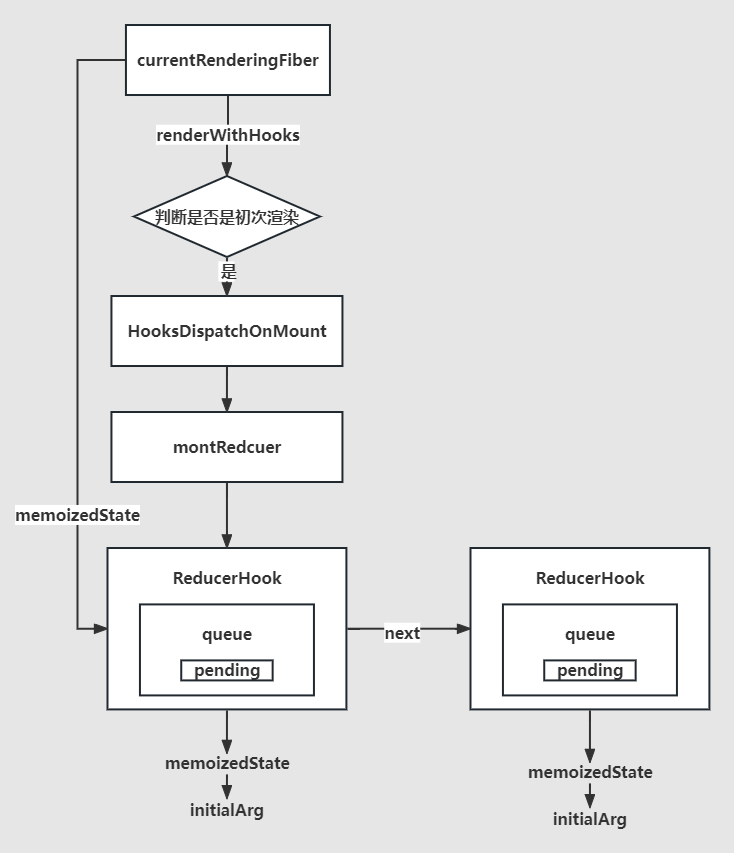

##  React18.2

##  第一节

1. React是什么？

   - [React](https://zh-hans.reactjs.org/)是一个用于构建用户界面的 JavaScript 库
   - 可以通过组件化的方式构建**快速响应**的大型`Web`应用程序

2. 搭建项目，一比一实现React
   1. npm init -y

   2. npm install vite @vitejs/plugin-react  -D

   3. 写vite配置文件：vite.config.js

      ```js
      import path from 'path';
      import { defineConfig } from 'vite';
      import react from '@vitejs/plugin-react';
      
      export default defineConfig({
        plugins: [react()],
        resolve: {
          alias: {
            react: path.posix.resolve('src/react'),
            'react-dom': path.posix.resolve('src/react-dom'),
            'react-dom-bindings': path.posix.resolve('src/react-dom-bindings'),
            'react-reconciler': path.posix.resolve('src/react-reconciler'),
            scheduler: path.posix.resolve('src/scheduler'),
            shared: path.posix.resolve('src/shared')
          }
        }
      });
      ```
      

3. 认识jsx

4. 体验虚拟DOM

5. 区分新老babel转换jsx的不同之处

 

### JSX及其本质

react-dom的commit阶段会渲染React元素（虚拟DOM）到页面上。

JSX的编译和后续执行：


React项目运行的两个环节：

1. 编译阶段，把使用jsx编写的项目源码通过webacpk或者vite中的babel插件——*@babel/plugin-transform-react-jsx*——编译为普通的js代码（具体是React.createElement或者jsxDEV方法调用），这是在node环境中完成的，和浏览器无关
2. 运行阶段，将编译打包后的上线到服务器，用户访问服务器后加载对应的html和js文件，而js文件中的内容就是上一阶段生成的js代码，浏览器会加载并执行React.createElement或者jsxDEV方法，得到虚拟DOM树，再根据虚拟DOM树生成Fiber树，再生成真实的DOM挂载的对应fiber节点上，当到提交阶段是将这些fiber节点对应的真实DOM节点插入到其父fiber对应的真实DOM中，最后将最顶级的fiber节点对应的DOM插入到页面一开始提供的容器。


包含jsxDEV函数调用的代码在发送到浏览器后，浏览器会根据react源码中定义的该jsxDEV方法的代码逻辑进行执行，最后返回一个虚拟DOM树。

```js
// ReactElement是一个工厂函数，用于创建一个个的虚拟DOM节点对象
function ReactElement(type, key, ref, props) {
  // 这就是React元素，也被称为虚拟DOM
  return {
    $$typeof: REACT_ELEMENT_TYPE,  // $$typeof，每个虚拟DOM节点都有，表示节点的类型
    type,// h1 span，如果是函数组件或者类组件，那就是个函数或者类本身
    key,// 唯一标识
    ref,// 用来获取真实DOM元素
    props// 属性 包括：children,style,id...
  }
}
```

​			

jsxDEV函数在浏览器中调用后生成的结构														

```jsx
<h1>
  hello<span style={{ color: 'red' }}>world</span>
</h1>
```

每个虚拟DOM节点会有一个类型属性——`$$typeof`


一个虚拟DOM节点的children属性，可能是一个字符串，数字，对象或者数组，其中数组的中的每一项元素可以是前面3中的某一种。有一点需要注意，上面编写的jsx都是直接使用的原生的标签，如h1,span等，所以它们生成的jsxDEV函数调用的第一个参数都是字符串的'h1'或者'span'等。 **如果编写的是一个函数组件，如下代码：**

```jsx
function FunctionComponent(){
  return (
    <h1>
      hello <span style={{ color: 'red' }}>world!</span>
    </h1>
  )
}

let element = <FunctionComponent number={1}></FunctionComponent>

// 编译后的结果
function FunctionComponent() {
  return /*#__PURE__*/React.createElement("h1", null, "hello ", /*#__PURE__*/React.createElement("span", {
    style: {
      color: 'red'
    }
  }, "world!"));
}

var element = /*#__PURE__*/React.createElement(FunctionComponent, {
  number: 1
});
```

一定要注意对于函数组件的jsx，生成的函数React.createElement调用中第一个参数就是函数本身，也就是说它是可以直接被执行的。


### jsxDEV函数参数

在 React 17 以后，React 引入了新的 JSX 转换机制。在打包编译的时候，生成包括一个名为 `jsxDEV` 的函数，用于在开发环境执行后返回reacr元素。这个函数是由 Babel 或 TypeScript 等工具在编译 JSX 时生成的。


#### `jsxDEV` 函数介绍

在开发环境中，`jsxDEV` 函数用于创建 React 元素，并且可以包含额外的开发时信息，比如源代码位置。这对于调试非常有用，因为它可以提供更好的错误信息和警告。

#### `jsxDEV` 函数的参数

`jsxDEV` 函数通常由编译器生成，直接调用它的场景较少。了解它的参数有助于理解 JSX 编译后的代码。以下是一个典型的 `jsxDEV` 函数签名及其参数：

```js
jsxDEV(type, props, key, isStaticChildren, source, self)
```

- `type`: 元素类型，可以是一个字符串（如 `'div'`）或一个 React 组件（函数或者类）。
- `props`: 元素的属性，是一个对象，包含传递给元素的所有属性和子节点。
- `key`: React 元素的唯一标识符，用于优化元素列表的渲染。
- `isStaticChildren`: 一个布尔值，指示子节点是否为静态（不变化的）。
- `source`: 一个对象，包含额外的元数据信息，如文件名、行号和列号。这对于调试非常有帮助。
- `self`: 当前的 `this` 对象，一般用于在使用 ES6 类组件时保留上下文。


#### 示例

假设有以下 JSX 代码：

```jsx
<div className="container">
  <h1>Hello, World!</h1>
</div>
```

经过编译后，可能会变成以下代码（假设使用 React 17 的新 JSX 转换）：

```js
import { jsxDEV as _jsxDEV } from 'react/jsx-dev-runtime';

_jsxDEV(
  "div",
  {
    className: "container",
    children: _jsxDEV("h1", { children: "Hello, World!" }, void 0, false, {
      fileName: "<your-file-path>",
      lineNumber: 2,
      columnNumber: 3
    }, this)
  },
  void 0,
  false,
  {
    fileName: "<your-file-path>",
    lineNumber: 1,
    columnNumber: 1
  },
  this
);
```

#### 参数详解

1. **type**: `"div"` 和 `"h1"` 分别表示元素类型。
2. props:
   - 对于 `div`，`props` 包含 `className` 和 `children`。
   - 对于 `h1`，`props` 仅包含 `children`。
3. **key**: `void 0` 表示没有提供 `key` 属性。
4. **isStaticChildren**: `false` 表示子节点不是静态的。
5. **source**: 包含元数据，用于开发时的错误提示和调试。比如 `fileName`, `lineNumber` 和 `columnNumber`。
6. **self**: 当前的 `this` 上下文，通常是 `this`。


#### jsxDEV的第一个参数type可能有哪些类型的值

在 React 的 `jsxDEV` 函数中，第一个参数 `type` 指的是要创建的 React 元素的类型。这个参数可以有多种类型的值，具体如下：

##### 1. 字符串

如果 `type` 是一个字符串，它表示一个标准的 HTML 元素。例如：

- `"div"`
- `"span"`
- `"input"`
- `"button"`

```jsx
// JSX
<div className="container"></div>

// 编译后
_jsxDEV("div", { className: "container" }, void 0, false, { fileName: "<file-path>", lineNumber: 1, columnNumber: 1 }, this);

```


#### 2. React 组件

如果 `type` 是一个函数或类，它表示一个 React 组件。组件可以是函数组件或类组件。

##### 函数组件

```jsx
const MyComponent = (props) => {
  return <div>{props.message}</div>;
};

// JSX
<MyComponent message="Hello, World!" />

// 编译后
_jsxDEV(MyComponent, { message: "Hello, World!" }, void 0, false, { fileName: "<file-path>", lineNumber: 1, columnNumber: 1 }, this);
```

##### 类组件

```jsx
class MyComponent extends React.Component {
  render() {
    return <div>{this.props.message}</div>;
  }
}

// JSX
<MyComponent message="Hello, World!" />

// 编译后
_jsxDEV(MyComponent, { message: "Hello, World!" }, void 0, false, { fileName: "<file-path>", lineNumber: 1, columnNumber: 1 }, this);
```

#### 3. React.Fragment

`React.Fragment` 可以用来分组一组子元素而不添加额外的 DOM 元素。`Fragment` 可以使用短语法 `<>...</>` 或者显式地使用 `React.Fragment`。

```jsx
// JSX
<>
  <div>First element</div>
  <div>Second element</div>
</>

// 编译后
_jsxDEV(React.Fragment, { children: [_jsxDEV("div", { children: "First element" }, void 0, false, { fileName: "<file-path>", lineNumber: 2, columnNumber: 3 }, this), _jsxDEV("div", { children: "Second element" }, void 0, false, { fileName: "<file-path>", lineNumber: 3, columnNumber: 3 }, this)] }, void 0, false, { fileName: "<file-path>", lineNumber: 1, columnNumber: 1 }, this);
```


#### 4. React.memo 和 React.forwardRef 包装的组件

React 的高阶组件如 `React.memo` 和 `React.forwardRef` 返回的组件也可以作为 `type`。

##### `React.memo` 包装的组件

```jsx
const MyComponent = React.memo((props) => {
  return <div>{props.message}</div>;
});

// JSX
<MyComponent message="Hello, World!" />

// 编译后
_jsxDEV(MyComponent, { message: "Hello, World!" }, void 0, false, { fileName: "<file-path>", lineNumber: 1, columnNumber: 1 }, this);
```

##### `React.forwardRef` 包装的组件

```jsx
const MyComponent = React.forwardRef((props, ref) => {
  return <div ref={ref}>{props.message}</div>;
});

// JSX
<MyComponent message="Hello, World!" />

// 编译后
_jsxDEV(MyComponent, { message: "Hello, World!" }, void 0, false, { fileName: "<file-path>", lineNumber: 1, columnNumber: 1 }, this);
```

#### 5. `React.lazy` 动态加载的组件

`React.lazy` 用于代码拆分，可以动态加载组件。

```jsx
const MyComponent = React.lazy(() => import('./MyComponent'));

// JSX
<Suspense fallback={<div>Loading...</div>}>
  <MyComponent />
</Suspense>

// 编译后
_jsxDEV(Suspense, { fallback: _jsxDEV("div", { children: "Loading..." }, void 0, false, { fileName: "<file-path>", lineNumber: 1, columnNumber: 1 }, this), children: _jsxDEV(MyComponent, {}, void 0, false, { fileName: "<file-path>", lineNumber: 1, columnNumber: 1 }, this) }, void 0, false, { fileName: "<file-path>", lineNumber: 1, columnNumber: 1 }, this);
```

#### 总结

在 React 中，`jsxDEV` 函数的第一个参数 `type` 可以是：

1. HTML 元素的字符串名称（如 `"div"`, `"span"` 等）。
2. 函数组件或类组件。
3. `React.Fragment`。
4. 使用 `React.memo` 或 `React.forwardRef` 包装的组件。
5. 使用 `React.lazy` 动态加载的组件。


**React17及以后可以不用再主动引入 React 而直接在文件中写 jsx 语法，但是要手动配置开启automatic**。因为新版项目中将 jsx不再转为 React.createElement，但是babel转换后的代码在浏览器中的执行结果是一样的——虚拟DOM对象树。

```jsx
//在React17以前，babel转换是老的写法
const babel = require('@babel/core');
const sourceCode = `
<h1>
  hello<span style={{ color: 'red' }}>world</span>
</h1>
`;
const result = babel.transform(sourceCode, {
  plugins: [
    ["@babel/plugin-transform-react-jsx", { runtime: 'classic' }]
  ]
});

console.log(result.code);

// 打印代码如下
React.createElement("h1", null, "hello", React.createElement("span", {
  style: {
    color: 'red'
  }
}, "world"));
```


React17后的babel编译结果：

```jsx
const babel = require('@babel/core');
const sourceCode = `
<h1>
  hello<span style={{ color: 'red' }}>world</span>
</h1>
`;
const result = babel.transform(sourceCode, {
  plugins: [
    ["@babel/plugin-transform-react-jsx", { runtime: 'automatic' }]
  ]
});
console.log(result.code);

// 打印代码如下
import { jsx } from "react/jsx-runtime";
jsx("h1", {
  children: ["hello", jsx("span", {
    style: {
      color: 'red'
    },
    children: "world"
  })]
});

// React.createElement=jsx
```

新的编译模式下，子节点直接以对象props中的children属性值存在，以前的子节点是作为第3个及其往后参数的方式传入createElement，在createElement中再将他们转为props的children的属性值。


之前项目的情况：

```jsx
import React from 'react';

const App = (props) => {
  return <div>hello world!</div>;
};

export default App;

// 上面的代码不引入React的话，在之前的项目中无法编译。因为jsx最后被转为React.createElement形式，所以看似没有依赖React，实则是有依赖的。  eslint中提示React引入而未使用的尴尬。
```


新版的情况：

```jsx
const App = (props) => {
  return <div>hello world!</div>;
};

export default App;

// 可以直接这么写，编译时会自动引入一个包   import jsx from 'jsx'  最后将jsx转为 jsx()函数调用的方式。
```


在 React 17 或更高版本中，要利用新的 JSX 转换特性，需要确保构建工具和相应的插件正确配置。对于使用 Webpack 的项目，这通常涉及配置 Babel 以使用新的 JSX 转换。以下是一些步骤和要点：

1. **确保安装了所需的依赖**：

   - `@babel/core` 和 `babel-loader` 用于 Webpack 中的 Babel 集成。
   - `@babel/preset-react` 包含 JSX 转换的逻辑。
   - 确保 React 版本是 17 或更高。

2. **在 Babel 配置中启用新的 JSX 运行时**：

   - 在 Babel 配置文件（通常是 `.babelrc` 或 `babel.config.js`）中，设置 `@babel/preset-react` 的 `runtime` 选项为 `"automatic"`。这指示 Babel 使用新的 JSX 转换。

   例如，在 `babel.config.js` 中的配置可能如下所示：

   ```js
   module.exports = {
     presets: [
       "@babel/preset-env",
       ["@babel/preset-react", {
         runtime: "automatic" // 启用新的 JSX 运行时
       }]
     ],
     // 其他配置...
   };
   
   ```

3. **配置 Webpack 的 Babel Loader**：

   - 在你的 Webpack 配置文件中，确保你已经设置了 `babel-loader` 以处理 JavaScript 和 JSX 文件。

   例如，在 `webpack.config.js` 中的相关部分可能如下：

   ```js
   module: {
     rules: [
       {
         test: /\.(js|jsx)$/,
         exclude: /node_modules/,
         use: {
           loader: "babel-loader",
           // Babel 配置在 .babelrc 或 babel.config.js 中指定
         },
       },
       // 其他 loaders...
     ],
   }
   ```

4. **确保 React 版本正确**：

   - 验证 `package.json` 文件中的 React 版本是否为 17 或更高。


## 第二节

在编译阶段将编写的jsx经过babel编译后转为jsxDEV(type,config)的方法调用，而前一节就是在实现jsxDEV这个函数方法，该方法返回一个虚拟DOM（JS对象）。

接下来用react-dom将虚拟DOM变为真实DOM插入已经存在的节点上。

```jsx
import { createRoot } from "react-dom/client";
// React18中，createRoot表示创建一个并发版本的Root（根）

const element = (
  <h1>
    hello<span style={{ color: 'red' }}>world</span>
  </h1>
)

console.log(element)

const root = createRoot(document.getElementById("root"));
root.render(element)
```

createRoot函数接受真实的DOM节点，然后去创建整个项目的根。根本质就是一个类（ReactDOMRoot）的对象实例，该对象实例上有一个属性（_internalRoot），该属性的值是的FiberRootNode，FiberRootNode对象上有一个属性containerInfo属性的值就是createRoot接受的真实DOM节点。如下图：


简单来说FiberRootNode = containerInfo,它的本质就是一个真实的容器DOM节点 `div#root`,其实就是一个真实的DOM，只是稍微包装了一下，后面会指向根Fiber，而这个根Fiber就是整个Fiber树的根节点，根Fiber的真实DOM节点就指向FiberRootNode——整个项目的根。


**为什么React16引入了Fiber架构？**

React15中的render过程是不可中断的，这就导致JS可能长时间霸占主线程，导致UI线程无法工作带来的页面卡顿情况。  

**性能瓶颈**

- JS 任务执行时间过长

  - 浏览器刷新频率为 60Hz,大概 16.6 毫秒渲染一次，而 JS 线程和渲染线程是互斥的，所以如果 JS 线程执行任务时间超过 16.6ms 的话，就会导致掉帧，导致卡顿，解决方案就是 **React 利用空闲的时间进行更新，同时将一个大任务拆分为可以分段执行的小任务，不影响渲染进行的渲染**

  - 把一个耗时任务切分成一个个小任务，分布在每一帧里的方式就叫时间切片 
    >React16以后的Fiber架构已经尽可能的将大任务拆分为小任务了，如果在执行最小粒度的任务时，依旧超过了16.6ms的时长，那么react将无能为力，仍就会出现卡顿的情况。
    >
    >这种调度是合作式调度。

**帧**

- 阻塞输入事件、非阻塞输入事件
- 定时器
- resize、scroll、media query change
- eAF
- 样式计算、布局和绘制
- Javascript 引擎和页面渲染引擎同一个渲染线程，GUI 渲染和 Javascript 执行两者是互斥的
- 如果某个任务执行时间过长，浏览器会推迟渲染


### 时间切片

**requestIdleCallback**

- 希望快速响应用户，不能阻塞用户的交互
- `requestIdleCallback` 使开发者能够在主事件循环上执行后台和低优先级工作，而不会影响延迟关键事件，如动画和输入响应
- 正常帧任务完成后没超过 16 ms,说明时间有富余，此时就会执行 `requestIdleCallback` 里注册的任务
- Reac中自己实现了一个requestIdleCallback，因为原生requestIdleCallback空闲时间不可控且有兼容性问题，里面定义了每帧空闲执行时间为5ms


模拟代码：

```html
<!DOCTYPE html>
<html lang="en">

  <head>
    <meta charset="UTF-8">
    <meta http-equiv="X-UA-Compatible" content="IE=edge">
    <meta name="viewport" content="width=device-width, initial-scale=1.0">
    <title>requestIdleCallback</title>
  </head>

  <body>
    <script>
      function sleep(duration) {
        for (var t = Date.now(); Date.now() - t <= duration;) { }
      }
      // 该fibers中的每一项就是最小的任务单元了，无法再次分割，如果js县城执行了其中一个任务，但是该任务无法在浏览器剩余的空闲时间内执行完全，那么仍旧会出现页面卡顿的情况。
      const fibers = [
        () => {
          console.log('第1个任务开始');
          sleep(5000);
          console.log('第1个任务结束');
        },
        () => {
          console.log('第2个任务开始');
          sleep(20);
          console.log('第2个任务结束');
        },
        () => {
          console.log('第3个任务开始');
          sleep(20);
          console.log('第3个任务结束');
        }
      ]
      requestIdleCallback(workLoop);
      function workLoop(deadline) {
        //因为一帧是16.6ms,浏览器执行完高优先级之后，如果还有时间，会执行workLoop,timeRemaining获取此帧剩下的时间
        console.log(`本帧的剩余时间是`, deadline.timeRemaining());
        //如果没有剩余时间了，就会跳出循环
        while (deadline.timeRemaining() > 1 && works.length > 0) {
          performUnitOfWork();
        }
        //如果还有剩余任务
        if (works.length > 0) {
          console.log(`只剩下${deadline.timeRemaining()}ms，不够了，等待浏览器下次空闲的时候再帮我调用`,);
          requestIdleCallback(workLoop);
        }
      }
      function performUnitOfWork() {
        let work = works.shift();//取出任务数组中的第一个任务,并移除第一个任务
        work();
      }
    </script>
  </body>
</html>
```


### Fiber

React会将大任务拆分为小任务，如何拆？拆多细？一个任务的代表是什么？

- 可以通过某些调度策略合理分配 CPU 资源，从而提高用户的响应速度
- 通过 Fiber 架构，让调和过程变成可被中断。 适时地让出 CPU 执行权，除了可以让浏览器及时地响应用户的交互

fiber定义（fiber是什么）：

1. **Fiber 是一个执行的最小单元**，每次执行完一个执行单元, React 就会检查现在还剩多少时间，如果没有时间就将控制权让出去，React中每个工作单元就是一个fiber。
   

   

2. **Fiber 是一种数据结构**

   - React 目前的做法是使用**链表, 根据jsxDEV函数执行后返回的具有层级的虚拟DOM对象生成，虚拟DOM中的每个虚拟节点内部表示为一个`Fiber`** 
   - 从顶点开始遍历
   - 如果有第一个儿子，先遍历第一个儿子
   - 如果没有第一个儿子，标志着此节点遍历完成
   - 如果有弟弟，遍历弟弟
   - 如果有没有下一个弟弟，返回父节点标识完成父节点遍历，如果有叔叔遍历叔叔
   - 没有父节点遍历结束

为什么Fiber结构可以进行中断后继续执行？fiber树是根据虚拟DOM生成的。

其中根Fiber——**HostRootFiber**，对应的真实DOM节点就是项目html中一开始写好的div#root元素。


### 树遍历

深度优先和广度优先遍历


深度优先：


- 深度优先搜索 DFS 即`Depth First Search`
- 其过程简要来说是对每一个可能的分支路径深入到不能再深入为止，而且每个节点只能访问一次
- 应用场景
  - React 虚拟 DOM 的构建
  - React 的 fiber 构建

```js
let root = {
  name: "A",
  children: [
    {
      name: "B",
      children: [{ name: "B1" }, { name: "B2" }],
    },
    {
      name: "C",
      children: [{ name: "C1" }, { name: "C2" }],
    },
  ],
};

function dfs(node){
  console.log(node.name)
  if(node.children?.length){
    node.children.forEach(childNode=>{
      dfs(childNode)
    })
  }
}
```


广度优先：


- 宽度优先搜索算法（又称广度优先搜索） Breadth First Search
- 算法首先搜索距离为`k`的所有顶点，然后再去搜索距离为`k+l`的其他顶点

```js
let root = {
  name: "A",
  children: [
    {
      name: "B",
      children: [{ name: "B1" }, { name: "B2" }],
    },
    {
      name: "C",
      children: [{ name: "C1" }, { name: "C2" }],
    },
  ],
};

function bfs(node){
	const arr = [node]
  let current
  while(current = arr.shift()){
    console.log(current.name)
    current.children&&arr.push(...current.children)
  }
}

bfs(root)
```


### 链表

1. 单向链表
   
2. 双向链表
   
3. 循环链表
   


带有一个指针的循环链表：


**React中的更新队列就是一个循环链表结构。**

```js
function initialUpdateQueue(fiber) {
  // 创建一个新的更新队列
  // pending 是一个循环链接
  const queue = {
    shared: {
      pending: null  // 指向更新队列的最后一项
    }
  }
  fiber.updateQueue = queue;
}

function createUpdate() {
  return {};
}

// 入队
function enqueueUpdate(fiber, update) {
  const updateQueue = fiber.updateQueue;
  const shared = updateQueue.shared;
  const pending = shared.pending;
  if (pending === null) {
    update.next = update;
  } else {
    //如果更新队列不为空的话，取出第一个更新
    update.next = pending.next;
    //然后让原来队列的最后一个的next指向新的next
    pending.next = update;
  }
  updateQueue.shared.pending = update;
}


function processUpdateQueue(fiber) {
  const queue = fiber.updateQueue;
  const pending = queue.shared.pending;
  if (pending !== null) {
    queue.shared.pending = null;
    //最后一个更新
    const lastPendingUpdate = pending;
    const firstPendingUpdate = lastPendingUpdate.next;
    //把环状链接剪开
    lastPendingUpdate.next = null;
    let newState = fiber.memoizedState;
    let update = firstPendingUpdate;
    while (update) {
      newState = getStateFromUpdate(update, newState);
      update = update.next;
    }
    fiber.memoizedState = newState;
  }
}

function getStateFromUpdate(update, prevState) {
  const payload = update.payload;
  let partialState = payload(prevState);
  return Object.assign({}, prevState, partialState);
}


let fiber = { memoizedState: { id: 1 } };
initialUpdateQueue(fiber);
let update1 = createUpdate();
update1.payload = { name: 'zhufeng' }
enqueueUpdate(fiber, update1)

let update2 = createUpdate();
update2.payload = { age: 14 }
enqueueUpdate(fiber, update2)

//基于老状态，计算新状态
processUpdateQueue(fiber);
console.log(fiber.memoizedState);
```


Fiber之前：虚拟DOM=>真实DOM

Fiber之后：虚拟DOM=>Fiber链表=>真实DOM

### Fiber之前的工作模拟

未使用Fiber架构之前的代码逻辑模拟。

- React 会递归比对VirtualDOM树，找出需要变动的节点，然后同步更新它们。这个过程 React 称为Reconcilation(协调)
- 在`Reconcilation`期间，React 会一直占用着浏览器资源，一则会导致用户触发的事件得不到响应, 二则会导致掉帧，用户可能会感觉到卡顿

```jsx
let element = (
  <div id="A1">
    <div id="B1">
      <div id="C1"></div>
      <div id="C2"></div>
    </div>
    <div id="B2"></div>
  </div>
)

// 下面的jsx转为下面的虚拟DOM结构
let element = {
  "type": "div",
  "key": "A1",
  "props": {
    "id": "A1",
    "children": [
      {
        "type": "div",
        "key": "B1",
        "props": {
          "id": "B1",
          "children": [
            {
              "type": "div",
              "key": "C1",
              "props": { "id": "C1"},
            },
            {
              "type": "div",
              "key": "C2",
              "props": {"id": "C2"},
            }
          ]
        },
      },
      {
        "type": "div",
        "key": "B2",
        "props": {"id": "B2"},
      }
    ]
  },
}

//以前我们直接把vdom渲染成了真实DOM
function render(vdom, container) {
  //根据虚拟DOM生成真实DOM
  let dom = document.createElement(vdom.type);
  //把除children以外的属性拷贝到真实DOM上
  Object.keys(vdom.props).filter(key => key !== 'children').forEach(key => {
    dom[key] = vdom.props[key];
  });
  //把此虚拟DOM的子节点，也渲染到父节点真实DOM上
  if (Array.isArray(vdom.props.children)) {
    vdom.props.children.forEach(child => render(child, dom));
  }
  container.appendChild(dom);
}

render(element, document.getElementById('root'));
```


### Fiber之后的工作模拟

```jsx
let element = (
  <div id="A1">
    <div id="B1">
      <div id="C1"></div>
      <div id="C2"></div>
    </div>
    <div id="B2"></div>
  </div>
)

// 下面的jsx转为下面的虚拟DOM结构
let element = {
  "type": "div",
  "key": "A1",
  "props": {
    "id": "A1",
    "children": [
      {
        "type": "div",
        "key": "B1",
        "props": {
          "id": "B1",
          "children": [
            {
              "type": "div",
              "key": "C1",
              "props": { "id": "C1"},
            },
            {
              "type": "div",
              "key": "C2",
              "props": {"id": "C2"},
            }
          ]
        },
      },
      {
        "type": "div",
        "key": "B2",
        "props": {"id": "B2"},
      }
    ]
  },
}

//下面是根据虚拟DOM构建的Fiber树
//第一步.根据虚拟DOM构建成fiber树
let A1 = { type: 'div', props: { id: 'A1' } };
let B1 = { type: 'div', props: { id: 'B1' }, return: A1 };
let B2 = { type: 'div', props: { id: 'B2' }, return: A1 };
let C1 = { type: 'div', props: { id: 'C1' }, return: B1 };
let C2 = { type: 'div', props: { id: 'C2' }, return: B1 };
//A1的第一个子节点B1
A1.child = B1;
//B1的弟弟是B2
B1.sibling = B2;
//B1的第一个子节点C1
B1.child = C1;
//C1的弟弟是C2
C1.sibling = C2;

//下一个工作单元
let nextUnitOfWork = null;
const hasTimeRemaining = () => Math.floor(Math.random() * 10) % 2 == 0;

//render工作循环
function workLoop() {
  //工作循环每一次处理一个fiber,处理完以后可以暂停
  //如果有下一个任务并且有剩余的时间的话，执行下一个工作单元，也就是一个fiber
  while (nextUnitOfWork && hasTimeRemaining()) {
    //执行一个任务并返回下一个任务
    nextUnitOfWork = performUnitOfWork(nextUnitOfWork);
  }
  console.log('render阶段结束');
  //render阶段结束
}

// 执行一个fiber节点包括 开始和完成两个步骤
function performUnitOfWork(fiber) {// A1
  let child = beginWork(fiber);
  //如果执行完A1之后，会返回A1的第一个子节点
  if (child) {
    return child;
  }
  //如果没有子节点
  while (fiber) {//如果没有子节点说明当前节点已经完成了渲染工作
    completeUnitOfWork(fiber);//可以结束此fiber的渲染了 
    if (fiber.sibling) {//如果它有弟弟就返回弟弟
      return fiber.sibling;
    }
    fiber = fiber.return;//如果没有弟弟让爸爸完成，然后找叔叔
  }
}

function beginWork(fiber) {
  console.log('beginWork', fiber.props.id);
  return fiber.child;//B1
}

function completeUnitOfWork(fiber) {
  console.log('completeUnitOfWork', fiber.props.id);
}

nextUnitOfWork = A1;
workLoop();
```


### 构建current根节点

根Fiber对应的DOM节点就是根容器节点。

React的优化：**如果一个虚拟DOM节点只有一个字节点，且子节点是一个字符串或者数字的情况下，将不再为该子节点创建对应的Fiber节点。**

Fiber树是根据虚拟DOM树来生成的，所以大体结构一样。只是虚拟DOM是对象结构，而Fiber树是链表结构。


上图中的current属性其实就是current树，就是表示当前浏览器渲染好的页面结构的Fiber树。根Fiber节点的stateNode属性就是简单包装过的真实DOM节点。

```diff
+import { createHostRootFiber } from "./ReactFiber";
function FiberRootNode(containerInfo) {
  this.containerInfo = containerInfo;
}

export function createFiberRoot(containerInfo) {
  const root = new FiberRootNode(containerInfo);
+ const uninitializedFiber = createHostRootFiber();
+ root.current = uninitializedFiber;
+ uninitializedFiber.stateNode = root;
  return root;
}
```


```js
/**
 *
 * @param {*} tag fiber的类型 函数组件0  类组件1 原生组件5 根元素3
 * @param {*} pendingProps 新属性，等待处理或者说生效的属性
 * @param {*} key 唯一标识
 */
export function FiberNode(tag, pendingProps, key) {
  this.tag = tag;
  this.key = key;
  this.type = null; //fiber类型，来自于虚拟DOM节点的type  span div p
  //每个虚拟DOM=>Fiber节点=>真实DOM
  this.stateNode = null; //此fiber对应的真实DOM节点  h1=>真实的h1DOM

  this.return = null; //指向父节点
  this.child = null; //指向第一个子节点
  this.sibling = null; //指向弟弟

  //fiber树中的一个个Fiber节点通过虚拟DOM节点创建，虚拟DOM会提供pendingProps，用来创建fiber节点的属性
  this.pendingProps = pendingProps; //等待生效的属性
  this.memoizedProps = null; //已经生效的属性

  //每个fiber还会有自己的状态，每一种fiber 状态存的类型是不一样的
  //类组件对应的fiber 存的就是类的实例的状态, HostRoot存的就是要渲染的元素
  this.memoizedState = null;
  //每个fiber身上还有更新队列
  this.updateQueue = null;
  //副作用的标识，表示要针对此fiber节点进行何种操作
  this.flags = NoFlags; //自己的副作用
  //子节点对应的副使用标识
  this.subtreeFlags = NoFlags;
  //替身，轮替 在后面讲DOM-DIFF的时候会用到
  this.alternate = null;  // 指向的是老的fiber节点
  this.index = 0;
  this.deletions = null;
  this.lanes = NoLanes;
  this.childLanes = NoLanes;
  this.ref = null;
}
// We use a double buffering pooling technique because we know that we'll only ever need at most two versions of a tree.
// We pool the "other" unused  node that we're free to reuse.

// This is lazily created to avoid allocating
// extra objects for things that are never updated. It also allow us to
// reclaim the extra memory if needed.
export function createFiber(tag, pendingProps, key) {
  return new FiberNode(tag, pendingProps, key);
}

export function createHostRootFiber() {
  return createFiber(HostRoot, null, null);
}
```

每种虚拟DOM都会对应自己的fiber tag类型，其中根fiber对应的tag类型是HostRoot，值为3。

React中表示副作用标识，使用的是二进制数据，在进行diff时，会给fiber节点上的flags或者subtreeFlags进行标记，表示进行何种操作（增删改等）。subtreeFlags表示子节点的操作标记，能进行性能优化。

React的执行分为两个阶段：1. render阶段计算副作用。2.commit阶段修改真实DOM，或者说提交副作用。提交阶段是从根节点开始往树下面遍历，如果某一级的Fiber节点上的subtreeFlags为二进制数字0的话，表示该节点下的后代节点都没有任何副作用操作，将不再进行该节点下面的深度遍历，从而优化性能。子节点的副作用通过冒泡层层合并后赋值给祖先节点的subtreeFlags属性。

```js
function bubbleProperties(completedWork) {
  let subtreeFlags = NoFlags;
  let child = completedWork.child;
  while (child !== null) {
    subtreeFlags |= child.subtreeFlags;
    subtreeFlags |= child.flags;
    child = child.sibling;
  }
  completedWork.subtreeFlags |= subtreeFlags;
}
```

在React18以前，会收集effect，React18.2以后就删除了所有的effect，而不再收集effect。


上面的过程已经将页面初始化时对应current给构建好了，接下来需要根据虚拟DOM开始构建workInProgress树。

将虚拟DOM放在current树fiber的更新队列属性updateQueue上。 

调用root.render方法开启的代码流程：

### 构建workInProgress树

Fiber树有两棵：

1. current树

   对应的是的当前根容器呈现的DOM内容

2. workInProgress树


```js
/**
 *
 * @param {*} tag fiber的类型 函数组件0  类组件1 原生组件5 根元素3
 * @param {*} pendingProps 新属性，等待处理或者说生效的属性
 * @param {*} key 唯一标识
 */
export function FiberNode(tag, pendingProps, key) {
  this.tag = tag;
  this.key = key;
  this.type = null; //fiber类型，来自于 虚拟DOM节点的type  span div p
  //每个虚拟DOM=>Fiber节点=>真实DOM
  this.stateNode = null; //此fiber对应的真实DOM节点  h1=>真实的h1DOM

  this.return = null; //指向父节点
  this.child = null; //指向第一个子节点
  this.sibling = null; //指向弟弟

  //fiber哪来的？通过虚拟DOM节点创建，虚拟DOM会提供pendingProps用来创建fiber节点的属性
  this.pendingProps = pendingProps; //等待生效的属性
  this.memoizedProps = null; //已经生效的属性

  //每个fiber还会有自己的状态，每一种fiber 状态存的类型是不一样的
  //类组件对应的fiber 存的就是类的实例的状态, HostRoot存的就是要渲染的元素
  this.memoizedState = null;
  //每个fiber身上可能还有更新队列
  this.updateQueue = null;
  //副作用的标识，表示要针对此fiber节点进行何种操作
  this.flags = NoFlags; //自己的副作用
  //子节点对应的副使用标识
  this.subtreeFlags = NoFlags;
  //替身，轮替 在后面讲DOM-DIFF的时候会用到
  this.alternate = null;
  this.index = 0;   // 表示该Fiber节点在父Fiber节点中是第几个子Fiber节点 从0开始
  this.deletions = null;
  this.lanes = NoLanes;
  this.childLanes = NoLanes;
  this.ref = null;
}
// We use a double buffering pooling technique because we know that we'll only ever need at most two versions of a tree.
// We pool the "other" unused  node that we're free to reuse.

// This is lazily created to avoid allocating
// extra objects for things that are never updated. It also allow us to
// reclaim the extra memory if needed.
export function createFiber(tag, pendingProps, key) {
  return new FiberNode(tag, pendingProps, key);
}

export function createHostRootFiber() {
  return createFiber(HostRoot, null, null);
}
```


前面已经创建好整个项目的根Fiber节点了，现在要根据虚拟DOM构建一个完整的Fiber树。而虚拟DOM是通过ReactDOM.render方法传入的，所以需要**将虚拟DOM放到根Fiber的更新队列上的**。对于根节点来说，更新队列上放的是虚拟DOM。 每个fiber节点都有一个更新队列，用于存放需要更新的信息放到队列中。

​	

### 将虚拟DOM加入根Fiber的更新队列

```js
ReactDOMRoot.prototype.render = function (children) {
  const root = this._internalRoot;
  root.containerInfo.innerHTML = '';
  updateContainer(children, root);
}

/**
 * 更新容器，把虚拟dom element变成真实DOM插入到container容器中
 * @param {*} element 虚拟DOM
 * @param {*} container DOM容器 FiberRootNode containerInfo div#root
 */
export function updateContainer(element, container) {
  //获取当前的根fiber
  const current = container.current;
  //创建更新
  const update = createUpdate(lane);
  //要更新的虚拟DOM
  update.payload = { element }; //h1
  //把此更新对象添加到current这个根Fiber的更新队列上,返回根节点
  const root = enqueueUpdate(current, update);  // 这里就将虚拟DOM树加入到了根Fiber节点的更新队列中，并返回根节点。
  scheduleUpdateOnFiber(root);
}


export function enqueueUpdate(fiber, update) {
  const updateQueue = fiber.updateQueue;
  const pending = updateQueue.shared.pending;
  if (pending === null) {
    update.next = update;
  } else {
    update.next = pending.next;
    pending.next = update;
  }
  //pending要指向最后一个更新，最后一个更新 next指向第一个更新
  //单向循环链表
  updateQueue.shared.pending = update;
  return markUpdateLaneFromFiberToRoot(fiber);
}

/**
 * 本来此文件要处理更新优先级的问题
 * 目前现在只实现向上找到根节点
 */
export function markUpdateLaneFromFiberToRoot(sourceFiber) {
  let node = sourceFiber;//当前fiber
  let parent = sourceFiber.return;//当前fiber父fiber
  while (parent !== null) {
    node = parent;
    parent = parent.return;
  }
  //一直找到parent为null
  if (node.tag === HostRoot) {
    return node.stateNode;
  }
  return null;
}
```

markUpdateLaneFromFiberToRoot这是一个被共享的方法，用于标记fiber的更新赛道，并最后返回项目的根节点。

react中的更新优先级是通过赛道来实现的，将更新赛道以32位二进制数来区别，数值越小赛道的优先级越高，每个更新会对应一个赛道的数值。假设某个节点下的后代fiber节点中有自己的lanes的值为2，当处理这个fiber节点时，他的lanes的值会向上冒泡（沿路上的fiber节点的childLanes都会包含这个数值），直到根fiber节点的childLanes收到来自该节点的更新赛道数值。


### 构建workinProgress树


```js
import { scheduleCallback } from "scheduler";


let workInProgress = null;
export function scheduleUpdateOnFiber(root) {
  ensureRootIsScheduled(root);
}

function ensureRootIsScheduled(root) {
  scheduleCallback(performConcurrentWorkOnRoot.bind(null, root));
}

function performConcurrentWorkOnRoot(root) {
    // 以同步的方式开始从根节点开启构建fiber链表和渲染
    // 初次渲染时，不过是在并发模式还是异步模式下都是同步的，为的是初次渲染尽快的渲染出页面
  renderRootSync(root);
}

function scheduleCallback(callback) {
  requestIdleCallback(callback);
}

function renderRootSync(root) {
  prepareFreshStack(root);
}

function prepareFreshStack(root) {
  workInProgress = createWorkInProgress(root.current, null);  // 根据老根Fiber创建一个新的根Fiber,并赋值给了workInProgress
  console.log(workInProgress);
}

/**
 * 基于老的fiber和新的属性创建新的fiber
 * 1.current和workInProgress不是一个对象
 * 2.workInProgress
 *   2.1有两种情况，一种是没有，创建一个新，互相通过alternate指向
 *   2.2 存在alternate,直接复用老的alternate就可以了
 * 复用有两层含义
 * 1.复用老的fiber对象
 * 2.复用老的真实DOM
 * @param {*} current 老fiber
 * @param {*} pendingProps 新属性
 */
export function createWorkInProgress(current, pendingProps) {
  let workInProgress = current.alternate;
  if (workInProgress === null) {
    workInProgress = createFiber(current.tag, pendingProps, current.key);
    workInProgress.stateNode = current.stateNode;
    workInProgress.alternate = current;
    current.alternate = workInProgress;
  } else {
    workInProgress.pendingProps = pendingProps;
    workInProgress.flags = NoFlags;
    workInProgress.subtreeFlags = NoFlags;
    workInProgress.deletions = null;
  }
  workInProgress.type = current.type;
  workInProgress.child = current.child;
  workInProgress.memoizedProps = current.memoizedProps;
  workInProgress.memoizedState = current.memoizedState;
  workInProgress.updateQueue = current.updateQueue;
  workInProgress.sibling = current.sibling;
  workInProgress.index = current.index;
  workInProgress.ref = current.ref;
  workInProgress.flags = current.flags;
  workInProgress.lanes = current.lanes;
  workInProgress.childLanes = current.childLanes;
  return workInProgress;
}
```


### 递归构建整棵workinProgress树

```js
function renderRootSync(root) {
  prepareFreshStack(root);
  workLoopSync();
}

function workLoopSync() {
  while (workInProgress !== null) {
    performUnitOfWork(workInProgress);
  }
}

/**
* 执行一个工作单元
* @param {*} unitOfWork
*/
function performUnitOfWork(unitOfWork) {
  // 获取新的fiber对应的老fiber
  const current = unitOfWork.alternate;
  // 完成当前fiber的子fiber链表构建后 unitOfWork.memoizedProps = unitOfWork.pendingProps;
  const next = beginWork(current, unitOfWork);
  unitOfWork.memoizedProps = unitOfWork.pendingProps;
  if (next === null) {
    // 如果没有子节点表示当前的fiber已经完成了
    completeUnitOfWork(unitOfWork);
  } else {
    // 如果有子节点，就让子节点成为下一个工作单元
    workInProgress = next;
  }
}


/**
 * 构建原生组件的子fiber链表
 * @param {*} current 老fiber
 * @param {*} workInProgress 新fiber h1
 */
function updateHostComponent(current, workInProgress) {
  const { type } = workInProgress;
  const nextProps = workInProgress.pendingProps;
  let nextChildren = nextProps.children;
  //判断当前虚拟DOM它的儿子是不是一个文本独生子
  const isDirectTextChild = shouldSetTextContent(type, nextProps);
  if (isDirectTextChild) {
    nextChildren = null;
  }
  reconcileChildren(current, workInProgress, nextChildren);
  return workInProgress.child;
}

/**
 * 挂载函数组件
 * @param {*} current  老fiber
 * @param {*} workInProgress 新的fiber
 * @param {*} Component 组件类型，也就是函数组件的定义
 */
export function mountIndeterminateComponent(current, workInProgress, Component) {
  const props = workInProgress.pendingProps;
  //const value = Component(props);
  const value = renderWithHooks(current, workInProgress, Component, props);
  workInProgress.tag = FunctionComponent;
  reconcileChildren(current, workInProgress, value);
  return workInProgress.child;
}
export function updateFunctionComponent(current, workInProgress, Component, nextProps, renderLanes) {
  const nextChildren = renderWithHooks(current, workInProgress, Component, nextProps, renderLanes);
  reconcileChildren(current, workInProgress, nextChildren);
  return workInProgress.child;
}


/**
 * 根据虚拟DOM生成新的Fiber链表
 * @param {*} current 老的父Fiber
 * @param {*} workInProgress 新的你Fiber
 * @param {*} nextChildren 根Fiber节点上虚拟DOM树
 */
function reconcileChildren(current, workInProgress, nextChildren) {
  //如果此新fiber没有老fiber,说明此新fiber是新创建的
  //如果此fiber没能对应的老fiber,说明此fiber是新创建的，如果这个父fiber是新的创建的，它的儿子们也肯定都是新创建的
  if (current === null) {
    workInProgress.child = mountChildFibers(workInProgress, null, nextChildren);  // 给父Fiber节点挂在子Fiber节点
  } else {
    //如果说有老Fiber的话，做DOM-DIFF 拿老的子fiber链表和新的子虚拟DOM进行比较 ，进行最小化的更新
    workInProgress.child = reconcileChildFibers(workInProgress, current.child, nextChildren);
  }
}

function updateHostRoot(current, workInProgress) {
  processUpdateQueue(workInProgress, nextProps); //workInProgress.memoizedState={ element } element就是根Fiber节点上的虚拟DOM
  const nextState = workInProgress.memoizedState;
  //nextChildren就是新的子虚拟DOM
  const nextChildren = nextState.element; //h1
  //根据根Fiber节点上的虚拟DOM生成子fiber链表
  reconcileChildren(current, workInProgress, nextChildren);
  return workInProgress.child; //{tag:5,type:'h1'}
}

/**
 * 目标是根据新虚拟DOM构建新的fiber子链表 child  child.sibling
 * @param {*} current 老fiber
 * @param {*} workInProgress 新的fiber h1
 * @returns
 */
export function beginWork(current, workInProgress) {
  switch (workInProgress.tag) {
    case HostRoot:  // 根Fiber节点
      return updateHostRoot(current, workInProgress);
    case HostComponent:
      return updateHostComponent(current, workInProgress);
    case HostText:
      return null;
    default:
      return null;
  }
}
```

一个组件中，一般会有很多个Fiber单元。 


## 函数组件

```jsx
function FunctionComponent(props) {
  // hooks 用到更新 更新需要有事件触发
  return (
    <h1 id="container" onClick={() => console.log('click')}>
      hello<span style={{ color: "red" }}>world</span>
    </h1>
  )
}
let element = <FunctionComponent />
//old let element = React.createElement(FunctionComponent,{id:'container',onClick:() => console.log('click') });
//new let element = jsx(FunctionComponent,{id:'container',onClick:() => console.log('click')} );
const root = createRoot(document.getElementById("root"));
//把element虚拟DOM渲染到容器中
root.render(element);
```

函数组件在使用时由babel编译生成的虚拟DOM：


因为hooks涉及组件的更新，而更新需要由事件触发，所以需要先实现事件系统。

React源码库中的协调库（react-reconciler）处理工作循环（构建fiber链表），组件渲染，DOM Diff，DOM提交

每一个fiber节点实例都有自己的updateQueue属性（更新链表），但是该属性的值却并不完全相同，不同的fiber节点的updateQueue的值并不总是相同，对于根Fiber，他的updateQueue存放的是虚拟DOM树对象；对于函数组件的fiber，它的updateQueue的值是hooks链表。


## 事件

事件流包含三个阶段

- 事件捕获阶段
- 处于目标阶段
- 事件冒泡阶段

事件的目标：

```js
//w3c浏览器：event.target
//IE6、7、8： event.srcElement
let target = event.target || event.srcElement;
```


```js
element.addEventListener(event, function, useCapture)  // useCapture参数是true，则在捕获阶段绑定函数，反之false，在冒泡阶段绑定函数
```

阻止事件冒泡或者继续向下捕获：

```js
function stopPropagation(event) {
    if (!event) {
        window.event.cancelBubble = true;
    }
    if (event.stopPropagation) {
        event.stopPropagation();
    }
}
```

阻止默认行为：

```js
function preventDefault(event) {
    if (!event) {
        window.event.returnValue = false;
    }
    if (event.preventDefault) {
        event.preventDefault();
    }
}
```


React的事件系统依赖的是事件代理，利用事件捕获和冒泡来实现的。

- 可以大量节省内存占用，减少事件注册
- 当新增子对象时无需再次对其绑定


### 事件绑定

自己模式实现react的事件系统。

```html
<!DOCTYPE html>
<html lang="en">
    <head>
        <meta charset="UTF-8">
        <meta http-equiv="X-UA-Compatible" content="IE=edge">
        <meta name="viewport" content="width=device-width, initial-scale=1.0">
        <title>Document</title>
    </head>

    <body>
        <div id="root">
            <div id="parent" xx="yy">
                <div id="child">点击</div>
            </div>
        </div>
    </body>
    <script>
        var parentBubble = () => {
            console.log('父React冒泡');
        }
        var parentCapture = () => {
            console.log('父React捕获');
        }
        var childBubble = () => {
            console.log('子React冒泡');
        }
        var childCapture = () => {
            console.log('子React捕获');
        }
        let root = document.getElementById('root');
        let parent = document.getElementById('parent');
        let child = document.getElementById('child');
        parent.onxxClick = parentBubble;
        parent.onxxClickCapture = parentCapture;
        child.onxxClick = childBubble;
        child.onxxClickCapture = childCapture;
        //模拟React中的事件委托 
        root.addEventListener('click', (event) => dispatchEvent(event, true), true);
        root.addEventListener('click', (event) => dispatchEvent(event, false), false);
        function dispatchEvent(event, isCapture) {
            let paths = [];//child parent div#root
            let currentTarget = event.target;
            while (currentTarget) {
                paths.push(currentTarget);
                currentTarget = currentTarget.parentNode;
            }
            if (isCapture) {
                for (let i = paths.length - 1; i >= 0; i--) {
                    let handler = paths[i].onxxClickCapture;
                    handler && handler();
                }
            } else {
                for (let i = 0; i < paths.length; i++) {
                    let handler = paths[i].onxxClick;
                    handler && handler();
                }
            }
        }
        parent.addEventListener('click', () => {
            console.log('父原生捕获');
        }, true);
        parent.addEventListener('click', () => {
            console.log('父原生冒泡');
        }, false);
        child.addEventListener('click', () => {
            console.log('子原生捕获');
        }, true);
        child.addEventListener('click', () => {
            console.log('子原生冒泡');
        }, false);
    </script>
</html>
```


React中的合成事件系统分为三个大的阶段：

1. 事件名注册阶段（是在初始化项目时处理），也就是通过react的事件插件系统，向一个变量set集合中添加各种事件名，比如click等
2. 事件绑定阶段（也是在初始化项目时处理）


3. 事件触发阶段

   1. 事件提取阶段

      

   2. 事件执行阶段

      


React中fiber节点如果有对应的真实DOM元素，在根据fiber创建真实的DOM元素时，会将该DOM元素和这个fiber节点建立一个对应关系，以便于后续事件触发时，通过目标元素（event.target）这个真实的DOM元素去获取它的fiber节点，然后再通过Fiber节点的return属性链，依次找到parentNode链，然后依次调用上节点上的事件处理函数。

```js
const randomKey = Math.random().toString(36).slice(2);
const internalInstanceKey = '__reactFiber$' + randomKey;

export function createInstance(type, props, internalInstanceHandle) {
  const domElement = document.createElement(type);
  precacheFiberNode(internalInstanceHandle, domElement);
  //把属性直接保存在domElement的属性上
  updateFiberProps(domElement, props);
  return domElement;
}

/**
 * 提前缓存fiber节点的实例到DOM节点上
 * @param {*} hostInst 
 * @param {*} node 
 */
export function precacheFiberNode(hostInst, node) {
  node[internalInstanceKey] = hostInst;
}
```


React中事件代理是绑定在根容器，一般就是div#root那个真实的DOM元素中的。捕获和冒泡阶段会触发一次root的对应事件，每次事件触发都会根据事件源对象，依次往外收集parentNode节点，收集完成后（收集的需要依次触发事件的真实节点放在一个数组中），然后倒叙或者正序循环这些真实DOM，实时地取出DOM中挂载上的对应捕获或者冒泡阶段的事件并执行。

React中的事件代理的绑定只有一次，对于之后如果某个元素更新了或者新增的事件，后面触发源元素的新绑定的事件时，会捕获或者冒泡到根容器上，然后根容器在实时去或者给源元素绑定的那个事件，再取出来执行。

react源码中对于事件系统，为了方便以后的扩展，采用了一个插件系统，将不同事件名的注册和事件的绑定彼此分离，利于扩展和维护。

事件代理的绑定时刻：

```js
import { listenToAllSupportedEvents } from 'react-dom-bindings/src/events/DOMPluginEventSystem';

export function createRoot(container) {// div#root
  const root = createContainer(container);
  listenToAllSupportedEvents(container);  // 这个函数就是在为container容器上绑定代理事件
  return new ReactDOMRoot(root);
}
```


事件绑定：

```js
const listeningMarker = `_reactListening` + Math.random().toString(36).slice(2);
export function listenToAllSupportedEvents(rootContainerElement) {
    //监听根容器，也就是div#root只监听一次
    if (!rootContainerElement[listeningMarker]) {
        rootContainerElement[listeningMarker] = true;
        // 遍历所有的原生的事件比如click,进行监听
        allNativeEvents.forEach((domEventName) => {
            listenToNativeEvent(domEventName, true, rootContainerElement);
            listenToNativeEvent(domEventName, false, rootContainerElement);
        });
    }
}

/**
 * 注册原生事件
 * @param {*} domEventName 原生事件 click
 * @param {*} isCapturePhaseListener 是否是捕获阶段 true false
 * @param {*} target 目标DOM节点 div#root 容器节点
 */
export function listenToNativeEvent(domEventName, isCapturePhaseListener, target) {
    let eventSystemFlags = 0;//默认是0指的是冒泡  4是捕获
    if (isCapturePhaseListener) {
        eventSystemFlags |= IS_CAPTURE_PHASE;
    }
    addTrappedEventListener(target, domEventName, eventSystemFlags, isCapturePhaseListener);
}

function addTrappedEventListener(
targetContainer, domEventName, eventSystemFlags, isCapturePhaseListener
) {
    const listener = createEventListenerWrapperWithPriority(targetContainer, domEventName, eventSystemFlags);
    if (isCapturePhaseListener) {
        addEventCaptureListener(targetContainer, domEventName, listener);
    } else {
        addEventBubbleListener(targetContainer, domEventName, listener);
    }
}

export function createEventListenerWrapperWithPriority(
targetContainer,
 domEventName,
 eventSystemFlags
) {
    // 实际并不这么简单，因为不同的事件，react还为他们区分了优先级，由不同的回调函数的
    const listenerWrapper = dispatchDiscreteEvent;
    return listenerWrapper.bind(null, domEventName, eventSystemFlags, targetContainer);
}
/**
 * 派发离散的事件的的监听函数
 * @param {*} domEventName 事件名 click
 * @param {*} eventSystemFlags 阶段 0 冒泡 4 捕获
 * @param {*} container 容器div#root
 * @param {*} nativeEvent 原生的事件
 */
function dispatchDiscreteEvent(domEventName, eventSystemFlags, container, nativeEvent) {
    dispatchEvent(domEventName, eventSystemFlags, container, nativeEvent);
}
/**
 * 此方法就是委托给容器的回调，当容器#root在捕获或者说冒泡阶段处理事件的时候会执行此函数
 * @param {*} domEventName 
 * @param {*} eventSystemFlags 
 * @param {*} container 
 * @param {*} nativeEvent 
 */
export function dispatchEvent(domEventName, eventSystemFlags, targetContainer, nativeEvent) {
    function getEventTarget(nativeEvent) {
        const target = nativeEvent.target || nativeEvent.srcElement || window;
        return target;
    }

    /**
     * 从真实的DOM节点上获取它对应的fiber节点
     * @param {*} targetNode 
     */
    export function getClosestInstanceFromNode(targetNode) {
        const targetInst = targetNode[internalInstanceKey]
        return targetInst;
    }
    
    //获取事件源，它是一个真实DOM
    const nativeEventTarget = getEventTarget(nativeEvent);
    const targetInst = getClosestInstanceFromNode(nativeEventTarget);  // targetInst为该真实DOM对应的Fiber节点
    dispatchEventForPluginEventSystem(
        domEventName,//click
        eventSystemFlags,//0 4
        nativeEvent,//原生事件
        targetInst,//此真实DOM对应的fiber
        targetContainer//目标容器
    );
}

export function addEventCaptureListener(target, eventType, listener) {
    target.addEventListener(eventType, listener, true);
    return listener;
}
export function addEventBubbleListener(target, eventType, listener) {
    target.addEventListener(eventType, listener, false);
    return listener;
}
```

如何去获取DOM元素的事件处理函数了？  react源码中会在completeWork中根据fiber创建真实的DOM节点是，为真实的DOM节点添加一个特殊属性internalPropsKey，该属性的值就是fiber的props，而fiber的props就是由jsx经过bable编译后得到的，jsx上就写有元素的事件处理函数。


```jsx
function FunctionComponent() {
  // hooks 用到更新 更新需要有事件触发
  return (
    <h1
      onClick={() => console.log(`父冒泡`)}
      onClickCapture={() => console.log(`父捕获`)}
    >
      <span
        onClick={() => console.log(`子冒泡`)}
        onClickCapture={() => console.log(`子捕获`)}
      >world</span>
    </h1>
  )
}
let element = <FunctionComponent />
```


```js
import { jsx as _jsx } from "react/jsx-runtime";
function FunctionComponent() {
  // hooks 用到更新 更新需要有事件触发
  return /*#__PURE__*/_jsx("h1", {
    onClick: function onClick() {
      return console.log("\u7236\u5192\u6CE1");
    },
    onClickCapture: function onClickCapture() {
      return console.log("\u7236\u6355\u83B7");
    },
    children: /*#__PURE__*/_jsx("span", {
      onClick: function onClick() {
        return console.log("\u5B50\u5192\u6CE1");
      },
      onClickCapture: function onClickCapture() {
        return console.log("\u5B50\u6355\u83B7");
      },
      children: "world"
    })
  });
}
var element = /*#__PURE__*/_jsx(FunctionComponent, {});
```


### 合成事件

在 React 18 中，"合成事件"（Synthetic Events）是一种事件系统，它是 React 提供的一种跨浏览器的事件处理机制。它在**底层封装了原生浏览器事件**，并提供了一致的 API 和行为，使开发者可以方便地处理和操作事件。

合成事件的出现是**为了解决不同浏览器之间事件系统的差异性**，以及提供更高效的事件处理机制。React 通过合成事件将事件处理逻辑抽象出来，使开发者可以以一种统一的方式处理事件，而不必关心底层的浏览器差异。

合成事件的特点和优势包括：

1. 跨浏览器兼容性：合成事件屏蔽了底层浏览器的差异，使得开发者可以编写一致的事件处理代码，而不必关心不同浏览器之间的差异。
2. 性能优化：React 的合成事件系统使用了**事件委托**（event delegation）的机制，将事件监听器绑定到顶层容器元素上，减少了事件监听器的数量，提高了性能。
3. 事件池：合成事件使用了事件池（event pooling）的技术，重用了事件对象，减少了对象创建和销毁的开销，提升了性能。
4. 事件委托：合成事件利用事件委托的思想，将事件处理交给父级元素处理，通过冒泡机制传递到目标元素，简化了事件绑定和管理的复杂性。
5. 兼容性扩展：合成事件还提供了一些额外的特性和方法，如阻止事件冒泡、阻止默认行为、获取事件相关信息等，方便开发者处理和操作事件。

总结来说，React 18 中的合成事件是一种封装了原生浏览器事件的高级事件系统，它提供了一致的 API 和行为，解决了浏览器差异性和提升了性能，使开发者能够以一种更简单、高效和可靠的方式处理和管理事件。


针对不同类型的事件，比如鼠标点击，移动，键盘事件等，需要的合成事件的构建函数是不同的。

```js
import { registerSimpleEvents, topLevelEventsToReactNames } from '../DOMEventProperties';
import { IS_CAPTURE_PHASE } from '../EventSystemFlags';
import { accumulateSinglePhaseListeners } from '../DOMPluginEventSystem';
import { SyntheticMouseEvent } from '../SyntheticEvent';
/**
 * 把要执行回调函数添加到dispatchQueue中
 * @param {*} dispatchQueue 派发队列，里面放置我们的监听函数
 * @param {*} domEventName DOM事件名 click
 * @param {*} targetInst 目标fiber
 * @param {*} nativeEvent 原生事件
 * @param {*} nativeEventTarget 原生事件源
 * @param {*} eventSystemFlags  事件系统标题 0 表示冒泡 4表示捕获
 * @param {*} targetContainer  目标容器 div#root
 */
function extractEvents(
  dispatchQueue,
  domEventName,
  targetInst,
  nativeEvent,
  nativeEventTarget,//click => onClick
  eventSystemFlags,
  targetContainer) {
  const reactName = topLevelEventsToReactNames.get(domEventName);//click=>onClick
  let SyntheticEventCtor;//合成事件的构建函数
  switch (domEventName) {
    case 'click':
      SyntheticEventCtor = SyntheticMouseEvent;
      break;
    default:
      break;
  }
  const isCapturePhase = (eventSystemFlags & IS_CAPTURE_PHASE) !== 0;//是否是捕获阶段
  const listeners = accumulateSinglePhaseListeners(
    targetInst,
    reactName,
    nativeEvent.type,
    isCapturePhase
  );
  //如果有要执行的监听函数的话[onClickCapture,onClickCapture]=[ChildCapture,ParentCapture]
  if (listeners.length > 0) {
    const event = new SyntheticEventCtor(
      reactName, domEventName, null, nativeEvent, nativeEventTarget);
    dispatchQueue.push({
      event,//合成事件实例
      listeners//监听函数数组
    });
  }
}
```

React源码中，针对不同类型的事件，它定义了一系列的接口，将接口中存在的属性作为作为key，同时基于原事件对象的值重新创建出一个新的event事件对象，同时在这个新的event对象中会扩展一些新的属性和方法。

```js
import assign from "shared/assign";

function functionThatReturnsTrue() {
  return true;
}
function functionThatReturnsFalse() {
  return false;
}
// 接口
const MouseEventInterface = {
  clientX: 0,
  clientY: 0
  // ...
}

function createSyntheticEvent(inter) {
  /**
   *合成事件的基类
   * @param {*} reactName React属性名 onClick
   * @param {*} reactEventType click
   * @param {*} targetInst 事件源对应的fiber实例
   * @param {*} nativeEvent 原生事件对象
   * @param {*} nativeEventTarget 原生事件源 span 事件源对应的那个真实DOM
   */
  function SyntheticBaseEvent(
    reactName, reactEventType, targetInst, nativeEvent, nativeEventTarget) {
    this._reactName = reactName;
    this.type = reactEventType;
    this._targetInst = targetInst;
    this.nativeEvent = nativeEvent; // 如果要通过合成事件对象或者原生的事件对象，可以通过这个属性获取
    this.target = nativeEventTarget;
    //把此接口上对应的属性从原生事件上拷贝到合成事件实例上
    for (const propName in inter) {
      if (!inter.hasOwnProperty(propName)) {
        continue;
      }
      this[propName] = nativeEvent[propName]
    }
	
    //是否已经阻止默认事件
    this.isDefaultPrevented = functionThatReturnsFalse;
    //是否已经阻止继续传播
    this.isPropagationStopped = functionThatReturnsFalse;
    return this;
  }
    
  // 重写原型链中的部分方法，实现浏览器之间差异的抹平处理
  assign(SyntheticBaseEvent.prototype, {
    preventDefault() {
      const event = this.nativeEvent;
      if (event.preventDefault) {
        event.preventDefault();
      } else {
        event.returnValue = false;
      }
      this.isDefaultPrevented = functionThatReturnsTrue;
    },
    stopPropagation() {
      const event = this.nativeEvent;
      if (event.stopPropagation) {
        event.stopPropagation();
      } else {
        event.cancelBubble = true;
      }
      this.isPropagationStopped = functionThatReturnsTrue;
    }
  });
  return SyntheticBaseEvent;
}
export const SyntheticMouseEvent = createSyntheticEvent(MouseEventInterface);
```

[流程图](https://www.processon.com/diagraming/65b32e8ec1249f2ce98ccdee0)


## Hooks

### useReducer

基本使用：

```jsx
import * as React from 'react';
import { createRoot } from "react-dom/client";

function counter(state, action) {
  if (action.type === 'add') return state + action.payload;
  return state;
}

function FunctionComponent() {
  debugger
  const [number, setNumber] = React.useReducer(counter, 0);
  return <button onClick={() => {
    setNumber({ type: 'add', payload: 1 });//update1=>update2=>update3=>update1
    setNumber({ type: 'add', payload: 2 });//update2
    setNumber({ type: 'add', payload: 3 });//update3 
  }}>{number}</button>
}

let element = <FunctionComponent />
const root = createRoot(document.getElementById("root"));
root.render(element);

```


#### 初次挂载

hooks函数是在函数组件（函数体）中调用的。hooks的执行分为初次渲染和更新两个阶段。

Hooks在React的源码中，是在React包下面导出，但是真正的代码逻辑是在React-Reconciler包中实现的。要从React包中关联React-Reconciler中的方法，为此，React框架在源码中设置了一个类似全局共享的变量对象ReactSharedInternals，内部存放了需要被共享的数据。

```js
const ReactCurrentDispatcher = {
  current: null
}
export default ReactCurrentDispatcher;

const ReactSharedInternals = {
  ReactCurrentDispatcher
}
export default ReactSharedInternals;

export {
  useReducer,
  ReactSharedInternals as __SECRET_INTERNALS_DO_NOT_USE_OR_YOU_WILL_BE_FIRED
}
```


初次挂载阶段：



在函数组件执行之前，需要先给全局共享的变量（ReactCurrentDispatcher.current）赋值上相应的hook的实现函数，然后调用函数组件函数，函数体中会调用前一步挂载到全局共享变量上的相应的hook函数。

这里以useReducer的源码来分析，一个函数组件中可以有0或多个useReducer调用，对于每一个useReducer调用，在源码中都会创建一个hook对象，该hook对象上有三个重点属性：memoizedState，queue，next。

重点需要注意，对于每一个函数组件对应的fiber节点的memoizedState属性会指向该函数组件的内部第一个调用的hook函数生成的hook对象，见下面代码的第9行。  同时如果一个函数组件中多次调用hook，那么每次调用hook创建的hook对象会通过next属性进行连接，构成一个hook链表。

```js
function mountWorkInProgressHook() {
  const hook = {
    memoizedState: null,//hook的状态 
    queue: null,//存放本hook的更新队列 queue.pending=update的循环链表
    next: null //指向下一个hook,一个函数里可以会有多个hook,它们会组成一个单向链表
  };
  if (workInProgressHook === null) {
    //当前函数对应的fiber的状态等于第一个hook对象
    currentRenderingFiber.memoizedState = workInProgressHook = hook;
  } else {
    workInProgressHook = workInProgressHook.next = hook;
  }
  return workInProgressHook;
}
```

所以hooks的本质是存放在函数组件对应的fiber节点的memoizedState属性上的链表。

```js
import ReactSharedInternals from "shared/ReactSharedInternals";

const { ReactCurrentDispatcher } = ReactSharedInternals;
let currentRenderingFiber = null;
let workInProgressHook = null;

const HooksDispatcherOnMount = {
    useReducer: mountReducer
}
function mountReducer(reducer, initialArg) {
    const hook = mountWorkInProgressHook();
    hook.memoizedState = initialArg;
    const queue = {
        pending: null,
        dispatch: null
    }
    hook.queue = queue;
    const dispatch = (queue.dispatch = dispatchReducerAction.bind(null, currentlyRenderingFiber, queue));
    return [hook.memoizedState, dispatch];
}

/**
 * 执行派发动作的方法，它要更新状态，并且让界面重新更新
 * @param {*} fiber function对应的fiber
 * @param {*} queue hook对应的更新队列
 * @param {*} action 派发的动作
 */
function dispatchReducerAction(fiber, queue, action) {
    //在每个hook里会存放一个更新队列，更新队列是一个更新对象的循环链表update1.next=update2.next=update1
    const update = {
        action,//{ type: 'add', payload: 1 } 派发的动作
        next: null//指向下一个更新对象
    }
    //把当前的最新的更添的添加更新队列中，并且返回当前的根fiber
    const root = enqueueConcurrentHookUpdate(fiber, queue, update);
    scheduleUpdateOnFiber(root);
}

/**
 * 挂载构建中的hook
 * */
function mountWorkInProgressHook() {
    const hook = {
        memoizedState: null,//hook的状态 
        queue: null,//存放本hook的更新队列 queue.pending=update的循环链表，当一个事件处理函数中调用同一个useReducer返回的更新还是多次时，并不会触发页面的同步渲染，而是先将这些更新构成一个循环链表
        next: null //指向下一个hook,一个函数里可以会有多个hook,它们会组成一个单向链表
    };
    if (workInProgressHook === null) {
        // 当前函数组件对应的fiber的状态等于第一个hook对象
        currentRenderingFiber.memoizedState = workInProgressHook = hook;
    } else {
        workInProgressHook = workInProgressHook.next = hook;
    }
    return workInProgressHook;
}
/**
 * 渲染函数组件
 * @param {*} current 老fiber
 * @param {*} workInProgress 新fiber
 * @param {*} Component 组件定义
 * @param {*} props 组件属性
 * @returns 虚拟DOM或者说React元素
 */
export function renderWithHooks(current, workInProgress, Component, props) {
    currentRenderingFiber = workInProgress; // Function组件对应的fiber
    ReactCurrentDispatcher.current = HooksDispatcherOnMount;
    //需要要函数组件执行前给ReactCurrentDispatcher.current赋值
    const children = Component(props);
    return children;
}
```


因为每一个hook都是在一个具体的函数组件中调用的，这就需要在该函数组件和该函数组件中调用的多个hook之间建立联系（每个函数组件都对应一个Fiber）。源码中函数组件对应Fiber的memoizedState就会指向该函数组件中第一个hook调用时的hook实例。


#### 更新


```js
/**
 * 执行派发动作的方法，它要更新状态，并且让界面重新更新
 * @param {*} fiber function对应的fiber
 * @param {*} queue hook对应的更新队列
 * @param {*} action 派发的动作
 */
function dispatchReducerAction(fiber, queue, action) {
    //在每个hook里会存放一个更新队列，更新队列是一个更新对象的循环链表update1.next=update2.next=update1
    const update = {
        action,//{ type: 'add', payload: 1 } 派发的动作
        next: null//指向下一个更新对象
    }
    //把当前的最新的更添的添加更新队列中，并且返回当前的根fiber
    const root = enqueueConcurrentHookUpdate(fiber, queue, update);
    scheduleUpdateOnFiber(root);
}

const concurrentQueue = [];
let concurrentQueuesIndex = 0;

/**
 * 把更新先缓存到concurrentQueue数组中
 * @param {*} fiber 
 * @param {*} queue 
 * @param {*} update 
 */
function enqueueUpdate(fiber, queue, update) {
  //012 setNumber1 345 setNumber2 678 setNumber3
  concurrentQueue[concurrentQueuesIndex++] = fiber;//函数组件对应的fiber
  concurrentQueue[concurrentQueuesIndex++] = queue;//要更新的hook对应的更新队列
  concurrentQueue[concurrentQueuesIndex++] = update; //更新对象
}

/**
 * 把更新队列添加到更新队列中
 * @param {*} fiber 函数组件对应的fiber
 * @param {*} queue 要更新的hook对应的更新队列
 * @param {*} update 更新对象
 */
export function enqueueConcurrentHookUpdate(fiber, queue, update) {
  enqueueUpdate(fiber, queue, update);
  return getRootForUpdatedFiber(fiber);
}

function getRootForUpdatedFiber(sourceFiber) {
  let node = sourceFiber;
  let parent = node.return;
  while (parent !== null) {
    node = parent;
    parent = node.return;
  }
  return node.tag === HostRoot ? node.stateNode : null;//FiberRootNode div#root
}
```


## DOM-DIFF

useReducer hook返回的数组中，第二个元素函数的实现：

```js
/**
 * 执行派发动作的方法，它要更新状态，并且让界面重新更新
 * @param {*} fiber function对应的fiber
 * @param {*} queue hook对应的更新队列
 * @param {*} action 派发的动作
 */
function dispatchReducerAction(fiber, queue, action) {
  //在每个hook里会存放一个更新队列，更新队列是一个更新对象的循环链表update1.next=update2.next=update1
  const update = {
    action,//{ type: 'add', payload: 1 } 派发的动作
    next: null//指向下一个更新对象
  }
  //把当前的最新的更添的添加更新队列中，并且返回当前的根fiber
  const root = enqueueConcurrentHookUpdate(fiber, queue, update);
  scheduleUpdateOnFiber(root);
}
```

其中，enqueueConcurrentHookUpdate方法是将fiber实例，hook对应的更新队列queue和update更新对象挂载到一个全局变量concurrentQueue上，然后返回整个项目的根节点，即FiberRootNode对象。

然后从FiberRootNode对象（整个项目的根容器节点）开始调度下一轮更新，所以参考《[React技术揭秘》中说的，react的框架的找不同是直接从根节点开始的，而vue是以组件为单位开始的。


DOM-DIFF是FIber树和虚拟DOM之间进行的，而并不是虚拟DOM和虚拟DOM之间或者FIber树和FIber树之间进行的。

```js
  /**
   * 比较子Fibers  DOM-DIFF 就是用老的子fiber链表和新的虚拟DOM进行比较的过程
   * @param {*} returnFiber 新的父Fiber
   * @param {*} currentFirstChild 老fiber的第一个子fiber   current一般来说指的是老（当前页面正展示着的）
   * @param {*} newChild 新的子虚拟DOM  h1虚拟DOM
   */
  function reconcileChildFibers(returnFiber, currentFirstChild, newChild) {
    //现在需要处理更新的逻辑了，处理dom diff
    //现在暂时只考虑新的节点只有一个的情况
    if (typeof newChild === "object" && newChild !== null) {
      switch (newChild.$$typeof) {
        case REACT_ELEMENT_TYPE:
          return placeSingleChild(reconcileSingleElement(returnFiber, currentFirstChild, newChild));
        default:
          break;
      }
    }
    //newChild [hello文本节点,span虚拟DOM元素]
    if (isArray(newChild)) {
      return reconcileChildrenArray(returnFiber, currentFirstChild, newChild);
    }
    return null;
  }
  return reconcileChildFibers;
}
```


如果新的子虚拟DOM是唯一的且是一个对象的情况：


## 调度

任务调度系统，内部派发很多具有不同优先级的更新任务。并发渲染和优先级模型。

### 前置知识

优先级调度内部采用最小堆算法。

在一些列数据中，位于堆顶部的数据的优先级最高。

二叉树：每个节点最多有两个子节点。

满二叉树：除了最后一层无任何子节点以外，每一层上的所有节点都有两个子节点的二叉树。


### messageChannel

之前的代码中合作式调度都是使用的requestIdleCallback

- 但是 `requestIdleCallback` 浏览器的支持度低
- 目前 React利用 [MessageChannel](https://developer.mozilla.org/zh-CN/docs/Web/API/MessageChannel)模拟了requestIdleCallback，将回调延迟到绘制操作之后执行
- MessageChannel API创建一个新的消息通道，并通过它的两个MessagePort属性发送数据
- MessageChannel创建了一个通信的管道，这个管道有两个端口，每个端口都可以通过postMessage发送数据，而一个端口只要绑定了onmessage回调方法，就可以接收从另一个端口传过来的数据
- MessageChannel是一个宏任务

messageChannel的原理图（和requestIdleCallback类似）：开启一个新的宏任务


```js
var channel = new MessageChannel();
var port1 = channel.port1;
var port2 = channel.port2
port1.onmessage = function(event) {
    console.log("port1收到来自port2的数据：" + event.data);
}
port2.onmessage = function(event) {
    console.log("port2收到来自port1的数据：" + event.data);
}
port1.postMessage("发送给port2");
port2.postMessage("发送给port1");
```

源码中首先会尝试使用messageChannel来进行任务调度，如果不支持messageChannel，则优雅降级使用setTimeout。

在react的任务调度中，除了根据优先即来调度任务以外，还会给每个任务设置一个截至时间，在截至时间没有过期之前，一旦有更高优先级的任务出现时，首先会优先执行他们；当一个低优先级的任务的截至时间到的时候，即使有高优先级的任务加入，也会优先考虑那些截至时间已经到的任务。


## 面试

什么情况会触发React重新渲染，能如何尽量避免不必要的重新渲染。

受控组件和非受控组件的区别，使用场景

高阶组件是什么，与普通组件的区别，使用场景

React组件复用，代码复用的方案

什么是虚拟DOM，什么需要虚拟DOM


## 如何学习React源码

React的入口函数是：render函数。

React源码难学的原因：入口函数的调用栈非常多和深。

整体可以将函数的调用栈划分为三个阶段：

- 产生更新
- 决定需要更新什么组件
- 将更新组件渲染到页面中

三个阶段分别对应了React源码架构体系中的三大模块：调度、协调和渲染。这三大模块分别做了什么？

为什么分为这三大模块？需要了解React框架的设计理念，框架使用者首先关注的是框架的api使用，框架开发者则需要先理解React设计理念。


理念：

- react设计理念

- 架构演进史

  react15为什么不满足设计理念而被react团队重构，React16又是如何满足设计理念的

- Fiber架构

  Fiber的工作原理，源码结构与调试

框架：

- render阶段

  负责决定当前有哪些组件需要更新，将render阶段分为递和归两个过程

- commit阶段

  负责将需要更新的组件渲染到视图中，分为渲染前（befor mutation），中（mutation），后（layout）

实现：

- diff算法

  树对比算法的局限和react的优化，单一节点diff和多节点diff

- 状态更新

  update和updateQueue数据结构，他们直接与状态更新相关

  update的优先级机制

  render函数的执行流程

  this.setState执行流程

- 生命周期

  类组件生命周期函数

  不再安全的componentWillxxxx和他们的替代方案

- hooks

  useState实现和其他hooks的实现

- 异步调度

  react中的schedule模块

  优先级模型lane模型

  更新的中断，继续和重置

  useTransition产生不同优先级的更新

React大量使用了函数式编程中代数效应的思想，大量使用了链表这种数据结构，调度模块使用了小顶堆数据结构。


### 设计理念

用于构建**快速响应**的大型web应用的js库。

什么因素不利于快速响应：

- CPU瓶颈（计算能力）
- IO瓶颈（网络延迟）

为此React就必须考虑优化这两个因素带来的影响。


如果一帧中js执行时间超过16.6ms，则本帧中无法进行样式布局和绘制，导致卡顿。

react将同步的更新变为异步的可中断的更新。


react框架设计的初衷就是为了能快速响应。

React15的架构为什么不能满足快速响应？

React15中整体分为两部分：

1. 决定渲染组件的部分（reconciler）协调器，负责决定本次有哪些组件需要被渲染，diff算法就是其中一个环节，diff算法将上次和本次更新的组件进行对比，更新其中有变化的部分，diff算法的官方名字叫reconcile，经过diff算法被判定为需要更新的组件，需要更新的内容都会被标记到组件对应的fiber对象上，会被交给渲染器，浏览器通过识别fiber中的属性实现渲染到页面中。

2. 将组件渲染到页面（renderer）渲染器，不同的渲染器会将组件渲染到不同的宿主环境中，react-dom会将组件渲染到浏览器或者服务端渲染中；react-native会将组件渲染为app的原生组件，reac-test会将组件将渲染纯js对象用于编写单元测试，react-art会将组件渲染到canvas或者svg中。

   

老架构中从事件触发到视图更新的过程：


对于每一个组件，协调器和渲染器是依次执行，但是整个更新过程是同步的，所以页面中呈现的效果是在同一时间全部改为更新后的效果。但是在js任务过于耗时时，就会引发卡顿，因为这个过程是无法中断的。

如果react15架构引入步可中断的更新的表现：


老react架构一旦中断则无法再次接续上之前中断的位置继续执行。


React16的架构是如何做到快速响应的？

新的架构由于可以中断任务，在新的架构中新增了一个模块（scheduler）管理异步更新，每个更新会有一个优先级，高优先级的更新会被优先进行调度

新的架构中，更新会首先被调度器处理（老的架构中更新是首先被协调器处理），调度器确定这些更新的优先级别，高优先级的更新首先被传递给协调器，在协调器正在执行diff算法时，如果这时产生了一个更高优先级的更新，那正在协调的更新会被中断而调度更高优先级的更新。

调度器和协调器都是处理的内存中的数据，并不会影响真实的页面内容，即使中断任务，用户也不会感知到更新不完全的视图。

当某次更新完成在协调器的处理时，协调器通知渲染器本次更新需要执行哪些组件的视图更新，并将结果渲染到页面中。当高优先级的更新最终完成了渲染，调度器就会开启新一轮的调度。


React16从事件触发到视图更新的过程：

diff算法的目的是编辑一颗含有副作用信息的Fiber树，每一个视图上真实存在的节点，都有一个虚拟DOM节点与之对应。需要更新的真实DOM对应的Fiber对象和新产生的虚拟DOM在Diff阶段会进行对比，将需要改变的部分标记到fiber对象的响应属性中，最后协调器将标记有副作用的Fiber，传递给渲染器，渲染器再去查找有副作用标记的Fiber对象，然后对这些Fiber对象对应的真实DOM进行更新渲染。


react16协调器中如何实现异步可中断更新的？

react16协调器引入了新的架构fiber架构。

代数效应是将副作用从函数调用中分离。

async/await是有传染性的。代数效应的应用就是hooks。

Fiber可以理解为协程的一种实现，在js中协程已经有一种实现方案了，即：generator。react团队之所以没有选择使用generator来实现已不可中断的能力，而是自己实现一套Fiber，原因有：

- generator和async/await一样，是有传染性的
- 设计fiber架构的初衷是异步可中断的更新和更新可以拥有不同的优先级，高优先级的更新可以打断低优先级的更新，使用generator可以达到异步可中断，但是不能实现优先级


fiber架构的实现和工作：

Finer的含义：

1. 作为架构来说，react15的协调器采用递归的方式执行，数据保存在函数调用栈中，所以又成为stack-reconciler；react16的协调器是基于fiber链表实现，所以被称为fiber-reconciler

2. 作为静态的数据结构，每个fiber节点都是一个组件（这里的组件并不是单只函数或者类组件，原生html标签在react源码中也是一个fiber组件），它保存了该组件的类型，对应的真实dom节点等信息（和虚拟DOM几乎一一对应）

   

3. 作为动态的工作单元，fiber节点上还会保存组件需要更新的状态以及需要执行的副作用

一个fiber节点对象的结构：

```js
export function FiberNode(tag, pendingProps, key) {
    this.tag = tag;  // classComponent  functionComponent  hostComponent（html标签）  textComponent
    this.key = key; 
    this.elementType = null  // elementType和type大部分情况下值相同，除了react.memo包裹函数组件时
    this.type = null; //fiber类型，来自于虚拟DOM节点的type ，函数组件就是函数本身，类组件就是类本身
    this.stateNode = null; //此fiber对应的真实DOM节点  h1=>真实的h1DOM


    // 下面是作为静态的数据结构的属性（链表）
    this.return = null; //指向父节点
    this.child = null; //指向第一个子节点
    this.sibling = null; //指向弟弟
    this.index = 0;


    this.ref = null;

    // 下面是作为动态的工作单元的属性
    //fiber通过虚拟DOM节点创建，虚拟DOM会提供pendingProps用来创建fiber节点的属性
    this.pendingProps = pendingProps; //等待生效的属性
    this.memoizedProps = null; //已经生效的属性
    //每个fiber还会有自己的状态，每一种fiber 状态存的类型是不一样的
    //类组件对应的fiber 存的就是类的实例的状态,HostRoot存的就是要渲染的元素
    this.memoizedState = null;
    //每个fiber身上可能还有更新队列
    this.updateQueue = null;
    //副作用的标识，表示要针对此fiber节点进行何种操作
    this.flags = NoFlags; //自己的副作用
    //子节点对应的副使用标识
    this.subtreeFlags = NoFlags;

    this.deletions = null;
    this.lanes = NoLanes;  // 优先级调度
    this.childLanes = NoLanes;
    
    //替身，轮替 在后面讲DOM-DIFF的时候会用到
    this.alternate = null;

}
```

对于原生html标签对应的fiber，其副作用包括dom节点的增删改查，这些副作用操作在协调器中被发现并保存到updateQueue中；函数组件对应的fiber节点，其副作用代表了函数中使用的useEffect或者useLayoutEffect。

Fiber架构的工作方式：使用的是双缓存工作机制。


当首次启动项目时，初始化调用const root = createRoot(document.getElementById("root"));会创建一个根FiberRootNode并创建当前页面对应的fiber链表，因为首次启动页面只有一个根容器，所以有一个只包含一个根节点的fiber链表。


接下来开始调用render函数开启首屏渲染，不管是首屏幕渲染，调用this.setState或者调用useState的方法触发的更新，都会从**根节点**开始创建另一颗fiber链表。


 

当workInProgress这个fiber链表完成渲染后，FiberRootNode对象的current属性将指向这个fiber链表的根节点，这个树就成为了新的currentfiber链表。

再次触发事件更新，每次触发更新都会重新基于原来的那个current fiber树创建一个workInProgress fiber链表。将最开始的current链表的作为最新的workInProgress链表，开始构建这个链表，但是这时会基于初次渲染时的那个workInProgress的链表进行尽量的复用。

**将 current fiber节点与本次更新返回的虚拟DOM进行对比生成新的workInProgress链表的过程就是DOM diff。**

首屏渲染和更新最大的区别就是在创建fiber链表的过程中是否有diff算法的过程。


当workInProgress fiber树被提交给渲染器模块渲染到页面上后，FiberRootNode的current指针就会重新指向刚刚更新的workInProgress fiber树的根节点，将workInProgress fiber树变为了current fiber树。


-----


从调用栈看react的初始化和首屏渲染的具体流程。

首屏渲染的入口函数render。render下的调用栈就是初始化和首屏渲染的执行流程。

1. 调度器工作：创建根fiber节点和管理它的根DOM节点，同时会初始化事件系统

   

2. 协调器工作：render阶段（renderRootSync），创建workInprogress Fiber链表，分为递阶段和归阶段（beginWork和completeWork）

   

   

3. 渲染器工作：commit阶段（commitRoot），将变化的节点渲染到页面中，渲染到视图之前（commitBeforeMutationEffects），中（commitMutationEffects），后（commitMutationEffects执行完之后的代码逻辑）。

   


### jsx

- jsx和Fiber的关系
- React Component和React Element和jsx的关系

jsx经过babel编译后变为React.createElement的方法调用。可以配置@babel/plugin-transform-react-jsx这个babel插件，将jsx编译为其他函数的调用。

React.createElement的作用是

```js
const RESERVED_PROPS = {
    key: true,
    ref: true,
    __self: true,
    __source: true,
};
/**
 * Create and return a new ReactElement of the given type.
 * See https://reactjs.org/docs/react-api.html#createelement
 * type可能是html标签字符串，函数，类
 */
export function createElement(type, config, children) {
    let propName;

    // Reserved names are extracted
    const props = {};

    let key = null;
    let ref = null;
    let self = null;
    let source = null;

    if (config != null) {
        if (hasValidRef(config)) {
            ref = config.ref;
        }
        if (hasValidKey(config)) {
            key = '' + config.key;
        }

        self = config.__self === undefined ? null : config.__self;
        source = config.__source === undefined ? null : config.__source;
        // Remaining properties are added to a new props object
        for (propName in config) {
            if (
                hasOwnProperty.call(config, propName) &&
                !RESERVED_PROPS.hasOwnProperty(propName)
            ) {
                props[propName] = config[propName];
            }
        }
    }

    // Children can be more than one argument, and those are transferred onto
    // the newly allocated props object.
    const childrenLength = arguments.length - 2;
    if (childrenLength === 1) {
        props.children = children;
    } else if (childrenLength > 1) {
        const childArray = Array(childrenLength);
        for (let i = 0; i < childrenLength; i++) {
            childArray[i] = arguments[i + 2];
        }
        props.children = childArray;
    }

    // Resolve default props，类组件中类的静态属性defaultProps
    if (type && type.defaultProps) {
        const defaultProps = type.defaultProps;
        for (propName in defaultProps) {
            if (props[propName] === undefined) {
                props[propName] = defaultProps[propName];
            }
        }
    }

    return ReactElement(
        type,
        key,
        ref,
        self,
        source,
        ReactCurrentOwner.current,
        props,
    );
}


/**
 * Factory method to create a new React element. This no longer adheres to
 * the class pattern, so do not use new to call it. Also, instanceof check
 * will not work. Instead test $$typeof field against Symbol.for('react.element') to check
 * if something is a React Element.
 *
 * @param {*} type
 * @param {*} props
 * @param {*} key
 * @param {string|object} ref
 * @param {*} owner
 * @param {*} self A *temporary* helper to detect places where `this` is
 * different from the `owner` when React.createElement is called, so that we
 * can warn. We want to get rid of owner and replace string `ref`s with arrow
 * functions, and as long as `this` and owner are the same, there will be no
 * change in behavior.
 * @param {*} source An annotation object (added by a transpiler or otherwise)
 * indicating filename, line number, and/or other information.
 * @internal
 */
function ReactElement(type, key, ref, self, source, owner, props) {
    const element = {
        // This tag allows us to uniquely identify this as a React Element
        $$typeof: REACT_ELEMENT_TYPE,

        // Built-in properties that belong on the element
        type: type,
        key: key,
        ref: ref,
        props: props,

        // Record the component responsible for creating this element.
        _owner: owner,
    };

    return element;
}

```


### 挂载阶段的beginWork

renderRootSync，render阶段通过遍历fiber链表实现可中断的递归。递阶段执行beginWork，归阶段执行completeWork。

在项目的mount阶段只存在一个包含一个根fiber节点的current树，但在update时存在一个完整的current fiber树。所以mount时和update时的递归逻辑存在差异。


### 挂载阶段的completeWork


### 更新阶段的beginWork


### 更新阶段的completeWork


commitRoot，commit阶段


## 任务调度系统

可以给react内部发很多不同的任务，内部根据任务的优先级排序，优先级高的先执行。

优先级调度和lane模型。

### 基础知识

- 最小堆
- 二叉树


