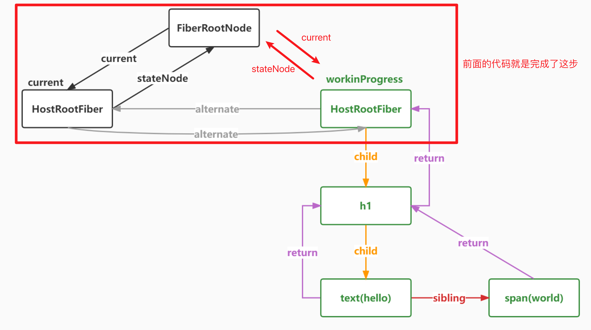

##  React18.2

##  第一节

1. React是什么？

2. 搭建项目，一比一实现React
   1. npm init -y
   
   2. npm install vite @vitejs/plugin-react  -D
   
   3. 写vite配置文件
   
      ```js
      import path from 'path';
      import { defineConfig } from 'vite';
      import react from '@vitejs/plugin-react';
      
      export default defineConfig({
        plugins: [react()],
        resolve: {
          alias: {
            react: path.posix.resolve('src/react'),
            'react-dom': path.posix.resolve('src/react-dom'),
            'react-dom-bindings': path.posix.resolve('src/react-dom-bindings'),
            'react-reconciler': path.posix.resolve('src/react-reconciler'),
            scheduler: path.posix.resolve('src/scheduler'),
            shared: path.posix.resolve('src/shared')
          }
        }
      });
      
      ```
   
      
   
3. 认识jsx

4. 体验虚拟DOM

5. 区分新老babel转换jsx的不同之处

 

### JSX及其本质

**React17以后可以不用再主动引入 React 而直接在文件中写 jsx 语法，但是要手动配置开启automatic**。因为新版项目中将 jsx不再转为 React.createElement，但是babel转换后的代码在浏览器中的执行结果是一样的——虚拟DOM对象树。

```jsx
//在React17以前，babel转换是老的写法
const babel = require('@babel/core');
const sourceCode = `
<h1>
  hello<span style={{ color: 'red' }}>world</span>
</h1>
`;
const result = babel.transform(sourceCode, {
  plugins: [
    ["@babel/plugin-transform-react-jsx", { runtime: 'classic' }]
  ]
});

console.log(result.code);

// 打印代码如下
React.createElement("h1", null, "hello", React.createElement("span", {
  style: {
    color: 'red'
  }
}, "world"));
```


React17后的babel编译结果：

```jsx
const babel = require('@babel/core');
const sourceCode = `
<h1>
  hello<span style={{ color: 'red' }}>world</span>
</h1>
`;
const result = babel.transform(sourceCode, {
  plugins: [
    ["@babel/plugin-transform-react-jsx", { runtime: 'automatic' }]
  ]
});
console.log(result.code);

// 打印代码如下
import { jsx } from "react/jsx-runtime";
jsx("h1", {
  children: ["hello", jsx("span", {
    style: {
      color: 'red'
    },
    children: "world"
  })]
});

// React.createElement=jsx
```

新的编译模式下，子节点直接以对象props中的children属性值存在，以前的子节点是作为第3个及其往后参数的方式传入createElement，在createElement中再将他们转为props的children的属性值。


之前项目的情况：

```jsx
import React from 'react';

const App = (props) => {
  return <div>hello world!</div>;
};

export default App;

// 上面的代码不引入React的话，在之前的项目中无法编译。因为jsx最后被转为React.createElement形式，所以看似没有依赖React，实则是有依赖的。  eslint中提示React引入而未使用的尴尬。
```


新版的情况：

```jsx
const App = (props) => {
  return <div>hello world!</div>;
};

export default App;

// 可以直接这么写，编译时会自动引入一个包   import jsx from 'jsx'  最后将jsx转为 jsx()函数调用的方式。
```


JSX的编译和后续执行：


React项目运行的两个环节：

1. 编译阶段，把使用jsx编写的项目源码通过webacpk或者vite中的babel插件——*@babel/plugin-transform-react-jsx*——编译为普通的js代码（具体是React.createElement或者jsxDEV方法调用），这是在node环境中完成的，和浏览器无关
2. 运行阶段，将编译打包后的上线到服务器，用户访问服务器后加载对应的html和js文件，而js文件中的内容就是上一阶段生成的js代码，浏览器会加载并执行React.createElement或者jsxDEV方法，得到虚拟DOM树，再根据虚拟DOM树生成Fiber树，再生成真实的DOM插入到页面中


包含jsxDEV函数调用的代码在发送到浏览器后，浏览器会根据源码中定义的该jsxDEV方法的代码逻辑进行执行，最后返回一个虚拟DOM树。

```js
// ReactElement是一个工厂函数，用于创建一个个的虚拟DOM节点对象
function ReactElement(type, key, ref, props) {
  // 这就是React元素，也被称为虚拟DOM
  return {
    $$typeof: REACT_ELEMENT_TYPE,  // $$typeof，每个虚拟DOM节点都有，表示节点的类型
    type,// h1 span，如果是函数组件或者类组件，那就是个函数或者类本身
    key,// 唯一标识
    ref,// 用来获取真实DOM元素
    props// 属性 包括：children,style,id...
  }
}
```

​			

jsxEDV函数在浏览器中调用后生成的结构														

```jsx
<h1>
  hello<span style={{ color: 'red' }}>world</span>
</h1>
```

每个虚拟DOM节点会有一个类型属性——`$$typeof`


一个虚拟DOM节点的children属性，可能是一个字符串，数字，对象或者数组，其中数组的中的每一项元素可以是前面3中的某一种。有一点需要注意，上面编写的jsx都是直接使用的原生的标签，如h1,span等，所以它们生成的函数调用的第一个参数都是字符串的'h1'或者'span'等。 如果编写的是一个函数组件，如下代码：

```jsx
function FunctionComponent(){
  return (
    <h1>
      hello <span style={{ color: 'red' }}>world!</span>
    </h1>
  )
}

let element = <FunctionComponent number={1}></FunctionComponent>

// 编译后的结果
function FunctionComponent() {
  return /*#__PURE__*/React.createElement("h1", null, "hello ", /*#__PURE__*/React.createElement("span", {
    style: {
      color: 'red'
    }
  }, "world!"));
}

var element = /*#__PURE__*/React.createElement(FunctionComponent, {
  number: 1
});
```

一定要注意对于函数组件的jsx，生成的函数React.createElement调用中第一个参数就是函数本身，也就是说它是可以直接被执行的。


## 第二节

在编译阶段将编写的jsx经过babel编译后转为jsxDEV(type,config)的方法调用，而前一节就是在实现jsxDEV这个函数方法，该方法返回一个虚拟DOM（JS对象）。

用react-dom将虚拟DOM变为真实DOM插入已经存在的节点上。

```jsx
import { createRoot } from "react-dom/client";
// React18中，createRoot表示创建一个并发版本的Root（根）

const element = (
  <h1>
    hello<span style={{ color: 'red' }}>world</span>
  </h1>
)

console.log(element)

const root = createRoot(document.getElementById("root"));
root.render(element)
```

createRoot函数接受真实的DOM节点，然后去创建整个项目的根。根本质就是一个类（ReactDOMRoot）的对象实例，该对象实例上有一个属性（_internalRoot），该属性的值是的FiberRootNode，FiberRootNode对象上有一个属性containerInfo属性的值就是createRoot接受的真实DOM节点。如下图：


简单来说FiberRootNode = containerInfo,它的本质就是一个真实的容器DOM节点 `div#root`,其实就是一个真实的DOM，只是稍微包装了一下，后面会指向根Fiber，而这个根Fiber就是整个Fiber树的根节点，根Fiber的真实DOM节点就指向FiberRootNode——整个项目的根。


**为什么React16引入了Fiber架构？**

React15中的render过程是不可中断的，这就导致JS可能长时间霸占主线程，导致UI线程无法工作带来的页面卡顿情况。  

**性能瓶颈**

- JS 任务执行时间过长

  - 浏览器刷新频率为 60Hz,大概 16.6 毫秒渲染一次，而 JS 线程和渲染线程是互斥的，所以如果 JS 线程执行任务时间超过 16.6ms 的话，就会导致掉帧，导致卡顿，解决方案就是 **React 利用空闲的时间进行更新，同时将一个大任务拆分为可以分段执行的小任务，不影响渲染进行的渲染**

  - 把一个耗时任务切分成一个个小任务，分布在每一帧里的方式就叫时间切片 
    >React16以后的Fiber架构已经尽可能的将大任务拆分为小任务了，如果在执行最小粒度的任务时，依旧超过了16.6ms的时长，那么react将无能为力，仍就会出现卡顿的情况。
    >
    >这种调度是合作式调度。

**帧**

- 每个帧的开头包括样式计算、布局和绘制
- Javascript 引擎和页面渲染引擎在同一个渲染线程，GUI 渲染和 Javascript 执行两者是互斥的
- 如果某个任务执行时间过长，浏览器会推迟渲染


### 时间切片

**requestIdleCallback**

- 希望快速响应用户，不能阻塞用户的交互
- `requestIdleCallback` 使开发者能够在主事件循环上执行后台和低优先级工作，而不会影响延迟关键事件，如动画和输入响应
- 正常帧任务完成后没超过 16 ms,说明时间有富余，此时就会执行 `requestIdleCallback` 里注册的任务
- Reac中自己实现了一个requestIdleCallback，因为原生requestIdleCallback空闲时间不可控且有兼容性问题，里面定义了每帧空闲执行时间为5ms


模拟代码：

```html
<!DOCTYPE html>
<html lang="en">

  <head>
    <meta charset="UTF-8">
    <meta http-equiv="X-UA-Compatible" content="IE=edge">
    <meta name="viewport" content="width=device-width, initial-scale=1.0">
    <title>requestIdleCallback</title>
  </head>

  <body>
    <script>
      function sleep(duration) {
        for (var t = Date.now(); Date.now() - t <= duration;) { }
      }
      // 该fibers中的每一项就是最小的任务单元了，无法再次分割，如果js县城执行了其中一个任务，但是该任务无法在浏览器剩余的空闲时间内执行完全，那么仍旧会出现页面卡顿的情况。
      const fibers = [
        () => {
          console.log('第1个任务开始');
          sleep(5000);
          console.log('第1个任务结束');
        },
        () => {
          console.log('第2个任务开始');
          sleep(20);
          console.log('第2个任务结束');
        },
        () => {
          console.log('第3个任务开始');
          sleep(20);
          console.log('第3个任务结束');
        }
      ]
      requestIdleCallback(workLoop);
      function workLoop(deadline) {
        //因为一帧是16.6ms,浏览器执行完高优先级之后，如果还有时间，会执行workLoop,timeRemaining获取此帧剩下的时间
        console.log(`本帧的剩余时间是`, deadline.timeRemaining());
        //如果没有剩余时间了，就会跳出循环
        while (deadline.timeRemaining() > 1 && works.length > 0) {
          performUnitOfWork();
        }
        //如果还有剩余任务
        if (works.length > 0) {
          console.log(`只剩下${deadline.timeRemaining()}ms，不够了，等待浏览器下次空闲的时候再帮我调用`,);
          requestIdleCallback(workLoop);
        }
      }
      function performUnitOfWork() {
        let work = works.shift();//取出任务数组中的第一个任务,并移除第一个任务
        work();
      }
    </script>
  </body>
</html>
```


## Fiber

React会将大任务拆分为小任务，如何拆？拆多细？一个任务的代表是什么？

- 可以通过某些调度策略合理分配 CPU 资源，从而提高用户的响应速度
- 通过 Fiber 架构，让调和过程变成可被中断。 适时地让出 CPU 执行权，除了可以让浏览器及时地响应用户的交互

fiber定义（fiber是什么）：

1. **Fiber 是一个执行的最小单元**，每次执行完一个执行单元, React 就会检查现在还剩多少时间，如果没有时间就将控制权让出去
   
2. **Fiber 是一种数据结构**
   - React 目前的做法是使用**链表, 根据jsxDEV函数执行后返回的具有层级的虚拟DOM对象生成，虚拟DOM中的每个虚拟节点内部表示为一个`Fiber`** 
   - 从顶点开始遍历
   - 如果有第一个儿子，先遍历第一个儿子
   - 如果没有第一个儿子，标志着此节点遍历完成
   - 如果有弟弟遍历弟弟
   - 如果有没有下一个弟弟，返回父节点标识完成父节点遍历，如果有叔叔遍历叔叔
   - 没有父节点遍历结束

为什么Fiber结构可以进行中断后继续执行？fiber树是根据虚拟DOM生成的。

其中根Fiber——**HostRootFiber**，对应的真实DOM节点就是项目html中一开始写好的div#root元素。


## 树遍历

深度优先和广度优先遍历


深度优先：


- 深度优先搜索 DFS 即`Depth First Search`
- 其过程简要来说是对每一个可能的分支路径深入到不能再深入为止，而且每个节点只能访问一次
- 应用场景
  - React 虚拟 DOM 的构建
  - React 的 fiber 构建

```js
let root = {
  name: "A",
  children: [
    {
      name: "B",
      children: [{ name: "B1" }, { name: "B2" }],
    },
    {
      name: "C",
      children: [{ name: "C1" }, { name: "C2" }],
    },
  ],
};

function dfs(node){
  console.log(node.name)
  if(node.children?.length){
    node.children.forEach(childNode=>{
      dfs(childNode)
    })
  }
}
```


广度优先：


- 宽度优先搜索算法（又称广度优先搜索） Breadth First Search
- 算法首先搜索距离为`k`的所有顶点，然后再去搜索距离为`k+l`的其他顶点

```js
let root = {
  name: "A",
  children: [
    {
      name: "B",
      children: [{ name: "B1" }, { name: "B2" }],
    },
    {
      name: "C",
      children: [{ name: "C1" }, { name: "C2" }],
    },
  ],
};

function bfs(node){
	const arr = [node]
  let current
  while(current = arr.shift()){
    console.log(current.name)
    current.children&&arr.push(...current.children)
  }
}

bfs(root)
```


## 链表

1. 单向链表
   
2. 双向链表
   
3. 循环链表
   


带有一个指针的循环链表：


**React中的更新队列就是一个循环链表结构。**

```js
function initialUpdateQueue(fiber) {
  // 创建一个新的更新队列
  // pending 是一个循环链接
  const queue = {
    shared: {
      pending: null
    }
  }
  fiber.updateQueue = queue;
}

function createUpdate() {
  return {};
}

// 入队
function enqueueUpdate(fiber, update) {
  const updateQueue = fiber.updateQueue;
  const shared = updateQueue.shared;
  const pending = shared.pending;
  if (pending === null) {
    update.next = update;
  } else {
    //如果更新队列不为空的话，取出第一个更新
    update.next = pending.next;
    //然后让原来队列的最后一个的next指向新的next
    pending.next = update;
  }
  updateQueue.shared.pending = update;
}


function processUpdateQueue(fiber) {
  const queue = fiber.updateQueue;
  const pending = queue.shared.pending;
  if (pending !== null) {
    queue.shared.pending = null;
    //最后一个更新
    const lastPendingUpdate = pending;
    const firstPendingUpdate = lastPendingUpdate.next;
    //把环状链接剪开
    lastPendingUpdate.next = null;
    let newState = fiber.memoizedState;
    let update = firstPendingUpdate;
    while (update) {
      newState = getStateFromUpdate(update, newState);
      update = update.next;
    }
    fiber.memoizedState = newState;
  }
}

function getStateFromUpdate(update, prevState) {
  const payload = update.payload;
  let partialState = payload(prevState);
  return Object.assign({}, prevState, partialState);
}


let fiber = { memoizedState: { id: 1 } };
initialUpdateQueue(fiber);
let update1 = createUpdate();
update1.payload = { name: 'zhufeng' }
enqueueUpdate(fiber, update1)

let update2 = createUpdate();
update2.payload = { age: 14 }
enqueueUpdate(fiber, update2)

//基于老状态，计算新状态
processUpdateQueue(fiber);
console.log(fiber.memoizedState);
```

Fiber之前：虚拟DOM=>真实DOM

Fiber之后：虚拟DOM=>Fiber链表=>真实DOM


## Fiber之前的工作模拟

未使用Fiber架构之前的代码逻辑模拟。

- React 会递归比对VirtualDOM树，找出需要变动的节点，然后同步更新它们。这个过程 React 称为Reconcilation(协调)
- 在`Reconcilation`期间，React 会一直占用着浏览器资源，一则会导致用户触发的事件得不到响应, 二则会导致掉帧，用户可能会感觉到卡顿

```jsx
let element = (
  <div id="A1">
    <div id="B1">
      <div id="C1"></div>
      <div id="C2"></div>
    </div>
    <div id="B2"></div>
  </div>
)
// 下面的jsx转为下面的虚拟DOM结构
let element = {
  "type": "div",
  "key": "A1",
  "props": {
    "id": "A1",
    "children": [
      {
        "type": "div",
        "key": "B1",
        "props": {
          "id": "B1",
          "children": [
            {
              "type": "div",
              "key": "C1",
              "props": { "id": "C1"},
            },
            {
              "type": "div",
              "key": "C2",
              "props": {"id": "C2"},
            }
          ]
        },
      },
      {
        "type": "div",
        "key": "B2",
        "props": {"id": "B2"},
      }
    ]
  },
}

//以前我们直接把vdom渲染成了真实DOM
function render(vdom, container) {
  //根据虚拟DOM生成真实DOM
  let dom = document.createElement(vdom.type);
  //把除children以外的属性拷贝到真实DOM上
  Object.keys(vdom.props).filter(key => key !== 'children').forEach(key => {
    dom[key] = vdom.props[key];
  });
  //把此虚拟DOM的子节点，也渲染到父节点真实DOM上
  if (Array.isArray(vdom.props.children)) {
    vdom.props.children.forEach(child => render(child, dom));
  }
  container.appendChild(dom);
}

render(element, document.getElementById('root'));
```


## Fiber之后的工作模拟

```jsx
let element = (
  <div id="A1">
    <div id="B1">
      <div id="C1"></div>
      <div id="C2"></div>
    </div>
    <div id="B2"></div>
  </div>
)

// 下面的jsx转为下面的虚拟DOM结构
let element = {
  "type": "div",
  "key": "A1",
  "props": {
    "id": "A1",
    "children": [
      {
        "type": "div",
        "key": "B1",
        "props": {
          "id": "B1",
          "children": [
            {
              "type": "div",
              "key": "C1",
              "props": { "id": "C1"},
            },
            {
              "type": "div",
              "key": "C2",
              "props": {"id": "C2"},
            }
          ]
        },
      },
      {
        "type": "div",
        "key": "B2",
        "props": {"id": "B2"},
      }
    ]
  },
}

//下面是根据虚拟DOM构建的Fiber树
//第一步.根据虚拟DOM构建成fiber树
let A1 = { type: 'div', props: { id: 'A1' } };
let B1 = { type: 'div', props: { id: 'B1' }, return: A1 };
let B2 = { type: 'div', props: { id: 'B2' }, return: A1 };
let C1 = { type: 'div', props: { id: 'C1' }, return: B1 };
let C2 = { type: 'div', props: { id: 'C2' }, return: B1 };
//A1的第一个子节点B1
A1.child = B1;
//B1的弟弟是B2
B1.sibling = B2;
//B1的第一个子节点C1
B1.child = C1;
//C1的弟弟是C2
C1.sibling = C2;

//下一个工作单元
let nextUnitOfWork = null;
const hasTimeRemaining = () => Math.floor(Math.random() * 10) % 2 == 0;

//render工作循环
function workLoop() {
  //工作循环每一次处理一个fiber,处理完以后可以暂停
  //如果有下一个任务并且有剩余的时间的话，执行下一个工作单元，也就是一个fiber
  while (nextUnitOfWork && hasTimeRemaining()) {
    //执行一个任务并返回下一个任务
    nextUnitOfWork = performUnitOfWork(nextUnitOfWork);
  }
  console.log('render阶段结束');
  //render阶段结束
}

// 执行一个fiber节点包括 开始和完成两个步骤
function performUnitOfWork(fiber) {// A1
  let child = beginWork(fiber);
  //如果执行完A1之后，会返回A1的第一个子节点
  if (child) {
    return child;
  }
  //如果没有子节点
  while (fiber) {//如果没有子节点说明当前节点已经完成了渲染工作
    completeUnitOfWork(fiber);//可以结束此fiber的渲染了 
    if (fiber.sibling) {//如果它有弟弟就返回弟弟
      return fiber.sibling;
    }
    fiber = fiber.return;//如果没有弟弟让爸爸完成，然后找叔叔
  }
}

function beginWork(fiber) {
  console.log('beginWork', fiber.props.id);
  return fiber.child;//B1
}

function completeUnitOfWork(fiber) {
  console.log('completeUnitOfWork', fiber.props.id);
}

nextUnitOfWork = A1;
workLoop();
```


## 构建Fiber根节点

根Fiber对应的DOM节点就是根容器节点。

React的优化：**如果一个虚拟DOM节点只有一个字节点，且子节点是一个字符串或者数字的情况下，将不再为该子节点创建对应的Fiber节点。**

Fiber树是根据虚拟DOM树来生成的，所以大体结构一样。只是虚拟DOM是对象结构，而Fiber树是链表结构。


上图中的current属性其实就是current树，就是表示当前浏览器渲染好的页面结构的Fiber树。根Fiber节点的stateNode属性就是简单包装过的真实DOM节点。

```diff
+import { createHostRootFiber } from "./ReactFiber";
function FiberRootNode(containerInfo) {
  this.containerInfo = containerInfo;
}

export function createFiberRoot(containerInfo) {
  const root = new FiberRootNode(containerInfo);
+ const uninitializedFiber = createHostRootFiber();
+ root.current = uninitializedFiber;
+ uninitializedFiber.stateNode = root;
  return root;
}
```


```js
/**
 *
 * @param {*} tag fiber的类型 函数组件0  类组件1 原生组件5 根元素3
 * @param {*} pendingProps 新属性，等待处理或者说生效的属性
 * @param {*} key 唯一标识
 */
export function FiberNode(tag, pendingProps, key) {
  this.tag = tag;
  this.key = key;
  this.type = null; //fiber类型，来自于 虚拟DOM节点的type  span div p
  //每个虚拟DOM=>Fiber节点=>真实DOM
  this.stateNode = null; //此fiber对应的真实DOM节点  h1=>真实的h1DOM

  this.return = null; //指向父节点
  this.child = null; //指向第一个子节点
  this.sibling = null; //指向弟弟

  //fiber树中的一个个Fiber节点通过虚拟DOM节点创建，虚拟DOM会提供pendingProps，用来创建fiber节点的属性
  this.pendingProps = pendingProps; //等待生效的属性
  this.memoizedProps = null; //已经生效的属性

  //每个fiber还会有自己的状态，每一种fiber 状态存的类型是不一样的
  //类组件对应的fiber 存的就是类的实例的状态, HostRoot存的就是要渲染的元素
  this.memoizedState = null;
  //每个fiber身上还有更新队列
  this.updateQueue = null;
  //副作用的标识，表示要针对此fiber节点进行何种操作
  this.flags = NoFlags; //自己的副作用
  //子节点对应的副使用标识
  this.subtreeFlags = NoFlags;
  //替身，轮替 在后面讲DOM-DIFF的时候会用到
  this.alternate = null;
  this.index = 0;
  this.deletions = null;
  this.lanes = NoLanes;
  this.childLanes = NoLanes;
  this.ref = null;
}
// We use a double buffering pooling technique because we know that we'll only ever need at most two versions of a tree.
// We pool the "other" unused  node that we're free to reuse.

// This is lazily created to avoid allocating
// extra objects for things that are never updated. It also allow us to
// reclaim the extra memory if needed.
export function createFiber(tag, pendingProps, key) {
  return new FiberNode(tag, pendingProps, key);
}

export function createHostRootFiber() {
  return createFiber(HostRoot, null, null);
}
```

每种虚拟DOM都会对应自己的fiber tag类型，其中根fiber对应的tag类型是HostRoot，值为3。

React中表示副作用使用的是二进制数据，在进行diff时，会给fiber节点上的flags或者subtreeFlags进行标记，表示进行何种操作（增删改等）。subtreeFlags表示子节点的操作标记，能进行性能优化。

React的执行分为两个阶段：1. render阶段计算副作用。2.commit阶段修改真实DOM，或者说提交副作用。提交阶段是从根节点开始往树下面遍历，如果某一级的Fiber节点上的subtreeFlags为二进制数字0的话，表示该节点下的后代节点都没有任何副作用操作，将不再进行该节点下面的深度遍历，从而优化性能。子节点的副作用通过冒泡层层合并后赋值给祖先节点的subtreeFlags属性。

```js
function bubbleProperties(completedWork) {
  let subtreeFlags = NoFlags;
  let child = completedWork.child;
  while (child !== null) {
    subtreeFlags |= child.subtreeFlags;
    subtreeFlags |= child.flags;
    child = child.sibling;
  }
  completedWork.subtreeFlags |= subtreeFlags;
}
```

在React18以前，会收集effect，React18.2以后就删除了所有的effect，而不再收集effect。


一个Fiber节点含有的典型属性：

```js
/**
 *
 * @param {*} tag fiber的类型 函数组件0  类组件1 原生组件5 根元素3(HostRoot)
 * @param {*} pendingProps 新属性，等待处理或者说生效的属性
 * @param {*} key 唯一标识
 */

export function FiberNode(tag, pendingProps, key) {
  this.tag = tag;
  this.key = key;
  this.type = null; //fiber类型，来自于 虚拟DOM节点的type  span div p
  //每个虚拟DOM=>Fiber节点=>真实DOM
  this.stateNode = null; //此fiber对应的真实DOM节点  h1=>真实的h1DOM

  this.return = null; //指向父节点
  this.child = null; //指向第一个子节点
  this.sibling = null; //指向弟弟

  //fiber哪来的？通过虚拟DOM节点创建，虚拟DOM会提供pendingProps用来创建fiber节点的属性
  this.pendingProps = pendingProps; //等待生效的属性
  this.memoizedProps = null; //已经生效的属性

  //每个fiber还会有自己的状态，每一种fiber 状态存的类型是不一样的
  //类组件对应的fiber 存的就是类的实例的状态,HostRoot存的就是要渲染的元素
  this.memoizedState = null;
  //每个fiber身上可能还有更新队列
  this.updateQueue = null;
  //副作用的标识，表示要针对此fiber节点进行何种操作
  this.flags = NoFlags; //自己的副作用
  //子节点对应的副使用标识
  this.subtreeFlags = NoFlags;
    
  //替身，轮替 在后面讲DOM-DIFF的时候会用到
  this.alternate = null;
  this.index = 0;
  this.deletions = null;
  this.lanes = NoLanes;
  this.childLanes = NoLanes;
  this.ref = null;
}
```


## 构建Fiber树

Fiber树有两棵：

1. current树
2. workInProgress树


```js
/**
 *
 * @param {*} tag fiber的类型 函数组件0  类组件1 原生组件5 根元素3
 * @param {*} pendingProps 新属性，等待处理或者说生效的属性
 * @param {*} key 唯一标识
 */
export function FiberNode(tag, pendingProps, key) {
  this.tag = tag;
  this.key = key;
  this.type = null; //fiber类型，来自于 虚拟DOM节点的type  span div p
  //每个虚拟DOM=>Fiber节点=>真实DOM
  this.stateNode = null; //此fiber对应的真实DOM节点  h1=>真实的h1DOM

  this.return = null; //指向父节点
  this.child = null; //指向第一个子节点
  this.sibling = null; //指向弟弟

  //fiber哪来的？通过虚拟DOM节点创建，虚拟DOM会提供pendingProps用来创建fiber节点的属性
  this.pendingProps = pendingProps; //等待生效的属性
  this.memoizedProps = null; //已经生效的属性

  //每个fiber还会有自己的状态，每一种fiber 状态存的类型是不一样的
  //类组件对应的fiber 存的就是类的实例的状态, HostRoot存的就是要渲染的元素
  this.memoizedState = null;
  //每个fiber身上可能还有更新队列
  this.updateQueue = null;
  //副作用的标识，表示要针对此fiber节点进行何种操作
  this.flags = NoFlags; //自己的副作用
  //子节点对应的副使用标识
  this.subtreeFlags = NoFlags;
  //替身，轮替 在后面讲DOM-DIFF的时候会用到
  this.alternate = null;
  this.index = 0;   // 表示该Fiber节点在父Fiber节点中是第几个子Fiber节点 从0开始
  this.deletions = null;
  this.lanes = NoLanes;
  this.childLanes = NoLanes;
  this.ref = null;
}
// We use a double buffering pooling technique because we know that we'll only ever need at most two versions of a tree.
// We pool the "other" unused  node that we're free to reuse.

// This is lazily created to avoid allocating
// extra objects for things that are never updated. It also allow us to
// reclaim the extra memory if needed.
export function createFiber(tag, pendingProps, key) {
  return new FiberNode(tag, pendingProps, key);
}

export function createHostRootFiber() {
  return createFiber(HostRoot, null, null);
}
```


前面已经创建好整个项目的根Fiber节点了，现在要根据虚拟DOM构建一个完整的Fiber树。而虚拟DOM是通过ReactDOM.render方法传入的，所以需要将虚拟DOM方法根Fiber的更新队列上的。对于根节点来说，更新队列上方的是虚拟DOM。 每个fiber节点都有一个更新队列，用于存放需要更新的信息放到队列中。


### 将虚拟DOM加入根Fiber的更新队列

```js
ReactDOMRoot.prototype.render = function (children) {
  const root = this._internalRoot;
  root.containerInfo.innerHTML = '';
  updateContainer(children, root);
}

/**
 * 更新容器，把虚拟dom element变成真实DOM插入到container容器中
 * @param {*} element 虚拟DOM
 * @param {*} container DOM容器 FiberRootNode containerInfo div#root
 */
export function updateContainer(element, container) {
  //获取当前的根fiber
  const current = container.current;
  //创建更新
  const update = createUpdate(lane);
  //要更新的虚拟DOM
  update.payload = { element }; //h1
  //把此更新对象添加到current这个根Fiber的更新队列上,返回根节点
  const root = enqueueUpdate(current, update);  // 这里就将虚拟DOM树加入到了根Fiber节点的更新队列中，并返回根节点。
  scheduleUpdateOnFiber(root);
}
```


### 构建workinProgress树


```js
import { scheduleCallback } from "scheduler";


let workInProgress = null;
export function scheduleUpdateOnFiber(root) {
  ensureRootIsScheduled(root);
}

function scheduleCallback(callback) {
  requestIdleCallback(callback);
}

function ensureRootIsScheduled(root) {
  scheduleCallback(performConcurrentWorkOnRoot.bind(null, root));
}

function performConcurrentWorkOnRoot(root) {
  renderRootSync(root);
}

function prepareFreshStack(root) {
  workInProgress = createWorkInProgress(root.current, null);  // 根据老根Fiber创建一个新的根Fiber,并赋值给了workInProgress
  console.log(workInProgress);
}

function renderRootSync(root) {
  prepareFreshStack(root);
}

/**
 * 基于老的fiber和新的属性创建新的fiber
 * 1.current和workInProgress不是一个对象
 * 2.workInProgress
 *   2.1有两种情况，一种是没有，创建一个新，互相通过alternate指向
 *   2.2 存在alternate,直接复用老的alternate就可以了
 * 复用有两层含义
 * 1.复用老的fiber对象
 * 2.复用老的真实DOM
 * @param {*} current 老fiber
 * @param {*} pendingProps 新属性
 */
export function createWorkInProgress(current, pendingProps) {
  let workInProgress = current.alternate;
  if (workInProgress === null) {
    workInProgress = createFiber(current.tag, pendingProps, current.key);
    workInProgress.type = current.type;
    workInProgress.stateNode = current.stateNode;
    workInProgress.alternate = current;
    current.alternate = workInProgress;
  } else {
    workInProgress.pendingProps = pendingProps;
    workInProgress.type = current.type;
    workInProgress.flags = NoFlags;
    workInProgress.subtreeFlags = NoFlags;
    workInProgress.deletions = null;
  }
  workInProgress.child = current.child;
  workInProgress.memoizedProps = current.memoizedProps;
  workInProgress.memoizedState = current.memoizedState;
  workInProgress.updateQueue = current.updateQueue;
  workInProgress.sibling = current.sibling;
  workInProgress.index = current.index;
  workInProgress.ref = current.ref;
  workInProgress.flags = current.flags;
  workInProgress.lanes = current.lanes;
  workInProgress.childLanes = current.childLanes;
  return workInProgress;
}
```




### 递归构建整棵workinProgress树

```js
function renderRootSync(root) {
  prepareFreshStack(root);
  workLoopSync();
}

function workLoopSync() {
  while (workInProgress !== null) {
    performUnitOfWork(workInProgress);
  }
}

/**
* 执行一个工作单元
* @param {*} unitOfWork
*/
function performUnitOfWork(unitOfWork) {
  // 获取新的fiber对应的老fiber
  const current = unitOfWork.alternate;
  // 完成当前fiber的子fiber链表构建后 unitOfWork.memoizedProps = unitOfWork.pendingProps;
  const next = beginWork(current, unitOfWork);
  unitOfWork.memoizedProps = unitOfWork.pendingProps;
  if (next === null) {
    // 如果没有子节点表示当前的fiber已经完成了
    completeUnitOfWork(unitOfWork);
  } else {
    // 如果有子节点，就让子节点成为下一个工作单元
    workInProgress = next;
  }
}


/**
 * 构建原生组件的子fiber链表
 * @param {*} current 老fiber
 * @param {*} workInProgress 新fiber h1
 */
function updateHostComponent(current, workInProgress) {
  const { type } = workInProgress;
  const nextProps = workInProgress.pendingProps;
  let nextChildren = nextProps.children;
  //判断当前虚拟DOM它的儿子是不是一个文本独生子
  const isDirectTextChild = shouldSetTextContent(type, nextProps);
  if (isDirectTextChild) {
    nextChildren = null;
  }
  reconcileChildren(current, workInProgress, nextChildren);
  return workInProgress.child;
}

/**
 * 挂载函数组件
 * @param {*} current  老fiber
 * @param {*} workInProgress 新的fiber
 * @param {*} Component 组件类型，也就是函数组件的定义
 */
export function mountIndeterminateComponent(current, workInProgress, Component) {
  const props = workInProgress.pendingProps;
  //const value = Component(props);
  const value = renderWithHooks(current, workInProgress, Component, props);
  workInProgress.tag = FunctionComponent;
  reconcileChildren(current, workInProgress, value);
  return workInProgress.child;
}
export function updateFunctionComponent(current, workInProgress, Component, nextProps, renderLanes) {
  const nextChildren = renderWithHooks(current, workInProgress, Component, nextProps, renderLanes);
  reconcileChildren(current, workInProgress, nextChildren);
  return workInProgress.child;
}


/**
 * 根据虚拟DOM生成新的Fiber链表
 * @param {*} current 老的父Fiber
 * @param {*} workInProgress 新的你Fiber
 * @param {*} nextChildren 根Fiber节点上虚拟DOM树
 */
function reconcileChildren(current, workInProgress, nextChildren) {
  //如果此新fiber没有老fiber,说明此新fiber是新创建的
  //如果此fiber没能对应的老fiber,说明此fiber是新创建的，如果这个父fiber是新的创建的，它的儿子们也肯定都是新创建的
  if (current === null) {
    workInProgress.child = mountChildFibers(workInProgress, null, nextChildren);  // 给父Fiber节点挂在子Fiber节点
  } else {
    //如果说有老Fiber的话，做DOM-DIFF 拿老的子fiber链表和新的子虚拟DOM进行比较 ，进行最小化的更新
    workInProgress.child = reconcileChildFibers(workInProgress, current.child, nextChildren);
  }
}

function updateHostRoot(current, workInProgress) {
  processUpdateQueue(workInProgress, nextProps); //workInProgress.memoizedState={ element } element就是根Fiber节点上的虚拟DOM
  const nextState = workInProgress.memoizedState;
  //nextChildren就是新的子虚拟DOM
  const nextChildren = nextState.element; //h1
  //根据根Fiber节点上的虚拟DOM生成子fiber链表
  reconcileChildren(current, workInProgress, nextChildren);
  return workInProgress.child; //{tag:5,type:'h1'}
}

/**
 * 目标是根据新虚拟DOM构建新的fiber子链表 child  child.sibling
 * @param {*} current 老fiber
 * @param {*} workInProgress 新的fiber h1
 * @returns
 */
export function beginWork(current, workInProgress) {
  switch (workInProgress.tag) {
    case HostRoot:  // 根Fiber节点
      return updateHostRoot(current, workInProgress);
    case HostComponent:
      return updateHostComponent(current, workInProgress);
    case HostText:
      return null;
    default:
      return null;
  }
}
```


一个组件中，一般会有很多个Fiber单元。 


## Hooks

### useReducer

hooks函数是在函数组件（函数体）中调用的。hooks的执行分为初次渲染和更新两个阶段。

Hooks在React的源码中，是在React包下面导出，但是真正的代码逻辑是在React-Reconciler包中实现的。要从React包中关联React-Reconciler中的方法，为此，React框架在源码中设置了一个类似全局共享的变量对象ReactSharedInternals，内部存放了需要被共享的数据。


初次挂载阶段：


在函数组件执行之前，需要先给全局共享的变量（ReactCurrentDispatcher.current）赋值上相应的hook的实现函数，然后调用函数组件函数，函数体中会调用前一步挂载到全局共享变量上的相应的hook函数。

这里以useReducer的源码来分析，一个函数组件中可以有0或多个useReducer调用，对于每一个useReducer调用，在源码中都会创建一个hook对象，该hook对象上有三个重点属性：memoizedState，queue，next。

重点需要注意，对于每一个函数组件对应的fiber节点，他的memoizedState属性会指向该函数组件的内部第一个调用的hook函数生成的hook对象，见下面代码的第9行。  同时如果一个函数组件中多次调用hook，那么每次调用hook创建的hook对象会通过next属性进行连接，构成一个hook链表。

```js
function mountWorkInProgressHook() {
  const hook = {
    memoizedState: null,//hook的状态 
    queue: null,//存放本hook的更新队列 queue.pending=update的循环链表
    next: null //指向下一个hook,一个函数里可以会有多个hook,它们会组成一个单向链表
  };
  if (workInProgressHook === null) {
    //当前函数对应的fiber的状态等于第一个hook对象
    currentRenderingFiber.memoizedState = workInProgressHook = hook;
  } else {
    workInProgressHook = workInProgressHook.next = hook;
  }
  return workInProgressHook;
}
```

所以hooks的本质是存放在函数组件对应的fiber节点的memoizedState属性上的链表。


同时每个fiber内部又有另一个特殊的属性queue，这又是属于该fiber自身的一个更新对象的循环链表，用于存放的是同一个执行上下文中，多次调用setXXX函数来修改hook中存放状态的情况，最后再统一批处理后更新。

