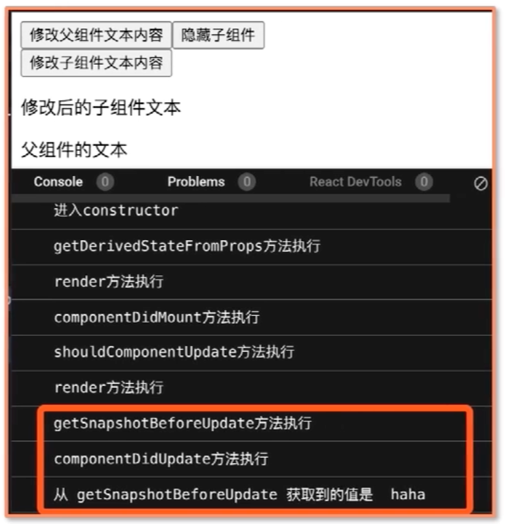

# React 进阶

性能优化和前端工程化。技术本身在多数情况下都是一些简单且有趣的东西，人们越是试图神化它，越容易脱离技术本质。将源码和底层原理分开。 Vue、React 乃至 Angular 在代码编写层面越发相似，且在设计层面都在朝着 WebComponents 标准靠近。

在环境无法提供优质的成长环境时，谨记自己创造途径：深挖一个优质的前端框架吃透它的原理，跟开发团队学习框架的思想，编码规范和学习设计模式。

学习 React 的必要性：

- 大厂使用react的比例更高

- 面试时 React 相关问题的区分度高，提高工作解决问题的能力

- 用框架锻炼个人思维和代码思想


React架构设计哲学上：

- 数据驱动视图
- 组件化
- 函数式编程
- 面向对象
- fiber


底层技术选型上：

- jsx
- 虚拟 DOM


周边生态上：

- 状态管理
- 前端路由


其他方面：

- 状态管理机制
- 自建的事件系统
- 在前端引入 hooks 思想

Vue 知识体系/原理的相关内容多，但 React 知识体系/原理的相关内容却屈指可数。React 知识体系庞大，有精密复杂的底层原理与长的知识链路。

**把复杂的问题简单化、把琐碎的问题系统化。**

大厂的 React 面试是最有效用导向的一个学习依据，将大厂面试的逻辑利用充分，将提升实现面试和应用。

**贴着源码讲原理并不是死磕源码，源码不等于原理。源码是代码，而原理是逻辑，代码繁杂冗长，而原理可以简洁清晰。**在一些场景下，源码可以是教具， 但是阅读源码不是抵达原理的唯一途径。

**对于体系性较强的知识，创建足够充分的上下文。**一些知识难学不是因为它有多么复杂，而是因为理解它需要上下文，如果在正确的上下文中，理解它就是很轻松的事。如果学习上下文是断裂的，那知识点就难以理解。

对于复杂度较高的知识，用现象和问题向原理提问，注意先导知识的学习（先提现象/问题，再挖原理）。

结构：

- 基础夯实

  涉及 React 的基本原理和源码，基础知识

- 核心原理

  面向日常开发中的难点，大厂面试压轴难题，框架底层的逻辑和源码设计

- 周边生态

  redux，react-router 的工作原理和设计思想

- 生产实践

  性能和设计模式，性能决定用户体验，设计模式决定研发效率。实践经验，行业里推崇的最佳实践


**学习的本质是重复，重复的结果是记住。**


## jsx 代码映射为 DOM

本节的重点是 **jsx 如何转为 DOM**。使用 JSX 来描述 React 的组件内容。

jsx 中的三个重点问题（面试）：

- **jsx 的本质是什么，它和 js 之间到底是什么关系？**
- **为什么要用 jsx，不用的后果是什么？**
- **jsx 背后的功能模块是什么，这个功能模块都做了哪些事情？**

大多数开发者认为它是模版语法中的一种。目标是：通过本课时的学习目标是能用自己的话回答上面的三个问题。

```jsx
import React from "react";
import ReactDOM from "react-dom";

class App extends React.Component {
    render() {
        // render函数的返回值就是jsx代码
        return (
            <div>
                <h1>hello world</h1>
            </div>
        );
    }
}

ReactDOM.render(<App />, document.getElementById("root"));
```


#### jsx 的本质

**jsx 的本质是 JavaScript 的一种语法扩展，它和模版语法很接近，但是它充分具备 JavaScript 的能力。**

Facebook 公司给 jsx 的定位是：jsx 是 JavaScript 的“扩展”，而非 JavaScript 的某个版本，这就直接决定了浏览器并不会像天然支持 JavaScript 一样地支持 JSX。

**jsx 语法如何在 JavaScript 中生效？**

**JSX 会被编译为 React.createElement( )(该函数的调用), React.createElement( ) 执行后将会返回一个叫做 React Element 的 JS 对象。**

> React.createElement 是 React17 以前 babel 转化 jsx 后生成的方法调用。

JSX 在被编译后， 会被变为一个针对 React.createElement( ) 的调用。先说 JSX 是如何被编译为 React.createElement( ) 形式的调用的。

编译这个过程是由 Babel 完成。

**Babel 将 JSX 语法转换为 JavaScript 代码。**


**JSX 其实是 React.createElement( ) 这个方法调用的语法糖形式。所以才说 JSX 充分具备 JavaScript 的能力**


**React 为什么选用 JSX？**既然 JSX 等价于 React.createElement( )调用，那 React 官方为什么不直接引导开发者使用 React.createElement( ) 来创建元素？

原因是 JSX 的书写和阅读大大优于 React.createElement( ) ，JSX 使用 HTML 标签来创建虚拟 DOM，降低学习成本同时提高研发效率和体验。


在实际功能效果一致的前提下，JSX 代码层次分明、嵌套关系清晰；而 React.createElement 代码则给人一种非常混乱的“杂糅感”，这样的代码不仅读起来不友好，写起来也费劲。

JSX 语法糖允许前端开发者使用熟悉的类 HTML 标签语法来创建虚拟 DOM，在降低学习成本的同时，也提升了研发效率与研发体验。


**JSX 映射为虚拟 DOM ：createElement 源码：**

React.createElement( ) 源码：

```js
/**
* React创建元素的方法
*/

export function createElement(type, config, children){
  // propName 变量用于存储后面需要用到的元素属性
  let propName;
  // props 变量用于存储元素属性的键值对集合
  const props = {};
  // key,ref,self,source均为React元素的属性
  let key = null;
  let ref = null;
  let self = null;
  let source = null;

  // config对象中存储的是元素的属性
  if(config != null){
    // 进来后的第一件事就是依次对ref，key，self和source属性赋值
    if(hasValidRef(config)){
      ref = config.ref;
    }
    // 此处将key值字符串化
    if(hasValidKey(config)){
      key = ''+config.key;
    }
    self = config.__self === undefined ? null:config.__self;
    source = config.__source === undefined ? null:config.__source;
    
    // 接着就是要把config里面的属性都一个一个挪到props这个之前声明好的对象中
    for(propName in config){
      // 筛选出可以提进props对象中的属性
      if(hashOwnProperty.call(config,propName)) && !RESERVED_PROPS.hasOwnProperty(propsName){
        props[propName] = config[propName]
      }
    }
  }
  
  // childrenLength指的是当前元素的子元素的个数，减去的2是type和config两个参数占用的长度
  const  childrenLength = arguments.length - 2;
  // 如果抛去type和config，就只剩下一个参数，一般意味着文本节点或者一个子节点
  if(childrenLength ===1){
    // 直接将这个参数的值复制给props.children
    props.children = children
  }else if(childrenLength>1){  // 处理嵌套多个子元素的情况
    // 声明一个子元素数组
    const childArray = Array(childrenLength);
    // 把子元素推进数组中
    for(let i=0;i<childrenLength;i++){
      childArray[i] = arguments[i+2];
    }
    // 最后将这个数组赋值给props.children
    props.children = childArray
  }
  // 处理defaultProps
  if(type&&type.defaultProps){
    const defaultProps = type.defaultProps;
    for(propName in defaultProps){
      if(props[propName] === undefined){
        props[propName] = defaultProps[propName]
      }
    }
  }

  // 最后返回一个调用ReactElement，执行该方法并传入刚才处理过的参数
  return ReactElement(
  	type,
    key,
    ref,
    self,
    source,
    ReactCurrentOwner.current,
    props
  );
}
```

创建一个 React 元素需要知道的数据信息（3 个参数）：

function createElement(type, config, children)

- type:表示节点类型，html 标签，React 组件类型（类或者函数）或者 ReactFragment 类型
- config：以对象形式传入，组件标签上的所有的属性都会以键值对的形式存储在 config 对象中
- children 以对象形式传入（**因为它在被调用后也是一个虚拟 DOM 节点对象**），在这里是传参的第三项，可以是另一个 React.createElement 的调用或者字符串，它记录的是组件标签之间嵌套的内容，也就是所谓的“子节点”，“子元素”

```jsx
React.createElement(
  "ul",
  {
    // 传入属性键值对
    className: "list",
    // 从第三个入参开始往后，传入的参数都是 children
  },
  React.createElement(
    "li",
    {
      key: "1",
    },
    "1"
  ),
  React.createElement(
    "li",
    {
      key: "2",
    },
    "2"
  )
);

<ul className="list">
  <li key="1">1</li>
  <li key="2">2</li>
</ul>;
```

React.createElement（格式化数据）的函数体拆解(在逻辑层面的任务流转)：


React.createElement 的处理逻辑并不复杂，基本就是**格式化数据**。


**React.createElement 就像是开发者和 ReactElement 调用之间的一个转换器，数据格式化层。**从开发者处接受相对简单的参数，然后将这些参数按照 ReactElement 的预期做一层格式化，最终通过调用 ReactElement 来实现虚拟 DOM 的创建。

React.createElement 函数执行后会返回一个 ReactElement 函数的调用，所以重点在 ReactElement 上。

**ReactElement 源码：**

```js
const ReactElement =  function(type,key,ref,self,source,owner,props){
  const element = {
    // REACT_ELEMENT_TYPE是一个常量，用来标识该对象是一个ReactElement
    $$typeof: REACT_ELEMENT_TYPE,

    // 内置属性赋值
    type:type,
    key:key,
    ref:ref,
    props:props,

    //记录创造该元素的组件
    _owner:owner,
  };
  if(__DEV__){
    //这里是一些针对__DEV__环境下的处理，对于理解主要逻辑意义不大，省略
  }
  return element；
}
```

ReactElement 的代码很短，作用是组装。ReactElement 将传入的参数按照一定的规范组装进**elemnt 对象**中，并将它返回给 React.createElement，最后 React.createElement 又将该 element 对象返回，开发者可以直接获取该 JS 对象。


```jsx
const AppJSX = (
  <div className="App">
    <h1 className="title">I am the title</h1>
    <p className="content">I am the content</p>
  </div>
);

console.log(AppJSX);
```

下图就是上面的 JSX 转为的 ReactElement 实例对象：


**这个 React Element 实例对象本质就是一个 Javascript 实例对象。**该 JavaScript 对象就是对 DOM 的描述，其实就是虚拟 DOM（准确地说，是虚拟 DOM 中的一个节点），它还不是真实的 DOM。将虚拟 DOM 转为真实 DOM 则是用过 ReactDOM.render( )方法来实现。

ReactDOM.render:

```js
ReactDOM.render(
  // 需要渲染的元素（ReactElement）
  element,
  // 元素挂载的目标容器（一个真实DOM）
  container,
  // 回调函数，可选参数，可以用来处理渲染结束后的逻辑
  [callback]
);

const rootElement = document.getElementById("root");
ReactDOM.render(<App />, rootElement);
```


在每一个 React 项目的入口文件中，都少不了对 React.render 函数的调用。简单介绍下 ReactDOM.render 方法的入参规则：
```js
ReactDOM.render(
    // 需要渲染的元素（ReactElement）
    element, 
    // 元素挂载的目标容器（一个真实DOM）
    container,
    // 回调函数，可选参数，可以用来处理渲染结束后的逻辑
    [callback]
)
```

ReactDOM.render 方法可以接收 3 个参数，其中第二个参数就是一个真实的 DOM 节点，这个真实的 DOM 节点充当“容器”的角色，React 元素最终会被渲染到这个“容器”里面去。比如，示例中的 App 组件，它对应的 render 调用是这样的：
```js
const rootElement = document.getElementById("root");
ReactDOM.render(<App />, rootElement);
```

注意，这个真实 DOM 一定是确实存在的。比如，在 App 组件对应的 index.html 中，已经提前预置 了 id 为 root 的根节点：
```html
<body>
    <div id="root"></div>
</body>
```


jsx 语法本质；React 创建一个真实 DOM 的流程；虚拟 DOM 的初步认知。


## 生命周期函数变更及逻辑

React 入门教材对 React 生命周期的讲解过于简单粗暴，并不是背下这些生命周期函数就可以。同时也缺少对新旧 React 库中生命周期函数的变化比较和原因分析。

React16 为什么要修改生命周期函数？

从 React 的基本原理出发，对 React15，16 两版的生命周期函数进行探讨，比对和总结。建立系统而完善的生命周期知识体系。


生命周期背后的设计思想：“组件”和“虚拟 DOM”

- 虚拟 DOM 是核心算法的基石

  虚拟 DOM 在整个 React 工作流中的作用

  组件在初始化时，会通过调用生命周期中的 render 方法，生成虚拟 DOM，然后再通过调用 ReactDOM.render 方法，实现虚拟 DOM 到真实 DOM 的转换。当组件更新时，会再次调用 render 方法生成新的虚拟 DOM，然后借助 diff，定位出Fiber链表和虚拟 DOM 的差异，从而针对发生变化的真实 DOM 作定向更新。 react 框架核心diff算法中虚拟 DOM 是基石。

  

- 组件化和工程化

  每个组件都既是“封闭”的，也是“开放”的。

  “封闭”，主要是针对“渲染工作流”（指从组件数据改变到组件实际更新发生的过程）来说的。在组件自身的渲染工作流中，每个组件都只处理它内部的渲染逻辑。在没有数据流交互的情况下，组件与组件之间可以做到各自独立。

  “开放”，则是针对组件间通信来说的。React 允许开发者基于“单向数据流”的原则完成组件间的通信。而组件之间的通信又将改变通信双方/某一方内部的数据，进而对渲染结果构成影响。

render 函数算是生命周期函数中的核心，其中虚拟 DOM 的生成和组件的渲染工作流（指从组件数据改变到组件实际更新发生的过程）都离不开 render 函数，其他生命周期函数算得上组件的躯干。

可以选择性地省略对 render 之外的任何生命周期方法内容的编写，而 render 函数却坚决不能省略；倘若其他生命周期函数做了点什么，往往都会直接或间接地影响到 render 执行（因为即便是 render 之外的生命周期逻辑，也大部分是在为 render 层面的效果服务）。


### React15 中的生命周期函数

```js
constructor();
componentWillReceiveProps();
shouldComponentUpdate();
componentWillMount();
componentDidMount();
componentWillUpdate();
componentDidUpdate();
render();
componentWillUnmount();
```

` getDefaultProps 和 getInitState 这两个方法，它们都是 React.createClass() 模式下初始化数据的方法。由于这种写法在 ES6 普及后已经不常见，不再详细展开。`


Demo 实例：

```JSX
import React from "react";
import ReactDOM from "react-dom";

// 定义子组件
class LifeCycle extends React.Component {
  constructor(props) {
    console.log("进入constructor");
    super(props);
    // state 可以在 constructor 里初始化
    this.state = { text: "子组件的文本" };
  }
  
  // 初始化渲染时调用
  componentWillMount() {
    console.log("componentWillMount方法执行");
  }
  
  // 初始化渲染时调用
  componentDidMount() {
    console.log("componentDidMount方法执行");
  }
  
  // 父组件修改组件的props时会调用
  componentWillReceiveProps(nextProps) {
    console.log("componentWillReceiveProps方法执行");
  }
  
  // 组件更新时调用
  shouldComponentUpdate(nextProps, nextState) {
    console.log("shouldComponentUpdate方法执行");
    return true;
  }

  // 组件更新时调用
  componentWillUpdate(nextProps, nextState) {
    console.log("componentWillUpdate方法执行");
  }
  
  // 组件更新后调用
  componentDidUpdate(preProps, preState) {
    console.log("componentDidUpdate方法执行");
  }
  
  // 组件卸载时调用
  componentWillUnmount() {
    console.log("子组件的componentWillUnmount方法执行");
  }
  
  // 点击按钮，修改子组件文本内容的方法
  changeText = () => {
    this.setState({
      text: "修改后的子组件文本"
    });
  };
  
  render() {
    console.log("render方法执行");
    return (
      <div className="container">
        <button onClick={this.changeText} className="changeText">
          修改子组件文本内容
        </button>
        <p className="textContent">{this.state.text}</p>
        <p className="fatherContent">{this.props.text}</p>
      </div>
    );
  }
}

// 定义 LifeCycle 组件的父组件
class LifeCycleContainer extends React.Component {
  // state 也可以像这样用属性声明的形式初始化
  state = {
    text: "父组件的文本",
    hideChild: false
  };
  
  // 点击按钮，修改父组件文本的方法
  changeText = () => {
    this.setState({
      text: "修改后的父组件文本"
    });
  };
  
  // 点击按钮，隐藏（卸载）LifeCycle 组件的方法
  hideChild = () => {
    this.setState({
      hideChild: true
    });
  };
  
  render() {
    return (
      <div className="fatherContainer">
        <button onClick={this.changeText} className="changeText">
          修改父组件文本内容
        </button>
        <button onClick={this.hideChild} className="hideChild">
          隐藏子组件
        </button>
        {this.state.hideChild ? null : <LifeCycle text={this.state.text} />}
      </div>
    );
  }
}

ReactDOM.render(<LifeCycleContainer />, document.getElementById("root"));
```


### 挂载阶段

挂载过程中，在组件的一生中仅会发生一次，在这个过程中，组件被初始化，然后会被渲染到真实 DOM 里，完成“首次渲染”。

**constructor 方法**

仅在挂载的时候被调用一次，可以在该方法中对 this.state 进行初始化。

**componentWillMount**

在挂载阶段被调用一次，该方法会在执行 render 方法前被触发。一些开发者习惯在这个方法里做一些初始化的操作，但这些操作往往会伴随一些风险或者说不必要性。

**render 方法**

**render 函数在执行的过程中并不会去操作真实的 DOM，它的职能是把需要渲染的内容（虚拟 DOM）返回出来。**真实 DOM 的渲染工作在挂载阶段由 ReactDOM.render 完成。

**componentDidMount 方法**

在挂载阶段被调用一次，componentDidMount 方法在渲染结束后被触发，真实的 DOM 已经挂在到页面上，可以在这个生命周期里执行真实 DOM 相关的操作，异步请求，数据初始化等操作。

下图是 Demo 中的 LifeCycle 组件在挂载过程中控制台的输出：


### 更新阶段

**componentWillReceiveProps**

组件的更新分为两种：**一种是由父组件更新触发的更新；另一种是组件自身调用自己的 setState 触发的更新。**父组件触发的更新和组件自身的更新相比，多出了 componentWillReceiveProps(nextProps)。


**componentWillReceiveProps 并不是由传给改组件的 props 的变化才触发，而是由父组件的更新触发。**

对于子组件的 componentWillReceiveProps 生命周期函数，如果父组件导致自身重新渲染，即使传给子组件的 props 没有改变，也会触发子组件的 componentWillReceiveProps 函数执行，如果只想对对应的 props 处理更改，请确保进行当前值与变更值的比较。

在这个生命周期方法里，nextProps 表示的是接收到新 props 内容，而现有的 props （相对于 nextProps 的“旧 props”）可以通过 this.props 拿到，由此便能够感知到 props 的变化。

```js
// 父组件更新的时候会触发子组件的这个生命周期函数
componentWillReceiveProps(nextProps){}
```

不准确的认知：**componentWillReceiveProps 是在父组件传递给子组件的 props 内容发生了变化时被触发的。**

正确的认知：**componentReceiveProps 并不是由 props 的变化触发的，而是由父组件的更新触发的。**


**shouldComponentUpdate**

```js
shouldComponentUpdata(nextProps, nextState){};
```

render 方法伴随着**对虚拟 DOM 的构建和对比**，过程耗时长，而在 React 中很多时候不经意间就平频繁的调用了 render 函数，为了避免不必要的调用 Render，可以使用 shouldComponentUpdata 生命周期函数。React 组件会根据 shouldComponentUpdata 的返回值来决定是否执行该生命周期函数之后的生命周期函数，进而决定是否对组件进行 re-render（重渲染），shouldComponentUpdata 默认返回的值是 true。

手动在 shouldComponentUpdata 中添加判断逻辑或者直接在项目中引入 PureComponent 的最佳实践来实现有条件的 re-render。


**componentWillUpdate**

在里面做一些不涉及真实 DOM 操作的准备工作。


**componentDidUpdate**

经常被用来处理 DOM 操作，常将 componentDidUpdate 的执行作为子组件更新完毕的标志通知到父组件。


### 卸载阶段


组件销毁的常见操作：

- **组件在父组件中被移除**
- **组件中设置了 key 属性，父组件在 render 的过程中，发现 key 值和上次不一致时也会销毁组件**


### React16 的生命周期函数

理解 React16.3 中的生命周期函数是什么，同时对比新旧两个版本中生命周期函数的差异以及为什么改变生命周期函数和 Fiber 架构。

React16.3 中的生命周期函数图：


在 React16.4 之后相比于 React16.3 在生命周期函数方面做了微调。主要就是微调在更新过程中的 getDerivedStateFromProps 生命周期函数，在 React16.4 中任何因素触发的组件更新流程（包括由 this.setState 和 forceUpdate 触发的更新流程）都会触发 getDerivedStateFromProps，而在 16.3 中只有父组件的更新会触发该生命周期。

React16.4 以后的生命周期函数：


**Demo：**

```jsx
import React from "react";
import ReactDOM from "react-dom";

// 定义子组件
class LifeCycle extends React.Component {
  constructor(props) {
    console.log("进入constructor");
    super(props);
    // state 可以在 constructor 里初始化
    this.state = { text: "子组件的文本" };
  }
  
  // 初始化/更新时调用
  static getDerivedStateFromProps(props, state) {
    console.log("getDerivedStateFromProps方法执行");
    return {
      fatherText: props.text,
    };
  }
  
  // 初始化渲染时调用
  componentDidMount() {
    console.log("componentDidMount方法执行");
  }
  
  // 组件更新时调用
  shouldComponentUpdate(prevProps, nextState) {
    console.log("shouldComponentUpdate方法执行");
    return true;
  }

  // 组件更新时调用
  getSnapshotBeforeUpdate(prevProps, prevState) {
    console.log("getSnapshotBeforeUpdate方法执行");
    return "haha";
  }
  
  // 组件更新后调用
  componentDidUpdate(preProps, preState, valueFromSnapshot) {
    console.log("componentDidUpdate方法执行");
    console.log("从 getSnapshotBeforeUpdate 获取到的值是", valueFromSnapshot);
  }
  
  // 组件卸载时调用
  componentWillUnmount() {
    console.log("子组件的componentWillUnmount方法执行");
  }
  
  // 点击按钮，修改子组件文本内容的方法
  changeText = () => {
    this.setState({
      text: "修改后的子组件文本",
    });
  };
  
  render() {
    console.log("render方法执行");
    return (
      <div className="container">
        <button onClick={this.changeText} className="changeText">
          修改子组件文本内容
        </button>
        <p className="textContent">{this.state.text}</p>
        <p className="fatherContent">{this.props.text}</p>
      </div>
    );
  }
}

// 定义 LifeCycle 组件的父组件
class LifeCycleContainer extends React.Component {
  // state 也可以像这样用属性声明的形式初始化
  state = {
    text: "父组件的文本",
    hideChild: false,
  };
  
  // 点击按钮，修改父组件文本的方法
  changeText = () => {
    this.setState({
      text: "修改后的父组件文本",
    });
  };
  
  // 点击按钮，隐藏（卸载）LifeCycle 组件的方法
  hideChild = () => {
    this.setState({
      hideChild: true,
    });
  };
  
  render() {
    return (
      <div className="fatherContainer">
        <button onClick={this.changeText} className="changeText">
          修改父组件文本内容
        </button>
        <button onClick={this.hideChild} className="hideChild">
          隐藏子组件
        </button>
        {this.state.hideChild ? null : <LifeCycle text={this.state.text} />}
      </div>
    );
  }
}
 
ReactDOM.render(<LifeCycleContainer />, document.getElementById("root"));
```


**Mounting 阶段：**


扩展：

React 16 对 render 方法也进行了一些改进。React 16 之前，render 方法必须返回单个元素，而 React 16 允许我们返回元素数组和字符串。

React 15 生命周期和 React 16.3 生命周期在挂载阶段的主要差异在于，废弃了 componentWillMount，新增了 getDerivedStateFromProps。

生命周期函数升级过程中的主要矛盾，工作流层面的改变。对现有方法的迭代细节和不在主要工作流中的[componentDidCatch](https://zh-hans.reactjs.org/docs/react-component.html#componentdidcatch) 生命周期不再进行说明。

```js
componentDidCatch(error, info);
```

此生命周期在后代组件抛出错误后被调用。 它接收两个参数：

1. `error` —— 抛出的错误。
2. `info` —— 带有 `componentStack` key 的对象，其中包含有关组件引发错误的栈信息。

`componentDidCatch()` 会在“提交”阶段被调用，因此允许执行副作用。 它应该用于记录错误之类的情况：

```jsx
class ErrorBoundary extends React.Component {
  constructor(props) {
    super(props);
    this.state = { hasError: false };
  }

  static getDerivedStateFromError(error) {
    // 更新 state 使下一次渲染可以显示降级 UI
    return { hasError: true };
  }

  componentDidCatch(error, info) {
    // "组件堆栈" 例子:
    //   in ComponentThatThrows (created by App)
    //   in ErrorBoundary (created by App)
    //   in div (created by App)
    //   in App
    logComponentStackToMyService(info.componentStack);
  }

  render() {
    if (this.state.hasError) {
      // 你可以渲染任何自定义的降级 UI
      return <h1>Something went wrong.</h1>;
    }

    return this.props.children;
  }
}
```

getDerivedStateFromProps 生命周期函数并不是代替之前的 componentWillMount 生命周期函数，componentWillMount 函数的存在本身就很鸡肋，同时危险，因此它不值得被代替而是直接被废弃了。

getDerivedStateFromProps 生命周期函数设计的目的就一个，**使用来自父组件的 props 来派生/更新自己组件的 state**。getDerivedStateFromProps 它试图替代掉 React15 中的 componentWillReceiveProps 生命周期函数。

React 团队为了明确该 getDerivedStateFromProps 生命周期函数的用途，直接从命名层面就约束了该生命周期函数的用途。 所以开发者如果不是出于该生命周期的目的来使用它的话，严格上来说都是不符合规范的。该生命周期函数会在初始化/更新时调用，因为派生组件自己的 state 在组件初始化阶段和组件更新阶段都有可能需要。

React16 以提供特定生命周期函数的形式对这类特定的诉求提供更直接的支持。


#### getDerivedStateFromProps 函数

调用该方法的注意点：

- 该方法是类的静态方法，不依赖组件实例而存在，静态方法中的 this 并不指向组件实例，因此在该方法内部访问组件实例 this 是不行的


- 该函数接受两个参数 props 和 state

  props：当前组件接受到的来自父组件的 props

  state：当前组件自身的 state


- 该函数需要返回一个对象或者 null，React 库需要用该返回值来更新（派生）组件的 state，在确实没有需要使用父组件的 props 派生组件自己的 state 的时候，不用使用该生命周期函数 ，同时该返回对象对组件已有的 state 的更新动作并不是覆盖式的更新，而是针对某个属性的定向更新


**Updating 阶段：**


**为什么要用 getDerivedStateFromProps 代替 componentWilllReceiveProps？**

getDerivedStateFromProps 与 componentDidUpdate 一起，这个 getDerivedStateFromProps 函数涵盖过时的 componentWilllReceiveProps 的所有用例。**getDerivedStateFromProps 只专注一件事：props 到 state 的映射**。

- getDerivedStateFromProps 是试图代替 componentWilllReceiveProps 出现的
- getDerivedStateFromProps 不完全等于 componentWilllReceiveProps,其特性决定了我们曾经在 componentWillReceiveProps 里面做的事情，不能够百分百迁移到 getDerivedStateFromProps 里

getDerivedStateFromProps 作为静态方法，内部拿不到组件实例 this，这就导致开发者无法在该函数中做任何 this.setStae(),this.fetch()等可能产生副作用的操作。**React16 在强制推行只用 getDerivedStateFromProps 来完成 props 到 state 的映射，意在确保生命周期函数的行为更加能预测可控，从根源上帮助开发者避免不合理的开发方式，避免生命周期函数的滥用，也是在为 Fiber 架构铺路。**

设计模式中，一个 API 并非越庞大越复杂才越优秀。或者说得更直接一点，庞大和复杂的 API 往往会带来维护层面的“灾难”。


**认识 getSnapshotBeforUpdate 函数：**

getSnapshotBeforUpdate 函数的返回值会作为 componentDidUpdate 函数的第三个参数，**该生命周期函数是在 render 函数执行之后，真实 DOM 更新之前。在该函数中可以获取到更新前的真实 DOM 和更新前后的 state 和 props 信息。**

尽管在实际工作中，需要用到这么多信息的场景并不多，但在对于实现一些特殊的需求来说，没它还真的挺难办。这里举一个非常有代表性的例子：实现一个内容会发生变化的滚动列表，要求根据滚动列表的内容是否发生变化，来决定是否要记录滚动条的当前位置。

这个需求的前半截要求我们对比更新前后的数据（感知变化），后半截则需要获取真实的 DOM 信息（获取位置），这时用 getSnapshotBeforeUpdate 来解决就再合适不过。

getSnapshotBeforUpdate 常常与 componentDidUpdate 配合使用。这个生命周期的设计初衷，是为了“与 componentDidUpdate 一起，涵盖过时的 componentWillUpdate 的所有用例”

```js
// 组件更新时调用
getSnapshotBeforeUpdate(prevProps, prevState) {
  console.log("getSnapshotBeforeUpdate方法执行");
  return "haha";
}

// 组件更新后调用
componentDidUpdate(prevProps, prevState, valueFromSnapshot) {
  console.log("componentDidUpdate方法执行");
  console.log("从 getSnapshotBeforeUpdate 获取到的值是", valueFromSnapshot);
}
```



那为什么 componentWillUpdata 要被废弃？ 因为 Fiber 架构。


### Fiber 架构

**Fiber 会使原本同步的渲染过程变成异步的**

Fiber 是 React16 对 React 核心算法的一次重写。 **该架构可以使得原本同步的渲染过程变为异步的**。在 React16 之前，每触发一次组件的更新，React 都会构建一个新的虚拟 DOM 树，通过与上一次的虚拟 DOM 树进行 diff，实现对 DOM 的定向更新，这个过程是深度优先的过程，同步渲染的递归调用栈是非常深的，只有最底层的调用返回了，整个渲染过程才会开始逐层返回。 这个漫长且不可打断的更新过程将可能对用户体验造成极大影响。同步渲染开始便会一直占用主线程，直到递归彻底完成，在这个过程当中，浏览器没有办法处理任何渲染之外的任务，会进入一种无法处理用户交互的状态，因此如果渲染时间稍微长一些，页面就可能卡顿或卡死。

而 React16 中引入的 Fiber 架构可以解决该问题，Fiber 会将一个大的更新任务拆解为许多小任务，每当执行完一个小任务后，渲染线程都会释放主线程，看看是否有优先级更高的工作要处理，确保不阻塞的情况，进而避免同步渲染带来的卡顿。在这个过程当中，渲染线程可以被打断，实现异步渲染。

- 同步渲染和异步渲染
- 任务拆解和可打断特性


“同步”变“异步”这个过程，是如何对生命周期构成影响的?

**Fiber 架构的重要特征就是可以被打断的异步渲染模式。**但这个“打断”是有原则的，根据“能否被打断”这一标准，React 16 的生命周期被划分为了 render 和 commit 两个阶段，而 commit 阶段又被细分为了 pre-commit 和 commit。


三个阶段各自特征。

- render 阶段：纯净且没有副作用，可能会被 React 暂停、终止或重新启动。

- pre-commit 阶段：可以读取 DOM。

- commit 阶段：可以使用 DOM，运行副作用，安排更新。

render 阶段在执行过程中允许被打断，而 commit 阶段则总是同步执行的。

为什么 render 阶段可以被打断而 commit 阶段总是同步执行？

render 阶段的操作对用户来说其实是不可见的，所以打断再重启也是零感知的。而 commit 阶段的操作设计真实 DOM 的渲染，用户可见，所以必须以同步的方式求稳。


### 同步渲染变为异步渲染对生命周期函数的影响

生命周期函数变更后面的原因：

在 Fiber 机制下，render 阶段是允许暂停、终止和重启的。当一个任务执行到一半被打断后，下一次渲染线程抢回主动权时，这个任务被重启的形式是“重复执行一遍整个任务”而非“接着上次执行到的那行代码往下走”。这就导致 render 阶段的生命周期都是有可能被重复执行的。

而 React16 中废除的 componentWillMount，componentWillUpdate，componentWillReciveProps 它们都处于 render 阶段，都可能重复被执行，而且这些 API 有被滥用时，在重复执行时可能有风险。

在这些已废除的生命周期函数中不合理的操作：

- setState
- fetch 异步请求
- 操作真实 DOM

最佳实践：

- 将上述的操作转到 componentDidxxx 中完成。 **比如在 componentWillMount 中发出异步请求，以为这样可以让网络请求回来得早一些，从而避免首次渲染白屏的情况，异步请求再怎么快也快不过（React 15 下）同步的生命周期，componentWillMount 结束后，render 马上被触发，所以首次渲染依然会在数据返回之前执行，这样做不仅不能达到目的，还会导致服务端渲染场景下的冗余请求等问题。**

- 在 Fiber 的异步渲染机制下，使用这些已废弃的函数可能导致非常严重的 bug，假设开发者在 componentWillxxx 函数中发起付款请求，由于 render 阶段的生命周期都可能重复执行，在 componentWillxxx 被打断加上重启多次后，就会发出多个付款请求。 如果开发者在 componentWillxxx 中操作真实的 DOM，那就有可能重复操作真实 DOM。

  结合上面的分析，再去思考 getDerivedStateFromProps 为何会在设计层面直接被约束为一个触碰不到 this 的静态方法，其背后的原因也就更加充分了——避免开发者触碰 this，就是在避免各种危险的操作。

- 避免在 componentWillReceiveProps 或者 componentWillUpdate 中调用 setState，从而避免重复渲染死循环。

**总的来说，React 16 改造生命周期的主要动机是为了配合 Fiber 架构带来的异步渲染机制。在这个改造的过程中，React 团队针对生命周期中长期被滥用的部分推行了具有强制性的最佳实践。这一系列的工作做下来，首先是确保了 Fiber 机制下数据和视图的安全性，同时也确保了生命周期方法的行为更加纯粹、可控、可预测。**

现有的生命周期，虽然已经对方法的最佳实践做了强约束，但是仍然无法覆盖所有的“误操作”，其中最为典型的，就是对 getDerivedStateFromProps 的滥用。关于这点，社区的讨论不是很多，但是 [React 团队给出的这篇文章](https://zh-hans.reactjs.org/blog/2018/06/07/you-probably-dont-need-derived-state.html)帮助大家规避“误操作”。


## 数据在组件间的传递

数据驱动视图。


在 React 中， A 组件希望能够通过某种方式影响到 B 组件，这两个组件必须先建立数据上的连接，以实现所谓的“组件间通信”。


### 基于 props 的单项数据流

组件从概念上类似于 JavaScript 中的函数，他接受任意的传参（即 props），并返回用于描述页面展示内容的 React 元素。

组件通过修改对方的入参来完成数据通信就是可以实现的，但必须基于**单向数据流**的前提。

单项数据流：当前组件的 state 以 props 的形式传递时，只能传递到组件树中比自己层级更低的组件。

通过 props 实现：父子通信，子父通信和有共同父组件的兄弟组件之间的通信。

在使用 props 实现多层组件的数据通信时，中间层组件的属性结构和项目代码都会受到污染。

props 是单向的。子组件并不能直接将自己的数据传给父组件，但是 props 的形式可以是多样的，如果父组件传递给子组件的是一个绑定了自身上下文的函数，那么子组件在调用该函数时就可以传参给父组件中的函数。


### 发布订阅模式通信


使用发布-订阅模式的优点在于，监听事件的位置和触发事件的位置是不受限的，只要它们在同一个上下文里，就能够彼此感知。

事件的监听（订阅）和事件的触发（发布），这两个动作自然而然地对应着两个基本的 API 方法

- on()：负责注册事件的监听器，指定事件触发时的回调函数。

- emit()：负责触发事件，可以通过传参使其在触发的时候携带数据 。

- off()：负责监听器的删除。

```js
class EventEmitter {
  constructor() {
    // eventMap 用来存储事件和监听函数之间的关系
    this.eventMap = {};
  }
  // type 这里就代表事件的名称
  on(type, handler) {
    // hanlder 必须是一个函数，如果不是直接报错
    if (!(handler instanceof Function)) {
      throw new Error("请传一个函数");
    }
    // 判断 type 事件对应的队列是否存在
    if (!this.eventMap[type]) {
      // 若不存在，新建该队列
      this.eventMap[type] = [];
    }
    // 若存在，直接往队列里推入 handler
    this.eventMap[type].push(handler);
  }

  emit(type, params) {
    // 假设该事件是有订阅的（对应的事件队列存在）
    if (this.eventMap[type]) {
      // 将事件队列里的 handler 依次执行出队
      this.eventMap[type].forEach((handler, index) => {
        // 注意别忘了读取 params
        handler(params);
      });
    }
  }
  off(type, handler) {
    if (this.eventMap[type]) {
      this.eventMap[type].splice(this.eventMap[type].indexOf(handler) >>> 0, 1);
    }
  }
}

//为了处理传入一个事件队列中不存在的函数时，不会意外的移除掉，我们知道 splice 的第一个参数是负数时，会从数组的最后往前找。试想一下，如果传入一个不存在的函数给 off 方法，indexOf 找不到会返回 -1 ，再调用 splice 就会将队列中最后一个函数删除掉了。而使用无符号右移，-1 无符号右移的结果为 4294967295，这个数足够大，不会对原队列造成影响
```


### Context API

一种组件树全局通信的方式

- React.createContext( )

- Provider

- Consumer

```jsx
// 在创建的过程中，可以选择性地传入一个 defaultValue
const myContent = React.createContext(defaultValue)

// 从创建出的 context 对象中，可以读取到 Provider 和 Consumer
const {Provider,Consumer} = myContent

// 可以理解为“数据的 Provider（提供者）”
<Provider value={title: this.state.title, content: this.state.content}>
  <Title />
  <Content />
</Provider>

// “数据的消费者”，它可以读取 Provider 下发下来的数据
<Consumer>
  {value => <div>{value.title}</div>}
</Consumer>
```

Cosumer 能够读取到 Provider 下发的数据，数据后续的更新。这意味着数据在生产者和消费者之间能够及时同步。

当 Consumer 没有对应的 Provider 时，value 参数会直接取创建 context 时传递给 createContext 的 defaultValue。


老版 Context 的问题：

```jsx
// 老版Context的使用
import PropTypes from 'prop-types';

// 第二步，使用 孙辈组件
class Button extends React.Component {
  render() {
    return (
      <button style={{background: this.context.color}}>  // this.context访问
        {this.props.children}
      </button>
    );
  }
}
============
Button.contextTypes = {
  color: PropTypes.string
};
============

// 父辈组件
class Message extends React.Component {
  render() {
    return (
      <div>
        {this.props.text} 
        <Button>Delete</Button>
      </div>
    );
  }
}

// 第一步：爷辈组件
class MessageList extends React.Component {
  ================
  getChildContext() {
    return {color: "purple"};
  }
  ================
  render() {
    const children = this.props.messages.map((message) =>
      <Message text={message.text} />
    );
    return <div>{children}</div>;
  }
}
========================
MessageList.childContextTypes = {
  color: PropTypes.string
};
========================
```


过程：

- 首先，通过给 MessageList 设置 childContextTypes 和 getChildContext，可以使其承担起 context 的生产者的角色；
- 然后，MessageList 的组件树内部所有层级的组件都可以通过定义 contextTypes 来成为数据的消费者，进而通过 this.context 访问到 MessageList 提供的数据。

旧版 context 问题：

- 代码逻辑混乱
- 不能够保证读取到祖先状态数据后续的更新

如果组件提供的一个 Context 发生了变化，而中间父组件的 shouldComponentUpdate 返回 false，那么使用到该值的后代组件不会进行更新。使用了 Context 的组件则完全失控，所以基本上没有办法能够可靠的更新 Context。[这篇博客文章](https://medium.com/@mweststrate/how-to-safely-use-react-context-b7e343eff076)很好地解释了为何会出现此类问题，以及你该如何规避它。

新版 Context 改进了该问题：

新的 Context API 改进了这一点：即便组件的 shouldComponentUpdate 返回 false，它仍然可以“穿透”组件继续向后代组件进行传播，进而确保了数据生产者和数据消费者之间数据的一致性。更好的语义化的声明式写法。


**新版本createContext的使用方式**

在React 18中，`createContext` API的使用方式基本上保持不变，提供了一种在组件树中传递数据的方法，而不必在每个级别手动传递props。`createContext`允许创建一个Context对象，这个对象可以被组件树中的任何子组件访问，**前提是这些子组件在相应的`Context.Provider`组件内部。**

使用`createContext`的步骤大致如下：

1. **创建Context**: 使用`createContext`方法创建一个新的Context对象。可以给它一个默认值，这个默认值会在组件树中没有找到对应Provider组件时使用。
2. **提供Context值**: 通过**`Context.Provider`组件**提供一个Context值给组件树中的所有子组件。任何子组件都可以访问这个值，无论深度如何。
3. **消费Context值**: 子组件可以通过两种方式之一来消费Context值：使用`Context.Consumer`组件或`useContext`Hook。

下面是一个函数组件中使用的例子：

```jsx
import React, { createContext, useContext } from 'react';

// 步骤1: 创建Context
const MyContext = createContext('defaultValue');

const MyComponent = () => {
  return (
    // 步骤2: 提供Context值
    <MyContext.Provider value="Shared value">
      <ChildComponent />
    </MyContext.Provider>
  );
}

const ChildComponent = () => {
  // 步骤3: 消费Context值
  const value = useContext(MyContext);

  return <div>{value}</div>; // 输出: Shared value
}

export default MyComponent;
```

在这个例子中，`MyContext.Provider`提供了一个值（"Shared value"），所有在`MyContext.Provider`内部的组件都可以通过调用`useContext(MyContext)`来访问这个值。如果组件位于没有对应Provider的组件树中，`useContext`会返回`createContext`时设置的默认值（在这个例子中是'defaultValue'）。


类组件中使用的例子：

有两种主要方式可以在类组件中访问`Context`：

1. **通过`contextType`属性在类组件中使用Context**:
   - 这种方法允许将React Context对象赋值给类的`contextType`属性。这样做之后，你可以通过`this.context`在任何类组件方法中访问Context的值。
   - 这种方式限制性在于一个类组件只能订阅单一的Context来源。
2. **使用`<Context.Consumer>`组件**:
   - 这种方法更为灵活，允许在组件树中的任何位置读取Context的值，而不仅限于在类组件中。它通过一个函数子组件（function as a child）的模式来工作，这个函数接收当前的Context值作为其参数。
   - 使用`<Context.Consumer>`，可以在同一个组件中订阅多个Context。

### 通过`contextType`在类组件中使用Context

首先，创建一个Context并提供一个值，如之前的例子所示。然后，在类组件中这样使用：

```jsx
import React, { Component, createContext } from 'react';

const MyContext = createContext();

class MyClassComponent extends Component {
  static contextType = MyContext;  // react-redux在类组件中的connect方法就是使用这种方式接受Provider组件提供的store的
    constructor(props,context){
        super(props)
    }

  render() {
    let value = this.context;
    // 使用value渲染一些UI
    return <div>{value}</div>;
  }
}

// 在某处使用MyClassComponent，确保它被一个MyContext.Provider包裹
```

### 使用`<Context.Consumer>`在类组件中使用Context

如果想要在同一个类组件中访问多个Context，或者更喜欢这种模式，可以这样使用：

```jsx
import React, { Component, createContext } from 'react';

const MyContext = createContext();

class MyClassComponent extends Component {
  render() {
    return (
      <MyContext.Consumer>
        {value => (
          // 使用Context的value渲染一些UI
          <div>{value}</div>
        )}
      </MyContext.Consumer>
    );
  }
}

// 在某处使用MyClassComponent，确保它被一个MyContext.Provider包裹
```


### Redux

**Redux 是 JavaScript 状态容器，它提供可预测的状态管理。**

Redux 主要由三部分组成：store、reducer 和 action:

- store 是一个单一的数据源，而且是只读的
- action 是对变化的描述
- reducer 是一个函数，它负责对变化进行分发和处理， 最终将新的数据返回给 store


在 Redux 的整个工作过程中，数据流是严格单向的。

```js
// 引入 redux
import { createStore } from 'redux'
// 创建 store
const store = createStore(
    reducer,
    initial_state,  // 初始状态内容
    applyMiddleware(middleware1, middleware2, ...) // 指定中间件
);


const reducer = (state, action) => {  // 纯函数，基于某个 reducer 去创建 store 的时候，其实就是给这个 store 指定了一套更新规则

    // 此处是各种样的 state处理逻辑
    return new_state
}

// 更新规则全都写在 reducer 里
const store = createStore(reducer)


const action = {
  type: "ADD_ITEM",
  payload: '<li>text</li>'
}


import { createStore } from 'redux'
// 创建 reducer
const reducer = (state, action) => {
    // 此处是各种样的 state处理逻辑
    return new_state
}
// 基于 reducer 创建 state
const store = createStore(reducer)
// 创建一个 action，这个 action 用 “ADD_ITEM” 来标识
const action = {
  type: "ADD_ITEM",
  payload: '<li>text</li>'
}

// 使用 dispatch 派发 action，action 会进入到 reducer 里触发对应的更新
store.dispatch(action)
```


## React Hooks

面试官问 React Hooks 真正想听的是什么？

理解了 what 和 how 后，能更具象的理解理论层面的 why，对 why 的深入必然会反助到对 what 的理解和 how 的实践。

React Hooks 自从 16.8 版本以来才被更好的推广。

#### 类组件和函数组件

类组件，就是基于 ES6 Class 这种写法，通过继承 React.Component 得来的 React 组件

```jsx
class DemoClass extends React.Component {
  // 初始化类组件的 state
  state = {
    text: "",
  };
  // 编写生命周期方法 didMount
  componentDidMount() {
    // 省略业务逻辑
  }
  // 编写自定义的实例方法
  changeText = (newText) => {
    // 更新 state
    this.setState({
      text: newText,
    });
  };
  // 编写生命周期方法 render
  render() {
    return (
      <div className="demoClass">
        <p>{this.state.text}</p>
        <button onClick={this.changeText}>点我修改</button>
      </div>
    );
  }
}
```

函数组件，是以函数的形态存在的 React 组件,早期并没有 React-Hooks ，函数组件内部无法定义和维护 state，因此它还有一个别名叫“无状态组件”。

```jsx
function DemoFunction(props) {
  const { text } = props;
  return (
    <div className="demoFunction">
      <p>{`function 组件所接收到的来自外界的文本内容是：[${text}]`}</p>
    </div>
  );
}
```

#### 类组件和函数组件的对比

类组件和函数组件的对比：

- 类组件需要继承 class，函数组件不需要；
- 类组件可以访问生命周期方法，函数组件不能；
- 类组件中可以获取到实例化后的 this，并基于这个 this 做各种各样的事情，而函数组件不可以；
- 类组件中可以定义并维护 state（状态），而函数组件不可以；

类组件（面向对象编程的表征）：

- 封装和继承
- 类组件中内部预置了很多属性和方法
- 类组件的提供的 api 很多，学习成本较高
- 对于许多业务可以不适用类组件，类组件太重，同时不利于代码理解
- 代码逻辑和封装后的组件耦合使得类组件内部难以实现拆分和复用

函数组件：

- 也能处理相对复杂的交互逻辑
- 轻量，灵活，利于组织与维护，较低的学习成本
- **函数组件会捕获 render 内部的状态，这是函数组件和类组件的最大不同**（js 闭包实现）
- 有利于逻辑拆分和复用
- React 作者 Dan 早期特意为类组件和函数组件写过的[一篇非常棒的对比文章](https://overreacted.io/how-are-function-components-different-from-classes/)
- 函数组件更加契合 React 框架的设计理念


#### 为什么采用函数式组件

React 组件本身的定位就是函数，一个吃进数据、吐出 UI 的函数。作为开发者，编写的是声明式的代码，而 React 框架的主要工作，就是及时地把声明式的代码转换为命令式的 DOM 操作，把数据层面的描述映射到用户可见的 UI 变化中去。这就意味着从原则上来讲，React 的数据应该总是紧紧地和渲染绑定在一起的，而类组件做不到这一点。

**函数组件会捕获 render 内部的状态，这是函数组件和类组件的最大不同**（js 闭包实现）

代码说明：

```jsx
import React from "react";
import ReactDOM from "react-dom";

import ProfilePageFunction from "./ProfilePageFunction";
import ProfilePageClass from "./ProfilePageClass";

class App extends React.Component {
  state = {
    user: "Dan",
  };

  render() {
    return (
      <>
        <label>
          <b>Choose profile to view: </b>
          <select
            value={this.state.user}
            onChange={(e) => this.setState({ user: e.target.value })}
          >
            <option value="Dan">Dan</option>
            <option value="Sophie">Sophie</option>
            <option value="Sunil">Sunil</option>
          </select>
        </label>
        <h1>Welcome to {this.state.user}’s profile!</h1>
        <p>
          <ProfilePageFunction user={this.state.user} />
          <b> (function)</b>
        </p>
        <p>
          <ProfilePageClass user={this.state.user} />
          <b> (class)</b>
        </p>
        <p>Can you spot the difference in the behavior?</p>
      </>
    );
  }
}

const rootElement = document.getElementById("root");
ReactDOM.render(<App />, rootElement);
```

```jsx
import React from "react";

class ProfilePage extends React.Component {
  showMessage = () => {
    alert("Followed " + this.props.user);
  };

  handleClick = () => {
    setTimeout(this.showMessage, 3000);
  };

  render() {
    return <button onClick={this.handleClick}>Follow</button>;
  }
}

export default ProfilePage;
```

```jsx
import React from "react";

function ProfilePage(props) {
  const showMessage = () => {
    alert("Followed " + this.props.user);
  };

  const handleClick = () => {
    setTimeout(showMessage, 3000);
  };

  return <button onClick={handleClick}>Follow</button>;
}

export default ProfilePage;
```


这个组件返回的是一个按钮，交互内容也很简单：点击按钮后，过 3s，界面上会弹出“Followed xxx”的文案。类似于我们在微博上点击“关注某人”之后弹出的“已关注”这样的提醒。

尝试点击基于类组件形式编写的 ProfilePage 按钮后 3s 内把用户切换为 Sophie，你就会看到如下图所示的效果：是在 Dan 的主页点击的关注，结果却提示了“Followed Sophie”！

困惑：user 的内容是通过 props 下发的，props 作为不可变值，为什么会从 Dan 变成 Sophie 呢？

因为虽然 props 本身是不可变的，但 this 却是可变的，this 上的数据是可以被修改的，this.props 的调用每次都会获取最新的 props，而这正是 React 确保数据实时性的一个重要手段。

多数情况下，在 React 生命周期对执行顺序的调控下，this.props 和 this.state 的变化都能够和预期中的渲染动作保持一致。但在这个案例中，通过 setTimeout 将预期中的渲染推迟了 3s，打破了 this.props 和渲染动作之间的这种时机上的关联，进而导致渲染时捕获到的是一个错误的、修改后的 this.props。

但如果我们把 ProfilePage 改造为一个像这样的函数组件：

```JS
function ProfilePage(props) {
  const showMessage = () => {
    alert('Followed ' + props.user);
  };
  const handleClick = () => {
    setTimeout(showMessage, 3000);
  };
  return (
    <button onClick={handleClick}>Follow</button>
  );
}
```

props 会在 ProfilePage 函数执行的一瞬间就被捕获，而 props 本身又是一个不可变值，因此我们可以充分确保从现在开始，在任何时机下读取到的 props，都是最初捕获到的那个 props。当父组件传入新的 props 来尝试重新渲染 ProfilePage 时，本质上是基于新的 props 入参发起了一次全新的函数调用，并不会影响上一次调用对上一个 props 的捕获。这样一来，我们便确保了渲染结果确实能够符合预期。

props 会在 ProfilePage 函数执行的瞬间就被捕获，而 props 本身有时不可变的局部变量，因此某次 ProfilePage 执行的都有自己对应的 props。——闭包。函数组件真正的将数据和渲染绑定到了一起。

函数组件是一个更加匹配其设计理念、也更有利于逻辑拆分与重用的组件表达形式。


**React Hooks 产生的原因和设计动机是什么？**

函数组件比起类组件“少”了很多东西，比如生命周期、对 state 的管理等。这就给函数组件的使用带来了非常多的局限性，导致不能使用函数这种形式，写出一个真正的全功能的组件。

#### useState

useState 是一个能够为函数组件引入状态的 API。

它就像类组件中 state 对象的**某一个属性**一样，对应着一个单独的状态，允许你存储任意类型的值。

当我们在函数组件中调用 React.useState 的时候，实际上是给这个组件关联了一个状态——注意，是“一个状态”而不是“一批状态”。这一点是相对于类组件中的 state 来说的。

```js
const [state, setState] = useState(initialState);
```


#### useEffect

允许函数组件执行副作用操作。

useEffect 在一定程度上弥补了生命周期。useEffect 能够为函数组件引入副作用。过去放在 componentDidMount、componentDidUpdate 和 componentWillUnmount 三个生命周期里来做的事，现在可以放在 useEffect 里来做，比如操作 DOM、订阅事件、调用外部 API 获取数据等。

组件有副作用 → 引入 useEffect

useEffect 的触发规则：

useEffect 可以接收两个参数，分别是回调函数与依赖数组。

```js
useEffect(callBack, []);
```


- 每一次渲染后都执行的副作用：传入回调函数，不传依赖数组:

  ```jsx
  useEffect(callBack);
  ```

- 仅在挂载阶段执行一次的副作用：传入回调函数，且这个函数的返回值不是一个函数，同时传入一个空数组:

  ```js
  useEffect(() => {
    // 这里是业务逻辑
  }, []);
  ```

- 仅在挂载阶段和卸载阶段执行的副作用：传入回调函数，且这个函数的返回值是一个函数，同时传入一个空数组。假如回调函数本身记为 A， 返回的函数记为 B，那么将在挂载阶段执行 A，卸载阶段执行 B:

  ```js
  useEffect(() => {
    // 这里是 A 的业务逻辑

    // 返回一个函数记为 B
    return () => {};
  }, []);
  // 这种调用方式之所以会在卸载阶段去触发 B 函数的逻辑，是由 useEffect 的执行规则决定的：useEffect 回调中返回的函数被称为“清除函数”，当 React 识别到清除函数时，会在调用新的 effect 逻辑之前执行清除函数内部的逻辑。这个规律不会受第二个参数或者其他因素的影响，只要你在 useEffect 回调中返回了一个函数，它就会被作为清除函数来处理。
  ```

- 每一次渲染都触发，且卸载阶段也会被触发的副作用：传入回调函数，且这个函数的返回值是一个函数，同时不传第二个参数

  ```js
  useEffect(() => {
    // 这里是 A 的业务逻辑

    // 返回一个函数记为 B
    return () => {};
  });
  // 上面这段代码就会使得 React 在每一次渲染都去触发 A 逻辑，并且在下一次 A 逻辑被触发之前去触发 B 逻辑。
  // 记住，如果有一段 effect 逻辑，需要在每次调用它之前对上一次的 effect 进行清理，那么把对应的清理逻辑写进 useEffect 回调的返回函数（上面示例中的 B 函数）里
  ```

- 根据一定的依赖条件来触发的副作用：传入回调函数，同时传入一个非空的数组:

  ```js
  useEffect(() => {
    // 这是回调函数的业务逻辑
  
    // 若 xxx 是一个函数，则 xxx 会在组件每次因 num1、num2、num3 的改变而重新渲染时被触发
    return xxx;
  }, [num1, num2, num3]);
  // 示意数组是 [num1, num2, num3]。首先需要说明，数组中的变量一般都是来源于组件本身的数据（props 或者 state）。若数组不为空，那么 React 就会在新的一次渲染后去对比前后两次的渲染，查看数组内是否有变量发生了更新（只要有一个数组元素变了，就会被认为更新发生了），并在有更新的前提下去触发 useEffect 中定义的副作用逻辑。
  ```


#### 为什么需要 React Hooks？

函数组件相比于类组件来说，有着不少利好 React 组件化开发的特性，而 React-Hooks 的出现正是为了强化函数组件的能力。

**以“Why xxx”开头的这种面试题，往往都没有标准答案，但会有一些关键的“点”，只要能答出关键的点，就足以证明你思考的方向是正确的。**

函数组件相比类组件来说，有着不少能够利好 React 组件开发的特性，而 React-Hooks 的出现正是为了强化函数组件的能力。

关键点：

- 告别难以理解的 class

  - this 的执行不明，**解决方法(用 bind、现在推崇箭头函数)都是本质上用实践层面的约束来解决设计层面的问题**

  - 生命周期的学习成本高，且有**不合理的逻辑规划方式**

- 解决业务逻辑难以拆分的问题

- 逻辑常与生命周期函数耦合在一起，在这样的前提下，生命周期函数常常做一些奇奇怪怪的事情：比如在 componentDidMount 里获取数据，在 componentDidUpdate 里根据数据的变化去更新 DOM 等。如果说你只用一个生命周期做一件事，那好像也还可以接受，但是往往在一个稍微成规模的 React 项目中，一个生命周期不止做一件事情

```js
componentDidMount() {
  // 1. 这里发起异步调用
  // 2. 这里从 props 里获取某个数据，根据这个数据更新 DOM

  // 3. 这里设置一个订阅

  // 4. 这里随便干点别的什么

  // ...
}
componentWillUnMount() {
  // 在这里卸载订阅
}
componentDidUpdate() {
  // 1. 在这里根据 DidMount 获取到的异步数据更新 DOM

  // 2. 这里从 props 里获取某个数据，根据这个数据更新 DOM（和 DidMount 的第2步一样）
}
```

像这样的生命周期函数，它的体积过于庞大，做的事情过于复杂，会给阅读和维护者带来很多麻烦。最重要的是，这些事情之间看上去毫无关联，逻辑就像是被“打散”进生命周期里了一样。比如，设置订阅和卸载订阅的逻辑，虽然它们在逻辑上是有强关联的，但是却只能被分散到不同的生命周期函数里去处理，这无论如何也不能算作是一个非常合理的设计。

而在 Hooks 的帮助下，我们完全可以把这些繁杂的操作按照逻辑上的关联拆分进不同的函数组件里：我们可以有专门管理订阅的函数组件、专门处理 DOM 的函数组件、专门获取数据的函数组件等。Hooks 能够帮助我们实现业务逻辑的聚合，避免复杂的组件和冗余的代码。

hooks 能多次书写，所以能实现更好的逻辑拆分。

- 使状态逻辑复用变得简单可行

  过去复用状态逻辑，靠的是 HOC（高阶组件）和 Render Props 这些组件设计模式，这是因为 React 在原生层面并没有为我们提供相关的途径。但这些设计模式并非万能，它们在实现逻辑复用的同时，也破坏着组件的结构，其中一个最常见的问题就是“嵌套地狱”现象。Hooks 可以视作是 React 为解决状态逻辑复用这个问题所提供的一个原生途径。现在可以通过自定义 Hook，达到既不破坏组件结构、又能够实现逻辑复用的效果。

- 函数组件从设计思想上更加契合 React 的理念(具体内容看上一讲)


#### hooks 的不足

- Hooks 暂时还不能完全地为函数组件补齐类组件的能力：比如 getSnapshotBeforeUpdate、componentDidCatch 这些生命周期，目前都还是强依赖类组件的。
- “轻量”几乎是函数组件的基因，这可能会使它不能够很好地消化“复杂”：我们有时会在类组件中见到一些方法非常繁多的实例，如果用函数组件来解决相同的问题，业务逻辑的拆分和组织会是一个很大的挑战。
- Hooks 在使用层面有着严格的规则约束,牢记并践行 Hooks 的使用原则。

问题：

React 官方不建议在 useEffect 中执行 DOM 操作，因为 useEffect 的执行时机是在浏览器完成整个布局和绘制之后执行的，此时执行 DOM 操作会引发浏览器的重渲染，会产生性能损耗对用户造成视觉阻塞的问题。对 DOM 操作建议使用 useLayoutEffect 中执行，这个 Hooks 会在 DOM 挂载后就执行。

解答：

这个理解一半对一半不对。两个钩子的区别在于，useEffect 是异步的，要等到浏览器将所有变化渲染到屏幕后才会被执行；而 useLayoutEffect 是同步的——这是执行时机上的区别，这块你应该是理解的。问题在于：1.React 官方真的不建议使用 useEffect 操作 DOM 吗？我在官方网站上找到了相反的描述：“尽可能使用标准的 useEffect 以避免阻塞视觉更新（出自 https://zh-hans.reactjs.org/docs/hooks-reference.html#uselayouteffect）”。 2. useEffect 会造成视觉阻塞吗？恰恰相反，因为 useLayoutEffect 是同步渲染的机制，而 useEffect 是异步非阻塞的渲染，所以说阻塞渲染的恰恰是 useLayoutEffect 而不是 useEffect。如果你有一段逻辑确实存在“阻塞渲染”这个同步的需求，那么可以使用 useLayoutEffect。否则就应该像 React 官网原文所说的那样，“尽可能使用标准的 useEffect 以避免阻塞视觉更新”


### React-Hooks 工作机制

**两条 React-Hooks 的使用原则：**

- **只在函数组件中使用 hooks，在普通函数中引入意义不大**

- **不要在循环语句，条件语句和嵌套函数中调用 Hook（目的：确保 Hooks 在每次函数组件被重新执行时都和第一次挂载时保持同样的执行顺序）**

#### 为什么顺序如此重要？

hooks 的实现机制导致顺序非常重要。

问题：如果不保证 Hooks 执行顺序，会带来什么麻烦？

合理的代码：

```jsx
import React, { useState } from "react";

function PersonalInfoComponent() {
  // 集中定义变量
  let name, age, career, setName, setCareer;

  // 获取姓名状态
  [name, setName] = useState("修言");

  // 获取年龄状态
  [age] = useState("99");

  // 获取职业状态
  [career, setCareer] = useState("我是一个前端，爱吃小熊饼干");

  // 输出职业信息
  console.log("career", career);

  // 编写 UI 逻辑
  return (
    <div className="personalInfo">
      <p>姓名：{name}</p>
      <p>年龄：{age}</p>
      <p>职业：{career}</p>
      <button
        onClick={() => {
          setName("秀妍");
        }}
      >
        修改姓名
      </button>
    </div>
  );
}

export default PersonalInfoComponent;
```

不合理的代码：

```jsx
import React, { useState } from "react";
// isMounted 用于记录是否已挂载（是否是首次渲染）
let isMounted = false;
function PersonalInfoComponent() {
  let name, age, career, setName, setCareer;

  // 这里追加对 isMounted 的输出，这是一个 debug 性质的操作
  console.log("isMounted is", isMounted);
  // 这里追加 if 逻辑：只有在首次渲染（组件还未挂载）时，才获取 name、age 两个状态
  if (!isMounted) {
    // eslint-disable-next-line
    [name, setName] = useState("修言");
    // eslint-disable-next-line
    [age] = useState("99");

    // if 内部的逻辑执行一次后，就将 isMounted 置为 true（说明已挂载，后续都不再是首次渲染了）
    isMounted = true;
  }

  // 对职业信息的获取逻辑不变
  [career, setCareer] = useState("我是一个前端，爱吃小熊饼干");
  // 这里追加对 career 的输出，这也是一个 debug 性质的操作
  console.log("career", career);
  // UI 逻辑的改动在于，name和age成了可选的展示项，若值为空，则不展示
  return (
    <div className="personalInfo">
      {name ? <p>姓名：{name}</p> : null}
      {age ? <p>年龄：{age}</p> : null}
      <p>职业：{career}</p>
      <button
        onClick={() => {
          setName("秀妍");
        }}
      >
        修改姓名
      </button>
    </div>
  );
}
export default PersonalInfoComponent;
```

不合理的代码在初次挂载该组件时是正常的，和上面的合理的代码展示的效果一样。都涉及对 name，age 和 career 三个状态的获取和渲染。但是不合理的代码中变化发生在单击修改姓名按钮后触发的二次渲染里，

二次渲染时 isMounted 为 true，导致 if 语句直接跳过，按照代码中的设计意图，希望在二次渲染时只获取并展示 career。实际效果直接报错。 因为组件渲染的 Hooks 比期望的要少。 **按照不合理代码的逻辑，初次挂载时调用了三次 useState 函数，而二次渲染时只调用了一次 useState。**


初次挂载时，不合理代码的控制台输出：


单击修改姓名按钮，二次渲染时：


可以从输出结果看出以下情况：

在点击按钮修改姓名时，调用的是 setName 方法，所以修改的应该是 name 数据对应的值（事实上修改也确实是 name 的值），但是在二次渲染时，在打印 career 数据时，打印的却是 name 对应的值，也就是说这个 useState 返回的是 name 对应的数据。

#### Hooks 的正常运行在底层依赖的是顺序链表

React Hooks 在源码层面和 Fiber 关系密切。所以针对关键方法做重点分析，重点不是源码中的每行和 hooks 相关的代码都做了什么，而是搞清楚整个调用链路是什么样的，理解 hooks 在每个关键环节做的事情，同时理解这些关键环节是如何对最终结果产生影响，最后理解 hooks 的工作机制。

以 useState 为例子分析 react-hooks 的调用链路：

**react-hooks 的调用链路在首次渲染和更新阶段是不同的。**

首次渲染：

在这个流程中 useState 触发的一系列操作，最后会落到 mountState 函数中，重点就是 mountState。


在这个流程中，useState 触发的一系列操作最后会落到 mountState 里面去，所以重点需要关注的就是 mountState 做了什么事情，**mountState 的源码**：

```js
function mountState(initialState) {
  // 将新的hook对象追加进链表尾部
  var hook = mountWorkInProgressHook();

  // initialState可以是一个回调函数，若是回调函数，则取回调执行后的结果作为initialState
  if (typeof initialState === "function") {
    initialState = initialState();
  }

  // 创建当前hook对象的更新队列，这一步主要是为了能依照顺序保留dispatch
  const queue = (hook.queue = {
    last: null,
    dispatch: null,
    lastRenderedReducer: basicStateReducer,
    lastRenderedState: (initialState: any),
  });

  // 将initialState作为一个‘记忆值’存下来
  hook.memoizedState = hook.baseState = initialState;

  // dispatch是由上下文中一个叫dispatchAction的方法创建的
  var dispatch = (queue.dispatch = dispatchAction.bind(
    null,
    currentlyRenderingFiber$1,
    queue
  ));

  // 返回目标数组，dispatch其实就是setXxx函数
  returne[(hook.memoizedState, dispatch)];
}
```

从这段源码中可以看出，mounState 的主要工作是初始化 Hooks。在整段源码中，最需要关注的是 mountWorkInProgressHook 方法，它道出了 Hooks 背后的数据结构组织形式。

**mountWorkInProgressHook 源码：**

```js
function mountWorkInProgressHook(){
    // 单个的hook是以对象形式存在
    var hook = {
        memoizedState:null,
        baseState:null,
        baseQueue:null,
        queue:null,
        next:null
    };

    if(workInProgressHook ===null){
        // 将hook作为链表的头节点处理
        firstWorkInProgressHook = workInProgressHook = hook;
    }esle{
        // 若链表不为空，则将hook追加到链表的尾部
        workInProgressHook = workInProgressHook.next = hook
    }

    // 返回当前的hook
    return workInProgressHook
}
```

**hook 相关的所有信息收敛在一个 hook 对象里，而 hook 对象之间以单向链表的形式相互串联。**

更新渲染：

首次挂载和更新渲染的区别在于调用的是 mountState 还是 updateState。


首次渲染和更新渲染的区别，在于调用的是 mountState，还是 updateState。

updateState 之后的操作链路，虽然涉及的代码有很多，但其实做的事情很容易理解：**按顺序去遍历之前构建好的链表，取出对应的数据信息进行渲染。**

**mountState（首次渲染）构建链表并渲染；updateState 依次遍历链表并渲染。hooks 的渲染是通过“依次遍历”来定位每个 hooks 内容的。如果前后两次读到的链表在顺序上出现差异，那么渲染的结果自然是不可控的。**

这个现象有点像我们构建了一个长度确定的数组，数组中的每个坑位都对应着一块确切的信息，后续每次从数组里取值的时候，只能够通过索引（也就是位置）来定位数据。也正因为如此，在许多文章里，都会直截了当地下这样的定义：Hooks 的本质就是数组。**但读完这一课时的内容你就会知道，Hooks 的本质其实是链表。**

回看前面不合理的代码：

三个 hooks **首次渲染**时都会执行

```js
[name, setName] = useState("修言");
[age] = useState("99");
[career, setCareer] = useState("我是一个前端，爱吃小熊饼干");
```

由首次渲染生成的链表结构：


当首次渲染结束，进行二次渲染的时候，实际发生的 useState 调用只有一个：

```js
useState("我是一个前端，爱吃小熊饼干");
```


但是链表的结构是由首次渲染就确定了的，如下图：


再复习一遍更新（二次渲染）的时候会发生什么事情：updateState 会依次遍历链表、读取数据并渲染。注意这个过程就像从数组中依次取值一样，是完全按照顺序（或者说索引）来的。因此 React 不会看你命名的变量名是 career 还是别的什么，它只认你这一次 useState 调用，于是它难免会认为：原来你想要的是第一个位置的 hook 啊。


如此一来，career 就自然而然地取到了链表头节点 hook 对象中的“秀妍”这个值。


## 虚拟 DOM

react 选择虚拟 DOM 真的是为了性能考虑吗？

纯静态页面=>jQuery=>MVVM

#### **为什么需要虚拟 DOM？**（面试）

比较常见的回答思路是： DOM 操作是很慢的，而 JS 却可以很快，直接操作 DOM 可能会导致频繁的回流与重绘，JS 不存在这些问题。因此虚拟 DOM 比原生 DOM 更快。 其实并不一定是如此。

#### 虚拟 DOM 是什么？

- 虚拟 DOM 是 JS 对象
- 虚拟 DOM 是对真实 DOM 的描述

**虚拟 DOM（Virtual DOM）本质上是 JS 和 DOM 之间的一个映射缓存，它在表现形态上是 js 中的对象类型，一个能够描述 DOM 结构（树结构）及其属性信息。**

虚拟 DOM 在 React 中的结构：


#### 虚拟 DOM 参与的工作流

React 中的虚拟 DOM 是如何工作的？

虚拟 DOM 在组件的挂载和更新阶段都会产生。

- 挂载阶段，React 将结合 JSX 的描述，构建出虚拟 DOM 树，然后通过 ReactDOM.render 实现虚拟 DOM 到真实 DOM 的映射（触发渲染流水线）

- 更新阶段，页面的变化在作用于真实 DOM 之前，会先作用于虚拟 DOM，虚拟 DOM 将在 JS 层借助算法先对比出具体有哪些真实 DOM 需要被改变，然后再将这些改变作用于真实 DOM

#### 为什么需要虚拟 DOM？ 虚拟 DOM 是否伴随着更好的性能？ 虚拟 DOM 的优势是什么？

虚拟 DOM 相对于过往的 DOM 操作解决方案来说，是一个新生事物。要想理解一个新生事物存在、发展的合理性，必须将其放在一个足够长的、合理的上下文中去讨论。

下面就是历史上下文：

#### DOM 操作方案的发展

原生 js 操作 DOM：

- 原生 JS 提供的 DOM API，实在是太难用

jQuery:

- 为了能够实现高效的开发，jQuery 首先解决的就是“API 过长”——它将 DOM API 封装为了相对简单和优雅的形式，同时一口气做掉了跨浏览器的兼容工作，并且提供了链式 API 调用、插件扩展等一系列能力

- jQuery 使操作 DOM 变得简单，但它并不能从根本上解决 DOM 操作量过大情况下前端侧的压力

模板引擎：

由于模板引擎更倾向于点对点解决烦琐 DOM 操作的问题，它在能力和定位上既不能够、也不打算替换掉 jQuery，两者是和谐共存的。

```html
<table>
  
  <tr>
    <td></td>
    <td></td>
  </tr>
  
</table>
```

模板语法其实就是把 JS 和 HTML 结合在一起的一种规则，而模板引擎做的事情也非常容易理解。把 staff 这个数据源读进去，塞到预置好的 HTML 模板里，然后把两者融合在一起，吐出一段目标字符串。这段字符串的内容，其实就是一份标准的、可用于渲染的 HTML 代码，它将对应一个 DOM 元素。最后，将这个 DOM 元素挂载到页面中去，整个模板的渲染流程也就走完了。

模板引擎一般需要做下面几件事情：

1. 读取 HTML 模板并解析它，分离出其中的 JS 信息；
2. 将解析出的内容拼接成字符串，动态生成 JS 代码；
3. 运行动态生成的 JS 代码，吐出“目标 HTML”；
4. 将“目标 HTML”赋值给 innerHTML，触发渲染流水线，完成真实 DOM 的渲染。

with 加上 new Function。

每次数据发生变化，不需要关心具体是那个 DOM 的数据发生变化，也不用手动点对点完成 DOM 的修改，只需要关注数据和数据变化本身，DOM 层的改变，模板引擎会处理。

模板引擎出现的契机虽然是为了使用户界面与业务数据相分离，但实际的应用场景基本局限在“实现高效的字符串拼接”这一个点上，因此不能指望它去做太复杂的事情。尤其令人无法接受的是，它在性能上的表现并不尽如人意：由于不够“智能”，它更新 DOM 的方式是将已经渲染出 DOM 整体注销后再整体重渲染，并且不存在更新缓冲这一说。在 DOM 操作频繁的场景下，模板引擎可能会直接导致页面卡死。

数据驱动视图

模板引擎的数据驱动视图方案，核心问题在于对真实 DOM 的修改过于“大刀阔斧”，导致了 DOM 操作的范围过大、频率过高，进而可能会导致糟糕的性能。既然操作真实 DOM 对性能损耗这么大，那操作假的 DOM 不就行了？由此逐渐衍生出虚拟 DOM。


**虚拟 DOM 如何解决问题？**

早期模板引擎：


虚拟 DOM：


模板：虚拟 DOM 在实现上并不总是借助模板，比如 React 就是使用 JSX 这种使用体验看上去像模板，但本质是 JS 语法糖。

多出的一层虚拟 DOM 层作为缓冲层，当 DOM 操作频繁时先将前后两次的虚拟 DOM 树进行 diff 比较，定位出具体需要更新的部分，生成一个补丁集，最后只把补丁打在需要更新的那部分真实 DOM 上，实现精确的差量更新。（兼顾了开发体验和相对不错的性能）。

**差量更新可以确保虚拟 DOM 既能够提供高效的开发体验（开发者只需要关心数据），又能够保持过得去的性能（只更新发生了变化的那部分 DOM）。**


> 图中的 diff 和 patch 其实都是函数名，这些函数取材于一个独立的[虚拟 DOM 库](https://github.com/Matt-Esch/virtual-dom)。之所以写明了具体流程对应的函数名,很多面试官习惯于用函数名指代过程，但不少人不清楚这个对应关系（尤其是 patch），会非常影响作答。


#### React 选用虚拟 DOM，真的是为了更好的性能吗？

在整个 DOM 操作的演化过程中，主要矛盾并不在于性能，在于研发体验/研发效率。虚拟 DOM 正是前端开发们为了追求更好的研发体验和研发效率而创造出来的高阶产物。

**虚拟 DOM 并不一定会带来更好的性能，React 官方也从来没有把虚拟 DOM 作为性能层面的卖点对外输出过。**虚拟 DOM 的优越之处在于，它能够在提供更高效的研发模式（也就是函数式的 UI 编程方式）的同时，仍然保持一个还不错的性能。

性能问题属于前端领域复杂度比较高的问题。当我们量化性能的时候，往往并不能只追求一个单一的数据，而是需要结合**具体的参照物、渲染的阶段、数据的吞吐量等**各种要素来作**分情况**的讨论。

早期模板渲染和虚拟 DOM 渲染性能比较：


从图中可以看出，模板渲染的步骤 1 和虚拟 DOM 渲染的步骤 1、2 都属于 JS 范畴的行为，这两者是具备可比性的，放在一起来看：动态生成 HTML 字符串的过程本质是对字符串的拼接，对性能的消耗是有限的；而虚拟 DOM 的构建和 diff 过程逻辑则相对复杂，它不可避免地涉及递归、遍历等耗时操作。因此在 JS 行为这个层面，模板渲染胜出。

模板渲染的步骤二 和虚拟 DOM 渲染的步骤三都是 DOM 范畴的行为，两者具备可比性，因此仍然可以进行性能对比。模板渲染的步骤二是全量更新，虚拟 DOM 渲染的步骤三是差量更新。 初始一看一定觉得差量更新优于全量更新。但特殊的情况是：

**数据内容变化非常大（或者说整个发生了改变），促使差量更新计算出来的结果和全量更新极为接近（或者说完全一样）。**

在这种情况下，DOM 更新的工作量基本一致，而虚拟 DOM 却伴随着开销更大的 JS 计算，此时会出现的一种现象就是模板渲染和虚拟 DOM 在整体性能上难分伯仲：若两者最终计算出的 DOM 更新内容完全一致，那么虚拟 DOM 大概率不敌模板渲染；但只要两者在最终 DOM 操作量上拉开那么一点点的差距，虚拟 DOM 就将具备战胜模板渲染的底气。**因为虚拟 DOM 的劣势主要在于 JS 计算的耗时，而 DOM 操作的能耗和 JS 计算的能耗根本不在一个量级，极少量的 DOM 操作耗费的性能足以支撑大量的 JS 计算（极少量的 DOM 操作耗费的性能远远大于 JS 计算）。**

当然，上面讨论的这种情况相对来说比较极端。在实际的开发中，更加高频的场景是这样的：每次 setState 的时候只修改少量的数据，比如一个对象中的某几个属性，再比如一个数组中的某几个元素。在这样的场景下，模板渲染和虚拟 DOM 之间 DOM 操作量级的差距就完全拉开了，虚拟 DOM 将在性能上具备绝对的优势。

**重点明白：虚拟 DOM 的价值不在性能提升，因此想要从性能角度来把握虚拟 DOM 的优势有点缘木求鱼。**

站在“虚拟 DOM 解决了哪些关键问题”这个视角，一些业内关于虚拟 DOM 的共识：

虚拟 DOM 解决的关键问题：

- 研发体验/研发效率的问题：DOM 操作模式的每一次革新，背后都是前端对效率和体验的进一步追求。虚拟 DOM 的出现，为数据驱动视图这一思想提供了高度可用的载体，使得前端开发能够基于函数式 UI 的编程方式实现高效的声明式编程。
- 跨平台的问题：虚拟 DOM 是对真实渲染内容的一层抽象。若没有这一层抽象，那么视图层将和渲染平台紧密耦合在一起，为了描述同样的视图内容，你可能要分别在 Web 端和 Native 端写完全不同的两套甚至多套代码。但现在中间多了一层描述性的虚拟 DOM，它描述的东西可以是真实 DOM，也可以是 iOS 界面、安卓界面、小程序......同一套虚拟 DOM，可以对接不同平台的渲染逻辑，从而实现“一次编码，多端运行”，如下图所示。其实说到底，跨平台也是研发提效的一种手段，它在思想上和 1 是高度呼应的。


虚拟 DOM 的其他亮点：

- 差量更新

- 批量更新，它在通用[虚拟 DOM 库](https://github.com/Matt-Esch/virtual-dom)中由 batch 函数来处理，但差量更新速度非常快的情况下，用户实际只能看到的最后一次差量更新的效果，这种场景下，前面的多次更新动作意义不大但是都触发重新渲染流程，带来大量不必要的高耗能操作，这时 batch 就能缓冲每次生成的补丁集，把收集到的多个补丁集暂存到队列中，再将最终的结果交给渲染函数，最终实现集中化的 DOM 批量更新


## React 中的"栈调和"（Stack Reconciler）

如果不清楚 React 15 的运作机制，就无从把握它的局限性；如果不能确切地把握 React 15 的局限性，就无法从根本上理解 React 16 大改版背后的设计动机。

理解 React15 中的栈调和算法。

> 概念辨析：调和与 Diff 的确切定义
>
> Virtual DOM 是一种编程概念。在这个概念里，UI 以一种理想化的，或者说“虚拟的”表现形式被保存于内存中，并通过如 ReactDOM 等类库使之与“真实的” DOM 同步。 这一过程叫作协调（调和）。
>
> **将虚拟 DOM 与“真实的” DOM 映射的过程**叫作协调（调和）。

**因此严格来说，调和过程并不能和 Diff 画等号。调和是“使一致”的过程，而 Diff 是“找不同”的过程，它只是“使一致”过程中的一个环节。**

React 的源码从大板块来划分的话，划分为：Core，Render 和 Reconciler 三部分。

调和器所做的工作是一系列的，包括组件的挂载、卸载、更新等过程，其中更新过程涉及对 Diff 算法的调用。在如今大众的认知里，当讨论调和的时候，其实就是在讨论 Diff。这样的认知也有其合理性，因为**Diff 确实是调和过程中最具代表性的一环**。

**根据 Diff 实现形式的不同，调和过程被划分为以 React15 为代表的栈调和以及 React16 中的 Fiber 调和。在实际的面试过程中当面试官抛出 Reconciliation 相关问题时，多半也是在考察候选人对 Diff 的了解程度。**


React15 中的 Diff 算法（栈调和）：

Diff 的设计思想：在计算机科学中，要想找出两个树结构之间的不同，传统的计算方法通过循环递归进行树节点的一一对比。这个过程的算法复杂度是 O(n^3)，性能非常差。React 团队结合设计和实践层面给的思考，为了将复杂度降低到 O(n)，确定两个大原则：

- **如果两个组件属于同一个类型，那么他们将拥有相同的 DOM 树形结构**

- **处于同一层级的一组子节点，可用通过设置 key 作为唯一标识从而维持各个节点在不同渲染过程中的稳定性**

- **DOM 节点之间的跨层级操作并不多，同层级操作是主流（实践规律）**

Diff 算法基于上面的三点书写的算法中的要点：

1. DOM 节点之间的跨层级操作并不多，同层级操作是主流（实践规律）

- **Diff 算法性能突破的关键点在于“分层对比”，改变算法的时间复杂度量级，Diff 过程直接放弃了跨层级的节点比较，只针对同层级的节点进行对比**

  

  只需要从上到下的一次遍历，就可以完成对整棵树的对比，这是降低复杂度量级的最重要的设计，虽然栈调和将传统的树对比算法优化为分层对比，但整个算法仍然是以递归的形式运行的，分层递归也是递归。

  如果发生跨层级的节点操作（比如将以 B 节点为根节点的子树从 A 节点下面移动到 C 节点下面，如下图所示），这种情况就是次要矛盾，在这种情况下，react 并不能判断下图移动的这个行为，他只能机械的认为移除子树那层的组件消失了，对应子树需要被销毁，而移入子树的那层则新建一个组件（设计组件的销毁和重建，性能不高），所以不建议做跨层级操作，保持 DOM 结构的稳定性。

  

2. **如果两个组件属于同一个类型，那么他们将拥有相同的 DOM 树形结构**

- **类型一致的节点才有继续 Diff 的必要性**

  

虽不能反推“不同类型的组件 DOM 结构不同”，但在大部分的情况下，这个结论都是成立的。毕竟，实际开发中遇到两个 DOM 结构完全一致、而类型不一致的组件的概率确实太低了。

如果参与 Diff 的两个节点类型不同，那直接放弃对他们及其子节点的比较 ，直接整体替换节点，只有确认节点类型相同后，react 才会在保留组件对应 DOM 树的基础上尝试深入遍历和递归。

3.  **处于同一层级的一组子节点，可用通过设置 key 作为唯一标识从而维持各个节点在不同渲染过程中的稳定性**

- **key 属性的设置，可以帮助我们尽可能重用同一层级内的节点，维持节点的稳定性，重用节点**

  > key 是用来帮助 React 识别哪些内容被更改、添加或者删除。key 需要写在用数组渲染出来的元素内部，并且需要赋予其一个稳定的值。**稳定在这里很重要**，因为如果 key 值发生了变更，React 则会触发 UI 的重渲染。

  试图解决同一层级下节点的重用问题。

  没有 key 的情况：

  

图中 A 组件在保持类型和其他属性均不变的情况下，在两个子节点（B 和 D）之间插入了一个新的节点（C）。按照已知的 Diff 原则，两棵树之间的 Diff 过程应该是这样的：

- 首先对比位于第 1 层的节点，发现两棵树的节点类型是一致的（都是 A），于是进一步 Diff；

- 开始对比位于第 2 层的节点，第 1 个接受比较的是 B 这个位置，对比下来发现两棵树这个位置上的节点都是 B，过；

- 第 2 个接受比较的是 D 这个位置，对比 D 和 C，发现前后的类型不一致，直接删掉 D 重建 C；

- 第 3 个接受比较的是 E 这个位置，对比 E 和 D，发现前后的类型不一致，直接删掉 E 重建 D；

- 最后接受“比较”的是树 2 的 E 节点这个位置，这个位置在树 1 里是空的，也就是说树 2 的 E 是一个新增节点，所以新增一个 E。

C、D、E 三个节点，其实都是可以直接拿来用的。原本新增 1 个节点就能搞定的事情，现在却又是删除又是重建。而且这个操作不像跨层级移动节点，后者本来就是低频操作，后者加以合理的最佳实践进行约束就能很好的避免后者情况的出现，但是对于同层级的节点插入，删除的操作是很常见的，没法避免，所以就需要针对性的进行优化。 没有设定 key 值的时候，Diff 的过程就正如上文所描述的一样。

按照规范加装一个合适的 key，这个 key 就会像一个记号一样，帮助 React “记住”某一个节点，从而在后续的更新中实现对这个节点的追踪。比如说刚刚那棵虚拟 DOM 树，若我们给位于第 2 层的每一个子节点一个 key 值，如下图所示：


这个 key 就充当了每个节点的 ID（唯一标识），有了这个标识之后，当 C 被插入到 B 和 D 之间时，React 并不会再认为 C、D、E 这三个坑位都需要被重建——它会通过识别 ID，意识到 D 和 E 并没有发生变化（D 的 ID 仍然是 1，E 的 ID 仍然是 2），而只是被调整了顺序而已。接着，React 便能够轻松地重用它“追踪”到旧的节点，将 D 和 E 转移到新的位置，并完成对 C 的插入。这样一来，同层级下元素的操作成本便大大降低。

作为一个节点的唯一标识，在使用 key 之前请务必确认 key 值的唯一和稳定。

以上就是 React15 中栈调和diff算法的核心逻辑。

虚拟 DOM 中还有 batch，描述的是批处理机制。这个机制和 diff 一样，在 react 中都可以由 setState 来触发。


## setState 详解

面试题：

```jsx
import React from "react";

export default class App extends React.Component {
  state = {
    count: 0,
  };

  increment = () => {
    console.log("increment setState前的count", this.state.count);
    this.setState({
      count: this.state.count + 1,
    });
    console.log("increment setState后的count", this.state.count);
  };

  triple = () => {
    console.log("triple setState前的count", this.state.count);
    this.setState({
      count: this.state.count + 1,
    });
    this.setState({
      count: this.state.count + 1,
    });
    this.setState({
      count: this.state.count + 1,
    });
    console.log("triple setState后的count", this.state.count);
  };

  reduce = () => {
    setTime(() => {
      console.log("reduce setState前的count", this.state.count);
      this.setState({
        count: this.state.count - 1,
      });
      console.log("reduce setState后的count", this.state.count);
    }, 0);
  };

  render() {
    return (
      <div>
        <button onClick={this.increment}>点击increment</button>
        <button onClick={this.triple}>点击triple</button>
        <button onClick={this.reduce}>点击reduce</button>
      </div>
    );
  }
}
```


问题：从左向右依次点击每个按钮，控制台输出？


**注意，在React18以后打印的结果是：00 11 22**

问题 setState 调用后 state 到底在那个环节或者什么时候发生变化？

在 setState 中的回调是异步执行的时候，当执行完 setState 函数调用后，state 本身并不会立刻发生改变。在同步代码执行完的某个时刻 state 中的值才会改变。

### setState

**setState 在大部分情况下采用异步方式的动机和原理是因为可以进行批量的更新。** “setState 是一个异步的方法”，这意味着当执行完 setState 后，state 本身并不会立刻发生改变。 因此紧跟在 setState 后面输出的 state 值，仍然会维持在它的初始状态。

在 setState 调用之后的情况：


从上图可以看出，一个完整的更新流程包括 re-render 在内的多个生命周期函数，re-render 本身涉及对 DOM 的操作，它会带来较大的性能开销，假如一次 setState 就触发一次一个完成的上图更新流程，那么每一次 setState 的调用都会触发一次 re-render，会有极大的性能负担。 **所以 setState 的一个异步的重要理由就是避免频繁的 re-render。**

在实际的 React 运行时中，setState 异步的实现方式有点类似于 Vue 的 $nextTick，每来一个 setState，就把它塞进一个队列里。等时机成熟，再把队列中的 state 结果做合并，最后只针对最新的 state 值走一次更新流程。这个过程，叫作“批量更新”。

上面的过程叫做批量更新。

```js
this.setState({
  count: this.state.count + 1    ===>    入队，[count+1的任务]
});
this.setState({
  count: this.state.count + 1    ===>    入队，[count+1的任务，count+1的任务]
});
this.setState({
  count: this.state.count + 1    ===>    入队, [count+1的任务，count+1的任务, count+1的任务]
});
                                          ↓
                                         合并 state，[count+1的任务]
                                          ↓
                                         执行 count+1的任务
```

只要本轮同步代码还在执行，那新的 setState 调用都只是单纯的入队操作。

```js
test = () => {
  console.log("循环100次 setState前的count", this.state.count);
  for (let i = 0; i < 100; i++) {
    // 只是增加state任务入队的次数，并不会导致频繁的re-render，当100次调用结束后，仅仅是state的任务队列内容发生变化，state本身并不会立刻改变。
    this.setState({
      count: this.state.count + 1,
    });
  }
  console.log("循环100次 setState后的count", this.state.count);
};
```


### setState 的工作流

同步现象：为什么 setTimeout 能将 setState 的执行顺序从异步变为同步？

**不是 setTimeout 改变了 setState，而是 setTimeout 帮助 setState “逃脱”了 React 对它的管控。只要是在 React 管控下的 setState，一定是异步的。**

React15 中 setState 的源码：

阅读任何框架的源码，都应该带着问题、带着目的去读。React 中对于功能的拆分是比较细致的，setState 这部分涉及了多个方法。主流程图：


setState 入口函数：

入口函数在这里充当分发器的角色，根据入参（对象或者函数）不同分发到不同的功能函数中去，下图是对象传参的分发情况：

setState 函数接受两种类型的参数，一种是函数，另一种是对象。下面的代码给出的是对象类型的参数的源码流程。

```js
// this 类组件实例对象
// partialState setState接受的传参
// callback状态更新完成后的回调

ReactComponent.prototype.setState = function (partialState, callback) {
  // this表示的是React组件实例
  // 将组件和组件自身对应的setState需要修改的状态数据一并入队
  this.updater.enqueueSetState(this, partialState);

  //如果第二参数是函数，则将该回调函数加入到回调的队列中去，并传入对应的组件
  if (callback) {
    this.updater.enqueueCallback(this, callback, "setState");
  }
};
```

enqueueSetState:

- 将新的 state 放进**组件**的状态队列（数组）中
- 用 enqueueUpdate 来处理将要更新的实例对象

```js
// publicInstance 类组件实例对象
// partialState setState接受的传参
enqueueSetState: function (publicInstance, partialState) {
    // 根据 this 拿到对应的组件实例
    // publicInstance组件实例
    // partialState是setState接受的传参
  var internalInstance = getInternalInstanceReadyForUpdate(publicInstance, 'setState');
  // 这个 queue 对应的就是一个组件实例的 state 数组， 组件实例上有一个state数组
  var queue = internalInstance._pendingStateQueue || (internalInstance._pendingStateQueue = []);
    // 将组件对应的setState传参推入queue队列中存起来，queue是一个数组
    // 将新的 state 放进组件的状态队列里
  queue.push(partialState);

  // 用 enqueueUpdate 来处理将要更新的实例对象
  enqueueUpdate(internalInstance);
}
```

enqueueUpdate：

- 引出一个关键对象 batchingStrategy 对象，该对象的 isBatchingUpdates 属性直接决定了当下是要走更新流程还是应该排队等待
- batchingStrategy 对象上的 batchedUpdates 方法可以直接发起组件更新流程

**batchingStrategy 则是 React 内部专门用于管控批量更新的对象。**

```js
function enqueueUpdate(component) {
  // component指代组件实例

  ensureInjected();

  // 注意这一句是问题的关键，isBatchingUpdates标识着当前是否处于批量创建/更新组件的阶段
  if (!batchingStrategy.isBatchingUpdates) {
    // 若当前没有处于批量创建/更新组件的阶段，则立即更新组件
    batchingStrategy.batchedUpdates(enqueueUpdate, component);
    return;
  }
  // 否则，先把组件塞入 dirtyComponents 队列里，让它“再等等”
  dirtyComponents.push(component);
  if (component._updateBatchNumber == null) {
    component._updateBatchNumber = updateBatchNumber + 1;
  }
}
```

batchingStrategy 对象的源码：

理解为锁管理器，这里的锁指的是 React 全局唯一的 isBatchingUpdates 变量。

```js
/**
 * batchingStrategy源码
 **/

var ReactDefaultBatchingStrategy = {
  // 全局唯一的锁标识
  isBatchingUpdates: false, // false表示当前并未进行任何批量更新操作

  // 发起更新动作的方法
  batchedUpdates: function (callback, a, b, c, d, e) {
    // 缓存锁变量
    var alreadyBatchingStrategy =
      ReactDefaultBatchingStrategy.isBatchingUpdates;
    // 把锁“锁上”
    ReactDefaultBatchingStrategy.isBatchingUpdates = true;

    if (alreadyBatchingStrategy) {
      callback(a, b, c, d, e);
    } else {
      // 启动事务，将 callback 放进事务里执行
      transaction.perform(callback, null, a, b, c, d, e);
    }
  },
};
```

这里的“锁”，是指 React 全局唯一的 isBatchingUpdates 变量，isBatchingUpdates 的初始值是 false，意味着“当前并未进行任何批量更新操作”。每当 React 调用 batchedUpdate 去执行更新动作时，会先把这个锁给“锁上”（置为 true），表明“现在正处于批量更新过程中”。当锁被“锁上”的时候，任何需要更新的组件都只能暂时进入 dirtyComponents 里排队等候下一次的批量更新，而不能随意“插队”。此处体现的“任务锁”的思想，是 React 面对大量状态仍然能够实现有序分批处理的基石。

批量更新整体管理的机制，还需要注意 batchedUpdates 中有一个引人注目的调用：transaction.perform(callback, null, a, b, c, d, e)，它是 react 中的 transaction 机制。


### React 中的 transaction(事务)机制

transaction 在 react 源码中的分布非常广泛。如果你在 Debug React 项目的过程中，发现函数调用栈中出现了 initialize、perform、close、closeAll 或者 notifyAll 这样的方法名，那么很可能 当前就处于一个 Trasaction 中。

Transaction 在 react 源码中表现为一个核心类，它能封装任何方法。

```
* <pre>
 *                       wrappers (injected at creation time)
 *                                      +        +
 *                                      |        |
 *                    +-----------------|--------|--------------+
 *                    |                 v        |              |
 *                    |      +---------------+   |              |
 *                    |   +--|    wrapper1   |---|----+         |
 *                    |   |  +---------------+   v    |         |
 *                    |   |          +-------------+  |         |
 *                    |   |     +----|   wrapper2  |--------+   |
 *                    |   |     |    +-------------+  |     |   |
 *                    |   |     |                     |     |   |
 *                    |   v     v                     v     v   | wrapper
 *                    | +---+ +---+   +---------+   +---+ +---+ | invariants
 * perform(anyMethod) | |   | |   |   |         |   |   | |   | | maintained
 * +----------------->|-|---|-|---|-->|anyMethod|---|---|-|---|-|-------->
 *                    | |   | |   |   |         |   |   | |   | |
 *                    | |   | |   |   |         |   |   | |   | |
 *                    | |   | |   |   |         |   |   | |   | |
 *                    | +---+ +---+   +---------+   +---+ +---+ |
 *                    |  initialize                    close    |
 *                    +-----------------------------------------+
 * </pre>
```

Transaction 在源码中就是一个核心类。 就像是一个“盒子”，它能封装任何方法。那些需要在函数运行前或者后运行的方法可以通过这个类封装。实例化 transaction 时只需要提供相关的方法就可以。

它首先会将目标函数用 wrapper（一组 initialize 及 close 方法称为一个 wrapper） 封装起来，同时需要使用 Transaction 类暴露的 perform 方法去执行它。如上面的注释所示，在 anyMethod 执行之前，perform 会先执行所有 wrapper 的 initialize 方法，执行完后，再执行所有 wrapper 的 close 方法。这就是 React 中的事务机制。


同步现象的本质：

结合对事务机制的理解看 ReactDefaultBatchingStrategy 对象。ReactDefaultBatchingStrategy 其实就是一个批量更新策略事务。 它的 wrapper 有两个，见下图：

```JS
var RESET_BATCHED_UPDATES = {
  initialize: emptyFunction,
  close: function () {
    ReactDefaultBatchingStrategy.isBatchingUpdates = false;
  }
};

var FLUSH_BATCHED_UPDATES = {
  initialize: emptyFunction,
  close: ReactUpdates.flushBatchedUpdates.bind(ReactUpdates)
};

var TRANSACTION_WRAPPERS = [FLUSH_BATCHED_UPDATES, RESET_BATCHED_UPDATES];
```

把这两个 wrapper 套进 transaction 的执行机制中，在 callback 执行完后，RESET_BATCHED_UPDATES 将 batchingStrategy 对象的 isBatchingUpdates 属性设为 false。FLUSH_BATCHED_UPDATES 执行 flushBatchedUpdates，该 flushBatchedUpdates 函数内部会循环所有的 dirtyComponent，调用 updateComponent 来执行所有的生命周期方法，最后实现组件的更新。

到这里，对 isBatchingUpdates 管控下的批量更新机制已经结束。但是 setState 为何会表现同步这个问题，似乎还是没有从当前展示出来的源码里得到根本上的回答。这是因为 batchedUpdates 这个方法，不仅仅会在 setState 之后才被调用。若在 React 源码中全局搜索 batchedUpdates，会发现调用它的地方很多，但与更新流有关的只有这两个地方

```JS
// ReactMount.js
_renderNewRootComponent: function( nextElement, container, shouldReuseMarkup, context ) {
  // 实例化组件
  var componentInstance = instantiateReactComponent(nextElement);
  // 初始渲染直接调用 batchedUpdates 进行同步渲染
  ReactUpdates.batchedUpdates(
    batchedMountComponentIntoNode,
    componentInstance,
    container,
    shouldReuseMarkup,
    context
  );
  ...
}
```

这段代码是在首次渲染组件时会执行的一个方法，我们看到它内部调用了一次 batchedUpdates，这是因为在组件的渲染过程中，会按照顺序调用各个生命周期函数。开发者很有可能在声明周期函数中调用 setState。因此，我们需要通过开启 batch 来确保所有的更新都能够进入 dirtyComponents 里去，进而确保初始渲染流程中所有的 setState 都是生效的。

下面代码是 React 事件系统的一部分。当在组件上绑定了事件之后，事件中也有可能会触发 setState。为了确保每一次 setState 都有效，React 同样会在此处手动开启批量更新。

```js
// ReactEventListener.js
dispatchEvent: function (topLevelType, nativeEvent) {
  ...
  try {
    // 处理事件
    ReactUpdates.batchedUpdates(handleTopLevelImpl, bookKeeping);
  } finally {
    TopLevelCallbackBookKeeping.release(bookKeeping);
  }
}
```


### 为什么 setState 是异步的原因

isBatchingUpdates 这个变量，在 React 的生命周期函数以及合成事件执行前，已经被 React 修改为了 true，这时所做的 setState 操作自然不会立即生效。当函数执行完毕后，事务的 close 方法会再把 isBatchingUpdates 改为 false。

以开头示例中的 increment 方法为例，整个过程像是这样：

```js
increment = () => {
  // 进来先锁上
  isBatchingUpdates = true;
  console.log("increment setState前的count", this.state.count);
  this.setState({
    count: this.state.count + 1,
  });
  console.log("increment setState后的count", this.state.count);
  // 执行完函数再放开
  isBatchingUpdates = false;
};
```

很明显，在 isBatchingUpdates 的约束下，setState 只能是异步的。而当 setTimeout 中时，事情就会发生一点变化：

```js
reduce = () => {
  // 进来先锁上
  isBatchingUpdates = true;
  setTimeout(() => {
    console.log("reduce setState前的count", this.state.count);
    this.setState({
      count: this.state.count - 1,
    });
    console.log("reduce setState后的count", this.state.count);
  }, 0);
  // 执行完函数再放开
  isBatchingUpdates = false;
};
```

前面开头锁上的那个 isBatchingUpdates，对 setTimeout 内部的执行逻辑完全没有约束力。因为 isBatchingUpdates 是在同步代码中变化的，而 setTimeout 的逻辑是异步执行的。当 this.setState 调用真正发生的时候，isBatchingUpdates 早已经被重置为了 false，这就使得当前场景下的 setState 具备了立刻发起同步更新的能力。所以setState 并不是具备同步这种特性，只是在特定的情境下，它会从 React 的异步管控中“逃脱”掉。这就使得当前场景下的 setState 具备了立刻发起同步更新的能力。

```js
reduce = () => {
  // 进来先锁上
  isBatchingUpdates = true;
  setTimeout(() => {
    console.log("reduce setState前的count", this.state.count);
    this.setState({
      count: this.state.count - 1,
    });
    console.log("reduce setState后的count", this.state.count);
  }, 0);
  // 执行完函数再放开
  isBatchingUpdates = false;
};
```

setState 并不是具备同步的特性，只是在特定的情境下，它会从 React 的异步管控中摆脱。

setState 并不是单纯同步/异步的，它的表现会因调用场景的不同而不同：在 React 钩子函数及合成事件中，它表现为异步；而在 setTimeout、setInterval 等函数中，包括在 DOM 原生事件中，它都表现为同步。这种差异，本质上是由 React 事务机制和批量更新机制的工作方式来决定的。

以上是 React15 中的 setState。

React 16 以来，整个 React 核心算法被重写，setState 也不可避免地被“Fiber 化”。


## Fiber 架构

React 的 Stack Reconciler（栈调和架构） 在用户体验方面存在缺陷。为了“快速响应”的原则，React 团队在 16.x 版本中将其最为核心的 Diff 算法整个重写，使用“Fiber Reconciler（Fiber 架构）”。

**Stack Reconciler 有着怎样的局限性，使得 React 从架构层面做出改变？**

**Fiber 架构又是什么，基于它来实现的调和过程又有什么不同呢？**

对于多进程多线程的浏览器来说，它除了要处理 JavaScript 线程以外，还需要处理包括事件系统、定时器/延时器、网络请求等各种各样的任务线程，处理 DOM 的 UI 渲染线程。而 JavaScript 线程是可以操作 DOM 的，JavaScript 线程和渲染线程必须是互斥的，这两个线程不能够穿插执行，必须串行。当其中一个线程执行时，另一个线程只能挂起等待。

浏览器的 Event Loop 机制决定了事件任务是由一个异步队列来维持的，当事件被触发时，对应的任务并不会立即被执行，而是由 I/O 线程将任务进行入队，在上一轮 js 同步代码执行完毕后，在空闲的时间里由事件循环机制将任务队列中的任务出队到主线程中进行执行。如果 js 线程长时间占用主线程，那么渲染线程将长时间等待，UI 界面将长时间不能更新，造成卡顿现象。

#### Stack Reconciler 的局限性：

Stack Reconciler 下 javascript 代码可能超时占用主线程，因为 Stack Reconciler 是一个同步的递归过程，无法中断。

栈调和机制下的 Diff 算法，其实是树的深度优先遍历的过程。而树的深度优先遍历，总是递归。


在 React 15 及之前的版本中，虚拟 DOM 树的数据结构是“树”，其 Diff 算法的遍历思路，也是沿 袭了传统计算机科学中“对比两棵树”的算法，在此基础上优化得来。因此从本质上来说，**栈调和机制下的 Diff 算法，其实是树的深度优先遍历的过程。**而树的深度优先遍历，总是递归。

若 A 组件发生了更新，那么栈调和的工作过程是这样的：对比第 1 层的两个 A，确认节点可复用，继续 Diff 其子组件。当 Diff 到 B 的时候，对比前后的两个 B 节点，发现可复用，于是继续 Diff 其子节点 D、E。待 B 树最深层的 Diff 完成、逐层回溯后，再进入 C 节点的 Diff 逻辑......调和器会重复“父组件调用子组件”的过程，直到最深的一层节点更新完毕，才慢慢向上返回。

**这个过程它是同步的，不可以被打断。当处理结构相对复杂、体量相对庞大的虚拟 DOM 树时，Stack Reconciler 需要的调和时间会很长，这就意味着 JavaScript 线程将长时间地霸占主线程，进而导致渲染卡顿/卡死、交互长时间无响应等问题。**


#### Fiber 解决问题

在计算机科学里，有进程、线程之分，而 Fiber 就是比线程还要纤细的一个过程，也就是所谓的“纤程”。纤程的出现，意在对渲染过程实现更加精细的控制。

**从架构角度来看，**Fiber 是对 React 核心算法（即调和过程）的重写。

**从编码角度来看**，Fiber 是 React 内部定义的**一种数据结构**，它是 **Fiber 树结构的节点单位**，也就是 React16 新架构下的“虚拟 DOM”； 

**从工作流的角度来看，**Fiber 节点保存了组件需要更新的状态和副作用，一个 Fiber 同时对应着一个工作单元。

站在架构角度理解 Fiber：

Fiber 架构的目的是实现“**增量渲染**”，所谓的“增量渲染”就是把一个渲染任务分解为多个渲染任务，而后将这些任务分散到多个帧中。增量渲染只是一种手段，实现增量渲染的目的是为了**实现任务的可中断和可恢复**，并**给不同的任务赋予不同的优先级**，最终达成更加顺滑的用户体验。

Fiber架构的核心：

- 可中断
- 可恢复
- 优先级

React16 以前的下图，React 的渲染和更新阶段依赖于下图中的两层架构，Reconciler 层负责对比出新旧虚拟 DOM 的不同，Renderer 层负责将变化的部分应用到视图上，从 Reconciler 层到 Renderer 层这个过程是严格同步的。


在 React16 中为了实现可中断和优先级，采用了下图的三层架构，Scheduler 层负责调度更新的优先级。

在这套架构模式下，更新的处理工作流变成了这样：首先，每个更新任务都会被赋予一个优先级。当更新任务抵达调度器时，高优先级的更新任务（记为 A）会更快地被调度进 Reconciler 层；此时若有新的更新任务（记为 B）抵达调度器，调度器会检查它的优先级，若发现 B 的优先级高于当前任务 A，那么当前处于 Reconciler 层的 A 任务就会被中断，调度器会将 B 任务推入 Reconciler 层。当 B 任务完成渲染后，新一轮的调度开始，之前被中断的 A 任务将会被重新推入 Reconciler 层，继续重头它的渲染，这便是“可恢复”。


1. render 阶段：纯净且没有副作用，可能会被 React 暂停、终止或重新启动。
2. pre-commit 阶段：可以读取 DOM。
3. commit 阶段：可以使用 DOM，运行副作用，安排更新。

其中 pre-commit 和 commit 从大阶段上来看都属于 commit 阶段。


render 阶段主要是在内存中计算，明确 DOM 树的更新点，而 commit 阶段则负责把 render 阶段生成的更新真正的执行。


新旧两种架构对生命周期函数的影响主要在 render 阶段，是通过增加 scheduler 层和改写 Reconciler 层来实现的。在 Fiber 架构中的 render 阶段，一个庞大的任务被分解为一个个的工作单元，他们有着不同的优先级，React 可以根据优先级的高低去实现工作单元的打断和回复。由于 render 阶段的操作对用户来说其实是“不可见”的，所以就算打断再重启，对用户来说也是 0 感知。但是，工作单元（也就是任务）的重启将会伴随着对部分生命周期的重复执行，这些生命周期是：

- componentWillMount
- componentWillUpdate
- componentWillReceiveProps
- shouldComponentUpdate

**把 React 架构分层的变化与生命周期的变化建立联系，从而对两者的设计动机都形成更加深刻的理解。**


问题：

- React16 在所有情况下都是异步渲染的吗？
- Fiber 架构中的可中断，可恢复到底如何实现？
- Fiber 树和传统虚拟 DOM 树有什么不同？
- 优先级调度如何实现的？

## ReactDOM.render 渲染链路

以**首次渲染**为切入点，拆解 Fiber 架构下 ReactDOM.render 所触发的渲染链路，结合源码理解整个链路中所涉及的**初始化、render 和 commit** 等过程。

#### ReactDOM.render 调用栈的逻辑：

调用栈大图：

```jsx
import React from "react";
import ReactDOM from "react-dom";

function App() {
  return (
    <div className="App">
      <div className="container">
        <h1>我是标题</h1>
        <p>我是第一段话</p>
        <p>我是第二段话</p>
      </div>
    </div>
  );
}

const rootElement = document.getElementById("root");
ReactDOM.render(<App />, rootElement);
```

Demo 启动后，渲染出的界面如下图所示：


现在打开 Chrome 的 Performance 面板，点击下图红色圈圈所圈住的这个“记录”按钮：


然后重新访问 Demo 页面对应的本地服务地址，待页面刷新后，终止记录，便能够得到如下图所示的这样一个调用栈大图：


定位“src/index.js”这个文件路径，就可以找到 ReactDOM.render 方法对应的调用栈，如下图所示：


分析调用栈是理解渲染链路的一个手段，目的是借此提取关键逻辑，而非理解调用栈中的每一个方法。


图中 scheduleUpdateOnFiber 方法的作用是调度任务，在由 ReactDOM.render 发起的首屏渲染 ，它触发的就是 performSyncWorkOnRoot。**performSyncWorkOnRoot 同步开启的正是 render 阶段；而 commitRoot 方法开启的则是真实 DOM 的渲染过程（commit 阶段）**。因此以 scheduleUpdateOnFiber 和 commitRoot 两个方法为界，大致把 ReactDOM.render 的调用栈划分为三个阶段：

- 初始化阶段
- render 阶段
- commit 阶段


**ReactDOM.render 调用栈——初始化阶段**

初始化过程中涉及的调用栈大图：


初始化阶段目的：**完成 Fiber 树中基本实体的创建。**

什么是基本实体？基本实体有哪些？

源码中的关键逻辑，首先是 legacyRenderSubtreeIntoContainer 方法。在 ReactDOM.render 函数体中，以下面代码的形式调用 legacyRenderSubtreeIntoContainer ：

```js
return legacyRenderSubtreeIntoContainer(
  null,
  element,
  container,
  false,
  callback
);
```

legacyRenderSubtreeIntoContainer 的关键逻辑如下：

```jsx
function legacyRenderSubtreeIntoContainer(
  parentComponent = null,
  children,
  container,
  forceHydrate,
  callback
) {
  // parentComponent = null ,children = element, container = container,
  // forceHydrate=false, callback = callback
  // container 对应的是传入的真实 DOM 对象
  var root = container._reactRootContainer;

  // 初始化 fiberRoot 对象
  var fiberRoot;

  // DOM 对象本身不存在 _reactRootContainer 属性，因此 root 为空
  if (!root) {
    // 若 root 为空，则初始化 _reactRootContainer，并将其值赋值给 root
    root = container._reactRootContainer = legacyCreateRootFromDOMContainer(
      container,
      forceHydrate
    );
    // legacyCreateRootFromDOMContainer 创建出的对象会有一个 _internalRoot 属性，将其赋值给 fiberRoot
    fiberRoot = root._internalRoot;

    // 这里处理的是 ReactDOM.render 入参中的回调函数，了解即可
    if (typeof callback === "function") {
      var originalCallback = callback;
      callback = function () {
        var instance = getPublicRootInstance(fiberRoot);
        originalCallback.call(instance);
      };
    } // Initial mount should not be batched.

    // 进入 unbatchedUpdates 方法
    unbatchedUpdates(function () {
      updateContainer(children, fiberRoot, parentComponent, callback);
    });
  } else {
    // else 逻辑处理的是非首次渲染的情况（即更新），其逻辑除了跳过了初始化工作，与上面基本一致
    fiberRoot = root._internalRoot;
    if (typeof callback === "function") {
      var _originalCallback = callback;
      callback = function () {
        var instance = getPublicRootInstance(fiberRoot);
        _originalCallback.call(instance);
      };
    } // Update
    updateContainer(children, fiberRoot, parentComponent, callback);
  }

  return getPublicRootInstance(fiberRoot);
}
```

总结一下首次渲染过程中 legacyRenderSubtreeIntoContainer 方法的主要逻辑：


其中的 fiberRoot 到底是什么呢？运行时的 root 和 fiberRoot ，其中 root 对象的结构如下图所示：


root 对象（container.\_reactRootContainer）上有一个 \_internalRoot 属性，这个 \_internalRoot 也就是 fiberRoot。**fiberRoot 的本质是一个 FiberRootNode 对象**，其中包含一个 current 属性。


current 对象是一个 FiberNode 实例，**而 FiberNode，正是 Fiber 节点对应的对象类型**。current 对象是一个 Fiber 节点，不仅如此，它还是**当前 Fiber 树的根节点**。

current 属性对应的 FiberNode 节点，在调用栈中实际是由 createHostRootFiber 方法创建的，React 源码中也有多处以 rootFiber 代指 current 对象，因此下文中将以 rootFiber 指代 current 对象。


fiberRoot 的关联对象是真实 DOM 的容器节点；而 rootFiber 则作为虚拟 DOM 的根节点存在。**这两个节点，将是后续整棵 Fiber 树构建的起点**。 

fiberRoot 将和 ReactDOM.render 方法的其他入参一起，被传入 updateContainer 方法，从而形成一个回调。这个回调，正是接下来要调用的 unbatchedUpdates 方法的入参。 unbatchedUpdates 做了什么，下面代码是对 unbatchedUpdates 主体逻辑的提取：

```js
function unbatchedUpdates(fn, a) {
  // 这里是对上下文的处理，不必纠结
  var prevExecutionContext = executionContext;
  executionContext &= ~BatchedContext;
  executionContext |= LegacyUnbatchedContext;
  try {
    // 重点在这里，直接调用了传入的回调函数 fn，对应当前链路中的 updateContainer 方法
    return fn(a);
  } finally {
    // finally 逻辑里是对回调队列的处理，此处不用太关注
    executionContext = prevExecutionContext;
    if (executionContext === NoContext) {
      // Flush the immediate callbacks that were scheduled during this batch
      resetRenderTimer();
      flushSyncCallbackQueue();
    }
  }
}
```

在 unbatchedUpdates 函数体里，它直接调用了传入的回调 fn。而在当前链路中，fn 是一个针对 updateContainer 的调用：

```js
unbatchedUpdates(function () {
  updateContainer(children, fiberRoot, parentComponent, callback);
});
```

updateContainer 做的最关键的事情可以总结为三件：

- 请求当前 Fiber 节点的 lane（优先级）
- 结合 lane 创建当前 Fiber 节点的 update 对象，并将其入队
- 调度当前节点（rootFiber）

```js
function updateContainer(element, container, parentComponent, callback) {
  ......

  // 这是一个 event 相关的入参，此处不必关注
  var eventTime = requestEventTime();
  ......
  // 这是一个比较关键的入参，lane 表示优先级
  var lane = requestUpdateLane(current$1);
  // 结合 lane（优先级）信息，创建 update 对象，一个 update 对象意味着一个更新
  var update = createUpdate(eventTime, lane);
  // update 的 payload 对应的是一个 React 元素
  update.payload = {
    element: element
  };

  // 处理 callback，这个 callback 其实就是我们调用 ReactDOM.render 时传入的 callback
  callback = callback === undefined ? null : callback;
  if (callback !== null) {
    {
      if (typeof callback !== 'function') {
        error('render(...): Expected the last optional `callback` argument to be a ' + 'function. Instead received: %s.', callback);
      }
    }
    update.callback = callback;
  }

  // 将 update 入队
  enqueueUpdate(current$1, update);
  // 调度 fiberRoot
  scheduleUpdateOnFiber(current$1, lane, eventTime);
  // 返回当前节点（fiberRoot）的优先级
  return lane;
}
```

函数体中的 scheduleWork 其实就是 scheduleUpdateOnFiber，scheduleUpdateOnFiber 函数的任务是调度当前节点的更新。在这个函数中，会处理一系列与优先级、打断操作相关的逻辑。但是**在 ReactDOM.render 发起的首次渲染链路中，这些意义都不大，因为这个渲染过程其实是同步的**。可以尝试在 Source 面板中为该函数打上断点，逐行执行代码，会发现逻辑最终会走到下图的高亮处：


performSyncWorkOnRoot 直译过来就是“执行根节点的同步任务”，**这里的“同步”二字需要注意，它明示了接下来即将开启的是一个同步的过程**。这也正是为什么在整个渲染链路中，调度（Schedule）动作没有存在感的原因。

前面曾经提到过，performSyncWorkOnRoot 是 render 阶段的起点，render 阶段的任务就是完成 Fiber 树的构建，它是整个渲染链路中最核心的一环。在异步渲染的模式下，render 阶段应该是一个可打断的异步过程。

而现在，疑惑在于：**都说 Fiber 架构带来的异步渲染是 React 16 的亮点，为什么分析到现在，竟然发现 ReactDOM.render 触发的首次渲染是个同步过程呢**？

### 同步的 ReactDOM.render，异步的 ReactDOM.createRoot

其实在 React 16，包括近期发布的 React 17 小版本中，React 都有以下 3 种启动方式：

**legacy 模式**： `ReactDOM.render(<App />, rootNode)`。这是当前 React App 使用的方式，当前没有计划删除本模式，但是这个模式可能不支持这些新功能。

 **blocking 模式**： `ReactDOM.createBlockingRoot(rootNode).render(<App />)`。目前正在实验中，作为迁移到 concurrent 模式的第一个步骤。

**concurrent 模式**： `ReactDOM.createRoot(rootNode).render(<App />)`。目前在实验中，未来稳定之后，打算作为 React 的默认开发模式，这个模式开启了所有的新功能。

在这 3 种模式中，**常用的 ReactDOM.render 对应的是 legacy 模式，它实际触发的仍然是同步的渲染链路**。blocking 模式可以理解为 legacy 和 concurrent 之间的一个过渡形态，之所以会有这个模式，是因为 React 官方希望能够提供[渐进的迁移策略](https://zh-hans.reactjs.org/docs/faq-versioning.html#commitment-to-stability)，帮助更加顺滑地过渡到 Concurrent 模式。


### 拓展：关于异步模式下的首次渲染链路

如果想要开启异步渲染，需要调用 `ReactDOM.createRoot`方法来启动应用，那`ReactDOM.createRoot`开启的渲染链路与 ReactDOM.render 有何不同呢？

这里修改一下调用方式，给你展示一下调用栈。由于本讲的源码取材于 React 17.0.0 版本，在这个版本中，createRoot 仍然是一个 unstable 的方法。因此实际调用的 API 应该是“unstable_createRoot”：

```
ReactDOM.unstable_createRoot(rootElement).render(<App />);
```

Concurrent 模式开启后，首次渲染的调用栈变成了如下图所示的样子：


图中 createRoot 所触发的逻辑仍然是一些准备性质的初始化工作。关键在于下面框出来的这部分，如下图所示：


拉近一点来看，如下图所示：

 这地方也调用了一个 render。再顺着这个调用往下看，发现有大量的熟悉面孔：updateContainer、requestUpdateLane、createUpdate、scheduleUpdateOnFiber......这些函数在 ReactDOM.render 的调用栈中也出现过。

其实，当前你看到的这个 render 调用链路，和 ReactDOM.render 的调用链路是非常相似的，主要的区别在 scheduleUpdateOnFiber 的这个判断里：


在异步渲染模式下，由于请求到的 lane 不再是 SyncLane（同步优先级），故不会再走到 performSyncWorkOnRoot 这个调用，而是会转而执行 else 中调度相关的逻辑。

这里有个点要给你点出来——React 是如何知道当前处于哪个模式的呢？可以以 requestUpdateLane 函数为例，下面是它局部的代码：

```js
function requestUpdateLane(fiber) {
  // 获取 mode 属性
  var mode = fiber.mode;
  // 结合 mode 属性判断当前的
  if ((mode & BlockingMode) === NoMode) {
    return SyncLane;
  } else if ((mode & ConcurrentMode) === NoMode) {
    return getCurrentPriorityLevel() === ImmediatePriority$1 ? SyncLane : SyncBatchedLane;
  }
  ......
  return lane;
}
```

上面代码中需要注意 fiber 节点上的 mode 属性：**React 将会通过修改 mode 属性为不同的值，来标识当前处于哪个渲染模式；在执行过程中，也是通过判断这个属性，来区分不同的渲染模式**。

因此不同的渲染模式在挂载阶段的差异，本质上来说并不是工作流的差异（其工作流涉及初始化 → render → commit 这 3 个步骤），而是 mode 属性的差异。mode 属性决定着这个工作流是一气呵成（同步）的，还是分片执行（异步）的。


### Fiber 架构一定是异步渲染吗？

**React 16 如果没有开启 Concurrent 模式，那它还能叫 Fiber 架构吗**？

从动机上来看，Fiber 架构的设计确实主要是为了 Concurrent 而存在。在 React 16，包括已发布的 React 17 版本中，不管是否是 Concurrent，整个数据结构层面的设计、包括贯穿整个渲染链路的处理逻辑，已经完全用 Fiber 重构了一遍。站在这个角度来看，Fiber 架构在 React 中并不能够和异步渲染画严格的等号，它是一种**同时兼容了同步渲染与异步渲染的设计**。

总结：

以 ReactDOM.render 所触发的首次渲染为切入点，串联 React Fiber 架构下完整的工作链路。 对 Fiber 树的初始形态，Fiber 根节点的创作过程由一定认知，同时讲解了 ReactDOM.render 同步渲染的过程和特征，理解 React16 和 17 中共存的 3 中渲染方式。

 

## ReactDOM.render 调用栈：render 阶段

render 阶段在整个渲染链路中的定位，如下图所示：（diff 算法发生的过程）


图中，performSyncWorkOnRoot 标志着 render 阶段的开始，finishSyncRender 标志着 render 阶段的结束。这中间包含了大量的 beginWork、completeWork 调用栈，正是 render 的工作内容。

**beginWork 方法开始调用的过程就是 Fiber 树的构建过程。**

> beginWork、completeWork 串联起的是一个“模拟递归”的过程。

React 15 下的调和过程是一个递归的过程。 Fiber 架构下的调和过程，虽然并不是依赖递归来实现的，但在 ReactDOM.render 触发的同步模式下，它仍然是一个深度优先搜索的过程。这个过程中，**beginWork 将创建新的 Fiber 节点**，而 **completeWork 则负责将 Fiber 节点映射为 DOM 节点**。上一讲中 Fiber 树只有根节点。


workInProgress 节点的创建（另一个Fiber树）：

performSyncWorkOnRoot (render 阶段的起点) 调用了 renderRootSync，renderRootSync 被调用后的情况：


prepareFreshStack 的作用是重置一个新的堆栈环境，对 createWorkInProgress 的调用。createWorkInProgress 的主要逻辑：

```js
// 这里入参中的 current 传入的是现有树结构中的 rootFiber 对象
function createWorkInProgress(current, pendingProps) {
  var workInProgress = current.alternate; // 原来根Fiber对应的双缓存中的另一个Fiber节点，初始化渲染的时候这个值为null
  // ReactDOM.render 触发的首屏渲染将进入这个逻辑
  if (workInProgress === null) {
    // 这是需要你关注的第一个点，workInProgress 是 createFiber 方法的返回值
    workInProgress = createFiber(
      current.tag,
      pendingProps,
      current.key,
      current.mode
    );
    workInProgress.elementType = current.elementType;
    workInProgress.type = current.type;
    workInProgress.stateNode = current.stateNode;
    // 这是需要你关注的第二个点，workInProgress 的 alternate 将指向 current
    workInProgress.alternate = current;
    // 这是需要你关注的第三个点，current 的 alternate 将反过来指向 workInProgress
    current.alternate = workInProgress;
  } else {
    // else 的逻辑此处先不用关注
  }

  // 以下省略大量 workInProgress 对象的属性处理逻辑
  // 返回 workInProgress 节点
  return workInProgress;
}
```

该函数 createWorkInProgress 中的 current 入参指的是现有树结构中的 rootFiber 对象，如下图所示：


重点如下： 

- createWorkInProgress 将**调用 createFiber**，workInProgress**是 createFiber 方法的返回值**
- workInProgress 的 **alternate 将指向 current**
- **current 的 alternate 将反过来指向 workInProgress**

**createFiber 到底会返回什么**。下面是 createFiber 的逻辑：**createFiber 将创建一个 FiberNode 实例**

```js
var createFiber = function (tag, pendingProps, key, mode) {
  return new FiberNode(tag, pendingProps, key, mode);
};
```

而 FiberNode 正是 Fiber 节点的类型。**因此 workInProgress 就是一个 Fiber 节点**。workInProgress 的创建入参其实来源于 current，如下面代码所示：

```js
workInProgress = createFiber(
  current.tag,
  pendingProps,
  current.key,
  current.mode
);
```

**workInProgress 节点其实就是 current 节点（即 rootFiber）的副本**。

再结合 current 指向 rootFiber 对象（同样是 FiberNode 实例），以及 current 和 workInProgress 通过 alternate 互相连接这些信息，可以分析出这波操作执行完之后，整棵树的结构应该如下图所示：


完成了这个任务之后，就会进入 workLoopSync 的逻辑。如下所示（解析在注释里）：

```js
function workLoopSync() {
  // 若 workInProgress 不为空
  while (workInProgress !== null) {
    // 针对它执行 performUnitOfWork 方法
    performUnitOfWork(workInProgress);
  }
}
```

workLoopSync 做的事情就是**通过 while 循环反复判断 workInProgress 是否为空，并在不为空的情况下针对它执行 performUnitOfWork 函数**。

而 performUnitOfWork 函数将**触发对 beginWork 的调用，进而实现对新 Fiber 节点的创建**。若 beginWork 所创建的 Fiber 节点不为空，则 performUniOfWork 会用这个新的 Fiber 节点来更新 workInProgress 的值，**为下一次循环做准备**。

**通过循环调用 performUnitOfWork 来触发 beginWork，新的 Fiber 节点就会被不断地创建**。当 workInProgress 终于为空时，说明没有新的节点可以创建了，也就意味着已经完成对整棵 Fiber 树的构建。

在这个过程中，**每一个被创建出来的新 Fiber 节点，都会一个一个挂载为最初那个 workInProgress 节点（如下图高亮处）的后代节点**。而上述过程中构建出的这棵 Fiber 树，也正是 **workInProgress 树**。


相应地，图中 current 指针所指向的根节点所在的那棵树，叫它“**current 树**”。

一棵 current 树，一棵 workInProgress 树，这两棵 Fiber 树至少在现在看来，是完全没区别的（毕竟都还只有一个根节点）。React 这样设计的目的何在？或者换个问法——到底是什么样的事情一棵树做不到，非得搞两棵“一样”的树出来？在一步一步理解 Fiber 树的构建和更新过程之后，认识“两棵 Fiber 树”的动机。


### beginWork 开启 Fiber 节点创建过程

与树构建过程强相关的动作进行逻辑提取,代码如下（解析在注释里）：

```js
function beginWork(current, workInProgress, renderLanes) {
  ......
  //  current 节点不为空的情况下，会加一道辨识，看看是否有更新逻辑要处理
  if (current !== null) {
    // 获取新旧 props
    var oldProps = current.memoizedProps;
    var newProps = workInProgress.pendingProps;
    // 若 props 更新或者上下文改变，则认为需要"接受更新"
    if (oldProps !== newProps || hasContextChanged() || (
     workInProgress.type !== current.type )) {
      // 打个更新标
      didReceiveUpdate = true;
    } else if (xxx) {
      // 不需要更新的情况 A
      return A
    } else {
      if (需要更新的情况 B) {
        didReceiveUpdate = true;
      } else {
        // 不需要更新的其他情况，这里我们的首次渲染就将执行到这一行的逻辑
        didReceiveUpdate = false;
      }
    }
  } else {
    didReceiveUpdate = false;
  }
  ......
  // 这个switch 是 beginWork 中的核心逻辑，原有的代码量相当大
  switch (workInProgress.tag) {
    ......
    // 这里省略掉大量形如"case: xxx"的逻辑
    // 根节点将进入这个逻辑
    case HostRoot:
      return updateHostRoot(current, workInProgress, renderLanes)
    // dom 标签对应的节点将进入这个逻辑
    case HostComponent:
      return updateHostComponent(current, workInProgress, renderLanes)
    // 文本节点将进入这个逻辑
    case HostText:
      return updateHostText(current, workInProgress)
    ......
    // 这里省略掉大量形如"case: xxx"的逻辑
  }
  // 这里是错误兜底，处理 switch 匹配不上的情况
  {
    {
      throw Error(
        "Unknown unit of work tag (" +
          workInProgress.tag +
          "). This error is likely caused by a bug in React. Please file an issue."
      )
    }
  }
}
```

作用：

1. beginWork 的入参是**一对用 alternate 连接起来的 workInProgress 树和 current 节树**；
2. **beginWork 的核心逻辑是根据 fiber 节点（workInProgress**）**的 tag 属性的不同，调用不同的节点创建函数**。

当前的 current 节点是 rootFiber，而 workInProgress 则是 current 的副本，它们的 tag 都是 3，如下图所示：


而 3 正是 HostRoot 所对应的值，因此第一个 beginWork 将进入 updateHostRoot 的逻辑。

在整段 switch 逻辑里，包含的形如“update+类型名”这样的函数是非常多的。在Demo 中，就涉及了对 updateHostRoot、updateHostComponent 等的调用，十来种 updateXXX。这些函数之间不仅命名形式一致，工作内容也相似。就 render 链路来说，它们共同的特性，就是都会**通过调用 reconcileChildren 方法，生成当前节点的子节点**。

reconcileChildren 的源码如下：

```js
function reconcileChildren(current, workInProgress, nextChildren, renderLanes) {
  // 判断 current 是否为 null
  if (current === null) {
    // 若 current 为 null，则进入 mountChildFibers 的逻辑
    workInProgress.child = mountChildFibers(
      workInProgress,
      null,
      nextChildren,
      renderLanes
    );
  } else {
    // 若 current 不为 null，则进入 reconcileChildFibers 的逻辑
    workInProgress.child = reconcileChildFibers(
      workInProgress,
      current.child,
      nextChildren,
      renderLanes
    );
  }
}
```

从源码来看，reconcileChildren 也只是做逻辑的分发，具体的工作还要到 **mountChildFibers** 和 **reconcileChildFibers** 里去看。


### ChildReconciler，处理 Fiber 节点

```js
var reconcileChildFibers = ChildReconciler(true);
var mountChildFibers = ChildReconciler(false);
```

reconcileChildFibers 和 mountChildFibers 不仅名字相似，出处也一致。**它们都是 ChildReconciler 这个函数的返回值，仅仅存在入参上的区别**。而 ChildReconciler内部的逻辑量堪比 N 个 beginWork。关键要素提取如下（解析在注释里）：

```js
function ChildReconciler(shouldTrackSideEffects) {
  // 删除节点的逻辑
  function deleteChild(returnFiber, childToDelete) {
    if (!shouldTrackSideEffects) {
      // Noop.
      return;
    }
    // 以下执行删除逻辑
  }
  ......
  // 单个节点的插入逻辑
  function placeSingleChild(newFiber) {
    if (shouldTrackSideEffects && newFiber.alternate === null) {
      newFiber.flags = Placement;
    }
    return newFiber;
  }
  // 插入节点的逻辑
  function placeChild(newFiber, lastPlacedIndex, newIndex) {
    newFiber.index = newIndex;
    if (!shouldTrackSideEffects) {
      // Noop.
      return lastPlacedIndex;
    }
    // 以下执行插入逻辑
  }
  ......
  // 此处省略一系列 updateXXX 的函数，它们用于处理 Fiber 节点的更新
  // 处理不止一个子节点的情况
  function reconcileChildrenArray(returnFiber, currentFirstChild, newChildren, lanes) {
    ......
  }
  // 此处省略一堆 reconcileXXXXX 形式的函数，它们负责处理具体的 reconcile 逻辑
  function reconcileChildFibers(returnFiber, currentFirstChild, newChild, lanes) {
    // 这是一个逻辑分发器，它读取入参后，会经过一系列的条件判断，调用上方所定义的负责具体节点操作的函数
  }
  // 将总的 reconcileChildFibers 函数返回
  return reconcileChildFibers;
}
```

由于原本的代码量着实巨大，可以点开[这个文件](https://github.com/facebook/react/blob/56e9feead0f91075ba0a4f725c9e4e343bca1c67/packages/react-reconciler/src/ReactChildFiber.old.js#L253)查看细节，此处仅针对与主流程强相关的逻辑总结以下要点：

1. 关键的入参 shouldTrackSideEffects，意为“是否需要追踪副作用”，**因此 reconcileChildFibers 和 mountChildFibers 的不同，在于对副作用的处理不同**；
2. ChildReconciler 中定义了大量如 placeXXX、deleteXXX、updateXXX、reconcileXXX 等这样的函数，这些函数覆盖了对 Fiber 节点的创建、增加、删除、修改等动作，将直接或间接地被 reconcileChildFibers 所调用；
3. ChildReconciler 的返回值是一个名为 reconcileChildFibers 的函数，这个函数是一个逻辑分发器，**它将根据入参的不同，执行不同的 Fiber 节点操作，最终返回不同的目标 Fiber 节点**。

对于第 1 点，对副作用的处理不同，以 placeSingleChild 为例，以下是 placeSingleChild 的源码：

```js
function placeSingleChild(newFiber) {
  if (shouldTrackSideEffects && newFiber.alternate === null) {
    newFiber.flags = Placement;
  }
  return newFiber;
}
```

可以看出，一旦判断 shouldTrackSideEffects 为 false，那么下面所有的逻辑都不执行了，直接返回。那如果执行下去会发生什么呢？简而言之就是给 Fiber 节点打上一个叫“flags”的标记，像这样：

```js
newFiber.flags = Placement;
```

这个名为 flags 的标记有何作用呢？

 [v17.0.0 版本的源码](https://github.com/facebook/react/blob/56e9feead0f91075ba0a4f725c9e4e343bca1c67/packages/react-reconciler/src/ReactChildFiber.old.js#L253)属性名已经变更为 flags，但在更早一些的版本中，这个属性名叫“effectTag”。在时下的社区讨论中，effectTag 这个命名更常见，也更语义化，因此下文以 “effectTag”代指“flags”。

Placement 这个 effectTag 的意义，是在渲染器执行时，也就是真实 DOM 渲染时，告诉渲染器：**我这里需要新增 DOM 节点**。 effectTag 记录的是**副作用的类型**，而**所谓“副作用”**，React 给出的定义是“**数据获取、订阅或者修改 DOM**”等动作。在这里，Placement 对应的显然是 DOM 相关的副作用操作。

像 Placement 这样的副作用标识，还有很多，它们均以二进制常量的形式存在，可以在[这个文件](https://github.com/facebook/react/blob/1fb18e22ae66fdb1dc127347e169e73948778e5a/packages/react-reconciler/src/ReactSideEffectTags.js)里查看 effectTag 的类型：


回到调用链路里来，由于 current 是 rootFiber，它不为 null，因此它将走入的是下图所高亮的这行逻辑。也就是说在 mountChildFibers 和 reconcileChildFibers 之间，它选择的是 **reconcileChildFibers**：


结合前面的分析可知，reconcileChildFibers 是`ChildReconciler(true)`的返回值。入参为 true，意味着其内部逻辑是允许追踪副作用的，因此“打 effectTag”这个动作将会生效。

接下来进入 reconcileChildFibers 的逻辑，在 reconcileChildFibers 这个逻辑分发器中，会把 rootFiber **子节点**的创建工作分发给 reconcileXXX 函数家族的一员——reconcileSingleElement 来处理，具体的调用形式如下图高亮处所示：


reconcileSingleElement 将基于 rootFiber **子节点的 ReactElement 对象信息**，创建其对应的 FiberNode。这个过程中涉及的函数调用如下图高亮处所示：


这里需要说明的一点是：**rootFiber 作为 Fiber 树的根节点**，它并没有一个确切的 ReactElement 与之映射。结合 JSX 结构来看，**我们可以将其理解为是 JSX 中根组件的父节点**。课时所给出的 Demo 中，组件编码如下：

```jsx
import React from "react";
import ReactDOM from "react-dom";
function App() {
  return (
    <div className="App">
      <div className="container">
        <h1>我是标题</h1>
        <p>我是第一段话</p>
        <p>我是第二段话</p>
      </div>
    </div>
  );
}
const rootElement = document.getElementById("root");
ReactDOM.render(<App />, rootElement);
```

可以看出，根组件是一个类型为 App 的函数组件，因此 **rootFiber 就是 App 的父节点**。

结合这个分析来看，图中的 \_created4 是根据 rootFiber 的第一个子节点对应的 ReactElement 来创建的 Fiber 节点，那么它就是 **App 所对应的 Fiber 节点**。现在我为你打印出运行时的 \_created4 值，会发现确实如此：


App 所对应的 Fiber 节点，将被 placeSingleChild 打上“Placement”（新增）的副作用标记，而后作为 reconcileChildFibers 函数的返回值，返回给下图中的 workInProgress.child：


reconcileChildren 函数上下文里的 workInProgress 就是 rootFiber 节点。那么此时，就将新创建的 App Fiber 节点和 rootFiber 关联了起来，整个 Fiber 树如下图所示：


### Fiber 节点的创建过程梳理

beginWork 所触发的调用流程总结：


### Fiber 树的构建过程

#### 循环创建新的 Fiber 节点

研究节点创建的工作流，切入点是`workLoopSync`这个函数。

```js
function workLoopSync() {
  // 若 workInProgress 不为空
  while (workInProgress !== null) {
    // 针对它执行 performUnitOfWork 方法
    performUnitOfWork(workInProgress);
  }
}
```

**它会循环地调用 performUnitOfWork**，而 performUnitOfWork，其主要工作是“通过调用 beginWork，来实现新 Fiber 节点的创建”；它还有一个次要工作，**就是把新创建的这个 Fiber 节点的值更新到 workInProgress 变量里去**。源码中的相关逻辑提取如下：

```js
// 新建 Fiber 节点
next = beginWork$1(current, unitOfWork, subtreeRenderLanes);
// 将新的 Fiber 节点赋值给 workInProgress
if (next === null) {
  // If this doesn't spawn new work, complete the current work.
  completeUnitOfWork(unitOfWork);
} else {
  workInProgress = next;
}
```

如此便能够确保每次 performUnitOfWork 执行完毕后，当前的 **workInProgress 都存储着下一个需要被处理的节点，从而为下一次的 workLoopSync 循环做好准备**。

现在在 workLoopSync 内部打个断点，尝试输出每一次获取到的 workInProgress 的值，workInProgress 值的变化过程如下图所示：


共有 7 个节点，这 7 个节点其实分别是：

- rootFiber（当前 Fiber 树的根节点）
- App FiberNode（App 函数组件对应的节点）
- class 为 App 的 DOM 元素对应的节点，其内容如下图所示


- class 为 container 的 DOM 元素对应的节点，其内容如下图所示


- h1 标签对应的节点
- 第 1 个 p 标签对应的 FiberNode，内容为“我是第一段话”，如下图所示


- 第 2 个 p 标签对应的 FiberNode，内容为“我是第二段话”，如下图所示


结合这 7 个 FiberNode，再对照对照 Demo：

```jsx
function App() {
  return (
    <div className="App">
      <div className="container">
        <h1>我是标题</h1>
        <p>我是第一段话</p>
        <p>我是第二段话</p>
      </div>
    </div>
  );
}
```

**组件自上而下，每一个非文本类型的 ReactElement 都有了它对应的 Fiber 节点**。

> 注：React 并不会为所有的文本类型 ReactElement 创建对应的 FiberNode，这是一种优化策略。是否需要创建 FiberNode，在源码中是通过[isDirectTextChild](https://github.com/facebook/react/blob/765e89b908206fe62feb10240604db224f38de7d/packages/react-reconciler/src/ReactFiberBeginWork.new.js#L1068)这个变量来区分的。

这样一来，构建的这棵树里，就多出了不少 FiberNode，如下图所示：


Fiber 节点有了，但这些 Fiber 节点之间又是如何相互连接的呢？

#### Fiber 节点间是如何连接的呢

**不同的 Fiber 节点之间，将通过 child、return、sibling 这 3 个属性建立关系**，**其中 child、return 记录的是父子节点关系，而 sibling 记录的则是兄弟节点关系**。

这里以 h1 这个元素对应的 Fiber 节点为例，给你展示下它是如何与其他节点相连接的。展开这个 Fiber 节点，对它的 child、 return、sibling 3 个属性作截取，如下图所示：

child 属性为 null，说明 h1 节点没有子 Fiber 节点：


return 属性局部截图：


sibling 属性局部截图：


可以看到，return 属性指向的是 class 为 container 的 div 节点，而 sibling 属性指向的是第 1 个 p 节点。结合 JSX 中的嵌套关系不难得知 ——**FiberNode 实例中，return 指向的是当前 Fiber 节点的父节点，而 sibling 指向的是当前节点的第 1 个兄弟节点**。

结合这 3 个属性所记录的节点间关系信息，可以将上面梳理出来的新 FiberNode 连接起来：


以上便是 workInProgress Fiber 树的最终形态了。从图中可以看出，虽然人们习惯上仍然将眼前的这个产物称为“Fiber 树”，但**它的数据结构本质其实已经从树变成了链表**。

注意，在分析 Fiber 树的构建过程时，选取了 **beginWork** 作为切入点，但整个 Fiber 树的构建过程中，并不是只有 beginWork 在工作。这其中，还穿插着 **completeWork** 的工作。只有将 completeWork 和 beginWork 放在一起来看，才能够真正理解，Fiber 架构下的“深度优先遍历”到底是怎么一回事。


### 总结

通过本讲的学习，掌握 beginWork 的实现原理、理清 Fiber 节点的创建链路，最终串联起了 Fiber 树的宏观构建过程。

下一讲，继续 completeWork 的工作内容，将整个 render 阶段讲透；另一方面，过一遍 commit 阶段的工作流，并基于此去串联由初始化、render、commit 所组成的完整渲染工作流，力求对整个 ReactDOM.render 所触发的渲染链路形成一个系统、通透的理解。


## completeWork

从completeWork出发，理解FIber树和DOM树之间的联系。在此基础上，结合 commit 阶段工作流，对 ReactDOM.render 所触发的渲染链路有一个完整理解。

demo代码如下：

```jsx
import React from "react";
import ReactDOM from "react-dom";
function App() {
  return (
    <div className="App">
      <div className="container">
        <h1>我是标题</h1>
        <p>我是第一段话</p>
        <p>我是第二段话</p>
      </div>
    </div>
  );
}
const rootElement = document.getElementById("root");
ReactDOM.render(<App />, rootElement);
```


### completeWork——将 Fiber 节点映射为 DOM 节点

**completeWork 的调用时机**
首先，在调用栈中定位一下 completeWork。Demo 所对应的调用栈中，第一个 completeWork出现在下图红框选中的位置：


从 performUnitOfWork到 completeWork，中间会经过一个这样的调用链路：


暂时将 completeUnitOfWork简单理解为一个用于发起 completeWork调用的函数。completeUnitOfWork是在 performUnitOfWork中被调用的，那么 performUnitOfWork是什么条件下才去调用completeUnitOfWork：

```js
function performUnitOfWork(unitOfWork) {

  ......

  // 获取入参节点对应的 current 节点
  var current = unitOfWork.alternate;
  var next;
  if (xxx) {

    ...

    // 创建当前节点的子节点
    next = beginWork$1(current, unitOfWork, subtreeRenderLanes);

    ...

  } else {
    // 创建当前节点的子节点
    next = beginWork$1(current, unitOfWork, subtreeRenderLanes);
  }

  ......

  if (next === null) {
    // 调用 completeUnitOfWork
    completeUnitOfWork(unitOfWork);
  } else {
    // 将当前节点更新为新创建出的 Fiber 节点
    workInProgress = next;
  }
  ......
}
```


performUnitOfWork每次会尝试调用 beginWork来创建当前节点的**子节点**，若创建出的子节点为空（也就意味着当前节点不存在子 Fiber节点），则说明当前节点是一个叶子节点。按照深度优先遍历的原则，当遍历到叶子节点时，“递”阶段就结束了，随之而来的是“归”的过程。因此这种情况下，就会调用 completeUnitOfWork，执行当前节点对应的 completeWork逻辑。

接下来在 demo 代码的 completeWork处打上断点，看看第一个走到 completeWork的节点是哪个，结果如下图所示：


  第一个进入 completeWork的节点是 h1，如下图所示：


由图可知，按照深度优先遍历的原则，h1 确实将是第一个被遍历到的叶子节点。接下来以 h1 为例，一起看看 completeWork都围绕它做了哪些事情。


**completeWork 的工作原理**
  这里仍然提取一下 completeWork的源码结构和主体逻辑，代码如下：

```js
function completeWork(current, workInProgress, renderLanes) {
  // 取出 Fiber 节点的属性值，存储在 newProps 里
  var newProps = workInProgress.pendingProps;
  // 根据 workInProgress 节点的 tag 属性的不同，决定要进入哪段逻辑
  switch (workInProgress.tag) {
    case ......:
      return null;
    case ClassComponent:
      {
        .....
      }
    case HostRoot:
      {
        ......
      }
    // h1 节点的类型属于 HostComponent
    case HostComponent:
      {
        popHostContext(workInProgress);
        var rootContainerInstance = getRootHostContainer();
        var type = workInProgress.type;
        // 判断 current 节点是否存在，因为目前是挂载阶段，因此 current 节点是不存在的
        if (current !== null && workInProgress.stateNode != null) {
          updateHostComponent$1(current, workInProgress, type, newProps, rootContainerInstance);
          if (current.ref !== workInProgress.ref) {
            markRef$1(workInProgress);
          }
        } else {
          // 这里首先是针对异常情况进行 return 处理
          if (!newProps) {
            if (!(workInProgress.stateNode !== null)) {
              {
                throw Error("We must have new props for new mounts. This error is likely caused by a bug in React. Please file an issue.");
              }
            } 
            return null;
          }
          // 接下来就为 DOM 节点的创建做准备了
          var currentHostContext = getHostContext();
          // _wasHydrated 是一个与服务端渲染有关的值，这里不用关注
          var _wasHydrated = popHydrationState(workInProgress);
          // 判断是否是服务端渲染
          if (_wasHydrated) {
            // 这里不用关注，请你关注 else 里面的逻辑
            if (prepareToHydrateHostInstance(workInProgress, rootContainerInstance, currentHostContext)) {
              markUpdate(workInProgress);
            }
          } else {
            // 这一步很关键， createInstance 的作用是创建 DOM 节点
            var instance = createInstance(type, newProps, rootContainerInstance, currentHostContext, workInProgress);
            // appendAllChildren 会尝试把上一步创建好的 DOM 节点挂载到 DOM 树上去
            appendAllChildren(instance, workInProgress, false, false);
            // stateNode 用于存储当前 Fiber 节点对应的 DOM 节点
            workInProgress.stateNode = instance; 
            // finalizeInitialChildren 用来为 DOM 节点设置属性
            if (finalizeInitialChildren(instance, type, newProps, rootContainerInstance)) {
              markUpdate(workInProgress);
            }
          }
          ......
        }
        return null;
      }
    case HostText:
      {
        ......
      }
    case SuspenseComponent:
      {
        ......
      }
    case HostPortal:
      ......
      return null;
    case ContextProvider:
      ......
      return null;
    ......

  }
  {
    {
      throw Error("Unknown unit of work tag (" + workInProgress.tag + "). This error is likely caused by a bug in React. Please file an issue.");
    }
  }
}

```

这段 completeWork逻辑需要掌握以下几个要点:

- completeWork的核心逻辑是一段体量巨大的 switch语句，在这段 switch语句中，completeWork 将根据 workInProgress 节点的 tag 属性的不同，进入不同的 DOM 节点的创建、处理逻辑。
- 在 demo示例中，h1 节点的 tag属性对应的类型应该是 HostComponent，也就是“原生 DOM 元素类型”。
- completeWork中的 current、 workInProgress分别对应的是下图中左右两棵 Fiber 树上的节点：


  **其中 workInProgress树代表的是“当前正在 render中的树”，而 current树则代表“已经存在的树”。**

  workInProgress节点和 current节点之间用 alternate属性相互连接。在组件的挂载阶段，current树只有一个 rootFiber 节点，并没有其他内容。因此 h1这个 workInProgress节点对应的 current节点是 null。

关于 completeWork，需要明白以下几件事。

- 用一句话来总结 completeWork 的工作内容：负责处理 Fiber 节点到 DOM 节点的映射逻辑。

- completeWork 内部有 3 个关键动作：
  - 创建DOM 节点（CreateInstance）
  - 将 DOM 节点插入到 DOM 树中（AppendAllChildren）
  - 为 DOM 节点设置属性（FinalizeInitialChildren）
- 创建好的 DOM 节点会被赋值给 workInProgress 节点的 **stateNode** 属性。也就是说当想要定位一个 Fiber 对应的 DOM 节点时，访问它的 stateNode属性就可以了。这里可以尝试访问运行时的 h1 节点的 stateNode属性，结果如下图所示：


- 将 DOM 节点插入到 DOM 树的操作是通过 appendAllChildren函数来完成的。

  说是将 DOM 节点插入到 DOM 树里去，实际上是将子 Fiber 节点所对应的 DOM 节点挂载到其父 Fiber 节点所对应的 DOM 节点里去。比如说在本讲 Demo 所构建出的 Fiber 树中，h1 节点的父结点是 div，那么 h1 对应的 DOM 节点就理应被挂载到 div 对应的 DOM 节点里去。

  比如 h1 节点作为第一个进入 completeWork的节点，它的父节点 div 对应的 DOM 就尚不存在。其实不存在也没关系，反正 h1 DOM 节点被创建后，会作为 h1 Fiber 节点的 stateNode属性存在，丢不掉的。当父节点 div 进入 appendAllChildren逻辑后，会逐个向下查找并添加自己的后代节点，这时候，h1 就会被它的父级 DOM 节点“收入囊中”。

**completeUnitOfWork —— 开启收集 EffectList 的“大循环”**
  completeUnitOfWork的作用是开启一个大循环，在这个大循环中，将会重复地做下面三件事：

- 针对传入的当前节点，调用 completeWork

- 将当前节点的副作用链（EffectList）插入到其父节点对应的副作用链（EffectList）中；

- 以当前节点为起点，循环遍历其兄弟节点及其父节点。当遍历到兄弟节点时，将 return掉当前调用，触发兄弟节点对应的 performUnitOfWork逻辑；而遍历到父节点时，则会直接进入下一轮循环，也就是重复 1、2 的逻辑。

  

**completeUnitOfWork 开启下一轮循环的原则**
在理解副作用链之前，首先要理解 completeUnitOfWork开启下一轮循环的原则，也就是步骤 3。步骤 3 相关的源码如下所示（解析在注释里）：

```js
do {
  ......

  // 这里省略步骤 1 和步骤 2 的逻辑 

  // 获取当前节点的兄弟节点
  var siblingFiber = completedWork.sibling;
  // 若兄弟节点存在
  if (siblingFiber !== null) {
    // 将 workInProgress 赋值为当前节点的兄弟节点
    workInProgress = siblingFiber;
    // 将正在进行的 completeUnitOfWork 逻辑 return 掉
    return;
  } 
  // 若兄弟节点不存在，completeWork 会被赋值为 returnFiber，也就是当前节点的父节点
  completedWork = returnFiber; 
    // 这一步与上一步是相辅相成的，上下文中要求 workInProgress 与 completedWork 保持一致
  workInProgress = completedWork;
} while (completedWork !== null);

```

  步骤 3 是整个循环体的收尾工作，它会在当前节点相关的各种工作都做完之后执行。

  当前节点处理完了，自然是去寻找下一个可以处理的节点。当前的 Fiber 节点之所以会进入 completeWork，是因为“递无可递”了，才会进入“归”的逻辑，这就意味着当前 Fiber 要么没有 child 节点、要么 child节点的 completeWork早就执行过了。因此 child 节点不会是下次循环需要考虑的对象，下次循环只需要考虑兄弟节点（siblingFiber）和父节点（returnFiber）。


  结合前面的分析和图示可知，h1 节点是递归过程中所触及的第一个叶子节点，也是其兄弟节点中被遍历到的第一个节点；而剩下的两个 p 节点，此时都还没有被遍历到，也就是说连 beginWork都没有执行过。

  因此对于 h1 节点的兄弟节点来说，当下的第一要务是回去从 beginWork 开始走起，直到 beginWork “递无可递”时，才能够执行 completeWork 的逻辑。beginWork的调用是在 performUnitOfWork里发生的，因此 completeUnitOfWork一旦识别到当前节点的兄弟节点不为空，就会终止后续的逻辑，退回到上一层的 performUnitOfWork里去。

  接下来再来看 h1 的父节点 div：在向下递归到 h1 的过程中，div 必定已经被遍历过了，也就是说 div 的“递”阶段（ beginWork） 已经执行完毕，只剩下“归”阶段的工作要处理了。因此，对于父节点，completeUnitOfWork会毫不犹豫地把它推到下一次循环里去，让它进入 completeWork的逻辑。

  值得注意的是，completeUnitOfWork中处理兄弟节点和父节点的顺序是：先检查兄弟节点是否存在，若存在则优先处理兄弟节点；确认没有待处理的兄弟节点后，才转而处理父节点。这也就意味着，completeWork 的执行是严格自底向上的，子节点的 completeWork总会先于父节点执行。


**副作用链（effectList）的设计与实现**
  无论是 beginWork 还是 completeWork，它们的应用对象都是 workInProgress树上的节点。 render阶段是一个递归的过程，“递归”的对象，正是这棵 workInProgress 树（见下图右侧高亮部分）：


  递归的目的是什么？或者说，render 阶段的工作目标是什么？

  **render 阶段的工作目标是找出界面中需要处理的更新。**

  在实际的操作中，并不是所有的节点上都会产生需要处理的更新。比如在挂载阶段，对图中的整棵 workInProgress递归完毕后，React 会发现实际只需要对 App 节点执行一个挂载操作就可以了；而在更新阶段，这种现象更为明显。

  更新阶段与挂载阶段的主要区别在于更新阶段的 current 树不为空，比如说情况可以是下图这样子的：


  假如某一次操作，仅仅对 p 节点产生了影响，那么对于渲染器来说，它理应只关注 p 节点这一处的更新。这时候问题就来了：怎样做才能让渲染器又快又好地定位到那些真正需要更新的节点呢？

  在 render阶段，通过递归过程来明确“p 节点这里有一处更新”这件事情。按照 React 的设计思路，render阶段结束后，“找不同”这件事情其实也就告一段落了。commit 只负责实现更新，而不负责寻找更新，这就意味着必须找到一个办法能让 commit阶段“坐享其成”，能直接拿到 render阶段的工作成果。而这，正是副作用链（effectList）的价值所在。

  **副作用链（effectList）** 可以理解为 render阶段“工作成果”的一个集合：每个 Fiber节点都维护着一个属于它自己的 effectList，effectList在数据结构上以**链表**的形式存在，链表内的每一个元素都是一个 Fiber节点。这些 Fiber 节点需要满足两个共性：

- 都是当前 Fiber 节点的后代节点
- 都有待处理的副作用
  Fiber节点的 effectList里记录的并非它自身的更新，而是其需要更新的后代节点。带着这个结论，再来看小节开头 completeUnitOfWork中的“步骤 2”：将当前节点的副作用链（effectList）插入到其父节点对应的副作用链（effectList）中。

  “completeWork 是自底向上执行的”，也就是说，子节点的 completeWork 总是比父节点先执行。若每次处理到一个节点，都将当前节点的 effectList 插入到其父节点的 effectList 中。那么当所有节点的 completeWork 都执行完毕时，就可以从根Fiber节点，也就是 rootFiber 上，拿到一个存储了当前 Fiber 树所有 effect Fiber的“终极版”的 effectList 了。

  **把所有需要更新的 Fiber 节点单独串成一串链表，方便后续有针对性地对它们进行更新，这就是所谓的“收集副作用”的过程。**

  这里以挂载过程为例，分析一下这个过程是如何实现的。

  首先，这个 effectList链表在 Fiber 节点中是通过 firstEffect和 lastEffect来维护的，如下图所示：


  其中 firstEffect表示 effectList的第一个节点，而 lastEffect则记录最后一个节点。

  对于挂载过程来说，唯一要做的就是把 App 组件挂载到界面上去，因此 App 后代节点们的 effectList其实都是不存在的。effectList只有在 App 的父节点（rootFiber）这才不为空。

  那么 effectList的创建逻辑又是怎样的呢？其实非常简单，只需要为 firstEffect和 lastEffect各赋值一个引用即可。以下是从 completeUnitOfWork源码中提取出的相关逻辑：

```js
// 若副作用类型的值大于“PerformedWork”，则说明这里存在一个需要记录的副作用
if (flags > PerformedWork) {
  // returnFiber 是当前节点的父节点
  if (returnFiber.lastEffect !== null) {
    // 若父节点的 effectList 不为空，则将当前节点追加到 effectList 的末尾去
    returnFiber.lastEffect.nextEffect = completedWork;
  } else {
    // 若父节点的 effectList 为空，则当前节点就是 effectList 的 firstEffect
    returnFiber.firstEffect = completedWork;
  }
  // 将 effectList 的 lastEffect 指针后移一位
  returnFiber.lastEffect = completedWork;
}

```

  代码中的 flags是用来标识副作用类型的；而“completedWork”这个变量，在当前上下文中存储的就是“正在被执行 completeWork相关逻辑”的节点；至于“PerformedWork”，它是一个值为 1 的常量，React 规定若 flags（又名 effectTag）的值小于等于 1，则不必提交到 commit阶段。因此 completeUnitOfWork只会对 flags大于 PerformedWork的 effect fiber 进行收集。

  这里以 App 节点为例，走一遍 effectList 的创建过程：

- App FiberNode 的 flags属性为 3，大于 PerformedWork，因此会进入 effectList的创建逻辑；
- 创建 effectList时，并不是为当前 Fiber 节点创建，而是为它的父节点创建，App 节点的父节点是 rootFiber，rootFiber的 effectList此时为空；
- rootFiber 的 firstEffect和 lastEffect指针都会指向 App 节点，App 节点由此成为 effectList 中的唯一一个 FiberNode，如下图所示。


**commit 阶段工作流简析**

  commit会在 performSyncWorkOnRoot中被调用，如下图所示：


  这里的入参 root并不是 rootFiber，而是 fiberRoot（FiberRootNode）实例。fiberRoot的 current 节点指向 rootFiber，因此拿到 effectList对后续的 commit流程来说不是什么难事。

从流程上来说，commit共分为 3 个阶段：before mutation、mutation、layout。

- before mutation 阶段，这个阶段 DOM 节点还没有被渲染到界面上去，过程中会触发 **getSnapshotBeforeUpdate**，也会处理 **useEffect**钩子相关的调度逻辑。
- mutation，这个阶段负责 DOM 节点的渲染。在渲染过程中，会遍历 effectList，根据 flags（effectTag）的不同，执行不同的 DOM 操作。
- layout，这个阶段处理 DOM 渲染完毕之后的收尾逻辑。比如调用 componentDidMount/componentDidUpdate，调用 useLayoutEffect钩子函数的回调等。除了这些之外，它还会把 fiberRoot 的 current 指针指向 workInProgress Fiber 树。

commit是一个绝对同步的过程。render阶段可以同步也可以异步，但 commit一定是同步的。


## Concurrent 模式

Concurrent 模式（异步渲染）下的“时间切片”和“优先级”实现。

为什么React源码中要使用两颗Fiber树。current 树 与 workInProgress 树：“双缓冲”模式在 Fiber 架构下的实现。

在 React 中，双缓冲模式的主要利好，则是能够帮较大限度地实现 Fiber 节点的复用，从而减少性能方面的开销。

current 树与 workInProgress 树之间是如何重复利用的。

在 React 中，current 树与 workInProgress 树，两棵树可以对标“双缓冲”模式下的两套缓冲数据：当 current 树呈现在用户眼前时，所有的更新都会由 workInProgress 树来承接。workInProgress 树将会在用户看不到的地方（内存里）完成所有改变，直到current 指针指向它的时候，此时就意味着 commit 阶段已经执行完毕，workInProgress 树变成了那棵呈现在界面上的 current 树。

Demo：

```jsx
import { useState } from 'react';
function App() {
    const [state, setState] = useState(0)
    return (
        <div className="App">
            <div onClick={() => { setState(state + 1) }} className="container">
                <p style={{ width: 128, textAlign: 'center' }}>
                    {state}
                </p>
            </div>
        </div>
    );
}

export default App;
```

**挂载后的 Fiber 树**

挂载时的 render 阶段结束后，commit 执行前，两棵 Fiber 树的形态，如下图所示：


待 commit 阶段完成后，右侧的 workInProgress 树对应的 DOM 树就被真正渲染到了页面上，此时 current 指针会指向 workInProgress 树：


由于挂载是一个从无到有的过程，在这个过程中是在不断地创建新节点，没有节点复用。节点复用要到更新过程。

**第一次更新**

击数字 0，触发一次更新。这次更新中，下图高亮的 rootFiber 节点就会被复用：


这段复用的逻辑在 beginWork 调用链路中的 createWorkInProgress 方法里。


在 createWorkInProgress 方法中，会先取当前节点的 alternate 属性，将其记为 workInProgress 节点。对于 rootFiber 节点来说，它的 alternate 属性，其实就是上一棵 current 树的 rootFiber，如上图高亮部分所示。

当检查到上一棵 current 树的 rootFiber 存在时，React 会直接复用这个节点，让它作为下一棵 workInProgress 的节点存在下去，也就是说会走进 createWorkInProgress 的 else 逻辑里去。如果它和目标的 workInProgress 节点之间存在差异，直接在该节点上修改属性、使其与目标节点一致即可，而不必再创建新的 Fiber 节点。

至于剩下的 App、div、p 等节点，由于没有对应的 alternate 节点存在，因此它们的 createWorkInProgress 调用会走进下图高亮处的逻辑中：


第一次更新结束后，我们会得到一棵新的 workInProgress Fiber 树，commit后current 指针最后将会指向这棵新的 workInProgress Fiber 树，如下图所示：


**第二次更新**

再次点击数字 1，触发 state 的第二次更新。

在这次更新中，current 树中的每一个 alternate 属性都不为空（如上图所示）。因此每次通过 beginWork 触发 createWorkInProgress 调用时，都会一致地走入 else 里面的逻辑，也就是直接复用现成的节点。

以上便是 current 树和 workInProgress 树互相实现节点复用的过程。


**更新链路细节**

同步模式下的更新链路与初次挂载链路的 render 阶段基本是一致的，都是通过 performSyncWorkOnRoot 来触发包括 beginWork、completeWork 在内的[深度优先搜索](https://so.csdn.net/so/search?q=深度优先搜索&spm=1001.2101.3001.7020)过程。更新过程的调用栈：


挂载可以理解为一种特殊的更新，ReactDOM.render 和 setState 一样，也是一种触发更新的姿势。在 React 中，ReactDOM.render、setState、useState 等方法都是可以触发更新的，这些方法发起的调用链路很相似，是因为它们最后都会通过创建 update 对象来进入同一套更新工作流。


**update 的创建**

useState调用首先触发的是 dispatchAction 这个方法，如下图所示：


dispatchAction 中，会完成 update 对象的创建，如下图标红处所示：


从 update 对象到 scheduleUpdateOnFiber。、

updateContainer ：


图中这一段代码以 enqueueUpdate 为界，它一共做了以下三件事。

1. enqueueUpdate 之前：创建 update；

2. enqueueUpdate 调用：将 update 入队。每一个 Fiber 节点都会有一个属于它自己的 updateQueue，用于存储多个更新，这个 updateQueue 是以**循环链表**的形式存在的。在 render 阶段，updateQueue 的内容会成为 render 阶段计算 Fiber 节点的新 state 的依据；

3. scheduleUpdateOnFiber：调度 update。同步挂载链路中，这个方法后面紧跟的就是 performSyncWorkOnRoot 所触发的 render 阶段，如下图所示 ：

   

dispatchAction 里面同样有对这三个动作的处理。

dispatchAction 的局部截图，包含了对 update 对象的创建和入队处理。dispatchAction 的更新调度动作，在函数的末尾，即调用scheduleOnFiber（fiber，lane，eventTime）方法。


dispatchAction 中，调度的是当前触发更新的节点，这一点和挂载过程需要区分开来。在挂载过程中，updateContainer 会直接调度根节点。其实，对于更新这种场景来说，大部分的更新动作确实都不是由根节点触发的，而 render 阶段的起点则是根节点。因此在 scheduleUpdateOnFiber 中，有这样一个方法，见下图标红处：


markUpdateLaneFromFiberToRoot 将会从当前 Fiber 节点开始，向上遍历直至根节点，并将根节点返回。

**scheduleUpdateOnFiber 如何区分同步还是异步？**

同步渲染链路中：


这是 scheduleUpdateOnFiber 中的一段逻辑。在同步的渲染链路中，lane === SyncLane 这个条件是成立的，因此会直接进入 performSyncWorkOnRoot 的逻辑，开启同步的 render 流程；而在异步渲染模式下，则将进入 else 的逻辑。

在 else 中， ensureRootIsScheduled 这个方法很关键，它将决定如何开启当前更新所对应的 render 阶段。在 ensureRootIsScheduled 中，有[这样一段核心逻辑](https://github.com/facebook/react/blob/b6df4417c79c11cfb44f965fab55b573882b1d54/packages/react-reconciler/src/ReactFiberWorkLoop.new.js#L602)（解析在注释里）：

```js
if (newCallbackPriority === SyncLanePriority) {
    // 同步更新的 render 入口
    newCallbackNode = scheduleSyncCallback(performSyncWorkOnRoot.bind(null, root));
} else {
    // 将当前任务的 lane 优先级转换为 scheduler 可理解的优先级
    var schedulerPriorityLevel = lanePriorityToSchedulerPriority(newCallbackPriority);
    // 异步更新的 render 入口
    newCallbackNode = scheduleCallback(schedulerPriorityLevel, performConcurrentWorkOnRoot.bind(null, root));
}
```

performSyncWorkOnRoot 和 performConcurrentWorkOnRoot 这两个方法：前者是同步更新模式下的 render 阶段入口；而后者是异步模式下的 render 阶段入口。

从这段逻辑中可以看出，React 会以当前更新任务的优先级类型为依据，决定接下来是调度 performSyncWorkOnRoot 还是 performConcurrentWorkOnRoot。这里调度任务用到的函数分别是 scheduleSyncCallback 和 scheduleCallback，这两个函数在内部都是通过调用 unstable_scheduleCallback 方法来执行任务调度的。而 unstable_scheduleCallback 正是 Scheduler（调度器）中导出的一个核心方法，也是本讲的一个重点。

在解读 unstable_scheduleCallback 的工作原理之前，先认识一下 Scheduler。


### Scheduler

Scheduler 从架构上来看，是 Fiber 架构分层中的“调度层”；从实现上来看，它并非一段内嵌的逻辑，而是一个与 react-dom 同级的文件夹，如下图所示，其中收敛了所有相对通用的调度逻辑：


 Fiber 架构下的异步渲染（即 Concurrent 模式）的核心特征分别是“时间切片”与“优先级调度”。而这两点，也正是 Scheduler 的核心能力。

**结合 React 调用栈，理解时间切片现象。**

在理解时间切片的实现原理之前，首先要搞清楚时间切片是什么。

同步渲染模式下的 render 阶段，是一个同步的、深度优先搜索的过程。同步的过程会带来什么问题？不可中断。现在，直接通过调用栈来理解它，下面是一个渲染工作量相对比较大的 React Demo，代码如下：

```jsx
import React from 'react';

function App() {
    const arr = new Array(1000).fill(0)
    const renderContent = arr.map(
        (i, index) => <p style={{ width: 128, textAlign: 'center' }}>{`测试文本第${index}行`}</p>

    )

    return (
        <div className="App">
            <div className="container">
                {
                    renderContent
                }
            </div>
        </div>
    );
}

export default App;
```

当使用 ReactDOM.render 来渲染这个长列表时，它的调用栈如下图所示：


图中标红的地方，即一个不间断的灰色“Task”长条，对浏览器来说就意味着是一个不可中断的任务。

浏览器的刷新频率为 60Hz，也就是说每 16.6ms 就会刷新一次。在这 16.6ms 里，除了 JS 线程外，渲染线程也是有工作要处理的，但超长的 Task 显然会挤占渲染线程的工作时间，引起“掉帧”，进而带来卡顿的风险，这也正是“JS 对主线程的超时占用”问题。

若将 ReactDOM.render 调用改为 createRoot 调用（即开启 Concurrent 模式），调用栈就会变成下面这样：


那一个不间断的 Task 长条（大任务），如今像是被“切”过了一样，已经变成了多个断断续续的 Task “短条”（小任务），单个短 Task 的执行时长在浏览器中是 5ms 左右。这些短 Task 的工作量加起来，和之前长 Task 工作量是一样的。但短 Task 之间留出的时间缝隙，却给了浏览器喘息的机会，这就是所谓的“时间切片”效果。


**时间切片是如何实现的？**

在同步渲染中，循环创建 Fiber 节点、构建 Fiber 树的过程是由 workLoopSync 函数来触发的。这里我们来复习一下 workLoopSync 的源码，下图：


在 workLoopSync 中，只要 workInProgress 不为空，while 循环就不会结束，它所触发的是一个同步的 performUnitOfWork 循环调用过程。

而在异步渲染模式下，这个循环是由 **workLoopConcurrent** 来开启的。workLoopConcurrent 的工作内容和 workLoopSync 非常相似，仅仅在循环判断上有一处不同，请注意下图源码中标红部分：


shouldYield 直译过来的话是“需要让出”。顾名思义，当 shouldYield() 调用返回为 true 时，就说明当前需要对主线程进行让出了，此时 whille 循环的判断条件整体为 false，while 循环将不再继续。

shouldYield :

```js
var Scheduler_shouldYield = Scheduler.unstable_shouldYield,
......
var shouldYield = Scheduler_shouldYield;
```

shouldYield 的本体其实是 Scheduler.unstable_shouldYield，也就是 Scheduler 包中导出的 unstable_shouldYield 方法，该方法本身比较简单。其源码如下图标红处所示：


其中 unstable_now 这里实际取的就是 performance.now() 的值，即“当前时间”。那么 deadline 可以被理解为当前时间切片的到期时间，它的计算过程在 Scheduler 包中的 performWorkUntilDeadline 方法里可以找到，也就是下图的标红部分：


在这行算式里，currentTime 是当前时间，yieldInterval 是时间切片的长度。注意，时间切片的长度并不是一个常量，它是由 React 根据浏览器的帧率大小计算所得出来的，与浏览器的性能有关。

时间切片的实现原理：React 会根据浏览器的帧率，计算出时间切片的大小，并结合当前时间计算出每一个切片的到期时间。在 workLoopConcurrent 中，while 循环每次执行前，会调用 shouldYield 函数来询问当前时间切片是否到期，若已到期，则结束循环、出让主线程的控制权。


**优先级调度是如何实现的？**

在“更新链路细节”这一小节的末尾，无论是 scheduleSyncCallback 还是 scheduleCallback，最终都是通过调用 unstable_scheduleCallback 来发起调度的。unstable_scheduleCallback 是 Scheduler 导出的一个核心方法，它将结合任务的优先级信息为其执行不同的调度逻辑。

接下来就结合源码，看看这个过程是如何实现的（解析在注释里）。

```js
function unstable_scheduleCallback(priorityLevel, callback, options) {

    // 获取当前时间
    var currentTime = exports.unstable_now();

    // 声明 startTime，startTime 是任务的预期开始时间
    var startTime;

    // 以下是对 options 入参的处理
    if (typeof options === 'object' && options !== null) {

        var delay = options.delay;

        // 若入参规定了延迟时间，则累加延迟时间
        if (typeof delay === 'number' && delay > 0) {
            startTime = currentTime + delay;
        } else {
            startTime = currentTime;

        }

    } else {
        startTime = currentTime;

    }

    // timeout 是 expirationTime 的计算依据
    var timeout;

    // 根据 priorityLevel，确定 timeout 的值
    switch (priorityLevel) {
        case ImmediatePriority:
            timeout = IMMEDIATE_PRIORITY_TIMEOUT;
            break;
        case UserBlockingPriority:
            timeout = USER_BLOCKING_PRIORITY_TIMEOUT;
            break;
        case IdlePriority:
            timeout = IDLE_PRIORITY_TIMEOUT;
            break;
        case LowPriority:
            timeout = LOW_PRIORITY_TIMEOUT;
            break;
        case NormalPriority:
        default:
            timeout = NORMAL_PRIORITY_TIMEOUT;
            break;
    }

    // 优先级越高，timout 越小，expirationTime 越小
    var expirationTime = startTime + timeout;

    // 创建 task 对象
    var newTask = {
        id: taskIdCounter++,
        callback: callback,
        priorityLevel: priorityLevel,
        startTime: startTime,
        expirationTime: expirationTime,
        sortIndex: -1
    };
    {

        newTask.isQueued = false;

    }

    // 若当前时间小于开始时间，说明该任务可延时执行(未过期）
    if (startTime > currentTime) {

        // 将未过期任务推入 "timerQueue"
        newTask.sortIndex = startTime;

        push(timerQueue, newTask);

        // 若 taskQueue 中没有可执行的任务，而当前任务又是 timerQueue 中的第一个任务
        if (peek(taskQueue) === null && newTask === peek(timerQueue)) {

            ......

            // 那么就派发一个延时任务，这个延时任务用于检查当前任务是否过期
            requestHostTimeout(handleTimeout, startTime - currentTime);

        }

    } else {

        // else 里处理的是当前时间大于 startTime 的情况，说明这个任务已过期
        newTask.sortIndex = expirationTime;

        // 过期的任务会被推入 taskQueue
        push(taskQueue, newTask);

        ......

        // 执行 taskQueue 中的任务
        requestHostCallback(flushWork);

    }

    return newTask;

}
```

从源码中可以看出，unstable_scheduleCallback 的主要工作是针对当前任务创建一个 task，然后结合 startTime 信息将这个 task 推入 **timerQueue** 或 **taskQueue**，最后根据 timerQueue 和 taskQueue 的情况，执行延时任务或即时任务。

要想理解这个过程，首先要搞清楚以下几个概念。

1. startTime：任务的开始时间；

2. expirationTime：这是一个和优先级相关的值，expirationTime 越小，任务的优先级就越高；

3. timerQueue：一个以 startTime 为排序依据的小顶堆，它存储的是 startTime 大于当前时间（也就是待执行）的任务；

4. taskQueue：一个以 expirationTime 为排序依据的小顶堆，它存储的是 startTime 小于当前时间（也就是已过期）的任务；

这里的“小顶堆”概念可能会触及一部分同学的知识盲区，我简单解释下：堆是一种特殊的[完全二叉树](https://baike.baidu.com/item/完全二叉树)。如果对一棵完全二叉树来说，它每个结点的结点值都不大于其左右孩子的结点值，这样的完全二叉树就叫“[小顶堆](https://baike.baidu.com/item/最小堆?fromtitle=小顶堆&fromid=4634212)”。小顶堆自身特有的插入和删除逻辑，决定了无论我们怎么增删小顶堆的元素，其根节点一定是所有元素中值最小的一个节点。这样的性质，使得小顶堆经常被用于实现[优先队列](https://baike.baidu.com/item/优先队列)。

结合小顶堆的特性，再来看源码中涉及 timerQueue 和 taskQueue 的操作，这段代码同时也是整个 unstable_scheduleCallback 方法中的核心逻辑：

```js
  // 若当前时间小于开始时间，说明该任务可延时执行(未过期）
  if (startTime > currentTime) {
    // 将未过期任务推入 "timerQueue"
    newTask.sortIndex = startTime;
    push(timerQueue, newTask);
 
    // 若 taskQueue 中没有可执行的任务，而当前任务又是 timerQueue 中的第一个任务
    if (peek(taskQueue) === null && newTask === peek(timerQueue)) {
      ......
      // 那么就派发一个延时任务，这个延时任务用于将过期的 task 加入 taskQueue 队列
      requestHostTimeout(handleTimeout, startTime - currentTime);
    }
  } else {
    // else 里处理的是当前时间大于 startTime 的情况，说明这个任务已过期
    newTask.sortIndex = expirationTime;
    // 过期的任务会被推入 taskQueue
    push(taskQueue, newTask);
    ......
 
    // 执行 taskQueue 中的任务
    requestHostCallback(flushWork);
  }
```

若判断当前任务是待执行任务，那么该任务会在 sortIndex 属性被赋值为 startTime 后，被推入 timerQueue。随后，会进入这样的一段判断逻辑：

```js
// 若 taskQueue 中没有可执行的任务，而当前任务又是 timerQueue 中的第一个任务
if (peek(taskQueue) === null && newTask === peek(timerQueue)) {
  ......
  // 那么就派发一个延时任务，这个延时任务用于将过期的 task 加入 taskQueue 队列
  requestHostTimeout(handleTimeout, startTime - currentTime);
}
```

peek() 的入参是一个小顶堆，它将取出这个小顶堆的堆顶元素。

taskQueue 里存储的是已过期的任务，peek(taskQueue) 取出的任务若为空，则说明 taskQueue 为空、当前并没有已过期任务。在没有已过期任务的情况下，会进一步判断 timerQueue，也就是未过期任务队列里的情况。

小顶堆是一个相对有序的数据结构。timerQueue 作为一个小顶堆，它的排序依据其实正是 sortIndex 属性的大小。这里的 sortIndex 属性取值为 startTime，意味着小顶堆的堆顶任务一定是整个 timerQueue 堆结构里 startTime 最小的任务，也就是需要最早被执行的未过期任务。

若当前任务（newTask）就是 timerQueue 中需要最早被执行的未过期任务，那么 unstable_scheduleCallback 会通过调用 requestHostTimeout，为当前任务发起一个延时调用。

注意，这个延时调用（也就是 handleTimeout）并不会直接调度执行当前任务－它的作用是在当前任务到期后，将其从 timerQueue 中取出，加入 taskQueue 中，然后触发对 flushWork 的调用。真正的调度执行过程是在 flushWork 中进行的。flushWork 中将调用 workLoop，workLoop 会逐一执行 taskQueue 中的任务，直到调度过程被暂停（时间片用尽）或任务全部被清空。

以上便是针对未过期任务的处理。在这个基础上，不难理解 else 中，对过期任务的处理逻辑（也就是下面这段代码）：

```js
{
  // else 里处理的是当前时间大于 startTime 的情况，说明这个任务已过期
  newTask.sortIndex = expirationTime;
  // 过期的任务会被推入 taskQueue
  push(taskQueue, newTask);
  ......
  // 执行 taskQueue 中的任务
  requestHostCallback(flushWork);
}
```

与 timerQueue 不同的是，taskQueue 是一个以 expirationTime 为 sortIndex（排序依据）的小顶堆。对于已过期任务，React 在将其推入 taskQueue 后，会通过 requestHostCallback(flushWork) 发起一个针对 flushWork 的即时任务，而 flushWork 会执行 taskQueue 中过期的任务。

从 React 17.0.0 源码来看，当下 React 发起 Task 调度的姿势有两个：setTimeout、MessageChannel。在宿主环境不支持 MessageChannel 的情况下，会降级到 setTimeout。但不管是 setTimeout 还是 MessageChannel，它们发起的都是异步任务。

因此  requestHostCallback 发起的“即时任务”最早也要等到下一次事件循环才能够执行。“即时”仅仅意味它相对于“延时任务”来说，不需要等待指定的时间间隔，并不意味着同步调用。

这里为了方便大家理解，将 unstable_scheduleCallback 方法的[工作流](https://so.csdn.net/so/search?q=工作流&spm=1001.2101.3001.7020)总结进一张大图：


## 事件系统

react有一套自己的事件系统，不同于原生的DOM事件系统。

对不同的知识，需要考虑不同的学习策略。

在面试中，主要考察对事件工作流，事件对象等逻辑层面的考察，而并非偏重代码细节。

### 原生DOM事件流

要想理解好 React 事件机制，就必须对原生 DOM 事件流有扎实的掌握。

 DOM 事件流是如何工作的，W3C 标准约定了一个事件的传播过程要经过以下 3 个阶段：

1. 事件捕获阶段
2. 目标阶段
3. 事件冒泡阶段


### 事件委托

DOM 事件流下的性能优化：事件委托。

```html
<!DOCTYPE html>
<html lang="en">
    <head>
        <meta charset="UTF-8">
        <meta name="viewport" content="width=device-width, initial-scale=1.0">
        <meta http-equiv="X-UA-Compatible" content="ie=edge">
        <title>Document</title>
    </head>
    <body>
        <ul id="poem">
            <li>床前明月光</li>
            <li>疑是地上霜</li>
            <li>举头望明月</li>
            <li>低头思故乡</li>
            <li>锄禾日当午</li>
            <li>汗滴禾下土</li>
            <li>谁知盘中餐</li>
            <li>粒粒皆辛苦</li>
            <li>背不动了</li>
            <li>我背不动了</li>
        </ul>
    </body>
</html>
```

**在这段 HTML 里，希望做到点击每一个 li 元素，都能输出它内在的文本内容。你会怎么做？**

一个比较直观的思路是让每一个 li 元素都去监听一个点击动作：

```js
// 获取 li 列表
var liList = document.getElementsByTagName('li')
// 逐个安装监听函数
for (var i = 0; i < liList.length; i++) {
    liList[i].addEventListener('click', function (e) {
        console.log(e.target.innerHTML)
    })
}
```


基于事件冒泡做事件代理，可以通过事件对象中的 target 属性，拿到实际触发事件的那个元素，针对这个元素分发事件处理的逻辑，做到真正的“委托”：

```js
var ul = document.getElementById('poem')
ul.addEventListener('click', function(e){
    console.log(e.target.innerHTML)
})
```

e.target 指的是触发事件的具体目标，它记录着事件的源头。不管监听函数在哪一层执行，只要拿到这个 e.target，就相当于拿到了真正触发事件的那个元素。拿到这个元素后，可以模拟出它的行为，实现无差别的监听效果。
像这样利用事件的冒泡特性，把多个子元素的同一类型的监听逻辑，合并到父元素上通过一个监听函数来管理的行为，就是事件委托。通过事件委托，可以减少内存开销、简化注册步骤，大大提高开发效率。


### React 事件系统

在 React 中，除了少数特殊的不可冒泡的事件（比如媒体类型的事件）无法被事件系统处理外，绝大部分的事件都不会被绑定在具体的元素上，而是统一被绑定在页面的 document 上（react18以后是绑定到容器节点上）。

当事件在具体的 DOM 节点上被触发后，最终都会冒泡到 document 上，document 上所绑定的统一事件处理程序会将事件分发到具体的组件实例。

在分发事件之前，React 首先会对事件进行包装，把原生 DOM 事件包装成合成事件。


### React 合成事件

合成事件是 React 自定义的事件对象，它符合W3C规范，在底层抹平了不同浏览器的差异，在上层面向开发者暴露统一的、稳定的、与 DOM 原生事件相同的事件接口。开发者们由此便不必再关注兼容性问题，可以专注于业务逻辑的开发。

虽然合成事件对象并不是原生 DOM 事件对象，但它保存了原生 DOM 事件对象的引用。当需要访问原生 DOM 事件对象时，可以通过合成事件对象的 e.nativeEvent 属性获取到它，如下图所示：


结合 React 源码和调用栈，对事件系统的工作流进行深入的拆解。

### 事件的绑定

React16中，事件绑定是在挂载的过程中完成的，具体是在 completeWork 中完成的。

completeWork 内部有三个关键动作：

1. 创建 DOM 节点（createInstance）
2. 将 DOM 节点插入到 DOM 树中（appendAllChildren）
3. 为 DOM 节点设置属性（finalizeInitialChildren）。

其中“为 DOM 节点**设置属性”**这个环节，会遍历 FiberNode 的 props。当遍历到事件相关的 props 时，就会触发事件的注册链路。整个过程涉及的函数调用栈如下图所示：


事件的注册过程是由 ensureListeningTo 函数开启。在 ensureListeningTo 中，会尝试获取当前 DOM 结构中的根节点（这里指的是 document 对象），然后通过调用 legacyListenToEvent，将统一的事件监听函数注册到 document 上面。

在 legacyListenToEvent 中调用 legacyListenToTopLevelEvent 来处理事件和 document 之间的关系的。 legacyListenToTopLevelEvent 的“顶层”可以理解为事件委托的最上层，也就是 document 节点。在 legacyListenToTopLevelEvent 中，有这样一段逻辑：


listenerMap 是在 legacyListenToEvent 里创建的映射表，它将记录当前 document 已经监听了哪些事件。在 legacyListenToTopLevelEvent 代码的开头，会首先判断 listenerMap.has(topLevelType) 这个条件是否为 true。

> topLevelType 在 legacyListenToTopLevelEvent 的函数上下文中代表事件的类型，比如说尝试监听的是一个点击事件，那么 topLevelType 的值就会是 click。

若 listenerMap.has(topLevelType) 为 true，也就是当前这个事件 document 已经监听过了，那么就会直接跳过对这个事件的处理，否则才会进入具体的事件监听逻辑。即便在 React 项目中多次调用了对同一个事件的监听，也只会在 document 上触发一次注册。

为什么针对同一个事件，即便可能会存在多个回调，document 也只需要注册一次监听？因为 React最终注册到 document 上的并不是某一个 DOM 节点上对应的具体回调逻辑，而是一个统一的事件分发函数。


在这段逻辑中，element 就是 document 这个 DOM 元素，如下图所示，它在 legacyListenToEvent 阶段被获取后，又被层层的逻辑传递到了这个位置。eventType，它表示事件的类型，这里监听的是一个点击事件，因此 eventType 就是 click。

重点在 listener 上，最终注册到 document 上的是一个统一的事件分发函数，以下是运行时的 listener 输出结果：


listener 本体是一个名为 dispatchDiscreteEvent 的函数。事实上，根据情况的不同，listener 可能是以下 3 个函数中的任意一个：

1. dispatchDiscreteEvent

2. dispatchUserBlockingUpdate

3. dispatchEvent

dispatchDiscreteEvent 和 dispatchUserBlockingUpdate 的不同，主要体现在对优先级的处理上，对事件分发动作倒没什么影响。无论是 dispatchDiscreteEvent 还是 dispatchUserBlockingUpdate，它们最后都是通过调用 dispatchEvent 来执行事件分发的。因此可以认为，最后绑定到 document 上的这个统一的事件分发函数，其实就是 dispatchEvent。


### 事件的触发

 dispatchEvent 实现事件分发：

事件触发的本质是对 dispatchEvent 函数的调用。看核心工作流：


Demo：

```jsx
import React from 'react';
import { useState } from 'react'

function App() {
    const [state, setState] = useState(0)
    return (
        <div className="App">
            <div id="container" onClickCapture={() => console.log('捕获经过 div')} onClick={() => console.log('冒泡经过 div')} className="container">

                <p style={{ width: 128, textAlign: 'center' }}>
                    {state}
                </p>
                <button style={{ width: 128 }} onClick={() => { setState(state + 1) }}>点击+1</button>
            </div>
        </div>
    );
}
export default App;
```

App 组件对应的 Fiber 树结构如下图所示：


事件回调的收集过程：

```js
function traverseTwoPhase(inst, fn, arg) {

    // 定义一个 path 数组
    var path = [];

    while (inst) {
        // 将当前节点收集进 path 数组
        path.push(inst);
        // 向上收集 tag===HostComponent 的父节点
        inst = getParent(inst);
    }

    var i;
    // 从后往前，收集 path 数组中会参与捕获过程的节点与对应回调
    for (i = path.length; i--; i > 0;) {
        fn(path[i], 'captured', arg);
    }


    // 从前往后，收集 path 数组中会参与冒泡过程的节点与对应回调
    for (i = 0; i < path.length; i++) {
        fn(path[i], 'bubbled', arg);
    }

}
```

三个循环分别所做的事：

1. 循环收集符合条件的父节点，存进 path 数组中
   traverseTwoPhase会以触发事件的目标节点为起点，不断向上寻找 tag\=\=\=HostComponent 的父节点，并将这些节点按顺序收集进 path 数组中。其中 tag\=\=\=HostComponent 这个条件是在 getParent() 函数中管控的。
   HostComponent 是 DOM 元素对应的 Fiber 节点类型。此处限制 tag===HostComponent，也就是说只收集 DOM 元素对应的 Fiber 节点。之所以这样做，是因为浏览器只认识 DOM 节点，浏览器事件也只会在 DOM 节点之间传播，收集其他节点是没有意义的。

   Demo中，第一个循环收集到的fiber节点分别有下图中的几个：

   

   再加上目标对象button对应的fiber节点。

   

2. 第二个循环，模拟事件在捕获阶段的传播顺序，收集捕获阶段相关的节点实例与回调函数

   从后往前遍历 path 数组，模拟事件的捕获顺序，收集事件在捕获阶段对应的回调与实例。在遍历的过程中，fn 函数会对每个节点的回调情况进行检查，若该节点上对应当前事件的捕获回调不为空，那么**节点实例**会被收集到合成事件的 \_dispatchInstances 属性（也就是 SyntheticEvent.\_dispatchInstances）中去，**事件回调**则会被收集到合成事件的 \_dispatchListeners 属性（也就是 SyntheticEvent.\_dispatchListeners） 中去，等待后续的执行。

3. 第三个循环，模拟事件在冒泡阶段的传播顺序，收集冒泡阶段相关的节点实例与回调函数

   除了遍历顺序和第二个循环不一样外，大致逻辑基本都一样。

   > 需要注意的是，当前事件对应的 SyntheticEvent 实例有且仅有一个，因此在模拟捕获和模拟冒泡这两个过程中，收集到的实例会被推入同一个 SyntheticEvent._dispatchInstances，收集到的事件回调也会被推入同一个 SyntheticEvent._dispatchListeners。

在事件回调的执行阶段，只需要按照顺序执行 SyntheticEvent.\_dispatchListeners 数组中的回调函数，就能够一口气模拟出整个完整的 DOM 事件流，也就是 “捕获-目标-冒泡”这三个阶段。

以 Demo 为例，看 button 上触发的点击事件对应的 SyntheticEvent 对象上的 _dispatchInstances 和 _dispatchListeners 各是什么内容：


\_dispatchInstances 和 \_dispatchListeners 两个数组中的元素是严格的对应关系，这确保了在回调的执行阶段，可以简单地通过索引来将实例与监听函数关联起来，实现事件委托的效果。同时，两个数组中元素的排序，契合 DOM 标准中“捕获-目标-冒泡”这三个阶段的事件传播顺序。


合成事件在模拟 DOM 事件流，React 为什么不直接使用原生 DOM 提供的事件机制？或者：React 事件系统的设计动机是什么？

思考的角度：

1. React 官方说明过的一点是：合成事件符合[W3C](https://www.w3.org/TR/DOM-Level-3-Events/)规范，在底层抹平了不同浏览器的差异，在上层面向开发者暴露统一的、稳定的、与 DOM 原生事件相同的事件接口。开发者们由此便不必再关注烦琐的底层兼容问题，可以专注于业务逻辑的开发。

2. 自研事件系统使 React 牢牢把握住了事件处理的主动权：造轮子，很多时候并不是因为别人家的轮子不好，而是因为别人家的轮子没有办法匹配我们的场景。拿 React 来说，比如说它想在事件系统中处理 Fiber 相关的优先级概念，或者想把多个事件揉成一个事件（比如 onChange 事件），原生 DOM 不会帮它做，因为原生讲究的就是个通用性。而 React 想要的则是自定义，通过自研事件系统，React 能够从很大程度上干预事件的表现，使其符合自身的需求。

社区的一些讨论中见到过“合成事件性能更好”的结论，该结论的推导过程往往是这样的：事件委托可以节省内存开销 → React 合成事件承袭了事件委托的思想 → 合成事件性能更好。对于这类观点，个人目前持保留意见。

React 合成事件虽然承袭了事件委托的思想，但它的实现过程比传统的事件委托复杂太多。对 React 来说，事件委托主要的作用应该在于帮助 React **实现了对所有事件的中心化管控**。至于 React 事件是否比不使用事件委托的原生 DOM 事件性能更好？没有严格的对比和大量测试数据做支撑，很难下结论，React 官方也从没有给出过类似的说法。严谨起见，这里不推荐以性能为切入点去把握合成事件的特征。


## redux

系统性的学习的一个前提就是建立必要的前置知识或者要有基础，不然就得从最基本得概念开始学习才有利于更好的理解，其中一个学科的历史背景知识很有助于认识某个学科。一个技术也是如此。

### Flux 架构

Redux 的设计在很大程度上借鉴了 Flux 架构，可以认为 Redux 是 Flux 架构的一种具体实现（但它并不严格遵循 Flux 的设定），理解 Flux 能更好地从抽象层面把握 Redux。

Flux 并不是一个具体的框架，它是一套由 Facebook 技术团队提出的应用**架构**，这套架构约束的是**应用处理数据的模式**。在 Flux 架构中，一个应用将被拆分为以下 4 个部分。

- View（视图层）：用户界面。该用户界面可以是以任何形式实现，React 组件是一种形式，Vue、Angular 也可以。Flux 架构与 React 之间并不存在耦合关系。
- Action（动作）：视图层发出的“消息”，它会触发应用状态的改变。
- Dispatcher（派发器）：它负责对 action进行分发。
- Store（数据层）：它是存储数据的“仓库”，此外还会定义修改状态的逻辑。store的变化最终会映射到 view层上去。

这 4 个部分之间的协作将通过下图所示的**工作流**规则来完成配合：


图中所有的箭头都是单向的，这也正是 Flux 架构最核心的一个特点——**单向数据流**

一个典型的 Flux 工作流是这样的：用户与 `View`之间产生交互，通过 `View`发起一个 `Action`；`Dispatcher` 会把这个 `Action`派发给 `Store`，通知 `Store`进行相应的状态更新。`Store`状态更新完成后，会进一步通知 `View`去更新界面。


Flux架构想解决的问题：

Flux 的核心特征是单向数据流，单向数据流有什么好处？

先了解双向数据流带来了什么问题。

双向数据流最为典型的代表就是**前端场景下的 MVC 架构**，该架构的示意图如下图所示：


除了允许用户通过 View 层交互来触发流程以外，MVC 架构还有另外一种形式，即允许用户通过直接触发 `Controller`逻辑来触发流程，这种模式下的架构关系如下图所示：


在 MVC 应用中，会涉及这 3 个部分：

- `Model`（模型），程序需要操作的数据或信息；
- `View`（视图），用户界面；
- `Controller`（控制器），用于连接 `View` 和 `Model`，管理 `Model`与 `View`之间的逻辑。

原则上，三者的关系应该像上图一样，用户操作 View后，由 Controller来处理逻辑（或者直接触发 Controller的逻辑），经过 Controller将改变应用到 Model中，最终再反馈到 View上。在这个过程中，数据流应该是单向的。

事实上，在许多服务端的 MVC 应用中，数据流确实能够保持单向。但是在前端场景下，实际的 MVC 应用要复杂不少，前端应用/框架往往出于交互的需要，允许 View 和 Model 直接通信。此时的架构关系就会变成下图这样：


这就允许了双向数据流的存在。当业务复杂度较高时，数据流会变得非常混乱，出现类似下图这种情况：


图中的示例只有一个 `Controller`，但考虑到一个应用中还可能存在多个 `Controller`，实际的情况应该比上图还要复杂得多。

在如此复杂的依赖关系下，再小的项目变更也将伴随着风险——或许一个小的改动，就会对整个项目造成巨大影响。混乱的修改来源，将会使得 Bug 排查都无从下手，因为很难区分出一个数据的变化到底是由哪个 Controller或者哪个 View 引发的。

而Flux架构的数据流模式：


**Flux最核心的地方在于严格的单向数据流，在单向数据流下，状态的变化是可预测的。**如果 store中的数据发生了变化，那么有且仅有一个原因，那就是由 Dispatcher派发 Action来触发的。这样一来，就从根本上避免了混乱的数据关系，使整个流程变得清晰简单。

数据流管理好了，只是Flux 对数据流的约束背后是有成本的：增加开发者的学习负担，项目代码量的增加。

Flux 架构一般在复杂的项目中才会体现出它的优势和必要性。如果项目中的数据关系并不复杂，其实没必要借鉴Flux 架构，对于 Redux 来说也是一样的。


### Redux要素

Redux 在实现层面并没有按照 Flux 架构思想（比如 Flux 中允许多个 Store 存在，而 Redux 中只有一个 Store 等），但 Redux 在设计思想上确实和 Flux 一致的。

Flux 架构的特征、解决问题的思路，包括使用场景方面的注意事项，完全可以迁移到 Redux 上来用。

Redux 主要由 3 部分组成：Store、Reducer 和 Action。

1. Store：一个单一的数据源，而且是只读的；

2. Action：对变化的描述；

3. Reducer：一个纯函数，它负责对变化进行分发和处理，最终将新的数据返回给 Store；


### Redux工作流


在 Redux 的整个工作过程中，数据流是严格单向的。如果想对数据进行修改，只有一种途径：派发 Action。Action 会被 Reducer 读取，Reducer 将根据 Action 内容的不同执行不同的计算逻辑，最终生成新的 state（状态），这个新的 state 会更新到 Store 对象里，进而驱动视图层面作出对应的改变。

对于组件来说，任何组件都可以以约定的方式从 Store 读取到全局的状态，任何组件也都可以通过合理地派发 Action 来修改全局的状态。Redux 通过提供一个统一的状态容器，使得数据能够自由而有序地在任意组件之间穿梭。


### redux源码

Redux 的源码文件夹结构，如下图所示：


index.js 作为入口文件，用于对功能模块进行收敛和导出。真正的功能模块就是下面这几个文件：

1. applyMiddleware.js；

2. bindActionCreators.js；

3. combineReducers.js；

4. compose.js；

5. createStore.js；

applyMiddleware 是中间件模块，它的独立性较强。

而 bindActionCreators（用于将传入的 actionCreator 与 dispatch 方法相结合，揉成一个新的方法，点击[这里](https://cn.redux.js.org/api/bindactioncreators)了解它的使用场景）、combineReducers（用于将多个 reducer 合并起来）、compose（用于把接收到的函数从右向左进行组合）这三个方法均为工具性质的方法。

理解 Redux 实现原理，真正需要关注的模块其实只有一个createStore。

createStore 方法是在使用 Redux 时最先调用的方法，它是整个流程的入口，也是 Redux 中最核心的 API。从 createStore 入手，看Redux 源码的主流程。


**createStore**

使用 Redux 的第一步，调用 createStore 方法。这个方法做创建一个 store 对象：

```js
// 引入 redux
import { createStore } from 'redux'
 
// 创建 store
const store = createStore(
    reducer,
    initial_state,
    applyMiddleware(middleware1, middleware2, ...)
 
);
```

createStore 方法可以接收以下 3 个入参：

1. reducer；

2. 初始状态内容；

3. 指定中间件；

从拿到入参到返回出 store 的过程中， createStore 中主体逻辑的源码（解析在注释里）：

```js
function createStore(reducer, preloadedState, enhancer) {
    // 这里处理的是没有设定初始状态的情况，也就是第一个参数和第二个参数都传 function 的情况
    if (typeof preloadedState === 'function' && typeof enhancer === 'undefined') {
        // 此时第二个参数会被认为是 enhancer（中间件）
        enhancer = preloadedState;
        preloadedState = undefined;
    }

    // 当 enhancer 不为空时，便会将 createStore 作为参数传入到 enhancer 中
    if (typeof enhancer !== 'undefined') {
        return enhancer(createStore)(reducer, preloadedState);
    }
    // 记录当前的 reducer，因为 replaceReducer 会修改 reducer 的内容
    let currentReducer = reducer;
    // 记录当前的 state
    let currentState = preloadedState;
    // 声明 listeners 数组，这个数组用于记录在 subscribe 中订阅的事件
    let currentListeners = [];
    // nextListeners 是 currentListeners 的快照
    let nextListeners = currentListeners;
    // 该变量用于记录当前是否正在进行 dispatch
    let isDispatching = false

    // 该方法用于确认快照是 currentListeners 的副本，而不是 currentListeners 本身
    function ensureCanMutateNextListeners() {
        if (nextListeners === currentListeners) {
            nextListeners = currentListeners.slice();
        }
    }

    // 我们通过调用 getState 来获取当前的状态
    function getState() {
        return currentState;
    }

    // subscribe 订阅方法，它将会定义 dispatch 最后执行的 listeners 数组的内容
    function subscribe(listener) {
        // 校验 listener 的类型
        if (typeof listener !== 'function') {
            throw new Error('Expected the listener to be a function.')
        }

        // 禁止在 reducer 中调用 subscribe
        if (isDispatching) {
            throw new Error('....')
        }

        // 该变量用于防止调用多次 unsubscribe 函数
        let isSubscribed = true;
        // 确保 nextListeners 与 currentListeners 不指向同一个引用
        ensureCanMutateNextListeners(); 
        // 注册监听函数
        nextListeners.push(listener); 

        // 返回取消订阅当前 listener 的方法
        return function unsubscribe() {
            if (!isSubscribed) {
                return;
            }
            isSubscribed = false;
            ensureCanMutateNextListeners();
            const index = nextListeners.indexOf(listener);
            // 将当前的 listener 从 nextListeners 数组中删除 
            nextListeners.splice(index, 1);
        };
    }

    // 定义 dispatch 方法，用于派发 action 
    function dispatch(action) {
        // 校验 action 的数据格式是否合法
        if (!isPlainObject(action)) {
            throw new Error(
                'Actions must be plain objects. ' +
                'Use custom middleware for async actions.'
            )
        }

        // 约束 action 中必须有 type 属性作为 action 的唯一标识 
        if (typeof action.type === 'undefined') {
            throw new Error(
                'Actions may not have an undefined "type" property. ' +
                'Have you misspelled a constant?'
            )
        }

        // 若当前已经位于 dispatch 的流程中，则不允许再度发起 dispatch（禁止套娃）
        if (isDispatching) {
            throw new Error('Reducers may not dispatch actions.')
        }

        try {
            // 执行 reducer 前，先"上锁"，标记当前已经存在 dispatch 执行流程
            isDispatching = true
            // 调用 reducer，计算新的 state 
            currentState = currentReducer(currentState, action)
        } finally {
            // 执行结束后，把"锁"打开，允许再次进行 dispatch 
            isDispatching = false
        }

        // 触发订阅
        const listeners = (currentListeners = nextListeners);
        for (let i = 0; i < listeners.length; i++) {
            const listener = listeners[i];
            listener();
        }
        return action;
    }

    // replaceReducer 可以更改当前的 reducer
    function replaceReducer(nextReducer) {
        currentReducer = nextReducer;
        dispatch({ type: ActionTypes.REPLACE });
        return store;
    }
    // 初始化 state，当派发一个 type 为 ActionTypes.INIT 的 action，每个 reducer 都会返回
    // 它的初始值
    dispatch({ type: ActionTypes.INIT });

    // observable 方法可以忽略，它在 redux 内部使用，开发者一般不会直接接触
    function observable() {
        // observable 方法的实现
    }
    // 将定义的方法包裹在 store 对象里返回
    return {
        dispatch,
        subscribe,
        getState,
        replaceReducer,
        [$$observable]: observable
    }
}
```

createStore 内部逻辑大图：


在 createStore 导出的方法中，与 Redux 主流程强相关的，同时也是平时使用中最常打交道的几个方法，分别是：

1. getState；

2. subscribe；

3. dispatch；

subscribe 和 dispatch 则分别代表了 Redux 独有的“**发布-订阅**”模式以及主流程中最为关键的分发动作。


#### dispatch


```js
function dispatch(action) {
 
    // 校验 action 的数据格式是否合法
    if (!isPlainObject(action)) {
        throw new Error(
            'Actions must be plain objects. ' +
            'Use custom middleware for async actions.'
        )
    }
 
    // 约束 action 中必须有 type 属性作为 action 的唯一标识 
    if (typeof action.type === 'undefined') {
        throw new Error(
            'Actions may not have an undefined "type" property. ' +
            'Have you misspelled a constant?'
        )
 
    }
 
    // 若当前已经位于 dispatch 的流程中，则不允许再度发起 dispatch（禁止套娃）
    if (isDispatching) {
        throw new Error('Reducers may not dispatch actions.')
    }
 
    try {
        // 执行 reducer 前，先"上锁"，标记当前已经存在 dispatch 执行流程
        isDispatching = true
        // 调用 reducer，计算新的 state
        currentState = currentReducer(currentState, action)
    } finally {
        // 执行结束后，把"锁"打开，允许再次进行 dispatch
        isDispatching = false
 
    }
    // 触发订阅
    const listeners = (currentListeners = nextListeners);
    for (let i = 0; i < listeners.length; i++) {
        const listener = listeners[i];
        listener();
    }
    return action;
 
}
```

dispatch 工作流中最关键的就是执行 reducer 这一步，它对应的是下面这段代码：

```js
try {
    // 执行 reducer 前，先“上锁”，标记当前已经存在 dispatch 执行流程
    isDispatching = true
    // 调用 reducer，计算新的 state 
    currentState = currentReducer(currentState, action)
} finally {
    // 执行结束后，把"锁"打开，允许再次进行 dispatch 
    isDispatching = false
}
```

reducer 的本质是 store的更新规则，它指定了应用状态如何根据action进行变化并发送到 store。这段代码中调用 reducer，传入 currentState和 action，对应的正是 action → reducer → store 这个过程：


这里之所以要用 `isDispatching`将 `dispatch`的过程锁起来，目的是规避“套娃式”的 `dispatch`。更准确地说，是为了避免开发者在 `reducer`中手动调用 `dispatch`。

“禁止套娃”用意何在？首先，从设计的角度来看，作为一个“计算 state 专用函数”，Redux 在设计 reducer 时就强调了它必须是“纯净”的，它不应该执行除了计算之外的任何“脏操作”，dispatch调用显然是一个“脏操作”；其次，从执行的角度来看，若真的在 reducer中调用 dispatch，那么 dispatch又会反过来调用 reducer，reducer又会再次调用 dispatch…这样反复相互调用下去，就会进入死循环。

  因此，在 dispatch的前置校验逻辑中，一旦识别出 isDispatching为 true，就会直接 throw Error（见下面代码）：
```js
if (isDispatching) {
  throw new Error('Reducers may not dispatch actions.')
}
```


#### 触发订阅的过程

在 `reducer`执行完毕后，会进入触发订阅的过程：

```js
// 触发订阅
const listeners = (currentListeners = nextListeners);
for (let i = 0; i < listeners.length; i++) {
  const listener = listeners[i];
  listener();
}
```


- 之前并没有介绍 subscribe这个 API，也没有提及 listener相关的内容，它们到底是如何与 Redux 主流程相结合的？
- 为什么会有 currentListeners和 nextListeners这两个 listeners数组？这和平时见到的“发布-订阅”模式好像不太一样。

要弄明白这两个问题，需要先了解 subscribe这个 API。

**Redux 中的“发布-订阅”模式**

中执行的 listeners数组从订阅中来，而执行订阅需要调用 subscribe。在实际的开发中，subscribe并不是一个严格必要的方法，只有在需要监听状态的变化时，才会调用 subscribe。

subscribe接收一个 Function类型的 listener作为入参，它的返回内容恰恰就是这个 listener对应的解绑函数。示例代码：

```js
function handleChange() {
  // 函数逻辑
}
const unsubscribe = store.subscribe(handleChange)
unsubscribe()
```


subscribe在订阅时只需要传入监听函数，而不需要传入事件类型。这是因为 Redux 中已经默认了订阅的对象就是“状态的变化（准确地说是 dispatch 函数的调用）”这个事件。

subscribe 是如何与 Redux 主流程结合的呢？首先，可以在 store 对象创建成功后，通过调用 store.subscribe来注册监听函数，也可以通过调用 subscribe的返回函数来解绑监听函数，监听函数是用 listeners数组来维护的；当dispatch action 发生时，Redux 会在 reducer执行完毕后，将 listeners数组中的监听函数逐个执行。这就是 subscribe与 Redux 主流程之间的关系。

subscribe的内部逻辑，subscribe源码：

```js
function subscribe(listener) {
  // 校验 listener 的类型
  if (typeof listener !== 'function') {
    throw new Error('Expected the listener to be a function.')
  }
  // 禁止在 reducer 中调用 subscribe
  if (isDispatching) {
    throw new Error(
      'You may not call store.subscribe() while the reducer is executing. ' +
      'If you would like to be notified after the store has been updated, subscribe from a ' +
      'component and invoke store.getState() in the callback to access the latest state. ' +
      'See https://redux.js.org/api-reference/store#subscribe(listener) for more details.'
    )
  }
  // 该变量用于防止调用多次 unsubscribe 函数
  let isSubscribed = true;
  // 确保 nextListeners 与 currentListeners 不指向同一个引用
  ensureCanMutateNextListeners(); 
  // 注册监听函数
  nextListeners.push(listener); 
  // 返回取消订阅当前 listener 的方法
  return function unsubscribe() {
    if (!isSubscribed) {
      return;
    }
    isSubscribed = false;
    ensureCanMutateNextListeners();
    const index = nextListeners.indexOf(listener);
    // 将当前的 listener 从 nextListeners 数组中删除 
    nextListeners.splice(index, 1);
  };
}
```


结合这段源码，可以将 subscribe的工作流程提取如下：


这个工作流中对 ensureCanMutateNextListeners的调用。结合前面整体源码的分析，ensureCanMutateNextListeners的作用就是确保 nextListeners不会和 currentListener指向同一个引用。 那么为什么要这样做呢？这里就引出了之前提出的关于 subscribe的第二个问题：为什么会有 currentListeners 和 nextListeners 两个 listeners 数组？

要理解这个问题，首先要搞清楚 Redux 中的订阅过程和发布过程各自是如何处理 listeners数组的。

1. 订阅过程中的 listeners 数组
  两个 listeners之间的第一次“交锋”发生在 createStore的变量初始化阶段，nextListeners会被赋值为 currentListeners（见下面代码），这之后两者确实指向同一个引用。

```js
let nextListeners = currentListeners
```


但在 subscribe第一次被调用时，ensureCanMutateNextListeners就会发现这一点，然后将 nextListeners纠正为一个内容与 currentListeners一致、但引用不同的新对象。对应的逻辑如下面代码所示：

```js
function ensureCanMutateNextListeners() {
  // 若两个数组指向同一个引用
  if (nextListeners === currentListeners) {
    // 则将 nextListeners 纠正为一个内容与 currentListeners 一致、但引用不同的新对象
    nextListeners = currentListeners.slice()
  }
}
```


在 subscribe的逻辑中，ensureCanMutateNextListeners每次都会在 listener注册前被无条件调用，用以确保两个数组引用不同。紧跟在 ensureCanMutateNextListeners之后执行的是 listener的注册逻辑，可以对应源码中看到 listener最终会被注册到 nextListeners数组中去：

```js
nextListeners.push(listener);
```

2. 发布过程中的 listeners 数组
  触发订阅这个动作是由 dispatch来做的，相关的源码如下：

```js
// 触发订阅
const listeners = (currentListeners = nextListeners);
for (let i = 0; i < listeners.length; i++) {
  const listener = listeners[i];
  listener();
}
```


在触发订阅的过程中，currentListeners会被赋值为 nextListeners，而实际被执行的 listeners数组又会被赋值为 currentListeners。因此，最终被执行的 listeners 数组，实际上和当前的 nextListeners 指向同一个引用。

注册监听也是操作 nextListeners，触发订阅也是读取 nextListeners（实际上，取消监听操作的也是 nextListeners 数组）。既然如此，要 currentListeners 有何用？

3. currentListeners 数组用于确保监听函数执行过程的稳定性
  正因为任何变更都是在 nextListeners上发生的，才需要一个不会被变更的、内容稳定的 currentListeners，来确保监听函数在执行过程中不会出意外。

举个例子，下面这种操作在 Redux 中完全是合法的：

```js
// 定义监听函数 A
function listenerA() {

}
// 订阅 A，并获取 A 的解绑函数
const unSubscribeA = store.subscribe(listenerA)
// 定义监听函数 B
function listenerB() {
  // 在 B 中解绑 A
  unSubscribeA()
}
// 定义监听函数 C
function listenerC() {

}
// 订阅 B
store.subscribe(listenerB)
// 订阅 C
store.subscribe(listenerC)

```

在这个 Demo 执行完毕后，nextListeners数组的内容是 A、B、C 3 个 listener：

```js
[listenerA,  listenerB, listenerC]
```

接下来若调用 dispatch，则会执行下面这段触发订阅的逻辑：

```js
// 触发订阅
const listeners = (currentListeners = nextListeners);
for (let i = 0; i < listeners.length; i++) {
  const listener = listeners[i];
  listener();
}
```


当 for 循环执行到索引 i = 1 处，也就是对应的 listener为 listenerB时，问题就会出现：listenerB中执行了 unSubscribeA这个动作。而结合我们前面的分析，监听函数注册、解绑、触发这些动作实际影响的都是 nextListeners。为了强化对这一点的认知，复习一下 unsubscribe的源码：

```js
return function unsubscribe() {
  // 避免多次解绑
  if (!isSubscribed) {
    return;
  }
  isSubscribed = false;
  // 熟悉的操作，调用 ensureCanMutateNextListeners 方法
  ensureCanMutateNextListeners();
  // 获取 listener 在 nextListeners 中的索引
  const index = nextListeners.indexOf(listener);
  // 将当前的 listener 从 nextListeners 数组中删除 
  nextListeners.splice(index, 1);
};
```

假如说不存在 currentListeners，那么也就意味着不需要 ensureCanMutateNextListeners这个动作。若没有 ensureCanMutateNextListeners，unsubscribeA() 执行完之后，listenerA会同时从 listeners数组和 nextListeners数组中消失（因为两者指向的是同一个引用），那么 listeners数组此时只剩下两个元素 listenerB和 listenerC，变成这样：

```js
[listenerB, listenerC]
```

listeners数组的长度改变了，但 for 循环却不会感知这一点，它将无情地继续循环下去。之前执行到 i = 1处，listener = listeners[1] ，也就是说 listener === listenerB；下一步理应执行到 i = 2处，但此时 listeners[2]已经是 undefined了，原本应该出现在这个索引位上的 listenerC，此时因为数组长度的变化，被前置到了 i = 1处！这样一来，undefined 就会代替 listenerC 被执行，进而引发函数异常。

这可怎么办呢？答案当然是将 nextListeners 与当前正在执行中的 listeners 剥离开来，将两者指向不同的引用。这也正是 ensureCanMutateNextListeners所做的事情。

在示例的这种场景下，ensureCanMutateNextListeners执行前，listeners、currentListeners和 nextListeners之间的关系是这样的：

```js
listeners === currentListeners === nextListeners
```

而 ensureCanMutateNextListeners执行后，nextListeners就会被剥离出去：

```js
nextListeners = currentListeners.slice()
listeners === currentListeners !== nextListener
```

nextListeners上的任何改变，都无法再影响正在执行中的 listeners了。currentListeners 在此处的作用，就是为了记录下当前正在工作中的 listeners 数组的引用，将它与可能发生改变的 nextListeners 区分开来，以确保监听函数在执行过程中的稳定性。


----


**RAF**

requestAnimationFrame 该函数会在绘制前执行。

```html
<body>
  <div
    id="progress"
    style="background-color: aqua; width: 0; height: 20px"
  ></div>
  <button id="btn" onclick="begin">开始</button>
  <script>
    let bar = document.getElementById("progress");
    let btn = document.getElementById("btn");
    let start;
    function progress() {
      bar.style.width = bar.offsetWidth + 1 + "px";
      let current = Date.now();
      if (bar.offsetWidth < 100) {
        console.log(current - start);
        start = current;
        requestAnimationFrame(progress);
      }
    }
    btn.addEventListener("click", function () {
      bar.style.width = 0 + "px";
      start = Date.now();
      requestAnimationFrame(progress);
    });
  </script>
</body>
```

**requestIdleCallback**

永远不要在该 API 的回调函数中操作 dom，因为它会导致页面的重绘或者重排。


申请时间片执行。`requestIdleCallback` 在浏览器一帧内的位置示意。从上图也可看出，和 `requestAnimationFrame` 每一帧必定会执行不同，`requestIdleCallback` 是捡浏览器空闲来执行任务。

如此一来，假如浏览器一直处于非常忙碌的状态，`requestIdleCallback` 注册的任务有可能永远不会执行。此时可通过设置 `timeout` （见下面 API 介绍）来保证执行。

```js
var handle = window.requestIdleCallback(callback[, options])
```

- callback: ()：回调即空闲时需要执行的任务，接收一个`IdleDeadline`对象作为入参。其中 IdleDeadline 对象包含：
  - `didTimeout`，布尔值，表示任务是否超时，结合 `timeRemaining` 使用。
  - `timeRemaining()`，表示当前帧剩余的时间，也可理解为留给任务的时间还有多少。
- options：目前 options 只有一个参数
  - `timeout `。表示超过这个时间后，如果任务还没执行，则强制执行，不必等待空闲。

```html
<body>
  <script>
    function sleep(delay) {
      for (let start = Date.now(); Date.now() - start < delay; ) {}
    }
    const works = [
      () => {
        console.log("task 1 begin");
        sleep(10);
        console.log("task 1 end");
      },
      () => {
        console.log("task 2 begin");
        sleep(10);
        console.log("task 2 end");
      },
      () => {
        console.log("task 3 begin");
        // sleep(20);
        console.log("task 3 end");
      },
    ];

    requestIdleCallback(workLoop, { timeout: 1000 });
    // deadline是浏览器在执行workLoop函数时传入的参数，该参数是一个对象类型，上面有一个方法和一个属性：
    // timeRemaining() 方法返回此帧还剩余多少时间可用
    // didTimeout 表示该callback回调是否超时
    function workLoop(deadline) {
      // 如果此帧有剩余时间或者此任务已经超时且队列中还有剩余任务
      console.log(`本帧剩余时间${parseInt(deadline.timeRemaining())}`);
      while (
        (deadline.timeRemaining() > 0 || deadline.didTimeout) &&
        works.length > 0
      ) {
        works.shift()();
        console.log(
          `执行完一次任务后还剩余时间${parseInt(deadline.timeRemaining())}`
        );
      }
      // 如果没有剩余时间了，就需要放弃执行之后的任务，并将控制权交还给浏览器

      if (works.length > 0) {
        window.requestIdleCallback(workLoop, { timeout: 1000 });
      }
    }
  </script>
</body>
```

**单链表**

一种链式存取的数据结构。链表中的数据是以节点来表示的，每个节点的构成：元素 + 指针（指向后继元素的存储位置），元素就是存储数据的存储单元，指针是链接每个节点的地址。

JavaScript 模拟链表结构：

```js
class Update {
  //每一个update实例就是一个链表中的节点
  constructor(payload, nextUpdate) {
    // payload 则是节点中的元素
    this.payload = payload;
    // nextUpdate 是指向下一个节点的指针
    this.nextUpdate = nextUpdate;
  }
}

class UpdateQueue {
  constructor() {
    this.baseState = null; //原状态数据
    this.fisrtUpdate = null; //指向第一个节点
    this.lastUpdate = null; //指向最后一个节点
  }
  enqueueUpdate(update) {
    if (this.fisrtUpdate === null) {
      //空链表
      this.fisrtUpdate = this.lastUpdate = update;
    } else {
      this.lastUpdate.nextUpdate = update; // 上一个节点的nextUpdate指向当前节点
      this.lastUpdate = update; // 让最后一个节点指针指向当前节点
    }
  }
  forceUpdate() {
    let currentState = this.baseState || {};
    let currentUpdate = this.fisrtUpdate;
    while (currentUpdate) {
      let nextState =
        typeof currentUpdate.payload === "function"
          ? currentUpdate.payload(currentState)
          : currentUpdate.payload;
      currentState = { ...currentState, ...nextState };
      currentUpdate = currentUpdate.nextUpdate;
    }
    this.fisrtUpdate = this.lastUpdate = null;
    this.baseState = currentState;
    return currentState;
  }
}

// 每个setState会成为一个Update实例节点，多个setState会形成一个链表，最后再某个时间点进行合并
let queue = new UpdateQueue();
queue.enqueueUpdate(new Update({ name: "jack" }));
queue.enqueueUpdate(new Update({ number: 0 }));
queue.enqueueUpdate(new Update((state) => ({ number: state.number + 1 })));
queue.enqueueUpdate(new Update((state) => ({ number: state.number + 1 })));
queue.enqueueUpdate(new Update({ number: 0 }));
queue.forceUpdate();
console.log(queue.baseState);
```

一个虚拟 DOM 就是一个链表的节点，也是一个工作单元。如果一个虚拟 DOM 的更新时间超过一帧的时间，则无法避免，因为一个虚拟 DOM 就是一个最小单元。这样组件更新即使卡顿 React 也没有办法解决了。

这种调度方式是合作式的调度，浏览器预设开发者写的代码的执行时间不会超过给的剩余时间。开发者相信浏览器会在空闲时将时间片给到开发者，而浏览器预设开发者不会过度使用它提供的时间片。如果开发者中的代码有死循环或者执行时间过长，仍就会导致页面卡顿。


#### Fiber 之前的架构

fiber 之前的调和，React 会递归的比较虚拟 DOM 树，找出需要变动的节点，然后同步更新节点。在调和期间 React 会一直占用浏览器的资源，会无法响应用户交互，掉帧等。

为什么以前的 React 调和过程会卡顿和不能中断？

- 递归遍历且深度优先
- 不能中断，执行栈太深

```js
let root = {
  key: "A1",
  children: [
    {
      key: "B1",
      children: [
        { key: "C1", children: [] },
        { key: "C2", children: [] },
      ],
    },
    {
      key: "B2",
      children: [],
    },
  ],
};

function walk(vdom) {
  doWork(vodm);
  vdom.children.forEach((child) => {
    walk(childe0);
  });
}

function doWork(vdom) {
  console.log(vdom.key);
}

walk(root);
```

#### Fiber

通过某些调度策略合理分配 CPU 资源，提高对用户的响应。Fiber 架构让调和过程可中断。一个虚拟 DOM 就是一个链表的节点，也是一个工作单元。

**Fiber 是一个执行单元**

Fiber 是一个执行单元，每次执行完一个执行单元，React 就会检测还剩余多少时间，如果没有时间就交出控制权。


**Fiber 是一种数据结构**

React 目前的做法是使用链表，每个虚拟 DOM 节点内部表示为一个 Fiber。

```js
type Fiber = {
  type: any, // 类型
  return: Fiber, //父节点
  child: Fiber, //第一个子节点
  sibling: Fiber, //下一个兄弟节点
};
```


React 如何定义一个执行单元？一个 Fiber 节点（虚拟 DOM）就是一个执行单元。在 React15 中 jsx 被转化为虚拟 DOM，在 React16 以后 JSX 转为虚拟 DOM，虚拟 DOM 会转为 Fiber 结构。

#### Fiber 的渲染阶段

每次渲染分为两个阶段：Reconciliation（协调 | render）和 Commit（提交）

协调阶段中最重要的是 DIff 阶段，这个阶段可以被中断，这个阶段执行时会找出所有的变更，比如节点的增删改查，属性变更（这些变更被称为副作用——effect）

提交阶段将协调阶段计算出的需要处理的副作用一次性的执行，这个阶段时同步执行的，不能被打断。

**Render 阶段**

Render 阶段的结果是 Effect list（副作用链表）

构建 fiber 树。

```js
let A1 = { type: "div", key: "A1" };
let B1 = { type: "div", key: "B1", return: A1 };
let B2 = { type: "div", key: "B2", return: A1 };
let C1 = { type: "div", key: "C1", return: B1 };
let C2 = { type: "div", key: "C2", return: B1 };

A1.child = B1;
B1.sibling = B2;
B1.child = C1;
C1.sibling = C2;
module.export = A1;
```

遍历 Fiber 树的规则：

- 从顶点开始遍历
- 如果有 firstChild，先遍历 firstChild
- 如果没有 firstChild，表示该节点遍历结束
- 如果 firstChild 有 sibling 节点，则遍历 sibling 节点
- 如果没有下一个 sibling 节点，返回父节点标识完成父节点的遍历，如果有父节点的 sibling 节点则遍历它
- 没有则父节点遍历结束开始向上返回

```js
const rootFiber = require("./element.js");
let nextUnitOfWork = null;
function workLoop() {
  while (nextUnitOfWork) {
    nextUnitOfWork = performUnitOfWork(nextUnitOfWork);
  }
  if (!nextUnitOfWork) {
    console.log("render阶段结束");
  }
}

function performUnitOfWork(fiber) {
  beginWork(fiber);
  if (fiber.child) {
    return fiber.child;
  }
  // 节点没有child，说明此节点已经完成
  while (fiber) {
    completeUnitOfWork(fiber);
    if (fiber.sibling) {
      return fiber.sibling;
    }
    fiber = fiber.return;
  }
}

function beginWork(fiber) {
  console.log("开始" + fiber.key);
}

function completeUnitOfWork(fiber) {
  console.log("结束" + fiber.key);
}

nextUnitOfWork = rootFiber;
workLoop();
```

requestIdleCallback 和 Fiber 实现可中断任务：

```js
const rootFiber = require("./element.js");
let nextUnitOfWork = null;
function workLoop(deadline) {
  // while (nextUnitOfWork) {
  while (
    (deadline.timeRemaining() > 0 || deadline.didTimeout) &&
    nextUnitOfWork
  ) {
    nextUnitOfWork = performUnitOfWork(nextUnitOfWork);
  }
  if (!nextUnitOfWork) {
    console.log("render阶段结束");
  } else {
    window.requestIdleCallback(workLoop, { timeout: 1000 });
  }
}

function performUnitOfWork(fiber) {
  beginWork(fiber);
  if (fiber.child) {
    return fiber.child;
  }
  // 节点没有child，说明此节点已经完成
  while (fiber) {
    completeUnitOfWork(fiber);
    if (fiber.sibling) {
      return fiber.sibling;
    }
    fiber = fiber.return;
  }
}

function beginWork(fiber) {
  console.log("开始" + fiber.key);
}

function completeUnitOfWork(fiber) {
  console.log("结束" + fiber.key);
}

nextUnitOfWork = rootFiber;
// workLoop();
requestIdleCallback(workLoop, { timeout: 1000 });
```

根 Fiber 是 react 脚手架项目中的 index.html 文件中的 id="app"的 div 节点。

render 阶段的两个主要任务：

- 根据虚拟 DOM 生成 Fiber 树
- 收集 effect list,节点的增删改情况

## Fiber2 版本的 React 编写

### 实现虚拟 DOM

constants.js:

```js
// 文本元素
export const ELEMENT_TEXT = Symbol.for("ELEMENT_TEXT");
// 根Fiber
export const TAG_ROOT = Symbol.for("TAG_ROOT");
// 元素标签节点
export const TAG_HOST = Symbol.for("TAG_HOST");
// 文本节点
export const TAG_TEXT = Symbol.for("TAG_TEXT");
```

index.js:

```js

```

react.js:

```js
import { ELEMENT_TEXT } from "./constants";
/**
 * 创建元素（虚拟DOM）的方法
 * @param {*} type
 * @param {*} config
 * @param  {...any} children
 */
function createElement(type, config, ...children) {
  delete config.__self;
  delete config.__source;
  console.log(123);
  return {
    type: type,
    props: {
      ...config,
      children: children.forEach((child) => {
        // 子节点分为reactElement对象或者文本字符串
        return typeof child === "object"
          ? child
          : {
              type: ELEMENT_TEXT,
              props: {
                text: child,
                children: [],
              },
            };
      }),
    },
  };
}

const React = {
  createElement,
};

export default React;
```

react-dom.js:

```js

```


深度优先变为线性更新


## 卡颂 React

“学习源码”划分为 5 个层次，阐述了：

- 达到每个层次需要掌握哪些知识
- 怎样最快的掌握这些知识
- 达到这一层次后会收获什么

从理念到架构，从架构到实现，从实现到具体代码。从原理到源码得一个过程。

React 框架为了实现一个什么目的而产生？（理念）

为了实现这个目的（理念），React 又做了哪些处理和如何架构？

目的：React 是用 JavaScript 构建**快速响应**的大型 Web 应用程序的首选方式。

制约`快速响应`的因素是什么？

- 当遇到大计算量的操作或者设备性能不足使页面掉帧，导致卡顿。
- 发送网络请求后，由于需要等待数据返回才能进一步操作导致不能快速响应。

这两类场景可以概括为：

- CPU 的瓶颈
- IO 的瓶颈

`React`是如何解决这两个瓶颈的呢？

针对 CPU 瓶颈：在浏览器每一帧的时间中，预留一些时间给 JS 线程，`React`利用这部分时间更新组件（可以看到，在[源码 (opens new window)](https://github.com/facebook/react/blob/1fb18e22ae66fdb1dc127347e169e73948778e5a/packages/scheduler/src/forks/SchedulerHostConfig.default.js#L119)中，预留的初始时间是 5ms）。当预留的时间不够用时，`React`将线程控制权交还给浏览器使其有时间渲染 UI，`React`则等待下一帧时间到来继续被中断的工作。——时间切片

此时我们的长任务被拆分到每一帧不同的`task`中，`JS脚本`执行时间大体在`5ms`左右，这样浏览器就有剩余时间执行**样式布局**和**样式绘制**，减少掉帧的可能性。

不是不可能掉帧，是尽可能的减少了掉帧的情况出现。所以，解决`CPU瓶颈`的关键是实现`时间切片`，而`时间切片`的关键是：将**同步的更新**变为**可中断的异步更新**。

React15 架构

React15 为什么不能满足**快速响应**的理念？

React15 架构可以分为两层：

- Reconciler（协调器）—— 负责找出变化的组件
- Renderer（渲染器）—— 负责将变化的组件渲染到页面上

Reconciler（协调器）

在 React 中，通过`this.setState`、`this.forceUpdate`、`ReactDOM.render`等 API 触发更新。

每当有更新发生时，**Reconciler**会做如下工作：

- 调用函数组件、或 class 组件的`render`方法，将返回的 JSX 转化为虚拟 DOM
- 将虚拟 DOM 和上次更新时的虚拟 DOM 对比
- 通过对比找出本次更新中变化的虚拟 DOM
- 通知**Renderer**将变化的虚拟 DOM 渲染到页面上

Renderer（渲染器）

不同平台有不同的**Renderer**。前端是负责在浏览器环境渲染的**Renderer** —— ReactDOM。

除此之外，还有：

- [ReactNative](https://www.npmjs.com/package/react-native)渲染器，渲染 App 原生组件
- [ReactTest ](https://www.npmjs.com/package/react-test-renderer)渲染器，渲染出纯 Js 对象用于测试
- [ReactArt](https://www.npmjs.com/package/react-art)渲染器，渲染到 Canvas, SVG 或 VML (IE8)

在每次更新发生时，**Renderer**接到**Reconciler**通知，将变化的组件渲染在当前宿主环境。

React15 的缺点

在**Reconciler**中，`mount`的组件会调用[mountComponent ](https://github.com/facebook/react/blob/15-stable/src/renderers/dom/shared/ReactDOMComponent.js#L498)，`update`的组件会调用[updateComponent ](https://github.com/facebook/react/blob/15-stable/src/renderers/dom/shared/ReactDOMComponent.js#L877)。这两个方法都会递归更新子组件。

由于递归执行，所以更新一旦开始，中途就无法中断。当层级很深时，递归更新时间超过了 16ms，用户交互就会卡顿。

案例：

```jsx
import React from "react";

export default class App extends React.Component {
  constructor(...props) {
    super(...props);
    this.state = {
      count: 1,
    };
  }
  onClick() {
    this.setState({
      count: this.state.count + 1,
    });
  }
  render() {
    return (
      <ul>
        <button onClick={() => this.onClick()}>乘以{this.state.count}</button>
        <li>{1 * this.state.count}</li>
        <li>{2 * this.state.count}</li>
        <li>{3 * this.state.count}</li>
      </ul>
    );
  }
}
```

**Reconciler**和**Renderer**是交替工作的，当第一个`li`在页面上已经变化后，第二个`li`再进入**Reconciler**。

由于整个过程都是同步的，所以在用户看来所有 DOM 是同时更新的。

React16 架构

React16 架构可以分为三层：

- Scheduler（调度器）—— 调度任务的优先级，高优任务优先进入**Reconciler**
- Reconciler（协调器）—— 负责找出变化的组件
- Renderer（渲染器）—— 负责将变化的组件渲染到页面上

Scheduler（调度器）

既然以浏览器是否有剩余时间作为任务中断的标准，那么需要一种机制，当浏览器有剩余时间时通知我们。

部分浏览器已经实现了这个 API，这就是[requestIdleCallback](https://developer.mozilla.org/zh-CN/docs/Web/API/Window/requestIdleCallback)，但是有以下问题：

- 浏览器兼容性
- 触发频率不稳定，受很多因素影响。比如当我们的浏览器切换 tab 后，之前 tab 注册的`requestIdleCallback`触发的频率会变得很低

为此，`React`实现了功能更完备的`requestIdleCallback`polyfill，这就是**Scheduler**。除了在空闲时触发回调的功能外，还提供了多种调度优先级供任务设置。

> [Scheduler](https://github.com/facebook/react/blob/1fb18e22ae66fdb1dc127347e169e73948778e5a/packages/scheduler/README.md)是独立于`React`的库

Reconciler（协调器）

在 React15 中**Reconciler**是递归处理虚拟 DOM 的。在 React16 中，更新工作从递归变成了可以中断的循环过程。每次循环都会调用`shouldYield`判断当前是否有剩余时间。

```js
/** @noinline */
function workLoopConcurrent() {
  // Perform work until Scheduler asks us to yield
  while (workInProgress !== null && !shouldYield()) {
    workInProgress = performUnitOfWork(workInProgress);
  }
}
```

那么当整个应用并没有全部更新为最新状态时，DOM 渲染会不会不完全？

在 React16 中，**Reconciler**与**Renderer**不再是交替工作。当**Scheduler**将任务交给**Reconciler**后，**Reconciler**会为变化的虚拟 DOM 打上代表增/删/更新的标记，类似这样：

```js
export const Placement = /*             */ 0b0000000000010;
export const Update = /*                */ 0b0000000000100;
export const PlacementAndUpdate = /*    */ 0b0000000000110;
export const Deletion = /*              */ 0b0000000001000;
```

**整个**Scheduler**与**Reconciler**的工作都在内存中进行。只有当所有组件都完成**Reconciler**的工作，才会统一交给**Renderer**。**

Renderer（渲染器）

**Renderer**根据**Reconciler**为虚拟 DOM 打的标记，**同步执行**对应的 DOM 操作。这步就无法中断了。

```jsx
import React from "react";

export default class App extends React.Component {
  constructor(...props) {
    super(...props);
    this.state = {
      count: 1,
    };
  }
  onClick() {
    this.setState({
      count: this.state.count + 1,
    });
  }
  render() {
    return (
      <ul>
        <button onClick={() => this.onClick()}>乘以{this.state.count}</button>
        <li>{1 * this.state.count}</li>
        <li>{2 * this.state.count}</li>
        <li>{3 * this.state.count}</li>
      </ul>
    );
  }
}
```


其中红框中的步骤随时可能由于以下原因被中断：

- 有其他更高优任务需要先更新
- 当前帧没有剩余时间

由于红框中的工作都在内存中进行，不会更新页面上的 DOM，所以即使反复中断，用户也不会看见更新不完全的 DOM。

之所以任务可中断，因为`React16`采用新的 Reconciler,内部采用了 Fiber 的架构。
