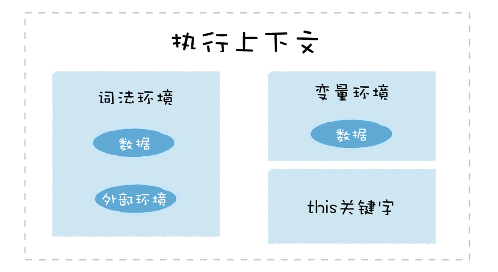

# V8

系统学习架构知识，慢慢积累科班计算机基础课，如：数据结构与算法，操作系统，计算机网络，编译原理等。

## 前言

**通过学习JS引擎V8 的工作机制来分析 JavaScript 的底层机制**

JS引擎——V8，是JS**虚拟机的一种**。虚拟机即为一个将**高级编程语言JS**转为机器语言的**程序**。

市面上的 JavaScript 引擎有：

- SiderMonkey
- V8
- JavaScriptCore

V8 之前，所有的JS虚拟机所采用的都是**解释执行**的方式，特点就是**执行速度慢**。

V8 率先引入了**即时编译（JIT）**策略，它混合了**编译执行和解释执行**这两种手段，极大提升了 JavaScript 的执行速度。V8 也早于其他虚拟机引入了**惰性编译**、**内联缓存**、**隐藏类**等机制，进一步优化了JS代码的编译执行效率。


### 为什么学习 V8？

- 解决工作开发中的问题，如占用内存过高，页面响应速度过慢，使用 Node.js 的时候导致任务被阻塞等
- V8 的主要功能就是结合 JavaScript 语言的特性和本质来编译执行 JavaScript，所以学习 V8 能深入理解 JavaScript 这门语言的特性，本质和设计思想
- 面试


先了解一下 JavaScript 语言本身的设计特点和思想。

### JavaScript 语言本质和设计思想

V8 的主要功能，就是结合 JavaScript 语言的特性和本质来编译执行它。即 V8 会实现 JavaScript 语言在设计时确立下来的特性和功能。

JavaScript 借鉴了很多语言的特性：

- C 语言的基本语法
- Java 的类型系统和内存管理（垃圾回收）
- Scheme 的函数作为一等公民
  - 函数拥有普通类型的特性
    - 可以参数
    - 可以作为返回值
    - 可以赋值给一个变量
  - JavaScript 采取了基于对象的策略
- Self 基于原型（prototype）的继承机制
  - 为了实现原型继承，V8 为每个对象引入了`__proto__`属性

JavaScript 中的坑（举例）：

- 使用 new 加构造函数来创建对象，这种方式的背后隐藏了太多的细节，容易增加代码出错概率
- 初期的 JavaScript 没有块级作用域机制，导致采用了导致变量提升设计思路

**学习 V8 工作原理时，关注 JavaScript 的特性，设计思想和特性背后的 V8 是怎么实现该特性的**，比如，为了实现函数是一等公民的特性，JavaScript 采 取了基于对象的策略； 为了实现原型继承，V8 为每个对象引入了 `__proto__ `属性。分析过 JavaScript 语言之后，再学习 V8 执行 JavaScript 代码的完整流程。


### V8 编译流水线

V8 执行 JavaScript 代码的完整流程称之为 V8 的编译流水线


其中涉及的技术如 JIT、延迟解析、隐藏类、内联缓存等。

V8 中使用**隐藏类**是将 JavaScript 中**动态类型转换为静态类型**的一种技术，可以消除动态类型的语言执行速度过慢的问题，开发者在编写 JavaScript 代码时，可以充分利用好隐藏类这种强大的优化特性，写出更加高效的代码。

V8 实现了 JavaScript 代码的**惰性解析**，是为了**加速代码的启动速度**，可以优化 JavaScript 代码更加适应这个机制，从而提高程序性能。


### 事件循环系统

事件循环系统和异步编程特性高度相关。JavaScript 是单线程的，JavaScript 代码都是在一个线程上执行，如果同一时间需要做多件任务，那这些任务被交给其他模块去执行，执行完成后还需要被管理起来有序获取结果，而 V8 的事件循环系统就是负责调度这些任务的，它驱动了 V8 持续工作。


### 垃圾回收机制

JS是一种自动垃圾回收的语言。**V8 在执行垃圾回收时，会占用主线程的资源，如果编写的程序频繁触发垃圾回收，无疑会阻塞主线程。**需要知道 V8 是如何分配内存数据的，这些数据是如何被回收的。


- JavaScript 语言本身的设计思想和特性，v8 怎样对这些内容实现
- V8 编译流水线（内存分配）
- 事件循环，消息队列和垃圾回收机制


**解释型语言执行速度慢的原因：**

1. 解释型语言编写的程序在用户的电脑中执行代码时，需要先解析编译语言，然后再执行，而编译语言的编译工作是在将程序交到用户手上之前做的，编译型语言的程序在用户那里直接执行就可以。
2. 大部分解释性语言是动态语言，动态语言的数据类型是在运行时检查的，这又需要时间


### JavaScript 的特征

- 函数是一等公民
- 类型系统
- 垃圾回收
- 静态作用域
- 原型链继承


## 宏观下的 V8

目的：宏观上认识 V8，以及V8 的执行流程。执行过程中的一些核心概念：JIT、作用域、词法环境、执行上下文等。

V8 是 JavaScript 虚拟机（引擎）的一种。虚拟机通过模拟实际计算机的各种功能来实现代码的执行，如模拟实际计算机的 CPU、堆栈、寄存器等，还具有它**自己的一套指令系统**。当 V8 执行 JavaScript 代码时， 不需要担心不同操作系统的差异和不同体系结构计算机的差异，只需要按照虚拟机的规范写好代码就可以。

V8 执行 JavaScript 的核心流程：

- **编译：将 JavaScript 代码转换为中间代码（字节码）或者机器能够理解的机器代码**
- **执行：执行转换后的代码并输出执行结果**

渲染进程和 Javascript 引擎之间的关系：**每个渲染进程都有一个 JavaScript 引擎，渲染进程是 JavaScript 引擎的宿主环境。**

v8 执行 js 代码时，内存区域有堆内存中的新生代和老生代，字节码区，机器码区和栈区。


### 高级语言的编译与执行

#### CPU 执行机器代码

CPU 是一个运算机器，通过二进制的指令和 CPU 进行沟通，比如给 CPU 发出“1000100111011000”（长度为两个字节）的二进制指令，这条指令的意思是将一个寄存器中的数据移动到另外一个寄存器中，当CPU执行这条指令的时候，便会按照指令的意思去实现相关的操作。

为了能够完成复杂的任务，工程师们为 CPU 提供了一大堆指令，来实现各种功能，把这一大堆指令称为**指令集**（Instructions），也就是**机器语言**。

CPU 只能识别二进制的指令，但是对程序员来说，二进制代码难以阅读和记忆，于是又将二进制指令集转换为人类可以识别和记忆的符号，这就是**汇编指令集**

```
1000100111011000 机器指令
mov ax,bx 汇编指令
```

CPU 也不能直接识别汇编代码，汇编语言写的程序也需要使用汇编编译器将汇编代码转为机器代码来执行。

书写机器代码和或者汇编代码的不实际性：

- 语法难以记忆

- 虽然汇编语言对机器语言做了一层抽象，但是依然是复杂且繁琐，汇编语言和机器语言是一一对应的关系，这意味着写一个非常简单的功能，也需要实现大量的汇编代码。因为写一个简单的程序也需要大量的机器语言

- 不同的 CPU 有着不同的机器码指令集，同时不同的机器码指令集也有一套自己的汇编指令集

  > 如果要使用机器语言或者汇编语言来实现一个功能，那么需要为每种架构的 CPU 编写特定的机器代码或者汇编代码。


- 在编写汇编代码时，还需要了解和处理器架构相关的硬件知识，比如需要使用的寄存器、内存、操作 CPU 等。

基于以上的原因，就产生了高级语言，它们是屏蔽了计算机架构细节的语言，能适应多种不同 CPU 架构，同时它专注于处理业务逻辑。


高级语言有两种不同的处理方式：

- 解释执行：先将输入的源代码通过**解析器**编译成中间代码，之后直接使用**解释器**解释执行中间代码，然后直接输出结果。（启动速度快，但是执行时的速度慢）

  

- 编译执行：先将源代码由**解析器**转换为中间代码，**编译器**再将中间代码编译成机器代码（编译执行的启动速度慢，但是执行时的速度快）。通常编译成的机器代码是以二进制文件形式存储的，需要执行这个程序的时候直接执行二进制文件就可以。或者可以使用虚拟机将编译后的机器代码保存在内存中，然后直接执行内存中的二进制代码。

  


#### V8 执行 JavaScript 代码

**V8 执行 JavaScript 代码时，并没有采用某种单一的技术，而是混合编译执行和解释执行这两种。**把这种混合使用编译器和解释器的技术称为 JIT（Just In Time）技术。解释执行的启动速度快，但是执行时的速度慢，而编译执行的启动速度慢，但是执行时的速度快。

**V8 在启动过程中采用了解释执行的策略，但是如果某段代码的执行频率超过一个值，那么 V8 就会采用优化编译器将其编译成执行效率更加高效的机器代码。**

V8 执行 JavaScript 的流程图：


从左往右看，在 V8 启动执行 JavaScript 之前，它需要**准备执行 JavaScript 时所需要的一些基础环境**，这些基础环境包括：

- 堆空间

- 栈空间

- 全局执行上下文，其中包含了全局信息，内置函数，全局变量等

- 全局作用域（全局变量）

- 初始化消息循环系统（消息驱动器和消息队列）


这些内容都是在执行 JavaScript 过程中需要使用到的。


基础环境准备后，就可以向 V8 提交要执行的 JavaScript 代码了。

1. v8 接受 JavaScript 源码，但V8不能直接识别 JavaScript 源码

2. 结构化源码生产 AST，同时生成相关的作用域，存放变量，包括作用域链指向

   > 结构化，是指信息经过分析后可分解成多个互相关联的组成部分，各组成部分间有明确的层次结构，方便使用和维护，并有一定的操作规范。

3. 基于 AST 生成字节码

   > 字节码是介于 AST 和机器代码的中间代码。但是与特定类型的机器代码无关，解释器可以直接解释执行字节码，或者通过编译器将其编译为二进制的机器代码再执行。

4. 解释器解释执行生成的字节码，并输出执行结果

5. 在解释器执行的过程中，有一个模块会监控解释器执行状态，在解释执行字节码的过程中，如果发现了某一段代码会被重复多次执行，那么监控模块会将这段代码标记为热点代码。

6. 当某段代码被标记为热点代码后，V8 就会将这段字节码丢给优化编译器，优化编译器会在后台将字节码编译为二进制代码，然后再对编译后的二进制代码执行优化操作，优化后的二进制机器代码的执行效率会得到大幅提升。

7. 如果后面再执行到这段代码时，那么 V8 会优先选择优化之后的二进制代码，这样代码的执行速度就会大幅提升。

> JS 的对象的结构和属性是可以在运行时任意修改的，而经过优化编译器优化过的代码只能**针对某种固定的结构**，一旦在执行过程中，对象的结构被动态修改了，那么优化之后的代码会变成无效的代码，这时候优化编译器就需要执行反优化操作，经过反优化的代码，下次执行时就会回退到解释器解释执行。


#### V8 执行一段 JavaScript 代码的主要流程

1. 初始化基础环境；
2. 解析源码生成 AST 和作用域；
3. 依据 AST 和作用域生成字节码；
4. 解释执行字节码；
5. 监听热点代码；
6. 优化热点代码为二进制的机器代码；
7. 反优化生成的二进制机器代码。


#### 一段实际代码的执行流程

test.js:

```js
var test = 'GeekTime';
```

要查看 V8 中间生成的一些结构，可以使用 V8 提供的调试工具 D8 来查看。

```
d8 --print-ast test.js
```

AST:

```
--- AST ---
FUNC at 0
. KIND 0
. LITERAL ID 0
. SUSPEND COUNT 0
. NAME ""
. INFERRED NAME ""
. DECLS
. . VARIABLE (0x7ff0e3022298) (mode = VAR, assigned = true) "test"
. BLOCK NOCOMPLETIONS at -1
. . EXPRESSION STATEMENT at 11
. . . INIT at 11
. . . . VAR PROXY unallocated (0x7ff0e3022298) (mode = VAR, assigned = true) "test"
. . . . LITERAL "GeekTime"
```

AST（树状解构）是 JS 源代码的结构化表述，AST 和代码结构也是一一对应关系，并且后续所有的操作都会直接或者间接基于它。


作用域:

```
d8 --print-scopes test.js
```

```
Global scope:
global { // (0x7fd974022048) (0, 24)
    // will be compiled
    // 1 stack slots
    // temporary vars:
    TEMPORARY .result; // (0x7fd9740223c8) local[0]
    // local vars:
    VAR test; // (0x7fd974022298)
}
```

生成了一个全局作用域，test 变量被添加进了这个全局作用域中。


字节码：

```
d8 --print-bytecode test.js
```

```
[generated bytecode for function: (0x2b510824fd55 <SharedFunctionInfo>)]
Parameter count 1
Register count 4
Frame size 32
          0x2b510824fdd2 @ 0 : a7 StackCheck
          0x2b510824fdd3 @ 1 : 12 00 LdaConstant [0]
          0x2b510824fdd5 @ 3 : 26 fa Star r1
          0x2b510824fdd7 @ 5 : 0b LdaZero
          0x2b510824fdd8 @ 6 : 26 f9 Star r2
          0x2b510824fdda @ 8 : 27 fe f8 Mov <closure>, r3
          0x2b510824fddd @ 11 : 61 32 01 fa 03 CallRuntime [DeclareGlobals]
          0x2b510824fde2 @ 16 : 12 01 LdaConstant [1]
          0x2b510824fde4 @ 18 : 15 02 02 StaGlobal [2], [2]
          0x2b510824fde7 @ 21 : 0d LdaUndefined
          0x2b510824fde8 @ 22 : ab Return
Constant pool (size = 3)
0x2b510824fd9d: [FixedArray] in OldSpace
  - map: 0x2b51080404b1 <Map>
  - length: 3
          0: 0x2b510824fd7d <FixedArray[4]>
          1: 0x2b510824fd1d <String[#8]: GeekTime>
          2: 0x2b51081c8549 <String[#4]: test>
Handler Table (size = 0)
Source Position Table (size = 0)
```


查看被编译优化的代码：

```
d8 --trace-opt test.js
```


查看被反优化的代码：

```
pt --trace-deopt test.js
```


[搭建D8环境](https://gist.github.com/kevincennis/0cd2138c78a07412ef21)


## 函数

**如果某个编程语言的函数可以和该编程语言中的其他数据类型做一样的事情，就把这个语言中的函数称为一等公民。**

### JavaScript 中函数的特点

JavaScript 中的函数就是一种特殊的对象。它和对象一样可以拥有属性和值，但是函数和普通对象不同的是，函数可以被调用。

基于函数是一等公民的设计，使得 JavaScript 非常容易实现一些特性，比如闭包，还有函数式编程等，其他语言在实现这些特征时就比较困难。

JavaScript 是一门**基于对象** (Object-Based) 的语言，而不是**面向对象**，对象在运行时可以动态修改其内容。但是它却不是一门面向对象的语言 (ObjectOriented Programming Language)，因为面向对象语言天生支持封装、继承、多态，JavaScript 没有直接提供对多态的支持。

JavaScript 实现继承的方式和面向对象的语言实现继承的方式同样存在很大的差异。面向对象语言是由语言本身对继承做了充分的支持，并提供了大量的关键字，如 public、 protected、friend、interface 等。这些关键字的组合使用就使得面向对象语言的继承可以很多样，而 JavaScript 中实现继承的方式却非常简单，只是在对象中添加了一个称为原型的属性，把继承的对象通过原型链接起来，就实现了继承，把这种继承方式称为基于原型链继承。

什么是 JavaScript 中的“对象”？它和面向对象语言中的“对象”有什么区别？

**JavaScript 中的对象就是由一组组属性和值构成的集合，对象的值可以是任意类型的数据。**


### V8 内部是怎么实现函数可调用特性？

在 V8 内部会为函数对象添加了两个隐藏属性，具体属性如下图所示：


函数除了可以拥有常用类型的属性值之外，还拥有两个隐藏属性，分别是 name 属性和 code 属性。

隐藏 name 属性的值就是函数名称，如果某个函数没有设置函数名，该函数对象的默认的 name 属性值就是 anonymous，表示该函数对象没有被设置名称。

如果在函数对象上再用代码 foo.name="aaaa"，这会覆盖函数的名称吗？

> 不会的，编译规程中已经生成函数对象了，对应的作用域中也保存了指向对象的引用了，所以对象本身的 name 属性改变是不会影响到函数正常的执行的

隐藏属性 code 属性，其值表示函数代码，以**字符串**的形式存储在内存中。当执行到一个函数调用语句时，V8 便会从函数对象中取出 code 属性值，也就是函数代码，然后再解释执行这段函数代码。


### 函数带来的特性

闭包（将外部变量和和函数绑定起来的技术）。在执行 JavaScript 函数的过程中，为了实现变量的查找，V8 会为其维护一个作用域链，如果函数中使用了某个变量，但是在函数内部又没有定义该变量，那么函数就会沿着作用域链去外部的作用域中查找该变量，具体流程如下图所示：


实现闭包就虚拟机需要处理函数引用的外部变量。


## 内存快照

在 Chrome 中查看内存快照。

在控制台运行这样一段程序：

```js
function Food(name, type) {
  this.name = name;
  this.type = type;
}
var beef = new Food('beef', 'meat');
```

切换到 Memory 中，点击左侧的小圈圈就可以捕获当前的内存快照。


通过构造函数创建对象，主要是为了更方便地在快照中找到它。


## 对象属性

JS对象像一个字典，字符串作为键名，任意对象可以作为键值，可以通过键名读写键值。

V8 实现对象存储时，并**没有完全**采用字典的存储方式，出于性能的考量。 因为字典是非线性的数据结构，**查询效率**会低于线性的数据结构，V8 为了提升对象的属性的存储和查找效率，采用了一套复杂的存储策略。非线性的数据结构的**修改和删除效率高**。


V8 采用了哪些策略提升了对象属性的访问速度？

### V8 中对象的结构

在 V8 中，对象主要由三个指针构成，分别是隐藏类（Hidden Class），`Property` 还有 `Element`。


#### 常规属性 (properties) 和排序属性 (element)

```js
function Foo() {
  this[100] = 'test-100';
  this[1] = 'test-1';
  this['B'] = 'bar-B';
  this[50] = 'test-50';
  this[9] = 'test-9';
  this[8] = 'test-8';
  this[3] = 'test-3';
  this[5] = 'test-5';
  this['A'] = 'bar-A';
  this['C'] = 'bar-C';
  this[Symbol('foo')] = 'symbol-1'; // symbol属性默认是无法被for in 循环取到的。
}
var bar = new Foo();
for (key in bar) {
  console.log(`index:${key} value:${bar[key]}`);
}

// index:1 value:test-1
// index:3 value:test-3
// index:5 value:test-5
// index:8 value:test-8
// index:9 value:test-9
// index:50 value:test-50
// index:100 value:test-100
// index:B value:bar-B
// index:A value:bar-A
// index:C value:bar-C
```

结论：

- 设置的数字属性被最先打印出来了，并且按照数字大小的顺序打印的；
- 设置的字符串属性依然是按照之前的设置顺序打印的；

在 ECMAScript 规范中定义了**数字属性应该按照索引值大小升序排列，字符串属性根据创建时的顺序升序排列。**

**把对象中的数字属性称为排序属性**，称为 **elements**

**字符串属性就被称为常规属性**，称为 **properties**。

在 V8 内部，为了提升**存储和访问**这两种属性的性能，分别使用了**两个线性数据结构**来分别保存排序属性和常规属性，具体结构如下图所示：


bar 对象包含了两个隐藏属性：elements 属性和 properties 属 性，elements 属性指向了 **elements 对象**，在 elements 对象中，会按照顺序存放排序属性，properties 属性则指向了 **properties 对象**，在 properties 对象中，会**按照创建时的顺序保存**常规属性。

**分解成这两种线性数据结构之后，如果执行索引操作，那么 V8 会先从 elements 属性中按照顺序读取所有的元素，然后再在 properties 属性中读取所有的元素，这样就完成一次索引操作。**


### 快属性和慢属性

将不同的属性分别保存到 elements 属性和 properties 属性中，能简化程序的复杂度，但是在查找元素时，却多了一步操作。比如执行 bar.B 这个语句来查找 B 的属性值， 那么在 V8 会先查找出 properties 属性所指向的对象 properties，然后再在 properties 对象中查找 B 属性，这种方式在查找过程中增加了一步操作，因此会影响到元素的查找效率。

基于这个原因，V8 采取了一个权衡的策略以加快查找属性的效率，这个策略是**将部分常规属性直接存储到对象本身**，把这称为**对象内属性 (in-object properties)**。对象在内存中的展现形式参考下图：


采用对象内属性之后，常规属性就被保存到 bar 对象本身了，这样当再次使用 bar.B 来查 找 B 的属性值时，V8 就可以直接从 bar 对象本身去获取该值就可以了，这种方式减少查找 属性值的步骤，增加了查找效率。

**对象内属性的数量是固定的，默认是 10 个**，如果添加的属性超出了对象分配的空间， 则超出的那些属性将被保存在常规属性存储中。虽然属性存储多了一层间接层，但可以自由地扩容。

**将保存在线性数据结构中的属性称之为“快属性”。**线性数据结构中只需要通过索引即可以访问到属性，虽然访问线性结构的速度快，但是如果从线性结构中添加或者删除大量的属性时，则执行效率会非常低，这主要因为会产生大量时间和内存开销。

因此，**如果一个对象的属性过多时，V8 为就会采取另外一种存储策略，“慢属性”策略**，但慢属性的对象内部会有独立的非线性数据结构 (词典) 作为属性存储容器。所有的属性元信息不再是线性存储的，而是直接保存在属性字典中。


通常不建议使用 delete 来删除属性的原因？

**如果对象中的属性过多时，或者存在反复添加或者删除属性的操作，那么 V8 就会将线性的存储模式降级为非线性的字典存储模式，这样降低了查找速度，却提升了修改对象的属性的速度。**

```js
function Foo(property_num, element_num) {
  //添加可索引属性
  for (let i = 0; i < element_num; i++) {
    this[i] = `element${i}`;
  }
  //添加常规属性
  for (let i = 0; i < property_num; i++) {
    let ppt = `property${i}`;
    this[ppt] = ppt;
  }

  for (let i = 0; i < property_num; i++) {
    let ppt = `property${i}`;
    this[Symbol(ppt)] = ppt;
  }
}

var bar = new Foo(10, 10); // 第一行

var bar = new Foo(20, 10); // 第二行

var bar3 = new Foo(100, 10); // 第三行
```

第一行对应的结果：

- 10 个常规属性作为对象内属性，存放在 bar 函数内部；
- 10 个排序属性存放在 elements 中。


第二行对应的结果：

- 10 属性直接存放在 bar2 的对象内 ;
- 10 个常规属性以线性数据结构的方式存放在 properties 属性里面 ;
- 10 个数字属性存放在 elements 属性里面。


第三行对应的结果：

- 10 属性直接存放在 bar3 的对象内 ;
- 90 个常规属性以非线性字典的这种数据结构方式存放在 properties 属性里面 ;
- 10 个数字属性存放在 elements 属性里面。


[更详细的参考文章](https://www.cnblogs.com/chargeworld/p/12236848.html)

**element：**

element 没有内置。element 默认采用连续的存储结构，通过浪费空间换取时间，直接下标访问，提升访问速度。 但当 element 的序号十分不连续时，会优化成为 hash 表，因为如果还是使用采用连续的存储结构，中间就会有很多内存空间被浪费的，不合算。

**property：**

property 有内置，只有十个。property 默认采用链表结构，当数据量很小时，查找也会很快，但数据量上升到某个数值后，会优化成为 hash 表。因为超过某个数值，顺序查找就不够快了，需要通过 hash 表结构查找，提升速度。

**hash 表不是应该查找一次吗？为何是慢查询**

hash 表要解决 key 冲突问题，一般会用 list 存储多个冲突的 key，所以计算 hash 后，还是要做顺序访问，所以要多次访问。 此外，还涉及到 hash 扩容的问题，那就更慢了。 所以，整体上来说，hash 慢于按地址访问的； 在数据量小的时候，也慢于链表的顺序访问。

[v8 引擎原博客](https://v8.dev/blog/fast-properties)


## 函数表达式

使用函数表达式可以实现**代码隐藏和变量隔离**，在开源项目中很常见。

重点在于理解表达式，语句和函数表达式的底层工作机制

函数表达式和函数声明：


函数表达式和函数声明有着本质上的差异。两种定义函数的方式具有不同语义，不同的语义触发了不同的行为。


### V8 处理函数声明

在**编译阶段**，如果解析到函数声明，那么 V8 会将这个函数声明转换为堆内存中的函数对象， 并将其内存地址指针放到作用域中。 如果解析到了某个变量声明，也会将其放到作用域中，但是会将其值设置为 undefined，表示该变量还未被使用。

```js
var x = 5;
function foo() {
  console.log('Foo');
}
```

在执行阶段，如果使用了某个变量，或者调用了某个函数，那么 V8 便会去作用域查找相关内容。


D8 查看作用域的数据：

```
Global scope:
global { // (0x7fb62281ca48) (0, 50)
    // will be compiled
    // 1 stack slots
    // temporary vars:
    TEMPORARY .result; // (0x7fb62281cfe8) local[0]
    // local vars:
    VAR x; // (0x7fb62281cc98)
    VAR foo; // (0x7fb62281cf40)
    function foo () { // (0x7fb62281cd50) (22, 50)
        // lazily parsed
        // 2 heap slots
    }
}
```

函数对象被 V8 存放在内存中的堆空间了，这些变量都是在编译阶段被装进作用域中的。因为在执行之前，这些变量都被提升到作用域中了，所以在执行阶段，V8 就能获取到所有的定义变量。


### 表达式和语句

```js
x = 5; // 该语句返回5
6 === 5; // 返回false

var x; // 语句，它不返回任何值
```

**表达式就是表示值的式子，而语句是操作值的式子。**表达式是有返回值的式子，而语句则没有返回值。

对于函数声明式的写法，它是语句而不是表达式。


**在编译阶段，V8 并不会执行表达式，只会分析基础的语句，比如变量的定义，函数的声明。**

在 V8 解析 JavaScript 源码的过程中，如果遇到普通的变量声明，那么便会将其提升到作用域中，并给该变量赋值为 undefined，如果遇到的是函数声明，那么 V8 会在内存中为声明生成函数对象，并将该对象提升到作用域中。


在 V8 执行 var x = 5 这段代码时，会认为它是两段代码，一段是定义变量的语句，一段是赋值的表达式，如下所示：

```js
var x = undefined;
x = 5;
```

**所有的表达式都是在执行阶段完成的。**


### IIFE

**在编译阶段，V8 并不会处理函数表达式，而 JS 中的IIFE正是使用了这个特性来实现广泛的应用**。

**JS 中有一个圆括号运算符，圆括号里面可以放一个表达式**，比如下面的代码：

```
(a=3)
```

**括号里面是一个表达式，整个语句也是一个表达式，最终输出 3。**

```js
(function () {
  //statements
});
```

因为**小括号之间存放的必须是表达式**，所以如果在小阔号里面定义一个函数，那么 V8 就会把这个函数看成是函数表达式，执行时它会返回一个函数对象。


存放在括号里面的函数便是一个函数表达式，它会返回一个函数对象，如果直接在表达式 后面加上调用的括号，这就称立即调用函数表达式（IIFE），比如下面代码：

```js
(function () {
  //statements
})();
```

**因为函数立即表达式也是一个表达式，所以 V8 在编译阶段，并不会为该表达式创建函数对象。这样的一个好处就是不会污染环境，函数和函数内部的变量都不会被其他部分的代码访问到。**

使用函数立即表达式就可以将我们内部变量封装起来， 避免了相互之间的变量污染。

因为函数立即表达式是立即执行的，所以将一个函数立即表达式赋给一个变量时，不是存储 IIFE 本身，而是存储 IIFE 执行后返回的结果。

**函数声明的本质是语句，而函数表达式的本质则是表达式。**


## 原型链

**继承就是一个对象可以访问另外一个对象中的属性和方法。**

不同的语言实现继承的方式是不同的，其中最典型的两种方式是**基于类继承**和**基于原型继承**。

基于类的模式最大的特点就是提供了复杂的规则，并提供了非常多的关键字，诸如 class、friend、protected、 private、interface 等，通过组合使用这些关键字，就可以实现继承。

使用基于类的继承时，如果业务复杂，那么需要创建大量的对象，然后需要维护非常复杂的继承关系，这会导致代码复杂和臃肿，另外引入了这么多关键字也给设计带来了更大的复杂度。

JS 本身不提供一个 class 实现，虽然ES6 中引入了 class 关键字，但那只是语法糖，JS 的继承依然和基于类的继承没有一点关系。

JavaScript 是通过在对象上引入一个属性来实现继承的。

基于原型继承是如何实现？

`JS 的每个对象都包含了一个隐藏属性 __proto__ ，把该隐藏属性 __proto__ 称之为该对象的原型 (prototype)，__proto__ 指向了内存中的另外一个对象，把 __proto__ 指向的对象称为该对象的原型对象，那么该对象就可以直接访问其原型对象的方法或者属性。`

作用域链是沿着函数的作用域一级一级来查找变量的，而原型链是沿着对象的原型一级一级来查找属性的，虽然它们的实现方式是类似的，但是它们的用途是不同的。

通常隐藏属性是不能使用 JavaScript 来直接与之交互的。虽然现代浏览器都开了一个口子，让 JavaScript 可以访问隐藏属性` _proto_`，但是在实际项目中， 我们不应该直接通过`_proto_`来访问或者修改该属性，其主要原因有两个：

- 这是隐藏属性，并不是标准定义的
- 使用该属性会造成严重的性能问题


### 构造函数创建对象

```js
function DogFactory(type, color) {
  this.type = type;
  this.color = color;
}

var dog = new DogFactory('Dog', 'Black');
```

当 V8 执行上面这段代码时，V8 会在背后悄悄地做了以下几件事情，模拟代码如下所 示：

```js
var dog = {}; // 创建了一个空白对象 dog
dog.__proto__ = DogFactory.prototype; // 将 DogFactory 的 prototype 属性设置为 dog 的原型对象
DogFactory.call(dog, 'Dog', 'Black'); // 再使用 dog 来调用 DogFactory，这时候 DogFactory 函数中的 this 就指向了对象 dog，然后在 DogFactory 函数中，利用 this 等于对象 dog 执行属性填充操作，最终就创建了对象dog。
```


每个函数对象中都有一个公开的 prototype 属性，当将这个函数作为构造函数来创建一个新的对象时，新创建对象的原型对象就指向了该函数的 prototype 属性。


## 作用域链

原型链将一个个原型对象串起来， 实现对象属性的查找（继承）。

作用域链将一个个作用域串起来，实现变量或者方法的查找路径。**讨论作用域链，实际就是在讨论按照什么路径查找变量的问题。**


### 作用域的工作原理

在 V8 执行函数时，会在编译阶段为函数创建一个作用域。函数中定义的变量和声明的函数都会丢到该作用域中，另外系统还为函数作用域添加了另外一个隐藏变量 this。

在执行一 个函数时，当该函数需要使用某个变量或者调用了某个函数时，便会优先在该函数作用域中 查找相关内容。

全局作用域是**在 V8 启动过程中就创建**了，且一直保存在内存中不会被销毁的，直至 V8 退出。 而函数作用域是在执行该函数时创建的，当函数执行结束之后，函数作用域就随之被销毁掉了。

V8 启动之后就进入正常的消息循环状态，执行代码。

**JavaScript 是基于词法作用域的，词法作用域就是指，查找作用域的顺序是按照函数 定义时的位置来决定的。**

**因为词法作用域是根据函数在代码中的位置来确定的，作用域是在 声明函数时就确定好的了，所以也将词法作用域称为静态作用域。**

和静态作用域相对的是动态作用域，动态作用域并不关心函数和作用域是如何声明以及在何 处声明的，只关心它们从何处调用。换句话说，动态作用域的作用域链是基于调用栈的，而不是基于函数定义的位置的。

**function f(){setTimeOut(f,0)}这种调用会不会导致内存溢出？**

> 不会溢出啊，因为这是异步调用，下次执行 f 函数时，已经在新的栈中执行 了，所以当前栈不会发生溢出！
>
> 理解这个问题核心是理解事件循环和消息队列这套机制

**在大量数据时(百万级别) ，foreach 循环比 for 循环的执行效率低，是因为什么？**


## 类型系统

V8 如何实现 1 + ‘2’ ？

对机器语言来说，所有的数据都是一堆二进制代码，CPU 处理这些数据的时候，并没有类型的概念，CPU 所做的仅仅是移动数据，比如对其进行移位，相加或相乘。

在高级语言中，都会为操作的数据赋予指定的类型。引入了这些类型之后，编译器或者解释器就可以根据类型来限制一些没有意义的操作。

**每种语言都定义了自己的类型，还定义了如何操作这些类型，另外还定义了这些类型应该如何相互作用，就把这称为类型系统。**

一门语言的类型系统定义了各种类型之间应该如何相互操作，比如，两种不同类型相加应该如何处理，两种相同的类型相加又应该如何处理等。还规定了各种不同类型应该如何相互转换，比如字符串类型如何转换为数字类型。


当有两个值相加的时候，V8 会严格根据 ECMAScript 规范来执行操作。比如在 ECMAScript 就定义了怎么执行加法操作，如下所 示：


1. 把第一个表达式 (AdditiveExpression) 的值赋值给左引用 (lref)。

2. 使用 GetValue(lref) 获取左引用 (lref) 的计算结果，并赋值给左值。

3. 使用 ReturnIfAbrupt(lval) 如果报错就返回错误。

4. 把第二个表达式 (MultiplicativeExpression) 的值赋值给右引用 (rref)。

5. 使用 GetValue(rref) 获取右引用 (rref) 的计算结果，并赋值给 rval。

6. 使用 ReturnIfAbrupt(rval) 如果报错就返回错误。

7. 使用 ToPrimitive(lval) 获取左值 (lval) 的计算结果，并将其赋值给左原生值 (lprim)。

8. 使用 ToPrimitive(rval) 获取右值 (rval) 的计算结果，并将其赋值给右原生值 (rprim)。

9. **如果 Type(lprim) 和 Type(rprim) 中有一个是 String，则：**

   1. **把 ToString(lprim) 的结果赋给左字符串 (lstr)；**
   2. **把 ToString(rprim) 的结果赋给右字符串 (rstr)；**
   3. **返回左字符串 (lstr) 和右字符串 (rstr) 拼接的字符串。**

10. **把 ToNumber(lprim) 的结果赋给左数字 (lnum)。**

11. **把 ToNumber(rprim) 的结果赋给右数字 (rnum)。**

12. 返回左数字 (lnum) 和右数字 (rnum) 相加的数值。

通俗地理解，V8 会提供了一个 ToPrimitve 方法，其作用是将 a 和 b 转换为原生数据类型，其转换流程如下：

1. 先检测该对象中是否存在 valueOf 方法，如果有并返回了原始类型，那么就使用该值进行强制类型转换；
2. 如果 valueOf 没有返回原始类型，那么就使用 toString 方法的返回值；
3. 如果 vauleOf 和 toString 两个方法都不返回基本类型值，便会触发一个 TypeError 的 错误。

将对象转换为原生类型的流程图如下所示：


当 V8 执行 1+“2”时，因为这是两个原始值相加，原始值相加的时候，如果其中一项是字符串，那么 V8 会默认将另外一个值也转换为字符串，相当于执行了下面的操作：

```js
Number(1).toString() + '2';
```

把数字 1 转换为字符串“1”的过程也称为隐式类型转换，所以如果不熟悉语义，就容易判断错误。

```js
var Obj = {
  toString() {
    return '200';
  },
  valueOf() {
    return 100;
  }
};
Obj + 3;
```

先使用 ToPrimitve 方法将 Obj 转换为原生类型，而 ToPrimitve 会优调用对象中的 valueOf 方法，由于 valueOf 返回了 100，那么 Obj 就会被转换为数字 100，那么数字 100 加数字 3，那么结果是 103 。

改造代码：

```js
var Obj = {
  toString() {
    return new Object();
  },
  valueOf() {
    return new Object();
  }
};
Obj + 3;
```

因为 ToPrimitve 会先调用 valueOf 方法，发现返回的是一个对象，并不是原生类型，当 ToPrimitve 继续调用 toString 方法时，发现 toString 返回的也是一个对象，都是对象， 就无法执行相加运算了，这时候虚拟机就会抛出一个异常，异常如下所示：

```js
VM263:9 Uncaught TypeError: Cannot convert object to primitive value at <anonymous>:9:6
```

提示的是类型错误，错误原因是无法将对象类型转换为原生类型。

在执行加法操作的时候，V8 会通过 ToPrimitve 方法将对象类型转换为基本数据类型，最后就是两个基本数据类型相加，如果其中一个值的类型是字符串时，则另一个值也需要强 制转换为字符串，然后做字符串的连接运算。**在其他情况时，所有的值都会转换为数字类型 值，然后做数字的相加。**


## V8 的调试工具 d8

使用 d8 来查看 V8 在执行 JavaScript 过程中的各种中间数据，比如作用域、AST、字节码、优化的二进制代码、垃圾回收的状态，还可以使用 d8 提供的私有 API 查看一些内部信息。

### 通过 V8 的源码构建 D8

通常，没有直接获取 d8 的途径，而是需要通过编译 V8 的源码来生成 d8。

1. 下载 V8 的源码
2. 生成工程文件
3. 编译 V8 的工程并生成 d8

V8 并不是一个单一的版本库，它还引用了很多第三方的版本库，大多是版本库我们都无法直接访问，所以，在下载代码过程中，先准备一个 VPN。

下载编译工具链：depot_tools，后续 V8 源码的下载、配置和编译都是由 depot_tools 来完成的。[depot_tools bundle](https://time.geekbang.org/column/article/219418#:~:text=%E5%87%BB%E4%B8%8B%E8%BD%BD%EF%BC%9Adepot_tools-,bundle,-%E3%80%82)

depot_tools 压缩包下载到本地之后，解压压缩包，然后需要将解压路径添加到环境变量中，这样我们就可以在控制台中使用 gclient 。

设置环境变量，还需要往系统环境变量中添加变量 DEPOT_TOOLS_WIN_TOOLCHAIN ，值设为 0。

这个环境变量的作用是告诉 deppt_tools，使用本地已安装的默认的 Visual Studio 版本去编译，否则 depot_tools 会使用 Google 内部默认的版本。

安装 VS2019，在 Windows 系统下面，depot_tools 使用了 VS2019，因为 VS2019 自带了编译 V8 的编译器，所以需要安装 VS2019 时，安装时，你需要选择以下两项内容：

- Desktop development with C++；
- MFC/ATL support

因为编译 V8 时，使用了这两项所提供的基础开发环境。

下载 V8 源码，使用 depot_tools 来下载 V8 源码，具体下载命令如下所示：这个过程比较耗时

```
d:
mkdir v8
cd v8
fetch v8
cd v8
```


配置工程，代码下载完成之后，就需要配置工程了，我们使用 gn 来配置。

```
cd v8

// windows
gn gen out.gn/x64.release --args='is_debug=false target_cpu="x64" v8_target_cpu="arm64" use_goma=true'


// mac
gn gen out/gn --ide=xcode
```

gn 是一个跨平台的构建系统，用来构建 Ninja 工程，Ninja 是一个跨平台的编译系统，比如可以通过 gn 构建 Chromium 还有 V8 的工程文件，然后使用 Ninja 来执行编译，可以使用 gn 和 Ninja 来配合使用构建跨平台的工程，这些工程可以在 macOS、Linux、Windows 等平台上进行编译。在 gn 之前，Google 使用了 gyp 来构建，由于 gn 的效率更高，所以现在都在使用 gn。

生成 V8 工程的一些基础配置项：

- is_debug = false 编译成 release 版本 ;
- is_component_build = true 编译成动态链接库而不是很大的可执行文件 ;
- symbol_level = 0 将所有的 debug 符号放在一起，可以加速二次编译，并加速链接过程 ;
- ide = vs2019 ide=xcode。

工程生成好之后，你就可以去 v8\out.gn\x64.release 这个目录下查看生成的工程文件。如下图所示：


生成了 d8 的工程配置文件，接下来就可以编译 d8 了，你可以使用下面的命令：

```
ninja -C out.gn/x64.release
```

如果想编译特定目标，比如 d8，可以使用下面的命令：

```
ninja -C out.gn/x64.release d8
```

这个命令只会编译和 d8 所依赖的工程，然后就开始执行编译流程了。如下图所示：


编译时间取决于你硬盘读写速度和 CPU 的个数。最终编译结束之后，你就可以去 v8\out.gn\x64.release 查看生成的文件，如下图所示：


### 使用 d8

现在我们编译出来了 d8 ，接下来我们将 d8 所在的目录，v8\out.gn\x64.release 添加到环境变量“PATH”的路径中，这样我们就可以在控制台中使用 d8 了。

测试下能不能使用 d8，你可以使用下面这个命令，在控制台中执行 d8：

```
d8 --help
```


d8 --help 打印出来的列表非常长，如果过滤特定的命令，你可以使用下面的命令来查看：

```
d8 --help |grep print
```

查看看 d8 有多少关于 print 的命令，如果使用了 Windows 系统，可能缺少 grep 程序，你可以去下载。

安装完成之后，记得手动将 grep 程序所在的目录添加到环境变量 PATH 中，这样才能在控制台使用 grep 命令。

最终打印出来带有 print 字样的命令，包含以下内容：


每一行其实都对应着一个命令，比如 print-bytecode 就是查看生成的字节码，print-opt-code 是要查看优化后的代码，turbofan-stats 是打印出来优化编译器的一些统计数据的命令，每个命令后面都有一个括号，括号里面是介绍这个命令的具体用途。

使用 d8 进行调试方式如下：

```
d8 test.js --print-bytecode
```

d8 后面跟上文件名和要执行的命令，如果执行上面这行命令，就会打印出 test.js 文件所生成的字节码。

一些重点的命令，比如 trace-gc，trace-opt-verbose，涉及到了编译流水线的中间数据，垃圾回收器执行状态。熟悉使用这些命令可以帮助我们更加深刻理解编译流水线和垃圾回收器的执行状态。

在使用 d8 执行一段代码之前，你需要将你的 JavaScript 源码保存到一个 js 文件中，把所需要需要观察的代码都存放到 test.js 这个文件中。

- –print-ast 来查看中间生成的 AST
- -print-scope 来查看中间生成的作用域
- –print-bytecode 来查看中间生成的字节码

### D8 查看代码优化

通过 D8 查看 V8 对 JavaScript 代码的优化：

```js
let a = { x: 1 };
function bar(obj) {
  return obj.x;
}
function foo() {
  let ret = 0;
  for (let i = 1; i < 7049; i++) {
    ret += bar(a);
  }
  return ret;
}
foo();
```

当 V8 先执行到这段代码的时候，监控到 while 循环会一直被执行，于是判断这是一块热点代码，于是，V8 就会将热点代码编译为优化后的二进制代码，你可以通过下面的命令来查看：

```
d8 --trace-opt-verbose test.js
```

执行这段命令之后，提示如下所示：


上图中的代码优化提示：

<JSFunction foo (sfi = 0x2c730824fe21)> for optimized recompilation, reason: small function]

这就是告诉我们，已经使用 TurboFan 优化编译器将函数 foo 优化成了二进制代码，执行 foo 时，实际上是执行优化过的二进制代码。

现在我们把 foo 函数中的循环加到 10 万，再来查看优化信息，最终效果如下图所示：


又出现了一条新的优化信息，新的提示信息如下：

<JSFunction foo (sfi = 0xc9c0824fe21)> using TurboFan OSR]

这段提示是说，由于循环次数过多，V8 采取了 TurboFan 的 OSR 优化，OSR 全称是 On-Stack Replacement，它是一种在运行时替换正在运行的函数的栈帧的技术，如果在 foo 函数中，每次调用 bar 函数时，都要创建 bar 函数的栈帧，等 bar 函数执行结束之后，又要销毁 bar 函数的栈帧。

通常情况下，这没有问题，但是在 foo 函数中，采用了大量的循环来重复调用 bar 函数，这就意味这 V8 需要不断为 bar 函数创建栈帧，销毁栈帧，那么这样势必会影响到 foo 函数的执行效率。

于是，V8 采用了 OSR 技术，将 bar 函数和 foo 函数合并成一个新的函数，具体你可以参考下图：


如果我在 foo 函数里面执行了 10 万次循环，在循环体内调用了 10 万次 bar 函数，那么 V8 会实现两次优化，第一次是将 foo 函数编译成优化的二进制代码，第二次是将 foo 函数和 bar 函数合成为一个新的函数。

参考文章:on-stack replacement in v8

### 垃圾回收优化

通过 d8 来查看垃圾回收的状态，可以参看下面这段代码：

```js
function strToArray(str) {
  let i = 0;
  const len = str.length;
  let arr = new Uint16Array(str.length);
  for (; i < len; ++i) {
    arr[i] = str.charCodeAt(i);
  }
  return arr;
}

function foo() {
  let i = 0;
  let str = 'test V8 GC';
  while (i++ < 1e5) {
    strToArray(str);
  }
}

foo();
```

上面的函数每次循环时都会生成一个数组，用于存放字符串中的每个字符。通过 trace-gc 来查看这段代码的内存回收状态，执行下面这段命令：

```
d8 --trace-gc test.js
```

打印出来的结果如下图所示：


提示内容：

```
Scavenge 1.2 (2.4) -> 0.3 (3.4) MB, 0.9 / 0.0 ms  (average mu = 1.000, current mu = 1.000) allocation failure
```

意思是提示“Scavenge … 分配失败”，是因为垃圾回收器 Scavenge 所负责的空间已经满了，Scavenge 主要回收 V8 中“新生代”中的内存，大多数对象都是分配在新生代内存中，内存分配到新生代中是非常快速的，但是新生代的空间却非常小，通常在 1 ～ 8 MB 之间，一旦空间被填满，Scavenge 就会进行“清理”操作。

上面这段代码之所以能频繁触发新生代的垃圾回收，是因为它频繁地去申请内存，而申请内存之后，这块内存就立马变得无效了，为了减少垃圾回收的频率，我们尽量避免申请不必要的内存，比如我们可以换种方式来实现上述代码，如下所示：

```js
function strToArray(str, bufferView) {
  let i = 0;
  const len = str.length;
  for (; i < len; ++i) {
    bufferView[i] = str.charCodeAt(i);
  }
  return bufferView;
}

function foo() {
  let i = 0;
  let str = 'test V8 GC';
  let buffer = new ArrayBuffer(str.length * 2);
  let bufferView = new Uint16Array(buffer);
  while (i++ < 1e5) {
    strToArray(str, bufferView);
  }
}

foo();
```

将 strToArray 中分配的内存块，提前到了 foo 函数中分配，这样我们就不需要每次在 strToArray 函数分配内存，再次执行 trace-gc 的命令：

```
d8 --trace-gc test.js
```

这时候没有任何垃圾回收的提示，这也意味着这时没有任何垃圾分配的操作。

### 内部方法

使用 V8 所提供的一些内部方法，只需要在启动 V8 时传入 allow-natives-syntax 命令，具体使用方式如下所示：

```
d8 --allow-natives-syntax test.js
```

前面的快属性和慢属性，可以通过内部方法 HasFastProperties 来检查一个对象是否拥有快属性，比如下面这段代码：

```js
function Foo(property_num, element_num) {
  //添加可索引属性
  for (let i = 0; i < element_num; i++) {
    this[i] = `element${i}`;
  }
  //添加常规属性
  for (let i = 0; i < property_num; i++) {
    let ppt = `property${i}`;
    this[ppt] = ppt;
  }
}
var bar = new Foo(10, 10);
console.log(%HasFastProperties(bar));
delete bar.property2;
console.log(%HasFastProperties(bar));
```

执行：

```
d8 test.js --allow-natives-syntax
```

通过传入 allow-natives-syntax 命令，就能使用 HasFastProperties 这一类内部接口，默认情况下，V8 中的对象都提供了快属性，不过使用了 delete bar.property2 之后，就没有快属性了，可以通过 HasFastProperties 来判断。

所以可以得出，使用 delete 时查找属性的速度就会变慢，这也是尽量不要使用 delete 的原因。

除了 HasFastProperties 方法之外，V8 提供的内部方法还有很多，比如可以使用 GetHeapUsage 来查看堆的使用状态，可以使用 CollectGarbage 来主动触发垃圾回收，诸如 HaveSameMap、HasDoubleElements 等。


V8 编译流水线部分内容。

## 运行时环境

在执行 JS 代码之前，V8 及其运行环境就已经准备好了代码的**运行时环境**，这个环境包括：堆空间和栈空间、全局执行上下文和全局作用域、内置的内建函数、宿主环境提供的扩展函数和对象，还有消息循环系统。准备好运行时环境之后，V8 才可以执行 JavaScript 代码， 这包括解析源码、生成字节码、解释执行或者编译执行等操作。


### V8 的宿主环境

**V8 和渲染进程**，渲染进程为 V8 提供基础的消息循环系统、全局变量、Web API，而 V8 的核心是实现了 ECMAScript 标准，V8 提供了 ECMAScript 定义的一些对象和一些核心的函数，这包括了 Object、Function、String。除此之外，V8 还提供了垃圾回收器、协程等基础内容，不过这些功能依然需要宿主环境的配合才能完整执行。

如果 V8 使用不当，比如不规范的代码触发了频繁的垃圾回收，或者某个函数执行时间过 久，这些都会占用宿主环境（**浏览器的渲染进程**）的主线程，从而影响到程序的执行效率，甚至导致宿主环境的卡死。

Node.js 也是 V8 的另外一种宿主环境，它提供了不同的宿主对象和宿主的 API，但是整个流程依然是相同的，比如 Node.js 也会提供一套消息循环系统，也会提供一个运行时的主线程。


V8 是在一个宿主环境中执行的，宿主环境可以是 渲染进程或者 Node 进程。


### 宿主环境提供给 V8 的基础功能模块

#### 数据存储空间：堆空间和栈空间

V8 是被宿主启动的。 比如，在 Chrome 中，只要打开一个渲染进程，渲染进程便会初始化 V8，同时初始化堆空间和栈空间。

栈空间主要是用来**管理 JavaScript 函数调用**的，栈是内存中**连续的一块空间**，同时栈结构 是“先进后出”的策略。在函数调用过程中，涉及到上下文相关的内容都会存放在栈上，比如基本数据类型值、引用的对象的内存地址、函数的执行状态、this 值等都会存在栈上。当一个函数执行结束，那么该函数的执行上下文便会被销毁掉。

**栈空间的最大的特点是空间连续**，所以在栈中每个元素的地址都是固定的，因此栈空间的查找效率非常高，但是通常在内存中，很难分配到一块很大的连续空间，因此，V8 对栈空间的大小做了限制，如果函数调用层过深，那么 V8 就有可能抛出栈溢出的错误（栈提供不了这么大的空间，就抛出了栈溢出的错误）。

有一些占用内存比较大的数据，或者不需要存储在连续空间中的数据，使用栈空间就不是太合适了，所以 V8 又使用了堆空间。

**堆空间是一种树形的存储结构**，用来存储对象类型的离散的数据，JavaScript 中除了基本数据类型，其他的都是对象类型，诸如函数、数组，在浏览器中还有 window 对象、document 对象等，这些都是存在堆空间的。

宿主在启动 V8 的过程中，会同时创建堆空间和栈空间，再继续往下执行，产生的新数据都会存放在这两个空间中。


#### 全局执行上下文和全局作用域

宿主环境初始化了基础的存储空间之后，接下来就需要初始化全局执行上下文和全局作用域。

当 V8 开始**执行**一段可执行代码时，会生成一个执行上下文。V8 用执行上下文来维护当前代码所需要的变量声明、this 指向等。

执行上下文中主要包含了三部分，**变量环境、词法环境和 this 关键字**。比如在浏览器的环境中，全局执行上下文中就包括了 window 对象，还有默认指向 window 的 this 关键 字，另外还有一些 Web API 函数，诸如 setTimeout、XMLHttpRequest 等内容。

而词法环境中，则包含了使用 let、const 等变量定义的内容。



全局执行上下文在 V8 的生存周期内是不会被销毁的，它会一直保存在栈中，这样当下次再需要使用函数或者全局变量时，就不需要重新创建了。另外，当执行了一段全局代码时， 如果全局代码中有声明的函数或者定义的变量，那么函数对象和声明的变量都会被添加到全局执行上下文中。

需要注意一下，全局作用域和全局执行上下文的关系，比如在 ES6 中，同一个全局执行上下文中，都能存在多个作用域（块级作用域）， 可以看下面这段代码：

```js
var x = 5;
{
  let y = 2;
  const z = 3;
}
```

这段代码在执行时，就会有两个对应的作用域，一个是全局作用域，另外一个是括号内部的作用域，但是这些内容都会保存到全局执行上下文中。


当 V8 调用了一个函数时，就会进入函数的执行上下文，这时候全局执行上下文和当前的函数执行上下文就形成了一个栈结构。


#### 构造事件循环系统

**V8 需要有一个主线程，用来调用 V8 执行 JavaScript 和执行垃圾回收等工作。V8 是寄生在宿主环境中的，它并没有自己的主线程，而是使用宿主所提供的主线程， V8 所执行的代码都是在宿主的主线程上执行的。**

**只有一个主线程依然不行，因为如果开启一个线程，在该线程执行一段代码，那么当该线 程执行完这段代码之后，就会自动退出了，执行过程中的一些栈上的数据也随之被销毁，下 次再执行另外一个段代码时，还需要重新启动一个线程，重新初始化栈数据，这会严重影响到程序执行时的性能。**

为了在执行完代码之后，让线程继续运行，通常的做法是在代码中添加一个循环语句，在循环语句中监听下个事件，比如你要执行另外一个语句，那么激活该循环就可以执行了。比如下面的模拟代码：

```js
while(1){
    Task task = GetNewTask()；
    RunTask(task)；
}
```

这段代码使用了一个循环，不停地获取新的任务，一旦有新的任务，便立即执行该任务。

如果**主线程**正在执行一个任务，这时候又来了一个新任务，比如 V8 正在操作 DOM，这时候浏览器的网络线程完成了一个页面下载的任务，而且 V8 注册监听下载完成的事件，那么这种情况下就需要引入一个消息队列，让下载完成的事件暂存到消息队列中，等当前的任务执行结束之后，再从消息队列中取出正在排队的任务。当执行完一个任务之后，事件循环系统会重复这个过程，继续从消息队列中取出并执行下个任务。

注意一下，**因为所有的任务都是运行在主线程的，在浏览器的页面中，V8 会和页面共用主线程，共用消息队列，所以如果 V8 执行一个函数过久，会影响到浏览器页面的交互性能。**也就是说，渲染流水线中的每个阶段（html 解析，样式计算，布局计算，分层，栅格化等到 JavaScript 引擎中的 setTimeout，ajax，promise，垃圾回收等都是在渲染进程中的主进程进行执行的，它们公用消息队列。）


## 机器代码

准备好运行时环境后，V8 可以执行 JS 代码了。执行时，先将 JS 代码经过解析器解析为 AST，再由解释器编译为字节码，然后再解释执行字节码，或者将需要优化的字节码编译成二进制，并直接执行二进制代码。

CPU 如何执行二进制代码？V8 如何解释执行字节码？V8 如何执行编译好的二进制代码？

V8 执行字节码的模式和 CPU 直接执行二进制代码的模式是类似的。

以 C 语言代码为例：

```c
int main()
{
    int x = 1;
    int y = 2;
    int z = x + y;
    return z;
}
```

CPU 并不能直接执行这段 C 代码，而是需要对其进行编译，将其转换为二进制的机器码，然后 CPU 才能按照顺序执行编译后的机器码。

先通过 GCC 编译器将这段 C 代码编译成二进制文件

```gcc -O0 -o code_prog code.c
gcc -O0 -o code_prog code.c
```

再将编译出来的 code_prog 程序进行反汇编，得到二进制代码和对应的汇编代码

```
objdump -d code_prog
```


上图最左边是二进制机器码的十六进制表示，每一行都是一个指令，而一个指令**至少**由一个字节组成。

中间的部分是汇编代码，汇编代码采用助记符（memonic）来编写程序，汇编语言和机器语言是一一对应的，这一点和高级语言有很大的不同。

将汇编语言编写的程序转换为机器语言的过程称为“汇编”；反之，机器语言转化为汇编语言的过程称为“反汇编”。

一大堆指令按照顺序集合在一起就组成了程序，所以程序的执行，本质上就是 CPU 按照顺序执行这一大堆指令的过程。

计算机系统的硬件组织结构：


### 内存

（内存、内存地址和 CPU）CPU 可以通过指定**内存地址**，从内存中读取数据，或者往内存中写入数据。内存还是一个临时存储数据的设备，因为断电之后，内存中的数据都会消失。**内存中的每个存储空间都有其对应的独一无二的地址。**


在内存中，每个存放**字节**的**空间都有其唯一的地址**，而且地址是按照顺序排放的。

左侧的每一行表示一条指令，而一条指令可能占一个或者多个字节。当二进制代码被加载进了内存后，那么内存中的每条二进制代码便都有了自己对应的地址，如下图所示：


对于同一条指令，使用了相同的颜色来标记。


从上图可以看出，一个地址可能包含多个字节的内容。

程序被执行过程：

1. 在程序执行之前，程序被装进内存，比如在 Windows 下面，可以通过鼠标点击一个可执行文件，当点击该文件的时候，系统中的程序加载器会将该文件加载到内存中。

2. 二进制代码被加载进了内存后，那么内存中的每个二进制代码（一个字节）便都有了自己对应的地址，但这个每个字节对应的地址并不一定都是一条指令对应的地址，因为一条指令可能包含多个字节的二进制代码。

3. 二进制代码被装载进内存后，CPU 便可以从内存中取出**一条指令**，然后**分析该指令**，最后**执行该指令**。

   > 把**取出指令、分析指令、执行指令**这三个过程称为**一个 CPU 时钟周期**。当 CPU 执行完成一条指令之后，会立即从内存中取出下一条指令，接着分析该指令， 执行该指令，CPU 一直重复执行该过程，直至所有的指令执行完成。

### PC 寄存器

CPU 是怎么知道要取出内存中的哪条指令？


CPU 中有一个 PC 寄存器，它保存了将要执行的指令地址，当二进制代码被装载进了内存之后，系统会将二进制代码中的第一条**指令的地址**写入到 PC 寄存器中，到了下一个时钟周期时，CPU 便会根据 PC 寄存器中存放的地址，从内存中取出指令。

PC 寄存器中的地址指向的指令加载到 CPU 之后，系统要做三件事：

1. 将下一条指令的地址更新到 PC 寄存器中
2. 分析前面加载到 CPU 中的该指令，并识别出不同的类型的指令，以及各种获取操作数的方法。
3. 指令分析完成之后，就要执行指令

### 通用寄存器

了解 CPU 是如何执行指令的，我们还需要了解 CPU 中的一个重要部件：通用寄存器。

通用寄存器是 CPU 中用来存放数据的设备，不同处理器中寄存器的个数也是不一样的，之所要通用寄存器，是因为 CPU 访问内存的速度很慢，所以 CPU 就在内部添加了一些存储设备，这些设备就是通用寄存器。

**通用寄存器容量小，读写速度快，内存容量大，读写速度慢。**

通用寄存器通常用来存放数据或者内存中某块数据的地址（指针），通常情况下寄存器对存放的数据是没有特别的限制的，比如某个通用寄存器既可以存储数据， 也可以存储指针。

不过由于历史原因，我们还会将某些专用的数据或者指针存储在专用的通用寄存器中 ，比如 rbp 寄存器通常用来存放**栈帧指针**的，rsp 寄存器用来存放**栈顶指针**的，PC 寄存器用来存放**下一条要执行的指令**等。

### CPU 执行指令

几种常用的指令类型：

1. **加载的指令**，其作用是从内存中复制指定长度的内容到通用寄存器中，并覆盖寄存器中原来的内容。

   

   比如上图使用了 movl 指令，指令后面跟着的第一个参数是要拷贝数据的内存的位置，第 二个参数是要拷贝到 ecx 这个寄存器。

2. 存储的指令，和加载类型的指令相反，其作用是将寄存器中的内容复制内存某个位 置，并覆盖掉内存中的这个位置上原来的内容。

   

   上图也是使用 movl 指令，movl 指令后面的 %ecx 就是寄存器地址，-8(%rbp) 是内存中的地址，这条指令的作用是将寄存器中的值拷贝到内存中。

3. **更新指令**，其作用是复制两个寄存器中的内容到 ALU 中，也可以是一块寄存器和 一块内存中的内容到 ALU 中，ALU 将两个数相加，并将结果存放在其中的一个寄存器中， 并覆盖该寄存器中的内容。

   

   参看上图， addl 指令将寄存器 eax 和 ecx 中的值传给 ALU，ALU 对它们进行相加操纵，并将计算的结果写回 eax。

4. **跳转指令**，从指令本身抽取出一个字，这个字是下一条要执行 的指令的地址，并将该字复制到 PC 寄存器中，并覆盖掉 PC 寄存器中原来的值。那么当执 行下一条指令时，便会跳转到对应的指令了。 

   观察上图，上图是通过 jmp 来实现的，jmp 后面跟着要跳转的内存中的指令地址。

5. 有 IO 读 / 写指令，这些指令可以从一个 IO 设备中复制指定长度的数据到寄存器中，也可以将一个寄存器中的数据复制到指定的 IO 设备。

### 汇编代码的执行流程

内存中的栈、栈帧是内存中的一块区域。


**rbp 寄存器通常用来存放栈帧指针的**

**rsp 寄存器用来存放栈顶指针的**

**PC 寄存器用来存放下一条要执行的指令**

在 C 程序中，CPU 会首先执行调用 main 函数，在调用 main 函数时，CPU 会保存栈帧上下文信息和创建当前栈帧的上下文信息，主要是通过下面这两条指令实现的：

```
pushq %rbp
movq %rsp, %rbp
```

第一条指令 pushq %rbp，是将 rbp 寄存器中的值写到内存中的栈区域。第二条是将 rsp 寄存器中的值写到 rbp 寄存器中。

然后将 0 写到栈帧的第一个位置，对应的汇编代码如下：

```
movl $0, -4(%rbp)
```

接下来给 x 和 y 赋值，对应的代码是下面两行：

```
movl $1, -8(%rbp)
movl $2, -12(%rbp)
```

第一行指令是将常数值 1 压入到栈中，然后再将常数值 2 压入到栈中，这两个只分别对应 着 x 和 y。

接下来，x 的值从栈中复制到 eax 寄存器中，对应的指令如下所示：

```
movl -8(%rbp), %eax
```

现在 eax 寄存器中保存了 x 的值，那么接下来，再将内存中的 y 和 eax 中的 x 相加，相加的结果再保存在 eax 中，对应的指令如下所示：

```
addl -12(%rbp), %eax
```

现在 x+y 的结果保存在了 eax 中了，接下来 CPU 会将结果保存中内存中，执行如下指令：

```
movl %eax, -16(%rbp)
```

最后又将结果 z 加载到 eax 寄存器中，代码如下所示：

```
movl -16(%rbp), %eax
```

注意这里的 eax 寄存器中的内容就被默认作为返回值了，执行到这里函数基本就执行结束了，然后需要继续执行一些恢复现场的操作，代码如下所示：

```
popq %rbp
retq
```

CPU 是怎么执行一段二进制机器代码？

> 1. 二进制代码装载进内存，系统会将第一条指令的地址写入到 PC 寄存器中。
> 2. 读取指令：根据 pc 寄存器中地址，读取到第一条指令，并将 pc 寄存器中内容更新成下一条指令地址。
> 3. 分析指令：并识别出不同的类型的指令，以及各种获取操作数的方法。
> 4. 执行指令：由于 cpu 访问内存花费时间较长，因此 cpu 内部提供了通用寄存器，用来保存关键变量，临时数据等。指令包括加载指令，存储指令，更新指令，跳转指令。如果涉及加减运算，会额外让 ALU 进行运算。
> 5. 指令完成后，通过 pc 寄存器取出下一条指令地址，并更新 pc 寄存器中内容，再重复以上步骤。


## 堆和栈

函数调用过程中的内存变化问题。

栈溢出错误：

在同一个宏任务中重复调用嵌套的 foo 函数；

```js
function foo() {
  foo();
}
foo();
```

解决方法：

使用 setTimeout 让 foo 函数在不同的任务中执行

```js
function foo() {
  setTimeout(foo, 0);
}
foo();
```

如果使用 Promise 来代替 setTimeout，在 Promise 的 then 方法中调用 foo 函数，改造的代码如下：

在同一个任务中执行 foo 函数，但是却不是嵌套执行

```js
function foo() {
  return Promise.resolve().then(foo);
}
foo();
```

在浏览器中执行这段代码，并没有报告栈溢出的错误，但整个页面卡住了。

V8 执行这三种不同代码时，它们的内存变化情况和内存的使用情况是不同的。

函数特性=> 通用的函数调用模型=> 不同的函数调用方式是如何影响到运行时内存布局。

### 栈结构来管理函数调用

大部分高级语言都采用栈这种结构来管理函数调用。这与 函数的特性有关。通常函数有两个主要的特性：

1. 函数**可以被调用**，在一个函数中调用另外一个函数，当函数调用发生时，执行代码的控制权将从父函数转移到子函数，子函数执行结束之后，又会将代码执行控制权返还给父函数；
2. 函数**具有作用域机制**，指函数在执行的时候可以将定义在函数内部的变量和外部环境隔离，在函数内部定义的变量也称为临时变量，临时变量只能在该函数中被访问，外部函数通常无权访问，当函数执行结束之后，存放在内存中的临时变量也随之被销毁。

在函数存在的生命周期角度来看，函数调用者的生命周期总是长于被调用者（后进），并且被调用者的生命周期总是先于调用者的生命周期结束 (先出)。在函数资源分配和回收角度来看，被调用函数的资源分配总是晚于调用函数 (后进)，而函数资源的 释放则总是先于调用函数 (先出)。它们都符合后进先出 (LIFO) 的策略，而栈结构正好满足这种后进先出 (LIFO) 的需求。

作用域机制通常表现在函数执行时，会在内存中存放函数内部的变量、上下文等数据，在函数执行完成之后，这些内部数据会被销毁掉（具体是被覆盖掉）。

### 栈管理函数调用

当执行一个函数的时候，栈怎么变化？

当一个函数被执行时，函数的参数、函数内部定义变量都会依次压入到栈中，结合实际的代码来分析下这个过程，可以参考下图：


函数在**执行过程**中，其内部的临时变量会按照执行顺序被压入到栈中。

当一个函数调用另外一个函数时，栈的变化情况

```c
int add(num1,num2){
    int x = num1;
    int y = num2;
    int ret = x + y;
    return ret;
}

int main(){
    int x = 5;
    int y = 6;
    x = 100;
    int z = add(x,y);
    return z;
}
```

当执行到 int z = add(x,y) 时:


当 add 函数执行完成之后，需要将执行代码的控制权转交给 main 函数，这意味着需要将栈的状态恢复到 main 函数上次执行时的状态，这个过程叫**恢复现场**。

### 恢复现场

**esp 寄存器**中保存一个永远指向**当前栈顶的指针**，栈顶指针的作用就是告诉代码应该往哪个内存地址中存放新元素。往栈中添加一个新元素，是先根据 esp 寄存器中存放的指针找到栈顶的内存地址，然后将值写入到栈顶地址对应上方的内存中，新元素添加之后，还需要将新元素的地址更新到 esp 寄存器中。

有了栈顶指针，就很容易恢复 main 函数的执行现场了，当 add 函数执行结束时，只需要将栈顶指针向下移动就可以恢复 main 函数的执行现场。


观察上图，将 esp 的指针向下移动到之前 main 函数执行时的地方就可以，但 CPU 是怎么知道要移动到这个地址（现在需要确定 esp 寄存器中的栈顶指针向下移动到哪个具体内存地址）？

为此需要借助另一个寄存器——ebp 寄存器，该寄存器**用来保存当前正在执行函数的起始位置，这个其实内存地址被称为栈帧指针。**


当在 main 函数中调用 add 函数时，会先将 esp 寄存器中存放的 main 函数的栈顶指针存放到 ebp 寄存器中，作为**add 函数**的**栈帧指针**，然后 esp 寄存器中存放着栈的**栈顶指针**。在 add 函数执行过程中，esp 寄存器中的地址不断随着变量定义和函数定义而改变内存地址值，当 add 函数执行结束后，将 ebp 寄存器中存放的 add 函数的栈帧指针（main 函数的栈顶指针）赋值给 esp 寄存中，这就实现了 esp 寄存器中的栈顶指针向下移动。

同时，因为 main 函数也有它自己的**栈帧指针**，在执行 main 函数之前，我们还需恢复它的栈帧指针。如何恢复 main 函数的栈帧指针呢？

通常的方法是在 main 函数中调用 add 函数时，CPU 会将当前 main 函数的栈帧指针保存在栈中，如下图所示：

****

当函数调用结束之后，就需要恢复 main 函数的执行现场了，首先取出 ebp 中的指针，写入 esp 中，然后从栈中取出之前保留的 main 的栈帧地址，将其写入 ebp 中，到了这里 ebp 和 esp 就都恢复了，可以继续执行 main 函数了。

**栈帧**：每个栈帧对应着一个未运行完的函数，栈帧中保存了该函数的返回地址和局部变量。

如果调用一个新函数，那么 V8 会为该函数创建栈帧，等函数执行结束之后，销毁该栈帧，而栈结构的容量是固定的，所有如果重复嵌套执行一个函数，那么就会导致栈会栈溢出。

### 堆内存

栈的优点：

- 栈先进后出的结构很适合函数调用的管理

- 在栈上分配资源和销毁资源的速度非常快，这主要归结于栈空间是连续的，分配空间和销毁空间只需要移动下指针就可以了。

栈的缺点：

- 栈是连续的，所以要想在内存中分配一块连续的大空间是非常难的，因此栈空间是有限的。
- 函数循环嵌套层次太多或者在栈上分配的数据过大都会导致栈溢出

为存放大数据就引入了堆（一种数据结构）内存，堆空间中的数据是不要求连续存放的，从堆上分配内存块没有固定模式的，可以在任何时候分配和释放它。

创建对象数据时要在堆中分配一块内存存放数据，然后返回内存对应的指针，通常返回的指针会被保存到栈中，和变量名映射。

主线程在当前任务快要执行结束之前，检查微任务队列中是否存在微任务，如果有，那么会依次取出微任务队列中的微任务，并一一执行。

微任务队列是属于当前宏任务的，所以一个宏任务中产生的微任务，只会放到它自己的微任务队列中


## 延迟解析

JavaScript 的编译过程有：

- 解析器将JS代码转为AST
- 解释器将 JS 代码转换为字节码

执行阶段有：

- 解释器解释执行字节码

- CPU直接执行二进制机器代码

编译阶段 V8 不会**一次性**将所有的 JS代码解析为中间代码，因为：

1. 如果一次解析和编译所有的 JavaScript 代码会增加编译时间，严重影响到首次执行 JS代码的速度，卡顿
2. 解析完成的字节码和编译之后的机器代码都会存放在内存中，如果一次性解析和编译所有 JS代码，那么这些中间代码和机器代码将会一直占用内存

所以所有主流的 JS虚拟机都实现了**惰性解析**。

**惰性解析是指解析器在解析的过程中，如果遇到函数声明，那么会跳过函数内部的代码，并不会为其生成 AST 和字节码，而仅仅生成顶层代码的 AST 和字节码。**


当 V8 执行 JS代码时，自上而下解析，解析过程中当遇到**函数声明式语句**，在解析阶段 V8 只是将该函数转为**函数对象**，函数对象上有两个隐藏属性 name 和 code，并没有解析和编译函数体中的代码，不生成函数体对应的 AST 和作用域。然后继续解析函数声明后面的代码，生成当前作用域（全局或者函数作用域）的 AST 和字节码。

解析完代码后，开始自上而下执行代码，遇到函数调用代码行时，先从函数对象的 code 属性中取出函数体代码，然后进行解析和编译（和前面的流程一样），然后解释执行。

```js
function foo(a, b) {
  var d = 100;
  var f = 10;
  return d + f + a + b;
}
var a = 1;
var c = 4;
foo(1, 5);
```

上面代码对应的 AST：


代码解析完成之后，V8 便会按照顺序自上而下执行代码，当执行到函数调用的代码时，从 foo 函数对象中取出函数代码，然后和编译顶层代码一样，V8 会先编译 foo 函数的代码，编译时同样需要先将其编译为抽象语法树和字节码，然后再解释执行。


### 闭包

惰性解析本身简单，但是在 V8 中需要在支持惰性解析的同时支持 JavaScript 的闭包特性，就让惰性解析变复杂。

闭包的三个特性：

1. JS 允许在函数内部定义新的函数
2. 可以在内部函数中访问父函数中定义的变量
3. 函数可以作为返回值

每个函数有自己的词法作用域，该函数中定义的变量都存在于该作用域中，然后 V8 会将这些作用域按照词法的位置，也就是代码位置关系，将这些作用域串成一个链，这就是**词法作用域链**，查找变量的时候会沿着词法作用域链的途径来查找。

```js
function foo() {
  var d = 20;
  return function inner(a, b) {
    const c = a + b + d;
    return c;
  };
}
const f = foo();
```

foo 函数执行结束后，其上下文会被 V8 销毁，但作为返回值的 inner 函数中引用了 foo 中的 d 变量，由此带来了两个问题：

1. 当 foo 执行结束时，变量 d 该不该被销毁？如果不应该被销毁，那么应该采用什么策略？
2. 如果采用了惰性解析，那么当执行到 foo 函数时，V8 只会解析 foo 函数，并不会解析内部的 inner 函数，那么这时候 V8 就不知道 inner 函数中是否引用了 foo 函数的变量 d。

正常的处理方式是 foo 函数的执行上下文虽然被销毁了，但是 **inner 函数引用的 foo 函数中的变量**却不能被销毁，那么 V8 就需要为这种情况做特殊处理，需要保证即便 foo 函数执行结束，但是 foo 函数中的 d 变量依然保持在内存中，不能随着 foo 函数的执行上下文被销毁掉。

在执行 foo 函数的阶段，虽然采取了惰性解析，不会解析和执行 foo 函数中的 inner 函数，但是 V8 还是需要判断 inner 函数是否引用了 foo 函数中的变量，负责处理这个任务的模块叫做**预解析器**。


### 预解析器

V8 引入预解析器，比如当解析顶层代码的时候，遇到了一个函数，那么预解析器并不会直接跳过该函数，而是对该函数做一次快速的预解析，其主要目的有两个:

1. 是判断当前函数是不是存在一些语法上的错误，在预解析过程中，预解析器发现了语法错误，那么就会向 V8 抛出语法错误
2. 检查函数内部是否引用了外部变量，**如果引用了外部的变量，预解析器会将直接将变量 ==分配== 到堆中，在下次执行到该函数的时候，直接使用堆中的引用**，这样就解决了闭包所带来的问题。

思考题：

```js
function foo() {
  var a = 0;
}
```

```js
function foo() {
  var a = 0;
  return function inner() {
    return a++;
  };
}
```

当调用 foo 函数时，foo 函数内部的变量 a 会分别分配到栈上？还是堆上？为什么？

两个疑问:

1. 如果有闭包，函数是执行完毕再进行堆复制的吧？
2. 堆复制后。 变量地址是怎么跟真正有引用关系的未编译的函数保持关系的。 这个引用是否直接存放在未编译的函数对象上？

> 作者回复: 我们可以看下面一段简单的闭包代码：
>
> ```js
> function main() {
>   let a = 1;
>   let b = 2;
>   let c = 3;
>   return function foo() {
>     return c;
>   };
> }
>
> let inner = main();
> ```
>
> 使用 d8 来打印这段代码的作用域：
>
> Global scope:
>
> function main () { // (0x7fca29051668) (13, 112)
>
> ​	// will be compiled
>
> ​	// 2 stack slots
>
> ​	// 3 heap slots
>
> ​	// local vars:
>
> ​	LET b; // (0x7fca290519d0) local[1], never assigned, hole initialization elided
>
> ​	LET c; // (0x7fca29051ab8) context[2], forced context allocation, never assigned
>
> ​	LET a; // (0x7fca290518e8) local[0], never assigned, hole initialization elided
>
> ​	function foo () { // (0x7fca29051b70) (83, 110)
>
> ​		// lazily parsed
>
> ​		// 2 heap slots
>
> ​	}
>
> }
>
> 可以看出，let c 后面是这样描述的
>
> LET c; // (0x7fca29051ab8) context[2], forced context allocation, never assigned
>
> 说明 c 在==**一开始就是在堆中分配**==的。 堆复制的这样情况也是存在的，那就是使用 eval，这种方式没办法提前解析，所以 eval 是非常影响效率的一种方式
>


## 字节码

字节码是指编译过程中的中间代码，在 V8 中，字节码有两个作用：

1. 提供给解释器直接解释执行
2. 提供给优化编译器将字节码编译为二进制代码，然后再执行二进制机器代码

早期的 V8 团队认为这种**先生成字节码再执行字节码的方式**，多了个中间环节，多出来的中间环节会牺牲代码的**执行速度**。执行速度上去了，但是编译花费的时间更多了。

在早期，V8 团队采取了激进的策略，**直接将 JavaScript 代码编译成机器代码**。其执行流程如下图所示：


早期的 V8 使用了两个编译器：

1. **基线编译器**，将JS代码编译为没有优化过的机器代码。
2. **优化编译器**，将一些热点代码（执行频繁的代码）优化为执行效率更高的机器代码

早期的 V8 执行一段 JS 代码：

1. 首先 V8 将一段 JS 代码转换为抽象语法树 (AST)。
2. 接下来基线编译器会将抽象语法树编译为未优化过的机器代码，然后 V8 直接执行这些未优化过的机器代码。
3. 在执行未优化的二进制代码过程中，如果 V8 检测到某段代码**重复执行的概率过高**，那么 V8 会将该段代码标记为 HOT，标记为 HOT 的代码会被优化编译器优化成执行效率高的二进制代码，然后就执行该段优化过的二进制代码。
4. **如果**优化过的二进制代码并不能满足当前代码的执行，这也就意味着优化失败，V8 则会执行**反优化**操作。


现在的 V8 已经抛弃了直接将 JS 代码编译为二进制代码的方式，也抛弃了这两个编译器，进而使用了**字节码 + 解释器 + 编译器**方式。

早期的 V8 没有使用中间形式的代码，直接将 JS 代码编译成机器代码，是因为机器代码的执**行性能非常高效**。

现在放弃了**追求非常高的执行性能而权衡编译性能和执行性能**。

后来引入字节码的原因：

1. 源码编译为机器码占用了比较长的时间
2. 机器代码非常占内存

早期的 V8 会将 JS 编译成未经优化的二进制机器代码，然后再执行这些未优化的二进制代码，通常情况下，**编译占用了很大一部分时间**，下面是一段代码的编译和执行时间图：


编译耗时和执行耗时差不多。当同一个页面再次被打开且 JS 代码没有变化，会再次编译生成相同的机器代码，浪费 CPU 资源，因为之前已经编译过一次。为此，chrome 引入了**二进制代码缓存**，**通过把二进制代码保存在内存中来减少编译，实现重用，这样就省去再次编译的时间。**

V8 二进制代码缓存策略:

1. 内存缓存（in-memory cache)：V8 第一次执行一段代码时，会编译源 JS 代码，并将编译后的二进制代码缓存在内存中。后面使用时，通过 JS 源文件的字符串在内存中查找对应的编译后的二进制代码。

2. 硬盘缓存：将代码缓存到硬盘上，这样即便关闭了浏览器，下次重新打开浏览器再次执行相同代码时，也可以直接重复使用编译好的二进制代码。

   

实践表明，在浏览器中采用了二进制代码缓存的方式，初始加载时分析和编译的时间缩短了 20%～ 40%。

早期 Chrome 做了两件事来提升 JS 代码的执行速度：

第一，运行时将二进制机器代码缓存在内存中；

第二，当浏览器退出时，缓存编译之后二进制代码到磁盘上。

采用缓存是一种以空间换时间的策略，以牺牲存储空间来换取执行速度。但是：

1. Chrome 的多进程架构已经非常吃内存；
2. 每个页面渲染进程都运行了一份 V8 实例；
3. V8 在执行 JS 代码的过程中，会将 JS 代码转换为未经优化的二进制代码缓存在内存中。

通常一个页面的 JavaScript 几 M 大小，转换为二进制代码就变成几十 M，在 PC 端多占一些内存还可以，不会太影响性能，但是在移动设备（手机的内存不会太大），V8 过度占用内存会导致 Web 应用的速度大大降低。

前面说过的惰性编译（开始只是编译最外层的代码，那些函数内部的代码，会推迟到第一次调用时再编译。）除了提升 JavaScript 代码的**启动速度**，同时也能**减少内存占用**。 早期的 Chrome 并没有缓存**函数内部**的二进制代码，只缓存顶层次的二进制代码。

这种方式存在很大的不确定性，在使用 IIFE 模式开发，如果浏览器只缓存顶层代码，那么 IIEFE 模块中的代码将无法被缓存，而对于高度工程化的模块来说，这种模块式的处理方式到处都是，这就导致了一些关键代码没有办法被缓存。

字节码的内存占用情况：


引入字节码，无论是解释器的解释执行，还是优化编译器的编译执行，都可以直接针对字节来进行操作。由于字节码占用的空间远小于二进制代码，所以浏览器就可以实现缓存所有的字节码，而不是仅仅缓存顶层的字节码。


字节码的执行速度慢于机器码。引入字节码的优点：

1. 降低内存占用
2. 代码的启动速度
3. 降低代码的复杂度


字节码降低代码的复杂度：

早期的 V8 代码，无论是基线编译器还是优化编译器，它们都是基于 AST 抽象语法树来将代码转换为机器码的，不同架构的机器码是不一样的，而市面上存在不同架构的处理器又是非常之多，可以参看下图：


这意味着基线编译器和优化编译器要针对不同的体系的 CPU 编写不同的代码，这会大大增加代码量。

引入了字节码，就可以统一将字节码转换为不同平台的二进制代码，你可以对比下执行流程：


因为字节码的执行过程和 CPU 执行二进制代码的过程类似，相似的执行流程，那么将字节码转换为不同架构的二进制代码的工作量也会大大降低，这就降低了转换底层代码的工作量。

V8 的解释器叫 Ignition，优化编译器名为 TurboFan。


## 字节码的解释执行

帮助理解解释器的工作机制，理解JS运行时的内存结构。


V8 执行代码实例：

```js
function add(x, y) {
  var z = x + y;
  return z;
}
console.log(add(1, 2));
```


生成的 AST：

```
[generating bytecode for function: add]
--- AST ---
FUNC at 12
. KIND 0
. LITERAL ID 1
. SUSPEND COUNT 0
. NAME "add"
. PARAMS
. . VAR (0x7fa7bf8048e8) (mode = VAR, assigned = false) "x"
. . VAR (0x7fa7bf804990) (mode = VAR, assigned = false) "y"
. DECLS
. . VARIABLE (0x7fa7bf8048e8) (mode = VAR, assigned = false) "x"
. . VARIABLE (0x7fa7bf804990) (mode = VAR, assigned = false) "y"
. . VARIABLE (0x7fa7bf804a38) (mode = VAR, assigned = false) "z"
. BLOCK NOCOMPLETIONS at -1
. . EXPRESSION STATEMENT at 31
. . . INIT at 31
. . . . VAR PROXY local[0] (0x7fa7bf804a38) (mode = VAR, assigned = false) "z"
. . . . ADD at 32
. . . . . VAR PROXY parameter[0] (0x7fa7bf8048e8) (mode = VAR, assigned = false) "x"
. . . . . VAR PROXY parameter[1] (0x7fa7bf804990) (mode = VAR, assigned = false) "y"
. RETURN at 37
. . VAR PROXY local[0] (0x7fa7bf804a38) (mode = VAR, assigned = false) "z"
```


AST 图形化展示：


函数的 AST 主要拆分成四部分:

1. 参数的声明 (PARAMS)

   参数声明中包括了所有的参数，可以在函数体中使用 arguments 来使用对应的参数，也可以将这些参数作为变量来直接使用，这体现在 DECLS 节点下面也出现了变量 x 和变量 y。参数声明节点中的 x 和变量声明节点中的 x 的地址是相同的，这说明它们指向的是同一块数据。
2. 变量声明节点 (DECLS)
3. 表达式节点
4. RETURN 节点


作用域：

```
Global scope:
function add (x, y) { // (0x7f9ed7849468) (12, 47)
  // will be compiled
  // 1 stack slots
  // local vars:
  VAR y;  // (0x7f9ed7849790) parameter[1], never assigned
  VAR z;  // (0x7f9ed7849838) local[0], never assigned
  VAR x;  // (0x7f9ed78496e8) parameter[0], never assigned
}
```

作用域中的变量都是未使用的，默认值都是 undefined，在执行阶段，作用域中的变量会指向堆或者栈中相应的数据，作用域和实际数据的关系如下图所示：


在解析期间，所有函数体中声明的变量和函数参数，都被放进作用域中，如果是普通变量，那么默认值是 undefined，如果是函数声明，那么将指向实际的**函数对象**。


生成字节码，AST 作为输入，传到字节码生成器 (BytecodeGenerator)，这是 Ignition 解释器中的一部分，用于生成以函数为单位的字节码。

```
[generated bytecode for function: add (0x079e0824fdc1 <SharedFunctionInfo add>)]
Parameter count 3
Register count 2
Frame size 16
         0x79e0824ff7a @    0 : a7                StackCheck
         0x79e0824ff7b @    1 : 25 02             Ldar a1
         0x79e0824ff7d @    3 : 34 03 00          Add a0, [0]
         0x79e0824ff80 @    6 : 26 fb             Star r0
         0x79e0824ff82 @    8 : 0c 02             LdaSmi [2]
         0x79e0824ff84 @   10 : 26 fa             Star r1
         0x79e0824ff86 @   12 : 25 fb             Ldar r0
         0x79e0824ff88 @   14 : ab                Return
Constant pool (size = 0)
Handler Table (size = 0)
Source Position Table (size = 0)
```

"Parameter count 3”：有三个参数，包括了显式地传入了 x 和 y，还有一个隐式地传入了 this。

字节码：

```
StackCheck
Ldar a1
Add a0, [0]
Star r0
LdaSmi [2]
Star r1
Ldar r0
Return
```


### 解释器的架构设计

每一行字节码表示一个特定的功能。

可以把这一行行字节码看成是一个个积木块，每个积木块块负责实现特定的功能，有实现运算的，有实现跳转的，有实现返回的，有实现内存读取的（字节码类似汇编代码）。

一段 JS 代码最终被 V8 还原成一个个积木块，将这些积木搭建在一起就实现了 JS 的功能，大致了解了字节码就是一些基础的功能模块，接下来就来认识下这些构建块。

对比学习 CPU 的架构设计。

字节码的指令集（基础的功能模块）：


V8 字节码的指令非常多，阅读汇编代码，需要先理解 CPU 的体系架构，然后再分析特定汇编指令的具体含义。阅读字节码，就需要理解 V8 解释器的整体设计架构，然后再来分析特定的字节码指令的含义。

**解释器就是模拟物理机器来执行字节码的**，比如可以实现如取指令、解析指令、执行指令、存储数据等，所以解释器的执行架构和 CPU 处理机器代码的架构类似。

通常有两种类型的解释器，**基于栈 (Stack-based)和基于寄存器 (Register-based)**，基于栈的解释器使用栈来保存函数参数、中间运算结果、变量等，基于寄存器的虚拟机则支持寄存器的指令操作，使用寄存器来保存参数、中间计算结果。

通常，基于栈的虚拟机也定义了少量的寄存器，基于寄存器的虚拟机也有堆栈，其区别体现在它们提供的指令集体系。

大多数解释器都是基于栈的，比如 Java 虚拟机，.Net 虚拟机，还有早期的 V8 虚拟机。基于堆栈的虚拟机在处理函数调用、解决递归问题和切换上下文时简单明快。现在的 V8 虚拟机则采用了基于寄存器的设计，它将一些中间数据保存到寄存器中。

基于寄存器的解释器架构：


解释器执行时主要有四个模块，内存中的字节码、寄存器、栈、堆。和 CPU 执行二进制机器代码的模式是类似。

- 使用内存中的一块区域来存放字节码；
- 使用通用寄存器 r0，r1，r2，…… 这些寄存器用来存放一些中间数据；
- PC 寄存器用来指向下一条要执行的字节码；
- 栈顶寄存器用来指向当前的栈顶的位置。

**累加器**：特殊的寄存器，用来保存中间的结果，这体现在很多 V8 字节码的语义上面，来看下面这个字节码的指令。


**字节码指令案例说明**：

```
StackCheck
```

执行一个函数之前，会判断栈是否会溢出，这里的 StackCheck 字节码指令就是检查栈是否达到了溢出的上限，如果栈增长超过某个阈值，我们将中止该函数的执行并抛出一个 RangeError，表示栈已溢出。


```
Ldar a1
```

Ldar (Load Accumulator from Register) 表示将寄存器中的值加载到累加器中。把 a1 寄存器中的值，加载到累加器中。


```
Star r0
```

Star(Store Accumulator Register)，把累加器中的值保存到某个寄存器中。上面这段代码的意思就是将累加器中的数值保存到 r0 寄存器中。


```
Add a0, [0]
```

Add a0, [0]是从 a0 寄存器加载值并将其与累加器中的值相加，然后将结果再次放入累加器。


add a0 后面还跟了一个[0]，这个符号是 feedback vector slot，中文可以称为反馈向量槽，它是一个**数组**，解释器将解释执行过程中的一些**数据类型的分析信息**保存在这个反馈向量槽中，目的是给 TurboFan 优化编译器提供优化信息，很多字节码都会为反馈向量槽提供运行时信息。

```
LdaSmi [2]
```

LdaSmi [2]：将小整数（Smi）2 加载到累加器寄存器中。


```
Return
```

Return 结束当前函数的执行，并将控制权传回给调用方。返回的值是累加器中的值。

整体流程：

```
StackCheck
Ldar a1
Add a0, [0]
Star r0
LdaSmi [2]
Star r1
Ldar r0
Return
```

执行这段代码时，整体的状态如下图所示：


- 参数对象 parameter 保存在栈中，包含了 a0 和 a1 两个值，在上面的代码中，这两个值分别是 1 和 2；
- PC 寄存器指向了第一个字节码 StackCheck，V8 在执行一个函数之前，判断栈是否会溢出
- Ldar a1，这是将 a1 寄存器中的参数值加载到累加器中
- Add a0, [0]，因为 a0 是第一个寄存器，存放了第一个参数，Add a0 就是将第一个寄存器中的值和累加器中的值相加，也就是将累加器中的 2 和通用寄存器中 a0 中的 1 进行相加，同时将相加后的结果 3 保存到累加器中
- Star r0，这是将累加器中的值，也就是 1+2 的结果 3 保存到寄存器 r0 中
- 将常数 2 加载到累加器中，又将累加器中的 2 加载到寄存器 r1 中，我们发现这里两段代码可能没实际的用途，不过 V8 生成的字节码就是这样
- 接下来 V8 将寄存器 r0 中的值加载到累加器中，然后执行最后一句 Return 指令，Return 指令会中断当前函数的执行，并将累加器中的值作为返回值


## 隐藏类

JavaScript 是一门动态类型的语言，其执行效率要低于静态语言。

V8 为了提升 JavaScript 的执行速度，借鉴了很多静态语言的特性：

- 实现了 JIT 机制
- 为了提升对象的属性访问速度而引入了隐藏类
- 为了加速运算而引入了内联缓存

隐藏类用于提升访问对象属性值速度的。

动态语言和静态语言：


JavaScript 在运行时，对象的属性是可以被修改的，所以当 V8 使用了一个对象时，比如使用了 start.x 的时候，它并不知道该对象中是否有 x，也不知道 x 相对于对象的偏移量是多少，也可以说 V8 并不知道该对象的具体的形状。当在 JavaScript 中要查询对象 start 中的 x 属性时，V8 会按照具体的规则一步一步来查询，这个过程慢且耗时（快属性和慢属性，常规属性和排序属性）

C++ 在声明一个对象之前需要定义该对象的结构，也可以称为形状，比如 Point 结构体就是一种形状，可以使用这个形状来定义具体的对象。C++ 代码在执行之前需要先被编译，编译的时候，每个对象的形状都是固定的，也就是说，在代码的执行过程中，Point 的形状是无法被改变的。**那么在 C++ 中访问一个对象的属性时，自然就知道该属性相对于该对象地址的偏移值**了，比如在 C++ 中使用 start.x 的时候，编译器会直接将 x 相对于 start 的地址写进汇编指令中，那么当使用了对象 start 中的 x 属性时，CPU 就可以直接去内存地址中取出该内容即可，没有任何中间的查找环节。

**因为静态语言中，可以直接通过偏移量查询来查询对象的属性值，这也就是静态语言的执行效率高的一个原因。**

将这种静态的特性引入到 V8，采用的一个思路就是**将 JS 中的对象静态化**，也就是 V8 在运行 JS 的过程中，会假设 JS 中的对象是静态的，具体地讲，V8 对每个对象做如下两点假设：

1. **对象创建好了之后就不会添加新的属性**
2. **对象创建好了之后也不会删除属性**

**具体地讲，V8 会为每个对象创建一个隐藏类，对象的隐藏类中记录了该对象一些基础的布局信息，包括以下两点：**

1. **对象中所包含的所有的属性；**
2. **每个属性相对于对象的偏移量。**

有了隐藏类之后，那么当 V8 访问某个对象中的某个属性时，就会先去隐藏类中查找该属性相对于它的对象的偏移量，有了偏移量和属性类型，V8 就可以直接去内存中取出对于的属性值，而不需要经历一系列的查找过程，那么这就大大提升了 V8 查找对象的效率。

结合一段代码来分析下隐藏类是怎么工作的：

```js
let point = { x: 100, y: 200 };
```

当 V8 执行到这段代码时，会先为 point 对象创建一个隐藏类，在 V8 中，把隐藏类又称为 **map**，每个对象都有一个 map 属性，其值指向内存中的隐藏类。

**隐藏类描述了对象的属性布局，它主要包括了属性名称和每个属性所对应的偏移量**，比如 point 对象的隐藏类就包括了 x 和 y 属性，x 的偏移量是 4，y 的偏移量是 8。


注意，这是 point 对象的 map，它不是 point 对象本身。关于 point 对象和 map 之间的关系，可以参看下图：


在这张图中，左边的是 point 对象在内存中的布局，右边是 point 对象的 map，point 对象的**第一个属性**就指向了它的 map。

有了 map 之后，当再次使用 point.x 访问 x 属性时，V8 会查询 point 的 map 中 x 属性相对 point 对象的偏移量，然后将 point 对象的起始位置加上偏移量，就得到了 x 属性的值在内存中的位置，有了这个位置也就拿到了 x 的值，这样就省去了一个比较复杂的查找过程。


使用 d8 提供的 API DebugPrint 来查看 point 对象中的隐藏类。

```js
// test.js
let point = { x: 100, y: 200 };
%DebugPrint(point);
```

```
d8 --allow-natives-syntax test.js
```

输出结果：

```
DebugPrint: 0x19dc080c5af5: [JS_OBJECT_TYPE]
 - map: 0x19dc08284d11 <Map(HOLEY_ELEMENTS)> [FastProperties]
 - prototype: 0x19dc08241151 <Object map = 0x19dc082801c1>
 - elements: 0x19dc080406e9 <FixedArray[0]> [HOLEY_ELEMENTS]
 - properties: 0x19dc080406e9 <FixedArray[0]> {
    #x: 100 (const data field 0)
    #y: 200 (const data field 1)
 }
0x19dc08284d11: [Map]
 - type: JS_OBJECT_TYPE
 - instance size: 20
 - inobject properties: 2
 - elements kind: HOLEY_ELEMENTS
 - unused property fields: 0
 - enum length: invalid
 - stable_map
 - back pointer: 0x19dc08284ce9 <Map(HOLEY_ELEMENTS)>
 - prototype_validity cell: 0x19dc081c0451 <Cell value= 1>
 - instance descriptors (own) #2: 0x19dc080c5b25 <DescriptorArray[2]>
 - prototype: 0x19dc08241151 <Object map = 0x19dc082801c1>
 - constructor: 0x19dc0824116d <JSFunction Object (sfi = 0x19dc081c55ad)>
 - dependent code: 0x19dc080401ed <Other heap object (WEAK_FIXED_ARRAY_TYPE)>
 - construction counter: 0
```

从这段 point 的内存结构中，可以看到，point 对象的第一个属性就是 map，它指向了 0x19dc08284d11 这个地址，这个地址就是 V8 为 point 对象创建的隐藏类，除了 map 属性之外，还有 prototype 属性，elements 属性和 properties 属性。


### 多个对象公用一个隐藏类

如果两个对象的形状是相同的，V8 就会为其复用同一个隐藏类，它们的 map 属性指向了同一个隐藏类：

1. 减少隐藏类的创建次数，也间接加速了代码的执行速度；
2. 减少了隐藏类的存储空间。

两个对象的形状相同的条件：

1. 相同的属性名称；
2. 相等的属性个数。

```js
let point = { x: 100, y: 200 };
let point2 = { x: 3, y: 4 };
%DebugPrint(point);
%DebugPrint(point2);
```

当 V8 执行到这段代码时，首先会为 point 对象创建一个隐藏类，然后继续创建 point2 对象。在创建 point2 对象的过程中，发现它的形状和 point 是一样的。这时候，V8 就会将 point 的隐藏类给 point2 复用


### 重新构建隐藏类

JS 依然是动态语言，在执行过程中，对象的形状是可以被改变的，如果某个对象的形状改变了，**隐藏类也会随着改变，这意味着 V8 要为新改变的对象重新构建新的隐藏类，这较大程度降低了 V8 的执行效率。**

给一个对象**添加新的属性，删除新的属性**，或者**改变某个属性的数据类型**都会改变这个对象的形状，那么势必也就会触发 V8 为改变形状后的对象重建新的隐藏类。

```js
// test.js
let point = {};
%DebugPrint(point);
point.x = 100;
%DebugPrint(point);
point.y = 200;
%DebugPrint(point);
```

```
d8 --allow-natives-syntax test.js
```

执行这段命令，d8 会打印出来不同阶段的 point 对象所指向的隐藏类，在这里只关心 point 对象 map 的指向，所以将其他的一些信息都省略了，最终打印出来的结果如下所示：

```
DebugPrint: 0x986080c5b35: [JS_OBJECT_TYPE]
 - map: 0x0986082802d9 <Map(HOLEY_ELEMENTS)> [FastProperties]
 - ...


DebugPrint: 0x986080c5b35: [JS_OBJECT_TYPE]
 - map: 0x098608284ce9 <Map(HOLEY_ELEMENTS)> [FastProperties]
 - ...
 - properties: 0x0986080406e9 <FixedArray[0]> {
    #x: 100 (const data field 0)
 }


DebugPrint: 0x986080c5b35: [JS_OBJECT_TYPE]
 - map: 0x098608284d11 <Map(HOLEY_ELEMENTS)> [FastProperties]
 - p
 - ...
 - properties: 0x0986080406e9 <FixedArray[0]> {
    #x: 100 (const data field 0)
    #y: 200 (const data field 1)
```

每次给对象添加了一个新属性之后，该对象的隐藏类的地址都会改变，这也就意味着隐藏类也随着改变了。

```js
let point = { x: 100, y: 200 };
delete point.x;
```


### 隐藏类的最佳实践

**一，使用字面量初始化对象时，要保证属性的顺序是一致的。**比如先通过字面量 x、y 的顺序创建了一个 point 对象，然后通过字面量 y、x 的顺序创建一个对象 point2，代码如下所示：

```js
let point = { x: 100, y: 200 };
let point2 = { y: 100, x: 200 };
```

虽然创建时的对象属性一样，但是它们初始化的顺序不一样，这也会导致形状不同，所以它们会有不同的隐藏类，所以尽量避免这种情况。

**二，尽量使用字面量一次性初始化完整对象属性。**因为每次为对象添加一个属性时，V8 都会为该对象重新设置隐藏类。

**三，尽量避免使用 delete 方法。**delete 方法会破坏对象的形状，同样会导致 V8 为该对象重新生成新的隐藏类。


## 内联缓存

```js
function loadX(o) {
  return o.x;
}
var o = { x: 1, y: 3 };
var o1 = { x: 3, y: 6 };
for (var i = 0; i < 90000; i++) {
  loadX(o);
  loadX(o1);
}
```

当 V8 调用 loadX 获取实参的x属性值时，会先查找参数 o 的隐藏类，然后利用隐藏类中的 x 属性的偏移量查找到 x 的属性值，虽然利用隐藏类能够快速提升对象属性的查找速度，但是**依然有一个查找隐藏类和查找隐藏类中的偏移量两个操作**，如果 loadX 在代码中会被重复执行，依然影响到了属性的查找效率。

加速函数执行的策略就是**内联缓存 (Inline Cache)**，简称为 IC。

IC 的工作原理：在 V8 **执行函数的过程中**，会观察函数中一些**调用点 (CallSite) 上关键的中间数据**，然后将这些数据缓存起来，当下次再次执行该函数的时候，V8 就可以直接利用这些中间数据，节省再次获取这些数据的过程。

**利用 IC，可以有效提升一些重复代码的执行效率。**

IC 会**为每个函数**维护一个**反馈向量 (FeedBack Vector)**，反馈向量记录了函数在执行过程中的一些关键的中间数据。


反馈向量是一个**表结构**，它**由很多项组成的**，每一项称为一个插槽 (Slot)，V8 会依次将执行 loadX 函数的中间数据写入到反馈向量的插槽中。

```js
function loadX(o) {
  o.y = 4;
  return o.x;
}
```

当 V8 执行这段函数的时候，它会判断 o.y = 4 和 return o.x 这两段是调用点 (CallSite)，因为它们使用了对象和属性，那么 V8 会在 loadX 函数的反馈向量中为每个调用点分配一个插槽。

每个插槽中包括了插槽的索引 (slot index)、插槽的类型 (type)、插槽的状态 (state)、隐藏类 (map) 的地址、还有属性的偏移量，比如上面这个函数中的两个调用点都使用了对象 o，那么反馈向量两个插槽中的 map 属性也都是指向同一个隐藏类的，因此这两个插槽的 map 地址是一样的。


当 V8 执行 loadX 函数时，loadX 函数中的关键数据是如何被写入到反馈向量中。

```js
function loadX(o) { 
    return o.x
}
loadX({x:1})
```

loadX对应的字节码：

```
StackCheck
LdaNamedProperty a0, [0], [0]
Return
```

- 第一句是检查栈是否溢出；
- 第二句是 LdaNamedProperty，它的作用是取出参数 a0 的第一个属性值，并将属性值放到累加器中；
- 第三句是返回累加器中的属性值。

LdaNamedProperty有三个参数。a0 就是 loadX 的第一个参数；第二个参数[0]表示取出对象 a0 的第一个属性值，这两个参数很好理解。第三个参数就和反馈向量有关了，它表示将 LdaNamedProperty 操作的中间数据写入到反馈向量中，方括号中间的 0 表示写入反馈向量的第一个插槽中。具体你可以参看下图：


观察上图，可以看出，在函数 loadX 的反馈向量中，已经缓存了数据：

- 在 map 栏，缓存了 o 的隐藏类的地址；
- 在 offset 一栏，缓存了属性 x 的偏移量；
- 在 type 一栏，缓存了操作类型，这里是 LOAD 类型。
- 在反馈向量中，把这种通过 o.x 来访问对象属性值的操作称为 LOAD 类型。


V8 除了缓存 o.x 这种 LOAD 类型的操作以外，还会缓存存储 (STORE) 类型和函数调用 (CALL) 类型的中间数据。

示例代码：

```js
function foo(){}
function loadX(o) { 
    o.y = 4
    foo()
    return o.x
}
loadX({x:1,y:4})
```


```
StackCheck
LdaSmi [4]
StaNamedProperty a0, [0], [0]
LdaGlobal [1], [2]
Star r0
CallUndefinedReceiver0 r0, [4]
LdaNamedProperty a0, [2], [6]
Return
```

这段字节码的执行流程：


o.y = 4 对应的字节码是：

```
LdaSmi [4]
StaNamedProperty a0, [0], [0]
```

这段代码是先使用 LdaSmi [4]，将常数 4 加载到累加器中，然后通过 StaNamedProperty 的字节码指令，将累加器中的 4 赋给 o.y，这是一个存储 (STORE) 类型的操作，V8 会将操作的中间结果存放到反馈向量中的第一个插槽中。


调用 foo 函数的字节码是：

```
LdaGlobal [1], [2]
Star r0
CallUndefinedReceiver0 r0, [4]
```

解释器首先加载 foo 函数对象的地址到累加器中，这是通过 LdaGlobal 来完成的，然后 V8 会将加载的中间结果存放到反馈向量的第 3 个插槽中，这是一个存储类型的操作。接下来执行 CallUndefinedReceiver0，来实现 foo 函数的调用，并将执行的中间结果放到反馈向量的第 5 个插槽中，这是一个调用 (CALL) 类型的操作。

return o.x 仅仅是加载对象中的 x 属性，所以这是一个加载 (LOAD) 类型的操作，我们在上面介绍过的。最终生成的反馈向量如下图所示：


使用生产的反馈向量缓存的数据：

当 V8 再次调用 loadX 函数时，比如执行到 loadX 函数中的 return o.x 语句时，它就会在对应的插槽中查找 x 属性的偏移量，之后 V8 就能直接去内存中获取 o.x 的属性值了。这样就大大提升了 V8 的执行效率。


### 多态和超态

通过缓存执行过程中的基础信息，就能够提升下次执行函数时的效率，但是这有一个前提，那就是多次执行时，对象的形状是固定的，如果对象的形状不是固定的，那 V8 会怎么处理呢？


## 消息队列

回调函数：只有当某个函数被作为参数，传递给另外一个函数，或者传递给宿主环境，然后该函数在函数内部或者在宿主环境中被调用。

回调函数根据被调用的时机的不同，分为同步回调函数和异步回调函数。**同步回调函数是在执行函数内部被执行的，而异步回调函数是在执行函数外部被执行的。**

### 线程模型

页面是运行在一个单独的 UI 线程（在浏览器中页面的 UI 线程就是主线程，node 中就是它的主线程）中的，在页面中引入 JavaScript，那么 JavaScript 也必须要运行在和页面相同的线程上，这样才能方便使用 JavaScript 来操纵 DOM，所以从一开始，JavaScript 就被设计成了运行在 UI 线程中。

在页面线程中，当一个事件被触发时，比如用户使用鼠标点击了页面，系统需要将该事件提交给 UI 线程来处理。在大部分情况下，UI 线程并不能立即响应和处理这些事件。

针对这种情况，V8 为 UI 线程提供一个消息队列，并将这些待执行的事件添加到消息队列中，然后 UI 线程会不断循环地从消息队列中取出事件、执行事件。

**把 UI 线程每次从消息队列中取出事件，执行事件的过程称为一个任务。**


代码模拟：

```js
function UIMainThread() {
    while (queue.waitForMessage()) {
        Task task = queue.getNext()
        processNextMessage(task)
    }
}
```

在这段代码中，queue 是消息队列，queue.waitForMessage() 会同步地等待消息队列中的消息到达，如果当前没有任何消息等待被处理，则这个函数会将 UI 线程挂起。如果消息队列中有消息，则使用 queue.getNext() 取出下一个要执行的消息，并交由 processNextMessage 函数来处理消息。

### 异步回调函数的调用时机

setTimeout 函数


在页面主线程中正在执行 A 任务，在执行 A 任务的过程中调用 setTimeout(foo, 3000)，在执行 setTimeout 函数的过程中，宿主就会将 foo 函数封装成一个事件，并添加到消息队列中，然后 setTimeout 函数执行结束。

主线程会不间断地从消息队列中取出新的任务，执行新的任务，等到时机合适，便取出 setTimeout 设置的 foo 函数的回调的任务，然后就可以直接执行 foo 函数的调用。

关于 setTimeout 的疑问：

定时 API 开启的回调函数并不是交给定时器线程（应该是没有什么定时器线程的）管理，然后等时间一到然后放到消息队列中的。而是实际上有另外一个队列用来存放定时器中的回掉事件的，然后还有一个任务调度器，它会从一系列的事件队列中，按照一定规则取出下一个要执行的事件。

XMLHttpRequest

XMLHttpRequest 是用来下载网络资源的，但是实际的下载过程却并不适合在主线程上执行，因为下载任务会消耗比较久的时间，如果在 UI 线程上执行，那么会阻塞 UI 线程，这就会拖慢 UI 界面的交互和绘制的效果。当主线程执行到这类下载任务之后，会将其分配给网络线程，让其在网络线程上执行下载过程，这样就不会影响到主线程的执行。


1. UI 线程会从消息队列中取出一个任务，并分析该任务；
2. 分析过程中发现该任务是一个下载请求，那么**主线程**就会将该任务交给**网络线程**去执行；
3. 网络线程接到请求之后，便会和服务器端建立连接，并发出下载请求；
4. 网络线程不断地收到服务器端传过来的数据；
5. 网络线程每次接收到数据时，都会将设置的回调函数和返回的数据信息，如大小、返回了多少字节、返回的数据在内存中存放的位置等信息封装成一个新的事件，并将该事件放到消息队列中 ;
6. UI 线程继续循环地读取消息队列中的事件，如果是下载状态的事件，那么 UI 线程会执行回调函数，程序员便可以在回调函数内部编写更新下载进度的状态的代码；
7. 直到最后接收到下载结束事件，UI 线程会显示该页面下载完成。

网络的疑问：

UI 线程就是渲染进程里的主线程，那么消息队列里的是 XMLHttpRequest 的话，是交给网络进程里的一个网络线程，还是在这个渲染进程里面有一个网络线程？

在目前的 Chrome 浏览器里面是交给网络进程里面的一个线程来处理的。


## 微任务

每个渲染进程都有一个主线程（UI 线程），每个主线程中都有一个消息队列（这个队列并不是只有一个）。所有的待执行的事件都会被添加进消息队列中，UI 线程会按照一定规则，循环地取出消息队列中的事件，并执行事件。

宏任务：指**消息队列中**的等待被主线程执行的事件。每个宏任务在执行时，V8 都会重新创建栈，然后随着宏任务中函数调用，栈也随之变化，最终，当该宏任务执行结束时，整个栈又会被清空，接着主线程继续执行下一个宏任务。

微任务：是一个需要异步执行的函数，执行时机是在主函数执行结束之后、当前宏任务结束之前。

JavaScript 引入微任务的原因：主线程执行消息队列中的宏任务的时间颗粒度太粗了，无法胜任一些对精度和实时性要求较高的场景。而微任务可以在实时性和效率之间做一个有效的权衡。

JavaScript 中和微任务挂钩的知识点：


V8 会为每个宏任务维护一个微任务队列。当 V8 执行一段 JavaScript 时，会为这段代码创建一个环境对象，微任务队列就是存放在该环境对象中的。


## 异步编程

JavaScript 是在渲染进程的主线程中被执行的，主线程同一时间只能执行一个功能模块的任务，所以为了避免阻塞，JavaScript 中大量引入了回调函数的。

大量异步操作导致：

1. 代码逻辑不是线性的，可读性很差
2. 回调地狱

解决回调的历程：“Promise 加 then”=>“generator 加 co”=>"async/await"


**执行到异步请求的时候，暂停当前函数，等异步请求返回了结果，再恢复该函数。**

```js
function getResult() {
  let id = getUserID();
  let name = getUserName(id);
  return name;
}
```


这个模型的关键就是**实现函数暂停执行和函数恢复执行**，而生成器就是为了实现暂停函数和恢复函数而设计的。

在生成器内部，如果遇到 yield 关键字，那么 V8 将返回关键字后面的内容给外部，并暂停该生成器函数的执行。生成器暂停执行后，外部的代码便开始执行，外部代码如果想要恢复生成器的执行，可以使用 result.next 方法。

生成器函数的暂停执行和恢复执行：这是基于协程的。协程是一种比线程更加轻量级的存在。你可以把协程看成是跑在线程上的任务，一个线程上可以存在多个协程，但是在线程上同时只能执行一个协程。比如，当前执行的是 A 协程，要启动 B 协程，那么 A 协程就需要将主线程的控制权交给 B 协程，这就体现在 A 协程暂停执行，B 协程恢复执行；同样，也可以从 B 协程中启动 A 协程。通常，如果从 A 协程启动 B 协程，把 A 协程称为 B 协程的父协程。

正如一个进程可以拥有多个线程一样，一个线程也可以拥有多个协程。每一时刻，该线程只能执行其中某一个协程。最重要的是，协程不是被操作系统内核所管理，而完全是由程序所控制（也就是在用户态执行）。这样带来的好处就是性能得到了很大的提升，不会像线程切换那样消耗资源。


在 JavaScript 中，生成器就是协程的一种实现方式。


## 垃圾回收

JS是一门自动进行垃圾数据回收的语言，垃圾回收是V8自行完成的，V8有两个垃圾回收器。


### 垃圾数据

高级语言都使用数据，这些数据会被存放到栈和堆中，通常的方式是在内存中创建一块空间，当这块空间的数据不再使用时，这个数据就是垃圾数据了。

```js
window.test = new Object()
window.test.a = new Uint16Array(100)
```

执行这段代码后的数据在内存中的分布：


如果继续执行下列代码：

```js
window.test.a = new Object()
```

执行这段代码后的数据在内存中的分布：


a 属性之前是指向堆中数组对象的，现在已经指向了另外一个空对象，那么此时堆中的数组对象就成为了垃圾数据，因为我们无法从一个根对象遍历到这个 Array 对象。


### 垃圾回收算法

大致的垃圾回收的流程：

1. 通过 GC Root 标记空间中活动对象和非活动对象

   目前V8采用**可访问性（reachability）算法**来判断堆中的对象是否是活动对象。具体地讲，这个算法是将一些 GC Root 作为初始存活的对象的集合，从 GC Roots 对象出发，遍历 GC Root 中的所有对象：

   - 通过 GC Root 遍历到的对象，则是可访问的（reachable），对象在内存中保留，也称可访问的对象为**活动对象**；

   - 通过 GC Roots 没有遍历到的对象，则是不可访问的（unreachable），对象就可能被回收，称不可访问的对象为**非活动对象。**

   浏览器环境中，GC Root种类：

   1. 全局的 window 对象（位于每个 iframe 中）；
   2. 文档 DOM 树，由可以通过遍历文档到达的所有原生 DOM 节点组成；
   3. 存放栈上变量。

2. 回收非活动对象所占据的内存。其实就是在所有的标记完成之后，统一清理内存中所有被标记为可回收的对象。

3. 内存整理。
   频繁回收对象后，内存中就会存在大量不连续空间，我们把这些不连续的内存空间称为内存碎片。当内存中出现了大量的内存碎片之后，如果需要分配较大的连续内存时，就有可能出现内存不足的情况，所以最后一步需要整理这些内存碎片。但这步其实是可选的，因为有的垃圾回收器不会产生内存碎片，比如副垃圾回收器。


### 垃圾回收器

两个垃圾回收器：**主垃圾回收器 -Major GC 和副垃圾回收器 -Minor GC (Scavenger)**

V8之所以使用了两个垃圾回收器，主要是基于**代际假说（The Generational Hypothesis）**。

代际假说：

1. 第一个是大部分对象在内存中存活的时间很短
2. 第二个是有些对象会长时间一直存在，比如全局的 window、DOM、Web API 等对象


具体的V8垃圾回收策略：

在 V8 中，会把堆分为新生代和老生代两个区域，新生代中存放的是生存时间短的对象，老生代中存放生存时间久的对象。

新生代通常只支持 1～8M 的容量，而老生代支持的容量就大很多。对于这两块区域，V8 分别使用两个不同的垃圾回收器。

- **副垃圾回收器 -Minor GC (Scavenger)，主要负责新生代的垃圾回收。**
- **主垃圾回收器 -Major GC，主要负责老生代的垃圾回收。**


### 副垃圾回收器

副垃圾回收器主要负责新生代的垃圾回收。

通常情况下，大多数小的对象都会被分配到新生代，所以说这个区域不大，但是垃圾回收比较频繁。

新生代中的垃圾数据用 **Scavenge 算法**。 Scavenge 算法是把新生代空间对半划分为两个区域，一半是**对象区域 (from-space)**，一半是**空闲区域 (to-space)**，如下图所示：


新加入的对象都会存放到对象区域，当对象区域快被写满时，就执行一次垃圾清理操作。

在垃圾回收过程中，首先对对象区域中的垃圾做**标记**；标记完成之后，就进入垃圾**清理**阶段。副垃圾回收器会把这些存活的对象**复制**到空闲区域中，同时它还会把这些对象**有序地排列**起来，所以这个复制过程，也就相当于完成了内存整理操作，复制后空闲区域就没有内存碎片。


完成复制后，对象区域与空闲区域进行角色翻转，也就是原来的对象区域变成空闲区域，原来的空闲区域变成了对象区域，完成垃圾对象的回收操作，这两块区域无限翻转重复使用下去。


副垃圾回收器每次执行清理操作时，都需要将存活的对象从对象区域复制到空闲区域，复制操作需要时间，如果新生区空间设置得太大，那么每次清理的时间就会过久，所以**为了执行效率，一般新生区的空间会被设置得比较小**。

副垃圾回收器还采用**对象晋升策略**，就是**移动那些经过两次垃圾回收依然还存活的对象到老生代中**。


### 主垃圾回收器

主垃圾回收器主要**负责老生代中的垃圾回收**。除了新生代中晋升的对象，一些大的对象会直接被分配到老生代里。

老生代中的对象有两个特点：

1. 一个是对象占用空间大；
2. 对象存活时间长。

由于老生代的对象比较大，若要在老生代中使用 Scavenge 算法进行垃圾回收，复制这些大的对象将会花费比较多的时间，从而导致回收执行效率不高，同时还会浪费一半的空间。所以，主垃圾回收器是采用**标记 - 清除（Mark-Sweep）算法**进行垃圾回收的。

标记 - 清除算法执行流程：

1. 标记阶段，就是从一组根元素开始，递归遍历这组根元素，在这个遍历过程中，能到达的元素称为活动对象，没有到达的元素就可以判断为垃圾数据。

2. 垃圾清除。它和副垃圾回收器的垃圾清除过程完全不同，主垃圾回收器会直接将标记为垃圾的数据清理掉。

   


对一块内存多次执行标记 - 清除算法后，会产生大量不连续的内存碎片。而碎片过多会导致大对象无法分配到足够的连续内存，于是又引入了另外一种算法——**标记 - 整理（Mark-Compact）**。

这个算法的标记过程仍然与标记 - 清除算法里的是一样的，先标记可回收对象，但后续步骤不是直接对可回收对象进行清理，而是让所有存活的对象都向一端移动，然后直接清理掉这一端之外的内存。


## 优化垃圾回收

V8优化垃圾回收器的执行效率。

V8负责执行JS代码和垃圾回收，而V8又是被渲染进程的主线程调用执行的。因此，一旦执行垃圾回收算法，都需要将正在执行的 JavaScript 脚本暂停下来，等垃圾回收完毕后再恢复脚本执行——**全停顿（Stop-The-World）**。

一次完整的垃圾回收分为**标记和清理**阶段，垃圾数据标记之后，V8 会**继续**执行**清理和整理**操作，虽然主垃圾回收器和副垃圾回收器的处理方式稍微有些不同，但它们都是主线程上执行的，执行垃圾回收过程中，会暂停主线程上的其他任务：


为了提高垃圾回收的执行效率，在垃圾回收机制中添加**并行、并发和增量**等垃圾回收技术。

1. 将一个完整的垃圾回收的任务拆分成多个小的任务，避免单个长的垃圾回收任务；
2. 将标记对象、移动对象等任务转移到后台线程进行，大大减少主线程暂停的时间，改善页面卡顿的问题，让动画、滚动和用户交互更加流畅。


### 并行回收

执行一次完整的垃圾回收过程比较耗时，解决思路是：主线程在执行垃圾回收的任务时，引入多个辅助线程来并行处理，同时执行同样的回收工作，加速垃圾回收的执行速度——**并行回收机制**


V8 的副垃圾回收器所采用的就是并行策略，它在执行垃圾回收的过程中，启动了多个线程来负责新生代中的垃圾清理操作，这些线程同时将对象空间中的数据移动到空闲区域。由于数据的地址发生了改变，所以**还需要同步更新引用这些对象的指针**。

并行策略仍然是一种全停顿的垃圾回收方式，在主线程执行回收工作的时候才会开启辅助线程。


### 增量回收

对老生代存放的大对象，主垃圾回收器采用并行策略执行老生代的垃圾回收仍然比较耗时，为此又引入了增量标记的方式，把这种垃圾回收的方式称之为**增量式垃圾回收**。

增量式垃圾回收是指垃圾收集器将标记工作分解为更小的块，并且穿插在主线程不同的任务之间执行。采用增量垃圾回收时，垃圾回收器没有必要一次执行完整的垃圾回收过程，每次执行的只是整个垃圾回收过程中的一小部分工作：


增量标记的算法，比全停顿的算法要稍微复杂，这主要是因为增量回收是并发的（concurrent），要实现增量执行，需要满足两点要求：

1. 垃圾回收可以被随时暂停和重启，暂停时需要保存当时的扫描结果，等下一波垃圾回收来了之后，才能继续启动。
2. 在暂停期间，被标记好的垃圾数据如果被 JavaScript 代码修改了，那么垃圾回收器需要能够正确地处理。


在没有采用增量算法之前，V8 使用黑色和白色来标记数据。在执行一次完整的垃圾回收之前，垃圾回收器会将所有的数据设置为白色，用来表示这些数据还没有被标记，然后垃圾回收器在会从 GC Roots 出发，将所有能访问到的数据标记为黑色。遍历结束之后，被标记为黑色的数据就是活动数据，那些白色数据就是垃圾数据。如下图所示：


如果内存中的数据只有两种状态，非黑即白，那么当暂停了当前的垃圾回收器之后，再次恢复垃圾回收器，那么垃圾回收器就不知道从哪个位置继续开始执行了。

比如垃圾回收器执行了一小段增量回收后，被 V8 暂停了，然后主线程执行了一段 JavaScript 代码，然后垃圾回收器又被恢复了，那么恢复时内存状态就如下图所示：


那么，当垃圾回收器再次被启动的时候，它到底是从 A 节点开始标记，还是从 B 节点开始执行标注过程呢？因为没有其他额外的信息，所以垃圾回收器也不知道该如何处理了。

为了解决这个问题，V8 采用了三色标记法，除了黑色和白色，还额外引入了灰色：

1. 黑色表示这个节点被 GC Root 引用到了，而且该节点的子节点都已经标记完成了 ;
2. 灰色表示这个节点被 GC Root 引用到，但子节点还没被垃圾回收器标记处理，也表明目前正在处理这个节点；
3. 白色表示这个节点没有被访问到，如果在本轮遍历结束时还是白色，那么这块数据就会被收回。


引入灰色标记之后，垃圾回收器就可以依据当前内存中有没有灰色节点，来判断整个标记是否完成，如果没有灰色节点了，就可以进行清理工作了。如果还有灰色标记，当下次恢复垃圾回收器时，便从灰色的节点开始继续执行。


标记好的垃圾数据被 JavaScript 修改了，V8 是如何处理的。

```js
window.a = Object()
window.a.b = Object()
window.a.b.c=Object() 
```

执行到这段代码时，垃圾回收器标记的结果如下图所示：


然后又执行了另外一个代码，这段代码如下所示：

```js
window.a.b = Object() //d
```

执行完之后，垃圾回收器又恢复执行了增量标记过程，由于 b 重新指向了 d 对象，所以 b 和 c 对象的连接就断开了。这时候代码的应用如下图所示：


这就说明一个问题，当垃圾回收器将某个节点标记成了黑色，然后这个黑色的节点被续上了一个白色节点，那么垃圾回收器不会再次将这个白色节点标记为黑色节点了，因为它已经走过这个路径了。

但是这个新的白色节点的确被引用了，所以我们还是需要想办法将其标记为黑色。为了解决这个问题，增量垃圾回收器添加了一个约束条件：不能让黑色节点指向白色节点。

通常我们使用写屏障 (Write-barrier) 机制实现这个约束条件，也就是说，当发生了黑色的节点引用了白色的节点，写屏障机制会强制将被引用的白色节点变成灰色的，这样就保证了黑色节点不能指向白色节点的约束条件。这个方法也被称为强三色不变性，它保证了垃圾回收器能够正确地回收数据，因为在标记结束时的所有白色对象，对于垃圾回收器来说，都是不可到达的，可以安全释放。

所以在 V8 中，每次执行如 window.a.b = value 的写操作之后，V8 会插入写屏障代码，强制将 value 这块内存标记为灰色。


### 并发 (concurrent) 回收

虽然通过三色标记法和写屏障机制可以很好地实现增量垃圾回收，但是由于这些操作都是在主线程上执行的，如果主线程繁忙的时候，增量垃圾回收操作依然会增加主线程处理任务的吞吐量 (throughput)。

结合并行回收可以将一些任务分配给辅助线程，但是并行回收依然会阻塞主线程，那么，有没有办法在不阻塞主线程的情况下，执行垃圾回收操作呢？

**并发回收机制**

所谓并发回收，是指主线程在执行 JavaScript 的过程中，辅助线程能够在后台完成执行垃圾回收的操作。


并发回收的优势非常明显，主线程不会被挂起，JavaScript 可以自由地执行 ，在执行的同时，辅助线程可以执行垃圾回收操作。

技术难点：

1. 当主线程执行 JavaScript 时，堆中的内容随时都有可能发生变化，从而使得辅助线程之前做的工作完全无效；

2. 主线程和辅助线程极有可能在同一时间去更改同一个对象，这就需要额外实现读写锁的一些功能。

   

V8 的主垃圾回收器融合了这三种机制，来实现垃圾回收。


主垃圾回收器同时采用了这三种策略：

- 首先主垃圾回收器主要使用并发标记，我们可以看到，在主线程执行 JavaScript，辅助线程就开始执行标记操作了，所以说标记是在辅助线程中完成的。

- 标记完成之后，再执行并行清理操作。主线程在执行清理操作时，多个辅助线程也在执行清理操作。

- 另外，主垃圾回收器还采用了增量标记的方式，清理的任务会穿插在各种 JavaScript 任务之间执行。


**主垃圾回收器就综合采用了所有的方案，副垃圾回收器也采用了部分方案。**


## 前端学习史

前端学习的踩坑和学习心得：

c/c++开发

之前的学习策略：遇到有关的问题才去学习相关的知识，目的是为了节省时间，结果正好相反。在遇到应用上层的问题时，一直追溯下去会有一连串环环相扣的知识，直到计算机的底层原理知识截至。

缺乏对前端整体的了解，每次遇到一些和前端相关的细节问题后，都需要花费大量时间去补充相关的知识，然后再去解决问题，这中间浪费了很多时间。

建议：在自己开发和展开一个新的技术领域时，应该将其所设计的知识做一个全方位的了解（技术栈）。先弄明白学习一门技术需要哪些知识，以及应该按照什么顺序来学习。

对于前端技术学习的技术栈：栈底到栈顶依次是浏览器架构，web 网络，事件循环机制，JavaScript 核心，V8 内存管理，浏览器的渲染流程，Web 安全，CSS，React，Vue，Node，构建工具链等，自底向上学习。

学习技术栈的每一层都不难，难的是当抛开底层栈的内容去理解上层栈的内容，那么就有可能陷入知识点的盲区。

### 建议

系统性的，循序渐进的学习一门技术，前面学到的底层知识能避免后面顶层知识出现知识盲区。这是最持续有效的一种方式。

React，Node 或者 Vue 都是一些上层的知识（栈顶函数的上下文），不是栈底上下文知识。所谓的技术栈：是在某个领域，从底层的基础知识到上层的应用技术都包含的完整体系。

### 如何建立技术栈

对于成熟的领域，一般已经有了比较完整的技术栈资料，花些时间分析资料，系统性的了解这一个领域知识的宏观架构，过往历史和优缺点，结合现有资料和自身特点来建议自己的技术栈学习路线。
