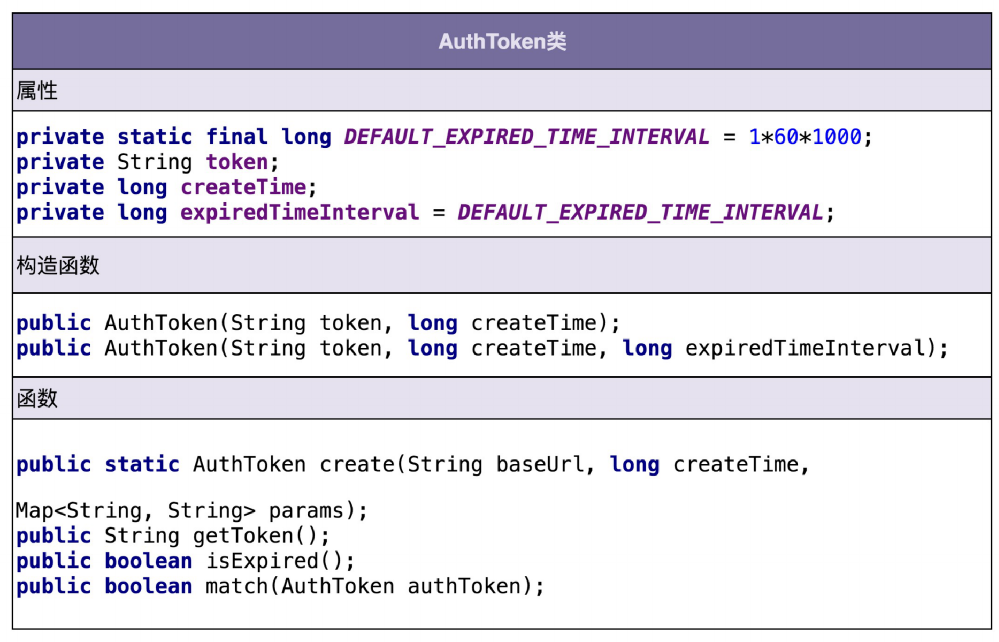
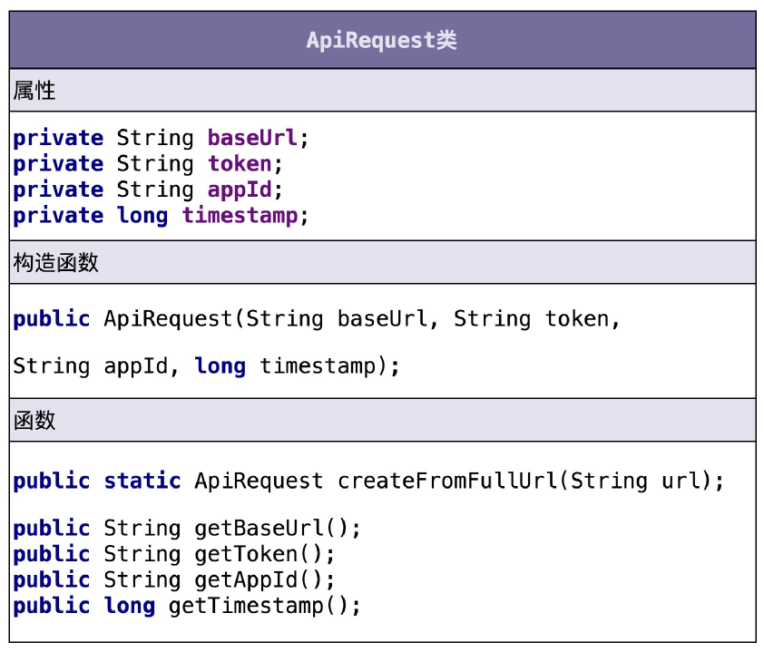
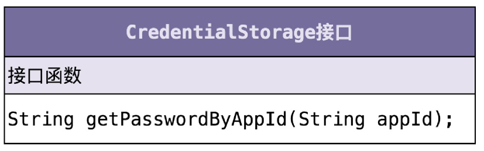
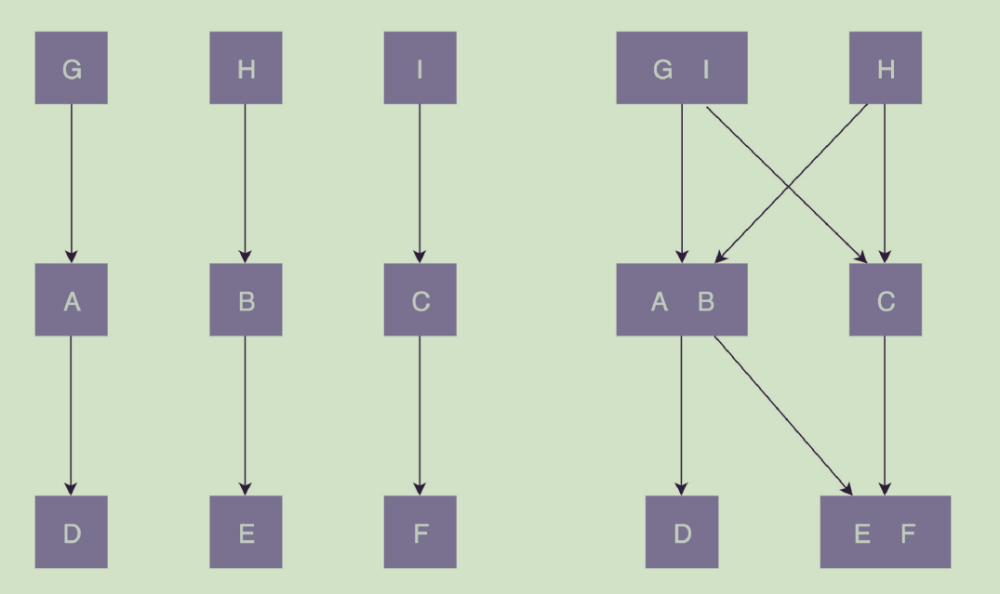

# 设计模式

**为了解决一些代码问题而编写的代码，代码质量高低不同，研究发现那些高质量代码中的相似之处（一般表现为类的结构和类之间结构的设计）并命名为一种模式。**                                                                                                                                                 

**设计模式定义：在面向对象编程中，针对特定问题的优秀解决方案（在某种场合下对某个问题的一种解决方案 ）。**

扩展：

> 享元模式是一种**结构型**设计模式，它主要用于减少创建相似对象的数量，以减少内存占用和提高性能。这种模式主要用于处理**大量相似对象**的情况。其核心思想是**共享细粒度对象**，使得可以被多个客户端代码共同使用，从而避免大量相似类的开销。
>
> 在不使用享元模式的情况下，如果一个项目中需要生成大量相似的对象，每个对象都会占用独立的内存，这在大规模情况下会导致内存使用量剧增，严重影响性能。
>
> 下面用JavaScript代码举例说明不使用享元模式和使用享元模式的情况。
>
> **不使用享元模式的情况：**
>
> ```js
> class CoffeeOrder {
>     constructor(flavor) {
>        this.flavor = flavor;
>     }
> 
>     serveCoffee(context) {
>        console.log(`Serving Coffee flavor ${this.flavor} to table number ${context.table}`);
>     }
> }
> 
> class CoffeeOrderContext {
>     constructor(table) {
>        this.table = table;
>     }
> }
> 
> class CoffeeShop {
>     constructor() {
>        this.orders = [];
>     }
> 
>     takeOrder(flavor, table) {
>        const order = new CoffeeOrder(flavor);
>        this.orders.push({order: order, context: new CoffeeOrderContext(table)});
>     }
> 
>     serve() {
>        this.orders.forEach(({order, context}) => {
>          order.serveCoffee(context);
>        });
>     }
> }
> 
> const coffeeShop = new CoffeeShop();
> coffeeShop.takeOrder('Espresso', 1);
> coffeeShop.takeOrder('Cappuccino', 2);
> coffeeShop.takeOrder('Espresso', 3);
> coffeeShop.serve();
> ```
>
> 在这个不使用享元模式的例子中，每次调用`takeOrder`方法时，都会创建一个新的`CoffeeOrder`实例，即使是相同口味的咖啡。
>
> **使用享元模式的情况：**
>
> ```js
> class CoffeeFlavor {
>     constructor(flavor) {
>        this.flavor = flavor;
>     }
> 
>     serveCoffee(context) {
>        console.log(`Serving Coffee flavor ${this.flavor} to table number ${context.table}`);
>     }
> }
> 
> class CoffeeOrderContext {
>     constructor(table) {
>        this.table = table;
>     }
> }
> 
> class CoffeeFlavorFactory {
>     constructor() {
>        this.flavors = {};
>     }
> 
>     getCoffeeFlavor(flavorName) {
>        if (!this.flavors[flavorName]) {
>          this.flavors[flavorName] = new CoffeeFlavor(flavorName);
>        }
>        return this.flavors[flavorName];
>     }
> }
> 
> class CoffeeShop {
>     constructor() {
>        this.orders = [];
>        this.flavorFactory = new CoffeeFlavorFactory();
>     }
> 
>     takeOrder(flavorName, table) {
>        const flavor = this.flavorFactory.getCoffeeFlavor(flavorName);
>        const context = new CoffeeOrderContext(table);
>        this.orders.push({order: flavor, context: context});
>     }
> 
>     serve() {
>        this.orders.forEach(({order, context}) => {
>          order.serveCoffee(context);
>        });
>     }
> }
> 
> const coffeeShop = new CoffeeShop();
> coffeeShop.takeOrder('Espresso', 1);
> coffeeShop.takeOrder('Cappuccino', 2);
> coffeeShop.takeOrder('Espresso', 3);
> coffeeShop.serve();
> ```
>
> 在这个使用享元模式的例子中，`CoffeeFlavorFactory`类确保相同口味的咖啡只创建一次，然后在每次需要时共享这个实例。这样可以大大减少对象的数量，从而节省内存。
>
> 以上代码展示了享元模式在内存管理和性能优化中的应用。通过共享相同口味的咖啡实例，减少了对象的创建和内存的消耗。


扩展：

> 适配器模式是一种**结构型**设计模式，它允许将一个类的接口转换成客户端期望的另一个接口。主要用于确保不同名的接口能够一起工作。这通常在系统逐步发展和迭代时非常有用，尤其是当引入新组件时，而这些新组件的接口与现有的代码不兼容时。
>
> 适配器模式的关键在于它提供了一个中间层（中间类），该中间层作为中转类，对客户端的调用进行翻译，使之能够使用另一个接口的方法。这样做的好处是，可以不改变现有接口的情况下引入新的接口，并确保现有代码的稳定性。
>
> **不使用适配器模式的情况：**
>
> 以下是一个简单的例子，展示了一个旧的接口`OldInterface`和一个与之不兼容的新接口`NewInterface`：
>
> ```js
> // 旧接口
> class OldInterface {
>     specificRequest() {
>         return '旧接口的数据';
>     }
> }
> 
> // 新接口
> class NewInterface {
>     request() {
>         return '新接口的数据';
>     }
> }
> 
> // 客户端代码
> const oldInterface = new OldInterface();
> console.log(oldInterface.specificRequest()); // 客户端直接使用旧接口
> 
> // 假设现在想要使用新接口的功能
> // 但是客户端代码不兼容，不能直接调用新接口
> const newInterface = new NewInterface();
> console.log(newInterface.request()); // 客户端直接使用新接口
> ```
>
> 在这个例子中，客户端代码需要被修改以兼容新接口，这可能导致大量的代码变更和潜在的错误。
>
> **使用适配器模式的情况：**
>
> 下面的代码演示了如何使用适配器模式来解决上面的问题：
>
> ```js
> // 旧接口
> class OldInterface {
>     specificRequest() {
>        return '旧接口的数据';
>     }
> }
> 
> // 新接口
> class NewInterface {
>     request() {
>        return '新接口的数据';
>     }
> }
> 
> // 适配器类
> class Adapter extends OldInterface {
>     constructor(newInterface) {
>        super();
>        this.newInterface = newInterface;
>     }
> 
>     specificRequest() {
>        return this.newInterface.request();
>     }
> }
> 
> // 客户端代码
> const oldInterface = new OldInterface();
> console.log(oldInterface.specificRequest()); // 客户端使用旧接口
> 
> // 客户端想要使用新接口的功能，但不想直接修改旧接口
> const newInterface = new NewInterface();
> const adapter = new Adapter(newInterface);
> console.log(adapter.specificRequest()); // 客户端通过适配器使用新接口
> ```
>
> 在这个例子中，`Adapter`类继承自旧接口`OldInterface`并包含新接口`NewInterface`的实例。适配器`Adapter`重写了旧接口的方法，内部调用新接口的方法，因此客户端代码可以无缝地继续使用旧接口，同时又能利用新接口提供的功能。
>
> 适配器模式使得原本由于接口不兼容而不能一起工作的类可以一起工作。通过引入一个额外的适配器层，可以在不修改旧代码的情况下扩展系统功能。


在面向对象开发中，通过对**封装，继承，多态和组合**等思想的使用，可以实现一些编程技巧。

设计模式本身是一种思想，一种组织代码的结构，而与语言无关。只是有些语言因为自己的特性，天然对一些设计模式更加友好。

一定程度上，设计模式是有可能增加源码量同时增加复杂度，但软件开发的成本并非全在开发阶段。而设计模式能让人写出可复用，高可维护性的程序代码。   

有一些设计模式的**类图或者结构**看起来非常像，以至于常常混淆它们。而辨别模式的关键时这个模式出现的场景和它能解决的问题。

> 发布-订阅模式和观察者模式都是**行为型**设计模式，它们在目的上非常相似，即定义了对象间的一种依赖关系，使得当一个对象改变状态时，所有依赖于它的对象都会得到通知和自动更新。尽管它们在概念上相似，但在实现细节上有所不同。
>
> **观察者模式**
>
> 观察者模式涉及两个角色：`主题（Subject）`和`观察者（Observer）`。主题收集了一系列依赖于它的观察者，任何主题状态的变化将导致所有观察者都收到通知。
>
> **类图结构**:
>
> ```
>  +------------------+           +---------------------+
>  |  <<interface>>   |           |                     |
>  |     Subject      |<--------->|     Observer        |
>  +------------------+           +---------------------+
>  | +attach(observer)|           | +update(subject)    |
>  | +detach(observer)|           +---------------------+
>  | +notify()        |              ^
>  +------------------+              |
>                                      |
>                              +-------+--------+
>                              |                |
>                              | ConcreteObserver |
>                              +-----------------+
>                              | +update(subject)  |
>                              +-------------------+
> ```
>
> - **Subject**: 提供注册（attach）和注销（detach）观察者的接口，以及通知（notify）所有观察者的方法。
> - **Observer**: 为所有具体观察者定义一个接口，在得到主题的更改通知时更新自己。
> - **ConcreteObserver**: 实现观察者接口的具体类。
>
> 
>
> **发布-订阅模式**
>
> 发布-订阅模式将发送者（发布者）和接收者（订阅者）分离开来。发送者并不直接发送消息给接收者，而是通过一个中间件（通常是消息队列或事件通道），发送者和接收者都不需要知道对方的存在。
>
> **类图结构**:
>
> ```
>     +------------------+           +---------------------+
>     |                  |           |                     |
>     |    Publisher     |           |     Subscriber      |
>     +------------------+           +---------------------+
>     | +publish(message)|           | +update(message)    |
>     +------------------+           +---------------------+
>              |                              ^
>              |                              |
>              v                              |
>     +-------------------+       +-----------+----------+
>     |                   |       |                      |
>     |    MessageQueue   |<----->|    ConcreteSubscriber |
>     +-------------------+       +----------------------+
>     | +subscribe(subscriber) |  | +update(message)      |
>     | +unsubscribe(subscriber)| +----------------------+
>     | +notify(message)       |
>     +------------------------+
> ```
>
> - **Publisher**: 发布消息到消息队列。
> - **Subscriber**: 订阅消息队列，接收消息。
> - **MessageQueue (Broker)**: 中间件，维护订阅者列表和消息的分发。
> - **ConcreteSubscriber**: 实现订阅者接口的具体类。
>
> 两种模式的主要区别在于，观察者模式通常是同步的，观察者直接接收到状态变化的通知；而发布-订阅模式则是异步的，发布者和订阅者通过消息队列（或事件总线）进行通信，解耦了发送者和接收者。

动态类型的语言中面向接口编程是一件相对容易的事情，而在静态类型的语言中，面向接口编程往往要通过抽象类或者接口将函数参数能接受的数据类型的范围扩大（对象的向上转型：当给一个变量赋值时，这个变量的类型既可以是这个类本身，也可以是这个类的超类）。而对象的真正类型则是父类（超类）下面的细分子类，只有这样才能在避免语言的类型检测系统的报错，同时能体现出函数的多态性。   

多态的作用是通过把过程化的条件分支语句转化为对象的多态性，从而消除这些条件分支语句。

> 假设有一个绘图应用程序，需要绘制不同类型的图形，如圆形和矩形。没有使用多态性，你可能会使用条件分支语句来判断每个图形的类型，并调用相应的绘制方法：
>
> ```js
> // 未使用多态性的示例
> function drawShape(shape) {
>     if (shape.type === 'circle') {
>        drawCircle(shape);
>     } else if (shape.type === 'rectangle') {
>        drawRectangle(shape);
>     }
> }
> 
> function drawCircle(circle) {
>     console.log(`Drawing a circle with radius ${circle.radius}`);
>     // 实际的绘图代码
> }
> 
> function drawRectangle(rectangle) {
>     console.log(`Drawing a rectangle with width ${rectangle.width} and height ${rectangle.height}`);
>     // 实际的绘图代码
> }
> ```
>
> 使用多态性，可以消除这些条件分支语句，通过定义一个通用的`draw`方法来处理所有类型的图形。每个图形类都实现自己的`draw`方法，如下所示：
>
> ```js
> // 使用多态性的示例
> 
> // 定义一个通用的Shape类
> class Shape {
>      draw() {
>        throw new Error('This method should be implemented by subclasses');
>      }
> }
> 
> // 定义Circle类，继承自Shape
> class Circle extends Shape {
>      constructor(radius) {
>        super();
>        this.radius = radius;
>      }
> 
>      draw() {
>        console.log(`Drawing a circle with radius ${this.radius}`);
>        // 实际的绘图代码
>      }
> }
> 
> // 定义Rectangle类，继承自Shape
> class Rectangle extends Shape {
>      constructor(width, height) {
>        super();
>        this.width = width;
>        this.height = height;
>      }
> 
>      draw() {
>        console.log(`Drawing a rectangle with width ${this.width} and height ${this.height}`);
>        // 实际的绘图代码
>      }
> }
> 
> // 使用多态性来绘制不同的图形
> function drawShape(shape) {
>      shape.draw();
> }
> 
> const circle = new Circle(10);
> const rectangle = new Rectangle(20, 30);
> 
> drawShape(circle); // 输出: Drawing a circle with radius 10
> drawShape(rectangle); // 输出: Drawing a rectangle with width 20 and height 30
> ```

将行为分布到各个对象中，并让这些对象各自负责自己的行为和属性，这就是面向对象编程。


基础知识盲区：

> new 构造函数时，如果构造函数内部显式的返回一个对象类型的值，那么最终返回值就是这个对象类型的值，而不是this指代的那个对象。构造函数不显式的返回任何类型的数据或者返回的是一个非引用类型的数据时，则默认返回的是this指代的对象值。
>
> 在使用call或者apply时，如果传入的第一个参数时null，那么函数体中的this在非严格模式下会指向默认的宿主对象。


v8源码中关于push的实现：

```js
function ArrayPush(){
    var n = TO_UINT32(this.length)   // 被push的对象的length
    var m = %_ArgumentsLength()   // push的参数个数
    for(var i = 0;i<m;i++){
        this[i+n] = %_Arguments(i)   // 复制元素， 说明对象本身可以支持属性的读取
    }
    this.length = n+m    // 修改length属性值   对象的length属性可读可写
    return this.length
}
```

函数的length 属性是一个只读属性，表示的是形参的个数。如果通过push.call将函数传入作为this，则会报错说函数的length是一个只读属性。


## 前言

**建议自己在学习每一篇文章的时候，都想象作者就在自己面前娓娓道来一样。**

数据结构与算法解决代码效率问题。 设计模式解决代码质量问题（**可扩展，可读，可维护等**）。

掌握各种编写高质量代码的技巧、方法和理论，养成写高质量代码的习惯和意识后，写代码将不再花费太多时间而且很自然。

能判断什么样的代码是高质量的代码是写出高质量代码的前提。

注意：

1. **如何写出高质量代码**
2. **高质量的代码到底长什么样，有什么特点**

很多工程师写了多年代码，代码功力一点都没长进，编写的代码仍然只是能用即可，能运行就好。平日的工作就是修修补补、抄抄改改，一直在做重复劳动，能力也一直停留在“会干活”的层面。


**小心闷头看书的情况**

设计模式，编码规范和重构类书籍。

原因：

1. 大部分书籍的特点是偏理论，其中的代码案例简单且偏离实际开发场景，看懂了却不容易学以致用。
2. 很多原则，思想没有进行量化和细化，比如kiss原则中怎样的代码才算是足够简单？怎样才算不够简单需要优化？大部分书籍都没有讲清楚
3. 个人背景知识的不同，理解能力也不同，导致看书收获不同


建议：

1. 跟着资深的老师学（手把手教，一对一做code review，然后进行优化）比闷头自己看书要更高效、收获更多、成长更快。
2. 编码本身就是一门实践课，光闷头看书本理论肯定是不够的，更重要的是在实践中学习如何应用这些理论。
3. 刻意地进行编码训练，稳扎稳打。
4. 设计问题没有标准答案，不要盲目相信任何一家之言，主动思考，积极讨论。
5. 讨论原理，分析如何优化代码


专栏特点：

1. 将所有涉及编写高质量代码的思想、原则、设计模式等都系统且全面的讲解
2. 避免脱离代码，空洞地讲理论，专栏每篇文章平均大约有 200 多行真实项目代码
3. 使用java写代码，但是整个专栏并不与java强相关，只涉及java中最基础的知识点，其他语言的人也可以看懂
4. 针对日常工作中可能没有那么多复杂和困难的场景，为此会有大量的实战代码案例


大部分设计原则、思想、模式理解起来都不难，难的是如何将这些理论恰当地应用到实际的开发中，而不是盲目滥用。而要想得当地应用理论知识，光看书是不够的，要在实战中去亲身感受、体会这些理论该如何应用。但平时的开发更多的是基于已有的框架，照着别人的流程，扩展新的功能模块。所以，在工作中就可能没有那么多足够复杂、足够有难度的开发场景，让自己有机会去实践这些理论。为此，专栏作者结合自己过去工作中积累的项目经验，为整个专栏精心设计了 200 多个真实的项目实战代码案例。几乎每节课、每个知识点都会结合一个完整的开发案例来讲解。


**理解理论，同时对于每一种设计原则、思想或者模式，理解更深入、更本质、更有用的东西，如：“为什么要有这种设计原则、思想或者模式？它能解决什么编程问题？有哪些应用场景？又该如何权衡、恰当地在项目中应用？”等**

**在讲实战案例时，从最原始的问题代码开始，发现它的缺陷。如何在设计原则、思想、模式的指导下优化它。**

数据结构与算法 和 设计模式、思想与原则是直接和日常开发密切相关的基础知识，是工程师的基本素养。

**自己要意识到，作者是花了十几年的时间才积累出的这些经验和理论之谈，自己却能在相对较短的时间里去了解这些思想，这是自己的幸运。**


## 为什么学

如何将所学的基础知识转为生产力？科班基础课很难直接转为生产力，但是能潜移默化的提高和加快自己对各种技术的理解。

数据结构与算法 和 设计模式 相较于操作系统、组成原理、编译原理等基础学科，能更直接地提高学习者的开发能力。

学习设计模式：

1. 面试
2. 避免写烂代码
3. 提升应对复杂代码的设计和开发能力
4. 提高自己阅读和理解源码的能力和收获

**典型的烂代码：命名不规范、类设计不合理、分层不清晰、没有模块化概念、代码结构混乱、高度耦合等，这样的代码维护起来很费劲，添加或者修改一个功能，常会牵一发而动全身。**

大部分工程师比较熟悉的都是编程语言、工具、框架等，因为工作就是在框架里根据业务需求，填充代码。这样的工作并不需要具备很强的**代码设计能力**，只要单纯地能理解业务，翻译成代码就可以了。

但是如果要开发一个跟业务无关的比较通用的功能模块，面对这样稍微复杂的代码设计和开发，不知从何下手。因为只是完成功能、代码能用，可能并不复杂，但是要想写出易扩展、易用、易维护的代码，并不容易。

需要考虑的问题：如何分层、分模块？应该怎么划分类？每个类应该具有哪些属性、方法？怎么设计类之间的交互？该用继承还是组合？该使用接口还是抽象类？怎样做到高内聚低耦合？该用单例模式还是静态方法？用工厂模式创建对象还是直接 new 出来？如何避免引入设计模式提高扩展性的同时带来的降低可读性问题？

在缺少设计模式、原则、面向对象设计思想情况下，很难解决上述问题。


在学习开源项目框架源码时，经常会遇到看不懂、看不下去的问题。实际上，那就是自己积累的基本功还不够帮助自己看懂源码。

**优秀的开源项目，代码量、类的个数都会比较多，类结构、类之间的关系极其复杂，常常调用来调用去。为了保证代码的扩展性、灵活性、可维护性等，代码中会使用到很多设计模式、原则或者思想。如果不懂这些设计模式、原则、思想，在看代码的时候，可能就会琢磨不透作者的设计思路，对于一些很明显的设计思路，可能要花费很多时间才能参悟。相反，如果对设计模式、原则、思想非常了解，一眼就能参透作者的设计思路、初衷，很快就可以把脑容量释放出来，重点思考其他问题，代码读起来就会变得轻松了。**

自己觉得自己看懂了开源项目的源码，但是实际上并没有得到代码中的精髓思想。


“什么是好的代码？如何写出好的代码？”

如果你是技术 leader，负责一个项目整体的开发，就需要为开发进度、效率和项目质量负责。不希望团队堆砌垃圾代码，让整个项目无法维护，添加、修改一个功能都要费老大劲，最终拉低整个团队的开发效率。

除此之外，代码质量低还会导致线上 bug 频发，排查困难。整个团队都陷在成天修改无意义的低级 bug、在烂代码中添补丁的事情中。而一个设计良好、易维护的系统，提高自己和团队能力的事情。

代码的设计能力和代码能力。


在游戏开发中经常用到非常多的设计模式，比如:对于游戏的设置，ui和scene等各种**管理类都要用到单例模式**。创建游戏中各种角色的各种工厂模式，还有对象池。处理游戏角色的各种状态的有限状态机要用到状态模式。


## 评价代码质量

从哪些角度评价代码质量好坏？如何培养自己学高质量代码的能力。

具体问到什么是烂、好时，比如，好代码是易扩展、易读、简单、易维护等，但对于这些评价的理解往往只停留在表面概念上，对于更深入的问题，比如，“怎么才算可读性好？什么样的代码才算易扩展、易维护？可读、可扩展与可维护之间有什么关系？可维护中‘维护’两字该如何理解？“认识不足。

**写出好代码的前提是能辨别出代码的好坏。如果连什么是好代码、什么是烂代码，都分辨不清，又谈何写出好代码呢？**

日常描述代码质量的词汇：

> 灵活性（flexibility）、可扩展性（extensibility）、可维护性（maintainability）、可读性（readability）、易修改性（changeability）、可复用（reusability）、可测试性（testability）、模块化（modularity）、高内聚低耦合（high cohesion loose coupling）、高效（high effciency）、高性能（high performance）、安全性（security）、兼容性（compatibility）、易用性（usability）、整洁（clean）、清晰（clarity）、简单（simple）、直接（straightforward）、少即是多（less code is more）、文档详尽（well-documented）、分层清晰（well-layered）、正确性（correctness、bug free）、健壮性（robustness）、鲁棒性（robustness）、可用性（reliability）、可伸缩性（scalability）、稳定性（stability）、优雅（elegant）、好（good）、坏（bad）

很难通过其中的某个或者某几个词汇来全面地评价代码质量。因为**这些词汇都是从不同维度来说的**。

代码质量高低也是一个综合各种因素得到的结论。并不能通过单一的维度去评价一段代码写的好坏。比如，即使一段代码的可扩展性很好，但可读性很差，那也不能说这段代码质量高。

除此之外，**不同的评价维度也并不是完全独立的，有些是具有包含关系、重叠关系或者可以互相影响的。比如，代码的可读性好、可扩展性好，就意味着代码的可维护性好。**而且，各种评价维度也不是非黑即白的。比如，不能简单地将代码分为可读与不可读。如果用数字来量化代码的可读性的话，它应该是一个连续的区间值，而非 0、1 这样的离散值。

正是因为代码质量评价的主观性，越是有经验的工程师，给出的评价也就越准确。相反，资历比较浅的工程师就常常会觉得，没有一个可执行的客观的评价标准作为参考，很难准确地判断一段代码写得好与坏。有的时候，自己觉得代码写得已经够好了，但实际上并不是。所以，**这也导致如果没有人指导的话，自己一个人闷头写代码，即便写再多的代码，代码能力也可能一直没有太大提高**。


笼统、抽象、比较偏向对于整体的描述，比如优雅、好、坏、整洁、清晰等.

过于细节、偏重方法论，比如模块化、高内聚低耦合、文档详尽、分层清晰等

不局限于编码，跟架构设计等也有关系，比如可伸缩性、可用性、稳定性等。


**几个最常用的、最重要的评价标准，**

- 可维护性
- 可读性
- 可扩展性
- 灵活性
- 简洁性（简单、复杂）
- 可复用性
- 可测试性


### **可维护性（maintainability）**

“维护”就是修改 bug、老的代码、添加新的代码之类的工作。

**“代码易维护”就是指，在不破坏原有代码设计、不引入新的 bug 的情况下，能够快速地修改或者添加代码。**

“代码不易维护”就是指，修改或者添加代码需要冒着极大的引入新 bug 的风险，并且需要花费很长的时间才能完成。

如何来判断代码可维护性的好坏？

实际上，可维护性也是一个很难量化、偏向对代码整体的评价标准，它有点笼统的评价。代码的可维护性是由很多因素协同作用的结果。**代码的可读性好、简洁、可扩展性好，就会使得代码易维护；**相反，就会使得代码不易维护。更细化地讲，**如果代码分层清晰、模块化好、高内聚低耦合、遵从基于接口而非实现编程的设计原则等**等，那就可能意味着代码易维护。除此之外，代码的易维护性还跟项目代码量的多少、业务的复杂程度、利用到的技术的复杂程度、文档是否全面、团队成员的开发水平等诸多因素有关。

一个比较主观但又比较准确的感受。如果 bug 容易修复，修改、添加功能能够轻松完成，那就可以主观地认为代码易维护。相反，如果修改一个 bug，修改、添加一个功能，需要花费很长的时间，那就可以主观地认为代码不易维护。

是否易维护本来就是针对维护的人来说的。不同水平的人对于同一份代码的维护能力并不是相同的。对于同样一个系统，熟悉它的资深工程师会觉得代码的可维护性还不错，而一些新人因为不熟悉代码，修改 bug、修改添加代码要花费很长的时间，就有可能会觉得代码的可维护性不那么好。**代码质量的评价有很强的主观性。**


### **可读性（readability）**

在编写代码的时候，时刻要考虑到代码是否易读、易理解。除此之外，**代码的可读性在非常大程度上会影响代码的可维护性**。毕竟，不管是修改 bug，还是修改添加功能代码，首先要做的事情就是读懂代码。代码读不大懂，就很有可能因为考虑不周全，而引入新的 bug。（针对复杂逻辑的代码，自己需要注意多写注释。）

如何来判断代码可读性？需要看代码是否符合编码规范、命名是否达意、注释是否详尽、函数是否长短合适、模块划分是否清晰、是否符合高内聚低耦合等。

实际上，code review 是一个很好的测验代码可读性的手段。如果你的同事可以轻松地读懂你写的代码，那说明你的代码可读性很好；如果同事在读你的代码时，有很多疑问，那就说明你的代码可读性有待提高。


### 可扩展性（extensibility）

可扩展性表示代码应对未来需求变化的能力。跟可读性一样，**代码是否易扩展也很大程度上决定代码是否易维护**。那什么是代码的可扩展性？

代码的可扩展性表示，在不修改或少量修改原有代码的情况下，通过扩展的方式添加新的功能代码。说直白点就是，代码预留了一些功能扩展点，你可以把新功能代码，直接插到扩展点上，而不需要因为要添加一个功能而大动干戈，改动大量的原始代码。

原则——“对修改关闭，对扩展开放”。

有的时候为了提高代码的可扩展性和可复用性 就会抽象出好多的接口，类和方法。 然后代码的简洁性和可读性就降低，扩展性和可读性有的时候是相冲突的。

扩展主要是指添加功能，维护更广些，添加、修改、可读性和可扩展性都影响到代码的可维护性。


### 灵活性（flexibility）

什么情况下才会说代码写得好灵活呢？这里罗列了几个场景：

- 当添加一个新的功能代码的时候，原有的代码已经预留好了扩展点，不需要修改原有的代码，只要在扩展点上添加新的代码即可。这个时候，除了可以说代码易扩展，还可以说代码写得灵活。
- 当要实现一个功能的时候，发现原有代码中，已经抽象出了很多底层可以复用的模块、类等代码，可以拿来直接使用。这个时候，除了可以说代码易复用之外，还可以说代码写得灵活。
- 当使用某组接口的时候，如果这组接口可以应对各种使用场景，满足各种不同的需求，除了可以说接口易用之外，还可以说这个接口设计得好灵活或者代码写得灵活。

从刚举的场景来看，如果一段代码易扩展、易复用或者易用，都可以称这段代码写得比较灵活。所以，灵活这个词的含义非常宽泛，很多场景下都可以使用。


### 简洁性（simplicity）

设计原则——KISS 原则：“Keep It Simple，Stupid”。

尽量保持代码简单、逻辑清晰，也就意味着易读、易维护。在编写代码的时候，往往也会把简单、清晰放到首位。

很多编程经验不足的程序员会觉得，简单的代码没有技术含量，喜欢在项目中引入一些复杂的设计模式，体现自己的技术水平。实际上，**思从深而行从简**，真正的高手能云淡风轻地用最简单的方法解决最复杂的问题。这也是一个编程老手跟编程新手的本质区别之一。


### 可复用性（reusability）

尽量减少重复代码的编写，复用已有的代码。

面向对象的继承、多态存在的目的之一，就是为了提高代码的可复用性；当讲到设计原则的时候，会讲到**单一职责原则**也跟代码的可复用性相关；当讲到重构技巧的时候，会讲到解耦、高内聚、模块化等都能提高代码的可复用性。可复用性是很多设计原则、思想、模式等所要达到的最终效果。

DRY（Don’t Repeat Yourself），有哪些编程方法可以提高代码的复用性。


### 可测试性（testability）

代码可测试性的好坏，能从侧面上非常准确地反应代码质量的好坏。代码的可测试性差，比较难写单元测试，那基本上就能说明代码设计得有问题。


### 错误处理

**还要关注代码的错误处理。**


### 如何培养编码能力

如何写出易维护、易读、易扩展、灵活、简洁、可复用、可测试的代码？需要掌握**编程方法论**，包括**面向对象设计思想、原则、模式、编码规范、重构技巧**等。而所有这些编程方法论的最终目的都是为了编写出高质量的代码。

比如，**面向对象中的继承、多态**能让我们写出可复用的代码；**编码规范**能让我们写出可读性好的代码；**设计原则中的单一职责、DRY、基于接口而非实现、里式替换原则等**，可以写出可复用、灵活、可读性好、易扩展、易维护的代码；**设计模式**可以让我们写出易扩展的代码；**持续重构**可以时刻保持代码的可维护性等。


面向对象、设计原则、模式、编程规范、 重构技巧。

下面内容算是专栏的一个教学大纲，学习框架。它能让你对整个专栏所涉及的知识点，有一个全局性的了解，能帮将后面零散的知识更系统地组织在大脑里。


## 面向对象编程思想

主流的编程范式、风格有三种，它们分别是**面向过程、面向对象（最流行）和函数式编程**。

很多复杂的设计思路、原则和模式的编码实现都依赖于面向对象思想。

重点：

- 面向对象的四大特性：**封装、抽象、继承、多态**
- **面向对象编程与面向过程编程**的区别和联系
- 面向对象**分析、设计、编程**
- **接口和抽象类**的区别以及各自的应用场景
- **基于接口而非实现编程**的设计思想
- **多用组合少用继承**的设计思想
- 面向过程的**贫血模型**和面向对象的**充血模型**


### 设计原则

设计原则是指导进行代码设计的一些经验总结。这些原则听起来都比较抽象，定义描述都比较模糊，不同的人会有不同的解读。所以，如果单纯地去记忆定义，对于编程、设计能力的提高，意义并不大。对于每一种设计原则，需要掌握它的**设计初衷，能解决哪些编程问题，有哪些应用场景。**只有这样，才能在项目中灵活恰当地应用这些原则。

重点：

- SRP 单一职责原则
- OCP 开闭原则
- LSP 里式替换原则
- ISP 接口隔离原则
- DIP 依赖倒置原则
- DRY 原则、KISS 原则、YAGNI 原则、LOD 法则


### 设计模式

设计模式是针对软件开发中经常遇到的一些设计问题，总结出来的一套解决方案或者设计思路。大部分设计模式要解决的都是代码的**可扩展性**问题。理解各种设计模式都能解决哪些问题，掌握典型的应用场景，并且懂得不过度应用。

经典的设计模式有 23 种。随着编程语言的演进，一些设计模式（比如 Singleton）也随之过时，甚至成了反模式，一些则被内置在编程语言中（比如 Iterator），另外还有一些新的模式诞生（比如 Monostate）。

有些模式比较常用，有些模式很少被用到。对于常用的设计模式，要花多点时间理解掌握。对于不常用的设计模式，只需要了解即可。

三大类：

1. 创建型
常用的有：单例模式、工厂模式（工厂方法和抽象工厂）、建造者模式。
不常用的有：原型模式。
2. 结构型
常用的有：代理模式、桥接模式、装饰者模式、适配器模式。
不常用的有：门面模式、组合模式、享元模式。
3. 行为型
常用的有：观察者模式、模板模式、策略模式、职责链模式、迭代器模式、状态模式。
不常用的有：访问者模式、备忘录模式、命令模式、解释器模式、中介模式。


### 编程规范

**编程规范主要解决的是代码的可读性问题。**编码规范相对于设计原则、设计模式，更加具体、更加偏重代码细节。最起码要掌握基本的编码规范，比如，如何给变量、类、函数命名，如何写代码注释，函数不宜过长、参数不能过多等。

对于编码规范（比如《重构》《代码大全》《代码整洁之道》等）。每条编码规范都非常简单、非常明确，比较偏向于记忆，只要照着来做可以，不需要融入很多个人的理解和思考。

重构分为大重构和小重构两种类型，而小重构利用的知识基本上就是编码规范。

介绍一些不好的代码，知道什么样的代码是不符合规范的， 应该如何优化。参照编码规范，可以写出可读性好的代码；参照不好的代码，可以找出代码存在的可读性问题。


### 代码重构

随着需求的变化，代码的不停堆砌，原有的设计必定会存在这样那样的问题。针对这些问题，就需要进行代码重构。重构是软件开发中非常重要的一个环节。持续重构是保持代码质量不下降的有效手段，能有效避免代码腐化到无可救药的地步。

重构的理论指导就是面向对象设计思想、设计原则、设计模式、编码规范。

**使用设计模式可以提高代码的可扩展性，但过度不恰当地使用，也会增加代码的复杂度，影响代码的可读性。在开发初期，除非特别必须，一定不要过度设计，应用复杂的设计模式。而是当代码出现问题的时候，再针对问题，应用原则和模式进行重构。这样就能有效避免前期的过度设计。**

重点：

- 重构的目的（why）、对象（what）、时机（when）、方法（how）；
- 保证重构不出错的技术手段：单元测试和代码的可测试性；
- 两种不同规模的重构：大重构（大规模高层次）和小重构（小规模低层次）。

掌握一些重构技巧、套路，更重要的是培养持续代码重构的意识，将重构当作开发的一部分。


面向对象编程因为其具有丰富的特性（封装、抽象、继承、多态），可以实现很多复杂的设计思路，是很多设计原则、模式等编码实现的基础。

设计原则是指导代码设计的一些经验总结，对于某些场景下，是否应该应用某种设计模式，具有指导意义。比如，“开闭原则”是很多设计模式（策略、模板等）的指导原则。

面向对象、设计原则、设计模式、编程规范、代码重构是多维一体的，都是高质量代码的方法论。比如，在某个场景下，该不该用这个设计模式，那就看能不能提高代码的可扩展性；要不要重构，那就看重代码是否存在可读、可维护问题等。


## 面向对象

面向对象编程（Object Oriented Programming）中的基础概念：类（class）和对象（object）。

如果不按照严格的定义来说，大部分编程语言都是面向对象编程语言，比如 Java、C++、Go、Python、C#、Ruby、JavaScript、Objective-C、Scala、PHP、Perl 等。大部分程序员在开发项目的时候，都是基于面向对象编程语言进行的面向对象编程。

作者自己的定义：

**定义：面向对象编程是一种编程范式或编程风格。它以类或对象作为组织代码的基本单元，并将封装、抽象、继承、多态四个特性，作为代码设计和实现的基石 。**

**面向对象编程语言是支持类或对象的语法机制，并有现成的语法机制来实现面向对象编程四大特性（封装、抽象、继承、多态）的编程语言。**

一般来讲， 面向对象编程都是通过使用面向对象编程语言来进行的，但是，不用面向对象编程语言，照样可以进行面向对象编程。反过来讲，即便使用面向对象编程语言，写出来的代码也不一定是面向对象编程风格的，也有可能是面向过程编程风格的。

面向对象编程的四大特性:

- 封装
- 继承
- 多态
- 抽象

理解每种特性讲的是什么内容、存在的意义以及能解决什么问题。这些特征是前人在进行面向对象编程的过程中总结出来的，这些特性能帮助开发者方便的实现各种设计思路，后来才有了为了原生支持这些特性而设计的面向对象编程语言。


如果按照刚给出的严格的面向对象编程语言的定义，前面提到的有些编程语言，并不是严格意义上的面向对象编程语言，比如 **JavaScript，它不支持封装和继承特性**，按照严格的定义，它不算是面向对象编程语言，但在某种意义上，它又可以算得上是一种面向对象编程语言。

面向对象编程从字面上理解，就是**将对象或类作为代码组织的基本单元**，来进行编程的一种编程范式或者编程风格，并不一定需要封装、抽象、继承、多态这四大特性的支持。但是，在进行面向对象编程的过程中，人们不停地总结发现：有了这四大特性，就能更容易地实现各种代码设计思路。

比如，在面向对象编程的过程中，经常会遇到 is-a 这种类关系（比如狗是一种动物），而继承这个特性就能很好地支持这种 is-a 的代码设计思路，并且**解决代码复用**的问题，所以，继承就成了面向对象编程的四大特性之一。但是随着编程语言的不断迭代、演化，人们发现复杂的继承关系容易造成层次不清、代码混乱，所以，很多编程语言在设计的时候就开始摒弃继承特性，比如 Go 语言。但是，并不能因为它摒弃了继承特性，就一刀切地认为它不是面向对象编程语言了。

实际上，只要某种编程语言支持类或对象的语法概念，并且以此作为组织代码的基本单元，那就可以被粗略地认为它就是面向对象编程语言了。至于是否有现成的语法机制，完全地支持了面向对象编程的四大特性、是否对四大特性有所取舍和优化，可以不作为判定的标准。


面向对象编程（OOP）、面向对象分析（OOA）和面向对象设计（OOD）

OOA、OOD、OOP 三个连在一起就是面向对象分析、设计、编程（实现），正好是面向对象软件开发要经历的三个阶段。分析和设计类比软件开发中的需求分析、系统设计，**之所以在前面加“面向对象”这几个字，是因为我们是围绕着对象或类来做需求分析和设计的。**

分析和设计两个阶段最终的产出是**类的设计**，**包括程序被拆解为哪些类，每个类有哪些属性方法，类与类之间如何交互等**。

面向对象分析、设计、编程到底都负责做哪些工作呢？简单点讲，面向对象分析就是要搞清楚做什么，面向对象设计就是要搞清楚怎么做，面向对象编程就是将分析和设计的的结果翻译成代码的过程。


UML（UnifiedModel Language），统一建模语言。很多讲解面向对象或设计模式的书籍，常用它来画图表达面向对象或设计模式的设计思路。

UML包含类图，用例图，顺序图，活动图，状态图，组件图。类图中类之间的关系又包含了泛化、实现、关联、聚会、组合、依赖等。


大部分面向对象编程语言都提供了相应的**语法机制**来支持这些特性，但不同的编程语言实现这四大特性的语法机制可能会有所不同。

每个特性存在的意义和目的，以及它们能解决哪些编程问题。

对于这四大特性，尽管大部分面向对象编程语言都提供了相应的语法机制来支持，但不同的编程语言实现这四大特性的语法机制可能会有所不同。在讲解四大特性的时候，并不与具体某种编程语言的特定语法相挂钩，同时，也希望不要局限在自己熟悉的编程语言的语法思维框架里。

### 封装（Encapsulation）

#### 封装的定义

**封装也叫作信息隐藏或者数据访问保护**。类通过暴露访问接口，授权外部仅能通过类提供的方式（或者叫函数）来访问内部信息或者数据。

下面这段代码是金融系统中一个简化版的虚拟钱包的代码实现。在金融系统中，会给每个用户创建一个虚拟钱包，用来记录用户在系统中的虚拟货币量。

Wallet 类主要有四个属性（也可以叫作成员变量），也就是前面定义中提到的信息或者数据。

```java
public class Wallet {
  // 都是私有属性
  private String id;   // 表示钱包的唯一编号
  private long createTime;  // 表示钱包创建的时间
  private BigDecimal balance;  // 表示钱包中的余额
  private long balanceLastModifiedTime;  // 表示上次钱包余额变更的时间
  // ... 省略其他属性...
  public Wallet() {
    this.id = IdGenerator.getInstance().generate();
    this.createTime = System.currentTimeMillis();
    this.balance = BigDecimal.ZERO;
    this.balanceLastModifiedTime = System.currentTimeMillis();
  }

  public String getId() { 
    return this.id;
  }

  public long getCreateTime() { 
    return this.createTime;
  }

  public BigDecimal getBalance() { 
    return this.balance;
  }

  public long getBalanceLastModifiedTime() { 
    return this.balanceLastModifiedTime;
  }

  public void increaseBalance(BigDecimal increasedAmount) {
    if (increasedAmount.compareTo(BigDecimal.ZERO) < 0) {
      throw new InvalidAmountException("...");
    }
    this.balance.add(increasedAmount);
    this.balanceLastModifiedTime = System.currentTimeMillis();
  }

  public void decreaseBalance(BigDecimal decreasedAmount) {
    if (decreasedAmount.compareTo(BigDecimal.ZERO) < 0) {
      throw new InvalidAmountException("...");
    }
    if (decreasedAmount.compareTo(this.balance) > 0) {
      throw new InsufficientAmountException("...");
    }
    this.balance.subtract(decreasedAmount);
    this.balanceLastModifiedTime = System.currentTimeMillis();
  }
}
```

这段代码体现了面向对象编程的思想。

1. **封装（Encapsulation）**：通过使用私有属性和公共方法，该代码将数据和相关的操作封装在钱包类内部。私有属性只能通过公共方法进行访问，从而保护数据的完整性和安全性，并隐藏了内部实现的细节。
4. **单一职责原则（Single Responsibility Principle，SRP）**：这段代码将钱包的属性和相关操作封装在一个类中，遵循了SRP的原则，每个类应该只有一个引起变化的原因。
5. **异常处理（Exception Handling）**：在代码中，通过抛出自定义的异常（InvalidAmountException和InsufficientAmountException）来处理不合法的操作或状态。这种异常处理机制可以提高代码的健壮性和可靠性。


参照封装特性，对钱包的这四个属性的访问方式进行了限制。调用者只允许通过下面这六个方法来访问或者修改钱包里的数据。

> String getId()
> long getCreateTime()
> BigDecimal getBalance()
> long getBalanceLastModifiedTime()
> void increaseBalance(BigDecimal increasedAmount)
> void decreaseBalance(BigDecimal decreasedAmount)

之所以这样设计，是因为从业务的角度来说，id、createTime 在创建钱包的时候就确定好了，之后不应该再被改动，所以，并没有在 Wallet 类中，暴露对id、createTime 这两个属性的任何修改方法，比如 set 方法。而且，这两个属性的初始化设置，对于 Wallet 类的调用者来说，也应该是透明的，不可见的，所以，在 Wallet 类的构造函数内部将其初始化设置好，而不是通过构造函数的参数来外部赋值。

对于钱包余额 balance 属性，从业务的角度来说，只能增或者减，不会被重新设置。所以，在 Wallet 类中，只暴露了 increaseBalance() 和 decreaseBalance() 方法，并没有暴露 set 方法。对于 balanceLastModifiedTime 这个属性，它完全是跟 balance 这个属性的修改操作绑定在一起的。只有在 balance 修改的时候，这个属性才会被修改。所以，把 balanceLastModifiedTime 这个属性的修改操作完全封装在了increaseBalance() 和 decreaseBalance() 两个方法中，不对外暴露任何修改这个属性的方法和业务细节。这样也可以保证 balance 和 balanceLastModifiedTime 两个数据的一致性。

**对于封装特性，需要编程语言本身提供一定的语法机制来支持。**这个语法机制就是**访问权限控制**。例子中的 private、public 等关键字就是 Java 语言中的访问权限控制语法。private 关键字修饰的属性只能类本身访问，可以保护其不被类之外的代码直接访问。**如果 Java 语言没有提供访问权限控制语法，所有的属性默认都是 public 的，那任意外部代码都可以通过类似 wallet.id=123; 这样的方式直接访问、修改属性，也就没办法达到隐藏信息和保护数据的目的了，也就无法支持封装特性了**。


#### 封装的意义

如果对类中属性的访问不做限制，那任何代码都可以访问、修改类中的属性，虽然这样看起来更加灵活，但从另一方面来说，过度灵活也意味着不可控，属性可以随意被以各种方式修改，而且修改逻辑可能散落在代码中的各个角落，势必影响代码的可读性、可维护性。比如某个同事在不了解业务逻辑的情况下，在某段代码中直接重设了 wallet中的 balanceLastModifiedTime 属性，这就会导致 balance 和balanceLastModifiedTime 两个数据不一致。

除此之外，类仅仅通过有限的方法暴露必要的操作，也能提高类的易用性。如果我们把类属性都暴露给类的调用者，调用者想要正确地操作这些属性，就势必要对业务细节有足够的了解。而这对于调用者来说也是一种负担。相反，如果将属性封装起来，暴露少许的几个必要的方法给调用者使用，调用者就不需要了解太多背后的业务细节，用错的概率就减少很多。


### 抽象（Abstraction）

#### 抽象的定义

**抽象讲的是如何隐藏方法的具体实现，让调用者只需要关心方法提供了哪些功能，并不需要知道这些功能是如何实现的。**其实函数本身就是一种抽象。

在面向对象编程中，常借助编程语言提供的**接口类**（比如 Java 中的 interface 关键字语法）或者**抽象类**（比如 Java 中的 abstract 关键字语法）这两种语法机制来实现抽象。（“接口类”特指编程语言提供的接口语法。）

```java
public interface IPictureStorage {
    void savePicture(Picture picture);
    Image getPicture(String pictureId);
    void deletePicture(String pictureId);
    void modifyMetaInfo(String pictureId, PictureMetaInfo metaInfo);
}

public class PictureStorage implements IPictureStorage {
    // ... 省略其他属性...
    @Override
    public void savePicture(Picture picture) { ... }
    @Override
    public Image getPicture(String pictureId) { ... }
    @Override
    public void deletePicture(String pictureId) { ... }
    @Override
    public void modifyMetaInfo(String pictureId, PictureMetaInfo metaInfo) { 
        // ...
    }
}
```

在上面的这段代码中，利用 Java 中的 interface 接口语法来实现抽象特性。调用者在使用图片存储功能的时候，只需要了解 IPictureStorage 这个接口类暴露了哪些方法就可以了，不需要去查看 PictureStorage 类里的具体实现逻辑。

抽象特性非常容易实现，并不需要非得依靠接口类或者抽象类这些特殊语法机制来支持。换句话说，并不是说一定要为实现类（PictureStorage）抽象出接口类（IPictureStorage），才叫作抽象。即便不编写 IPictureStorage 接口类，单纯的PictureStorage 类本身就满足抽象特性。

之所以这么说是因为类的方法是通过编程语言中的“函数”这一语法机制来实现的。通过函数包裹具体的实现逻辑，这本身就是一种抽象。调用者在使用函数的时候，并不需要去研究函数内部的实现逻辑，只需要通过函数的命名、注释或者文档，了解其提供了什么功能，就可以直接使用了。比如，在使用 C 语言的 malloc() 函数的时候，并不需要了解它的底层代码是怎么实现的。

抽象有时候会被排除在面向对象的四大特性之外，现在解释一下为什么。

抽象这个概念是一个非常通用的设计思想，并不单单用在面向对象编程中，也可以用来指导架构设计等。而且这个特性也并不需要编程语言提供特殊的语法机制来支持，只需要提供“函数”这一非常基础的语法机制，就可以实现抽象特性、所以，它没有很强的“特异性”，有时候并不被看作面向对象编程的特性之一。


#### 抽象的意义

实际上，如果上升一个思考层面的话，抽象及其前面讲到的封装都是处理复杂性的有效手段。在面对复杂系统的时候，人脑能承受的信息复杂程度是有限的，所以必须忽略掉一些非关键性的实现细节。而抽象作为一种只关注功能点不关注实现的设计思路，正好帮助过滤掉许多非必要的信息。

抽象作为一个非常宽泛的设计思想，在代码设计中，起到非常重要的指导作用。 很多设计原则都体现了抽象这种设计思想，比如基于接口而非实现编程、开闭原则（对扩展开放、对修改关闭）、代码解耦（降低代码的耦合性）等。

**在定义（或者叫命名）类的方法的时候，也要有抽象思维，不要在方法定义中，暴露太多的实现细节，以保证在某个时间点需要改变方法的实现逻辑的时候，不用去修改其定义。**举个简单例子，比如 getAliyunPictureUrl() 就不是一个具有抽象思维的命名，因为某一天如果不再把图片存储在阿里云上，而是存储在私有云上，那这个命名也要随之被修改。相反，如果定义一个比较抽象的函数，比如叫作getPictureUrl()，那即便内部存储方式修改了，也不需要修改命名。


### 继承（Inheritance）

#### 继承的定义

继承是用来表示类之间的is-a 关系，比如猫是一种哺乳动物。从继承关系上来讲，继承可以分为两种模式，**单继承和多继承。**

单继承表示一个子类只继承一个父类，多继承表示一个子类可以继承多个父类，比如猫既是哺乳动物，又是爬行动物。

为了实现继承特性，编程语言需要提供特殊的语法机制来支持，比如 Java 使用extends 关键字来实现继承，C++ 使用冒号（class B : public A），Python 使用paraentheses()，Ruby 使用 <。不过，有些编程语言只支持单继承，不支持多重继承，比如 Java、PHP、C#、Ruby 等，而有些编程语言既支持单重继承，也支持多重继承，比如C++、Python、Perl 等。

为什么有些语言支持多重继承，有些语言不支持呢？


#### 继承的意义

继承最大的好处是**代码复用**。假如两个类有一些相同的属性和方法，就可以将这些相同的部分，抽取到父类中，让两个子类继承父类。这样，两个子类就可以重用父类中的代码，避免代码重复写多遍。不过，这一点也并不是继承所独有的，**也可以通过其他方式来解决这个代码复用的问题，比如利用组合关系而不是继承关系**。

如果再上升一个思维层面，去思考继承这一特性，可以这么理解：我们代码中有一个猫类，有一个哺乳动物类。猫属于哺乳动物，从人类认知的角度上来说，是一种 is-a 关系。 通过继承来关联两个类，反应真实世界中的这种关系，非常符合人类的认知，而且，从设计的角度来说，也有一种结构美感。

**过度使用继承**，继承层次过深过复杂，就会导致代码可读性、可维护性变差。为了了解一个类的功能，不仅需要查看这个类的代码，还需要按照继承关系一层一层地往上查看“父类、父类的父类……”的代码。还有，子类和父类高度耦合，修改父类的代码，会直接影响到子类。

所以，继承这个特性也是一个非常有争议的特性。很多人觉得继承是一种反模式，应该尽量少用，甚至不用。关于这个问题，有一个“多用组合少用继承”的设计思想。


### 多态（Polymorphism）

#### 多态的定义

**多态是指子类可以替换父类，在实际的代码运行过程中，调用子类的方法实现。**也可以理解为多个对象上有同名的方法，但是内部逻辑存在差异，这些对象都作为参数传给某个方法，这个方法内部会调用那些同名的方法，以实现不同的逻辑。

多态这种特性也需要编程语言提供特殊的语法机制来实现。

基于继承实现的多态：需要继承和重写。

```java
public class DynamicArray {
  private static final int DEFAULT_CAPACITY = 10;
  protected int size = 0;
  protected int capacity = DEFAULT_CAPACITY;
  protected Integer[] elements = new Integer[DEFAULT_CAPACITY];

  public int size() { 
    return this.size;
  }

  public Integer get(int index) { 
    return elements[index];
  }

  //... 省略 n 多方法...
  public void add(Integer e) {
    ensureCapacity();
    elements[size++] = e;
  }

  protected void ensureCapacity() {
    //... 如果数组满了就扩容... 代码省略...
  }
}

public class SortedDynamicArray extends DynamicArray {
  @Override
  public void add(Integer e) {
    ensureCapacity();
    for (int i = size-1; i>=0; --i) { // 保证数组中的数据有序
      if (elements[i] > e) {
        elements[i+1] = elements[i];
      } else {
        break;
      }
    }
    elements[i+1] = e;
    ++size;
  }
}

public class Example {
  public static void test(DynamicArray dynamicArray) {
    dynamicArray.add(5);
    dynamicArray.add(1);
    dynamicArray.add(3);
    for (int i = 0; i < dynamicArray.size(); ++i) {
      System.out.println(dynamicArray[i]);
    }
  }
  public static void main(String args[]) {
    DynamicArray dynamicArray = new SortedDynamicArray();
    test(dynamicArray); // 打印结果：1、3、5
  }
}
```

这段Java代码定义了三个类：`DynamicArray`、`SortedDynamicArray`和`Example`。

`DynamicArray`是一个动态数组类，它使用一个数组来存储元素。它包含以下成员：

- `size`：表示数组中元素的个数。
- `capacity`：表示数组的容量。
- `elements`：一个整数类型的数组，用于存储元素。

`DynamicArray`类提供了一些方法，包括：

- `size()`：返回数组中元素的个数。
- `get(int index)`：返回指定索引位置的元素。
- `add(Integer e)`：向数组中添加一个元素。如果数组已满，会自动扩容。

`SortedDynamicArray`是`DynamicArray`的子类，它继承了父类的属性和方法，并重写了`add(Integer e)`方法。在`SortedDynamicArray`中，添加元素时会保证数组中的元素是有序的。

`Example`类包含一个静态方法`test(DynamicArray dynamicArray)`和一个静态的`main`方法。`test`方法用于测试动态数组的功能。在`main`方法中，首先创建一个`SortedDynamicArray`对象，并将其传递给`test`方法进行测试。测试中添加了几个元素，并打印了数组中的元素。

总体来说，这段代码实现了一个动态数组类`DynamicArray`和一个基于有序数组的动态数组类`SortedDynamicArray`。`SortedDynamicArray`类保证了元素的有序性。`Example`类用于测试这些类的功能，输出测试结果。


在上面的例子中，用到了三个语法机制来实现多态。

1. 编程语言要支持父类对象可以引用子类对象，也就是可以将SortedDynamicArray 传递给 DynamicArray。
2. 编程语言要支持继承，也就是 SortedDynamicArray 继承了DynamicArray，才能将 SortedDyamicArray 传递给 DynamicArray。
3. 编程语言要支持子类可以重写（override）父类中的方法，也就是SortedDyamicArray 重写了 DynamicArray 中的 add() 方法。

通过这三种语法机制配合在一起，就实现了在 test() 方法中，子类SortedDyamicArray 替换父类 DynamicArray，执行子类 SortedDyamicArray 的 add()方法，也就是实现了多态特性。


#### 多态的实现方式

1. 继承加方法重写
2. 利用接口类语法
3. 利用 duck-typing 语法

并不是每种编程语言都支持接口类或者 duck-typing 这两种语法机制，比如 C++就不支持接口类语法，而 duck-typing 只有一些动态语言才支持，比如 Python、JavaScript 等。


**利用接口类来实现多态**

```java
public interface Iterator {
    String hasNext();
    String next();
    String remove();
}

public class Array implements Iterator {
    private String[] data;
    public String hasNext() { ... }
    public String next() { ... }
    public String remove() { ... }
    //... 省略其他方法...
}

public class LinkedList implements Iterator {
    private LinkedListNode head;
    public String hasNext() { ... }
    public String next() { ... }
    public String remove() { ... }
    //... 省略其他方法...
}

public class Demo {
    
    private static void print(Iterator iterator) {
        while (iterator.hasNext()) {
            System.out.println(iterator.next());
       }
    }
    
    public static void main(String[] args) {
        Iterator arrayIterator = new Array();
        print(arrayIterator);
        Iterator linkedListIterator = new LinkedList();
        print(linkedListIterator);
    }
}
```

在这段代码中，Iterator 是一个接口类，定义了一个可以遍历集合数据的迭代器。Array 和LinkedList 都实现了接口类 Iterator。通过传递不同类型的实现类（Array、LinkedList）到 print(Iterator iterator) 函数中，支持动态的调用不同的 next()、hasNext() 实现。

具体点讲就是，当往 print(Iterator iterator) 函数传递 Array 类型的对象的时候，print(Iterator iterator) 函数就会调用 Array 的 next()、hasNext() 的实现逻辑；当往print(Iterator iterator) 函数传递 LinkedList 类型的对象的时候，print(Iterator iterator)函数就会调用 LinkedList 的 next()、hasNext() 的实现逻辑。


**用 duck-typing 来实现多态**

```python
class Logger:
	def record(self):
		print(“I write a log into file.”)
        
class DB:
	def record(self):
		print(“I insert data into db. ”)
        
def test(recorder):
	recorder.record()
    
def demo():
	logger = Logger()
	db = DB()
	test(logger)
	test(db)
```

duck-typing 实现多态的方式非常灵活。Logger 和 DB 两个类没有任何关系，既不是继承关系，也不是接口和实现的关系，但是只要它们都定义了record() 方法，就可以被传递到 test() 方法中，在实际运行的时候，执行对应的record()方法。

也就是说，只要两个类具有相同的方法，就可以实现多态，并不要求两个类之间有任何关系，这就是所谓的 duck-typing，是一些动态语言所特有的语法机制。而像 Java 这样的静态语言，通过继承实现多态特性，必须要求两个类之间有继承关系，通过接口实现多态特性，类必须实现对应的接口。


#### 多态的意义

多态能提高代码的**可扩展性和复用性**。第二个代码实例（Iterator 接口例子）。在那个例子中，利用多态的特性，仅用一个 print() 函数就可以实现遍历打印不同类型（Array、LinkedList）集合的数据。当再增加一种要遍历打印的类型的时候，比如HashMap，只需让 HashMap 实现 Iterator 接口，重新实现自己的 hasNext()、next() 等方法就可以了，完全不需要改动 print() 函数的代码。所以说，多态提高了代码的可扩展性。

如果不使用多态特性，就无法将不同的集合类型（Array、LinkedList）传递给相同的函数（print(Iterator iterator) 函数）。需要针对每种要遍历打印的集合，分别实现不同的 print() 函数，比如针对 Array，要实现 print(Array array) 函数，针对LinkedList，要实现 print(LinkedList linkedList) 函数。而利用多态特性，只需要实现一个 print() 函数的打印逻辑，就能应对各种集合数据的打印操作，这显然提高了代码的复用性。

多态也是很多设计模式、设计原则、编程技巧的代码实现基础，比如策略模式、基于接口而非实现编程、依赖倒置原则、里式替换原则、利用多态去掉冗长的 if-else 语句等。


你熟悉的编程语言是否支持多重继承？如果不支持，请说一下为什么不支持。如果支持，请说一下它是如何避免多重继承的副作用的。

你熟悉的编程语言对于四大特性是否都有现成的语法支持？对于支持的特性，是通过什么语法机制实现的？对于不支持的特性，又是基于什么原因做的取舍？

设计模式面试题：https://mp.weixin.qq.com/s/9SBV9ZycAQY82BacYICY2w


## 面向对象与面向过程

很多人搞不清楚面向对象和面向过程的区别，总以为使用面向对象编程语言来做开发，就是在进行面向对象编程了。而实际上，只是在用面向对象编程语言，编写面向过程风格的代码而已，并没有发挥面向对象编程的优势。

- 什么是面向过程编程、语言？
- 面向对象编程相比面向过程编程有哪些优势？
- 为什么说面向对象编程语言比面向过程编程语言更高级？
  

定义：

- 面向过程编程是一种编程范式、风格。它以过程（可以为理解方法、函数、操作）作为组织代码的基本单元，以数据（可以理解为成员变量、属性）与方法相分离为最主要的特点。面向过程风格是一种流程化的编程风格，通过拼接一组顺序执行的方法来操作数据完成一项功能。
- 面向过程编程语言首先是一种编程语言。它最大的特点是不支持类和对象两个语法概念，不支持丰富的面向对象编程特性（比如继承、多态、封装），仅支持面向过程编程。


代码案例：假设有一个记录了用户信息的文本文件 users.txt，每行文本的格式是 name&age&gender（比如，小王 &28& 男）。希望写一个程序，从 users.txt 文件中逐行读取用户信息，然后格式化成 name\tage\tgender（其中，\t 是分隔符）这种文本格式，并且按照 age 从小到达排序之后，重新写入到另一个文本文件 formatted_users.txt 中。

以面向过程编程的代码（c）实现：

```c
struct User {
    char name[64];
    int age;
    char gender[16];
};

struct User parse_to_user(char* text) {
    // 将 text(“小王 &28& 男”) 解析成结构体 struct User
}

char* format_to_text(struct User user) {
    // 将结构体 struct User 格式化成文本（" 小王\t28\t 男 "）
}

void sort_users_by_age(struct User users[]) {
    // 按照年龄从小到大排序 users
}

void format_user_file(char* origin_file_path, char* new_file_path) {
    // open files...
    struct User users[1024]; // 假设最大 1024 个用户
    int count = 0;
    while(1) { // read until the file is empty
        struct User user = parse_to_user(line);
        users[count++] = user;
    }

    sort_users_by_age(users);
    
    for (int i = 0; i < count; ++i) {
        char* formatted_user_text = format_to_text(users[i]);
        // write to new file...
    }
    // close files...
}


int main(char** args, int argv) {
    format_user_file("/home/user.txt", "/home/formatted_users.txt");
}
```

这段C语言代码是一个简单的示例，展示了如何解析文本数据、将数据存储在结构体中、排序结构体数组并将结果格式化输出到文件中。

代码中定义了一个`struct User`结构体，包含了用户的姓名、年龄和性别。然后，定义了几个函数来处理用户数据：

1. `struct User parse_to_user(char* text)`：这个函数接受一个文本字符串作为参数，将其解析为一个`struct User`结构体，并返回该结构体。该函数的具体实现可以将字符串按照一定的规则进行解析，提取出姓名、年龄和性别，并将其存储在一个`struct User`对象中后返回。
2. `char* format_to_text(struct User user)`：这个函数接受一个`struct User`结构体作为参数，将其格式化为一个文本字符串，并返回该字符串。函数的实现可以将`struct User`中的各个字段按照一定的格式拼接成一个字符串，例如使用制表符分隔字段。
3. `void sort_users_by_age(struct User users[])`：该函数接受一个`struct User`结构体数组作为参数，按照用户的年龄从小到大对数组进行排序。函数的实现可以使用任何适合的排序算法，例如冒泡排序或快速排序。
4. `void format_user_file(char* origin_file_path, char* new_file_path)`：这个函数用于处理用户数据文件。它打开原始文件和新文件，然后读取原始文件中的每一行数据，将其解析为`struct User`结构体，并存储在一个`struct User`结构体数组中。然后，它调用`sort_users_by_age`函数对数组进行排序，再遍历排序后的数组，使用`format_to_text`函数将每个用户的数据格式化为文本，并将结果写入新文件中。

在`main`函数中，调用`format_user_file`函数来处理用户数据文件。它将原始文件路径和新文件路径作为参数传递给`format_user_file`函数，以指定要处理的文件。


扩展：

> 在C语言中，结构体（Struct）是一种自定义的数据类型，用于组合多个不同类型的变量（成员）以形成一个更大的数据结构。
>
> 结构体允许你在一起存储多个相关的数据项，并为这些数据项定义一个新的类型。它可以包含不同类型的成员变量，如整数、字符、浮点数、指针等。
>
> 结构体的定义使用`struct`关键字，后跟结构体的名称和一对花括号`{}`，花括号中包含结构体的成员变量的声明。每个成员变量的声明包括其数据类型和变量名。
>
> 以下是一个示例，展示了如何定义和使用一个简单的结构体：
>
> ```c
> struct Person {  // 定义了一个名为Person的结构体
>      char name[50]; // 三个成员变量：name（字符数组）、age（整数）和height（浮点数）
>      int age;
>      float height;
> };
> 
> // 主函数
> int main() {
>      struct Person person1; // 声明一个名为person1的Person结构体变量
>      strcpy(person1.name, "John"); // 设置name成员的值为"John" strcpy是C语言中的一个字符串操作函数，用于将一个字符串复制到另一个字符串中。
>      person1.age = 25; // 设置age成员的值为25
>      person1.height = 1.75; // 设置height成员的值为1.75
> 
>      printf("Name: %s\n", person1.name);
>      printf("Age: %d\n", person1.age);
>      printf("Height: %.2f\n", person1.height);
> 
>      return 0;
> }
> ```
>
> 结构体可以用于创建更复杂的数据结构，表示实体对象、记录、配置项等。通过结构体，你可以将相关的数据组织在一起，提高代码的可读性和可维护性。


用面向对象编程的代码（java）实现

```java
public class User {
    private String name;
    private int age;
    private String gender;
    
    public User(String name, int age, String gender) {
        this.name = name;
        this.age = age;
        this.gender = gender;
    }
    
    public static User praseFrom(String userInfoText) {
        // 将 text(“小王&28&男”) 解析成类 User
    }

    public String formatToText() {
        // 将类 User 格式化成文本（" 小王\t28\t 男 "）
    }
}

public class UserFileFormatter {
    public void format(String userFile, String formattedUserFile) {
        // Open files...
        List users = new ArrayList<>();
        while (1) { // read until file is empty
            // read from file into userText...
            User user = User.parseFrom(userText);
            users.add(user);
        }
        // sort users by age...
        for (int i = 0; i < users.size(); ++i) {
            String formattedUserText = user.formatToText();
            // write to new file...
        }
        // close files...
    }
}

public class MainApplication {
    public static void main(Sring[] args) {
        UserFileFormatter userFileFormatter = new UserFileFormatter();
        userFileFormatter.format("/home/zheng/users.txt", "/home/formatted_users.txt")
    }
}
```


从上面的代码中可以看出，面向过程和面向对象最基本的区别就是，代码的组织方式不同。**面向过程风格的代码被组织成了一组方法集合及其数据结构（struct User），方法和数据结构的定义是分开的。面向对象风格的代码被组织成一组类，方法和数据结构被绑定一起，定义在类中。**


#### 面向对象编程的优势

1. **OOP 更加能够应对大规模复杂程序的开发**

对于简单程序的开发来说，不管是用面向过程编程风格，还是用面向对象编程风格，差别确实不会很大，甚至有的时候，面向过程的编程风格反倒更有优势。因为需求足够简单，整个程序的处理流程只有一条主线，很容易被划分成序执行的几个步骤，然后逐句翻译成代码，这就非常适合采用面向过程这种面条式的编程风格来实现。

但对于大规模复杂程序的开发来说，整个程序的处理流程错综复杂，并非只有一条主线。如果把整个程序的处理流程画出来的话，会是一个网状结构。如果再用面向过程编程这种流程化、线性的思维方式，去翻译这个网状结构，去思考如何把程序拆解为一组顺序执行的方法，就会比较吃力。这个时候，面向对象的编程风格的优势就比较明显了。

**面向对象编程是以类为思考对象。在进行面向对象编程的时候，并不是一上来就去思考，如何将复杂的流程拆解为一个一个方法，而是先去思考如何给业务建模，如何将需求翻译为类，如何给类之间建立交互关系，而完成这些工作完全不需要考虑错综复杂的处理流程。当有了类的设计之后，然后再像搭积木一样，按照处理流程，将类组装起来形成整个程序。这种开发模式、思考问题的方式，能在应对复杂程序开发的时候，思路更加清晰。**

面向对象编程还提供了一种更加清晰的、更加模块化的代码组织方式。比如，开发一个电商交易系统，业务逻辑复杂，代码量很大，可能要定义数百个函数、数百个数据结构，那如何分门别类地组织这些函数和数据结构，才能不至于看起来比较凌乱呢？类就是一种非常好的组织这些函数和数据结构的方式，是一种将代码模块化的有效手段。

像 C 语言这种面向过程的编程语言，也可以按照功能的不同，把函数和数据结构放到不同的文件里，以达到给函数和数据结构分类的目的，照样可以实现代码的模块化。只不过面向对象编程本身提供了类的概念，强制你做这件事情，而面向过程编程并不强求。

实际上，利用面向过程的编程语言照样可以写出面向对象风格的代码，只不过可能会比用面向对象编程语言来写面向对象风格的代码，付出的代价要高一些。而且，面向过程编程和面向对象编程并非完全对立的。很多软件开发中，尽管利用的是面向过程的编程语言，也都有借鉴面向对象编程的一些优点。


2. **OOP 风格的代码更易复用、易扩展、易维护**

面向对象编程通过类这种组织代码的方式，将数据和方法绑定在一起，通过访问权限控制，只允许外部调用者通过类暴露的有限方法访问数据，而不会像面向过程编程那样，数据可以被任意方法随意修改。

函数本身就是一种抽象，它隐藏了具体的实现。在使用函数的时候，只需要了解函数具有什么功能，而不需要了解它是怎么实现的。从这一点上，不管面向过程编程还是是面向对象编程，都支持抽象特性。不过，面向对象编程还提供了其他抽象特性的实现方式。这些实现方式是面向过程编程所不具备的，比如基于接口实现的抽象。

继承特性让代码更容易实现复用。

在需要修改一个功能实现的时候，可以通过实现一个新的子类的方式，在子类中重写原来的功能逻辑，用子类替换父类。在实际的代码运行过程中，调用子类新的功能逻辑，而不是在原有代码上做修改。（“对修改关闭、对扩展开放”的设计原则）提高代码的扩展性。利用多态特性，不同的类 对象可以传递给相同的方法，执行不同的代码逻辑，提高了代码的复用性。


3. **OOP 语言更加人性化、高级、智能**

跟二进制指令、汇编语言、面向过程编程语言（这三者都是一种流程化，面条式的编程风格）相比，面向对象编程语言的编程套路、思考问题的方式，是完全不一样的。前三者是一种计算机思维方式，而面向对象是一种人类的思维方式。

在用前面三种语言编程的时候，我们是在思考，如何设计一组指令，告诉机器去执行这组指令，操作某些数据，帮我们完成某个任务。而在进行面向对象编程时候，我们是在思考，如何给业务建模，如何将真实的世界映射为类或者对象，这让我们更加能聚焦到业务本身，而不是思考如何跟机器打交道。


面向对象编程比面向过程编程，更加容易应对大规模复杂程序的开发。但像 Unix、Linux 这些复杂的系统，也都是基于 C 语言这种面向过程的编程语言开发的，你怎么看待这个现象？这跟我之前的讲解相矛盾吗？


## 面向过程代码特征

- 有哪些看似是面向对象实际是面向过程风格的代码？
- 在面向对象编程中，为什么容易写出面向过程风格的代码？
- 面向过程编程和面向过程编程语言的作用

在实际的开发工作中，很多开发者对面向对象编程都有误解，总以为把所有代码都塞到类里，就是在进行面向对象编程了。实际上，这样的认识是不正确的。有时候，从表面上看似是面向对象编程风格的代码，从本质上看却是面向过程编程风格的。


在用面向对象编程语言进行软件开发的时候，有时候会写出面向过程风格的代码。有些是有意为之，并无不妥；而有些是无意为之，会影响到代码的质量。

### 滥用 getter、setter 方法

定义完类的属性之后，就把这些属性的getter、setter 方法都定义上。这违反了面向对象编程的封装特性，相当于将面向对象编程风格退化成了面向过程编程风格。

````java
public class ShoppingCart {
    private int itemsCount;
    private double totalPrice;
    private List<ShoppingCartItem> items = new ArrayList<>();
    
    public int getItemsCount() {
        return this.itemsCount;
    }
    
    public void setItemsCount(int itemsCount) {
        this.itemsCount = itemsCount;
    }
    
    public double getTotalPrice() {
        return this.totalPrice;
    }
    
    public void setTotalPrice(double totalPrice) {
        this.totalPrice = totalPrice;
    }
    
    public List<ShoppingCartItem> getItems() {
        return this.items;
    }
    
    public void addItem(ShoppingCartItem item) {
        items.add(item);
        itemsCount++;
        totalPrice += item.getPrice();
    }
    // ... 省略其他方法...
}
````

上面的代码中，ShoppingCart 是一个简化后的购物车类，有三个私有（private）属性：itemsCount、totalPrice、items。既然都是私有属性了，说明本意就是不希望被外界所直接访问到的。但是后面又定义了itemsCount、totalPrice的 getter、setter 方法，这就跟将这两个属性定义为 public 公有属性，没有什么两样了。外部可以通过 setter 方法随意地修改这两个属性的值。除此之外，任何代码都可以随意调用 setter 方法，来重新设置 itemsCount、totalPrice 属性的值，这也会导致其跟 items 属性的值不一致。这明显违反了封装特性。数据没有访问权限控制，任何代码都可以随意修改它，代码就退化成了面向过程编程风格的了。

对于 items 属性，定义了它的 getter 方法和 addItem()方法，并没有定义它的 setter 方法。因为items 属性的 getter 方法返回的是一个 List集合容器。外部调用者在拿到这个容器之后，是可以操作容器内部数据的，也就是说，外部代码还是能修改 items 中的数据。如：

```java
ShoppingCart cart = new ShoppCart();
...
cart.getItems().clear(); // 清空购物车
```

这样的代码写法，会导致 itemsCount、totalPrice、items 三者数据不一致。不应该将清空购物车的业务逻辑暴露给上层代码。正确的做法应该是，在 ShoppingCart 类中定义一个 clear() 方法，将清空购物车的业务逻辑封装在里面，透明地给调用者使用。ShoppingCart 类的 clear() 方法的具体代码实现如下：

```java
public class ShoppingCart {
    // ... 省略其他代码...
    public void clear() {
        items.clear();
        itemsCount = 0;
        totalPrice = 0.0;
    }
}
```

如果有一个需求，需要查看购物车中都买了啥，那这个时候，ShoppingCart类不得不提供 items 属性的 getter 方法了（因为getter获取的是数据的应用地址，所以还是能修改原数据），那又该怎么办才好呢？

**获取被冻结后的对象引用。**

如果熟悉 Java 语言，可以通过 Java 提供的Collections.unmodifiableList() 方法，让 getter 方法返回一个不可被修改的UnmodifiableList 集合容器，而这个容器类重写了 List 容器中跟修改数据相关的方法，比如 add()、clear() 等方法。一旦调用这些修改数据的方法，代码就会抛出UnsupportedOperationException 异常，这样就避免了容器中的数据被修改。具体的代码实现如下所示。

```java
public class ShoppingCart {
    // ... 省略其他代码...
    public List<ShoppingCartItem> getItems() {
        return Collections.unmodifiableList(this.items);
    }
}

public class UnmodifiableList<E> extends UnmodifiableCollection<E>
    implements List<E> {
    public boolean add(E e) {
        throw new UnsupportedOperationException();
    }
    public void clear() {
        throw new UnsupportedOperationException();
    }
    // ... 省略其他代码...
}
ShoppingCart cart = new ShoppingCart();
List<ShoppingCartItem> items = cart.getItems();
items.clear();// 抛出 UnsupportedOperationException 异常
```

不过，这样的实现思路还是有点问题。因为当调用者通过 ShoppingCart 的 getItems() 获取到 items 之后，虽然我们没法修改容器中的数据，但我们仍然可以修改容器中每个对象（ShoppingCartItem）的数据。

```java
ShoppingCart cart = new ShoppingCart();
cart.add(new ShoppingCartItem(...));
List<ShoppingCartItem> items = cart.getItems();
ShoppingCartItem item = items.get(0);
item.setPrice(19.0); // 这里修改了 item 的价格属性
```


**在设计实现类的时候，除非真的需要，否则，尽量不要给属性定义 setter 方法。除此之外，尽管 getter 方法相对 setter 方法要安全些，但是如果返回的是集合容器（比如例子中的 List 容器），也要防范集合内部数据被修改的危险。**


### 滥用全局变量和全局方法

全局变量和全局方法在面向过程编程语言(c)中常见，在面向对象编程语言（java）中不多见。

在面向对象编程中，常见的全局变量有**单例类对象、静态成员变量、常量**等，常见的全局方法有**静态方法**。单例类对象在全局代码中只有一份，所以，它相当于一个全局变量。静态成员变量归属于类上的数据，被所有的实例化对象所共享，也相当于一定程度上的全局变量。而常量是一种非常常见的全局变量，比如一些代码中的配置参数，一般都设置为常量，放到一个 Constants 类中。静态方法一般用来操作静态变量或者外部数据。你可以联想一下我们常用的各种 Utils 类，里面的方法一般都会定义成静态方法，可以在不用创建对象的情况下，直接拿来使用。**静态方法将方法与数据分离，破坏了封装特性，是典型的面向过程风格。**

在刚刚介绍的这些全局变量和全局方法中，Constants 类和 Utils 类最常用到。现在就结合这两个几乎在每个软件开发中都会用到的类，来深入探讨一下全局变量和全局方法的利与弊。


**Constants 类**

一种常见的 Constants 类的定义方式：

```java
public class Constants {
    public static final String MYSQL_ADDR_KEY = "mysql_addr";
    public static final String MYSQL_DB_NAME_KEY = "db_name";
    public static final String MYSQL_USERNAME_KEY = "mysql_username";
    public static final String MYSQL_PASSWORD_KEY = "mysql_password";
    
    public static final String REDIS_DEFAULT_ADDR = "192.168.7.2:7234";
    public static final int REDIS_DEFAULT_MAX_TOTAL = 50;
    public static final int REDIS_DEFAULT_MAX_IDLE = 50;
    public static final int REDIS_DEFAULT_MIN_IDLE = 20;
    public static final String REDIS_DEFAULT_KEY_PREFIX = "rt:";
    // ... 省略更多的常量定义...
}
```

在这段代码中，把程序中所有用到的常量，都集中地放到这个 Constants 类中。定义一个如此大而全的 Constants 类，并不是一种很好的设计思路。原因主要有以下几点。

1. 影响代码的可维护性

   如果参与开发同一个项目的工程师有很多，在开发过程中，可能都要涉及修改这个类，比如往这个类里添加常量，那这个类就会变得越来越大，成百上千行都有可能，查找修改某个常量也会变得比较费时，而且还会增加提交代码冲突的概率。

2. 增加代码的编译时间

   当 Constants 类中包含很多常量定义的时候，依赖这个类的代码就会很多。那每次修改Constants 类，都会导致依赖它的类文件重新编译，因此会浪费很多不必要的编译时间。对于一个非常大的工程项目来说，编译一次项目花费的时间可能是几分钟，甚至几十分钟。而在开发过程中，每次运行单元测试，都会触发一次编译的过程，这个编译时间就有可能会影响到开发效率。

3. 影响代码的复用性

   如果要在另一个项目中，复用本项目开发的某个类，而这个类又依赖 Constants 类。即便这个类只依赖 Constants 类中的一小部分常量，仍然需要把整个 Constants 类也一并引入，也就引入了很多无关的常量到新的项目中。

**如何改进 Constants 类的设计？**

1. 将 Constants 类拆解为功能更加单一的多个类，比如跟 MySQL 配置相关的常量，放到 MysqlConstants 类中；跟 Redis 配置相关的常量，放到RedisConstants 类中。
2. 另一种我个人觉得更好的设计思路，那就是并不单独地设计 Constants 常量类，而是哪个类用到了某个常量，就把这个常量定义到这个类中。比如，RedisConfig 类用到了 Redis 配置相关的常量，那就直接将这些常量定义在RedisConfig 中，这样也提高了类设计的内聚性和代码的复用性。


**Utils 类**

为什么需要 Utils 类？

Utils 类的出现是基于这样一个问题背景：如果有两个类 A 和 B，它们要用到一块相同的功能逻辑，为了避免代码重复，不应该在两个类中，将这个相同的功能逻辑，重复地实现两遍。

可以利用继承特性，把相同的属性和方法，抽取出来，定义到父类中。子类复用父类中的属性和方法，达到代码复用的目的。但是，有的时候，从业务含义上，A 类和 B 类并不一定具有继承关系，比如 Crawler类和 PageAnalyzer 类，它们都用到了 URL 拼接和分割的功能，但并不具有继承关系（既不是父子关系，也不是兄弟关系）。仅仅为了代码复用，生硬地抽象出一个父类出来，会影响到代码的可读性。如果不熟悉背后设计思路的同事，发现 Crawler 类和 PageAnalyzer类继承同一个父类，而父类中定义的却是 URL 相关的操作，会觉得这个代码写得莫名其妙，理解不了。

这时可以定义一个新的类，实现 URL 拼接和分割的方法。而拼接和分割两个方法，不需要共享任何数据，所以新的类不需要定义任何属性，这个时候，就可以把它定义为只包含静态方法的 Utils 类了。

**实际上，只包含静态方法不包含任何属性的 Utils 类，是彻彻底底的面向过程的编程风格。**但这并不是说，就要杜绝使用 Utils 类了。实际上，从刚刚讲的 Utils 类存在的目的来看，它在软件开发中还是挺有用的，能解决代码复用问题。所以，这里并不是说完全不能用Utils 类，而是说，要尽量避免滥用，不要不加思考地随意去定义 Utils 类。

类比 Constants 类的设计，设计 Utils 类的时候，最好也能细化一下，针对不同的功能，设计不同的 Utils 类，比如 FileUtils、IOUtils、StringUtils、UrlUtils 等，不要设计一个过于大而全的 Utils 类。


### 定义数据和方法分离的类

**数据定义在一个类中，方法定义在另一个类中。**这是明显的面向过程风格的代码。实际上，如果是基于 MVC 三层结构做 Web 方面的后端开发，这样的代码可能天天都在写。

传统的 MVC 结构分为 Model 层、Controller 层、View 层这三层。不过，在做前后端分离之后，三层结构在后端开发中，会稍微有些调整，被分为 Controller 层、Service 层、Repository 层。Controller 层负责暴露接口给前端调用，Service 层负责核心业务逻辑，Repository 层负责数据读写。而在每一层中，又会定义相应的 VO（View Object）、BO（Business Object）、Entity。一般情况下，VO、BO、Entity 中只会定义数据，不会定义方法，所有操作这些数据的业务逻辑都定义在对应的 Controller 类、Service 类、Repository 类中。这就是典型的面向过程的编程风格。

实际上，这种开发模式叫作**基于贫血模型的开发模式**，也是我们现在非常常用的一种 Web项目的开发模式。既然这种开发模式明显违背面向对象的编程风格，为什么大部分 Web 项目都是基于这种开发模式来开发呢？


### 缺乏对象之间的协作和消息传递

面向对象设计鼓励对象之间的协作和消息传递，通过对象之间的交互来完成任务。如果代码中的对象之间缺乏交互和消息传递，而更多地依赖于函数之间的调用和数据传递，那么代码更倾向于面向过程的风格。


**为什么容易写出面向过程风格的代码？**

在生活中，你去完成一个任务，你一般都会思考，应该先做什么、后做什么，如何一步一步地顺序执行一系列操作，最后完成整个任务。面向过程编程风格恰恰符合人的这种流程化思维方式。而面向对象编程风格正好相反。它是一种自底向上的思考方式。它不是先去按照执行流程来分解任务，而是将任务翻译成一个一个的小的模块（也就是类），设计类之间的交互，最后按照流程将类组装起来，完成整个任务，这样的思考路径比较适合复杂程序的开发，但并不是特别符合人类的思考习惯。

面向对象编程要比面向过程编程难一些。在面向对象编程中，类的设计还是挺需要技巧，挺需要一定设计经验的。你要去思考如何封装合适的数据和方法到一个类里，如何设计类之间的关系，如何设计类之间的交互等诸多设计问题。

所以，基于这两点原因，很多工程师在开发的过程，更倾向于用不太需要动脑子的方式去实现需求，也就不由自主地就将代码写成面向过程风格了。

如果开发的是微小程序，或者是**一个数据处理相关的代码，以算法为主，数据为辅**，那脚本式的面向过程的编程风格就更适合一些。实际上，面向过程编程是面向对象编程的基础，面向对象编程离不开基础的面向过程编程。为什么这么说？因为类中每个方法的实现逻辑，就是面向过程风格的代码。

不管使用面向过程还是面向对象哪种风格来写代码，最终的目的还是写出易维护、易读、易复用、易扩展的高质量代码。只要能避免面向过程编程风格的一些弊端，控制好它的**副作用**，在掌控范围内为我们所用，就大可不用避讳在面向对象编程中写面向过程风格的代码。


尽管面向过程编程语言可能没有现成的语法来支持面向对象的四大特性，但可以通 过其他方式来模拟，比如在 C 语言中，我们可以利用函数指针来模拟多态。如果你熟悉一 门面向过程的编程语言，你能聊一聊如何用它来模拟面向对象的四大特性吗？


扩展：

> 使用JavaScript模拟封装特性的方法
>
> 方法一：
>
> **使用闭包创建私有成员**：通过使用闭包，可以创建私有成员变量和方法。在构造函数中定义变量或方法，并将它们作为内部函数返回。这样，外部无法直接访问这些变量或方法，从而实现了封装。
>
> ```javascript
> function Person(name) {
>     var privateName = name; // 私有成员
> 
>     this.getName = function() {
>        return privateName;
>     };
> }
> 
> var person = new Person("John");
> console.log(person.getName()); // 输出: John
> console.log(person.privateName); // undefined，无法直接访问私有成员
> ```
>
> 方法二：
>
> **使用命名约定进行属性和方法的封装**：在JavaScript中，通过约定将某些属性或方法标记为私有，即表示它们应该被视为私有成员，并避免直接访问。通常使用下划线 `_` 前缀来表示私有成员。
>
> ````javascript
> function Person(name) {
>     this._privateName = name; // 私有成员
> 
>     this.getName = function() {
>        return this._privateName;
>     };
> }
> 
> var person = new Person("John");
> console.log(person.getName()); // 输出: John
> console.log(person._privateName); // 不建议直接访问私有成员，但是可以访问
> ````
>
> ES6之后版本引入了`class`关键字和`getter/setter`语法糖，提供了更接近传统面向对象的封装特性。可以使用`class`定义类，并使用`constructor`、`get`和`set`关键字定义构造函数、访问器和设置器，来实现更直观的封装。


## 接口和抽象类

### 定义

面向对象四大特性，以及很多设计模式、思想、原则实现的基础是**接口和抽象类**。可以使用接口来实现面向对象的抽象、多态和基于接口而非实现的设计原则，使用抽象类来实现面向对象的继承和模板设计模式等。

但并不是所有的面向对象编程语言都支持这两个语法概念，比如，C++ 只支持抽象类，不支持接口；而像 Python 这样的动态编程语言，既不支持抽象类，也不支持接口。虽然有些编程语言并没有提供现成的语法来支持接口和抽象类，但是可以借助一些方式来模拟实现接口和抽象类。

面试常问：“接口和抽象类的区别是什么？什么时候用接口？什么时候用抽象类？抽象类和接口存在的意义是什么？能解决哪些编程问题？”

以java中的接口和抽象类为例子：

**java抽象类**

下面这段代码是一个比较典型的抽象类的使用场景（模板设计模式）。Logger 是一个记录日志的抽象类，FileLogger 和 MessageQueueLogger 继承 Logger，分别实现两种不同的日志记录方式：记录日志到文件中和记录日志到消息队列中。FileLogger 和 MessageQueueLogger 两个子类复用了父类 Logger 中的 name、enabled、minPermittedLevel 属性和 log() 方法，但因为这两个子类写日志的方式不同，它们又各自重写了父类中的 doLog() 方法。

```java
// 抽象类  abstract
public abstract class Logger {
  private String name;
  private boolean enabled;
  private Level minPermittedLevel;

  public Logger(String name, boolean enabled, Level minPermittedLevel) {
    this.name = name;
    this.enabled = enabled;
    this.minPermittedLevel = minPermittedLevel;
  }

  // 具体方法
  public void log(Level level, String message) {
    boolean loggable = enabled && (minPermittedLevel.intValue() <= level.intValue());
    if (!loggable) return;
    doLog(level, message);
  }

  protected abstract void doLog(Level level, String message); // 抽象方法
}
// 抽象类的子类：输出日志到文件
public class FileLogger extends Logger {
  private Writer fileWriter;

  public FileLogger(String name, boolean enabled,
                    Level minPermittedLevel, String filepath) {
    super(name, enabled, minPermittedLevel);
    this.fileWriter = new FileWriter(filepath); 
  }

  @Override
  public void doLog(Level level, String mesage) {
    // 格式化level和message,输出到日志文件
    fileWriter.write(...);
  }
}
// 抽象类的子类: 输出日志到消息中间件(比如kafka)
public class MessageQueueLogger extends Logger {
  private MessageQueueClient msgQueueClient;

  public MessageQueueLogger(String name, boolean enabled,
                            Level minPermittedLevel, MessageQueueClient msgQueueClient) {
    super(name, enabled, minPermittedLevel);
    this.msgQueueClient = msgQueueClient;
  }

  @Override
  protected void doLog(Level level, String mesage) {
    // 格式化level和message,输出到消息中间件
    msgQueueClient.send(...);
  }
}
```

抽象类的特点：

1. 抽象类不能被实例化，只能被继承，不能 new 一个抽象类的对象出来（Logger logger = new Logger(...); 会报编译错误）。
2. 抽象类可以包含属性和方法。方法既可以包含代码实现（比如 Logger 中的 log() 方法），也可以不包含代码实现（比如 Logger 中的 doLog() 方法）。不包含代码实现的方法叫作抽象方法。
3. 子类继承抽象类，必须实现抽象类中的所有抽象方法。


**java中的接口**

接口的定义：接口中没有成员变量，只有方法声明，没有方法实现，实现接口的类必须实现接口中的所有方法。

```java
// 接口
public interface Filter {
  void doFilter(RpcRequest req) throws RpcException;
}
// 接口实现类：鉴权过滤器
public class AuthencationFilter implements Filter {
  @Override
  public void doFilter(RpcRequest req) throws RpcException {
    //...鉴权逻辑..
  }
}
// 接口实现类：限流过滤器
public class RateLimitFilter implements Filter {
  @Override
  public void doFilter(RpcRequest req) throws RpcException {
    //...限流逻辑...
  }
}
// 过滤器使用Demo
public class Application {
  // filters.add(new AuthencationFilter());
  // filters.add(new RateLimitFilter());
  private List<Filter> filters = new ArrayList<>();
  
  public void handleRpcRequest(RpcRequest req) {
    try {
      for (Filter filter : filters) {
        filter.doFilter(req);
      }
    } catch(RpcException e) {
      // ...处理过滤结果...
    }
    // ...省略其他处理逻辑...
  }
}
```

通过 Java 中的 interface 关键字定义了一个 Filter 接口。AuthencationFilter 和 RateLimitFilter 是接口的两个实现类，分别实现了对 RPC 请求鉴权和限流的过滤功能。

接口的特点：

1. 接口不能包含属性（也就是成员变量）。
2. 接口只能声明方法，方法不能包含代码实现。
3. 类实现接口的时候，必须实现接口中声明的所有方法。


从上面的特点就能看出抽象类和接口的语法特性上的区别。

对于设计角度的区别：抽象类实际上就是类，只不过是一种特殊的类，这种类不能被实例化为对象，只能被子类继承。继承关系是一种 is-a 的关系，那抽象类既然属于类，也表示一种 is-a 的关系。相对于抽象类的 is-a 关系来说，接口表示一种 has-a 关系，表示具有某些功能。**对于接口，有一个更加形象的叫法，那就是协议（contract）**。


### 抽象类的意义

抽象类能实现代码复用，多个子类可以继承抽象类中定义的属性和方法，避免在子类中，重复编写相同的代码。
但是继承（继承实际类）本身就能达到代码复用的目的，而且继承也并不要求父类一定是抽象类，那不使用抽象类，照样也可以实现继承和复用。从这个角度上来讲，貌似并不需要抽象类这种语法。那抽象类除了解决代码复用的问题，还有什么其他存在的意义吗？

将上面的打印日志案例改为非抽象类，Logger 不再是抽象类，只是一个普通的父类，删除了 Logger 中 log()、doLog() 方法，新增了 isLoggable() 方法。FileLogger 和 MessageQueueLogger 还是继承 Logger 父类，以达到代码复用的目的。具体的代码如下：

```java
// 父类：非抽象类，就是普通的类. 删除了log(),doLog()，新增了isLoggable().
public class Logger {
  private String name;
  private boolean enabled;
  private Level minPermittedLevel;

  public Logger(String name, boolean enabled, Level minPermittedLevel) {
    //...构造函数不变，代码省略...
  }

  protected boolean isLoggable() {
    boolean loggable = enabled && (minPermittedLevel.intValue() <= level.intValue());
    return loggable;
  }
}
// 子类：输出日志到文件
public class FileLogger extends Logger {
  private Writer fileWriter;

  public FileLogger(String name, boolean enabled,
    Level minPermittedLevel, String filepath) {
    //...构造函数不变，代码省略...
  }
  
  public void log(Level level, String mesage) {
    if (!isLoggable()) return;
    // 格式化level和message,输出到日志文件
    fileWriter.write(...);
  }
}
// 子类: 输出日志到消息中间件(比如kafka)
public class MessageQueueLogger extends Logger {
  private MessageQueueClient msgQueueClient;
  
  public MessageQueueLogger(String name, boolean enabled,
    Level minPermittedLevel, MessageQueueClient msgQueueClient) {
    //...构造函数不变，代码省略...
  }
  
  public void log(Level level, String mesage) {
    if (!isLoggable()) return;
    // 格式化level和message,输出到消息中间件
    msgQueueClient.send(...);
  }
}
```

这个设计思路虽然达到了代码复用的目的，但是无法使用多态特性了。像下面这样编写代码，就会出现编译错误，因为 Logger 中并没有定义 log() 方法。

```java
Logger logger = new FileLogger("access-log", true, Level.WARN, "/users/wangzheng/access.log");
logger.log(Level.ERROR, "This is a test log message.");
```

你可能会说，这个问题解决起来很简单。在 Logger 父类中，定义一个空的 log() 方法，让子类重写父类的 log() 方法，实现自己的记录日志的逻辑，不就可以了吗？

```java
public class Logger {
  // ...省略部分代码...
  public void log(Level level, String mesage) { 
      // do nothing...
  }
}
public class FileLogger extends Logger {
  // ...省略部分代码...
  @Override
  public void log(Level level, String mesage) {
    if (!isLoggable()) return;
    // 格式化level和message,输出到日志文件
    fileWriter.write(...);
  }
}
public class MessageQueueLogger extends Logger {
  // ...省略部分代码...
  @Override
  public void log(Level level, String mesage) {
    if (!isLoggable()) return;
    // 格式化level和message,输出到消息中间件
    msgQueueClient.send(...);
  }
}
```

这个设计思路能用，但是，它显然没有之前通过抽象类的实现思路优雅。主要有以下几点原因:

1. 在 Logger 中定义一个空的方法，会影响代码的可读性。如果不熟悉 Logger 背后的设计思想，代码注释又不怎么给力，在阅读 Logger 代码的时候，就可能对为什么定义一个空的 log() 方法而感到疑惑，需要查看 Logger、FileLogger、MessageQueueLogger 之间的继承关系，才能弄明白其设计意图。
2. 当创建一个新的子类继承 Logger 父类的时候，有可能会忘记重新实现 log() 方法。之前基于抽象类的设计思路，编译器会强制要求子类重写 log() 方法，否则会报编译错误。你可能会说，我既然要定义一个新的 Logger 子类，怎么会忘记重新实现 log() 方法呢？我们举的例子比较简单，Logger 中的方法不多，代码行数也很少。但是，如果 Logger 有几百行，有 n 多方法，除非你对 Logger 的设计非常熟悉，否则忘记重新实现 log() 方法，也不是不可能的。
3. Logger 可以被实例化，换句话说，可以 new 一个 Logger 出来，并且调用空的 log() 方法。这也增加了类被误用的风险。当然，这个问题可以通过设置私有的构造函数的方式来解决。不过，显然没有通过抽象类来的优雅。


### 接口的意义

抽象类更多的是为了**代码复用**，而接口就更侧重于**解耦**。接口是对行为的一种抽象，相当于一组协议或者契约，你可以联想类比一下 API 接口。调用者只需要关注抽象的接口，不需要了解具体的实现，具体的实现代码对调用者透明。接口实现了约定和实现相分离，可以降低代码间的耦合性，提高代码的可扩展性。

实际上，接口是一个比抽象类应用更加广泛、更加重要的知识点。比如，经常提到的“基于接口而非实现编程”，就是一条几乎天天会用到，并且能极大地提高代码的灵活性、扩展性的设计思想。


### 模拟抽象类和接口

可以通过**抽象类来模拟接口**。这是一个不错的面试题。

接口的定义：接口中没有成员变量，只有方法声明，没有方法实现，实现接口的类必须实现接口中的所有方法。只要满足这样几点，从设计的角度上来说，就可以把它叫作接口。

```c++
class Strategy { // 用抽象类模拟接口
  public:
    ~Strategy();
    virtual void algorithm()=0;
  protected:
    Strategy();
};
```

抽象类 Strategy 没有定义任何属性，并且所有的方法都声明为 virtual 类型（等同于 Java 中的 abstract 关键字），这样，所有的方法都不能有代码实现，并且所有继承这个抽象类的子类，都要实现这些方法。从语法特性上来看，这个抽象类就相当于一个接口。


动态编程语言，比如 Python、Ruby 等，在这些动态语言中，不仅没有接口的概念，也没有类似 abstract、virtual 这样的关键字来定义抽象类，那该如何实现上面的讲到的 Filter、Logger 的设计思路呢？实际上，除了用抽象类来模拟接口之外，还可以用**普通类来模拟接口**。

```java
public class MockInteface {
  protected MockInteface() {}
  public void funcA() {
    throw new MethodUnSupportedException();
  }
}
```

类中的方法必须包含实现，这个不符合接口的定义。但是，可以让类中的方法抛出 MethodUnSupportedException 异常，来模拟不包含实现的接口，并且能强迫子类在继承这个父类的时候，都去主动实现父类的方法，否则就会在运行时抛出异常。将构造函数设置成 protected 属性的，这样就能避免非同包下的类去实例化 MockInterface(不能实例化该类)。

不过，这样还是无法避免同包中的类去实例化 MockInterface。为了解决这个问题，可以学习 Google Guava 中 @VisibleForTesting 注解的做法，自定义一个注解，人为表明不可实例化。


#### 抽象类模拟接口

在 TypeScript 中，可以使用抽象类来模拟接口的一部分功能。抽象类可以定义方法的签名，但不能提供实际的实现。其他类可以继承这个抽象类并提供具体的实现。

下面是使用抽象类来模拟接口的示例：

```typescript
// 定义一个抽象类作为接口
abstract class MyInterface {
  abstract myMethod(): void; // 声明一个抽象方法 抽象方法没有具体的实现，只有方法签名
}

// 实现接口的类 MyClass 类继承了 MyInterface 抽象类，并提供了具体的实现来满足接口的要求
class MyClass extends MyInterface {
  myMethod(): void {
    console.log("实现了接口的方法");
  }
}

// 使用实现了接口的类
const obj = new MyClass();
obj.myMethod(); // 输出: "实现了接口的方法"
```


当然，抽象类还可以定义其他的非抽象方法，这些方法可以在继承类中直接调用或覆盖。需要注意的是，一个类只能继承自一个抽象类，但可以实现多个接口。如果你想模拟多个接口，可以使用接口的方式，而不是抽象类。例如：

````typescript
interface Interface1 {
  method1(): void;
}

interface Interface2 {
  method2(): void;
}

class MyClass implements Interface1, Interface2 {
  method1(): void {
    console.log("实现了接口1的方法");
  }

  method2(): void {
    console.log("实现了接口2的方法");
  }
}

const obj = new MyClass();
obj.method1(); // 输出: "实现了接口1的方法"
obj.method2(); // 输出: "实现了接口2的方法"
````


#### 普通类模拟接口

在 TypeScript 中，可以使用普通类来模拟接口。与抽象类不同，普通类可以提供方法的具体实现。然而，可以使用普通类作为接口时，通常会将方法留空或者提供一个默认实现，以便其他类可以根据需要选择性地覆盖这些方法。

```typescript
// 定义一个普通类作为接口
class MyInterface {
  myMethod(): void {
    // 留空或者提供默认实现
  }
}

// 实现接口的类
class MyClass implements MyInterface {
  myMethod(): void {
    console.log("实现了接口的方法");
  }
}

// 使用实现了接口的类
const obj = new MyClass();
obj.myMethod(); // 输出: "实现了接口的方法"
```


与抽象类相比，使用普通类作为接口的一个限制是，一个类只能实现或继承一个普通类，而不能同时实现或继承多个普通类。如果你需要模拟多个接口，建议使用接口的方式。


#### 普通类模拟抽象类

在 TypeScript 中，普通类可以通过使用抽象修饰符 `abstract` 来模拟抽象类的行为。抽象类可以包含抽象方法和非抽象方法，但无法直接实例化。其他类可以继承抽象类，并提供具体的实现来满足抽象类中的抽象方法要求。

下面是使用普通类来模拟抽象类的示例：

```typescript
// 定义一个普通类作为抽象类
class AbstractClass {
  abstract myMethod(): void; // 声明一个抽象方法

  myNonAbstractMethod(): void {
    console.log("非抽象方法");
  }
}

// 继承抽象类并提供具体的实现
class ConcreteClass extends AbstractClass {
  myMethod(): void {
    console.log("实现了抽象方法");
  }
}

// 使用实现了抽象类的类
const obj = new ConcreteClass();
obj.myMethod(); // 输出: "实现了抽象方法"
obj.myNonAbstractMethod(); // 输出: "非抽象方法"
```


### 接口和抽象类的选择

在代码设计、编程开发的时候，什么时候该用抽象类？什么时候该用接口？

**实际上，判断的标准很简单。如果要表示一种 is-a 的关系，并且是为了解决代码复用的问题，就用抽象类；如果要表示一种 has-a 关系，并且是为了解决抽象而非代码复用的问题，那就可以使用接口。**

从类的继承层次上来看，抽象类是一种自下而上的设计思路，先有子类的代码重复，然后再抽象成上层的父类（也就是抽象类）。而接口正好相反，它是一种自上而下的设计思路。在编程的时候，一般都是先设计接口，再去考虑具体的实现。


当涉及到动态编程语言，如 JavaScript，通常采用的是鸭子类型（Duck Typing）的策略来支持接口。鸭子类型是一种基于对象行为而非对象类型的概念，即只要一个对象具有特定的方法或属性，就可以被视为具有相同接口。

下面是一个使用鸭子类型的 JavaScript 示例：

````js
// 定义一个具有特定接口的对象
const duck = {
  quack: function() {
    console.log("鸭子在嘎嘎叫");
  },
  swim: function() {
    console.log("鸭子在游泳");
  }
};

// 使用具有相同接口的对象
function makeNoise(animal) {
  animal.quack();
}

makeNoise(duck); // 输出: "鸭子在嘎嘎叫"
````

在这个示例中，`duck` 对象具有 `quack` 和 `swim` 方法，我们并没有定义一个明确的接口。然后，我们定义了一个 `makeNoise` 函数，该函数接受一个对象作为参数，并调用对象的 `quack` 方法。

尽管没有定义一个明确的接口，但可以将具有相同方法的对象传递给 `makeNoise` 函数，并且函数能够正常工作。这是因为 JavaScript 使用鸭子类型，只要对象具有相同的方法，就可以被视为具有相同的接口。

鸭子类型在 JavaScript 中非常灵活，并且允许在运行时动态地确定对象是否具有所需的方法或属性，而无需依赖于显式的接口定义。这种灵活性使得 JavaScript 更加适应动态编程的需求。


注意：TypeScript 中的接口可以包含属性定义。接口可以用于描述对象的结构，包括属性的类型和名称。

下面是一个示例，展示了如何在 TypeScript 中定义一个包含属性的接口：

```typescript
interface Person {
  name: string;
  age: number;
}

// 使用接口定义的类型
const person: Person = {
  name: "Alice",
  age: 25
};
```

接口的属性可以具有不同的类型，包括原始类型（如 `string`、`number`、`boolean` 等）、自定义类型和其他接口类型等。

此外，接口还可以定义可选属性和只读属性。可选属性使用 `?` 符号进行标记，表示该属性可以存在或不存在。只读属性使用 `readonly` 修饰符进行标记，表示该属性只能在对象创建时进行赋值，之后不可修改。

```typescript
interface Person {
  name: string;
  age: number;
  email?: string; // 可选属性
  readonly id: number; // 只读属性
}

const person: Person = {
  name: "Bob",
  age: 30,
  id: 12345
};

person.email = "bob@example.com"; // 可选属性可以赋值
person.id = 54321; // 错误，只读属性不可修改
```


## 基于接口编程

基于接口而非实现编程原则。

### 接口

“基于抽象而非实现编程”、“基于接口而非实现编程”（“Program to an interface, not an implementation”）是一条比较抽象、泛化的设计思想。不要一开始就与具体的编程语言挂钩，局限在编程语言的“接口”语法中。

从本质上来看，“接口”就是一组“协议”或者“约定”，**是功能提供者提供给使用者的一个“功能列表”。**“接口”在不同的应用场景下会有不同的解读，比如服务端与客户端之间的“接口”，类库提供的“接口”，甚至是一组通信的协议都可以叫作“接口”。刚刚对“接口”的理解，都比较偏上层、偏抽象，与实际的写代码离得有点远。如果落实到具体的编码，“基于接口而非实现编程”这条原则中的“接口”，可以理解为编程语言中的接口或者抽象类。

**应用这条原则，可以将接口和实现相分离，封装不稳定的实现，暴露稳定的接口。**上游系统面向接口而非实现编程，不依赖不稳定的实现细节，这样当实现发生变化的时候，上游系统的代码基本上不需要做改动，以此来降低耦合性，提高扩展性。

在需求不断变化时，越抽象、越顶层、越脱离代码具体某一个实现的设计，越能提高代码的灵活性，以应对需求的变化。好的代码设计，不仅能应对当下的需求，而且在将来需求发生变化的时候，仍然能够在不破坏原有代码设计的情况下灵活应对。而抽象就是提高代码扩展性、灵活性、可维护性最有效的手段之一。


### 原则应用

结合一个具体的实战案例来学习。

假设系统中有很多涉及图片处理和存储的业务逻辑。图片经过处理之后被上传到阿里云上。为了代码复用，封装了图片存储相关的代码逻辑，提供了一个统一的AliyunImageStore 类，供整个系统来使用。

```java
public class AliyunImageStore {
    //... 省略属性、构造函数等...
    public void createBucketIfNotExisting(String bucketName) {
        // ... 创建 bucket 代码逻辑...
        // ... 失败会抛出异常..
    }
    
    public String generateAccessToken() {
        // ... 根据 accesskey/secrectkey 等生成 access token
    }
    
    public String uploadToAliyun(Image image, String bucketName, String accessToken){
        //... 上传图片到阿里云...
        //... 返回图片存储在阿里云上的地址 (url）...
    }
    
    public Image downloadFromAliyun(String url, String accessToken) {
        //... 从阿里云下载图片...
    }
}

// AliyunImageStore 类的使用举例
public class ImageProcessingJob {
    private static final String BUCKET_NAME = "ai_images_bucket";
    //... 省略其他无关代码...
    public void process() {
        Image image = ...; // 处理图片，并封装为 Image 对象
        AliyunImageStore imageStore = new AliyunImageStore(/* 省略参数 */);
        imageStore.createBucketIfNotExisting(BUCKET_NAME);
        String accessToken = imageStore.generateAccessToken();
        imagestore.uploadToAliyun(image, BUCKET_NAME, accessToken);
    }
}
```

上传流程包含三个步骤:

1. 创建 bucket（你可以简单理解为存储目录）
2. 生成 access token 访问凭证
3. 携带 access token 上传图片到指定的 bucket 中

代码实现非常简单，类中的几个方法定义得都很干净，用起来也很清晰，乍看起来没有太大问题，完全能满足将图片存储在阿里云的业务需求。

过了一段时间后，自建了私有云，不再将图片存储到阿里云了，而是将图片存储到自建私有云上。为了满足这样一个需求的变化，该如何修改代码呢？

需要重新设计实现一个存储图片到私有云的 PrivateImageStore 类，并用它替换掉项目中所有的原来使用 AliyunImageStore 类对象的地方。这样的修改听起来并不复杂，只是简单替换而已，对整个代码的改动并不大。

但新的 PrivateImageStore 类需要设计实现哪些方法，才能**在尽量最小化代码修改的情况下，替换掉 AliyunImageStore 类**呢？这就要求必须将 AliyunImageStore 类中所定义的所有 public 方法，在 PrivateImageStore 类中都逐一定义并重新实现一遍，而这样做就会存在一些问题。

上面案例代码的缺点：

1. AliyunImageStore 类中有些函数命名暴露了实现细节，比如，uploadToAliyun() 和 downloadFromAliyun()（这是没有接口意识和抽象思维的命名方式）。而把这种包含“aliyun”字眼的方法，照抄到 PrivateImageStore 类中，显然是不合适的。

   而如果我们在新类中重新命名 uploadToAliyun()、downloadFromAliyun() 这些方法，那就意味着，我们要修改项目中所有使用到这两个方法的代码，代码修改量可能就会很大。

2. 将图片存储到阿里云的流程，跟存储到私有云的流程，可能并不是完全一致的。比如，阿里云的图片上传和下载的过程中，需要生产 access token，而私有云不需要 accesstoken。一方面，AliyunImageStore 中定义的 generateAccessToken() 方法不能照抄到PrivateImageStore 中；另一方面，在使用 AliyunImageStore 上传、下载图片的时候，代码中用到了 generateAccessToken() 方法，如果要改为私有云的上传下载流程，这些代码都需要做调整。

如何解决上述代码的缺点？

解决这个问题的根本方法就是，**在编写代码的时候，要遵从“基于接口而非实现编程”的原则**，具体来讲，需要做到下面这 3 点：

1. **函数的命名不能暴露任何实现细节。比如，前面提到的 uploadToAliyun() 就不符合要求，应该改为去掉 aliyun 这样的字眼，改为更加抽象的命名方式，比如：upload()。**
2. **封装具体的实现细节。比如，跟阿里云相关的特殊上传（或下载）流程不应该暴露给调用者。我们对上传（或下载）流程进行封装，对外提供一个包裹所有上传（或下载）细节的方法，给调用者使用**
3. **为实现类定义抽象的接口。具体的实现类都依赖统一的接口定义，遵从一致的上传功能协议。使用者依赖接口，而不是具体的实现类来编程。**

重构后的代码如下所示：

```java
public interface ImageStore {
    String upload(Image image, String bucketName);
    Image download(String url);
}

public class AliyunImageStore implements ImageStore {
    //... 省略属性、构造函数等...
    public String upload(Image image, String bucketName) {
        createBucketIfNotExisting(bucketName);
        String accessToken = generateAccessToken();
        //... 上传图片到阿里云...
        //... 返回图片在阿里云上的地址 (url)...
    }
    public Image download(String url) {
        String accessToken = generateAccessToken();
        //... 从阿里云下载图片...
    }
    
    // 私有的，不对外暴露
    private void createBucketIfNotExisting(String bucketName) {
        // ... 创建 bucket...
        // ... 失败会抛出异常..
    }
    private String generateAccessToken() {
        // ... 根据 accesskey/secrectkey 等生成 access token
    }
}

// 上传下载流程改变：私有云不需要支持 access token
public class PrivateImageStore implements ImageStore {
    public String upload(Image image, String bucketName) {
        createBucketIfNotExisting(bucketName);
        //... 上传图片到私有云...
        //... 返回图片的 url...
    }
    public Image download(String url) {
        //... 从私有云下载图片...
    }
    private void createBucketIfNotExisting(String bucketName) {
        // ... 创建 bucket...
        // ... 失败会抛出异常..
    }
}
// ImageStore 的使用举例
public class ImageProcessingJob {
    private static final String BUCKET_NAME = "ai_images_bucket";
    //... 省略其他无关代码...
    public void process() {
        Image image = ...;// 处理图片，并封装为 Image 对象
        ImageStore imageStore = new PrivateImageStore(...);
        imagestore.upload(image, BUCKET_NAME);
    }
}
```

除此之外，很多人在定义接口的时候，希望通过实现类来反推接口的定义。先把实现类写好，然后看实现类中有哪些方法，照抄到接口定义中。如果按照这种思考方式，就有可能导致接口定义不够抽象，依赖具体的实现。这样的接口设计就没有意义了。不过，如果你觉得这种思考方式更加顺畅，那也没问题，只是将实现类的方法搬移到接口定义中的时候，要有选择性的搬移，**不要将跟具体实现相关的方法搬移到接口中**，比如 AliyunImageStore 中的 generateAccessToken() 方法。


总结一下，在做软件开发的时候，**一定要有抽象意识、封装意识、接口意识**。在定义接 口的时候，不要暴露任何实现细节。接口的定义只表明做什么，而不是怎么做。而且，**在设计接口的时候，要多思考一下，这样的接口设计是否足够通用，是否能够做到在替换具体的接口实现的时候，不需要任何接口定义的改动。**


为了满足这条原则，需要给每个实现类都定义对应的接口吗？

什么时候该为某个类定义接口，实现基于接口的编程，什么时候不需要定义接口，直接使用实现类编程，我们做权衡的根本依据，还是要回归到设计原则诞生的初衷上来。只要搞清楚了这条原则是为了解决什么样的问题而产生的，很多之前模棱两可的问题，都会变得豁然开朗。

这条原则的设计初衷是，将接口和实现相分离，**封装不稳定的实现，暴露稳定的接口。**上游系统面向接口而非实现编程，不依赖不稳定的实现细节，这样当实现发生变化的时候，上游系统的代码基本上不需要做改动，以此来降低代码间的耦合性，提高代码的扩展性。

从这个设计初衷上来看，如果在我们的业务场景中，某个功能只有一种实现方式，未来也不可能被其他实现方式替换，那我们就没有必要为其设计接口，也没有必要基于接口编程，直接使用实现类就可以了。

除此之外，越是不稳定的系统，越是要在代码的扩展性、维护性上下功夫。相反，如果某个系统特别稳定，在开发完之后，基本上不需要做维护，那就没有必要为其扩展性，投入不必要的开发时间。


思考：在今天举的代码例子中，尽管通过接口来隔离了两个具体的实现。但是，在项目中很多地方，都是通过下面第 8 行的方式来使用接口的。这就会产生一个问题，那就是，如果我们要替换图片存储方式，还是需要修改很多类似第 8 行那样的代码。这样的设计还是不够完美，对此，你有更好的实现思路吗？

```java
// ImageStore 的使用举例
public class ImageProcessingJob {
    private static final String BUCKET_NAME = "ai_images_bucket";
    //... 省略其他无关代码...
    
    public void process() {
        Image image = ...;// 处理图片，并封装为 Image 对象
        ImageStore imageStore = new PrivateImageStore(/* 省略构造函数 */);
        imagestore.upload(image, BUCKET_NAME);
    }
}
```

为了解决这个问题，可以考虑使用**依赖注入和工厂模式**来改进代码设计。

以下是一种可能的改进方案：

1. 定义一个 `ImageStore` 接口，包含上传图片的方法。
2. 创建具体的图片存储类，比如 `PrivateImageStore` 和 `PublicImageStore`，它们都实现了 `ImageStore` 接口，并提供了各自的上传逻辑。
3. 创建一个工厂类，比如 `ImageStoreFactory`，用于根据需要创建具体的图片存储实例。
4. 在 `ImageProcessingJob` 类中，通过依赖注入和工厂模式，将具体的图片存储实例解耦出来，而不是直接依赖于具体的实现类。

```java
// ImageStore 接口
public interface ImageStore {
    void upload(Image image, String bucketName);
}

// PrivateImageStore 类
public class PrivateImageStore implements ImageStore {
    // 实现上传逻辑
    // ...
}

// PublicImageStore 类
public class PublicImageStore implements ImageStore {
    // 实现上传逻辑
    // ...
}

// ImageStoreFactory 类
public class ImageStoreFactory {
    public static ImageStore createImageStore(String storeType) {
        // 根据参数或配置创建相应的 ImageStore 实例
        switch (storeType) {
            case "private":
                return new PrivateImageStore();
            case "public":
                return new PublicImageStore();
            // 可以添加更多的图片存储类型
            default:
                throw new IllegalArgumentException("Invalid store type: " + storeType);
        }
    }
}

// ImageProcessingJob 类
public class ImageProcessingJob {
    private static final String BUCKET_NAME = "ai_images_bucket";
    private ImageStore imageStore;

    // 通过构造函数注入 ImageStore 实例
    public void ImageProcessingJob(ImageStore imageStore) {
        this.imageStore = imageStore;
    }
    
    public void process() {
        Image image = ...;// 处理图片，并封装为 Image 对象
        imageStore.upload(image, BUCKET_NAME);
    }
}
```

使用：

```java
// 创建 ImageStore 实例
String storeType = "private"; // 替换为所需的存储类型
ImageStore imageStore = ImageStoreFactory.createImageStore(storeType);

// 创建 ImageProcessingJob 实例，并传入 ImageStore 实例
ImageProcessingJob job = new ImageProcessingJob(imageStore);

// 执行图片处理任务
job.process();
```


## 组合与继承

组合的定义和实例代码：

在面向对象编程中，组合是一种将多个类组合在一起以实现功能的方式，而不是通过继承来实现。

当一个类包含其他类的实例作为它的属性时，我们称之为组合。组合关系表示一个对象包含其他对象，这些对象共同协作以实现更复杂的行为。

下面是一个简单的示例来说明组合的概念：

```java
// 主类
public class MainClass {
    private HelperClass helper;

    public MainClass() {
        this.helper = new HelperClass();
    }

    public void doSomething() {
        // 使用辅助类的实例进行操作
        helper.doHelperWork();
    }
}

// 辅助类
public class HelperClass {
    public void doHelperWork() {
        // 辅助类的功能实现
    }
}
```

在上述示例中，`MainClass` 是一个主类，它包含一个 `HelperClass` 的实例作为它的属性。通过组合关系，`MainClass` 可以使用 `HelperClass` 的实例来完成一些辅助工作。

通过组合，可以将功能模块化并且相互解耦，使代码更加灵活、可维护和可扩展。相比之下，继承是一种更紧密的耦合关系，它在类之间建立了继承层次结构，可能导致较高的依赖性和耦合度。

**组合还允许在运行时动态地更改对象之间的关系，因为可以在实例化主类时选择不同的辅助类实例，从而实现不同的行为。这种灵活性是继承所没有的。**


设计原则——**组合优于继承，多用组合少用继承。**

为什么不推荐使用继承？组合相比继承有哪些优势？如何判断该用组合还是继承？

当继承层次过深、过复杂，也会影响到代码的可维护性。代码案例：

假设要设计一个关于鸟的类。将“鸟类”这样一个抽象的事物概念，定义为一个抽象类 AbstractBird。所有更细分的鸟，比如麻雀、鸽子、乌鸦等，都继承这个抽象类。

大部分鸟都会飞，那可不可以在 AbstractBird 抽象类中，定义一个 fly() 方法呢？答案是否定的。尽管大部分鸟都会飞，但也有特例，比如鸵鸟就不会飞。鸵鸟继承具有 fly() 方法的父类，那鸵鸟就具有“飞”这样的行为，这显然不符合我们对现实世界中事物的认识。当然，在鸵鸟这个子类中重写（override）fly() 方法，让它抛出 UnSupportedMethodException 异常不就可以了吗？具体的代码实现如下所示：

```java
public class AbstractBird {
    //... 省略其他属性和方法...
    public void fly() { //...
    }
}
public class Ostrich extends AbstractBird { // 鸵鸟
    //... 省略其他属性和方法...
    public void fly() {
        throw new UnSupportedMethodException("I can't fly.'");
    }
}
```

这种设计思路虽然可以解决问题，但不够优美。因为除了鸵鸟之外，不会飞的鸟还有很多，比如企鹅。对于这些不会飞的鸟来说，都需要重写 fly() 方法，抛出异常。这样的设计，一方面，**徒增了编码的工作量**；另一方面，也违背了**最小知识原则（Least Knowledge Principle）**，暴露不该暴露的接口给外部，增加了类使用过程中被误用的概率。


那再通过 AbstractBird 类派生出两个更加细分的抽象类：会飞的鸟类AbstractFlyableBird 和不会飞的鸟类AbstractUnFlyableBird，让麻雀、乌鸦这些会飞的鸟都继承 AbstractFlyableBird，让鸵鸟、企鹅这些不会飞的鸟，都继承AbstractUnFlyableBird 类，具体继承关系如下：


目前的继承关系还比较简单，层次比较浅，也算是一种可以接受的设计思路。再继续加点难度。在刚刚这个场景中，只关注“鸟会不会飞”，但如果还关注“鸟会不会叫”，那这个时候，又该如何设计类之间的继承关系呢？如果继续按照前面的思路，那层次关系则如下：


是否会飞？是否会叫？两个行为搭配起来会产生四种情况：会飞会叫、不会飞会叫、会飞不会叫、不会飞不会叫。如果继续沿用刚才的设计思路，那就需要再定义四个抽象类（AbstractFlyableTweetableBird、AbstractFlyableUnTweetableBird、AbstractUnFlyableTweetableBird、AbstractUnFlyableUnTweetableBird）。


如果还需要考虑“是否会下蛋”这样一个行为，那估计就要组合爆炸了。类的继承层次会越来越深、继承关系会越来越复杂。而这种层次很深、很复杂的继承关系，一方面，会导致代码的可读性变差。因为要搞清楚某个类具有哪些方法、属性，必须阅读父类的代码、父类的父类的代码，一直追溯到最顶层父类的代码。另一方面，这也破坏了类的封装特性，将父类的实现细节暴露给了子类。子类的实现依赖父类的实现，两者高度耦合，一旦父类代码修改，就会影响所有子类的逻辑。

继承最大的问题就在于：**继承层次过深、继承关系过于复杂会影响到代码的可读性和可维护性。**这也是为什么不推荐使用继承。那刚刚例子中继承存在的问题，又该如何来解决呢？

解决方案就是：利用组合（composition）、接口、委托（delegation）。

前面讲到接口表示具有某种行为特性。针对“会飞”这样一个行为特性，可以定义一个 Flyable 接口，只让会飞的鸟去实现这个接口。对于会叫、会下蛋这些行为特性，可以类似地定义 Tweetable 接口、EggLayable 接口。将这个设计思路翻译成 Java 代码的话，就是下面这个样子：

```java
public interface Flyable {
    void fly();
}
public interface Tweetable {
    void tweet();
}
public interface EggLayable {
    void layEgg();
}
public class Ostrich implements Tweetable, EggLayable {// 鸵鸟
    //... 省略其他属性和方法...
    @Override
    public void tweet() { 
        //... 
    }
    @Override
    public void layEgg() { 
        //... 
    }
}
public class Sparrow impelents Flayable, Tweetable, EggLayable {// 麻雀
    //... 省略其他属性和方法...
    @Override
    public void fly() { 
        //... 
    }
    @Override
    public void tweet() { 
        //...
    }
    @Override
    public void layEgg() { 
        //... 
    }
}
```

上面的代码还是存在问题：接口只声明方法，不定义实现。也就是说，每个会下蛋的鸟都要实现一遍layEgg() 方法，并且实现逻辑是一样的，这就会导致代码重复的问题。那这个问题又该如何解决呢？

可以针对三个接口单独定义三个实现类，它们分别是：实现了 fly() 方法的 FlyAbility类、实现了 tweet() 方法的 TweetAbility 类、实现了 layEgg() 方法的 EggLayAbility 类。然后，通过组合和委托技术来消除代码重复。具体的代码实现如下所示：

```java
public interface Flyable {
    void fly()；
}

public class FlyAbility implements Flyable {
    @Override
    public void fly() { 
        //...
    }
}

// 省略 Tweetable/TweetAbility/EggLayable/EggLayAbility
public class Ostrich implements Tweetable, EggLayable {// 鸵鸟
    private TweetAbility tweetAbility = new TweetAbility(); // 组合
    private EggLayAbility eggLayAbility = new EggLayAbility(); // 组合
    //... 省略其他属性和方法...
    @Override
    public void tweet() {
        tweetAbility.tweet(); // 委托
    }
    @Override
    public void layEgg() {
        eggLayAbility.layEgg(); // 委托
    }
}
}
```

继承主要有三个作用：**表示 is-a 关系，支持多态特性，代码复用**。而这三个作用都可以通过其他技术手段来达成。比如 is-a 关系，可以通过组合和接口的 has-a 关系来替代；多态特性可以利用接口来实现；代码复用可以通过组合和委托来实现。所以，从理论上讲，通过组合、接口、委托三个技术手段，完全可以替换掉继承，在项目中不用或者少用继承关系，特别是一些复杂的继承关系。


### 选择

**从上面的例子来看，继承改写成组合意味着要做更细粒度的类的拆分。这也就意味着，要定义更多的类和接口。类和接口的增多也就或多或少地增加代码的复杂程度和维护成本。**所以，在实际的项目开发中，还是要根据具体的情况，来具体选择该用继承还是组合。

如果类之间的继承结构稳定（不会轻易改变），继承层次比较浅（比如，最多有两层继承关系），继承关系不复杂，就可以大胆地使用继承。反之，系统越不稳定，继承层次很深，继承关系复杂，就尽量使用组合来替代继承。

还有一些设计模式会固定使用继承或者组合。比如，装饰者模式（decoratorpattern）、策略模式（strategy pattern）、组合模式（composite pattern）等都使用了组合关系，而模板模式（template pattern）使用了继承关系。

有的时候，从业务含义上，A 类和 B 类并不一定具有继承关系。比如，Crawler 类和PageAnalyzer 类，它们都用到了 URL 拼接和分割的功能，但并不具有继承关系（既不是父子关系，也不是兄弟关系）。仅仅为了代码复用，生硬地抽象出一个父类出来，会影响到代码的可读性。如果不熟悉背后设计思路的同事，发现 Crawler 类和 PageAnalyzer 类继 承同一个父类，而父类中定义的却只是 URL 相关的操作，会觉得这个代码写得莫名其妙， 理解不了。这个时候，使用组合就更加合理、更加灵活。具体的代码实现如下所示：

```java
public class Url {
    //... 省略属性和方法
}
public class Crawler {
    private Url url; // 组合
    public Crawler() {
        this.url = new Url();
    }
    //...
}
public class PageAnalyzer {
    private Url url; // 组合
    public PageAnalyzer() {
        this.url = new Url();
    }
    //..
}
```

还有一些特殊的场景要求必须使用继承。如果你不能改变一个函数的入参类型，而入参又非接口，为了支持多态，只能采用继承来实现。比如下面这样一段代码，其中FeignClient 是一个外部类，我们没有权限去修改这部分代码，但是希望能重写这个类在运行时执行的 encode() 函数。这个时候，只能采用继承来实现了。

```java
public class FeignClient { // feighn client 框架代码
  //... 省略其他代码...
  public void encode(String url) { 
    //...
  }
}

public void demofunction(FeignClient feignClient) {
  //...
  feignClient.encode(url);
  //...
}

public class CustomizedFeignClient extends FeignClient {
  @Override
  public void encode(String url) { 
    //... 重写 encode 的实现...
  }
}
// 调用
FeignClient client = new CustomizedFeignClient();
demofunction(client);
```


思考:在基于 MVC 架构开发 Web 应用的时候，经常会在数据库层定义 Entity，在 Service业务层定义 BO（Business Object），在 Controller 接口层定义 VO（View Object）。大部分情况下，Entity、BO、VO 三者之间的代码有很大重复，但又不完全相同。我们该如何处理 Entity、BO、VO 代码重复的问题呢？


## 贫血模型的MVC

在软件开发中，特别是在使用领域驱动设计（Domain-Driven Design，简称DDD）的上下文中，领域对象（Domain Object）是指那些封装了业务逻辑和业务状态的对象，用于表示程序中的核心业务概念和业务规则。领域对象通常位于领域层（Domain Layer），这一层负责表示业务情境、业务规则、策略和业务用例。

领域对象可以是一个实体（Entity），也可以是一个值对象（Value Object）。实体是有唯一标识的对象，即使当对象的属性改变时，它仍然代表同一个实体。而值对象则没有唯一标识，通常用来描述某些特性，其相等性是由对象的属性值决定的。

### Java代码示例

假设正在开发一个简单的银行应用程序，可以定义一个领域对象`Account`（账户）来封装与账户相关的业务逻辑和状态。

```java
public class Account {
  private String accountId; // 账户的唯一标识
  private String ownerName; // 账户所有者的姓名
  private double balance; // 账户余额

  public Account(String accountId, String ownerName, double balance) {
    this.accountId = accountId;
    this.ownerName = ownerName;
    this.balance = balance;
  }

  // 存款方法
  public void deposit(double amount) {
    if (amount > 0) {
      balance += amount;
    }
  }

  // 取款方法
  public boolean withdraw(double amount) {
    if (amount > 0 && balance >= amount) {
      balance -= amount;
      return true;
    }
    return false;
  }

  // 转账方法
  public boolean transfer(Account toAccount, double amount) {
    if (withdraw(amount)) {
      toAccount.deposit(amount);
      return true;
    }
    return false;
  }

  // Getters and Setters
}
```

在这个例子中，`Account`类是一个领域对象，它封装了与账户相关的数据（如账户ID、所有者姓名和余额）和行为（如存款、取款和转账）。这些数据和行为直接对应于银行账户的业务逻辑和规则。通过将业务逻辑封装在领域对象内，可以更容易地维护和理解程序的业务部分，同时也能保证业务规则的一致性和正确性。


领域对象（Domain Object）是通过类构造出的实例对象，这些类不仅封装了业务数据（即对象的属性或状态），还包含了针对这些数据进行操作的业务方法。这种设计模式允许数据和操作数据的逻辑紧密地绑定在一起，提高了代码的可读性、可维护性和可重用性。

在领域驱动设计（DDD）中，领域对象是核心的概念之一，它们直接对应于业务领域中的概念。通过领域对象，开发人员能够以一种更加直观和符合业务逻辑的方式来组织代码，从而更有效地表达和处理业务规则和业务流程。

领域对象的设计通常遵循以下原则：

- **封装性**：领域对象通过私有属性来封装业务数据，并通过公共方法提供对这些数据的访问和操作。这种封装性保护了对象的状态，避免了外部直接访问和修改，确保了数据的完整性和一致性。
- **业务逻辑**：领域对象包含实现业务规则和业务逻辑的方法。这些方法操作对象的状态，反映了业务操作的效果。
- **自描述性**：领域对象的属性和方法应该具有良好的命名和清晰的业务语义，使得代码易于理解和维护。


### 贫血模型

"贫血模型"是一种比喻，用于描述领域对象在面向对象设计中缺乏业务逻辑的情况。它的含义是，领域对象只具备数据而缺乏内部的业务行为和规则。

下面是对"贫血模型"这个术语的一种解释：

1. "贫血"：指的是领域**对象的内部没有足够的业务逻辑和行为**。它们**只是简单的数据容器**，主要用于存储和传递数据，缺乏能够自主处理数据的能力。贫血是对模型（Model）的一个特定描述，其中模型仅包含数据和简单的getter/setter方法，而不包含业务逻辑。
2. "模型"：指的是领域对象在领域模型中的角色。领域模型是用于描述业务领域的模型，包括对象、关系和行为等。

综合起来，"贫血模型"表达了领域对象在面向对象设计中的一种特定状态，即缺乏内部的业务逻辑和行为，只具备数据的"贫血"状态。

贫血模型（Anemic Domain Model）违反了面向对象编程风格，是一种彻底的面向过程的编程风格，它描述了一种软件架构模式，其中领域对象（Domain Object）只包含数据（属性）而缺乏业务逻辑（方法）。

贫血模型的主要特点包括：

1. 数据集中：领域对象主要用于存储数据，通常是一些简单的属性和它们的 getter 和 setter 方法。它们没有大量的业务逻辑。
2. 业务逻辑外移：大部分的业务逻辑被移到服务层（Service Layer）或其他外部类中处理。这些外部类负责执行操作、处理业务规则和协调领域对象之间的交互。
3. 低内聚性：领域对象的内聚性较低，因为它们只关注数据的存储和传递，而不关心如何处理这些数据。

贫血模型的设计方式可能导致以下一些问题：

1. 违反面向对象的封装原则：领域对象缺乏内部的业务逻辑，导致业务规则散落在外部类中，违反了面向对象的封装原则。
2. 缺乏领域对象的行为：领域对象只是简单的数据容器，缺乏表达其行为和业务规则的能力，使得领域模型变得贫乏。
3. 业务逻辑分散：由于业务逻辑被分散到多个外部类中，导致代码的可读性和维护性降低。

贫血模型在某些情况下可能是一种合理的设计选择，例如简单的 CRUD（Create, Read, Update, Delete）操作，其中领域对象主要用于数据的传递和持久化。然而，在复杂的业务领域中，贫血模型可能导致代码的可读性和可维护性下降，并且难以表达复杂的业务规则和行为。

相对于贫血模型，富血模型（Rich Domain Model）则强调领域对象不仅包含数据，还包含与业务相关的行为和业务规则，从而更好地表达领域的语义和逻辑。

当涉及到贫血模型时，一个典型的示例是在使用传统的三层架构（Presentation Layer、Business Logic Layer、Data Access Layer）时，将大部分的业务逻辑放在业务逻辑层（Business Logic Layer）而不是领域对象中。

下面是一个使用JavaScript实现的简单MVC示例，采用贫血模型。在这个示例中，将创建一个简单的任务管理应用程序，其中包含添加任务和显示任务的功能。

### Model (贫血模型)

```js
class Task {
    constructor(id, name) {
        this.id = id;
        this.name = name;
    }
}
```

### View

```js
class TaskView {
    constructor() {
        this.addButton = document.getElementById('addTaskButton');
        this.taskList = document.getElementById('taskList');
        this.taskInput = document.getElementById('taskInput');
    }

    getTaskName() {
        return this.taskInput.value;
    }

    clearInput() {
        this.taskInput.value = '';
    }

    addTaskToList(task) {
        const li = document.createElement('li');
        li.textContent = task.name;
        this.taskList.appendChild(li);
    }

    bindAddTask(handler) {
        this.addButton.onclick = () => {
            const name = this.getTaskName();
            if (name) {
                handler(name);
                this.clearInput();
            }
        };
    }
}
```

### Controller

```js
class TaskController {
    constructor(model, view) {
        this.model = model;
        this.view = view;
        this.view.bindAddTask(this.handleAddTask);
        this.tasks = []; // 贫血模型的集合
    }

    handleAddTask = (taskName) => {
        const task = new Task(this.tasks.length + 1, taskName);
        this.tasks.push(task);
        this.view.addTaskToList(task);
    }
}
```

### 使用方式

你需要有基本的HTML结构，比如：

```html
<input id="taskInput" type="text">
<button id="addTaskButton">Add Task</button>
<ul id="taskList"></ul>
```

然后，在JavaScript中实例化Controller：

```js
const app = new TaskController(new Task(), new TaskView());
```

这个示例展示了如何在JavaScript中使用MVC模式和贫血模型。虽然它演示了基本的MVC实现，但请注意，在复杂的应用程序中，你可能需要更复杂的数据结构和逻辑来管理你的模型和视图，以及它们之间的交互。


以下是一个简单的示例，展示了贫血模型的情况：

```java
// 领域对象
public class Order {
    private String orderId;
    private List<OrderItem> items;

    // 只保留数据字段和getter/setter方法
    // 省略getter/setter方法的实现
}

public class OrderItem {
    private String productId;
    private int quantity;
    private double price;

    // 只保留数据字段和getter/setter方法
    // 省略getter/setter方法的实现
}

// 业务逻辑层
public class OrderService {
    private OrderRepository orderRepository;

    public double calculateOrderTotalPrice(String orderId) {
        Order order = orderRepository.getOrderById(orderId);
        if (order != null) {
            return calculateTotalPrice(order);
        }
        return 0;
    }

    // 将计算总价的逻辑移到服务层
    private double calculateTotalPrice(Order order) {
        double totalPrice = 0;
        for (OrderItem item : order.getItems()) { // 假设已经有了getItems()方法
            totalPrice += calculateSubtotal(item);
        }
        return totalPrice;
    }

    // 将计算子总价的逻辑移到服务层
    private double calculateSubtotal(OrderItem item) {
        return item.getPrice() * item.getQuantity(); // 假设已经有了getPrice()和getQuantity()方法
    }

    // 更多业务操作和规则的方法
}

// 数据访问层
public class OrderRepository {
    public Order getOrderById(String orderId) {
        // 从数据库或其他数据源获取订单数据
        // 省略具体实现
        return null;
    }
}
```

`Order`和`OrderItem`变成了简单的数据结构，它们的职责仅限于数据的存储。所有的业务逻辑都集中在`OrderService`服务层中，这里处理了订单的总价计算等业务规则。

根据富血模型（Rich Domain Model）修改上述代码：

```java
// 富血模型中的领域对象
public class Order {
    private String orderId;
    private List<OrderItem> items;

    public double calculateTotalPrice() {
        double totalPrice = 0;
        for (OrderItem item : items) {
            totalPrice += item.calculateSubtotal();
        }
        return totalPrice;
    }

    // 更多业务行为和规则的方法
}

public class OrderItem {
    private String productId;
    private int quantity;
    private double price;

    public double calculateSubtotal() {
        return price * quantity;
    }

    // 更多业务行为和规则的方法
}

// 业务逻辑层
public class OrderService {
    private OrderRepository orderRepository;

    public double calculateOrderTotalPrice(String orderId) {
        Order order = orderRepository.getOrderById(orderId);
        if (order != null) {
            return order.calculateTotalPrice();
        }
        return 0;
    }

    // 更多业务操作和规则的方法
}

// 数据访问层
public class OrderRepository {
    public Order getOrderById(String orderId) {
        // 从数据库或其他数据源获取订单数据
        // 省略具体实现
        return null;
    }
}
```

在上述代码中，`Order` 和 `OrderItem` 领域对象变得更加富有行为和业务规则。它们不仅包含数据属性，还有计算总价和小计的方法。这使得领域对象能够自主处理数据，并封装了与业务相关的行为。

`OrderService` 类仍然负责协调业务操作和规则，但大部分的业务逻辑被移到了领域对象中。这样可以更好地体现业务逻辑的内聚性，并提高代码的可读性和可维护性。


其他代码实例：

```java
// Order.java
public class Order {
    private String orderId;          // 订单ID
    private List<OrderItem> orderItems;  // 订单项列表

    public Order(String orderId) {
        this.orderId = orderId;
        this.orderItems = new ArrayList<>();
    }

    public String getOrderId() {
        return orderId;
    }

    public List<OrderItem> getOrderItems() {
        return orderItems;
    }

    public void addOrderItem(OrderItem orderItem) {
        orderItems.add(orderItem);
    }

    public void removeOrderItem(OrderItem orderItem) {
        orderItems.remove(orderItem);
    }
}
```


```java
// OrderItem.java
public class OrderItem {
    private String productId;  // 产品ID
    private int quantity;      // 数量

    public OrderItem(String productId, int quantity) {
        this.productId = productId;
        this.quantity = quantity;
    }

    public String getProductId() {
        return productId;
    }

    public int getQuantity() {
        return quantity;
    }

    public void setQuantity(int quantity) {
        this.quantity = quantity;
    }
}
```


```java
// OrderService.java
public class OrderService {
    public void placeOrder(Order order) {
        // 执行下单操作，例如计算订单总价、更新库存等
        calculateOrderTotalPrice(order); // 计算订单总价
        updateInventory(order); // 更新库存
        saveOrder(order); // 保存订单
        sendConfirmationEmail(order); // 发送确认邮件
    }

    public void cancelOrder(Order order) {
        // 执行取消订单操作，例如恢复库存、处理退款等
        refundPayment(order); // 处理退款
        restoreInventory(order); // 恢复库存
        updateOrderStatus(order, OrderStatus.CANCELED); // 更新订单状态为取消
        sendCancellationEmail(order); // 发送取消邮件
    }

    private void calculateOrderTotalPrice(Order order) {
        double totalPrice = 0.0;
        for (OrderItem orderItem : order.getOrderItems()) {
            // 根据订单项的数量和产品价格计算小计
            double subtotal = getOrderItemSubtotal(orderItem);
            totalPrice += subtotal;
        }
        order.setTotalPrice(totalPrice);
    }

    private double getOrderItemSubtotal(OrderItem orderItem) {
        // 根据产品ID查询数据库或其他服务获取产品价格
        double productPrice = getProductPrice(orderItem.getProductId());
        return productPrice * orderItem.getQuantity();
    }

    private double getProductPrice(String productId) {
        // 查询数据库或其他服务获取产品价格
        // 假设这里返回一个默认价格
        return 9.99;
    }

    private void updateInventory(Order order) {
        for (OrderItem orderItem : order.getOrderItems()) {
            // 更新库存，假设这里是调用库存服务的方法
            updateInventoryForProduct(orderItem.getProductId(), -orderItem.getQuantity());
        }
    }

    private void restoreInventory(Order order) {
        for (OrderItem orderItem : order.getOrderItems()) {
            // 恢复库存，假设这里是调用库存服务的方法
            updateInventoryForProduct(orderItem.getProductId(), orderItem.getQuantity());
        }
    }

    private void updateInventoryForProduct(String productId, int quantity) {
        // 调用库存服务的方法来更新库存
        // ...
    }

    private void saveOrder(Order order) {
        // 将订单保存到数据库或其他持久化层
        // ...
    }

    private void sendConfirmationEmail(Order order) {
        // 发送订单确认邮件给用户
        // ...
    }

    private void refundPayment(Order order) {
        // 处理退款，假设这里是调用支付服务的方法
        // ...
    }

    private void updateOrderStatus(Order order, OrderStatus status) {
        // 更新订单状态
        order.setStatus(status);
    }

    private void sendCancellationEmail(Order order) {
        // 发送订单取消邮件给用户
        // ...
    }
}
```

在上述代码中，`OrderService` 类包含了处理订单的方法。`placeOrder(Order order)` 方法用于执行下单操作，包括计算订单总价、更新库存、保存订单和发送确认邮件等。`cancelOrder(Order order)` 方法用于执行取消订单操作，包括处理退款、恢复库存、更新订单状态为取消以及发送取消邮件等。


基于贫血模型的 MVC 三层架构开发模式是标准的web项目的开发模式，但却违反了面向对象编程风格，是一种彻底的面向过程的编程风格。特别是**领域驱动设计（Domain Driven Design，简称 DDD）**盛行之后，这种基于贫血模型的传统的开发模式就更加被人诟病。而基于充血模型的 DDD 开发模式越来越被人提倡。

前置知识：

- 什么是贫血模型？什么是充血模型？
- 为什么说基于贫血模型的传统开发模式违反 OOP?
- 基于贫血模型的传统开发模式既然违反 OOP，那又为什么如此流行？
- 什么情况下应该考虑使用基于充血模型的 DDD 开发模式？


### 基于贫血模型的传统开发模式

MVC 三层架构：M 表示 Model，V 表示 View，C 表示 Controller。它将整个项目分为三层：展示层、逻辑层、数据层。MVC 三层开发架构是一个比较笼统的分层方式，落实到具体的开发层面，很多项目也并不会 100% 遵从 MVC 固定的分层方式，而是会根据具体的项目需求，做适当的调整。

现在很多 Web 或者 App 项目都是前后端分离的，后端负责暴露接口给前端调用。这种情况下，一般就将后端项目分为 Repository 层、Service 层、Controller 层。其中，Repository 层负责数据访问，Service 层负责业务逻辑，Controller 层负责暴露接口。当然，这只是其中一种分层和命名方式。不同的项目、不同的团队，可能会对此有所调整。不过，只要是依赖数据库开发的 Web 项目，基本的分层思路都大差不差。


贫血模型：数据和业务逻辑被分割到不同的类中。

例子：

```java
////////// Controller+VO(View Object) //////////
public class UserController {
    private UserService userService; // 通过构造函数或者 IOC 框架注入

    public UserVo getUserById(Long userId) {
        UserBo userBo = userService.getUserById(userId);
        UserVo userVo = [...convert userBo to userVo...];
        return userVo;
    }
}

public class UserVo {// 省略其他属性、get/set/construct 方法
    private Long id;
    private String name;
    private String cellphone;
}

////////// Service+BO(Business Object) //////////
public class UserService {
    private UserRepository userRepository; // 通过构造函数或者 IOC 框架注入

    public UserBo getUserById(Long userId) {
        UserEntity userEntity = userRepository.getUserById(userId);
        UserBo userBo = [...convert userEntity to userBo...];
        return userBo;
    }
}

public class UserBo {// 省略其他属性、get/set/construct 方法
    private Long id;
    private String name;
    private String cellphone;
}

////////// Repository+Entity //////////
public class UserRepository {
    public UserEntity getUserById(Long userId) { //...
    }
}

public class UserEntity {// 省略其他属性、get/set/construct 方法
    private Long id;
    private String name;
    private String cellphone;
}

```

平时开发 Web 后端项目的时候，基本上都是这么组织代码的。其中，UserEntity 和UserRepository 组成了数据访问层，UserBo 和 UserService 组成了业务逻辑层，UserVo和 UserController 在这里属于接口层。

UserBo 是一个纯粹的数据结构，只包含数据，不包含任何业务逻辑。业务逻辑集中在 UserService 中。通过 UserService 来操作 UserBo。换句话说，Service 层的数据和业务逻辑，被分割为 BO 和 Service 两个类中。像 UserBo 这样，只包含数据，不包含业务逻辑的类，就叫作贫血模型（Anemic Domain Model）。同理，UserEntity、UserVo 都是基于贫血模型设计的。这种贫血模型将数据与操作分离，破坏了面向对象的封装特性，是一种典型的面向过程的编程风格。

在贫血模型中，数据和业务逻辑被分割到不同的类中

### 基于充血模型的 DDD 开发模式

充血模型：数据和对应的业务逻辑被封装到同一个类中。因此，这种充血模型满足面向对象的封装特性，是典型的面向对象编程风格。

领域驱动设计：即 DDD，主要是用来**指导**如何解耦业务系统，划分业务模块，定义业务领域模型及其交互。它被大众熟知，还是基于另一个概念的兴起，那就是微服务。

除了**监控、调用链追踪、API 网关**等**服务治理系统**的开发之外，微服务还有另外一个更加重要的工作，那就是针对公司的业务，合理地做微服务拆分。而领域驱动设计恰好就是用来指导划分服务的。所以，微服务加速了领域驱动设计的盛行。

领域驱动设计有点儿类似敏捷开发、SOA、PAAS 等概念。即便没有听说过领域驱动设计，对这个概念一无所知，只要你是在开发业务系统，也或多或少都在使用它。

做好领域驱动设计的关键是，看你对自己所做业务的熟悉程度，而并不是对领域驱动设计这个概念本身的掌握程度。即便你对领域驱动搞得再清楚，但是对业务不熟悉，也并不一定能做出合理的领域设计。所以，不要把领域驱动设计当银弹，不要花太多的时间去过度地研究它。

实际上，基于充血模型的 DDD 开发模式实现的代码，也是按照 MVC 三层架构分层的。Controller 层还是负责暴露接口，Repository 层还是负责数据存取，Service 层负责核心业务逻辑。它跟基于贫血模型的传统开发模式的区别主要在 Service 层。
在基于贫血模型的传统开发模式中，Service 层包含 Service 类和 BO 类两部分，BO 是贫血模型，只包含数据，不包含具体的业务逻辑。业务逻辑集中在 Service 类中。在基于充血模型的 DDD 开发模式中，Service 层包含 Service 类和 Domain 类两部分。Domain 就相当于贫血模型中的 BO。不过，Domain 与 BO 的区别在于它是基于充血模型开发的，既包含数据，也包含业务逻辑。而 Service 类变得非常单薄。总结一下的话就是，基于贫血模型的传统的开发模式，重 Service 轻 BO；基于充血模型的 DDD 开发模式，轻 Service 重Domain。


### 为什么流行基于贫血模型的传统开发模式

现在几乎所有的 Web 项目，都是基于这种贫血模型的开发模式，甚至连 Java Spring 框架的官方 demo，都是按照这种开发模式来编写的。

原因：

1. 大部分情况下，我们开发的系统业务可能都比较简单，简单到就是基于SQL 的 CRUD 操作，所以，根本不需要动脑子精心设计充血模型，贫血模型就足以应付这种简单业务的开发工作。
2. 因为业务比较简单，即便使用充血模型，那模型本身包含的业务逻辑也并不会很多，设计出来的领域模型也会比较单薄，跟贫血模型差不多，没有太大意义。
3. 充血模型的设计要比贫血模型更加有难度。因为充血模型是一种面向对象的编程风格。从一开始就要设计好针对数据要暴露哪些操作，定义哪些业务逻辑。而不是像贫血模型那样，只需要定义数据，之后有什么功能开发需求，就在 Service 层定义什么操作，不需要事先做太多设计。
4. 基于贫血模型的传统开发模式经历了这么多年，已经习以为常。如果转向用充血模型、领域驱动设计，那势必有一定的学习成本、转型成本。很多人在没有遇到开发痛点的情况下，是不愿意做这件事情的。


### 什么项目应该考虑使用基于充血模型的 DDD 开发模式

基于贫血模型的传统的开发模式，比较适合业务比较简单的系统开发。相对应的，基于充血模型的 DDD 开发模式，更适合业务复杂的系统开发。比如，包含各种利息计算模型、还款模型等复杂业务的金融系统。

这两种开发模式，落实到代码层面，区别不就是一个将业务逻辑放到Service 类中，一个将业务逻辑放到 Domain 领域模型中吗？为什么基于贫血模型的传统开发模式，就不能应对复杂业务系统的开发？而基于充血模型的 DDD 开发模式就可以？

实际上，除了能看到的代码层面的区别之外（一个业务逻辑放到 Service 层，一个放到领域模型中），还有一个非常重要的区别，那就是两种不同的开发模式会导致不同的开发流程。

基于充血模型的 DDD 开发模式的开发流程，在应对复杂业务系统的开发的时候更加有优势。先来回忆一下，平时基于贫血模型的传统的开发模式，都是怎么实现一个功能需求的。

不夸张地讲，平时的开发，大部分都是 SQL 驱动（SQL-Driven）的开发模式。接到一个后端接口的开发需求的时候，就去看接口需要的数据对应到数据库中，需要哪张表或者哪几张表，然后思考如何编写 SQL 语句来获取数据。之后就是定义 Entity、BO、VO，然后模板式地往对应的 Repository、Service、Controller 类中添加代码。

业务逻辑包裹在一个大的 SQL 语句中，而 Service 层可以做的事情很少。SQL 都是针对特定的业务功能编写的，复用性差。当我要开发另一个业务功能的时候，只能重新写个满足新需求的 SQL 语句，这就可能导致各种长得差不多、区别很小的 SQL 语句满天飞。

所以，在这个过程中，很少有人会应用领域模型、OOP 的概念，也很少有代码复用意识。对于简单业务系统来说，这种开发方式问题不大。但对于复杂业务系统的开发来说，这样的开发方式会让代码越来越混乱，最终导致无法维护。

如果在项目中，应用基于充血模型的 DDD 的开发模式，那对应的开发流程就完全不一样了。在这种开发模式下，需要事先理清楚所有的业务，定义领域模型所包含的属性和方法。领域模型相当于可复用的业务中间层。新功能需求的开发，都基于之前定义好的这些领域模型来完成。

越复杂的系统，对代码的复用性、易维护性要求就越高，就越应该花更多的时间和精力在前期设计上。而基于充血模型的 DDD 开发模式，正好需要前期做大量的业务调研、领域模型设计，所以它更加适合这种复杂系统的开发。


## 基于充血模型的DDD开发

实战项目是：分别用贫血模型和充血模型开发一个虚拟钱包系统的开发案例。

### 系统背景

很多具有支付、购买功能的应用都支持钱包的功能。应用为每个用户开设一个系统内的虚拟钱包账户，支持用户充值、提现、支付、冻结、透支、转赠、查询账户余额、查询交易流水等操作。下图是一张典型的钱包功能界面：


一般来讲，每个虚拟钱包账户都会对应用户的一个真实的支付账户，有可能是银行卡账户，也有可能是三方支付账户（比如支付宝、微信钱包）。为了方便后续的讲解，限定钱包暂时只支持充值、提现、支付、查询余额、查询交易流水这五个核心的功能，其他比如冻结、透支、转赠等不常用的功能，暂不考虑。为了理解这五个核心功能是如何工作的，看下它们的业务实现流程。

1. **充值**

   用户通过三方支付渠道，把自己银行卡账户内的钱，充值到虚拟钱包账号中。这整个过程，可以分解为三个主要的操作流程：

   第一个操作是从用户的银行卡账户转账到应用的公共银行卡账户；

   第二个操作是将用户的充值金额加到虚拟钱包余额上；

   第三个操作是记录刚刚这笔交易流水。

   

2. **支付**
   用户使用钱包内的余额，支付购买应用内的商品。实际上，支付的过程就是一个转账的过程，从用户的虚拟钱包账户划钱到商家的虚拟钱包账户上，然后触发真正的银行转账操作，从应用的公共银行账户转钱到商家的银行账户（注意，这里并不是从用户的银行账户转钱到商家的银行账户）。除此之外，我们也需要记录这笔支付的交易流水信息。

   

3. **提现**

   这个过程实际上就是扣减用户虚拟钱包中的余额，并且触发真正的银行转账操作，从应用的公共银行账户转钱到用户的银行账户。同样，也需要记录这笔提现的交易流水信息。

   

4. **查询余额**

   查看一下虚拟钱包中的余额数字即可。
   
5. **查询交易流水**

   现在只支持三种类型的交易流水：充值、支付、提现。在用户充值、支付、提现的时候，会记录相应的交易信息。在需要查询的时候，只需要将之前记录的交易流水，按照时间、类型等条件过滤之后，显示出来即可。
   

### 设计思路

根据刚讲的业务实现流程和数据流转图，可以把整个钱包系统的业务划分为两部分：

- 一部分单纯跟应用内的虚拟钱包账户打交道，
- 一部分单纯跟银行账户打交道。

基于这样一个业务划分，给系统解耦，将整个钱包系统拆分为两个子系统：虚拟钱包系统和三方支付系统。


接来下只聚焦于虚拟钱包系统的设计与实现。

如果要支持钱包的这五个核心功能，虚拟钱包系统需要对应实现哪些操作。下图列出了这五个功能都会对应虚拟钱包的哪些操作。


虚拟钱包系统要支持的操作非常简单，就是余额的加减。其中，充值、提现、查询余额三个功能，只涉及一个账户余额的加减操作，而支付功能涉及两个账户的余额加减操作：一个账户减余额，另一个账户加余额。

图中交易流水记录和查询，先来看一下，交易流水都需要包含哪些信息。下面这几个信息是必须包含的：


交易流水的数据格式包含两个钱包账号，一个是入账钱包账号，一个是出账钱包账号。为什么要有两个账号信息呢？这主要是为了兼容支付这种涉及两个账户的交易类型。不过，对于充值、提现这两种交易类型来说，只需要记录一个钱包账户信息就够了，所以，这样的交易流水数据格式的设计稍微有点浪费存储空间。

实际上，还有另外一种交易流水数据格式的设计思路，可以解决这个问题。把“支付”这个交易类型，拆为两个子类型：支付和被支付。支付单纯表示出账，余额扣减，被支付单纯表示入账，余额增加。这样在设计交易流水数据格式的时候，只需要记录一个账户信息即可。


那以上两种交易流水数据格式的设计思路哪一个更好呢？
答案是第一种设计思路更好些。因为交易流水有两个功能：一个是业务功能，比如，提供用户查询交易流水信息；另一个是非业务功能，保证数据的一致性。这里主要是指支付操作数据的一致性。

支付实际上就是一个转账的操作，在一个账户上加上一定的金额，在另一个账户上减去相应的金额。我们需要保证加金额和减金额这两个操作，要么都成功，要么都失败。如果一个成功，一个失败，就会导致数据的不一致，一个账户明明减掉了钱，另一个账户却没有收到钱。

保证数据一致性的方法有很多，比如依赖数据库事务的原子性，将两个操作放在同一个事务中执行。但是，这样的做法不够灵活，因为我们有可能做了分库分表，支付涉及的两个账户可能存储在不同的库中，无法直接利用数据库本身的事务特性，在一个事务中执行两个账户的操作。当然，还有一些支持分布式事务的开源框架，但是，为了保证数据的强一致性，它们的实现逻辑一般都比较复杂、本身的性能也不高，会影响业务的执行时间。所以，更加权衡的一种做法就是，不保证数据的强一致性，只实现数据的最终一致性，也就是我们刚刚提到的交易流水要实现的非业务功能。

对于支付这样的类似转账的操作，我们在操作两个钱包账户余额之前，先记录交易流水，并且标记为“待执行”，当两个钱包的加减金额都完成之后，我们再回过头来，将交易流水标记为“成功”。在给两个钱包加减金额的过程中，如果有任意一个操作失败，我们就将交易记录的状态标记为“失败”。我们通过后台补漏 Job，拉取状态为“失败”或者长时间处于“待执行”状态的交易记录，重新执行或者人工介入处理。

如果选择第二种交易流水的设计思路，使用两条交易流水来记录支付操作，那记录两条交易流水本身又存在数据的一致性问题，有可能入账的交易流水记录成功，出账的交易流水信息记录失败。所以，权衡利弊，选择第一种稍微有些冗余的数据格式设计思路。


充值、提现、支付这些业务交易类型，是否应该让虚拟钱包系统感知？换句话说，是否应该在虚拟钱包系统的交易流水中记录这三种类型？

答案是否定的。虚拟钱包系统不应该感知具体的业务交易类型。前面讲到，虚拟钱包支持的操作，仅仅是余额的加加减减操作，不涉及复杂业务概念，职责单一、功能通用。如果耦合太多业务概念到里面，势必影响系统的通用性，而且还会导致系统越做越复杂。因此，不希望将充值、支付、提现这样的业务概念添加到虚拟钱包系统中。

但是，如果不在虚拟钱包系统的交易流水中记录交易类型，那在用户查询交易流水的时候，如何显示每条交易流水的交易类型呢？

从系统设计的角度，不应该在虚拟钱包系统的交易流水中记录交易类型。从产品需求的角度来说，又必须记录交易流水的交易类型。听起来比较矛盾，这个问题该如何解决呢？
可以通过记录两条交易流水信息的方式来解决。前面讲到，整个钱包系统分为两个子系统，上层钱包系统的实现，依赖底层虚拟钱包系统和三方支付系统。对于钱包系统来说，它可以感知充值、支付、提现等业务概念，所以，在钱包系统这一层额外再记录一条包含交易类型的交易流水信息，而在底层的虚拟钱包系统中记录不包含交易类型的交易流水信息。


通过查询上层钱包系统的交易流水信息，去满足用户查询交易流水的功能需求，而虚拟钱包中的交易流水就只是用来解决数据一致性问题。实际上，它的作用还有很多，比如用来对账等。

整个虚拟钱包的设计思路到此讲完了。接下来，看一下如何分别用基于贫血模型的传统开发模式和基于充血模型的 DDD 开发模式，来实现这样一个虚拟钱包系统？


### 贫血模型代码

Controller 和 VO 负责暴露接口，Controller 中，接口实现比较简单，主要就是调用 Service的方法

```java
public class VirtualWalletController {
    // 通过构造函数或者 IOC 框架注入
    private VirtualWalletService virtualWalletService;
    
    public BigDecimal getBalance(Long walletId) { ... } // 查询余额
    
    public void debit(Long walletId, BigDecimal amount) { ... } // 出账
    
    public void credit(Long walletId, BigDecimal amount) { ... } // 入账
    
    public void transfer(Long fromWalletId, Long toWalletId, BigDecimal amount) {
        // ...
    }
}
```

Service 和 BO 负责核心业务逻辑，Repository 和 Entity 负责数据存取。Repository 这一层的代码实现比较简单，不是讲解的重点，所以也省略掉了。Service 层的代码如下所示。注意，这里省略了一些不重要的校验代码，比如，对 amount 是否小于 0、钱包是否存在的校验等。
```java
public class VirtualWalletBo {// 省略 getter/setter/constructor 方法
    private Long id;
    private Long createTime;
    private BigDecimal balance;
}

public class VirtualWalletService {
    // 通过构造函数或者 IOC 框架注入
    private VirtualWalletRepository walletRepo;
    private VirtualWalletTransactionRepository transactionRepo;
    
    public VirtualWalletBo getVirtualWallet(Long walletId) {
        VirtualWalletEntity walletEntity = walletRepo.getWalletEntity(walletId);
        VirtualWalletBo walletBo = convert(walletEntity);
        return walletBo;
    }
    
    public BigDecimal getBalance(Long walletId) {
        return virtualWalletRepo.getBalance(walletId);
    }
    
    public void debit(Long walletId, BigDecimal amount) {
        VirtualWalletEntity walletEntity = walletRepo.getWalletEntity(walletId);
        BigDecimal balance = walletEntity.getBalance();
        if (balance.compareTo(amount) < 0) {
            throw new NoSufficientBalanceException(...);
        }
        walletRepo.updateBalance(walletId, balance.subtract(amount));
    }
    
    public void credit(Long walletId, BigDecimal amount) {
        VirtualWalletEntity walletEntity = walletRepo.getWalletEntity(walletId);
        BigDecimal balance = walletEntity.getBalance();
        walletRepo.updateBalance(walletId, balance.add(amount));
    }
    
    public void transfer(Long fromWalletId, Long toWalletId, BigDecimal amount) {
        VirtualWalletTransactionEntity transactionEntity = new  VirtualWalletTransactionEntity();
        transactionEntity.setAmount(amount);
        transactionEntity.setCreateTime(System.currentTimeMillis());
        transactionEntity.setFromWalletId(fromWalletId);
        transactionEntity.setToWalletId(toWalletId);
        transactionEntity.setStatus(Status.TO_BE_EXECUTED);
        Long transactionId = transactionRepo.saveTransaction(transactionEntity);
        try {
            debit(fromWalletId, amount);
            credit(toWalletId, amount);
        } catch (InsufficientBalanceException e) {
            transactionRepo.updateStatus(transactionId, Status.CLOSED);
            ...rethrow exception e...
        } catch (Exception e) {
            transactionRepo.updateStatus(transactionId, Status.FAILED);
            ...rethrow exception e...
        }
        transactionRepo.updateStatus(transactionId, Status.EXECUTED);
    }
}
```

以上便是利用基于贫血模型的传统开发模式来实现的虚拟钱包系统。尽管对代码稍微做了简化，但整体的业务逻辑就是上面这样子。其中大部分代码逻辑都非常简单，最复杂的是Service 中的 transfer() 转账函数。为了保证转账操作的数据一致性，添加了一些跟transaction 相关的记录和状态更新的代码。


### 充血模型代码

基于充血模型的 DDD 开发模式，跟基于贫血模型的传统开发模式的主要区别就在 Service 层，Controller 层和 Repository 层的代码基本上相同。重点看一下，Service 层按照基于充血模型的 DDD 开发模式该如何来实现。

在这种开发模式下，把虚拟钱包 VirtualWallet 类设计成一个充血的 Domain 领域模型，并且将原来在 Service 类中的部分业务逻辑移动到 VirtualWallet 类中，让 Service 类的实现依赖 VirtualWallet 类。具体的代码实现如下所示：

```java
public class VirtualWallet { // Domain 领域模型 (充血模型)
    private Long id;
    private Long createTime = System.currentTimeMillis();;
    private BigDecimal balance = BigDecimal.ZERO;
    public VirtualWallet(Long preAllocatedId) {
        this.id = preAllocatedId;
    }
    public BigDecimal balance() {
        return this.balance;
    }
    public void debit(BigDecimal amount) {
        if (this.balance.compareTo(amount) < 0) {
            throw new InsufficientBalanceException(...);
        }
        this.balance.subtract(amount);
    }
    public void credit(BigDecimal amount) {
        if (amount.compareTo(BigDecimal.ZERO) < 0) {
            throw new InvalidAmountException(...);
        }
        this.balance.add(amount);
    }
}

public class VirtualWalletService {
    // 通过构造函数或者 IOC 框架注入
    private VirtualWalletRepository walletRepo;
    private VirtualWalletTransactionRepository transactionRepo;
    
    public VirtualWallet getVirtualWallet(Long walletId) {
        VirtualWalletEntity walletEntity = walletRepo.getWalletEntity(walletId);
        VirtualWallet wallet = convert(walletEntity);
        return wallet;
    }
    
    public BigDecimal getBalance(Long walletId) {
        return virtualWalletRepo.getBalance(walletId);
    }
    
    public void debit(Long walletId, BigDecimal amount) {
        VirtualWalletEntity walletEntity = walletRepo.getWalletEntity(walletId);
        VirtualWallet wallet = convert(walletEntity);
        wallet.debit(amount);
        walletRepo.updateBalance(walletId, wallet.balance());
    }
    
    public void credit(Long walletId, BigDecimal amount) {
        VirtualWalletEntity walletEntity = walletRepo.getWalletEntity(walletId);
        VirtualWallet wallet = convert(walletEntity);
        wallet.credit(amount);
        walletRepo.updateBalance(walletId, wallet.balance());
    }
    
    public void transfer(Long fromWalletId, Long toWalletId, BigDecimal amount){
        //... 跟基于贫血模型的传统开发模式的代码一样...
    }
}
```

看了上面的代码，可能会说，领域模型 VirtualWallet 类很单薄，包含的业务逻辑很简单。相对于原来的贫血模型的设计思路，这种充血模型的设计思路，貌似并没有太大优势。这也是大部分业务系统都使用基于贫血模型开发的原因。不过，如果虚拟钱包系统需要支持更复杂的业务逻辑，那充血模型的优势就显现出来了。比如，要支持透支一定额度和冻结部分余额的功能。这个时候，重新来看一下 VirtualWallet 类的实现代码。

```java
public class VirtualWallet {
    private Long id;
    private Long createTime = System.currentTimeMillis();;
    private BigDecimal balance = BigDecimal.ZERO;
    private boolean isAllowedOverdraft = true;
    private BigDecimal overdraftAmount = BigDecimal.ZERO;
    private BigDecimal frozenAmount = BigDecimal.ZERO;
    
    public VirtualWallet(Long preAllocatedId) {
        this.id = preAllocatedId;
    }
    
    public void freeze(BigDecimal amount) { ... }
    public void unfreeze(BigDecimal amount) { ...}
    public void increaseOverdraftAmount(BigDecimal amount) { ... }
    public void decreaseOverdraftAmount(BigDecimal amount) { ... }
    public void closeOverdraft() { ... }
    public void openOverdraft() { ... }
    public BigDecimal balance() {
        return this.balance;
    }
    public BigDecimal getAvaliableBalance() {
        BigDecimal totalAvaliableBalance = this.balance.subtract(this.frozenAmount)
            if (isAllowedOverdraft) {
                totalAvaliableBalance += this.overdraftAmount;
            }
        return totalAvaliableBalance;
    }
    public void debit(BigDecimal amount) {
        BigDecimal totalAvaliableBalance = getAvaliableBalance();
        if (totoalAvaliableBalance.compareTo(amount) < 0) {
            throw new InsufficientBalanceException(...);
        }
        this.balance.subtract(amount);
    }
    public void credit(BigDecimal amount) {
        if (amount.compareTo(BigDecimal.ZERO) < 0) {
            throw new InvalidAmountException(...);
        }
        this.balance.add(amount);
    }
}
```

领域模型 VirtualWallet 类添加了简单的冻结和透支逻辑之后，功能看起来就丰富了很多，代码也没那么单薄了。如果功能继续演进，可以增加更加细化的冻结策略、透支策略、支持钱包账号（VirtualWallet id 字段）自动生成的逻辑（不是通过构造函数经外部传入ID，而是通过分布式 ID 生成算法来自动生成 ID）等。VirtualWallet 类的业务逻辑会变得越来越复杂，也就很值得设计成充血模型了。

**在基于充血模型的 DDD 开发模式中，将业务逻辑移动到Domain 中，Service 类变得很薄，但在我们的代码设计与实现中，并没有完全将Service 类去掉，这是为什么？或者说，Service 类在这种情况下担当的职责是什么？哪些功能逻辑会放到 Service 类中？**

区别于 Domain 的职责，Service 类主要有下面这样几个职责。

1. Service 类负责与 Repository 交流。在上面的设计与代码实现中，VirtualWalletService类负责与 Repository 层打交道，调用 Respository 类的方法，获取数据库中的数据，转化成领域模型 VirtualWallet，然后由领域模型VirtualWallet 来完成业务逻辑，最后调用Repository 类的方法，将数据存回数据库。
   之所以让 VirtualWalletService 类与 Repository 打交道，而不是让领域模型 VirtualWallet 与 Repository 打交道，那是因为想保持领域模型的独立性，不与任何其他层的代码（Repository 层的代码）或开发框架（比如 Spring、MyBatis）耦合在一起，将流程性的代码逻辑（比如从 DB 中取数据、映射数据）与领域模型的业务逻辑解耦，让领域模型更加可复用。
2. Service 类负责跨领域模型的业务聚合功能。VirtualWalletService 类中的 transfer() 转账函数会涉及两个钱包的操作，因此这部分业务逻辑无法放到 VirtualWallet 类中，所以，暂且把转账业务放到 VirtualWalletService 类中了。当然，虽然功能演进，使得转账业务变得复杂起来之后，也可以将转账业务抽取出来，设计成一个独立的领域模型。
3. Service 类负责一些非功能性及与三方系统交互的工作。比如幂等、事务、发邮件、发消息、记录日志、调用其他系统的 RPC 接口等，都可以放到 Service 类中。


**在基于充血模型的 DDD 开发模式中，尽管 Service 层被改造成了充血模型，但是 Controller 层和 Repository 层还是贫血模型，是否有必要也进行充血领域建模呢？**

答案是没有必要。Controller 层主要负责接口的暴露，Repository 层主要负责与数据库打交道，这两层包含的业务逻辑并不多，如果业务逻辑比较简单，就没必要做充血建模，即便设计成充血模型，类也非常单薄，看起来也很奇怪。

尽管这样的设计是一种面向过程的编程风格，但只要控制好面向过程编程风格的副作用，照样可以开发出优秀的软件。那这里的副作用怎么控制呢？

就拿 Repository 的 Entity 来说，即便它被设计成贫血模型，违反面相对象编程的封装特性，有被任意代码修改数据的风险，但 Entity 的生命周期是有限的。一般来讲，我们把它传递到 Service 层之后，就会转化成 BO 或者 Domain 来继续后面的业务逻辑。Entity 的生命周期到此就结束了，所以也并不会被到处任意修改。

再来说说 Controller 层的 VO。实际上 VO 是一种 DTO（Data Transfer Object，数据传输对象）。它主要是作为接口的数据传输承载体，将数据发送给其他系统。从功能上来讲，它理应不包含业务逻辑、只包含数据。所以，将它设计成贫血模型也是比较合理的。


总结：

基于充血模型的 DDD 开发模式跟基于贫血模型的传统开发模式相比，主要区别在 Service层。在基于充血模型的开发模式下，我们将部分原来在 Service 类中的业务逻辑移动到了一个充血的 Domain 领域模型中，让 Service 类的实现依赖这个 Domain 类。

在基于充血模型的 DDD 开发模式下，Service 类并不会完全移除，而是负责一些不适合放在 Domain 类中的功能。比如，负责与 Repository 层打交道、跨领域模型的业务聚合功能、幂等事务等非功能性的工作。

基于充血模型的 DDD 开发模式跟基于贫血模型的传统开发模式相比，Controller 层和Repository 层的代码基本上相同。这是因为，Repository 层的 Entity 生命周期有限，Controller 层的 VO 只是单纯作为一种 DTO。两部分的业务逻辑都不会太复杂。业务逻辑主要集中在 Service 层。所以，Repository 层和 Controller 层继续沿用贫血模型的设计思路是没有问题的。


## 接口鉴权

对接口鉴权做面向对象分析。

知道是什么的前提下，如何进行面向对象分析、设计与编程。

初级工程师本身没有太多的项目经验，或者参与的项目都是基于开发框架填写 CRUD 模板似的代码，导致**分析、设计**能力比较欠缺。当他们拿到一个比较笼统的开发需求的时候，往往不知道从何入手。对于“如何做**需求分析**，如何做**职责划分**？**需要定义哪些类**？**每个类应该具有哪些属性、方法**？**类与类之间该如何交互**？**如何组装类成一个可执行的程序**？”等问题，都没有清晰的思路，更别提利用成熟的设计原则、思想或者设计模式，开发出具有高内聚低耦合、易扩展、易读等优秀特性的代码。

结合一个真实的开发案例，从基础的需求分析、职责划分、类的定义、交互、组装运行讲起，将最基础的面向对象分析、设计、编程的套路给讲清楚，为后面学习设计原则、设计模式打好基础。

### 业务需求

开发一个微服务，微服务通过 HTTP 协议暴露接口给其他系统调用，其他系统通过 URL 来调用微服务的接口。为了保证接口调用的安全性，希望设计实现一个接口调用鉴权功能，只有经过认证之后的系统才能调用接口，没有认证过的系统调用接口会被拒绝。

上面需求的特点：

1. 需求不明确

   需求过于笼统，不够具体、细化，离落地到设计、编码还有一定的距离。

   面向对象分析主要的分析对象是“需求”，因此，面向对象分析可以粗略地看成“需求分析”。实际上，不管是需求分析还是面向对象分析，首先要做的都是将笼统的需求细化到足够清晰、可执行。**需要通过沟通、挖掘、分析、假设、梳理，搞清楚具体的需求有哪些，哪些是现在要做的，哪些是未来可能要做的，哪些是不用考虑做的。**

2. 非单纯的crud业务

   鉴权作为一个跟具体业务无关的功能，完全可以把它开发成一个独立的框架，集成到很多业务系统中。而作为被很多系统复用的通用框架，比起普通的业务代码，对框架的代码质量要求要更高。开发这样通用的框架，对工程师的需求分析能力、设计能力、编码能力，甚至逻辑思维能力的要求，都是比较高的。


### 需求分析

实际上，需求分析的工作很琐碎，也没有太多固定的章法可寻，通过鉴权这个例子，来展示面对需求分析的时候，作者的完整的思考路径是什么样的。能自己体会，举一反三地类比应用到其他项目的需求分析中。

尽管针对框架、组件、类库等非业务系统的开发，一定要有**组件化、框架、抽象意识**，开发出来的东西要足够通用，不能局限于单一的某个业务需求，但这并不代表就可以脱离具体的应用场景，闷头拍脑袋做需求分析。多跟业务团队聊聊天，甚至自己去参与几个业务系统的开发，只有这样，才能真正知道业务系统的痛点，才能分析出最有价值的需求。不过，针对鉴权这一功能的开发，最大的需求方还是自己，所以，也可以先从满足自己系统的需求开始，然后再迭代优化。

实际上，需求分析跟做算法题类似，先从最简单的方案想起，然后再优化。每一轮都是对上一轮的迭代优化，最后形成一个可执行、可落地的需求列表。


#### 分析过程

**第一轮分析**

对于如何做鉴权，最简单的解决方案就是，通过用户名加密码来做认证。给每个允许访问我们服务的调用方，派发一个应用名（或者叫应用 ID、AppID）和一个对应的密码（或者叫秘钥）。调用方每次进行接口请求的时候，都携带自己的 AppID 和密码。微服务在接收到接口调用请求之后，会解析出 AppID 和密码，跟存储在微服务端的AppID 和密码进行比对。如果一致，说明认证成功，则允许接口调用请求；否则，就拒绝接口调用请求。

上述方式的不足：每次都要明文传输密码。密码很容易被截获，是不安全的。

那如果借助加密算法（比如 SHA），对密码进行加密之后，再传递到微服务端验证，是不是就可以了呢？实际上，这样也是不安全的，因为加密之后的密码及 AppID，照样可以被未认证系统（或者说黑客）截获，未认证系统可以携带这个加密之后的密码以及对应的AppID，伪装成已认证系统来访问我们的接口。这就是典型的“重放攻击”。

提出问题，然后再解决问题。

**第二轮分析优化**

对于刚刚这个问题，可以借助 OAuth 的验证思路来解决。调用方将请求接口的 URL 跟 AppID、密码拼接在一起，然后进行加密，生成一个 token。调用方在进行接口请求的的时候，将这个 token 及AppID，随 URL 一块传递给微服务端。微服务端接收到这些数据之后，根据 AppID 从数据库中取出对应的密码，并通过同样的 token 生成算法，生成另外一个 token。用这个新生成的 token 跟调用方传递过来的 token 对比。如果一致，则允许接口调用请求；否则，就拒绝接口调用请求。


**第三轮分析优化**

这样的设计仍然存在重放攻击的风险，还是不够安全。每个 URL 拼接上 AppID、密码生成的 token 都是固定的。未认证系统截获 URL、token 和 AppID 之后，还是可以通过重放攻击的方式，伪装成认证系统，调用这个 URL 对应的接口。

为了解决这个问题，可以进一步优化 token 生成算法，引入一个随机变量，让每次接口请求生成的 token 都不一样。可以选择时间戳作为随机变量。原来的 token 是对URL、AppID、密码三者进行加密生成的，现在我们将 URL、AppID、密码、时间戳四者进行加密来生成 token。调用方在进行接口请求的时候，将 token、AppID、时间戳，随URL 一并传递给微服务端。

微服务端在收到这些数据之后，会验证当前时间戳跟传递过来的时间戳，是否在一定的时间窗口内（比如一分钟）。如果超过一分钟，则判定 token 过期，拒绝接口请求。如果没有超过一分钟，则说明 token 没有过期，就再通过同样的 token 生成算法，在服务端生成新的 token，与调用方传递过来的 token 比对，看是否一致。如果一致，则允许接口调用请求；否则，就拒绝接口调用请求。


**第四轮分析优化**

这样还是不够安全啊。未认证系统还是可以在这一分钟的 token 失效窗口内，通过截获请求、重放请求，来调用我们的接口！

但是，攻与防之间，本来就没有绝对的安全。能做的就是，尽量提高攻击的成本。这个方案虽然还有漏洞，但是实现起来足够简单，而且不会过度影响接口本身的性能（比如响应时间）。所以，权衡安全性、开发成本、对系统性能的影响，这个方案算是比较折中、比较合理的了。

实际上，还有一个细节没有考虑到，那就是，**如何在微服务端存储每个授权调用方的AppID 和密码**。当然，这个问题并不难。最容易想到的方案就是存储到数据库里，比如MySQL。不过，**开发像鉴权这样的非业务功能，最好不要与具体的第三方系统有过度的耦合**。

**针对 AppID 和密码的存储，最好能灵活地支持各种不同的存储方式，比如ZooKeeper、本地配置文件、自研配置中心、MySQL、Redis 等。不一定针对每种存储方式都去做代码实现，但起码要留有扩展点，保证系统有足够的灵活性和扩展性，能够在切换存储方式的时候，尽可能地减少代码的改动。**


**最终确定需求**

到此，需求已经足够细化和具体了。现在，按照鉴权的流程，对需求再重新描述一下。考虑到在接下来的面向对象设计环节中，会基于文字版本的需求描述，来进行类、属性、方法、交互等的设计，所以，这里给出的最终需求描述是文字版本的：

> ​	调用方进行接口请求的时候，将 URL、AppID、密码、时间戳拼接在一起，通过加密算法生成 token，并且将 token、AppID、时间戳拼接在 URL 中，一并发送到微服务端。
>
> ​	微服务端在接收到调用方的接口请求之后，从请求中拆解出 token、AppID、时间戳。微服务端首先检查传递过来的时间戳跟当前时间，是否在 token 失效时间窗口内。
>
> ​	如果已经超过失效时间，那就算接口调用鉴权失败，拒绝接口调用请求。
> ​	如果 token 验证没有过期失效，微服务端再从自己的存储中，取出 AppID 对应的密码，通过同样的 token 生成算法，生成另外一个 token，与调用方传递过来的 token 进行匹配；如果一致，则鉴权成功，允许接口调用，否则就拒绝接口调用。

这就是需求分析的整个思考过程，从最粗糙、最模糊的需求开始，通过“提出问题 -解决问题”的方式，循序渐进地进行优化，最后得到一个足够清晰、可落地的需求描述。


针对框架、类库、组件等非业务系统的开发，其中一个比较大的难点就是，需求一般都比较抽象、模糊，需要你自己去挖掘，做合理取舍、权衡、假设，把抽象的问题具象化，最终产生清晰的、可落地的需求定义。需求定义是否清晰、合理，直接影响了后续的设计、编码实现是否顺畅。所以，**作为程序员，一定不要只关心设计与实现，前期的需求分析同等重要。**

需求分析的过程实际上是一个不断迭代优化的过程。不要试图一下就能给出一个完美的解决方案，而是先给出一个粗糙的、基础的方案，有一个迭代的基础，然后再慢慢优化，这样一个思考过程能让摆脱无从下手的窘境。


### 面向对象设计

需求定义清楚之后，这个问题就已经解决了一大半。针对面向对象分析产出的需求，如何来进行面向对象设计（OOD）和面向对象编程（OOP）。

**面向对象分析的产出是详细的需求描述，面向对象设计的产出就是类。**在面向对象设计环节，将需求描述转化为具体的类的设计。把这一设计环节拆解细化一下，主要包含以下几个部分：

- 划分职责进而识别出有哪些类
- 定义类及其属性和方法
- 定义类与类之间的交互关系
- 将类组装起来并提供执行入口


#### 划分职责进而识别出有哪些类

一般，类是现实世界中事物的一个建模。但是，并不是每个需求都能映射到现实世界，也并不是每个类都与现实世界中的事物一一对应。对于一些抽象的概念，是无法通过映射现实世界中的事物的方式来定义类的。

所以，大多数讲面向对象的书籍中，还会讲到另外一种识别类的方法，那就是**把需求描述中的名词罗列出来，作为可能的候选类，然后再进行筛选。**

另外一种方法，那就是**根据需求描述，把其中涉及的功能点，一个一个罗列出来，然后再去看哪些功能点职责相近，操作同样的属性，可否应该归为同一个类。**针对鉴权这个例子，具体该如何来做。

需求描述：

> 调用方进行接口请求的时候，将 URL、AppID、密码、时间戳拼接在一起，通过加密算法生成 token，并且将 token、AppID、时间戳拼接在 URL 中，一并发送到微服务端。
>
> 微服务端在接收到调用方的接口请求之后，从请求中拆解出 token、AppID、时间戳。
>
> 微服务端首先检查传递过来的时间戳跟当前时间，是否在 token 失效时间窗口内。
>
> 如果已经超过失效时间，那就算接口调用鉴权失败，拒绝接口调用请求。
> 如果 token 验证没有过期失效，微服务端再从自己的存储中，取出 AppID 对应的密码，通过同样的 token 生成算法，生成另外一个 token，与调用方传递过来的 token 进行匹配。如果一致，则鉴权成功，允许接口调用；否则就拒绝接口调用。

首先，要做的是逐句阅读上面的需求描述，拆解成小的功能点，一条一条罗列下来。注意，拆解出来的每个功能点要尽可能的小。每个功能点只负责做一件很小的事情（“单一职责”）。下面是逐句拆解上述需求描述之后，得到的功能点列表：

1. 把 URL、AppID、密码、时间戳拼接为一个字符串；
2. 对字符串通过加密算法加密生成 token；
3. 将 token、AppID、时间戳拼接到 URL 中，形成新的 URL；
4. 解析 URL，得到 token、AppID、时间戳等信息；
5. 从存储中取出 AppID 和对应的密码；
6. 根据时间戳判断 token 是否过期失效；
7. 验证两个 token 是否匹配；

从上面的功能列表中，发现1、2、6、7 都是跟 token 有关，负责 token 的生成、验证；3、4 都是在处理 URL，负责 URL 的拼接、解析；5 是操作 AppID 和密码，负责从存储中读取 AppID 和密码。所以，可以粗略地得到三个核心的类：AuthToken、Url、CredentialStorage。AuthToken 负责实现 1、2、6、7 这四个操作；Url 负责 3、4两个操作；CredentialStorage 负责 5 这个操作。

这是一个初步的类的划分，其他一些不重要的、边角的类，可能暂时没法一下子想全，但这也没关系，面向对象分析、设计、编程本来就是一个循环迭代、不断优化的过程。根据需求，先给出一个粗糙版本的设计方案，然后基于这样一个基础，再去迭代优化，会更加容易一些，思路也会更加清晰一些。

接口调用鉴权这个开发需求比较简单，所以，需求对应的面向对象设计并不复杂，识别出来的类也并不多。但如果我们面对的是更加大型的软件开发、更加复杂的需求开发，涉及的功能点可能会很多，对应的类也会比较多，像刚刚那样根据需求逐句罗列功能点的方法，最后会得到一个长长的列表，就会有点凌乱、没有规律。**针对这种复杂的需求开发，首先要做的是进行模块划分，将需求先简单划分成几个小的、独立的功能模块，然后再在模块内部，应用我们刚刚讲的方法，进行面向对象设计。**而模块的划分和识别，跟类的划分和识别，是类似的套路。


#### 定义类及其属性和方法

通过分析需求描述，识别出了三个核心的类，它们分别是 AuthToken、Url 和CredentialStorage。现在来看下，每个类都有哪些属性和方法。还是从功能点列表中挖掘。

**AuthToken 类相关的功能点有四个：**

- 把 URL、AppID、密码、时间戳拼接为一个字符串；
- 对字符串通过加密算法加密生成 token；
- 根据时间戳判断 token 是否过期失效；
- 验证两个 token 是否匹配。

对于方法的识别，很多面向对象相关的书籍，一般都是这么讲的，识别出需求描述中的动词，作为候选的方法，再进一步过滤筛选。类比一下方法的识别，可以把功能点中涉及的名词，作为候选属性，然后同样进行过滤筛选。

可以借用这个思路，根据功能点描述，识别出来 AuthToken 类的属性和方法，如下所示：



从上面的类图中，可以发现这样三个小细节。

1. 并不是所有出现的名词都被定义为类的属性，比如 URL、AppID、密码、时间戳这几个名词，我们把它作为了方法的参数。
2. 还需要挖掘一些没有出现在功能点描述中属性，比如 createTime，expireTimeInterval，它们用在 isExpired() 函数中，用来判定 token 是否过期。
3. 还给 AuthToken 类添加了一个功能点描述中没有提到的方法getToken()。

从业务模型上来说，不应该属于这个类的属性和方法，不应该被放到这个类里。比如 URL、AppID 这些信息，从业务模型上来说，不应该属于 AuthToken，所以不应该放到这个类中。

在设计类具有哪些属性和方法的时候，不能单纯地依赖当下的需求，还要分析这个类从业务模型上来讲，理应具有哪些属性和方法。这样可以一方面保证类定义的完整性，另一方面不仅为当下的需求还为未来的需求做些准备。


**Url 类相关的功能点有两个：**

1. 将 token、AppID、时间戳拼接到 URL 中，形成新的 URL；
2. 解析 URL，得到 token、AppID、时间戳等信息。

虽然需求描述中，都是以 URL 来代指接口请求，但是，接口请求并不一定是以 URL的形式来表达，还有可能是 dubbo RPC 等其他形式。为了让这个类更加通用，命名更加贴切，把它命名为 ApiRequest。下面是我根据功能点描述设计的 ApiRequest类。




**CredentialStorage 类相关的功能点有一个：**

1. 从存储中取出 AppID 和对应的密码。

为了做到抽象封装具体的存储方式，将 CredentialStorage 设计成了接口，基于接口而非具体的实现编程。




#### 定义类与类之间的交互关系

类与类之间都哪些交互关系？UML 统一建模语言中定义了六种类之间的关系。它们分别是：**泛化、实现、关联、聚合、组合、依赖**。关系比较多，而且有些还比较相近，比如聚合和组合。

**泛化**（Generalization）可以简单理解为继承关系。具体到 Java 代码就是下面这样：

```java
public class A { ... }
public class B extends A { ... }
```

**实现**（Realization）一般是指接口和实现类之间的关系。具体到 Java 代码就是下面这样：

```java
public interface A {...}
public class B implements A { ... }
```

**聚合**（Aggregation）是一种包含关系，A 类对象包含 B 类对象，B 类对象的生命周期可以不依赖 A 类对象的生命周期，也就是说可以单独销毁 A 类对象而不影响 B 对象。具体到 Java 代码就是下面这样：

```java
public class A {
  private B b;
  public A(B b) {
    this.b = b;
  }
}
```

**组合**（Composition）也是一种包含关系。A 类对象包含 B 类对象，B 类对象的生命周期跟依赖 A 类对象的生命周期，B 类对象不可单独存在。具体到Java 代码就是下面这样：

```java
public class A {
  private B b;
  public A() {
    this.b = new B();
  }
}
```

**关联**（Association）是一种弱的关系，包含聚合、组合两种关系。具体到代码层面，如果 B 类对象是 A 类的成员变量，那 B 类和 A 类就是关联关系。具体到 Java 代码就是下面这样：

```java
public class A {
  private B b;
  public A(B b) {
    this.b = b;
  }
}
// 或者
public class A {
  private B b;
  public A() {
    this.b = new B();
  }
}
```

**依赖**（Dependency）是一种比关联关系更加弱的关系，包含关联关系。不管是 B 类对象是 A 类对象的成员变量，还是 A 类的方法使用 B 类对象作为参数或者返回值、局部变量，只要 B 类对象和 A 类对象有任何使用关系，都称它们有依赖关系。具体到 Java 代码就是下面这样：

```java
public class A {
  private B b;
  public A(B b) {
    this.b = b;
  }
}
// 或者
public class A {
  private B b;
  public A() {
    this.b = new B();
  }
}
// 或者
public class A {
  public void func(B b) { ... }
}
```

个人觉得这样拆分有点太细，增加了学习成本，对于指导编程开发没有太大意义。所以，从更加贴近编程的角度，对类与类之间的关系做了调整，只保留了四个关系：**泛化、实现、组合、依赖**。

其中，泛化、实现、依赖的定义不变，组合关系替代 UML 中组合、聚合、关联三个概念，也就相当于重新命名关联关系为组合关系，并且不再区分 UML 中的组合和聚合两个概念。之所以这样重新命名，是为了跟我们前面讲的“多用组合少用继承”设计原则中的“组合”统一含义。只要 B 类对象是 A 类对象的成员变量，那就称，A 类跟 B 类是组合关系。

刚刚定义的类之间都有哪些关系？因为目前只有三个核心的类，所以只用到了实现关系，也即 CredentialStorage 和MysqlCredentialStorage 之间的关系。接下来讲到组装类的时候，还会用到依赖关系、组合关系，但是泛化关系暂时没有用到。


#### 将类组装起来并提供执行入口

类定义好了，类之间必要的交互关系也设计好了，接下来要将所有的类组装在一起，提供一个执行入口。这个入口可能是一个 main() 函数，也可能是一组给外部用的 API 接口。通过这个入口，能触发整个代码跑起来。

接口鉴权并不是一个独立运行的系统，而是一个集成在系统上运行的组件，所以，封装所有的实现细节，设计了一个最顶层的 ApiAuthencator 接口类，暴露一组给外部调用者使用的 API 接口，作为触发执行鉴权逻辑的入口。具体的类的设计如下所示：


### 面向对象编程

面向对象设计完成之后，已经定义清晰了类、属性、方法、类之间的交互，并且将所有的类组装起来，提供了统一的执行入口。

接下来就是根据面向对象编程，将这些设计思路翻译成代码实现。有了前面的类图，这部分工作相对来说就比较简单了。这里只给出比较复杂的 ApiAuthencator 的实现。

```java
public interface ApiAuthencator {
  void auth(String url);
  void auth(ApiRequest apiRequest);
}

public class DefaultApiAuthencatorImpl implements ApiAuthencator {
  private CredentialStorage credentialStorage;

  public ApiAuthencator() {
    this.credentialStorage = new MysqlCredentialStorage();
  }

  public ApiAuthencator(CredentialStorage credentialStorage) {
    this.credentialStorage = credentialStorage;
  }

  @Override
  public void auth(String url) {
    ApiRequest apiRequest = ApiRequest.buildFromUrl(url);auth(apiRequest);
  }

  @Override
  public void auth(ApiRequest apiRequest) {
    String appId = apiRequest.getAppId();
    String token = apiRequest.getToken();
    long timestamp = apiRequest.getTimestamp();
    String originalUrl = apiRequest.getOriginalUrl();
    
    AuthToken clientAuthToken = new AuthToken(token, timestamp);
    if (clientAuthToken.isExpired()) {
      throw new RuntimeException("Token is expired.");
    }
    String password = credentialStorage.getPasswordByAppId(appId);
    AuthToken serverAuthToken = AuthToken.generate(originalUrl, appId, password, timestamp);
    if (!serverAuthToken.match(clientAuthToken)) {
      throw new RuntimeException("Token verfication failed.");
    }
  }
}
```


前面的面向对象分析、设计、实现，每个环节的界限划分都比较清楚。而且，设计和实现基本上是按照功能点的描述，逐句照着翻译过来的。这样做的好处是先做什么、后做什么，非常清晰、明确，有章可循，即便是没有太多设计经验的初级工程师，都可以按部就班地参照着这个流程来做分析、设计和实现。

不过，在平时的工作中，大部分程序员往往都是在脑子里或者草纸上完成面向对象分析和设计，然后就开始写代码了，边写边思考边重构，并不会严格地按照刚刚的流程来执行。而且，说实话，即便在写代码之前，花很多时间做分析和设计，绘制出完美的类图、UML 图，也不可能把每个细节、交互都想得很清楚。在落实到代码的时候，还是要反复迭代、重构、打破重写。

毕竟，整个软件开发本来就是一个迭代、修修补补、遇到问题解决问题的过程，是一个不断重构的过程。没法严格地按照顺序执行各个步骤。


面向对象分析的产出是详细的需求描述。面向对象设计的产出是类，将需求描述转化为具体的类的设计。这个环节的工作可以拆分为下面四个部分。
1. 划分职责进而识别出有哪些类
根据需求描述，把其中涉及的功能点，一个一个罗列出来，然后再去看哪些功能点职责相近，操作同样的属性，可否归为同一个类。
2. 定义类及其属性和方法
识别出需求描述中的动词，作为候选的方法，再进一步过滤筛选出真正的方法，把功能点中涉及的名词，作为候选属性，然后同样再进行过滤筛选。
3. 定义类与类之间的交互关系
从更加贴近编程的角度，对类与类之间的关系做了调整，保留四个关系：泛化、实现、组合、依赖。
4. 将类组装起来并提供执行入口
要将所有的类组装在一起，提供一个执行入口。这个入口可能是一个 main() 函数，也可能是一组给外部用的 API 接口。通过这个入口，能触发整个代码跑起来。


## 设计原则

对原则理解不透彻，导致在使用过程中过于教条注意，生搬硬套。

**理解原则的定义和原则的目的，解决的问题和应用场景**。SOLID 原则：单一职责原则、开闭原则、里式替换原则、接口隔离原则和依赖反转原则，依次对应 SOLID 中的 S、O、L、I、D 。


### 单一职责原则

#### 定义

单一职责原则（Single Responsibility Principle） SRP。（A class or module should have a single reponsibility）判断**一个类或者模块只负责完成一个职责（或者功能）**。

该原则描述的对象有两个：一个类或者一个模块。如何理解模块和类，一种理解是：**把模块看作比类更加抽象的概念，类也可以看作模块**。另一种理解是：**把模块看作比类更加粗粒度的代码块，模块中包含多个类，多个类组成一个模块**。

可以看一个类的实现满不满足单一职责原则，也可以看一个模块是否满足单一职责原则。

从类的角度理解单一职责原则：

**不要设计大而全的类，要设计粒度小、功能单一的类。换个角度来讲就是，一个类包含了两个或者两个以上业务不相干的功能，那就说它职责不够单一，应该将它拆分成多个功能更加单一、粒度更细的类。**

比如，一个类里既包含订单的一些操作，又包含用户的一些操作。而订单和用户是两个独立的业务领域模型，将两个不相干的功能放到同一个类中，那就违反了单一职责原则。为了满足单一职责原则，需要将这个类拆分成两个粒度更细、功能更加单一的两个类：订单类和用户类。


#### 判断类的职责是否单一

大部分情况下，类里的方法是归为同一类功能，还是归为不相关的两类功能，并不是那么容易判定的。更加贴近实际的例子：

在一个社交产品中，用下面的 UserInfo 类来记录用户的信息。那 UserInfo 类的设计是否满足单一职责原则呢？

```java
public class UserInfo {
    private long userId;
    private String username;
    private String email;
    private String telephone;
    private long createTime;
    private long lastLoginTime;
    private String avatarUrl;
    private String provinceOfAddress; // 省
    private String cityOfAddress; // 市
    private String regionOfAddress; // 区
    private String detailedAddress; // 详细地址
    // ... 省略其他属性和方法...
}
```

对于这个问题，有两种不同的观点。

- 一种观点是，UserInfo 类包含的都是跟用户相关的信息，所有的属性和方法都隶属于用户这样一个业务模型，满足单一职责原则；

- 另一种观点是，地址信息在 UserInfo 类中，所占的比重比较高，可以继续拆分成独立的 UserAddress 类，UserInfo 只保留除 Address 之外的其他信息，拆分之后的两个类的职责更加单一。

哪种观点更对？实际上，要从中做出选择，不能脱离具体的应用场景。如果在这个社交产品中，用户的地址信息跟其他信息一样，只是单纯地用来展示，那 UserInfo 现在的设计就是合理的。但是，如果这个社交产品发展得比较好，之后又在产品中添加了电商的模块，用户的地址信息还会用在电商物流中，那最好将地址信息从 UserInfo 中拆分出来，独立成用户物流信息（或者叫地址信息、收货信息等）。

再进一步延伸一下。如果做这个社交产品的公司发展得越来越好，公司内部又开发出了更多其他产品（可以理解为其他 App）。公司希望支持统一账号系统，也就是用户一个账号可以在公司内部的所有产品中登录。这个时候，就需要继续对 UserInfo 进行拆分，将跟身份认证相关的信息（比如，email、telephone 等）抽取成独立的类。

**可以总结出，不同的应用场景、不同阶段的需求背景下，对同一个类的职责是否单一的判定，可能都是不一样的。在某种应用场景或者当下的需求背景下，一个类的设计可能已经满足单一职责原则了，但如果换个应用场景或着在未来的某个需求背景下，可能就不满足了，需要继续拆分成粒度更细的类。**

从不同的业务层面去看待同一个类的设计，对类是否职责单一，也会有不同的认识。比如，例子中的 UserInfo 类。如果从“用户”这个业务层面来看，UserInfo 包含的信息都属于用户，满足职责单一原则。如果从更加细分的“用户展示信息”“地址信息”“登录认证信息”等这些更细粒度的业务层面来看，那 UserInfo 就应该继续拆分。

综上所述，评价一个类的职责是否足够单一，并没有一个非常明确的、可以量化的标准，可以说，这是件非常主观的事情。实际上，在真正的软件开发中，也没必要过于未雨绸缪，过度设计。所以，**可以先写一个粗粒度的类，满足业务需求。随着业务的发展，如果粗粒度的类越来越庞大，代码越来越多，这个时候，就可以将这个粗粒度的类，拆分成几个更细粒度的类。这就是所谓的持续重构**。


#### 判断一个模块或类是否满足单一职责原则的技巧

1. 类中的代码行数、函数或属性过多，会影响代码的可读性和可维护性，就需要考虑对类进行拆分；
2. 类依赖的其他类过多，或者依赖类的其他类过多，不符合高内聚、低耦合的设计思想，就需要考虑对类进行拆分；
3. 私有方法过多，就要考虑能否将私有方法独立到新的类中，设置为 public 方法，供更多的类使用，从而提高代码的复用性；
4. 比较难给类起一个合适名字，很难用一个业务名词概括，或者只能用一些笼统的Manager、Context 之类的词语来命名，这就说明类的职责定义得可能不够清晰；
5. 类中大量的方法都是集中操作类中的某几个属性，比如，在 UserInfo 例子中，如果一半的方法都是在操作 address 信息，那就可以考虑将这几个属性和对应的方法拆分出来。


在上面的判定原则中，提到类中的代码行数、函数或者属性过多，就有可能不满足单一职责原则。那多少行代码才算是行数过多呢？多少个函数、属性才称得上过多呢？

实际上，这个问题并不好定量地回答，如果是没有太多项目经验的编程初学者，实际上，也可以给一个凑活能用、比较宽泛的、可量化的标准，那就是一个类的代码行数最好不能超过 200 行，函数个数及属性个数都最好不要超过 10 个。

从另一个角度来看，当一个类的代码，读起来让头大了，实现某个功能时不知道该用哪个函数了，想用哪个函数翻半天都找不到了，只用到一个小功能要引入整个类（类中包含很多无关此功能实现的函数）的时候，这就说明类的行数、函数、属性过多了。实际上，等做多项目了，代码写多了，就能渐渐体会。


#### 类或模块职责不应过于单一

为了满足单一职责原则，并不是类拆分的越细越好的，举一个代码案例：Serialization 类实现了一个简单协议的序列化和反序列功能。

```java
/**
 * Protocol format: identifier-string;{gson string}
 * For example: UEUEUE;{"a":"A","b":"B"}
 */

public class Serialization {
  // 定义了一个私有的、静态的、不可变的字符串常量
  private static final String IDENTIFIER_STRING = "UEUEUE;"; 
  // 定义了一个私有的Gson对象引用
  private Gson gson;

  // 构造函数
  public Serialization() {
    this.gson = new Gson();
  }

  public String serialize(Map<String, String> object) {
    StringBuilder textBuilder = new StringBuilder();
    textBuilder.append(IDENTIFIER_STRING);
    textBuilder.append(gson.toJson(object));
    return textBuilder.toString();
  }

  public Map<String, String> deserialize(String text) {
    if (!text.startsWith(IDENTIFIER_STRING)) {
      return Collections.emptyMap();
    }
    String gsonStr = text.substring(IDENTIFIER_STRING.length());
    return gson.fromJson(gsonStr, Map.class);
  }
}
```

这段代码利用了Gson库实现了将Map对象序列化为字符串和将字符串反序列化为Map对象的功能。序列化过程中，在结果字符串的开头加入了一个固定的标识符"UEUEUE;"，以便在反序列化时进行校验。如果反序列化的字符串不以该标识符开头，则返回一个空的Map对象。

如果想让类的职责更加单一，那对 Serialization 类进一步拆分，拆分成一个只负责序列化工作的 Serializer 类和另一个只负责反序列化工作的 Deserializer 类。拆分后的具体代码如下所示：

```java
public class Serializer {
    private static final String IDENTIFIER_STRING = "UEUEUE;";
    private Gson gson;
    public Serializer() {
        this.gson = new Gson();
    }
    public String serialize(Map<String, String> object) {
        StringBuilder textBuilder = new StringBuilder();
        textBuilder.append(IDENTIFIER_STRING);
        textBuilder.append(gson.toJson(object));
        return textBuilder.toString();
    }
}

public class Deserializer {
    private static final String IDENTIFIER_STRING = "UEUEUE;";
    private Gson gson;
    public Deserializer() {
        this.gson = new Gson();
    }
    public Map<String, String> deserialize(String text) {
        if (!text.startsWith(IDENTIFIER_STRING)) {
            return Collections.emptyMap();
        }
        String gsonStr = text.substring(IDENTIFIER_STRING.length());
        return gson.fromJson(gsonStr, Map.class);
    }
}
```

虽然经过拆分之后，Serializer 类和 Deserializer 类的职责更加单一了，但也随之带来了新的问题。如果修改了协议的格式，数据标识从“UEUEUE”改为“DFDFDF”，或者序列化方式从 JSON 改为了 XML，那 Serializer 类和 Deserializer 类**都需要**做相应的修改，代码的内聚性显然没有原来 Serialization 高了。而且，如果仅仅对 Serializer 类做了协议修改，而忘记了修改 Deserializer 类的代码，那就会导致序列化、反序列化不匹配，程序运行出错，也就是说，拆分之后，代码的可维护性变差了。

不管是使用设计模式还是设计原则指导代码开发，最终的目的还是提高代码的可读性、可扩展性、复用性、可维护性等。**在考虑应用某一个设计原则是否合理的时候，以此作为最终的考量标准。**


### 开闭原则

难理解的原因：什么样的代码改动被认为是扩展，什么样的又认为是修改？怎样才符合或者违反了开闭原则？修改代码就一定意味着违反‘开闭原则’吗？

难掌握的原因：如何做到‘对扩展开发、修改关闭’？如何在项目中灵活地应用‘开闭原则’，以避免在追求扩展性的同时影响到代码的可读性？

最有用的原因：大部分设计模式都是为了提高代码的扩展性（这些设计模式主要遵循的都是开闭原则）。

开闭原则（Open Closed Principle）：software entities (modules, classes, functions, etc.) should be open for extension ,but closed for modification。软件实体（模块、类、方法等）应该“对扩展开放、对修改关闭”。即**添加一个新的功能应该是，在已有代码基础上扩展代码（新增模块、类、方法等），而非修改已有代码（修改模块、类、方法等）。**


**API 接口监控告警的代码例子**

这个例子本质是使用 ：**利用多态、依赖注入、基于接口而非实现编程**来实现“对扩展开放、对修改关闭”。

下面代码中，AlertRule 存储告警规则，可以自由设置。Notification 是告警通知类，支持邮件、短信、微信、手机等多种通知渠道。NotificationEmergencyLevel 表示通知的紧急程度的枚举数据，包括 SEVERE（严重）、URGENCY（紧急）、NORMAL（普通）、TRIVIAL（无关紧要），不同的紧急程度对应不同的发送渠道。

```java
public class Alert {
    private AlertRule rule;  //  存储告警规则
    private Notification notification;  // 告警通知类
    
    public Alert(AlertRule rule, Notification notification) {
        this.rule = rule;
        this.notification = notification;
    }
    
    public void check(String api, long requestCount, long errorCount, long durationOfSeconds){
        long tps = requestCount / durationOfSeconds;
        if (tps > rule.getMatchedRule(api).getMaxTps()) {
            notification.notify(NotificationEmergencyLevel.URGENCY, "...");
        }
        if (errorCount > rule.getMatchedRule(api).getMaxErrorCount()) {
            notification.notify(NotificationEmergencyLevel.SEVERE, "...");
        }
    }
}
```

> 这段Java代码是一个名为`Alert`的类，用于进行告警检查的逻辑处理。它接收一个告警规则(`AlertRule`)和一个告警通知(`Notification`)作为构造函数的参数。
>
> 在`Alert`类中，有一个`check`方法，用于检查API接口的请求情况并触发相应的告警。该方法接收一些参数，包括API接口名称(`api`)、请求总数(`requestCount`)、错误总数(`errorCount`)和持续时间(`durationOfSeconds`)。
>
> 在`check`方法中，通过计算每秒的请求量(`tps`)，与告警规则中配置的最大每秒请求量(`MaxTps`)进行比较。如果超过最大请求量，就会调用告警通知的`notify`方法发送紧急级别的通知，内容可能包括相关的告警信息。
>
> 另外，还会比较错误总数(`errorCount`)与告警规则中配置的最大错误数(`MaxErrorCount`)。如果超过最大错误数，同样会调用告警通知的`notify`方法发送严重级别的通知。
>
> 这段代码的作用是根据设定的告警规则和实际的请求情况，判断是否满足触发告警的条件，并调用告警通知发送相应的告警信息。

上面代码的业务逻辑主要集中在 check() 函数中。当接口的 TPS 超过某个预先设置的最大值时，以及当接口请求出错数大于某个最大允许值时，就会触发告警，通知接口的相关负责人或者团队。

现在，如果需要添加一个功能，当每秒钟接口超时请求个数超过某个预先设置的最大阈值时，也要触发告警发送通知。这个时候，该如何改动代码？主要的改动有两处：第一处是修改 check() 函数的入参，添加一个新的统计数据 timeoutCount，表示超时接口请求数；第二处是在 check() 函数中添加新的告警逻辑。具体的代码改动如下所示：

```java
public class Alert {
    // ... 省略 AlertRule/Notification 属性和构造函数...
    // 改动一：添加参数 timeoutCount
    public void check(String api, long requestCount, long errorCount, long durationOfSeconds, long timeoutCount){
        long tps = requestCount / durationOfSeconds;
        if (tps > rule.getMatchedRule(api).getMaxTps()) {
            notification.notify(NotificationEmergencyLevel.URGENCY, "...");
        }
        if (errorCount > rule.getMatchedRule(api).getMaxErrorCount()) {
            notification.notify(NotificationEmergencyLevel.SEVERE, "...");
        }
        // 改动二：添加接口超时处理逻辑
        long timeoutTps = timeoutCount / durationOfSeconds;
        if (timeoutTps > rule.getMatchedRule(api).getMaxTimeoutTps()) {
            notification.notify(NotificationEmergencyLevel.URGENCY, "...");
        }
    }
}
```

这样的代码修改存在的问题。**一方面，对接口进行了修改，这就意味着调用这个接口的代码都要做相应的修改。另一方面，修改了 check() 函数，相应的单元测试都需要修改。**

上面的代码改动是基于“修改”的方式来实现新功能的。如果遵循开闭原则，也就是“对扩展开放、对修改关闭”。那如何通过“扩展”的方式，来实现同样的功能呢？

解决思路是先重构一下之前的 Alert 代码，让它的扩展性更好一些。重构的内容主要包含两部分：

1. **将 check() 函数的多个入参封装成 ApiStatInfo 类；**
2. **引入 handler 的概念，将 if 判断逻辑分散在各个 handler 中。**

```java
public class ApiStatInfo {// 省略 constructor/getter/setter 方法
    private String api;
    private long requestCount;
    private long errorCount;
    private long durationOfSeconds;
}

// 抽象类
public abstract class AlertHandler {
    protected AlertRule rule;
    protected Notification notification;
    public AlertHandler(AlertRule rule, Notification notification) {
        this.rule = rule;
        this.notification = notification;
    }
    public abstract void check(ApiStatInfo apiStatInfo);
}

public class TpsAlertHandler extends AlertHandler {
    public TpsAlertHandler(AlertRule rule, Notification notification) {
        super(rule, notification);
    }
    @Override
    public void check(ApiStatInfo apiStatInfo) {
        long tps = apiStatInfo.getRequestCount()/ apiStatInfo.getDurationOfSeconds();
        if (tps > rule.getMatchedRule(apiStatInfo.getApi()).getMaxTps()) {
            notification.notify(NotificationEmergencyLevel.URGENCY, "...");
        }
    }
}

public class ErrorAlertHandler extends AlertHandler {
    public ErrorAlertHandler(AlertRule rule, Notification notification){
        super(rule, notification);
    }
    @Override
    public void check(ApiStatInfo apiStatInfo) {
        if (apiStatInfo.getErrorCount() > rule.getMatchedRule(apiStatInfo.getApi()).getMaxErrorCount()){
            notification.notify(NotificationEmergencyLevel.SEVERE, "...");
        }
    }
}

public class Alert {
    private List<AlertHandler> alertHandlers = new ArrayList<>();
    
    public void addAlertHandler(AlertHandler alertHandler) {
        this.alertHandlers.add(alertHandler);
    }
    
    public void check(ApiStatInfo apiStatInfo) {
        for (AlertHandler handler : alertHandlers) {
            handler.check(apiStatInfo);
        }
    }
}
```

上面的代码是对 Alert 的重构，重构之后的 Alert 该如何使用呢？其中，ApplicationContext 是一个单例类，负责 Alert 的创建、组装（alertRule 和notification 的依赖注入）、初始化（添加 handlers）工作。

```java
public class ApplicationContext {
    private AlertRule alertRule;
    private Notification notification;
    private Alert alert;
    public void initializeBeans() {
        alertRule = new AlertRule(/*. 省略参数.*/); // 省略一些初始化代码
        notification = new Notification(/*. 省略参数.*/); // 省略一些初始化代码
        alert = new Alert();
        alert.addAlertHandler(new TpsAlertHandler(alertRule, notification));
        alert.addAlertHandler(new ErrorAlertHandler(alertRule, notification));
    }
    public Alert getAlert() { return alert; }
    // 饿汉式单例
    private static final ApplicationContext instance = new ApplicationContext();
    private ApplicationContext() {
        instance.initializeBeans();
    }
    public static ApplicationContext getInstance() {
        return instance;
    }
}

public class Demo {
    public static void main(String[] args) {
        ApiStatInfo apiStatInfo = new ApiStatInfo();
        // ... 省略设置 apiStatInfo 数据值的代码
        ApplicationContext.getInstance().getAlert().check(apiStatInfo);
    }
}
```

现在，基于重构之后的代码，如果再添加上面讲到的那个新功能，每秒钟接口超时请求个数超过某个最大阈值就告警，又该如何改动代码呢？主要的改动有 下面四处。

第一处改动是：在 ApiStatInfo 类中添加新的属性 timeoutCount。
第二处改动是：添加新的 TimeoutAlertHander 类。
第三处改动是：在 ApplicationContext 类的 initializeBeans() 方法中，往 alert 对象中注册新的 timeoutAlertHandler。
第四处改动是：在使用 Alert 类的时候，需要给 check() 函数的入参 apiStatInfo 对象设置 timeoutCount 的值。

改动之后的代码如下所示：

```java
public class Alert { 
    // 代码未改动... 
}

public class ApiStatInfo {// 省略 constructor/getter/setter 方法
    private String api;
    private long requestCount;
    private long errorCount;
    private long durationOfSeconds;
    private long timeoutCount; // 改动一：添加新字段
}
public abstract class AlertHandler { 
    // 代码未改动... 
}
public class TpsAlertHandler extends AlertHandler {
    // 代码未改动...
}
public class ErrorAlertHandler extends AlertHandler {
    // 代码未改动...
}

// 改动二：添加新的 handler
public class TimeoutAlertHandler extends AlertHandler {
    // 省略代码...
}

public class ApplicationContext {
    private AlertRule alertRule;
    private Notification notification;
    private Alert alert;
    public void initializeBeans() {
        alertRule = new AlertRule(/*. 省略参数.*/); // 省略一些初始化代码
        notification = new Notification(/*. 省略参数.*/); // 省略一些初始化代码
        alert = new Alert();
        alert.addAlertHandler(new TpsAlertHandler(alertRule, notification));
        alert.addAlertHandler(new ErrorAlertHandler(alertRule, notification));
        // 改动三：注册 handler
        alert.addAlertHandler(new TimeoutAlertHandler(alertRule, notification));
    }
    //... 省略其他未改动代码...
}
public class Demo {
    public static void main(String[] args) {
        ApiStatInfo apiStatInfo = new ApiStatInfo();
        // ... 省略 apiStatInfo 的 set 字段代码
        apiStatInfo.setTimeoutCount(289); // 改动四：设置 tiemoutCount 值
        ApplicationContext.getInstance().getAlert().check(apiStatInfo);
    }
}
```

重构之后的代码更加灵活和易扩展。如果要想添加新的告警逻辑，只需要基于扩展的方式创建新的 handler 类即可，不需要改动原来的 check() 函数的逻辑。而且，只需要为新的 handler 类添加单元测试，老的单元测试都不会失败，也不用修改。

在添加新的告警逻辑的时候，尽管改动二（添加新的 handler 类）是基于扩展而非修改的方式来完成的，但改动一、三、四貌似不是基于扩展而是基于修改的方式来完成的，那改动一、三、四不就违背了开闭原则吗？


**改动一：往 ApiStatInfo 类中添加新的属性 timeoutCount。**

实际上，不仅往 ApiStatInfo 类中添加了属性，还添加了对应的 getter/setter 方法。那这个问题就转化为：给类中添加新的属性和方法，算作“修改”还是“扩展”？

软件实体（模块、类、方法等）应该“对扩展开放、对修改关闭”。从定义中，我们可以看出，开闭原则可以应用在不同粒度的代码中，可以是模块，也可以类，还可以是方法（及其属性）。同样一个代码改动，在粗代码粒度下，被认定为“修改”，在细代码粒度下，又可以被认定为“扩展”。比如，改动一，添加属性和方法相当于修改类，在类这个层面，这个代码改动可以被认定为“修改”；但这个代码改动并没有修改已有的属性和方法，在方法（及其属性）这一层面，它又可以被认定为“扩展”

实际上，也没必要纠结某个代码改动是“修改”还是“扩展”，更没必要太纠结它是否违反“开闭原则”。回到这条原则的设计初衷：只要它没有破坏原有的代码的正常运行，没有破坏原有的单元测试，就可以说，这是一个合格的代码改动。

**改动三和改动四：在 ApplicationContext 类的 initializeBeans() 方法中，往 alert 对象中注册新的 timeoutAlertHandler；在使用 Alert 类的时候，需要给check() 函数的入参 apiStatInfo 对象设置 timeoutCount 的值。**

这两处改动都是在方法内部进行的，不管从哪个层面（模块、类、方法）来讲，都不能算是“扩展”，而是地地道道的“修改”。不过，有些修改是在所难免的，是可以被接受的。为什么这么说？

在重构之后的 Alert 代码中，我们的核心逻辑集中在 Alert 类及其各个 handler 中，当我们在添加新的告警逻辑的时候，Alert 类完全不需要修改，而只需要扩展一个新 handler 类。如果我们把 Alert 类及各个 handler 类合起来看作一个“模块”，那模块本身在添加新的功能的时候，完全满足开闭原则。

而且，要认识到，添加一个新功能，不可能任何模块、类、方法的代码都不“修改”，这个是做不到的。类需要创建、组装、并且做一些初始化操作，才能构建成可运行的的程序，这部分代码的修改是在所难免的。要做的是尽量让修改操作更集中、更少、更上层，尽量让最核心、最复杂的那部分逻辑代码满足开闭原则。


**如何做到“对扩展开放、修改关闭”？**

在刚刚的例子中，通过引入一组 handler 的方式来实现支持开闭原则。如果没有太多复杂代码的设计和开发经验，可能会有这样的疑问：这样的代码设计思路我怎么想不到呢？你是怎么想到的呢？

**之所以能想到，靠的就是理论知识和实战经验，这些需要慢慢学习和积累。**对于如何做到“对扩展开放、修改关闭”，也有一些指导思想和具体的方法论。

实际上，开闭原则讲的就是代码的扩展性问题，是判断一段代码是否易扩展的“金标准”。如果某段代码在应对未来需求变化的时候，能够做到“对扩展开放、对修改关闭”，那就说明这段代码的扩展性比较好。

如何才能写出扩展性好的代码。

1. **偏向顶层的指导思想**

**为了尽量写出扩展性好的代码，要时刻具备扩展意识、抽象意识、封装意识。这些“潜意识”可能比任何开发技巧都重要。**

在写代码的时候后，要多花点时间往前多思考一下，这段代码未来可能有哪些需求变更、如何设计代码结构，事先留好扩展点，以便在未来需求变更的时候，不需要改动代码整体结构、做到最小代码改动的情况下，新的代码能够很灵活地插入到扩展点上，做到“对扩展开放、对修改关闭”。

还有，**在识别出代码可变部分和不可变部分之后**，要将可变部分封装起来，隔离变化，提供抽象化的不可变接口，给上层系统使用。当具体的实现发生变化的时候，只需要基于相同的抽象接口，扩展一个新的实现，替换掉老的实现即可，上游系统的代码几乎不需要修改。

2. **具体的方法论**

整个专栏的大部分知识点都是围绕**扩展性**问题来讲解的。专栏中讲到的很多设计原则、设计思想、设计模式，都是以提高代码的扩展性为最终目的的。特别是 23 种经典设计模式，大部分都是为了解决代码的扩展性问题而总结出来的，都是以开闭原则为指导原则的。

在众多的设计原则、思想、模式中，最常用来提高代码扩展性的方法有：**多态、依赖注入、基于接口而非实现编程，以及大部分的设计模式（比如，装饰、策略、模板、职责链、状态等）。**

多态、依赖注入、基于接口而非实现编程，以及前面提到的抽象意识，说的都是同一种设计思路，只是从不同的角度、不同的层面来阐述而已。这也体现了“很多设计原则、思想、模式都是相通的”这一思想。

通过一个例子来解释一下，如何利用这几个设计思想或原则来实现“对扩展开放、对修改关闭”。

比如，我们的代码中通过 Kafka 来发送异步消息。对于这样一个功能的开发，要学会将其抽象成一组跟具体消息队列（Kafka）无关的异步消息接口。 所有上层系统都依赖这组抽象的接口编程，并且通过依赖注入的方式来调用。当我们要替换新的消息队列的时候，比如将 Kafka 替换成 RocketMQ，可以很方便地拔掉老的消息队列实现，插入新的消息队列实现。具体代码如下所示：

```java
// 这一部分体现了抽象意识
public interface MessageQueue { 
    //... 
}
public class KafkaMessageQueue implements MessageQueue { 
    //... 
}
public class RocketMQMessageQueue implements MessageQueue {
    //...
}
public interface MessageFromatter { 
    //... 
}
public class JsonMessageFromatter implements MessageFromatter {
    //...
}
public class ProtoBufMessageFromatter implements MessageFromatter {
    //...
}

public class Demo {
    private MessageQueue msgQueue; // 基于接口而非实现编程
    public Demo(MessageQueue msgQueue) { // 依赖注入
        this.msgQueue = msgQueue;
    }
    // msgFormatter：多态、依赖注入
    public void sendNotification(Notification notification, MessageFormatter msg){
        //...
    }
}
```


#### 如何在项目中灵活应用开闭原则？

写出支持“对扩展开放、对修改关闭”的代码的关键是**预留扩展点**。那问题是如何才能识别出所有可能的扩展点呢？

如果你开发的是一个业务导向的系统，比如金融系统、电商系统、物流系统等，要想识别出尽可能多的扩展点，**就要对业务有足够的了解，能够知道当下以及未来可能要支持的业务需求。如果你开发的是跟业务无关的、通用的、偏底层的系统，比如，框架、组件、类库，你需要了解“它们会被如何使用？今后你打算添加哪些功能？使用者未来会有哪些更多的功能需求?**”等问题。

即便我们对业务、对系统有足够的了解，那也不可能识别出所有的扩展点，即便你能识别出所有的扩展点，为这些地方都预留扩展点，这样做的成本也是不可接受的。没必要为一些遥远的、不一定发生的需求去提前买单，做过度设计。

最合理的做法是，**对于一些比较确定的、短期内可能就会扩展，或者需求改动对代码结构影响比较大的情况，或者实现成本不高的扩展点，在编写代码的时候之后，我们就可以事先做些扩展性设计。但对于一些不确定未来是否要支持的需求，或者实现起来比较复杂的扩展点，我们可以等到有需求驱动的时候，再通过重构代码的方式来支持扩展的需求。**

而且，开闭原则也并不是免费的。有些情况下，代码的扩展性会跟可读性相冲突。比如，之前举的 Alert 告警的例子。为了更好地支持扩展性，我们对代码进行了重构，重构之后的代码要比之前的代码复杂很多，理解起来也更加有难度。很多时候，我们都需要在扩展性和可读性之间做权衡。在某些场景下，代码的扩展性很重要，我们就可以适当地牺牲一些代码的可读性；在另一些场景下，代码的可读性更加重要，那就适当地牺牲一些代码的可扩展性。

在之前举的 Alert 告警的例子中，如果告警规则并不是很多、也不复杂，那 check() 函数中的 if 语句就不会很多，代码逻辑也不复杂，代码行数也不多，那最初的第一种代码实现思路简单易读，就是比较合理的选择。相反，如果告警规则很多、很复杂，check() 函数的 if 语句、代码逻辑就会很多、很复杂，相应的代码行数也会很多，可读性、可维护性就会变差，那重构之后的第二种代码实现思路就是更加合理的选择了。总之，这里没有一个放之四海而皆准的参考标准，全凭实际的应用场景来决定。


1. **如何理解“对扩展开放、对修改关闭”？**
添加一个新的功能，应该是通过在已有代码基础上扩展代码（新增模块、类、方法、属性等），而非修改已有代码（修改模块、类、方法、属性等）的方式来完成。关于定义，有两点要注意。第一点是，开闭原则并不是说完全杜绝修改，而是以最小的修改代码的代价来完成新功能的开发。第二点是，同样的代码改动，在粗代码粒度下，可能被认定为“修改”；在细代码粒度下，可能又被认定为“扩展”。
2. **如何做到“对扩展开放、修改关闭”？**
要时刻具备扩展意识、抽象意识、封装意识。在写代码的时候，要多花点时间思考一下，这段代码未来可能有哪些需求变更，如何设计代码结构，事先留好扩展点，以便在未来需求变更的时候，在不改动代码整体结构、做到最小代码改动的情况下，将新的代码灵活地插入到扩展点上。很多设计原则、设计思想、设计模式，都是以提高代码的扩展性为最终目的的。特别是 23种经典设计模式，大部分都是为了解决代码的扩展性问题而总结出来的，都是以开闭原则为指导原则的。最常用来提高代码扩展性的方法有：多态、依赖注入、基于接口而非实现编程，以及大部分的设计模式（比如，装饰、策略、模板、职责链、状态）。


JavaScript的依赖注入代码案例：

```javascript
// service.js

class MessageService {
  sendMessage(message) {
    console.log(`Sending message: ${message}`);
  }
}

class NotificationService {
  constructor(messageService) {
    this.messageService = messageService;
  }

  sendNotification(message) {
    this.messageService.sendMessage(message);
  }
}

// app.js

const messageService = new MessageService();
const notificationService = new NotificationService(messageService);

notificationService.sendNotification('Hello, World!');
```

在这个例子中，有两个类：`MessageService`和`NotificationService`。`MessageService`负责发送消息，而`NotificationService`依赖`MessageService`来发送通知。

在`app.js`中，首先创建了一个`MessageService`的实例，作为依赖项。然后，通过将`MessageService`实例传递给`NotificationService`的构造函数来进行依赖注入。最后，调用`notificationService.sendNotification`方法来发送通知，它内部使用了注入的`MessageService`实例来发送消息。

这个简单的例子展示了如何使用原生JavaScript手动实现依赖注入。在实际应用中，随着代码复杂性的增加，可能需要更多的设计模式和技巧来管理依赖项。使用框架或库可以简化这个过程，并提供更强大和灵活的依赖注入功能。


### 里式替换（LSP）

哪些代码是违反里式替换原则的？该如何将它们改造成满足里式替换原则？它和多态的区别。

里式替换原则（Liskov Substitution Principle）：If S is a subtype of T, then objects of type T may be replaced with objects of type S, without breaking the program。（Functions that use pointers of references to base classes must be able to useobjects of derived classes without knowing it。）

子类对象（object of subtype/derived class）能够替换程序（program）中父类对象（object of base/parent class）出现的任何地方，并且保证原来程序的逻辑行为（behavior）不变及正确性不被破坏。

例子：如下代码中，父类 Transporter 使用 org.apache.http 库中的 HttpClient 类来传输网络数据。子类 SecurityTransporter 继承父类 Transporter，增加了额外的功能，支持传输 appId 和 appToken 安全认证信息。

```java
public class Transporter {
  private HttpClient httpClient;

  public Transporter(HttpClient httpClient) {
    this.httpClient = httpClient;
  }

  public Response sendRequest(Request request) {
    // ...use httpClient to send request
  }
}
public class SecurityTransporter extends Transporter {
  private String appId;
  private String appToken;

  public SecurityTransporter(HttpClient httpClient, String appId, String appToken){
    super(httpClient);
    this.appId = appId;
    this.appToken = appToken;
  }

  @Override
  public Response sendRequest(Request request) {
    if (StringUtils.isNotBlank(appId) && StringUtils.isNotBlank(appToken)) {
      request.addPayload("app-id", appId);
      request.addPayload("app-token", appToken);
    }
    return super.sendRequest(request);
  }
}

public class Demo {
  public void demoFunction(Transporter transporter) {
    Reuqest request = new Request();
    //... 省略设置 request 中数据值的代码...
    Response response = transporter.sendRequest(request);
    //... 省略其他逻辑...
  }
}

// 里式替换原则
Demo demo = new Demo();
demo.demoFunction(new SecurityTransporter(/* 省略参数 */););
```

在上面的代码中，子类 SecurityTransporter 的设计完全符合里式替换原则，可以替换父类出现的任何位置，并且原来代码的逻辑行为不变且正确性也没有被破坏。

刚刚的代码设计不就是利用了面向对象的多态特性吗？多态和里式替换原则说的是不是一回事呢？从刚刚的例子和定义描述来看，**里式替换原则跟多态看起来确实有点类似，但实际上它们完全是两回事。**

还是通过刚才这个例子来解释一下。不过，需要对 SecurityTransporter 类中sendRequest() 函数稍加改造一下。改造前，如果 appId 或者 appToken 没有设置，就不做校验；改造后，如果 appId 或者 appToken 没有设置，则直接抛出NoAuthorizationRuntimeException 未授权异常。改造前后的代码对比如下所示：

```java
// 改造前：
public class SecurityTransporter extends Transporter {
    //... 省略其他代码..
    @Override
    public Response sendRequest(Request request) {
        if (StringUtils.isNotBlank(appId) && StringUtils.isNotBlank(appToken)) {
            request.addPayload("app-id", appId);
            request.addPayload("app-token", appToken);
        }
        return super.sendRequest(request);
    }
}

// 改造后：
public class SecurityTransporter extends Transporter {
    //... 省略其他代码..
    @Override
    public Response sendRequest(Request request) {
        if (StringUtils.isBlank(appId) || StringUtils.isBlank(appToken)) {
            throw new NoAuthorizationRuntimeException(...);
        }
        request.addPayload("app-id", appId);
        request.addPayload("app-token", appToken);
        return super.sendRequest(request);
    }
}
```

在改造之后的代码中，如果传递进 demoFunction() 函数的是父类 Transporter 对象，那demoFunction() 函数并不会有异常抛出，但如果传递给 demoFunction() 函数的是子类SecurityTransporter 对象，那 demoFunction() 有可能会有异常抛出。尽管代码中抛出的是运行时异常（Runtime Exception），可以不在代码中显式地捕获处理，**但子类替换父类传递进 demoFunction 函数之后，整个程序的逻辑行为有了改变**。
虽然改造之后的代码仍然可以通过 Java 的多态语法，动态地用子类 SecurityTransporter来替换父类 Transporter，也并不会导致程序编译或者运行报错。但是，**从设计思路上来讲，SecurityTransporter 的设计是不符合里式替换原则的。**
虽然从定义描述和代码实现上来看，多态和里式替换有点类似，但它们关注的角度是不一样的。**多态是面向对象编程的一大特性，也是面向对象编程语言的一种语法。它是一种代码实现的思路。而里式替换是一种设计原则，是用来指导继承关系中子类该如何设计的，子类的设计要保证在替换父类的时候，不改变原有程序的逻辑以及不破坏原有程序的正确性。**


#### 哪些代码明显违背了 LSP？

子类在设计的时候，要遵守父类的行为约定（或者叫协议）。父类定义了函数的行为约定，那子类可以改变函数的内部实现逻辑，但不能改变函数原有的行为约定。这里的行为约定包括：函数声明要实现的功能；对输入、输出、异常的约定；甚至包括注释中所罗列的任何特殊说明。实际上，定义中父类和子类之间的关系，也可以替换成接口和实现类之间的关系。

**几个违反里式替换原则的例子：**

1. 子类违背父类声明要实现的功能

   父类中提供的 sortOrdersByAmount() 订单排序函数，是按照金额从小到大来给订单排序的，而子类重写这个 sortOrdersByAmount() 订单排序函数之后，是按照创建日期来给订单排序的。那子类的设计就违背里式替换原则。

2. 子类违背父类对输入、输出、异常的约定

   在父类中，某个函数约定：运行出错的时候返回 null；获取数据为空的时候返回空集合（empty collection）。而子类重载函数之后，实现变了，运行出错返回异常（exception），获取不到数据返回 null。那子类的设计就违背里式替换原则。

   在父类中，某个函数约定，输入数据可以是任意整数，但子类实现的时候，只允许输入数据是正整数，负数就抛出，也就是说，子类对输入的数据的校验比父类更加严格，那子类的设计就违背了里式替换原则。

   在父类中，某个函数约定，只会抛出 ArgumentNullException 异常，那子类的设计实现中只允许抛出 ArgumentNullException 异常，任何其他异常的抛出，都会导致子类违背里式替换原则。

3. 子类违背父类注释中所罗列的任何特殊说明

   父类中定义的 withdraw() 提现函数的注释是这么写的：“用户的提现金额不得超过账户余额……”，而子类重写 withdraw() 函数之后，针对 VIP 账号实现了透支提现的功能，也就是提现金额可以大于账户余额，那这个子类的设计也是不符合里式替换原则的。

判断子类的设计实现是否违背里式替换原则，还有一个方法，那就是拿父类的单元测试去验证子类的代码。如果某些单元测试运行失败，就有可能说明，子类的设计实现没有完全地遵守父类的约定，子类有可能违背了里式替换原则。

里式替换原则是**用来指导继承关系中子类该如何设计的一个原则**。理解里式替换原则，最核心的就是理解“design by contract，按照协议来设计”。父类定义了函数的“约定”（或者叫协议），那子类可以改变函数的内部实现逻辑，但不能改变函数原有的“约定”。这里的约定包括：函数声明要实现的功能；对输入、输出、异常的约定；甚至包括注释中所罗列的任何特殊说明。
理解这个原则，还要弄明白里式替换原则跟多态的区别。虽然从定义描述和代码实现上来看，多态和里式替换有点类似，但它们关注的角度是不一样的。多态是面向对象编程的一大特性，也是面向对象编程语言的一种语法。它是一种代码实现的思路。**而里式替换是一种设计原则，用来指导继承关系中子类该如何设计，子类的设计要保证在替换父类的时候，不改变原有程序的逻辑及不破坏原有程序的正确性。**


### 接口隔离原则

理解这个原则中“接口”的含义，对于接口的不同理解方式对应的原则也有不同的解读方式。接口隔离原则与单一职责原则有类似的地方。

接口隔离原则（ Interface Segregation Principle）客户端不应该强迫依赖它不需要的接口。其中的“客户端”，可以理解为接口的调用者或者使用者。

“接口”既可以把它看作**一组抽象的约定**，也可以具体指**系统与系统之间的 API接口**，还可以特指**面向对象编程语言中的接口**等。

- 一组 API 接口集合
- 单个 API 接口或函数
- OOP 中的接口概念

从这三种理解角度来在不同的场景下，这条原则具体的解读和应用。


**一组 API 接口集合**

案例：微服务用户系统提供了一组跟用户相关的 API 给其他系统使用，比如：注册、登录、获取用户信息等。具体代码如下所示

```java
public interface UserService {
  boolean register(String cellphone, String password);
  boolean login(String cellphone, String password);
  UserInfo getUserInfoById(long id);
  UserInfo getUserInfoByCellphone(String cellphone);
}

public class UserServiceImpl implements UserService {
  //...
}
```

现在，后台管理系统要实现删除用户的功能，希望用户系统提供一个删除用户的接口。这个时候该如何来做？只需要在 UserService 中新添加一个 deleteUserByCellphone() 或 deleteUserById() 接口就可以。这个方法可以解决问题，但是也隐藏了一些安全隐患。

删除用户是一个非常慎重的操作，只希望通过后台管理系统来执行，所以这个接口只限于给后台管理系统使用。如果把它放到 UserService 中，那所有使用到 UserService 的系统，都可以调用这个接口。不加限制地被其他业务系统调用，就有可能导致误删用户。

当然，最好的解决方案是从架构设计的层面，通过接口鉴权的方式来限制接口的调用。不过，如果暂时没有鉴权框架来支持，还可以从代码设计的层面，尽量避免接口被误用。参照接口隔离原则，调用者不应该强迫依赖它不需要的接口，将删除接口单独放到另外一个接口 RestrictedUserService 中，然后将 RestrictedUserService 只打包提供给后台管理系统来使用。具体的代码实现如下所示：(也就是实现多个接口)

```java
public interface UserService {
  boolean register(String cellphone, String password);
  boolean login(String cellphone, String password);
  UserInfo getUserInfoById(long id);
  UserInfo getUserInfoByCellphone(String cellphone);
}

public interface RestrictedUserService {
  boolean deleteUserByCellphone(String cellphone);
  boolean deleteUserById(long id);
}

public class UserServiceImpl implements UserService, RestrictedUserService {
  // ... 省略实现代码...
}
```

这个例子中，把接口隔离原则中的接口，理解为一组接口集合，它可以是某个微服务的接口，也可以是某个类库的接口等。**在设计微服务或者类库接口的时候，如果部分接口只被部分调用者使用，那就需要将这部分接口隔离出来，单独给对应的调用者使用，而不是强迫其他调用者也依赖这部分不会被用到的接口**。


**单个 API 接口或函数**

把接口理解为单个接口或函数，在单个 API 接口或函数角度，接口隔离原则就可以理解为：**函数的设计要功能单一，不要将多个不同的功能逻辑在一个函数中实现。**

```java
public class Statistics {
    private Long max;
    private Long min;
    private Long average;
    private Long sum;
    private Long percentile99;
    private Long percentile999;
    //... 省略 constructor/getter/setter 等方法...
}
public Statistics count(Collection<Long> dataSet) {
    Statistics statistics = new Statistics();
    //... 省略计算逻辑...
    return statistics;
}
```

在上面的代码中，count() 函数的功能不够单一，包含很多不同的统计功能，比如，求最大值、最小值、平均值等。按照接口隔离原则，应该把 count() 函数拆成几个更小粒度的函数，每个函数负责一个独立的统计功能。拆分之后的代码如下所示：

```java
public Long max(Collection<Long> dataSet) { 
  //... 
}
public Long min(Collection<Long> dataSet) { 
  //... 
}
public Long average(Colletion<Long> dataSet) { 
  //... 
}
// ... 省略其他统计函数...
```

可能在某种意义上讲，count() 函数也不能算是职责不够单一，毕竟它做的事情只跟统计相关。在讲单一职责原则的时候，也提到过类似的问题。实际上，判定功能是否单一，除了很强的主观性，还需要结合具体的场景。

如果在项目中，对每个统计需求，Statistics 定义的那几个统计信息都有涉及，那 count()函数的设计就是合理的。相反，如果每个统计需求只涉及 Statistics 罗列的统计信息中一部分，比如，有的只需要用到 max、min、average 这三类统计信息，有的只需要用到average、sum。而 count() 函数每次都会把所有的统计信息计算一遍，就会做很多无用功，势必影响代码的性能，特别是在需要统计的数据量很大的时候。所以，在这个应用场景下，count() 函数的设计就有点不合理了，应该按照第二种设计思路，将其拆分成粒度更细的多个统计函数。

接口隔离原则跟单一职责原则有点类似，不过稍微还是有点区别。单一职责原则针对的是模块、类、接口的设计。而接口隔离原则相对于单一职责原则，**一方面它更侧重于接口的设计，另一方面它的思考的角度不同**。它提供了一种判断接口是否职责单一的标准：通过调用者如何使用接口来间接地判定。**如果调用者只使用部分接口或接口的部分功能，那接口的设计就不够职责单一。**


**OOP 中的接口概念**

OOP 中的接口概念，比如Java 中的 interface。

假设项目中用到了三个外部系统：Redis、MySQL、Kafka。每个系统都对应一系列配置信息，比如地址、端口、访问超时时间等。为了在内存中存储这些配置信息，供项目中的其他模块来使用，我们分别设计实现了三个 Configuration 类：RedisConfig、MysqlConfig、KafkaConfig。只给出了RedisConfig 的代码实现，另外两个都是类似。

```java
public class RedisConfig {
  private ConfigSource configSource; // 配置中心（比如 zookeeper）
  private String address;
  private int timeout;
  private int maxTotal;
  // 省略其他配置: maxWaitMillis,maxIdle,minIdle...
  public RedisConfig(ConfigSource configSource) {
    this.configSource = configSource;
  }
  public String getAddress() {
    return this.address;
  }
  //... 省略其他 get()、init() 方法...
  public void update() {
    // 从 configSource 加载配置到 address/timeout/maxTotal...
  }
}
public class KafkaConfig { 
  //... 省略... 
}
public class MysqlConfig { 
  //... 省略... 
}
```

现在，有一个新的功能需求，希望支持 Redis 和 Kafka 配置信息的热更新。所谓“热更新（hot update）”就是，如果在配置中心中更改了配置信息，希望在不用重启系统的情况下，能将最新的配置信息加载到内存中（也就是 RedisConfig、KafkaConfig 类中）。但是，因为某些原因，并不希望对 MySQL 的配置信息进行热更新。

为了实现这样一个功能需求，设计实现了一个 ScheduledUpdater 类，以固定时间频率（periodInSeconds）来调用 RedisConfig、KafkaConfig 的 update() 方法更新配置信息。具体的代码实现如下所示：

```java
public interface Updater {
    void update();
}
public class RedisConfig implements Updater {
    //... 省略其他属性和方法...
    @Override
    public void update() { 
        //... 
    }
}
public class KafkaConfig implements Updater {
    //... 省略其他属性和方法...
    @Override
    public void update() { 
        //... 
    }
}
public class MysqlConfig { 
    //... 省略其他属性和方法... 
}

public class ScheduledUpdater {
    private final ScheduledExecutorService executor =  Executors.newSingleThreadScheduledExecutor();
    private long initialDelayInSeconds;
    private long periodInSeconds;
    private Updater updater;
    public ScheduleUpdater(Updater updater, long initialDelayInSeconds, periodInSeconds) {
        this.updater = updater;
        this.initialDelayInSeconds = initialDelayInSeconds;
        this.periodInSeconds = periodInSeconds;
    }
    public void run() {
        executor.scheduleAtFixedRate(new Runnable() {
            @Override
            public void run() {
                updater.update();
            }
        }, this.initialDelayInSeconds, this.periodInSeconds, TimeUnit.SECONDS)
    }
}

public class Application {
    ConfigSource configSource = new ZookeeperConfigSource(/* 省略参数 */);
    public static final RedisConfig redisConfig = new RedisConfig(configSource);
    public static final KafkaConfig kafkaConfig = new KakfaConfig(configSource);
    public static final MySqlConfig mysqlConfig = new MysqlConfig(configSource);
    public static void main(String[] args) {
        ScheduledUpdater redisConfigUpdater = new ScheduledUpdater(redisConfig, 300, 300);
        redisConfigUpdater.run();
        ScheduledUpdater kafkaConfigUpdater =  new ScheduledUpdater(kafkaConfig, 60, 60);
        redisConfigUpdater.run();
    }
}
```

现在，又有了一个新的监控功能需求。通过命令行来查看 Zookeeper 中的配置信息是比较麻烦的。所以，希望能有一种更加方便的配置信息查看方式。

可以在项目中开发一个内嵌的 SimpleHttpServer，输出项目的配置信息到一个固定的HTTP 地址，比如：http://127.0.0.1:2389/config 。我们只需要在浏览器中输入这个地址，就可以显示出系统的配置信息。不过，出于某些原因，我们只想暴露 MySQL 和 Redis的配置信息，不想暴露 Kafka 的配置信息。

为了实现这样一个功能，还需要对上面的代码做进一步改造。改造之后的代码如下所示：

```java
public interface Updater {
    void update();
}
public interface Viewer {
    String outputInPlainText();
    Map<String, String> output();
}
public class RedisConfig implemets Updater, Viewer {
    //... 省略其他属性和方法...
    @Override
    public void update() { 
        //... 
    }
    @Override
    public String outputInPlainText() { 
        //... 
    }
    @Override
    public Map<String, String> output() { 
        //...
    }
}
public class KafkaConfig implements Updater {
    //... 省略其他属性和方法...
    @Override
    public void update() { 
        //... 
    }
}
public class MysqlConfig implements Viewer {
    //... 省略其他属性和方法...
    @Override
    public String outputInPlainText() { 
        //... 
    }
    @Override
    public Map<String, String> output() { 
        //...
    }
}
public class SimpleHttpServer {
    private String host;
    private int port;
    private Map<String, List<Viewer>> viewers = new HashMap<>();
    public SimpleHttpServer(String host, int port) {
        //...
    }
    public void addViewers(String urlDirectory, Viewer viewer) {
        if (!viewers.containsKey(urlDirectory)) {
            viewers.put(urlDirectory, new ArrayList<Viewer>());
        }
        this.viewers.get(urlDirectory).add(viewer);
    }
    public void run() { 
        //... 
    }
}

public class Application {
    ConfigSource configSource = new ZookeeperConfigSource();
    public static final RedisConfig redisConfig = new RedisConfig(configSource)
        public static final KafkaConfig kafkaConfig = new KakfaConfig(configSource)
        public static final MySqlConfig mysqlConfig = new MySqlConfig(configSource)
        public static void main(String[] args) {
        ScheduledUpdater redisConfigUpdater =
            new ScheduledUpdater(redisConfig, 300, 300);
        redisConfigUpdater.run();
        ScheduledUpdater kafkaConfigUpdater =
            new ScheduledUpdater(kafkaConfig, 60, 60);
        redisConfigUpdater.run();
        SimpleHttpServer simpleHttpServer = new SimpleHttpServer(“127.0.0.1”, 2389);
        simpleHttpServer.addViewer("/config", redisConfig);
        simpleHttpServer.addViewer("/config", mysqlConfig);
        simpleHttpServer.run();
    }
}
```

热更新和监控的需求就都实现了。这个例子的设计思想，设计了两个功能非常单一的接口：Updater 和 Viewer。ScheduledUpdater 只依赖Updater 这个跟热更新相关的接口，不需要被强迫去依赖不需要的 Viewer 接口，满足接口隔离原则。同理，SimpleHttpServer 只依赖跟查看信息相关的 Viewer 接口，不依赖不需要的 Updater 接口，也满足接口隔离原则。

如果不遵守接口隔离原则，不设计 Updater 和 Viewer 两个小接口，而是设计一个大而全的 Config 接口，让 RedisConfig、KafkaConfig、MysqlConfig 都实现这个 Config 接口，并且将原来传递给 ScheduledUpdater 的 Updater 和传递给SimpleHttpServer 的 Viewer，都替换为 Config，那会有什么问题呢？先来看一下，按照这个思路来实现的代码是什么样的。

```java
public interface Config {
    void update();
    String outputInPlainText();
    Map<String, String> output();
}
public class RedisConfig implements Config {
    //... 需要实现 Config 的三个接口 update/outputIn.../output
}
public class KafkaConfig implements Config {
    //... 需要实现 Config 的三个接口 update/outputIn.../output
}

public class MysqlConfig implements Config {
    //... 需要实现 Config 的三个接口 update/outputIn.../output
}
public class ScheduledUpdater {
    //... 省略其他属性和方法..
    private Config config;
    public ScheduleUpdater(Config config, long initialDelayInSeconds, long  periodInSeconds){
        this.config = config;
        //...
    }
    //...
}
public class SimpleHttpServer {
    private String host;
    private int port;
    private Map<String, List<Config>> viewers = new HashMap<>();
    public SimpleHttpServer(String host, int port) {
        //...
    }
    public void addViewer(String urlDirectory, Config config) {
        if (!viewers.containsKey(urlDirectory)) {
            viewers.put(urlDirectory, new ArrayList<Config>());
        }
        viewers.get(urlDirectory).add(config);
    }
    public void run() { 
        //...
    }
}
```

这样的设计思路也是能工作的，但是对比前后两个设计思路，在同样的代码量、实现复杂度、同等可读性的情况下，第一种设计思路显然要比第二种好很多。为什么这么说呢？主要有两点原因。

首先，第一种设计思路更加灵活、易扩展、易复用。因为 Updater、Viewer 职责更加单一，单一就意味了通用、复用性好。比如，现在又有一个新的需求，开发一个 Metrics性能统计模块，并且希望将 Metrics 也通过 SimpleHttpServer 显示在网页上，以方便查看。这个时候，尽管 Metrics 跟 RedisConfig 等没有任何关系，但仍然可以让Metrics 类实现非常通用的 Viewer 接口，复用 SimpleHttpServer 的代码实现。具体的代码如下所示：

```java
public class ApiMetrics implements Viewer {//...}
  public class DbMetrics implements Viewer {//...}
    public class Application {
      ConfigSource configSource = new ZookeeperConfigSource();
      public static final RedisConfig redisConfig = new RedisConfig(configSource);
      public static final KafkaConfig kafkaConfig = new KakfaConfig(configSource);
      public static final MySqlConfig mySqlConfig = new MySqlConfig(configSource);
      public static final ApiMetrics apiMetrics = new ApiMetrics();
      public static final DbMetrics dbMetrics = new DbMetrics();
      public static void main(String[] args) {
        SimpleHttpServer simpleHttpServer = new SimpleHttpServer(“127.0.0.1”, 2389);
        simpleHttpServer.addViewer("/config", redisConfig);
        simpleHttpServer.addViewer("/config", mySqlConfig);
        simpleHttpServer.addViewer("/metrics", apiMetrics);
        simpleHttpServer.addViewer("/metrics", dbMetrics);
        simpleHttpServer.run();
      }
    }
```

其次，第二种设计思路在代码实现上做了一些无用功。因为 Config 接口中包含两类不相关的接口，一类是 update()，一类是 output() 和 outputInPlainText()。理论上，KafkaConfig 只需要实现 update() 接口，并不需要实现 output() 相关的接口。同理，
MysqlConfig 只需要实现 output() 相关接口，并需要实现 update() 接口。但第二种设计思路要求 RedisConfig、KafkaConfig、MySqlConfig 必须同时实现 Config 的所有接口函数（update、output、outputInPlainText）。除此之外，如果我们要往 Config 中继续添加一个新的接口，那所有的实现类都要改动。相反，如果的接口粒度比较小，那涉及改动的类就比较少。


### 依赖反转原则

特点：使用起来很容易，但是理解起来不容易。

- 什么是依赖反转?

- “依赖反转”指的是“谁跟谁”的“什么依赖”被反转了？“反转”两个字该如何理解？

- “控制反转”和“依赖注入”跟“依赖反转”有什么区别和联系呢？它们说的是同一个事情吗？

- Java 语言中的Spring 框架中的 IOC 跟这些概念又有什么关系呢？


#### 控制反转

控制反转（Inversion of Control，IoC）是一种设计原则和软件开发模式，**它强调将对象的创建和依赖关系的管理交给容器或框架，而不是由对象自身负责。**用于减少计算机代码之间的耦合关系。

在没有应用这一原则的传统程序设计中，对象之间的依赖关系通常是通过对象自身直接创建和管理的。例如，一个对象在需要使用另一个对象时，会主动创建该对象并维护其生命周期。**这样的设计方式导致了对象之间的紧耦合关系，难以实现灵活的组件替换和扩展。**

而控制反转则将这种依赖关系的创建和管理转移到了容器或框架层面。容器或框架负责创建对象，并将对象之间的依赖关系注入到相应的对象中。对象只需要声明自己需要依赖的其他对象，而不需要关心这些对象是如何创建和管理的。这样可以实现对象之间的解耦，提高代码的灵活性、可扩展性和可维护性。

控制反转的实现方式通常有两种：

1. 依赖注入（Dependency Injection，DI）：通过依赖注入，对象的依赖关系由外部容器负责创建和注入。对象只需要声明自己所需的依赖，容器会在创建对象时将依赖自动注入。依赖注入可以通过构造函数、属性注入或方法注入等方式来实现。
2. 依赖查找（Dependency Lookup）：通过依赖查找，对象通过容器提供的查询方法来获取所需的依赖对象。对象在需要依赖对象时，通过容器的查询方法获取相应的依赖对象。依赖查找通常需要对象持有对容器的引用。

总的来说，控制反转是一种将对象的创建和依赖关系的管理交给容器或框架的设计原则和模式，通过解耦对象之间的依赖关系，提高代码的灵活性和可扩展性。依赖注入和依赖查找是实现控制反转的两种常见方式。

```javascript
class PaymentService {
  constructor(processor) {
    if (!processor) {
      throw new Error('Payment processor is required');
    }
    this.processor = processor;
  }

  processPayment(amount) {
    this.processor.process(amount);
  }
}

class PaypalProcessor {
  process(amount) {
    console.log(`Processing payment through PayPal: $${amount}`);
  }
}

class StripeProcessor {
  process(amount) {
    console.log(`Processing payment through Stripe: $${amount}`);
  }
}

// 应用控制反转。
// 不是在PaymentService内部创建一个支付处理器，而是将处理器注入到PaymentService中。
const paypalProcessor = new PaypalProcessor();
const paymentServiceWithPaypal = new PaymentService(paypalProcessor);

const stripeProcessor = new StripeProcessor();
const paymentServiceWithStripe = new PaymentService(stripeProcessor);

// 这样，PaymentService并不需要知道内部使用了哪个具体的支付处理器，它的创建和控制权被外部接管（比如框架或主程序）。
paymentServiceWithPaypal.processPayment(100);
paymentServiceWithStripe.processPayment(100);
```

`PaymentService` 不再直接控制创建支付处理器的逻辑，由外部决定使用 Paypal 还是 Stripe。因此，控制权从`PaymentService`内部的具体实现被“反转”到了服务消费者手中。

IoC的一个最直观的好处就是更高的模块化，更易于管理的代码，和更好的测试性。通过控制反转，程序员可以专注于他们的特定业务逻辑，而将程序之间的协作关系交给框架来管理。


代码案例：

```java
public class UserServiceTest {
  public static boolean doTest() {
    // 一些测试逻辑,用于执行某种测试并返回测试结果
    // ...
  }
  
  // main()方法也是一个静态方法，接受一个字符串数组作为参数。这是Java程序的入口点，即程序的起始执行位置。
  public static void main(String[] args) { // 这部分逻辑可以放到框架中
    if (doTest()) {
      System.out.println("Test succeed.");
    } else {
      System.out.println("Test failed.");
    }
  }
}
```

这段Java代码定义了一个名为`UserServiceTest`的类，它包含了两个静态方法：`doTest()`和`main()`。

1. `doTest()`方法：这是一个静态的布尔方法，目的是执行一些测试逻辑。具体的测试内容并没有在代码段中给出，因为它被注释替代了。这个方法应该返回一个布尔值，以指示测试是成功 (`true`) 还是失败 (`false`)。在实际情况中，这里可能会包含例如对用户服务的单元测试，验证该服务在各种预定条件下的行为。
2. `main()`方法：这是Java程序的入口点。这个`main`方法也是静态的，它接受一个字符串数组`String[] args`作为参数，这允许命令行参数传递给Java程序。在这个方法里，它调用了`doTest()`方法来执行测试，然后根据返回的结果，输出相应的消息到控制台：
   - 如果`doTest()`返回`true`，则控制台输出`"Test succeed."`，表示测试成功。
   - 如果`doTest()`返回`false`，则控制台输出`"Test failed."`，表示测试失败。

整个代码逻辑是一个相对标准的单元测试模板，在这里主要用于执行测试并根据测试的结果打印输出。通常这种测试的逻辑会放在一个自动化测试框架中，如JUnit，**但这里提供的代码块是不使用框架时手动执行测试的方式**。


在上面的代码中，所有的流程都由程序员来控制。如果抽象出一个下面这样的框架，如何利用框架来实现同样的功能。具体的代码实现如下所示：

```java
// 用于测试的抽象类
public abstract class TestCase {
  public void run() {
    if (doTest()) {
      System.out.println("Test succeed.");
    } else {
      System.out.println("Test failed.");
    }
  }

  public abstract void doTest();
}

// 接受所有需要用于测试的类，进行统一调度
public class JunitApplication {
  private static final List<TestCase> testCases = new ArrayList<>();

  public static void register(TestCase testCase) {
    testCases.add(testCase);
  }

  public static final void main(String[] args) {
    for (TestCase case: testCases) {
      case.run();
    }
  }
}
```

把这个简化版本的测试框架引入到工程中之后，只需要在框架预留的扩展点，也就是TestCase 类中的 doTest() 抽象函数中，填充具体的测试代码就可以实现之前的功能了，完全不需要写负责执行流程的 main() 函数了。 具体的代码如下所示：

```java
public class UserServiceTest extends TestCase {
  @Override
  public boolean doTest() {
    // ...
  }
}
// 注册操作还可以通过配置的方式来实现，不需要程序员显示调用 register()
JunitApplication.register(new UserServiceTest();
```

上面这个例子，就是典型的通过框架来实现“控制反转”的例子。框架提供了一个可扩展的代码骨架，用来组装对象、管理整个执行流程。程序员利用框架进行开发的时候，只需要往预留的扩展点上，添加跟自己业务相关的代码，就可以利用框架来驱动整个程序流程的执行。**其实前端webpack的整个插件系统就多少类似这个思想。**

这里的“控制”指的是对程序执行流程的控制，而“反转”指的是在没有使用框架之前，程序员自己控制整个程序的执行。在使用框架之后，整个程序的执行流程可以通过框架来控制。**流程的控制权从程序员“反转”到了框架。**

实际上，实现控制反转的方法有很多，除了刚才例子中所示的类似于**模板设计模式**的方法之外，还有马上要讲到的**依赖注入**等方法，所以，控制反转并不是一种具体的实现技巧，而是一个比较笼统的设计思想，一般用来指导框架层面的设计。

扩展：

> 模板设计模式（Template Method Pattern）是一种**行为型**设计模式，它在父类中定义了一个算法的骨架，允许子类在不改变算法结构的前提下重写算法的特定步骤。
>
> 在模板模式中，一个抽象类公开定义了执行它的方法的方式/模板。它的子类可以按需要重写方法实现，但调用将以抽象类中定义的方式进行。
>
> 这是一种非常基本却强大的模式，尤其是在提供公共行为的框架中。通过模板方法，可以确保算法的结构保持不变，同时允许子类提供这些步骤的实现。
>
> 模板方法模式的组成：
>
> - **抽象类** （Abstract Class）：定义了一系列的步骤，实现了所有这些步骤中不变的那些，为变化的部分提供了抽象方法。
> - **具体类** （Concrete Classes）：继承抽象类并实现抽象方法，以完成算法中相关的特定步骤。
>
> ```java
> public abstract class Game {
>   abstract void initialize();
>   abstract void startPlay();
>   abstract void endPlay();
> 
>   // 模板方法
>   public final void play(){
> 
>     // 初始化游戏
>     initialize();
> 
>     // 开始游戏
>     startPlay();
> 
>     // 结束游戏
>     endPlay();
>   }
> }
> 
> public class Cricket extends Game {
> 
>   @Override
>   void endPlay() {
>     System.out.println("Cricket Game Finished!");
>   }
> 
>   @Override
>   void initialize() {
>     System.out.println("Cricket Game Initialized! Start playing.");
>   }
> 
>   @Override
>   void startPlay() {
>     System.out.println("Cricket Game Started. Enjoy the game!");
>   }
> }
> 
> public class Football extends Game {
> 
>   @Override
>   void endPlay() {
>     System.out.println("Football Game Finished!");
>   }
> 
>   @Override
>   void initialize() {
>     System.out.println("Football Game Initialized! Start playing.");
>   }
> 
>   @Override
>   void startPlay() {
>     System.out.println("Football Game Started. Enjoy the game!");
>   }
> }
> 
> public class TemplatePatternDemo {
>   public static void main(String[] args) {
> 
>     Game game = new Cricket();
>     game.play();
>     System.out.println();
>     game = new Football();
>     game.play();
>   }
> }
> ```
>
> 在这个例子中，`Game` 类定义了一个模板方法 `play`，它确保了游戏的基本步骤始终以相同的顺序执行：初始化、开始游戏、结束游戏。具体的游戏类 `Cricket` 和 `Football` 分别实现了这些步骤的具体方法。通过这种方式，可以在不改变游戏执行顺序的前提下，调整具体游戏的初始化、开始和结束的实现细节。


#### 依赖注入

依赖注入跟控制反转恰恰相反，它是一种具体的编码技巧，而控制反转是一种编程思想。依赖注入：Dependency Injection，缩写为 DI。这个概念理解、应用起来非常简单。

依赖注入：**不通过 new() 的方式在类内部创建依赖类对象，而是将依赖的类对象在外部创建好之后，通过构造函数、函数参数等方式传递（或注入）给类使用。**

代码案例：

在这个例子中，Notification 类负责消息推送，依赖MessageSender 类实现推送商品促销、验证码等消息给用户。

```java
// 非依赖注入实现方式
public class MessageSender {
  public void send(String cellphone, String message) {
    //....
  }
}

public class Notification {
  private MessageSender messageSender;
  public Notification() {
    // 此处有点像 hardcode，一但new Notification类就确定其依赖了MessageSender类
    this.messageSender = new MessageSender(); 
  }
  public void sendMessage(String cellphone, String message) {
    //... 省略校验逻辑等...
    this.messageSender.send(cellphone, message);
  }
}

// 使用 Notification
Notification notification = new Notification();


// 依赖注入的实现方式
public class Notification {
  private MessageSender messageSender;
  // 通过构造函数将 messageSender 传递进来
  public Notification(MessageSender messageSender) {
    this.messageSender = messageSender;
  }
  public void sendMessage(String cellphone, String message) {
    //... 省略校验逻辑等...
    this.messageSender.send(cellphone, message);
  }
}
// 使用 Notification
MessageSender messageSender = new MessageSender();
Notification notification = new Notification(messageSender);
```

通过依赖注入的方式来将依赖的类对象传递进来，这样就提高了代码的扩展性，可以灵活地替换依赖的类。上面代码还有继续优化的空间，还可以把 MessageSender 定义成接口，基于接口而非实现编程。改造后的代码如下所示：

```java
public interface MessageSender {
  void send(String cellphone, String message);
}

// 短信发送类
public class SmsSender implements MessageSender {
  @Override
  public void send(String cellphone, String message) {
    //....
  }
}

// 站内信发送类
public class InboxSender implements MessageSender {
  @Override
  public void send(String cellphone, String message) {
    //....
  }
}

public class Notification {
  private MessageSender messageSender;
  public Notification(MessageSender messageSender) {
    this.messageSender = messageSender;
  }
  public void sendMessage(String cellphone, String message) {
    this.messageSender.send(cellphone, message);
  }
}

// 使用 Notification
MessageSender messageSender = new SmsSender();
Notification notification = new Notification(messageSender);
```

上面这个例子就完全的体现了依赖注入。依赖注入非常简单，有用，它是编写可测试性代码最有效的手段。


#### 依赖注入框架

在采用依赖注入实现的 Notification 类中，虽然不需要用类似 hard code 的方式，在类内部通过 new 来创建 MessageSender 对象，但是，**创建对象、注入对象的工作仅仅是被移动到了更上层代码而已，还是需要程序员自己来实现**。具体代码如下所示：

```java
public class Demo {
  public static final void main(String args[]) {
    MessageSender sender = new SmsSender(); // 创建对象
    Notification notification = new Notification(sender);// 依赖注入
    notification.sendMessage("13918942177", " 短信验证码：2346");
  }
}
```

在实际的软件开发中，一些项目可能会涉及几十、上百、甚至几百个类，类对象的创建和依赖注入会变得非常复杂。如果这部分工作都是靠程序员自己写代码来完成，容易出错且开发成本也比较高。而对象创建和依赖注入的工作，本身跟具体的业务无关，完全可以抽象成框架来自动完成。这个框架就是“依赖注入框架”。

只需要通过依赖注入框架提供的扩展点，简单配置一下所有需要创建的类对象、类与类之间的依赖关系，就可以实现由框架来自动创建对象、管理对象的生命周期、依赖注入等原本需要程序员来做的事情。

现成的依赖注入框架有很多，比如 Google Guice、Java Spring、Pico Container、Butterfly Container 等。不过，Spring 框架自己声称是控制反转容器（Inversion Of Control Container）。

实际上，这两种说法都没错。只是控制反转容器这种表述是一种非常宽泛的描述，DI 依赖注入框架的表述更具体、更有针对性。实现控制反转的方式有很多，除了依赖注入，还有模板模式等，而 Spring 框架的控制反转主要是通过依赖注入来实现的。


#### 依赖反转原则（DIP）

依赖反转原则: Dependency Inversion Principle，缩写为 DIP。

英文定义：

> High-level modules shouldn’t depend on low-level modules. Both modules should depend on abstractions. In addition, abstractions shouldn’t depend on details. Details depend on abstractions.

高层模块（high-level modules）不要依赖低层模块（low-level）。高层模块和低层模块应该通过抽象（abstractions）来互相依赖。除此之外，抽象（abstractions）不要依赖具体实现细节（details），具体实现细节（details）依赖抽象（abstractions）。

所谓高层模块和低层模块的划分，简单来说就是，在调用链上，调用者属于高层，被调用者属于低层。在平时的业务代码开发中，高层模块依赖底层模块是没有任何问题的。实际上，**这条原则主要还是用来指导框架层面的设计**。

例子：Tomcat 是运行 Java Web 应用程序的容器。编写的 Web 应用程序代码只需要部署在Tomcat 容器下，便可以被 Tomcat 容器调用执行。按照之前的划分原则，Tomcat 就是高层模块，自己编写的 Web 应用程序代码就是低层模块。Tomcat 和应用程序代码之间并没有直接的依赖关系，两者都依赖同一个“抽象”，也就是 Sevlet 规范。Servlet 规范不依赖具体的 Tomcat 容器和应用程序的实现细节，而 Tomcat 容器和应用程序依赖 Servlet规范。


从 Notification 这个例子来看，“基于接口而非实现编程”跟“依赖注入”，看起来非常类似，那它俩有什么区别和联系呢？


### KISS 原则

**怎么理解 KISS 原则中“简单”两个字？**

KISS 原则的英文描述有好几个版本，比如下面这几个：

> Keep It Simple and Stupid.
> Keep It Short and Simple.
> Keep It Simple and Straightforward.

都是为了尽量保持简单。

代码的可读性和可维护性是衡量代码质量非常重要的两个标准。而 KISS 原则就是保持代码可读和可维护的重要手段。代码足够简单，也就意味着很容易读懂，bug 比较难隐藏。即便出现 bug，修复起来也比较简单。


**什么样的代码才算“简单”？怎样的代码才算“复杂”？**

代码案例：检查输入的字符串ipAddress 是否是合法的 IP 地址。

代码段一：

```java
// 第一种实现方式: 使用正则表达式
public boolean isValidIpAddressV1(String ipAddress) {
  if (StringUtils.isBlank(ipAddress)) return false;
  String regex = "^(1\\d{2}|2[0-4]\\d|25[0-5]|[1-9]\\d|[1-9])\\."
    + "(1\\d{2}|2[0-4]\\d|25[0-5]|[1-9]\\d|\\d)\\."
    + "(1\\d{2}|2[0-4]\\d|25[0-5]|[1-9]\\d|\\d)\\."
    + "(1\\d{2}|2[0-4]\\d|25[0-5]|[1-9]\\d|\\d)$";
  return ipAddress.matches(regex);
}
```

第一种实现方式利用的是正则表达式，只用三行代码就把这个问题搞定了。它的代码行数最少，那是不是就最符合 KISS 原则呢？答案是否定的。虽然代码行数最少，看似最简单，实际上却很复杂。这正是因为它使用了正则表达式。

一方面，正则表达式本身是比较复杂的，写出完全没有 bug 的正则表达本身就比较有挑战；另一方面，并不是每个程序员都精通正则表达式。对于不怎么懂正则表达式的同事来说，看懂并且维护这段正则表达式是比较困难的。这种实现方式会导致代码的可读性和可维护性变差，所以，从 KISS 原则的设计初衷上来讲，这种实现方式并不符合 KISS 原则。


代码段二：

```java
// 第二种实现方式: 使用现成的工具类
public boolean isValidIpAddressV2(String ipAddress) {
  if (StringUtils.isBlank(ipAddress)) return false;
  String[] ipUnits = StringUtils.split(ipAddress, '.');
  if (ipUnits.length != 4) {
    return false;
  }
  for (int i = 0; i < 4; ++i) {
    int ipUnitIntValue;
    try {
      ipUnitIntValue = Integer.parseInt(ipUnits[i]);
    } catch (NumberFormatException e) {
      return false;
    }
    if (ipUnitIntValue < 0 || ipUnitIntValue > 255) {
      return false;
    }
    if (i == 0 && ipUnitIntValue == 0) {
      return false;
    }
  }
  return true;
}
```

使用了 StringUtils 类、Integer 类提供的一些现成的工具函数，来处理 IP 地址字符串。


代码段三：

```java
// 第三种实现方式: 不使用任何工具类
public boolean isValidIpAddressV3(String ipAddress) {
  char[] ipChars = ipAddress.toCharArray();
  int length = ipChars.length;
  int ipUnitIntValue = -1;
  boolean isFirstUnit = true;
  int unitsCount = 0;
  for (int i = 0; i < length; ++i) {
    char c = ipChars[i];
    if (c == '.') {
      if (ipUnitIntValue < 0 || ipUnitIntValue > 255) return false;
      if (isFirstUnit && ipUnitIntValue == 0) return false;
      if (isFirstUnit) isFirstUnit = false;
      ipUnitIntValue = -1;
      unitsCount++;
      continue;
    }
    if (c < '0' || c > '9') {
      return false;
    }
    if (ipUnitIntValue == -1) ipUnitIntValue = 0;
    ipUnitIntValue = ipUnitIntValue * 10 + (c - '0');
  }
  if (ipUnitIntValue < 0 || ipUnitIntValue > 255) return false;
  if (unitsCount != 3) return false;
  return true;
}
```

第三种实现方式，不使用任何工具函数，而是通过逐一处理 IP 地址中的字符，来判断是否合法。从代码行数上来说，这两种方式差不多。但是，第三种要比第二种更加有难度，更容易写出 bug。从可读性上来说，第二种实现方式的代码逻辑更清晰、更好理解。所以，在这两种实现方式中，第二种实现方式更加“简单”，更加符合 KISS 原则。

第三种实现方式虽然实现起来稍微有点复杂，但性能要比第二种实现方式高一些啊。从性能的角度来说，选择第三种实现方式是不是更好些？

为什么说第三种实现方式性能会更高一些。一般来说，工具类的功能都比较通用和全面，所以，在代码实现上，需要考虑和处理更多的细节，执行效率就会有所影响。而第三种实现方式，完全是自己操作底层字符，只针对 IP 地址这一种格式的数据输入来做处理，没有太多多余的函数调用和其他不必要的处理逻辑，所以，在执行效率上，这种类似定制化的处理代码方式肯定比通用的工具类要高些。

不过，尽管第三种实现方式性能更高些，但还是更倾向于选择第二种实现方法。那是因为第三种实现方式实际上是一种过度优化。除非 isValidIpAddress() 函数是影响系统性能的瓶颈代码，否则，这样优化的投入产出比并不高，增加了代码实现的难度、牺牲了代码的可读性，性能上的提升却并不明显。


**并不是代码行数越少就越“简单”，还要考虑逻辑复杂度、实现难度、代码的可读性等。**

那如果一段代码的逻辑复杂、实现难度大、可读性也不太好，是不是就一定违背 KISS 原则呢？先来看下面这段代码：

```java
// KMP 字符串匹配算法的代码实现。
// KMP algorithm: a, b 分别是主串和模式串；n, m 分别是主串和模式串的长度。
public static int kmp(char[] a, int n, char[] b, int m) {
  int[] next = getNexts(b, m);
  int j = 0;
  for (int i = 0; i < n; ++i) {
    while (j > 0 && a[i] != b[j]) { // 一直找到 a[i] 和 b[j]
      j = next[j - 1] + 1;
    }
    if (a[i] == b[j]) {
      ++j;
    }
    if (j == m) { // 找到匹配模式串的了
      return i - m + 1;
    }
  }
  return -1;
}

// b 表示模式串，m 表示模式串的长度
private static int[] getNexts(char[] b, int m) {
  int[] next = new int[m];
  next[0] = -1;
  int k = -1;
  for (int i = 1; i < m; ++i) {
    while (k != -1 && b[k + 1] != b[i]) {
      k = next[k];
    }
    if (b[k + 1] == b[i]) {
      ++k;
    }
    next[i] = k;
  }
  return next;
}
```

这段代码完全符合我们刚提到的逻辑复杂、实现难度大、可读性差的特点，但它并不违反 KISS 原则。为什么这么说呢？

KMP 算法以快速高效著称。当我们需要处理长文本字符串匹配问题（几百 MB 大小文本内容的匹配），或者字符串匹配是某个产品的核心功能（比如 Vim、Word 等文本编辑器），又或者字符串匹配算法是系统性能瓶颈的时候，我们就应该选择尽可能高效的 KMP算法。而 KMP 算法本身具有逻辑复杂、实现难度大、可读性差的特点。**本身就复杂的问题，用复杂的方法解决，并不违背 KISS 原则。**

不过，平时的项目开发中涉及的字符串匹配问题，大部分都是针对比较小的文本。在这种情况下，直接调用编程语言提供的现成的字符串匹配函数就足够了。如果非得用 KMP 算法、BM 算法来实现字符串匹配，那就真的违背 KISS 原则了。也就是说，同样的代码，在某个业务场景下满足 KISS 原则，换一个应用场景可能就不满足了。


**如何才能写出“简单”的代码？**

1. 不要使用同事可能不懂的技术来实现代码。比如前面例子中的正则表达式，还有一些编程语言中过于高级的语法等。
2. 不要重复造轮子，要善于使用已经有的工具类库。经验证明，自己去实现这些类库，出bug 的概率会更高，维护的成本也比较高。
3. 不要过度优化。不要过度使用一些奇技淫巧（比如，位运算代替算术运算、复杂的条件语句代替 if-else、使用一些过于底层的函数等）来优化代码，牺牲代码的可读性。
4. 评判代码是否简单，还有一个很有效的间接方法，那就是 code review。如果在 code review 的时候，同事对你的代码有很多疑问，那就说明你的代码有可能不够“简单”，需要优化啦。

**在做开发的时候，一定不要过度设计，不要觉得简单的东西就没有技术含量。实际上，越是能用简单的方法解决复杂的问题，越能体现一个人的能力。**


### YAGNI 原则

YAGNI 原则：You Ain’t Gonna Need It。直译就是：你不会需要它。本质：不要去设计当前用不到的功能；不要去编写当前用不到的代码。实际上，这条原则的核心思想就是：不要做过度设计。

比如，我们的系统暂时只用 Redis 存储配置信息，以后可能会用到 ZooKeeper。根据YAGNI 原则，在未用到 ZooKeeper 之前，没必要提前编写这部分代码。当然，这并不是说就不需要考虑代码的扩展性。还是要预留好扩展点，等到需要的时候，再去实现 ZooKeeper 存储配置信息这部分代码。

再比如，不要在项目中提前引入不需要依赖的开发包。对于 Java 程序员来说，经常使用 Maven 或者 Gradle 来管理依赖的类库（library）。有些同事为了避免开发中 library 包缺失而频繁地修改 Maven 或者 Gradle 配置文件，提前往项目里引入大量常用的 library 包。实际上，这样的做法也是违背 YAGNI 原则的。

YAGNI原则跟 KISS 原则说的是一回事吗？YAGNI 原则跟 KISS 原则并非一回事儿。KISS 原则讲的是“如何做”的问题（尽量保持简单），而 YAGNI 原则说的是“要不要做”的问题（当前不需要的就不要做）。


### DRY 原则

重复的代码不一定违反 DRY （Don’t Repeat Yourself）原则，而且有些看似不重复的代码也有可能违反 DRY 原则。

三种典型的代码重复情况：

- 实现逻辑重复
- 功能语义重复
- 代码执行重复

这三种代码重复，有的看似违反 DRY，实际上并不违反；有的看似不违反，实际上却违反了。

#### 实现逻辑重复

```java
public class UserAuthenticator {

  public void authenticate(String username, String password) {
    if (!isValidUsername(username)) {
      // ...throw InvalidUsernameException...
    }
    if (!isValidPassword(password)) {
      // ...throw InvalidPasswordException...
    }
    //... 省略其他代码...
  }

  private boolean isValidUsername(String username) {
    // check not null, not empty
    if (StringUtils.isBlank(username)) {
      return false;
    }
    // check length: 4~64
    int length = username.length();
    if (length < 4 || length > 64) {
      return false;
    }
    // contains only lowcase characters
    if (!StringUtils.isAllLowerCase(username)) {
      return false;
    }
    // contains only a~z,0~9,dot
    for (int i = 0; i < length; ++i) {
      char c = username.charAt(i);
      if (!(c >= 'a' && c <= 'z') || (c >= '0' && c <= '9') || c == '.') {
        return false;
      }
    }
    return true;
  }

  private boolean isValidPassword(String password) {
    // check not null, not empty
    if (StringUtils.isBlank(password)) {
      return false;
    }
    // check length: 4~64
    int length = password.length();
    if (length < 4 || length > 64) {
      return false;
    }
    // contains only lowcase characters
    if (!StringUtils.isAllLowerCase(password)) {
      return false;
    }
    // contains only a~z,0~9,dot
    for (int i = 0; i < length; ++i) {
      char c = password.charAt(i);
      if (!(c >= 'a' && c <= 'z') || (c >= '0' && c <= '9') || c == '.') {
        return false;
      }
    }
    return true;
  }
}
```

在代码中，有两处非常明显的重复的代码片段，isValidUserName() 函数和 isValidPassword() 函数。重复的代码被敲了两遍，或者简单copy-paste 了一下，看起来明显违反 DRY 原则。为了移除重复的代码，对上面的代码做下重构，将 isValidUserName() 函数和 isValidPassword() 函数，合并为一个更通用的函数 isValidUserNameOrPassword()。重构后的代码如下所示：

```java
public class UserAuthenticatorV2 {
  public void authenticate(String userName, String password) {
    if (!isValidUsernameOrPassword(userName)) {
      // ...throw InvalidUsernameException...
    }
    if (!isValidUsernameOrPassword(password)) {
      // ...throw InvalidPasswordException...
    }
  }
  private boolean isValidUsernameOrPassword(String usernameOrPassword) {
    // 省略实现逻辑
    // 跟原来的 isValidUsername() 或 isValidPassword() 的实现逻辑一样...
    return true;
  }
}
```

经过重构之后，代码行数减少了，也没有重复的代码了，是不是更好了呢？答案是否定的，解释一下为什么。

单从名字上看就能发现，合并之后的 isValidUserNameOrPassword() 函数，负责两件事情：验证用户名和验证密码，违反了“单一职责原则”和“接口隔离原则”。实际上，即便将两个函数合并成 isValidUserNameOrPassword()，代码仍然存在问题。

因为 isValidUserName() 和 isValidPassword() 两个函数，虽然从代码实现逻辑上看起来是重复的，但是从语义上并不重复。所谓“语义不重复”指的是：**从功能上来看，这两个函数干的是完全不重复的两件事情，一个是校验用户名，另一个是校验密码。**尽管在目前的设计中，两个校验逻辑是完全一样的，但如果按照第二种写法，将两个函数的合并，那就会存在潜在的问题。在未来的某一天，如果修改了密码的校验逻辑，比如，允许密码包含大写字符，允许密码的长度为 8 到 64 个字符，那这个时候，isValidUserName() 和isValidPassword() 的实现逻辑就会不相同。就要把合并后的函数，重新拆成合并前的那两个函数。

**尽管代码的实现逻辑是相同的，但语义不同，判定它并不违反 DRY 原则。对于包含重复代码的问题，可以通过抽象成更细粒度函数的方式来解决。比如将校验只包含`a~z、0~9、dot` 的逻辑封装成 boolean onlyContains(String str, String charlist);函**
**数。**

**代码实现逻辑重复，但语义不重复，并不认为它违反了 DRY 原则。**


#### 功能语义重复

在同一个项目代码中有下面两个函数：isValidIp() 和checkIfIpValid()。尽管两个函数的命名不同，实现逻辑不同，但功能是相同的，都是用来判定 IP 地址是否合法的。

之所以在同一个项目中会有两个功能相同的函数，那是因为这两个函数是由两个不同的同事开发的，其中一个同事在不知道已经有了 isValidIp() 的情况下，自己又定义并实现了同样用来校验 IP 地址是否合法的 checkIfIpValid() 函数。

```java
public boolean isValidIp(String ipAddress) {
  if (StringUtils.isBlank(ipAddress)) return false;
  String regex = "^(1\\d{2}|2[0-4]\\d|25[0-5]|[1-9]\\d|[1-9])\\."
    + "(1\\d{2}|2[0-4]\\d|25[0-5]|[1-9]\\d|\\d)\\."
    + "(1\\d{2}|2[0-4]\\d|25[0-5]|[1-9]\\d|\\d)\\."
    + "(1\\d{2}|2[0-4]\\d|25[0-5]|[1-9]\\d|\\d)$";
  return ipAddress.matches(regex);
}


public boolean checkIfIpValid(String ipAddress) {
  if (StringUtils.isBlank(ipAddress)) return false;
  String[] ipUnits = StringUtils.split(ipAddress, '.');
  if (ipUnits.length != 4) {
    return false;
  }
  for (int i = 0; i < 4; ++i) {
    int ipUnitIntValue;
    try {
      ipUnitIntValue = Integer.parseInt(ipUnits[i]);
    } catch (NumberFormatException e) {
      return false;
    }
    if (ipUnitIntValue < 0 || ipUnitIntValue > 255) {
      return false;
    }
    if (i == 0 && ipUnitIntValue == 0) {
      return false;
    }
  }
  return true;
}
```

**两段代码的实现逻辑不重复，但语义重复，也就是功能重复，认为它违反了 DRY 原则。**应该在项目中，统一一种实现思路，所有用到判断 IP 地址是否合法的地方，都统一调用同一个函数。

假设不统一实现思路，那有些地方调用了 isValidIp() 函数，有些地方又调用了checkIfIpValid() 函数，这就会导致代码看起来很奇怪，相当于给代码“埋坑”，给不熟悉这部分代码的同事增加了阅读的难度。同事有可能研究了半天，觉得功能是一样的，但又有点疑惑，觉得是不是有更高深的考量，才定义了两个功能类似的函数，最终发现居然是代码设计的问题。

除此之外，如果哪天项目中 IP 地址是否合法的判定规则改变了，比如：255.255.255.255不再被判定为合法的了，相应地，对 isValidIp() 的实现逻辑做了相应的修改，但却忘记了修改 checkIfIpValid() 函数。又或者，压根就不知道还存在一个功能相同的checkIfIpValid() 函数，这样就会导致有些代码仍然使用老的 IP 地址判断逻辑，导致出现一些莫名其妙的 bug。

**实现逻辑不重复，但是语义重复，则认为违反了DRY元素**


#### 代码执行重复

UserService 中 login() 函数用来校验用户登录是否成功。如果失败，就返回异常；如果成功，就返回用户信息。具体代码如下所示：

```java
public class UserService {
  private UserRepo userRepo;// 通过依赖注入或者 IOC 框架注入
  public User login(String email, String password) {
    boolean existed = userRepo.checkIfUserExisted(email, password);
    if (!existed) {
      // ... throw AuthenticationFailureException...
    }
    User user = userRepo.getUserByEmail(email);
    return user;
  }
}

public class UserRepo {
  public boolean checkIfUserExisted(String email, String password) {
    if (!EmailValidation.validate(email)) {
      // ... throw InvalidEmailException...
    }
    if (!PasswordValidation.validate(password)) {
      // ... throw InvalidPasswordException...
    }
    //...query db to check if email&password exists...
  }
  public User getUserByEmail(String email) {
    if (!EmailValidation.validate(email)) {
      // ... throw InvalidEmailException...
    }
    //...query db to get user by email...
  }
}
```

上面这段代码，既没有逻辑重复，也没有语义重复，但仍然违反了 DRY 原则。这是因为代码中存在“执行重复”。哪些代码被重复执行了？

重复执行最明显的一个地方，就是在 login() 函数中，email 的校验逻辑被执行了两次。一次是在调用 checkIfUserExisted() 函数的时候，另一次是调用 getUserByEmail() 函数的时候。这个问题解决起来比较简单，我们只需要将校验逻辑从 UserRepo 中移除，统一放到UserService 中就可以了。

除此之外，代码中还有一处比较隐蔽的执行重复。实际上，login()函数并不需要调用 checkIfUserExisted() 函数，只需要调用一次 getUserByEmail() 函数，从数据库中获取到用户的 email、password 等信息，然后跟用户输入的 email、password 信息做对比，依次判断是否登录成功。

实际上，这样的优化是很有必要的。因为 checkIfUserExisted() 函数和 getUserByEmail()函数都需要查询数据库，而数据库这类的 I/O 操作是比较耗时的。在写代码的时候，应当尽量减少这类 I/O 操作。

按照刚刚的修改思路，把代码重构一下，移除“重复执行”的代码，只校验一次 email和 password，并且只查询一次数据库。重构之后的代码如下所示：

```java
public class UserService {
  private UserRepo userRepo;// 通过依赖注入或者 IOC 框架注入
  public User login(String email, String password) {
    if (!EmailValidation.validate(email)) {
      // ... throw InvalidEmailException...
    }
    if (!PasswordValidation.validate(password)) {
      // ... throw InvalidPasswordException...
    }
    User user = userRepo.getUserByEmail(email);
    if (user == null || !password.equals(user.getPassword()) {
      // ... throw AuthenticationFailureException...
    }
     return user;
   }
}
        
public class UserRepo {
  public boolean checkIfUserExisted(String email, String password) {
    //...query db to check if email&password exists
  }
  public User getUserByEmail(String email) {
    //...query db to get user by email...
  }
}    
```


#### 代码复用性（Code Reusability）

代码复用性（Code Reusability）、代码复用（Code Resue）和 DRY 原则。

代码复用表示一种行为：在开发新功能的时候，尽量复用已经存在的代码。代码的可复用性表示一段代码可被复用的特性或能力：在编写代码的时候，让代码尽量可复用。DRY 原则是一条原则：不要写重复的代码。从定义描述上，它们好像有点类似，但深究起来，三者的区别还是蛮大的。

首先，“不重复”并不代表“可复用”。在一个项目代码中，可能不存在任何重复的代码，但也并不表示里面有可复用的代码，不重复和可复用完全是两个概念。所以，从这个角度来说，DRY 原则跟代码的可复用性讲的是两回事。

其次，“复用”和“可复用性”关注角度不同。代码“可复用性”是从代码开发者的角度来讲的，“复用”是从代码使用者的角度来讲的。比如，A 同事编写了一个 UrlUtils 类，代码的“可复用性”很好。B 同事在开发新功能的时候，直接“复用”A 同事编写的 UrlUtils类。

尽管复用、可复用性、DRY 原则这三者从理解上有所区别，但实际上要达到的目的都是类似的，都是为了减少代码量，提高代码的可读性、可维护性。除此之外，复用已经经过测试的老代码，bug 会比从零重新开发要少。

“复用”这个概念不仅可以指导细粒度的模块、类、函数的设计开发，实际上，一些框架、类库、组件等的产生也都是为了达到复用的目的。比如，Spring 框架、Google Guava 类库、UI 组件等等。


#### 怎么提高代码复用性？

- 减少代码耦合

  对于高度耦合的代码，当希望复用其中的一个功能，想把这个功能的代码抽取出来成为一个独立的模块、类或者函数的时候，往往会发现牵一发而动全身。移动一点代码，就要牵连到很多其他相关的代码。所以，高度耦合的代码会影响到代码的复用性，要尽量减少代码耦合。

- 满足单一职责原则

  如果职责不够单一，模块、类设计得大而全，那依赖它的代码或者它依赖的代码就会比较多，进而增加了代码的耦合。根据上一点，也就会影响到代码的复用性。相反，越细粒度的代码，代码的通用性会越好，越容易被复用。

- 模块化

  这里的“模块”，不单单指一组类构成的模块，还可以理解为单个类、函数。我们要善于将功能独立的代码，封装成模块。独立的模块就像一块一块的积木，更加容易复用，可以直接拿来搭建更加复杂的系统。

- 业务与非业务逻辑分离

  越是跟业务无关的代码越是容易复用，越是针对特定业务的代码越难复用。所以，为了复用跟业务无关的代码，我们将业务和非业务逻辑代码分离，抽取成一些通用的框架、类库、组件等。

- 通用代码下沉

  从分层的角度来看，越底层的代码越通用、会被越多的模块调用，越应该设计得足够可复用。一般情况下，在代码分层之后，为了避免交叉调用导致调用关系混乱，我们只允许上层代码调用下层代码及同层代码之间的调用，杜绝下层代码调用上层代码。所以，通用的代码我们尽量下沉到更下层。

- 继承、多态、抽象、封装

  利用继承，可以将公共的代码抽取到父类，子类复用父类的属性和方法。利用多态，可以动态地替换一段代码的部分逻辑，让这段代码可复用。除此之外，抽象和封装，从更加广义的层面、而非狭义的面向对象特性的层面来理解的话，越抽象、越不依赖具体的实现，越容易复用。代码封装成模块，隐藏可变的细节、暴露不变的接口，就越容易复用。

- 应用模板等设计模式

  一些设计模式，也能提高代码的复用性。比如，模板模式利用了多态来实现，可以灵活地替换其中的部分代码，整个流程模板代码可复用。

一些跟编程语言相关的特性，也能提高代码的复用性，比如泛型编程等。实际上，除了上面讲到的这些方法之外，复用意识也非常重要。在写代码的时候，要多去思考一下，这个部分代码是否可以抽取出来，作为一个独立的模块、类或者函数供多处使用。在设计每个模块、类、函数的时候，要像设计一个外部 API 那样，去思考它的复用性。


实际上，编写可复用的代码并不简单。如果在编写代码的时候，已经有复用的需求场景，那根据复用的需求去开发可复用的代码，可能还不算难。但是，如果当下并没有复用的需求，只是希望**现在**编写的代码具有可复用的特点，能在未来某个同事开发某个新功能的时候复用得上。**在这种没有具体复用需求的情况下，就需要去预测将来代码会如何复用，这就比较有挑战了**。 实际上，除非有非常明确的复用需求，否则，为了暂时用不到的复用需求，花费太多的时 间、精力，投入太多的开发成本，并不是一个值得推荐的做法。这也违反之前讲到的 YAGNI 原则。

 除此之外，有一个著名的原则，叫作“Rule of Three”。这条原则可以用在很多行业和场景中。如果把这个原则用在这里，那就是说，在第一次写代码 的时候，如果当下没有复用的需求，而未来的复用需求也不是特别明确，并且开发可复用代码的成本比较高，那就不需要考虑代码的复用性。在之后开发新的功能的时候，发现可以复用之前写的这段代码，那就重构这段代码，让其变得更加可复用。 也就是说，第一次编写代码的时候，不考虑复用性；第二次遇到复用场景的时候，再进行重构使其复用。需要注意的是，“Rule of Three”中的“Three”并不是真的就指确切 的“三”，这里就是指“二”。


### 迪米特法则（LOD）

该原则用于指导实现代码的“高内聚、松耦合”。

- 什么是“高内聚、松耦合”？
- 如何利用迪米特法则来实现“高内聚、松耦合”？
- 有哪些代码设计是明显违背迪米特法则的？对此又该如何重构？

“高内聚、松耦合”设计思想，能够有效地提高代码的**可读性**和**可维护性**，缩小因功能变动而需要更改的代码范围。

很多的设计原则都是以实现代码的“高内聚，低耦合”为目的，比如单一职责原 则、基于接口而非实现编程等。

可以用来指导**不同粒度代码**的设计与开发，比如系统、模块、类，甚至是函数，也可以应用到不同的开发场景中，比如微服务、框架、组件、类库等。

**“高内聚”用来指导类本身的设计，“松耦合”用来指导类与类之间依赖关系的设计。**高内聚有助于松耦合，松耦合又需要高内聚的支持。

高内聚指相近的功能应该放到同一个类中，不相近的功能不要放到同一个类中。相近的功能往往会被同时修改，放到同一个类中，修改会比较集中，代码容易维护。前面的单一职责原则是实现代码高内聚非常有效的设计原则。

松耦合是**类与类之间的依赖关系简单清晰**。即使两个类有依赖关系，一个类的代码改动不会或者很少导致依赖类的代码改动。实际上，前面的**依赖注入、接口隔离、基于接口而非实现编程**，以及**迪米特法则**，都是为了实现代码的松耦合。


“内聚”和“耦合”之间的关系：“高内聚”有助于“松耦合”，同理，“低内聚”也会导致“紧耦合”。对比图：



图左边的代码设计中，类的粒度比较小，每个类的职责都比较单一，相近的功能都放到了一个类中，不相近的功能被分割到了多个类中。这样类更加独立，代码的内聚性更好。因为职责单一，所以每个类被依赖的类就会比较少，代码低耦合。一个类的修改，只会影响到一个依赖类的代码改动。只需要测试这一个依赖类是否还能正常工作就行了。

图右边的代码设计中，类粒度比较大，低内聚，功能大而全，不相近的功能放到了一个类中。这就导致很多其他类都依赖这个类。当修改这个类的某一个功能代码的时候，会影响依赖它的多个类。需要测试这三个依赖类，是否还能正常工作，“牵一发而动全身”。
除此之外，从图中也可以看出，高内聚、低耦合的代码结构更加简单、清晰，相应地，在可维护性和可读性上确实要好很多。


#### 迪米特法则

迪米特法则：Law of Demeter，缩写是 LOD。它还有另外一个更加达意的名字，叫作**最小知识原则**，英文翻译为：The Least Knowledge Principle。
它的英文定义：

> Each unit should have only limited knowledge about other units: only units “closely” related to the current unit. Or: Each unit should only talk to its friends; Don’t talk to strangers.
>
> 每个模块（unit）只应该了解那些与它关系密切的模块（units: only units “closely”related to the current unit）的有限知识（knowledge）。或者说，每个模块只和自己的朋友“说话”（talk），不和陌生人“说话”（talk）。

大部分设计原则和思想都非常抽象，有各种解读，要想灵活地应用到实际的开发中，需要有实战经验的积累。所以，结合自己的理解和经验，对刚刚的定义重新描述一下。为了统一讲解，把定义描述中的“模块”替换成了“类”。

> 不该有直接依赖关系的类之间，不要有依赖；有依赖关系的类之间，尽量只依赖必要的接口（也就是定义中的“有限知识”）。

从上面的描述中可以看出，迪米特法则包含前后两部分，这两部分讲的是两件事情，用两个实战案例分别来解读一下。


**“不该有直接依赖关系的类之间，不要有依赖”：**

下面代码实现了简化版的搜索引擎爬取网页的功能。代码中包含三个主要的类。

1. NetworkTransporter 类负责底层网络通信，根据请求获取数据；
2. HtmlDownloader 类用来通过 URL 获取网页；
3. Document 表示网页文档，后续的网页内容抽取、分词、索引都是以此为处理对象。

具体的代码实现如下所示：

```java
public class NetworkTransporter {
  // 省略属性和其他方法...
  public Byte[] send(HtmlRequest htmlRequest) {
    //...
  }
}

public class HtmlDownloader {
  private NetworkTransporter transporter;// 通过构造函数或 IOC 注入
  public Html downloadHtml(String url) {
    Byte[] rawHtml = transporter.send(new HtmlRequest(url));
    return new Html(rawHtml);
  }
}

public class Document {
  private Html html;
  private String url;
  public Document(String url) {
    this.url = url;
    HtmlDownloader downloader = new HtmlDownloader();
    this.html = downloader.downloadHtml(url);
  }
  //...
}
```

这段代码虽然“能用”，能实现想要的功能，但是它不够“好用”，有比较多的设计缺陷。

- 首先， NetworkTransporter 类作为一个底层网络通信类，希望它的功能尽可能通用，而不只是服务于下载 HTML，所以，不应该直接依赖太具体的发送对象HtmlRequest。从这一点上讲，NetworkTransporter 类的设计违背迪米特法则，依赖了不该有直接依赖关系的 HtmlRequest 类。
  如何进行重构，让 NetworkTransporter 类满足迪米特法则？比喻：假如你现在要去商店买东西，你肯定不会直接把钱包给收银员，让收银员自己从里面拿钱，而是你从钱包里把钱拿出来交给收银员。这里的 HtmlRequest 对象就相当于钱包，HtmlRequest 里的 address 和 content 对象就相当于钱。应该把 address 和content 交给 NetworkTransporter，而非是直接把 HtmlRequest 交给NetworkTransporter。根据这个思路，NetworkTransporter 重构之后的代码如下所示：

```java
public class NetworkTransporter {
  // 省略属性和其他方法...
  public Byte[] send(String address, Byte[] data) {
    //...
  }
}
```

- HtmlDownloader 类。这个类的设计没有问题。不过，修改了NetworkTransporter 的 send() 函数的定义，而这个类用到了 send() 函数，所以需要对它做相应的修改，修改后的代码如下所示：

```java
public class HtmlDownloader {
  private NetworkTransporter transporter;// 通过构造函数或 IOC 注入
  // HtmlDownloader 这里也要有相应的修改
  public Html downloadHtml(String url) {
    HtmlRequest htmlRequest = new HtmlRequest(url);
    Byte[] rawHtml = transporter.send(
      htmlRequest.getAddress(), htmlRequest.getContent().getBytes());
    return new Html(rawHtml);
  }
}
```


- Document 类的问题主要有三点：

  - 第一，构造函数中的 downloader.downloadHtml() 逻辑复杂，耗时长，不应该放到构造函数中，会影响代码的可测试性
  - 第二，HtmlDownloader 对象在构造函数中通过 new 来创建，违反了基于接口而非实现编程的设计思想，也会影响到代码的可测试性
  - 第三，从业务含义上来讲，Document 网页文档没必要依赖 HtmlDownloader 类，违背了迪米特法则。

  虽然 Document 类的问题很多，但修改起来比较简单，只要一处改动就可以解决所有问题。修改之后的代码如下所示：

```java
public class Document {
  private Html html;
  private String url;
  public Document(String url, Html html) {
    this.html = html;
    this.url = url;
  }
  //...
}

// 通过一个工厂方法来创建 Document
public class DocumentFactory {
  private HtmlDownloader downloader;

  // 依赖注入
  public DocumentFactory(HtmlDownloader downloader) {
    this.downloader = downloader;
  }

  // 创建document实例
  public Document createDocument(String url) {
    Html html = downloader.downloadHtml(url);
    return new Document(url, html);
  }

}
```


**“有依赖关系的类之间，尽量只依赖必要的接口”:**

下面这段代码Serialization类负责对象的序列化和反序列化。

```java
public class Serialization {
  public String serialize(Object object) {
    String serializedResult = ...;
    //...
    return serializedResult;
  }
  public Object deserialize(String str) {
    Object deserializedResult = ...;
    //...
    return deserializedResult;
  }
}
```

单看这个类的设计，没有一点问题。不过，如果把它放到一定的应用场景里，那就还有继续优化的空间。假设在项目中，有些类只用到了序列化操作，而另一些类只用到反序列化操作。那基于迪米特法则后半部分“有依赖关系的类之间，尽量只依赖必要的接口”，只用到序列化操作的那部分类不应该依赖反序列化接口。同理，只用到反序列化操作的那部分类不应该依赖序列化接口。

根据这个思路，应该将 Serialization 类拆分为两个更小粒度的类，一个只负责序列化（Serializer 类），一个只负责反序列化（Deserializer 类）。拆分之后，使用序列化操作的类只需要依赖 Serializer 类，使用反序列化操作的类只需要依赖 Deserializer 类。拆分之后的代码如下所示：

```java
public class Serializer {
  public String serialize(Object object) {
    String serializedResult = ...;
    ...
      return serializedResult;
  }
}
public class Deserializer {
  public Object deserialize(String str) {
    Object deserializedResult = ...;
    ...
      return deserializedResult;
  }
}
```

尽管拆分之后的代码更能满足迪米特法则，但却违背了高内聚的设计思想。高内聚要求相近的功能要放到同一个类中，这样可以方便功能修改的时候，修改的地方不至于过于分散。对于刚刚这个例子来说，如果修改了序列化的实现方式，比如从JSON 换成了 XML，那反序列化的实现逻辑也需要一并修改。在未拆分的情况下，只需要修改一个类即可。在拆分之后，需要修改两个类。显然，这种设计思路的代码改动范围变大了。如果既不想违背高内聚的设计思想，也不想违背迪米特法则，那该如何解决这个问题？实际上，通过引入两个接口就能轻松解决这个问题，具体的代码如下所示。实际上，在讲到“接口隔离原则”的时候，第三个例子就使用了类似的实现思路。

```java
public interface Serializable {
  String serialize(Object object);
}
public interface Deserializable {
  Object deserialize(String text);
}
public class Serialization implements Serializable, Deserializable {
  @Override
  public String serialize(Object object) {
    String serializedResult = ...;
    ...
      return serializedResult;
  }
  @Override
  public Object deserialize(String str) {
    Object deserializedResult = ...;
    ...
      return deserializedResult;
  }
}
public class DemoClass_1 {
  private Serializable serializer;
  public Demo(Serializable serializer) {
    this.serializer = serializer;
  }
  //...
}
public class DemoClass_2 {
  private Deserializable deserializer;
  public Demo(Deserializable deserializer) {
    this.deserializer = deserializer;
  }
  //...
}
```

**尽管还是要往 DemoClass_1 的构造函数中，传入包含序列化和反序列化的Serialization 实现类，但是，依赖的 Serializable 接口只包含序列化操作，DemoClass_1 无法使用 Serialization 类中的反序列化接口，对反序列化操作无感知，这也就符合了迪米特法则后半部分所说的“依赖有限接口”的要求。**

上面的的代码实现思路也体现了“基于接口而非实现编程”的设计原则，结合迪米特法则，可以总结出一条新的设计原则，那就是“**基于最小接口而非最大实现编程**”。


对于第二个案例最终的设计思路，有没有什么不同的观点？
整个类只包含序列化和反序列化两个操作，只用到序列化操作的使用者，即便能够感知到仅有的一个反序列化函数，问题也不大。那为了满足迪米特法则，我们将一个非常简单的类，拆分出两个接口，是否有点过度设计？
设计原则本身没有对错，只有是否用对。不要为了应用设计原则而应用设计原则，在应用设计原则的时候，一定要具体问题具体分析。
对于刚刚这个 Serialization 类来说，只包含两个操作，确实没有太大必要拆分成两个接口。但是，如果对 Serialization 类添加更多的功能，实现更多更好用的序列化、反序列化函数，来重新考虑一下这个问题。修改之后的具体的代码如下：

```java
public class Serializer { // 参看 JSON 的接口定义
  public String serialize(Object object) { 
    //... 
  }
  public String serializeMap(Map map) { 
    //... 
  }
  public String serializeList(List list) { 
    //...
  }
  public Object deserialize(String objectString) { 
    //... 
  }
  public Map deserializeMap(String mapString) { 
    //...
  }
  public List deserializeList(String listString) { 
    //... 
  }
}
```


在这种场景下，第二种设计思路要更好些。因为基于之前的应用场景来说，大部分代码只需要用到序列化的功能。对于这部分使用者，没必要了解反序列化的“知识”，而修改之后的Serialization 类，反序列化的“知识”（函数），从一个函数变成了三个。一旦任一反序列化操作有代码改动，都需要检查、测试所有依赖 Serialization 类的代码是否还能正常工作。为了减少耦合和测试工作量，应该按照迪米特法则，将反序列化和序列化的功能隔离开来。


### 实战一

为业务系统做需求分析和设计。

对于一个工程师来说，如果要长远的发展，不能一直把自己放在执行者位置，不能只是实现代码，还需要有独立负责一个系统的能力，能端到端开发一个完整的系统。

整个过程需要做的工作有：

1. 前期的需求沟通和分析
2. 中期的代码设计和实现
3. 后期的系统上线和维护
4. ......

大部分工程师都是做业务开发的，会觉得做业务开发没什么技术含量和成长，只是简单的CRUD，业务逻辑翻译，难以用上设计模式和思想中的知识。

为此借助一个**积分兑换系统**的开发案例达到两个效果：

1. 理解一个业务系统从需求分析到上线维护的整个开发套路
2. 理解业务开发过程中使用到的设计思想，原则和模式


#### 需求分析

在一个电商平台暂时没有积分系统，现在希望开发这个系统。

产品经理给产品设计文档（PRD），线框图。**技术人员一定要更多的参与到产品的设计中去，在Google时，Google的工程师跟其他公司的工程师有一个很大的区别，那就是Google的大部分人都具备产品思维，并不是完全的技术控，所以，Google很多产品的初期设计都是工程师来完成的，在产品发展壮大到一定的程度后，才会引入产品经理的角色。**

作为技术开发者，做产品设计的建议：

1. 一定不要自己闷头一个人想，这样很难想全面，从零开始设计也比较耗时
2. 学会借鉴，找类似的几个产品，看看他们是如何设计某个系统的
3. 自己试着使用类似系统的产品，看他们如何是怎么使用的，也可以直接搜索“淘宝积分规则”

这样做大致能摸清楚积分系统该如何设计，同时充分了解自己公司的产品，将借鉴来的东西糅合在自己的产品中，并做适当的微创新。

对于积分系统，大致可以分为：

1. 赚取积分

   赚取积分功能包括：积分赚取渠道，比如下订单、每日签到、评论等；

   还包括积分兑换规则，比如订单金额与积分的兑换比例，每日签到赠送多少积分等。

2. 消费积分

   消费积分功能包括：积分消费渠道，比如抵扣订单金额、兑换优惠券、积分换购、参与活动扣积分等；

   还包括积分兑换规则，比如多少积分可以换算成抵扣订单的多少金额，一张优惠券需要多少积分来兑换等。

刚给出的只是非常笼统的功能需求。在实际情况中，肯定还有一些业务细节需要考虑，比如积分的有效期问题。对于这些业务细节，闷头拍脑袋想是想不全面的。以防遗漏，还是要有方法可寻。那除了“借鉴”的思路之外，产品的**线框图、用户用例**（user case ）或者叫用户故事（user story）来细化业务流程，挖掘一些比较细节的、不容易想到的功能点。

用户用例类似单元测试用例。它侧重情景化，其实就是模拟用户如何使用产品，描述用户在一个特定的应用场景里的一个完整的业务操作流程。所以，它包含更多的细节，且更加容易被人理解。比如，有关积分有效期的用户用例，可以进行如下的设计：

- 用户在获取积分的时候，会告知积分的有效期； 
- 用户在使用积分的时候，会优先使用快过期的积分； 
- 用户在查询积分明细的时候，会显示积分的有效期和状态（是否过期）； 
- 用户在查询总可用积分的时候，会排除掉过期的积分。


积分系统的功能需求：

1. **积分赚取和兑换规则**

   积分的赚取渠道包括：下订单、每日签到、评论等。

   积分兑换规则可以是比较通用的。比如，签到送 10 积分。按照订单总金额的 10% 兑换成积分，也就是 100 块钱的订单可以积累 10 积分。积分兑换规则也可以是比较细化的。比如，不同的店铺、不同的商品，可以设置不同的积分兑换比例。

   对于积分的有效期，我们可以根据不同渠道，设置不同的有效期。积分到期之后会作废；在 消费积分的时候，优先使用快到期的积分。

2. **积分消费和兑换规则**

   积分的消费渠道包括：抵扣订单金额、兑换优惠券、积分换购、参与活动扣积分等。

   可以根据不同的消费渠道，设置不同的积分兑换规则。比如，积分换算成消费抵扣金额的比例是 10%，也就是 10 积分可以抵扣 1 块钱；100 积分可以兑换 15 块钱的优惠券等。

3. **积分及其明细查询**

   查询用户的总积分，以及赚取积分和消费积分的历史记录。


#### 系统设计

面向对象设计主要是针对类，那系统设计主要是针对模块（架构层面），两者有很多相似之处。很多设计原则和思想不仅仅可以应用到代码设计中，还能用到架构设计中。可以借鉴面向对象设计的四个步骤来做系统设计。

**合理地将功能划分到不同模块**

面向对象设计的本质就是把合适的代码放到合适的类中。合理地划分代码可以实现代码的高内聚、低耦合，类与类之间的交互简单清晰，代码整体结构一目了然，质量就不会差。类比面向对象设计，系统设计实际上就是将合适的功能放到合适的模块中。合理地划分模块也可以做到模块层面的高内聚、低耦合，架构整洁清晰。

对于前面罗列的所有功能点，有下面三种模块划分方法。 

第一种划分方式是：积分赚取渠道及兑换规则、消费渠道及兑换规则的管理和维护（增删改查），不划分到积分系统中，而是放到更上层的营销系统中。这样积分系统就会变得非常简单，只需要负责增加积分、减少积分、查询积分、查询积分明细等这几个工作。 举个例子解释一下。比如，用户通过下订单赚取积分。订单系统通过异步发送消息或者同步调用接口的方式，告知营销系统订单交易成功。营销系统根据拿到的订单信息，查询订单对应的积分兑换规则（兑换比例、有效期等），计算得到订单可兑换的积分数量，然后调用积分系统的接口给用户增加积分。

 第二种划分方式是：积分赚取渠道及兑换规则、消费渠道及兑换规则的管理和维护，分散在各个相关业务系统中，比如订单系统、评论系统、签到系统、换购商城、优惠券系统等。还是刚刚那个下订单赚取积分的例子，在这种情况下，用户下订单成功之后，订单系统根据商品对应的积分兑换比例，计算所能兑换的积分数量，然后直接调用积分系统给用户增加积 分。

第三种划分方式是：所有的功能都划分到积分系统中，包括积分赚取渠道及兑换规则、消费渠道及兑换规则的管理和维护。同样的例子，用户下订单成功之后，订单系统直接告知积分系统订单交易成功，积分系统根据订单信息查询积分兑换规则，给用户增加积分。 

怎么判断哪种模块划分合理呢？实际上，可以反过来通过看它是否符合高内聚、低耦合特性来判断。如果一个功能的修改或添加，经常要跨团队、跨项目、跨系统才能完成，那说明模块划分的不够合理，职责不够清晰，耦合过于严重。

除此之外，为了避免业务知识的耦合，让下层系统更加通用，一般来讲，不希望下层系统（也就是被调用的系统）包含太多上层系统（也就是调用系统）的业务信息，但是，可以接受上层系统包含下层系统的业务信息。比如，订单系统、优惠券系统、换购商城等作为调用积分系统的上层系统，可以包含一些积分相关的业务信息。但是，反过来，积分系统中最好不要包含太多跟订单、优惠券、换购等相关的信息。

综合考虑，更倾向于第一种和第二种模块划分方式。但是，不管选择这两种中的哪一种，积分系统所负责的工作是一样的，只包含积分的增、减、查询，以及积分明细的记录和查询。


**设计模块与模块之间的交互关系**

在面向对象设计中，类设计好之后，需要设计类之间的交互关系。类比到系统设计，系统职责划分好之后，接下来就是设计系统之间的交互，也就是确定有哪些系统跟积分系统之间有交互以及如何进行交互。

比较常见的系统之间的交互方式有两种，一种是同步接口调用，另一种是利用消息中间件异步调用。

第一种方式简单直接，第二种方式的解耦效果更好。 比如，用户下订单成功之后，订单系统推送一条消息到消息中间件，营销系统订阅订单成功消息，触发执行相应的积分兑换逻辑。这样订单系统就跟营销系统完全解耦，订单系统不需要知道任何跟积分相关的逻辑，而营销系统也不需要直接跟订单系统交互。

除此之外，上下层系统之间的调用倾向于通过同步接口，同层之间的调用倾向于异步消息调用。比如，营销系统和积分系统是上下层关系，它们之间就比较推荐使用同步接口调用。


**设计模块的接口、数据库、业务模型**

模块本身如何来设计。实际上，业务系统本身的设计无外乎有这样三方面的工作要做：接口设计、数据库设计和业务模型设计。

**如果对当前工作不满意，想要找更好的工作的话，应该多花点时间在技术上， 但是如果对当前工作很满意，想要继续在当前岗位上发展的话，还是应该多花时间在业务上**


前面是积分系统的需求分析和系统设计。把积分赚取和消费的渠道和规则的管理维护工作，划分到了上层系统中， 所以，积分系统的功能变得非常简单。

下面是代码实现

讲解的重点，并不是教你如何来实现积分系统的每个功能、每个接口，更不是教如何编写 SQL 语句来增删改查数据，而是展示一些更普适的开发思想。比如，为什么要分 MVC 三层来开发？为什么要针对每层定义不同的数据对象？最后，这其中都蕴含哪些设计原则和思想。

**业务开发包括哪些工作？**

平时做业务系统的设计与开发，有这样三方面的工作要做：

- 接口设计
- 数据库设计
- 业务模型设计（业务逻辑）

数据库和接口的设计非常重要，一旦设计好并投入使用之后，这两部分都不能轻易改动。改动数据库表结构，需要涉及数据的迁移和适配；改动接口，需要推动接口的使用者作相应的 代码修改。这两种情况，即便是微小的改动，执行起来都会非常麻烦。因此，在设计接 口和数据库的时候，一定要多花点心思和时间，切不可过于随意。相反，业务逻辑代码侧重内部实现，不涉及被外部依赖的接口，也不包含持久化的数据，所以对改动的容忍性更大。


**针对积分系统，如何设计数据库。**

数据库的设计比较简单。实际上，只需要一张记录积分流水明细的表就可以了。表中记录积分的赚取和消费流水。用户积分的各种统计数据，比如总积分、总可用积分等，都可以通过这张表来计算得到。


**如何设计积分系统的接口**

接口设计要符合单一职责原则，粒度越小通用性就越好。但是，接口粒度太小也会带来一些问题。比如，一个功能的实现要调用多个小接口，一方面如果接口调用走网络（特别是公网），多次远程接口调用会影响性能；另一方面，本该在一个接口中完成的原子操作，现在分拆成多个小接口来完成，就可能会涉及分布式事务的数据一致性问题（一个接口执行成功 了，但另一个接口执行失败了）。所以，为了兼顾易用性和性能，可以借鉴 facade（外观）设计模式，在职责单一的细粒度接口之上，再封装一层粗粒度的接口给外部使用。

对于积分系统来说，需要设计如下这样几个接口：


**业务模型的设计**

从代码实现角度来说，大部分业务系统的开发都可以分为 Controller、 Service、Repository 三层。Controller 层负责接口暴露，Repository 层负责数据读写， Service 层负责核心业务逻辑，也就是这里说的业务模型。

除此之外，前面还提到两种开发模式，基于贫血模型的传统开发模式和基于充血模型的 DDD 开发模式。前者是一种面向过程的编程风格，后者是一种面向对象的编程风格。不管是 DDD 还是 OOP，高级开发模式的存在一般都是为了应对复杂系统，应对系统的复杂性。对于要开发的积分系统来说，因为业务相对比较简单，所以，选择简单的基于贫血模型的传统开发模式就足够了。

从开发的角度来说，可以把积分系统作为一个独立的项目，来独立开发，也可以跟其他 业务代码（比如营销系统）放到同一个项目中进行开发。从运维的角度来说，可以将它跟其他业务一块部署，也可以作为一个微服务独立部署。具体选择哪种开发和部署方式，可以参考公司当前的技术架构来决定。

实际上，积分系统业务比较简单，代码量也不多，更倾向于将它跟营销系统放到一个项目中开发部署。只要做好代码的模块化和解耦，让积分相关的业务代码跟其他业务代码之间边界清晰，没有太多耦合，后期如果需要将它拆分成独立的项目来开发部署，那也并不困难。


**为什么要分 MVC 三层开发？**

大部分业务系统的开发都可以分为三层：Contoller 层、Service 层、 Repository 层。很多业务都比较简单，一层代码搞定所有的 数据读取、业务逻辑、接口暴露不好吗？

原因：

1.  分层能起到代码复用的作

   同一个 Repository 可能会被多个 Service 来调用，同一个 Service 可能会被多个 Controller 调用。比如，UserService 中的 getUserById() 接口封装了通过 ID 获取用户信息的逻辑，这部分逻辑可能会被 UserController 和 AdminController 等多个 Controller 使用。如果没有 Service 层，每个 Controller 都要重复实现这部分逻辑，显然会违反 DRY 原则。

2.  分层能起到隔离变化的作用

   分层体现了抽象和封装的设计思想。比如，Repository 层封装了对数据库访问的操作，提供了抽象的数据访问接口。基于接口而非实现编程的设计思想，Service 层使用 Repository 层提供的接口，并不关心其底层依赖的是哪种具体的数据库。当需要替换数据库的时候，比如从 MySQL 到 Oracle，从 Oracle 到 Redis，只需要改动 Repository 层的代码，Service 层的代码完全不需要修改。

   除此之外，Controller、Service、Repository 三层代码的稳定程度不同、引起变化的原因不同，所以分成三层来组织代码，能有效地隔离变化。比如，Repository 层基于数据库表，而数据库表改动的可能性很小，所以 Repository 层的代码最稳定，而 Controller 层提供适配给外部使用的接口，代码经常会变动。分层之后，Controller 层中代码的频繁改动并不会影响到稳定的 Repository 层。

3. 分层能起到隔离关注点的作用

   Repository 层只关注数据的读写。Service 层只关注业务逻辑，不关注数据的来源。 Controller 层只关注与外界打交道，数据校验、封装、格式转换，并不关心业务逻辑。三 层之间的关注点不同，分层之后，职责分明，更加符合单一职责原则，代码的内聚性更好。

4. 分层能提高代码的可测试性

   单元测试不依赖不可控的外部组件，比如数据库。分层之后，Repsitory 层的代码通过依赖注入的方式供 Service 层使用，当要测试包含核心业务逻辑的 Service 层代码的时候，可以用 mock 的数据源替代真实的数据库，注入到 Service 层代码中。

5. 分层能应对系统的复杂性

   所有的代码都放到一个类中，那这个类的代码就会因为需求的迭代而无限膨胀。当一个类或一个函数的代码过多之后，可读性、可维护性就会变差。那就要想办法拆分。拆分有垂直和水平两个方向。水平方向基于业务来做拆分，就是模块化；垂直方向基于流程来做拆分，就是这里说的分层。

不管是分层、模块化，还是 OOP、DDD，以及各种设计模式、原则和思想， 都是为了应对复杂系统，应对系统的复杂性。对于简单系统来说，其实是发挥不了作用的。


**BO、VO、Entity 存在的意义是什么？**

针对 Controller、Service、Repository 三层，每层都会定义相应的数据对象，它们分别是 VO（View Object）、BO（Business Object）、Entity， 例如 UserVo、UserBo、UserEntity。在实际的开发中，VO、BO、Entity 可能存在大量的重复字段，甚至三者包含的字段完全一样。在开发的过程中，经常需要重复定义三个几乎一样的类，显然是一种重复劳动。

相对于每层定义各自的数据对象来说，是不是定义一个公共的数据对象更好些？

实际上，更加推荐每层都定义各自的数据对象这种设计思路，主要有以下 3 个方面的原因：

1. VO、BO、Entity 并非完全一样。比如，可以在 UserEntity、UserBo 中定义 Password 字段，但显然不能在 UserVo 中定义 Password 字段，否则就会将用户的密码暴露出去。
2. VO、BO、Entity 三个类虽然代码重复，但功能语义不重复，从职责上讲是不一样的。 所以，也并不能算违背 DRY 原则。
3. 为了尽量减少每层之间的耦合，把职责边界划分明确，每层都会维护自己的数据对象， 层与层之间通过接口交互。数据从下一层传递到上一层的时候，将下一层的数据对象转化成上一层的数据对象，再继续处理。虽然这样的设计稍微有些繁琐，每层都需要定义各自的数据对象，需要做数据对象之间的转化，但是分层清晰。对于非常大的项目来 说，结构清晰是第一位的！


**既然 VO、BO、Entity 不能合并，那如何解决代码重复的问题？**

从设计的角度来说，VO、BO、Entity 的设计思路并不违反 DRY 原则，为了分层清晰、减 少耦合，多维护几个类的成本也并不是不能接受的。但是，如果真的对于代码重复的问题，也有一些办法来解决。

1. 继承可以解决代码重复问题。可以将公共的字段定义在父类中，让 VO、BO、Entity 都继承这个父类，各自只定义特有的字段。因为这里的继承层次很浅，也不复杂，所以使用继承并不会影响代码的可读性和可维护性。后期如果因为业务的需要，有 些字段需要从父类移动到子类，或者从子类提取到父类，代码改起来也并不复杂。
2. 组合也可以解决代码重复的问题，所以，这里还可以将公共的字段抽取到公共的类中，VO、BO、Entity 通过组合关系来复用这个类的代码。


**不同分层之间的数据对象该如何互相转化？**

当下一层的数据通过接口调用传递到上一层之后，需要将它转化成上一层对应的数据对象类型。比如，Service 层从 Repository 层获取的 Entity 之后，将其转化成 BO，再继续 业务逻辑的处理。所以，整个开发的过程会涉及“Entity 到 BO”和“BO 到 VO”这两种 转化。

最简单的转化方式是手动复制。自己写代码在两个对象之间，一个字段一个字段的赋值。但这样的做法显然是没有技术含量的低级劳动。Java 中提供了多种数据对象转化工具，比如 BeanUtils、Dozer 等，可以大大简化繁琐的对象转化工作。如果你是用其他编程语言来做开发，也可以借鉴 Java 这些工具类的设计思路，自己在项目中实现对象转化工具类。


VO、BO、Entity 都是基于贫血模型的，而且为了兼容框架或开发库（比如 MyBatis、 Dozer、BeanUtils），还需要定义每个字段的 set 方法。这些都违背 OOP 的封装特性，会导致数据被随意修改。那到底该怎么办？

Entity 和 VO 的生命周期是有限的，都仅限在本层范围内。而对应的 Repository 层和 Controller 层也都不包含太多业务逻辑，所以也不会有太多代码随意修改数据，即便设计成贫血、定义每个字段的 set 方法，相对来说也是安全的。

不过，Service 层包含比较多的业务逻辑代码，所以 BO 就存在被任意修改的风险。但是，设计的问题本身就没有最优解，只有权衡。为了使用方便，只能做一些妥协，放弃 BO 的封装特性，由程序员自己来负责这些数据对象的不被错误使用。


案例用到的设计原则、思想和模式：


### 实战二

针对非业务的通用框架开发做需求分析、设计和实现。

#### 项目背景

希望设计开发一个小的框架，能够获取接口调用的各种统计信息，比如，响应时间的最大值（max）、最小值（min）、平均值（avg）、百分位值（percentile）、接口调用次数（count）、频率（tps） 等，并且支持将统计结果以各种显示格式（比如：JSON 格 式、网页格式、自定义显示格式等）输出到各种终端（Console 命令行、HTTP 网页、 Email、日志文件、自定义输出终端等），以方便查看。

假设这是真实项目中的一个开发需求，如果让你来负责开发这样一个通用的框架，应用到各种业务系统中，支持实时计算、查看数据的统计信息，会如何设计和实现？


#### 需求分析

性能计数器作为一个跟业务无关的功能，完全可以把它开发成一个独立的框架或者类库，集成到很多业务系统中。而作为可被复用的框架，除了功能性需求之外，非功能性需求也非常重要。

从两个方面来做需求分析：

1. **功能性需求分析**

   相对于一长串的文字描述，人脑更容易理解短的、罗列的比较规整、分门别类的列表信息。显然，刚才那段需求描述不符合这个规律。需要把它拆解成一个一个的条目。

   - 接口统计信息：包括接口响应时间的统计信息，以及接口调用次数的统计信息等。 
   - 统计信息的类型：max、min、avg、percentile、count、tps 等。 
   - 统计信息显示格式：Json、Html、自定义显示格式。 
   - 统计信息显示终端：Console、Email、HTTP 网页、日志、自定义显示终端。

还可以借助设计产品的时候，经常用到的线框图，把最终数据的显示样式画出来，会更加一目了然。具体的线框图如下所示：


实际上，从线框图中，还能挖掘出了下面几个隐藏的需求：

- 统计触发方式：包括主动和被动两种。主动表示以一定的频率定时统计数据，并主动推送到显示终端，比如邮件推送。被动表示用户触发统计，比如用户在网页中选择要统计的时间区间，触发统计，并将结果显示给用户。
- 统计时间区间：框架需要支持自定义统计时间区间，比如统计最近 10 分钟的某接口的 tps、访问次数，或者统计 12 月 11 日 00 点到 12 月 12 日 00 点之间某接口响应时间的最大值、最小值、平均值等。
- 统计时间间隔：对于主动触发统计，还要支持指定统计时间间隔，也就是多久触发一次统计显示。比如，每间隔 10s 统计一次接口信息并显示到命令行中，每间隔 24 小时发送一封统计信息邮件。


2. **非功能性需求分析**

   对于这样一个通用的框架的开发，还需要考虑很多非功能性的需求。具体来讲，总结了以下几个比较重要的方面：

   - 易用性

     易用性更像是一个评判产品的标准。没错，在开发这样一个技术框架的时候，也要有产品意识。框架是否易集成、易插拔、跟业务代码是否松耦合、提供的接口是否够灵活等等，都是应该花心思去思考和设计的。有的时候，文档写得好坏甚至都有可能决定一 个框架是否受欢迎。

   - 性能

     对于需要集成到业务系统的框架来说，不希望框架本身的代码执行效率，对业务系统有太多性能上的影响。对于性能计数器这个框架来说，一方面，希望它是低延迟的，也就是说，统计代码不影响或很少影响接口本身的响应时间；另一方面，希望框架本身对内存的消耗不能太大。

   - 扩展性

     这的扩展性跟代码的扩展性类似，都是指在不修改或尽量少修改代码的情况下添加新的功能。但是这两者也有区别。之前讲到的扩展是从框架代码开发者的角度来说的。这里所说的扩展是从框架使用者的角度来说的，特指使用者可以在不修改框架源码， 甚至不拿到框架源码的情况下，为框架扩展新的功能。这就有点类似给框架开发插件。关于这一点，举一个例子来解释一下。

     feign 是一个 HTTP 客户端框架，可以在不修改框架源码的情况下，用如下方式来扩展自己的编解码方式、日志、拦截器等。

     ```java
     Feign feign = Feign.builder()
       .logger(new CustomizedLogger())
       .encoder(new FormEncoder(new JacksonEncoder()))
       .decoder(new JacksonDecoder())
       .errorDecoder(new ResponseErrorDecoder())
       .requestInterceptor(new RequestHeadersInterceptor()).build();
     
     public class RequestHeadersInterceptor implements RequestInterceptor {
       @Override
       public void apply(RequestTemplate template) {
         template.header("appId", "...");
         template.header("version", "...");
         template.header("timestamp", "...");
         template.header("token", "...");
         template.header("idempotent-token", "...");
         template.header("sequence-id", "...");
       }
     }
     
     public class CustomizedLogger extends feign.Logger {
       //...
     }
     
     public class ResponseErrorDecoder implements ErrorDecoder {
       @Override
       public Exception decode(String methodKey, Response response) {
         //...
       }
     }
     ```

   - 容错性

     容错性这一点也非常重要。对于性能计数器框架来说，不能因为框架本身的异常导致接口请求出错。所以，要对框架可能存在的各种异常情况都考虑全面，对外暴露的接口抛出的所有运行时、非运行时异常都进行捕获处理。

   - 通用性

     为了提高框架的复用性，能够灵活应用到各种场景中。框架在设计的时候，要尽可能通用。 要多去思考一下，除了接口统计这样一个需求，还可以适用到其他哪些场景中，比如是否还可以处理其他事件的统计信息，比如 SQL 请求时间的统计信息、业务统计信息（比如 支付成功率）等。

#### 框架设计

对于稍微复杂系统的开发，很多人觉得不知从何开始。可以借鉴 TDD（测试驱动开 发）和 Prototype（最小原型）的思想，先聚焦于一个简单的应用场景，基于此设计实现 一个简单的原型。尽管这个最小原型系统在功能和非功能特性上都不完善，但它能够看得见、摸得着，比较具体、不抽象，能够很有效地帮助缕清更复杂的设计思路，是迭代设计的基础。

这就好比做算法题目。当想要一下子就想出一个最优解法时，可以先写几组测试数据， 找找规律，再先想一个最简单的算法去解决它。虽然这个最简单的算法在时间、空间复杂度上可能都不令人满意，但是可以基于此来做优化，这样思路就会更加顺畅。

对于性能计数器这个框架的开发来说，可以先聚焦于一个非常具体、简单的应用场景， 比如统计用户注册、登录这两个接口的响应时间的最大值和平均值、接口调用次数，并且将统计结果以 JSON 的格式输出到命令行中。现在这个需求简单、具体、明确，设计实现起 来难度降低了很多。

具体如下所示：

```java
// 应用场景：统计下面两个接口 (注册和登录）的响应时间和访问次数
public class UserController {
  public void register(UserVo user) {
    //...
  }
  
  public UserVo login(String telephone, String password) {
    //...
  }
}

```

要输出接口的响应时间的最大值、平均值和接口调用次数，首先要采集每次接口请求的响应时间，并且存储起来，然后按照某个时间间隔做聚合统计，最后才是将结果输出。在原型系统的代码实现中，可以把所有代码都塞到一个类中，暂时不用考虑任何代码质量、 线程安全、性能、扩展性等问题，怎么简单怎么来就行。

最小原型的代码实现如下所示。其中，recordResponseTime() 和 recordTimestamp() 两个函数分别用来记录接口请求的响应时间和访问时间。startRepeatedReport() 函数以指定的频率统计数据并输出结果。

```java
public class Metrics {
  // Map 的 key 是接口名称，value 对应接口请求的响应时间或时间戳；
  private Map<String, List<Double>> responseTimes = new HashMap<>();
  private Map<String, List<Double>> timestamps = new HashMap<>();
  private  ScheduledExecutorService executor = Executors.newSingleThreadScheduledExecutor();
  public void recordResponseTime(String apiName, double responseTime) {
    responseTimes.putIfAbsent(apiName, new ArrayList<>());
    responseTimes.get(apiName).add(responseTime);
  }
  public void recordTimestamp(String apiName, double timestamp) {
    timestamps.putIfAbsent(apiName, new ArrayList<>());
    timestamps.get(apiName).add(timestamp);
  }

  public void startRepeatedReport(long period, TimeUnit unit){
    executor.scheduleAtFixedRate(new Runnable() {
      @Override
      public void run() {
        Gson gson = new Gson();
        Map<String, Map<String, Double>> stats = new HashMap<>();
        for (Map.Entry<String, List<Double>> entry : responseTimes.entrySet()){
          String apiName = entry.getKey();
          List<Double> apiRespTimes = entry.getValue();
          stats.putIfAbsent(apiName, new HashMap<>());
          stats.get(apiName).put("max", max(apiRespTimes));
          stats.get(apiName).put("avg", avg(apiRespTimes));
        }
        for (Map.Entry<String, List<Double>> entry : timestamps.entrySet()) {
          String apiName = entry.getKey();
          List<Double> apiTimestamps = entry.getValue();
          stats.putIfAbsent(apiName, new HashMap<>());
          stats.get(apiName).put("count", (double)apiTimestamps.size());
        }
        System.out.println(gson.toJson(stats));
      }
    }, 0, period, unit);
  }
  private double max(List<Double> dataset) {
    // 省略代码实现
  }
  private double avg(List<Double> dataset) {
    // 省略代码实现
  }
}
```

通过不到 50 行代码就实现了最小原型。接下来，再来看，如何用它来统计注册、 登录接口的响应时间和访问次数。具体的代码如下所示：

```java
// 应用场景：统计下面两个接口 (注册和登录）的响应时间和访问次数
public class UserController {
  private Metrics metrics = new Metrics();
  public UserController() {
    metrics.startRepeatedReport(60, TimeUnit.SECONDS);
  }
  public void register(UserVo user) {
    long startTimestamp = System.currentTimeMillis();
    metrics.recordTimestamp("regsiter", startTimestamp);
    //...
    long respTime = System.currentTimeMillis() - startTimestamp;
    metrics.recordResponseTime("register", respTime);
  }
  public UserVo login(String telephone, String password) {
    long startTimestamp = System.currentTimeMillis();
    metrics.recordTimestamp("login", startTimestamp);
    //...
    long respTime = System.currentTimeMillis() - startTimestamp;
    metrics.recordResponseTime("login", respTime);
  }
}

```

最小原型的代码实现虽然简陋，但它却帮将思路理顺了很多，现在就基于它做最终的框架设计。下面是针对性能计数器框架画的一个粗略的系统设计图。图可以非常直观地体现设计思想，并且能有效地帮助释放更多的脑空间，来思考其他细节问题。


把整个框架分为四个模块：数据采集、存储、聚合统计、显示。每个模块负 责的工作简单罗列如下。

- 数据采集：负责打点采集原始数据，包括记录每次接口请求的响应时间和请求时间。数 据采集过程要高度容错，不能影响到接口本身的可用性。除此之外，因为这部分功能是 暴露给框架的使用者的，所以在设计数据采集 API 的时候，我们也要尽量考虑其易用 性。
- 存储：负责将采集的原始数据保存下来，以便后面做聚合统计。数据的存储方式有多 种，比如：Redis、MySQL、HBase、日志、文件、内存等。数据存储比较耗时，为了 尽量地减少对接口性能（比如响应时间）的影响，采集和存储的过程异步完成。
- 聚合统计：负责将原始数据聚合为统计数据，比如：max、min、avg、pencentile、 count、tps 等。为了支持更多的聚合统计规则，代码希望尽可能灵活、可扩展。
- 显示：负责将统计数据以某种格式显示到终端，比如：输出到命令行、邮件、网页、自 定义显示终端等。

面向对象设计阶段最终输出的是类的设计，软件设计开发是一个迭代的过程，分析、设计和实现这三个阶段的界限划分并不明显。


## 代码重构

持续重构对工程师的要求要高不少，需要工程师能看出代码中存在的设计上的不足，并且能合理、熟练地利用设计思想、原则、模式、编程规范等理论知识解决这些问题。

为什么要重构（目的）、重构什么（对象）、什么时候重构（时机）、如何重构（方法）等，对重构没有系统性、全局性的认识，面对一堆烂代码，没有重构技巧的指导，只能想到哪改到哪，并不能全面地改善代码质量。

**保证重构不出错的手段：单元测试和代码的可测试性。**

不同规模的重构，大规模高层次重构（比如系统、模块、代码结构、类与类之间的交互等的重构）和小规模低层次重构（类、函数、变量等的重构）。


### 重构是什么？

Martin Fowler 是这样定义重构的：“重构是一种对软件内部结构的改善，目的是在**不改变软件的可见行为**的情况下，使其更易理解，修改成本更低。可以把重构理解为，在保持功能不变的前提下，利用设计思想、原则、模式、编程规范等理论来优化代码，修改设计上的不足，提高代码质量。


### 为什么要进行代码重构？

重构是保证代码质量的一个极其有效的手段，不至于让代码腐化到无可救药的地步。项目在演进，代码不停地在堆砌。如果没有人为代码的质量负责，代码总是会往越来越混乱的方向演进。当混乱到一定程度之后，项目的维护成本已经高过重新开发一套新代码的成本，想要再去重构，已经没有人能做到了。

优秀的代码或架构不是一开始就能完全设计好的，就像优秀的公司和产品也都是迭代出来的。无法 100% 遇见未来的需求，也没有足够的精力、时间、资源为遥远的未来买单，所以，随着系统的演进，重构代码也是不可避免的。

重构是避免过度设计的有效手段。在维护代码的过程中，真正遇到问题的时候，再对代码进行重构，能有效避免前期投入太多时间做过度的设计，做到有的放矢。

重构实际上是对经典设计思想、设计原则、设计模式、编程规范的一种应用。


### 重构什么？

大型重构指的是对顶层代码设计的重构，包括：**系统、模块、代码结构、类与类之间的关系**等的重构，重构的手段有：分层、模块化、解耦、抽象可复用组件等。这类重构的工具就是那些设计思想、原则和模式。这类重构涉及的代码改动会比较多，影响面会 比较大，所以难度也较大，耗时会比较长，引入 bug 的风险也会相对比较大。

小型重构指的是对代码细节的重构，主要是针对类、函数、变量等代码级别的重构，比如**规范命名、规范注释、消除超大类或函数、提取重复代码**等。小型重构更多的是利用编码规范。这类重构要修改的地方比较集中，比较简单，可操作性较强，耗时会比较短，引入 bug 的风险相对来说也会比较小。只需要熟练掌握各种编码规范，就可以。


### 什么时候重构？

当代码真的烂到出现“开发效率低，招了很多人，天天加班，出活却不多，线上 bug 频发，领导发飙，中层束手无策，工程师抱怨不断，查找bug 困难”的时候，基本上重构也无法解决问题了。

反对平时不注重代码质量，堆砌烂代码，实在维护不了了就大刀阔斧地重构、 甚至重写的行为。有时候项目代码太多了，重构很难做得彻底，最后又搞出来一个“四不像”，这就更麻烦了！所以，寄希望于在代码烂到一定程度之后，集中重构解决所有问题是不现实的。

提倡的重构策略是持续重构。平时没有事情的时候，可以看看项目中有哪些写得不够好的、可以优化的代码，主动去重构一下。或者，在修改、添加某个功能代码的时候，也可以顺手把不符合编码规范、不好的设计重构一下。

要正确地看待代码质量和重构这件事情。技术在更新、需求在变化、人员在流动，代码质量总会在下降，代码总会存在不完美，重构就会持续在进行。时刻具有持续重构意识，才能避免开发初期就过度设计，避免代码维护的过程中质量的下降。而那些看到别人代码有点瑕疵就一顿乱骂，或者花尽心思去构思一个完美设计的人，往往都是因为没有树立正确的代码质量观，没有持续重构意识。


### 如何重构？

对于大型重构来说，因为涉及的模块、代码会比较多，如果项目代码质量又比较差，耦合比较严重，往往会牵一发而动全身，本来觉得一天就能完成的重构，你会发现越改越多、越改越乱，没一两个礼拜都搞不定。而新的业务开发又与重构相冲突，最后只能半途而废，revert 掉所有的改动，很失落地又去堆砌烂代码了。
在进行大型重构的时候，要提前做好完善的重构计划，有条不紊地分阶段来进行。每个阶段完成一小部分代码的重构，然后提交、测试、运行，发现没有问题之后，再继续进行下一阶段的重构，保证代码仓库中的代码一直处于可运行、逻辑正确的状态。每个阶段，都要控制好重构影响到的代码范围，考虑好如何兼容老的代码逻辑，必要的时候还需要写一些兼容过渡代码。只有这样，才能让每一阶段的重构都不至于耗时太长（最好一天就能完成），不至于与新的功能开发相冲突。

大规模高层次的重构一定是有组织、有计划，并且非常谨慎的，需要有经验、熟悉业务的资深同事来主导。而小规模低层次的重构，因为影响范围小，改动耗时短，所以，只要你愿意并且有时间，随时都可以去做。实际上，除了人工去发现低层次的质量问题，还可以借助很多成熟的静态代码分析工具（比如 CheckStyle、FindBugs、PMD），来自动发现代码中的问题，然后针对性地进行重构优化。
对于重构这件事情，资深的工程师、项目 leader 要负起责任来，没事就重构一下代码，时刻保证代码质量处在一个良好的状态。否则，一旦出现“破窗效应”，一个人往里堆了一些烂代码，之后就会有更多的人往里堆更烂的代码。毕竟往项目里堆砌烂代码的成本太低了。不过，保持代码质量最好的方法还是打造一种好的技术氛围，以此来驱动大家主动去关注代码质量，持续重构代码。


本节比较偏理论、偏思想教育，主要还是对重构有个正确的、全局性的认知，建立持续重构意识。这可能比教会一些重构技巧更重要，因为**很多技术问题本身就不是单纯靠技术来解决的，更重要的是要有这种认知和意识**。


### 代码重构的技术

为了保证代码重构不出差错的一些技术手段。

如果要重构的代码是别的同事开发的，自己不是特别熟悉，在没有任何保障的情况下，重构引入 bug 的风险还是很大的。

那如何保证重构不出错？需要熟练掌握各种设计原则、思想、模式，还需要**对所重构的业务和代码有足够的了解**。除了这些个人能力因素之外，最可落地执行、最有效的保证重构不出错的手段应该就是单元测试（Unit Testing）。当重构完成之后，如果新的代码仍然能通过单元测试，那就说明代码原有逻辑的正确性未被破坏，原有的外部可见行为未变。

#### 单元测试

- 什么是单元测试？ 
- 为什么要写单元测试？
- 如何编写单元测试？ 
- 如何在团队中推行单元测试？


**什么是单元测试？ **

单元测试由研发工程师自己来编写，用来测试自己写的代码的正确性。常常将它跟集成测试放到一块来对比。单元测试相对于集成测试（Integration Testing）来说，测试的粒度更小一些。集成测试的测试对象是整个系统或者某个功能模块，比如测试用户注册、登录功能是否正常，是一种**端到端（end to end）的测试**。而单元测试的测试对象是类或者函数，用来测试一个类和函数是否都按照预期的逻辑执行。这是**代码层级的测试**。

代码示例：

```java
public class Text {
  private String content;
  public Text(String content) {
    this.content = content;
  }
  /**
  * 将字符串转化成数字，忽略字符串中的首尾空格；
  * 如果字符串中包含除首尾空格之外的非数字字符，则返回 null。
  */
  public Integer toNumber() {
    if (content == null || content.isEmpty()) {
      return null;
    }
    //... 省略代码实现...
    return null;
  }
}
```

如果要测试 Text 类中的 toNumber() 函数的正确性，应该如何编写单元测试？

实际上，写单元测试本身不需要什么高深技术。它更多的是考验程序员思维的缜密程度，看能否设计出覆盖各种正常及异常情况的测试用例，来保证代码在任何预期或非预期的情况下都能正确运行。

为了保证测试的全面性，针对 toNumber() 函数，需要设计下面这样几个测试用例：

- 如果字符串只包含数字：“123”，toNumber() 函数输出对应的整数：123。 
- 如果字符串是空或者 null，toNumber() 函数返回：null。 
- 如果字符串包含首尾空格：“ 123”，“123 ”，“ 123 ”，toNumber() 返回对应的整数：123。 
- 如果字符串包含多个首尾空格：“ 123 ”，toNumber() 返回对应的整数：123； 
- 如果字符串包含非数字字符：“123a4”，“123 4”，toNumber() 返回 null；

当设计好测试用例之后，剩下的就是将其翻译成代码了。翻译成代码的过程非常简单（注意，这里没有使用任何测试框架）：

```java
// 断言
public class Assert {
  public static void assertEquals(Integer expectedValue, Integer actualValue) {
    if (actualValue != expectedValue) {
      String message = String.format(
        "Test failed, expected: %d, actual: %d.", expectedValue, actualValue);
      System.out.println(message);
    } else {
      System.out.println("Test succeeded.");
    }
  }
  public static boolean assertNull(Integer actualValue) {
    boolean isNull = actualValue == null;
    if (isNull) {
      System.out.println("Test succeeded.");
    } else {
      System.out.println("Test failed, the value is not null:" + actualValue);
    }
    return isNull;
  }
}


public class TestCaseRunner {
  public static void main(String[] args) {
    System.out.println("Run testToNumber()");
    new TextTest().testToNumber();
    System.out.println("Run testToNumber_nullorEmpty()");
    new TextTest().testToNumber_nullorEmpty();
    System.out.println("Run testToNumber_containsLeadingAndTrailingSpaces()");
    new TextTest().testToNumber_containsLeadingAndTrailingSpaces();
    System.out.println("Run testToNumber_containsMultiLeadingAndTrailingSpaces()");
    new TextTest().testToNumber_containsMultiLeadingAndTrailingSpaces();
    System.out.println("Run testToNumber_containsInvalidCharaters()");
    new TextTest().testToNumber_containsInvalidCharaters();
  }
}

public class TextTest {
  public void testToNumber() {
    Text text = new Text("123");
    Assert.assertEquals(123, text.toNumber());
  }
  public void testToNumber_nullorEmpty() {
    Text text1 = new Text(null);
    Assert.assertNull(text1.toNumber());
    Text text2 = new Text("");
    Assert.assertNull(text2.toNumber());
  }
  public void testToNumber_containsLeadingAndTrailingSpaces() {
    Text text1 = new Text(" 123");
    Assert.assertEquals(123, text1.toNumber());
    Text text2 = new Text("123 ");
    Assert.assertEquals(123, text2.toNumber());
    Text text3 = new Text(" 123 ");
    Assert.assertEquals(123, text3.toNumber());
  }
  public void testToNumber_containsMultiLeadingAndTrailingSpaces() {
    Text text1 = new Text(" 123");
    Assert.assertEquals(123, text1.toNumber());
    Text text2 = new Text("123 ");
    Assert.assertEquals(123, text2.toNumber());
    Text text3 = new Text(" 123 ");
    Assert.assertEquals(123, text3.toNumber());
  }
  public void testToNumber_containsInvalidCharaters() {
    Text text1 = new Text("123a4");
    Assert.assertNull(text1.toNumber());
    Text text2 = new Text("123 4");
    Assert.assertNull(text2.toNumber());
  }
}
```


**为什么要写单元测试？**

- 有效地为重构保提供支持
- 保证代码质量最有效的两个手段之一（另 一个是 Code Review）

单元测试的好处：

- 单元测试能有效地帮助发现代码中的 bug

  能否写出 bug free 的代码，是判断工程师编码能力的重要标准之一，也是很多大厂面试考察的重点，特别是像 FLAG 这样的外企。通过单元测试常常会发现代码中的很多考虑不全面的地方。 

- 写单元测试能帮助发现代码设计上的问题

  代码的可测试性是评判代码质量的一个重要标准。对于一段代码，如果很难为其编写单元测试，或者单元测试写起来很吃力，需要依靠单元测试框架里很高级的特性才 能完成，那往往就意味着代码设计得不够合理，比如，没有使用依赖注入、大量使用静态函数、全局变量、代码高度耦合等。

- 单元测试是对集成测试的有力补充

  程序运行的 bug 往往出现在一些边界条件、异常情况下，比如，除数未判空、网络超时。 而大部分异常情况都比较难在测试环境中模拟。而单元测试可以利用 mock 的方式，控制 mock 的对象返回需要模拟的异常，来测试代码在这些异常情况的表现。

  除此之外，对于一些复杂系统来说，集成测试也无法覆盖得很全面。复杂系统往往有很多模块。每个模块都有各种输入、输出、异常情况，组合起来，整个系统就有无数测试场景需要模拟，无数的测试用例需要设计，再强大的测试团队也无法穷举完备。

  尽管单元测试无法完全替代集成测试，但如果能保证每个类、每个函数都能按照预期来执行，底层 bug 少了，那组装起来的整个系统，出问题的概率也就相应减少了。

- 写单元测试的过程本身就是代码重构的过程

  把持续重构作为开发的一部分来执行，那写单元测试实际上就是落地执行持续重构的一个有效途径。设计和实现代码的时候，很难把所有的问题都想清楚。而编写单元测试就相当于对代码的一次自我 Code Review，在这个过程中，可以发现一些设计上的问题（比如代码设计的不可测试）以及代码编写方面的问题（比如一些边界条件处理不当）等，然后针对性的进行重构。

- 阅读单元测试能帮助快速熟悉代码

  **阅读代码最有效的手段，就是先了解它的业务背景和设计思路，然后再去看代码，这样代码读起来就会轻松很多。**但据我了解，程序员都不怎么喜欢写文档和注释，而大部分程序员写的代码又很难做到“不言自明”。在没有文档和注释的情况下，单元测试就起了替代性作用。单元测试用例实际上就是用户用例，反映了代码的功能和如何使用。借助单元测试，不需要深入的阅读代码，便能知道代码实现了什么功能，有哪些特殊情况需要考虑，有哪些边界条件需要处理。

- 单元测试是 TDD 可落地执行的改进方案

  测试驱动开发（Test-Driven Development，简称 TDD）是一个经常被提及但很少被执行的开发模式。它的核心指导思想就是测试用例先于代码编写。不过，要让程序员能彻底地接受和习惯这种开发模式还是挺难的，毕竟很多程序员连单元测试都懒得写，更何况在编写代码之前先写好测试用例了。

  而单元测试正好是对 TDD 的一种改进方案，先写代码，紧接着写单元测试，最 后根据单元测试反馈出来问题，再回过头去重构代码。这个开发流程更加容易被接受，更加容易落地执行，而且又兼顾了 TDD 的优点。


**如何编写单元测试？**

写单元测试就是针对代码设计覆盖各种输入、异常、边界条件的测试用例，并将这些测试用例翻译成代码的过程。

在把测试用例翻译成代码的时候，可以利用单元测试框架，来简化测试代码的编写。比 如，Java 中比较出名的单元测试框架有 Junit、TestNG、Spring Test 等。这些框架提供了通用的执行流程（比如执行测试用例的 TestCaseRunner）和工具类库（比如各种 Assert 判断函数）等。借助它们，在编写测试代码的时候，只需要关注测试用例本身的编写即可。

针对 toNumber() 函数的测试用例，利用 Junit 单元测试框架重新实现一下，具体代码如下所示。可以拿它跟之前没有利用测试框架的实现方式对比一下，看是否简化了很多？

```java
import org.junit.Assert;
import org.junit.Test;
public class TextTest {
  @Test
  public void testToNumber() {
    Text text = new Text("123");
    Assert.assertEquals(new Integer(123), text.toNumber());
  }
  @Test
  public void testToNumber_nullorEmpty() {
    Text text1 = new Text(null);
    Assert.assertNull(text1.toNumber());
    Text text2 = new Text("");
    Assert.assertNull(text2.toNumber());
  }
  @Test
  public void testToNumber_containsLeadingAndTrailingSpaces() {
    Text text1 = new Text(" 123");
    Assert.assertEquals(new Integer(123), text1.toNumber());
    Text text2 = new Text("123 ");
    Assert.assertEquals(new Integer(123), text2.toNumber());
    Text text3 = new Text(" 123 ");
    Assert.assertEquals(new Integer(123), text3.toNumber());
  }
  @Test
  public void testToNumber_containsMultiLeadingAndTrailingSpaces() {
    Text text1 = new Text(" 123");
    Assert.assertEquals(new Integer(123), text1.toNumber());
    Text text2 = new Text("123 ");
    Assert.assertEquals(new Integer(123), text2.toNumber());
    Text text3 = new Text(" 123 ");
    Assert.assertEquals(new Integer(123), text3.toNumber());
  }
  @Test
  public void testToNumber_containsInvalidCharaters() {
    Text text1 = new Text("123a4");
    Assert.assertNull(text1.toNumber());
    Text text2 = new Text("123 4");
    Assert.assertNull(text2.toNumber());
  }
}
```

对于如何使用这些单元测试框架，大部分框架都给出了非常详细的官方文档，可以自行查阅。这些东西理解和掌握起来没有太大难度。关于如何编写单元测试，更希望传达一些经验总结。具体包括以下几点：

1. 写单元测试真的是件很耗时的事情吗？

   尽管单元测试的代码量可能是被测代码本身的 1～2 倍，写的过程很繁琐，但并不是很耗时。毕竟不需要考虑太多代码设计上的问题，测试代码实现起来也比较简单。不同测试用例之间的代码差别可能并不是很大，简单 copy-paste 改改就行。

2. 对单元测试的代码质量有什么要求吗？

   单元测试毕竟不会在产线上运行，而且每个类的测试代码也比较独立，基本不互相依赖。所以，相对于被测代码，对单元测试代码的质量可以放低一些要求。命名稍微有些不规范，代码稍微有些重复，也都是没有问题的。

3. 单元测试只要覆盖率高就够了吗？

   单元测试覆盖率是比较容易量化的指标，常常作为单元测试写得好坏的评判标准。有很多现成的工具专门用来做覆盖率统计，比如，JaCoCo、Cobertura、Emma、Clover。覆盖率的计算方式有很多种，比较简单的是语句覆盖，稍微高级点的有：条件覆盖、判定覆盖、路径覆盖。

   不管覆盖率的计算方式如何高级，将覆盖率作为衡量单元测试质量的唯一标准是不合理的。 实际上，更重要的是要看测试用例是否覆盖了所有可能的情况，特别是一些 corner case。

   像下面这段代码，只需要一个测试用例就可以做到 100% 覆盖率，比如 cal(10.0, 2.0)，但并不代表测试足够全面了，还需要考虑，当除数等于０的情况下，代码执行是否符合预期。

   ```java
   public double cal(double a, double b) {
     if (b != 0) {
       return a / b;
     }
   }
   ```

   实际上，过度关注单元测试的覆盖率会导致开发人员为了提高覆盖率，写很多没有必要的测试代码，比如 get、set 方法非常简单，没有必要测试。从过往的经验上来讲，一个项目的单元测试覆盖率在 60～70% 即可上线。如果项目对代码质量要求比较高，可以适当提高单元测试覆盖率的要求。

4. 写单元测试需要了解代码的实现逻辑吗？

   单元测试不要依赖被测试函数的具体实现逻辑，它只关心被测函数实现了什么功能。切不可为了追求覆盖率，逐行阅读代码，然后针对实现逻辑编写单元测试。否则，一旦对代码进行重构，在代码的外部行为不变的情况下，对代码的实现逻辑进行了修改，那原本的单元测试都会运行失败，也就起不到为重构保驾护航的作用了，也违背了写单元测试的初衷。

5. 如何选择单元测试框架？

   写单元测试本身不需要太复杂的技术，大部分单元测试框架都能满足。在公司内部，起码团队内部需要统一单元测试框架。如果自己写的代码用已经选定的单元测试框架无法测试，那多半是代码写得不够好，代码的可测试性不够好。这个时候，要重构自己的代码，让其更容易测试，而不是去找另一个更加高级的单元测试框架。


**单元测试为何难落地执行？**

但是有多少项目有完善的、高质量的单元测试？据我了解，真的非常非常少，包括 BAT 这样级别公司的项目。如果不相信的话，可以去看一下国内很多大厂开源的项目，有很多项目完全没有单元测试，还有很多项目的单元测试写得非常不完备， 仅仅测试了逻辑是否运行正确而已。所以，100% 落实执行单元测试是件“知易行难”的事。

写单元测试确实是一件考验耐心的活儿。一般情况下，单元测试的代码量要大于被测试代码 量，甚至是要多出好几倍。很多人往往会觉得写单元测试比较繁琐，并且没有太多挑战，而不愿意去做。有很多团队和项目在刚开始推行单元测试的时候，还比较认真，执行得比较好。但当开发任务紧了之后，就开始放低对单元测试的要求，一旦出现破窗效应，慢慢的，大家就都不写了，这种情况很常见。

还有一种情况就是，由于历史遗留问题，原来的代码都没有写单元测试，代码已经堆砌了十几万行了，不可能再一个一个去补单元测试。这种情况下，首先要保证新写的代码都要有单元测试，其次，每次在改动到某个类时，如果没有单元测试就顺便补上，不过这要求工程师们有足够强的主人翁意识（ownership），毕竟光靠 leader 督促，很多事情是很难执行到位的。

除此之外，还有人觉得，有了测试团队，写单元测试就是浪费时间，没有必要。程序员这一行业本该是智力密集型的，但现在很多公司把它搞成劳动密集型的，包括一些大厂，在开发过程中，既没有单元测试，也没有 Code Review 流程。即便有，做的也是差强人意。写好代码直接提交，然后丢给黑盒测试狠命去测，测出问题就反馈给开发团队再修改，测不出的问题就留在线上出了问题再修复。

在这样的开发模式下，团队往往觉得没有必要写单元测试，但如果把单元测试写好、做好 Code Review，重视起代码质量，其实可以很大程度上减少黑盒测试的投入。Google 很多项目几乎没有测试团队参与，代码的正确性完全靠开发团队来保障， 线上 bug 反倒非常少。

网上有很多文章可以参考，对于程序员这个具有很强学习能力的群体来说，学会如何写单元测试并不是一件难事，难的是能够真正感受到它的作用，并且打心底认可、能 100% 落地执行。


在面试中，经常会让候选人写完代码之后，列举几个测试用例，以此来考察候选人考 虑问题是否全面，特别是针对一些边界条件的处理。所以，今天的另一个课堂讨论话题 就是：写一个二分查找的变体算法，查找递增数组中第一个大于等于某个给定值的元 素，并且为你的代码设计完备的单元测试用例。


## 代码规范


## 设计模式


### 策略模式

回调函数和模板模式的主要作用都是代码复用和代码扩展，但是回调函数使用起来更加灵活。而他们之间的主要区别在于代码实现，**模板模式基于继承**，**回调基于组合**。

**策略模式**（ Strategy Design Pattern）

策略模式常见的应用场景是能避免冗长的if-else/switch分支判断代码，也可以像模板模式那样，提供框架的扩展点等。

本节：**策略模式的原理和实现，以及如何用它来避免分支判断逻辑。**

策略模式的定义：定义一族算法类，将每个算法分别封装在类中，让它们可以互相替换（实现了同一个接口）。策略模式可以使算法的变化独立于使用它们的算法的代码。

工厂模式是解耦对象的创建和使用，观察者模式是解耦观察者和被观察者。策略模式也能起到解耦的作用，不过，它解耦的是**策略的定义、创建、使用**这三部分。


**策略的定义**

策略类的定义包含**一个策略接口**和**一组实现这个接口的策略类**。因为所有的策略类都实现相同的接口，所以，客户端代码基于接口而非实现编程，可以灵活地替换不同的策略。示例代码如下所示：

```java
public interface Strategy {
  void algorithmInterface();
}

public class ConcreteStrategyA implements Strategy {
  @Override
  public void algorithmInterface() {
    //具体的算法...
  }
}
public class ConcreteStrategyB implements Strategy {
  @Override
  public void algorithmInterface() {
    //具体的算法...
  }
}
```


**策略的创建**

策略模式包含一组策略类，在使用它们的时候，一般会**通过类型（type）来判断创建哪个策略类的实例并使用**。为了封装创建逻辑，需要对客户端代码屏蔽创建细节。可以把根据 type 创建策略类实例的逻辑抽离出来，放到**工厂类**中。示例代码如下所示：

```java
// 定义了一个名为StrategyFactory的公共类。
public class StrategyFactory {
  // 声明一个私有的静态成员变量strategies，类型为Map<String, Strategy>，用于存储不同类型对应的策略对象。
  private static final Map<String, Strategy> strategies = new HashMap<>();
  
  // 静态代码块，在类加载时执行。将具体的策略对象实例化并放入strategies映射中，键为"A"和"B"，值分别为ConcreteStrategyA的实例和ConcreteStrategyB的实例。
  static {
    strategies.put("A", new ConcreteStrategyA());
    strategies.put("B", new ConcreteStrategyB());
  }
  
  // 定义了一个公共静态方法getStrategy，接受一个字符串参数type。根据传入的type从strategies映射中获取相应的策略对象，并返回该策略对象。如果type为空或者为空字符串，抛出IllegalArgumentException异常。
  public static Strategy getStrategy(String type) {
    if (type == null || type.isEmpty()) {
      throw new IllegalArgumentException("type should not be empty.");
    }
    return strategies.get(type);
  }
}
```

整体上，这段代码实现了一个策略工厂（StrategyFactory），通过getStrategy方法根据传入的type获取相应的策略对象。通过静态代码块在类加载时初始化策略对象，并存储在strategies映射中。这样，客户端代码可以通过StrategyFactory.getStrategy("A")的形式获取具体的策略对象，实现了策略模式的灵活切换和解耦。

> 在Java中，`final`是一个关键字，可以应用于不同的上下文，如变量、方法和类。它的含义取决于它所修饰的上下文。
>
> 在这个代码片段中，`final`关键字被用于修饰一个变量：
>
> ```java
> private static final Map<String, Strategy> strategies = new HashMap<>();
> ```
>
> 在这里，`final`修饰的是`strategies`变量。在这个上下文中，`final`表示这个变量是一个常量，一旦初始化后，就不能再被赋值为其他对象。它的值是不可变的。
>
> 对于一个`final`修饰的引用类型变量（如这里的`Map<String, Strategy>`），虽然变量本身不能再引用其他对象，但是该对象本身仍然是可变的。也就是说，可以对`strategies`对象进行修改（如添加、删除映射关系），但是不能将`strategies`变量指向其他不同的`Map`对象。
>
> 在这个代码片段中，使用`final`修饰`strategies`变量是为了确保工厂类的策略映射在初始化后不会被修改。这样可以保证`strategies`映射在整个运行时期间保持不变，从而提供了更好的安全性和可靠性。

一般来讲，如果策略类是无状态的，不包含成员变量，只是纯粹的算法实现，这样的策略对象是可以被共享使用的，不需要在每次调用 getStrategy() 的时候，都创建一个新的策略对象。针对这种情况，可以使用上面这种工厂类的实现方式，事先创建好每个策略对象，缓存到工厂类中，用的时候直接返回。

相反，如果策略类是有状态的，根据业务场景的需要，希望每次从工厂方法中，获得的都是新创建的策略对象，而不是缓存好可共享的策略对象，那就需要按照如下方式来实现策略工厂类。

```java
public class StrategyFactory {
  public static Strategy getStrategy(String type) {
    if (type == null || type.isEmpty()) {
      throw new IllegalArgumentException("type should not be empty.");
    }
    if (type.equals("A")) {
      return new ConcreteStrategyA();
    } else if (type.equals("B")) {
      return new ConcreteStrategyB();
    }
    return null;
  }
}
```


**策略的使用**

策略模式包含一组可选策略类，客户端代码一般如何确定使用哪个策略呢？最常见的是运行时动态确定使用哪种策略，这也是策略模式最典型的应用场景。
这里的“运行时动态”指的是，事先并不知道会使用哪个策略，而是在程序运行期间，根据配置、用户输入、计算结果等这些不确定因素，动态决定使用哪种策略。通过一个例子来解释一下。

```java
// 策略接口：EvictionStrategy
// 策略类：LruEvictionStrategy、FifoEvictionStrategy、LfuEvictionStrategy...
// 策略工厂：EvictionStrategyFactory

public class UserCache {
  private Map<String, User> cacheData = new HashMap<>();
  private EvictionStrategy eviction;
  public UserCache(EvictionStrategy eviction) {
    this.eviction = eviction;
  }
  //...
}

// 运行时动态确定，根据配置文件的配置决定使用哪种策略
public class Application {
  public static void main(String[] args) throws Exception {
    EvictionStrategy evictionStrategy = null;
    Properties props = new Properties();
    props.load(new FileInputStream("./config.properties"));
    String type = props.getProperty("eviction_type");
    evictionStrategy = EvictionStrategyFactory.getEvictionStrategy(type);
    UserCache userCache = new UserCache(evictionStrategy);
    //...
  }
}

// 非运行时动态确定，在代码中指定使用哪种策略
public class Application {
  public static void main(String[] args) {
    //...
    EvictionStrategy evictionStrategy = new LruEvictionStrategy();
    UserCache userCache = new UserCache(evictionStrategy);
    //...
  }
}
```

从上面的代码中，可以看出，“非运行时动态确定”，也就是第二个 Application 中的使用方式，并不能发挥策略模式的优势。在这种应用场景下，策略模式实际上退化成了“面向对象的多态特性”或“基于接口而非实现编程原则”。


**利用策略模式避免分支判断**

实际上，能够移除分支判断逻辑的模式不仅有策略模式，状态模式也可以。对于使用哪种模式，具体还要看应用场景来定。 策略模式适用于根据不同类型，动态决定使用哪种策略这样一种应用场景。
if-else 或 switch-case 分支判断逻辑是如何产生的。具体的代码如下所示。在这个例子中，没有使用策略模式，而是将策略的定义、创建、使用直接耦合在一起。

```java
public class OrderService {
  public double discount(Order order) {
    double discount = 0.0;
    OrderType type = order.getType();
    if (type.equals(OrderType.NORMAL)) { // 普通订单
      //...省略折扣计算算法代码
    } else if (type.equals(OrderType.GROUPON)) { // 团购订单
      //...省略折扣计算算法代码
    } else if (type.equals(OrderType.PROMOTION)) { // 促销订单
      //...省略折扣计算算法代码
    }
    return discount;
  }
}
```

如何来移除掉分支判断逻辑呢？使用策略模式对上面的代码重构，将不同类型订单的打折策略设计成策略类，并由工厂类来负责创建策略对象。具体的代码如下所示：

```java
// 策略的定义
public interface DiscountStrategy {
  double calDiscount(Order order);
}
// 省略NormalDiscountStrategy、GrouponDiscountStrategy、PromotionDiscountStrategy

// 策略的创建
public class DiscountStrategyFactory {
  private static final Map<OrderType, DiscountStrategy> strategies = new HashMa
    static {
    strategies.put(OrderType.NORMAL, new NormalDiscountStrategy());
    strategies.put(OrderType.GROUPON, new GrouponDiscountStrategy());
    strategies.put(OrderType.PROMOTION, new PromotionDiscountStrategy());
  }
  public static DiscountStrategy getDiscountStrategy(OrderType type) {
    return strategies.get(type);
  }
}
// 策略的使用
public class OrderService {
  public double discount(Order order) {
    OrderType type = order.getType();
    DiscountStrategy discountStrategy = DiscountStrategyFactory.getDiscountStrategy(type);
    return discountStrategy.calDiscount(order);
  }
}
```

重构之后的代码就没有了 if-else 分支判断语句了。实际上，这得益于策略工厂类。在工厂类中，用 Map 来**缓存了策略对应的实例**，根据 type 直接从 Map 中获取对应的策略，从而避免 if-else 分支判断逻辑。使用状态模式来避免分支判断逻辑是同样的套路。本质上都是借助“查表法”，根据 type 查表（代码中的strategies 就是表）替代根据 type 分支判断。
但是，如果业务场景需要每次都创建不同的策略对象，我们就要用另外一种工厂类的实现方式了。具体的代码如下所示：

```java
public class DiscountStrategyFactory {
  public static DiscountStrategy getDiscountStrategy(OrderType type) {
    if (type == null) {
      throw new IllegalArgumentException("Type should not be null.");
    }
    if (type.equals(OrderType.NORMAL)) {
      return new NormalDiscountStrategy();
    } else if (type.equals(OrderType.GROUPON)) {
      return new GrouponDiscountStrategy();
    } else if (type.equals(OrderType.PROMOTION)) {
      return new PromotionDiscountStrategy();
    }
    return null;
  }
}
```

这种实现方式相当于把原来的 if-else 分支逻辑，从 OrderService 类中转移到了工厂类中，实际上并没有真正将它移除。

总结：

- 策略模式定义一族算法类，将每个算法分别封装起来，让它们可以互相替换。策略模式可以使算法的变化独立于使用它们的算法的代码。

- 策略模式用来解耦策略的定义、创建、使用。一个完整的策略模式就是由这三个部分组成的。

- 策略类的定义包含一个策略接口和一组实现这个接口的策略类。

- 策略的创建由工厂类来完成，封装策略创建的细节。
  可以通过策略模式来移除 if-else 分支判断。这得益于策略工厂类，更本质上点讲，是借助“查表法”，根据 type 查表替代根据 type 分支判断。

- 策略模式包含一组策略可选，客户端代码如何选择使用哪个策略，有两种确定方法：编译时静态确定和运行时动态确定。其中，**“运行时动态确定”才是策略模式最典型的应用场景**。

  

思考：在策略工厂类中，如果每次都要返回新的策略对象，还是需要在工厂类中编写 if-else 分支判断逻辑，那这个问题该如何解决呢？


**以案例（给文件排序）讲解策略模式的应用场景以及真正的设计意图。**

**设计原则和思想比设计模式更加普适和重要，掌握了代码的设计原则和思想，就甚至可以自己创造出来新的设计模式。**

需求：写一个小程序，实现对一个文件进行排序的功能。文件中只包含整型数，并且，相邻的数字通过逗号来区隔。

1. 一般的回答是，将文件中的内容读取出来，并且通过逗号分割成一个一个的数字，放到内存数组中，然后编写某种排序算法（比如快排），或者直接使用编程语言提供的排序函数，对数组进行排序，最后再将数组中的数据写入文件。

2. 如果文件很大，比如有 10GB 大小，因为内存有限（比如只有 8GB 大小），没办法一次性加载文件中的所有数据到内存中，这个时候，就要利用外部排序算法

3. 如果文件更大，比如有 100GB 大小，为了利用 CPU 多核的优势，可以在外部排序的基础之上进行优化，加入多线程并发排序的功能，这就有点类似“单机版”的MapReduce。

4. 如果文件非常大，比如有 1TB 大小，即便是单机多线程排序，这也算很慢了。这个时候，可以使用真正的 MapReduce 框架，利用多机的处理能力，提高排序的效率。

可以看出上面的处理方式随着文件的大小不同，有多种处理方式。

现在来看代码实现：

1. 最简单直接的方式：

   ```java
   public class Sorter {
       private static final long GB = 1000 * 1000 * 1000;
       public void sortFile(String filePath) {
           // 省略校验逻辑
           File file = new File(filePath);
           long fileSize = file.length();
           if (fileSize < 6 * GB) { // [0, 6GB)
               quickSort(filePath);
           } else if (fileSize < 10 * GB) { // [6GB, 10GB)
               externalSort(filePath);
           } else if (fileSize < 100 * GB) { // [10GB, 100GB)
               concurrentExternalSort(filePath);
           } else { // [100GB, ~)
               mapreduceSort(filePath);
           }
       }
       
       // 每种排序算法的实现逻辑都比较复杂，代码行数都比较多
       
       private void quickSort(String filePath) {
           // 快速排序 
       }
       
       private void externalSort(String filePath) {
           // 外部排序
       }
       
       private void concurrentExternalSort(String filePath) {
           // 多线程外部排序
       }
       
       private void mapreduceSort(String filePath) {
           // 利用MapReduce多机排序
       }
   }
   
   public class SortingTool {
       public static void main(String[] args) {
           Sorter sorter = new Sorter();
           sorter.sortFile(args[0]);
       }
   }
   ```

   

按照编码规范，函数的行数不能过多，最好不要超过一屏的大小，所以，为了避免 sortFile() 函数过长，把每种排序算法从 sortFile() 函数中抽离出来，拆分成 4 个独立的排序函数。

如果只是开发一个简单的工具，那上面的代码实现就足够了。毕竟，代码不多，后续修改、扩展的需求也不多，怎么写都不会导致代码不可维护。但是，如果是在开发一个大型项目，排序文件只是其中的一个功能模块，那就要在代码设计、代码质量上下点儿功夫。只有每个小的功能模块都写好，整个项目的代码才能不差。

上面的代码中，所有排序算法的代码实现都堆在 Sorter 一个类中，这就会导致这个类的代码很多。一个类的代码太多也会影响到可读性、可维护性。同时，上面的代码中，所有的排序算法都设计成 Sorter 的私有函数，也会影响代码的可复用性。


**优化上述代码**

基于学习过的设计原则和思想，针对上面的问题，即便想不到该用什么设计模式来重构，也应该能知道该如何解决，那就是将 Sorter 类中的某些代码拆分出来，独立成**职责更加单一**的小类。实际上，拆分是应对类或者函数代码过多、应对代码复杂性的一个常用手段。按照这个解决思路，对代码进行重构：

```java
// 接口
public interface ISortAlg {
    void sort(String filePath);
}

public class QuickSort implements ISortAlg {
    @Override
    public void sort(String filePath) {
        //...
    }
}

public class ExternalSort implements ISortAlg {
    @Override
    public void sort(String filePath) {
        //...
    }
}

public class ConcurrentExternalSort implements ISortAlg {
    @Override
    public void sort(String filePath) {
        //...
    }
}

public class MapReduceSort implements ISortAlg {
    @Override
    public void sort(String filePath) {
        //...
    }
}

public class Sorter {
    private static final long GB = 1000 * 1000 * 1000;
    public void sortFile(String filePath) {
        // 省略校验逻辑
        File file = new File(filePath);
        long fileSize = file.length();
        ISortAlg sortAlg;
        if (fileSize < 6 * GB) { // [0, 6GB)
            sortAlg = new QuickSort();
        } else if (fileSize < 10 * GB) { // [6GB, 10GB)
            sortAlg = new ExternalSort();
        } else if (fileSize < 100 * GB) { // [10GB, 100GB)
            sortAlg = new ConcurrentExternalSort();
        } else { // [100GB, ~)
            sortAlg = new MapReduceSort();
        }
        sortAlg.sort(filePath);
    }
}
```


经过拆分之后，每个类的代码都不会太多，每个类的逻辑都不会太复杂，代码的可读性、可维护性提高了。除此之外，将排序算法设计成独立的类，跟具体的业务逻辑（代码中的if-else 那部分逻辑）解耦，也让排序算法能够复用。这一步实际上就是策略模式的第一步，也就是将**策略的定义**分离出来。

上面的代码还可以继续优化。每种排序类都是无状态的，没必要在每次使用的时候，都重新创建一个新的对象。所以，我们可以使用工厂模式对对象的创建进行封装（实现缓存）。按照这个思路，对代码进行重构。重构之后的代码如下所示：

````java
public class SortAlgFactory {
    private static final Map<String, ISortAlg> algs = new HashMap<>();
    static {
        algs.put("QuickSort", new QuickSort());
        algs.put("ExternalSort", new ExternalSort());
        algs.put("ConcurrentExternalSort", new ConcurrentExternalSort());
        algs.put("MapReduceSort", new MapReduceSort());
    }
    public static ISortAlg getSortAlg(String type) {
        if (type == null || type.isEmpty()) {
            throw new IllegalArgumentException("type should not be empty.");
        }
        return algs.get(type);
    }
}

public class Sorter {
    private static final long GB = 1000 * 1000 * 1000;
    public void sortFile(String filePath) {
        // 省略校验逻辑
        File file = new File(filePath);
        long fileSize = file.length();
        ISortAlg sortAlg;
        if (fileSize < 6 * GB) { // [0, 6GB)
            sortAlg = SortAlgFactory.getSortAlg("QuickSort");
        } else if (fileSize < 10 * GB) { // [6GB, 10GB)
            sortAlg = SortAlgFactory.getSortAlg("ExternalSort");
        } else if (fileSize < 100 * GB) { // [10GB, 100GB)
            sortAlg = SortAlgFactory.getSortAlg("ConcurrentExternalSort");
        } else { // [100GB, ~)
            sortAlg = SortAlgFactory.getSortAlg("MapReduceSort");
        }
        sortAlg.sort(filePath);
    }
}
````


经过上面两次重构之后，现在的代码实际上已经符合策略模式的代码结构了。通过策略模式将策略的定义、创建、使用解耦，让每一部分都不至于太复杂。不过，Sorter 类中的sortFile() 函数还是有一堆 if-else 逻辑。这里的 if-else 逻辑分支不多、也不复杂，这样写完全没问题。但如果特别想将 if-else 分支判断移除掉，那也是有办法的。

实际上，这是基于查表法来解决的，其中的“algs”就是“表”。

```java
public class Sorter {
    private static final long GB = 1000 * 1000 * 1000;
    private static final List<AlgRange> algs = new ArrayList<>();
    static {
        algs.add(new AlgRange(0, 6*GB, SortAlgFactory.getSortAlg("QuickSort")));
        algs.add(new AlgRange(6*GB, 10*GB, SortAlgFactory.getSortAlg("ExternalSort")));
        algs.add(new AlgRange(10*GB, 100*GB, SortAlgFactory.getSortAlg("ConcurrentExternalSort")));
        algs.add(new AlgRange(100*GB, Long.MAX_VALUE, SortAlgFactory.getSortAlg("MapReduceSort")));
    }
    public void sortFile(String filePath) {
        // 省略校验逻辑
        File file = new File(filePath);
        long fileSize = file.length();
        ISortAlg sortAlg = null;
        for (AlgRange algRange : algs) {
            if (algRange.inRange(fileSize)) {
                sortAlg = algRange.getAlg();
                break;
            }
        }
        sortAlg.sort(filePath);
    }
    
    private static class AlgRange {
        private long start;
        private long end;
        private ISortAlg alg;
        public AlgRange(long start, long end, ISortAlg alg) {
            this.start = start;
            this.end = end;
            this.alg = alg;
        }
        public ISortAlg getAlg() {
            return alg;
        }
        public boolean inRange(long size) {
            return size >= start && size < end;
        }
    }
}
```

> Java中可以在一个类中定义另一个类，这被称为嵌套类（Nested Class）。在你提供的代码中，`Sorter`类中定义了一个私有静态嵌套类`AlgRange`。
>
> 嵌套类可以是静态的，也可以是非静态的。在你的例子中，`AlgRange`是一个静态嵌套类，因为它被声明为`private static class AlgRange`。
>
> 静态嵌套类与外部类之间的关系紧密，它们可以访问外部类的静态成员（包括私有静态成员）而无需创建外部类的实例。在你的代码中，`AlgRange`可以访问`Sorter`类中的私有静态成员`GB`和`algs`。
>
> 需要注意的是，嵌套类可以有不同的访问修饰符（public、protected、private或默认），并且可以在外部类的方法中实例化和使用。

