# 数据结构与算法

好的编程水平是什么样的？

《算法导论》很全面和重理论，里面有非常复杂的**数学证明和推理**。

**边读边练**，学习数据结构与算法读多了后，在写代码的时候，会不自觉的考虑性能方面的问题，写时间复杂度和空间复杂度高的垃圾代码的情况越少（算法和编程能力提升很大）。

为什么学习数据结构与算法：

- 工作求职需要
- 开源项目的源码中会大量使用数据结构与算法的知识处理性能方面的问题
- 扎实的基础能很快的帮助学习新的技术和知识
- 解决项目中非框架层面的高可用问题

**关注代码层面的编程能力和计算机基础知识。**

- 关注那些实际开发中非常实用的数据结构与算法
- 知道怎么用，为什么需要用这种数据结构和这种算法，理解背后的设计思想
- 理解每种数据结构与算法的真实开发场景

第一部分：

- 时间和空间复杂度分析，实例，边学边练
- 大 O 表示法
- 各种复杂度的分析技巧
- 最好，最坏，平均，均摊复杂度分析方法
- 平均时间复杂度的全称：**加权平均时间复杂度或者期望时间复杂度**

扩展：加权平均值计算

> 加权平均是一种考虑不同数据点的权重的前提下进行平均值计算的方式。要计算加权平均值，需要将每个数据点与相应的权重相乘，然后将所有乘积相加，并将结果除以总权重的和。
>
> 以下是计算加权平均值的步骤：
>
> 1. 确定数据点和相应的权重。假设有一组数据点 x1, x2, ..., xn 和相应的权重 w1, w2, ..., wn。
> 2. 将每个数据点与其权重相乘。计算乘积 xi \* wi。
> 3. 将所有乘积相加。计算总和 ∑(xi \* wi)。
> 4. 计算总权重的和。计算总和 ∑wi。
> 5. 将总和 ∑(xi _ wi) 除以总和 ∑wi。即，加权平均值 = (∑(xi _ wi)) / (∑wi)。
>
> 下面是一个示例：
>
> 假设有三个数据点 x1 = 10，x2 = 20，x3 = 30，对应的权重为 w1 = 0.3，w2 = 0.5，w3 = 0.2。
>
> 计算加权平均值：加权平均值 = (x1 _ w1 + x2 _ w2 + x3 _ w3) / (w1 + w2 + w3) = (10 _ 0.3 + 20 _ 0.5 + 30 _ 0.2) / (0.3 + 0.5 + 0.2) = (3 + 10 + 6) / 1 = 19
>
> 因此，这组数据的加权平均值为 19。

第二部分：

- 基础和常用的数据结构与算法
- 每种数据结构与算法的软件开发实例和优化
- 各种数据解构与算法的技巧，比如为什么递归代码比较难写？如何避免堆栈溢出？如何避免递归**冗余计算**？如何将递归代码转化为非递归代码？

第三部分：

- 不常用的数据结构与算法
- 强化算法和逻辑思维

第四部分：

- 串讲数据结构与算法的实践应用
- 根据开源项目，框架和系统设计，讲解他们背后的数据结构与算法（实战）

**人生路上，会遇到很多的坎。跨过去，就可以成长，跨不过去就是困难和停滞。而在后面很长的一段时间里，自己都需要为这个困难买单。**


为什么学习？

- 大厂面试必考，算法能考察一个人的思维和潜力
- 对于大部分业务，更多的是利用已经封装好的现成的接口、类库来堆砌、翻译业务逻辑，很少需要自己实现数据结构和算法。如果不知道类库背后的原理，用到的算法与数据结构，就难以用好、用对它们。java 中储某个业务数据的时候，如何知道应该用 ArrayList，还是 Linked List；调用了某个函数之后，该如何评估代码的性能和资源的消耗
- 业务开发中的各种框架、中间件和底层系统都揉和了很多基础数据结构和算法的设计思想，所以学习数据结构与算法能帮助理解框架源码
- 帮助编写出开源项目的代码质量。这些细节包括：用的算法是不是够优化，数据存取的效率是不是够高，内存是不是够节省等。
- 面对海量数据时，性能几乎时必须考虑的问题，因为数据量一大，不同的数据结构和算法能产生数量级层次的性能差异
- 学习数据结构与算法除了记忆一些具体的知识点，还要建立时间复杂度，空间复杂度意识，写出高质量的代码

常用的 Key-Value 数据库 Redis 中，里面的有序集合是用什么数据结构来实现的？为什么要用跳表来实现？为什么不用二叉树？

如何实时地统计业务接口的 99% 响应时间？

---

**一定要动手写**

**一定要动手写**

**一定要动手写**

---


## 学习指导

- **注意学习方法，抓住学习的重点**，数据结构和算法的东西并不多，常用的、基础的知识点更少。
- 在分析某个算法的时间、空间复杂度的时候，常常用到数学，统计学知识，分析某个问题的解法需要数学的抽象，推理
- 先把最简单、最基础、最重要的知识点掌握好，再去研究难度较高、更加高级的知识点
- 不能灵活应用，可能是没有优秀的教材教如何使用，同时知识点掌握不够牢固，要灵活应用是需要到一定的高度后的自然而然的事
- **边学边练，适度刷题**（每周抽出 2-3 小时将本周涉及的算法和数据结构自己实现一边）
- **多问多思考，多看留言、总结**
- 避免一知半解，最大限度消化每节的内容
- 在枯燥的学习重，给自己设立一个切合实际的可行目标
- **对于一开始学不好的东西，间隔性的反复学习和花时间酝酿**

### 数据结构

定义：广义上，数据结构是指**一组数据的存储结构**，这些数据之间是有联系的。

数据结构：在计算机中存储和组织数据的方式。

数据结构即关系的集合，它是数据元素相互之间存在的一种或者多种特定的关系的集合。

数据结构：

- 逻辑结构：数据元素之间的相互关系
- 物理结构：数据的逻辑结构在计算机中的存储形式

四大逻辑结构：

- 集合结构集合结构中的数据元素除了同属于一个集合外，它们之间再无其他关联

- 线性结构

  线性结构中的数据元素之间是一对一的关系.

  数组，栈，队列，链表

- 树形结构树形结构中的数据元素之间是存在一种一对多关系和层次关系

- 图形结构

  图形结构中的数据元素之间是多对多的关系

物理结构研究的就是如何把数据元素存储在计算机的存储器中。存储器主要指的是内存。像硬盘，U 盘等则是用文件结构来组织数据的。

数据元素的存储结构形式有两种：

- 顺序存储结构：是把数据元素存放在地址连续的存储单元里，其数据间的逻辑关系和物理关系是一致的例如编程语言中的数组等。对于时常要变化的结构，顺序存储结构并不科学高效。
- 链式存储结构：是把数据元素存放在任意的存储单元里，这组存储单元可以是连续的，也可以不连续，链式存储结构中数据元素存储关系并不能反映其逻辑关系，因此需要用一个指针存放数据元素的地址，这样就可以通过地址找到相关联的数据元素的位置。数据元素在内存中的存放顺序是随意的，但是每个元素都多用一点空间，用于存放除了自身数据之外的指针，指针指向的就是下一个数据元素的地址。

### 算法

定义：广义上，**操作数据的一组（而非一种）方法**，每种数据结构都有更适合它的一些列不同的算法。

解决特定问题求解步骤的描述，在计算机中表现为指令的有限序列，并且每条指令表示一个或者多个操作。

特征：

- 输入：有零个或多个输入
- 输出：有至少一个或多个输出
- 有穷性：算法在执行有限的步骤后会自动结束而不是无线循环，并且每个步骤花费的时间都是在可接受的范围内的
- 确定性：算法的每个步骤都有明确的含义，在一定条件下只能有一条执行路径，相同的输入只能得到相同输出
- 可行性：算法的每一步都是必须可执行的，每一步都能通过有限次数来完成

### 要求

- 正确性：算法至少要具有输入，输出和加工处理无歧义性，能正确反映问题的需求，能够得到问题的正确答案
  - 算法程序不能有语法错误
  - 算法程序对合法输入能产生满足要求的输出
  - **对于非法输入能产出满足要求的说明**
  - 对于故意刁难的测试输入都有满足要求的输出结果
- 可读性
  - 算法程序要便于阅读，理解和交流
- 健壮性
  - 当输入不合法时，算法也能做出相关的处理，而不是产生异常，崩溃或者莫敏的结果
- 时间效率高，存储量低

### 数据结构与算法的关系

数据结构与算法是相辅相成的，**数据结构是为算法服务的，算法要作用在特定的数据结构之上。**

比如，数组的特点是能快速实现随机访问，常用的二分查找算法就是依赖于数组，如果用的是链表，二分查找就无法工作的，因为链表是不支持随机访问的。

**数据结构是静态的，它只是组织数据的一种方式。如果不在它的基础上操作、构建算法，孤立存在的数据结构就是没用的。**

目标：

- 需要掌握到什么程度

- 具体如何来学习

- 学习某个算法或者数据结构的产生，特点，适合解决的问题和实际的应用场景


时间和空间复杂度分析

10 个数据结构：**数组、链表、栈、队列、散列表、二叉树、堆、跳表、图、Trie 树**；10 个算法：**递归、排序、二分查找、搜索、哈希算法、贪心算法、分治算法、回溯算法、动态规划、字符串匹配算法**。

在掌握了基础的数据结构和算法之后，再学更加复杂的数据结构和算法，就会很容易。

需要背一些知识，但是不用也要知道它的来历，特点和使用场景

## 复杂度分析

数据结构和算法解决的是如何让代码运行得更快，如何让代码更省存储空间。必须有一个考量指标去量化算法执行效率，为此引入了评价一个算法的执行效率的两个维度：**时间复杂度和空间复杂度**。

时间复杂度：算法执行的时间多少。

空间复杂度：算法执行过程中占用的内存大小。

评估算法的方法—— **事后统计法**

**事后统计法**：把代码跑一遍，通过统计、监控，就能得到算法执行的时间和占用的内存大小。

但是这种方法有很大的局限性：

1. **测试结果非常依赖测试环境**

   不同 CPU 芯片和不同的计算机运行都可能不同

2. **测试结果受数据规模的影响很大**

   例如：对同一个排序算法，待排序数据的有序度不一样，排序的执行时间就会有很大的差别；如果测试数据规模太小，测试结果可能无法真实地反映算法的性能。

为此，需要一个不用具体的测试数据来测试，就可以粗略地估计算法的执行效率的方法。—— **大 O 复杂度表示法**

时间、空间复杂度分析方法—— **大 O 复杂度表示法**

粗略地讲，算法的执行效率就是算法代码执行的时间。

估算下列代码执行的时间：

```c
int cal(int n) {
  int sum = 0;
  int i = 1;
  for (; i <= n; ++i) {
    sum = sum + i;
  }
  return sum;
}
```

在 CPU 层面，代码的每一行都执行着类似的操作：**读数据-运算-写数据**。虽然每行代码对应的指令的条数和执行时间不同，但是，这里只是粗略估计，所以可以假设**每行**代码执行的时间都一样，为 unit_time。在这个假设的基础之上，这段代码的总执行时间是多少呢？

第 2、3 行代码分别需要 1 个 unit_time 的执行时间，第 4、5 行都运行了 n 遍，所以需要 2n\*unit_time 的执行时间，所以这段代码总的执行时间就是 (2n+2)\*unit_time。可以看出来，**所有代码的执行时间 T(n) 与每行代码的执行次数成正比。**

```c
int cal(int n) {
  int sum = 0;
  int i = 1;
  int j = 1;
  for (; i <= n; ++i) {
    j = 1;
    for (; j <= n; ++j) {
      sum = sum + i * j;
    }
  }
}
```

依旧假设每个语句的执行时间是 unit_time。那这段代码的总执行时间 T(n) 是多少呢？

第 2、3、4 行代码，每行都需要 1 个 unit_time 的执行时间，第 5、6 行代码循环执行了 n 遍，需要 2n\*unit_time 的执行时间，第 7、8 行代码循环执行了 n^2 遍，所以需要 2n^2\* unit_time 的执行时间。所以，整段代码总的执行时间 T(n) = (2n^2 +2n+3)\*unit_time。

通过上面两段代码的分析得出：**所有代码的执行时间 T(n) 与每行代码的执行次数 n 成正比。**

总结得出公式：

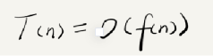

T(n)：表示代码执行的时间

n：表示数据规模的大小

f(n)：表示每行代码执行的次数总和，因为这是一个公式，所以用 f(n)来表示

O：表示代码的执行时间 T(n) 与 f(n) 表达式成正比

第一段代码中的 T(n) = O(2n+2)

第二段代码中的 T(n) = O(2n^2 +2n+3)。

这就是大 O 时间复杂度表示法。大 O 时间复杂度实际上并不具体表示代码真正的执行时间，而是表示**代码执行时间随数据规模增长的变化趋势**，所以，也叫作**渐进时间复杂度**（asymptotic time complexity），简称时间复杂度。

当 n 很大时，公式中的**低阶、常量、系数**三部分并不左右增长趋势，所以都可以忽略。只需要记录一个**最大量级**就可以了，如果用大 O 表示法表示刚讲的那两段代码的时间复杂度，就可以记为：T(n) = O(n)； T(n) = O(n^2 )。

### 时间复杂度分析

分析时的注意点：

1. **只关注与 n 相关的代码行中，循环执行次数最多的一段代码**

   大 O 表示法只是表示**一种变化趋势**，**通常（不是一定）**会忽略掉公式中的常量、低阶、系数，只需要记录一个最大阶的量级。所以，在分析一个算法、一段代码的时间复杂度的时候，也只关注循环执行次数最多的那一段代码就可以了。

   ```js
   i = 1;
   while (i <= n) {
     i = i + 2;
   }
   // O(n/2), 公式中的低阶、常量、系数三部分并不左右增长趋势，所以都可以忽略，所以是O（n）
   ```

2. **加法法则：总复杂度等于量级最大的那段代码的复杂度**

   如果 T1(n)=O(f(n))，T2(n)=O(g(n))；那么 T(n)=T1(n)+T2(n)=max(O(f(n)), O(g(n))) =O(max(f(n), g(n)))

3. **乘法法则：嵌套代码的复杂度等于嵌套内外代码复杂度的乘积**

如果 T1(n)=O(f(n))，T2(n)=O(g(n))；那么 T(n)=T1(n)\*T2(n)=O(f(n))\*O(g(n))=O(f(n)\*g(n))。

也就是说，假设 T1(n) = O(n)，T2(n) = O(n2)，则 T1(n) \* T2(n) = O(n3)。落实到具体的代码上，可以把乘法法则看成是**嵌套循环**。

```c
int cal(int n) {
  int sum_1 = 0;
  int p = 1;
  for (; p < 100; ++p) {
    sum_1 = sum_1 + p;
  }

  int sum_2 = 0;
  int q = 1;
  for (; q < n; ++q) {
    sum_2 = sum_2 + q;
  }

  int sum_3 = 0;
  int i = 1;
  int j = 1;
  for (; i <= n; ++i) {
    j = 1;
    for (; j <= n; ++j) {
      sum_3 = sum_3 +  i * j;
    }
  }

  return sum_1 + sum_2 + sum_3;
}
```

这个代码分为三部分，分别是求 sum_1、sum_2、sum_3。可以分别分析每一部分的时间复杂度，然后把它们放到一块儿，再取一个量级最大的作为整段代码的复杂度。

第一段代码循环执行了 100 次（哪怕执行 1 亿次也是一样的与 n 无关），所以是一个常量的执行时间，跟 n 的规模无关。

强调一下，即便这段代码循环 10000 次、100000 次，只要是一个已知的数，跟 n 无关，照样也是常量级的执行时间。当 n 无限大的时候，就可以忽略。尽管对代码的执行时间会有很大影响，但是回到**时间复杂度的概念来说，它表示的是一个算法执行效率与数据规模增长的变化趋势**，所以不管常量的执行时间多大，都可以忽略掉。因为它本身对**增长趋势**并没有影响。

那第二段代码和第三段代码的时间复杂度是多少呢？答案是 O(n) 和 O(n^2)。

综合这三段代码的时间复杂度，取其中最大的量级。所以，整段代码的时间复杂度就为 O(n^2)。也就是说：**总的时间复杂度就等于量级最大的那段代码的时间复杂度**。那将这个规律抽象成公式就是：

如果 T1(n)=O(f(n))，T2(n)=O(g(n))；那么 T(n)=T1(n)+T2(n)=max(O(f(n)), O(g(n))) =O(max(f(n), g(n))).

```c
int cal(int n) {
  int ret = 0;
  int i = 1;
  for (; i < n; ++i) {
    ret = ret + f(i);
  }
}

int f(int n) {
  int sum = 0;
  int i = 1;
  for (; i < n; ++i) {
    sum = sum + i;
  }
  return sum;
}
```

单独看 cal() 函数。假设 f() 只是一个普通的操作，那第 4 ～ 5 行的时间复杂度就是，T1(n) = O(n)。但 f() 函数本身不是一个简单的操作，它的时间复杂度是 T2(n) = O(n)，所以，整个 cal() 函数的时间复杂度就是，T(n) = T1(n) * T2(n) = O(n*n) = O(n^2)。

复杂度分析关键在于“熟练”。只要多看案例，多分析。

### 常见时间复杂度实例

常见的复杂度量级：

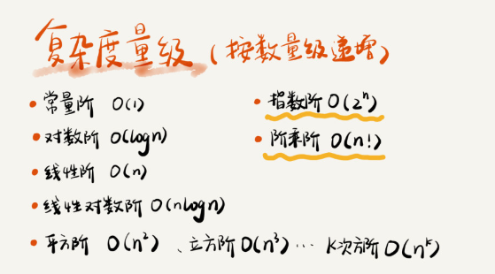

这些复杂度量级几乎涵盖了今后可以接触的所有代码的复杂度量级。

复杂度量级分类：**多项式量级和非多项式量级**。其中，非多项式量级只有两个：O(2^n) 和 O(n!)。把时间复杂度为非多项式量级的算法问题叫作 NP（Non-Deterministic Polynomial，非确定多项式）问题。

当数据规模 n 越来越大时，非多项式量级算法的执行时间会急剧增加，求解问题的执行时间会无限增长。所以，非多项式时间复杂度的算法其实是非常低效的算法。主要来看几种常见的**多项式时间复杂度**。

#### O(1)

**明确一个概念：O(1) 只是常量级时间复杂度的一种表示方法，并不是指只执行了一行代码**，O(n^0)。

```c
int i = 8;
int j = 6;
int sum = i + j;
```

比如这段代码，即便有 3 行，它的时间复杂度也是 O(1），而不是 O(3)。

只要代码的执行时间不随 n 的增大而增长，这样代码的时间复杂度都记作 O(1)。或者说，**一般情况下，只要算法中不存在与 n 相关的循环语句、递归语句，即使有成千上万行的代码，其时间复杂度也是 Ο(1)**。

#### O(logn)、O(nlogn)

对数阶时间复杂度。

```c
i=1;
while (i <= n)  {
  i = i * 2;
}
```

第三行代码是循环执行次数最多的。所以，只要能计算出这行代码被执行了多少次，就能知道整段代码的时间复杂度。实际上，变量 i 的取值就是一个等比数列。

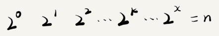

只要知道 x 值是多少，就知道这行代码执行的次数了。通过 2^x=n 求解 x ，x=log2n，所以，这段代码的时间复杂度就是 O(log2n)。

```c
i=1;
while (i <= n)  {
  i = i * 3;
}
```

这段代码的时间复杂度为 O(log3n)。

实际上，不管是以 2 为底、以 3 为底，还是以 10 为底，都可以把所有对数阶的时间复杂度都记为 O(logn)。

因为对数之间是可以互相转换的，$log_3n $就等于 $log_32$ _ $log_2n$，所以 O($log_3n $) = O(C _ $log_2n$)，其中 C=$log_32$ 是一个常量。基于前面的一个理论：**在采用大 O 标记复杂度的时候，可以忽略系数，即 O(Cf(n)) = O(f(n))**。所以，O($log_2n$) 就等于 O($log_3n$)。因此，在对数阶时间复杂度的表示方法里，忽略对数的“底”，统一表示为 O($lgn$)。

**O(nlogn)** ：如果一段代码的时间复杂度是 O(logn)，循环执行 n 遍，时间复杂度就是 O(nlogn) 了。而且，O(nlogn) 也是一种非常常见的算法时间复杂度。比如，**归并排序、快速排序**的时间复杂度都是 O(nlogn)。

#### O(m+n)、O(m\*n)

这种算法中，代码的复杂度**由两个数据的规模**来决定。

```c
int cal(int m, int n) {
  int sum_1 = 0;
  int i = 1;
  for (; i < m; ++i) {
    sum_1 = sum_1 + i;
  }

  int sum_2 = 0;
  int j = 1;
  for (; j < n; ++j) {
    sum_2 = sum_2 + j;
  }

  return sum_1 + sum_2;
}
```

从代码中可以看出，m 和 n 是表示两个数据规模。无法事先评估 m 和 n 谁的量级大，所以在表示复杂度的时候，就不能简单地利用加法法则，省略掉其中一个。所以，上面代码的时间复杂度就是 O(m+n)。

针对这种情况，原来的加法法则就不正确了，需要将加法规则改为：T1(m) + T2(n) = O(f(m) + g(n))。但是乘法法则继续有效：T1(m)_T2(n) = O(f(m) _ f(n))。

### 空间复杂度分析

空间复杂度全称就是**渐进空间复杂度**（asymptotic space complexity），**表示算法的存储空间与数据规模之间的增长关系**。

```c
void print(int n) {
  int i = 0;
  int[] a = new int[n];
  for (i; i <n; ++i) {
    a[i] = i * i;
  }

  for (i = n-1; i >= 0; --i) {
    print out a[i]
  }
}
```

跟时间复杂度分析一样，第 2 行代码中，申请了一个空间存储变量 i，但是它是常量阶的，跟数据规模 n 没有关系，所以可以忽略。第 3 行申请了一个大小为 n 的 int 类型数组，除此之外，剩下的代码都没有占用更多的空间，所以整段代码的空间复杂度就是 O(n)。

常见的空间复杂度就是 O(1)、O(n)、O(n2 )，像 O(logn)、O(nlogn) 这样的对数阶复杂度平时都用不到。而且，空间复杂度分析比时间复杂度分析要简单很多。

总结：复杂度也叫**渐进复杂度**，包括时间复杂度和空间复杂度，用来分析算法执行效率与数据规模之间的增长关系，可以粗略地表示，越高阶复杂度的算法，执行效率越低。常见的复杂度并不多，从低阶到高阶有：O(1)、O(logn)、O(n)、O(nlogn)、O(n^2 )。

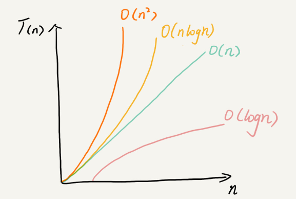

- 必须掌握
- 简单代码能很快分析出时间、 空间复杂度
- 对于复杂点的代码掌握递推公式和递归树
- **复杂度分析并不难，关键在于多练**

目标：不看文章分析，能自行分析专栏中大部分数据结构和算法的时间、空间复杂度

问题：有人说，我们项目之前都会进行性能测试，再做代码的时间复杂度、空间复杂度分析，是不是多此一举呢？而且，每段代码都分析一下时间复杂度、空间复杂度，是不是很浪费时间呢？你怎么看待这个问题呢？

> 不认为是多此一举，**渐进时间，空间复杂度分析提供了一个很好的理论分析的方向**，并且它是宿主平台无关的，能够让我们对我们的程序或算法有一个大致的认识，让我们知道，比如在最坏的情况下程序的执行效率如何，同时也为我们交流提供了一个不错的桥梁，我们可以说，算法 1 的时间复杂度是 O(n)，算法 2 的时间复杂度是 O(logN)，这样我们立刻就对不同的算法有了一个“效率”上的**感性认识**。
>
> 当然，渐进式时间，空间复杂度分析只是一个理论模型，只能提供给粗略的估计分析，我们不能直接断定就觉得 O(logN)的算法一定优于 O(n), 针对不同的宿主环境，不同的数据集，不同的数据量的大小，在实际应用上面可能真正的性能会不同，针对不同的实际情况，进而进行一定的性能基准测试是很有必要的，比如在统一一批手机上(同样的硬件，系统等等)进行横向基准测试，进而选择适合特定应用场景下的最有算法。
>
> 综上所述，渐进式时间，空间复杂度分析与性能基准测试并不冲突，而是相辅相成的，但是一个低阶的时间复杂度程序有极大的可能性会优于一个高阶的时间复杂度程序，所以在实际编程中，时刻关心理论时间，空间度模型是有助于产出效率高的程序的，同时，因为渐进式时间，空间复杂度分析只是提供一个粗略的分析模型，因此也不会浪费太多时间，重点在于在编程时，要具有这种复杂度分析的思维。

存储一个二进制数，输入规模（空间复杂度）是 O(logn) bit。比如 8 用二进制表示就是 3 个 bit。16 用二进制表示就是 4 个 bit。以此类推 n 用二进制表示就是 logn 个 bit。


### 数学基础知识

定义：一般地，如果一个数列从第二项起，每一项与它的前一项的差都等于同一个常数，那么这个数列就叫等差数列。这个常数叫做等差数列的公差，常用字母 d 表示。

对于一个等差数列而言，至少应该有 3 项，只有两项的话，则没有公差而言。比如只有两项，那么，两项相减只是一个差值，无法称之为公差。

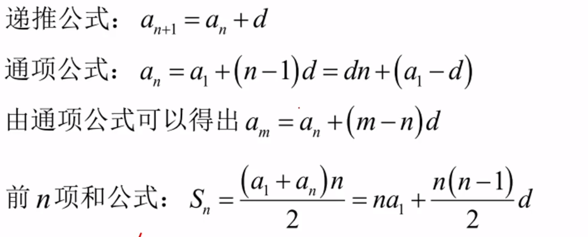

前 n 项和的证明：

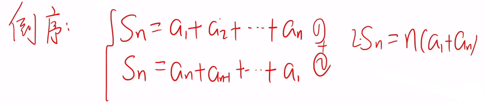

#### 练习

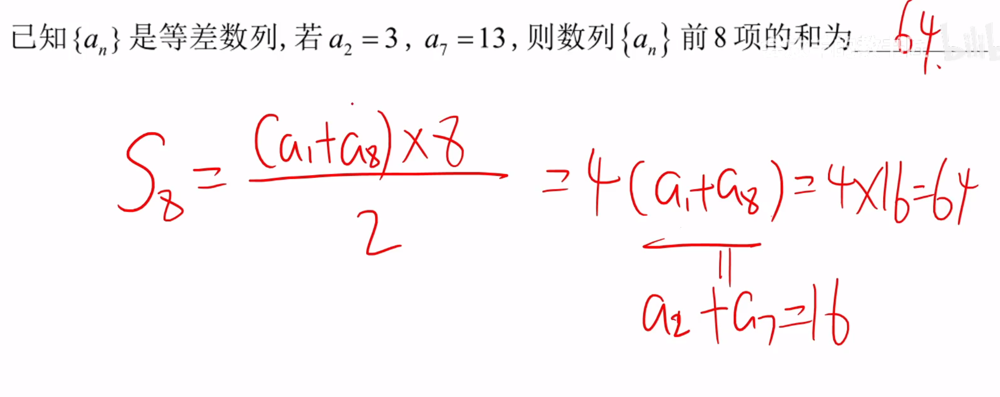

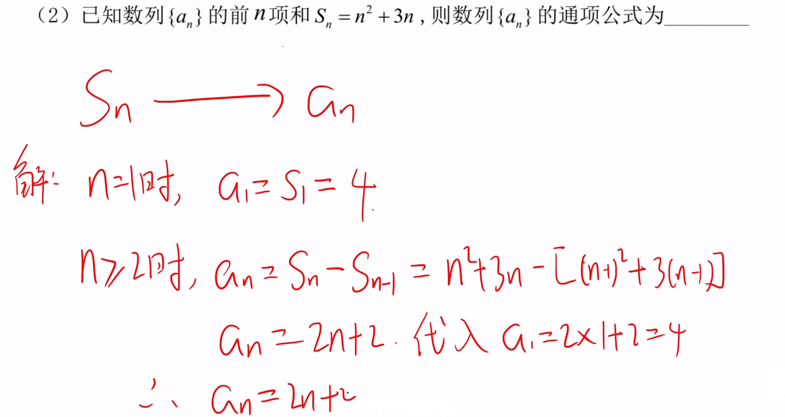

#### 通项性质

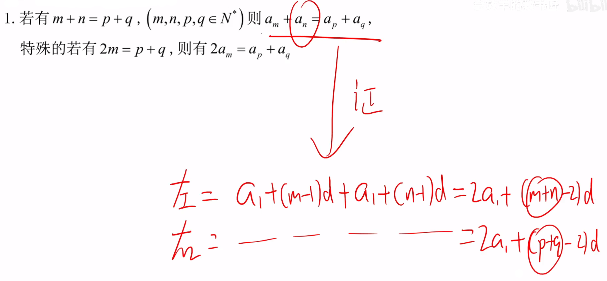

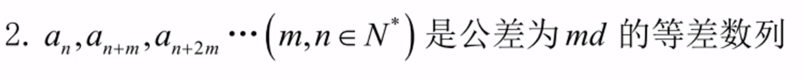

#### 练习

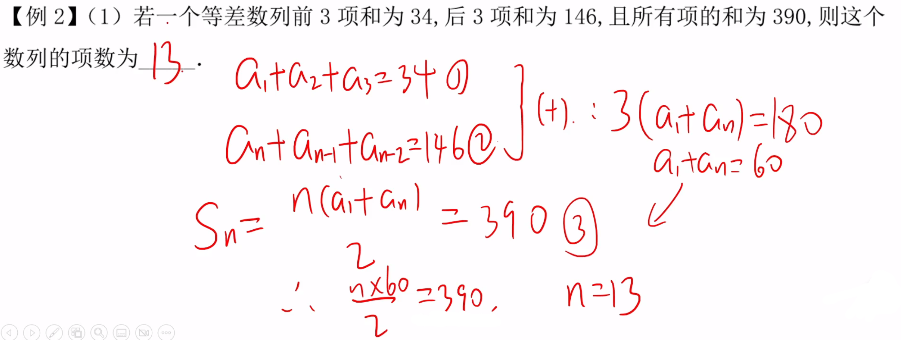

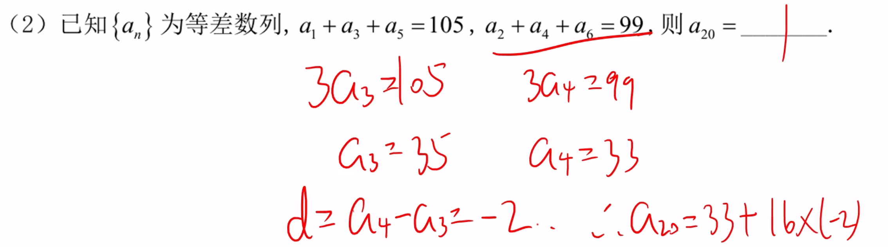

#### 前 n 项和

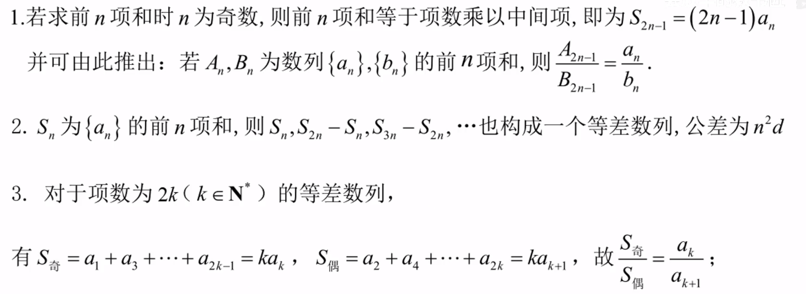

### 最好、最坏、平均、均摊时间复杂度

**前一讲中的所有代码案例中，如果出现关于 n 的循环，每次都必定会一直循环，直到条件不满足的时候再结束，不存在中途条件满足后，停止循环的情况。**

最好情况时间复杂度（best case time complexity）、最坏情况时间复杂度（worst case time complexity）、平均情况时间复杂度（average case time complexity）、均摊时间复杂度（amortized time complexity）

之所以引入这几个复杂度概念，是因为同一段代码，在不同输入的情况下，复杂度量级有可能是不一样的。

```c
// n表示数组array的长度
int find(int[] array, int n, int x) {
  int i = 0;
  int pos = -1;
  for (; i < n; ++i) {
    if (array[i] == x) pos = i;
  }
  return pos;
}
```

这段代码的功能：在一个数组（array）中，查找变量 x 出现的位置（多次出现则取最后一次出现的位置），如果没有找到，就返回 -1。这段代码的复杂度是 O(n)，其中 n 是数组的长度。

上面代码的一个缺点是，即使找到一个等于 x 的变量，还是会继续循环，直到循环完所有的数组元素为止。

为此，可以在循环到第一个目标数字后停止后续的循环。优化后的代码：

```c
// n表示数组array的长度
int find(int[] array, int n, int x) {
  int i = 0;
  int pos = -1;
  for (; i < n; ++i) {
    if (array[i] == x) {
       pos = i;
       break;
    }
  }
  return pos;
}
```

面对优化后的代码的时间复杂度，就需要具体分析了。

因为要查找的变量 x 可能出现在数组的任意位置。如果数组中第一个元素正好是要查找的变量 x，那就不需要继续遍历剩下的 n-1 个数据了，那时间复杂度就是 O(1)。但如果数组中不存在变量 x，那就需要把整个数组都遍历一遍，时间复杂度就成了 O(n)。所以，不同的情况下，这段代码的时间复杂度是不一样的。

为了表示代码在不同情况下的不同时间复杂度，引入了三个概念：**最好情况时间复杂度、最坏情况时间复杂度和平均情况时间复杂度。**

分析上面优化后的代码的平均时间度：

**要查找的变量 x 在数组中的位置，有 n+1 种情况：在数组的 0 ～ n-1 位置中和不在数组中。**把每种情况下，查找需要遍历的元素个数累加起来，然后再除以 n+1，就可以得到需要遍历的元素个数的平均值，即：

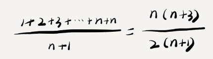

时间复杂度的大 O 标记法中，可以省略掉系数、低阶、常量，所以把刚刚这个公式简化之后，得到的平均时间复杂度就是 O(n)。

这个结论虽然是正确的，但是分析过程有点问题，**这 n+1 种情况，出现的概率并不是一样的。需要加入概率论的一些思想。**

要查找的变量 x，要么在数组里，要么就不在数组里。这两种情况对应的概率统计起来很麻烦，为了方便理解，假设在数组中与不在数组中的概率都为 1/2。另外，要查找的数据出现在 0 ～ n-1 这 n 个位置的概率也是一样的，为 1/n。所以，根据概率乘法法则，要查找的数据出现在 0 ～ n-1 中任意位置的概率就是 1/(2n)。

**因此，前面的推导过程中存在的最大问题就是，没有将各种情况发生的概率考虑进去。如果我们把每种情况发生的概率也考虑进去，那平均时间复杂度的计算过程就变成了这样：**

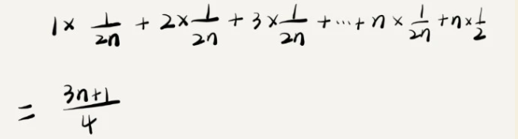

这个值就是概率论中的**加权平均值**，也叫作**期望值**，所以平均时间复杂度的全称应该叫**加权平均时间复杂度或者期望时间复杂度**。

引入概率之后，前面那段代码的加权平均值为 (3n+1)/4。用大 O 表示法来表示，去掉系数和常量，这段代码的加权平均时间复杂度仍然是 O(n)。

**一般不用分析一段代码的最好、最坏、平均情况时间复杂度三种情况，很多时候，使用一个复杂度就可以满足需求。**

只有同一块代码在不同的情况下，时间复杂度有**量级**的差距，才会使用这三种复杂度表示法来区分。

最好情况时间复杂度（best case time complexity）：在最理想的情况下，执行一段代码的时间复杂度。

最坏情况时间复杂度（worst case time complexity）：在最糟糕的情况下，执行一段代码的时间复杂度。

平均情况时间复杂度（average case time complexity）：加权平均时间复杂度或者期望时间复杂度

**均摊时间复杂度（amortized time complexity）**

分析方法：**摊还分析（平摊分析）**。

```c
// array表示一个长度为n的数组
// 代码中的array.length就等于n
int[] array = new int[n];
int count = 0;

void insert(int val) {
  if (count == array.length) {
    int sum = 0;
    for (int i = 0; i < array.length; ++i) {
      sum = sum + array[i];
    }
    array[0] = sum;
    count = 1;
  }

  array[count] = val;
  ++count;
}
```

> 这段代码实现了一个循环缓冲区（circular buffer）或环形缓冲区（ring buffer），其大小为 n。缓冲区中存储着整数类型的数据。缓冲区是用一个长度为 n 的整数数组来实现的。
>
> 函数 insert(int val) 的作用是将整数 val 插入到缓冲区中。如果缓冲区已满（即 count 等于缓冲区长度），则需要将缓冲区中的所有元素相加，将结果存储到数组的第一个位置，然后将 count 设置为 1。这样做可以保证缓冲区中的数据总是最新的 n 个数据。
>
> 如果缓冲区未满，则直接将 val 插入到缓冲区的下一个位置，并将 count 加 1。
>
> 这个循环缓冲区可以用于存储流数据，保留最新的 n 个数据。它可以在不断输入数据的情况下，保持数据的相对顺序不变，并且不需要频繁地移动数据。

这段代码的功能：每次调用一下这个 insert 函数，就往数组中插入传参，当数组中的每一项元素位置都有值时（数组满了），循环数组的每一项，进行相加，然后将最后相加的结果存到数组的第一个元素位置，然后再将新的数据插入。但如果数组一开始就有空闲空间，则直接将数据插入数组。

分析这段代码的时间复杂度：

最理想的情况下，数组中有空闲空间，只需要将数据插入到数组下标为 count 的位置就可以了，所以最好情况时间复杂度为 O(1)。最坏的情况下，数组中没有空闲空间了，需要先做一次数组的遍历求和，然后再将数据插入，所以最坏情况时间复杂度为 O(n)。

平均时间复杂度是 O(1)。还是可以通过前面讲的概率论的方法来分析。

假设数组的长度是 n，根据数据插入的位置的不同，可以分为 n 种情况，每种情况的时间复杂度是 O(1)。除此之外，还有一种“额外”的情况，就是在数组没有空闲空间时插入一个数据，这个时候的时间复杂度是 O(n)。而且，这 n+1 种情况发生的概率一样，都是 1/(n+1)。所以，根据加权平均的计算方法，求得的平均时间复杂度就是：

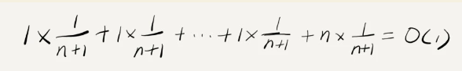

这个例子里的平均复杂度分析其实并不需要这么复杂，不需要引入概率论的知识。先来对比一下这个 insert() 的例子和前面那个 find() 的例子，就会发现这两者有很大差别。

1. **find() 函数在极端情况下，复杂度才为 O(1)。但 insert() 在大部分情况下，时间复杂度都为 O(1)。只有个别情况下，复杂度才比较高，为 O(n)。这是 insert()第一个区别于 find() 的地方。**
2. **对于 insert() 函数来说，O(1) 时间复杂度的插入和 O(n) 时间复杂度的插入，出现的频率是非常有规律的，而且有一定的前后时序关系，一般都是一个 O(n) 插入之后，紧跟着 n-1 个 O(1) 的插入操作，循环往复。**

所以，针对这样一种特殊场景的复杂度分析，并不需要像之前讲平均复杂度分析方法那样，找出所有的输入情况及相应的发生概率，然后再计算加权平均值。

针对这种特殊的场景，引入了一种更加简单的分析方法：**摊还分析法**，通过摊还分析得到的时间复杂度叫**均摊时间复杂度**。

摊还分析法的思路：

在数组中插入数据的这个例子。每一次 O(n) 的插入操作，都会跟着 n-1 次 O(1) 的插入操作，所以把耗时多的那次操作均摊到接下来的 n-1 次耗时少的操作上，均摊下来，这一组连续的操作的均摊时间复杂度就是 O(1)。这就是均摊分析的大致思路。

均摊时间复杂度和摊还分析应用场景比较特殊，并不会经常用到。**简单总结一下应用场景：**

对一个数据结构进行一组连续操作中，大部分情况下时间复杂度都很低，只有个别情况下时间复杂度比较高，而且这些操作之间存在前后连贯的时序关系，这个时候，就可以将这一组操作放在一块儿分析，看是否能将较高时间复杂度那次操作的耗时，平摊到其他那些时间复杂度比较低的操作上。而且，**在能够应用均摊时间复杂度分析的场合，一般均摊时间复杂度就等于最好情况时间复杂度。**

练习：

```c
// 全局变量，大小为10的数组array，长度len，下标i。
int array[] = new int[10];
int len = 10;
int i = 0;

// 往数组中添加一个元素
void add(int element) {
   if (i >= len) { // 数组空间不够了
     // 重新申请一个2倍大小的数组空间
     int new_array[] = new int[len*2];
     // 把原来array数组中的数据依次copy到new_array
     for (int j = 0; j < len; ++j) {
       new_array[j] = array[j];
     }
     // new_array复制给array，array现在大小就是2倍len了
     array = new_array;
     len = 2 * len;
   }
   // 将element放到下标为i的位置，下标i加一
   array[i] = element;
   ++i;
}
```

### 数组、栈、队列

- 作为基础的数据结构，数组、 栈、队列，是后续很多复杂数据结构和算法的基础
- 必须掌握

目标：能自己实现动态数组、栈、队列

### 链表

- 理论内容不多，但链表上的操作却很复杂
- 面试中经常会考察

目标：不只是能看懂专栏中的内容，还能将专栏中提到的经典链表题目，比如链表反转、求中间结点等，轻松无 bug 地实现出来。

## 数组

在每种编程语言中，都有**数组**这种**数据类型**，同时也是一种最基础的**数据结构**。

在大部分编程语言中，数组都是从 0 开始编号的，为什么数组要从 0 开始编号，而不是从 1 开始？

### 随机访问

**数组（Array）是一种线性表数据结构。它用一组连续的内存空间，来存储一组具有相同类型的数据。**

1. **线性表（Linear List）**，在每个线性表上的数据最多只有前和后两个方向。其他线性表结构：链表、队列、栈等。

   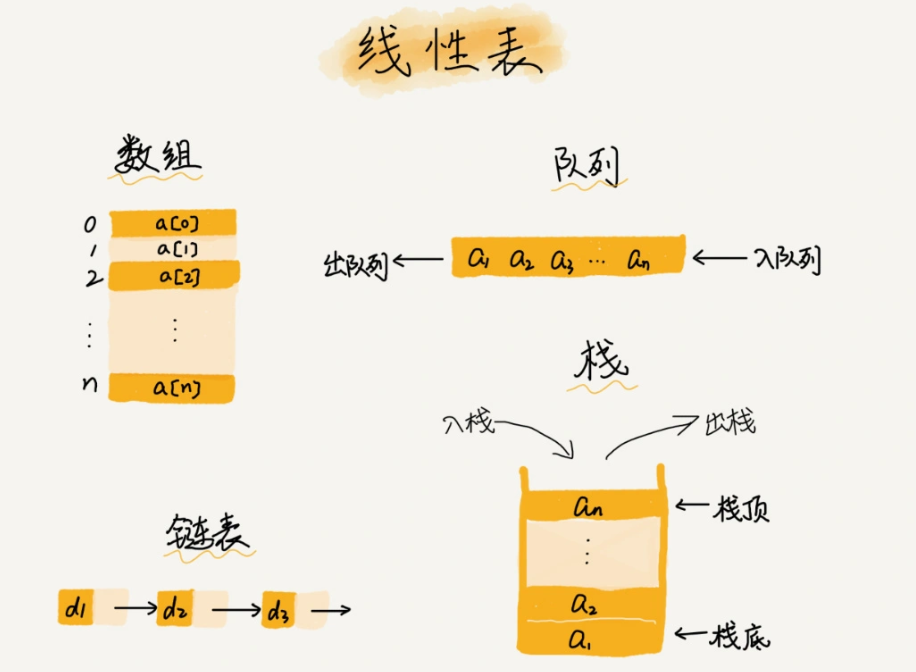

   **非线性表**，如：二叉树、堆、图等，在非线性表中，数据之间并不是简单的前后关系。

   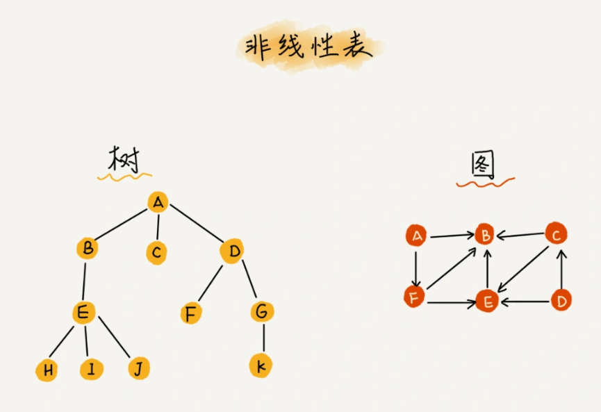

2. **连续的内存空间和相同类型的数据**，因为这个特性，使得数组可以高效地**随机访问**，但是要想在数组中删除、插入一个数据，**为了保证连续性，就需要做大量的数据搬移工作，效率低**。

   为什么会导致低效？又有哪些改进方法？

   插入和删除类似，这里看插入的情况。假设数组的长度为 n，现在，如果需要将一个数据插入到数组中的第 k 个位置。为了把第 k 个位置腾出来，给新来的数据，需要将第 k ～ n-1 这部分的元素都顺序地往后挪一位。如果在数组的末尾插入元素，那就不需要移动数据了，这时的时间复杂度为 O(1)。但如果在数组的开头插入元素，那所有的数据都需要依次往后移动一位，所以最坏时间复杂度是 O(n)。 因为在每个位置插入元素的概率是一样的，所以**平均情况时间复杂度为 (1+2+...n)/n=O(n)**。

   如果数组中的数据是有序的，在某个位置插入一个新的元素时，就必须按照刚才的方法搬移 k 之后的数据。但是，**如果数组中存储的数据并没有任何规律，数组只是被当作一个存储数据的集合。在这种情况下，如果要将某个数据插入到第 k 个位置，为了避免大规模的数据搬移，还有一个简单的办法就是，直接将第 k 位的数据搬移到数组元素的最后，把新的元素直接放入第 k 个位置。**利用这种处理技巧，在特定场景下，在第 k 个位置插入一个元素的时间复杂度就会降为 O(1)。

   删除操作的优化情况：**在某些特殊场景下，并不一定非得追求数组中数据的连续性。如果将多次删除操作集中在一起执行，删除的效率会提高很多。**

   例子：数组 a[10]中存储了 8 个元素：a，b，c，d，e，f，g，h。现在，要依次删除 a，b，c 三个元素。为了避免 d，e，f，g，h 这几个数据会被搬移三次，每次删除操作可以转为先记录下需要被删除的数据。当数组没有更多空间存储数据时，再触发执行一次真正的删除操作，这样就大大减少了删除操作导致的数据搬移。类似于 JVM 标记清除垃圾回收算法的核心思想。

   > 大多数主流虚拟机采用可达性分析算法来判断对象是否存活，在标记阶段，会遍历所有 GC ROOTS，将所有 GC ROOTS 可达的对象标记为存活。只有当标记工作完成后，清理工作才会开始。 不足：1.效率问题。标记和清理效率都不高，但是当知道只有少量垃圾产生时会很高效。2.空间问题。会产生不连续的内存空间碎片。

**数组通过下标实现随机访问的原理：**

以一个长度为 10 的 int 类型的数组 int[] a = new int[10]在内存中的空间分布情况（类比图）：

计算机给数组 a[10]，分配了一块连续内存空间 1000 ～ 1039，其中，数组内存块的首地址为 base_address=1000。

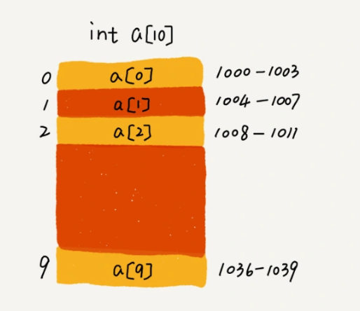

计算机中的每个内存单元都有一个地址，计算机通过该地址来访问内存中的数据。当计算机需要随机访问数组中的某个元素时，它会首先通过下面的寻址公式，计算出该元素存储的内存地址：

```
a[i]_address = base_address + i * data_type_size
```

data_type_size：数组中每个元素所占用的内存空间大小（单位字节），上图中的 data_type_size 的大小为 4 个字节。

数组和链表的区别常见的错误回答： **链表适合插入、删除，时间复杂度 O(1)；数组适合查找，查找时间复杂度为 O(1)。**

正确的表述是：数组中的**查找**根据不同的算法有不一样的时间复杂度，并且其查找的时间复杂度并不为 O(1)，即便是排好序的数组，用二分查找，时间复杂度也是 O(logn)。 数组是支持**随机访问**，根据下标随机访问的时间复杂度为 O(1)。

### 数组的访问越界

示例 C 语言代码：

```c
int main(int argc, char* argv[]){
  int i = 0;
  int arr[3] = {0};
  for(; i<=3; i++){
    arr[i] = 0;
    printf("hello world\n");
  }
  return 0;
}
```

这段代码在以内存地址递减的方式分配内存的 C 编译器中编译后运行结果并非是打印三行“hello word”，而是会无限打印“hello world”，这是为什么呢？ **（在内存分配时，会按照内存地址递增分配的 C 编译其中则不存在这个情况，因为 arr[3]的内存地址并不指向 i 变量的内存地址。）**

因为数组大小为 3，a[0]，a[1]，a[2]，而代码中因为书写错误，导致 for 循环的结束条件错写为了 i<=3 而非 i<3，所以当 i=3 时，数组 a[3]访问越界。

在 C 语言中，只要不是访问受限的内存，所有的内存空间都是可以自由访问的。根据前面讲的数组寻址公式，a[3]也会被定位到某块不属于数组的内存地址上，而这个地址正好是存储变量 i 的内存地址，那么 a[3]=0 就相当于 i=0，所以就会导致代码无限循环。

数组越界在 C 语言中是一种未决行为，并没有规定数组访问越界时编译器应该如何处理。因为，访问数组的本质就是访问一段连续内存，只要数组通过偏移计算得到的内存地址是可用的，那么程序就可能不会报任何错误。

这种情况下，一般都会出现莫名其妙的逻辑错误，就像刚刚那个例子，debug 的难度非常大。而且，很多计算机病毒也正是利用到了代码中的数组越界可以访问非法地址的漏洞，来攻击系统，所以写代码的时候一定要警惕数组越界。

但并非所有的语言都像 C 一样，把数组越界检查的工作丢给程序员来做，像 Java 本身就会做越界检查，比如下面这几行 Java 代码，就会抛出 java.lang.ArrayIndexOutOfBoundsException。

```c
int[] a = new int[3];
a[3] = 10;
```

> 函数体内的局部变量存在栈上，且是连续压栈。在 Linux 进程的内存布局中，栈区在高地址空间，从高向低增长。变量 i 和 arr 在相邻地址，且 i 比 arr 的地址大，所以 arr 越界正好访问到 i。当然，前提是 i 和 arr 元素同类型，否则那段代码仍是未决行为。

### 容器与数组

针对数组类型，很多语言都提供了容器类，比如 Java 中的 ArrayList、C++ STL 中的 vector。在项目开发中，什么时候适合用数组，什么时候适合用容器？

Java 中 ArrayList 的优势：

1. **可以将很多数组操作的细节封装起来。**比如前面提到的数组插入、删除数据时需要搬移其他数据等。

2. **支持动态扩容。** 数组本身在定义的时候需要预先指定大小，因为需要分配连续的内存空间。如果申请了大小为 10 的数组，当第 11 个数据需要存储到数组中时，就需要重新分配一块更大的空间，将原来的数据复制过去，然后再将新的数据插入。

   如果使用 ArrayList，就完全不需要关心底层的扩容逻辑，ArrayList 已经实现好了。每次存储空间不够的时候，它都会将空间自动扩容为 1.5 倍大小。

   不过，这里需要注意一点，因为扩容操作涉及内存申请和数据搬移，是比较耗时的。所以，如果事先能确定需要存储的数据大小，最好在创建 ArrayList 的时候事先指定数据大小。事先指定数据大小可以省掉很多次内存申请和数据搬移操作。

适合使用数组的情况：

1. Java ArrayList 无法存储基本类型，比如 int、long，需要封装为 Integer、Long 类，而 Autoboxing、Unboxing 则有一定的性能消耗，所以如果特别关注性能，或者希望使用基本类型，就可以选用数组。
2. 如果数据大小事先已知，并且对数据的操作非常简单，用不到 ArrayList 提供的大部分方法，也可以直接使用数组。
3. 当要表示多维数组时，用数组往往会更加直观。比如 Object[][] \[\]\[\]array；而用容器的话则需要这样定义：ArrayList \<ArrayList\<object\>\> array。

对于业务开发，直接使用容器就足够了，省时省力。毕竟损耗一丢丢性能，完全不会影响到系统整体的性能。但如果你是做一些非常底层的开发，比如开发网络框架，性能的优化需要做到极致，这个时候数组就会优于容器，成为首选。

为什么大多数编程语言中，数组要从 0 开始编号，而不是从 1 开始呢？

从数组存储的内存模型上来看，“下标”最确切的定义应该是“**偏移（offset）**”。前面也讲到，如果用 a 来表示数组的首地址，a[0]就是偏移为 0 的位置，也就是首地址，a[k]就表示偏移 k 个 type_size 的位置，所以计算 a[k]的内存地址只需要用这个公式：

```
a[k]_address = base_address + k * type_size_
```

但是，如果数组从 1 开始计数，那计算数组元素 a[k]的内存地址就会变为：

```
a[k]_address = base_address + (k-1)*type_size
```

对比两个公式不难发现，从 1 开始编号，每次随机访问数组元素都多了一次减法运算，对于 CPU 来说，就是多了一次减法指令。

数组作为非常基础的数据结构，通过下标随机访问数组元素又是其非常基础的编程操作，效率的优化就要尽可能做到极致。所以为了减少一次减法操作，数组选择了从 0 开始编号，而不是从 1 开始。

历史原因：C 语言设计者用 0 开始计数数组下标，之后的 Java、JavaScript 等高级语言都效仿了 C 语言，或者说，为了在一定程度上减少 C 语言程序员学习 Java 的学习成本，因此继续沿用了从 0 开始计数的习惯。实际上，很多语言中数组也并不是从 0 开始计数的，比如 Matlab。甚至还有一些语言支持负数下标，比如 Python。

二维数组的寻址公式：`address = base_address + i*n*type_size+j*type_size=base_address +（i*n+j）*type_size`

## 链表

一个经典的链表应用场景： **LRU 缓存淘汰算法**。

缓存可以提高数据读取性能，硬件和软件中都有使用，如 CPU 缓存、数据库缓存、浏览器缓存等。

缓存数据的大小有限，当缓存被用满时，哪些数据应该被清理出去，哪些数据应该被保留？需要缓存淘汰策略来决定。常见的策略有三种：先进先出策略 FIFO（First In，First Out）、最少使用策略 LFU（Least Frequently Used）、最近最少使用策略 LRU（Least Recently Used）。

**如何用链表来实现 LRU 缓存淘汰策略？**

缓存利用空间换时间的思想，如果把数据存储在硬盘上，会比较节省内存，但每次查找数据都要询问一次硬盘，会比较慢。但如果通过缓存技术，事先将数据加载在内存中，虽然会比较耗费内存空间，但是每次数据查询的速度就大大提高了。

数组和链表的区别：

**底层的存储结构**上，数组需要一块连续的内存空间来存储，对内存的要求比较高。如果申请一个 100MB 大小的数组，当内存中没有**连续的**、**足够大的**存储空间时，即便内存的剩余总可用空间大于 100MB，仍然会申请失败。而链表并不需要一块连续的内存空间，它通过“指针”将一组**零散的内存块**串联起来使用，所以申请的是 100MB 大小的链表，不会有问题。

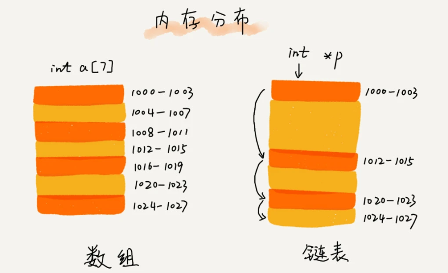

三种最常见的链表结构：**单链表、双向链表和循环链表**。

**单链表**

链表通过指针将一组零散的内存块串联在一起，把**内存块**称为链表的**“结点”**。为了将所有的结点串起来，**每个链表的结点除了存储数据之外，还需要记录链上的下一个结点的地址。**如图所示，把这个记录下个结点地址的指针叫作**后继指针 next**。

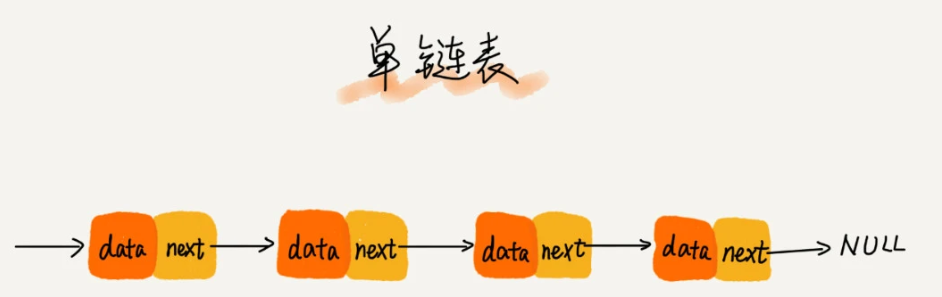

单链表第一个结点叫作头结点，记录链表的基地址，从这里遍历得到整条链表；把最后一个结点叫作尾结点，指向一个空地址 NULL。

**循环链表**

循环链表的尾结点指针是指向链表的头结点。

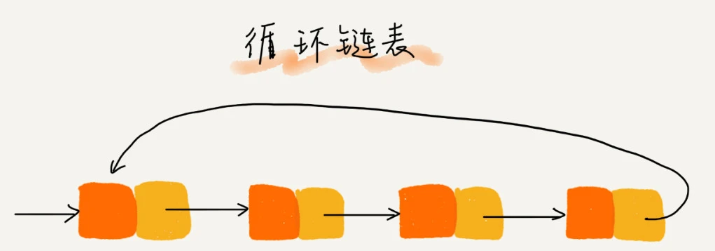

约瑟夫问题（击鼓传花）问题就可以方便的使用循环链表实现。

**双向链表**

每个结点有一个后继指针 next 指向后面的结点，一个前驱指针 prev 指向前面的结点。这种链表虽然占空间，但是在**实际开发中更加常用**。

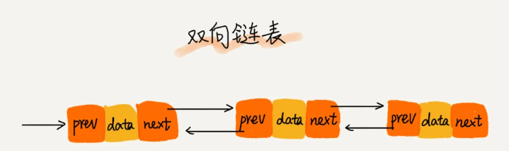

从结构上来看，**双向链表找到前驱结点的时间复杂度为 O(1)** 。

Java 语言中的 LinkedHashMap 容器的实现原理就用到了双向链表。（**用空间换时间**）

**双向循环链表**

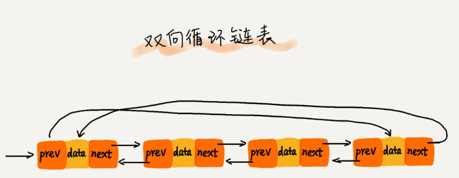

链表的查询、插入和删除：

在数组的插入、删除中，为了保持数据在内存中的连续性，需要做大量的数据搬移，所以时间复杂度是 O(n)。

在链表中插入、删除，并不需要为了保持内存的连续性而搬移结点，因为链表的存储空间本身就不是连续的。所以，在链表中插入和删除的时间复杂度是 O(1)。

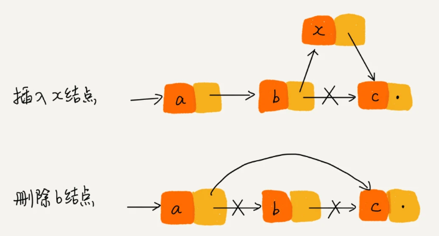

链表的劣势：链表要想**随机访问**第 k 个元素，就没有数组高效。因为链表中的数据并非连续存储的，所以无法像数组那样，根据首地址和下标，通过寻址公式就能直接计算出对应的内存地址，而是需要根据指针一个结点一个结点地依次遍历，直到找到相应的结点。**链表的随机访问时间复杂度是 O(n)**。

**删除**

在实际的开发中，从链表中删除一个数据的两种情况：

1. 删除结点中“值等于某个给定值”的结点；
2. 删除给定指针指向的结点。

对于第一种情况，不管是单链表还是双向链表，为了查找到值等于给定值的结点，都需要从头结点开始一个一个依次遍历对比，直到找到值等于给定值的结点，然后再通过前面讲的指针操作将其删除。**单纯的删除操作时间复杂度是 O(1)**，**但**遍历查找的时间是主要的耗时点，对应的时间复杂度为 O(n)。根据时间复杂度分析中的加法法则，删除值等于给定值的结点对应的链表操作的总时间复杂度为 O(n)。

对于第二种情况，已经找到了要删除的结点，但是删除某个结点 q 需要知道其前驱结点，而**单链表**并不支持直接获取前驱结点，所以，为了找到前驱结点，还是要从头结点开始遍历链表，直到 p->next=q，说明 p 是 q 的前驱结点。但是对于**双向链表**来说，因为双向链表中的结点已经保存了前驱结点的指针，不需要像单链表那样遍历。所以，**针对第二种情况，单链表删除操作需要 O(n) 的时间复杂度，而双向链表只需要 O(1) 的时间复杂度。** 针对插入节点也类似。

另外，对于一个**有序链表**，双向链表的按值查询的效率也要比单链表高一些。因为，可以记录上次查找的位置 p，每次查询时，根据要查找的值与 p 的大小关系，决定是往前还是往后查找，所以平均只需要查找一半的数据。

Java 中 LinkedHashMap 的实现原理就用到了双向链表。单链表和双链表的差异得出**时间和空间互换**的设计思想。当内存空间充足的时候，如果更加追求代码的执行速度，就可以选择空间复杂度相对较高、但时间复杂度相对很低的算法或者数据结构。相反，如果内存比较紧缺，比如代码跑在手机或者单片机上，这个时候，就要反过来用时间换空间的设计思路。

**链表与数组的比较**

数组和链表是两种截然不同的内存组织方式。正是因为内存存储的区别，它们插入、删除、随机访问操作的时间复杂度正好相反。

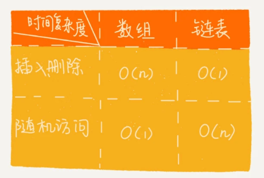

数组和链表的对比，并不能局限于时间复杂度。而且，在实际的软件开发中，**不能仅仅利用复杂度分析就决定使用哪个数据结构来存储数据**。

数组简单易用，在实现上使用的是连续的内存空间，可以借助 CPU 的缓存机制，**预读**数组中的数据，所以访问效率更高。而链表在内存中并不是连续存储，所以对 CPU 缓存不友好，没办法有效预读。

> CPU 缓存机制指的是什么？为什么就数组更好？
>
> CPU 在从内存读取数据的时候，会先把读取到的数据加载到 CPU 的缓存中。而 CPU 每次从内存读取数据并不是只读取那个特定要访问的地址，而是读取一个数据块(这个大小不太确定)，并保存到 CPU 缓存中，然后下次访问内存数据的时候就会先从 CPU 缓存开始查找，如果找到就不需要再从内存中取。这样就实现了比内存访问速度更快的机制，也就是 CPU 缓存存在的意义:为了弥补内存访问速度过慢与 CPU 执行速度快之间的差异而引入。
>
> 对于数组来说，存储空间是连续的，所以在加载某个下标的时候可以把以后的几个下标元素也加载到 CPU 缓存这样执行速度会快于存储空间不连续的链表存储。

数组的缺点是大小固定，一经声明就要占用整块连续内存空间。如果声明的数组过大，系统可能没有足够的连续内存空间分配给它，导致“内存不足（out of memory）”。如果声明的数组过小，则可能出现不够用的情况。这时只能再申请一个更大的内存空间，把原数组拷贝进去，非常费时。链表本身没有大小的限制，天然地支持动态扩容，这也是它与数组最大的区别。

虽然 Java 中的 ArrayList 容器也可以支持动态扩容。但当往支持动态扩容的数组中插入一个数据时，如果数组中没有空闲空间了，就会申请一个更大的空间，有浪费的情况，将数据拷贝过去，而数据拷贝的操作是非常耗时的。

如果程序对内存的使用要求严格，那数组更适合。因为链表中的每个结点都需要消耗额外的存储空间去存储一份指向下一个结点的指针，所以内存消耗会翻倍。而且，**对链表进行频繁的插入、删除操作，还会导致频繁的内存申请和释放，容易造成内存碎片**，如果是 Java 语言，就有可能会导致频繁的 GC（Garbage Collection，垃圾回收）。

所以，在实际的开发中，针对不同类型的项目，要根据具体情况，权衡究竟是选择数组还是链表。

如何基于链表实现 LRU 缓存淘汰算法？

维护一个有序单链表，越靠近链表尾部的结点是越早之前访问的。当有一个新的数据被访问时，从链表头开始顺序遍历链表。

1. 如果此数据之前已经被缓存在链表中了，会遍历得到这个数据对应的结点，并将其从原来的位置删除，然后再插入到链表的头部。
2. 如果此数据没有在缓存链表中，又可以分为两种情况：
   1. 如果此时缓存未满，则将此结点直接插入到链表的头部；
   2. 如果此时缓存已满，则链表尾结点删除，将新的数据结点插入链表的头部。

以上就是基于链表实现一个 LRU 缓存。

因为不管缓存有没有满，都需要遍历一遍链表，所以这种基于链表的实现思路，缓存访问的时间复杂度为 O(n)。

实际上，可以继续优化这个实现思路，比如引入散列表（Hash table）来记录每个数据的位置，将缓存访问的时间复杂度降到 O(1)。

和数组相比，链表更适合插入、删除操作频繁的场景，查询的时间复杂度较高。不过，在具体软件开发中，要对数组和链表的各种性能进行对比，综合来选择使用两者中的哪一个。

除了基于链表的实现思路，实际上还可以用数组来实现 LRU 缓存淘汰策略。如何利用数组实现 LRU 缓存淘汰策略呢？

如何判断一个字符串是否是回文字符串的问题？

如果字符串是通过单链表来存储的，那该如何来判断是一个回文串呢？相应的时间空间复杂度又是多少呢？

`"回文串"是一个正读和反读都一样的字符串，比如"level"或者"noon"等等就是回文串。`


## 链表代码

构建链表和一些链表相关的操作方法，尤其是那些复杂的链表操作，比如链表反转、有序链表合并等，写的时候非常容易出错。

几个写链表代码技巧：

1. **理解指针或引用的含义**
2. **警惕指针丢失和内存泄漏**
3. **利用哨兵简化实现难度**
4. **重点留意边界条件处理**
5. **举例画图，辅助思考**
6. **多写多练，没有捷径**

**理解指针或引用的含义**

有些语言有“指针”的概念，比如 C 语言；有些语言没有指针，取而代之的是“引用”，比如 Java、Python。不管是“指针”还是“引用”，实际上，它们的意思都是一样的，都是存储内存地址，该内存地址上存储被指向的对象。

指针：**将某个变量赋值给指针，实际上就是将这个变量的地址赋值给指针，或者反过来说，指针中存储了这个变量的内存地址，指向了这个变量，通过指针就能找到这个变量。**

以 C 语言中的“指针”来讲解：

在编写链表代码的时候，经常会有这样的代码：p->next=q。这行代码是说，p 结点中的 next 指针存储了 q 结点的内存地址。

还有一个更复杂的，也是写链表代码经常会用到的：p->next=p->next->next。这行代码表示，p 结点的 next 指针存储了 p 结点的下下一个结点的内存地址。

**警惕指针丢失和内存泄漏**

写链表代码的时候，指针指来指去，一会儿就不知道指到哪里了。所以，在写的时候，一定注意不要弄丢了指针。

单链表插入操作的指针丢失为例子：

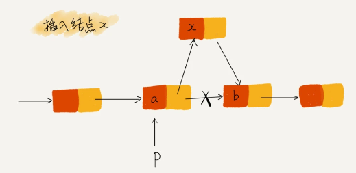

如图，在结点 a 和相邻的结点 b 之间插入结点 x，假设当前指针 p 指向结点 a。

如果将代码实现变成下面这个样子，就会发生指针丢失和内存泄露。

```c
p->next = x;  // 将p的next指针指向x结点；
x->next = p->next;  // 将x的结点的next指针指向b结点；  实际上x的next指针指向了自己
```

p->next 指针在完成第一步操作之后，已经不再指向结点 b 了，而是指向结点 x。第 2 行代码相当于将 x 赋值给 x->next，自己指向自己。因此，整个链表也就断成了两半，从结点 b 往后的所有结点都无法访问到了。

对于有些语言来说，比如 C 语言，内存管理是由程序员负责的，如果没有手动释放结点对应的内存空间，就会产生内存泄露。所以，**插入结点时，一定要注意操作的顺序，要先将结点 x 的 next 指针指向结点 b，再把结点 a 的 next 指针指向结点 x，**这样才不会丢失指针，导致内存泄漏。所以，对于刚刚的插入代码，只需要把第 1 行和第 2 行代码的顺序颠倒一下就可以了。

```c
x->next = p->next;  // 将x的结点的next指针指向b结点；
p->next = x;  // 将p的next指针指向x结点；
```

**在 C 语言中，删除链表结点时，也一定要记得手动释放内存空间。**对于像 Java 这种虚拟机自动管理内存的编程语言来说，这个过程可以交给 JVM 去处理。

**利用哨兵节点简化实现难度**

回顾单链表的插入和删除操作。如果在结点 p 后面插入一个新的结点，只需要下面两行代码就可以:

```c
new_node->next = p->next;
p->next = new_node;
```

但是，当要向一个空链表中插入**第一个结点**，刚刚的逻辑就不能用了。需要进行下面这样的特殊处理，其中 head 表示链表的头结点。所以，从这段代码，对于单链表的插入操作，第一个结点和其他结点的插入逻辑是不一样的。

```c
if (head == null) {
  head = new_node;
}
```

单链表结点删除操作。如果要删除结点 p 的后继结点，只需要一行代码就可以搞定。

```c
p->next = p->next->next
```

但是，如果链表只剩下**最后一个结点**，要删除这个结点，就不能使用上面的代码逻辑，应该是这样的：

```c
if(head->next == null){
  head = null;
}
```

**针对链表的插入、删除操作，需要对插入第一个结点和删除最后一个结点的情况进行特殊处理。**这样代码实现起来就会很繁琐，不简洁，而且也容易因为考虑不全而出错。如何来解决这个问题呢？

这时，可以使用哨兵了。**哨兵**，解决的是国家之间的边界问题。同理，这里说的哨兵也是解决“边界问题”的，不直接参与业务逻辑。

空链表的特征是 head=null ，表示链表中没有结点。其中 head 表示头结点指针，指向链表中的第一个结点。

如果引入**哨兵结点**，在任何时候，不管链表是不是空，head 指针都会一直指向这个哨兵结点。也把这种有哨兵结点的链表叫**带头链表**。相反，没有哨兵结点的链表就叫作**不带头链表**。

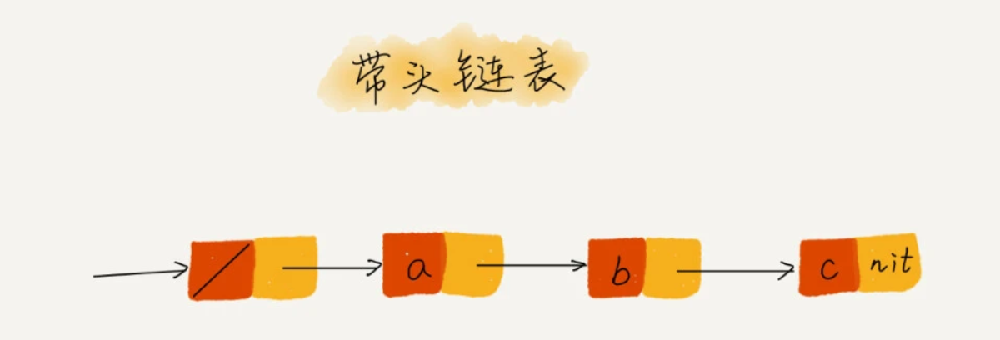

哨兵结点是不存储数据的。因为哨兵结点一直存在，所以插入第一个结点和插入其他结点，删除最后一个结点和删除其他结点，都可以统一为相同的代码实现逻辑了。

**实际上，这种利用哨兵简化编程难度的技巧，在很多代码实现中都有用到，比如插入排序、归并排序、动态规划等。**

有无哨兵的代码对比：

**代码一：**

```c
// 在数组a中，查找key，返回key所在的位置
// 其中，n表示数组a的长度
int find(char* a, int n, char key) {
  // 边界条件处理，如果a为空，或者n<=0，说明数组中没有数据，就不用while循环比较了
  if(a == null || n <= 0) {
    return -1;
  }

  int i = 0;
  // 这里有两个比较操作：i<n和a[i]==key.
  while (i < n) {
    if (a[i] == key) {
      return i;
    }
    ++i;
  }

  return -1;
}
```

代码二：

```c
// 在数组a中，查找key，返回key所在的位置
// 其中，n表示数组a的长度
// 我举2个例子，你可以拿例子走一下代码
// a = {4, 2, 3, 5, 9, 6}  n=6 key = 7
// a = {4, 2, 3, 5, 9, 6}  n=6 key = 6
int find(char* a, int n, char key) {
  if(a == null || n <= 0) {
    return -1;
  }

  // 这里因为要将a[n-1]的值替换成key，所以要特殊处理这个值
  if (a[n-1] == key) {
    return n-1;
  }

  // 把a[n-1]的值临时保存在变量tmp中，以便之后恢复。tmp=6。
  // 之所以这样做的目的是：希望find()代码不要改变a数组中的内容
  char tmp = a[n-1];
  // 把key的值放到a[n-1]中，此时a = {4, 2, 3, 5, 9, 7}
  a[n-1] = key;

  int i = 0;
  // while 循环比起代码一，少了i<n这个比较操作
  while (a[i] != key) {
    ++i;
  }

  // 恢复a[n-1]原来的值,此时a= {4, 2, 3, 5, 9, 6}
  a[n-1] = tmp;

  if (i == n-1) {
    // 如果i == n-1说明，在0...n-2之间都没有key，所以返回-1
    return -1;
  } else {
    // 否则，返回i，就是等于key值的元素的下标
    return i;
  }
}
```

对比两段代码，在字符串 a 很长的时候，比如几万、几十万，你觉得哪段代码运行得更快点呢？

答案是代码二，因为两段代码中执行次数最多就是 while 循环那一部分。第二段代码中，我们通过一个哨兵 a[n-1] = key，成功省掉了**一个比较语句 i<n**，不要小看这**一条语句**，当累积执行万次、几十万次时，累积的时间就很明显。

当然，这只是为了举例说明哨兵的作用，写代码的时候千万不要写第二段那样的代码，因为可读性太差了。大部分情况下，并不需要如此追求极致的性能。

**重点留意边界条件处理**

软件开发中，代码在一些边界或者异常情况下，最容易产生 Bug。链表代码也不例外。要实现没有 Bug 的链表代码，一定要在编写的过程中以及编写完成之后，检查边界条件是否考虑全面，以及代码在边界条件下是否能正确运行。

经常用来检查链表代码是否正确的边界条件有这样几个：

1. 如果链表为空时，代码是否能正常工作？
2. 如果链表只包含一个结点时，代码是否能正常工作？
3. 如果链表只包含两个结点时，代码是否能正常工作？
4. 代码逻辑在处理头结点和尾结点的时候，是否能正常工作？

**举例画图，辅助思考**

对于稍微复杂的链表操作，比如单链表反转，指针一会儿指这，一会儿指那，一会儿就被绕晕了。总感觉脑容量不够，想不清楚。所以这个时候就要使用大招，**举例法和画图法**。

可以找一个具体的例子，把它画在纸上，释放一些脑容量，留更多的给逻辑思考，这样就会感觉到思路清晰很多。比如往单链表中插入一个数据这样一个操作，一般都是把各种情况都举一个例子，画出插入前和插入后的链表变化，如图所示：

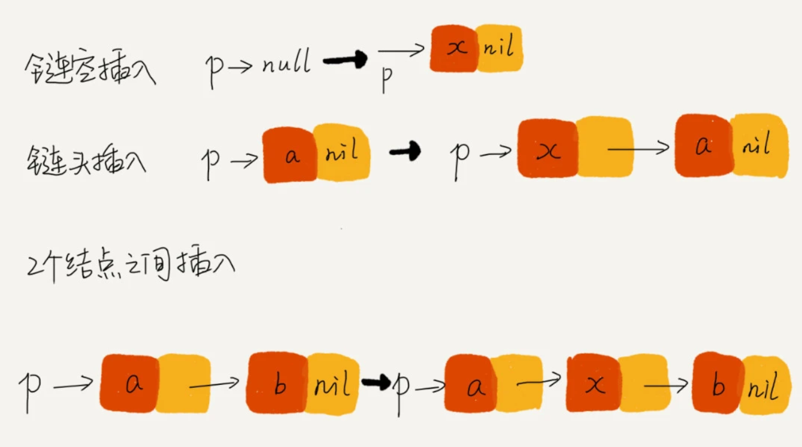

**多写多练，没有捷径**

把常见的链表操作都自己多写几遍，出问题就一点一点调试，熟能生巧！

5 个常见的链表操作：

1. 单链表反转

2. 链表中环的检测

3. 两个有序的链表合并

4. 删除链表倒数第 n 个结点

5. 求链表的中间结点

> 建议在实现之前的思考时间不要太长。一是先用自己能想到的暴力方法实现试试。另外就是在一定时间内(比如半个到一个小时)实在想不到就要在网上搜搜答案。有的算法，比如链表中环的检测，的最优解法还是挺巧妙的，一般来说不是生想就能想到的
>
> 练习题 LeetCode 对应编号：206，141，21，19，876。


## 栈

后进先出就是典型的“栈”结构。

从操作方式来看，栈是一种**操作受到限制**的**线性表**结构，删除和插入都只能在一端进行。从功能上，数组或链表可以替代栈，但是特定的数据结构是对特定场景的抽象，而且，数组或链表暴露太多的操作接口，操作上的确灵活自由，但使用时就比较不可控，也就更容易出错。

**如何用代码实现一个栈**

栈可以用数组或链表来实现。用数组实现的栈，叫作**顺序栈**，用链表实现的栈，叫作**链式栈**。

基于数组实现的栈：

```java
// 基于数组实现的顺序栈
public class ArrayStack {
  private String[] items;  // 数组
  private int count;       // 栈中元素个数
  private int n;           //栈的大小

  // 初始化数组，申请一个大小为n的数组空间
  public ArrayStack(int n) {
    this.items = new String[n];
    this.n = n;
    this.count = 0;
  }

  // 入栈操作
  public boolean push(String item) {
    // 数组空间不够了，直接返回false，入栈失败。
    if (count == n) return false;
    // 将item放到下标为count的位置，并且count加一
    items[count] = item;
    ++count;
    return true;
  }

  // 出栈操作
  public String pop() {
    // 栈为空，则直接返回null
    if (count == 0) return null;
    // 返回下标为count-1的数组元素，并且栈中元素个数count减一
    String tmp = items[count-1];
    --count;
    return tmp;
  }
}
```

**栈操作的时间、空间复杂度**

不管是顺序栈还是链式栈，存储数据只需要一个大小为 n 的数组就够。**在入栈和出栈过程中**，只需要一两个临时变量存储空间，所以空间复杂度是 O(1)。 **注意：时间或者空间复杂度是针对具体的某段代码执行而言的。**

> 注意，这里存储数据需要一个大小为 n 的数组，并不是说空间复杂度就是 O(n)。因为，这 n 个空间是必须的，无法省掉。所以说空间复杂度的时候，是指除了原本的数据存储空间外，算法运行还需要**额外的**存储空间。
>
> 另一个理解的角度是：因为时间或者空间复杂度是针对具体的某段代码执行而言的，比如栈的出栈或者入栈操作。而栈的大小是在初始化栈的那段代码中所接受的参数 n 决定，可以说初始化栈操作的那段代码的空间复杂度是 O(n)，但是对于出栈、入栈并不涉及与 n 联动的内存申请代码，所以空间复杂度则是 O(1)。

不管是顺序栈还是链式栈，入栈、出栈只涉及栈顶个别数据的操作，所以时间复杂度都是 O(1)。

**支持动态扩容的顺序栈**

前面的基于数组实现的顺序栈的大小是固定的，在初始化栈时需要事先指定栈的大小。当栈满之后，就无法再往栈里添加数据了。尽管链式栈的大小不受限，但要存储 next 指针，内存消耗相对较多。

基于数组实现一个支持动态扩容的栈。

当数组空间不够时，就重新申请一块更大的内存，将原来数组中数据统统拷贝过去。这样就实现了一个支持动态扩容的数组。

如果要实现一个支持动态扩容的栈，需要底层依赖一个支持动态扩容的数组。当栈满了之后，就申请一个更大的数组，将原来的数据搬移到新数组中。

支持动态扩容的顺序栈，平时开发中并不常用到。讲这一块的目的，主要还是希望练习一下前面讲的复杂度分析方法。

**分析支持动态扩容的顺序栈的入栈、出栈操作的时间复杂度。**

对于出栈，不涉及内存的重新申请和数据的搬移，所以出栈的时间复杂度仍然是 O(1)。

对于入栈，当栈中有空闲空间时，入栈操作的时间复杂度为 O(1)。但当空间不够时，就需要重新申请内存和数据搬移，所以时间复杂度就变成了 O(n)。对于入栈操作来说，最好情况时间复杂度是 O(1)，最坏情况时间复杂度是 O(n)。

**平均时间复杂度**

这个入栈操作的平均情况下的时间复杂度可以用摊还分析法来分析。

为了分析的方便，需要事先做一些假设和定义：

1. 栈空间不够时，重新申请一个是原来大小两倍的数组；
2. 为了简化分析，假设只有入栈操作没有出栈操作；
3. 定义不涉及内存搬移的入栈操作为 simple-push 操作，时间复杂度为 O(1)。

如果当前栈大小为 K，并且已满，当再有新的数据要入栈时，就需要重新申请 2 倍大小的内存，并且做 K 个数据的搬移操作，然后再入栈。但是，接下来的 K-1 次入栈操作，都不需要再重新申请内存和搬移数据，所以这 K-1 次入栈操作都只需要一个 simple-push 操作就可以完成。

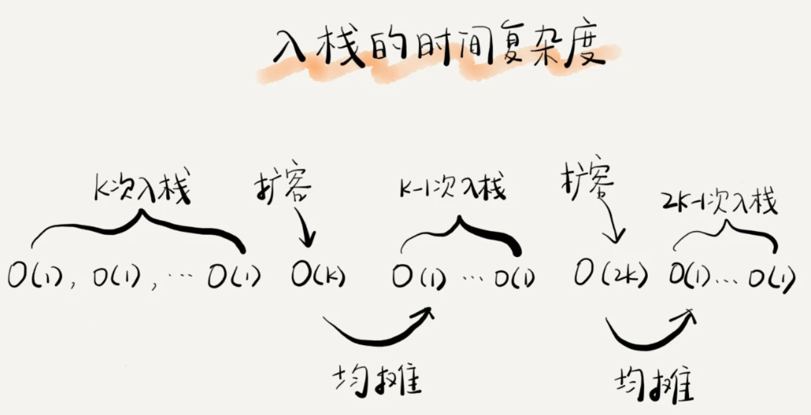

这 K 次入栈操作，总共涉及了 K 个数据的搬移，以及 K 次 simple-push 操作。将 K 个数据搬移均摊到 K 次入栈操作，那每个入栈操作只需要一个数据搬移和一个 simple-push 操作。以此类推，入栈操作的均摊时间复杂度就为 O(1)。

**均摊时间复杂度一般都等于最好情况时间复杂度。**因为在大部分情况下，入栈操作的时间复杂度 O 都是 O(1)，只有在个别时刻才会退化为 O(n)，所以把耗时多的入栈操作的时间均摊到其他入栈操作上，平均情况下的耗时就接近 O(1)。

### 栈的应用

**函数调用栈**

操作系统给每个线程分配了一块独立的内存空间，这块内存被组织成“栈”结构, 用来存储函数调用时创建的临时变量。每进入一个函数，就会将函数体内创建的临时变量作为一个栈帧入栈，当被调用函数执行完成，返回之后，将这个函数对应的栈帧出栈。

```c
int main() {
   int a = 1;
   int ret = 0;
   int res = 0;
   ret = add(3, 5);
   res = a + ret;
   printf("%d", res);
   reuturn 0;
}

int add(int x, int y) {
   int sum = 0;
   sum = x + y;
   return sum;
}
```

这个过程对应的函数栈里出栈、入栈的操作，在执行到 add() 函数时，函数调用栈的情况。

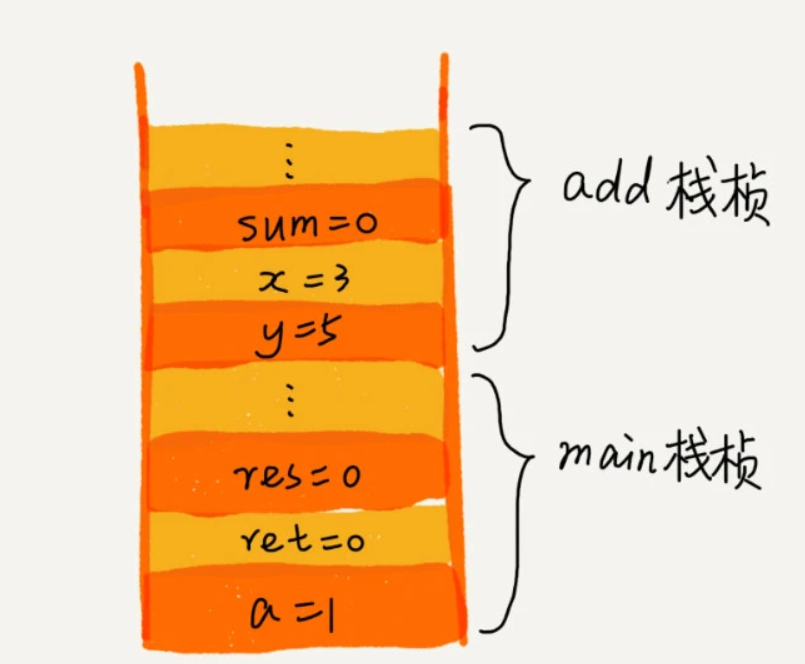

**表达式求值**

**编译器利用栈来实现表达式求值。**

比如：34+13\*9+44-12/3。计算机如何实现这样一个表达式求值的功能？

实际上，编译器通过**两个栈**来实现。其中一个保存**操作数**的栈，另一个是保存**运算符**的栈。从左向右遍历表达式，当遇到数字，就直接压入操作数栈；当遇到运算符，就与运算符栈的栈顶元素进行比较。

如果比运算符栈顶元素的优先级高，就将当前运算符压入栈；如果比运算符栈顶元素的优先级低或者相同，从运算符栈中取栈顶运算符，从操作数栈的栈顶取 2 个操作数，然后进行计算，再把计算完的结果压入操作数栈，继续比较。

将 3+5\*8-6 这个表达式的计算过程：

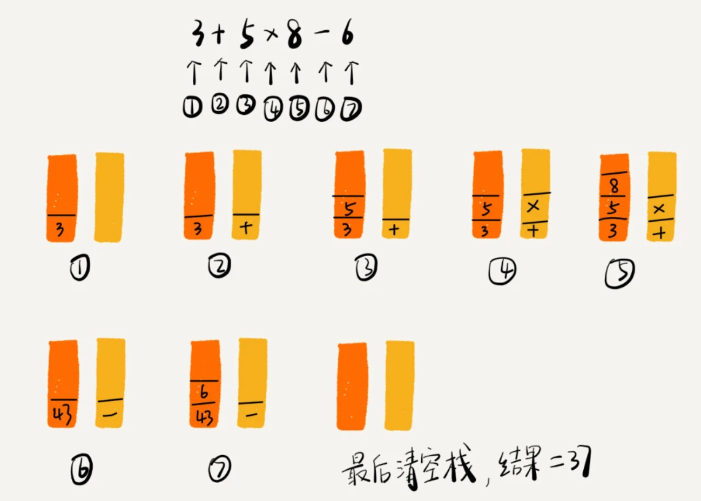

**括号匹配**

检查表达式中的括号是否匹配。

假设表达式中只包含三种括号，圆括号 ()、方括号[]和花括号{}，并且它们可以任意嵌套。比如，{[] ()[{}]}或[{()}([])]等都为合法格式，而{[}()]或[({)]为不合法的格式。那现在给你一个包含三种括号的表达式字符串，如何检查它是否合法呢？

用栈来保存未匹配的左括号，从左到右依次扫描字符串。当扫描到左括号时，则将其压入栈中；当扫描到右括号时，从栈顶取出一个左括号。如果能够匹配，比如“(”跟“)”匹配，“[”跟“]”匹配，“{”跟“}”匹配，则继续扫描剩下的字符串。如果扫描的过程中，遇到不能配对的右括号，或者栈中没有数据，则说明为非法格式。

当所有的括号都扫描完成之后，如果栈为空，则说明字符串为合法格式；否则，说明有未匹配的左括号，为非法格式。

**实现浏览器的前进和后退功能**

使用两个栈，X 和 Y，把首次浏览的页面依次压入栈 X，当点击后退按钮时，再依次从栈 X 中出栈，并将出栈的数据依次放入栈 Y。当点击前进按钮时，依次从栈 Y 中取出数据，放入栈 X 中。当栈 X 中没有数据时，那就说明没有页面可以继续后退浏览了。当栈 Y 中没有数据，那就说明没有页面可以点击前进按钮浏览了。

比如顺序查看了 a，b，c 三个页面，就依次把 a，b，c 压入栈，这个时候，两个栈的数据就是这个样子：

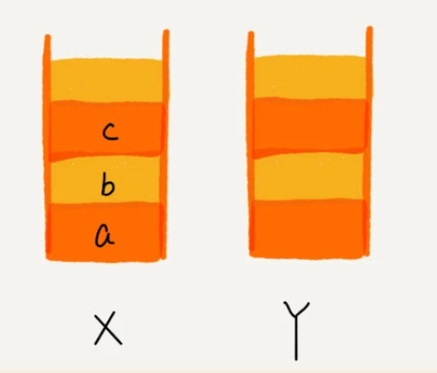

当你通过浏览器的后退按钮，从页面 c 后退到页面 a 之后，我们就依次把 c 和 b 从栈 X 中弹出，并且依次放入到栈 Y。这个时候，两个栈的数据就是这个样子：

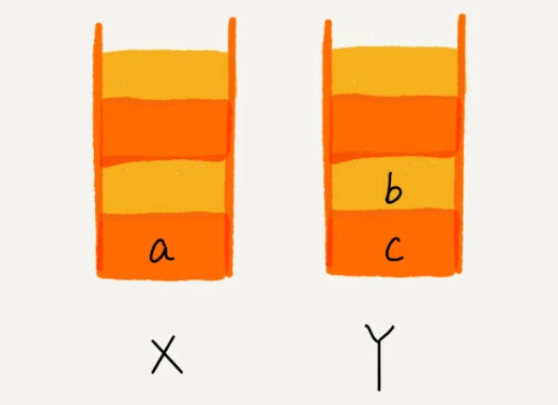

这个时候你又想看页面 b，于是你又点击前进按钮回到 b 页面，我们就把 b 再从栈 Y 中出栈，放入栈 X 中。此时两个栈的数据是这个样子：

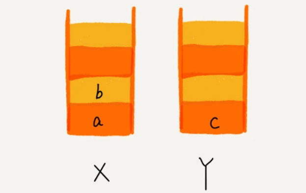

这个时候，你通过页面 b 又跳转到新的页面 d 了，页面 c 就无法再通过前进、后退按钮重复查看了，所以需要清空栈 Y。此时两个栈的数据这个样子：

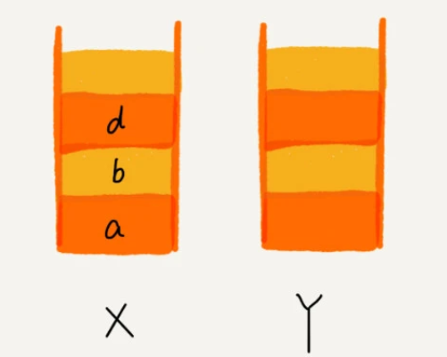

> leetcode 上关于栈的题目可以先做 20,155,232,844,224,682,496.

用函数调用栈来保存临时变量，为什么函数调用要用“栈”来保存临时变量呢？用其他数据结构不行吗？

JVM 内存管理中有个“堆栈”的概念。栈内存用来存储局部变量和方法调用，堆内存用来存储 Java 中的对象。那 JVM 里面的“栈”跟我们这里说的“栈”是不是一回事呢？如果不是，那它为什么又叫作“栈”呢？

> 内存中的堆栈和数据结构堆栈不是一个概念，可以说内存中的堆栈是真实存在的物理区，数据结构中的堆栈是抽象的数据存储结构。
>
> 内存空间在逻辑上分为三部分：代码区、静态数据区和动态数据区，动态数据区又分为栈区和堆区。
>
> 代码区：存储方法体的二进制代码。高级调度（作业调度）、中级调度（内存调度）、低级调度（进程调度）控制代码区执行代码的切换。
>
> 静态数据区：存储全局变量、静态变量、常量，常量包括 final 修饰的常量和 String 常量。系统自动分配和回收。
>
> 栈区：存储运行方法的形参、局部变量、返回值。由系统自动分配和回收。
>
> 堆区：new 一个对象的引用或地址存储在栈区，指向该对象存储在堆区中的真实数据。

## 队列

在线程池等有限资源池中常用请求排队，比如数据库连接池等。

**实际上，对于大部分资源有限的场景，当没有空闲资源时，基本上都可以通过“队列”这种数据结构来实现请求排队。**

线程的数量并不是越多，任务的处理速度就越快。因为线程过多导致 CPU 频繁的切换线程，处理性能反而会下降。所以，软件的线程池的大小一般都会考虑需要处理的任务的特点和硬件环境来事先设置。

问题：当向固定大小的线程池中请求一个线程时，如果线程池中没有空闲资源了，这个时候线程池如何处理这个请求？是拒绝请求还是排队请求？各种处理策略又是怎么实现的呢？

> 一般有两种处理策略。第一种是非阻塞的处理方式，直接拒绝任务请求；另一种是阻塞的处理方式，将请求排队，等到有空闲线程时，取出排队的请求继续处理。那如何存储排队的请求呢？
>
> 希望公平地处理每个排队的请求，先进者先服务，所以队列这种数据结构很适合来存储排队请求。队列有基于链表和基于数组这两种实现方式。这两种实现方式对于排队请求又有什么区别呢？
>
> 基于链表的实现方式，可以实现一个支持无限排队的无界队列（unbounded queue），但是可能会导致过多的请求排队等待，请求处理的响应时间过长。所以，针对响应时间比较敏感的系统，基于链表实现的无限排队的线程池是不合适的。
>
> 而基于数组实现的有界队列（bounded queue），队列的大小有限，所以线程池中排队的请求超过队列大小时，接下来的请求就会被拒绝，这种方式对响应时间敏感的系统来说，就相对更加合理。不过，设置一个合理的队列大小，也是非常有讲究的。队列太大导致等待的请求太多，队列太小会导致无法充分利用系统资源、发挥最大性能。

队列的特点：先进者先出，也是一种操作受限的**线性表**数据结构。

队列跟栈相似，支持的操作也有限，最基本的操作也是两个：入队 enqueue()，放一个数据到队列尾部；出队 dequeue()，从队列头部取一个元素。

队列这种数据结构在很多偏底层系统、框架、中间件的开发中，起着关键性的作用。比如：循环队列、阻塞队列、并发队列。比如高性能队列 Disruptor、Linux 环形缓存，都用到了循环并发队列；Java concurrent 并发包利用 ArrayBlockingQueue 来实现公平锁等。

**顺序队列和链式队列**

用数组实现的队列叫作**顺序队列**，用链表实现的队列叫作**链式队列**。

基于数组实现的队列：

```java
// 用数组实现的队列
public class ArrayQueue {
  // 数组：items，数组大小：n
  private String[] items;
  private int n = 0;
  // head表示队头下标，tail表示队尾下标
  private int head = 0;
  private int tail = 0;

  // 申请一个大小为capacity的数组
  public ArrayQueue(int capacity) {
    items = new String[capacity];
    n = capacity;
  }

  // 入队
  public boolean enqueue(String item) {
    // 如果tail == n 表示队列已经满了
    if (tail == n) return false;
    items[tail] = item;
    ++tail;
    return true;
  }

  // 出队
  public String dequeue() {
    // 如果head == tail 表示队列为空
    if (head == tail) return null;
    String ret = items[head];
    ++head;
    return ret;
  }
}
```

对于顺序栈，只需要一个栈顶指针就可以，但是队列需要两个指针：一个是 head 指针，指向队头；一个是 tail 指针，指向队尾。

当 a、b、c、d 依次入队之后，队列中的 head 指针指向下标为 0 的位置，tail 指针指向下标为 4 的位置：

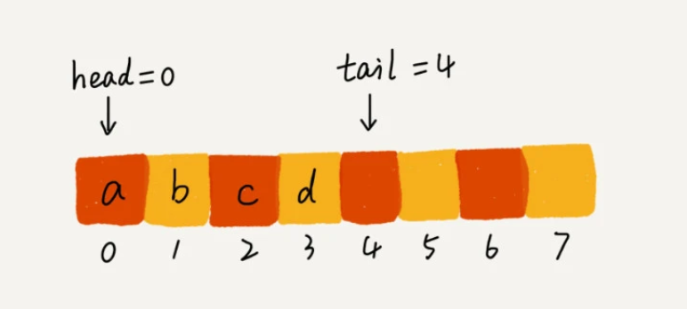

当调用两次出队操作之后，队列中 head 指针指向下标为 2 的位置，tail 指针仍然指向下标为 4 的位置。

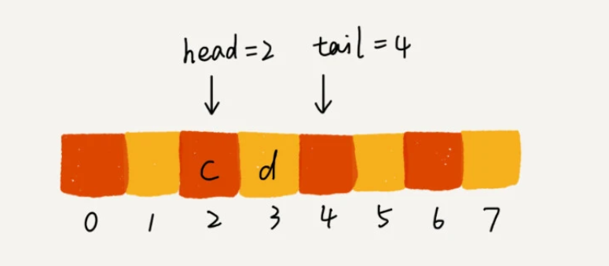

随着不停地进行入队、出队操作，head 和 tail 都会持续往后移动。当 tail 移动到最右边，即使数组的左侧还有空闲空间，也无法继续往队列中添加数据。

为什么是移动 head 执行而不是直接删除数组中的第一个元素以实现出队了？ 因为数组的删除操作会导致数组中的数据不连续，而数组自身为了保持数据在内存中是连续的，所以会自动进行数据搬移操作，所以，如果每次进行出队操作都相当于删除数组下标为 0 的数据，要搬移整个队列中的数据，这样出队操作的时间复杂度就会从原来的 O(1) 变为 O(n)。

所以对上面使用了两个指针，且都能移动，在进行出队时，可以不用删除队头的数据然后进行数组的搬移数据操作，只需要移动 head 指针就可以，如果一直在入队出队，tail 移动到数组的最右侧了，没有空闲空间了，只需要在入队时，再集中触发一次数据的搬移操作。借助这个思想，出队函数 dequeue() 保持不变，稍加改造一下入队函数 enqueue() 的实现，就可以轻松解决刚才的问题。

```java
// 入队操作，将item放入队尾
public boolean enqueue(String item) {
  // tail == n表示队列末尾没有空间了
  if (tail == n) {
    // tail ==n && head==0，表示整个队列都占满了
    if (head == 0) return false;
    // 数据搬移
    for (int i = head; i < tail; ++i) {
      items[i-head] = items[i];
    }
    // 搬移完之后重新更新head和tail
    tail -= head;
    head = 0;
  }

  items[tail] = item;
  ++tail;
  return true;
}
```

当队列的 tail 指针移动到数组的最右边后，如果有新的数据入队，可以将 head 到 tail 之间的数据，整体搬移到数组中 0 到 tail-head 的位置。

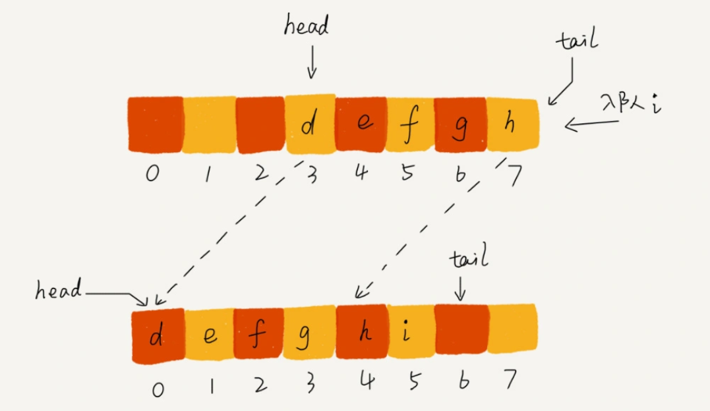

这种实现思路中，出队操作的时间复杂度仍然是 O(1)，但入队操作的时间复杂度还是 O(1)吗？（试着自己分析一下）

**基于链表的队列实现方法**

基于链表的实现，同样需要两个指针：head 指针和 tail 指针。它们分别指向链表的第一个结点和最后一个结点。如图所示，入队时，tail->next= new_node, tail = tail->next；出队时，head = head->next。

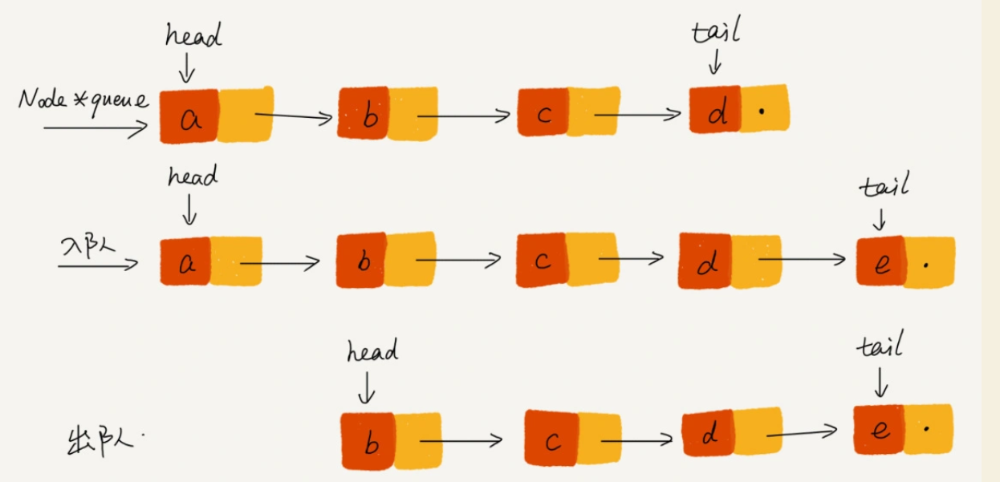

**循环队列**

前面用数组来实现队列的时候，在 tail==n 时，会有数据搬移操作，这样入队操作性能就会受到影响。那有没有办法能够避免数据搬移呢？——循环队列。

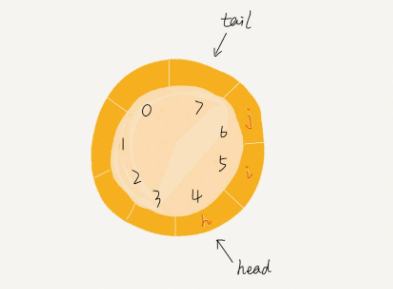

循环队列的代码实现难度要比前面的非循环队列难。要想写出没有 bug 的循环队列的实现代码，最关键的是，**确定好队空和队满的判定条件**。

针对循环队列，如何判断队空和队满呢？

**队列为空的判断条件仍然是 head == tail**。但队列满的判断条件就稍微有点复杂了。

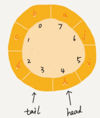

就像图中画的队满的情况，tail=3，head=4，n=8，所以总结一下规律就是：(3+1)%8=4。多画几张队满的图，你就会发现，当队满时，**(tail+1)%n=head**。

**当队列满时，图中的 tail 指向的位置实际上是没有存储数据的。所以，循环队列会浪费一个数组的存储空间。**因为如果 tail 再次向前移动一位的话，就成了队列为空的判断条件。所以必须空余一个空间出来。

```java
public class CircularQueue {
  // 数组：items，数组大小：n
  private String[] items;
  private int n = 0;
  // head表示队头下标，tail表示队尾下标
  private int head = 0;
  private int tail = 0;

  // 申请一个大小为capacity的数组
  public CircularQueue(int capacity) {
    items = new String[capacity];
    n = capacity;
  }

  // 入队
  public boolean enqueue(String item) {
    // 队列满了
    if ((tail + 1) % n == head) return false;
    items[tail] = item;
    tail = (tail + 1) % n;
    return true;
  }

  // 出队
  public String dequeue() {
    // 如果head == tail 表示队列为空
    if (head == tail) return null;
    String ret = items[head];
    head = (head + 1) % n;
    return ret;
  }
}
```

**阻塞队列和并发队列**

阻塞队列就是在队列基础上增加了阻塞操作。简单来说，就是在队列为空的时候，从队头取数据会被阻塞。因为此时还没有数据可取，直到队列中有了数据才能返回；如果队列已经满了，那么插入数据的操作就会被阻塞，直到队列中有空闲位置后再插入数据，然后再返回。

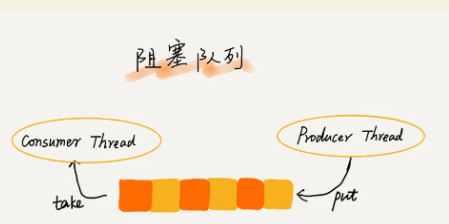

上述的定义就是一个“**生产者 - 消费者模型**”！可以使用阻塞队列，实现一个“生产者 - 消费者模型”！

这种基于阻塞队列实现的“生产者 - 消费者模型”，可以有效地协调生产和消费的速度。当“生产者”生产数据的速度过快（任务入队快），“消费者”来不及消费（任务出队慢）时，存储数据的队列很快就会满了。这个时候，生产者就阻塞等待，直到“消费者”消费了数据，“生产者”才会被唤醒继续“生产”。

基于阻塞队列，还可以通过协调“生产者”和“消费者”的**个数**，来提高数据的处理效率。比如前面的例子，可以多配置几个“消费者”，来应对一个“生产者”。

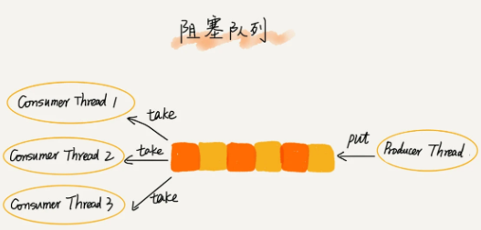

在多线程情况下，会有多个线程同时操作队列，这个时候就会存在线程安全问题，那如何实现一个线程安全的队列呢？

加上线程安全的队列叫作**并发队列**。最简单直接的实现方式是直接在 enqueue()、dequeue() 方法上加锁，但是锁粒度大并发度会比较低，同一时刻仅允许一个存或者取操作。实际上，基于数组的循环队列，利用 CAS 原子操作，可以实现非常高效的并发队列。这也是循环队列比链式队列应用更加广泛的原因。在实战篇讲 Disruptor 的时候，会再详细讲并发队列的应用。

## 递归

- 很多数据结构和算法的代码实现，都要用到递归
- 递归相关的理论知识也不多，所以还是要多练
- 先在网上找些简单的题目练手，再慢慢过渡到更加有难度的

目标：轻松写出前中后序二叉树遍历、八皇后、背包问题、DFS 深度优先搜索

案例：推荐注册返佣金中，用户 A 推荐用户 B 来注册，用户 B 又推荐了用户 C 来注册。可以说，用户 C 的“最终推荐人”为用户 A，用户 B 的“最终推荐人”也为用户 A，而用户 A 没有“最终推荐人”。在数据库表中，可以记录两行数据，其中 actor_id 表示用户 id，referrer_id 表示推荐人 id。

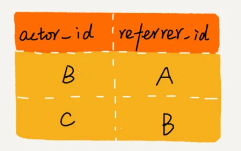

问题：给定一个用户 ID，如何查找这个用户的“最终推荐人”？

```java
long findRootReferrerId(long actorId) {
  Long referrerId = select referrer_id from [table] where actor_id = actorId;
  if (referrerId == null) return actorId;
  return findRootReferrerId(referrerId);
}
```

上面代码存在的问题：

1. 如果递归很深，可能会有堆栈溢出的问题
2. 如果数据库里存在脏数据，还需要处理由此产生的无限递归问题。比如 demo 环境下数据库中，测试工程师为了方便测试，会人为地插入一些数据，就会出现脏数据。如果 A 的推荐人是 B，B 的推荐人是 C，C 的推荐人是 A，这样就会发生死循环。（可以通过自动检测 A-B-C-A 解决。）

**递归需要满足的三个条件**

什么样的问题可以用递归来解决，要同时满足以下三个条件：

1. **一个问题的解可以分解为几个子问题的解**，子问题就是数据规模更小的问题。
2. **这个问题与分解之后的子问题，除了数据规模不同，求解思路完全一样**
3. **存在递归终止条件**

**编写递归代码**

写递归代码最关键的是**写出递推公式，找到终止条件**。

假如有 n 个台阶，每次可以跨 1 个台阶或者 2 个台阶，请问走这 n 个台阶有多少种走法？

实际上，可以根据第一次的走法把所有走法分为两类，第一类是第一次走了 1 个台阶，另一类是第一次走了 2 个台阶。所以 n 个台阶的走法就等于先走 1 阶后，剩下的 n-1 个台阶的走法加上先走 2 阶后，剩下的 n-2 个台阶的走法。用公式表示就是：

```
f(n) = f(n-1)+f(n-2)
```

终止条件：

当有一个台阶时，不需要再继续递归，就只有一种走法。所以 f(1)=1。这个递归终止条件足够吗？可以用 n=2，n=3 这样比较小的数试验一下。

n=2 时，f(2)=f(1)+f(0)。如果递归终止条件只有一个 f(1)=1，那 f(2) 就无法求解了。所以除了 f(1)=1 这一个递归终止条件外，还要有 f(0)=1，表示走 0 个台阶有一种走法，有些怪异。所以，把 f(2)=2 作为一种终止条件，表示走 2 个台阶，有两种走法，一步走完或者分两步来走。

所以，递归终止条件就是 f(1)=1，f(2)=2。这个时候，可以再拿 n=3，n=4 来验证一下，这个终止条件是否足够并且正确。

把递归终止条件和刚刚得到的递推公式放到一起：

```
f(1) = 1;
f(2) = 2;
f(n) = f(n-1)+f(n-2)
```

有了这个公式，转化成递归代码就简单。最终的递归代码是这样的：

```c
int f(int n) {
  if (n == 1) return 1;
  if (n == 2) return 2;
  return f(n-1) + f(n-2);
}
```

**写递归代码的关键就是找到如何将大问题分解为小问题的规律，并且基于此写出递推公式，然后再推敲终止条件，最后将递推公式和终止条件翻译成代码。**

一个问题如果只需要分解为一个子问题，很容易能够想清楚“递”和“归”的每一个步骤，所以写起来、理解起来都不难。

但是，当面对的是一个问题要分解为多个子问题的情况，递归代码就没那么好理解了。

当看到递归时，一般总想把递归平铺展开，脑子里就会循环，一层一层往下调，然后再一层一层返回，试图想搞清楚计算机每一步都是怎么执行的，这样就很容易被绕进去。

对于递归代码，这种试图想清楚整个递和归过程的做法，实际上是进入了一个思维误区。正确的思维方式应该是：如果一个问题 A 可以分解为若干子问题 B、C、D，可以假设子问题 B、C、D 已经解决，在此基础上思考如何解决问题 A。而且，只需要思考问题 A 与子问题 B、C、D 两层之间的关系即可，不需要一层一层往下思考子问题与子子问题，子子问题与子子子问题之间的关系。屏蔽掉递归细节。

因此，**编写递归代码的关键是，只要遇到递归，就把它抽象成一个递推公式，不用想一层层的调用关系，不要试图用人脑去分解递归的每个步骤。**

### 递归注意

**堆栈溢出**

函数调用会使用栈来保存临时变量。每调用一个函数，都会将临时变量封装为栈帧压入内存栈，等函数执行完成返回时，才出栈。系统栈或者虚拟机栈空间一般都不大。如果递归求解的数据规模很大，调用层次很深，一直压入栈，就会有堆栈溢出的风险。

```java
Exception in thread "main" java.lang.StackOverflowError
```

解决：

通过在代码中限制递归调用的最大深度的方式来解决这个问题。递归调用超过一定深度（比如 1000）之后，就不继续往下再递归了，直接返回报错。

```c
// 全局变量，表示递归的深度。
int depth = 0;

int f(int n) {
  ++depth；
  if (depth > 1000) throw exception;

  if (n == 1) return 1;
  return f(n-1) + 1;
}
```

但这种做法并不能完全解决问题，因为最大允许的递归深度跟当前线程剩余的栈空间大小有关，事先无法计算。如果实时计算，代码过于复杂，就会影响代码的可读性。所以，如果最大深度比较小，比如 10、50，就可以用这种方法，否则这种方法并不是很实用。

**重复计算**

针对前面 n 阶台阶的问题，整个递归过程


从图中，可以直观地看到，想要计算 f(5)，需要先计算 f(4) 和 f(3)，而计算 f(4) 还需要计算 f(3)，因此，f(3) 就被计算了很多次，这就是重复计算问题。

为了避免重复计算，**可以通过一个数据结构（比如散列表）来保存已经求解过的 f(k)**。当递归调用到 f(k) 时，先看下是否已经求解过了。如果是，则直接从散列表中取值返回，不需要重复计算，这样就能避免刚讲的问题了。

```java
public int f(int n) {
  if (n == 1) return 1;
  if (n == 2) return 2;

  // hasSolvedList可以理解成一个Map，key是n，value是f(n)
  if (hasSolvedList.containsKey(n)) {
    return hasSolvedList.get(n);
  }

  int ret = f(n-1) + f(n-2);
  hasSolvedList.put(n, ret);
  return ret;
}
```

**大量函数调用**

在时间效率上，递归代码里多了很多函数调用，当这些函数调用的数量较大时，就会积聚成一个可观的时间成本。在空间复杂度上，因为**递归调用一次就会在内存栈中保存一次现场数据**，所以在分析递归代码空间复杂度时，需要额外考虑这部分的开销。

### 改写递归

递归的优点：表达力很强，写起来简洁；缺点是：空间复杂度高、有堆栈溢出的风险、存在重复计算、过多的函数调用会耗时较多。

**递归代码都可以改为迭代循环的非递归写法。**递归本身就是借助栈来实现的，只不过使用的栈是系统或者虚拟机本身提供的，没有感知罢了。如果自己在内存堆上实现栈，手动模拟入栈、出栈过程，这样任何递归代码都可以改写成看上去不是递归代码的样子。

但是这种思路实际上是将递归改为了“手动”递归，本质并没有变，而且也并没有解决前面讲到的某些问题，徒增了实现的复杂度。

n 个台阶的循环写法：

```java
int f(int n) {
  if (n == 1) return 1;
  if (n == 2) return 2;

  int ret = 0;
  int pre = 2;
  int prepre = 1;
  for (int i = 3; i <= n; ++i) {
    ret = pre + prepre;
    prepre = pre;
    pre = ret;
  }
  return ret;
}
```

### 递归复杂度

递归的适用场景是，一个问题 a 可以分解为多个子问题 b、c，那求解问题 a 就可以分解为求解问题 b、c。问题 b、c 解决之后，再把 b、c 的结果合并成 a 的结果。

如果定义求解问题 a 的时间是 T(a)，求解问题 b、c 的时间分别是 T(b) 和 T( c)，那就可以得到这样的递推关系式：

```js
T(a) = T(b) + T(c) + K
```

K 等于将两个子问题 b、c 的结果合并成问题 a 的结果所消耗的时间。

**不仅递归求解的问题可以写成递推公式，递归代码的时间复杂度也可以写成递推公式。**

## 排序

经典的排序算法：冒泡排序、插入排序、选择排序、归并排序、快速排序、计数排序、基数排序、桶排序。

根据时间复杂度分类：

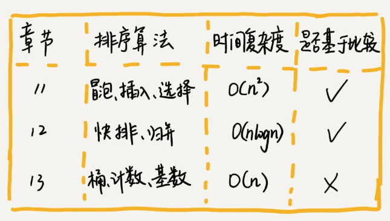

问题：**插入排序和冒泡排序的时间复杂度相同，都是 O(n^2)，在实际的软件开发里，为什么更倾向于使用插入排序算法而不是冒泡排序算法呢？**

### 重点学习

1. 算法原理
2. 代码实现
3. 评价、分析一个排序算法

分析一个排序算法：

1. **排序算法的执行效率**

   - **最好情况、最坏情况、平均情况时间复杂度**

     > 在分析排序算法的时间复杂度时，要分别给出最好情况、最坏情况、平均情况下的时间复杂度。
     >
     > 之所以区分这三种时间复杂度，是因为许多算法的最坏时间复杂度是相同的，但是最好情况、最坏情况、平均情况下的时间复杂度却并不相同，分析这三种复杂度就是为了更好的对比。

   - **举例出最好、最坏时间复杂度对应的要排序的原始数据**

     > 对于要排序的数据，有的接近有序，有的完全无序。有序度不同的数据，对于排序的执行时间是有影响的。所以要举例出一些有代表性的数据。

   - **考虑时间复杂度的系数、常数 、低阶**

     实际的软件开发中，排序的可能是规模很小的数据，所以，在对同一阶时间复杂度的排序算法性能对比的时候，就要把系数、常数、低阶也考虑进来。

   - **比较次数和交换（或移动）次数**

     **基于比较的排序算法**的执行过程，会涉及两种操作，一种是元素比较大小，另一种是元素交换或移动。所以，如果在分析排序算法的执行效率的时候，应该把比较次数和交换（或移动）次数也考虑进去。

2. **排序算法的空间复杂度**

   - 针对排序算法的空间复杂度，引入了一个新的概念，**原地排序（Sorted in place）**。原地排序算法，就是特指空间复杂度是 O(1) 的排序算法。冒泡，选择，插入排序都是原地排序算法。

3. **排序算法的稳定性**

   - 对于排序算法，还有一个重要的度量指标，**稳定性**。这个概念是说，如果待排序的序列中存在值相等的元素，经过排序之后，相等元素之间原有的先后顺序不变。例如：有一组数据 2，9，3，4，8，3，按照大小排序之后就是 2，3，3，4，8，9。这组数据里有两个 3。经过某种排序算法排序之后，如果两个 3 的前后顺序没有改变，那就把这种排序算法叫作**稳定的排序算法**；如果前后顺序发生变化，那对应的排序算法就叫作**不稳定的排序算法**。

     之所以考虑稳定性，是因为虽然在学习阶段，大多数例子都是整数，因为在真正的软件开发中，要排序的数据并不单纯是整数，而是一组对象，然后根据对象的某个或者多个 key 来排序。

     例如：要给电商交易系统中的“订单”排序。订单有两个属性，一个是下单时间，另一个是订单金额。如果现在有 10 万条订单数据，希望按照金额从小到大对订单数据排序。对于金额相同的订单，希望按照下单时间从早到晚有序。对于这样一个排序需求就需要考虑稳定性。

     最先想到的方法是：先按照金额对订单数据进行排序，然后，再遍历排序之后的订单数据，对于每个金额相同的小区间再按照下单时间排序。这种排序思路理解起来不难，但是实现起来会很复杂。

     借助稳定排序算法，这个问题可以非常简洁地解决。解决思路是这样的：先按照下单时间给订单排序，注意是按照下单时间，不是金额。排序完成之后，用稳定排序算法，按照订单金额重新排序。两遍排序之后，得到的订单数据就是按照金额从小到大排序，金额相同的订单按照下单时间从早到晚排序的。

     稳定排序算法可以保持金额相同的两个对象，在排序之后的前后顺序不变。第一次排序之后，所有的订单按照下单时间从早到晚有序了。在第二次排序中，我们用的是稳定的排序算法，所以经过第二次排序之后，相同金额的订单仍然保持下单时间从早到晚有序。

     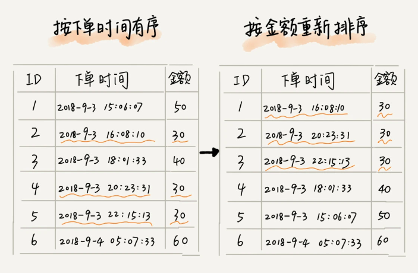

#### 有序度和逆序度

这两个概念主要用于各种排序算法的**加权平均期望时间复杂度**的分析。

有序度是数组中具有有序关系的元素对的个数。有序元素对用数学表达式表示就是这样：

```
有序元素对：a[i] <= a[j], 且i < j。
```

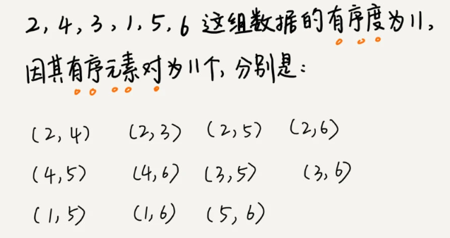

同理，对于一个倒序排列的数组，比如 6，5，4，3，2，1，有序度是 0；对于一个完全有序的数组，比如 1，2，3，4，5，6，有序度就是 n\*(n-1)/2，也就是 15。把这种完全有序的数组的有序度叫作**满有序度**。

逆序度的定义正好跟有序度相反（默认从小到大为有序）。

```
逆序元素对：a[i] > a[j], 如果i < j。
```

**公式：逆序度 = 满有序度 - 有序度。**

排序的过程就是一种增加有序度，减少逆序度的过程，最后达到满有序度，就说明排序完成了。

### 冒泡排序


每次冒泡操作都会对相邻的两个元素进行比较，看是否满足大小关系要求。如果不满足就让它俩互换。一次完整的冒泡会让至少一个元素移动到它应该在的位置，重复 n 次，就完成了 n 个数据的排序工作。

对一组数据 4，5，6，3，2，1，从小到大进行排序。第一次冒泡操作的详细过程就是这样：

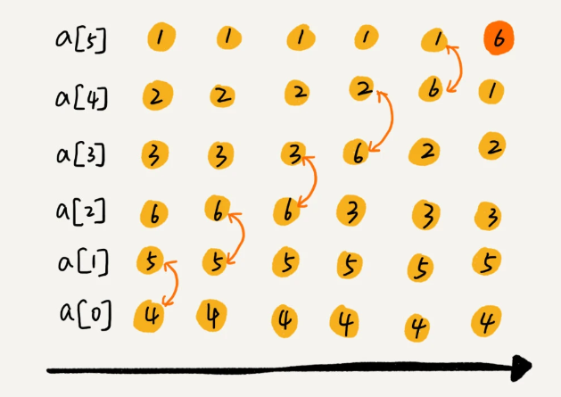

要想完成所有数据的排序，只要进行 6 次这样的冒泡操作就行了。

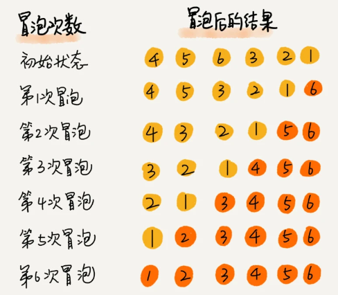

#### 优化

**当某次完整的冒泡操作已经没有数据交换时，说明已经达到完全有序，不用再继续执行后续的冒泡操作。**

根据这项优化条件，上面需要 6 次冒泡才能完全结束的排序，只需要在第五次冒泡时就能确定整个需要排列的数组已经有序了。

再比如下面这个例子：

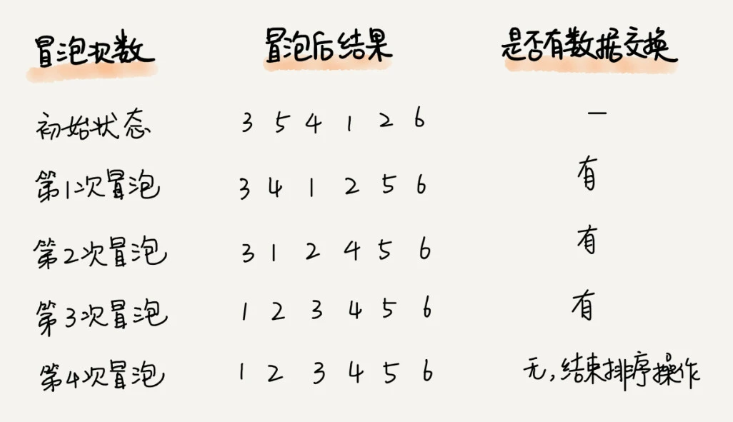

#### 代码实现

```js
// 冒泡排序，a表示数组，n表示数组大小
public void bubbleSort(int[] a, int n) {
  if (n <= 1) return;

 for (int i = 0; i < n; ++i) {
    // 提前退出冒泡循环的标志位
    boolean flag = false;
    for (int j = 0; j < n - i - 1; ++j) {
      if (a[j] > a[j+1]) { // 交换
        int tmp = a[j];
        a[j] = a[j+1];
        a[j+1] = tmp;
        flag = true;  // 表示有数据交换
      }
    }
    if (!flag) break;  // 没有数据交换，提前退出
  }
}
```

#### 分析

- 冒泡的过程只涉及相邻数据的交换操作，只需要常量级的临时空间，所以它的空间复杂度为 O(1)，**冒泡排序是一个原地排序算法**。

- 在冒泡排序中，只有交换才可以改变两个元素的前后顺序。为了保证冒泡排序算法的稳定性，当有相邻的两个元素大小相等的时候，不做交换，相同大小的数据在排序前后不会改变顺序，所以**冒泡排序是稳定的排序算法**。

- 最好情况下，要排序的数据已经是有序的了，只需要进行一次冒泡操作，就可以结束了，所以**最好情况时间复杂度是 O(n)**。而最坏的情况是，要排序的数据刚好是倒序排列的，需要进行 n 次冒泡操作，所以**最坏情况时间复杂度为 O(n^2)**。

  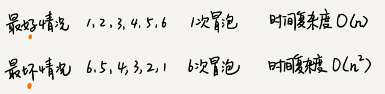

  平均时间复杂度就是加权平均期望时间复杂度，分析的时候要结合概率论的知识。

  对于包含 n 个数据的数组，这 n 个数据就有 n! 种排列方式。不同的排列方式，冒泡排序执行的时间肯定是不同的。比如我们前面举的那两个例子，其中一个要进行 6 次冒泡，而另一个只需要 4 次。如果用概率论方法定量分析平均时间复杂度，涉及的数学推理和计算就会很复杂。这里还有一种思路，通过**“有序度”**和**“逆序度”**这两个概念来进行分析。

  还是拿前面举的那个冒泡排序的例子来说明。要排序的数组的初始状态是 4，5，6，3，2，1 ，其中，有序元素对有 (4，5) (4，6)(5，6)，所以有序度是 3。n=6，所以排序完成之后终态的满有序度为 n\*(n-1)/2=15。

  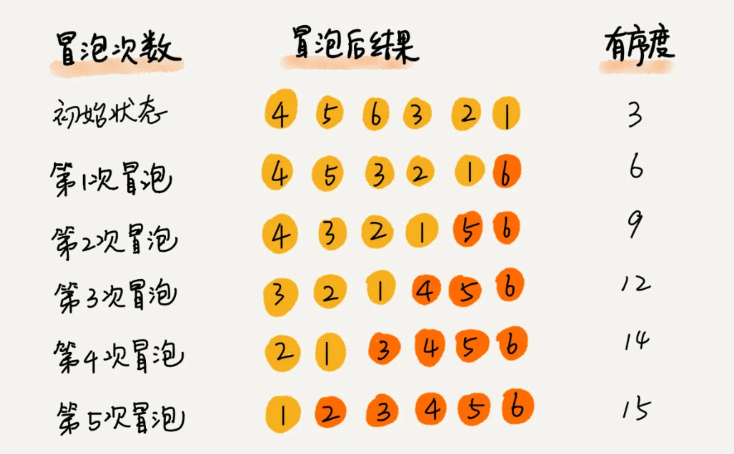

  冒泡排序包含两个操作原子，**比较和交换**。每交换一次，有序度就加 1。不管算法怎么改进，交换次数总是确定的，即为逆序度，也就是 n\*(n-1)/2–初始有序度。此例中就是 15–3=12，要进行 12 次交换操作。

  对于包含 n 个数据的数组进行冒泡排序，平均交换次数是多少呢？最坏情况下，初始状态的有序度是 0，所以要进行 n\*(n-1)/2 次交换。最好情况下，初始状态的有序度是 n\*(n-1)/2，就不需要进行交换。可以取个中间值 n\*(n-1)/4，来表示初始有序度既不是很高也不是很低的平均情况。

  **换句话说，平均情况下，需要 n\*(n-1)/4 次交换操作，比较操作肯定要比交换操作多，而复杂度的上限是 O(n^2)，所以平均情况下的时间复杂度就是 O(n^2)。**

  这个平均时间复杂度推导过程其实并不严格，但是很多时候很实用，毕竟概率论的定量分析太复杂，不太好用。等讲到快排的时候，还会再次用这种“不严格”的方法来分析平均时间复杂度。

  

### 插入排序

往一个有序的数组里面添加一个新的数据后，如何继续保持数据有序呢？只要遍历数组，找到数据应该插入的位置将其插入即可。

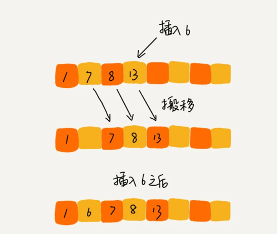

动态地往有序集合中添加数据，可以通过这种方法保持集合中的数据一直有序。

插入排序就是借鉴的这个思想，首先，将数组中的数据分为两个区间，已排序区间和未排序区间。初始已排序区间只有一个元素，就是数组的第一个元素。插入算法的核心思想是取未排序区间中的元素，在已排序区间中找到合适的插入位置将其插入，并保证已排序区间数据一直有序。重复这个过程，直到未排序区间中元素为空，算法结束。

如图所示，要排序的数据是 4，5，6，1，3，2，其中左侧为已排序区间，右侧是未排序区间。

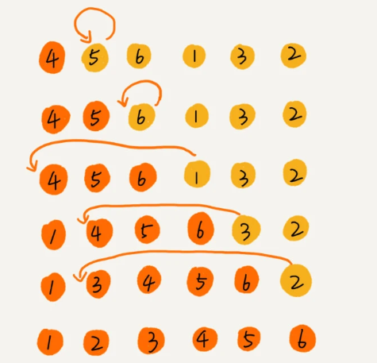

插入排序包含两种操作，一种是元素的比较，一种是元素的移动。当需要将一个数据 a 插入到已排序区间时，需要拿 a 与已排序区间的元素依次比较大小，找到合适的插入位置。找到插入点之后，我们还需要将插入点之后的元素顺序往后移动一位，这样才能腾出位置给元素 a 插入。

对于不同的查找插入点方法（从头到尾、从尾到头），元素的比较次数是有区别的。但对于一个给定的初始序列，移动操作的次数总是固定的，就等于逆序度。

为什么说移动次数就等于逆序度呢？拿刚才的例子画了一个图表。满有序度是 n\*(n-1)/2=15，初始序列的有序度是 5，所以逆序度是 10。插入排序中，数据移动的个数总和也等于 10=3+3+4。

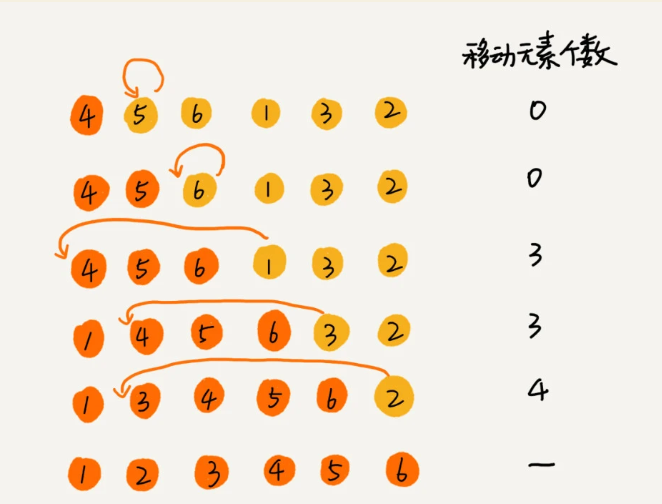

#### 代码实现

```js
// 插入排序，a表示数组，n表示数组大小
public void insertionSort(int[] a, int n) {
  if (n <= 1) return;

  for (int i = 1; i < n; ++i) {
    int value = a[i];
    int j = i - 1;
    // 查找插入的位置
    for (; j >= 0; --j) {
      if (a[j] > value) {
        a[j+1] = a[j];  // 数据移动
      } else {
        break;
      }
    }
    a[j+1] = value; // 插入数据
  }
}
```

#### 分析

- 从实现过程可以很明显地看出，插入排序算法的运行并不需要额外的存储空间，所以空间复杂度是 O(1)，插入排序是一个原地排序算法。

- 在插入排序中，对于值相同的元素，可以选择将后面出现的元素，插入到前面出现元素的后面，这样就可以保持原有的前后顺序不变，所以插入排序是稳定的排序算法。

- 如果要排序的数据已经是有序的，我们并不需要搬移任何数据。如果我们从尾到头在有序数据组里面查找插入位置，每次只需要比较一个数据就能确定插入的位置。所以这种情况下，最好是时间复杂度为 O(n)。注意，**这里是从尾到头遍历已经有序的数据。**

  如果数组是倒序的，每次插入都相当于在数组的第一个位置插入新的数据，所以需要**移动**大量的数据，所以最坏情况时间复杂度为 O(n^2)。

  在数组中插入一个数据的平均时间复杂度是 O(n)。所以，对于插入排序来说，每次插入操作都相当于在数组中插入一个数据，循环执行 n 次插入操作，所以平均时间复杂度为 O(n^2)。

### 选择排序

选择排序算法的实现思路有点类似插入排序，也分已排序区间和未排序区间。但是选择排序每次会从未排序区间中找到最小的元素，将其放到已排序区间的末尾。

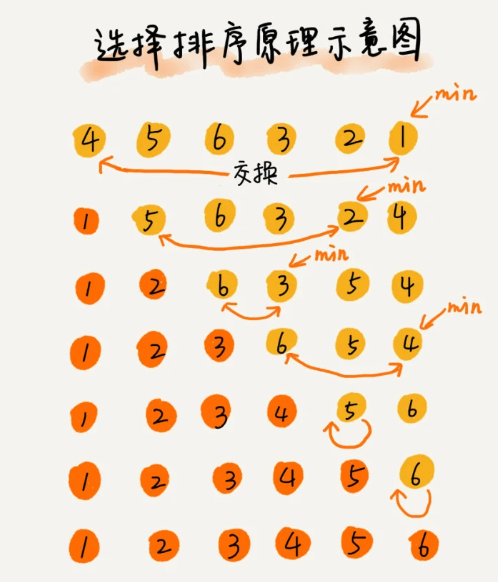

#### 分析

- 选择排序空间复杂度为 O(1)，是一种原地排序算法。选择排序的最好情况时间复杂度、最坏情况和平均情况时间复杂度都为 O(n^2)
- 选择排序是一种**不稳定**的排序算法。从前面画的那张图中可以看出来，选择排序每次都要找剩余未排序元素中的最小值，并和前面的元素交换位置，这样破坏了稳定性。比如 5，8，5，2，9 这样一组数据，使用选择排序算法来排序的话，第一次找到最小元素 2，与第一个 5 交换位置，那第一个 5 和中间的 5 顺序就变了，所以就不稳定了。正是因此，相对于冒泡排序和插入排序，选择排序就稍微逊色了。

**冒泡排序和插入排序的时间复杂度都是 O(n2)，都是原地排序算法，为什么插入排序要比冒泡排序更好？**

冒泡排序和插入排序不管怎么优化，素交换的次数都是一个固定值，是原始数据的逆序度。但是，从代码实现上来看，冒泡排序的数据交换要比插入排序的数据移动要复杂，冒泡排序需要 3 个赋值操作，而插入排序只需要 1 个。来看这段操作：

```js
冒泡排序中数据的交换操作：
if (a[j] > a[j+1]) { // 交换
   int tmp = a[j];
   a[j] = a[j+1];
   a[j+1] = tmp;
   flag = true;
}

插入排序中数据的移动操作：
if (a[j] > value) {
  a[j+1] = a[j];  // 数据移动
} else {
  break;
}
```

把执行一个赋值语句的时间粗略地计为单位时间（unit_time），然后分别用冒泡排序和插入排序对同一个逆序度是 K 的数组进行排序。用冒泡排序，需要 K 次交换操作，每次需要 3 个赋值语句，所以交换操作总耗时就是 3\*K 单位时间。而插入排序中数据移动操作只需要 K 个单位时间。

所以，虽然冒泡排序和插入排序在时间复杂度上是一样的，都是 O(n2)，但是如果我们希望把性能优化做到极致，那肯定首选插入排序。

插入排序的优化算法：希尔排序。

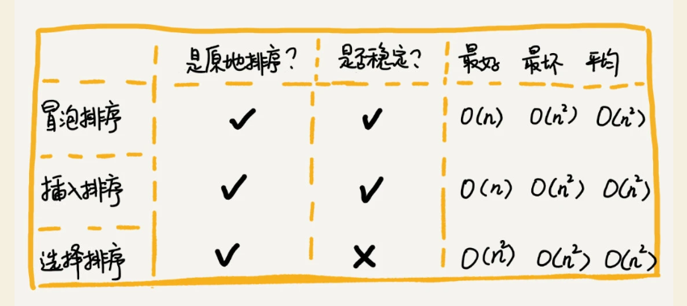

实际开发中，冒泡排序和选择排序很少应用，插入排序算法相对较多。这三种排序算法，实现代码都非常简单，对于小规模数据的排序，用起来非常高效。但是在大规模数据排序的时候，这个时间复杂度还是稍微有点高。

思考：今天讲的几种排序算法，都是基于数组实现的。如果数据存储在链表中，这三种排序算法还能工作吗？如果能，那相应的时间、空间复杂度又是多少呢？

**如何在 O(n) 的时间复杂度内查找一个无序数组中的第 K 大元素？**

### 归并排序

归并排序（Merge Sort）：要排序一个数组，先把数组从中间分成前后两部分，然后对前后两部分分别排序，再将排好序的两部分合并在一起，在进行一次排序，就能完成。（**分治思想**）

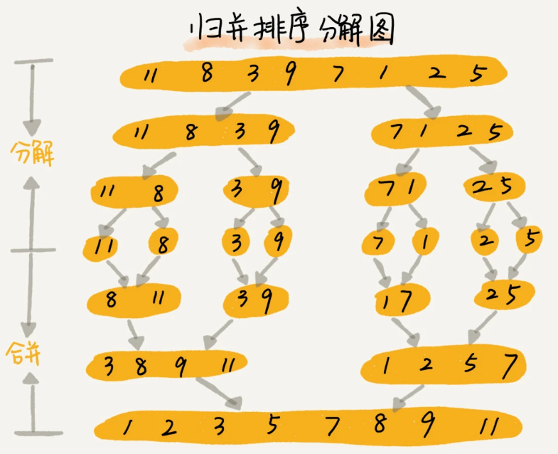

分治思想跟递归思想很像，分治是一种解决问题的处理思想，递归是一种编程技巧。

归并排序用的是分治思想，可以用递归来实现。

先写出归并排序的递推公式：

```
递推公式：
merge_sort(p…r) = merge(merge_sort(p…q), merge_sort(q+1…r))

终止条件：
p >= r 不用再继续分解
```

下标 q 等于 p 和 r 的中间位置，也就是 (p+r)/2。当下标从 p 到 q 和从 q+1 到 r 这两个子数组都排好序之后，再将两个有序的子数组合并在一起，这样下标从 p 到 r 之间的数据就也排好序了。

伪代码：

```js
// 归并排序算法, A是数组，n表示数组大小
merge_sort(A, n) {
  merge_sort_c(A, 0, n-1)
}

// 递归调用函数
merge_sort_c(A, p, r) {
  // 递归终止条件
  if p >= r  then return

  // 取p到r之间的中间位置q
  q = (p+r) / 2
  // 分治递归
  merge_sort_c(A, p, q)
  merge_sort_c(A, q+1, r)
  // 将已经有序的 A[p...q]和 A[q+1....r]合并成一个有序的数组，并且放入 A[p....r]。
  merge(A[p...r], A[p...q], A[q+1...r])
}
```

实现描述：

申请一个临时数组 tmp，大小与 A[p...r]相同。用两个游标 i 和 j，分别指向 A[p...q]和 A[q+1...r]的第一个元素。比较这两个元素 A[i]和 A[j]，如果 A[i]<=A[j]，我们就把 A[i]放入到临时数组 tmp，并且 i 后移一位，否则将 A[j]放入到数组 tmp，j 后移一位。、继续上述比较过程，直到其中一个子数组中的所有数据都放入临时数组中，再把另一个数组中的数据依次加入到临时数组的末尾，这个时候，临时数组中存储的就是两个子数组合并之后的结果了。最后再把临时数组 tmp 中的数据拷贝到原数组 A[p...r]中。

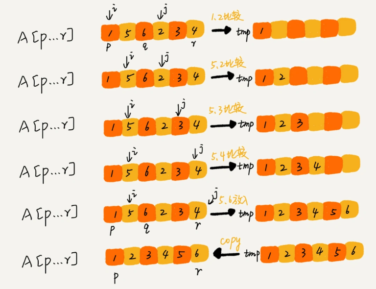

代码：

```js
/**
 * 归并排序
 */
const mergeArr = (left, right) => {
  let temp = [];
  let leftIndex = 0;
  let rightIndex = 0;
  // 判断2个数组中元素大小，依次插入数组
  while (left.length > leftIndex && right.length > rightIndex) {
    if (left[leftIndex] <= right[rightIndex]) {
      temp.push(left[leftIndex]);
      leftIndex++;
    } else {
      temp.push(right[rightIndex]);
      rightIndex++;
    }
  }
  // 合并 多余数组
  return temp.concat(left.slice(leftIndex)).concat(right.slice(rightIndex));
};

const mergeSort = (arr) => {
  // 当任意数组分解到只有一个时返回。
  if (arr.length <= 1) return arr;
  const middle = Math.floor(arr.length / 2); // 找到中间值
  const left = arr.slice(0, middle); // 分割数组
  const right = arr.slice(middle);
  // 递归 分解 合并
  return mergeArr(mergeSort(left), mergeSort(right));
};

const testArr = [];
let i = 0;
while (i < 10) {
  testArr.push(Math.floor(Math.random() * 1000));
  i++;
}

const res = mergeSort(testArr);
console.log(res);
```

可以利用哨兵简化编程。

#### 分析

- 归并排序稳不稳定关键要看 merge() 函数，也就是两个有序子数组合并成一个有序数组的那部分代码。在合并的过程中，如果 A[p...q]和 A[q+1...r]之间有值相同的元素，那我们可以像伪代码中那样，先把 A[p...q]中的元素放入 tmp 数组。这样就保证了值相同的元素，在合并前后的先后顺序不变。所以，归并排序是一个稳定的排序算法。

- 假设对 n 个元素进行归并排序需要的时间是 T(n)，那分解成两个子数组排序的时间都是 T(n/2)。我们知道，merge() 函数合并两个有序子数组的时间复杂度是 O(n)。所以，套用前面的公式，归并排序的时间复杂度的计算公式就是：

  ```
  T(1) = C；   n=1时，只需要常量级的执行时间，所以表示为C。
  T(n) = 2*T(n/2) + n； n>1
  ```

  通过这个公式，求解 T(n):

  ```js
  T(n) = 2*T(n/2) + n
       = 2*(2*T(n/4) + n/2) + n = 4*T(n/4) + 2*n
       = 4*(2*T(n/8) + n/4) + 2*n = 8*T(n/8) + 3*n
       = 8*(2*T(n/16) + n/8) + 3*n = 16*T(n/16) + 4*n
       ......
       = 2^k * T(n/2^k) + k * n
       ......
  ```

  当 T(n/2^k)=T(1) 时，也就是 n/2^k=1，得到 k=log2n 。我们将 k 值代入上面的公式，得到 T(n)=Cn+nlog2n 。如果我们用大 O 标记法来表示的话，T(n) 就等于 O(nlogn)。所以归并排序的时间复杂度是 O(nlogn)。 **从原理分析和伪代码可以看出，归并排序的执行效率与要排序的原始数组的有序程度无关，所以其时间复杂度是非常稳定的，不管是最好情况、最坏情况，还是平均情况，时间复杂度都是 O(nlogn)。**

- **归并排序不是原地排序算法**，这是因为归并排序的合并函数，在合并两个有序数组为一个有序数组时，需要借助额外的存储空间。

  如果继续按照分析递归时间复杂度的方法，通过递推公式来求解，那整个归并过程需要的空间复杂度就是 O(nlogn)。不过，类似分析时间复杂度那样来分析空间复杂度，这个思路对吗？实际上，递归代码的空间复杂度并不能像时间复杂度那样累加。最重要的一点，那就是，**尽管每次合并操作都需要申请额外的内存空间，但在合并完成之后，临时开辟的内存空间就被释放掉了**。在任意时刻，CPU 只会有一个函数在执行，也就只会有一个临时的内存空间在使用。临时内存空间最大也不会超过 n 个数据的大小，所以空间复杂度是 O(n)。

### 快速排序

快速排序算法（Quicksort），快排利用的也是分治思想。初看，它有点像归并排序，但是思路其实完全不一样。

原理：**如果要排序数组中下标从 p 到 r 之间的一组数据，我们选择 p 到 r 之间的==任意一个数据==作为 pivot（分区点）。遍历 p 到 r 之间的数据，将小于 pivot 的放到左边，将大于 pivot 的放到右边，将 pivot 放到中间。经过这一步骤之后，数组 p 到 r 之间的数据就被分成了三个部分，前面 p 到 q-1 之间都是小于 pivot 的，中间是 pivot，后面的 q+1 到 r 之间是大于 pivot 的。**

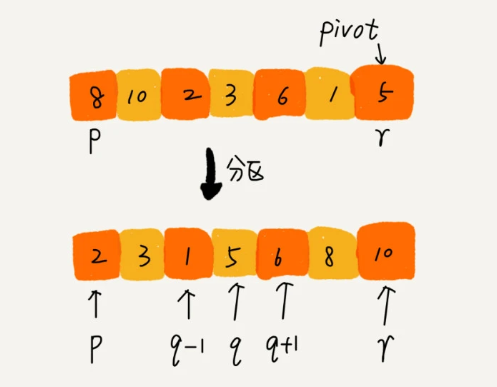

根据分治、递归的处理思想，可以用递归排序下标从 p 到 q-1 之间的数据和下标从 q+1 到 r 之间的数据，直到区间缩小为 1，就说明所有的数据都有序了。

用递推公式来将上面的过程写出来的话，就是这样：

```
递推公式：
quick_sort(p…r) = quick_sort(p…q-1) + quick_sort(q+1… r)

终止条件：
p >= r
```

伪代码：

```
// 快速排序，A是数组，n表示数组的大小
quick_sort(A, n) {
  quick_sort_c(A, 0, n-1)
}
// 快速排序递归函数，p,r为下标
quick_sort_c(A, p, r) {
  if p >= r then return

  q = partition(A, p, r) // 获取分区点
  quick_sort_c(A, p, q-1)
  quick_sort_c(A, q+1, r)
}
```

归并排序中有一个 merge() 合并函数，这里有一个 partition() 分区函数。partition() 分区函数实际上前面已经讲过了，就是随机选择一个元素作为 pivot（一般情况下，可以选择 p 到 r 区间的最后一个元素），然后对 A[p...r]分区，函数返回 pivot 的下标。

如果不考虑空间消耗的话，partition() 分区函数可以写得非常简单。我们申请两个临时数组 X 和 Y，遍历 A[p...r]，将小于 pivot 的元素都拷贝到临时数组 X，将大于 pivot 的元素都拷贝到临时数组 Y，最后再将数组 X 和数组 Y 中数据顺序拷贝到 A[p....r]。

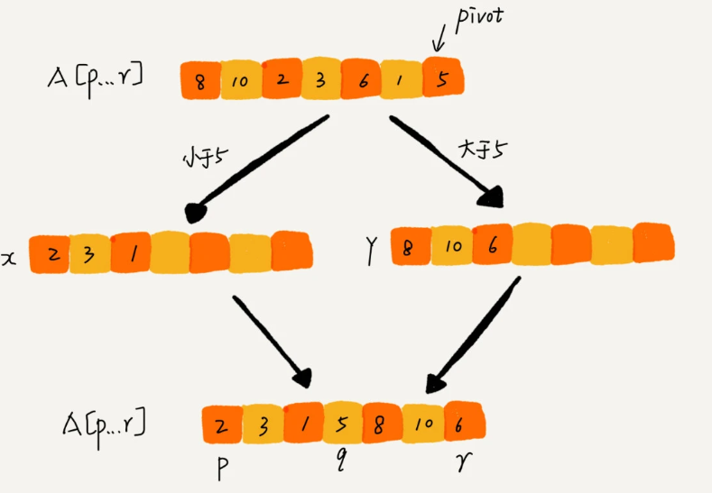

## 数量分析

### 快速幂算法

可以使用**快速幂算法**来快速求解 $34^{17} \bmod 6$。快速幂算法可以在对数级别的时间复杂度内求出一个数的幂，具体实现如下：

首先，将指数 $17$ 转化为二进制形式 $10001$。然后，从低位到高位遍历二进制数，每次将底数平方，如果当前二进制位是 $1$，则再乘上底数。最后，将乘积对 $6$ 取模即可。

具体实现过程如下：

1. 将指数转化为二进制形式：

   $17_{10} = 10001_{2}$

2. 从低位到高位遍历二进制数，每次将底数平方，如果当前二进制位是 $1$，则再乘上底数：

   $34^1 \equiv 4 \pmod{6}$

   $34^2 \equiv 4^2 \equiv 4 \pmod{6}$

   $34^4 \equiv 4^2 \equiv 4 \pmod{6}$

   $34^8 \equiv 4^2 \equiv 4 \pmod{6}$

   $34^{16} \equiv 4^2 \equiv 4 \pmod{6}$

   $34^{17} \equiv 34^{16} \times 34^1 \equiv 4 \times 4 \equiv 16 \equiv 4 \pmod{6}$

因此，$34^{17} \bmod 6 = 4$。

可以看到，使用快速幂算法可以在对数级别的时间复杂度内求出一个数的幂，比朴素的暴力算法更加高效。

快速幂算法（Fast Power Algorithm）是一种用于快速计算一个数的幂的算法，它可以在对数级别的时间复杂度内完成计算。

快速幂算法的核心思想是利用幂运算的性质，将指数进行二进制拆分，然后通过迭代平方来计算幂，从而达到快速计算幂的目的。具体来说，对于一个底数 $a$ 和一个指数 $n$，我们可以将指数 $n$ 表示为二进制形式：

$$n = b_k 2^k + b_{k-1} 2^{k-1} + \cdots + b_1 2^1 + b_0 2^0$$

其中 $b_i$ 表示二进制位上的数字。然后，我们可以通过平方和乘法来计算 $a^n$：

$$
a^n = a^{b_k 2^k + b_{k-1} 2^{k-1} + \cdots + b_1 2^1 + b_0 2^0} = a^{b_k 2^k} \times a^{b_{k-1}} 2^{k-1} \times \cdots \times a^{b_1 2^1} \times a^{b_0 2^0}
$$

对于每个 $i$，若 $b_i = 0$，则将当前底数 $a$ 平方；若 $b_i = 1$，则将当前底数 $a$ 平方，并乘以 $a^{2^i}$。最终得到的结果就是 $a^n$。

快速幂算法的时间复杂度为 $O(\log n)$，因为指数 $n$ 最多包含 $\log_2 n$ 个二进制位。因此，快速幂算法的效率比朴素算法要高得多，尤其是对于指数较大的情况。

下面是一个简单的 Python 实现：

```python
def fast_power(a, n, mod):
    res = 1
    while n > 0:
        if n & 1:
            res = (res * a) % mod
        a = (a * a) % mod
        n = n >> 1
    return res
```

其中，参数 $a$ 表示底数，$n$是指数，$mod$ 是模数（取余数的数），函数的返回值为 $a^n \bmod mod$。

### 一元二次方程

一个一元二次方程 $ax^2+bx+c$ 的符号取决于二次项系数 $a$ 的正负性，当 $a>0$ 时，该方程开口朝上，形如一个 U 形，此时函数存在最小值；当 $a<0$ 时，该方程开口朝下，形如一个倒 U 形，此时函数存在最大值。

可以通过求二次函数的导数来进一步判断最值点的性质。具体来说，如果二次函数的导数在最值点处为零，那么最值点就是该函数的极值点。如果导数在最值点的左侧为正，在右侧为负，则最值点为最大值点；如果导数在最值点的左侧为负，在右侧为正，则最值点为最小值点。

总之，判断一元二次方程的最大值最小值，需要注意以下两个方面：

1. 方程的 $a$ 系数的正负性，如果 $a>0$，则方程有最小值；如果 $a<0$，则方程有最大值。
2. 求解方程的导数，并判断导数在最值点处的正负性，以确定最值点的类型。

${(\sqrt{x}-\sqrt{\frac{c}{x}}})^2>=0$

这种求最小值的方法叫做“**完全平方公式**”，它是一种基本的代数技巧，用于将一个二次多项式转化为一个完全平方的形式。在这个问题中，应用完全平方公式可以得到：

$${(\sqrt{x}-\sqrt{\frac{c}{x}})}^2 = x - 2\sqrt{c} + \frac{c}{x} \geq 0$$

因为平方数不会小于零，所以上述不等式始终成立。为了满足这个不等式，需要使 $x - 2\sqrt{c} + \frac{c}{x} \geq 0$，这可以通过求解函数 $f(x) = x - 2\sqrt{c} + \frac{c}{x}$ 的最小值来实现。最小值的求解可以使用微积分的方法，即求出 $f'(x)$，令其等于零，解出 $x$，然后验证此时 $f(x)$ 的确为最小值。

求解一元二次方程的最小值，可以利用以下三种方法：

1. 完成平方与配方法

将一元二次方程 $ax^2+bx+c$ 转化为 $a(x+\frac{b}{2a})^2+(\frac{4ac-b^2}{4a})$ 的形式，其中 $\frac{4ac-b^2}{4a}$ 就是该方程的最小值。这种方法的优点是简单易懂，但需要一定的代数技巧。

1. 求导数法

求解一元二次方程最小值，可以先对其求导数，然后令导数等于零，解出 $x$ 的值。这个 $x$ 值就是该二次函数的极小值点，也就是最小值点。需要注意的是，要判断这个点是否为全局最小值点，可以通过求二次函数的二阶导数来判断。这种方法需要一定的微积分知识，但可以求解更复杂的函数的最小值。

1. 完全平方公式法

将一元二次方程 $ax^2+bx+c$转化为 $a(x-h)^2+k$ 的形式，其中 $(h,k)$ 就是该二次函数的顶点。顶点就是该函数的最小值点。这种方法需要一定的代数技巧，但可以直接得到最小值点的坐标。

需要注意的是，以上三种方法都可以求解一元二次函数的最小值，但应根据实际情况选择合适的方法。如果方程比较简单，可以使用配方法或者完全平方公式法；如果方程比较复杂，可以使用求导数法。

求解一元二次方程的最大值，可以采用以下两种方法：

1. 完成平方与配方法

将一元二次方程 $ax^2+bx+c$ 转化为 $a(x+\frac{b}{2a})^2+(\frac{4ac-b^2}{4a})$ 的形式，其中 $\frac{4ac-b^2}{4a}$ 就是该方程的最大值。如果 $a<0$，则方程的最大值为 $\frac{4ac-b^2}{4a}$。这种方法需要一定的代数技巧，但可以直接得到最大值点的坐标。

1. 求导数法

求解一元二次方程最大值，可以先对其求导数，然后令导数等于零，解出 $x$ 的值。这个 $x$ 值就是该二次函数的极大值点，也就是最大值点。需要注意的是，要判断这个点是否为全局最大值点，可以通过求二次函数的二阶导数来判断。这种方法需要一定的微积分知识，但可以求解更复杂的函数的最大值。

需要注意的是，以上两种方法都可以求解一元二次函数的最大值，但应根据实际情况选择合适的方法。如果方程比较简单，可以使用配方法或者完全平方公式法；如果方程比较复杂，可以使用求导数法。

总之，判断一元二次方程的最大值最小值，需要注意以下两个方面：

1. 方程的 $a$ 系数的正负性，如果 $a>0$，则方程有最小值；如果 $a<0$，则方程有最大值。
2. 求解方程的导数，并判断导数在最值点处的正负性，以确定最值点的类型。


## 二叉树

### 基础知识

什么是树（tree）？

它是一种抽象的数据类型（ADT）或者数据结构，用于模拟具有树状结构性质的数据集合。它是通过n（n>0）个有限节点通过连接它们的边组成一个具有层次关系的集合。

树分为多种不同的树，当一个节点有多余两个的子节点的树，被称为多路树。而每个节点最多只能有两个子节点的树被称为二叉树。
