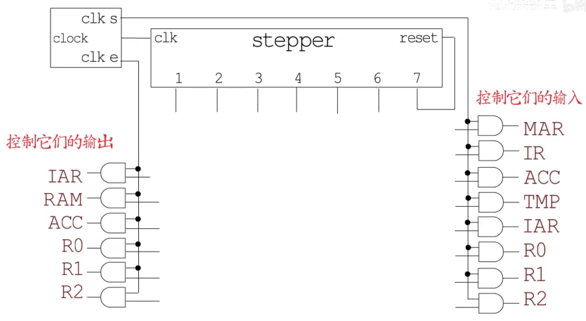
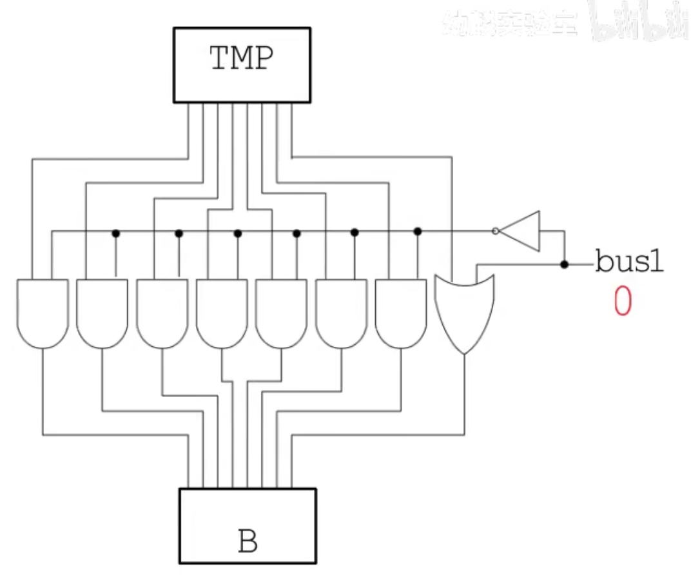
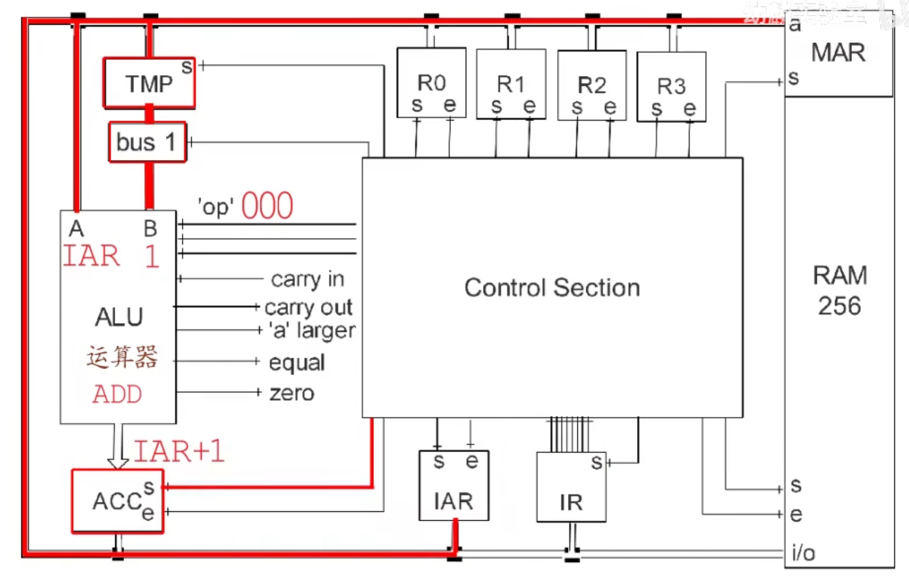
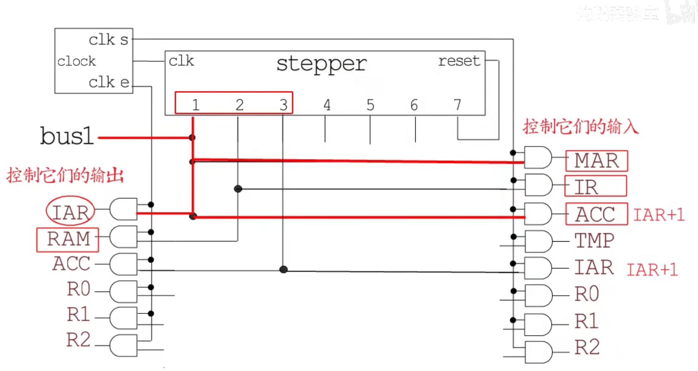

# 计算机科学概论

## 电路基础

物质的最小化学单位是原子，而原子由原子核（正电）和核外电子（负电）组成，核外电子在电场力的作用下可以移动，移动方向是从低电压的方向流向高电压的方向，而形成的电流方向和核外电子的移动方向相反。

电场的方向是从正极指向负极。不同的物质对最外层电子的约束能力不同，所以表现出来的导电性就不同（电阻不同）。单位时间内通过某个平面的电子的数量就表示电流。

欧姆定律：当电压一定，电阻越大，电流就越小。 U=IR

热的本质是组成物质的微观粒子因为运动而碰撞而震动的剧烈程度。

焦耳定律：发热功率等于电压乘以电阻，P=U\*R ， P=I^2\*R。

### 电子二极管

加热灯丝以发射电子。


二极管（只让电流从一个方向通过，另一个方向不能通过）用于电子电路中的整流（将交流电变为直流电）。

### 电子三极管


第三极通上正电，将明显加强原来的二极管中的电流强度，如果加上负电则会明显减弱原来二极管的电流强度。第三极的微小变化必定会引起另外两级之间的电流的巨大变化。**通过这个特性就可以放大信号，实现无线电的远距离传输。**

真空二极管和真空三极管就作为第一批电子工业的重要元器件被广泛使用。

真空电子管的缺点：

1. 体积大
2. 功耗高
3. 容易发生故障（是通过燃烧灯丝工作，灯丝容易烧断）

电子二极管的优点：

1. 面对电磁干扰，电子管有很强的抗干扰性，晶体管则不行

2. 电子管在温度发生较大变化时也可以工作良好，晶体管则不行

基于上面的种种原因，后面出现的晶体管，并逐渐取代了电子二极管。


### 晶体二极管

有的物质容易失去最外层电子（金属类物质），有些物质倾向于获得电子，同时不容易失去最外层电子（绝缘体类物质），而有的物质即不容易失去电子也不容易获得电子（半导体）。

常用半导体物质是 Si——硅，纯硅组成的物质被称为本征半导体，如果往纯净的硅中加入一些磷，磷的最外层 5 个电子，多出的电子容易移动，这就形成了 N 型半导体，如果在纯净的硅中加入最外层 3 个电子的硼，就组成了 P 型半导体。

当将 P 型半导体和 N 型半导体组织在一起后，在接触面中，电子会从高浓度的 N 型半导体中转移一部分到 P 型半导体中，这样 N 型半导体的接触面就因为缺少部分电子而显正电性，P 型半导体的接触面就因为富余部分电子而显负电性，这样就在接触面两端形成了电压，从而阻止电子的继续扩散。

由于两端电子浓度差的差异，导致两端有电子从 N 型半导体往 P 型半导体移动的倾向，同时由于电子的不断移动，又导致 N 型半导体端对电子有吸引力，最后会形成一个平衡，同时伴随一定的以为电子浓度差而带来的电压（电场）。这个内部的电场区域就称为 PN 节。

如果引入一个外部电场，该电场的电压方向和 PN 节的内部电场的电压方向一致，这样就能阻止更多区域的电子的扩散，也就形成了断路。反向引入一个外电场时，就会吸引更多区域的电子进行扩散，一旦外部电场的电压大于内部 PN 节形成的电场，这就形成了通路。

PN节的内电场一般需要0.7V的电压（导通电压）。


### 晶体三极管


上图中，无论怎么通电，电路都不会导通，因为有两个背对背的 PN 结。


中间的 2 号区域被做得很薄；1 号 N 区域被故意参杂了许多最外层 5 个电子的磷元素，导致电子浓度很高；一旦 1 号和 2 号直接通电打通 PN 结，则 1 号中的电子会瞬间大量涌入 2 号中，由于 2 号很薄，所以一下子很难快速消费掉这些电子；3 号被故意做得很大且电子浓度低一些，这时 2 号和 3 号之间就因为电子浓度差，导致 2 号中的电子因为扩散作用而扩散到 3 号中，由于 3 号接正极，所以电子能从这里流出。


可以理解位 2 号和 3 号之间通电，而 2 号的电子来源于 1 号，所以间接的 1 号和 3 号之间通电了。

由于 2 号很薄，消费来自 1 号的电子的能力有限，所以电流一般比较小，3 号由于空间大，吸收电子能力强，所以电流一般比较大。二号极小的信号改变就会导致 1 号电子涌入量的巨大变化，从而引起 1 号和 3 号之间电流的巨大变化。


### 场效应管

mos 管的场效应结构图


下面的半导体材料和 1，2，3 号金属之间有一个非导体的二氧化硅层，所以 2 号金属和下面的半导体材料是分开的，而 1 和 3 号则是和 N 型半导体直接连接的。

P 型和 N 型半导体之间有 PN 节，如果 1 和 2 都接到负极，而 3 号接到正极，则 3 号不能克服 PN 节而和 1 号导电。这是上图的情况整个电路就是关闭状态。

如果将 2 号电压换为正极，2 号的金属通过中间的二氧化硅层后，和下面的半导体材料形式一个电场，即和 2 号金属靠近的半导体材料的一侧的电子浓度高，如下图：


这样的结果导致上图右边的原来的 N 型半导体和 P 型半导体在靠近二号金属的部分的 N 和 P 就要互换了（反型层），在中间接近金属 2 的区域 P 型半导体的电子量多余了两侧的 N 型半导体，于是电子开始向 N 型半导体中扩散，具体是向 3 号金属一侧扩散，因为左侧接着电源的负极，会排斥电子。


左边的 N 型半导体因为链接负极，所有会有电子不断补充进来，以供应 3 号的电子需求。这样 1 号和 3 号在 2 号的控制下通电了。


最后一号和 3 号金属在 2 号的控制下形成了通路。


栅极的正负控制着电路的通阻，如果正电表示 1，负电表示 0，那就能在栅极上通过 0 和 1 控制电路的通与断。所以**场效应管目前已经成各类门电路，集成电路，芯片的基础结构。**

其他许多电路和元器件都是在晶体管的基础上以不同的结构组织起来实现的。


### 布尔代数

把逻辑推导进行了符号化，这和逻辑电路联系紧密。

在香农的论文中，将布尔代数应用到逻辑 电路系统中，继电器是一种电磁机械装置，利用电生磁的原理，通过线圈的通电去吸引导体导通电路。


电压和电位：电压是绝对的，电位是相对的。一般在研究电路中，为了简化问题，一般会选择一个明显的电位参考点并默认他的电位是 0，分析电路时，各个点的电位都参考选择的那个点。比如电源的负极就是一个很好的零电位点，电路设计中一般将所有的零电位汇集的点称为接地点。

在电路中，一般将电位位 0 的参考点称为地（GND），连接这一点的线就是接地线。

在数字电路中，其实并不需要关系电压具体是多少，需要做的是把通电和断电区分开来，可以具体多少到多少电压代表通电，多少到多少代表断电。一般把有电通过数字 1 表示，没电通过数字 0 表示。

### 逻辑非

输入 1，输出 0

输入 0，输出 1


晶体三极管表示的逻辑非电路：


### 逻辑与

输入 1 和 1，输出 1

输入 1 和 0，输出 0

输入 0 和 0，输出 0


晶体二极管表示的逻辑与电路：


A:0, B:0 => Y:0

A:1, B:0 => Y:0

A:0, B:1=> Y:0

A:1, B:1 => Y:1


### 逻辑或

输入 0 和 0，输出 0

输入 1 和 0，输出 1

输入 1 和 1，输出 1


晶体二极管表示的逻辑或电路：


### 逻辑与非

图中的小圆圈可以表示在原来逻辑的计算结束后，再做一下非运算输出。

输入 1 和 1，输出 0

输入 1 和 0，输出 1

输入 0 和 0，输出 1


### 逻辑或非

输入 1 和 1，输出 0

输入 1 和 0，输出 0

输入 0 和 0，输出 1


### 逻辑异或

两个输入不同，则输出为 1，两个输入相同，则输出为 0。


#### 半加器

**异或门可以用来作加法运算。**

在一个异或逻辑门电路中，这个逻辑门只能处理一比特的数，所以 1 加 1 虽然在二进制中等于 10，但是异或门只能表示一位，而无法处理进位而选择丢弃。 二进制的的进位发生在两个都是 1 的时候，这就是一个与逻辑门。把两个输入通过与门运算作为一个进位输出。


下图中，虽然我们的电路具有输出进位的功能。但是并不具备接受进位的功能。低位的进位 1 并没有被高位接收，这种加法器叫**半加器**。


#### 全加器

支持接收进位的加法器——全加器。


在用门电路设计一个数字电路系统时，一般的步骤是：

1. 先明确电路的输入输出功能 


2. 画出该系统的真值表，也就是列举所有输入和输出之间的对应关系 


3. 根据真值表推导得出电路的逻辑函数

> 在逻辑代数中用 •（点乘符号）代表逻辑与
>
> 用 +（加号）代表逻辑或
>
> 用 ⊕ 表示异或逻辑
>
> 用 X` 表示 X = 0 的状态 ，X 表示 X = 1 的状态

找出上图**本位**输出 Y 为 1 时，输入的情况，就可以得到输出 Y 关于输入的逻辑代数表达式：

```
Y = Ci`•A`•B + Ci`•A•B` + Ci`•A`•B` +  Ci`•A•B
```

找出上图**进位**输出 Co 为 1 时，输入的情况，就可以得到输出 Y 关于输入的逻辑代数表达式：

```
Co = Ci`•A•B + Ci•A`•B + Ci•A•B` +  Ci•A•B
```

4. 用逻辑数学公式化简上面的函数或者用卡诺图化简该函数
5. 用化简后的逻辑关系函数设计连接门电路


上图，输出 Y 是输入 A，B 异或的结果再异或上进位 Ci。进位输出 Co 的结果是 A 与上 B 再或上 进位 Ci 与上 A 和 B 异或的结果。

**上面就是用逻辑代数的定理公式以及卡诺图去化简逻辑函数，从而简化电路的过程。**


数字电路也有一套自己的数学工具和通用的精细化设计方法。


 

#### 全减器


减法器往往不需要单独设计电路，，可以在加法器的基础上设计一套算法实现减法器的功能。


### 同或门


上面演示了同或门和异或门为了方便理解使用了 10MOSFET，在实际设计电路的过程中，一般会用传输门来设计同或门和异或门。

借助传输门实现的异或门电路图：


z


借助传输门实现的同或门电路图：


讲解逻辑门的目的：

逻辑门是构成运算单元的最基本结构，比如用一个异或门加一个与门就可以构成一个半加法器，如图：


半加法器可以计算一位二进制的加法。

用两个异或门加两个与门加一个或门就可以组成全加法器，如图：


把两个全加法器组合在一起就能实现两位二进制的加法器，如图：


四个全加法器组合实现四位二进制数的加法器，如图：


香农定义 bit 作为信息的度量单位。

### 比特存储装置

通过一个设置位开关，控制了 1 比特信息的输入。简易符号：


in：表示输入

out：表示输出

set：负责控制输入能否被被设置到输出

首先初始 out 的值为 0，然后将 in 的状态设置为 1，将 set 设置位打开，1 表示打开，0 表示关闭。 如此设置好后，最后由输入 in 1 得到输出 out 为 1，然后 c 被重新设置为 0，out 仍然是 1。 这就得到输入的和输出是一样的值。


上图导致 out 被重置为 1：


当输入 in 为 0 时，out 继续用前上面设定的 1：


上图最终导致 out 值为 0


将设置位 set 关闭（即设置值为 0 的情况），且假设 out 原来的状态就为 0，最后 out 的值并不会变化。


### 字节存储装置

将 8 个比特存储装置串起来，通过一个设置位同时控制 8 个比特的输入，那就可以一次控制一个字节的输出，即字节存储装置。


上图字节存储装置只能控制是否允许输出。

### 字节输出装置


上图中如果 e 位打开（设置为 1），则 8 位输入经过 8 个与门后将保持原值输出。如果 e 位关闭（设置为 0），则无论输出值为多少，都将输出 0。所以这种装置可以用于控制输出。

### 将字节存储和字节输出装置组合


**就得到一个即能控制是否输入，也能控制是否输出的装置——寄存器**。上图时一个 8 位寄存器。简易画法：


将输入输出的一组 8 根线，简化为一根总线。


上图是在总线上连接的三个寄存器。

将寄存器 R1 中存储的状态输出到寄存器 R3，首先，先将 R1 的 e 位打开，R1 中存储的状态就输出当总线中，在将 R3 的输入 S 打开，就将总线设置到了 R3，随后先关闭 R3 的输入，再关闭 R1 的输出，这样就将 R1 和 R3 设置为了相同的状态，也就是所谓的将字节从 R1 移动到了 R3。


**后续讲解怎样选择特定的寄存器，并控制该寄存器的输入和输出（即内存的工作原理）。**

现在有两行两列共 4 个寄存器，通过总线相连，这四个寄存器有各自的输入控制位和输出控制位，现在的需求是明确控制某个寄存器，打开或者关闭它的输入或者输出控制位，以选中 R1 的输入控制为例子（即将 R1 的 S 位设为 1）：


但是 R1 的输入是否到打开有两个条件，而且两个条件必须都成立才行，所以适合在 R1 的 S 位前放置一个与门，一个输入来自 CPU 的状态，另一个输入来自寄存器的选中状态，而是否选中某个寄存器也有两个条件（即寄存器所在行被选中和寄存器所在列被选中），而且必须两个条件都满足，才能表示选中指定位置的寄存器，所以也适合用于个与门。参考下图：


这样总线的状态就被设置到 R1 寄存器中了。

即控制输入也控制输出的示图：


打开 R3 的输出：


打开 R2 的输出：


### 编码器

编码器一般用来将多路通道信息转换成二进制数编码，用于后续电路的分析。

### 译（解）码器

译码器一般将特定位数的二进制数字编码翻译为不同的信号输出。

**选择特定行和列寄存器。**

通过解码器选择特定行和列寄存器。解码器的作用就是根据不同的输入状态对应不同的输出状态，这样就可以通过解码器的输入，来控制哪一个输出状态是 1。

2\*4 解码器：


3\*8 解码器：


有了解码器就可以定位到任意一个寄存器，从而实现寄存器到总线，总线到寄存器，以及寄存器到寄存器的字节移动，这种随机地址存储器，就是所谓的 RAM（Random Access Memory）——内存。

**解码器也需要输出，所以还有提供一个提供行号和列号的寄存器。**即内存地址寄存器（Memory Address Redigter）

案例：

z


使用逻辑门进行算数或者逻辑运算，尝试一步步的执行指令 ——CPU。

### CPU

通过一个逻辑与可以得到两个比特的逻辑与运算结果：


如果想获得两个字节的逻辑与运算结果，可以把 8 的逻辑与门组合起来实现。

两个字节的逻辑与运算：


两个字节的逻辑或运算：


两个字节的逻辑异或运算：


一个字节的逻辑非运算：


移位运算：


#### 加法器

二进制的加法计算某一位的相加结果时，需要考虑三个二进制数字的逻辑运算结果，这三位分别是两个二进制数的本位和 两个二进制数的前一位的相加结果（进位）的值；同时记录相加的结果值和得到输出的进位值。


情况：

1. carry in 为 0 ，当 a 和 b 相同时，sum 为 0 ；不同时 sum 为 1 ，对应 a 和 b 的异或逻辑

2. carry in 为 1，当 a 和 b 的异或逻辑为 1 时，sum 为 0；当 a 和 b 的异或逻辑为 0 时，sum 为 1

   考虑 carry out

3. carry in 为 0，当 a 和 b 都为 1 时，carry out 为 1

4. carry in 为 1，当 a 和 b 的异或逻辑为 1 时，carry out 为 1；或者当 a 和 b 的与逻辑为 1 时，carry out 为 1

对应的逻辑电路图：


比特加法器：


一字节的加法器：


#### 比较器

比较两个字节的大小。当比较两个字节时，会从两个的高位比特开始，上一位 bit 相等则继续比较下一位。

逻辑门电路图：


判断一个字节是否全为零：


#### ALU


运算器


虽然上图右侧的 ALU 工作时，每种运算逻辑电路都会同时接收到相同的输入，也都会工作，但上图的 3\*8 解码器，每次会根据输入，选择唯一的一个逻辑电路的运算结果，打开输出电路，将结果作为输出。


接下来，在该内存中存储一些操作指令（二进制机器码），并规定每种操作对应的二进制编码。

IAP寄存器：存储下一步执行的指令的内存地址（在RAM中位置）。

IR寄存器：存储当前要被执行的计算机指令二进制码。

Control Section：就是CPU中的控制器，里面的布线十分复杂，可以识别指令寄存器（IR）存储的二进制码是什么类型的指令，并将指令处理后进行对其他寄存器进行输入输出控制或者将指令解析后传递ALU进行运算。

即使是一个简单指令，可能也需要经过好几个操作步骤才能完成。

比如，执行LOAD R1 R2。寄存器R1中存储了RAM中的一个内存地址，该内存地址中存储了数据， LOAD指令负责将R1中的内存地址中的数据加载到R2中，首先，会将打开R1寄存器的输出，和MAR的输入，将R1中的地址数据通过总线，存放到MAR中，有解码器解析内存地址数据，选中指定的内存，同时通过控制器让该内存地址的存储器的数据输出到数据总线中，然后打开IR的寄存器输入，将指令同步到IR寄存器中，然后在通过控制器，进过类型的控制，将IR寄存器中的数据同步到R2中。

这中间有一些列一步步的操作，这就依靠不步进器实现的。


控制器对指令寄存器中存储的指令进行解析。

#### 步进器


借助它组装步进器。


M表示存储一比特信息的逻辑电路，通过set能控制该装置能不能将out和in进行同步。

CLK链接这这些比特装置的输入控制位，reset通过非门链接第一个比特装置的输入位，后面前一个比特装置的输出out连接到下一个比特装置的输出in，最初这些M存储的状态都是0。二号比特装置初始状态是0，所以经过非门后，输出为1，所以初始状态时，setp1是打开的，如下图：


当clk第一次变为1时，所有偶数序号比特装置的输入控制打开


 

但是二号装置没有变化，setp1仍旧是打开的，接下来clk变为0，所有偶数序号的比特装置的输入控制都关闭，奇数为的打开


1号存储装置的状态变为1，2号因为输入控制位关闭，所有2号的状态不受影响，所以在时钟滴答的第一个周期内，setp1处于打开状态。


在第二个时钟周期中，clk再次变为1，偶数号的装置输入都又被打开，这次2号装置接受到1号装置的输出1，这导致setp1被关闭，而4号装置的状态是0，所以setp2被打开，clk再次变为0时，奇数位装置的输出被打开，3号装置接受到2号的输出1，还是不影响4号的输出，setp2仍旧是打开的。


如此往复 ，下个时钟周期关闭step2，开发哦step3，所以这个步进器可以按照顺序在每个时钟周期内打开一个step输出，而关闭其他。当步进器走到最后的第12个装置后，第12号的out连接到reset，将reset置为1。


这时下面的或门的输出都为1，导致所有比特装置的输入都打开，然后一个接一个的被重置状态为0，恢复到初始setp1被打开的状态。


上面就是步进器的工作原理。

下图是步进器的图形表示：


如果在步进器的每个setp中控制一些寄存器的输入和输出，就可以一步步的实现编程逻辑。


针对下图的这两个时钟装置：


将时钟装置中的线路延长，让clk d 的时钟周期的变化往后延迟，如果将它们组合到一起来控制输入和输出，clk和clk d都为1时，输入控制位才会被打开，而它们两者只要有任何一位为1时，都会打开输出控制位，所以输出控制位会先于输入控制位打开，并且在输入控制位关闭后才会关闭输出控制。

这样做的目的：**在移动字节时，要先将源寄存器中的内容输出到总线，然后才可以打开目的寄存器的输入，而且要先关闭目的寄存器的输入，再关闭源寄存器的输出。**


现在将时钟的输出控制位连接到寄存各个输出设置，将时钟的输入控制位连接到各个寄存器的输入设置，这样就能保证寄存器的输出控制位先于输入控制位打开，输入控制位先于输出控制位关闭。CPU中的控制器就是利用步进器控制一团团的布线完成各种操作指令。




假如有这样一组布线，在setp1打开时，打开指令地址寄存取（IAR）的输出和内存地址寄存器的（MAR）的输入，指令地址寄存器存储的是下一条待执行指令的内存所在地址，将这个地址存入内存地址寄存器（MAR）；在setp2中，将setp1中的指令地址寄存器中通过解码器解码选中的内存（RAM）中存放的指令输出到指令寄存器（IR）中，这样就完成了一次指令的加载。

问题：**指令地址寄存器怎么在加载完一条指令后，就存储下一条指令所在的内存地址？**

这就要用到上图中的ACC和TMP寄存器。

ACC寄存器：用于存储运算器（ALU）的计算结果。

TMP寄存器：是一个没有输出控制位的寄存器，放到TMP中的数据就是要在ALU中使用的。

Bus1：它是一个比特位，如果bus1为0，经过非门后，TMP的高七位都会和1进行与运算，第一位和0进行或运算，则TMP的输出不会发生任何变化并且输出到运算器的输入；当bus1打开，即为1时，TMP高七位都于0进行与运算，则高七位都为0，第一位都和1进行或运算，输出1，所以无论TMP输出的是什么，在bus1打开时，输入到运算器的B的值都为1。



 而运算器（ALU）的operation默认存储的是000，选中加法运算，这样只要将指令地址寄存器，同时将bus1置为1，并打开ACC的输入，则运算器的输入A就是总线上的指令内存地址（指令地址寄存器的内容），运算器的输入B就一定是1，此时ACC会接受到家发器的运算结果，即内存地址加1后的下一个内存地址，如下图：



对应到控制器中布线，如下图：

步进器中step1为1时，控制IAR的输出和bus1，并打开内存地址寄存器（MAR）和ACC的输入，这样指令地址寄存器中的数据就输出到总线并设置到MAR中，而总线上的IAR和打开的bus1会经过运算器进行加法运算存储到ACC中；

在step2中，将RAM输出到IR中（即将内存地址中的指令放到指令寄存器中）；

在step3中，将ACC输出到IAR中，IAR中存储的就是相邻的下一个内存地址。



对于每一条指令而言，前三步都是这样布线的，所以只能在4，5，6中实现指令的对应操作。


时钟装置，周期性变化，借助时钟装置就可以组装步进器

CPU 的最基本的结构：MOSFET（金属氧化物半导体场效应晶体管）

逻辑门

运算单元

存储单元

时钟同步

从最底层理解 CPU 内部怎么利用电进行计算以及 CPU 是如何通过一个个的逻辑门电路搭建和制造的。

对 CPU 的工作原理和制作生产过程有了解。

#### 晶体二极管


在 N 型半导体中，电荷的载体（载流子）是电子

在 P 型半导体中，电荷的载体（载流子）是空穴


x


#### MOSFET（晶体三极管）

基于二极管制作的用电压控制的开关。

工作原理：


上图得到一个可以通过电压控制电路通断的装置。当给中间的电极加上正电，当电压高于阈值电压后，mosfet 可以导通，低于阈值电压则不能导通。这就是 mosfet 的工作原理。

**上图中是在高于阈值电压时电路导通，低于阈值电压时电路断开的晶体三极管叫——NMOS**


**上图中是在高于阈值电压时电路断开，低于阈值电压时电路导通的晶体三极管叫——PMOS**

电路图中的表示符号：


将 NMOS 和 PMOS 的漏极连接在一起，就得到了 CMOS：


如果把 G 级连接起来作为输入端，两个 D 极的作为输出端 B，如下图：


VDD：供电电压

VSS：接地电压

上图就组成了一个非门电路，当 A 输入 正向偏压，电压高于 NMOS 的阈值电压时，PMOS 不导通，NMOS 导通，相当于 B 端直接和接地电压（低电压）连接，是相对低电压；当 A 中输入反向偏压时， PMOS 导通，NMOS 不导通，相当于 B 直接和供电电压相连接，输出的就是相对高压。


如果现在规定相对高压代表 1，相对低压代表 0，上面的电路就是对输入结果取反，即非门逻辑。


MOSFET 是构成逻辑门电路最基本的单元，当把各种逻辑门组合在一起就可以形成运算端单元，这就是 CPU 的雏形，如果再加上各种存储单元和其他电路就构成了完整的 CPU。

#### CPU 计算加法

通过 NMOS 和 PMOS 进行不同的连接与组合，就可以得到用于计算的逻辑门电路。

前置知识：

1. 二进制和十进制

十进制换算为二进制采用的是除 2 取余逆序排列法。


29=>11101

二进制转为十进制：


2. 本位和数 与 进位


本位和数：Sum，S

进位：Carry，C

如果只看本位的相加结果：


这个结果是异或门逻辑。因此，A+B 的本位和数 S 就是 A⊕B


如果只看进位的结果：


这个结果是异与逻辑。


用一个异或门来得到本位和数的值，用一个与门得到进位，就得到了一个可以计算一位二进制数的结构，如图：


z'z

半加法器没有进位输入，这就导致它只能计算一位二进制的加法，如果想计算多为二进制数的加法，比如 111+101，

第一位是 1+1，本位和数是 0，进位是 1，这是后需要将它们的进位 1 输入给第二位，计算第二位数时，本质上是在计算加数的第二位，被加数的第二位和第一位的进位这三个数的和，如图：


所以需要一个可以输入上一位进位的加法器，也就是具有三个输入的加法器，输出依旧是两个，本位和数和进位，**本位的结果可以先让 A 和 B 异或一次，在让这个异或输出和 C 异或一次。**对于进位，对于进位是 1 的情况，则需要 A,B,C 中至少又两个数是 1。


如果 ABC 中有至少 2 个 1 时，就让进位输出 1，方法一：

让 A•B A•C B•C


四位二进制全加法器：


这个加法器必须计算完低位的进位情况 和 和位情况才能算高位的，是串行的——形波进位全加法器，它的延迟很高。

并行进位全加法器：


#### CPU 计算减法

减去一个数等于加上这个数的负数。所以只需要将减数表示为负数的形式，然后用加法器执行加法运算就行，所以需要先了解二进制数的负数如何求得。

假设有一个可以存储和计算 4 位二进制数的计算机系统，那这个系统可以存储和计算的二进制数的范围就是 0000~1111，对应十进制数就是 0~15，这种直接将十进制转换为二进制的表示方法就简称为直接表示法，直接表示法的问题是无法表示负数。


而二进制数的特点是每一位数只可能是 0 或者 1，刚好可以表示正负两种状态，所以有一种表示法是用最高位来表示正负（符号位），0 代表正，1 代表负，其它位为数值位。这种表示正负的方法叫原码表示法：


原码表示法有一个问题：符号不同的数不能直接相加。


原码表示法表示的一个二进制数值是不能直接用于运算的，有一种方法可以表示清除负数的同时可以用于运算——**补码**

在一个 4bit 的计算机系统中，如果使用直接表示法，能表示的最小数是 0000，最大数是 1111，如果对 1111 加 1 就会变为一个 5bit 的数。但是由于这个系统只能容纳 4bit 的二级制数，第 5 位的 1 就溢出了，在系统中无法被表示，会被自动舍弃，所以最后的结果就是 0000。


对于存在溢出后重新回到 0 的模运算系统（上面的 4bit 计算机系统或者时钟）来说，加上一个负数和加上这个负数的补数是等价的。


原数每一位按位取反。


**把原数按位取反，然后再加 1 得到的二进制数和原数相加刚好是 0，那这个数和原数相加的数就是元数对应的负数。**——补码表示法

**在计算机中，正数的补码就是正数本身对应的二进制编码，而负数的补码就是负数对应的绝对值的原码取反后加一**


补码的最高位也代表正负，0 为正，1 为负。


和原码不一样的地方是，补码的符号位可以直接参与运算的。


### 正负数

#### 补码

八位二进制数 00000001 对应十进制下的 1，而-1 对应的二进制数则是和 00000001 相加为 00000000 的那个数（缘起性空）—— 11111111，相加的结果第九位是 1，后八位是 0，但是对于八位加法器而言（计算机的计算是需要硬件作为载体的），在 8 位加法器中，最高位向第九位进位的时候，因为没有第九个全加器，所以会被丢弃（溢出）。所以在 8 位二进制体系下 11111111 + 00000001 的结果就是 00000000。

将这种和1的二进制数相加后的结果湮灭为零的编码用来表示1的相反数-1。

基于正数，用和这个正数“互补（性空）”的编码定义负数的方式，称之为 **补码**。

负数的二进制数对应为： 该负数的绝对值对应的二进制数按位取反后再加一获得。——**补码**

减法可以看作正数和负数相加，所以可以利用补码的方式表示正负数，也就将加法和减法统一为了加法，所以计算机并不需要为减法计算单独设计一个减法器而导致电路设计上的复杂（规模和功耗）


#### 原码

用原码方式来表示正负数，在原码中，简单的把最高位作为符号位，0开头则表示正数，1开头则表示负数。原码表示的不足如下：


上面的情况的计算结果就是不对的。但是用补码的方式就能避免这个问题。


### 数据选择器


上图是一个 4 选 1 的数据选择器，当选择端为 00 时输出 A 路的输入，01 时输出 B 路的输入，其他情况类似，上图就是寻址的一种简单工作模型，通过数据选择控制引脚选择使用哪一路的数据，两个地址引脚就能实现对四个地址的选择，三个引脚能实现对 8 个地址的选择。

如果多路数据输入引脚连接着内存或者寄存器组，那么这个数据选择器就完成了对内存或者寄存器组的寻址功能。

### 实验

题目：在一个实验中，有八杯水有一杯是有毒的液体，同时还有 3 只小鼠，但是小白鼠在喝了有毒液体后 7 天后才会毒性发作，请问如何在一次周期内找到有毒的一杯水？

例子：七段数码管。

将电路中的二进制数字显示到七段数码管中，七个 LED 管随着不同的通电方式，显示出不同的符号或者数字


CMOS 管


对于上图，如果没有初始的触发信号，则输出是悬空状态。


上图在什么都没有输入的情况下，处于悬空状态。如果给电路左侧通上高电压（1），这是两个二极管中间的电压表示 0，右侧输出电压为 1，整个电路中电压分布不矛盾，如果现在撤掉初始推动电压，这个电路仍然维持下图的稳定状态：


对于初始输入为 0 的情况也是一样的，像这样有两种稳定状态的系统被称为 **双稳态系统**。


### SR 锁存器

两个或非门互接尾部。

初始状态：


现在来考虑给左侧两个输入端输入不同点位，整个系统的变化，


情况一：输入 0 0

这种情况并没有什么确定性的输出。所以如果系统一开始是未定义的状态，那输入 0 0 的时候，输出仍旧是未定义状态。


情况二：输入 0 1


情况三：输入 1 0


情况四： 输入 1 1

直接锁死为 0，作为输出。


电路中的输入不再都是外部接入，有两个输入来自输出。

输入 1 0，输出 0 1 ，然后将输入变为 0 0 ，输出将不变，还是 0 1。


再将输入变为 0 1，输出将变为 1 0 ，然后再将输入变为 0 0，这是输出还是不变，为 1 0 。所以当输出为 0 0 的时候将保持上一个状态不变。

因为输出 Q 和 Q`都有可能作为输入，从而影响输出，如果将输出 Q 作为一个输入的话，对应的真值表如下图：


这样的一个电路可以用来存储数据，把 Q 作为数据存储端，Q\` 作为和 Q 互补的一个辅助输出端。认为 Q=1，Q\`= 0 时，这个结构存入数据 1；Q=0，Q\`= 1 时这个结构被复位为 0。 S=1，R=0，则输出 Q=1，Q\`= 0；当 S 端的 1 恢复为 0 后，Q 的数据仍旧保持 1 不变，这是就规定向存储单元写入数据 1，S 端也叫置位端（置 1 端）。 S=0，R=1 则输出 Q=0，Q\`= 1，当 R 端的 1 恢复为 0 后，Q 的数据仍旧保持 0 不变，这是规定存储单元被复位为 0。 R 端也叫复位端（置 0 端）。

上面的结构叫**SR 锁存器**。


- 当电路中有许多SR锁存器时，它们各自动作，改变的时间都不尽相同，信号处理复杂
- 用SR锁存器存储数据时需要两个输入（S置1端，R复位为0端）


为了解决上面的第一个问题，产生了SR触发器：


CLK为1时，输入功能被锁死为不能输入；CLK为0时，输入功能被正常打开工作。


为了解决上面的第一和二个问题，产生了D触发器：


在数字电路中会遇到很多（包括寄存器）在内的能够暂存数据的单元，基本都是从 SR 锁存器的结构上演化得到。


S=1，R=1 是一种特殊状态，输出 Q=0，Q\`= 0。首先这不符合我们对这个存储单元中，Q和Q\`必须一个是1状态和一个是0状态的定义。

上面的锁存器是用过或非门组成的，也可以使用与非门组成 SR 锁存器。


上面介绍的都是电平触发器，电平触发器的一个致命弱点，即：在一个电平周期内，输入信号可能返回，输出被多次改变，如果遇到电磁干扰就很容易得到错误的输出。于是有出现了其他不同触发方式的触发器。


### 脉冲触发器

两个SR触发器组成，通过脉冲触发。


低电平时，第一个SR触发器的输入被打开，第二个SR触发器的输入被锁死。

高电平时，第一个SR触发器的输入被锁死，第二个SR触发器的输入被打开。

这样当在低电平时输入信号可以在第一个SR触发器中反复变化，但是一旦进入高电平时，第一个SR触发器的输入就被锁死，输出就不再改变，而不再改变的输出作为第二个SR触发器的输入，从而在一个电平周期内触发器的输入只会改变一次。

脉冲触发器的不足：脉冲的下降沿可能导致错误的输入。


### D触发器（边沿触发器）


触发器可以用于构造CPU中的寄存器。


下面这个电路结构：


这是一个移位寄存器，八位数据不再需要一次性的输入，可以在一个脉冲周期内输入1位，然后通过脉冲信号依次将其右移。这样八个脉冲周期后，这个移位寄存器就存入了一个八位的数据。当然，输出倒是仍旧可以同时读取。

作用：

可以用来节省数据传输占用的数据线，从八位并行变成了一位串行。


再比如实现串行到并行的数据转化：


还有移位其实是计算机底层中一种非常重要的操作。比如用补码加法和移位操作来实现乘除的算法。

在接触触发器之前，我们接触的电路结构都有一个特点，输入数据后输出就被输入确定下来。输出只和当前的输入有关，比如八三编码器，三八译码器、加法器等等。

但是从触发器之后，因为电路开始具有记忆，我们的输出就开始和之前的输入变得息息相关了。比如我们刚才所说的移位寄存器，后面的触发器的输出取决于前几次的输入。因为电路能够记住之前的事情。在此之前的逻辑电路都是通过拼拼凑凑组合起来，称之为**组合逻辑电路**。而在此之后，我们的逻辑电路因为具有记忆功能，就开始在脉冲信号的驱动下，开始一步一步的变化，每一步的输出都和之前的输入息息相关。这种按照脉冲时间序列动作的电路，我们称之为**时序逻辑电路**。时序逻辑电路其实很简单，就是在组合逻辑电路的基础上，插入了具有记忆功能的存储电，这样每次输出就被存储下来。下一次输入的时候和输入数据一起发挥作用。


## 存储器

关于存储，不同的场景有不同的命名。

- ROM和RAM
- 内存和硬盘
- 运行内存和存储空间


本质是两种存储方式：**易失性存储器和非易失性存储器**。

易失性存储器断电后就无法存储数据。

非易失性存储器断电后数据人就可以保存。

### 非易失性存储器

主要分类：

- 磁：机械硬盘
  - 水平式
  - 垂直式
  - 叠瓦式（性能差，依赖缓存空间）
- 光：光盘
- 电：固态硬盘


#### 掩膜ROM


每一位上的mos管的有无，由用户向生产厂商提交设计电路后由厂商生产。生产后电路结构就写死了，无法改变，就不能编程了。


掩膜ROM虽然简单，但是很麻烦，新的产品需要找厂商重新定制。（游戏卡）


#### PROM

可编程ROM

在电路和COM管之间上加一个低熔点的合金丝，通过加高电压就可以烧掉合金丝，从而等价于去掉对应位置的COM管，从而实现一定程度的可编程。


厂商生产出这种布满合金丝的存储器 ，再提供给用户一个针对ROM的编程器，用户就可以按照自己的需求写入数据。


#### EPROM

可擦除可编程ROM（Erasable Programmable Read Only Memory）


通过在浮置栅注入电子来控制这个MOS管的通电或者断电，从而实现存储数据的能力。浮置栅注入电子后，即使控制栅加高电压也不能导通电路，等价于没有MOS管，反之，则是有MOS管。

EPROM是采用热电子注入技术向浮置栅注入电子，而擦出浮置栅上的电子，则用紫外线或者X射线照射MOS管的二氧化硅层，产生电子空穴对，实现电子放电。


#### EEPROM

EEPROM是使用量子遂川效应发明的功耗更低，时间更快的电子注入和擦除技术的可擦除可编程ROM

EEPROM仍然需要单独的编程器进行编程。


#### Flash（闪存）

闪存结构将写入和擦除功能统一集成到闪存芯片中，不在需要借助单独的编程器。因此可以边工作边进行读和写。


固态硬盘，SD卡，优盘等的底层结构都是闪存，这些不同电子产品只是对闪存的不同的使用方式。


为了能在单位面积上，增加能够存储的数据的密度，降低成本，在闪存结构上又有不同设计（闪存颗粒）：

- SLC：Single level cell
  浮置栅上只有两种状态，有电子和没有电子，从能表示两种状态，存储1bit 的信息
- MLC：Multi level cell
  浮置栅上电子的状态分为4中，满电子，2/3，1/3， 无电子，通过这四种状态，能存储2bit 的信息
  
- TLC：Triple level cell
  原理和MLC一样
- QLC：Quad level cell
  原理和MLC一样 

但是受到制作工艺和控制难度的约束，目前就止步于QLC，再往下就容易出问题，浮置栅上的电子状态越多，对注入的电子的精度要求就越高，耗时就越长。而读取数据的时候，需要尝试更多的开启电压值，也降低了读取速度。


闪存只是用来存储数据的电路结构，其上面的数据最后还是需要交给主机使用，闪存和主机之间并不直接交互，而是通过闪存的主控电路来链接。

前面说到的不同产品的底层结构都是闪存，但他们之所以不同，主要是因为他们的主控电路和闪存的使用方式上的不同。


固态硬盘就是闪存结构加主控电路的结合。主控电路的设计门槛高，目前只有为数不多的几家厂商可以设计生产，如下图：


#### 主控电路

功能：

- 管理闪存
  - 地址映射
  - 垃圾回收
  - 掉电恢复
  - 坏快管理
  - Cache
  - 数据维护


计算机中的其他设备要和CPU通过总线进行通信需要循序数据沟通的流程规范。

- 控制闪存和主机的通信方式
  - SATA接口
  - PCIE接口
  - AHCI协议
  - NVME协议


### RAM

Random Access Memery


## 设计一台计算机


计算机工作原理

涉及硬件和软件基础知识。理解计算机的本质和理论基础知识能帮助开发者迅速掌握新技术。

计算机的基础知识，计算机的本质，计算机的三大特点，计算机的结构，汇编，程序执行流程，算法与数据结构，面向对象编程，数据库，TCP/IP 网络，数据加密，XML，计算机系统开发与 SE。

目的：让读者了解有关计算机技术的知识范围，明白计算机科学方面的基础知识。

带着各章的开篇问题去阅读。


## 计算机的三大特点

问题

1. 什么是硬件和软件？硬件和软件的区别？
2. 数据如何存储在计算机中？为什么不同的编码集下，汉字占用的字节数不同？
3. 什么是编码（code）?

### 三个特点

1.  计算机是执行输入、运算、输出的机器
2.  程序是指令和数据的集合
3.  计算机的处理方式与人们的思维习惯不同

计算机是由硬件和软件组成的。

### 硬件

计算机的硬件由大量的 **IC （Integrated Circuit，集成电路）**组成，每块 IC 上都带 有许多引脚。这些引脚有的用于输入，有的用于输出。IC 会在其内部 对外部输入的信息进行运算，并把运算结果输出到外部。


但是无论是多么复杂的功能，都是通过组合一个又一个由输入、运算、输出构成的流程单位来实现的。如果打算用计算机做 点什么的话，就要考虑该**如何进行输入、如何获取输出以及进行怎样的运算**才能从输入得到想要的输出。

### 软件（程序）

软件是**指令和数据**的集合。

**所谓指令，就是控制计算机进行输入、运算、输出的命令**，把向计算机发出的指令一条条列出来，就得到了程序。向计算机发出的指令与计算机硬件上的行为一一对应。在程序设计中，会为一组指令赋予一个名字，可以称之为“函 数”“语句”“方法”“子例程”“子程序”等。

程序中的数据分为两类，一类是输入数据，它被提供给**指令执行对象**， 一类是输出数据，它从指令的执行结果中得到。在编程时程序员会为数据存放的地址命名，称其为“变量”。

### 编码

在用计算机替代手工作业的过程中， 要想顺应计算机的处理方法，有时就要违背人们的思维习惯。用数字表示所有信息，这就是一个很具有代表性的计算机式的处 理方法，这一点也正是和人类的思维习惯最不一样的地方。

计算机内部 会先把文字转换成相应的数字再做处理，这样的数字叫作“字符编码”。

计算机主要由集成电路元件组成。不同的 IC 功能不同，代表有：CPU（处理器）、内存以及 I/O


## 组装微型计算机

### 计算机基本组成

1. CPU 是什么的缩写？
2. Hz 是表示什么的单位？
3. CPU 的比特

Central Processing Unit（中央处理器）

通常用 Hz 来表示驱动 CPU 运转的**时钟信号的频率**。1 秒发出 1 次时钟信号就是 1Hz，所以 100MHz（兆赫 兹）的话就是 100×100 万 = 1 亿次／秒。M（兆）代表 100 万。G 代表 1 亿。

**CPU 上数据总线的条数**或者**CPU 内部参与运算的寄存器的容量**，可以作为衡量 CPU 性能的比特数。Z80 CPU 中，无论是数据总线的条数还是寄存器的容 量都是 8 比特，现在的个人计算机一般是 64 位或者 32 位的 CPU。

**元件之间传输的信号的作用**

### 基础元件

基础元件只有 3 个，**CPU、内存和 I/O**，每种元件都是一块独立的 IC。

CPU 负责执行一条条的机器代码指令，对数据执行运算并控制内存和 I/O。

内存负责存储程序指令和产生的数据。

I/O 负责将计算机和外部设备（周边设备）连接在一起，实现数据的输入与输出。

使用到的微型计算机的元件：

1. Z80 CPU，8 比特
2. TC5517 内存，存储容量 2Kb (00000000000~11111111111)
3. Z80 PIO I/O，在微型计算机和外部设备之间单次并行地（**一排一排地**）输入输 出 8 比特的数据
4. 辅助元件
   1. 时钟发生器，用于输出时钟信号这种电信号，驱动 CPU 运转，每隔一定时间就变换一次电压的高低。时钟发生器中带有晶振，根据其自身的频率（振动的次数）产生时钟信 号。时钟信号的频率可以衡量 CPU 的运转速度。
   2. 输入指令（在这里一个指令 8bit）的设备——指拨开关，一种由 8 个开关并排连在一起构成的元件，输入一些列指令组成一个程序
   3. 输出结果的设备——8 个 LED（发光二极管）
   4. 74367 和 7404 IC——用于提高连接外部设备时的稳定性。
   5. 为了省去布线的麻烦，使用将 8 个电阻集成到 1 个元件中的集成电阻——阻碍电流流动、降低电压值
   6. 电容——避免电压的瞬间变化
   7. 要让微型计算机运转起来，5V（伏 特）的直流电源，使用一个叫作“开关式稳压 电源”的装置，将 220V 的交流电变成 5V 的直流电。


### 电路图基础

图中的一条条的线段连接着各种元件符号，线段就表示布线。线段交叉处是否连接通电用是否有小黑圆点确认。


两种电路图符号分别表示电路连接到 +5V 和连接到 0V 的情况。


IC 的引脚按照逆时针方向依次带有一个从 1 开始递增的序号。


通常所绘制的电路图都不受引脚实际排布的限制（有时也会遵循引脚序号的顺序绘制电路图，这样的电路图叫作实物布线图）。**画图时，在引脚的旁边写上引脚的序号，在表示 IC 的矩形符号中写上表明该引脚作用的代号。**就像 RD（Read）表示执行 读取操作，WR（Write）表示执行写入操作，这样的代表了某种操作的符号。


写在引脚旁边的代号，其含义会写在 IC 生产厂商发布的资料中，为了保持文章的通俗易懂，改变了一部分代号的写法。例如，在厂商的资料中 TC5517 的第 20 个引脚的代号是 OE（Output Enable，输出使能），在这里则改为了含义相同的 RD（Read，读取）。

### 布线

IC（集成电路（integrated circuit））

首先连接电源，Z80 CPU、TC5517 和 Z80 PIO 上都分别带有 Vcc 引脚和 GND 引脚。 Vcc 和 GND 这一对儿引脚用于为 IC 供电。+5V 电源连接到各个 IC 的 Vcc 引脚上，然后将 0V 电源连接到各个 IC 的 GND 引脚 上。将 +5V 和 0V 连接到时钟发生器上。接通电源后就可以工作。

微型计算机所使用的 IC 属于数字 IC（数字 IC 上 1 个引脚能表示 0 或者 1）。在数字 IC 中，每个引脚上的电压要么是 0V、要么是 +5V，通过这两个电压与其他的 IC 进行电信号的收发。

8 比特微型计算机是以 8 比特为一个单位收发信息的。

**重点：**

CPU 可以和内存或 I/O 进行数据的输入输出，这时就**需要知道输入数据或者输出数据的目标地址**，即 CPU 从哪个位置的数据到 CPU 的寄存器中，同时又将处理好的结果输出到哪个地址。 **CPU 上可以通过“地址总线引脚”来得到前面说到的信息。**

Z80 CPU 的地址总线引脚共有 16 个，用代号 A0 ～ A15 表示，其中的 A 表示 Address（地址）。

后面的数字 0 ～ 15 组合在一起表示一个 16 位的二进制数中各个数字的位置，0 对应最后一位、15 对应 第一位。16 个地址总线引脚所能指定的地址共有 65536 个，用二进制 数表示的话就是 0000000000000000 ～ 1111111111111111。因此 Z80 CPU **可以指定 65536 个数据存取单元（内存存储单元或 I/O 地址），进行信息的输入输出。**


**地址总线用于确定存取数据位置，数据总线用于往地址总线指定的位置写入或者读取数据。**

一旦通过“地址总线引脚”得到了存取数据的地址，接下来就可以使用**CPU 的数据总线引脚和内存或者 I/O 进行数据的输入输出**。（Z80 CPU 的数据总线引脚共有 8 个，用代号 D0 ～ D7 表示。其中的 D 表示 Data（数据），后面的数字 0 ～ 7 与地址总线引 脚代号的规则相同，也表示二进制数中各个数字的位置。）

Z80 CPU 可以一次性地输入输出 8 比特的数据，这就意味着如果想要输入输出位数（比特数）大于 8 比特的数据，就要以 8 比特为单位切分这个数据。

**内存 TC5517 上也有地址总线引脚（A0 ～ A10）和数据总线 引脚（D0 ～ D7）。**这些引脚需要同 Z80 CPU 上带有相同代号的引脚相连。地址总线引脚有十一个引脚，也就是 11 位二进制数，11 位二进制一共可以标识 2048 个内存地址。

一块 TC5517 上可以存储 2048 个 8 比特的数据，**可是由于用于输入程序的指拨开关是以 8 比特为一个单位 指定内存地址 ，所以只使用 TC5517 上的 A0 ～ A7 这 8 个引脚，**并把剩余的 A8 ～ A10 引脚连接到 0V 上（这些引脚上的值永远是 0）。虽然总共有 2048 个存储单元，最终却只能使用其中的 256 个。


寄存器在 CPU 和 I/O 中都有，是存储数据用的数据存储器。**Z80 PIO 上共有 4 个寄存器。2 个用于 设定 PIO 本身的功能，2 个用于存储与外部设备进行输入输出的数据。**


这 4 个寄存器分别叫作端口 A 控制、端口 A 数据、端口 B 控制和 端口 B 数据。**所谓端口就是 I/O 与外部设备之间输入输出数据的场所。**Z80 PIO 有 2 个端 口，端口 A 和端口 B，最多可以连接 2 个用于输入输出 8 比特数据的 外部设备。


Z80 PIO 上也有 D0 ～ D7 的数据总线引脚，所以先把它们和 Z80 CPU 中带有同样代号的引脚连接起来。**这样 CPU 和 PIO 就能使用这 8 个引脚交换数据**。

把 Z80 PIO 的 B/A 和 C/D 引脚分别连接到 Z80 CPU 的地址总线引脚 A0 和 A1 上。通过 Z80 CPU 的 A0 ～ A7（00000000 ～ 11111111 共 256 个地址）地址总线引脚可以选择内存（TC5517）中的存储单元。同样地，使用 Z80 CPU 的 A0 ～ A1（00 ～ 11 共 4 个地址）地址总线引脚也可以选择 I/O （Z80 PIO）中的寄存器。

Z80 CPU 的 A8 ～ A15 地址总线引脚尚未使用，所以什么都不连接。在电路图中可以用代号 NC（No Connection，未连接）表示引脚什么 都不连接。IC 上的引脚有些只用于输出，有些只用于输入，还有些是输 入输出两用的。对于只用于输出的引脚，不需要使用时的处理方法是这个引脚什么都不连接；而对于只用于输入或输入输出两用的引脚，不需 要使用时的处理方法则是把这个引脚上的电压固定成是 +5V 或 0V。

**连接时钟信号**

Z80 CPU 和 Z80 PIO 的运转离不开时钟信号，为 了传输时钟信号，**就需要把时钟发生器的 8 号引脚和 Z80 CPU 的 CLK （CLK 即 Clock，时钟）引脚、Z80 PIO 的 CLK 引脚分别连接起来。**钟发生器的 8 号引脚与 +5V 之间的电阻用于清理时钟信号。

**连接用于区分读写对象是内存还是 I/O 的引脚**

把 Z80 CPU 连接到了 TC5517 和 Z80 PIO 上后， 这两次连接都使用了地址总线引脚 A0 和 A1。如果仅仅这样连接，就会导致一个问题，当地址的最后两位是 00、01、10 和 11 时，CPU 就无法 区分访问的是 TC5517 中的存储单元，还是 Z80 PIO 中的寄存器了。

Z80 CPU 上的 MREQ（即 Memory Request，内存请求）引脚和 IORQ （即 I/O Request，I/O 请求）引脚解决了这个问题。**当 Z80 CPU 和内存之间 有数据输入输出时，MREQ 引脚上的值是 0，反之则是 1。当 Z80 CPU 和 I/O 之间有数据输入输出时，IORQ 引脚上的值是 0，反之则是 1。**

若把 TC5517 的 CE（即 Chip Enable，选通芯片）引脚设成 0，则 TC5517 在 电 路 中 被 激 活， 若 设 成 1 则 从 电 路 中 隔 离， 因 为 此 时 TC5517 进入了高阻抗状态，所以即便它上面的引脚已经接入了电路也 不会接收任何电信号。在 Z80 PIO 中，则是通过将 CE 引脚和 IORQ 引 脚同时设为 0 或 1，来达到与 TC5517 的 CE 引脚相同的效果。若同时 设为 0，则 Z80 PIO 在电路中被激活，若同时设为 1 则从电路中隔离 （之所以使用两个引脚是因为这样更适合使用了多个 I/O 的情况）。

**连接外部设备，通过 DMA 输入程序**

计算机主机系统和 I/O 设备进行连接，I/O 设备有：2 个指拨开关和 1 个按键开关。

可以通过一个指拨开关设置向内存中写入数据的地址，然后在确定了写入内存地址后，可以通过另一个指拨开关向内存中的指定位置写入数据。（**向地址总线引脚和数据总 线引脚发送电信号，然后通过 DMA 将数据总线上的数据存储到内存。**）

**对内存和 I/O 而言，还必须要分清 CPU 是要输入数据还是输出数据。**

为此就要用到 Z80 CPU 的 RD 引脚（即 Read，表示输入，为 0 时 执行输入操作）和 WR 引脚（即 Write，表示输出，为 0 时执行输出操作）。

请把这两个引脚与 TC5517 上同名的引脚连接起来。Z80 PIO 虽然只有 RD 引脚，但由于数字 IC 引脚上的值要么是 0 要么是 1，所 以只用 1 个 RD 引脚也能区分是输入还是输出，0 的话是输入，1 的话 就是输出。


**连接剩余的控制引脚**

除去地址总线引脚、数据总线引脚后的其他引脚——统称为“控制引脚”。之所以这样命名是因为 这些引脚上输入输出的电信号具有控制 IC 的功能。

Z80 CPU 的 M1 引脚（即 Machine Cycle 1，机器周期 1）和 INT 引脚（即 Interrupt，中断），与 Z80 PIO 上标有相同代号的引脚连接起来。

M1 是用于同步的引脚，INT 引脚是用于从 Z80 PIO 向 Z80 CPU 发出中断请求的引脚。所谓中断就是让 CPU 根据外部输入的数据执行 特定的程序。

**I/O 可以中断 CPU 对程序的处理流程**

**Z80 CPU 的 RESET 引脚**：一旦把 Z80 CPU 的 RESET 引脚（即 Reset，重置）上的值先设成 0 再还原成 1，CPU 就会被重置，重新从内存 0 号地址上的指令开始顺 序往下执行。重置 CPU 通过按键开关完成。

RESET 引脚上平时是 +5V（即 1）。当按下按键开关时，RESET 引脚就 变成了 0V（即 0），而放开按键开关后又会回到 +5V（即 1）。（电阻是为 了防止短路而加入的，否则一旦按下了按键开关，+5V 和 0V 就会直接 接到一起发生短路。）


电容：连接在 RESET 引脚上的电容，用于在电路接通电源时自动重置 CPU。电容就好像一个充电电池，具有储存电荷的功能。在通电后的 一刹那，由于电容正在充电，所以 RESET 引脚上的电压并不会立刻上 升到 +5V。而完成充电后，RESET 引脚的电压会变为 +5V，这样就相 当于 RESET 引脚上的值从 0 变成了 1，重置了一次 CPU。

#### BUSRQ 引脚

使用快动开关可以使 Z80 CPU 的 BUSRQ 引脚（即 Bus Request， 总线请求）上的值在 0 和 1 之间切换。若将 BUSRQ 引脚的值设为 0， 则 Z80 CPU 从电路中隔离。当处于这种隔离状态时，就可以不通过 CPU，手动地向内存写入程序了。像这样不经过 CPU 而直接从外部设 备读写内存的行为叫作 DMA（Direct Memory Access，直接存储器访 问）。在个人计算机里，硬盘等设备要读写内存时使用的就是 DMA。

#### BUSAK 引脚

当 Z80 CPU 从电路中隔离后，BUSAK 引脚（即 Bus Acknowledge， 响应总线请求）上的值就会变成 0。也就是说，把 BUSRQ 引脚上的值 设成 0 以后，还要确认 BUSAK 引脚上的值已经变成了 0，然后才能进 行 DMA。请把 BUSAK 引脚分别连接到 4 个 74367 的 G1 和 G2 引脚 上。

### 内存

#### PA0 ～ PA7

PA 表示 Port A，用于与外部设备进行输入，连接到 指拨开关上

#### PB0 ～ PB7

PB 表示 Port B，用于与外部设备进行输出，连接到 LED 上

IEI 引脚 上拉，IEO 引脚、ASTB 引脚、ARDY 引脚、BSTB 引脚和 BRDY 引脚 则什么都不连接。

### 汇总集成电路引脚作用表

计算机的工作原理：CPU 在时钟信号的控制下解释、执行内存中存储的程序，按照程序中的指 令从内存或 I/O 中把数据输入到 CPU 中，在 CPU 内部进行运算，再把 运算结果输出到内存或 I/O 中。


**将计算机主机系统和外部设备连接起来**

3 个指拨开关和 1 个按键开关

在 CPU 的 DMA 条件下，

一个指拨开关向地址总线引脚发送电信号，设置数据的写入位置。

一个指拨开关向数据总线引脚发送电信号，设置在指定位置写入的指定数据。

一个指拨开关

## 手动汇编

什么是机器语言？

> 由数字 0 和 1 组成的指令，指令再组成程序，而 CPU 能识别的就是机器语言。

把标识内存或者 I/O 中存储单元的数字称作？

> 称作地址，CPU 是通过一组二进制数字进行访问该地址中的数据或者指令的。I/O 中的寄存器也可以用地址来标识。哪个寄存器对应 哪个地址，取决于 CPU 和 I/O 之间的布线方式。

CPU 中的标志寄存器（Flags Register）有什么作用？

> CPU 执行 了算术运算、逻辑运算、比较运算等指令后，标志寄 存器并不会存放运算结果的值，而是会把运算后的某 些状态存储起来，例如运算结果是否为 0、是否产生了 负数、是否有溢出（Overflow）等。

**基于上一章的微型计算机**


程序的作用是驱动硬件工作，在编写程序之前必须要先了解计算机的硬件信息，其中重点了解的硬件信息有：

1. CPU 的种类

   > 机器语言就是处理器可以直接理解（与 生俱来就能理解）的编程语言，每种 CPU 都有自己的机器语言，同样一段机器语言，在不同的 CPU 架构中可能有不同的含义，有的 CPU 会把它解释成是执行加法运算，有的 CPU 会把它解释成是向 I/O 输出。
   >
   > 上一章的微型计算机使用的是 Z80 CPU，所以就要使用 Z80 CPU 能识别的机器语言。

2. 时钟信号的频率

   > 由时钟发生器发送给 CPU 的电信号的频率。**时钟信号是在 0 和 1 两个数之间反复变换的电信号**，通常把发出一次滴答的时间称作一个时钟周期。
   >
   > 微型计算机使用的是 2.5MHz 的时钟信号。(兆赫兹 = 100 万回／秒)

   在机器语言当中，**指令执行时所需要的时钟周期数取决于指令的类型。**可以通过累加时钟周期数估算程序执行的时间。

3. 内存地址空间内存中的每个数据存储单元都有唯一的内存地址，这些地址所构 成的范围就是内存的地址空间。

   > 在上一章的微型计算机中，地址空间为 0 ～ 255，每一个地址中可以存储 8 比特（1 字节）的指令或数据。

4. 每个地址中可以存储多少 bit 的信息

   > 在内存中，每个地址的功能都一样，既可用于存储指令又可用于存储数据。

5. I/O 的种类指的是连接着微型计算机和周边设备的 I/O 的种类。

   > 在微型计算机中，只安装了一个 I/O，即上面带有 4 个 8 比特寄存器的 Z80 PIO。只要用 CPU 控制 I/O 的寄存器，就可以设定 I/O 的功能，与周边设备进行数据的输入输出。

6. I/O 中的地址空间

   > 用于指定 I/O 寄存器的地址范围。在 Z80 PIO 上，地址空间为 0 ～ 3，每一个地址对应一个寄存器。
   >
   > 地址编号不同（即寄存器的类型不同），功能也就不同。
   >
   > Z80 PIO 上的寄存器，端口 A 数据寄存器和端口 B 数据寄存器存储的是与周边设备进行输入输 出时所需的数据。其中，端口 A 连接用于输入数据的指拨开关，端口 B 连接用于输出数据的 LED。而端口 A 控制寄存器和端口 B 控制寄存 器则存储的是用于设定 Z80 PIO 功能的参数。

7. 连接的 I/O 设备

点亮 LED 的机器语言程序，功能是把由指拨开关输入的数据输入 CPU，然后 CPU 再 把这些数据原封不动地输出到 LED：

```
地址         机器语言
00000000   00111110
00000001   11001111
00000010   11010011
00000011   00000010
00000100   00111110
00000101   11111111
00000110   11010011
00000111   00000010
00001000   00111110
00001001   11001111
00001010   11010011
00001011   00000011
00001100   00111110
00001101   00000000
00001110   11010011
00001111   00000011
00010000   11011011
00010001   00000000
00010010   11010011
00010011   00000001
00010100   11000011
00010101   00010000
00010110   00000000
```

上面机器代码的特点，一个指令占 8bit（即一个字节），总共 23 个字节。若把 这些字节一个接一个地依次写入内存中，所占据的内存空间就是 00000000 ～ 00010110。一旦重置了 CPU，CPU 就会从 00000000 号地址开始顺序执行这段程序。

机器语言写的程序中，每一段二进制组成的指令或者数据都有特定含义，但是对于人类来时二进制指令很难记忆。为此引入了汇编语言来编写程序。 每个指令代码都有一定的含义，通过借用一个类似含义的英文单词的缩写来标识该机器指令。这种单词缩写就是——“助记符”。

使用助记符的编程语言叫作“汇编语言”。

```
地址 机器语言
00000000 00111110
00000001 11001111
00000010 11010011
00000011 00000010
00000100 00111110
00000101 11111111
00000110 11010011
00000111 00000010
00001000 00111110
00001001 11001111
00001010 11010011
00001011 00000011
00001100 00111110
00001101 00000000
00001110 11010011
00001111 00000011
00010000 11011011
00010001 00000000
00010010 11010011
00010011 00000001
00010100 11000011
00010101 00010000
00010110 00000000
```

上面机器代码对应的 CPU 的汇编代码：

汇编语言的语法：**“标 签”“操作码（指令）”和“操作数（指令的对象）”并排写在一行。**

```
标签   操作码      操作数
        LD        A, 207
        OUT       (2), A
        LD        A, 255
        OUT       (2), A
        LD        A, 207
        OUT       (3), A
        LD        A, 0
        OUT       (3), A
LOOP:   IN        A, (0)
        OUT       (1), A
        JP        LOOP
```

**标签**：为该行代码对应的内存地址起一个名字。用汇编语言编程时可以在任何需要标 签的地方“贴上”名称任意的标签。在后续的指令中可以通过操作码加 标签名访问特定的内存地址。

**操作码**：表示“做什么”的指令。因为用助记符表示的指令是 英语单词的缩写，比如 LD 是 Load（加载）的缩写，有一定的表意性。**汇编语言中提供了多少种助记符，CPU 就有多少种功能。**

Z80 CPU 的指令全部加起来有 70 条左右。主要的指 令列看下图：

注意这 些指令的分类，按功能分，这些指令可以分成运算、与内存的输入输出和 与 I/O 的输入输出三类。

**num ：表示 1 个数值，(num) ：表示值为 num 的地址**

reg、reg1、reg2：名为 reg、reg1、reg2 的寄存器，(reg) ：存储在名为 reg 的寄存器中的地址


**操作数**：表示的是指令执行的对象。**CPU 的寄存器、内存地址、I/O 地址或者直接给出的数字都可以作为操作数。**

如果某条指令需要多个操作数，那么它们之间就要用逗号分割。操作数的个数取决于指令的种类。也有不需要操作数的指令，比如用于停止 CPU 运转的 HALT 指令。

构成机器语言的是二进制数，而在汇编语言中，则使用十进制数 和十六进制数记录数据。若仅仅写出 123 这样的数字，表示的就是十进 制数；而像 123H 这样在数字末尾加上了一个 H（H 表示 Hexadecimal， 即十六进制数），表示的就是十六进制数。

在汇编语言 中，读写内存的指令不同于读写 I/O 的指令。一旦执行了读写内存的指 令，比如 LD 指令，MREQ 引脚上的值就会变为 0，于是内存被选为输 入输出的对象；而一旦执行了读写 I/O 的指令，比如 IN 或 OUT 指令， IORQ 引脚上的值就会变为 0，于是 I/O（这里用的是 Z80 PIO）被选为 输入输出的对象。

**数据的运算 是在 CPU 中进行的，那么在 CPU 内部就应该有存储数据的地方。这种 存储数据的地方叫作“寄存器”。**但是与 I/O 的寄存 器不同，CPU 的寄存器不仅能存储数据，还具备对数据进行运算的能 力。

**CPU 带有什么样的寄存器取决于 CPU 的种类。**Z80 CPU 所带有的 寄存器如图 3.2 所示。A、B、C、D 等字母是寄存器的名字。

**在汇编语言当中，可以将寄存器的名字指定为操作数。**

Z80 CPU 的寄存器如下图：


IX、IY、SP、PC 这 4 个寄存器的大小是 16 比特，其余寄存器的 大小都是 8 比特。**寄存器的用途取决于它的类型。有的指令只能以特定的寄存器指定为操作数。**

A 寄存器也叫作“累加器”，是运算的核心。

F 寄存器也叫作“标志寄存器”，用于存储运算结果的状态，比如是否发生了进位，数字大小的 比较结果等。

PC 寄存器也叫作“程序指针”，存储着指向 CPU 接下来要执行的指令的地址。

> PC 寄存器的值会随着滴答滴答的时钟信号自动更新，可以说程序就是依靠不断变化的 PC 寄存器的值运行起来的。

SP 寄存器也叫作“栈顶指针”，用于在内存中创建出一块称为“栈”的临时数据存储区域。

#### 解读汇编代码

上面汇编代码的功能主要有：

1. 设定 Z80 PIO
2. 与 Z80 PIO 进行输入输出

Z80 PIO 带有两个端口（端口 A 和端 口 B），用于与周边设备输入输出数据。**首先必须为每个端口设定输入 输出模式。**Z80 PIO 的端口 A 用于接收由指拨开关输入的数据，为了实现这个功能，需要如下的代码：

```
标签   操作码      操作数
        LD        A, 207
        OUT       (2), A
        LD        A, 255
        OUT       (2), A
```

这里的 207 和 255 是连续向 Z80 PIO 的端口 A 控制寄存器（对应 该 I/O 的地址编号为 2）写入的两个数据。虽然使用 OUT 指令可以向 I/O 写入数据，但是汇编语言的规定是不能直接把数据作为 OUT 指令的操作数。

**OUT 指令的操作数必须是已存储在 CPU 寄存器中的数字，这是规定。**

LD A, 207：把数字 207 读入到寄存器 A 中，这行指令是标识准备设置端口 A 的输入输出模式

OUT (2), A：把寄存器 A 中的数据写入到 I/O 地址所对应的寄存器中，要把端口 A 设定为输入模式，已经开启设置输入输出模式。像“(2)”这样用括号括起来的数字，表示的是地址编号。 端口 A 控制寄存器的 I/O 地址是 2 号。

**一旦把 207 写入到端口 A 控制寄存器**

LD A, 255：把数字 255 读入到寄存器 A 中

OUT (2), A：把寄存器 A 中的数据（255）写入到 I/O 地址所对应的寄存器中，开启端口 A 设定为输入模式

通过下面的程序可以将端口 B 设定为输出模式:

```
标签   操作码      操作数
        LD        A, 207
        OUT       (3), A
        LD        A, 0
        OUT       (3), A
```

把 207 写入到端口 B 控制寄存器（对应的 I/O 地址为 3 号），然 后写入 0。这个 0 表示要把端口 B 设定为输出模式。

应该使用什么样的 数字设定端口，在 Z80 PIO 的资料上都有说明。

完成了 Z80 PIO 的设定后，就进入了一段死循环处理，用于把由指拨开关输入的数据输出到 LED。为了实现这个功能，需要如下的代码。

```
标签   操作码      操作数
LOOP:   IN        A, (0)
        OUT       (1), A
        JP        LOOP
```

IN A, (0)：是把数据由端口 A 数据寄存器（连接在指拨开关上，对应的 I/O 地址为 0 号）输入到 CPU 的寄存器 A。

OUT (1), A：把寄存器 A 的值输出到端口 B 数据寄存器上（连接在 LED 上，对应的 I/O 地址为 1 号）

JP LOOP：是使程序的流程跳转到 LOOP（笔者随意起的 一个标签名）标签所标识的指令上。

#### 机器代码的执行流程

**1 条汇编语言的指令所对应的机器语言由多个字节构成。**

1 条汇编语言的指令，有的指令对应着 1 个字节的机器语言，有的指令则对 应着多个字节的机器语言。

汇编语言中的 1 条指令能转换成多少条机 器语言取决于指令的种类以及操作数的个数。


将上图中的机器代码依次加载到内存中，重置 CPU， 内存地址 00000000 中的机器指令被自动存储到 PC 寄存器中，CPU 从 00000000 号地址读出指令 00111110，判断出这是一条由 2 个字节构成 的指令，于是接下来会从下一个地址（00000001）读出数据 11001111，把这两个数据 汇集到一起解释、执行。执行的指令是把数值 207 写入到寄存器 A， 用汇编语言表示的话就是“LD A, 207”。

由于刚刚从内存读出了 一条 2 字节的指令，所以 PC 寄存器的值要增加 2，并接着从 00000010 号地址读出指令，解释并执行。

通过反复进行“读取指令”“解释、执行 指令”“更新 PC 寄存器的值”这 3 个操作，程序就能运行起来。

一 旦执行完最后一行的 JP LOOP 所对应的机器语言，PC 寄存器的值就会 被设为标签 LOOP 对应的地址 00010000，这样就可以循环执行同样的 操作。

#### 人工汇编

**在 CPU 的资料中，明确写有所有可以使用的助记符，以及助记符转换成机器语言后的数值。只要查看这些资料，就可以把用汇编语言 编写的程序手工转换成机器语言的程序，这样的工作称为“手工汇编”。**

Z80 CPU 产品说明书中有指令的助记符、助记符所对应的机器语言，以及执行这些机器语言所需的时钟周期数。


把 LD A, 207 转为二进制机器码 ： “LD A, 207”匹 配“LD A, num”这个模式，，所以可以先转换成“00111110 num”。然后 将十进制数的 207 转换成 8 比特的二进制数，用这个二进制数替换 num。207 就变成了二进制数的 11001111。至此，“LD A, 207”就转换成了机器语言 00111110 11001111。

OUT (2), A：指令“OUT (2), A”匹配“OUT (num), A”这个模式，所以 可以先转换成“11010011 num”。然后把 num 的部分替换成 00000010， 即用 8 比特的二进制数表示的十进制数 2，最终就得到了机器语言 “11010011 00000010”。

IN A, (0)：“IN A, (0)”匹配“IN A, (num)”这个模式，所以可以先转 换成“11011011 num”。然后把 num 替换成 00000000，即用 8 比特的二 进制数表示的十进制数 0，最终就得到了机器语言“11011011 00000000”。

JP LOOP：JP LOOP 匹配模式“JP num”，所以可以先转换成 “11000011 num”。请注意这里要用 16 比特的二进制数替代作为内存地 址的 num。在微型计算机中是以 8 比特为单位指定内存地址的，但在 Z80 CPU 中用于设定内存地址的引脚却有 16 个，所以在机器语言中也要用 16 比特的二进制数设定内存地址。JP 指令跳转的目的地为 00010000，即“LOOP:”标签所标示的语句“LD A, 0”对应的内存地 址。把这个地址扩充为 16 比特就是“00000000 00010000”。要扩充到 16 位，只需要把高 8 位全部设为 0 就可以了。

在将一个 2 字节的数据存储到内存时， 存储顺序是低 8 位在前、高 8 位在后（也就是逆序存储）。这样的存储 顺序叫作“小端序”（Little Endian），与此相反，将数据由高位到低位 顺序地存储到内存的存储顺序则叫作“大端序”（Big Endian）。根据 CPU 种类的不同，有的 CPU 使用大端序，有的 CPU 使用小端序。Z80 CPU 使用的是小端序，因此 JP LOOP 对应的机器语言为“11000011 00010000 00000000”。

#### 估算程序执行的时间

通过时钟周期数估算程序的执行时间。

找出执行每条汇编语言指令所需的时钟周期数，然后将代码中所用到的每条指令的时钟周期数累加起来。于是可以算出到 LOOP 标签为止的 8 条指令共需要 7 ＋ 11 ＋ 7 ＋ 11 ＋ 7 ＋ 11 ＋ 7 ＋ 11 = 72 个时钟周期；LOOP 标签之后的 3 条指令共需要 11 ＋ 11 ＋ 10 = 32 个时钟周期。因为微型计算机采用的是 2.5MHz 的晶振，也 就是 1 秒可以产生 250 万个时钟周期，所以每个时钟周期是 1 秒 ÷250 万 = 0.0000004 秒 = 0.4 微秒。72 个时钟周期就是 72×0.4 = 28.8 微秒；32 个时钟周期就是 12.8 微秒。这段程序是用 LED 的亮或灭来表示指 拨开关的开关状态，所以 LOOP 标签之后所执行的操作“输入、输出、 跳转”每 1 秒可以反复执行 1 秒 ÷12.8 微秒 / 次 = 78125 次

## 程序流程

CPU 中有一个被称为 PC （Program Counter，程序计数器）的寄存器，负责存储内存地址，该寄存器地址中存放着指向下一条即将执行的指令所在的内存地址。每解释执行完一条指令，PC 寄存器的 值就会自动被更新为下一条指令的地址。

假设 PC 寄存器正指向内存中一个从 10 号地址开始的 3 字节指令。CPU 解释执行完这条指令后，PC 寄存器中的值就变成 10 ＋ 3 = 13。

**程序基本 上是从内存中的低地址（编号较小的地址）开始，向着高地址（编号较 大的地址）执行下去 。**——顺序执行


顺序执行是按照指令记录在内存中的先后顺序依 次执行的一种流程。

循环则是在程序的特定范围内反复执行若干次。

条件分支是根据若干个条件的成立与否，在程序的流程 中产生若干个分支的一种流程。

无条件分支类似就是函数调用


# 计算机科学导论教材


## 第一章

什么是计算机？

图灵模型（数学和哲学意义上的定义）

现代计算机参考模型——冯诺伊曼模型


### 图灵模型

图灵机模型：一个通用计算机设备的设想，设想所有的计算都能在一种特殊的机器上运行。——图灵机，图灵模型是一个适用于通用计算机的模型。

数据处理器模型：计算机可以被看作是一个接受输入数据，处理数据并产生输出数据的黑盒。特点是：这种定义太宽泛，这个模型没有说明他能处理的数据的类型，能完成的操作和数量，是专用还是通用的机器。


可编程数据处理器模型（图灵模型）：


**程序是用来告诉计算机对数据进行处理的一些列指令的集合。**完成某一任务的程序是通过操作一系列的开关或者改变其配线来实现对数据的处理。


输出以来与输入的数据和程序。


### 冯诺伊曼模型

图灵模型中的计算机都是在存储器中只存储数据。冯诺伊曼模型则指出，数据和程序在逻辑上是相同的，所以程序也可以存储在存储器中。

冯诺伊曼模型计算机有4个子系统：

1. 存储器
2. 算数逻辑运算单元
3. 控制单元
4. 输入/输出单元


存储器：存储数据和程序。数据和程序具有相同的格式，都是以二进制格式（位模式）存储在存储器中的。

算数逻辑运算单元：对数据进行算数和逻辑运算。

控制单元：对其他子系统进行操作控制。

输入单元：从计算机外部接受输入的数据和程序。

输出单元：将计算机处理的结果输出到计算机外部。有些设备既可以是输入设备，也可以是输出设备。


冯诺伊曼模型中的一个程序是由一组数量有限的指令组成的一个集合。在这个模型中，控制单元从内存中取出一条指令，解释指令，将解析的结果自行处理或者将给算数逻辑单元处理，然后将数据回写到内存中或者寄存器中。一条指令可以操作一个或者多个数据。

指令是一条接着一条顺序执行的，当然，一些指令可能会让控制解析为跳转到其他指令所在位置（前面或者后面），然后执行该位置上的指令，但也还是遵循顺序执行的原则的。


### 计算机的组成

计算的组成部分：

1. 计算机硬件
2. 数据
3. 计算机软件


现代计算机的硬件基于冯诺伊曼模型划分。


存储数据：电子计算存储数据的方式就是通过电信号有无或者高低来存储数据。有无和高低只能覆盖两种状态。日常生活中的很多数据的状态远远多于两种，所以无法将这类数据原样存储到存储器中，必须将这些数据转为另一种只使用两种状态（0和1）的表示的数据才能存储到计算机中。

组织数据：数据被组织成许多小单元，再由这些小单元组成一个更大的单元。


编程在计算机早期体现为系列开关的打开和闭合以及配线的改变。

编程语言：计算机早期只有一种编程语言——机器语言，机器语言组成指令，指令组成最后的程序。  后面计算机科学家发明了利用符号来代表指令，这就产生了机器语言。

软件工程：结构化程序的设计和编写，现在不仅用来描述完成某一任务的应用程序，还包括程序设计中所需要严格遵循的原理和规则。

操作系统：有一系列的指令对于所有的应用程序来说都是公用的，比如数据加载指令，写入指令。这些指令只需要编写一个就可以用于所有程序，基于这个需求就产生的操作系统。计算机操作系统最初是为了程序访问计算机的硬件提供方便的一种管理程序。


### 计算机科学的划分

- 系统领域：涵盖那些与硬件和软件直接相关的领域，如：计算机体系结构，计算机网络，网络安全，操作系统，算法，程序设计语言等。
- 应用领域：应用软件，数据库，人工指令等。


## 数字系统

数字系统定义了如何用独特的符号来表示一个数值。在不同的系统中一个数值有不同的表示方法。例如16进制中的2A和8进制中的52在十进制中都代表42。

### 位置化数字系统

在该系统中，数值中符号所占据的位置决定了其表示的值，该系统中，数字如下表示：


它对应的值：


S：一套符号集

b：底（基数）


#### 十进制


#### 二进制

数据和程序在计算机内部都是以二进制模式存储，这是因为计算机由电子开关（晶体管）制成，他们仅有两种状态——开和关。


#### 十六进制


含有小数部分的数值很少用十六进制来表示。


#### 八进制


含有小数部分的数值很少用八进制来表示。


### 进制转换

其他进制转为十进制：


十进制转为其他进制：

- **整数部分转换**：可以使用连除。


例子：


十进制的35转为2进制（35 = 100011）


十进制的126转为8进制（126 = 176）


十进制的126转为16进制（126 = 7E）


- 小数部分转换：使用连乘法。


例子：

十进制小数0.625转为2进制（0.625 = 0.101）


十进制小数0.634转为8进制，精确到4位小数（0.634 = 0.5044）


十进制178.6转为16进制并精确到1位小数（B2.9）


**二进制与16进制相互转换**

二进制和16进制之间有一个固定的对应关系：二进制中的4位恰好是16进制中的一位。


例子：

将二进制：10011100010转为16进制

先将二进制数排为4个一组100 1110 0010，其中最左边的一组可能位数不到4位。


**二进制和八进制的转换**

3位二进制数能代表一位八进制数。


**八进制和十六进制进制转换**

可以根据上面的规律，将二进制作为中介来实现转换。


## 数据存储

处理数据之前，需要先理解什么是数据，数据的特征以及不同的数据类型如何存储到计算机中。

数据的形式：文字，数字，音视频，图片等。

不同的程序能处理不同类型的数据。


所有不同类型的数据都是以二进制的表达形式存入计算机的。——这种格式被称为 **位模式**

位模式是一个规定了固定位数的二进制序列，比如8位二进制构成的位模式（一字节），16位二进制数构成的位模式。


### 存储数字

数字在存入计算机之前被转为二进制来表示。但是有亮点需要注意：

1. **存储数字的正负问题**
2. **如何表示小数问题**

在计算机中处理数字的符号的方法较多。对于小数，计算机使用两种不同的表示方法，定点和浮点。

**定点**：用于把数字看作整数存储，没有小数部分。

**浮点**：用于把数字看作实数存储，带有小数部分。

为了有效的利用电脑的内存空间来表示尽可能多的数字，计算机中针对无符号，有符号整数的存储为二进制之前的转换方式是不同。


#### 存储整数

正整数和负整数。整数可以被看作小数点位置固定的数，小数点固定在最右边。


##### 无符号整数

0和正整数。计算机不可能表示出所有的正整数，所以，计算机都定义了一个常量，称为最大无符号整数，一般为（2^n-1）。

采用指定的位模式来存储一个无符号整数的步骤：

1. 将整数转为二进制形式
2. 如果转换后的二进制数不足位模式的指定位数，则左侧补0，使得位数满足，
3. 如果转换后的二进制数超过位模式的指定位数，则超出部分**溢出**，导致看上去同一个二进制数能表示两个不同的数值的错觉


##### 溢出

因为计算机底层硬件上存储单元数量的限制，可以表达的数字范围是有限的。

存储数字到由4个二进制组成的一个位模式中的益处情况：


十进制11的二进制形式是1011，再加上9，导致超出4位二机制能表示的最大数字——15（2^4-1）。所以溢出，十进制的20用二机制表示是10100，左边的高位溢出舍弃，留下0100。


无符号整数存储方式的应用：

1. 计数使用
2. 寻址，内存地址都是从0开始的非负整数
3. 计算机中的文本，图片，视频都是以位模式存储，可以被解码为无符号整数


##### 有符号整数

符号加绝对值表示法，在无符号整数表示法中，可以表示2^n-1个正整数的范围被平均分为两半，前一半用来表示正整数，后一半表示负整数。

以4位二进制数组成位模式为例：


其中0有两个表示方式0000和1000。

**该种表示法中，最高位用于表示正负（0表示正，1表示负）。**


##### 溢出

分为正负两种溢出。以4位二进制数位模式为例子：


这种表示方法通常用于采样模拟信号，如音频。


##### 补码表示法

最常用的有符号整数的表示方法。这种表示方法中2^n-1被平均分为两个相等的范围，第一个范围用来表示非负数整数，另一个范围用来表示负数整数。以4位二进制数为例：


反码：将一个数的二进制形式上的每一位有由1变为0或者由0变为1

补码：先将一个数的二进制形式从低位（右侧）开始复制，知道遇到第一个1被复制之后，该1复制位左侧的位上的数字依次取反得到。例子：


另一种计算补码的方式：先对原来数字的二进制数字进行一次取反操作，然后在取反的结果上再加1。

计算机采用二进制补码存储数字的步骤：

1. 将整数转为二进制数
2. 如果整数是正数或者0，原样保存到计算机中，如果是负数，则取正整数对应补码存储


将以补码方式保存在计算机中的二进制数转为10进制数步骤：

1. 如果二进制数最左边是1，则取该二进制数的补码；如果最左边是0，不做操作
2. 将上一步得到的二进制数转为10进制


##### 溢出


#### 实数

既有整数部分也有小数部分的数字。

表示实数的方法，固定小数点的表示法，但是这种方式的能表示的数字的范围会大大折扣。所以带有很大的整数和很小的小数部分的实数不应该用定点表示法表示。


##### 浮点表示法

该表示法允许小数点的位置不固定（浮动），可以在小数点的左右两侧有不同数量的数码。这极大的增加了可存储的实数的范围。

在浮点表示法中，一个数字由三部分组成：


符号：可正可负。

位移量：表示小数点应该左右移动构成实际数字的量。

定点数：小数点位置固定的定点表示法。


上图中符号为+，位移量为21，定点数部分为7.425。


根据浮点数表示得出，如果我们存储一个实数，现在只需要存储一个数的3部分信息就可以：符号，指数和尾数。


符号：用一位二进制数表示。

指数：定义为小数点移动的位数（可正可负），用余码表示法来存储指数位。

尾数：小数点右边的二进制数字，它定义了数字精度，尾数是用无符号整数存储的。


计算机中的数据是如何用于逻辑与算术运算。
