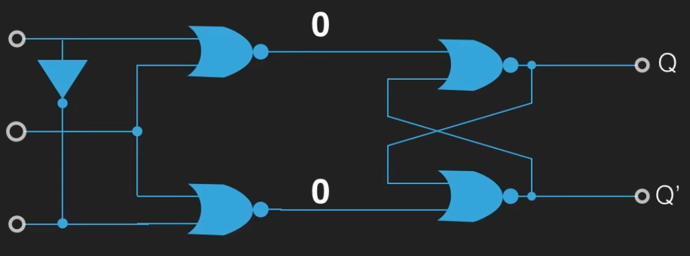
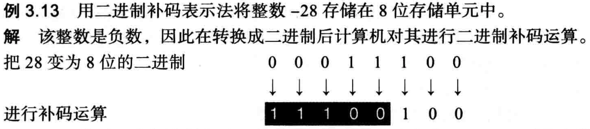
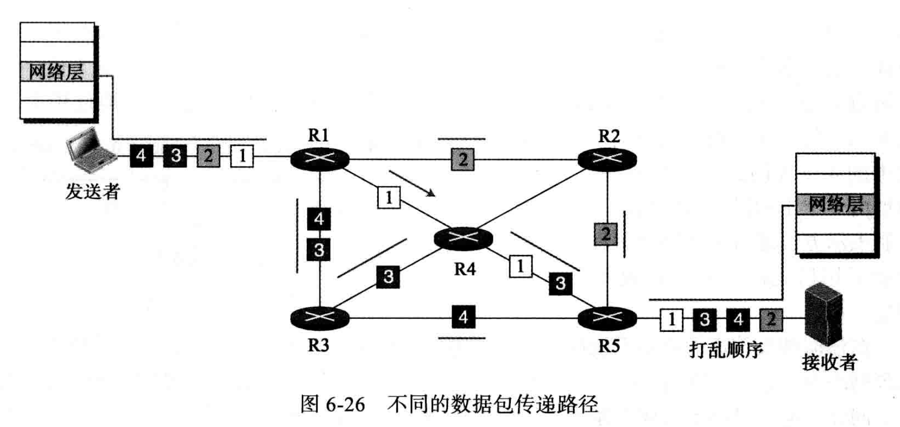

# 计算机科学概论


## 电路基础

物质的最小化学单位是原子，而原子由原子核（正电）和核外电子（负电）组成，核外电子在电场力的作用下可以移动，移动方向是从低电压的方向流向高电压的方向，而形成的电流方向和核外电子的移动方向相反。

电场的方向是从正极指向负极。不同的物质对最外层电子的约束能力不同，所以表现出来的导电性就不同（电阻不同）。单位时间内通过某个平面的电子的数量就表示电流。

欧姆定律：当电压一定，电阻越大，电流就越小。 U=IR

热的本质是组成物质的微观粒子因为运动而碰撞而震动的剧烈程度。

焦耳定律：发热功率等于电压乘以电阻，P=U\*R ， P=I^2\*R。


### 电子二极管

加热灯丝以发射电子。


二极管（只让电流从一个方向通过，另一个方向不能通过）用于电子电路中的整流（将交流电变为直流电）。

### 电子三极管


第三极通上正电，将明显加强原来的二极管中的电流强度，如果加上负电则会明显减弱原来二极管的电流强度。第三极的微小变化必定会引起另外两级之间的电流的巨大变化。**通过这个特性就可以放大信号，实现无线电的远距离传输。**

真空二极管和真空三极管就作为第一批电子工业的重要元器件被广泛使用。

真空电子管的缺点：

1. 体积大
2. 功耗高
3. 容易发生故障（是通过燃烧灯丝工作，灯丝容易烧断）

电子二极管的优点：

1. 面对电磁干扰，电子管有很强的抗干扰性，晶体管则不行

2. 电子管在温度发生较大变化时也可以工作良好，晶体管则不行

基于上面的种种原因，后面出现的晶体管，并逐渐取代了电子二极管。


### 晶体二极管

有的物质容易失去最外层电子（金属类物质），有些物质倾向于获得电子，同时不容易失去最外层电子（绝缘体类物质），而有的物质即不容易失去电子也不容易获得电子（半导体）。

常用半导体物质是 Si——硅，纯硅组成的物质被称为本征半导体，如果往纯净的硅中加入一些磷，磷的最外层 5 个电子，多出的电子容易移动，这就形成了 N 型半导体，如果在纯净的硅中加入最外层 3 个电子的硼，就组成了 P 型半导体。

当将 P 型半导体和 N 型半导体组织在一起后，在接触面中，电子会从高浓度的 N 型半导体中转移一部分到 P 型半导体中，这样 N 型半导体的接触面就因为缺少部分电子而显正电性，P 型半导体的接触面就因为富余部分电子而显负电性，这样就在接触面两端形成了电压，从而阻止电子的继续扩散。

由于两端电子浓度差的差异，导致两端有电子从 N 型半导体往 P 型半导体移动的倾向，同时由于电子的不断移动，又导致 N 型半导体端对电子有吸引力，最后会形成一个平衡，同时伴随一定的以因 电子浓度差而带来的电压（电场）。这个内部的电场区域就称为 PN 节。

如果引入一个外部电场，该电场的电压方向和 PN 节的内部电场的电压方向一致，这样就能阻止更多区域的电子的扩散，也就形成了断路。反向引入一个外电场时，就会吸引更多区域的电子进行扩散，一旦外部电场的电压大于内部 PN 节形成的电场，这就形成了通路。

PN节的内电场一般需要0.7V的电压（导通电压）。


### 晶体三极管

		

上图中，无论怎么通电，电路都不会导通，因为有两个背对背的 PN 结。


中间的 2 号区域被做得很薄；1 号 N 区域被故意参杂了许多最外层 5 个电子的磷元素，导致电子浓度很高；一旦 1 号和 2 号直接通电打通 PN 结，则 1 号中的电子会瞬间大量涌入 2 号中，由于 2 号很薄，所以一下子很难快速消费掉这些电子；3 号被故意做得很大且电子浓度低一些，这时 2 号和 3 号之间就因为电子浓度差，导致 2 号中的电子因为扩散作用而扩散到 3 号中，由于 3 号接正极，所以电子能从这里流出。


可以理解位 2 号和 3 号之间通电，而 2 号的电子来源于 1 号，所以间接的 1 号和 3 号之间通电了。

由于 2 号很薄，消费来自 1 号的电子的能力有限，所以电流一般比较小，3 号由于空间大，吸收电子能力强，所以电流一般比较大。二号极小的信号改变就会导致 1 号电子涌入量的巨大变化，从而引起 1 号和 3 号之间电流的巨大变化。


### 场效应管

mos 管的场效应结构图


下面的半导体材料和 1，2，3 号金属之间有一个非导体的二氧化硅层，所以 2 号金属和下面的半导体材料是分开的，而 1 和 3 号则是和 N 型半导体直接连接的。

P 型和 N 型半导体之间有 PN 节，如果 1 和 2 都接到负极，而 3 号接到正极，则 3 号不能克服 PN 节而和 1 号导电。这是上图的情况整个电路就是关闭状态。

如果将 2 号电压换为正极，2 号的金属通过中间的二氧化硅层后，和下面的半导体材料形式一个电场，即和 2 号金属靠近的半导体材料的一侧的电子浓度高，如下图：


这样的结果导致上图右边的原来的 N 型半导体和 P 型半导体在靠近二号金属的部分的 N 和 P 就要互换了（反型层），在中间接近金属 2 的区域 P 型半导体的电子量多余了两侧的 N 型半导体，于是电子开始向 N 型半导体中扩散，具体是向 3 号金属一侧扩散，因为左侧接着电源的负极，会排斥电子。


左边的 N 型半导体因为链接负极，所有会有电子不断补充进来，以供应 3 号的电子需求。这样 1 号和 3 号在 2 号的控制下通电了。


最后一号和 3 号金属在 2 号的控制下形成了通路。


栅极的正负控制着电路的通阻，如果正电表示 1，负电表示 0，那就能在栅极上通过 0 和 1 控制电路的通与断。所以**场效应管目前已经成各类门电路，集成电路，芯片的基础结构。**

其他许多电路和元器件都是在晶体管的基础上以不同的结构组织起来实现的。


### 布尔代数

把逻辑推导进行了符号化，这和逻辑电路联系紧密。

在香农的论文中，将布尔代数应用到逻辑电路系统中，继电器是一种电磁机械装置，利用电生磁的原理，通过线圈的通电去吸引导体导通电路。


电压和电位：电压是绝对的，电位是相对的。一般在研究电路中，为了简化问题，一般会选择一个明显的电位参考点并默认他的电位是 0，分析电路时，各个点的电位都参考选择的那个点。比如电源的负极就是一个很好的零电位点，电路设计中一般将所有的零电位汇集的点称为接地点。

在电路中，一般将电位位 0 的参考点称为地（GND），连接这一点的线就是接地线。

在数字电路中，其实并不需要关系电压具体是多少，需要做的是把通电和断电区分开来，可以具体多少到多少电压代表通电，多少到多少代表断电。一般把有电通过数字 1 表示，没电通过数字 0 表示。


### 逻辑非

输入 1，输出 0

输入 0，输出 1


晶体三极管表示的逻辑非电路：


### 逻辑与

输入 1 和 1，输出 1

输入 1 和 0，输出 0

输入 0 和 0，输出 0


晶体二极管表示的逻辑与电路：


A:0, B:0 => Y:0

A:1, B:0 => Y:0

A:0, B:1=> Y:0

A:1, B:1 => Y:1


### 逻辑或

输入 0 和 0，输出 0

输入 1 和 0，输出 1

输入 1 和 1，输出 1


晶体二极管表示的逻辑或电路：


### 逻辑与非

图中的小圆圈可以表示在原来逻辑的计算结束后，再做一下非运算输出。

输入 1 和 1，输出 0

输入 1 和 0，输出 1

输入 0 和 0，输出 1


### 逻辑或非

输入 1 和 1，输出 0

输入 1 和 0，输出 0

输入 0 和 0，输出 1


### 逻辑异或

两个输入不同，则输出为 1，两个输入相同，则输出为 0。


#### 半加器

**异或门可以用来作加法运算。**

在一个异或逻辑门电路中，这个逻辑门只能处理一比特的数，所以 1 加 1 虽然在二进制中等于 10，但是异或门只能表示一位，而无法处理进位而选择丢弃。 二进制的的进位发生在两个都是 1 的时候，这就是一个与逻辑门。把两个输入通过与门运算作为一个进位 。


下图中，虽然我们的电路具有输出进位的功能。但是并不具备接受进位的功能。低位的进位 1 并没有被高位接收，这种加法器叫**半加器**。


#### 全加器

支持接收进位的加法器——全加器。


在用门电路设计一个数字电路系统时，一般的步骤是：

1. 先明确电路的输入输出功能 


2. 画出该系统的真值表，也就是列举所有输入和输出之间的对应关系 


3. 根据真值表推导得出电路的逻辑函数

> 在逻辑代数中用 •（点乘符号）代表逻辑与
>
> 用 +（加号）代表逻辑或
>
> 用 ⊕ 表示异或逻辑
>
> 用 X` 表示 X = 0 的状态 ，X 表示 X = 1 的状态

找出上图**本位**输出 Y 为 1 时，输入的情况，就可以得到输出 Y 关于输入的逻辑代数表达式：

```
Y = Ci`•A`•B + Ci`•A•B` + Ci`•A`•B` +  Ci`•A•B
```

找出上图**进位**输出 Co 为 1 时，输入的情况，就可以得到输出 Y 关于输入的逻辑代数表达式：

```
Co = Ci`•A•B + Ci•A`•B + Ci•A•B` +  Ci•A•B
```

4. 用逻辑数学公式化简上面的函数或者用卡诺图化简该函数
5. 用化简后的逻辑关系函数设计连接门电路


上图，输出 Y 是输入 A，B 异或的结果再异或上进位 Ci。进位输出 Co 的结果是 A 与上 B 再或上 进位 Ci 与上 A 和 B 异或的结果。

**上面就是用逻辑代数的定理公式以及卡诺图去化简逻辑函数，从而简化电路的过程。**


数字电路也有一套自己的数学工具和通用的精细化设计方法。


 

#### 全减器


减法器往往不需要单独设计电路，可以在加法器的基础上设计一套算法实现减法器的功能。


### 同或门


上面演示了同或门和异或门为了方便理解使用了 10MOSFET，在实际设计电路的过程中，一般会用传输门来设计同或门和异或门。

借助传输门实现的异或门电路图：


z


借助传输门实现的同或门电路图：


讲解逻辑门的目的：

逻辑门是构成运算单元的最基本结构，比如用一个异或门加一个与门就可以构成一个半加法器，如图：


半加法器可以计算一位二进制的加法。

用两个异或门加两个与门加一个或门就可以组成全加法器，如图：


把两个全加法器组合在一起就能实现两位二进制的加法器，如图：


四个全加法器组合实现四位二进制数的加法器，如图：


香农定义 bit 作为信息的度量单位。

### 比特存储装置

通过一个设置位开关，控制了 1 比特信息的输入。简易符号：


in：表示输入

out：表示输出

set：负责控制输入能否被被设置到输出

首先初始 out 的值为 0，然后将 in 的状态设置为 1，将 set 设置位打开，1 表示打开，0 表示关闭。 如此设置好后，最后由输入 in 1 得到输出 out 为 1，然后 c 被重新设置为 0，out 仍然是 1。 这就得到输入的和输出是一样的值。


上图导致 out 被重置为 1：


当输入 in 为 0 时，out 继续用前上面设定的 1：


上图最终导致 out 值为 0


将设置位 set 关闭（即设置值为 0 的情况），且假设 out 原来的状态就为 0，最后 out 的值并不会变化。


### 字节存储装置

将 8 个比特存储装置串起来，通过一个设置位同时控制 8 个比特的输入，那就可以一次控制一个字节的输出，即字节存储装置。


上图字节存储装置只能控制是否允许输出。

### 字节输出装置


上图中如果 e 位打开（设置为 1），则 8 位输入经过 8 个与门后将保持原值输出。如果 e 位关闭（设置为 0），则无论输出值为多少，都将输出 0。所以这种装置可以用于控制输出。

### 将字节存储和字节输出装置组合


**就得到一个即能控制是否输入，也能控制是否输出的装置——寄存器**。上图时一个 8 位寄存器。简易画法：


将输入输出的一组 8 根线，简化为一根总线。


上图是在总线上连接的三个寄存器。

将寄存器 R1 中存储的状态输出到寄存器 R3，首先，先将 R1 的 e 位打开，R1 中存储的状态就输出当总线中，在将 R3 的输入 S 打开，就将总线设置到了 R3，随后先关闭 R3 的输入，再关闭 R1 的输出，这样就将 R1 和 R3 设置为了相同的状态，也就是所谓的将字节从 R1 移动到了 R3。


**后续讲解怎样选择特定的寄存器，并控制该寄存器的输入和输出（即内存的工作原理）。**

现在有两行两列共 4 个寄存器，通过总线相连，这四个寄存器有各自的输入控制位和输出控制位，现在的需求是明确控制某个寄存器，打开或者关闭它的输入或者输出控制位，以选中 R1 的输入控制为例子（即将 R1 的 S 位设为 1）：


但是 R1 的输入是否到打开有两个条件，而且两个条件必须都成立才行，所以适合在 R1 的 S 位前放置一个与门，一个输入来自 CPU 的状态，另一个输入来自寄存器的选中状态，而是否选中某个寄存器也有两个条件（即寄存器所在行被选中和寄存器所在列被选中），而且必须两个条件都满足，才能表示选中指定位置的寄存器，所以也适合用于个与门。参考下图：


这样总线的状态就被设置到 R1 寄存器中了。

即控制输入也控制输出的示图：


打开 R3 的输出：


打开 R2 的输出：


### 编码器

编码器一般用来将多路通道信息转换成二进制数编码，用于后续电路的分析。

### 译（解）码器

译码器一般将特定位数的二进制数字编码翻译为不同的信号输出。

**选择特定行和列寄存器。**

通过解码器选择特定行和列寄存器。解码器的作用就是根据不同的输入状态对应不同的输出状态，这样就可以通过解码器的输入，来控制哪一个输出状态是 1。

2\*4 解码器：


3\*8 解码器：


有了解码器就可以定位到任意一个寄存器，从而实现寄存器到总线，总线到寄存器，以及寄存器到寄存器的字节移动，这种随机地址存储器，就是所谓的 RAM（Random Access Memory）——内存。

**解码器也需要输出，所以还有提供一个提供行号和列号的寄存器。**即内存地址寄存器（Memory Address Redigter）

案例：

z


使用逻辑门进行算数或者逻辑运算，尝试一步步的执行指令 ——CPU。

### CPU

通过一个逻辑与可以得到两个比特的逻辑与运算结果：


如果想获得两个字节的逻辑与运算结果，可以把 8 的逻辑与门组合起来实现。

两个字节的逻辑与运算：


两个字节的逻辑或运算：


两个字节的逻辑异或运算：


一个字节的逻辑非运算：


移位运算：


#### 加法器

二进制的加法计算某一位的相加结果时，需要考虑三个二进制数字的逻辑运算结果，这三位分别是两个二进制数的本位和 两个二进制数的前一位的相加结果（进位）的值；同时记录相加的结果值和得到输出的进位值。


情况：

1. carry in 为 0 ，当 a 和 b 相同时，sum 为 0 ；不同时 sum 为 1 ，对应 a 和 b 的异或逻辑

2. carry in 为 1，当 a 和 b 的异或逻辑为 1 时，sum 为 0；当 a 和 b 的异或逻辑为 0 时，sum 为 1

   考虑 carry out

3. carry in 为 0，当 a 和 b 都为 1 时，carry out 为 1

4. carry in 为 1，当 a 和 b 的异或逻辑为 1 时，carry out 为 1；或者当 a 和 b 的与逻辑为 1 时，carry out 为 1

对应的逻辑电路图：


比特加法器：


一字节的加法器：


#### 比较器

比较两个字节的大小。当比较两个字节时，会从两个的高位比特开始，上一位 bit 相等则继续比较下一位。

逻辑门电路图：


判断一个字节是否全为零：


#### ALU


运算器


虽然上图右侧的 ALU 工作时，每种运算逻辑电路都会同时接收到相同的输入，也都会工作，但上图的 3\*8 解码器，每次会根据输入，选择唯一的一个逻辑电路的运算结果，打开输出电路，将结果作为输出。


接下来，在该内存中存储一些操作指令（二进制机器码），并规定每种操作对应的二进制编码。

IAP寄存器：存储下一步执行的指令的内存地址（在RAM中位置）。

IR寄存器：存储当前要被执行的计算机指令二进制码。

Control Section：就是CPU中的控制器，里面的布线十分复杂，可以识别指令寄存器（IR）存储的二进制码是什么类型的指令，并将指令处理后进行对其他寄存器进行输入输出控制或者将指令解析后传递ALU进行运算。

即使是一个简单指令，可能也需要经过好几个操作步骤才能完成。

比如，执行LOAD R1 R2。寄存器R1中存储了RAM中的一个内存地址，该内存地址中存储了数据， LOAD指令负责将R1中的内存地址中的数据加载到R2中，首先，会将打开R1寄存器的输出，和MAR的输入，将R1中的地址数据通过总线，存放到MAR中，有解码器解析内存地址数据，选中指定的内存，同时通过控制器让该内存地址的存储器的数据输出到数据总线中，然后打开IR的寄存器输入，将指令同步到IR寄存器中，然后在通过控制器，进过类型的控制，将IR寄存器中的数据同步到R2中。

这中间有一些列一步步的操作，这就依靠不步进器实现的。


控制器对指令寄存器中存储的指令进行解析。

#### 步进器


借助它组装步进器。


M表示存储一比特信息的逻辑电路，通过set能控制该装置能不能将out和in进行同步。

CLK链接这这些比特装置的输入控制位，reset通过非门链接第一个比特装置的输入位，后面前一个比特装置的输出out连接到下一个比特装置的输出in，最初这些M存储的状态都是0。二号比特装置初始状态是0，所以经过非门后，输出为1，所以初始状态时，setp1是打开的，如下图：


当clk第一次变为1时，所有偶数序号比特装置的输入控制打开


 

但是二号装置没有变化，setp1仍旧是打开的，接下来clk变为0，所有偶数序号的比特装置的输入控制都关闭，奇数为的打开


1号存储装置的状态变为1，2号因为输入控制位关闭，所有2号的状态不受影响，所以在时钟滴答的第一个周期内，setp1处于打开状态。


在第二个时钟周期中，clk再次变为1，偶数号的装置输入都又被打开，这次2号装置接受到1号装置的输出1，这导致setp1被关闭，而4号装置的状态是0，所以setp2被打开，clk再次变为0时，奇数位装置的输出被打开，3号装置接受到2号的输出1，还是不影响4号的输出，setp2仍旧是打开的。


如此往复 ，下个时钟周期关闭step2，开发哦step3，所以这个步进器可以按照顺序在每个时钟周期内打开一个step输出，而关闭其他。当步进器走到最后的第12个装置后，第12号的out连接到reset，将reset置为1。


这时下面的或门的输出都为1，导致所有比特装置的输入都打开，然后一个接一个的被重置状态为0，恢复到初始setp1被打开的状态。


上面就是步进器的工作原理。

下图是步进器的图形表示：


如果在步进器的每个setp中控制一些寄存器的输入和输出，就可以一步步的实现编程逻辑。


针对下图的这两个时钟装置：


将时钟装置中的线路延长，让clk d 的时钟周期的变化往后延迟，如果将它们组合到一起来控制输入和输出，clk和clk d都为1时，输入控制位才会被打开，而它们两者只要有任何一位为1时，都会打开输出控制位，所以输出控制位会先于输入控制位打开，并且在输入控制位关闭后才会关闭输出控制。

这样做的目的：**在移动字节时，要先将源寄存器中的内容输出到总线，然后才可以打开目的寄存器的输入，而且要先关闭目的寄存器的输入，再关闭源寄存器的输出。**


现在将时钟的输出控制位连接到寄存各个输出设置，将时钟的输入控制位连接到各个寄存器的输入设置，这样就能保证寄存器的输出控制位先于输入控制位打开，输入控制位先于输出控制位关闭。CPU中的控制器就是利用步进器控制一团团的布线完成各种操作指令。


假如有这样一组布线，在setp1打开时，打开指令地址寄存取（IAR）的输出和内存地址寄存器的（MAR）的输入，指令地址寄存器存储的是下一条待执行指令的内存所在地址，将这个地址存入内存地址寄存器（MAR）；在setp2中，将setp1中的指令地址寄存器中通过解码器解码选中的内存（RAM）中存放的指令输出到指令寄存器（IR）中，这样就完成了一次指令的加载。

问题：**指令地址寄存器怎么在加载完一条指令后，就存储下一条指令所在的内存地址？**

这就要用到上图中的ACC和TMP寄存器。

ACC寄存器：用于存储运算器（ALU）的计算结果。

TMP寄存器：是一个没有输出控制位的寄存器，放到TMP中的数据就是要在ALU中使用的。

Bus1：它是一个比特位，如果bus1为0，经过非门后，TMP的高七位都会和1进行与运算，第一位和0进行或运算，则TMP的输出不会发生任何变化并且输出到运算器的输入；当bus1打开，即为1时，TMP高七位都于0进行与运算，则高七位都为0，第一位都和1进行或运算，输出1，所以无论TMP输出的是什么，在bus1打开时，输入到运算器的B的值都为1。


 而运算器（ALU）的operation默认存储的是000，选中加法运算，这样只要将指令地址寄存器，同时将bus1置为1，并打开ACC的输入，则运算器的输入A就是总线上的指令内存地址（指令地址寄存器的内容），运算器的输入B就一定是1，此时ACC会接受到家发器的运算结果，即内存地址加1后的下一个内存地址，如下图：


对应到控制器中布线，如下图：

步进器中step1为1时，控制IAR的输出和bus1，并打开内存地址寄存器（MAR）和ACC的输入，这样指令地址寄存器中的数据就输出到总线并设置到MAR中，而总线上的IAR和打开的bus1会经过运算器进行加法运算存储到ACC中；

在step2中，将RAM输出到IR中（即将内存地址中的指令放到指令寄存器中）；

在step3中，将ACC输出到IAR中，IAR中存储的就是相邻的下一个内存地址。


对于每一条指令而言，前三步都是这样布线的，所以只能在4，5，6中实现指令的对应操作。


时钟装置，周期性变化，借助时钟装置就可以组装步进器

CPU 的最基本的结构：MOSFET（金属氧化物半导体场效应晶体管）

逻辑门

运算单元

存储单元

时钟同步

从最底层理解 CPU 内部怎么利用电进行计算以及 CPU 是如何通过一个个的逻辑门电路搭建和制造的。

对 CPU 的工作原理和制作生产过程有了解。

#### 晶体二极管


在 N 型半导体中，电荷的载体（载流子）是电子

在 P 型半导体中，电荷的载体（载流子）是空穴


x


#### MOSFET（晶体三极管）

基于二极管制作的用电压控制的开关。

工作原理：


上图得到一个可以通过电压控制电路通断的装置。当给中间的电极加上正电，当电压高于阈值电压后，mosfet 可以导通，低于阈值电压则不能导通。这就是 mosfet 的工作原理。

**上图中是在高于阈值电压时电路导通，低于阈值电压时电路断开的晶体三极管叫——NMOS**


**上图中是在高于阈值电压时电路断开，低于阈值电压时电路导通的晶体三极管叫——PMOS**

电路图中的表示符号：


将 NMOS 和 PMOS 的漏极连接在一起，就得到了 CMOS：


如果把 G 级连接起来作为输入端，两个 D 极的作为输出端 B，如下图：


VDD：供电电压

VSS：接地电压

上图就组成了一个非门电路，当 A 输入 正向偏压，电压高于 NMOS 的阈值电压时，PMOS 不导通，NMOS 导通，相当于 B 端直接和接地电压（低电压）连接，是相对低电压；当 A 中输入反向偏压时， PMOS 导通，NMOS 不导通，相当于 B 直接和供电电压相连接，输出的就是相对高压。


如果现在规定相对高压代表 1，相对低压代表 0，上面的电路就是对输入结果取反，即非门逻辑。


MOSFET 是构成逻辑门电路最基本的单元，当把各种逻辑门组合在一起就可以形成运算端单元，这就是 CPU 的雏形，如果再加上各种存储单元和其他电路就构成了完整的 CPU。

#### CPU 计算加法

通过 NMOS 和 PMOS 进行不同的连接与组合，就可以得到用于计算的逻辑门电路。

前置知识：

1. 二进制和十进制

十进制换算为二进制采用的是除 2 取余逆序排列法。


29=>11101

二进制转为十进制：


2. 本位和数 与 进位


本位和数：Sum，S

进位：Carry，C

如果只看本位的相加结果：


这个结果是异或门逻辑。因此，A+B 的本位和数 S 就是 A⊕B


如果只看进位的结果：


这个结果是异与逻辑。


用一个异或门来得到本位和数的值，用一个与门得到进位，就得到了一个可以计算一位二进制数的结构，如图：


z'z

半加法器没有进位输入，这就导致它只能计算一位二进制的加法，如果想计算多为二进制数的加法，比如 111+101，

第一位是 1+1，本位和数是 0，进位是 1，这是后需要将它们的进位 1 输入给第二位，计算第二位数时，本质上是在计算加数的第二位，被加数的第二位和第一位的进位这三个数的和，如图：


所以需要一个可以输入上一位进位的加法器，也就是具有三个输入的加法器，输出依旧是两个，本位和数和进位，**本位的结果可以先让 A 和 B 异或一次，在让这个异或输出和 C 异或一次。**对于进位，对于进位是 1 的情况，则需要 A,B,C 中至少又两个数是 1。


如果 ABC 中有至少 2 个 1 时，就让进位输出 1，方法一：

让 A•B A•C B•C


四位二进制全加法器：


这个加法器必须计算完低位的进位情况 和 和位情况才能算高位的，是串行的——形波进位全加法器，它的延迟很高。

并行进位全加法器：


#### CPU 计算减法

减去一个数等于加上这个数的负数。所以只需要将减数表示为负数的形式，然后用加法器执行加法运算就行，所以需要先了解二进制数的负数如何求得。

假设有一个可以存储和计算 4 位二进制数的计算机系统，那这个系统可以存储和计算的二进制数的范围就是 0000~1111，对应十进制数就是 0~15，这种直接将十进制转换为二进制的表示方法就简称为直接表示法，直接表示法的问题是无法表示负数。


而二进制数的特点是每一位数只可能是 0 或者 1，刚好可以表示正负两种状态，所以有一种表示法是用最高位来表示正负（符号位），0 代表正，1 代表负，其它位为数值位。这种表示正负的方法叫原码表示法：


原码表示法有一个问题：符号不同的数不能直接相加。


原码表示法表示的一个二进制数值是不能直接用于运算的，有一种方法可以表示清除负数的同时可以用于运算——**补码**

在一个 4bit 的计算机系统中，如果使用直接表示法，能表示的最小数是 0000，最大数是 1111，如果对 1111 加 1 就会变为一个 5bit 的数。但是由于这个系统只能容纳 4bit 的二级制数，第 5 位的 1 就溢出了，在系统中无法被表示，会被自动舍弃，所以最后的结果就是 0000。


对于存在溢出后重新回到 0 的模运算系统（上面的 4bit 计算机系统或者时钟）来说，加上一个负数和加上这个负数的补数是等价的。


原数每一位按位取反。


**把原数按位取反，然后再加 1 得到的二进制数和原数相加刚好是 0，那这个数和原数相加的数就是元数对应的负数。**——补码表示法

**在计算机中，正数的补码就是正数本身对应的二进制编码，而负数的补码就是负数对应的绝对值的原码取反后加一**


补码的最高位也代表正负，0 为正，1 为负。


和原码不一样的地方是，补码的符号位可以直接参与运算的。


### 正负数

#### 补码

八位二进制数 00000001 对应十进制下的 1，而-1 对应的二进制数则是和 00000001 相加为 00000000 的那个数（缘起性空）—— 11111111，相加的结果第九位是 1，后八位是 0，但是对于八位加法器而言（计算机的计算是需要硬件作为载体的），在 8 位加法器中，最高位向第九位进位的时候，因为没有第九个全加器，所以会被丢弃（溢出）。所以在 8 位二进制体系下 11111111 + 00000001 的结果就是 00000000。

将这种和1的二进制数相加后的结果湮灭为零的编码用来表示1的相反数-1。

基于正数，用和这个正数“互补（性空）”的编码定义负数的方式，称之为 **补码**。

负数的二进制数对应为： 该负数的绝对值对应的二进制数按位取反后再加一获得。——**补码**

减法可以看作正数和负数相加，所以可以利用补码的方式表示正负数，也就将加法和减法统一为了加法，所以计算机并不需要为减法计算单独设计一个减法器而导致电路设计上的复杂（规模和功耗）


#### 原码

用原码方式来表示正负数，在原码中，简单的把最高位作为符号位，0开头则表示正数，1开头则表示负数。原码表示的不足如下：


上面的情况的计算结果就是不对的。但是用补码的方式就能避免这个问题。


### 数据选择器


上图是一个 4 选 1 的数据选择器，当选择端为 00 时输出 A 路的输入，01 时输出 B 路的输入，其他情况类似，上图就是寻址的一种简单工作模型，通过数据选择控制引脚选择使用哪一路的数据，两个地址引脚就能实现对四个地址的选择，三个引脚能实现对 8 个地址的选择。

如果多路数据输入引脚连接着内存或者寄存器组，那么这个数据选择器就完成了对内存或者寄存器组的寻址功能。

### 实验

题目：在一个实验中，有八杯水有一杯是有毒的液体，同时还有 3 只小鼠，但是小白鼠在喝了有毒液体后 7 天后才会毒性发作，请问如何在一次周期内找到有毒的一杯水？

例子：七段数码管。

将电路中的二进制数字显示到七段数码管中，七个 LED 管随着不同的通电方式，显示出不同的符号或者数字


CMOS 管


对于上图，如果没有初始的触发信号，则输出是悬空状态。


上图在什么都没有输入的情况下，处于悬空状态。如果给电路左侧通上高电压（1），这是两个二极管中间的电压表示 0，右侧输出电压为 1，整个电路中电压分布不矛盾，如果现在撤掉初始推动电压，这个电路仍然维持下图的稳定状态：


对于初始输入为 0 的情况也是一样的，像这样有两种稳定状态的系统被称为 **双稳态系统**。


### SR 锁存器

两个或非门互接尾部。

初始状态：


现在来考虑给左侧两个输入端输入不同点位，整个系统的变化，


情况一：输入 0 0

这种情况并没有什么确定性的输出。所以如果系统一开始是未定义的状态，那输入 0 0 的时候，输出仍旧是未定义状态。


情况二：输入 0 1


情况三：输入 1 0


情况四： 输入 1 1

直接锁死为 0，作为输出。


电路中的输入不再都是外部接入，有两个输入来自输出。

输入 1 0，输出 0 1 ，然后将输入变为 0 0 ，输出将不变，还是 0 1。


再将输入变为 0 1，输出将变为 1 0 ，然后再将输入变为 0 0，这是输出还是不变，为 1 0 。**所以当输出为 0 0 的时候将保持上一个状态不变。**


因为输出 Q 和 Q`都有可能作为输入，从而影响输出，如果将输出 Q 作为一个输入的话，对应的真值表如下图：


这样的一个电路可以用来存储数据，把 Q 作为数据存储端，Q\` 作为和 Q 互补的一个辅助输出端。认为 Q=1，Q\`= 0 时，这个结构存入数据 1；Q=0，Q\`= 1 时这个结构被复位为 0。 S=1，R=0，则输出 Q=1，Q\`= 0；当 S 端的 1 恢复为 0 后，Q 的数据仍旧保持 1 不变，这是就规定向存储单元写入数据 1，S 端也叫置位端（置 1 端）。 S=0，R=1 则输出 Q=0，Q\`= 1，当 R 端的 1 恢复为 0 后，Q 的数据仍旧保持 0 不变，这是规定存储单元被复位为 0。 R 端也叫复位端（置 0 端）。

上面的结构叫**SR 锁存器**。


S=1，R=1是一种特殊的状态，这时 Q=0，Q\`= 0 ，  这不符合前面对这个存储单元中定义的 Q和Q\`必须一个是0，一个是1的定义。 如果只是用Q端存储数据，当 S=1，R=1时，Q端被复位为0。来看一个客观上的问题，不论S=1，R=0，还是S=0，R=1 ，其中都只有一个动作电位，当该动作信号变为0的时候S=0，R=0，输出Q和Q\`仍旧保持不变。如果S=1，R=1，则相当于有两个动作信号，那在撤去之后电路的输出是多少?  假设先撤去S（S=0,R=1）,这样Q=0，Q\`=1，相当于设置输出为0，然后再撤去R（S=0,R=0），这时输出仍就不变（Q=0，Q\`=1）；或者假设先撤去R（S=1,R=0）,这样Q=1，Q\`=0，相当于设置输出为1，然后再撤去S（S=0,R=0），这时输出仍就不变（Q=0，Q\`=1）。

首先这不符合S=0,R=0的输入是保持原有状态不变得定义，两次不同顺序得信号撤离方式得到了不同的结果。如果同时把S和R的1同时置为0，这就是一个办不到的事情（理论上可以，但是实际上一定会因为电路的情况有一个先后。）主观上想一步实现的操作，一定是客观的被分成了两步，结果可能使得SR触发器进入 Q=1，Q\`=0或者Q=0，Q\`=1，但是没法事先确切的确定具体进入的状态。


问题“

- 当电路中有许多SR锁存器时，它们各自动作，改变的时间都不尽相同，信号处理复杂

- 用SR锁存器存储数据时需要两个输入（S置1端，R复位为0端），实际上希望只需要一个输入就可以，输入为1，则设置为1，输入为0则复位为0。

  

为了**同步动作**，产生了**SR触发器**：


CLK为1时，输入功能被锁死为不能输入（S，R不论怎么变都不会影响Q和Q\`）；CLK为0时，输入功能被正常打开工作。


多个锁存器使用同一个CLK信号就可以同步出发SR触发器的动作一致性。


为了**单端输入**，产生了D触发器：




这样就只能有3中信号输入了（1，0；0，1；0，0）。

CLK信号则是数字电路中用来一步步控制执行流程的时钟信号（主频）


在数字电路中会遇到很多（包括寄存器）在内的能够暂存数据的单元，基本都是从 SR 锁存器的结构上演化得到。

S=1，R=1 是一种特殊状态，输出 Q=0，Q\`= 0。首先这不符合我们对这个存储单元中，Q和Q\`必须一个是1状态和一个是0状态的定义。

上面的锁存器是用过或非门组成的，也可以使用与非门组成 SR 锁存器。


上面介绍的都是电平触发器，电平触发器的一个弱点，即：在一个电平周期内，输入信号可能返回，输出被多次改变，如果遇到电磁干扰就很容易得到错误的输出。于是有出现了其他不同触发方式的触发器。


### 脉冲触发器

**这节课的电平SR触发器定义为高电平的时候触发存储动作，低电平的时候锁上SR触发器。**

下图就是两个SR触发器组成的脉冲触发器（在时钟信号改变的边沿触发信号动作）：


低电平时，第一个SR触发器的输入被锁死，输出就固定了，第二个SR触发器的输入被打开。

高电平时，第一个SR触发器的输入被打开，第二个SR触发器的输入被锁死。

这样当在高电平时输入信号可以在第一个SR触发器中反复变化，而第二个SR寄存器的输入被关闭，但是一旦进入低电平时，第一个SR触发器的输入就被锁死，第二个SR锁存器的输入被打开，第一个SR触发器的输出不再改变，而不再改变的输出作为第二个SR触发器的输入，从而在一个电平周期内触发器的输入只会改变一次。

脉冲触发器的不足：主触发器的输入信号反复变化的时候，脉冲的下降沿可能导致错误的输入，不论在高 电平时间内，输入信号如何变化，下降沿的最后一个应该是这个脉冲触发器的最终结果。下降沿之前的高电平期间，主触发器按照输入的信号进行改变，一旦脉冲下降为低电平，那么主触发器被锁死，从触发器把主触发器的输出作为输入，输出在这个周期内和输入毫无关系了，只在脉冲下降的时候完成一次主从交接的信号传输过程，保证从触发器的输出在脉冲周期内只变化一次。

虽然在脉冲周期内只完成一次动作，但是这一次动作对于这种由电平触发的SR触发器组成的脉冲触发器而言，可不一定是准确的，例如，在高电平期间，先是主触发器的S=1，R=0，这时主触发器输出的Q=1，Q\`=0，如下图：


紧接着，主触发器的S=0，R=0，，这时应该是SR触发器的状态保持状态，所以这时，主触发器的输出仍然是Q=1，Q\`=0，等到下降为低电平的时候，虽然想当然的认为下降沿来之前的最后一次输入S=0，R=0是这个脉冲触发器的最终的一个输入信号，所以讲道理这个脉冲触发器的SR触发器整体的效果应该是保持上一次的状态不变，但是实际上主触发器的输出是1，0，因此从触发器得到的输入也就是1，0，而不是我们认为脉冲下降前的最后一次输入0，0。   

此时，这两个由电平触发器的SR触发器组成的SR脉冲触发器，就不太符合SR触发器的基本要求了，也就是当输入S=0，R=0的时候，要保持上一个状态不变。

简单来说，我们之所以用两个电平触发的SR触发器来构成脉冲触发器，无非是让主触发器充当信号的传递者，并且在下降为低电平的时候，具有保持这个信号不在受输入干扰的功效。，从触发器作为真正的动作响应单元。  

一个好的数据传递着，最重要的基本素养就是不要改变数据，但是这种情况下，主触发器就是一个不合格的数据传递者。因为在脉冲下降前的最后一次输入信号改变为0，0的时候，主触发器的输出居然没有变为0，0。这也是电平SR触发器的一个特点。


### D触发器（边沿触发器） 

将脉冲触发器中的SR触发器换位D触发器。


在高电平期间，D触发器的主触发器的输出不论何时都和输入保持一致，在电平下降那一刻也是一样的，电平下降主触发器锁死，从触发器触发，从触发器的输出一直和主触发器的输入输出保持一致。这种触发器的输出只取决于脉冲下降边沿那一刻的输入信号，所以这种用两个D触发器组成的脉冲触发器开始表现出其”边沿动作“的特性，在下降沿之前之后的任何输入都无法改变其最终的输出。将数据读取的时刻压缩到下降沿的一瞬间，所以也成这种触发器为边沿触发器。

电平触发器和脉冲触发器因为工作时无法应对输入信号的反复横跳，而导致输出变得不可控而很少得到使用。常用的就是D触发器了。

触发器可以用于构造CPU中的寄存器。

如果是一个8位的计算机，其CPU中的寄存器就是用来临时存储一个8位数据的寄存器单元。


下面这个电路结构：


这是一个移位寄存器，八位数据不再需要一次性的输入，可以在一个脉冲周期内输入1位，然后通过脉冲信号依次将其右移。这样八个脉冲周期后，这个移位寄存器就存入了一个八位的数据。当然，输出倒是仍旧可以同时读取。

作用：

可以用来节省数据传输占用的数据线，从八位并行变成了一位串行。


再比如实现串行到并行的数据转化：


还有移位其实是计算机底层中一种非常重要的操作。比如用补码加法和移位操作来实现乘除的算法。

在接触触发器之前，我们接触的电路结构都有一个特点，输入数据后输出就被输入确定下来。输出只和当前的输入有关，比如八三编码器，三八译码器、加法器等。

但是从触发器之后，因为电路开始具有记忆，我们的输出就开始和之前的输入变得息息相关了。比如我们刚才所说的移位寄存器，后面的触发器的输出取决于前几次的输入。因为电路能够记住之前的事情。在此之前的逻辑电路都是通过拼拼凑凑组合起来，称之为**组合逻辑电路**。而在此之后，我们的逻辑电路因为具有记忆功能，就开始在脉冲信号的驱动下，开始一步一步的变化，每一步的输出都和之前的输入息息相关。这种按照脉冲时间序列动作的电路，我们称之为**时序逻辑电路**。时序逻辑电路其实很简单，就是在组合逻辑电路的基础上，插入了具有记忆功能的存储电，这样每次输出就被存储下来。下一次输入的时候和输入数据一起发挥作用。


## 存储器

关于存储，不同的场景有不同的命名。

- ROM和RAM
- 内存和硬盘（电脑）
- 运行内存和存储空间（手机）


本质是两种存储方式：**易失性存储器和非易失性存储器**。

易失性存储器断电后就无法存储数据。

非易失性存储器断电后数据人就可以保存。

 

### 非易失性存储器

主要分类：

- 磁：机械硬盘，一张磁片（磁片上有密密麻麻的磁化微粒，这些微粒有不同的磁性，N和S）和一个磁头（磁头上有一个电磁结构），点击带动磁片高速旋转。磁头上通过控制线圈的电流走向产生不同方向上的磁场，利用磁化效应改变微粒的磁性，这样主机就能通过传输二进制电信号把信息写入磁盘的微粒中。磁头上还有一个磁性探头，将各个微粒的磁性转换为二进制电信号，实现数据的读取。
  
  
  
  
  
  
  
  - 水平式
  
    
  
  - 垂直式
  
    
  
  - 叠瓦式（性能差，依赖缓存空间），两个存储单元叠在一起，由于工艺的原因，写磁头不能像读探头一样可以做得很小，所以在一次随机的写数据过程中，磁头势必会影响旁边的存储微粒，微粒保证旁边微粒的存储数据不被影响，只能将他们临时放在缓存中，写完后再从缓存中恢复回来。本来只想改变一个微粒中的数据，却一次性动了一片磁盘的扇区（磁道上有不同扇区），速度自然慢。
  
    
  
    


由于叠瓦式在写数据的时候非常依赖缓存实现数据的搬迁和恢复，所以缓存一般都比较大，比如上图中256M的缓存看上去很好，但是很可能说明该硬盘是叠瓦式的。


- 光：光盘，利用光在不同材料上的反射能力不一样实现存储的。

  

- 电：固态硬盘
  磁和光，在断电后数据仍旧可以继续长久保存。电的话，一般断电后将很难继续保存数据。


通过电存储的存储器：

早期，为了永久性的存储数据，设计了只读不写的存储器，这样在断电的情况下也能永久存储数据。依靠的就是半导体场效应管。


利用mos管的开关特性就可以制作一个存储单元。


#### 掩膜ROM

只读不写。


选择在对应的W线上通上高电平信号，产生不同的数据输出。

控制每一位上的mos管的有无来存储数据，每一位上的mos管的有无由用户向生产厂商提交设计电路后由厂商生产。生产商在生产这种存储器的时候，需要用到用户定制的数据模板，称之为掩模版（掩膜ROM）。生产后电路结构就写死了，无法改变，就不能编程了。

掩膜ROM虽然简单，但是很麻烦，新的产品需要找厂商重新定制。（游戏卡）


#### PROM

可编程ROM，在电路和COM管之间上加一个低熔点的合金丝，通过加高电压就可以烧掉合金丝，从而等价于去掉对应位置的COM管，从而实现一定程度的可编程。


厂商生产出这种布满合金丝的存储器 ，再提供给用户一个针对ROM的编程器，用户就可以按照自己的需求写入数据。

 

#### EPROM

可擦除可编程ROM（Erasable Programmable Read Only Memory）


通过在浮置栅注入电子来控制这个MOS管的通电或者断电，从而实现存储数据的能力。浮置栅注入电子后，即使控制栅加高电压也不能导通电路，等价于没有MOS管，反之，则是有MOS管。

EPROM是采用热电子注入技术向浮置栅注入电子，而擦出浮置栅上的电子，则用紫外线或者X射线照射MOS管的二氧化硅层，产生电子空穴对，实现电子放电。 


#### EEPROM

EEPROM是使用量子遂川效应发明的功耗更低，时间更快的电子注入和擦除技术的可擦除可编程ROM

EEPROM仍然需要单独的编程器进行编程。


#### Flash（闪存）

闪存结构将写入和擦除所需要的高电压通过升压和降压控制电路统一集成到闪存芯片中，不在需要借助单独的编程器。因此可以边工作边进行读和写。

固态硬盘，SD卡，优盘等的底层结构都是闪存，这些不同电子产品只是对闪存的不同的使用方式。


为了能在单位面积上，增加能够存储的数据的密度，降低成本，在闪存结构上又有不同设计（闪存颗粒）：

- SLC：Single level cell
  浮置栅上只有两种状态，有电子和没有电子，从能表示两种状态，存储1bit 的信息
- MLC：Multi level cell
  浮置栅上电子的状态分为4种，满电子，2/3，1/3， 无电子，通过这四种状态，能存储2bit 的信息，通过测量管子的四种不同的开启电压的状态，再经过转换就可以得到四个数据。
  
- TLC：Triple level cell
  原理和MLC一样
- QLC：Quad level cell
  原理和MLC一样 

但是受到制作工艺和控制难度的约束，目前就止步于QLC，再往下就容易出问题，浮置栅上的电子状态越多，对注入的电子的精度要求就越高，耗时就越长。而读取数据的时候，需要尝试更多的开启电压值，也降低了读取速度。


闪存只是用来存储数据的电路结构，其上面的数据最后还是需要交给主机使用，闪存和主机之间并不直接交互，而是通过闪存的**主控电路**来链接。

前面说到的不同产品的底层结构都是闪存，但他们之所以不同，主要是因为他们的主控电路和闪存的使用方式上的不同。


固态硬盘就是闪存结构加主控电路的结合。主控电路的设计门槛高，目前只有为数不多的几家厂商可以设计生产，如下图：


#### 主控电路

功能：

1. **管理闪存**

   - 地址映射管理，在使用闪存时，一般不直接使用闪存的物理地址，而是使用一个虚拟的逻辑地址，所以需要维护一个逻辑和物理地址的映射表。

     

   - 垃圾回收（GC）
     SSD越用越慢，这是因为SSD在使用的过程中，会产生垃圾块，对于一个新的SSD来说不是问题，因为还有很多未使用的空间可以存储新的数据，但随着使用时间的增长，可使用的空间越来越少，当写入时空间不够，SSD就必须将垃圾块回收再利用，什么时候回收，回收的策略，这都是SSD的主控电路的GC模块需要考虑的。

   - 磨损平衡
     SSD在使用的过程中，可能会出现有的存储块经常被使用，而有的几乎没有被使用过，主控电路就不得不平衡这种读写频率上的差异，因为闪存的读写是有寿命的，因为向浮置栅上反复的充放电会对二氧化硅层造成不可逆的损耗， 浮置栅上的电子会越来越容易外逃，闪存保存数据的时间也会越来越短，如果不同存储块的使用频率差距过大就会导致那些经常使用的存储块迅速老化。平衡闪存块的磨损也是主控电路的任务，比如把经常使用到的热数据放到之前使用频率较低的存储块中的动态平衡算法，和将使用频率低的数据放到之前使用频率很高的存储块中的静态平衡算法。

   - 掉电恢复
     当SSD异常断电时，如何保护好数据不丢失，比如加一个大电容应急，采用什么样的算法在下次通电时重现数据等。

   - 坏快管理
     闪存中会出现坏块，来源有：1. 增长坏块，不断使用后产生的坏块；2. 出厂坏块，和闪存的制作工艺有关。所以闪存的坏块难以避免，所以在使用SSD时，主控电路需要处理好和坏块的关系，比如鉴别出坏块，遇到坏块是直接忽略还是使用好的存储块来代替。
     - 原厂
     - 白片
     - 黑片

   - Cache

   - 数据维护

   - 防止bit翻转

     

计算机中的其他设备要和CPU通过总线进行通信，需要循序数据沟通的流程规范。


2. **控制闪存和主机的数据流转**

   控制数据从主机写入闪存和从闪存读取数据送入主机的过程。

   - SATA总线接口规范（Serial ATA）：串行ATA。

     01年，由Intel、APT、Dell、IBM、希捷、迈拓这几大厂商设计了一套数据沟通的“流程规范”，SATA总线接口规范。

     

     之前还有一个叫PATA，并行ATA，Parallel ATA。同样属于ATA规范，SATA比PATA更加先进，数据并行传输不是比串行的要更快吗？比如两个模块之间传输8bit的数据，在并行模式下一次就可以完成，在串行模式下，需要分8次传输。

     从这种角度看待串行和并行的传输速度只在第一层，更深层次的原理是这样的：在过去，设备工作频率不高的时候，也就是驱动时序电路工作的时钟频率比较低，串行确实不如并行传输的多路开工。但是随着这些年设备的工作频率不断上升，并行信号的同步问题变成了影响速度的瓶颈。

     8bit的并行数据并不能同时达到，这种差异时间一旦超过了时钟信号的周期时间，时钟信号需要等待它们都准备好了才能驱动输出。不同步的原因有很多，甚至布线的长短都会影响这个时间，还有并行数据在高速下的相互干扰，这样就增加了控制的难度，并行的优势在主频的不断提速下反倒变成了劣势。

     而串行的方式由于控制简单，没有信号的相互干扰，这些年逐渐成为各种传输协议的主流，全面压倒并行方式，包括接下来会讲到的PCIE，NVME，以及手机的UFS都采用串行化技术。

     计算机数据传递流程也被划分成为不同的层级。SATA规范中规定了4个层级：
   
     1. 应用层
     2. 传输层/事务层
     3. 数据链路层
     4. 物理层

     SATA总线接口规范中两个设备数据通信的过程就像数据包在网路中的传输过程。SATA的物理层有一个特点，数据接收和发送虽然有独立的通道，但一次却只能干一个活，发送数据的时候不能接受数据，而接受的时候则不能发送数据，这种模式也称之为半双工，SATA的这个特性则为现在的逐渐没落埋下了一个伏笔。SATA规范中只有一条数据通道（发送和接受算一个），SATA的应用层使用的是AHCI协议，严重限制了数据传输的效率等。

     在机械硬盘时代，SATA规范还是很优秀的，因为速度瓶颈不在传输上而在存储介质（HDD）本身的速度。SATA3.0中极限速度可以达到600MB/s，这是很多机械硬盘达不到的速度，所以在机械硬盘的时代，SATA完全够用。

     但是随着SSD高速发展，存储介质（闪存）本身的速度已经不是瓶颈，现在市面上的SSD动辄好几个G每秒的读写速度早就超越了SATA的传输极限。

     

   - PCIE总线接口规范

     

     PCIE和SATA一样也是一种总线接口规范，完整的规定了设备中数据传输的流程，PCIE也分为和SATA类似的四层。在物理层，PCIE相对于SATA有了很大和改善。首先它也是用更加先进的串行通信，可以看出串行技术取代并行是大的趋势。

     SATA只能半双工，PCIE可以让发送和接受数据同时工作互不干扰，也就是全双工，再次提升了速度。

     PCIE支持多个通道，比如单通道，2通道，4通道，8通道，16通道以及最多能够达到的32通道。我们电脑主板上就有PCIEx1，PCIEx4，PCIEx16等等不同通道的PCIE插槽。
   
     
   
     相对于SATA而言，PCIE的传输速度得到了大幅度的提升。这是一张PCIE从1.0到3.0的速度表。相比于SATA3.0的600MB/S的极限值，PCIE简直快到飞起。
   
     
   
     PCIE其实只规定了4层协议的下三层，虽然速度相对于SATA已然让飞升，然而应用层协议，却并没有在PCIE规范中。
   
     一开始走PCIE接口的应用层协议借用的是SATA中常用的AHCI，这是一个很古老的的应用层协议，简单来说这个它很不现代化，极大的约束了数据传递的速度。（自行车上高速）
   
     
   
     
   
     所以虽然PCIE很快，但是如果使用AHCI作为应用层协议，并不会比SATA快出天际。于是在2011年几大巨头企业（又有因特尔这个规范狂人）专门针对SSD制定了新的应用层协议标准——NVME。
   
     相对于AHCI而言，NVME将PCIE的全部能力释放了出来，推出之初就将PCIE规范作原配协议，这就是目前SSD接口规范中的黄金搭档。（法拉利跑高速）
   
     
   
     
   
     
   
     **SATA和PCIE属于总线接口规范，规定的是计算机内数据传输的规则（可以简单理解为和CPU通信的的规范），这个数据传递可以是任何设备，只要这个设备支持SATA或者PCIE，就可以通过这些接口总线和CPU通信数据。**
   
     
   
   - AHCI协议
   
   - NVME协议
   
     虽然原理上被分层的协议直接可以被随意组合，但是我从没有见过NVME配合SATA的下三层协议的产品出现，这是一种让法拉利跑越野的感觉。
   
     但是我见过短暂出现的三星的SM951固态硬盘，它有AHCI+PCIE的版本，这是一种自行车上高速的行为。
   
     和AHCI相比，NVME的命令集合更加的精简，因为它就是为SSD而推出的，可以完全抛弃HDD（机械硬盘）需要的命令，而寄生在HDD时代产生的AHCI+SATA下的SSD则需要照顾很多用不着的命令。
   
     **NVME还有一个甩AHCI几条大街的特性，那就是任务队列的数量和深度。**
   
     
   
     NVME属于应用层协议，直接处理设备（这里就是我们的SSD）和主机之间的通信流程，主控电路中NVME的控制单元负责这件事情。NVME协议中需要用到一个任务队列（Submission Queue），主机向SSD发送命令的时候，并不直接执行而是先打入这个队列中。
   
     
   
     这时候通过向NVME控制单元的一个叫DoorBell的寄存器写入数据来通知SSD有新任务，DoorBell的意思就是门铃，好比我们在餐厅点菜，写好后按一下铃铛让厨师去做一样。
   
     SSD在收到通知后去取出SQ中的命令，执行完毕后把结果在写入一个完成队列（Completion Queue）中，并通知主机者过来取结果。这种异步队列模式，使得SSD的工作变得高效。
   
     NVME协议中这个队列最多可以放65536个任务，也就是队列深度可达65536，而队列本身的数量最多也可以达到65535个，所以NVME的队列最多可以容纳65535*65536=4294901760个任务，这是一个很大的数量。
   
     
   
     反观AHCI协议，只有可怜的1个队列，而且这个队列的深度最多只有32个。
   
     NVME的全称——Non-Volatile Memory Express，`非易失性存储器规范`，取这么大的一个名字足以看出NVME要一统非易失性存储器的野心。
   
     现在的电脑主板上不仅有SATA的插槽用来安装SATA规范的SSD，也可以在各种通道的PCIE插槽上装PCIE规范的SSD，还有一种兼容性极高的M.2插槽，同时兼容SATA和PCIE接口规范。
   
     


**手机上的闪存技术**

手机中目前主要使用的两种存储器的规范，`eMMC和UFS`。

基于eMMC和UFS的存储器可以看成是手机设备上的SSD，但是针对移动设备做了优化，包括功耗和尺寸等方面。eMMC和UFS闪存的主控芯片也完整的包含了闪存管理和通信协议两大基本功能。

和电脑中的SATA，PCIE总线接口规范很类似，eMMC正在被淘汰，由UFS逐渐代替。UFS要比eMMC快很多，这和它们的实现方式有关。

- eMMC是半双工，而UFS是全双工。
- UFS的协议层和NVME一样支持多任务队列，而eMMC不支持
- eMMC是并行传输，UFS采用的是更加先进的串行传输。再一次证明了串行化的趋势。
- 串行传输的UFS和PCIE一样还支持多通道。而且和SATA，PCIE的串行技术一样使用差分信号来提高速度和抗干扰性。

总之UFS在性能和速度上都要比eMMC好，这是eMMC和UFS的读写速度的对比。


这几年手机也渐渐的从eMMC闪存向UFS过度。


### RAM

ROM的R是Read，Read Only Memory，`只读存储器`。ROM进入电存储的Flash时代后，Read Only 的意义就已经消失了，可以认为他也是一个支持随机访问和写入的存储器，和RAM类似。

RAM的R是Random，Radom Access Memory，`随机访问存储器`。

目前RAM和ROM单从能实现的功能上来看，区别已经不大，差异主要体现在电路结构和工作特点上：相对于ROM，**RAM要更迅速。**•**RAM断电后无法保持数据。**


##### 锁存结构的RAM

RAM的电路设计，基于锁存器。


精简的4个mos管的锁存结构：


这就是一个可以保存一位数据的电路单元。锁存器动作要比Flash通过浮置栅充放电子实现数据存储要快很多。

同样，锁存器在系统断电后数据丢失，所以很适合用来做内存单元。

当我们搭建出许多个这样的单元就构建出一个存储阵列


##### 选择特定的数据单元

使用行和列选中一个存储单元。

**选择行**

首先来改造一下这个存储结构：


在锁存结构的输入和输出两侧各加一个MOS管做开关控制，所以我们在这一根线上通上高电平也就让锁存结构导通，存储单元进入工作状态，反过来在这一根通上低电平，这个存储单元的输入输出被封闭。

在阵列里，我们就可以让某一行存储单元的X线为高电平从而被选中。


**选择列**

同样利用MOS管的开关控制作用，再加两个MOS管：


Y线通高电平时存储单元的输入和输出被导通，反之被封闭，通过X和Y这两根线的配合就可以在一大片存储阵列中选出一个存储单元。


**控制读或写**

RAM的初衷在于可以自由的读和写，那么如何控制这个存储单元到底是读还是写？

添加一个读写控制电路：


为了简化理解，不分析读写控制器内部的电路细节，封装起来，只需要知道当R/W’这个端口等于1的时候，最下面的线和右边的读取通路导通，此时处于读取模式，数据从锁存结构通过这根线向外流出。


反过来如果R/W’这个端口等于0，这根线和左边的写入通路导通，此时处于写入模式，数据通过最下面的线从外部流入锁存结构。


最下面的线因为同时支持读和写，所以称之为I/O线（Input，Output）


当然，这个控制器除了控制读和写以外，为了方便扩展，一般还有一个CS’控制全局，CS’=0时正常工作，CS’=1时全局封死这个单元。


事实上，人们确实用这种结构制造内存，锁存器很快，功耗也很低，但是这种结构也有明显的缺点。

如果你仔细观察这个存储单元电路图，就会发现它太复杂了，用到的晶体管太多了！这对于大规模的集成电路工艺来说就很不友好，集成度上不去，单位面积上的容量就上不去，目前电脑手机里动辄好几个G的内存用这种结构难以实现。

**所以这种结构的RAM一般只用在对性能要求比较高的缓存场景中**，而内存的方案中的RAM则靠的是另外一种结构。


##### 电容结构的RAM

通过向电容中充入电荷和释放电荷产生不同的电位值实现数据的存储，当然这种充放电的过程和电擦除ROM中利用热电荷和量子隧穿进行充放电完全不一样，电荷是直接进入和释放，速度非常快。


为了在充电后，电荷不会流失，我们加一个MOS管作为开关，当X线为高电平的时候导通，电容根据B线的电平充电或者放电。

X线变为低电平的时候MOS管截止，电容被封锁，数据就保存在了电容中。这是写入的过程。

读取的时候，让X线通高电平，MOS管打开，这时候B线上的电位也就是电容的电位，一般再加一个电容用来承接电荷，B线就可以读出我们的数据。


这就是一个存储单元的全部结构，唯两个电容，一个MOS管，相当简洁，很适合用来做大容量高集成的存储产品！

电容在读取的时候电荷向外流动，数据会被破坏。所以在这种存储结构中在读取后需要额外的去恢复这个电容的电量。

同时因为MOS管有漏电流的存在，所以在截至的时候并不能完全封锁电容，电荷会慢慢的从电容中通过MOS管向外渗漏，所以随着时间的增长，电容里的电荷越来越少，最后导致数据丢失。所以我们需要定期向这个电容中补充电荷，称之为刷新再生。

还有一个问题，由于存储电容容量很小，读取时信号很微弱，所以需要一个能够放大信号的灵敏放大器。

所以对比SSD，RAM产品也有自己的类似于主控的外围电路。


而上述的各种问题其实都指明了一个问题，用电容工艺制造的RAM需要更加复杂外围电路配合，处理像电荷刷新，恢复，信号放大这样的工作。

和用锁存结构制造的存储器的控制电路相比，虽然电容结构的控制电路要复杂很多，但是这种复杂是值得的，因为主体部分的存储单元的结构已经很简单了。

对比两种存储结构，后者因为需要不断动态刷新和恢复数据，我们一般称之为动态RAM（DRAM），而前者对应称之为静态RAM（SRAM）。

目前计算机内存从性价比和集成度，容量等角度考虑，使用的都是DRAM结构。这就是RAM存储器的电气原理，


##### DDR

实际上不论是SRAM还是DRAM，他们的工作流程都很类似。

一块内存阵列，想要操作一个存储单元，首先选择一行，然后选择一列，最后读数据或者写数据，当然内存在操作数据的时候还需要很多复杂的工作流程，这里为了简化理解我们只取出这三个过程来讲解。

根据前面学过的时序逻辑电路我们知道，每个动作都发生在脉冲信号的边沿。所以读取一个数据需要经历两个步骤：行选脉冲信号上升沿驱动选行动作=>列选信号上升沿驱动选列动作，数据输出。

根据前面学过的时序逻辑电路我们知道，每个动作都发生在脉冲信号的边沿。所以读取一个数据需要经历两个步骤：行选脉冲信号上升沿驱动选行动作=>列选信号上升沿驱动选列动作，数据输出。


而写入一个数据需要经历三个步骤：行选脉冲信号上升沿驱动选行动作=>列选信号上升沿驱动选列动作=>数据写入脉冲信号上升沿驱动数据写入动作。


上个世纪，人们驱动存储电路时采用的脉冲信号是异步的，也就是说控制器按照自己方式产生脉冲信号控制着数据读写的流程，和CPU的时钟无关。不论是原始的SDRAM还是改进版的FPM，EDO，BEDO方案，都是如此。

这是一种适应性很差的方案，当CPU频率改变的时候内存不会主动适应。所以人们采用了同步脉冲的方案。


在控制器中加入了处理器的同步时钟信号，用这个时钟信号控制着存储结构的动作。这样所有的动作都在统一同步时钟信号的控制下执行。如果处理器的频率变快了，这个过程将会自动适应新的频率。

在异步脉冲下工作的DRAM我们称之为ADRAM，现在已经很少见了。而在同步时钟信号下工作的DRAM我们称之为SDRAM，是目前的主流方案。

而在SDRAM的基础上人们又提出了双倍数据率的改进方案，之前只在脉冲的上升沿动作，而现在让上升沿和下降沿处都可以动作，这样SDRAM的方案的速度就提升了1倍。


双倍数据率，也就是Double Data Rate，简称DDR，所以DDR的全称是：

「Double Data Rate Synchronous Dynamic RAM（DDR SDRAM）」

而通过对DDR方案的不断改进出现了DDR2，DDR3，DDR4等等，速度依次翻倍。DDR也逐渐成为内存驱动方案中的事实标准，计算机主板中安装内存条的插槽由于使用的是DDR方案，所以一般称之为DDR插槽。


## 设计一台计算机

如何学习计算机科学？从最初计算机科学，最底层的角度去逐步学习。

设计出一台可以编程的计算机，围绕完成贪吃蛇所涉及的要素来实现计算机架构设计。产生一个类型MIPS指令集的一个指令子集，它包含一些核心的基本操作。


贪吃蛇游戏分析：


计算机应该所具备的基本功能：


### 冯诺依曼结构和哈佛结构

计算机主要部分：

- CPU
- 主板
- 硬盘
- 内存
- ...


**在冯诺依曼体系结构中**，程序和数据的情况：程序存储在硬盘中，要执行程序时，计算机会将硬盘中的程序指令读取到内存中，然后交给CPU去执行程序，执行过程中产生的数据是由CPU回写到内存中，其中程序的指令和程序执行过程中产生的数据都一起存放在内存中。程序和数据在CPU和内存之间共用一套地址和IO线路，硬盘只是程序的一个非易失性存储备份。

这种体系结构由于不区分数据和程序，所以动态性能很强，十分灵活，但缺点是数据和程序交织在一起，管理起来十分麻烦且容易出错。


**在哈佛体系结构中**，程序和程序产生的数据应该时分开的存放在不同的存储器中，由于程序只能读不能写，所以一般存放在ROM存储器中，而程序运行时产生的数据可以随时读写，所以存放在RAM存储器中。程序所在的ROM、数据所在的RAM和CPU之间分别走不同的数据线路。

哈佛结构实现方式简单，虽然在计算机领域并没有普及，但是在嵌入式系统中应用广泛，比如单片机，微控制器等。

**本次设计的计算机是基于哈佛体系结构的。**


贪吃蛇在哈佛体系结构的计算机中的运行：CPU从ROM中取出一条指令，创建蛇（假设只有一个蛇头），创建一条蛇的过程就是将指令执行后产生的蛇头坐标数据存入RAM中。 CPU继续从ROM中取出下一条指令，执行移动蛇的操作，比如蛇向右移动，则CPU取出RAM中蛇头的X坐标值进行加1（在CPU中进行），然后再回写到RAM中最新的蛇头的X坐标值，覆盖原来的坐标值。


### 存储器

#### ROM

一个256字节的存储器，有编号0~255个一字节存储空间，存储器对外提供两部分线路，一个叫地址线，一个叫数据线，如果存储器中的数据是8位，那数据线就是8根。如果存储器的存储空间有256个字节，那么选中这256个存储空间中的某一个存储空间地址就需要8位二进制数（2^8=256），也就是地址线需要8根。如果存储器的容量是512个字节，那么地址线就需要9根。

如果想获取指定地址内的存储指令或者数据只需要将地址线设为能选中该地址的值即可（寻址），数据线就能将对应地址上的数据输出。


#### RAM

RAM除了读取数据外，还能随机写入数据，所以RAM还有一个**读写控制线**。同样的地址线输入，**如果在读写控制线输入为低电平0的时候，那么就是进行读取操作**，RAM的数据线中会输出选中地址上的数据。


**如果读写控制线为高电平1，那么此时RAM就是进行写入操作**，RAM单独有一根写数据线，写的时候不太一样，就像数字电路部分说的，任何具有记忆功能的时序逻辑电路，在写入的时候都需要一个脉冲信号来驱动，所以RAM还有一个边沿触发的脉冲线。


涉及硬件和软件基础知识。理解计算机的本质和理论基础知识能帮助开发者迅速掌握新技术。

计算机的基础知识，计算机的本质，计算机的三大特点，计算机的结构，汇编，程序执行流程，算法与数据结构，面向对象编程，数据库，TCP/IP 网络，数据加密，XML，计算机系统开发与 SE。

目的：让读者了解有关计算机技术的知识范围，明白计算机科学方面的基础知识。

带着各章的开篇问题去阅读。


### 寄存器组


虽然有ROM和RAM用来存储程序和数据，但是在处理数据和程序的时候，CPU也有一组临时存放数据和指令的地方——寄存器组。

CPU的一切操作都是围绕寄存器组来实现的，本次课程设计的计算机的CPU中只有8个寄存器，分别是从r0到r7，因为寄存虽然快速，但是耗电量高，集成度相对于电容结构的DRAM也上不去。本次课程设计的是一个8位的计算机，所以CPU中的寄存器也是8位，一个寄存器可以存放一字节的数据。

ROM，RAM，寄存器组的电气结构：

ROM：通过擦写浮置栅MOS管实现存储。

RAM：通过电容加外围电路实现。

寄存器组：使用MOS管的锁存结构实现。


按照现代计算的设计，数据送入CPU处理时，数据需要线进入CPU中的寄存器组中的寄存器中，而CPU处理完后的数据也需要先存放到寄存器组中的寄存器中，再放入内存中。

作为同样可以随意读写的存储结构，寄存器组可以看作是RAM的一个镜像。但是更快，容量更小，所以寄存器组的外部线路和RAM的外部线路基本类似。


寄存器组的内部结构：

参考MIPS指令集，读地址和写地址线虽然有5位二进制数，但这里只需要使用低三位就可以。


贪吃蛇数据变化分析：

1. 创建一条蛇（在内存中写入蛇的像素坐标数据）
2. CPU根据移动方向，改变蛇的坐标值，把更新后的坐标值写回内存中覆盖原先的值
3. 重复上述动作，持续移动蛇的位置


将数据写入RAM：

1. CPU给RAM的地址线通上内存地址值（如：00000001），数据线通上蛇头所在的X坐标（比如：4），读写控制线通上高电平1，RAM此时为写模式
2. 准备好上述情况后，等待一个脉冲信号边沿到来，触发数据的写入到指定位置


3. 向RAM的2号位置写入蛇头的Y坐标值，也是类似过程。


假设蛇头向右移动，则是先将蛇头X的坐标是从ARM中读取到CPU中，在CPU中加一后，最后再写会RAM中：

1. CPU给RAM的地址线通上蛇头X左边所在的地址位置数据（00000001）

2. 读写控制线输入低电平0，此时RAM为读取状态，这样就读取出了蛇头所在的X坐标是数据

   

3. 此时RAM读取出的数据送入CPU中的寄存器组中的寄存器中

**时刻牢记，按照现在计算机的设计理念，CPU和RAM交互时，必须都先以CPU中的寄存器组作为中转站，从RAM中读取的数据先放入寄存器组，然后再交给CPU进行运算。而运算的后的结果也需要先交给寄存器组，然后再写入到RAM中。**


4. 此时CPU中的寄存器组的地址线上数据为000，选中寄存器组中的第一个寄存器（r0），寄存器组的读写控制线为1，寄存器组此时为写入状态，等待一个脉冲信号的边沿到来，RAM中的数据4写入寄存器中的第一个寄存器r0。
5. **通过上面的4个说明就完成了数据从RAM到CPU中数据的加载数据的操作**


### 运算器

前面，蛇头的数据（X坐标）已经从RAM中加载到CPU中的寄存器中，接下来就是进行数据加1的操作。这时就需要CPU中**运算器**的加入。

运算器用来做加减乘除、逻辑、移位运算这些最小颗粒度的基本运算。

进行这些运算都涉及两个操作数的输入和一个数的输出。


算数单元：加法和减法（取补码转为加法）


逻辑单元：


可以看到下图，这个运算器单元有两个8位二进制数作为输入，一个8位二进制数作为输出。3位二进制数分别控制三个多路选择器，选择最后输出的结果。


运算器因为支持多种运算，所以需要在多种运算方式中选中一种运算。

RAM中通过一位二进制数的两种状态，可以控制RAM进入不同的读写模式类似，运算器也有一个控制线，但是要支持加减乘除、逻辑、移位等不同运算，所以它的工作模式不止两种，这里使用4位的控制信号，也就是2^4，可以选则16中运算方式中的一种。 当运算器的控制信号在这里为0110时，选中加法运算，为0100的时候，选中减法模式。

**在数字电路中，这种思路非常常见，一个模块中有输入或者输出，如果对于输入有不同的输出方式，那就再通过控制线让他们产生不同的输出模式（多路输出中，选择一路进行输出）。**


运算器计算的结果不应该直接写入到存储器的00000001位置以完成对蛇头X坐标的更新。


运算器运算的结果也必须先写入CPU的寄存器组中，再由寄存器组写入RAM。

这里出现了第一个冲突，读取RAM的时候，RAM的输出已经接入寄存器组的输入，而运算器的结果也要接入，这时就要使用到数字电路中讲过的一个模块——**多路选择器**。它有多个输入一个输出，也有控制线路，通过控制线路上的不同数据选择输出哪一路输入，这里使用一个只需要一位二进制作为控制信号的两路选择器。


选择信号设置为0，则选择运算器而非RAM的输出作为寄存器组的输入，


选择信号设置为1，则选择RAM而非运算器的输出作为寄存器组的输入，


当运算器的结果写入寄存器组时，上图中的寄存器组的地址线输入值已经在读取ARM或者运算器运算结果时被确定占用。这时只能为寄存器组单独用一个写地址线，寄存器的读和写的地址数据线路分开。


读写完全分开后，读写控制线就不再需要了，改为写允许线。，为1时允许写，为0时不允许写，读则不受控制，这样寄存器组就可以同时读和写了。


基于上图这个设计，蛇头的x坐标在运算器中加1后，寄存器组的读地址线为000，选中r0，将r0寄存器上从RAM中读取的蛇头的X坐标值输出到运算器，同时寄存器组的写地址线为001，选中r1，寄存器组的写允许线通上1允许写。运算其中的两个输入进行运算，完成加1后输出，寄存器组等待一个脉冲信号边沿，运算器的输出被写入到寄存器组的r1中。

最后将r1寄存器中的值写入到RAM的00000001地址（蛇头坐标所在位置），覆盖原来的值。


把寄存器组的输出接入到RAM的输入，RAM的地址线上通上1，读写控制线也通上1，处于写模式，寄存器组的读地址线上通上001，选中r1并把寄存器组的写允许线设置为0，禁止写入数据到寄存器组（防止期间有数据进入寄存器组导致数据混乱）。这时r1中的数值5就输出到RAM的数据写入线路，等待一个脉冲边沿被写入到RAM的00000001位置处，步骤结束。


上面这些操作其实就对应一些语言中的一下代码

```c
int snakeHeadX = 4;
```


```c
int snakeHeadY = 4;
```


```c
snakeHeadX = snakeHeadX + 1
```


计算机各个组件中的通电情况总结：

1. ROM用于存储程序指令，如果存储器的空间是256个，那需要8个二进制数进行寻址操作，数据输出线输出的二进制数位数和每个存储空间中存储的二进制数位数对应。

   


2. **RAM中读写控制线输入低电平0，则RAM处于读模式；为1，则处于写模式，要写入数据的地址还是由地址线决定，但是要写入的数据则来自写数据线，然后配合一个脉冲信号线触发写动作。**

   

   

   


3. CPU寄存器组，本次课程的寄存器组中由8个寄存器组成（r0~r7），每个寄存器中能存一字节的数据。寄存器组也可以读写，结构和RAM类似。

   **写允许线通上1，表示允许写；通上0，则不允许写。**

   

   
   


4. 运算器，通过一个4位二进制数作为控制信号的输入，选中一中运算方式，**控制信号为0110时，选中加法运算；为0100时，选中减法运算。**

   

5. **多路选择器，选择信号为0，则选择运算器的输出结果；为1，则选择RAM输出结果**

   

   


### 指令集

地址线有寄存器组的读地址线和写地址线；RAM的写地址线

控制信号线有寄存器组的写允许控制线，RAM的读写控制信号线 和 选择RAM输出还是运算器输出的多路选择器控制信号线，运算器的4位二进制运算模式选择信号线。


将上面这些地址数据和控制信号数据汇集在一起，就形成了计算机指令。参考32位的MIPS指令集来设计本课程的指令结构，也就是每个指令的长度是32位二进制数组成。


CPU寄存器组读地址线路位于指令的 **21位到25位**，这5位可以选择32个寄存器所在地址，但本课程只有8个寄存器，所以只使用其中的最多3位即可。选择一个寄存器中的数据作为CPU运算器的第一个输入数据。把这5位所在的区域称之为——**源寄存器（register source），简称rs区**


寄存器组的写地址线路位于指令的 **16位到20位**，这5位可以选择32个寄存器所在地址，但本课程只有8个寄存器，所以只使用其中的最多3位即可。选择一个寄存器作为CPU运算器或者RAM的输出数据。把这5位所在的区域称之为——**目的寄存器（register target），简称rt区**


CPU运算器的控制信号由4位二进制数组成，在MIPS指令结构中的运算有更多的运算模式可以选，所以预留的是6位二进制数，而本课程中使用其中的低四位，位于指令的 **0位到5位**。把指令中这6位二进制数所在位置称为**运算器的功能funct 码区（OpCode）**


其中有一些只需要一位的控制信号，分别是**寄存器组的允许写控制线路**，  **多路选择器控制信号**，**RAM的读写控制信号**。在指令的 **26位到31位**，为这些独立的控制信号准备信号数据，这块区域称之为 **操作码区（OpCode）**


剩下的 **6位到15位**，这10位二进制数，他们作为运算器的第二个数据输入，称之为 **立即数**，直接给运算器的第二个输入提供数据。


上图中RAM的寻址（地址线）还没有确定数据来源，后面讲解。

包含立即数 **im**的指令，就是MIPS指令集中三大指令类型之一——**I型指令**  immediate

上面这种直接被CPU理解和执行的二进制数就是——**机器指令**


### 汇编

上一节讲的指令都是一些二进制数。但用他们编写程序过于复杂。为此科学家研发了汇编编译器和汇编语言，开发者使用汇编编写程序，交给汇编编译器翻译为机器语言，然后交给CPU执行。

例如：

```
addi r1, r0, 1
```

addi表示这是一个有立即数参与的加法。

r1表示加法运算结果要保存的位置。

r0表示运算器的第一个输入数据。

1表示运算器的第二个输入数据，是一个指令直接提供的立即数。

这种由简单字母组成的语言就叫——**汇编语言（汇编指令）**


**接下来，反向推演，设计一个计算机操作时，先设计汇编指令，再结合电路反推出二进制。**


#### 设计汇编指令

存数据（将数据存入RAM）的汇编指令：

```
sw 寄存器地址, RAM地址
```


假设蛇头初始位置是（4，4），一开始，寄存器组和RAM中都是没有数据的，而且RAM中的数据必须来自寄存器组中。这时，由于系统中没有初始数据，所以需要程序指令首先提供（运算器的第二个输入，**即立即数**）。

同时，寄存器中由8个寄存器，默认固定让r7存储0且不能被修改，只能被读取的特殊寄存器。

然后通过`addi r0, r7, 4`，向寄存器组中初始化一个数据4。


这其实就是给寄存器赋值的动作，配合一个永远存储0的特殊寄存器和立即数加法运算实现。

**这个寄存器赋值的操作本质上是一个立即数加法，但是为了更加直观理解它的功能，使用另一种汇编代码表示，movi r0, n 来代替 addi r0, r7, n**。

movi r0, n 在经过汇编编译器后，还是会转换为 addi r0, r7, n 形式。

**movi指令由于并不具有直接真实的意义，只是为了更加直观，所以也称之为——伪指令**


### RAM寻址

上节，已经通过movi指令将蛇头的X坐标4加载到寄存器组中的r0中，接下来就是将4再从寄存器组加载到RAM中的指定位置。

通过汇编指令`sw r0 1`实现r0寄存器数据加载到RAM的1号地址存储空间中。

**现在要确定RAM的地址数据从哪里来？**

`sw r0 1`中的 “1” 表示RAM的存储地址，但是不应该直接作为RAM的写地址线数据。

对于一个向RAM中指定地址写入寄存器组数据的指令，直接通过指令的立即数部分指定内存地址的值，这样并不合适。


假设由立即数给出内存地址，那么对于一个内存地址空间连续的数据，比如数组，依次向数组中的每一项所在地址写入来自寄存器组的数据，如下图所示：


每次操纵某个元素都需要先确定该元素所在的地址，但是实际上，寻址时是利用数据连续空间的首地址加上偏移量，而不是每次都需要计算元素所在的地址。


在MIPS指令结构中，关于内存寻址的方式：

1. 首先在一个寄存器组的寄存器中存入第一条指令所提供的某个RAM连续存储空间的首地址

2. 第二条指令，运算器的第二个输入是立即数（也就是连续空间的偏移量），运算器选中加法模式

3. 将运算器计算的首地址加上偏移量的输出传给RAM的写地址线，就实现了寻址

   对于单个变量可以看作长度是1的特殊数组，这样就将变量和数组的访问寻址问题解决。


上图中寄存器组的输出作为运算器的输入后，和第二个输入相加作为RAM的地址数据，并不应该再将该寄存器的输出作为RAM需要写入的数据。这时就需要更改寄存器组的输出线路，如下图：


第二个寄存器组的读地址线由指令中的rt区管，所以rt区有两种不同的作用，在写数据到寄存器组中的指令中，它表示被写入数据的寄存器地址。在读取数据到RAM中的指令中，它表示第二个输出的寄存器地址。

**这时，寄存器组的第一个输出用于选中RAM的内存地址，而第二个输出则是在对应内存位置需要写入的来自寄存器组的数据。**


在学习编程的时候，一般都会先接触变量赋值的概念，比如

```c
int a = 3;
```

这段代码本质就是在内存中某个地址放入3，在本课程的计算机上，这段代码被编译为类似下面的汇编指令：

```
movi r0, 3
sw r0, 58
```


上面的3只占用一个单独，不连续的存储空间就可以。但是程序中还有一些数据是一个存储空间存放不下的，必须占用一段连续的空间。比如对象、数组和指针，如下：

```c
int arr[5] = {0,1,2,3,4}
```

它们在底层对应的就是一块连续的内存空间。


指针本质是指向一块连续内存空间的**首地址**。


在RAM中初始化蛇头坐标数据的汇编代码如下： 


### 程序计数器


程序指令是放在ROM中的。当给ROM的读地址线通上0，表示读取地址0上存放的程序指令。


通上1的时候，ROM输出1号位置上的指令到CPU中进行执行。


这样的电路就能在每个时钟周期内，自动增加1。——**程序计数器（program counter） PC**


完整的计算机电路：


汇编程序：


汇编代码转为机器指令：


上面就程序和计算机结构已经实现了在内存中初始蛇，并让蛇头的X坐标加1了。但是缺少画面的输出。


### 画面IO

通过寄存器组的r4到r6中三个特殊的寄存器实现向外部的数据输出。

同过汇编指令`lw rn n`这类指令就能从RAM中读取数据后向外输出。


### 跳转


指令`jump 7`就是指跳转到第7条指令，控制指令位置的是程序计数器PC，jump 7就是让程序计数器的输出变为7，不论当前PC的值是多少，都强行变为7。现在需要改程序计数器的内部结构，如下图：


jump多路选择器的控制信号属于指令的高六位，而且跳转指令和RAM和CPU内部完全没有任何关系。所以对应机器指令中的后26位直接全部作为跳转指令的地址。**这就是MIPS指令集中的J类指令**。


## 计算机的三大特点

问题

1. 什么是硬件和软件？硬件和软件的区别？
2. 数据如何存储在计算机中？为什么不同的编码集下，汉字占用的字节数不同？
3. 什么是编码（code）?

### 三个特点

1.  计算机是执行输入、运算、输出的机器
2.  程序是指令和数据的集合
3.  计算机的处理方式与人们的思维习惯不同

计算机是由硬件和软件组成的。

### 硬件

计算机的硬件由大量的 **IC （Integrated Circuit，集成电路）**组成，每块 IC 上都带 有许多引脚。这些引脚有的用于输入，有的用于输出。IC 会在其内部 对外部输入的信息进行运算，并把运算结果输出到外部。


但是无论是多么复杂的功能，都是通过组合一个又一个由输入、运算、输出构成的流程单位来实现的。如果打算用计算机做 点什么的话，就要考虑该**如何进行输入、如何获取输出以及进行怎样的运算**才能从输入得到想要的输出。

### 软件（程序）

软件是**指令和数据**的集合。

**所谓指令，就是控制计算机进行输入、运算、输出的命令**，把向计算机发出的指令一条条列出来，就得到了程序。向计算机发出的指令与计算机硬件上的行为一一对应。在程序设计中，会为一组指令赋予一个名字，可以称之为“函 数”“语句”“方法”“子例程”“子程序”等。

程序中的数据分为两类，一类是输入数据，它被提供给**指令执行对象**， 一类是输出数据，它从指令的执行结果中得到。在编程时程序员会为数据存放的地址命名，称其为“变量”。

### 编码

在用计算机替代手工作业的过程中， 要想顺应计算机的处理方法，有时就要违背人们的思维习惯。用数字表示所有信息，这就是一个很具有代表性的计算机式的处 理方法，这一点也正是和人类的思维习惯最不一样的地方。

计算机内部 会先把文字转换成相应的数字再做处理，这样的数字叫作“字符编码”。

计算机主要由集成电路元件组成。不同的 IC 功能不同，代表有：CPU（处理器）、内存以及 I/O


## 组装微型计算机

### 计算机基本组成

1. CPU 是什么的缩写？
2. Hz 是表示什么的单位？
3. CPU 的比特

Central Processing Unit（中央处理器）

通常用 Hz 来表示驱动 CPU 运转的**时钟信号的频率**。1 秒发出 1 次时钟信号就是 1Hz，所以 100MHz（兆赫 兹）的话就是 100×100 万 = 1 亿次／秒。M（兆）代表 100 万。G 代表 1 亿。

**CPU 上数据总线的条数**或者**CPU 内部参与运算的寄存器的容量**，可以作为衡量 CPU 性能的比特数。Z80 CPU 中，无论是数据总线的条数还是寄存器的容 量都是 8 比特，现在的个人计算机一般是 64 位或者 32 位的 CPU。

**元件之间传输的信号的作用**

### 基础元件

基础元件只有 3 个，**CPU、内存和 I/O**，每种元件都是一块独立的 IC。

CPU 负责执行一条条的机器代码指令，对数据执行运算并控制内存和 I/O。

内存负责存储程序指令和产生的数据。

I/O 负责将计算机和外部设备（周边设备）连接在一起，实现数据的输入与输出。

使用到的微型计算机的元件：

1. Z80 CPU，8 比特
2. TC5517 内存，存储容量 2Kb (00000000000~11111111111)
3. Z80 PIO I/O，在微型计算机和外部设备之间单次并行地（**一排一排地**）输入输 出 8 比特的数据
4. 辅助元件
   1. 时钟发生器，用于输出时钟信号这种电信号，驱动 CPU 运转，每隔一定时间就变换一次电压的高低。时钟发生器中带有晶振，根据其自身的频率（振动的次数）产生时钟信 号。时钟信号的频率可以衡量 CPU 的运转速度。
   2. 输入指令（在这里一个指令 8bit）的设备——指拨开关，一种由 8 个开关并排连在一起构成的元件，输入一些列指令组成一个程序
   3. 输出结果的设备——8 个 LED（发光二极管）
   4. 74367 和 7404 IC——用于提高连接外部设备时的稳定性。
   5. 为了省去布线的麻烦，使用将 8 个电阻集成到 1 个元件中的集成电阻——阻碍电流流动、降低电压值
   6. 电容——避免电压的瞬间变化
   7. 要让微型计算机运转起来，5V（伏 特）的直流电源，使用一个叫作“开关式稳压 电源”的装置，将 220V 的交流电变成 5V 的直流电。


### 电路图基础

图中的一条条的线段连接着各种元件符号，线段就表示布线。线段交叉处是否连接通电用是否有小黑圆点确认。


两种电路图符号分别表示电路连接到 +5V 和连接到 0V 的情况。


IC 的引脚按照逆时针方向依次带有一个从 1 开始递增的序号。


通常所绘制的电路图都不受引脚实际排布的限制（有时也会遵循引脚序号的顺序绘制电路图，这样的电路图叫作实物布线图）。**画图时，在引脚的旁边写上引脚的序号，在表示 IC 的矩形符号中写上表明该引脚作用的代号。**就像 RD（Read）表示执行 读取操作，WR（Write）表示执行写入操作，这样的代表了某种操作的符号。


写在引脚旁边的代号，其含义会写在 IC 生产厂商发布的资料中，为了保持文章的通俗易懂，改变了一部分代号的写法。例如，在厂商的资料中 TC5517 的第 20 个引脚的代号是 OE（Output Enable，输出使能），在这里则改为了含义相同的 RD（Read，读取）。

### 布线

IC（集成电路（integrated circuit））

首先连接电源，Z80 CPU、TC5517 和 Z80 PIO 上都分别带有 Vcc 引脚和 GND 引脚。 Vcc 和 GND 这一对儿引脚用于为 IC 供电。+5V 电源连接到各个 IC 的 Vcc 引脚上，然后将 0V 电源连接到各个 IC 的 GND 引脚 上。将 +5V 和 0V 连接到时钟发生器上。接通电源后就可以工作。

微型计算机所使用的 IC 属于数字 IC（数字 IC 上 1 个引脚能表示 0 或者 1）。在数字 IC 中，每个引脚上的电压要么是 0V、要么是 +5V，通过这两个电压与其他的 IC 进行电信号的收发。

8 比特微型计算机是以 8 比特为一个单位收发信息的。

**重点：**

CPU 可以和内存或 I/O 进行数据的输入输出，这时就**需要知道输入数据或者输出数据的目标地址**，即 CPU 从哪个位置的数据到 CPU 的寄存器中，同时又将处理好的结果输出到哪个地址。 **CPU 上可以通过“地址总线引脚”来得到前面说到的信息。**

Z80 CPU 的地址总线引脚共有 16 个，用代号 A0 ～ A15 表示，其中的 A 表示 Address（地址）。

后面的数字 0 ～ 15 组合在一起表示一个 16 位的二进制数中各个数字的位置，0 对应最后一位、15 对应 第一位。16 个地址总线引脚所能指定的地址共有 65536 个，用二进制 数表示的话就是 0000000000000000 ～ 1111111111111111。因此 Z80 CPU **可以指定 65536 个数据存取单元（内存存储单元或 I/O 地址），进行信息的输入输出。**


**地址总线用于确定存取数据位置，数据总线用于往地址总线指定的位置写入或者读取数据。**

一旦通过“地址总线引脚”得到了存取数据的地址，接下来就可以使用**CPU 的数据总线引脚和内存或者 I/O 进行数据的输入输出**。（Z80 CPU 的数据总线引脚共有 8 个，用代号 D0 ～ D7 表示。其中的 D 表示 Data（数据），后面的数字 0 ～ 7 与地址总线引 脚代号的规则相同，也表示二进制数中各个数字的位置。）

Z80 CPU 可以一次性地输入输出 8 比特的数据，这就意味着如果想要输入输出位数（比特数）大于 8 比特的数据，就要以 8 比特为单位切分这个数据。

**内存 TC5517 上也有地址总线引脚（A0 ～ A10）和数据总线 引脚（D0 ～ D7）。**这些引脚需要同 Z80 CPU 上带有相同代号的引脚相连。地址总线引脚有十一个引脚，也就是 11 位二进制数，11 位二进制一共可以标识 2048 个内存地址。

一块 TC5517 上可以存储 2048 个 8 比特的数据，**可是由于用于输入程序的指拨开关是以 8 比特为一个单位 指定内存地址 ，所以只使用 TC5517 上的 A0 ～ A7 这 8 个引脚，**并把剩余的 A8 ～ A10 引脚连接到 0V 上（这些引脚上的值永远是 0）。虽然总共有 2048 个存储单元，最终却只能使用其中的 256 个。


寄存器在 CPU 和 I/O 中都有，是存储数据用的数据存储器。**Z80 PIO 上共有 4 个寄存器。2 个用于 设定 PIO 本身的功能，2 个用于存储与外部设备进行输入输出的数据。**


这 4 个寄存器分别叫作端口 A 控制、端口 A 数据、端口 B 控制和 端口 B 数据。**所谓端口就是 I/O 与外部设备之间输入输出数据的场所。**Z80 PIO 有 2 个端 口，端口 A 和端口 B，最多可以连接 2 个用于输入输出 8 比特数据的 外部设备。


Z80 PIO 上也有 D0 ～ D7 的数据总线引脚，所以先把它们和 Z80 CPU 中带有同样代号的引脚连接起来。**这样 CPU 和 PIO 就能使用这 8 个引脚交换数据**。

把 Z80 PIO 的 B/A 和 C/D 引脚分别连接到 Z80 CPU 的地址总线引脚 A0 和 A1 上。通过 Z80 CPU 的 A0 ～ A7（00000000 ～ 11111111 共 256 个地址）地址总线引脚可以选择内存（TC5517）中的存储单元。同样地，使用 Z80 CPU 的 A0 ～ A1（00 ～ 11 共 4 个地址）地址总线引脚也可以选择 I/O （Z80 PIO）中的寄存器。

Z80 CPU 的 A8 ～ A15 地址总线引脚尚未使用，所以什么都不连接。在电路图中可以用代号 NC（No Connection，未连接）表示引脚什么 都不连接。IC 上的引脚有些只用于输出，有些只用于输入，还有些是输 入输出两用的。对于只用于输出的引脚，不需要使用时的处理方法是这个引脚什么都不连接；而对于只用于输入或输入输出两用的引脚，不需 要使用时的处理方法则是把这个引脚上的电压固定成是 +5V 或 0V。

**连接时钟信号**

Z80 CPU 和 Z80 PIO 的运转离不开时钟信号，为 了传输时钟信号，**就需要把时钟发生器的 8 号引脚和 Z80 CPU 的 CLK （CLK 即 Clock，时钟）引脚、Z80 PIO 的 CLK 引脚分别连接起来。**钟发生器的 8 号引脚与 +5V 之间的电阻用于清理时钟信号。

**连接用于区分读写对象是内存还是 I/O 的引脚**

把 Z80 CPU 连接到了 TC5517 和 Z80 PIO 上后， 这两次连接都使用了地址总线引脚 A0 和 A1。如果仅仅这样连接，就会导致一个问题，当地址的最后两位是 00、01、10 和 11 时，CPU 就无法 区分访问的是 TC5517 中的存储单元，还是 Z80 PIO 中的寄存器了。

Z80 CPU 上的 MREQ（即 Memory Request，内存请求）引脚和 IORQ （即 I/O Request，I/O 请求）引脚解决了这个问题。**当 Z80 CPU 和内存之间 有数据输入输出时，MREQ 引脚上的值是 0，反之则是 1。当 Z80 CPU 和 I/O 之间有数据输入输出时，IORQ 引脚上的值是 0，反之则是 1。**

若把 TC5517 的 CE（即 Chip Enable，选通芯片）引脚设成 0，则 TC5517 在 电 路 中 被 激 活， 若 设 成 1 则 从 电 路 中 隔 离， 因 为 此 时 TC5517 进入了高阻抗状态，所以即便它上面的引脚已经接入了电路也 不会接收任何电信号。在 Z80 PIO 中，则是通过将 CE 引脚和 IORQ 引 脚同时设为 0 或 1，来达到与 TC5517 的 CE 引脚相同的效果。若同时 设为 0，则 Z80 PIO 在电路中被激活，若同时设为 1 则从电路中隔离 （之所以使用两个引脚是因为这样更适合使用了多个 I/O 的情况）。

**连接外部设备，通过 DMA 输入程序**

计算机主机系统和 I/O 设备进行连接，I/O 设备有：2 个指拨开关和 1 个按键开关。

可以通过一个指拨开关设置向内存中写入数据的地址，然后在确定了写入内存地址后，可以通过另一个指拨开关向内存中的指定位置写入数据。（**向地址总线引脚和数据总 线引脚发送电信号，然后通过 DMA 将数据总线上的数据存储到内存。**）

**对内存和 I/O 而言，还必须要分清 CPU 是要输入数据还是输出数据。**

为此就要用到 Z80 CPU 的 RD 引脚（即 Read，表示输入，为 0 时 执行输入操作）和 WR 引脚（即 Write，表示输出，为 0 时执行输出操作）。

请把这两个引脚与 TC5517 上同名的引脚连接起来。Z80 PIO 虽然只有 RD 引脚，但由于数字 IC 引脚上的值要么是 0 要么是 1，所 以只用 1 个 RD 引脚也能区分是输入还是输出，0 的话是输入，1 的话 就是输出。


**连接剩余的控制引脚**

除去地址总线引脚、数据总线引脚后的其他引脚——统称为“控制引脚”。之所以这样命名是因为 这些引脚上输入输出的电信号具有控制 IC 的功能。

Z80 CPU 的 M1 引脚（即 Machine Cycle 1，机器周期 1）和 INT 引脚（即 Interrupt，中断），与 Z80 PIO 上标有相同代号的引脚连接起来。

M1 是用于同步的引脚，INT 引脚是用于从 Z80 PIO 向 Z80 CPU 发出中断请求的引脚。所谓中断就是让 CPU 根据外部输入的数据执行 特定的程序。

**I/O 可以中断 CPU 对程序的处理流程**

**Z80 CPU 的 RESET 引脚**：一旦把 Z80 CPU 的 RESET 引脚（即 Reset，重置）上的值先设成 0 再还原成 1，CPU 就会被重置，重新从内存 0 号地址上的指令开始顺 序往下执行。重置 CPU 通过按键开关完成。

RESET 引脚上平时是 +5V（即 1）。当按下按键开关时，RESET 引脚就 变成了 0V（即 0），而放开按键开关后又会回到 +5V（即 1）。（电阻是为 了防止短路而加入的，否则一旦按下了按键开关，+5V 和 0V 就会直接 接到一起发生短路。）


电容：连接在 RESET 引脚上的电容，用于在电路接通电源时自动重置 CPU。电容就好像一个充电电池，具有储存电荷的功能。在通电后的 一刹那，由于电容正在充电，所以 RESET 引脚上的电压并不会立刻上 升到 +5V。而完成充电后，RESET 引脚的电压会变为 +5V，这样就相 当于 RESET 引脚上的值从 0 变成了 1，重置了一次 CPU。

#### BUSRQ 引脚

使用快动开关可以使 Z80 CPU 的 BUSRQ 引脚（即 Bus Request， 总线请求）上的值在 0 和 1 之间切换。若将 BUSRQ 引脚的值设为 0， 则 Z80 CPU 从电路中隔离。当处于这种隔离状态时，就可以不通过 CPU，手动地向内存写入程序了。像这样不经过 CPU 而直接从外部设 备读写内存的行为叫作 DMA（Direct Memory Access，直接存储器访 问）。在个人计算机里，硬盘等设备要读写内存时使用的就是 DMA。

#### BUSAK 引脚

当 Z80 CPU 从电路中隔离后，BUSAK 引脚（即 Bus Acknowledge， 响应总线请求）上的值就会变成 0。也就是说，把 BUSRQ 引脚上的值 设成 0 以后，还要确认 BUSAK 引脚上的值已经变成了 0，然后才能进 行 DMA。请把 BUSAK 引脚分别连接到 4 个 74367 的 G1 和 G2 引脚 上。

### 内存

#### PA0 ～ PA7

PA 表示 Port A，用于与外部设备进行输入，连接到 指拨开关上

#### PB0 ～ PB7

PB 表示 Port B，用于与外部设备进行输出，连接到 LED 上

IEI 引脚 上拉，IEO 引脚、ASTB 引脚、ARDY 引脚、BSTB 引脚和 BRDY 引脚 则什么都不连接。

### 汇总集成电路引脚作用表

计算机的工作原理：CPU 在时钟信号的控制下解释、执行内存中存储的程序，按照程序中的指 令从内存或 I/O 中把数据输入到 CPU 中，在 CPU 内部进行运算，再把 运算结果输出到内存或 I/O 中。


**将计算机主机系统和外部设备连接起来**

3 个指拨开关和 1 个按键开关

在 CPU 的 DMA 条件下，

一个指拨开关向地址总线引脚发送电信号，设置数据的写入位置。

一个指拨开关向数据总线引脚发送电信号，设置在指定位置写入的指定数据。

一个指拨开关

## 手动汇编

什么是机器语言？

> 由数字 0 和 1 组成的指令，指令再组成程序，而 CPU 能识别的就是机器语言。

把标识内存或者 I/O 中存储单元的数字称作？

> 称作地址，CPU 是通过一组二进制数字进行访问该地址中的数据或者指令的。I/O 中的寄存器也可以用地址来标识。哪个寄存器对应 哪个地址，取决于 CPU 和 I/O 之间的布线方式。

CPU 中的标志寄存器（Flags Register）有什么作用？

> CPU 执行 了算术运算、逻辑运算、比较运算等指令后，标志寄 存器并不会存放运算结果的值，而是会把运算后的某 些状态存储起来，例如运算结果是否为 0、是否产生了 负数、是否有溢出（Overflow）等。

**基于上一章的微型计算机**


程序的作用是驱动硬件工作，在编写程序之前必须要先了解计算机的硬件信息，其中重点了解的硬件信息有：

1. CPU 的种类

   > 机器语言就是处理器可以直接理解（与 生俱来就能理解）的编程语言，每种 CPU 都有自己的机器语言，同样一段机器语言，在不同的 CPU 架构中可能有不同的含义，有的 CPU 会把它解释成是执行加法运算，有的 CPU 会把它解释成是向 I/O 输出。
   >
   > 上一章的微型计算机使用的是 Z80 CPU，所以就要使用 Z80 CPU 能识别的机器语言。

2. 时钟信号的频率

   > 由时钟发生器发送给 CPU 的电信号的频率。**时钟信号是在 0 和 1 两个数之间反复变换的电信号**，通常把发出一次滴答的时间称作一个时钟周期。
   >
   > 微型计算机使用的是 2.5MHz 的时钟信号。(兆赫兹 = 100 万回／秒)

   在机器语言当中，**指令执行时所需要的时钟周期数取决于指令的类型。**可以通过累加时钟周期数估算程序执行的时间。

3. 内存地址空间内存中的每个数据存储单元都有唯一的内存地址，这些地址所构 成的范围就是内存的地址空间。

   > 在上一章的微型计算机中，地址空间为 0 ～ 255，每一个地址中可以存储 8 比特（1 字节）的指令或数据。

4. 每个地址中可以存储多少 bit 的信息

   > 在内存中，每个地址的功能都一样，既可用于存储指令又可用于存储数据。

5. I/O 的种类指的是连接着微型计算机和周边设备的 I/O 的种类。

   > 在微型计算机中，只安装了一个 I/O，即上面带有 4 个 8 比特寄存器的 Z80 PIO。只要用 CPU 控制 I/O 的寄存器，就可以设定 I/O 的功能，与周边设备进行数据的输入输出。

6. I/O 中的地址空间

   > 用于指定 I/O 寄存器的地址范围。在 Z80 PIO 上，地址空间为 0 ～ 3，每一个地址对应一个寄存器。
   >
   > 地址编号不同（即寄存器的类型不同），功能也就不同。
   >
   > Z80 PIO 上的寄存器，端口 A 数据寄存器和端口 B 数据寄存器存储的是与周边设备进行输入输 出时所需的数据。其中，端口 A 连接用于输入数据的指拨开关，端口 B 连接用于输出数据的 LED。而端口 A 控制寄存器和端口 B 控制寄存 器则存储的是用于设定 Z80 PIO 功能的参数。

7. 连接的 I/O 设备

点亮 LED 的机器语言程序，功能是把由指拨开关输入的数据输入 CPU，然后 CPU 再 把这些数据原封不动地输出到 LED：

```
地址         机器语言
00000000   00111110
00000001   11001111
00000010   11010011
00000011   00000010
00000100   00111110
00000101   11111111
00000110   11010011
00000111   00000010
00001000   00111110
00001001   11001111
00001010   11010011
00001011   00000011
00001100   00111110
00001101   00000000
00001110   11010011
00001111   00000011
00010000   11011011
00010001   00000000
00010010   11010011
00010011   00000001
00010100   11000011
00010101   00010000
00010110   00000000
```

上面机器代码的特点，一个指令占 8bit（即一个字节），总共 23 个字节。若把 这些字节一个接一个地依次写入内存中，所占据的内存空间就是 00000000 ～ 00010110。一旦重置了 CPU，CPU 就会从 00000000 号地址开始顺序执行这段程序。

机器语言写的程序中，每一段二进制组成的指令或者数据都有特定含义，但是对于人类来时二进制指令很难记忆。为此引入了汇编语言来编写程序。 每个指令代码都有一定的含义，通过借用一个类似含义的英文单词的缩写来标识该机器指令。这种单词缩写就是——“助记符”。

使用助记符的编程语言叫作“汇编语言”。

```
地址 机器语言
00000000 00111110
00000001 11001111
00000010 11010011
00000011 00000010
00000100 00111110
00000101 11111111
00000110 11010011
00000111 00000010
00001000 00111110
00001001 11001111
00001010 11010011
00001011 00000011
00001100 00111110
00001101 00000000
00001110 11010011
00001111 00000011
00010000 11011011
00010001 00000000
00010010 11010011
00010011 00000001
00010100 11000011
00010101 00010000
00010110 00000000
```

上面机器代码对应的 CPU 的汇编代码：

汇编语言的语法：**“标 签”“操作码（指令）”和“操作数（指令的对象）”并排写在一行。**

```
标签   操作码      操作数
        LD        A, 207
        OUT       (2), A
        LD        A, 255
        OUT       (2), A
        LD        A, 207
        OUT       (3), A
        LD        A, 0
        OUT       (3), A
LOOP:   IN        A, (0)
        OUT       (1), A
        JP        LOOP
```

**标签**：为该行代码对应的内存地址起一个名字。用汇编语言编程时可以在任何需要标 签的地方“贴上”名称任意的标签。在后续的指令中可以通过操作码加 标签名访问特定的内存地址。

**操作码**：表示“做什么”的指令。因为用助记符表示的指令是 英语单词的缩写，比如 LD 是 Load（加载）的缩写，有一定的表意性。**汇编语言中提供了多少种助记符，CPU 就有多少种功能。**

Z80 CPU 的指令全部加起来有 70 条左右。主要的指 令列看下图：

注意这 些指令的分类，按功能分，这些指令可以分成运算、与内存的输入输出和 与 I/O 的输入输出三类。

**num ：表示 1 个数值，(num) ：表示值为 num 的地址**

reg、reg1、reg2：名为 reg、reg1、reg2 的寄存器，(reg) ：存储在名为 reg 的寄存器中的地址


**操作数**：表示的是指令执行的对象。**CPU 的寄存器、内存地址、I/O 地址或者直接给出的数字都可以作为操作数。**

如果某条指令需要多个操作数，那么它们之间就要用逗号分割。操作数的个数取决于指令的种类。也有不需要操作数的指令，比如用于停止 CPU 运转的 HALT 指令。

构成机器语言的是二进制数，而在汇编语言中，则使用十进制数 和十六进制数记录数据。若仅仅写出 123 这样的数字，表示的就是十进 制数；而像 123H 这样在数字末尾加上了一个 H（H 表示 Hexadecimal， 即十六进制数），表示的就是十六进制数。

在汇编语言 中，读写内存的指令不同于读写 I/O 的指令。一旦执行了读写内存的指 令，比如 LD 指令，MREQ 引脚上的值就会变为 0，于是内存被选为输 入输出的对象；而一旦执行了读写 I/O 的指令，比如 IN 或 OUT 指令， IORQ 引脚上的值就会变为 0，于是 I/O（这里用的是 Z80 PIO）被选为 输入输出的对象。

**数据的运算 是在 CPU 中进行的，那么在 CPU 内部就应该有存储数据的地方。这种 存储数据的地方叫作“寄存器”。**但是与 I/O 的寄存 器不同，CPU 的寄存器不仅能存储数据，还具备对数据进行运算的能 力。

**CPU 带有什么样的寄存器取决于 CPU 的种类。**Z80 CPU 所带有的 寄存器如图 3.2 所示。A、B、C、D 等字母是寄存器的名字。

**在汇编语言当中，可以将寄存器的名字指定为操作数。**

Z80 CPU 的寄存器如下图：


IX、IY、SP、PC 这 4 个寄存器的大小是 16 比特，其余寄存器的 大小都是 8 比特。**寄存器的用途取决于它的类型。有的指令只能以特定的寄存器指定为操作数。**

A 寄存器也叫作“累加器”，是运算的核心。

F 寄存器也叫作“标志寄存器”，用于存储运算结果的状态，比如是否发生了进位，数字大小的 比较结果等。

PC 寄存器也叫作“程序指针”，存储着指向 CPU 接下来要执行的指令的地址。

> PC 寄存器的值会随着滴答滴答的时钟信号自动更新，可以说程序就是依靠不断变化的 PC 寄存器的值运行起来的。

SP 寄存器也叫作“栈顶指针”，用于在内存中创建出一块称为“栈”的临时数据存储区域。

#### 解读汇编代码

上面汇编代码的功能主要有：

1. 设定 Z80 PIO
2. 与 Z80 PIO 进行输入输出

Z80 PIO 带有两个端口（端口 A 和端 口 B），用于与周边设备输入输出数据。**首先必须为每个端口设定输入 输出模式。**Z80 PIO 的端口 A 用于接收由指拨开关输入的数据，为了实现这个功能，需要如下的代码：

```
标签   操作码      操作数
        LD        A, 207
        OUT       (2), A
        LD        A, 255
        OUT       (2), A
```

这里的 207 和 255 是连续向 Z80 PIO 的端口 A 控制寄存器（对应 该 I/O 的地址编号为 2）写入的两个数据。虽然使用 OUT 指令可以向 I/O 写入数据，但是汇编语言的规定是不能直接把数据作为 OUT 指令的操作数。

**OUT 指令的操作数必须是已存储在 CPU 寄存器中的数字，这是规定。**

LD A, 207：把数字 207 读入到寄存器 A 中，这行指令是标识准备设置端口 A 的输入输出模式

OUT (2), A：把寄存器 A 中的数据写入到 I/O 地址所对应的寄存器中，要把端口 A 设定为输入模式，已经开启设置输入输出模式。像“(2)”这样用括号括起来的数字，表示的是地址编号。 端口 A 控制寄存器的 I/O 地址是 2 号。

**一旦把 207 写入到端口 A 控制寄存器**

LD A, 255：把数字 255 读入到寄存器 A 中

OUT (2), A：把寄存器 A 中的数据（255）写入到 I/O 地址所对应的寄存器中，开启端口 A 设定为输入模式

通过下面的程序可以将端口 B 设定为输出模式:

```
标签   操作码      操作数
        LD        A, 207
        OUT       (3), A
        LD        A, 0
        OUT       (3), A
```

把 207 写入到端口 B 控制寄存器（对应的 I/O 地址为 3 号），然 后写入 0。这个 0 表示要把端口 B 设定为输出模式。

应该使用什么样的 数字设定端口，在 Z80 PIO 的资料上都有说明。

完成了 Z80 PIO 的设定后，就进入了一段死循环处理，用于把由指拨开关输入的数据输出到 LED。为了实现这个功能，需要如下的代码。

```
标签   操作码      操作数
LOOP:   IN        A, (0)
        OUT       (1), A
        JP        LOOP
```

IN A, (0)：是把数据由端口 A 数据寄存器（连接在指拨开关上，对应的 I/O 地址为 0 号）输入到 CPU 的寄存器 A。

OUT (1), A：把寄存器 A 的值输出到端口 B 数据寄存器上（连接在 LED 上，对应的 I/O 地址为 1 号）

JP LOOP：是使程序的流程跳转到 LOOP（笔者随意起的 一个标签名）标签所标识的指令上。

#### 机器代码的执行流程

**1 条汇编语言的指令所对应的机器语言由多个字节构成。**

1 条汇编语言的指令，有的指令对应着 1 个字节的机器语言，有的指令则对 应着多个字节的机器语言。

汇编语言中的 1 条指令能转换成多少条机 器语言取决于指令的种类以及操作数的个数。


将上图中的机器代码依次加载到内存中，重置 CPU， 内存地址 00000000 中的机器指令被自动存储到 PC 寄存器中，CPU 从 00000000 号地址读出指令 00111110，判断出这是一条由 2 个字节构成 的指令，于是接下来会从下一个地址（00000001）读出数据 11001111，把这两个数据 汇集到一起解释、执行。执行的指令是把数值 207 写入到寄存器 A， 用汇编语言表示的话就是“LD A, 207”。

由于刚刚从内存读出了 一条 2 字节的指令，所以 PC 寄存器的值要增加 2，并接着从 00000010 号地址读出指令，解释并执行。

通过反复进行“读取指令”“解释、执行 指令”“更新 PC 寄存器的值”这 3 个操作，程序就能运行起来。

一 旦执行完最后一行的 JP LOOP 所对应的机器语言，PC 寄存器的值就会 被设为标签 LOOP 对应的地址 00010000，这样就可以循环执行同样的 操作。

#### 人工汇编

**在 CPU 的资料中，明确写有所有可以使用的助记符，以及助记符转换成机器语言后的数值。只要查看这些资料，就可以把用汇编语言 编写的程序手工转换成机器语言的程序，这样的工作称为“手工汇编”。**

Z80 CPU 产品说明书中有指令的助记符、助记符所对应的机器语言，以及执行这些机器语言所需的时钟周期数。


把 LD A, 207 转为二进制机器码 ： “LD A, 207”匹 配“LD A, num”这个模式，，所以可以先转换成“00111110 num”。然后 将十进制数的 207 转换成 8 比特的二进制数，用这个二进制数替换 num。207 就变成了二进制数的 11001111。至此，“LD A, 207”就转换成了机器语言 00111110 11001111。

OUT (2), A：指令“OUT (2), A”匹配“OUT (num), A”这个模式，所以 可以先转换成“11010011 num”。然后把 num 的部分替换成 00000010， 即用 8 比特的二进制数表示的十进制数 2，最终就得到了机器语言 “11010011 00000010”。

IN A, (0)：“IN A, (0)”匹配“IN A, (num)”这个模式，所以可以先转 换成“11011011 num”。然后把 num 替换成 00000000，即用 8 比特的二 进制数表示的十进制数 0，最终就得到了机器语言“11011011 00000000”。

JP LOOP：JP LOOP 匹配模式“JP num”，所以可以先转换成 “11000011 num”。请注意这里要用 16 比特的二进制数替代作为内存地 址的 num。在微型计算机中是以 8 比特为单位指定内存地址的，但在 Z80 CPU 中用于设定内存地址的引脚却有 16 个，所以在机器语言中也要用 16 比特的二进制数设定内存地址。JP 指令跳转的目的地为 00010000，即“LOOP:”标签所标示的语句“LD A, 0”对应的内存地 址。把这个地址扩充为 16 比特就是“00000000 00010000”。要扩充到 16 位，只需要把高 8 位全部设为 0 就可以了。

在将一个 2 字节的数据存储到内存时， 存储顺序是低 8 位在前、高 8 位在后（也就是逆序存储）。这样的存储 顺序叫作“小端序”（Little Endian），与此相反，将数据由高位到低位 顺序地存储到内存的存储顺序则叫作“大端序”（Big Endian）。根据 CPU 种类的不同，有的 CPU 使用大端序，有的 CPU 使用小端序。Z80 CPU 使用的是小端序，因此 JP LOOP 对应的机器语言为“11000011 00010000 00000000”。

#### 估算程序执行的时间

通过时钟周期数估算程序的执行时间。

找出执行每条汇编语言指令所需的时钟周期数，然后将代码中所用到的每条指令的时钟周期数累加起来。于是可以算出到 LOOP 标签为止的 8 条指令共需要 7 ＋ 11 ＋ 7 ＋ 11 ＋ 7 ＋ 11 ＋ 7 ＋ 11 = 72 个时钟周期；LOOP 标签之后的 3 条指令共需要 11 ＋ 11 ＋ 10 = 32 个时钟周期。因为微型计算机采用的是 2.5MHz 的晶振，也 就是 1 秒可以产生 250 万个时钟周期，所以每个时钟周期是 1 秒 ÷250 万 = 0.0000004 秒 = 0.4 微秒。72 个时钟周期就是 72×0.4 = 28.8 微秒；32 个时钟周期就是 12.8 微秒。这段程序是用 LED 的亮或灭来表示指 拨开关的开关状态，所以 LOOP 标签之后所执行的操作“输入、输出、 跳转”每 1 秒可以反复执行 1 秒 ÷12.8 微秒 / 次 = 78125 次

## 程序流程

CPU 中有一个被称为 PC （Program Counter，程序计数器）的寄存器，负责存储内存地址，该寄存器地址中存放着指向下一条即将执行的指令所在的内存地址。每解释执行完一条指令，PC 寄存器的 值就会自动被更新为下一条指令的地址。

假设 PC 寄存器正指向内存中一个从 10 号地址开始的 3 字节指令。CPU 解释执行完这条指令后，PC 寄存器中的值就变成 10 ＋ 3 = 13。

**程序基本 上是从内存中的低地址（编号较小的地址）开始，向着高地址（编号较 大的地址）执行下去 。**——顺序执行


顺序执行是按照指令记录在内存中的先后顺序依 次执行的一种流程。

循环则是在程序的特定范围内反复执行若干次。

条件分支是根据若干个条件的成立与否，在程序的流程 中产生若干个分支的一种流程。

无条件分支类似就是函数调用


# 计算机科学导论教材


## 第一章

什么是计算机？

图灵模型（数学和哲学意义上的定义）

现代计算机参考模型——冯诺伊曼模型

http://apihmy.humuyun.com:89/svn/Humuyun.ApiApp/trunk/HumuyunViewApp


### 图灵模型

图灵机模型：一个通用计算机设备（它能处理多种不同类型的数据）——图灵机，图灵模型是一个适用于通用计算机的模型。图灵通过对人类进行计算的过程进行抽象，然后建立该模型。


数据处理器模型：计算机可以被看作是一个接受输入数据，处理数据并产生输出数据的黑盒。特点是：这种定义太宽泛，这个模型没有说明他能处理的数据的类型，能完成的操作和数量，是专用还是通用的机器。这个模型不属于图灵模型的范畴。


可编程数据处理器模型（图灵模型）：


**程序是用来告诉计算机对数据进行处理的一些列指令的集合。**完成某一任务的程序是通过操作一系列的开关或者改变其配线来实现对数据的处理。


输出依赖于输入的数据和程序。


### 冯诺伊曼模型

图灵模型中的计算机都是在存储器中只存储数据。冯诺伊曼模型则指出，数据和程序（都是以二进制序列的形式存储）在逻辑上是相同的，所以程序也可以存储在存储器中。

冯诺伊曼模型计算机有4个子系统：

1. 存储器
2. 算数逻辑运算单元
3. 控制单元
4. 输入/输出单元


存储器：存储数据和程序。数据和程序具有相同的格式，都是以二进制格式（位模式）存储在存储器中的。

算数逻辑运算单元：对数据进行算数和逻辑运算。

控制单元：对其他子系统进行操作控制。

输入单元：从计算机外部接受输入的数据和程序。

输出单元：将计算机处理的结果输出到计算机外部。有些设备既可以是输入设备，也可以是输出设备。


冯诺伊曼模型中的一个程序是由一组数量有限的指令组成的一个集合。在这个模型中，控制单元从内存中取出一条指令，解释指令，将解析的结果自行处理或者将给算数逻辑单元处理，然后将数据回写到内存中或者寄存器中。一条指令可以操作一个或者多个数据。

指令是一条接着一条顺序执行的，当然，一些指令可能会让控制解析为跳转到其他指令所在位置（前面或者后面），然后执行该位置上的指令，但也还是遵循顺序执行的原则的。


### 计算机的组成

计算的组成部分：

1. 计算机硬件
2. 数据
3. 计算机软件


现代计算机的硬件是基于冯诺伊曼模型划分。


存储数据：电子计算存储数据的方式就是通过电信号有无或者高低来存储数据。有无和高低只能覆盖两种状态。日常生活中的很多数据的状态远远多于两种，所以无法将这类数据原样存储到存储器中，必须将这些数据（十进制数字，图片，文字，音视频等）转为另一种只使用两种状态（0和1）的表示的数据才能存储到计算机中。

组织数据：数据被组织成许多小单元，再由这些小单元组成一个更大的单元（类似于各种数据的编码和解码方式）


软件：

早期计算机并没有将程序存储在计算机的 存储器中，但是程序仍旧是存在的。编程在计算机早期体现为系列开关的打开和闭合以及配线的改变。

在冯诺依曼模型中，程序和数据都存放在计算机的存储器中。且程序必须是有序的指令集，每一条指令可以操作一个或者多个数据项。


编程语言：计算机早期只有一种编程语言——机器语言，机器语言组成指令，指令组成最后的程序。  后面计算机科学家发明了利用符号来代表指令，这就产生了高级编程语言。

软件工程：结构化程序的设计和编写，现在不仅用来描述完成某一任务的应用程序，还包括程序设计中所需要严格遵循的原理和规则。

操作系统：有一系列的指令对于所有的应用程序来说都是公用的，比如数据加载指令，写入指令。这些指令只需要编写一个就可以用于所有程序，基于这个需求就产生的操作系统。计算机操作系统最初是为了程序访问计算机的硬件提供方便的一种管理程序。


### 计算机科学的划分

- 系统领域：涵盖那些与硬件和软件直接相关的领域，如：计算机体系结构，计算机网络，网络安全，操作系统，算法，程序设计语言等。
- 应用领域：应用软件，数据库，人工指令等。


## 数字系统（进制系统）

不同的数字系统定义了一套各自的不同的符号集合来表示一个数值。在不同的进制系统中，同一个数值有不同的表示方法。例如16进制中的2A和8进制中的52在十进制中都代表42。


### 位置化数字系统

在该系统中，数字中符号所占据的位置决定了其表示的值，该系统中，数字如下表示：


它对应的值：


S：一套符号集

b：底（基数），b就等于S符号集中的符号的总数

b的负数次幂表示该数字的小数部分，非负数次幂表示整数部分。


#### 十进制

S：{0，1，2，3，4，5，6，7，8，9}

b：10


计算机中存储十进制数的正负有不同的方式。


#### 二进制

S：{0，1}

b：2

数据和程序在计算机内部都是以二进制模式存储，这是因为计算机由电子开关（晶体管）制成，他们仅有两种状态——开和关。


#### 十六进制

S：{0，1，2，3，4，5，6，7，8，9，A，B，C，D，E，F}

b：16


含有小数部分的数值很少用十六进制来表示。


#### 八进制

S：{0，1，2，3，4，5，6，7，8}

b：8


含有小数部分的数值很少用八进制来表示。


### 进制转换

其他进制转为十进制：


十进制转为其他进制：

- **整数部分转换**：可以使用连除。


源：十进制的整数部分。

目标：转换为对应进制数的整数部分

```js
function decTobini(value) {
  let bini = '';
  let remainder;
  do {
    remainder = value % 2;
    value = parseInt(value / 2);
    bini = remainder + bini;
  } while (value !== 0);

  return bini;
}
```


例子：

十进制的35转为2进制（35 = 100011）


十进制的126转为8进制（126 = 176）


十进制的126转为16进制（126 = 7E）


- 小数部分转换：使用连乘法。


```js
function decTobini(value) {
  let bini = '';
  let integer;
  do {
    integer = parseInt(value * 2);
    value = integer === 1?value * 2 - 1: value * 2;
    bini += integer;
  } while (value !== 0);
  return bini;
}

console.log(decTobini(0.00005));
```


例子：

十进制小数0.625转为2进制（0.625 = 0.101）


十进制小数0.634转为8进制，精确到4位小数（0.634 = 0.5044）


十进制178.6转为16进制并精确到1位小数（B2.9）


**二进制与16进制相互转换**

二进制和16进制之间有一个固定的对应关系：二进制中的4位恰好是16进制中的一位。


例子：

将二进制：10011100010转为16进制

先将二进制数排为4个一组100 1110 0010，其中最左边的一组可能位数不到4位。


**二进制和八进制的转换**

3位二进制数能代表一位八进制数。


**八进制和十六进制进制转换**

可以根据上面的规律，将二进制作为中介来实现转换。


## 数据存储

计算是一种机器，它用来处理数据，具体通过加载不同的程序实现对不同数据的处理。

处理数据之前，需要先理解什么是数据，数据的特征以及不同的数据类型如何存储到计算机中。

### 数据类型

**数据的类型：文字，数字，音视频，图片等。**

不同的程序能处理不同类型的数据。

### 位

位是计算机中的最小存储单位（由一位二级制0或者1表示）。


### 位模式

所有不同类型的数据都是以二进制的表达形式存入计算机的。——这种格式被称为 **位模式**

位模式是一个规定了固定位数的二进制序列，比如8位二进制构成的位模式（一字节），16位二进制数构成的位模式。


不同数据类型的数据可以相同的位模式存储在内存中。


### 存储数字

数字在存入计算机之前被转为二进制来表示。但是有两点需要注意：

1. **存储数字的正负问题**
2. **如何表示小数问题**

在计算机中处理数字的符号的方法较多。对于小数，计算机使用两种不同的表示方法，定点和浮点。

**定点**：用于把数字看作整数存储，没有小数部分。

**浮点**：用于把数字看作实数存储，带有小数部分。

为了有效的利用电脑的内存空间来表示尽可能多的数字，计算机中针对无符号，有符号整数的存储为二进制之前的转换方式是不同。


#### 存储整数

正整数和负整数。整数可以被看作小数点位置固定的数，小数点固定在最右边。在这种表示法中，小数点是假定的，并不存储到计算机中。


##### 无符号整数

0和正整数。计算机不可能表示出所有的正整数，所以，计算机都定义了一个常量，称为最大无符号整数，一般为（2^n-1）。

采用指定的位模式来存储一个无符号整数的步骤：

1. 将整数转为二进制形式
2. 如果转换后的二进制数不足位模式的指定位数，则左侧补0，使得位数满足，
3. 如果转换后的二进制数超过位模式的指定位数，则超出部分**溢出**，导致看上去同一个二进制数能表示两个不同的数值的错觉


##### 溢出

因为计算机底层硬件上存储单元数量的限制，可以表达的数字范围是有限的。

存储数字到由4个二进制组成的一个位模式中的益处情况：


十进制11的二进制形式是1011，再加上9，导致超出4位二机制能表示的最大数字——15（2^4-1）。所以溢出，十进制的20用二机制表示是10100，左边的高位溢出舍弃，留下0100。


无符号整数存储方式的应用：

1. 计数使用
2. 寻址，内存地址都是从0开始的非负整数
3. 计算机中的文本，图片，视频都是以位模式存储，可以被解码为无符号整数


##### 有符号整数

符号加绝对值表示法，在无符号整数表示法中，可以表示2^n-1个正整数的范围被平均分为两半，前一半用来表示正整数，后一半表示负整数。

以4位二进制数组成位模式为例：


其中0有两个表示方式0000和1000。

**该种表示法中，最高位用于表示正负（0表示正，1表示负）。**


##### 溢出

分为正负两种溢出。以4位二进制数位模式为例子：


这种表示方法通常用于采样模拟信号，如音频。


##### 补码表示法

最常用的有符号整数的表示方法。这种表示方法中2^n-1被平均分为两个相等的范围，第一个范围用来表示非负数整数，另一个范围用来表示负数整数。以4位二进制数为例：


反码：将一个数的二进制形式上的每一位有由1变为0或者由0变为1

补码：先将一个数的二进制形式从低位（右侧）开始复制，知道遇到第一个1被复制之后，该1复制位左侧的位上的数字依次取反得到。例子：


另一种计算补码的方式：先对原来数字的二进制数字进行一次取反操作，然后在取反的结果上再加1。

计算机采用二进制补码存储数字的步骤：

1. 将整数转为二进制数
2. 如果整数是正数或者0，原样保存到计算机中，如果是负数，则取正整数对应补码存储


将以补码方式保存在计算机中的二进制数转为10进制数步骤：

1. 如果二进制数最左边是1，则取该二进制数的补码；如果最左边是0，不做操作
2. 将上一步得到的二进制数转为10进制





##### 溢出


#### 实数

既有整数部分也有小数部分的数字。

表示实数的方法——定点表示法，但是这种方式的能表示的数字的范围会大大折扣。所以带有很大的整数和很小的小数部分的实数不应该用定点表示法表示，精度也有损失。


##### 浮点表示法

既能保证正确度，又能保证精确度。

该表示法允许小数点的位置不固定（浮动），可以在小数点的左右两侧有不同数量的数码。这极大的增加了可存储的实数的范围。

在浮点表示法中，一个数字由三部分组成：


符号(s)：可正可负。

位移量(e)：表示小数点应该左右移动**构成实际数字**的位移量（十进制形式的需要转为二进制后存入内存中）。

定点数(f)：小数点位置固定的定点表示法。


上图中符号为+，位移量为21，定点数部分为7.425。


科学计数法用于二进制数：


根据浮点数表示得出，如果存储一个实数，现在只需要存储一个数的3部分信息就可以：符号，指数和尾数。


符号：用一位二进制数表示。

指数：定义为小数点移动的位数（可正可负），用**余码表示法**转换十进制的指数为二进制之后存储在内存中。

尾数：小数点右边的二进制数字，它定义了数字精度，尾数是用无符号整数存储的。


##### 规范化

科学计数法是用于十进制的，而浮点数表示法是用于二进制的。为了使表示法的固定部分统一，**它们都在小数点左边使用了唯一的非零数码，这称为规范化**。


内存中只需要存储规范化后的数字的符号位，指数位和尾数位就可以。

- 符号：一 个 数 的 符 号 可 以 用 一 个 二进 制 位 来 存 储 (0 或 1 )。
- 指数：指 数 (2 的 幂 ) 定 义 为 小 数 点 移 动 的 位 数 。 注 意 幂可 以 为 正 也 可 以 为 负 。 余 码 表 示 法 ( 后面讨论)是用来存储指数位的方法。
- 尾数：尾数是指小数点右边的 二进制数。它定义了该数的精度。尾数是作为无符号整数存储的（它不是整数，而是像整数那样存储的小数部分）。


##### 余码表示法

指数（即显示多少位小数点应该左移或右移的幂次）是有符号的、且为十进制的形式表示的。虽然可以使用补码表示法将十进制的指数转为二进制数后存储，但实际上使用的是一种称为**余码系统**的新的表示法来转为二进制形式后存储的。

在该余码系统中，正的和负的十进制整数都可以作为无符号数存储。为了表示正的或负的十进制整数，用一个正十进制称为偏移量的整数加到每个十进制数字中，将它们统一移到非负的一边。这个偏移量的值是2^m-1 - 1，m是内存单元存储指数的大小。


这种新的表示法与移位前的表示法相比，其优点在于在余码系统中的所有整数都是正数， 当我们对这些整数进行比较或运算时，不需要考虑符号。对于 4 位存储单元，如我们希望的那样，偏移量是2^(4-1) - 1=7。


##### IEEE标准

所有的浮点数都是区分符号的。

IEEE定义了几种存储浮点数的表示标准。最常用的——**单精度和双精度**。


单精度数格式采用总共32位来存储一个二进制数规范化后的各个部分。

符号占用1位(0 为正，1 为 负 )，指数占用8位(使用偏移量127)，尾数使用23位(无符号数)。

双精度数格式采用总共64位来存储一个浮点表示法的实数。符号占用1位(0 为正，1 为负)，指数占用11位(使用偏移量1023 )，尾数使用52位。


将一个**二进制**数以IEEE标准浮点数表示法存入内存中的步骤：

1. 先将二进制数规范化
2. 原数字是正，符号位取0；反之，取1
3. 提取出其中的指数（这里是以十进制表示的）和位数
4. 指数还需要加上偏移量后再转为二进制的形式表示
5. 然后直接拼接s,e和f


**将一个十进制的实数以IEEE标准以浮点数表示法存入内存中的步骤**：

1. 实数是正数，符号位(s)取0；反之，取1
2. 将实数转为二进制形式（可能存在精度损失）
3. 再将二进制数规范化
4. 提取出其中的指数（这里是以十进制表示的）和位数
5. 指数还需要加上偏移量后再转为二进制的形式表示
6. 然后直接拼接s,e和f


示例

将十进制5.75用浮点数表示。

1. 该数是正数，所以s=0

2. 将十进制5.75转为二进制表示，可以分开考虑，将整数部分5转为101，0.75转为0.11，所以5.75的二进制就是101.11

3. 将5.75对应的二进制进行规范化，101.11 = 1.0111 * 2^2

4. 然后将其中的E加上单精度浮点数的偏移量（2^(8-1) - 1 = 127） ，即E = 2+127 = 129

5. 将十进制的E转为8位的二进制表示，即10000001

6. F部分则是规范化后的数的小数点右侧的数字部分，即F = 0111

7. 对于位数不够的进行补零操作

   


将十进制-161.875用单精度浮点数表示。


将十进制-0.0234375用单精度浮点数表示。


**单精度浮点数还原为十进制数**

1. 找出浮点数中对应的S，E和F部分
2. 如果S=0，则十进制数为正数；反之，则为负数
3. 将二进制的E转为十进制，然后减去偏移量127
4. 然后根据原浮点数和E的大小进行去规范化
5. 将去规范化后的二进制数转为对应的10进制数
6. 加上符号即可


示例：

将内存中存储的位模式：1100101000000000010000111，以单精度浮点数规则转为十进制数。


##### 浮点数溢出

对于浮点数，有**上滥和下溢**。 下图显示了使用32位内存单元 (余127码 )的浮点表示法范围。**该表示法不能存储很小或很大的绝对值**。试图存储绝对值很小的数导致 下溢的情况，而试图存储绝对值很大的数导致上溢的情况。


##### 零

注意实数0及其的其他形式，如0.0，都是没办法使用上面十进制转浮点数的步骤进行存储的。因为0对应的二进制数在规范化的时候，小数点左边的那一位没法是1。参考如下：


所以为了处理这个特例，约定在S=0，E=0，M=0时，表示的就是实数0。


##### 精度丢失

在用浮点数表示法存储一个十进制的实数时，最终存储到内存中的会是一个存在精度丢失的情况的。假如，需要往内存中存储一个未规范化的二进制数1111111111111111.1111111111。

该数字规范化后为：1. 11111111111111111111111111*2^15。但是在单精度浮点标准中，尾数只能有23位。


所以这个尾数需要截短为23个1，换言之，存储在计算机中的是: 1. 11111111111111111111111

去规范化后的二进制数变为: 1111111111111111.11111111，只有23个1了，而原来的数有26个1。

小数部分右边的3了个1被截掉了。 这种原始数宇与还原后数字的差异称为截断错误 。 在使用很小或很大数字的地方，如宇航业的计算中，这种类型的错误是很严重的。这种情况下， 需要更大的内存单元和其他的表示法。为此，IEEE 定义了用于更大尾数的其他表示法。


#### 存储文本

一门语言的文本是由一系列的符号组成并能表达一定的含义。在英语中使用26个**符号**(A，B，C， ...，2)来表示大写字母，26个**符号**(a，b，c，...，2)表示小写字母，10个**符号**(0，1，2，...，9)来表示数字字符(不是等价于的数字)，以及符号( ，?，:，; ，...，!)来表示标点。另外一些符号(如空格、换行和制表符 )被用于文本的对齐和可读性。


可以通过特定的位模式（特定数量的0和1）来表示一个符号。比如英语单词“CATS”，可以用4个n位二进制数的位模式来表示。现在的问题是：**一门语言的所有文本符号，到底需要一个多少位二进制数的位模式才能全部表示，只能多余不能少于**。 这主要就取决于该语言集中到底有多少个不同的符号。

虽然位模式的长度取决于该门语言中符号的数量，但是它们的关系并不是线性的，**而是对数的**。 如果需要2个符号，位模式长度將是1位，如果需要4个符号，长度將是2位。同样，3位的位模式有8种不同的形式:000，001, 010, 011, 100, 101，110和11


不同的位模式中所有可能的组合结果组成一个集合，该集合中的每一项都可以独立表示一个符号。一个集合就是被称为一个 **字符集**。而把一门语言中的不同符号转换为该字符集（代码）中一个特定的二进制组合项的过程就称为 **编码**。


##### ASCII字符集

美国信息交换标准代码（全写为 American Standard Code for Information Interchange），一套电脑编码系统。ASCII 码使用指定的8 位二进制数组合来表示256 种可能的字符（但是只用到了其中的127个就能表示所有美国人使用的全部字符了）。如今ASCII是Unicode字符集的一部分。


##### Unicode字符集

 这种字符集使用32位二进制数的不同组合来表示不同字符，能表示最大达2^32=4294967296 个符号。32位二进制数的不同部分被分配用于表示来自世界上不同语言的符号。其中还有些部分被用于表示图形和特殊符号。


#### 存储音频

音频即声音或者音乐。音频存储的本质和数字、文本不同。文本是有实体化的符号组合后与之一一对应，可以数出其中的符号的数量。但是，音频是不可数的，且音频随着时间的变化而变化。只能大致记录某一段时间声音的密度。

在计算机的内存中存储音频是，存储的是一个音频信号在一段时间内每个指定时刻的声音的密度。

音频是模拟数据。


##### 采样

我们无法记录一段时间内音频信号的所有值，所以采用记录这一段时间内的一些值。在模拟信号上选择数量有限的点来度量他们的值并记录下来就是 **采样**。如下图：


##### 采样率

每秒钟采集的音频信号上的样本值数量。如果模拟信号的变化剧烈，则需要采集更多的样本值，反之，则少采集。一般每秒钟采集40000个样本值的采集率就能满足对音频信号的记录。


##### 量化

每个采集的样本值都对应一个真实的数字，量化值的是将样本的值截取为最接近的整数值的一种过程。如，17.2取17；17.6取18。


##### 编码

量化后的样本值需要使用特定的编码方式进行编码，编码的结果就是将这些每一个数字转为特定的位模式来进行存储。一些编码方式为样本值赋正值或者负值。另一些则移动曲线到正的区间从而只赋正值。


##### 每样本位

对于采集到的每一个数值，系统需要决定分配多少位二进制数来存放该样本值。有8位，16位，24位甚至32位。每个样本值采用多少位来表示，这个位数就称为 **位深度**


##### 位率

如果称位深度或者每样本位的数量为B，则每秒采集的样本数为S，那么计算得出我们需要为每一秒的音频存储S*B位二进制数。

该乘积就称为 **位率R**。例如，每秒采集40000个样本值，每个样本值用16位二进制数来表示，那么位率R=40000*16=640000b/s = 640KB/s。

常见音频编码方式是：MP3，R=44100 *16。它是一种有损压缩方法。


#### 存储图像

计算机存储图像使用两种不同的技术：**光栅图和矢量图**

##### 光栅图

存储模拟图像（照片）时，用的是光栅图（位图）。一张照由模拟数据组成，类似音频信息。不同的是数据密度（色彩）因空间而变化，而不是时间而变化。所以数据还是需要采样，这种方式的采样又被称为 **扫描**。 采样得到的数据不再是具体的一个数值，而是一个像素（图像的元素）。即整个图像被分为小的像素，每个像素假定有独立的密度值。


**解析度**

和音频采样类似，在扫描图片时，需要决定 **每英寸的方块或者每格方向上的线条需要需要记录多少像素**，这就叫解析度。如果解析度足够高，人眼就看不出每个小像素之间明显的不连续的情况。


**色彩深度**

一个像素使用多少位二进制数来表示，这就是色彩深度。不同的编码技术表示颜色所采用的二进制的位数是不同的。


**真彩色**是指图像中的每个像素值都分成红、绿、蓝三个基色分量，每个基色分量直接决定其基色的强度，这样产生的色彩称为**真彩色**。它是常用的像素编码技术之一。 它采用24位二进制数字来编码一个像素，其中红、绿、蓝分别各占8位，因为8位二进制数能表示0～255中的一个数，所以每种颜色都由三部分组成。


真彩色模式可以编码2^24 或16 777 216 种颜色。


**索引色**

由于真色彩模式能表示的颜色达到1600多万种。而许多程序用不了这么多种颜色。为此，产生了 **索引色**模式，它只使用了其中的一部分颜色值。该模式中，每个应用程序从大的色彩集中选择一些颜色（通常是256种）并对其建立索引。对选中的颜色赋值一个0～255之间的值。每种颜色由8位二进制数来存储。


使用索引色模式减少了需要存储一个像素所需要的二进制数的位数。例如，真色彩模式中需要24位二进制数表示一个像素点的颜色；而采用索引色模式只需要8位二进制数就能存储一个像素。

一张300万个像素的照片使用不同模式存储时需要的二进制数的位数：


**图像编码标准**

- JPEG编码，它使用真色彩模式，但是压缩图像来减少位的数量。
- GIF编码，使用索引色模式。


**缺点**

- 文件体积太大
- 重新调整图像大小会失真

放大光栅图意味着将一个像素扩大（原来该像素点周围的像素变得和该像素的值一样），导致放大后的图片看上去很粗糙。


##### 矢量图

矢量图图像编码方式并不存储每个像素的位模式，而是一个图像被分解为几何图形（线段，圆形或矩形等）的组合。每个几何形状由数学公式来表示。

矢量图是由定义如何绘制这些形状的一系列命令构成的。

当要显示或打印图像时，将图像的尺寸作为输入传给系统。系统重新设计图像的大小并用相同的公式面出图像。在这种情况下，每一次绘制图像，公式也将重新估算一次。因此， 矢量图也称为几何模型或面向对象图形。**改变图像大小不会改变绘图的质量。**


**缺点**

- 只能用于表示相对简单的图形，而不能用于相片这类复杂的图像。


#### 存储视频

视频是图像（帧）在时间上的表示。一个视频就是一系列的图片一张张的播放而形成动态的画面。 换言之，视频是随空间(单个图像)和时间(系列图像)变 化的信息表现。所以，如果知道如何将一幅图像存储在计算机中，也就知道如何储存视频；每一幅图像或帧转化成一系列位模式并储存。这些图像组合起来就可表示视频。需要注意现在视频 通常是被压缩存储的。


## 数据运算

前面讲解的是外部世界的不同类型的数据是如何经过不同的编码方式转为二进制数组合后，然后存到计算机中的。本章讲解，计算机中存储的这些数据是如何用于逻辑与算术运算。

对数据的运算主要分为三大类：**算术运算，逻辑运算和移位运算**


### 逻辑运算

逻辑运算可以对那些使用特定位模式存储在计算机中的**一个二进制数** 或者 **两个二进制数** 进行的一系列的操作。

1bit 二进数的逻辑运算组成一个一位位模式下的逻辑运算，2bit二进制数的逻辑运算组成一个二位位模式下的逻辑运算，以此类推。（即书中的：在**位层次**上和**位模式层次上**定义逻辑运算。模式层次 上的逻辑运算是具有相同类型 的位层次上的n 个逻辑运算，这里的n 就是模式中的位的数目。）


#### 位层次上的逻辑运算

一位可以表示两种状态， 可能是0或 1，可以假设“0”代表逻辑“假”，而“1”代表逻辑“真”。使用 **布尔代数**定义的运算去操作二进制位。布尔代数被广泛应用于计算机中的逻辑电路。

本节介绍4种用来操作二进制位的位层次上的运算：**非（NOT），与（AND），或（OR），异或（XOR）**。

4种运算的符号和真值表。

真值表定义了每一种输入与对应的输出值。输入可能是一位也可能是两位。


#### 位模式层次上的逻辑运算

相同的4个运算符可以被扩展到n位二进制组成的数上（n位模式）。


#### 应用

1. 求反，使用非运算器

2. 复位（置0）一个二进制数的指定位，使用与运算器。用于复位的二进制数称为掩码

   

3. 置位（置1）一个二进制数的指定位，使用或运算器，用于置位的二进制数称为掩码

   

4. 反转

   


### 移位运算

用于将一个二进制数进行左移或者右移。将移位运算分为：**逻辑移位运算和算术移位运算**。


#### 逻辑移位运算

逻辑移位运算用于**不带符号位的数**的模式。如果将移位运算应用于带符号的二进制数，则可能改变数的符号。

左右位移：


循环移位运算：


#### 算术移位运算

算术移位运算假定n位0或1组成的位模式是用**二进制补码格式**表示的**带符号**位的**整数**。

算数右移等价于对整数除以2，而左移等价于对整数乘以2。这些运算不改变符号位（最左侧的位）。

算术右移保留最左侧的符号位，同时复制该符号位的值，放到符号位相邻右边的位中。

算术左移丢弃最左侧的符号位，接收原符号位左边的位作为新的符号位，如果新的符号位的值与原来的符号位的值相同，则运算成功，否则发生上溢或者下溢，结果非法。


### 算术运算

分为整数和浮点数的加、减、乘、除。

#### 整数的加减

二进制补码表示法表示的整数的加法和减法运算。其中将减法统一转为加法进行运算。减去一个数等于加上这个数的二进制补码。

二进制补码表示法的加法是：列与列相加，如果有进位，就加到下一列中，但是，最后一列的进位被舍弃。

**A和B是二进制补码表示法表示的。**


## 计算机组成

- 计算机的三个子系统
- 设计一台简单计算机（能运行程序，完成基本算术和逻辑运算）


### 组成硬件

- CPU
- 主存储器
- 输人/输出系统


#### CPU

作用：用于数据运算。

在大多数计算机体系结构中，CPU由三个组成部分:

- 算术逻辑单元(ALU)：对数据进行逻辑、移位和算术运算
- 控制单元：控制各个子系统的操作。控制是通过从控制单元到其他子系统的电信号来进行。
- 寄存器组：用来存放临时数据的**高速独立的存储单元**。
  - 数据寄存器：用来存储输人数据和运算中间数据或者运算结果。
  - 指令寄存器：存放从内存中逐条地取出的程序指令，由控制其解释并处理指令。
  - 程序计数器：保存当前正在执行的**指令的内存地址**。当前的指令执行完后，程序计数器将自动加1，指向下一条指令的内存地址。
  - 通用寄存器
- 快速存储定位


#### 主存储器

它是**存储单元的集合**，每一个存储单元都有唯一的标识，称为地址。数据以称为字的位组的形式在内存中传入和传出。

字可以是8 位、16位、32位，甚至是64位，如果字是8位， 一般称为1字节。


- 存储地址
  在存储器中每个字对应的存储空间都有自身对应的标识符，但是在高级语言中，开发者使用各种变量名来命名指定的一块存储器中的存储空间，但是在硬件层面，每个字的存储空间都是通过地址来标识的。

  所有在存储器中标识的独立的地址单元的总数称为**地址空间**。例如， 一个64 KB、字长为1字节的内存地址空间的范围为0~ 65535。

  以10的幂的形式来近似表示字节数， 而实际上字节的数目是2的幂。 采用2的幂形式为单位使得寻址更方便 。

  

  内存地址本身也是使用二进制数来进行寻址的。如果一个内存是64K(2^16)，字长为1字节，那么就需要16位二进制数来确定地址。（而地址使用无符号整数来表示），通过16位二进制数，能命名65536的内存空间（0000000000000000～1111111111111111）。**通常，如果一个计算机有N个字的存储空间，那就需要有1og2N位的无符号整数来确定 一个存储单元。**

  

  示例：

  1. 一台计算机有32 MB (兆字节)内存。需要多少位来寻址内存中的任意一个字节?
     内存地址空间是32MB，即223(2°×270)。这就意味着需要25位来标识每一个字节。
  2. 一台计算机有128MB内存。计算机字长为8字节，需要多少位来寻址内存中任意一个单字?
     内存地址空间是128MB，即2\^27。但是，每个字是8(2\^3)字节，这意味着需要24个字，也就是说要24位来标识每一个字。
  
  

- 存储器的类型

  - RAM（随机存取存储器）
    计算机内存的主要组成部分，可以使用存储单元地址来随机存取一个数据项，而不需要存取位于它前面的所有数据项。

    - 可读可写，通过覆盖来擦除同一个空间中的原有信息。

    - 易失性，系统断电后数据无法保存

    细分为：SRAM和DRAM。

    **静态RAM(SRAM)**技术是用传统的触发器**门电路**来保存数据。这些门保持状态(0或1)，也就是说当通电的时候数据始终存在，不需要刷新。SRAM速度快，但电路结构复杂，难以集成。
    **动态RAM ( DRAM)** 技术使用**电容器**。如果电容器充电，则这时的状态是1 ;如果放 电则状态是0。因为电容器会随时间而漏掉 一部分电，所以内存单元需要周期性地刷新。 DRAM比 较慢，但电路结构简单，容易集成。

  - ROM

    只读存储器(ROM)，当ROM进入闪存flash时代后，ROM也摆脱了只能读不能写的限制。

    - 非易失性， 当切断电源后，数据也不会丢失。通常用来存储那些关机后也不能丢失的程序或数据

  - PROM

  - EPROM

  - EEPROM

  - Flash
    

- 存储器的层次结构

  - 当对速度要求很苛刻时可以使用少量高速存储器。CPU 中的寄存器就是这种存储器。
  - 用适量的中速存储器（高速缓冲存储器）来存储经常需要访问的数据。
  - 用大量的低速存储器存储那些不经常访问的数据。

  


  高速缓冲存储器通常容量较小，且常被置于CPU和主存之间。

  高速缓冲存储器在任何时间都含有主存中 一部分内容的副本。当CPU要存取主存中的一个字的时候，将按以下步骤进行:

  1. CPU首先检查高速缓冲存储器
  2. 如果要存取的字存在，CPU就将它复制;如果不存在，CPU将从主存中复制一份从需要读取的字开始的数据块。该数据块将覆盖高速缓冲存储器中的内容。
  3. CPU存取高速缓冲存储器并复制该字


这种方式将提高运算的速度;如果字在高速缓冲存储器中，就立即存取它。如果字不在高速缓冲存储器中，字和整个数据块就会被复制到高速缓冲存储器中。因为很有可能CPU 在下次存取中需要存取上次存取的第一个字的后续字，所以高速缓冲存储器可以大大提高处 理的速度。

通常计算机花费80%的时间来读取20% 的数据。换句话说，相同的数 据往往被存取多次。高速缓冲存储器，凭借其高速，可以存储这20% 的数据而使存取 至 少快80%。


#### 输入/ 输出系统

该系统由一系列设备组成。用于计算机和外界的通信。

输人/ 输出设备可以分为两大类:非存储设备和存储设备。


**非存储设备**：使得CPU/ 内存可以与外界通信，但它们不能存储信息。

**存储设备**：存储空间比主内存大且便宜，且是非易失性存储。


### 组成硬件的互连

它们三者之间在内部是如何连接的。


#### CPU和存储器的连接

CPU和存储器之间通常由称为总线的三组线路连接在 一起，它们分別是:数据总线、地址总线和控制总线。


**数据总线**是由多根线组成，每一根线上每次传送1位的二进制数。线的数量取决于计算机的字的大小。例如，计算机的字是32位(4字节)，那么需要有32根线的数据,总线，以便同一时刻能够同时传送32 位的字。


**地址总线**允许访问存储器中的某个存储空间，地址总线的线数取决于存储空间的大小。如果存储器容量为2^n个字，那么地址总线一次需要传送n 位的地址数据。因此它需要n根线。


**控制总线**负责在CPU和内存之间传送信息。例如，**有一个代码从CPU 发往内存，用于指定进行的是读操作还是写操作。**控制总线的线数取决于计算机所需要的控制命令的,总数。如果计算机有2^m条控制命令，那么控制总线就需要有m根，因为m位可以定义 2^m个不同的操作。


#### I/O设备的连接

输人/ 输出设备不能够直接连接CPU 和内存的总线相连。因为输人/ 输出设备的本质与CPU 和内存的本质不同，**输人/ 输出设备都是些机电、磁性或光学设备**，**而CPU 和内存是电子设备**。

与CPU和内存相比，输人/ 输出设备的操作速度要慢得多。因此必领要有中介来处理这种差异，输入/ 输出设备是通过一种被称为输入/ 输出控制器或接口的器件连接到总线上的。每个输入/输出设备都有一个特定的控制器。


**控制器**

控制器（接口）抹平了输入/输出设备与CPU及内存在本质上的差异。控制器可以是串行或并行的设备。串行控制器则只有一根数据线连接到设备上，而并行控制器则有 数根数据线连接到设备上，使得一次能同时传送多个位。

典型的控制器：SCSI、火线、USB和HDMI。


#### 输入/ 输出设备的寻址

通常CPU使用相同的总线在主存和输入/输出设备之间读写数据。通过不同的指令区分数据是在CPU和内存还是CPU和输入/输出设备之间进行传输。

有两种方法用来对输入/ 输出设备进行寻址，即I/O独立寻址和I/0存储器映射寻址。


**I/O独立寻址**

在这个方法中，用来读/写内存的指令与用来读/写输人/输出设备的指令是完全不同的。有专门的指令完成对输入/ 输出设备的测试、控制以及读写操作。每个输人/ 输出 设备有自己的地址。因为指令的不同，所以输人/ 输出地址可以和内存地址重叠而不会产 生泥淆。例如，CPU可以使用读命令Read 101来从内存中读取宇101。它也可以使用输人 命令Input 101来从地址端又为101的输人/输出设备中读取数据。这里不会发生混淆，因 为Read 指令是规定从内存中读取数据，而Input 指令则是规定从输人/输出设备中读取数据 (图 5 - 1 7 ) 。


**I/O存储器映射寻址**

在这个方法中，CPU将输人/输出控制器中的每一个奇存器都看作内存 中的某个存储宇。换言之，CPU 没有不同的指令用来表示是从内存或是从输人/ 输出设备传 送数据。例如，在指令集中只有一条Read 指令，如果地址指定的是内存中的某个单元，则 从内存中读取数据。如果地址指定的是输人/ 输出设备中的某个寄存器，那么就从寄存器中 读取数据。存储器映射的输人/ 输出的配置优点在 于有 一个较小的指令集，所有对内存的操 作指令都同样适合于输人/ 输出设备，其缺点是输人/ 输出控制器占用了一部分内存地址。 例如，假使有5个输人/ 输出控制器，每个控制器有4 个寄存器，则共占用20 个地址。相 应的内存的大小就减小 了20 个字。


### 程序执行

现代计算机中用一系列指令组成的程序来处理数据，通过执行程序，将输入的数据处理后输出。程序和数据都放到内存中的。


#### 机器周期

一个简化 的周期包括3步 :取指令、译码和执行(图5-19)。


**取指令**

在取指令阶段，控制单元命令系统将下一条将要执行的指令**复制**到CPU 的指令寄存器中。被复制的指令的地址保存在程序计数器中。复制完成后，程序计数器自动加1指向内存中的下一条指令所在的内存地址。


**译码阶段**

当指令置于指令寄存器后，该指令将由控制单元负责译码。指令译码的结果是产生一系列系统可以执行的二进制信号分别传给CPU的各个部分，统一配合执行某个操作。


**执行**

指令译码完毕后，控制单元发送任务命令到CPU的某个部件，例如，控制单元告知系统 ，让它从内存中加载(读)数据项，或者是CPU让算术逻辑单元将两个输入寄存器中的内容相加并将结果保存在输出寄存器。


#### 输入/输出操作

计算机通过指令把数据从I/0 设备传输到CPU和内存。I/0 设备为低速设备，因此需要CPU的操作**在某种程度上**必须和输入/ 输出设备同步。

有三种方法被设计用于同步，分别为:程序控制输人/ 输出、中断控制输人/ 输出、直接存储器存取 (DMA)。


**程序控制输人/ 输出**

CPU等待I/O设备。

CPU 和I/O 设备之间的数据传输是通过程序中的指令实现的。当CPU遇到 一条I/O 指令时，它就停止工作直到数据传输完毕。


#### 计算机体系结构


**CISC**

CISC是**复杂指令集计算机**。CISC体系结构的设计策略是使用大量的指令，包括复杂指令。该计算机体系结构的在编程时要更容易一些。因为每一项简单或复杂的任务都有一条对应的指令。程序员不需要写一大堆指令去完成一项复杂的任务。

劣势：指令集的复杂性使得CPU和 控制单元的电路非常复杂。

解决办法：程序在两个层面上运行。CPU不直接执行机器语言指令。CPU只执行被称为微操作的简单操作。复杂指令被转化为一系列简单操作然后由CPU执行。这种执行机制需要一个被称为**微内存**的特殊内存，它负责保存指令集中的每个复杂指令的一系列操作。使用微操作的程序设计被称为微程序设计。（微程序设计和存取微内存需要额外开销）。

 CISC体系结构的一个例子是英特尔公司所开发的奔腾系列处理器。


**RISC**

RISC是精简指令集计算机。 RISC体系结构的设计策略是**使用少量的指令完成最少的简单操作**。**复杂指令用简单指令子集模拟**。

在RISC 中进行程序设计比在其他设计中更难、更费时，因为复杂指令都用简单指令来模拟。


**流水线**

计算机执行每条指令分为：取指令、译码和执行三个阶段。

早期计算机中，每条指令的这三个阶段需要串行完成。 换言之，指令n需要在指令n+1开始它（n+1）的阶段之前完成它（n）的所有阶段。


现代计算机使用称为**流水线**的技术来**改善吞吐量**(在单位时间内完成的指令总数)。这个理念是如果控制单元能同时执行不同指令的不同阶段，那么下一条指令就可以在前一条指令完成前开始。（允许属于不同指令的不同阶段的同时执行）


换言之，当计算机在执行第一条指令的译码阶段时，它还能执行第 二条指 令的取指令阶段。第一台计算机在指定时间内平均执行9 个阶段，而流水线计算机在相同的 时间内能执行24 个阶段。如果假定每个阶段使用相同的时间，那第一台计算机完成9/3=3 条指令，而第二台计算机完成了24/3=8条指令。因此吞吐量提高了8/3或266%。


当遇到转移指令时，在管道中的指令应该被丢弃。但是，新的CPU 的设计已经克服了大部分缺点，有些新的CPU设计甚至能同时进行多个取指令周期。


**并行处理**

现代计算机可以拥有具有多个控制单元、多个算术逻辑单元和多个内存单元的计算机。实现并行处理，改善吞吐量。

**并行处理**把计算机的组织(**从数据处理来看**)分成4类，并行处理可能发生在数据流、指令流或两者都有。


**SISD组织**表示计算机有一个控制单元、一个算术逻辑单元和一个内存单元。指令被顺序执行，每条指令可以存取数据流中的一个或多个数据项。


**SIMD组织**表示计算机有一个控制单元、多个处理单元和一个内存单元。所有处理器单元从控制单元接收相同的指令，但在不同的数据项上操作。同时操作于一阵列数据的处理器阵列就是属于一类的。


**MIMD组织**属于多个指令流的多个指令作用于多个数据流 (每条指令作用于一个数据项)。在这种体系结构 中，可以同时执行多个任务。这个体系结构可以使用单个的共享内存或多个内存区。


### 模拟计算机

目的：解释计算机体系结构，计算机处理指令的过程。


**数据寄存器组**

该计算机中有16 个16 位的数据寄存器组，它们的十六进制地址为0, 1, 2，...，F（0000～1111），称它们为R0到R15


**控制单元**

控制单元控制ALU的操作、对内存的存取和对I/O子系统的存取。它有两个专用的寄存器:程序计数器和指令奇存器。程序计数器 (PC) (只含有8 位)保存的是下一 条 将被执行的指令的内存地址。PC的内容指向含下一条程序指令的主存的存储单元的地址。在每个**机器周期**后，程序计数器将加1，指向下一条程序指令。指令寄存器(IR)含有16位值，它是当前周期译码的指令。


**内存**

内存有256 个16位的存储单元二进制的地址为(00000000到11111101），十六进制的(00到FD)。


**输入/输出子系统**

键盘和显示器，I/O系统是内存地址方式的一部分。这些设备有内存映射地址，像内存单元一样，它们的地址分别为(FE) 和(FF)。换言之，假定它们就像 16 位的寄存器，作为内存单元与CPU 进行交互。


**指令集**

该模拟计算机具有16 条指令集合，但只使用这些指令中的14 条。每条计算机指令由两部分构成:操作码(opcode)和操作数(operand )。

操作码(opcode)：指明在操作数上执行的操作的类型。

操作数(operand )：指令需要处理的数据或者数据来源地址。

每条指令由16位组成，被分成4个4位的域。最左边的域含有操作码，其他3个域含有操作数或操作数的地址，如图5-31所示。


注意，并不是每条指令都需要3个操作数。任何不需要的操作数的域被填以0。例如，停机指令的所有3个操作数域、传送指令和NOT 指令的最后一个域都被填充为0。奇存器一共有16个，用4位二进制数就能选中16个寄存器中的一个，所以寄存器的地址是用4个二进制数来表示的，占4位。而内存空间一共有256个，需要用8位二进制数来选择内存地址。


ADDI：整数的相加指令

ADDF：浮点数的相加指令

LOAD：从指定的源内存地址（内存或者输入设备）加载数据

STORE：从指定的寄存器中输出数据到输出设备或者内存

ROTATE：是将制定寄存器中的数据进行位移操作，第 三个操作数是0，就把R中的二进制数向右循环移位n个位置;如果第三个操作数是1，则向左循环移位

INC：加1

DEC：减1


**处理指令**

计算机使用机器周期， 一个周期有三个阶段:取指令、译码和执行。

在取指令阶段，指令所在的内存地址由PC中存储，从内存中得到，被装入IR 中。然后PC寄存器加1，指向下一条指令所在的内存地址。

在译码阶段，IR 中的指令被控制器译码，所需的操作数从寄存器或内存中取到。

在执行阶段，指令被执行，结果被放人合适的内存单元或寄存器中。

 一旦第三阶段结束，控制单元又开始新的周期，现在PC 是指向下一条指令的。处理过程一直继续，直到CPU遇到HALT指令。


**执行示例**

进行两个整数A和B相加。整数以二进制补码表示。（C =A + B）

假定前两个整数存储在内存地址40和41（16进制），结果回写到内存地址42中。

完成这个加法的指令如下：


5条指令对应的汇编代码如下：


**存储程序和数据**

可以从内存单元 00 到04 存储5行程序。数据也需要被存储在内存单元40、41和42中。


## 计算机网络


### 网络

互联网络由一系列可以通信的设备连接构成。

设备：

1. 主机（端系统）
2. 连接设备
   - 路由器：用来连接两个或多个网络
   - 交换机：将同一个网络中的端系统相连
   - 调制解调器：用于改变数据形式


#### 局域网

局域网(LAN) 通常是相对较小的范围内的几个主机相连的私有网络。（范围小）

在一个局域网中的每 一台主机都有在该局域网中唯一定义的一个标识符和一个地址。一台主机向另一台主机发送的数据包中包括源主机和目标主机的地址。


#### 广域网

广域网( WAN) 也是通信设备互连构成的。（范围大）

局城网将主机互连，广域网则将交换机、路由器或调制解调器之类的连接设备互连。通常，局域网为机构私有，广域网则由通信公司创建并运营，并且租给使用它的机构。

**点对点广域网**

通过传输媒介(电缆或无线)连接两个通信设备的网络。


**交换广域网**

是一个有至少有三个端的网络。交换广域网用于当今全球通信的骨干网。


#### 互联网

当两个或多个网络互相连接时，它们构成 一个互联网络，或者说网际网。

 一个网际网是两个或多个可以互相通信的网络。最大的网际网是因特网，它由成干上万个互连的网络组成。 


上图将因特网展示为**几个骨干网、供应商网络和客户网络**。

**骨干网**为通信公司所拥有，这些骨干网通过 一些复杂的交换系统相互连接。把这些交换系统称为**网络对等交汇点**(peering point)。

**供应商网络**一些规模较小的网络，它们付费使用骨干网上的一些服务。这些供应商网络与骨干网相连接，有时也连接其他供应商网络。

**客户网络**在因特网的边缘的一些真正使用基于因特网服务的网络，他们向供应商网络付费来得到服务。


骨干网和供应商网络也被称为因特网服务供应商(ISP)，骨干网 通 常 被 称 为 **国 际 因 特 网 服务供应商**，供应商网络则被称为**国内或地域性因特网服务供应商**。


#### 硬件和软件

网络通过各种硬件设备互相连接在一起构成的基本结构。连接后，还需要通过硬件上的软件实现网络之间的通信。这些硬件和软件的组合通过协议分层来互相配合。


**协议分层**

**协议**定义了发送器、接收器以及所有中间设备必须遵守的规则，以保证有效地通信。当通信变得复杂时，可能需要将任务分配到不同的协议层中，在这种情况 下，我们在每一个协议层都需要一个协议，或者**协议分层**。

协议分层可以将大任务化简成几个更小、更简单的任务。

协议分层的一个优势就是可以将服务和其实施分开来。每层使用更低层的服务，并向较高 一层提供服务；并且不需要考虑该层是如何实施的。

协议分层的另一个优势就是，简化中间系统层需要支持的协议的种类，因为通信系统往往不仅仅具有两个端系统，还有一些只需要几个协议层而不是所有协议层的中间系统。如果我们不使用协议分层，整个系统会变得更复杂，因为那样得把每一个中间系统都变得和端系统 一样复杂。


**协议分层的原则**

1. 保证每一个协议层都可以进行两个对立且方向相反的工作（如听和说，加密和解密，接收和发送）
2. 在两个站点中每一层的两个对象必须完全相同（即每层的输入和输出都应该一致）


#### TCP/IP协议族

**传输控制协议/网际协议( TCP/IP)**。互联网中使用的协议集(一组通过不同分层进行组织的协议)被称为TCP/IP 协议族。它是一个分层协议。

每一个高层协议都基 一个或多个低层协议提供服务。


**分层架构**

TCP/IP 协议族中的分层在两台端系统通信中的作用图（简图）：


**地址和数据包名称**


传输层：端口号

网络层：IP地址

链路层：MAC地址，是在本地定义的地址，每一个链路层地址在计算机网络(局域网(LAN)或广域网( WAN))中定义一个特定的主机或者路由器。


### 应用层

应用层向用户提供服务。


应用层协议在协议族中的最高层。该层协议不向其他协议提供服务，只接收在传输层的协议提供的服务。这意味着该层的协议可以轻易去除。 只要新的协议可以使用传输层中任意一个协议提供的服务，这个新的协议就可以添加到应用层上。


**应用层模式**

网络通信是两台端系统之间上的应用程序进行的。根据这些程序之间是否都需要请求和提供服务两种功能，还是程序只需要两种的一种功能，发展出了两种模式：

1. 客户机一服务器模式
   在这种模式中，服务提供者是 一个应用程序，叫做服务器进程，这个进程一直持续运转，等待另一个叫做客户端进程的应用程序通过因特网连接要求服务。通常 一些服务器进程可以提供某特定种类的服务，但是向这些服务器进程请求服务的用户会很多，因此很多服务器进程需要一直运行，而客户端进程只在需要时运行。

   虽然在客户机一服务器模式中的通信是在两个应用程序之进行的，但每个应用程序的角 色完全不同，也就是说，不能把客户端程序当成服务器程序运行，反之亦然。

   

   

   这种模式的一个问题是**通信负荷集中由服务器承担**，这说明服务器必须是一台极为强大的计算机。即使是一台极为强大的计算机也可能因为大量客户在同一时间尝试连接到服务器而过载。再就是成本高昂。

   一些传统服务仍然在使用这种模式 ，包括万维网(www)和它的超文本传输协议 ( HTTP )、文件传输协议(FTP )、安全外壳协议(SSH)、邮件服务等。
   
2. 端到端模式

   端到端模式(P2P 模式)是一个新的模式，在这种模式中，不需要一个一直运行并等待客户端进程连接的服务器进程。这 个责任是在端与端之间共享的。一台与网络相连接的计算机可以在一个时间段提供服务又在另 一个时间段接收服务。 一台计算机甚至可以在同一时间提供和接收服务。

   

典型应用是网络电话和资源共享。通过电话通信确实是一个端到端活动;任何一方都没有必要一直运行来等待另一方的呼叫。


**几种客户机一服务器应用程序**

1. Web（HTTP）

   Web是一个巨型的存储库，它连接分布在世界各地文档（也称为页面）中的信息。

   分布式每 一个Web 服务器都是这个存储库的一个部分。

   链接使一个网页可以参考存储在世界上另外一个地方的服务器中的另一个网页。

   在web应用中，容户可以通过浏览 器来访问使用服务器的服务。但是，提供的服务分布在许多地方，称为站点。每个站点存储的一个或多个文档称为网页。每个网页都包含到相同站点或不同站点的其他网页相连的链接。

   换句话说，一个网页可以很简单也可以很复杂。一个简单的网页不包含到其他网页的链按，一个复杂的网页则拥有一个或多个到其他网页的链接。每个网页都是一个具有名称和地址的文件。

2. 文件传输和电子邮件

3. 远程登录

4. DNS


### 传输层

传输层提供的服务：

1. 进程间通信， 一个应用层进程是使用传输层服务的应用层实体，网络层只负责数据在两个端系统层面的通信，这是一个不完整的传递，这个消息仍然需要被传递给正确的运行在端系统的上的对应进程中才行。

   

   

   

   

2. 地址: 端口号
   本地主机和远程主机用I 地址进行定义，为了定义这些进程需要第 二个标识符，称为端口号。在TCP/IP 协议族 中，端口号是0和65535 (16 位)之间的整数。

   客户程序的端口号叫做**临时端口号**，时效性短且是随机的（建议使用大于1023的数）。
   服务器程序也必须定义一个端又号。然而，这个端口号不可以随机选择。TCP/I P 协议族已经决定给服务器使用通用端口号，这些端口号被称为知名端口号。 每一个客户进程知道相应服务器进程的知名端口号。
   

传输层协议：

典型的传输层协议：UDP（用户数据报协议）和TCP（传输控制协议）

1. UDP

   是不可靠的无连接传输协议。UDP 是一个很简单同时开销最少的协议。如果一个进程想要发**送一条短的消息且不关心可靠性**， 就可以使用UDP。通过UDP 发送一条短的消息比用TCP发送造成的发送者和接收者之间的互动要少得多。UDP 数据包，也叫做用户数据报，有一个固定大小为8字节的头。

   

   用户数据报是存储在总长度为65535字节的IP数据报中的，所以七整体长度会比较短。
   
2. TCP
   是一个面向连接的可靠协议。它明确地定义了建立连接、数据传输和连接断开 以提供面向连接的服务。来自应用层的同一消息中的所有数据包(段)之间有连接( 关联)。TCP使用序列号来定义段的顺序。

   序列号与每一段数据的字节数有关。比如在 一个6000字节的消息中，第一段的序列号是0，第二段的序列号是2000，第三段的序列号是4000 (简化)。这样，如果一段丢失了，接收者会持有另外两段**直到**发送者重置丢失的那段（传输层的对头阻塞问题）。

   段：在传输层，TCP 将一些字节组合成一个叫做段的数据包。TCP 在每一段之前加上 一个头(目的是方便控制)，并且将这些段发送至网络层进行传输。这些段都封装在IP数据报里进行传输。

   


### 网络层

网络层负责源地址到目标地址(计算机到计算机或主机到主机)的消息发送。源主机、目标主机和路径中的所有路由器都涉及网络层。

路由器只用到三层，路径中的路由器通常指少与两个数据链路层和至少两个物理层同时展示，因为它从一个网络接收数据包，然后将该数据包传递至另一网络。

假设Alice和Bob的计算机只有一条路径相连：


网络层提供的服务：

1. 打包

   打 包 :在源主机的网络层数据包中封装有效负荷(从上 一 层接收的数据)， 并且从来自目的主机网络层的数据包中解封装有效负荷。将有效负荷不加改动或利用地从源送到目的地。

   

   1. 源网络层协议从传输层协议接收数据包，添加包含源地址和目标地址以及其他网络层协议所需信息的头。
   2. 网络层协议在逻辑上将该数据包传递至目标处的网络层协议。
   3. 目标主机接收网络层数据包，解除有效负荷的封装并将其传输至上一层协议。

   如果在源主机或在路径中的路由器处时数据包为碎片状，网络层有责任等待直到所有碎片到达，对它们重新组合并发送至上层协议。

   **传输层的有效负荷可以封装在几个网络层数据包中。**

2. 数据包传递
   网络层的数据包传递是无连接且不可靠的。
   不可靠传递：意味着这些数据包可能毀损、丢失或者重复（网络层提供的是尽力而为的传输）。可靠性通过使用传输层协议中的TCP 协议保证。

   无连接传递：网络层对每个数据包的处理是单独的，如果 一个传输层数据包由4个网 络层数据包构成，那么无法保证这4 个数据包到达的顺序与它们发送的顺序相同;这是由于 每个数据包都可能依照不同的路径到达目的地。
   


   一个传输层数据包分成了4个网络层数据包，它们按顺序发出(1，2，3， 4)，但是收到时它们的顺序是乱的(2，4，3，1)。目的地的传输层负责等待和按收所有数据包再将它们组合在一起并传送至应用层。

   

3. 路由
   物理网络是网络(LAN 和WAN)和连接这些网络的路由器的集合，这意味着 从源到目的地有不止一条路线。网络层的责任是在这些可能的路线中找到最优路线。
   它需要有一些特定的策略来定义最优路线。在现在的网络中，这个是通过在数据包到达时运行一些路由协议来帮助多个路由器协调它们对于周边的路由器的数据并且提出一致的路由表来实现。


网络层协议：
网络层有很多协议，最主要的是网际协议（IP），其他协议都是辅助协议。用来标记每个设备和互联网之间的连接的标识符叫做网络地址或IP地址。

1. IPv4
   该协议的地址空间和数据包格式较小。IPv4地址是一种32位的地址。 这种地址唯一但形式又通用地定义了主机或路由器与网络之间的连接。
   **IP地址是连接的地址而不是主机或者路由器的地址。**这些设备移动到另一个网络之后，它的IP地址就很可能改变。如果一个设备( 例如路由器)有多个网络连接，那 么它就有多个IPv4 地址。

   IPv4的表示法：

   1. 二进制表示法，IPv4地址展示为32 位，为了方便阅读，每8 位之间会添加一个到两个空格
   2. 十进制表示法，用8位二进制数转为对应的十进制数，不同字节利用小数点分开，8位二进制数能表示的十进制数的范围是0～255
   3. 十六进制表示法，用4位二进制转为对应的十六进制数，一个32位的地址由8 个十六进制数宇构成。

   

   

   IP协议中，地址系统都是分级的（类似省市县镇村）。IPv4只分成两个部分。地址的第一部分叫做**前缀**，定义网络 ; 地址的第二部分叫做后缀，定义节点(设备和网络的连接)。

   前级的长度是n 位，后级的长度就是(32- 1)位。前缀和后缀的长度取决于网络(组织)的站点。
   

   网络层的数据包称为数据报，IPv4 数据报的格式：
   

   数据报是一种长度不一的数据包，这种数据包包括两部分:头和有效负荷(数据)。头的长度是20 ~60 字节， 并且他包含路由和传递时必要的信息。注意， 一个字节是8位。
   
2. IPv6
   是一个在扩大IPv4的地址空间的同时重新设计IP 数据包的格式并修改一些辅助性协议的协议。
   为了防止地址粍尽，IPv6使用128位来定义任何连接到网络的设备。

   IPv6的表示法：

   1.  二进制

   2. 冒号分割的十六进制

      


      IPv6中的地址定义了三个等级: 站点(组织)、子网和到主机的连接。
      


​      


      IPv6数据报的格式：
    
      


### 数据链路层

TCP/IP协议族没有定义数据链路层中的任何协议。

网络通过各种连接设备（路由器，交换机，有线、无线）连接起来构成互联网。网络层提供的是一个数据报是从一台主机传输到另外一台主机的服务，中间需要通过这些连接设备。

数据链路层的通信由多个分开的逻辑连接组成，这些逻辑连接在路径中的数据链路层之间。在源和目标处只包括一个数据链路层，但在每个路由器处都有两个数据链路层。每个路由器都从一个网络中得到输人并将输出发送至另 一个网络。


**节点和链接**

应用层、传输层和网络层的通信是**端到端**的，数据链路层的通信是**节点对节点**的。

网络中的数据包经过多个网络（局域网LAN和广域网WAN）到达目的地。这些LAN 和WAN都是通过**路由器**连在一起的。传统上会将两个端主机和路由器看作节点，它们之间的网络看作链接。


**局域网**

局域网可以用于共享资源这一单一目的而连接组织内各计算机的孤立网络。现在大多数的LAN也链接到广域网(WAN)或因特网上。

1. 有线LAN:以太网
    它的发展经历了四代:标准以太网(10Mbps) 、快速以太网(100Mbps)、千兆以太网(1Gbps)和万兆以太网(10Gbps)。数据速率，也就是每秒传输的位数，在每 一代都增加 了10 倍。

    数据可以从工作站传输至LAN的速度被定义为数据速率。在以太网中,这些位不是一个接着一个发送的，每组数据都被打包起来并称为**帧**。帧中不仅包括从源地址到目标地址的数据，还带有一些诸如源地址(48位)、目的地地址 ( 4 8 位 )、数据类型、实际数据的信息和一些其他作为守卫水帮助检查传输中数据完整性的控制位。
    在LAN中，数据包都封装在数据帧中：

   

   万兆以太网被考虑放在城市范围内使用，它扩展以太网的技术、数据速率和覆盖距离，这样以太网就可以用做LAN 和MAN (城域网)。


2. 无线LAN
   在有线LAN中，使用电缆来连接主机。在无线 LAN 中，传输媒介是空气，信号通常是在空气中传播的。在这个领城现在有两种技术:无线以太网和蓝牙。

   **无线以太网**：它是电气和电子工程师协会 (IEEE)为无线LAN 定义的规格，又称为WiFi。这个标准定义了两种服务：基本服务集 ( BSS) 和扩展服务集（ESS)。第 二个服务使用额外设备(接入点)或(AP)作为连接其他LAN或WAN的开关。
   


   **蓝牙**：用于连接不同功能的设备，只要这些设备之间的距离比较短。蓝牙 LAN 是一个临时网络， 这也就意味这这个网络是自发的。这些设备互相连接之后可以形成一个叫做蓝牙微网的网络。


**广域网**

1. **有线WAN**


## 操作系统

操作系统在计算机中的作用。

计算机系统由两个主要部分组成的:**硬件和软件**。

硬件：计算机的物理设备。

软件：使得硬件能够正常工作的程序的集合。

计算软件分类：操作系统和软件用程序。

操作系统控制计算机系统用户对硬件的访问。


操作系统的常见定义：

1. 操作系统是介于计算机硬件和用户(程序或人)之间的**接口**。
2. 操作系统是一种用来使得其他程序更加方便有效运行的**程序(或程序集)**。
3. 操作系统作为**通用管理程序**管理着计算机系统中每个部件的活动，并确保计算机系统中的硬件和软件资源能够更加有效地使用。当出现资源使用冲突时，操作系统应能够及时处理，排除冲突。


操作系统的主要目标：

1. 有效地使用硬件。
2. 容易地使用资源。


操作系统为应用层系统提供运行支持，它负责把其他程序装人内存以便运行。但是操作系统本身也是程序，它也需要被装载到内存中才能被CPI运行。

那操作系统又是如何被装载到内存中的？将操作系统存储到ROM（磁盘，固态硬盘）中，CPU的程序计数器可以被设置为这个ROM 的开始处。当计算机被加电时， CPU从ROM 中读取指令，执行它们。从磁盘中取指令的效率很低，且要全部加载到RAM中，占用RAM空间。

解决方法：**自举过程**。操作系统的加载执行分为两个过程，当计算机通电时，加载操作系统中的一小部分称为自举程序的代码到RAM中，CPU 计数器被设置为自举程序的第一条指令，并执行程序中的指令。这个 **自举程序** 唯一的职责就是把操作系统本身 (需要启动计算机的那部分)装 人RAM内存。当装人完成后，CPU 中的程序计数器就被设置为RAM中操作系统的第一条指令，操作系统就被执行 。


操作系统的演化：

1. 批处理操作系统，控制大型计算机，只保证计算机所有资源被从一个作业转换到另一个作业（串型执行）。
2. 分时操作系统，为了有效使用计算机资源，多道程序的概念被引人。它可以将多个作业同时装人内存， 并且仅当该资源可用时分配给需要它的作业。例如，当一个程序正使用输人/ 输出设备时，CPU 则处于空闲状态，并可以供其他程序使用。
   多道程序带来了分时的概念:资源可以被不同的作业分享。每个作业可以分到一段时间来使用资源。因为计算机运行速度很快，所以分时系统对 于用户是隐藏的，每个用户都感觉 整个系统在为自己服务。
   操作系统可以**调度**:给不同的程序分配资源并决定哪一个程序什么时候使用哪一种资源。
   这个阶段产生了一个术语：**进程**。 一个作业是一个要运行的程序， 个进程则是在内存中等待分配资源的程序。

3. 单用户操作系统，用于个人计算机。
4. 并行操作系统，在同一计算机中安装了多个CPU, 每个CPU可以处理一个程序或者一个程序的一部分。（很多任务可以并行地处理而不 再是串行处理）
5. 分布式操作系统，一个以往必须在一台计算机上运行的作业现在可以由远隔千里的多台计算机共同完成，通过网络交换数据。
6. 实时操作系统，指在特定时间限制内完成任务。它们被用在实时应用程序中。


### 操作系统的组成

现代操作系统至少具有以下4种功能:**存储管理、进程管理、设备管理、文件管理**，外加 **用户界面或命令解释程序**，它负责操作系统与外界通信。


**用户界面**

指用来接收用户(进程)的输人并向操作系统解释这些请求的**程序** 。


### **内存管理器**

计算机需要为处理的程序和数据分配内存，进行管理以避免“ 内存滥出” 的错误。

操作系统按照内存管理可以分为两大类:单道程序和多道程序。

**单道程序**

在单道程序中，大多数内存用来装载单一的程序。仅仅 一小部分用来装载操作系统。在这种配置下，整个程序装入操作系统内存运行，运行结束后，程序区域由其他程序取代。

这时内存管理器的工作是：将程序载入内存、运行它、程序再装入新程序。

不足：

1. 程序必须完整的能够载人内存。如果内存容量比程序小，程序将无法运行。
2. 当 一个程序正在运行时，其他程序不能运行。 一个程序在执行过程 中经常需要从输人设备得到数据，并且把数据发送至输出设备。但输人/ 输出设备的 速度远远小于CPU，所以当输人/ 输出设备运行时，CPU 处于空闲状态 。而此时 由于其他程序不在内存中，CPU 不能其服务。这种情况下CPU和内存的使用效率 很低。


**多道程序**

在多道程序下，同一时刻可以装入多个程序并且能够同时被执行。CPU轮流执行他们。


非交换：意味着程序在运行期间始终驻留在内存中。

交换：在运行过程中，程序可以在内存和硬盘之间多次交换数据。


**分区调度**：

在这种模式中 ，内存被分为不定长的几个分区。每个部分或分区保存一个程序。CPU 在各个程序之间交替执行指令。它由一个程序开始，执行一些指令， 直到有输人/ 输出操作或者分配给程序的时限到达为止。CPU 保存最近 使用的指令所分配的内存地址后转人下一个程序。对下一个程序采用同样的步骤反复执行下 去。当所有程序服务完毕后，再转回第 一个程序。当然，CPU可以进行优先级管理，用于控制分配给每个程序的CPU时间。


不足：

1. 每个程序完全载人内存，并占用连续的地址。
2. 分区的大小必领由内存管理器预先决定。如果分区小了，有的程序就不能载人内存。 如果分区大了，就会出现空闲区。
3. 即使分区在刚开始时比较合适，但随着新程序的交换载人内存后有可能出现内存碎片。
4. 当空闲区过多时，内存管理器能够紧缩分区并删除空闲区和创建新区，但这将增加 系统额外开销。


**分页调度**：

在分页调度下，内存被分成大小相等的若干个部分， 称为**帧**。程序则被分为大小相等的部分，称为**页**。页和帧的大小通常是 一样的，并且与系统用从存储设备中提取信息的块大小相等。

程序的页被夹在到内存的帧中，同时必须整个程序的所有页都加载到内存的帧中，但是不需要是连续的帧。程序中连续的页可以占用内存中不连续的帧。

不足：

分页调度在一定程度上提高了效率，但整个程序仍需要在运行前全部载人内存。这意味着在只有4 个不连续帧时，一个需要6个空闲帧的程序是不能载入的。


**请求分页调度**

分页调度不需要程序装载在连续的内存中，但仍需要程序整体载入内存中运行。请求分页调度不需要程序整个加载到内存中运行。

在请求分页调度中，程序被分成页，但是页可以依次载入内存、运行， 然后被另一个页代替。


**请求分段调度**

在分页调度中 ，不像程序员以模块来考虑程序，程 序实际是分为大小相等的页。程序通常由主程序和子程序组成， 在请求分段调度中，程序将按程序员的角度划分成段，它们载入内存中、执行，然后被来自同一程序或其他程序的模块所代替。因为在内存中的段是等长的，所以段的一部分可能是空的。


### 进程管理器


**程序、作业和进程**

程序：是由程序员编写的 一组稳定的指令，存在磁盘(或磁带)上，它可能会也可能不会成为**作业**。


作业：从一个程序被选中执行，到其运行结束并再次成为一个程序的这段过程中，该程序称为作业。

属于作业的情况：

1. 一个驻留在磁盘上的程序在被操作系统选中，等待调人内存时
2. 在内存中等待CPU执行时
3. 驻留在内存中等待 一个输人/输出事件时
4. 在内存中被CPU运行

每个作业都是程序，但并不是所有的程序都是作业。


进程：是一个运行中的程序。该程序正在运行中。进程是一个驻留在内存中正在被CPU执行的作业。它是从众多等待作业中选取出;来并装人内存中的作业。 一个进程可以处 于运行状态或者等待CPU 调用。只要作业装人内存就成为 一个进程。需要注意的是，每个 进程都是作业，而作业未必是进程。


1. 一个程序当被操作系统选中时就成为作业并且成为保持状态。
2. 直至它载人内存之前都保持这个状态。
3. 当内存可以整体或者部分地载人这个程序时，作业转成就绪状态， 并变成进程。
4. 它在内存中保持这个状态直至CPU运行它;这时它转成运行状态 。
5. 当处于运行状态后，可能出现 下面三种情况：
   - 进程运行直至它需要I/O资源  ，进程进人等待状态直至输人/ 输出结束。
   - 进程可能耗尽所分配的时间片， 直接进人就绪状态
   - 进程终止， 进人 终止状态并且不再是进程。


## 算法

算法是一组明确步聚的有序集合，它产生结果并在有限的时问内終止。

它可以独立于计算机系统 。算法接收一组输入数据，同时产生 一组输出数据。

### 最大值算法

从一组数中找出最大的一个数字。

```js
function findMaxNum(...args){
  let largest = args.shift()
  while(args.length){
		largest<args[0]?largest = args.shift():args.shift()
  }
	return largest
}
```


### 排序算法

#### 选择排序

在这种排序中，一组数字组成的列表被假设分为两个子列表，已排序的和未排序的。他们中间的边界位置不断改变。**找出未排序子列表中最小的元素并把它和未排序子列表中第一个元素进行交换， 经过每次选择和交换，两个子列表中的边界中间位置向前移动一个元素，这样每次排序列表中将增加一个元素而未排序列表中将减少一个元素，每次把一个元素从末排序列表移到已排序列表就完成了一轮排序。**

 一个含有n个元素的数宇列表需要n- 1轮排序来完成数据的重新排列。即在未排序的子列表中已经找到最小的数字之后，还需要n-1轮排序才能完成数据的重新排列。


选择排序列表关键：使用双重循环。外层循环每循环一次实现一次未排序子列表中最小的元素和未排序子列表中第一个元素的交换，内存循环则是在未循环的列表中求出最小的元素。

选择排序的UML图：


```js
function selectionSort(...args){
  	const len = args.length
    for(let turns=0; turns<len; turns++){
      let smallest = [args[turns],turns]
      for(let index = turns+1;index<len; index++){
       	 if(smallest[0]>args[index]){
           smallest = [args[index],index]
         }
      }
      let temValue =  args[turns]
      args[turns] = args[smallest[1]]
      args[smallest[1]] = temValue
    }
  return args
}
```


#### 冒泡排序

在冒泡排序中，数字列表被分为两个子列表:已排序的和未排序的。在未排序子列表中，**最小的元素**通过冒泡的方法选出来并移到已排序子列表中。当把最小的元素移到已排序列表后，墙向前移动一个元素，使得已排序元素的个数增加1个，而未排序元素的个数减少1个。每次元素从未排序子列表中移到已排序子列表中，便完成一轮。

一个含有n 个元素的列表，冒泡排序需要n-1轮来完成数据排序。


冒泡排序的关键：使用双重循环。外层循环每轮迭代一次;内层循环的每次迭代则将某一元素冒泡至顶部(左部)。冒泡排序有两种方向：将较大的数字冒泡排到右侧，或者将小的数值冒泡排到左侧。

```js
function bubbleSort(...args){
	const len = args.length;
  for(let turns=1; turns<len; turns++){
    for(let index=0; index<len-turns; index++){ 
      if(args[index]>args[index+1]){
        let temValue = args[index]
        args[index] = args[index+1]
        args[index+1] = temValue
      }
    }
  }
  return args
}
```


#### 插入排序

在这种排序中，排序列表也被分为两组，已排序和未排序的。

```js
function insertionSort(arr) {
  var len = arr.length;
  var preIndex, current;
  for (var i = 1; i < len; i++) {
    preIndex = i - 1;
    current = arr[i];   // 这一步等价于将未排序的列表中的第一项提出来
    while(preIndex >= 0 && arr[preIndex] > current) {  // 如果current的值小于已排序列表中的最后一项时，且未超出已排序列表的第一项时
      arr[index] = arr[preIndex];
      preIndex--;
    }
    arr[preIndex+1] = current;
  }
  return arr;
}
```


上面的这三种算法是快速排序、堆排序、Shell排序、桶式排序、合并排序、基排序的基础且这三种排序算法是效率最低的排序算法。

有些排序算法对部分排序的数据很有效，另一些对完全未排序的数据很有效。

一个算法的好坏通过 **算法复杂度** 来衡量。


### 查找

是一系列在列表中确定目标所在位置的算法。对于**列表**有两种基本的查找方法:**顺序查找和折半查找**。

顺序查找可以在任何列表中查找。折半查找则要求列表是有序的。


### 递归

递归是算法自我调用的过程。

递归解决问题的特点：**首先将问题从高至低进行分解，然后从低到高解快它。**


编写算法常常用到： **迭代和递归**。

如果算法的定义不涉及算法本身的调用，则该算法是迭代定义的算法。


迭代通常包含一个循环。

```js
function factorialIteration(n=1){
  let iteration = 1
  while(n){
    iteration = iteration * n
    n = n - 1
  }
  return iteration
}
```


如果一个算法出现在它本身的定义中，该算法就是递归定义的算法。


```js
function factorialRecursion(n){
  if(n===0) {
    return 1
  }
  return n * factorialRecursion(n-1)
}
```


## 程序设计语言

比较不同的编程语言。

### 机器语言

每种CPU架构都有其自己能识别的机器语言，这些机器语言由0或1组成。

机器语言是计算机硬件唯 一能理解的语言，它由具有两种状态的电子开关构成:关(表示0)和开(表示1)。

用机器语言编写的程序真实地表示了数据是如何被计算机操纵的。但是它存在的不足：

1. 不同的CPU架构的机器语言各不相同
2. 用机器语言编写程序枯燥繁琐，且很难调试


### 汇编语言

用带符号或助记符的指令和地址代替二进制码。


汇编语言和不同架构的CPU的机器语言是一一对应的。不具有可移植性。每条机器指令都有其对应的汇编代码。


### 高级语言

高级语言同汇编语言有一个共性:它们必须被转化为机器语言，这个转化过程称为**解释或编译**。

高级语言程序被称为源程序。

被翻译成的机器语言程序称为目标程序。


**编译**：编译程序通常把整个源程序翻译成目标程序。

**解释**：使用解释器把源程序翻译成目标程序。解释是指把源程序中的每一行翻译成目标程序中相应的行，并执行它的过程。

JAVA之前的解释执行：

纯解释型语言，在这种解释中，源 程序的每一行被翻译成被其使用的计算机 上的机器语言，该行机器语言被立即执行。如果在 翻译和执行中有任何错误，过程就显示消息，其余的过程就被中止。程序需要被改正，再次从头解释和执行。 这个过程缓慢。


JAVA的解释执行：

JAVA的采用了编译加解释的方式。

Java 语言能向任何计算机移植。为了可移植性，源程序到目标程序的翻译分成两步进行:编译和解释。Java 源程序首先被编译，创建Java的字节代码，字节代码看起来像机器语言中的代码，但不是任何特定计算机的目标代码，它是一种虚拟机的目标代码，该虚拟机称为Java 虚拟机或JVM。

字节代码然后能被任何运行JVM 模拟器的计算机编译或解释，也就是运行字节代码的计算机只需要 JVM模拟器，而不是Java 编译器。


高级编程语言的代码执行过程：

编译在执行前翻译整个源代码，而解释一次只翻译和执行源代码中的 一行。但是，两种方法都遵循相同的翻译过程：


### 编程模式

高级编程语言根据它们解决问题的方法进行分类。因此，**模式**是关于计算机语言如何看待要解决问题。

编程语言的4种模式：过程性 (强制性）、面向对象、函数式和声明式


#### 过程式模式

在该模式中，把程序看成是操纵被动对象的主动主体。就像一个工具不能主动发出动作一样，它们需要从一个动作主体那里接受动作。

过程式模式下的程序就是主动主体，该主体使用称为数据或数据项的被动对象。

数据或数据项存放在内存中，程序发出动作（调用方法）被称之为过程，等价于一个接受参数的函数（过程），其中的参数就是被动对象。

程序调用不同的预定义过程，作用于固定的目标对象后，以完成一些列的任务。


在这种模式下，程序不定义过程，它只触发或调用过程。过程在调用之前必须已经存在。

在过程式编程语言中，程序仅由许多过程调用构成。即使使用像加法运算符 (+)这样的运算符时，也是正在使用一个过程，调用一个已经编写的过程。换言之，表达式A+B 是add (A，B)的缩写。 语言的设计者编写了这些过程，才能调用它。

面向过程编程的三个构成部分：

1. 对象创建部分
2. 一组过程调用
3. 定义一个个过程的一组代码

其中有些过程在语言本身中已经被定义好的。


#### 面向对象模式

该模式处理活动对象（就是该对象已经具备一些功能），而不是被动对象。在这些对象上执行的动作都包含在这些对象中:对象只需要接收合适的外部刺激来执行其中一个动作。

对比面向过程模式，对象身上包含了被一些用户处理对象自身的过程。在这种模式的程序中，程序仅仅是去通知对象执行相应的方法。


只要是相同类型的对象就能共享这些方法。同时也被继承了该类对象的其他对象所共享。

过程式模式中的方法（函数）是独立的实体，但面向对象模式中的方法是属于对象的特性。在面向对象编程语言中，使用 **类** 来创建对象和对象上的方法。


一般，面向对象编程中的方法和面向过程编程中的函数很相似，每个方法有它的头、局部变量和语句。

在面向对象编程语言中的特性：

1. 继承性

    一个对象能从另 一个对象继承方法。当一般类被定义后，可以定义继承了一般类中一些特性的更具体的类，同时这些类具有一些一般类不具有的新特性。

2. 多态性

   在面向对象编程语言中，多态性是指可以定义一些具有相 同名字的操作，而这些操作在相关类中做不同的事情。


#### 函数式模式

在该模式中，程序被看成是一个数学函数。关于这点，函数是把一组输人映射到一组输出的黑盒子。该模式还是和过程式编程有些相似的。

函数式语言相对过程式语言具有两方面优势:它支持模块化编程并且允许程序员使用已经存在的两数来开发新的两数。


### 编程语言的共同特点

1. **标识符**，所有高级语言都有标识符，用来为内存空间地址起别名，计算机中每一个数据都存储在一个唯一的物理地址中。如果没有标识符来符号化代表数据的位置，就需要去了解并直接使用数据的地址来操纵它们。

2. **数据类型**，数据类型定义了一系列值及这些值能进行的一系列操作。  每种数据类型值的集合称为数据类型的域。大多数语言都定义了两类数据类型:**简单数据类型和复合数据类型**。

   - 简单数据类型（原子类型、基本类型、标量类型或内建类型），是不能分解成更小数据类型的数据类型。如：
     - 整数类型
     - 实数类型
     - 字符类型
     - 布尔类型
   - 复合数据类型是一组元素，其中每个元素都是简单数据类型或复合数据类型
     - 数组
     - 对象

3. **变量**是物理存储单元的别名，每个内存单元在计算机中都有 一个地址，虽然计算机内部使用地址，但对程序员而言却十分不方便，首先，程序员不知道内存中数据项的相对地址。其次，数据项在内存中可能占据多个地址。
   因为变量是用来存储一个具体属于某个数据类型的真实数据的，数据有数据类型一说，所以变量也有类型一说，用来说明该变量是用来存放哪一类或者几类中的。

   绝大多数语言要求使用变量前必须进行变量声明，用于告知计算机指定名称的变量将在程序中被使用，同时计算机需要预留出存储区域，并给它起变量名作为别名。

4. **字面量**是程序中使用的预定义的值。比如数学中的pi，圆周率，布尔字面量值等，

5. **常量**(像变量一样)是一个可以存储值的命名的位置，但值在程序开始处被定义后就不能改变。

6. **输入和输出**

7. **表达式**

8. **运算符**


#### 语句

每条语句都使程序执行一个相应动作。它被直接翻译成**一条或多条**计算机可执行指令。

1. 赋值语句

2. 复合语句，包含0到多个语句的代码单元或者代码块（包括在一个左大括号、一个可选语句段以及一个右大括号中）

3. 条件控制语句，在计算机机器语言中，为这种背离顺序执行所提供的指令称为jump 指令，早期的强制性语言使用g0 to 语句来模拟jump 指令

   

4. 循环语句
   


## 软件工程


软件开发过程有4个阶段：分析、设计、实现和测试。

开发阶段的常见模型：瀑布模型和增量模型。

瀑布模型中，开发过程只有一个方向的流动。这意味着前一个阶段不结束，后一个阶段不能开始。


优点：在下一个阶段开始前每个阶段已经完成，后一个阶段能准确知道前一个阶段的结果。

缺点：难以定位问题:如果过程的 一部分有问题，必须检查整个过程。


增量模型中，软件的开发要经历 一系列步骤。开发者首先完成整个系统的 一个简化版本，这个版本表示了整个系统，但不包括具体的细节。


### 分析阶段

这个阶段生成规格说明文档，这个文档说明了软件要做什 么，而没有说明如何去做。

分析阶段使用有两种独立的方法，具体使用哪一种方法，依赖于编写程序时编程语言所选择的编程模式是面向过程编程模式还是面向对象编程模式。


**面向过程分析**

如果实现阶段使用过程式语言，那么面向过程分析 (也称为结构化分析或经典分析)就是分析阶段使用的方法。这种情况下的规格说明可以使用多种建模工具。

- **数据流图**
  数据流图显示 了系统中数据的流动。它们使用4 种符号: 方形盒表示数据源或数据目的，带圆角的矩形表示过程(数据上的动作)。末端开又的短形表示数据存储的地方，箭头表示数据流。
  例如：旅馆预订系统
  

- **实体关系图**，这是另一个建模工具。因为这个图也用于**数据库的设计**

- **状态图**，它通常用于当系统中的实体状态在响应事件时将会改变的情况下。电梯例子：

  


**面向对象分析**

如果实现使用面向对象语言，那么面向对象分析就是分析过程使用的。这个过程是用的规格文档工具：

- **用例图**，它给出了系统的用户视图:它显示了用户与系统问的交互。用例图使用4种组件: 系统、用例、动作者和关系。系统(用矩形表示)执行功能。系统中的行动由用例显示，它用圆角的短形表示。动作者是使用系统的某人或某事。虽然动作者用线条人物来表示，但它 们并不需要表示人类。


- **类图**，分 析 的 下 一步就是创建系统的类图。为了做这些，需要考虑系统涉及的实体。在电梯系统 中，有两个实体类:按钮和电梯本身。但是，有两种不同类型的按钮:在走廊里的电梯按钮和在电梯里的楼层按钮，那么就需要一个按钮抽象类，和两个继承该抽象类的具体类按钮。

  电梯按钮类和楼层按钮类是按钮类的子类。但是，电梯类与两个按钮类(电梯按钮和楼层按钮)间的关系是一对多关系。

  

- **状态图**，类图完成之后，就可以为类图中的每个类准备状态国。面向对象分析中的状态图与面向 过程分析中的状态图起相同作用。


### 设计阶段

设计阶段定义系统如何完成在分析阶段所定义的需求。在设计阶段，系统所有的组成部 分都被定义。


**面向过程设计**

该过程中，既要设计过程，也要设计数据。


## 数据结构

变量是来存储单个实体的，但是面对复杂问题时，单变量很难有效地解决。

数据结构像是一种抽象的数据类型。可以将数据结构看作相似变量的集合，这些集合能够单独或作为一个整体被访问。换句话说， 一个数据结构代表了有特殊关系的数据的集合。


### 数组

数组是元素的顺序集合，通常这些元素具有相同的数据类型。 数组是一种随机存取结构，这意味着数组的每个元素可以随机地被存取，而不需要存取该元素前面的元素或后面的元素。

数组中的每一项称为元素。索引表示元素在数组中的顺序号，顺序号从数组开始处计数（从0开始）。

数组的操作：

1. 查找
2. 插入（尾部，头部和中间插入），其中头部和中间插入的效率很低
3. 删除（尾部，头部和中间删除），其中头部和中间删除的效率很低
4. 检索
5. 遍历

如果有一个表，在表创建后有大量的插人和删除操作要进行，这时就不应该使用数组。当删除和插人操作较少，而有大量的查找和检素操作时，这时比较适合使用数组。


### 链表

链表是一组数据的集合，其中每个元素包含下 一个元素的地址; 即每个元素包含两部分: **数据和链**。

数据部分包含可用的信息，并被处理。链则将数据连在一起，它包含一个指明列 表中下一个元素的指针(地址)。另外， 一个指针变量标识该列表中的第一个元素。列表的名字就是该指针变量的名字。


链表上的每一个元素被称为 **节点**。


数组的元素在内存中是 一个接 一个中间无间隔存储的，即列表是连续的。而链表中的节 点的存储中间是有间隔的:节点的链部分把数据项“连” 在一起。

换言之，计算机可以选择 连续存储它们或把节点分布在整个内存中。这样有一个优点:在链表中进行的插人和删除操 作更容易些，只需改变指向下一元素地址的指针。


链表操作：

1. 查找链表，链表的查找算法只能是顺序的，因为链表中的节点没有特定的名字。
2. 插入节点，插入节点一般需要借助两个变量：pre (先前的)和cur (当前的)
   
3. 删除节点
   

当需要对存储数据进行许多插人和删除时，链表是一种非常高效的数据结构。链表是一 种动态的数据结构，其中表从没有节点开始，然后当需要新节点时，它就逐渐增长。与数组 的情况相比，节点很容易被删除，不需要移动其他节点。

链表可以无限增长，也可以缩短为空表。额外的开销是为每个节点含有 一个额外的域。 但是对于需要经常查找的数据来说，应该避免使用链表。


