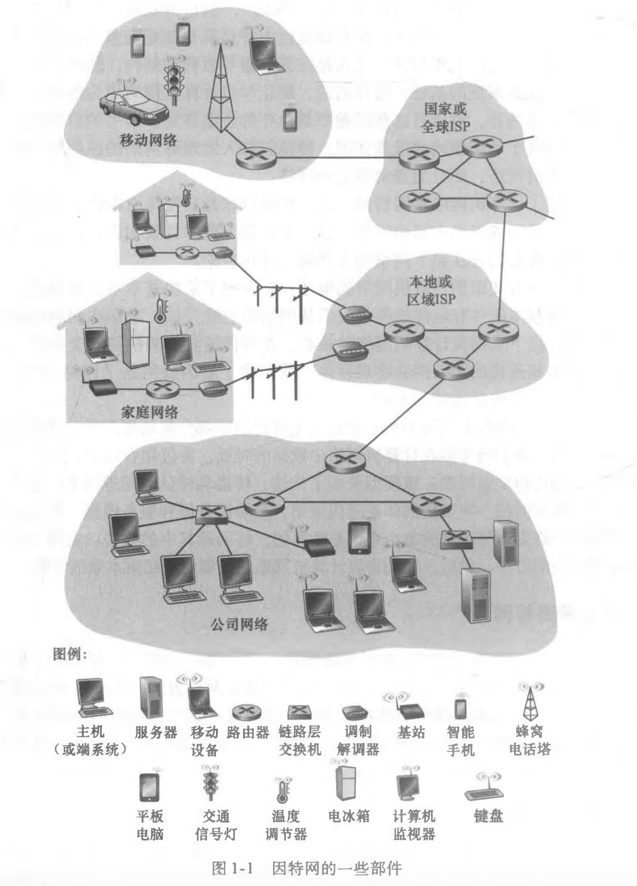
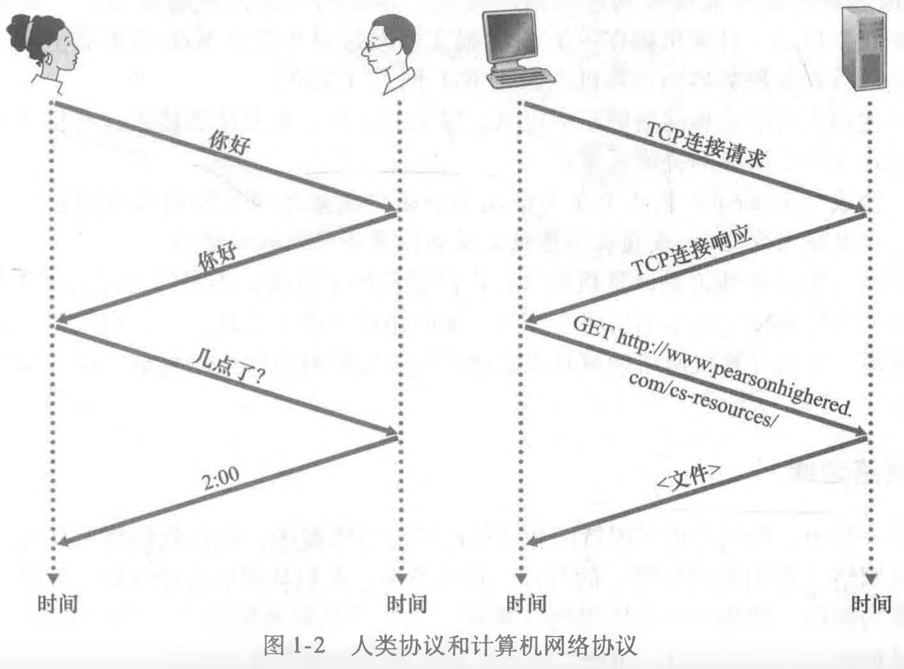

# 计算机网络

课程目标：

掌握计算机网络的以下这些

- 基本概念
- 工作原理
- 常用技术和协议
- 为后面学习、应用和研究计算机网络打基础

学习建议：

**对于知识技能更新速度非常快的领域，最长远的做法是掌握最基本的原理、技术和协议，常见的一些思维方法，思考问题的方法。有了这些基础，对于新出现的技术和知识，就能很快的进行学习和吸收。同时学会抓重点。**

课程特点：

- 计算机网络的重点就在那些大量的概念和术语。
- 计算机网络中涉及的推理是定性的逻辑描述的推理（不同于数学逻辑推理），很多概念和原理使用表述性的方式来讲述的。
- 各种概念之间的关系，推理过程，包含关系等。

课程基本内容：

- 计算机网络导论：介绍大量关键术语和概念，计算机网络工作的原理和基本框架，计算机网络发展史。（解答：是什么，怎么工作）

  

- 应用层

- 传输层

- 网络层：数据平面

- 网络层：控制平面

- 数据链路层、局域网和物理层（更接近通信原理课程）

  

- 网络安全
   网络安全的特性和怎么实现网络安全

- 无线和移动网络

  两者的差别，技术的不同

- 多媒体网络

  介绍网络中有哪些多媒体应用和这些应用对网络的需求，下层协议是如何更好的支撑这些多媒体应用的，各层做的工作

- 网络管理  

  

每章分为两部分：

- 原理部分（本层的功能，和提供的服务和怎么实现）重点在原理的讲解，每层主要的功能和为上层提供的服务，每一层向上层提供接口服务，本层功能的实现需要调用下层提供的接口才能实现（**分层**）

  原理重点讲解：本层功能如何借助于下层提供的服务，怎样在本层功能实体的内部，采用各种各样的软硬件，实现自己的功能，再通过接口向上层提供更完善的服务。

- 实例部分讲解当前所在层的典型的通信协议（应用层：http（web应用），ftp（文件传输应用），smtp/pop3（电子邮件应用）；传输层：TCP，UDP）

- 不同协议提供的服务特性是不一样的，一些应用对可靠性要求高对实时性要求不高，一些相反。

传输层的 TCP 协议实体向上层提供的是可靠的数据传输服务，可靠的特征：

1. 不出错

2. 不乱序

3. 不重复

4. 不丢失

为了提高可靠性，必须实现以下情况：

1. 发送数据报后，在收到对方的确认之前，自己必须留有副本，以应对丢失后重传
2. 发送的数据报可能乱序到达，所以需要在发送前一一编号
3. 每个数据包都需要彼此的确认
4. 出错后的重传，超时重传
5. 校验数据报完整性
6. 排序

**对于事务性的应用，或者实时性要求高的应用一般都使用的是 UDP 协议。事务性的应用只需要一次单次往返通信就可以达到目的的应用。**

 

应用层的协议是在传输层提供服务基础上，两个远程的应用进程之间的通信交互，应用层协议规范了两个远程应用进程之间通信的规则（规则包括语法，语言和时序），传输层为网络应用进程提供服务的。 

传输层是在网络层提供的是**端到端**的服务基础上实现的，两个主机接入互联网（端到端）之间通过很多跳实现连接。网络层提供源主机到目标主机之间的、以IP数据报为单位的数据交互。传输层在主机到主机的基础上提供了主机之上的进程之间的服务（细分：从主机到进程，加强：从不可靠到可靠）。

网络层提供的服务是尽力而为的，可能不确定是否丢包，乱序，出错等。

网络层提供的是端到端的服务，它必须要在数据链路层提供的相邻两点之间的传输服务的基础上。每一跳，从一个网卡到相邻另一个网络交换设备的网卡，是借助网卡提供的数据链路层的点到点服务实现。

点到点：包括主机到路由器，路由器到路由器，网卡到网卡等。

端到端的连接基于数据链路层的相邻的两点之间点到点的服务。从一个网卡到相邻设备的另一个网卡之间是基于数据链路层的协议实现的。 

物理层将来自数据链路层的数字信号转为物理信号（光信号或者电磁波）借助物理媒介，到达下一跳后再解析为数字信号和拆解后交给上层进行处理，以实现在相邻两点之间进行传输。

网络层的数据平面和控制平面： 

**网络层**的工作方式有两种

1. 传统方式，在网络层有两种协议，IP 协议和一些路由协议
2. SDN

在互联网的网络层分为两个协议：IP 协议和路由协议

ip协议的作用

路由协议：运行在路由器上的软件被称为路由实体，跟其他路由器的路有实体，会不停的交换一些路由报文信息（子网信息，跳转信息，延迟，是否可到达），得到这些信息后，路由器按照路由选择算法，算出路由表。 路由表包括ip子网，传输路径等等。

路由表是由路由器上的软件算出来，ip协议来使用，来了一个数据包，ip协议根据到来的数据包，查询算出来的路由表，来决定该数据包从哪个网段的网卡发出去，以及下一跳的信息。网络层主要的功能是：路由和转发。

路由由路由器上的软件实体之间交换信息，执行路由算法计算得到路由表。  当有一个数据包到达路由器后，由IP协议对到来的数据包根据路由表信息在从特定的端口转发处理。

传统方式的工作原理是写死的，不灵活，原理是来了一个分组（数据帧），查询之前已经通过路由实体之间通信后进过算法生成的路由表，查到分组对应的路由网段然后转发，查不带按照默认的路径转走 。  路由器设计好后不会变，很难升级。

随着网络发展，创造了一套更灵活的工作方式：SDN（软件定义网络）有数据平面（交换机）和控制平面（网络操作系统，注：不是PC上的操作系统）。在网络操作系统上运行各种网络应用，用于算流表的应用；网络应用算出流表（流表包括：源ip，目标ip，源mac，目标mac等许多字段），流表再通过标准协议，拦向接口，将流表发给数据平面的交换机，交换机将流表上载，来了分组后，将分组（数据帧）中的源ip，目标ip，源mac，目标mac等许多字段和流表中的进行匹配，根据流表描述的行为（转发，广播，拦截，改字段），来处理分组。

SDN方式和传统网络层的工作方式的不同是：

1. 使用的字段的类型不再一样，传统方式只用了目标ip，SDN方式采用源ip，目标ip，源mac，目标mac等许多字段来识别一个数据包
2. 网络应用可以自定义不同的运算方式，得到不同的流表，下发给交换机
3. 交换机根据匹配完的流表，可以进行许多不同的动作而不仅仅只有转发

可以看出SDN方式提供的功能中包含了传统方式的只是转发的功能，在SDN的情况下，去实现各种网络功能，以前各种网络设备（防火墙，路由器，交换机，负载均衡设备）都可以统一到一个框架下，对运营商来说只需要部署SDN交换机，该交换机上跑一些SDN的网络操作系统及其应用，需要什么网络功能，就在该操作系统中部署相应功能的应用就能解决。

在传统的网络层的工作方式当中，IP协议就是转发分组，行为僵化，来了分组，跟路由表匹配目标IP，找到相应的表项，动作只有一个：进行转发。这样的网络是僵化的，不可编程的。在SDN的方式下，则是可编程的，网络运营商在部署各种新的网络应用时，在SDN部署完后，很快就能在此基础上实现新的功能。

会区分并讲解传统方式和SDN方式下的网络层控制平面（传统方式下的控制平面：路由  和  SDN方式下的控制平面：网络操作系统，他的功能和组成应用和工作原理）

数据链路层是在物理层提供的服务基础上，传输相邻两点之间的以帧为单位的数据的。

计算机通信过程和通信协议。

- 电信网络（电话，手机）
- 计算机网络（计算机通信）
  - 因特网
  - 其他网络（政府，军队等）
- 有线电视网络（电视，一般是单项的，点播电视就是双向）

计算机网络的功能：

- 连通行，计算机彼此连通，交换信息
- 共享，信息，软件硬件共享
  - 软件共享：比如云服务器，用户可以在远端通过电脑连接登录到服务器，并使用服务器中安装好的软件
  - 硬件共享，局域网中，一台电脑连接了打印机，另一台没有连接，这时前一台电脑可以共享打印机，那后一台就可以通过网络去使用打印机

## 第一章（概论）

### 要点 

- 了解计算机网络主要的概念和术语
- 掌握网络的基本工作原理，网络是什么，基本工作原理
- 为后面那些章节打下**概念和框架性和术语**的一个基础
- 什么是网络，什么是计算机网络，什么是互联网以及组成
- 支撑网络工作的协议，什么是协议
- 边缘网络，接入网络（中间网络）和核心网络的组成，作用和工作原理 和 物理媒介
- 网络的工作方式：分组交换和线路交换的工作原理，优缺点
- Internet/ISP分层结构，每一层的作用
- 计算机性能指标，各种延迟
- OSI 七层参考模型
- 企业中的局域网和广域网
- 计算机使用 TCP/IP 协议族通信过程
- 数据的封装和解封过程
- 集线器，交换机和路由器的工作和所属层
- 计算机网络分类
- 局域网设计

### 什么是互联网

**什么是网络**

各种动物界，人类界的实体或者抽象**节点和边**组成的网状结构（拓扑）。

**什么是计算机网络**

联网的计算机构成的系统。计算机网络中的典型节点：主机及其上面运行的应用程序，各种联网家电，数据交换节点（路由器，交换机，高层的负载均衡设备等）。

节点有主机节点，数据交换节。像路由器交换机，它既不是源，也不是目标，来个分组，从一个端口进来按照一定的工作方式（如果是交换机的话，按照目标mac地址决定从这个方向转；如果是路由器的话，通过这个网络的这个端口输进来，通过网卡查路由表，决定从某个方向放出去）。路由器和交换机只是工作层次不同，作用不同，路由器是工作在网络层的，交换机是工作在链路层的。

各种节点之间通过链路相连。链路的分类：1. 将主机与数据交换节点相连的接入网链路；2. 数据交换节点之间相连的骨干链路。

上面是物理意义上的节点和边。  计算机网络还包括在这些节点上运行的各种协议（规则）。

各个层有各层的协议（物理层，链路层，传输层，应用层协议）。每层的协议可能有若干种。对等成实体在通信过程当中应该遵守的规则的集合。

**什么是互联网**

互联网是由一堆的网络通过网络互联设备（路由器）链接构成的网络的网络。不同的网络处在互联网中的层次也是不同的或者跨层的。

互联网中是以分组交换的方式来进行工作的，分组交换必然涉及丢包，分组传出的延迟（四大延迟）衡量分组交换一个非常重要的指标是：吞吐量。

指一个以TCP/IP为主的一簇协议来支撑工作的那个计算机网络。

互联网的端节点：

- 主机端系统，端系统包括：硬件，操作系统，网络应用
- 运行网络应用程序

通信链路：

- 光纤，同轴电缆，无线电，卫星

  

各种协议：

协议：对等层实体，在通信过程当中应该遵守的规则的集合，规定了语法，语义和时序。

互联网是一堆的网络通过网络互联设备（路由器）链接在一起的网络的网络。不同的网络所处在互联网中的层次也是不一样的。

互联网中的IP网络是按照分组交换的方式来工作的，分组交换必然涉及丢包，各种延迟（四大延迟）等。

讲述的对象：计算机网络中的子类——互联网及其协议的主要载体。

**回答什么是互联网的角度：**

1. 通过讲述互联网的具体构成（即互联网的基本硬件和软件）
2. 通过讲述互联网所服务的对象来解释互联网（为分布式应用提供服务的联网基础设施）

#### 具体构成角度

硬件和软件。

- **主机（host）**或者**端系统（end system）**：如PC，Linux工作站，服务器，路由器，交换机，调制解调器，基站，家电，智能手机，传感器等。

端系统通过通信链路和分组交换机连接。

- 通信链路

  > 通信链路有多种类型物理媒体组成：同轴电缆，铜线，光纤，电话线和电磁波等。
  >
  > 不同的链路的传输数据的速率不同，单位是bit/s（bps）。
  > 
  >
  >
  > 端系统通过通信链路链接到分组交换机。

- 分组交换机（路由器和链路层交换机）

  > 分组交换机通过一条 入通信链路接受到达的分组，并从它的一条出通信链路转发该分组。**最典型的分组交换机：路由器和链路层交换机。**
  >
  > **链路层交换机常用于接入网，路由器常用于核心网。**
  >
  > 

扩展：

两个端系统通信时，端系统将数据分段并为每段都加上首部字节，这样的信息包被称为**分组（packet）**。

从发送端系统到接收端系统，一个分组所经历的一系列通信链路和分组交换机称为通过该网络的**路径（mute或path）**。

- 各层级ISP

> 端系统通过**互联网服务提供商**（ISP）接入互联网。**每个ISP自身就是一个由多台分组交换机和多段通信链路组成的网络**，ISP有许多分级。
>
> 各级ISP可以为端系统提供不同类型（速度和费用也不同）的网络接入，类型有：
>
> 1. 线缆调制解调器或者DSL宽带接入
> 2. 高速局域网接入
> 3. 移动无线接入
> 4. 通过光纤等直接接入ISP的核心路由（主要面向企业）
>
> 各级ISP之间也是互联的，低层级的ISP通过高层级ISP互相连接。  高层级的ISP之间通过**高速光纤链路**和**高速路由器**链接。
>
> 每一层的ISP网络都是独立管理的，运行着IP协议，遵从一定的命名规则和地址规则。

- 协议

  各种端系统，分组交换机和其他网络设备上都运行一系列的协议（protocol）。这些协议控制分组的接受和转发

#### 服务对象角度

从**为应用程序提供服务的基础设施**角度来描述互联网（互联网是一套基础设施）。

典型的应用程序有：

1. 电子邮件服务应用
2. web应用
3. 移动端App应用
4. PC端应用

因为这些应用程序**涉及多个在不同的端系统之间的**相互交换数据，所以被称为**分布式应用程序(distributed applicalion)**。这些应用都是运行在端系统中上的，不运行在分组交换机中，而分组交换机只是传输端系统之间需要交流的数据。

通过高级语言编写应用程序，将程序放到不同的端系统中，这些应用之间就需要互相通信，通信基于的就是互联网这个平台进行的。与互联网相连的端系统中提供了一个套接字接口（socket interface）。该接口**规定**了运行在一个端系统上的程序调用互联网基础设施向运行在另一个端系统上的特定目的地程序交付数据的方式。

因特网套接字接口是一套发送程序必须遵循的规则集合。

---

### 协议

什么是协议， 协议的作用。

协议规定了发送和接收的报文格式，以及这些报文发送和接收或其他事件出现时所采取的动作。为了完成一项工作，要求两个（或多个 ）通信实体运行相同的协议 。

网络协议的遵守者是设备硬件和在上面运行的软件，可以根据协议交换报文，根据响应报文采取不同的行为。报文的交换以及发送和接收这些报文时所采取的动作是定义一个协议的关键元素 :

协议（ protocol）定义了在两个或多个**通信实体**之间交换的**报文的格式和顺序**，以及报文发送/接收一条报文或其他事件所采取的动作。

### 网络边缘

边缘网络，中间网络（核心网络），将边缘和中间链接起来的接入网。

#### 端系统

端系统（主机）：它们接入到了计算机网络，同时上面运行着应用程序。（主机又分为：客户端和服务器）

#### 接入网

接入网：指将端系统**在物理层面连接**到其边缘路由器 edge router）的网络。边缘路由器是端系统到任何其他远程端系统的路径上的第一台路由器。

**接入链路和接入网环境**

1. 家庭接入网（DSL，电缆，FTTH，拨号和卫星）

   家庭网络接入主要类型：

   1. 数字用户线（Digital Subscriber Line，DSL），利用电话公司现有的本地电话基础设施进行互联网接入
   
      住户通过从支持本地电话接入的本地电话公司处获取DSL互联网接入，使用DSL时，本地电话公司就是住户的ISP。
   
      每个用户的DSL 调制解调器使用现有的电话与位于电话公司的本地中心局（CO）中的数字用户线接入复用器（DSLAM）交换数据。
   
      家庭的DSL调制解调器得到数字数据后将其转换为高频音，以通过电话线传输给本地中心局；来自许多家庭 的模拟信号在DSLAM处被转换回数字形式。
   
      
   
      电话线同时承载了数据和传统的电话信号，他们用不同的频率进行编码：
   
      1. 高速下行信道，位于50kHz到1 MHz频段；
      2. 中速上行信道，位于4kHz到50kHz频段；
      3. 普通的双向电话信道，位于0到4kHz频段。
   
      这种方法使单根DSL线路看起来就像有3根单独的线路一样，因此一个电话呼叫和一 个因特网连接能够同时共享DSL链路。（频分复用技术）
   
      在用户一 侧，一个分配器把到达家庭的数据信号和电话信号分隔开，并将数据信号转发给DSL调制解调器。
   
      在电话公司一侧，在本地中心局中，DSLAM把数据和电话信号分隔开，并将数据送往因特网。
      
   2. 电缆，利用有线电视公司的有线电视基础设施进行互联网接入
   
      住户从提供有线电视的公司获得了电缆互联网接入。光缆将电缆头端连接到地区枢纽（光纤节点），从这里使用传统的同轴电缆到达 各家各户和公寓。
   
      每个地区枢纽通常支持500-5000个家庭。因为在这个系统中应用了光纤和同轴电缆，所以它经常被称为混合光纤同轴（Hybrid Fiber Coax, HFC）系统。
   
      
   
      电缆接入互联网需要特殊的调制解调器——电缆调制解调器（cable modem） ，该设备通过一个以太网端口连接到家用PC上。
   
      在电缆头端，电缆调制解调器端接系统（Cable Modem Termination System, CMTS）（类比DSL互联网接入中的DSLAM）将来自各个家庭中的电缆调制解调器发送的模拟信号转换回数字形式。
   
      同样，电缆调制解调器将HFC网络划分为下行和上行两个信道。两个通道的传输速率不相同，下行大于上行传输。
   
      电缆因特网接入的一个重要特征是**共享广播媒体**。特别是，由头端发送的每个分组向 下行经每段链路到每个家庭；每个家庭发送的每个分组经上行信道向头端传输。
   
      因此，如 果几个用户同时经下行信道下载一个视频文件，每个用户接收视频文件的实际速率将大大 低于电缆总计的下行速率。
   
      
   
   3. 光纤到户(Fiber To The Home, FTTH)，从本地中心局直接到家庭提供了一条光纤路径。根据具体如何分布光纤，又可以分为：
   
      - 直接光纤，从本地中心局到每户设置一根光纤。
      - 从中心局岀来的每根光纤实际上由许多家庭共享，直到相对接近这些家庭的位置，该光纤才分成每户一根光纤。
   
      在第二种方案（每根光纤由许多家庭共享）中，由分为两种光纤分布体系结构：
   
      1. 主动光纤网络（Active Optical Network, AON)，交换因特网
   
      2. 被动光纤网络(Passive Optical Network, P0N)
   
         PON：图1-7显示了使用PON分布体系结构的FTTH。每个家庭具有一个光纤网络端接器(Optical Network Termi nator, ONT),它由专门的光纤连接到邻近的分配器(splitter) o该分配器把一些家庭(通 常少于100个)集结到一根共享的光纤，该光纤再连接到本地电话和公司的中心局中的光 纤线路端接器(Optical Line Tenninator, OLT) 0该OLT提供了光信号和电信号之间的转 换，经过本地电话公司路由器与因特网相连。在家庭中，用户将一台家庭路由器(通常是 无线路由器)与ONT相连，并经过这台家庭路由器接入因特网。在PON体系结构中，所 有从OLT发送到分配器的分组在分配器(类似于一个电缆头端)处复制。
   
         
   
         FTTH有潜力提供每秒千兆比特范围的因特网接入速率。
   
         
   
   4. 卫星，使用卫星链路将住宅以超过1Mbps的速率与互联网相连。（一般用于偏远地区）
   
   5. 传统电话线的拨 号接入与DSL基于相同的模式，家庭的调制解调器经过电话线连接到ISP的调制解调器，速度很慢

2. 企业接入网

   现在的很多家庭也采用这种方式接入互联网，使用局域网（LAN）将端系统连接到 边缘路由器（主流的局域网技术：以太网）。

   以太网用户使用双绞铜线与一台以太网交换机相连，交换机则再与更大的因特网相连。

   使用以太网接入，用户通常以100Mbps或 1Gbps速率接入以太网交换机，而服务器可能具有1Gbps甚至10Gbps的接入速率。

   无线接入，在无线LAN环境中，无线用户从一个接入点发送/接收分组，该接入点与企业网连接（很可能使用了有线以太网），企业网再与有线互联网相连。一个无线LAN用户通常必须位于接入点的几十米范围内。

   以太网和WiFi接入网最初是设置在企业（公司或大学）环境中的，但它们近来已经成为家庭网络中相当常见的部件。家庭将宽带住宅接入与无线局域网技术结合起来，以产生家用网络。

   住宅中的各种设备通过基站（无线接入点），基站再通过连接路由器，路由器连接调制解调器，再连接到本地ISP中。

   

3. 广域无线接入

   手机等移动设备通过**蜂窝网提供商**运营的基站来发送和接收分组。信号覆盖范围达到数万米。

#### 物理媒介

这些不同的互联网接入技术都使用到了不同的物理媒介，例如：HFC使用了光缆和同 轴电缆相结合的技术；DSL和以太网使用了双绞铜线；移动接入网使用了无线电频谱。

物理媒体可具有多种形状和形式，例子：包括**双绞铜线、同轴电缆、多模光纤缆、陆地无线电频 谱和卫星无线电频谱**。

物理媒体类型：

1. 导引型媒体(guided media)：电波沿着固体媒体前行，如光缆、双绞铜线或 同轴电缆。
2. 非导引型 媒体 (unguided media) ：电波在空气或外层空间中传播，例如在无线局域网或数字卫星频道中。

- 双绞铜线

  常用用于电话网；双绞线由两根绝缘的铜线组成，每根大约1mm 粗，以规则的螺旋状排列着（通常许多双绞线捆扎在一起形成一根电缆）。目前局域网中的双绞线的数据速率从10Mbps到10Gbpso所能达到的数据传输速率取决于线的粗细以及传输方和接收方之 间的距离。

- 同轴电缆

  由两个铜导体组成，但是这两个导体是同心的而不是并行的。常用于电缆电视系统。同轴电缆能被用作导引型**共享媒体**(shared medium) 。特别是，许多端系统能够直接与该电缆相连，每个端系统都能接收由其他端系统发送的内容。

- 光纤

  能传递光脉冲，每个脉冲表示一个比特。传输速率非常快，不易受到干扰，难窃听。一般用于长途传输，主干网。

- 陆地无线电信道

  传递电磁频谱中的信号。有穿透性以及长距离传递信号的能力。但距离根据采用的技术而定（几米到数万米）

- 卫星无线电信道

  一颗通信卫星连接地球上的两个或多个微波发射器/接收器，它们被称为地面站。该卫星在一个频段上接收传输，使用一个转发器再生信号，并在另一个频率上发射信号。

#### 核心网络

##### 分组交换

由连接端系统的分组交换机和链路构成的网状网络。

端系统之间的信息交换通过**报文**实现，通信时，源主机将长报文划分为小的数据块，这些数据块被称为**分组（packet）**，在源主机和目标主机之间，每个分组都通过通信链路和分组交换机（packet switch ） 传送。（交换机主要有两类：路由器（router）和链路层交换机（link-layer switch）。）

分组以等于该链路最大传输速率的速度传输通过通信链路。因此，如果某源端系统或分组交换 机经过一条链路发送一个厶比特的分组，链路的传输速率为尺比特/秒，则传输该分组的时间为**L/R秒**。

**分组交换的特点**

1. 存储转发传输，指在交换机能够开始向输岀端链路传输该分组的第一个比特之前，必须接收到来自输入端链路的一个完整的分组。

   以下图的网络作为示例：

   

   在图1-11所示的特定时刻，源已经传输了分组1的一部分，分组1的前沿已经到达了路由器。因为该路由器应用了存储转发机 制，所以此时它还不能传输已经接收的比特，而是必须先缓存（即“存储”）该分组的比特。仅当路由器已经接收完了该分组的所有比特后，它才能开始向出链路传输（即“转 发”）该分组。

2. 排队时延

   每台分组交换机有多条链路与之相连。对于每条相连的链路，该分组交换机具有一个输出缓存（output buffer,也称为输出队列（output queue）），它用于存储路由器准备发往那条链路的分组。

   如果到达的分组需要传输到某条链路，但发现该链路正忙于传输其他分组，该到达分组必须在输出缓存中等待。这就引起了**排队时延**。

3. 分组丢失

   因为缓存空间的大小是有限的，一个到达的分组可能发现该缓存已被其他等待传输的分组完全充满了。在此情况下，将出现分组 **丢失（丢包）**（packet loss）,到达的分组或已经排队的分组之一将被丢弃。

   

**转发表和路由选择协议**

路由器从一条通信链路得到分组，然后决定从另一条通信链路转发该分组。如何确定从哪条链路转出，不同的计算机网络以不同的方式完成分组转发的。以互联网为例：

在互联网中，每个端系统具有一个IP地址。当源主机要向目的端系统发送一个分组时，源在该分组的首部包含了目的地的IP地址。该地址具有一种等级结构。当一个分组到达网络中的路由器时，路由器检查该分组的目的地址的 一部分，并向一台相邻路由器转发该分组。每台路由器具有一个路由表 (forwarding table),用于将目的地址(或目的地址的一部分)映射成为输岀链路。当某分组到达一台路由器时，路由器检查该地址，并用这个目的地址搜索其转发表，以发现适当 的出链路。路由器则将分组导向该出链路。

路由表的产生：可以人工对路由器进行路由表配置，也可以根据一些路由选择协议，自动地设置路由表。

##### 电路交换

在电路交换网络中，在端系统间通信会话期间，预留了端系统间沿路径通信所需要的资源（缓存，链路传输速率）。在分组交换网络中，这些资源则不是预留的。在电话交换网络中，会话的报文按需使用这些资源，其后果可能是不得不等待（即排队）接入通信线路。

在发送方能够发送信息之前，该网络必须在发送方和 接收方之间建立一条连接。这是一个真实的连接，因为此时沿着发送方和接收方之间 路径上的交换机都将为该连接维护连接状态。

当连接建立时，它也在连接期间在该网络链路上预留了恒定的传输速率（表示为每条链路传输容量的一部分）。既然已经为该发送方-接收方连接预留了带宽, 则发送方能够以确保的恒定速率向接收方传送数据。

**分组交换和电路交换对比**

---

网络：多台计算机（结点）使用网线（链路）通过**集线器或者交换机**（结点）连接起来就组成了一个计算机**网络**，距离一般小于 100 米。集线器或者交换机负责在同一个网络中转发数据包。

互联网：多个网络通过**路由器**连接起来就组成了互联网。路由器负责在不同网络转发数据包。

路由器设备可以有广域网接口，以太网口用于接交换机。

整个互联网使用的是 TCP/IP 协议族，接入互联网的计算机之间就能相互通信。

不同网段有不同的路由器来选择不同的最佳路径

#### 互联网的三个发展阶段

93 年开始，美国政府不再负责互联网的运营，交给商业公司运营（ISP）

#### 互联网组成

一个计算机既可以同时是客户端也可以同时是服务器，只是该计算机上的某个应用程序是客户端还是服务端。

服务端软件特点：

分组转发是网络核心部分最重要的功能。

互联网核心部分用到的技术：分组交换

互联网的核心部分的典型的数据交换方式：

- 电路交换（手机电话通信）

- 分组交换（计算机网络通信）

- 报文交换

电路交换：

电路交换的特点：

电路交换不适合计算机之间的通信。

分组交换：

将传输的内容分段进行传输。

路由器（有存储转发功能）：

分组交换的优点：

不足：

报文交换：

要传递的内容就当作一个整体，不分段，发给下一个中转站并完全收到后，再由下一个中转站重复之前的操作发给下一个中转站，最后直到目的地。

三种交换的比较：

### 网络

网络：多台计算机使用集线器或者交换机（通用且可编程的硬件，这些设备可以传输许多不同类型的数据，文本，音频视频，邮件等。）连接起来就组成了一个网络。其中集线器和交换机这些物理设备负责在同一个网络中转发数据包。（接入层交换机和汇聚层交换机）

互连网：使用路由器将上面的各个网络进行连接就形成了互联网。其中路由器负责在不同网络中转发数据包（不一定使用 TCP/IP 协议，可以是自有协议）

因特网（全球最大互联网）：由众多的 ISP 的网络和且各个 ISP 之间的网络彼此互联组成的互联网络，ISP：互联网服务提供商。（采用 TCP/IP 协议族作为通信规则）

不管是企业还是个人都通过光纤或者电话线接入 ISP 的网络，ISP 为它们分配公网地址后才算接入了互联网。

局域网：通常是组织或者单位自己花钱购买网络设备，自行组件，带宽通常在 10M，100M，1000M，自己维护，覆盖范围小。

广域网：通常是花钱租用 ISP 的路线，花钱买带宽，覆盖距离长。

作用范围：

使用者：

ADSL 调制解调器：上传速度慢，下载速度快。电话线连接宽带猫，宽带猫再连接能自动拨号上网的无线路由器。家用的无线路由器是路由器，交换机和无线接入点（AP）三合一的设备。

跨运营商访问服务器速度慢。

手机通过无线信号连接附近的一个基站，基站连接着光纤，信号或者数据通过铺设的光纤电路进行远距离传输或者接入互联网。

手机或者 ADSL 拨号上网都是通过电信网络去接入计算机网络。

### 计算机网络的性能指标

#### 速率

连接在计算机网络上的主机在**单条数字信道**上每秒传输数据这些数据占用的 bit 位数。每秒钟传递多少个 0 或者 1。

数字信道：一台计算机中可以同时存在多个信道，一个信道是本机和远端服务器连接的一条线路。

#### 带宽

网卡或者网络设备的所能传送的最高速率。

带宽低的抗干扰性更强。

#### 吞吐量

#### 时延

发送时延类比或者启动到出站的时间。数据在本机准备，到完全发出本机的网卡的耗时。

#### 时延带宽积

代表一段数据链路上能够承载的最大数据量（装满数据的上限）

#### 往返时间（RTT）Round-Trip-Time

从发送方发送数据开始到发送方收到接收方的响应的这个过程的用时。

#### ddddd利用率

### DNS

互联网上的计算机可以通过多种方式被访问到，典型的方式有：

1. 主机名（hostname），比如www.google.com等，特点是便于人类记忆，因为主机名的长度由数量不固定的字母或者数字组成，所以路由器难处理，所以引入了IP地址
2. IP地址，IP地址由4个字节组成，有着严格的层次结构，如：121.7.106.83，其中的每个字节由一个点号隔开，表示时用十进制（0~255）表示，ip地址从左往右，能得到越来越具体的关于主机位于互联网中的位置信息。

为了协调人类的使用习惯和路由器的使用习惯，引入了一种能进行主机名到IP地址转换的目录服务——域名系统（Domain Name System）。

DNS的组成：

1. 一个由分层的DNS服务器实现的分布式系统
2. 一个使得主机能够查询分布式数据库的应用层协议

DNS服务器通常是运行BIND软件的UNIX机器。DNS协议是运行在UDP协议之上的，使用的端口号是53号。

## 计算机网络的体系结构

网络非常复杂，不是一个平面就能够解决的。它是一层一层解决的，每一层实现一组特定的功能，然后本层借助于下层所提供的服务，通过跟对等层的协议实体相互交换协议的报文来实现的功能。为了是向上层提供更好更优质的服务。那么一层摞一层，最后到了传输层，应用层则借助于传输层所提供的服务交换应用报文，实现各种各样的网络应用。

### OSI 七层参考模型

该模型将计算机之间的数据通信分为了七层（即：七 个步骤）

- 应用层：提供用户接口，发起网络通信的应用程序（客户端程序和服务器程序）
- 表示层：应用层数据的编码方式选择，加密和压缩
- 会话层：通信应用程序之间的连接的建立、维护和释放，可在应用程序之间建立多个连接，访问验证和会话管理

邮件协议（SMTP，POP3），文件传输协议（FTP），web 协议（HTTP），DNS 等。规定客户端能向服务器发送哪些请求（get,post,delete 等），服务器能向客户端发送哪些响应(200，301，302，404，500 等代表什么)，报文的格式。

- 传输层：通信的计算机之间建立连接，实现可靠或不可靠的数据通信，处理丢包重传，流量控制，避免拥塞，分段后的数据的缓存，编号，排序。 （数据确认包）

- 网络层：路由器通过数据包目标 IP，根据自身路由表为数据包在不同的网络中选择路径，路由表可人工配置（静态路由）和动态生成（动态路由）

- 数据链路层：不同网络中，发送数据的机制不同，该层将数据包封装成能在不同网络中传输的数据帧，处理差错检查，出错就对其该数据帧

- 物理层：规定通信的物理设备的接口标准，电压标准，采用不同技术策略实现数据的更快传输

客户端会话层和服务器端会话层建立连接（面向用户）；客户端传输层和服务端传输层建立连接。

不同的网络：

- 交换机或集线器连组建的网络是称为以太网，以太网使用载波监听多路访问协议（CSMA/CD）
- 路由器和路由器之间的网络是点到点的链路，可以使用 PPP 协议或者帧中继站（Frame Relay）协议

以太网中的数据帧用的是目标 MAC 地址和源 MAC 地址，而点到点链路上的帧则不用添加 MAC 地址。

计算机网络通信原理和过程。

计算机各层通信协议

数据包结构和每层对数据包的封装

网络层畅通的条件

传输层协议和应用层协议的关系

各种应用层协议数据包格式

计算机网路主要讲的就是协议。

协议：

- 协议双方
- 协议目的
- 协议内容

网络协议的三要素：

- 语法：数据和控制信息的结构或者格式
- 语义：需要发出何种控制信息，完成何种动作以及做出何种反应
- 同步：事件实现顺序的详细说明

例如计算机网络中的 ip 协议：（一共 32 个字节）

数据+传输层首部+网络层首部+链路层首部

传输层首部：传输层协议需要填写的内容（接收端查看传输层内容决定如何处理）

网络层首部：就是上图的 ip 协议（路由器查看网络层首部，决定怎么走链路）

链路层首部：链路层需要的内容（供交换机使用负责转发）

计算机通信时，是计算机上的应用程序在通信。而程序通常分为两个部分，客户端程序和服务端程序。 对等实体

通常客户端主动访问服务器，而服务器被动接受访问。

客户端能向服务器发出哪些请求（命令），请求的发出顺序，发送请求的报文有哪些字段，这些字段分别代表什么意思；而服务器接收到客户端的请求后能向客户端返回什么响应，什么情况下发送什么响应，发送的响应报文有哪些字段，这些字段的意思等等，都是实现协议规定好的。

比如，对于文件服务器，允许别人上传或者下载文件，这时用的就是 FTP 协议。这个协议规定了一系列的功能，允许用户删除服务器中的文件，重命名文件，上传和下载文件。这些都对应着不同的请求方式。

再比如，对于网站服务器，对于访问网站的应用，就不允许用户进行文件增删改查等文件操作，所以这时采用的通信协议就没有提供这些方法。而访问网站采用是 http、https 协议。

客户端能向服务器发送的请求是由程序的功能而定的。

高级防火墙可以控制应用层协议的方法。能看到应用层协议的防火墙，看不到网络层，链路层的情况。

为了实现应用程序的功能，需要定义通信标准——应用层协议。

比如（应用层协议）：

- 域名解析，客户端找 DNS 服务器进行解析服务，采用 DNS 协议。 （域名解析协议）
- 访问网站，采用 http 协议（超文本传输协议）HTTPS（安全超文本传输协议）
- 发邮件，采用 SMTP 协议（简单邮件传输协议）
- 文件下载与上传，采用 FTP 协议（文件传输协议）
- 计算机自动请求 ip 地址，采用 DHCP（动态主机配置协议）
- 远程登录，采用 telnet 协议，用于远程配置网络设备和 linux 系统

HTTP 协议（Hyper Text Transfer Protocol）超文本传输协议：是互联网中服务器传输超文本到本地浏览器的一种传送协议。 HTTP 是一个基于 TCP/IP 通信协议来传递数据（HTML 文件，图片，视频等）的**应用层协议**。

HTTP 协议工作在客户端-服务器端架构之上，浏览器作为 http 客户端通过 URL 向 HTTP 服务器端即 web 服务器发送请求。web 服务器发送根据接收到的请求，向客户端发送响应信息。

语法：是数据和控制信息的结构和格式；

语义：是控制信息的含义；

同步：规定了信息交流的次序，比如传输层使用 TCP 协议进行可靠传输前需要先建立 TCP 链接，然后再传输数据，传输结束后，要释放链接。应用协议通信，对所执行的命令也有顺序要求，比如使用 POP3 协议收邮件，必须要先验证邮箱账号和密码，再接受邮件。

应用层通信协议的下层：TCP/IP 协议

**封装与解封**

网络是不可靠的，在传输过程中可能丢包。数据在发送的是一段一段的形式发送的。发时可能丢包（如：路由器处理不过来，导致丢包。）客户端在接收到数据后发现不完整，那服务端还需要通过特定的机制重新传一份。同时数据包在发送时，可能走的是不同的链路路线导致乱序到达客户端或者服务端。在接收端也需要对此进行重新排序。 这些操作都是 TCP 协议来管控的。

在两端计算机上实现可靠传输的协议是 TCP 传输层协议。负责可靠传输

把需要传输的文件分段传输，需要加上发出地地址和接收地地址（IP 地址），有 IP 网络层协议管控。（数据包），数据帧每过一个路由器，TTL 减一。只负责传数据包到目的地，丢不丢包，到达顺序乱不乱它不管。

以上都是在计算机内部实现的。

数据帧在链路层中的各个路由之间传输时，会不断的拆封和封装**链路层首部**。

网卡封装 mac 地址，寻找下一跳，这由数据链路层协议来管控。（数据帧）（网卡做的事）（**以太网 首部**）

多方协议（多方参与）。

**分层设计的好处：**

TCP/IP 协议族的体系结构

PPP 协议：Point to Point

OSI 七层参考模型

五层协议对应的数据单元：

应用层： 传输数据单元（PDU）

传输层：数据段（报文）

网络层：数据包

数据链路层：数据帧

物理层：比特 数据帧 + 帧头+帧尾

## 第一章 计算机网络与协议

本章是对计算机网络的初步了解。后面的课程是根据计算机网络的分层来进行一层层的讲解。

- 网络，互联网和因特网
- 企业级网络结构（局域网和广域网）
- OSI（开放系统互连）七层参考模型
- 计算机使用 TCP/IP 协议通信过程，数据封装和解封过程
- 集线器，交换机和路由器及其所在分层
- 计算机网络的性能指标

网络：多台计算机使用**集线器**或者**交换机**（不以集线器或者交换机的台数而定）连接起来就形成了一个网络。(局域网)

交换机链接交换机都是在一个网段的，都属于一个网络。

集线器或者交换机负责在 **同一个** 网络中发送数据包。

互联网：上面说到的网络通过至少一个**路由器**进行连接后的互联网络。

路由器：负责在不同网络中转发数据。

互联网服务提供商（ISP）向用户提供互联网接入业务，信息业务等。

中国三大 ISP：电信，联通和移动。

**internet 接入服务**

Internet（因特网）是全球最大的互联网。在中国主要有三家互联网服务提供商（ISP：电信，移动，联通），它们给用户提供互联网的接入业务等。各个组织的网络和个人用户的网络都会接入 ISP 的网络以成为互联网络的一部分。

个人用户通过电脑通过 电话线+ADSL 调制解调器 连接到中心局，中心局接入 ISP。

因为个人用户的需求绝大部分是上网浏览咨询和视频等，而 ADSL 调制解调器就是专门为此设计的，特点是下载速度快而上传速度慢。

企业可以直接从 ISP 那里拉去光纤直接接入 IPS 的网络，并分配公网 IP 地址。

当跨运营商访问资源时会变慢，因为光纤的最大流量是有限的而使用者很多。

ISP 利用现有的电话网络为用户提供 Internet 接入服务，但是需要使用 ADSL 调制解调器（model）链接电话线和和计算机。 对于一般用户，上网主要是浏览网页，下载视频等获取信息为主，而 ADSL 就是主要针对之类应用而设计的，即下载速度快，上传速度慢。

大型企业的网络需要接入 Internet，则可以直接使用光纤接入。如果为企业的服务器分配了公网地址，则企业的网络就成为了 internet 中的一部分。如果企业为了给网名提供服务，但是自己又没有机房，则可以将服务器托管在网通和电信的机房中。跨运营商访问的网速会慢。某些公司为了解决跨运营商访问慢的问题，可以把服务器托管到双向服务器中。

局域网通常是组织自己花钱购买设备（交换机，集线器）等组件，带宽固定为 10M，100M 或者 1000M，自行维护，覆盖范围小。 广域网常是花钱租用 ISP 的路线和带宽，用于长距离通信。

家庭互联网：

电话线连接宽带猫（Modem），宽带猫连接拨号上网的无线路由器（自动拨号上网）。

家用的无限路由器是路由器，交换机和无限接入点（AP，也可以看作交换机）组合而成。在机体内部，路由器和交换机的 LAN 接口连接，AP 和交换机的 LAN 连接口连接。路由器的 WAN 口和宽带猫的连接，无线路由器拨号后，ISP 会自动的分配一个公网地址。路由器和交换机的 LAN 接口连接的默认地址是 192.168.0.1（也可以自行设置）。

网络：多台计算机通过集线器或者交换机连接就组成了一个网络。集线器或者交换机负责在 **同一个** 网络中发送数据包。

互联网：如果存在多个上面所述的网络，然后将他们之间通过路由器连接起来，则形成互联网。 路由器负责在 **不同的网络**转发数据包。

注意：是否是互联网的关键在于是否连接了多个网段。

#### OSI 参考模型

该模型将计算机通信过程分为 7 层（即 7 个步骤），并规定了每一步所要实现的功能。互联网设备厂商和软件开发者参考该模型设计自己的硬件和软件，以实现不同厂商和软件之间的正常通信。

七层分别是：每一层负责一项具体的工作，然后把数据传递给下一层。每一层为上一层提供服务， 每层实现特的功能 。每次的变化不影响其他层的更改。

- 应用层提供用户接口，特指能够发起网络通信的应用程序。
- 表示层数据的编码方式（ascii 编码，Unicode 编码，二进制编码，是否压缩加密等），发送端和接受端必须以相同的编码方式编码和解码，否则就会产生乱码。
- 会话层通信的应用程序之间建立，维护和释放面向用户的链接。通信的应用程序之间建立会话，需要传输层建立一个或者多个链接。
- 传输层负责在通信的两个计算机之间建立连接，实现可靠的或者不可靠的数据通信，能够实现发送端和接收端的丢包重传，流量控制，拥塞避免。（TCP）
- 网络层路由器查看数据包的目标 IP 地址，根据路由表为数据包选择传输路径。路由表中的条目可以人工添加（静态路由）也可以动态生成（动态路由）。
- 数据链路层不同的网络类型发送数据的机制不同，数据链路层就是将数据包封装成能够在不同网络中传输的数据帧。能够进行差错检查，但是不纠正错误，一旦检测出错误则丢掉该数据帧。
- 物理层规定了网络设备的接口标准，电压标准，尽可能的通过频分复用，时分复用技术在通信链路上更快的传输数据。

例子：浏览器访问服务端网页 

1. 应用层发起数据通信请求，web 服务和浏览器工作在应用 层。

2. 网页中的文字和内容要进行传输，必须转换成数字信息，这就需要对要传输的文字进行

   编码，这是表示层要解决的问题。这个转换过程需要有字符集。信息通过字符集可以转换成数据，数据通过字符集可以转换成信息。

   有些文件内容不是字符，而是图片文件和程序文件，这些文件就不需要字符集进行编码可以直接以二进制的方式传输。有的厄用程序需要考虑数据传轮的安全性，比如 QQ 聊天的内容，就需要在传轮之荀加密， 对方 QQ 收到之后再解密，这也属于表示层的功能。

   有的应用程序在传输数据之前为了节省带宽，需要先进行压缩再传输，比如 QQ 视频聊天，摄像头捕荻的视频经过压缩后传输给对方，对方收到后解压看到视频，这样就减少了视频聊天占用的网络带宽，应用程序实现的这个功能也属于表示层功能。

3. 计算机 的浏览器访问网站， 需要 浏览器和 Web 服务器 的进程建立会话 建立维持会话的功能称为 话层 它提供包括访间验证和 话管理在内的建 和维护应用之间通信的机制。

4. 网页需要通过网络传输到计算机 A,传输之前要进行拆分、装箱，放入缓存，分段编号，依次发送给计算机 A, 计算机将收到的分段放入缓存，这个过程由传输层完成，传输 能够实现可 传输和流量控制。

5. 客户端收到发送过来的分段后，将分段放到缓存，如图 1-13 所示，若收到了编 号连续的笫 1 、第 2 、第 3 个数据段，就会给网站发送一个确认数据包，告诉服务端发送笫 4 个数据段，这时服务器就可以将缓存中的笫 1、笫 2 、笫 3 个数据段删除，接着发送后面的数据段，将网页后面的内容放到缓存准备发送。

   如果网站连续发送了第 1 、第 2、第 3 和第 4 个数据段，但传输过中丢了笫 3 个数据段，计算机收到了第 1 和笫 2 和第 4 个数据段。客户端会给服务器发送一个确认数据包 ，告诉服务器发送笫 3 个数据段以后的数据段。可见网络虽然不可靠 但传输层能够确保发送方和接收方能够可靠地传输数据。传输层也能实现发送端和接收端的流量控制功能，比如发送端发送得快 接收端缓存满了，就会通知发送端减慢发送速度，或停止发送。

6. 从图 1-13 中可以看到路由器是专门负责在不同网络转发数据包的，为数据包选择转发路径。为数据包选择路径的功能由网络层完成，因此路由器工作在网络层。

7. 数据链路层就是将数据包封装成能够在不同链路传输的帧 数据包在传递过程中要经过不同网络 ，比如 集线器 或交换 组建的网络就是以太网 ，以 太网使用载波 侦听 路访问协议 CCSMA/CD) 路由器和路由器 间的连接是点到点的链路，点到点链路可以使用 PPP 协议或者帧中继（Frame Relay ）协议 。数据包要想在不同 型的链路传输需要封装成不同的帧格式 比如以太网 的帧， 加上目标 MAC 地址和源 MAC 地址，而点到点链路上的 帧就不用 MAC 地址。

8. 物理 定了

   络设备 接口标准 、电压标准 要是不定义这些标准，各个厂家生产的网络设备就不能接到一起，更不可能相互兼容 物理 也包括通信技术，那 门研究通信的人就要想办 让物理线路（铜线或光纤）通过频分 用技术或时分 用技术或编码技术 快地传输数据。

程序员开发网络应用 序，他们负责解决应用层、表示层和会话层的问题，他们只关心应用程序之间如何通信 ，通信是否需要加密和压缩，避免出现乱码。

网络工程师负责配置网络中的路由器为数据包选选择转发路径。网络工程师还需要配置交换机，交换机是数据链路层设备。所以网络工程师也负责 OSI 参考模型的数据链路层。他们精通路由器和交换机的配置，那些考 思科认证工程 CCNA 和 CCNP 及考 了华为 络工程师认证的人 可以负责维护企业网络。

#### 计算机网络排错

排除网络故障，建议从 OSI 参考模型的底层向高层逐层检查。网络安全方面的排查也可以参考 OSI 模型，分为物理层安全，数据链路层安全，网络层安全，传输层安全和应用层安全。

表示层负责将信息进行正确的编码和解码，加密和解密，压缩和解压。程序开发人员在开发程序 要正确指定服务器和 客户端使用字符集，避免 产生乱码。

木马程序通常要和远程计算机进行通信，只要通信就会在传输层建立连接 ，我们可以通过查看是否有可疑连接 ，来进步判断是否中了木马。

在自己的电脑上查看传输层建立的连接，以管理员的身份打开命令提示符。输入命令行指令： netstat -nb 该指令会输出到 Internet 的连接。要想知道 tstat 令全部可用的参数，可以输入 netstat /?"将会列 出全部参数 参数的作用。

在查看到可疑的进程名称后，打开任务管理器，在命令行栏信息中找到进程所在的文件路径，然后删除即可。

自底向上排错

- 检测网络连接是否正常（网线是否插好等），物理层 

- cmd 窗口下 输入 ipconfig /all 查看 IP 地址，子网掩码和网关以及 DNS 设置是否正确。 IP 地址正确，ping 一下网关测试是否能和本网段的计算机通信，然后再 ping 英特网公网地址（如 ping 百度官网），检测 internet 是否畅通 网络层。 8.8.8.8 114.114.114.114
- Internet 通常但是还是打不开网页，就继续检测是否能正确解析域名。如果你的计算机配置了一个错误的 DNS，那计算机将不能解析域名，也就无法打开网站。
- 如果域名解析没有问题，但还是不能访问，也许是沿途的路由器不允许访问网站的流量通过

当前互联网通信使用的是 TCP/IP 协议栈，该协议没有严格按照 OSI 参考模型的分层来设计，而是进行了合并，把计算机通信分为了 4 层。

协议栈是指网络中各层协议的总和。

协议的三要素：

- 语法：数据和控制信息的结构和格式
- 语义：控制信息的含义
- 同步：信息交流的次序（比如传输层使用 TCP 协议进行可靠转出前，需要先建立 YTCP 连接，在传输数据，传输结束后要释放连接）

#### TCP/IP 通信过程

web 服务器的 ip，网卡的 MAC 地址

浏览器的 ip，网卡的 MAC 地址

路由器的接口相当于网卡也有 MAC 地址和 IP 地址

**应用层**：对等实体是浏览器和 web 服务器。浏览器和 Web 务器之间通 使用应用 http )。该协议定义了访问网站有哪些方法以及网站响应报有哪些状态。

**传输层**：网页数据在传输之前放到缓存，将数据分段后加上**传输层首部**，传输层首部的格式以及每个字段是为了实现传输 层功能 ，比如可靠传输 、流量控制 、拥塞避免。传输层首部一个重要的功能是给这些数据编号。浏览器的传输层将收到的数据放到缓存，浏览器能够看懂传输层添加的首部，因此**web 服务器的传输层和浏览器的传输层是对等实体**，传输层首部的各个字段以及各个字段数值代表的含义就是传输层使用的协议。

传输层首部：

**网络层**：数据段想通过网络发送给浏览器，必须给数据段添加源 IP 地址和目标 IP 地址以及网络层的控制信息，也就是网络层首部。网络层首部的格式和每个 段是为了实现网络层功能 ，以便网络中的路由器依据网络层首部为数据包选择路径。因此浏览器的网络层 ，以及网络中沿途经过的路由器必须能够理解 Web 服务器在网络层添加首部的格式以及每个字段所代表的含义，因此 web 服务器的网络层、沿途经过的路由器以及浏览器的网络层是对等实体。它们的共同语言就是网络层首部，网络层首部就是网络层使用的协议。加了网络层首部的数据段就称为数据包 ackets) ，为 了表示方 便，图中只使用源 IP 地址和 目标 IP 地址代表网络层首部 。

**数据链路层**：数据包想要在网络中传递，就要针对不同的网段进行不同的封装，也就是封装成不同格式的帧。

使用集线器组件的网络就是以太网，连接在集线器的计算机使用 CSMA/CD 协议进行通信，连接在集线器上的设备都有物理地址（mac 地址），计算机的网卡和路由器的接口也都有 MAC 地址。数据包从服务器发送到浏览器，需要先转给路由器 RouterA。在数据链路层添加数据链路层首部，其中包括源 AC 地址 MA、目 MA 地址 MB ，加了数据链路层首部的数据包 ，称之为帧 （Frame），服务器网卡和路由器 RouterA 以太网接口是数据链路层的对等实体。

数据包在路由器 RouterA 依次转发到 B，C，D 的链路是点到点链路。这样的链路上没有其他设备，发送数据帧不需要添加物理层地址，而是使用 PPP 协议，因此数据包从 C 到 D 需要重新封装成 PPP 协议的帧格式。使用 十六进制 FF 代表地址，其实该地址形同虚设，既不代表源地址也不代表目标地址，接口 C 和 D 是数据链路层的对等实体。

从 RouterC 将数据包发送到客户端浏览器的网卡，需要将数据包封装成以太网的帧格式，需要添加目标 MAC 地址 MF 和源 MAC 地址，路由器 RouterC 的以太网接口和浏览器网卡是数据链路层的对等实体。

以太网首部：

数据包在传输过程中是不变的，但是在数据链路层会根据不同的网络封装成不同的数据帧格式。

注释：物理地址决定下一跳给谁，而 ip 地址决定数据包最终目标地址。如果全球的计算机都使用集线器或者交换机连接，就可以使用 MAC 地址进行通信了。

**物理层**：服务器将数据包封装成帧后，网卡将数字信号变为电信号传送到网络，称为比特。服务器网卡和 RouterA 的以太网接口同时也是物理层对等实体，电压标准和接口标准必须一致。

### 网路排错

ping 域名查看域名解析是否正常

telnet 域名下的具体端口

`telnet www.baidu.com 80`

telnet 无法使用问题：

开启 telnet

比如自己的计算机上网是通过代理服务器上网的。如果代理服务器不存在，则访问不了了。

代理服务器：一般本机访问网站是直接访问目标服务器的。但是如果我选择访问一个其他服务器，让其他服务器去访问好网站后返回给本机。

### 网络安全

wf.msc：设置 windows 本机防火墙，控制进入的流量。

IP 层通过协议号区分上层采用的是 TCP 还是 UDP 协议，TCP 协议采用端口号来区分上层是 http 协议还是 ftp 等其他协议。

## 第二章——物理层

### 基本概念

物理层解决如何在连接的各种计算机的传输媒体（不是指代具体的传输媒体，比如不是指代光纤，双绞线或者无线）上传输数据比特流。

计算机将要传输的数据变为电信号或者光信号或者无线信号进行传输，物理层就是讲述如何在各种介质中更快的传输数字信号或者模拟信号。

#### 典型得数据通信模型

## 第三章——数据链路层

### 基本概念

数据链路层使用的信道主要有两种：

- 点对点信道
- 广播信道

在不同的信道上通信使用的是不同的协议。

### 解决问题

## 第八章——传输层

传输层是网络层和应用层之间的一层，实现计算机之间通信的 **可靠** 传输。

TCP 协议：

应用层协议定义了客户端能想服务器发起什么样的请求，以及服务器能向客户端发出什么样的响应和操作以及各种请求的数据包的格式。

客户端向服务器发送一个请求，这个请求要从客户端传到服务器，文件从服务器传到客户端，还需要计算机有一个传输层，以负责可靠传输。在传输的时候先分段编号放到缓存中，一段一段的传递。每一段在网络层加上网络层的首部（源 IP 和目标 IP），封装为数据包，数据包根据不同的数据链路封装为不同数据帧，路由器帮助实现数据包的路由和转化。

网络层负责将数据包传输到目的地，传输控制可靠传输，如果网络层存在丢包的情况，传输层能知道，并再次补发丢失的数据包。并且传输层感知并发现网络堵塞，还可以降低发包速度。 并且传输层还能更具客户端的接收能力调整发包速度。

通信完成后，两端的传输层还需要释放连接。通信前要建立连接。通信过程中要进行流量控制和可靠传输。

UDP 协议：

它没有流量控制功能和丢包查错的能力。

#### TCP 和 UDP 协议的应用场景

网络中的计算机通信无外乎有以下两种情况：

1. 要发送的内容多，需要将发送的内容分成多个数据包发送。 分段，编号，流量控制，避免拥塞，可靠传输。客户端和服务器需要建立 TCP 连接，通信结束需要释放连接。
2. 要发送的内容少，一个数据包就能发送全部内容。 比如实时语音，视频直播，不需要分段，流量控制，完整传输。 有应用层进行判断，不需要建立连接节省服务器资源。

针对这两种情况，在传输层有两个协议：

TCP（Transmission Control Protocol 即传输控制协议）

UDP（User Datagram Protocol 即用户数据报协议）

**传输层协议和应用层协议之间的关系**

传输层协议加一个端口号来标识一个应用层协议，展示了传 输层协议和应用层协议之间的关系。

**服务和端口号的关系**

在一台服务器中可能会提供多种服务，比如 web 服务，ftp 服务 SMTP 服务。每个服务都会启用一个传输层协议加端口号来监听客户端请求。

一个来自客户端的请求通过 IP 传到服务器后，具体要使用哪像服务，就是通过端口号来确定的。客户端通过 IP 地址定位服务器，通过协议和端口号定位服务 器上的服务。

Windows 和 Linux 操作系统有些服务为本地计算机提供服务，有些服务为网络中的计算机提供服务。为网络中计算机提供服务的服务，一旦启动就会使用 TCP 或 UDP 的某个端口侦听客户端的请求。

客户端软件可以同时访问多个服务器，客户端会为每个出去 的流量分配一个唯一的源端口。服务器上的服务侦听的端口不能冲突，否则将会造成服务启 动失败。

应用层协议也可以不使用默认端口和客户端通信。 如果不适用默认端口通信，客户度需要指明使用的端口。

**端口号与网络安全**

客户端和服务器之间的通信使用应用层协议，应用层协议使用传输层 协议+端口标识，如果在网络设备封掉 TCP 或 UDP 的某个端口，就不能 访问其对应的服务，就可以实现网络安全。设置服务器网络安全，只开放必要的端口。 在 Windows 上可以通过设置 TCP/IP 筛选和 Windows 防火墙来实现。

netstate -an:查看本地监听的端口

netstat -n：查看建立的 TCP 连接

netstat -anb:查看监听端口及其应用程序

mstsc:启动远程连接桌面功能，输入对方电脑的 IP 地址。对方地址必须开启允许远程控制。

telnet 域名 | IP 端口: 测试某个服务器上的对应端口能否访问对应的服务。不要认为对方服务器启动并监听了某个端口，客户端就能去请求访问成功，因为有可能有防火墙导致访问不成功。

除了使用 telnet 命令，还可以使用端口扫描工具，它可以指定一个端口号范围，去查看远端计算机开了哪些端口号，以初步判断该服务器中开启了哪些服务。黑客在入侵时往往就是先扫描端口号，获取服务器信息，饭后通过端口大致判断开启的是哪些服务，web 服务的话，看是什么软件搭建的 web 服务，看有无漏洞，再攻击。

#### UDP 传输层首部和特点

特点：

- UDP 是无连接的，即发送数据之前不需要建立连接（当然发送数据结束时也 没有连接可释放），因此减少了开销和发送数据之前的时延。
- UDP 使用尽最大努力交付，即不保证可靠交付，因此主机不需要维持复杂的 连接状态表（这里面有许多参数），通信的两端不用保持连接，因此节省系统资源。
- UDP 是面向报文的，发送方的 UDP 对应用程序交下来的报文，在添加首部后 就向下交付给网络层。UDP 对应用层交下来的报文，既不合并，也不拆分，而是 保留这些报文的边界。

#### TCP 传输层首部和特点

特点：

- TCP 是面向连接的传输层协议。这就是说，应用程序在使用 TCP 协议之前，必须先建 立 TCP 连接。在传送数据完毕后，必须释放已经建立的 TCP 连接。
- 每一条 TCP 连接只能有两个端点（endpoint），每一条 TCP 连接只能是点对点的（一 对一）
- TCP 提供可靠交付的服务。也就是说，通过 TCP 连接传送的数据，无差错、不丢失、 不重复、且按序发送。
- TCP 提供全双工通信。TCP 允许通信双方的应用进程在任何时候都能发送数据。TCP 连接的两端都设有发送缓存和接收缓存，用来临时存放双向通信的数据。在发送时，应 用程序把数据传送给 TCP 的缓存后，就可以做自己的事，而 TCP 在合适的时候把数据发送 出去。在接收时，TCP 把收到的数据放入缓存，上层的应用进程在合适的时候读取缓存中 的数据。
- 面向字节流。TCP 中的“流”（steam）指的是流入到进程或从进程流出的字节序列。

## 网络层

### IP 地址和子网划分

预备知识：

规律：

给你一个数，请确定最后的 1 位，2 位，3 位，4 位分别是多少？（面试）

例子：176 / 16 余 3 则： 0011 ； 817 / 8 余 1 则：001。

十六进制

网卡的 mac 地址就是用 16 进制表示（48 位 16 进制）。

一个十六进制的数需要用 4 位二进制表示。

### IP 地址

MAC 地址是数据链路层的地址；IP 地址是网络层的地址。

MAC 地址的作用：接到交换机或者集线器上的计算机的网卡或者路由的以太网接口都有 mac 地址，路由器的以太网接口也有 mac 地址。

通过交换机连接的计算机组成一个以太网。

上图有三个网段（三个以太网）。为了将数据包从 A 发给路由器 1，则需要彼此的 mac 地址。交换机读取数据链路层地址，进行数据包的转发。 路由器 1 在接受到数据帧后去掉数据链路层地址，读取目标 IP 和源 IP 地址，查询路由表，寻找下一跳并封装上新的数据帧发出，依次到目标到达目标计算机 F 的 MAC 地址。

什么情况下可以不用 IP 地址而直接用 mac 地址？

如果全球联网都用交换机连接，则可以用 mac 地址。但是这是不可能的，因为一台交换机就得记忆大量的 mac 地址，基本不可能。再者，在一个以太网中，一个计算机要想得到另一台计算机的 mac 地址是需要 ARP 广播请求的，导致发一个广播所有的计算机都能收到，将是一个非常庞大的流量。所以不同网段之间必须用路由器隔开，将 ARP 广播控制在一个有限范围的计算中。

有了路由器就需要网络层地址，让路由器基于网络层地址进行转发，而不是基于 mac 地址进行转发。

**IP 地址的组成**

互联网上的计算机相互通信 IP 地址需要进行统一规划，且不能重叠，必须具有唯一性。规划时，IP 地址又分为网络部分和主机部分（类似电话号码的区号）。

IP 地址由 32 位二进制组成，在计算机中查看 IP 地址时是 10 进制表示的，一共 4 部分，每部分由 8 个二进制表示。最大就是 255.255.255.255。

路由器中不同接口配置的网段必须不同。路由器接口的地址通常情况下是使用该网段下的第一个或者最后一个地址（习惯）。

**IP 地址的格式**

**子网掩码的作用（地址掩码，网络掩码）**

子网掩码能让计算机算出自己处于哪个网段。 因为我们的计算机想要和网络中的其他计算机进行通信，必须首先判断目标地址是否和自己在一个网段，因为在一个网段和不在一个网段的通信过程是不一样的。在一个网段发送 arp 广播直接解析目标计算的 mac 地址，然后封装数据帧后由交换机直接将数据发送给目标计算机。不在一个网段，则发送 arp 广播，解析网关的 mac 地址，封装为数据帧，由交换机发送给路由器，由路由器去转发。

配错子网掩码会造成通信故障。

### **IP 地址的分类**

保留的 IP 地址：

### 保留的 IP 地址

由特殊用途的 IP 地址。

主机位是全为 1 代表本网络中的所有主机，用于计算发送广播包。

169.254.0.0，联网时就会向网络中的 DHCP 服务器发送请求，请求或者一个合法的 IP 地址，如果 DHCP 服务器没有为设备分配有效的 IP 地址 ，windows 系统会自动为本机默认自动设置一个 IP 地址（169.254.0.0 网段下的一个 ip 地址，自动私有地址，临时地址）同时也会尝试继续请求 DHCP 服务器，以尝试获取合法 IP 地址，一旦 DHCP 服务器分配了合法的 IP 地址，则该计算机就能联网了 。

### 公网地址与私网地址

私有 IP 地址：

子网掩码能用到二进制。

# 第一章

互联网是一个非常复杂的系统，连接了数亿计的计算机、通信链路、交换机和路由器，同时要有一批和互联网连接的物品。面对着的有众多不同组成的系统，有一些指导原则和结构能帮助学习者理解互联网，理解互联网的原则和实践。

第一章的目标：

1. 宏观概述计算机网络和互联网
2. 本书的内容框架
3. 背景知识
4. 计算机网络构件以及他们在整个网络中的位置

具体安排：

1. 介绍基本术语和概念
2. 构成网络的基本硬件和软件组件
3. 网络边缘中的端系统和端系统上的网络应用
4. 网络核心的链路和交换机
5. 接入网和物理媒介
6. 网络如何连接起来的
7. 计算机网络中的数据传输的时延、丢包和吞吐量等
8. 计算机网络的体系结构原则：协议分层和服务模型
9. 网络攻击和网络安全
10. 计算机网络的历史

## 什么是互联网

本书讲述的计算机网络对象是——公共互联网。

回答什么是互联网的两个角度：

1. 从描述互联网的具体构成角度回答，即构成互联网的基本硬件和软件组件是什么。
2. 从互联网为什么而存在的角度回答，即为分布式应用提供服务的联网基础设施。

### 互联网的具体构成角度

互联网是一个连接了全球数十亿台计算设备的计算机网络。

典型的计算设备：

1. 桌面PC
2. Linux工作站
3. 服务器
4. 智能手机
5. 平板
6. 其他各种物联网物品

所有这些计算设备都可以统称为——**主机(host)**或者**端系统(end system)**。

端系统和分组交换机之间使用 **通信链路** 连接。

典型的通信链路的物理媒介有：

- 同轴电缆
- 铜线
- 光纤
- 无线电频谱

同时不同的通信链路传输数据的速率也不同，而传输速率使用的单位是比特/秒（bit/s、bps）。一个端系统向另一个端系统发送数据时，常在发送端将数据分段，然后每段加上首部字节，形成的数据包叫一个个的分组，以在计算机网络上被传输。

分组交换机的一条通信链路结构到达的分组，从另一条出通信链路转发该分组。现在典型的分组交换机是：

1. 路由器，常用于核心网
2. 链路层交换机，常用于接入网

从发送端系统到接收端系统，一个分组所经历的一些列的通信链路和分组交换机称为通过该网络的路径（path、route）。

互联网服务提供商（ISP）

端系统通过ISP接入到互联网中。

ISP有：

- 住宅ISP（电缆或者电话公司）
- 公司ISP
- 学校ISP
- WiFi接入ISP
- 移动接入的蜂窝数据ISP

每个ISP自身就是一个由多台分组交换机和多段通信链路组成的网络。

ISP提供的网络接入方式有：

- 线缆调制解调器宽带接入
- DSL宽带接入
- 高速局域网接入
- 移动无线接入
- 直接互联网接入

底层ISP通过连接高层ISP，而高层ISP通过高速光纤链路互联的高速路由器组成。每个ISP都独立管理，运行着IP协议，遵循一定的命名规则和地址规则。

### 互联网存在的作用

为分布式应用程序提供服务的基础设施。

典型的应用程序有：

- 电子邮件
- web应用
- 智能手机应用
- 即时通讯应用
- 有些
- 视频会议等

这些应用程序并不运行在网络核心中的分组交换机中，而是运行在不同的端系统上。互联网上的端系统提供了一个套接字接口，该接口规定了运行在一个端系统上的程序请求互联网基础设施向运行在另一个端系统上的特定的程序交付数据的方式。互联网套接字接口是一套发送程序必须遵守的规则集合。

**协议**

端系统、分组交换机和其他硬件上都运行了一些列的协议，通过协议控制数据包的接受和发送，典型的协议是TCP协议和IP协议。规定了报文发送或者接受的格式和顺序，以及这些报文发送或者接受或者其他事件发生时所采取的动作。

**掌握计算机网络的知识的过程就是理解网络协议的构成、原理和工作方式的过程。**

## 网络边缘

端系统：网络的边缘主要就是各种端系统，这些端系统上运行着各种应用程序。端系统有时被进一步划分为：客户端和服务器。

接入网：将端系统物理意义上 的连接到其边缘的路由器上的网络。

接入链路和几种使用接入网的环境：

1. 家庭接入：DSL、电缆、FTTH、拨号和卫星
   DSL——数字用户线，住户通常从提供本地电话接入的本地电话公司哪里获得DSL互联网接入服务。

 

