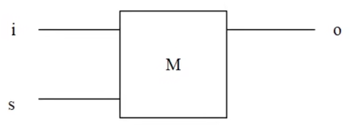

## 前置知识

### 基础门电路

继电器电路的不同串并联能进行逻辑运算。

逻辑非门：输入 1，输出 0；输入 0，输出 1。

逻辑与门：有两个输入，只有都输入 1 时，才输出 1，否则输出 0。

逻辑或门：有两个输入，只要有任何一个输入 1，输出就是 1，否则输出 0。

逻辑与非门：有两个输入，在两个输入都是 1 的情况下，输出 0，其他情况都输出 1。

逻辑或非门：有两个输入，在两个输入都是 0 的情况下，输出 1，其他情况都输出 0。

逻辑异或门：有两个输入，在输入相同时，输出 0；输入不同时，输出 1。

逻辑异或门能用于两个一位二进制数的加法运算，但是如果在a和b输入都为1的情况下，输出的本位是0，由于没有考虑进位，所以进位丢失，但只看本位的话，符合二进制加法的运算结果。

### 逻辑门运用

#### 比特存储装置 

通过一个设置位开关，控制了 1 比特信息的输入。简易符号：

逻辑门组成：

in 表示输入，out 表示输出，set 负责控制输入能否被设置到输出（开关）。

- **如果 out 目前存储的状态是0**，接下来将 in 的状态置为 1，并将 set 设置为 1（允许输入），最后导致输出 out 被设置为 1，这就将输入状态设置到了输出中
- 修改输入状态 in 为 0，set 仍旧为 1，out 为**之前（上一次）**的值 1，最后输出 out 被设置为 0，再一次将输入状态设置到了输出中
- 如果把设置为关闭为 0，无论 in 为 0 还是 1，out 不会改变（维持原来的值）

### 字节存储装置

将 8 个 bit 装置并排，通过同一个设置位，同时控制 8bit 的输入，达到一次控制一个字节的输入。

上面的字节存储装置还只能控制是否允许输入，而无法做到控制是否允许输出。

#### 比特输出控制装置

如果 e 位打开（设置为 1），则 8 位输入经过 8 个与门后将保持原值输出。如果 e 位关闭（设置为 0），则无论输出值为多少，都将输出 0。所以这种装置可以用于控制输出。

#### 寄存器

**将上面的一个字节的输入控制装置和输出控制装置进行组合**，得到一字节的存储器，既能控制输入，又能控制输出。

寄存器之间的数据移动：

如果要将寄存器 r1 存储的状态输出到寄存器 r3，首先要将 r1 的输出打开，r1 存储的状态就输出到了总线，再将 r3 的输入打开，就将总线状态设置到了 r3，随后先关闭 r3 的输入，再关闭 r1 的输出，这样就将 r3 设置为与 r1 相同的状态，也就是所谓的将字节从 r1 移动到了 r3。

### 寻址和控制输入输出

#### 解码器

通过多路输入选择一路进行输出。

现在有两行两列共 4 个寄存器，通过总线相连，这四个寄存器有各自的输入控制位和输出控制位，现在的需求是**明确控制某个寄存器，打开或者关闭它的输入（s）或者输出（e）控制位**，以选中 R1 的输入控制为例子（即将 R1 的 S 位设为 1）：

但是 R1 的输入是否打开有两个条件，而且两个条件必须都成立才行，所以适合在 R1 的 S 位前放置一个与门，一个输入来自 CPU 的状态，另一个输入来自寄存器的选中状态，而是否选中某个寄存器也有两个条件（即寄存器所在行被选中和寄存器所在列被选中），而且必须两个条件都满足，才能表示选中指定位置的寄存器，所以也适合用于个与门。参考下图：

这样总线的状态就被设置到 R1 寄存器中了。之所以上面没有选中R3，是因为R3的所在行没有选中；而R2没有选中，是因为所在列没有被选中。

即控制输入也控制输出的示图：

**下面实现数据从R3输出到总线，再从总线输出到R2的过程**

打开 R3 的输出：数据从R3输出到总线

打开 R2 的输出：数据从总线输入到了R2

**如何选中特定寄存器？**（下图是两行两列，4 个寄存器，通过总线相连）并打开它的输入或者输出。通过**解码器**，可以将来自 PC 寄存器（内存地址寄存器，Memory Address Redigter）中的内存地址二进制数，解析为选中特定行和特定列的电信号——寻址。然后通过来自控制器的输入控制信号**或者**输出控制信号，激活整个内存，打开内存的内存的输入或者输出，就能实现寄存器到总线，总线到寄存器以及寄存器到寄存器的字节的**复制移动，源地址内的数据并没有消失** 。

上面就是一个随机地址寄存器（RAM，Random Access Memory）——内存。

#### 迷你内存

用 4\*16 的解码器，可以通过 4 位二进制数的输入选择出 16 路中的 1 路进行输出。两个 4\*16 解码器就能选择 16\*16，一共 256 个不同的地址。

解码器的输入来自一个提供行号和列号的寄存器 —— 内存地址寄存器（MAR），用 4 比特存储行号，另外 4 比特存储列号。

上面迷你内存的简易符号：

### 算数与逻辑运算

#### 字节运算器

一个与门能得到 2 个 bit 的逻辑与运算结果，如果将 8 个与门组合起来就能得到两个字节的逻辑与运算结果。逻辑或，异或等也是类似。

逻辑非则是用到 8 个非门就能完成**一字节**的逻辑非运算。

#### 移位运算

通过两个寄存器的简单电路组合实现移位操作。

当进行**逻辑右移**时，移入位的值由具体的计算机体系结构决定。大多数计算机体系结构中，逻辑右移的移入位都是用0来填充。这是因为逻辑右移是一种逻辑操作，不考虑数字的符号，只是简单地将所有位向右移动，不论原始数字是正数还是负数。使用0填充移入位可以保持逻辑上的一致性，并确保结果正确。

**算术右移**会根据原始数字的符号来填充移入位。当原始数字是正数时，算术右移会使用0填充移入位，而当原始数字是负数时，算术右移会使用1填充移入位，以保持符号位不变。

#### 加法器

二进制加法用于计算两个不同的二进制数的**某一个本位**的相加结果时，需要考虑**三个作为输入的**二进制数字的逻辑运算结果，这三位分别是两个二进制数的本位和两个二进制数的**前一位**的相加结果（进位）的值，同时记录两个计算结果值，分别是相加后的：**本位结果值** 和 **进位值**。

下面考虑本位sum的情况：

1. 上一位的 carry in 为 0 ，当 a 和 b 相同时，sum 为 0 ；a和b不同时，sum 为 1 ，对应 a 和 b 的异或逻辑
2. 上一位的carry in 为 1，当 a 和 b 的异或逻辑为 1 时，sum 为 0；当 a 和 b 的异或逻辑为 0 时，sum 为 1

所以本位sum 的值就是： sum = `a^b^carry in`

下面考虑进位 carry out 的情况：

1. carry in 为 0，当 a 和 b 都为 1 时，carry out 为 1
2. carry in 为 1，当 a 和 b 的异或逻辑为 1 时，carry out 为 1
3. 当 a 和 b 的与逻辑为 1 时，carry out 为 1

根据上面的逻辑运算结果的到最后的1bit的加法运算器。

对应的逻辑电路图：

字节加法器：前一个1比特加法运算装置的carry out 作为本一比特加法运算装置的carry in。

#### 比较器

比较两个字节的大小。当比较两个字节时，**会从两个的高位比特开始**，上一位 bit 相等则继续比较下一位。

注意：**这里使用到3路输入的逻辑与门，必须要三路输入都为1时，逻辑门才输出1（虽然前面的课程中每个逻辑门都是两个输入，逻辑非门除外，但是并不意味着逻辑门只能有两路输出，也可以有多路输出的逻辑门）**。

字节比较器

#### 判零器

#### ALU（算数与逻辑单元）

将上面的逻辑电路组合起来就组成了 CPU 的 ALU——运算器。

对于上图中的每个运算逻辑都会同时接收到 a 和 b 作为输入，但是同时有一个 3\*8 解码器，他的电信号会选择唯一的一种运算的结果的输出。**该解码器的默认输入 opration 为 000，对应选中的就是加法操作。** 加法器接受到输入的 a 和 b，只有加法器后面的输出是打开的，所以 c=a+b，如果加法器产生了进位 carry out，由于此时选择的是加法器，则 ALU 输出的 carry out 就是加法器产生的进位，而不是左移或者右移产生的移出位。 比较器是一直在工作的（**对应的3*8解码器对应的输入是111**），且判零器会一直检测输出的c是否为零。

**接下来**：在内存中存储一些操作指令（二进制数），事前规定每种操作对应的二进制编码。

IR寄存器：用于存储从内存中加载过来的二进制操作指令。

IAR寄存器：用于存储下一步要加载到IR寄存器中的二进制操作指令所在的内存中的地址（这个地址二进制会被内存的地址解码器用于内存寻址）。

Control Section是CPU中的控制器部分，用于解析来自IR寄存器中的操作指令，然后将解析后的数据传递给ALU或者用于选中数据寄存器（R0~R3），以完成不同的操作。

即使是一个简单的指令，也可能需要经过好几个步骤（即好几个时钟周期）才能完成，比如汇编指令中的LOAD（从内存中加载数据到CPU的寄存器中）指令，寄存器R1存放着一个内存地址，该内存地址上的数据就是需要加载到CPU的寄存器R2上。这起码要经过两个大的步骤：

1. 将R1中的内存地址数据加载到内存中的内存地址寄存器中
2. 内存中的解码器根据内存地址寄存器中的二进制数据，解析并选中内存中的特定位置，并将该内容移动到CPU中的寄存器R2中

这些操作是一步一步有先后顺序的执行，这就需要一个一步步协调的装置——**步进器**。

### 步进器

时钟装置，它对应的就是周期频率就是 CPU 中的主频。以赫兹为单位。 

借助时钟装置组装步进器。

**步进器**

clk：来自时装装置的输出。

M：一个一比特的比特存储装置，只能控制输入，不能控制输出，一旦输入打开，对应的输入会立即将输出转为输出（就是一个开关）。

最初这些比特存储装置内部存放的都是0，则M2输出的也是0，经过1号非门，控制的stepper1输出为1（初始状态），当clk第一次变为1时，M2等偶数号装置的输入打开，但是M1的输入是关闭的，所以M2接收到的来自M1的信号仍旧是之前的0，所以stepper1的输出仍旧是1。接下来clk为0，所有偶数号的M都关闭输入，基数号的M都打开输入，M1接收到reset经过非门输出的1，所以M1的状态被设置为1，但是M2的输入控制为0，是关闭状态，所以M2的输出仍旧是0，经过1号非门后stepper1仍旧是1，所以在第一个时钟周期中，只有stepper1输出1，其他stepper都输出0。 

在第二个时钟周期，clk变为1，M2等偶数的M输入位打开，基数位M的输入关闭，但是前一个周期中M1的状态已经置为1了，所以M2接收到M1输出的信号1并输出1，导致经过1号非门后stepper1的状态为0，于此同时M4的输出0经过2号非门变为1，和来自M2的输出1，一起经过与门导致stepper2输出为1。  当clk再次变为0时，M3输入打开，接收到M2输出的1，但是M4输入关闭不受M3的影响，输出仍旧是0，经过2号非门，stepper2仍旧是输出1。

从上面两个周期就能看出，整个过程的规律。得到这个步进器的工作原理。

最后一步，reset会接收到M12输出的1，导致整个步进器所有M依次被重置为0，恢复到初始状态。

**如果在步进器的每个 step 打开时，按照特定顺序控制一些寄存器的输入和输出，就能完成一些流程性工作。**步进器的背后是时钟装置，它的一个周期叫时钟周期，单位时间内能执行多少个时钟周期就能表示为频率。 

CPU 中的控制器就是**利用步进器在每一个时钟周期内控制一些寄存器的输入和输出以完成操作指令**。

CLK S 输入控制位，用于控制各个寄存器的输入。 

CLK E 输出控制位，用于控制各个寄存器的输出。

如下图的链接方式：保证源寄存器先打开输出控制，后关闭输出控制位（早打开晚关闭），目标寄存器后打开输入控制，先关闭输入控制（晚打开早关闭）。

要完成内容从源寄存器到目标寄存器的移动，源寄存器的输出必须先于目标寄存器的输入控制位的打开而打开，后于目标寄存器的输入控制位的关闭而关闭。

**指令加载**

> 提前说明bus1的内部图：
>
> 

在 step1 中将 IAR（指令地址寄存器）的输出打开和内存地址寄存器 MAR（解码器）的输入打开，这样就将下一条指令所在的内存地址所在信息传输给了内存中的地址解码器（MAR），同时会将 IAR 中内存地址数据输入到 ALU 的 A 和 TMP 中，但是此时 bus1 中来自控制器的输入为 1，导致最后输入到 ALU 中的 B 的数据为 00000001，而 ALU 的默认 opertation 为 000，默认执行加法操作，所以就是将 IAR 中的内存地址进行加一操作，然后存放在 ACC 寄存器中。

在   step2 中，打开RAM的输出控制位，打开IR的输入控制位，将经过 step1 选中的内存地址（RAM中的内存地址）中的数据输出到指令寄存器（IR）中。这样就完成了一次指令的加载。

在 step3 中，将 ACC 寄存器中的数据输出到总线，打开 IAR 寄存器输入，这样就将原来的内存地址+1后存入到指定地址寄存器中了。

对于每一条指令而言，前三步的布线都是一样的，所以只能在 4，5，6 中实现指令对应的操作。

step1中的工作：将指令地址寄存器IAR中的内存地址数据交给内存中的内存地址寄存器MAR，同时将指令地址寄存器IAR中的数据交给算数与逻辑运算单元的输入A，同时设置bus1的值为1，并打开ACC寄存器的输入控制，ACC接收到指令地址寄存器IAR中数据和bus1中的数据加一后结果。

step2中的工作：将内存地址寄存器MAR中数据经过内存中的解码器解析后选中的内存地址中的指令加载到指令地址寄存器IR中。

step3中的工作：将step1中ACC寄存器输出打开，指令地址寄存器IAR输入打开，将加一后的内存地址数据存入指令地址寄存器IAR中。

计算机要执行的指令一般是被连续放在内存中的，一般只需要将内存地址加1就是下一条指令所在的内存地址了。当然一些跳转指令会修改下一条指令的内存地址信息，但本质指令仍旧是连续存放的。

CPU 要支持哪些指令，每个指令对应特定的布线来完成对应的功能，就需要先设计好指令集（指令编码）。下图是指令编码设计：

每条指令由8位二进制数组成。低四位中的以两位为一组，每组两个二进制数能通过2*4解码器选中4个寄存中的其中一个。

指令的高4位用于记录操作类型，其中指令的操作类型又分为两大类：

1. 算数与逻辑运算类指令
2. 其他类指令，比如常见的加载，存储和跳转操作指令

用最高位是1还是0来区分两类指令。其中最高位为1表示算数与逻辑运算类指令，0表示其他类指令。

前面的运算器支持8中算数与逻辑运算，所以可以用3位二进制数通过3*8解码器正好选中其中一种运算。

### CPU

在内存 RAM 中存储一些指令。

IR 寄存器：存储当前要执行的指令的寄存器。（指令寄存器，能存储8位二进制数）

IAR 寄存器：存储下一条要执行的指令所在的内存地址。控制器通过复杂的布线，通过读取指令寄存器（IR）中的指令代码，解析为不同的电信号，然后操作寄存器或者将数据传给 ALU，在步进器的每一个周期中分别执行一些动作，以完成最后的指令。

ACC 寄存器：存放 ALU 运算后的结果。

TMP 寄存器：是一个没有输出控制位的寄存器，可以在输入 S 为 1 的情况下直接输出。

Bus1: 可以控制 TMP 是按照原值输入到 ALU 中或者将 00000001 输入到 ALU 中。

对应内存中存放的一条条的指令，可能需要经过几个不同的步骤和时钟周期才能完成。比如 LOAD R1 R2 指令，寄存器 R1 中存储了一个内存地址，LOAD 指令用于将该内存地址中的内容加载到 R2，至少得两步：

1. 将 R1 的内容移动到 MAR（内存地址寄存器）中，这至少需要一个时钟周期
2. 将内存中指定位置的内容移动到 R2 中，这也至少需要一个时钟周期

在上面的迷你计算机中，指令寄存器只能存放一字节（8 位）。低 4 位存储指令需要操作的两个寄存器，两位二进制通过一个 2\*4 解码器能选择出 4 个通用寄存器中的一个，指令寄存器的高 4 位用来表示指令操作类型，操作指令有两大类，一类是算数与逻辑运算指令，还有一类是其他指令。用最高位来区分它们，1 表示算数与逻辑运算操作指令，0 表示其他指令。前面的运算器 ALU 支持八种算数与逻辑运算，所以可以通过一个 3\*8 解码器选中某种运算逻辑，而 ALU 中正好有 8 种运算逻辑。 其他指令有：加载，跳转，存储等。

ALU 指令

ADD RA RB：表示将 RA 寄存器中的值和 RB 寄存器中的值相加后存入到 RB 寄存器中。

SHL RA RB：表示将RA左移一位，并将结果存储到RB中。

CMP RA RB：表示比较RA和RB的大小，不需要存储计算结果。

**指令对应的布线：**

每种指令的前三步都是一样的，所以不再做过多介绍，再次将前面的步骤说明复制到这里：

- step1中的工作：将指令地址寄存器IAR中的内存地址数据交给内存中的内存地址寄存器MAR，同时将指令地址寄存器IAR中的数据交给算数与逻辑运算单元的输入A，同时设置bus1的值为1，并打开ACC寄存器的输入控制，ACC接收到指令地址寄存器IAR中数据和bus1中的数据加1后结果。
- step2中的工作：将内存地址寄存器MAR中数据经过内存中的解码器解析后选中的内存地址中的指令加载到指令地址寄存器IR中。
- step3中的工作：将step1中ACC寄存器输出打开，指令地址寄存器IAR输入打开，将加1后的内存地址数据存入指令地址寄存器IAR中。

ALU 指令的最高位都为 1。

当 step4 打开时，1 号与门输出 1，打开寄存器 RB 的输出和 TMP 寄存器的输入，将 RB 中的内容复制到 TMP 中，作为 ALU 的第二个操作数。

当 step5 打开时，2 号与门输出 1，打开寄存器 RA 的输出和 ACC 寄存器的输入，将 RA 中的内容复制到 ALU 的第一个操作数，而 ACC 准备接受来自 ALU 的运算结果。

此时 4，5，6，这三个与门都有了两个确定的输入状态 1，所以会将指令寄存器 IR 中的指令的 1，2，3 位的状态原样输出到运算器，作为运算器的操作输入，通过解码器选择 ALU 中的一种运算类型。

假设选中的两个计算器是前面图中的 R1（即上面step4中的RB ） 和 R0（即上面step5中的RA）：

setp4 是将 R1 的内容复制到 TMP；

step5 是将 R0 的内容复制到 ALU 的第一个操作数A中，并打开 ACC 的输入同时通过操作输入选中 ALU 中的特定运算类型，这步会进行 ALU 中的运算，并将结果输出暂存到 ACC 中。

当 setp6 打开时，如果 3 号与门输出 1，就会打开 ACC 寄存器的输出和 R1 的输入，将 ACC 中的运算结果复制到 R1 中，但是 3 号与门是否输出 1 取决于选择的 ALU 的操作类型是否需要存储运算结果。 在前面的 ALU 中只有比较运算不需要存储运算结果，对应的编码是 111。

**其他指令对应的布线：**

LOAD RA RB： 将 RA 中存储的内存地址上存放的数据加载到 RB 中。

加载流程：

1. 指令最高位为0，且1，2，3位都为0，对应load指令
2. step4中1号与门输出1，打开了RA的输出和MAR的输入，将RA中的数据输出到MAR（内存地址寄存器）中 —— 表示选中了内存中RA所指的内存空间
3. step5中2号与门输出1，打开了RAM的输出和RB的输入，将上一步选中的RAM中的内存空间中的数据加载RB中 —— 表示加载数据
4. step6中不执行任何操作

STORE RA RB：将 RB 中存储的数据存储到 RA 中的内存地址所指向的内存中。

加载流程：

1. 指令最高位为0，且1，2，3位分别为001，对应store指令
2. step4中3号与门输出1，打开了RA的输出和MAR的输入，将RA中的数据输出到MAR（内存地址寄存器）中 —— 表示选中了内存中RA所指的内存空间
3. step5中4号与门输出1，打开了RAM的输入和RB的输出，将RB中的数据输出到上一步选中的内存空间中 —— 表示存储数据
4. step6中不执行任何操作

DATA RB data：将原 DATA RB data 指令在**内存**中的下一个地址中的数据复制到 RB 中。

加载流程：

1. 指令最高位为0，且1，2，3位分别为010，对应data指令
2. 经过前面的step1，2，3的操作，IAR（指令地址寄存器）存储的已经下一条指令所在的内存地址了，即上图萝卜所在的内存地址
3. step4中1号与门输出1，打开了bus1，打开 IAR的输出，MAR和ACC的输入，这样就将IAR的数据输出给了MAR，选中了DATA RB data在内存中的下条内存地址中的数据（即萝卜），同时将IAR加1后的结果暂存到了ACC中
4. step5中2号与门输出1，打开了RAM的输出和RB的输入，将DATA RB data指令原来在内存中的下一字节中的数据输出到了RB中
5. step6，打开ACC的输出和IAR的输入，将加1的指令地址更新到IAR中

JMPR RB：在 step4 中将 RB 中存储的跳转地址复制到指令地址寄存器 IAR 中。

加载流程：

1. 指令最高位为0，且1，2，3位分别为011，对应JMPR RB指令
2. step4中1号与门输出1，将RB中数据输出到IAR中，这样IAR直接就变为需要跳转的指定地址，而不再是原来加1后的那个内存地址了，下个指令周期直接跳转到那里去加载指令

JMP addr：加载流程是 该指令的跳转地址没有存储在任何寄存器中，而是存在内存中的下一个内存地址中，所以在第 4 步中将指令地址寄存器输出到内存地址寄存器，内存中选择的就是 jump 指令的下个字节，然后在第 5 步中将 RAM 输出到指令地址寄存器，也就将跳转地址输出到了指令地址寄存器中，这样到下个指令周期就会跳转到那里去执行。

指令最高位为0，且1，2，3位分别为100，对应JMP addr指令

JCAEZ addr：根据 ALU 的四个标识位判断是否进行跳转，跳转地址放到指令的下一个字节中。低 4 位用于存储跳转条件，分别对应：进位，a 较大，相等，是否为零。在这里把它们放到了一个 flag 寄存器中，占用前四位。在指令编码中，将谁置为 1，就表示跳转时需要判断哪一个标识位。  （条件跳转指令，指令最高位为0，且1，2，3位分别为101）

例如这一指令表示只有在 Zero Flag 为1时才发生跳转：

这一指令则会在 Equal flag 或 zero flag 中任何一位为 1 时发生跳转：

step4中会将指令地址寄存器输出到内存地址寄存器，选择指令的下个地址，那里存储着跳转地址，同时 bus1 打开，将指令地址寄存器加一，存储到 acc 中，万一不跳转， acc这里存储的依然是下一条指令地址，

step5 中将 ACC 输出到指令地址寄存器

step6，3 号与门有三个输入，关键要看 4 号或门，如果选择 a 和 e 两个标识位，若要求的标识位都不是 1，则不满足跳转条件，什么都不做；如果 a 为 1 或者 e 为 1 时，4 号或门都会输出 1，3 号与门就都会打开，继而将内存中的跳转地址输出到指令地址寄存器。

CLF（clear flags）：负责把四个标识位清零，只要把 bus1 置为 1，并打开 flags 寄存器的输入即可，bus1 打开后，ALU 的输入 B 就是 1，输入 A 是 0，Operation 为 000，默认选择的是加法运算，在这种情况下，首先输入的 B 比较大，所以 A 和 E 这两个 flag 都被制为零，没有任何进位，所以 C 这一 flag 也被指为零，加法器输出的结果是一，不等于零，所以 Z 这一 flag 也被置为零，编码 110 对应 clear flags 指令对应的布线相当简单，就这样一步操作就把 flex 寄存器清零了。

**完整的控制器布线**

