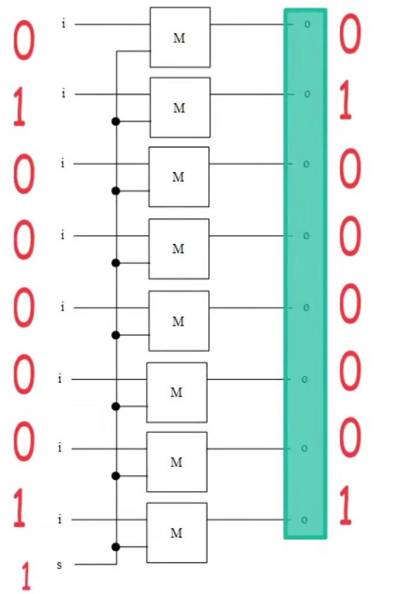
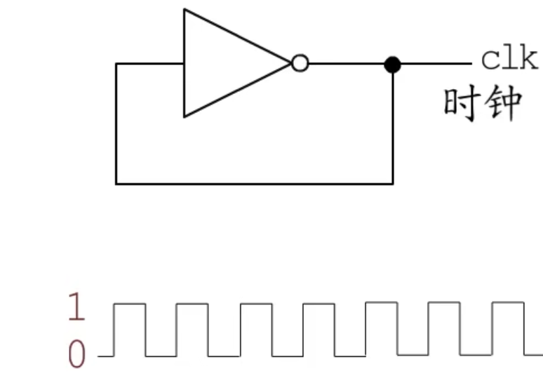
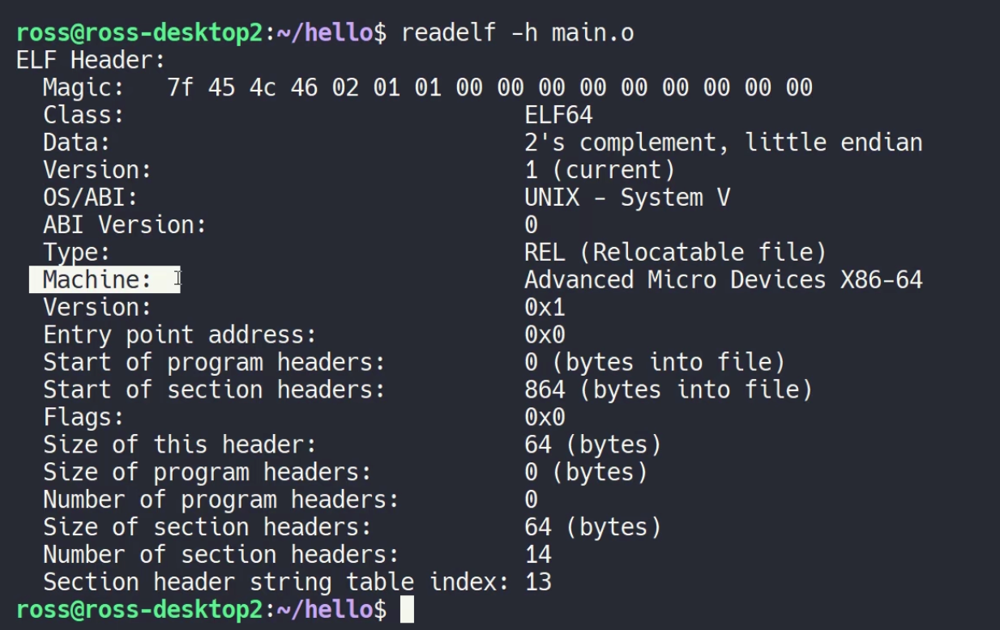
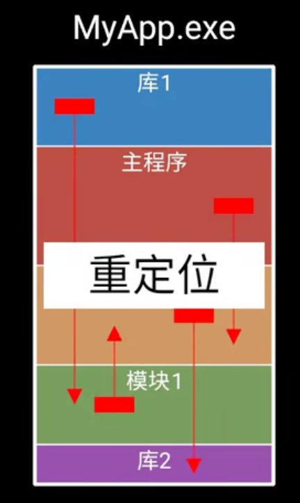
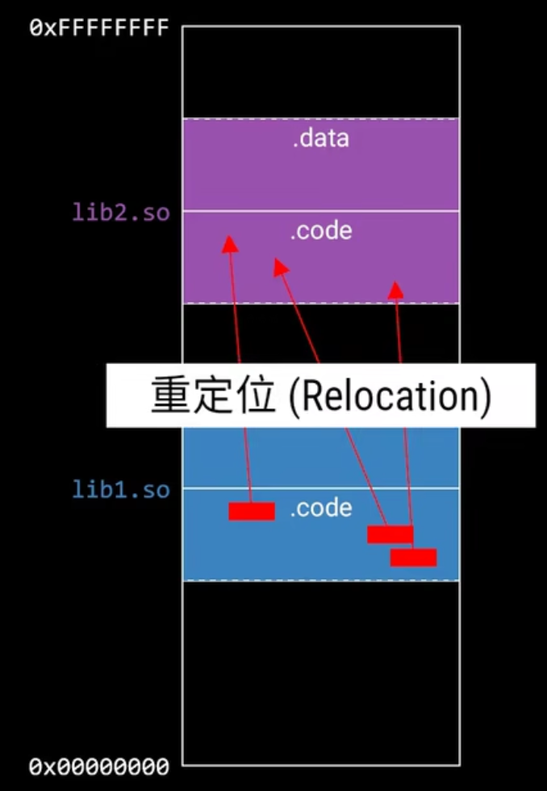
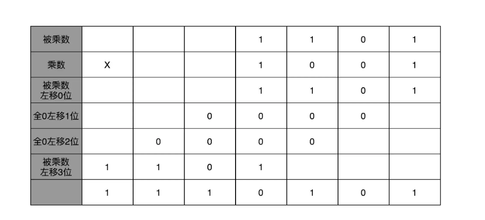
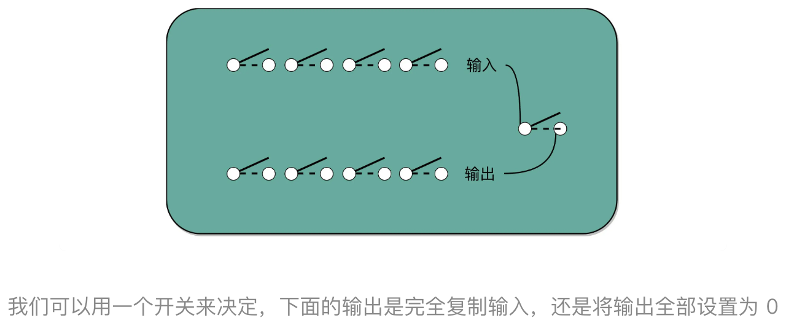

# 计算机组成原理

## 前置知识

### 基础门电路

继电器电路的不同串并联能进行逻辑运算。

逻辑非门：输入 1，输出 0；输入 0，输出 1。

逻辑与门：有两个输入，只有都输入 1 时，才输出 1，否则输出 0。

逻辑或门：有两个输入，只要有任何一个输入 1，输出就是 1，否则输出 0。

逻辑与非门：有两个输入，在两个输入都是 1 的情况下，输出 0，其他情况都输出 1。

逻辑或非门：有两个输入，在两个输入都是 0 的情况下，输出 1，其他情况都输出 0。

逻辑异或门：有两个输入，在输入相同时，输出 0；输入不同时，输出 1。


逻辑异或对应的逻辑门表示：

 


### 逻辑门运用

#### 比特存储装置 

通过一个设置位开关，控制了 1 比特信息的输入。简易符号：


in 表示输入，out 表示输出，set 负责控制输入能否被设置到输出（开关）。

- **如果 out 目前存储的状态是0**，接下来将 in 的状态置为 1，并将 set 设置为 1（允许输入），最后导致输出 out 被设置为 1，将输入状态设置到了输出中
- 修改输入状态 in 为 0，set 仍旧为 1，out 为之前的值 1，最后输出 out 被设置为 0，再一次将输入状态设置到了输出中
- 如果把设置为关闭为 0，无论 in 为 0 还是 1，out 不会改变


### 字节存储装置

将 8 个 bit 装置并排，通过同一个设置位，同时控制 8bit 的输入，达到一次控制一个字节的输入。




#### 比特输出控制装置

如果 e 位打开（设置为 1），则 8 位输入经过 8 个与门后将保持原值输出。如果 e 位关闭（设置为 0），则无论输出值为多少，都将输出 0。所以这种装置可以用于控制输出。


#### 寄存器

将一个字节的输入控制装置和输出控制装置进行组合，得到一字节的存储器，既能控制输入，又能控制输出。


寄存器之间的数据移动


如果要将寄存器 r1 存储的状态输出到寄存器 r3，首先要将 r1 的输出打开，r1 存储的状态就输出到了总线，再将 r3 的输入打开，就将总线状态设置到了 r3，随后先关闭 r3 的输入，再关闭 r1 的输出，这样就将 r3 设置为与 r1 相同的状态，也就是所谓的将字节从 r1 移动到了 r3。


### 寻址和控制输入输出

#### 解码器

通过多路输入选择一路进行输出。


现在有两行两列共 4 个寄存器，通过总线相连，这四个寄存器有各自的输入控制位和输出控制位，现在的需求是明确控制某个寄存器，打开或者关闭它的输入或者输出控制位，以选中 R1 的输入控制为例子（即将 R1 的 S 位设为 1）：


但是 R1 的输入是否打开有两个条件，而且两个条件必须都成立才行，所以适合在 R1 的 S 位前放置一个与门，一个输入来自 CPU 的状态，另一个输入来自寄存器的选中状态，而是否选中某个寄存器也有两个条件（即寄存器所在行被选中和寄存器所在列被选中），而且必须两个条件都满足，才能表示选中指定位置的寄存器，所以也适合用于个与门。参考下图：


这样总线的状态就被设置到 R1 寄存器中了。

即控制输入也控制输出的示图：


打开 R3 的输出：


打开 R2 的输出：


选中特定寄存器（下图是两行两列，4 个寄存器，通过总线相连），并打开它的输入或者输出。通过解码器，可以将来自 PC 寄存器（内存地址寄存器，Memory Address Redigter）中的内存地址二进制，解析为选中特定行和特定列的电信号——寻址。然后通过来自控制器的输入控制信号或者输出控制信号，打开特定内存位置的内存的输入或者输出，就能实现寄存器到总线，总线到寄存器以及寄存器到寄存器的字节的**复制后移动**，源地址内的数据并没有消失 。


上面就是一个随机地址寄存器（RAM，Random Access Memory）——内存。


#### 迷你内存

用 4\*16 的解码器，可以通过 4 位二进制数的输入选择出 16 路中的 1 路进行输出。两个 4\*16 解码器就能选择 16\*16，一共 256 个不同的地址。

解码器的输入来自一个提供行号和列号的寄存器。——内存地址寄存器（MAR），用 4 比特存储行号，另外 4 比特存储列号。


上面迷你内存的简易符号：


### 算数与逻辑运算

#### 字节运算器

一个与门能得到 2 个 bit 的逻辑与运算结果，如果将 8 个与门组合起来就能得到两个字节的逻辑与运算结果。逻辑或，异或等也是类似。


逻辑非则是用到 8 个非门就能完成一字节的逻辑非运算。


#### 移位运算

通过两个寄存器的简单电路组合实现移位操作。


#### 加法器

二进制的加法计算某一位的相加结果时，需要考虑三个二进制数字的逻辑运算结果，这三位分别是两个二进制数的本位和 两个二进制数的前一位的相加结果（进位）的值；同时记录相加的结果值和得到输出的进位值。

情况：

1. carry in 为 0 ，当 a 和 b 相同时，sum 为 0 ；不同时 sum 为 1 ，对应 a 和 b 的异或逻辑

2. carry in 为 1，当 a 和 b 的异或逻辑为 1 时，sum 为 0；当 a 和 b 的异或逻辑为 0 时，sum 为 1

   

下面考虑 carry out：

1. carry in 为 0，当 a 和 b 都为 1 时，carry out 为 1
2. carry in 为 1，当 a 和 b 的异或逻辑为 1 时，carry out 为 1；或者当 a 和 b 的与逻辑为 1 时，carry out 为 1

对应的逻辑电路图：


字节加法器


#### 比较器

比较两个字节的大小。当比较两个字节时，会从两个的高位比特开始，上一位 bit 相等则继续比较下一位。


字节比较器


#### 判零器


#### ALU（算数与逻辑单元）

将上面的逻辑电路组合起来就组成了 CPU 的 ALU——运算器。


对于上图中的每个运算逻辑都会同时接收到 a 和 b 作为输入，但是同时有一个 3\*8 解码器，他的电信号会选择唯一的一种运算的结果的输出。该解码器的默认输入 opration 为 000，对应选中的就是加法操作。 加法器接受到输入的 a 和 b，只有加法器后面的输出是打开的，所以 c=a+b，如果加法器产生了进位 carry out，由于此时选择的是加法器，则 ALU 输出的 carry out 就是加法器产生的进位，而不是左移或者右移产生的移出位。 比较器是一直在工作的（对应的3*8解码器对应的输入是111），且判零器会一起检测输出的c是否为零。


在内存中存储一些操作指令（二进制数），事前规定每种操作对应的二进制编码。


IR寄存器用户存储从内存中加载过来的二进制操作指令。

IAR用户存储下一步要加载到IR寄存器中的二进制操作指令在的内存中的地址（这个地址二进制会被解码器用于内存寻址）。

Control Section是CPU中的控制器部分，用于解析来自IR寄存器中的操作指令，然后将解析后的数据传递给ALU或者 用于选中数据寄存器（R0~R3），以完成不同的操作。


即使是一个简单的指令，也可能需要经过好几个步骤（即好几个时钟周期）才能完成，比如汇编指令中的LOAD（从内存中加载数据到CPU的寄存器中）指令，寄存器R1存放着一个内存地址，该内存地址上的数据就是需要加载到CPU的寄存器R2上。这起码要经过两个大的步骤：

1. 将R1中的内存地址数据加载到内存中的内存地址寄存器中
2. 内存中的解码器根据直接连接的内存地址寄存器中的二进制数据，解析并选中内存中的特定位置，并将该内容移动到CPU中的寄存器R2中

这些操作是一步一步有先后顺序的执行，这就需要一个一步步协调的装置——**步进器**。


### 步进器

时钟装置，它对应的就是周期频率就是 CPU 中的主频。以赫兹为单位。 




借助时钟装置组装步进器。

**步进器**


如果在步进器的每个 step 打开时，按照特定顺序控制一些寄存器的输入和输出。步进器的背后是时钟装置，它的一个周期叫时钟周期，单位时间内能执行多少个时钟周期就能表示为频率。 

CPU 中的控制器就是利用步进器在每一个时钟周期内控制一些寄存器的输入和输出。


CLK E 输出控制位，用于控制寄存器的输出。

CLK S 输入控制位，用于控制寄存器的输入。 

要完成内容从源寄存器到目标寄存器的移动，源寄存器的输出必须先于目标寄存器的输入控制位的打开而打开，后于目标寄存器的输入控制位的关闭而关闭。


**指令加载**

在 step1 中将 IAR（指令地址寄存器）的输出打开和内存地址寄存器 MAR（解码器）的输入打开，这样就将下一条指令所在的内存地址所在信息传输给了内存中的地址解码器，同时会将 IAR 中内存地址数据输入到 ALU 的 A 和 TMP 中，但是此时 bus1 中来自控制器的输入为 1，导致最后输入到 ALU 中的 B 的数据为 00000001，而 ALU 的默认 opertation 为 000，默认执行加法操作，所以就是将 IAR 中的内存地址进行加一操作，然后存放在 ACC 寄存器中。


在   step2 中，打开RAM的输出控制位，打开IR的输入控制位，将经过 step1 选中的内存地址（RAM中的内存地址）中的数据输出到指令寄存器（IR）中。这样就完成了一次指令的加载。


在 step3 中，将 ACC 寄存器中的数据输出到总线，打开 IAR 寄存器输入，这样就将原来的内存地址+1后存入到指定地址寄存器中了。


对于每一条指令而言，前三步的布线都是一样的，所以只能在 4，5，6 中实现指令对应的操作。

CPU 要支持哪些指令，每个指令对应特定的布线来完成对应的功能，就需要先设计好指令集（指令编码）。


### CPU


在内存 RAM 中存储一些指令。

IR 寄存器：存储当前要执行的指令的寄存器。（指令寄存器）

IAR 寄存器：存储下一条要执行的指令所在的内存地址。控制器部分通过复杂的布线，通过读取指令寄存器（IR）中的指令代码，解析为不同的电信号，然后操作寄存器或者将数据传给 ALU，在步进器的每一个周期中分别执行一些动作，以完成最后的指令。

ACC 寄存器：存放 ALU 运算后的结果。

TMP 寄存器：是一个没有输出控制位的寄存器，可以在输入 S 为 1 的情况下直接输出。

Bus1: 可以控制 TMP 是按照原值输入到 ALU 中还是将 00000001 输入到 ALU 中。


对应内存中存放的一条条的指令，可能需要经过几个不同的步骤和时钟周期才能完成。比如 LOAD R1 R2 指令，寄存器 R1 中存储了一个内存地址，LOAD 指令用于将该内存地址中的内容加载到 R2，至少得两步：

1. 将 R1 的内容移动到 MAR（内存地址寄存器）中，这至少需要一个时钟周期
2. 将内存中指定位置的内容移动到 R2 中，这也至少需要一个时钟周期

在上面的迷你计算机中，指令寄存器只能存放一字节（8 位）。低 4 位存储指令需要操作的两个寄存器，两位二进制通过一个 2\*4 解码器能选择出 4 个通用寄存器中的一个，指令寄存器的高 4 位用来表示指令操作类型，操作指令有两大类，一类是算数与逻辑运算指令，还有一类是其他指令。用最高位来区分它们，1 表示算数与逻辑运算操作指令，0 表示其他指令。前面的运算器 ALU 支持八种算数与逻辑运算，所以可以通过一个 3\*8 解码器选中某种运算逻辑，而 ALU 中正好有 8 种运算逻辑。 其他指令有：加载，跳转，存储等。


ALU 指令


ADD RA RB：表示将 RA 寄存器中的值和 RB 寄存器中的值相加后存入到 RB 寄存器中。

SHL RA RB：表示将RA左移一位，并将结果存储到RB中。

CMP RA RB：表示比较RA和RB的大小，不需要存储计算结果。


**指令对应的布线：**


ALU 指令的最高位都为 1。

当 step4 打开时，1 号与门输出 1，打开寄存器 RB 的输出和 TMP 寄存器的输入，将 RB 中的内容复制到 TMP 中，作为 ALU 的第二个操作数。

当 step5 打开时，2 号与门输出 1，打开寄存器 RA 的输出和 ACC 寄存器的输入，将 RA 中的内容复制到 ALU 的第一个操作数，而 ACC 准备接受来自 ALU 的运算结果。


此时 4，5，6，这三个与门都有了两个确定的输入状态 1，所以会将指令寄存器 IR 中的指令的 1，2，3 位的状态原样输出到运算器，作为运算器的操作输入，通过解码器选择 ALU 中的一种运算类型。

假设选中的两个计算器是前面图中的 R0 和 R1，setp4 是将 R2 的内容复制到 TMP，step5 是将 R0 的内容复制到 ALU 的第一个操作数，并打开 ACC 的输入同时通过操作输入选中 ALU 中的特定运算类型，这步会进行 ALU 中的运算，并将结果输出到 ACC 中。


当 setp6 打开时，如果 3 号与门输出 1，就会打开 ACC 寄存器的输出和 R1 的输入，将 ACC 中的运算结果复制到 R1 中，但是 3 号与门是否输出 1 取决于选择的 ALU 的操作类型是否需要存储运算结果。 在前面的 ALU 中只有比较运算不需要存储运算结果，对应的编码是 111。


**其他指令对应的布线：**


LOAD RA RB： 将第一个操作数 RA 中存储的内存地址所指向的内存，将该内存中的数据加载到 RB 中。


STORE RA RB：将 RB 中存储的数据存储到 RA 中的内存地址所指向的内存中。


DATA RB data：将 DATA RB data 指令的在内存中的下一个字节内存地址中的数据复制到 RB 中。


JMPR RB：在 step4 中将 RB 中存储的跳转地址复制到指令地址寄存器 IAR 中。


JMP addr：该指令的跳转地址没有存储在任何寄存器中，而是存在内存中的下一个内存地址中，所以在第 4 步中将指令地址寄存器输出到内存地址寄存器，内存中选择的就是 jump 指令的下个字节，然后在第 5 步中将 RAM 输出到指令地址寄存器，也就将跳转地址输出到了指令地址寄存器中，这样到下个指令周期就会跳转到那里去执行。


JCAEZ addr：根据 ALU 的四个标识位判断是否进行跳转，跳转地址放到指令的下一个字节中。低 4 位用于存储跳转条件，分别对应：进位，a 较大，相等，是否为零。在这里把它们放到了一个 flag 寄存器中，占用前四位。在指令编码中，将谁置为 1，就表示跳转时需要判断哪一个标识位。


例如这一指令表示只有在 Zero Flag 为1时才发生跳转：


这一指令则会在 Equal flag 或 zero flag 中任何一位为 1 时发生跳转：


条件跳转指令在第四步中会将指令地址寄存器输出到内存地址寄存器，选择指令的下个地址，那里存储着跳转地址，同时 bus1 打开，将指令地址寄存器加一，存储到 acc 中，万一不跳转， acc这里存储的依然是下一条指令地址，

在第五步中将 ACC 输出到指令地址寄存器

第六步，3 号与门有三个输入，关键要看 4 号或门，如果选择 a 和 e 两个标识位，若要求的标识位都不是 1，则不满足跳转条件，什么都不做；如果 a 为 1 或者 e 为 1 时，4 号或门都会输出 1，3 号与门就都会打开，继而将内存中的跳转地址输出到指令地址寄存器。


CLF（clear flags）：负责把四个标识位清零，只要把 bus1 置为 1，并打开 flags 寄存器的输入即可，bus1 打开后，ALU 的输入 B 就是 1，输入 A 是 0，Operation 为 000，默认选择的是加法运算，在这种情况下，首先输入的 B 比较大，所以 A 和 E 这两个 flag 都被制为零，没有任何进位，所以 C 这一 flag 也被指为零，加法器输出的结果是一，不等于零，所以 Z 这一 flag 也被置为零，编码 110 对应 clear flags 指令对应的布线相当简单，就这样一步操作就把 flex 寄存器清零了。


**完整的控制器布线**


## 前言

### 为什么学习计算机组成原理

1. 它有硬件和软件的基础知识，涉及硬件如何向上层软件提供可以直接调用的接口
2. 学习组成原理之后，向下，学习**数字电路**相关的课程，向上，学习**编译原理**、**操作系统**等核心课程
3. 计算机体系结构课程的基础


**先学习“计算机组成原理”，对计算机的硬件原理，软件有全局的了解。**

理解高级语言是如何对应着 CPU 能够处理的一条条指令，为编译原理打下基础；理解程序如何加载运行，为操作系统打下基础。

CPU中计算实现对应着数字电路；深入 CPU 和存储器系统的优化对应计算机体系结构。


### 组成原理的特点

- 概念多，每个概念的信息量大

  > 要理解 CPU 中的算术逻辑单元（也就是 ALU）是怎么实现加法的，需要牵涉到如何把**整数表示成二进制**，要了解这些表示背后的**电路、逻辑门、CPU 时钟、触发器**等知识。

- 概念深入就对应着一门单独的科班课程

  > 从写的 C、Java 这样的高级语言，变成计算机可以执行的机器码，展开并深入讲解这个问题，就会变成《编译原理》

- 偏理论和概念

  > 需要学习者主动与开发实践联系，不要总是沉溺于概念和理论，要用所学的知识解决工作中的问题


### 学习建议

- 多了解计算机及硬件发展史

- 多将知识点和日常工作，学习和计算机硬件发展联系起来，理解是什么和为什么

- **学会提问自己来串联知识点**
  
  - 写的程序，是怎样从输入的代码，变成运行的程序，并得到最终结果？
  - 整个过程中，计算器层面到底经历了哪些步骤，有哪些地方是可以优化？
  
- **写一些示例程序来验证知识点**

- **阅读贵在坚持读完**

- **最有效的办法，不是短时间冲刺，而是有节奏地坚持**

- 对于不够明白的知识点，多搜索，多看不同来源的资料

  

理解计算机各个组件的工作原理和真实开发中遇到的问题的本质（比如乱码）

> 计算机组成中很多组件的设计都来自现实生活中的想法和比喻。在硬件上，是通过最基本的与、或、非、异或门这些最基础的门电路组合形成了强大的 CPU；在面向对象和设计模式里，也常常是通过定义基本的 Command，然后组合来完成更复杂的功能。

结合计算机硬件发展史上的失败和成功案例，理解硬件的设计渊源

> 奔腾 4 的失败，就是受限于超长流水线带来的散热和功耗问题，而移动时代 ARM 的崛起，则是因为 Intel 的芯片功耗太大，不足以在小小的手机里放下足够支撑 1 天的电池。 现代的云计算数据中心的设计到选址，是围绕功耗和散热来考虑的。

把整个的计算机组成原理通过指令、计算、CPU、存储系统和 I/O 串起来。通过一个程序的执行过程进行逐层分解，对整个系统有一个全貌的了解。

无论是程序的**编译、链接、装载和执行**，以及计算时需要用到的**逻辑电路、ALU，**乃至 **CPU 流水线、指令级并行和分支预测，**还有对应访问到的**硬盘、内存，以及加载到高速缓存中的数据**，这些都对应着学习中的一个个知识点。


### 学习推荐资料

- 《计算机是怎样跑起来的》

- 《程序是怎样跑起来的》

- 北大的《计算机组成》公开课（计算机硬件层面的基础实现，了解程序的电路层面实现）

- 《计算机组成与设计：硬件 / 软件接口》

- 《深入理解计算机系统》[视频](https://time.geekbang.org/column/article/92378#:~:text=%E7%9A%84%E9%93%BE%E6%8E%A5%EF%BC%88-,Bilibili,-%E7%89%88%E5%92%8CY)

- 《计算机组成：结构化方法》

- 《计算机体系结构：量化研究方法》

- 《编码：隐匿在计算机软硬件背后的语言》

- 《程序员的自我修养：链接、装载和库》

- What Every Programmer Should Know About Memory

- LMAX 开源的 Disruptor 实战项目、

  

[csapp](https://www.bilibili.com/video/av24540152/?vd_source=be54476e7fcbe5a8c3013460974f74e4)

> 操作系统也是一个“软件”，而开发操作系统，其实只需要关注到“组成原理”或者说“体系结构”就好了，而不需要真的了解硬件，比如电路层面的实现。 操作系统，其实是在“组成原理”所讲到的“指令集”上的一层封装。
>
> 数据结构和算法，计算机组成原理，计算机体系结构，编译原理，操作系统，数据库和计算机网络原理


## 冯·诺依曼体系结构

### 计算机基本硬件组成

#### CPU

中央处理器（Central Processing Unit），计算机的所有“计算”都是由 CPU 来进行。CPU 是一个超级精细的印刷电路板


#### 内存（Memory）

撰写的程序，都要加载到内存里才能运行。程序读取的数据、计算得到的结果，也都要放在内存里。内存越大，能加载的东西就越多。


**存放在内存里的程序和数据，需要被 CPU 读取，CPU 计算完之后，还要把数据写回到内存。**


#### 主板（Motherboard）

主板是一个有着各种插槽的配件。CPU 和内存要插在主板上。主板的**芯片组（Chipset）和总线（Bus）**解决了 CPU 和内存之间如何通信的问题。**芯片组控制了数据传输的流转，也就是数据从哪里到哪里的问题。总线则是实际数据传输的路线。**总线速度（Bus Speed）决定了数据能传输得多快。


电源，各类输入（Input）/ 输出（Output）设备（I/O 设备），硬盘，机箱，风扇。

很多网吧的计算机就没有硬盘，而是直接通过局域网，读写远程网络硬盘里面的数据。日常用的各类云服务器，只要让计算机能通过网络，SSH 远程登陆访问就好，云服务器因此也没必要配显示器、鼠标、键盘。


#### 显卡（Graphics Card）

使用图形界面操作系统的计算机，无论是 Windows、Mac OS 还是 Linux，显卡都是必不可少的。

装机的时候没有买显卡，计算机一样可以正常跑起来，那是因为，**现在都是 CPU 里面直接集成了一个 GPU 芯片，一般叫它”核心显卡“，不过在之前更多是在主板上集成一块显卡，很多时候叫它”板载显卡“。**如果用计算机玩游戏，做图形渲染或者跑深度学习应用，多半就需要买一张单独的显卡，插在主板上。**显卡里有除了 CPU 之外的另一个“处理器”，也就是 GPU（Graphics Processing Unit，图形处理器），GPU 一样可以做各种“计算”的工作。**


鼠标、键盘以及硬盘，这些都是插在主板上的。作为外部 I/O 设备，它们是通过主板上的南桥（SouthBridge）芯片组，来控制和 CPU 之间的通信的。它在主板上的位置，通常在主板的“南面”，它的作用是**连接鼠标、键盘以及硬盘这些外部设备和 CPU 之间的通信**。

以前的主板上通常也有“北桥”芯片，**连接 CPU 和内存、显卡之间的通信**。现在的主板上的“北桥”芯片的工作，已经被移到了 CPU 的内部。

对于手机，制造商们选择把 CPU、内存、网络通信，乃至摄像头芯片，都封装到一个芯片，然后再嵌入到手机主板上。这种方式叫 SoC，也就是 **System on a Chip**（系统芯片）。


### 冯·诺依曼体系结构

无论是个人电脑、服务器、智能手机或微型卡片机，都遵循冯·诺依曼体系结构（Von Neumann architecture，一个“计算机”的抽象概念），也叫**存储程序计算机**。

APP 和 PC 程序都是通过“高级”编程语言撰写、编译之后，把代码和数据加载到内存里来执行。

存储程序计算机：这里面其实暗含了两个概念，一个是**“可编程”**计算机，一个是**“存储”**计算机。

“可编程”计算机：什么是“不可编程”。计算机是由各种门电路组合而成的，然后通过组装出一个固定的电路板，来完成一个特定的计算程序。一旦需要修改功能，就要重新组装电路。这样的话，计算机就是“不可编程”的，因为程序在计算机硬件层面是“写死”的。最常见的就是老式计算器，电路板设好了加减乘除，做不了任何计算逻辑固定之外的事情。


“存储”计算机：程序本身是存储在计算机的内存里，可以通过加载不同的程序来解决不同的问题。有“存储程序计算机”，自然也有不能存储程序的计算机。典型的就是早年的插线板式的计算机。整个计算机就是一个巨大的插线板，通过在板子上不同的插头或者接口的位置插入线路，来实现不同的功能。这样的计算机是“可编程”的，但是编写好的程序不能存储下来供下一次加载使用，不得不每次要用到和当前不同的“程序”的时候，重新插板子，重新“编程”。


为了效率，产生了“存储程序计算机”的由来。

冯·诺依曼写了一篇报告[First Draft of a Report on the EDVAC](https://en.wikipedia.org/wiki/First_Draft_of_a_Report_on_the_EDVAC) ，描述了一台计算机应该有哪些部分组成：

- 一个处理器单元（Processing Unit），它包含**算术逻辑单元**（Arithmetic Logic Unit，ALU）和**处理寄存器**（Processor Register）。

  > 完成各种算术和逻辑运算。因为它能够完成各种数据的处理或者计算工作，因此也有人把这个叫作数据通路（Datapath）或者运算器。

- 一个**控制器单元（Control Unit/CU）**，它包含**指令寄存器**（Instruction Register）和**程序计数器**（PC 寄存器）（Program Counter）

  > 用来控制程序的流程，通常就是不同条件下的分支和跳转。
  >
  > **在现在的计算机里，算术逻辑单元和控制器单元，共同组成了 CPU。**

- **内存**，用来存储**数据（Data）和指令（Instruction）**

- **外部存储**，更大容量

- 各种**输入和输出设备**，以及对应的**输入和输出机制**

**任何一台计算机的任何一个部件都可以归到运算器、控制器、存储器、输入设备和输出设备中，而所有的现代计算机也都是基于这个基础架构来设计开发的。**

云服务器，通过网络来进行输入和输出，这时，网卡既是输入设备又是输出设备。

所有的计算机程序，也都可以抽象为从**输入设备**读取输入信息，通过**运算器**和**控制器**来执行存储在**存储器**里的程序，最终把结果输出到**输出设备**中。


**冯·诺依曼体系结构**确立了现代**计算机硬件**的基础架构。学习计算机组成原理，其实就是学习和拆解冯·诺依曼体系结构。具体来说，就是**学习控制器、运算器的工作原理**，也就是 CPU 是怎么工作的，以及为何这样设计；**学习内存的工作原理**，从最基本的电路，到抽象给到 CPU 乃至上层应用程序的接口是怎样的；**学习 CPU 是怎么和输入设备、输出设备打交道**。

理解从控制器、运算器、存储器、输入设备以及输出设备和电路，到最终开放给软件的接口，是怎么运作的，为什么要设计成这样，以及在软件开发层面怎么尽可能用好它。


冯·诺依曼机和图灵机：冯·诺依曼机侧重于硬件抽象，而图灵机侧重于计算抽象。

两者有交叉但是不同，根据了解整理如下：

- 图灵机是一种思想模型（计算机的基本理论基础），是一种有穷的、构造性问题的问题求解思路，图灵认为凡是能用算法解决的问题也一定能用图灵机解决；
- 冯诺依曼提出了“存储程序”的计算机设计思想，并“参照”图灵模型设计了历史上第一台电子计算机，即冯诺依曼机。

> 冯诺依曼确定了当代计算机体系结构，即五大部件（运算器、控制器、存储、输入设备、输出设备）；程序存储；二进制运算方式；构建了一个可编程、可存储的计算机硬件体系，为软件编程构建了逻辑抽象的计算机模型。
>
> 阿兰图灵确定了利用当代计算机的计算极限，即冯诺依曼机只能解决 1.有解的可计算的数学问题 2.能够在有限步骤得到解；为软件编程确立的问题域边界。


## 导论

**整个计算机组成原理，就是围绕着计算机是如何组织运作展开的。**


大纲：

**计算机的基本组成**

学习计算机是由哪些硬件组成的。这些硬件又是怎么对应到经典的冯·诺依曼体系结构。

1. 计算机硬件组成
   - CPU
   - 内存
   - 主板
2. 冯诺依曼体系结构
   - 运算器/处理器单元
   - 控制器
   - 存储器
   - 输入设备
   - 输出设备
3. 计算机性能
   - CPU 主频
   - 响应时间
   - 吞吐量
4. 计算机功耗
   - 散热
   - 能耗和电力

**计算机的指令和运算**

1. 指令

   学习并理解高级语言编写的代码被执行的过程（即程序是怎么通过编译器和汇编器，变成一条条机器指令的编译过程和操作系统是怎么链接、装载、执行这些程序的）

   - 机器码
     - 编译=>汇编=>机器码
     - 指令格式和指令跳转
     - 函数调用和程序栈
   - 操作系统的程序执行
     - 静态链接和 ELF 格式
     - 程序的装载和执行
     - 动态链接

2. 运算

   理解数据在计算机里的表示，以及怎么从数字电路层面，实现加法、乘法这些基本的运算

   - 二进制编码
     - 整数和补码
     - 字符串和 Unicode
     - 浮点数和定点数
   - 数字电路
     - 门电路
     - 加法器
     - 乘法器

**存储器和 I/O 系统**

1. 存储器的层次结构
   - 局部性原理
   - SRAM 和 CPU 高速缓存
   - DRAM 和内存
   - SSD 硬盘和 Flash Card
   - 机械硬盘
2. 存储器和 I/O
   - 虚拟内存和内存保护
   - IO_WAIT:CPU 和内存的通信
   - DMA 技术
   - 访问输入输出设备
   - 数据完整性
     - RAID
     - Erasure Code
     - ECC 内存
     - Hadoop 和分布式存储

**处理器设计**

1. CPU
   - 建立数据通路
     - 处理器时钟
     - 触发器和锁存器
   - 面向流水线和设计
   - 控制冒险和数据冒险
   - 分支预测
   - 异常和中断
   - SIMD 和并行计算
2. 其他处理器
   - CISC 和 RISC
   - GPU 和 NUMA 架构
   - FPGA，AISC 和 TPU
   - 分布式计算
   - 虚拟机和 Docker

计算机组成原理的四大部分知识点：

- **计算机的基本组成**

  - 计算机是由哪些硬件组成
  - 硬件和冯·诺依曼体系结构的一一对应关系，运算器、控制器、存储器、输入设备和输出设备这五大基本组件分别对应硬件的哪些部分
  - 计算机的两个核心指标，性能和功耗

  

- **计算机的指令和计算**
  
  指令部分：
  
  - 理解高级语言编写的程序是怎么通过编译器和汇编器，变成一条条机器指令的编译过程（编译原理）
  
  - 操作系统是怎么链接、装载、执行这些程序的（操作系统）
  
    > 一条条指令执行的控制过程，就是由计算机五大组件之一的**控制器**来控制的。
  
  计算部分：
  
  - 从二进制和编码开始，理解数据在计算机里的表示
  
  - 怎么从数字电路层面实现加法、乘法这些基本的运算功能的过程
  
    > 实现这些运算功能的 ALU（Arithmetic Logic Unit/ALU），也就是算术逻辑单元，其实就是计算机五大组件之一的**运算器**。
    
    
  
- **处理器（CPU）设计**

  - CPU 时钟是什么（CPU 时钟可以用来构造寄存器和内存的锁存器和触发器），为什么需要 CPU 时钟
  - 寄存器和内存的硬件结构
  - 数据通路的构造（数据通路连接了整个运算器和控制器，并最终组成了 CPU）
  - 面向流水线设计的 CPU、数据和控制冒险，以及分支预测（都是为了提升性能和功耗）
  - CPU 作为控制器要和输入输出设备通信时异常和中断发生的机制
  - 指令的并行执行
  - 如何直接在 CPU 层面，通过 SIMD 来支持并行计算

  

- **存储器和 I/O 设备**

  - 存储器的层次结构(基础)和原理

  - CPU 高速缓存、内存、SSD 硬盘和机械硬盘的工作原理与性能差异，实际应用中利用这些设备会遇到的挑战

  - 存储器不仅是存储设备，也是输入输出设备（CPU 和存储器之间的通信）

  - 理解什么是 IO_WAIT，如何通过 DMA 来提升程序性能

  - 如何通过 RAID、Erasure Code、ECC 以及分布式 HDFS 技术来保证数据的完整性和访问性能

浮点数（Floating Point）。浮点数是容易用错的一种数据表示形式。掌握浮点数能对数据的编码、存储和计算能够有一个深入理解。浮点数是机器学习中重度使用的数据表示形式，掌握它更是非常有必要。


## 性能

### 定义

学习和研究计算机组成原理，就是在理解计算机是怎么运作的，以及为什么要这么运作。**“为什么”所要解决的事情，很多时候就是提升“性能”。**

对于计算机的性能衡量主要有两个指标：

- **响应时间（Response time）或者叫执行时间（Execution time），运行得更快**
- **吞吐率（Throughput）或者带宽（Bandwidth），算得更多**

  

**响应时间指的就是执行一个程序，到底需要花多少时间。花的时间越少，自然性能就越好。**

**吞吐率是指在一定的时间范围内，处理的数据或者执行的程序指令量。**

缩短程序的响应时间，一般来说都会提升吞吐率。除了缩短响应时间（提高单个 CPU 执行效率），还可以提高处理数据的核数（堆料），同时处理数据，在单位时间内就可以处理更多数据，吞吐率就增大了。

但是响应时间的提升（CPU 的性能提升）没有那么容易，现在 CPU 的性能提升速度早就已经降下来了，不是堆料能解决的。

一般把性能，定义成响应时间的倒数，也就是：

**性能 = 1/ 响应时间**


### CPU 时钟

**计算机的计时单位。**

时间是一个很自然的用来衡量性能的指标，但是用时间来衡量性能时，有两个问题：

1. **时间不“准”**，如果用自己随便写的一个程序，来统计程序运行的时间，每一次统计结果不会完全一样。有可能这一次花了 45ms，下一次变成了 53ms。
   不准确的原因：

   统计时间是用类似于“掐秒表”一样，记录程序运行结束的时间减去程序开始运行的时间。这个时间也叫 Wall Clock Time 或者 Elapsed Time。

   但是，计算机可能同时运行着好多个程序，CPU 实际上不停地在各个程序之间进行切换。在这些花费的时间里面，很可能 CPU 切换去运行别的程序了。而且，有些程序在运行的时候，可能要从网络、硬盘去读取数据，要等网络和硬盘把数据读出来，给到内存和 CPU。所以说，要想准确统计某个程序运行时间，进而去比较两个程序的实际性能，得把这些时间给刨除掉。

   那这件事怎么实现呢？Linux 下有一个叫 time 的命令，可以帮统计出来，同样的 Wall Clock Time 下，程序实际在 CPU 上到底花了多少时间。

   运行一下 time 命令，它会返回三个值，第一个是 real time，也就是 Wall Clock Time，也就是运行程序整个过程中流逝掉的时间；第二个是 user time，也就是 CPU 在运行你的程序时，在**用户态**运行指令的时间；第三个是 sys time，是 CPU 在运行你的程序时，在**操作系统内核里**运行指令的时间。而程序实际花费的 CPU 执行时间（CPU Time），就是 user time 加上 sys time。

   ```
   $ time seq 1000000 | wc -l
   1000000
   real  0m0.101s
   user  0m0.031s
   sys   0m0.016s
   
   // 找一台 1 CPU 的机器来跑这个命令，在多 CPU 的机器上，seq 和 wc 两个命令可能分配到不同的 CPU 上，我们拿到的 user time 和 sys time 是两个 CPU 上花费的时间之和，可能会导致 real time 可能会小于 user time+sys time。


2. 即使已经拿到了 CPU 时间，也不一定可以直接“比较”出两个程序的性能差异。即使在同一台计算机上，CPU 可能满载运行也可能降频运行，降频运行的时候自然花的时间会多一些。
3. 时间还会受到主板、内存这些其他相关硬件的影响。

**所以，需要对“时间”进行拆解，把程序的 CPU 执行时间变成 CPU 时钟周期数（CPU Cycles）和 时钟周期时间（Clock Cycle）的乘积。**

**性能 = 1/ 响应时间**

**程序的 CPU 执行时间（响应时间） =CPU 时钟周期数 × 时钟周期时间**

时钟周期时间：CPU 的主频（Frequency/Clock Rate），如：Intel Core-i7-7700HQ 2.8GHz，2.8GHz 就是电脑的主频，可以先粗浅地认为，CPU 在 1 秒时间内，可以执行的**最简单指令**的数量是 2.8G 条。 更准确一点描述，这个 2.8GHz 就代表，**CPU 的一个“钟表”能够识别出来的最小的时间间隔。** 这个 2.8GHz 的 CPU 上，这个时钟周期时间，就是 1/2.8G。CPU 是按照这个“时钟”提示的时间来进行自己的操作。主频越高，意味着这个表走得越快，我们的 CPU 也就“被逼”着走得越快。

> **晶振时间与 CPU 执行固定指令耗时成正比**，可以暂且认为就是晶振在触发一条一条电路变化指令，就好像拨算牌盘的节奏一样。算盘拨得快，珠算就算得快。结果就是一条简单的指令需要的时间就和一个时钟周期一样。一方面，其实**时钟周期应该是放下最复杂的一条指令的时间长度**。


最简单的提升性能方案，自然缩短时钟周期时间，也就是提升主频。换句话说，就是换一块好一点的 CPU。

还有就是，如果能够减少程序需要的 CPU 时钟周期数量，一样能够提升程序性能。

**CPU 时钟周期数：分解为 指令数 × 每条指令的平均时钟周期数（Cycles Per Instruction，简称 CPI）**，不同的指令需要的 Cycles 是不同的，加法和乘法都对应着一条 CPU 指令，但是乘法需要的 Cycles 就比加法要多，自然也就慢。


在这样拆分了之后，程序的 CPU 执行时间就可以变成这样三个部分的乘积。

**程序的 CPU 执行时间 = 指令数 ×CPI×Clock Cycle Time**


因此，如果我们想要解决性能问题，其实就是要优化这三者。

1. 时钟周期时间，就是计算机主频，这个取决于计算机硬件。摩尔定律就一直在不停地提高计算机的主频。
2. 每条指令的平均时钟周期数 CPI，就是一条指令到底需要多少 CPU Cycle。现代的 CPU 通过流水线技术（Pipeline），让一条指令需要的 CPU Cycle 尽可能地少。
3. 指令数，代表执行的程序到底需要多少条指令、用哪些指令。这个很多时候就把挑战交给了编译器。同样的代码，编译成计算机指令时候，就有各种不同的表示方式。


可以把自己想象成一个 CPU，坐在那里写程序。计算机主频就好像是打字速度，打字越快，自然可以多写一点程序。CPI 相当于你在写程序的时候，熟悉各种快捷键，越是打同样的内容，需要敲击键盘的次数就越少。指令数相当于你的程序设计得够合理，同样的程序要写的代码行数就少。如果三者皆能实现，自然可以很快地写出一个优秀的程序，性能从外面来看就是好的。

> 一个程序对应多条语句，一条编程语句可能对应多条指令，一条 CPU 指令可能需要多个 CPU 周期才能完成。


用户态运行和系统内核运行：

> 关于用户态运行和系统内核运行，如果要深入了解的话，可以去看 《趣谈 Linux 操作系统》。
>
> 如果简单讲一下的话，就是程序实际在操作系统里面的，是运行在“保护模式”下的，很多指令我们的应用程序并没有权限去操作执行，需要切换到内核态，由操作系统去执行，比如说操作硬件的时候。

多核 CPU 你可以认为就是多个 CPU，放在了一块芯片上，然后通过电路再连接在一起，可以让操作系统统一管理调度。


## 功耗

CPU 性能：**程序的 CPU 执行时间 = 指令数 ×CPI(每条指令的平均时钟周期数)×Clock Cycle Time**

指令数主要是软件端的问题，CPI和Clock Cycle Time则是硬件层面可以改进的地方，在 CPU 上多放一点晶体管，不断提升 CPU 的时钟频率，这样就能让 CPU 变得更快，程序的执行时间就会缩短。

一个 3.8GHz 的奔腾 4 处理器，满载功率是 130 瓦。这个 130 瓦是什么概念呢？机场允许带上飞机的充电宝的容量上限是 100 瓦时。如果我们把这个 CPU 安在手机里面，不考虑屏幕内存之类的耗电，这个 CPU 满载运行 45 分钟，充电宝里面就没电了。而 iPhone X 使用 ARM 架构的 CPU，功率则只有 4.5 瓦左右。

CPU 一般都被叫作**超大规模集成电路（Very-Large-Scale Integration，VLSI）**。这些电路，实际上都是一个个晶体管组合而成的。**CPU 在计算时就是让晶体管里面的“开关”不断地去“打开”和“关闭”，来组合完成各种运算和功能，而这个开关的速度主要就是通过时钟触发器来决定。**

**想要计算得快，一方面，要在 CPU 里，同样的面积里面，多放一些晶体管，也就是增加密度；另一方面，要让晶体管“打开”和“关闭”得更快一点，也就是提升主频。而这两者，都会增加功耗，带来耗电和散热的问题。**

可以把一个计算机 CPU 想象成一个巨大的工厂，里面有很多工人，相当于 CPU 上面的晶体管，互相之间协同工作。为了工作得快一点，可以在工厂里多塞一点人。为什么不把工厂造得大一点呢？这是因为，人和人之间如果离得远了，互相之间走过去需要花的时间就会变长，这也会导致性能下降。这就好像如果 CPU 的面积大，晶体管之间的距离变大，电信号传输的时间就会变长，运算速度自然就慢了。

除了多塞一点人，还可以让每个人的动作都快一点，这样同样的时间里就可以多干一点活儿了。这就相当于提升 CPU 主频，但是动作快，每个人就要出汗散热。要是太热了，对工厂里面的人来说会中暑生病，对 CPU 来说就会崩溃出错。

在 CPU 上面抹硅脂、装风扇，乃至用上水冷或者其他更好的散热设备，就好像在工厂里面装风扇、空调，发冷饮一样。但是同样的空间下，装上风扇空调能够带来的散热效果也是有极限的。

因此，在 CPU 里面，能够放下的晶体管数量和晶体管的“开关”频率也都是有限的。一个 CPU 的功率，可以用这样一个公式来表示：

**功耗 ~= 1/2 × 负载电容 × 电压的平方 × 开关频率 × 晶体管数量**

为了要提升性能，需要不断地增加晶体管数量。同样的面积下，想要多放一点晶体管，就要把晶体管造得小一点。这个就是平时所说的提升“**制程**”。从 28nm 到 7nm，相当于晶体管本身变成了原来的 1/4 大小。这个就相当于在工厂里，同样的活儿，要找瘦小一点的工人，这样一个工厂里面就可以多一些人。还要提升主频，让开关的频率变快，也就是要找手脚更快的工人。


功耗增加太多，就会导致 CPU 散热跟不上，这时，就需要降低电压。这里有一点非常关键，在整个功耗的公式里面，功耗和电压的平方是成正比的。这意味着电压下降到原来的 1/5，整个的功耗会变成原来的 1/25。

事实上，从 5MHz 主频的 8086 到 5GHz 主频的 Intel i9，CPU 的电压已经从 5V 左右下降到了 1V 左右。这也是为什么我们 CPU 的主频提升了 1000 倍，但是功耗只增长了 40 倍。


### 并行优化

面向摩尔定律编程（上世纪九十年代到本世纪初）：写程序不考虑性能，等明年 CPU 性能提升一倍，到时候性能自然就不成问题了，这种想法已经不可行了。

从奔腾 4 开始，Intel 意识到通过提升主频比较“难”去实现性能提升，边开始推出 Core Duo 这样的多核 CPU，通过提升“吞吐率”而不是“响应时间”，来达到目的。

提升响应时间，就好比提升你用的交通工具的速度，比如原本你是开汽车，现在变成了火车乃至飞机。本来开车从上海到北京要 20 个小时，换成飞机就只要 2 个小时了，但是，在此之上，再想要提升速度就不太容易了。我们的 CPU 在奔腾 4 的年代，就好比已经到了飞机这个速度极限。

为此硬件工程师的解决方案是采用多核 CPU 增大吞吐率。这也是一个最常见的提升性能的方式，通过**并行**提高性能。


但是，并不是所有问题，都可以通过并行提高性能来解决。如果想要使用这种思想，需要满足这样几个条件。

1. 需要进行的计算，本身可以分解成几个可以并行的任务。
2. 需要能够分解好问题，并确保几个人的结果能够汇总到一起。
3. 在“汇总”这个阶段，是没有办法并行进行的，还是得顺序执行，一步一步来。

这就引出了在进行性能优化中，常常用到的一个经验定律，**阿姆达尔定律（Amdahl’s Law）**：**对于一个程序进行优化之后，处理器并行运算之后效率提升的情况。**

**优化后的执行时间 = 受优化影响的执行时间 / 加速倍数 + 不受影响的执行时间**


提升计算机 CPU 的主频（摩尔定律）和增加 CPU 的核数（并行计算）都有瓶颈，且是硬件层面的。

在**整个计算机组成层面**，还有的性能提升方法：

1. **加速大概率事件**，最典型的就是，深度学习，整个计算过程中，99% 都是向量和矩阵计算，于是，工程师们通过用 GPU 替代 CPU，大幅度提升了深度学习的模型训练过程。
2. **通过流水线提高性能**，把 CPU 指令执行的过程进行拆分，细化运行。现代 CPU 里是如何通过流水线来提升性能的，以及反面的，过长的流水线会带来什么新的功耗和效率上的负面影响。
3. **通过预测提高性能**，通过预先猜测下一步该干什么，而不是等上一步运行的结果，提前进行运算，也是让程序跑得更快一点的办法。**“分支和冒险”、“局部性原理”**这些 CPU 和存储系统设计方法，其实都是在利用我们对于未来的“预测”，提前进行相应的操作，来提升我们的程序性能。


增加晶体管怎么提高运算速度？

> 增加晶体管可以增加硬件能够支持的指令数量，也就会减少运行同样程序需要的指令数。(打个比方，比如我们最简单的电路可以只有加法功能，没有乘法功能。乘法都变成很多个加法指令，那么实现一个乘法需要的指令数就比较多。但是如果我们增加晶体管在电路层面就实现了这个，那么需要的指令数就变少了，执行时间也可以缩短。)
>
> 增加数字通路的位数，以及利用好电路天然的并行性，从硬件层面更快地实现特定的指令，所以增加晶体管也是常见的提升 cpu 性能的一种手段。
>
> 设计了一个更复杂的电路，让原先软件执行的事情，直接通过硬件电路解决。也就是在CPU里增加了新指令，自然同样的程序就运行得更快。
> 同样功能的电路更多，比如有了更多更大的寄存器，更多的可以并行的流水线，这样同样的指令可以同时运行不受限于有限的资源，也可以让程序算得更快。

cpu 的电压是受了什么因素限制而不能一再降低的？

> 电压的问题在于两个，一个是电压太低就会导致电路无法联通，因为不管用什么作为电路材料，都是有电阻的，所以没有办法无限制降低电压，另外一个是对于工艺的要求也变高了，成本也更贵。


### 推荐阅读

- 《计算机组成与设计：软 / 硬件接口》（第 5 版）的 1.7 和 1.10 节
- 《深入理解计算机系统》（第 3 版）的 1.9 节


## 机器代码（计算机指令）

**早期计算机程序**是使用**打孔卡或者纸带**上打孔实现(程序和数据都在打孔卡上)，然后再交给计算机去处理。通过在特定位置是否打孔来表示 0 或 1。对于计算机而言，它只能识别由 0 和 1 组成的二进制机器码。现代编程中使用高级语言来编写程序，最后都是转为二进制 0 和 1 组成的一条条指令来最终被 CPU 执行的。

**问题：高级语言编写的程序如何转为 0 和 1 组成的指令？同时指令又是如何被 CPU 执行的？**

**从硬件的角度来看，CPU 就是一个超大规模集成电路，通过电路实现了加法、乘法乃至各种各样的处理逻辑。**

**从软件工程师的角度来讲，CPU 就是一个执行各种计算机指令（Instruction Code）的逻辑机器。**

计算机指令好比一门 CPU 能够听得懂的语言，也可以把它叫作机器语言（Machine Language）。

**不同的 CPU 能够听懂的语言不太一样。比如，个人电脑用的是 Intel 的 CPU，苹果手机用的是 ARM 的 CPU。这两者能听懂的语言就不太一样。类似这样两种 CPU 各自支持的语言，就是两组不同的计算机指令集，英文叫 Instruction Set。**

给 PC 使用的程序不能在手机上运行，因为它们的 CPU 指令集不同。

一个计算机程序是由成千上万条指令组成的。但是 CPU 里不能一直放着所有指令，所以计算机程序平时是存储在存储器中的。这种程序指令存储在存储器里面的计算机，叫作**存储程序型计算机（Stored-program Computer）**，插线板计算机就是非存储程序型。


**高级语言程序变为计算机指令的过程**

示例代码:

```c
// test.c
int main()
{
  int a = 1;
  int b = 2;
  a = a + b;
}
```

先将源码编译为汇编代码对应的程序，再由汇编编译器将汇编代码编译为机器代码。机器码由“0”和“1”组成，一条条机器码，就是一条条的计算机指令。

```
$ gcc -g -c test.c   // 汇编代码
$ objdump -d -M intel -S test.o  // 机器码
```

结果：


左侧中，每一行都表示一条指令。右边有一系列的 push、mov、add、pop 等，这些就是对应的汇编代码。

**一行 C 语言代码，有时候只对应一条机器码和汇编代码，有时候则是对应两条机器码和汇编代码。 汇编代码其实就是“给程序员看的机器码”，也正因为这样，机器码和汇编代码是一一对应的。**

```
gjw@gjw:~/csapp/000$ cat simplest.c
int main(){
int a=1,b=20;
int c=a+b;
}

生成的汇编及其具体解释：
push   %rbp  压栈 ，基址指针
mov    %rsp,%rbp 将堆栈寄存器内容移动到基址寄存器
movl   $0x1,-0xc(%rbp) 将栈基地址偏移12字节设为1，对应变量a=1
movl   $0x14,-0x8(%rbp) 将栈基地址偏移8个字节设为20（16进制14=10进制20），变量b=20
mov    -0xc(%rbp),%edx 将栈基地址偏移12字节的数据移动到edx寄存器
mov    -0x8(%rbp),%eax 将栈基地址偏移8个字节的数据移动到eax寄存器
add    %edx,%eax       edx 数据和eax数据相加，结果保存到eax寄存器
mov    $0x0,%eax       重置eax寄存器
pop    %rbp            弹出栈数据
retq                   main函数返回并退出
```


### 解析指令和机器码

平时用的电脑设备的 CPU（Intel CPU） 有 2000 条左右的 CPU 指令。但常见的指令可以分成五大类：

1. **算术类指令**，加减乘除，在 CPU 层面，都会变成一条条算术类指令
2. **数据传输类指令**，给变量赋值、在内存里读写数据，用的都是数据传输类指令。
3. **逻辑类指令**，逻辑上的与或非。
4. **条件分支类指令**，if/else，其实都是条件分支类指令。
5. **无条件跳转指令**，在调用函数的时候，其实就是发起了一个无条件跳转指令。


**汇编代码转机器代码：**

**不同的 CPU 有不同的指令集，也就对应着不同的汇编语言和不同的机器码。**为了理解机器码的计算方式，这里选用最简单的 MIPS 指令集。MIPS 是一组由 MIPS 技术公司在 80 年代中期设计出来的 CPU 指令集。


MIPS 的指令是一个 32 位的整数，高 6 位叫操作码（Opcode），也就是代表这条指令具体是一条什么样的指令（分别是 R、I 和 J），剩下的 26 位有三种格式。

**R 指令**是一般用来做算术和逻辑操作，里面有读取和写入数据的寄存器的地址。如果是逻辑位移操作，后面还有位移操作的位移量，而最后的功能码，剩下的则是在前面的操作码不够的时候，对前面的操作码进行扩展，以表示对应的具体指令的。

**I 指令**则通常是用在数据传输、条件分支，以及在运算的时候使用的是常数的时候。这个时候，没有了位移量和操作码，也没有了第三个寄存器，而是把这三部分直接合并成了一个地址值或者一个常数。

**J 指令**就是一个跳转指令，高 6 位之外的 26 位都是一个跳转后的地址。

以一个简单的加法算术指令 add t0,s1, $s2, 为例，该汇编代码是该 CPU 架构特有的，和之前命令行编译的汇编代码不是同一套；为了方便，下面都用十进制来表示对应的代码。

```
add $t0,$s2,$s1
```


add 是 R 类的指令，对应的 MIPS 指令里，R 类指令的高 6 位都为 0。rs 代表的是第一个寄存器的话，通过 10001（十进制 17）选中该寄存器，rt 代表第二个寄存器的话，通过 10010（十进制 18）选中该寄存器，rd 代表目标的临时寄存器，通过 01000（十进制 8）选中，因为不是位移操作，所以位移量是 0。把这些数字拼在一起，就变成了一个 MIPS 的加法指令。

为了读起来方便，一般把对应的二进制数，用 16 进制表示出来。在这里，也就是 0X02324020。这个数字也就是这条指令对应的机器码。

如果用打孔代表 1，没有打孔代表 0，用 4 行 8 列代表一条指令来打一个穿孔纸带，那么这条命令大概就长这样：


除了 C 这样的编译型的语言之外，不管是 Python 这样的解释型语言，还是 Java 这样使用虚拟机的语言，其实最终都是由不同形式的程序，把我们写好的代码，转换成 CPU 能够理解的机器码来执行的。

只是解释型语言，是通过解释器在程序运行的时候逐句翻译，而 Java 这样使用虚拟机的语言，则是由虚拟机对编译出来的中间代码进行解释，或者即时编译成为机器码来最终执行。

> 指令和机器码的关系是？可以理解为 cpu 指令类似数学公式，我们写的程序在套用这些公式，然后公式+参数生成机器码。

不同的 CPU 有不同的指令集，也就对应着不同的汇编语言和机器码 这句话中，在不同的指令集中 汇编语言和机器码 的关系是怎么对应的呢？ 还有一个问题就是在高级语言转换为机器码的时候 是不是要读取 CPU 的具体的型号呢？ 然后在转换为 对应 CPU 型号的机器码。 如果是，那么物理机器是不是要维护一个很大的对应关系表？

> 不同指令集里，对应的汇编代码会对应这个指令集的机器码。
>
> “汇编语言”其实可以理解成“机器码”的一种别名或者书写方式，不同的指令集和体系结构的机器会有不同的“机器码”。
>
> 高级语言在转换成为机器码的时候，是通过编译器进行的，需要编译器指定编译成哪种汇编/机器码。
>
> 物理机自己执行的时候只有机器码，并不认识汇编代码。
>
> 编译器如果支持编译成不同的体系结构的汇编/机器码，就要维护很多不同的对应关系表，但是这个表并不会太大。以最复杂的 Intel X86 的指令集为例，也只有 2000 条不同的指令而已。

### 推荐阅读

Intel CPU 的指令集——《计算机组成与设计：软 / 硬件接口》第 5 版的 2.17 小节。


## 指令跳转

在程序中因为有 if/else，while 和 for 循环，函数或者过程调用这样的语句，所以源码转换后的机器指令也不是一直按照顺序执行的。

一条条计算机指令执行起来非常复杂，但 CPU 在软件层面做好了封装。先不管几百亿的晶体管的背后是怎么通过电路运转起来的，逻辑上，可以认为 CPU 是由一堆寄存器组成，而寄存器内部是由多个触发器（Flip-Flop）或者锁存器（Latches）组成的电路。触发器和锁存器，是两种不同原理的数字电路组成的逻辑门。

晶体管的电路运转原理，触发器和锁存器是两种不同原理的数字电路组成的逻辑门，如果要深入的话，需要学习数字电路的相关课程。

**N 个触发器或者锁存器，就可以组成一个 N 位（Bit）**的**寄存器**，能够保存 N 位的数据。比方说，64 位 Intel CPU，寄存器就是 64 位的。


### CPU 中的寄存器种类

1. **PC 寄存器**（Program Counter Register）也叫指令地址寄存器（Instruction Address Register），用来存放下一条需要执行的计算机指令的内存地址，后面交给内存的内存地址寄存器，然后由它交给解码器选中内存中的特定位置。
2. **指令寄存器**（Instruction Register），用来存放当前正在执行的指令。
3. **条件码寄存器**（Status Register），用里面的一个一个标记位（Flag），存放 CPU 进行算术或者逻辑计算的结果。

CPU 里面还有很多种用来存储数据和内存地址的寄存器。这些同一类寄存器中都有多个寄存器，通常根据存放的数据内容来给它们取名字，比如整数寄存器、浮点数寄存器、向量寄存器和地址寄存器等。有些寄存器既可以存放数据，又能存放地址，就叫它通用寄存器。


一个程序执行的时候，CPU 会根据 PC 寄存器里的地址，从内存里面把需要执行的指令读取到指令寄存器里面执行，然后指令地址寄存器中的内存地址数据增加指令长度个数量，开始顺序读取下一条指令。可以看到，一个程序的一条条指令，在内存里面是连续保存的，也会一条条顺序加载。

而有些特殊指令，也就是跳转指令，会修改 PC 寄存器里面的地址值。这样，下一条要执行的指令就不是从内存里面顺序加载的了。这也是高级语言中 if...else 和循环语句背后的原理。


### if/else 案例

```c
// test.c
#include <time.h>
#include <stdlib.h>

int main()
{
  srand(time(NULL));
  int r = rand() % 2;
  int a = 10;
  if (r == 0)
  {
    a = 1;
  } else {
    a = 2;
  }
}
```

编译：

```
$ gcc -g -c test.c
$ objdump -d -M intel -S test.o
```

上面代码对应的部分汇编代码：

```

    if (r == 0)
  3b:   83 7d fc 00             cmp    DWORD PTR [rbp-0x4],0x0
  3f:   75 09                   jne    4a <main+0x4a>
    {
        a = 1;
  41:   c7 45 f8 01 00 00 00    mov    DWORD PTR [rbp-0x8],0x1
  48:   eb 07                   jmp    51 <main+0x51>
    }
    else
    {
        a = 2;
  4a:   c7 45 f8 02 00 00 00    mov    DWORD PTR [rbp-0x8],0x2
  51:   b8 00 00 00 00          mov    eax,0x0
    }
```

对于 r == 0 的条件判断，被编译成了 cmp 和 jne 这两条指令。

cmp 指令比较了前后两个操作数的值，这里的 DWORD PTR 代表操作的数据类型是 32 位的整数，而[rbp-0x4]则是变量 r 的内存地址。所以，第一个操作数就是从内存里拿到的变量 r 的值。第二个操作数 0x0 就是我们设定的常量 0 的 16 进制表示。cmp 指令的比较结果，会存入到**条件码寄存器**当中去。

在这里，如果比较的结果是 True，也就是 r == 0，就把条件码寄存器中的**零标志条件码**（对应的条件码是 ZF，Zero Flag）设置为 1。除了零标志之外，Intel 的 CPU 下还有进位标志（CF，Carry Flag）、符号标志（SF，Sign Flag）以及溢出标志（OF，Overflow Flag），用在不同的判断条件下。

cmp 指令执行完成之后，PC 寄存器会自动自增，开始执行下一条 jne 的指令。jne 指令是 jump if not equal，它会查看对应的零标志位。如果 ZF 为 1，说明上面的比较结果是 TRUE，如果是 ZF 是 0，也就是上面的比较结果是 False，会跳转到后面跟着的操作数 4a 的位置。

这个 4a，对应这里汇编代码的行号，也就是上面设置的 else 条件里的第一条指令。当跳转发生的时候，PC 寄存器就不再是自增变成下一条指令的地址，而是被直接设置成这里的 4a 这个地址。这个时候，CPU 再把 4a 地址里的指令加载到指令寄存器中来执行。

跳转到内存地址 4a ，该内存地址中存储的是一条 mov 指令，第一个操作数和前面的 cmp 指令一样，是另一个 32 位整型的内存地址，以及 2 的对应的 16 进制值 0x2。mov 指令把 2 设置到对应的内存里去，相当于一个赋值操作。然后，PC 寄存器里的值继续自增，执行下一条 mov 指令。

这条 mov 指令的第一个操作数 eax，代表累加寄存器，第二个操作数 0x0 则是 16 进制的 0 的表示。这条指令其实没有实际的作用，它的作用是一个占位符。

如果满足的话，在赋值的 mov 指令执行完成之后，有一个 jmp 的无条件跳转指令。跳转的地址就是这一行的地址 51。main 函数没有设定返回值，而 mov eax, 0x0 其实就是给 main 函数生成了一个默认的为 0 的返回值到累加器里面。if 条件里面的内容执行完成之后也会跳转到这里，和 else 里的内容结束之后的位置是一样的。


讲打孔卡的时候说到，读取打孔卡的机器会顺序地一段一段地读取指令，然后执行。执行完一条指令，它会自动地顺序读取下一条指令。如果执行的当前指令带有跳转的地址，比如往后跳 10 个指令，那么机器会自动将卡片带往后移动 10 个指令的位置，再来执行指令。同样的，机器也能向前移动，去读取之前已经执行过的指令。


### 循环案例

```c
int main()
{
    int a = 0;
    for (int i = 0; i < 3; i++)
    {
        a += i;
    }
}
```

对应的 Intel 汇编代码：

```
    for (int i = 0; i <= 2; i++)
   b:   c7 45 f8 00 00 00 00    mov    DWORD PTR [rbp-0x4],0x0
  12:   eb 0a                   jmp    1e
    {
        a += i;
  14:   8b 45 f8                mov    eax,DWORD PTR [rbp-0x4]
  17:   01 45 fc                add    DWORD PTR [rbp-0x8],eax

  1a:   83 45 f8 01             add    DWORD PTR [rbp-0x4],0x1
  1e:   83 7d f8 02             cmp    DWORD PTR [rbp-0x4],0x2
  22:   7e f0                   jle    14
  24:   b8 00 00 00 00          mov    eax,0x0
    }
```

对应的循环也是用 1e 这个地址上的 cmp 比较指令，和紧接着的 jle 条件跳转指令来实现的。主要的差别在于，这里的 jle 跳转的地址，在这条指令之前的地址 14，而非 if…else 编译出来的跳转指令之后。条件满足的时候，往前跳转，使得 PC 寄存器会把指令地址设置到之前执行过的指令位置，重新执行之前执行过的指令，直到条件不满足，顺序往下执行 jle 之后的指令，整个循环才结束。


jle 和 jmp 指令，有点像程序语言里面的 goto 命令，直接指定了一个特定条件下的跳转位置。虽然在用高级语言开发程序的时候反对使用 goto，但是实际在机器指令层面，无论是 if…else…也好，还是 for/while 也好，都是用和 goto 相同的跳转到特定指令位置的方式来实现的。

程序里的多条指令执行，除了简单地通过 PC 寄存器自增的方式顺序执行外，**条件码寄存器**会记录下当前执行指令的条件判断状态，然后通过跳转指令读取对应的条件码，修改 PC 寄存器内的下一条指令的地址，最终实现 if…else 以及 for/while 这样的程序控制流程。

虽然可以用高级语言，可以用不同的语法，比如 if…else 这样的条件分支，或者 while/for 这样的循环方式，来实现不同的程序运行流程，但是回归到计算机可以识别的机器指令级别，其实都只是一个简单的地址跳转。

想要在硬件层面实现这个 goto 语句，除了 PC 寄存器需要用来保存下一条指令地址以外，还有存放当前正在执行指令的指令寄存器，同时需要再增加一个条件码寄存器，来保留条件判断的状态。这三个寄存器结合就能实现条件判断和循环重复执行代码的功能。

> 这一讲的核心在于理解几个寄存器的作用，从而理解 cpu 运行程序的过程：cpu 从 PC 寄存器中取地址，找到地址对应的内存位置，取出其中的指令送入指令寄存器执行，然后 PC 寄存器中地址自增，重复操作。所以只要程序在内存中是连续存储的，就会顺序执行。而实际上跳转指令就是当前指令修改了当前 PC 寄存器中所保存的下一条指令的地址，从而实现了跳转。当然各个寄存器实际上是由数电中的一个一个门电路组合出来的，而各个门电路的具体电路形式也是属于模电的东西。对于我们来说，有个具体概念就行，实在需要的时候再回去翻翻课本捡起来就行。

**switch…case 条件跳转语句编译出来的汇编代码，汇编代码的性能和写很多 if…else 有什么区别**

switch/case

```c
int main(){
	int i = 0;
	int a = 0;
	switch(i){
		case 1:
			a = 1;
			break;
		case 2:
			a = 2;
			break;
		default:
			a = 3;
			break;}
	return 1;
}
```

```
下面是机器码和汇编代码：
0000000000000000 <main>:
   0:	55                          push   rbp
   1:	48 89 e5                   	mov    rbp,rsp
   4:	c7 45 f8 00 00 00 00       	mov    DWORD PTR [rbp-0x8],0x0 		 #将0复制给[rbp-0x8] 这个内存地址，即 i = 0
   b:	c7 45 fc 00 00 00 00      	mov    DWORD PTR [rbp-0x4],0x0		 #将0复制给[rbp-0x4] 这个内存地址，即 a = 0
  12:	8b 45 f8                   	mov    eax,DWORD PTR [rbp-0x8] 		 #将i的值1复制给寄存器eax
  15:	83 f8 01                    cmp    eax,0x1  									 #将eax与1进行比较，如果true则执行下面的je指令，跳转到21
  18:	74 07                       je     21 <main+0x21>
  1a:	83 f8 02                    cmp    eax,0x2 										 #将eax与2进行比较，如果true则执行下面的je指令，跳转到2a
  1d:	74 0b                       je     2a <main+0x2a>
  1f:	eb 12                       jmp    33 <main+0x33>              #跳转到33
  21:	c7 45 fc 01 00 00 00   			mov    DWORD PTR [rbp-0x4],0x1     #a = 1
  28:	eb 11                       jmp    3b <main+0x3b>
  2a:	c7 45 fc 02 00 00 00 				mov    DWORD PTR [rbp-0x4],0x2     #a = 2
  31:	eb 08                       jmp    3b <main+0x3b>
  33:	c7 45 fc 03 00 00 00 				mov    DWORD PTR [rbp-0x4],0x3     #a = 3
  3a:	90                          nop
  3b:	b8 01 00 00 00          		mov    eax,0x1                     # eax = 1
  40:	5d                          pop    rbp
  41:	c3                      	  ret                                # 返回eax
```

switch case 要看编译器有没有生成跳表，没有的话跟 if else 效率应该是一样的，比如 case 个数比较少的情况。

> 这么看如果是单纯的两个分支采用 if else 更有利，另外 mov eax,0x1 从是 main 的返回值。如果没有提供返回值，很多版本的编译器会隐式地生成一个 return 0;的返回值，就会生成 mov eax, 0x0 的多出来的指令。

### 推荐阅读

《深入理解计算机系统》的第 3 章，详细讲解了 C 语言和 Intel CPU 的汇编语言以及指令的对应关系，以及 Intel CPU 的各种寄存器和指令集。


## 函数

程序中的函数调用，函数之间的相互调用在计算机指令层面的实现和栈溢出错误。

示例代码：

```c
// function_example.c
#include <stdio.h>

int static add(int a, int b)
{
    return a+b;
}


int main()
{
    int x = 5;
    int y = 10;
    int u = add(x, y);
}
```


```shell
$ gcc -g -c function_example.c
$ objdump -d -M intel -S function_example.o
```

对应的汇编代码：

```
int static add(int a, int b)
{
   0:   55                      push   rbp
   1:   48 89 e5                mov    rbp,rsp
   4:   89 7d fc                mov    DWORD PTR [rbp-0x4],edi
   7:   89 75 f8                mov    DWORD PTR [rbp-0x8],esi
    return a+b;
   a:   8b 55 fc                mov    edx,DWORD PTR [rbp-0x4]
   d:   8b 45 f8                mov    eax,DWORD PTR [rbp-0x8]
  10:   01 d0                   add    eax,edx
}
  12:   5d                      pop    rbp
  13:   c3                      ret
0000000000000014 <main>:
int main()
{
  14:   55                      push   rbp
  15:   48 89 e5                mov    rbp,rsp
  18:   48 83 ec 10             sub    rsp,0x10
    int x = 5;
  1c:   c7 45 fc 05 00 00 00    mov    DWORD PTR [rbp-0x4],0x5
    int y = 10;
  23:   c7 45 f8 0a 00 00 00    mov    DWORD PTR [rbp-0x8],0xa
    int u = add(x, y);
  2a:   8b 55 f8                mov    edx,DWORD PTR [rbp-0x8]
  2d:   8b 45 fc                mov    eax,DWORD PTR [rbp-0x4]
  30:   89 d6                   mov    esi,edx
  32:   89 c7                   mov    edi,eax
  34:   e8 c7 ff ff ff          call   0 <add>
  39:   89 45 f4                mov    DWORD PTR [rbp-0xc],eax
  3c:   b8 00 00 00 00          mov    eax,0x0
}
  41:   c9                      leave
  42:   c3                      ret
```

函数调用把 jmp 指令换成了函数调用的 call 指令。call 指令后面跟着的，仍然是跳转后的程序地址。函数调用的开头（一条 push 指令和一条 mov 指令），进行压栈；结尾（一条 pop 和一条 ret 指令），进行出栈。函数调用和 if…else 和 for/while 循环有点像。它们都是在原来顺序执行的指令过程里，执行了一个内存地址的跳转指令，让指令从原来顺序执行的过程里跳开，从新的跳转后的位置开始执行。但区别在于：

if…else 和 for/while 跳转后就不再跳转回原地址，在跳转后的指令地址继续开始顺序执行；而函数调用的跳转，在对应函数的指令执行完了之后，还要再回到函数调用的地方，继续执行 call 之后的指令。

不跳转回到原来调用函数的位置同时执行函数的方法：将函数体对应的代码替换掉调用函数的那行代码（可以把调用的函数对应的源码，直接插入在调用函数的地方，替换掉对应的函数调用代码，然后在编译器编译代码的时候，直接就把函数调用变成对应的指令替换掉。）但是如果函数 A 调用了函数 B，然后函数 B 再调用函数 A，我们就得面临在 A 里面插入 B 的指令，然后在 B 里面插入 A 的指令，这样就会产生无穷无尽地替换，所以不行。

在执行第 34 行的 call 指令时，需要把当前的 PC 寄存器里的存放的下一条指令的地址（39 行）压栈，作为函数 add 调用结束后要返回继续执行的指令地址。而 add 函数的第 0 行，push rbp 这个指令，就是在进行压栈。这里的 rbp 又叫栈帧指针（Frame Pointer），是一个存放了当前栈帧位置的寄存器。push rbp 就把之前调用函数，也就是 main 函数的栈帧的栈底地址（39 行），压到栈顶。

接着，第 1 行的一条命令 mov rbp, rsp 里，则是把 rsp 这个栈指针（Stack Pointer）的值复制到 rbp 里，而 rsp 始终会指向栈顶。意味着，rbp 这个栈帧指针指向的地址，变成当前最新的栈顶，同时也是 add 函数的栈帧的栈底地址。

而在函数 add 执行完成之后，又会分别调用第 12 行的 pop rbp 来将当前的栈顶出栈（将 rsp 的地址还原为 add 函数栈底的地址值），这部分操作（调用函数 add 的过程）维护好了我们整个栈帧（就是 add 函数的栈底指针到 rsp 的栈顶指针直接的块内存）。然后，我们可以调用第 13 行的 ret 指令，这时候同时要把 call 调用的时候压入的 PC 寄存器里的下一条指令出栈，更新到 PC 寄存器中，将程序的控制权返回到出栈后的栈顶。

如何处理函数之间的相互调用？

在函数体中的代码在执行结束后，把函数执行后要跳回来继续.执行的指令所对应的地址给记录下来。比如 PC 寄存器就是一个专门用于记录下一条将要执行指令的内存地址的，借此，可以专门设立一个“程序调用寄存器”，来存储接下来要跳转回来执行的指令地址。等到函数调用结束，从这个寄存器里取出地址，再跳转到这个记录的地址，继续执行。

但是在多层函数调用里，简单只记录一个地址也是不够的。我们在调用函数 A 之后，A 还可以调用函数 B，B 还能调用函数 C。这一层又一层的调用并没有数量上的限制。在所有函数调用返回之前，每一次调用的返回地址都要记录下来，但是我们 CPU 里的寄存器数量并不多。

最后，借助在内存里面开辟一段空间，用栈这个后进先出（LIFO，Last In First Out）的数据结构来管理函数之间的调用关系。


**在真实的程序里，压栈的不只有函数调用完成后的返回地址。比如函数 A 在调用 B 的时候，需要传输一些参数数据，这些参数数据在寄存器不够用的时候也会被压入栈中。整个函数 A 所占用的所有内存空间，就是函数 A 的栈帧（Stack Frame）。**

底在最上面，顶在最下面，这样的布局是因为栈底的内存地址是在一开始就固定的。而一层层压栈之后，栈顶的内存地址是在逐渐变小而不是变大。


图中，**rbp 是 register base pointer 栈基址寄存器（栈帧指针），指向当前栈帧的栈底地址。rsp 是 register stack pointer 栈顶寄存器（栈指针），指向栈顶元素。**


### 栈溢出

通过引入栈，无论有多少层的函数调用，都只需要通过维持 rbp 和 rsp，这两个维护栈顶所在地址的寄存器，就能管理好不同函数之间的跳转。

不过，栈的大小也是有限的。如果函数调用层数太多，我们往栈里压入它存不下的内容，程序在执行的过程中就会遇到栈溢出的错误（stack overflow）。

函数自递归导致栈溢出：

```c

int a()
{
  return a();
}


int main()
{
  a();
  return 0;
}
```

**除了无限递归，递归层数过深，在栈空间里面创建非常占内存的变量（比如一个巨大的数组），这些情况都很可能带来 stack overflow。**


### 函数调用优化——函数内联

前面说到，把一个实际调用的函数产生的指令，直接替换掉原来的 34 行代码的位置（替换对应的函数调用指令），尽管这个通用的函数调用方案，在面对循环调用时不可行，但是如果被调用的函数里，没有调用其他函数，这个方法还是可以行得通的。

事实上，这就是一个常见的编译器进行自动优化的场景，我们通常叫**函数内联（Inline）**。在 GCC 编译的时候，加上对应的一个让编译器自动优化的参数 -O，编译器就会在可行的情况下，进行这样的指令替换。

```c
#include <stdio.h>
#include <time.h>
#include <stdlib.h>

int static add(int a, int b)
{
    return a+b;
}

int main()
{
    srand(time(NULL));
    int x = rand() % 5
    int y = rand() % 10;
    int u = add(x, y)
    printf("u = %d\n", u)
}
```

参数 x 和 y 都通过随机数生成，避免编译器优化掉太多代码，并在代码的最后加上将 u 通过 printf 打印出来的语句。

```
$ gcc -g -c -O function_example_inline.c
$ objdump -d -M intel -S function_example_inline.o
```

上面的代码编译出来的汇编代码没有把 add 函数单独编译成一段指令顺序，而是在调用 u = add(x, y) 的时候，直接替换成了一个 add 指令。

```
  return a+b;
  4c:   01 de                   add    esi,ebx
```

除了依靠编译器的自动优化，你还可以在定义函数的地方，加上 inline 的关键字，来提示编译器对函数进行内联。

内联带来的优化是，CPU 需要执行的指令数变少了，根据地址跳转的过程不需要了，压栈和出栈的过程也不用了。

不过内联并不是没有代价，内联意味着，把可以复用的程序指令在调用它的地方完全展开了。如果一个函数在很多地方都被调用了，那么就会展开很多次，整个程序占用的空间就会变大了。


这样没有调用其他函数，只会被调用的函数，一般称之为**叶子函数（或叶子过程）**。

问题：在程序栈里面，除了我们跳转前的指令地址外，还需要保留哪些信息，才能在我们在函数调用完成之后，跳转回到指令地址的时候，继续执行完函数调用之后的指令呢？

### 推荐阅读

《深入理解计算机系统（第三版）》的 3.7 小节《过程》


## 静态链接


编译和链接通常被 IDE 封装的很好，一般开发者都是一键构建就可以，但是一旦遇到链接相关的错误就能容易蒙。

编译：就是将程序的源代码翻译为 CPU 能直接理解执行的机器代码。比如写一个 main.c 文件：

```c
#include <stdio.h>

int add(int a,int b);

int main()
{
	printf("hello world!\n");
  int result = add(5,5);
  return 0
}
```

另一个源文件 math.c: 定义了 add 函数

```c
int add(int a,intb)
{
  return a + b;
}
```

调用 gcc -c 来分别编译这两个源文件： gcc -c main.c. gcc -c math.c。

**编译永远都是以单个源文件为单位的**，在实际开发中，通常会将不同功能的代码分散在不同的源文件中，方便阅读，维护和提升软件构件速度，如果只修改了一个源文件，则只需要单独编译该一个源文件即可，而不需要重新编译整个工程。 在编译之后，会生成两个扩展名为.o 的文件，叫目标文件，目标文件是二进制文件（在 Linux 中是所有可执行文件的通用格式：ELF；Windows 中使用的则是 PE 格式；它们虽然互不兼容，但是在结构上非常相似，都是对二进制代码的一种封装）。

查看.o 文件的头内容： readily -h main.o



头文件是可执行文件的基本信息，比如支持的操作系统，机器类型等。

文件的后面是一系列的区块， readily -S main.o，被叫做 section。里面有程序的机器代码和数据等。


- .text：代码区，里面是之前编译好的机器代码。

- .data：数据区，里面保存开发者初始化的全局变量，局部静态变量等。

  

目标文件虽然包含了源文件编译之后的机器代码，但是它并不能直接执行，操作系统也不允许开发者去执行。因为在源码中使用了尚未定义的函数 add，而主程序中的 add 其实只是一句声明，具体函数定义在另一个模块 math.c 中，同样的情况也包括 printf 函数。换句话说，在编译 main.c 时，编译器完全不知道 add 函数和 printf 函数的存在，比如他们位于内存的哪个区块，代码细节。

因此编译器只能将这两个函数的跳转地址暂时设置为 0，随后在链接的时候再去修正它。

objdump -s -d main.o： 查看 main.o 目标文件的内容，如下图：


main 是编译后的主函数代码，左边是机器代码，右边是机器码对应的汇编代码。


这里的两个 callq 指令就是分别对应 printf 函数和 add 函数的调用行，但是他们的跳转地址都被设置为了 0，而这里的 0 会在后面链接的过程被修正。

**为了让链接器能定位到这些需要被修正的地址，在代码块中还可以找到一个重定位表。**在下图的.text 区块中，需要被重定位的两个函数 printf 和 add，他们位于偏移量 14 和 23 的位置，后面是地址的类型和长度。


将另一个源文件 math.c 编译，然后，连同 main.o 一起链接生成一个独立的可执行文件，命令：gcc main.0 math.o -o main。


总结：

链接其实就是将编译之后的所有目标文件，连同用到的一些静态库，运行时库，组合拼装为一个独立的可执行文件，过程中会进行地址修正。地址修正时，链接器会根据目标文件或者静态库中的重定位表，找到那些需要被重新定位的函数和全局变量，从而修正他们的地址。如果在链接的时候没有提供必需的目标文件，如命令：gcc main.0 -o main （少了 math.o）,由于链接器找不到 add 函数的实现，会报错“引用为定义”或者“符号未定义”。意思是源码使用了 add，但是链接器却无法找到他的定义而只能报错。


> 常用的 C/C++编译器除了 gcc，还有 clang 和 msvc 等


问题：为什么 C 语言程序经过 C 语言的编译器编译后的机器码可执行程序，在同一台电脑（同一台电脑的 CPU 指令集是没有变的）上的不同操作系统中无法都被成功执行？

写好的 C 语言代码，可以通过编译器编译成汇编代码，然后汇编代码再通过汇编器变成 CPU 可以理解的机器码，于是 CPU 就可以执行这些机器码，这是一个简化的过程描述。

C 语言程序变成一个可执行程序的过程：

1. 编译
2. 链接
3. 装载

在含有两个文件的 C 语言项目中，在主函数所在文件中调用另一个文件中定义的函数。

add_lib.c：

```c
int add(int a, int b)
{
    return a+b;
}
```

link_example.c：

```c
#include <stdio.h>
int main()
{
    int a = 10;
    int b = 5;
    int c = add(a, b);
    printf("c = %d\n", c);
}
```

gcc 编译上面两个文件，objdump 反汇编上面两个文件：

```
$ gcc -g -c add_lib.c link_example.c
$ objdump -d -M intel -S add_lib.o
$ objdump -d -M intel -S link_example.o
```

> disassembly:反汇编

add_lib.o:

```
file format elf64-x86-64
Disassembly of section .text:
0000000000000000 <add>:
   0:   55                      push   rbp
   1:   48 89 e5                mov    rbp,rsp
   4:   89 7d fc                mov    DWORD PTR [rbp-0x4],edi
   7:   89 75 f8                mov    DWORD PTR [rbp-0x8],esi
   a:   8b 55 fc                mov    edx,DWORD PTR [rbp-0x4]
   d:   8b 45 f8                mov    eax,DWORD PTR [rbp-0x8]
  10:   01 d0                   add    eax,edx
  12:   5d                      pop    rbp
  13:   c3                      ret
```

link_example.o:

```
file format elf64-x86-64
Disassembly of section .text:
0000000000000000 <main>:
   0:   55                      push   rbp
   1:   48 89 e5                mov    rbp,rsp
   4:   48 83 ec 10             sub    rsp,0x10
   8:   c7 45 fc 0a 00 00 00    mov    DWORD PTR [rbp-0x4],0xa
   f:   c7 45 f8 05 00 00 00    mov    DWORD PTR [rbp-0x8],0x5
  16:   8b 55 f8                mov    edx,DWORD PTR [rbp-0x8]
  19:   8b 45 fc                mov    eax,DWORD PTR [rbp-0x4]
  1c:   89 d6                   mov    esi,edx
  1e:   89 c7                   mov    edi,eax
  20:   b8 00 00 00 00          mov    eax,0x0
  25:   e8 00 00 00 00          call   2a <main+0x2a>
  2a:   89 45 f4                mov    DWORD PTR [rbp-0xc],eax
  2d:   8b 45 f4                mov    eax,DWORD PTR [rbp-0xc]
  30:   89 c6                   mov    esi,eax
  32:   48 8d 3d 00 00 00 00    lea    rdi,[rip+0x0]        # 39 <main+0x39>
  39:   b8 00 00 00 00          mov    eax,0x0
  3e:   e8 00 00 00 00          call   43 <main+0x43>
  43:   b8 00 00 00 00          mov    eax,0x0
  48:   c9                      leave
  49:   c3                      ret
```

尝试运行./link_example.o，报 Permission denied 错误（文件没有执行权限）。

objdump 出来的两个文件的代码的地址都是从 0 开始的。如果地址是一样的，程序如果需要通过 call 指令调用函数，它不知道跳转到哪一个文件。

报错是因为 add_lib.o 以及 link_example.o 并不是一个可执行文件（Executable Program），而是目标文件（Object File）。只有通过链接器（Linker）把多个目标文件以及调用的各种函数库链接起来，才能得到一个可执行文件。

通过 gcc 的 -o 参数，可以生成对应的可执行文件，该文件是可执行的。

```
$ gcc -o link-example add_lib.o link_example.o
$ ./link_example
c = 15
```

C 语言到机器码执行，由两部分组成：

1. 由编译（Compile）、汇编（Assemble）以及链接（Link）三个阶段作为一个部分，这三个阶段完成后生成一个可执行文件
2. 通过装载器（Loader）把可执行文件装载（Load）到内存中，CPU 从内存中读取指令和数据，真正执行程序。


### 链接过程

程序最终是通过装载器变成指令和数据的，所以其实生成的可执行代码也并不仅仅是一条条的指令。

通过 objdump 指令，把可执行文件的内容进行反汇编，link_example:

```
file format elf64-x86-64
Disassembly of section .init:
...
Disassembly of section .plt:
...
Disassembly of section .plt.got:
...
Disassembly of section .text:
...

 6b0:   55                      push   rbp
 6b1:   48 89 e5                mov    rbp,rsp
 6b4:   89 7d fc                mov    DWORD PTR [rbp-0x4],edi
 6b7:   89 75 f8                mov    DWORD PTR [rbp-0x8],esi
 6ba:   8b 55 fc                mov    edx,DWORD PTR [rbp-0x4]
 6bd:   8b 45 f8                mov    eax,DWORD PTR [rbp-0x8]
 6c0:   01 d0                   add    eax,edx
 6c2:   5d                      pop    rbp
 6c3:   c3                      ret
00000000000006c4 <main>:
 6c4:   55                      push   rbp
 6c5:   48 89 e5                mov    rbp,rsp
 6c8:   48 83 ec 10             sub    rsp,0x10
 6cc:   c7 45 fc 0a 00 00 00    mov    DWORD PTR [rbp-0x4],0xa
 6d3:   c7 45 f8 05 00 00 00    mov    DWORD PTR [rbp-0x8],0x5
 6da:   8b 55 f8                mov    edx,DWORD PTR [rbp-0x8]
 6dd:   8b 45 fc                mov    eax,DWORD PTR [rbp-0x4]
 6e0:   89 d6                   mov    esi,edx
 6e2:   89 c7                   mov    edi,eax
 6e4:   b8 00 00 00 00          mov    eax,0x0
 6e9:   e8 c2 ff ff ff          call   6b0 <add>
 6ee:   89 45 f4                mov    DWORD PTR [rbp-0xc],eax
 6f1:   8b 45 f4                mov    eax,DWORD PTR [rbp-0xc]
 6f4:   89 c6                   mov    esi,eax
 6f6:   48 8d 3d 97 00 00 00    lea    rdi,[rip+0x97]        # 794 <_IO_stdin_used+0x4>
 6fd:   b8 00 00 00 00          mov    eax,0x0
 702:   e8 59 fe ff ff          call   560 <printf@plt>
 707:   b8 00 00 00 00          mov    eax,0x0
 70c:   c9                      leave
 70d:   c3                      ret
 70e:   66 90                   xchg   ax,ax
...
Disassembly of section .fini:
...
```

可执行代码 dump 反汇编的内容和之前的目标代码长了很多。**因为在 Linux 下，可执行文件和目标文件所使用的都是一种叫 ELF（Execuatable and Linkable File Format）的文件格式**，中文名字叫**可执行与可链接文件格式**，这里面不仅存放了编译成的汇编指令，还保留了很多别的数据。

源码中的函数名称，全局可访问变量，都存放在这个 ELF 格式文件里。这些名字和它们对应的地址，在 ELF 文件里面，存储在一个叫作符号表（Symbols Table）的位置里。符号表相当于一个地址簿，把名字和地址关联了起来。

**源码中的 main 函数里调用 add 的跳转地址，不再是下一条指令的地址了，而是 add 函数的入口地址了，这就是 EFL 格式和链接器的作用。**

ELF 文件把各种信息，分成一个一个的 Section 保存起来。ELF 有一个基本的文件头（File Header），用来表示这个文件的基本属性，比如是否是可执行文件，对应的 CPU、操作系统等等。除了这些基本属性之外，大部分程序还有这么一些 Section：

1. .text Section，也叫作代码段或者指令段（Code Section），用来保存程序的代码和指令；
2. .data Section，也叫作数据段（Data Section），用来保存程序里面设置好的初始化数据信息；
3. .rel.text Secion，叫作重定位表（Relocation Table），用来保存的是当前的文件里面，那些开发者不知道的跳转地址。比如上面的 link_example.o 里面，我们在 main 函数里面调用了 add 和 printf 这两个函数，但是在链接发生之前，我们并不知道该跳转到哪里，这些信息就会存储在重定位表里；
4. .symtab Section，叫作符号表（Symbol Table），用来保存当前文件里面定义的函数名称和对应地址的地址簿。

**链接器会扫描所有输入的目标文件，然后把所有符号表里的信息收集起来，构成一个全局的符号表。然后再根据重定位表，把所有不确定要跳转地址的代码，根据符号表里面存储的地址，进行一次修正。**最后，把所有的目标文件的对应段进行一次合并，变成了最终的可执行代码。这也是为什么，可执行文件里面的函数调用的地址都是正确的。


在链接器把程序变成可执行文件之后，装载器不再需要考虑地址跳转的问题，只需要解析 ELF 文件，把对应的指令和数据，加载到内存里面供 CPU 执行就可以了。

问题：为什么 C 语言程序经过 C 语言的编译器编译后的机器码可执行程序在同一台电脑（同一台电脑的 CPU 指令集没有变）上的不同操作系统中无法都被成功执行？

> 其中一个非常重要的原因就是，两个操作系统下可执行文件的格式不一样。Linux 下的可执行文件是 ELF 文件格式，Windows 的可执行文件格式是一种叫作 PE（Portable Executable Format）的文件格式。Linux 下的装载器只能解析 ELF 格式而不能解析 PE 格式。
>
> 如果我们有一个可以能够解析 PE 格式的装载器，我们就有可能在 Linux 下运行 Windows 程序了。Linux 下著名的开源项目 Wine，就是通过兼容 PE 格式的装载器，使得我们能直接在 Linux 下运行 Windows 程序的。而现在微软的 Windows 里面也提供了 WSL，也就是 Windows Subsystem for Linux，可以解析和加载 ELF 格式的文件。

去写可以用的程序，也不仅仅是把所有代码放在一个文件里来编译执行，而是可以拆分成不同的函数库，最后通过一个静态链接的机制，使得不同的文件之间既有分工，又能通过静态链接来“合作”，变成一个可执行的程序。

对于 ELF 格式的文件，为了能够实现这样一个静态链接的机制，里面不只是简单罗列了程序所需要执行的指令，还会包括链接所需要的重定位表和符号表。

readelf -s link_example.o //查看符号表

objdump -r link_example.o //查看重定位表

问：在 linux 上使用过 wine，有好多 window 软件不能很好兼容的运行，这是为什么呢？是不是除了执行文件格式之外，还有其他的因素影响软件的运行呢？

> 当然，因为很多程序还依赖各种操作系统本身提供的动态链接库，系统调用等等。需要 wine 提供对应的实现，兼容格式只是第一步。

### 推荐阅读

《程序员的自我修养——链接、装载和库》的 1 ～ 4 章


## 内存

### 程序装载

通过链接器，把多个文件合并成一个最终可执行文件。在运行这些可执行文件的时候，通过一个装载器解析 ELF 或者 PE 格式的可执行文件。装载器会把对应的指令和数据加载到内存里面来，让 CPU 去执行。

装载器加载程序需要满足的要求：

1. **可执行程序加载后占用的内存空间应该是连续的**。执行指令的时候，程序计数器是顺序地一条一条指令执行下去。这也就意味着，这一条条指令需要连续地存储在一起。
2. **需要同时加载很多个程序，并且不能让程序自己规定在内存中加载的位置**。虽然编译出来的指令里已经有了对应的各种各样的内存地址，但是实际加载的时候，其实没有办法确保，这个程序一定加载在哪一段内存地址上。因为现在的计算机通常会同时运行很多个程序，可能一个程序想要的内存地址已经被其他加载了的程序占用。

**满足上面两个要求的解决方式**

解决方式一：**在内存里面，找到一段连续的内存空间，然后分配给装载的程序，然后把这段连续的内存空间地址，和整个程序指令里指定的内存地址做一个映射。**

把指令里用到的内存地址叫作**虚拟内存地址（Virtual Memory Address）**

把实际在内存硬件里面的空间地址叫作**物理内存地址（Physical Memory Address）**

编译生成的可执行程序里有指令和各种内存地址，每个编译出来的程序的地址都有一定的部分是相同的，它们都是虚拟内存地址，当程序加载到物理内存中时，系统会维护一个虚拟内存到物理内存的映射表。这样实际程序指令执行的时候，会通过虚拟内存地址，找到对应的物理内存地址中存放的指令，然后取出到 CPU 执行。因为是连续的内存地址空间，所以只需要维护映射关系的起始地址和对应的空间大小就可以。

#### 内存分段

这种找出一段连续的物理内存和虚拟内存地址进行映射的方法叫**分段（Segmentation）**。段就是指系统分配出来的那个连续的内存空间。


分段解决了程序本身不需要关心具体的物理内存地址的问题，但它也有一些不足之处，第一个就是**内存碎片（Memory Fragmentation）**的问题。

例子：假设一台电脑有 1GB 的内存，先启动一个图形渲染程序，占用了 512MB 的内存，接着启动一个 Chrome 浏览器，占用了 128MB 内存，再启动一个 Python 程序，占用了 256MB 内存。这个时候，我们关掉 Chrome，于是空闲内存还有 1024 - 512 - 256 = 256MB。按理来说，有足够的空间再去装载一个 200MB 的程序了。但是，这 256MB 的内存空间不是连续的，而是被分成了两段 128MB 的内存。因此，实际情况是，新的程序没办法加载进来。


针对内存碎片的解决办法：**内存交换（Memory Swapping）**，具体操作是：可以把 Python 程序占用的那 256MB 内存写到硬盘上，然后再从硬盘上读回来到内存里面。不过读回来的时候，不再把它加载到原来的位置，而是紧紧跟在那已经被占用了的 512MB 内存后面。这样，就有了连续的 256MB 内存空间，就可以去加载一个新的 200MB 的程序。

安装 Linux 操作系统时，分配一个 **swap 硬盘分区**，这块分出来的磁盘空间，其实就是专门给 Linux 操作系统进行内存交换用的。

虚拟内存、分段，再加上内存交换的性能瓶颈：**硬盘的访问速度要比内存慢很多，而每一次内存交换，都需要把一大段连续的内存数据写到硬盘上。所以，如果内存交换的时候，交换的是一个很占内存空间的程序，这样整个机器都会显得卡顿。**

解决方式二：**内存分页**

产生性能问题的根本原因是：**内存碎片空间太大和内存交换的空间太大**。解决办法是：少出现一些内存碎片。另外，当需要进行内存交换的时候，让需要交换写入或者从磁盘装载的数据更少一点。这个办法，在现在计算机的内存管理里面，就叫作**内存分页（Paging）**。

**和分段这样分配一整段连续的空间给到程序相比，分页是把整个物理内存空间切成一段段固定尺寸的大小。**

而对应的程序所需要占用的虚拟内存空间，也会同样切成一段段固定尺寸的大小。这样一个连续并且尺寸固定的内存空间叫**页（Page）**。

从虚拟内存到物理内存的映射，不再是用整段连续内存的物理地址，而是按照一个一个页来的。页的尺寸一般远远小于整个程序的大小。在 Linux 下，通常只设置成 4KB。可以通过命令看看的 Linux 系统设置的页的大小。

```
$ getconf PAGE_SIZE
```

由于内存空间都是预先划分好的，也就没有了不能使用的碎片，而只有被释放出来的很多 4KB 的页。即使内存空间不够，需要让现有的、正在运行的其他程序，通过内存交换释放出一些内存的页出来，一次性写入磁盘的也只有少数的一个页或者几个页，不会花太多时间而让导致机器被内存交换的过程给卡顿。


分页的方式使得在加载程序的时候，不再需要一次性都把程序加载到物理内存中。完全可以在进行虚拟内存和物理内存的页之间的映射之后，并不真的把页加载到物理内存里，而是只在程序运行中，需要用到对应虚拟内存页里面的指令和数据时，再加载到物理内存里面去。

实际上，操作系统的确是这么做的。当要读取特定的页，却发现数据并没有加载到物理内存里的时候，就会触发一个来自于 CPU 的缺页错误（Page Fault）。操作系统会捕捉到这个错误，然后将对应的页，从存放在硬盘上的虚拟内存里读取出来，加载到物理内存里。这种方式，使得电脑可以运行那些远大于实际物理内存的程序。同时，这样一来，任何程序都不需要一次性加载完所有指令和数据，只需要加载当前需要用到就行了。

通过虚拟内存、内存交换和内存分页，最终得到了一个让程序不需要考虑实际的物理内存地址、大小和当前分配空间的解决方案。这些技术和方法，对于程序的编写、编译和链接过程都是透明的。这也是在计算机的软硬件开发中常用的一种方法，就是加入一个间接层。

通过引入虚拟内存、页映射和内存交换，我们的程序本身，就不再需要考虑对应的真实的内存地址、程序加载、内存管理等问题了。任何一个程序，都只需要把内存当成是一块完整而连续的空间来直接使用。

### 推荐阅读

《程序员的自我修养——链接、装载和库》的第 1 章和第 6 章，了解代码装载的详细过程。


## 动态链接

为什么使用动态链接库和如何实现动态链接库。

编译一个最简单 C 语言程序：

```c
#include<stdio.h>

int main()
{
  printf("Hello,World\n");
  return 0;
}
```


上面的 C 语言程序就用到了动态链接库，其中的 libc.so 就是 c 语言的运行时库，里面提供常用的标准输入输出，文件，字符串处理等功能。编译器不适用静态链接的原因：静态链接会将编译产生的所有目标文件连同用到的各种库合并形成一个独立的可执行文件，它不需要额外的依赖就可以运行。但是静态链接最大的问题是生成的可执行文件的体积过大且耗费内存资源，随着软件复杂度的提升，不同的软件很可能包含相同的功能和代码，前面的 libc.so 就是所有 c 语言程序都会用到的运行时库，体积是 2M 左右，如果每个 C 语言程序都包含这 2M 的代码，会浪费大量的内存空间。为解决这个问题就产生了动态链接。

可以将需要共享的代码单独提取出来，保存为一个独立的动态链接库，等程序运行时，将它们加载到内存中，节省空间，同时因为同一个模块在内存中只需要保留一份副本，可以被不同的进程所共享，另外由于动态库是独立的文件，因此可以方便的安装和更新它们，甚至实现软件的插件等。

创建动态链接库：

math.c：该文件中定义一个函数 add；将它编译为动态链接库

```c
int add(int a,int b)
{
  return a + b;
}
```

math.h：该文件是 math.c 的头文件，里面只包含函数的声明，主要方便其他模块的引用。

```h
int add(int a, int b)；
```

编译为动态链接库的命令：gcc -shared -fPIC math.c -o lib math.so;

-shared:表示这是一个动态库或者共享对象。

math.c：输入的源文件

-o：指定要输出的文件名，后面的文件名的后缀.so 是 Linux 下的动态库的扩展名，widows 下则是.dll 扩展名。

在主程序中

main.c: 在主程序中包含上面的 math.h 头文件,并调用动态库中的 add 函数。

```c
#include <stdio.h>
#include "math.h"

int main()
{
  printf("Hello,World\n");
  printf(add(1, 2));
  return 0;
}
```

在编译主程序时，需要执行参数 -l，命令：gcc main.c -lmath -L. -o main ，告诉编译器与之前创建的 libmath.so 进行动态链接；-L 指定动态库所在的路径，否则连接器会报错。


命令执行后得到一个经过动态链接的主程序 main。

运行 main，报错如下：


报错提示找不到 libmath 动态链接库，但是该库明明就在该目录下。这是因为 Linux 默认只会去系统路径下搜索动态库，这个 Windows 不一样。

解决方法：

1. 将动态链接库拷贝到系统路径下


2. 使用环境变量，将当前目录添加到 LD_LIBRARY_PATH 环境变量中，这样 Linux 会先去指定的路径下搜索，到不到再去搜索系统路径。


动态链接和静态链接的区别：

静态链接会将源代码程序及其使用到的所有其他源代码文件连同用到的各种库合并成一个独立的库执行文件，编译期间会去修正模块间函数的跳转地址。



而动态链接实际上是将链接的整个过程推迟到程序加载的时候进行，在运行一个程序时，操作系统会首先将程序的数据和代码，连同它用到的一系列的动态库先递归加载到内存中，其中每个动态库的加载地址都是不固定的，操作系统会根据当前物理内存的使用空间情况，为他们动态的分配一段内存，当动态库被加载到内存之后，一旦它的内存地址被确定，就可以去修正动态库中的那些函数的跳转地址。这些地址在程序加载之前只是一堆占位符而已。



但是如果我们直接去修改代码段中的跳转地址，由于代码段中的内容被修改，也就不能被其他进程所共享，为了解决这个问题，动态链接采用不再修改代码段，而是在数据段中专门预留一片区域用来存放函数的跳转地址，也叫全局偏移表（GOT），里面专门存放全局变量和函数的跳转地址，于是在调用函数的时候，会首先查表，然后根据表中的地址来进行跳转。


这些地址在动态库加载的时候会被修改为真正的地址，而查表的实现，由于全局偏移表与代码段的相对位置是固定的，可以利用 CPU 的相对寻址来实现。有了全局偏移表，我们不再需要修改代码段，因此代码可以被所有的进程共享，而全局偏移表虽然在每个进程中都有一份副本，但是由于占用的很小，没有影响。


采用这种方式实现的动态链接库叫做 PIC（地址无关代码），换句话说，我们的动态库不需要做任何的修改，被加载到任意物理内存都能正常运行和被共享。


程序的链接是把对应的不同文件内的代码段，合并到一起，成为最后的可执行文件。写好的功能文件，可以被不同的程序连接，起到复用代码的效果。但是，如果有很多个程序都要通过装载器装载到内存里面，那里面链接好的同一个文件的功能代码也都需要再装载一遍，再占一遍内存空间。


#### 链接分类

- 动态链接（Dynamic Link）
- 静态链接（Static Link），之前讲的合并代码段就是静态链接，链接的是存储在磁盘上的目标文件。

在动态链接的过程中，想要“链接”的，不是存储在硬盘上的目标文件代码，而是加载到内存中的共享库（Shared Libraries）。这个加载到内存中的共享库会被很多个程序的指令调用到。

在 Windows 下，共享库文件就是.dll 文件，也就是 Dynamic-Link Libary（DLL，动态链接库）。

在 Linux 下，这些共享库文件就是.so 文件，也就是 Shared Object（一般也称为动态链接库，共享库）。


**想要在程序运行的时候共享代码，需要这些机器码必须是“地址无关”的。**也就是——编译出来的共享库文件的指令代码，是地址无关码（Position-Independent Code），这段代码，无论加载在哪个内存地址，都能够正常执行。如果不是这样的代码，就是地址相关的代码。

大部分函数库其实都可以做到地址无关，因为它们都接受特定的输入，进行确定的操作，然后给出返回结果就好，这些代码逻辑和输入的数据在内存里面的位置并不重要。

常见的地址相关的代码：绝对地址代码（Absolute Code）、利用重定位表的代码等。在重定位表中，在程序链接的时候，就把函数调用后要跳转访问的地址确定下来了，这意味着，如果这个函数加载到一个不同的内存地址，跳转就会失败。


对于所有动态链接共享库的程序来讲，虽然共享库用的都是在同一段物理内存地址，但是在不同的应用程序进程里，它所在的虚拟内存地址是不同的。我们没办法、也不应该要求动态链接同一个共享库的不同程序，必须把这个共享库所使用的虚拟内存地址变成一致。如果这样的话，写的程序就必须明确地知道内部的内存地址分配。

怎么样做到动态共享库编译出来的代码指令都是地址无关码？

只需要使用相对地址，各种指令中使用到的内存地址，给出的不是一个绝对的地址空间，而是一个相对于当前指令偏移量的内存地址。因为整个共享库是放在一段连续的虚拟内存地址中的，无论装载到哪一段地址，不同指令之间的相对地址都是不变的。

#### 动态链接解决方案

要编写动态链接共享库，和前面的静态链接里的符号表和重定向表类似。

**代码案例**

lib.h：定义了动态链接库的一个函数 show_me_the_money。

```c
// lib.h
#ifndef LIB_H
#define LIB_H

void show_me_the_money(int money);

#endif
```

lib.c：该文件包含了 lib.h 的实际实现

```c
// lib.c
#include <stdio.h>

void show_me_the_money(int money)
{
    printf("Show me USD %d from lib.c \n", money);
}
```

show_me_poor.c：调用了 lib 里面的函数

```c
// show_me_poor.c
#include "lib.h"
int main()
{
    int money = 5;
    show_me_the_money(money);
}
```

最后，把 lib.c 编译成了一个动态链接库，也就是 .so 文件。

```bash
$ gcc lib.c -fPIC -shared -o lib.so
$ gcc -o show_me_poor show_me_poor.c ./lib.so
```

在编译的过程中指定了一个 -fPIC 的参数。这个参数其实就是 Position Independent Code 的意思，也就是要把这个编译成一个地址无关代码。

再通过 gcc 编译 show_me_poor 动态链接了 lib.so 的可执行文件。在这些操作都完成了之后，把 show_me_poor 这个文件通过 objdump 出来看一下。

```bash
$ objdump -d -M intel -S show_me_poor
```

```

……
0000000000400540 <show_me_the_money@plt-0x10>:
  400540:       ff 35 12 05 20 00       push   QWORD PTR [rip+0x200512]        # 600a58 <_GLOBAL_OFFSET_TABLE_+0x8>
  400546:       ff 25 14 05 20 00       jmp    QWORD PTR [rip+0x200514]        # 600a60 <_GLOBAL_OFFSET_TABLE_+0x10>
  40054c:       0f 1f 40 00             nop    DWORD PTR [rax+0x0]

0000000000400550 <show_me_the_money@plt>:
  400550:       ff 25 12 05 20 00       jmp    QWORD PTR [rip+0x200512]        # 600a68 <_GLOBAL_OFFSET_TABLE_+0x18>
  400556:       68 00 00 00 00          push   0x0
  40055b:       e9 e0 ff ff ff          jmp    400540 <_init+0x28>
……
0000000000400676 <main>:
  400676:       55                      push   rbp
  400677:       48 89 e5                mov    rbp,rsp
  40067a:       48 83 ec 10             sub    rsp,0x10
  40067e:       c7 45 fc 05 00 00 00    mov    DWORD PTR [rbp-0x4],0x5
  400685:       8b 45 fc                mov    eax,DWORD PTR [rbp-0x4]
  400688:       89 c7                   mov    edi,eax
  40068a:       e8 c1 fe ff ff          call   400550 <show_me_the_money@plt>
  40068f:       c9                      leave
  400690:       c3                      ret
  400691:       66 2e 0f 1f 84 00 00    nop    WORD PTR cs:[rax+rax*1+0x0]
  400698:       00 00 00
  40069b:       0f 1f 44 00 00          nop    DWORD PTR [rax+rax*1+0x0]
……
```

在 main 函数调用 show_me_the_money 的函数的时候，对应的代码是这样的：

```
call   400550 <show_me_the_money@plt>
```

这里后面有一个 @plt 的关键字，代表了我们需要从 PLT，也就是程序链接表（Procedure Link Table）里面找要调用的函数。对应的地址则是 400550 这个地址。

在 400550 这个地址，里面又进行了一次跳转，这个跳转指定的跳转地址，你可以在后面的注释里面可以看到，GLOBAL_OFFSET_TABLE+0x18。这里的 GLOBAL_OFFSET_TABLE，就是全局偏移表。

```
400550:       ff 25 12 05 20 00       jmp    QWORD PTR [rip+0x200512]        # 600a68 <_GLOBAL_OFFSET_TABLE_+0x18>
```

在共享库的 data section 里面，保存了一张全局偏移表（GOT，Global Offset Table）。虽然共享库的代码部分的物理内存是共享的，但是数据部分是各个动态链接它的应用程序里面各加载一份的。所有需要引用当前共享库外部的地址的指令，都会查询 GOT，来找到当前运行程序的虚拟内存里的对应位置。而 GOT 表里的数据，则是在我们加载一个个共享库的时候写进去的。

不同的进程，调用同样的 lib.so，各自 GOT 里面指向最终加载的动态链接库里面的虚拟内存地址是不同的。

这样，虽然不同的程序调用的同样的动态库，各自的内存地址是独立的，调用的又都是同一个动态库，但是不需要去修改动态库里面的代码所使用的地址，而是各个程序各自维护好自己的 GOT，能够找到对应的动态库就好了。


我们的 GOT 表位于共享库自己的数据段里。GOT 表在内存里和对应的代码段位置之间的偏移量，始终是确定的。这样，我们的共享库就是地址无关的代码，对应的各个程序只需要在物理内存里面加载同一份代码。而我们又要通过各个可执行程序在加载时，生成的各不相同的 GOT 表，来找到它需要调用到的外部变量和函数的地址。

这是一个典型的、不修改代码，而是通过修改“地址数据”来进行关联的办法。它有点像我们在 C 语言里面用函数指针来调用对应的函数，并不是通过预先已经确定好的函数名称来调用，而是利用当时它在内存里面的动态地址来调用。

## 二进制编码

程序 = 算法（各种计算机指令） + 数据结构（二进制数据）

现代计算机都是用 0 和 1 组合，来表示所有的信息。 程序指令是二进制机器码；存储的各种数据（字符串、整数、浮点数）也是二进制。

**理解各种数据在二进制中如何表示，文本字符串是怎么表示成二进制，乱码的本质。**

二进制数转十进制数：把从右到左的第 N 位，乘上一个 2 的 N 次方，然后加起来，就变成了一个十进制数，N 从零开始。

> 0011 对应的十进制：0*2^3 + 0 *2^2 + 1 _ 2^1 + 1 _ 2^0 = 3

十进制数转二进制数：把十进制数除以 2 的余数，作为最右边的一位。然后用商继续除以 2，把对应的余数紧靠着刚才余数的右侧，这样递归迭代，直到商为 0。——**短除法**

比如下图就是 13 对应的二进制表示：1101


### 负数二进制

可以把一个数最左侧的一位，当成是对应的正负号，比如 0 为正数，1 为负数，这样来进行标记——**原码表示法**。一个 4 位的二进制数， 0011 就表示为 +3。而 1011 最左侧的第一位是 1，所以它就表示 -3。 原码表示法有一个很直观的缺点就是，0 可以用两个不同的编码来表示，1000 代表 0， 0000 也代表 0；符号不同的数不能直接相加。

**补码表示：**仍然通过最左侧第一位的 0 和 1，来判断这个数的正负。但是，不再把这一位当成单独的符号位，在剩下几位计算出的十进制前加上正负号，而是在计算整个二进制值的时候，在左侧最高位前面加个负号。

> 比如，一个 4 位的二进制补码数值 1011，转换成十进制，就是 −1×2^3+0×2^2+1×2^1+1×2^0=−5。

如果最高位是 1，这个数必然是负数；最高位是 0，必然是正数。并且，只有 0000 表示 0，1000 在这样的情况下表示 -8。一个 4 位的二进制数，可以表示从 -8 到 7 这 16 个整数，不会浪费一位。


用补码来表示负数，使得整数相加不需要做任何特殊处理，只是把它当成普通的二进制相加，就能得到正确的结果。

十进制的负数对应的二进制编码：

1. 取十进制负数的绝对值
2. 将绝对值正数转为二进制数
3. 二进制数按位取反，然后在加 1

### 字符编码

十进制下的数字可以转为二进制下的数字进行表示；字符串数字则按照字符集规则进行转换。

最早计算机只需要使用英文字符，加上数字和一些特殊符号，用 8 位的二进制，就能表示日常需要的所有字符，这就是 ASCII 码（American Standard Code for Information Interchange，美国信息交换标准代码）。


ASCII 码中一个字符（符号）占一个字节（8 位），8 位能表示最多 255 种不同的符号，而英文世界最多用到了 128 种不同的符号，所以每个符号都对应一个 8 位的二进制数组合。

小写字母 a 在 ASCII 里面，就是第 97 个，也就是二进制的 0110 0001，对应的十六进制表示就是 61；大写字母 A 是第 65 个，也就是二进制的 0100 0001，对应的十六进制表示就是 41。

在 ASCII 码里，数字 9 不再像**整数表示法**里一样，用 0000 1001 来表示，而是用 0011 1001 来表示。

**字符串** 15 不是用 0000 1111 这 8 位来表示，而是变成两个字符 1 和 5 连续放在一起，也就是 0011 0001 和 0011 0101，需要用两个 8 位来表示。

32 位二进制数组合（32 个 1）能表示的最大数字是 2147483647，如果用整数表示法，**只需要 32 位就能表示，4 个字节**。但是如果用字符串来表示，一共有 10 个字符，每个字符用 8 位的话，需要整整 80 位。比起整数表示法，要多占很多空间。

这也是为什么，很多时候在存储数据的时候，要采用**二进制序列化**这样的方式，而不是简单地把数据通过 CSV 或者 JSON，这样的文本格式存储来进行存储。

**不管是整数也好，浮点数也好，采用二进制序列化会比存储文本省下不少空间。**

**字符集（Charset）**：人类使用的一系列符号组成的集合。

**字符编码（Character Encoding）**：字符集中的每个符号和一定位数的二进制之间的一一对应关系。

同样的文本，采用不同的字符编码存储下来。如果另外一个程序，用一种不同的编码方式来进行解码和展示，就会出现乱码。

## 电路

为什么计算机使用二进制？计算机在硬件层面通过怎样的方式表示二进制？

电路中的电压状态就两种，通电和断电，所以只能用 0 或者 1 来表示。通过电路的开与关来表示二进制的 0 和 1。


### 门电路

最基本的单比特逻辑运算门电路符号：


可以通过继电器或者中继，进行长距离的信号传输。另一方面，也可以通过设置不同的线路和开关状态，实现更多不同的信号表示和处理方式，这些线路的连接方式其实就是数字电路中所说的门电路。而这些门电路，也是创建 CPU 和内存的基本逻辑单元。各种对于计算机二进制的“0”和“1”的操作，其实就是来自于门电路，叫作组合逻辑电路。

## 加法器

### 异或门

上面的基础门电路，输入都是两个单独的 bit，输出是一个单独的 bit。

如果要对 2 个 8 位（bit）的数，计算与、或、非这样的简单逻辑运算，只要连续摆放 8 个开关，来代表一个 8 位数。这样的两组开关，从左到右，上下单个的位开关之间，都统一用“与门”或者“或门”连起来，就是两个 8 位数的 AND 或者 OR 的运算。


### 半加器

最简单的 8 位的无符号整数的加法：


个位输出在不考虑进位的情况下，在输入的两位是 00 和 11 的情况下，对应的输出都应该是 0；在输入的两位是 10 和 01 的情况下，输出都是 1。这对应一个异或门。 异或（XOR）门这样一个在逻辑运算里面没有出现的形式，作为一个基本电路，是因为异或门就是一个最简单的整数加法所需要使用的基本门电路。

个位输入的都是 11 时，还需要向更左侧的一位进行进位。这个就对应一个与门，也就是有且只有在加数和被加数都是 1 时，进位才会是 1。所以，通过一个异或门计算出个位，通过一个与门计算出是否进位，这样就通过电路算出了一个一位数的加法。于是，把两个门电路组合就得到了半加器（Half Adder）。


半加器解决个位二进制数的加法问题。

### 全加器

二位二进制数的加法，除了一个加数和被加数之外，还需要加上来自个位的进位信号，一共需要三个数进行相加，才能得到结果。用两个半加器和一个或门，就能组合成一个全加器。

第一个半加器，我们用和个位的加法一样的方式，得到是否进位 X 和对应的二个数加和后的结果 Y，这样两个输出。把这个加和后的结果 Y，和个位数相加后输出的进位信息 U，再连接到一个半加器上，就会再拿到一个是否进位的信号 V 和对应的加和后的结果 W。


这个 W 就是在二位上留下的结果。把两个半加器的进位输出，作为一个或门的输入，只要两次加法中任何一次需要进位，那么在二位上，就会向左侧的四位进一位。因为一共只有三个 bit 相加，即使 3 个 bit 都是 1，也最多会进一位。

通过两个半加器和一个或门，就得到了一个，能够接受进位信号、加数和被加数，这样三个数组成的加法。

有了全加器，要进行对应的两个 8 bit 数的加法就很容易了。只要把 8 个全加器串联起来就好了。个位的全加器的进位信号作为二位全加器的输入信号，二位全加器的进位信号再作为四位的全加器的进位信号。这样一层层串接八层，就得到了一个支持 8 位数加法的算术单元。如果要扩展到 16 位、32 位，乃至 64 位，都只需要多串联几个输入位和全加器。


对于这个全加器，在个位，我们只需要用一个半加器，或者让全加器的进位输入始终是 0。因为个位没有来自更右侧的进位。而最左侧的一位输出的进位信号，表示的并不是再进一位，而是表示我们的加法是否溢出。

在整个加法器的结果中，其实有一个电路的信号，会标识出加法的结果是否溢出。可以把这个对应的信号，输出给到硬件中其他标志位里，让计算机知道计算的结果是否溢出。而现代计算机也正是这样做的。这就是为什么在撰写程序的时候，能够知道计算结果是否溢出在硬件层面得到的支持。

## 乘法器

两个 4 位二进制数的乘法，十进制中的 13 乘以 9，转换成二进制，然后列竖式的办法，被乘数 13 表示成二进制是 1101，乘数 9 在二进制里面是 1001，来看看整个计算的过程：



### 串行乘法

二进制的乘法在单个位置上，乘数只能是 0 或者 1，所以实际的乘法，就退化成了位移和加法。

最右边的个位是 1，所以个位乘以被乘数，就是把被乘数 1101 复制下来。因为二位和四位都是 0，所以乘以被乘数都是 0，那么保留下来的都是 0000。乘数的八位是 1，再次把被乘数 1101 复制好的结果向左侧移三位，然后把四位单独进行乘法加位移的结果，再加起来，就得到了最终的计算结果。

最后一步的加法，可以用加法器来实现。

乘法：因为只有“0”和“1”两种情况，所以可以做成输入输出都是 4 个开关，中间用 1 个开关，同时来控制这 8 个开关的方式，这就实现了二进制下的单位的乘法。



位移：只要不是直接把正对着的开关之间进行接通，而是斜着错开位置去接。如果要左移一位，就错开一位接线；如果要左移两位，就错开两位接线。


先拿乘数最右侧的个位乘以被乘数，然后把结果写入用来存放计算结果的开关里面，然后，把被乘数左移一位，把乘数右移一位，仍然用乘数去乘以被乘数，然后把结果加到刚才的结果上。反复重复这一步骤，直到不能再左移和右移位置。仅需要简单的加法器、一个可以左移一位的电路和一个右移一位的电路，就能完成整个乘法。


控制测试就是通过一个时钟信号，来控制左移、右移以及重新计算乘法和加法的时机。还是以计算 13×9，也就是二进制的 1101×1001 来具体看。


这个计算方式虽然节约电路，但是也有一个很大的缺点：慢。上面的乘法器就是把乘法展开，变成了“加法 + 位移”来实现，用的是 4 位数，所以要进行 4 组“位移 + 加法”的操作。而且这 4 组操作还不能同时进行。因为下一组的加法要依赖上一组的加法后的计算结果，下一组的位移也要依赖上一组的位移的结果。这样，整个算法是“顺序”的，每一组加法或者位移的运算都需要一定的时间。

所以，最终这个乘法的计算速度，其实和要计算的数的位数有关。比如，这里的 4 位，就需要 4 次加法。而的现代 CPU 常常要用 32 位或者是 64 位来表示整数，那么对应就需要 32 次或者 64 次加法。比起 4 位数，要多花上 8 倍乃至 16 倍的时间。

在算法和数据结构中的术语来说，这样的一个顺序乘法器硬件进行计算的时间复杂度是 O(N)。这里的 N，就是乘法的数里面的位数。

### 并行乘法

前面的串行乘法的流程图：


把比赛变成像世界杯足球赛那样的淘汰赛，32 个球队两队一组，同时开赛。这样一天一下子就淘汰了 16 支队，也就是说，32 个数两两相加后，你可以得到 16 个结果。后面的比赛也是一样同时开赛。只需要 5 天，也就是 O(log2N) 的时间，就能得到计算的结果。但是这种方式要求得有 16 个球场。因为在淘汰赛的第一轮，需要 16 场比赛同时进行。**对应到 CPU 的硬件上，就是需要更多的晶体管开关，来放下中间计算结果。**

并行乘法的流程图：


上面的并行加速的办法，还是有点慢。之所以计算会慢，核心原因其实是“顺序”计算，也就是说，要等前面的计算结果完成之后，才能得到后面的计算结果。最典型的例子就是前面的加法器。每一个全加器，都要等待上一个全加器，把对应的进入输入结果算出来，才能算下一位的输出。位数越多，越往高位走，等待前面的步骤就越多，这个等待的时间有个专门的名词，叫作门延迟（Gate Delay）。

每通过一个门电路，就要等待门电路的计算结果，就是一层的门电路延迟，一般给它取一个“T”作为符号。一个全加器，其实就已经有了 3T 的延迟（进位需要经过 3 个门电路）。而 4 位整数，最高位的计算需要等待前面三个全加器的进位结果，也就是要等 9T 的延迟。如果是 64 位整数，那就要变成 63×3=189T 的延迟。

除了门延迟之外，还有一个问题就是时钟频率。在上面的顺序乘法计算里面，如果我们想要用更少的电路，计算的中间结果需要保存在寄存器里面，然后等待下一个时钟周期的到来，控制测试信号才能进行下一次移位和加法。

在进行加法的时候，如果相加的两个数是确定的，那高位是否会进位其实也是确定的。对于人来说，本身去做计算都是顺序执行的，所以要一步一步计算进位。但是，计算机是连结的各种线路。不用让计算机模拟人脑的思考方式，来连结线路。那怎么才能把线路连结得复杂一点，让高位和低位的计算同时出结果呢？怎样才能让高位不需要等待低位的进位结果，而是把低位的所有输入信号都放进来，直接计算出高位的计算结果和进位结果呢？

只要把进位部分的电路完全展开就好，半加器到全加器，再到加法器，都是用最基础的门电路组合而成的。门电路的计算逻辑，可以像我们做数学里面的多项式乘法一样完全展开。在展开之后呢，我们可以把原来需要较少的，但是有较多层前后计算依赖关系的门电路，展开成需要较多的，但是依赖关系更少的门电路。

半加器到全加器，再到加法器，都是用最基础的门电路组合而成的。门电路的计算逻辑，可以像我们做数学里面的多项式乘法一样完全展开。在展开之后呢，我们可以把原来需要较少的，但是有较多层前后计算依赖关系的门电路，展开成需要较多的，但是依赖关系更少的门电路。

如果我们完全展开电路，高位的进位和计算结果，可以和低位的计算结果同时获得。这个的核心原因是电路是天然并行的，一个输入信号，可以同时传播到所有接通的线路当中。


> 这里想要解决的问题是，如果电路的“层数”太深，意味着一次运算需要的时钟循环数会太多，这样 CPU 就会“慢”，所以我们就把原先的电路尽量展开到比较少的层数，虽然这可能意味着电路的晶体管数量的增加。
>
> 具体到这里的加法，是把两个 4 位的二进制数相加，一个数 A，从高位到低位是 A3A2A1A0，第二个数 B，从高位到低位是 B3B2B1B0 我们加完之后的和，应该是 C4C3C2C1C0，变成 5 位，最高位的 C4 是代表这两个数相加之后是否会溢出一位需要进位。
>
> 不展开的情况下，我们计算 C4，需要先算出 A0 和 B0 的和，以及是否进位，然后把是否进位，再和 A1 和 B1 相加，在看是否进位，这样一层层上来，这样的话，整个计算就需要至少 5 层（现在图里的是 3 层） 但是实际上我们可以把整个电路图展开，C4 这个进位，只有这几种情况：
>
> 1. A3+B3 需要进位（两个都是 1）
> 2. A3+B3 是 1（通过一个一个异或门）并且 A2+B2 进位。这里前面的这个就是图里第二列第一行的 P3，后面是同一个节点里面的 G2
> 3. A3+B3 是 1，并且 A2+B2 是 1，并且 A1+B1 进位。对应的就是第二列第二行的 P3，P2，G1
> 4. A3+B3 是 1，并且 A2+B2 是 1，并且 A1+B1 是 1，并且 A0+B0 进位。对应的就是第二列第三行的 P3，P2，P1，G1
> 5. A3+B3 是 1，并且 A2+B2 是 1，并且 A1+B1 是 1，并且 A0+B0 是 1，并且下面进位上来的标志 C0 是 1，对应的就是第二列第四行的 P3，P2，P1，P0，C0
>
> 这 5 个结果就是图里面的第二列的电路，都是与门。然后任意一个条件满足，C4 就需要进位，所以 C4 是这五个 与门 并联之后的 或门。

如果一个 4 位整数最高位是否进位，展开门电路图，只需要 3T 的延迟就可以拿到是否进位的计算结果。而对于 64 位的整数，也不会增加门延迟，只是从上往下复制这个电路，接入更多的信号而已。通过把电路变复杂，就解决了延迟的问题。

这个优化，本质上是利用了电路天然的并行性。电路只要接通，输入的信号自动传播到了所有接通的线路里面，这其实也是硬件和软件最大的不同。

无论是这里把对应的门电路逻辑进行完全展开以减少门延迟，还是上面的乘法通过并行计算多个位的乘法，都是把我们完成一个计算的电路变复杂了。而电路变复杂了，也就意味着晶体管变多了。

**为什么晶体管的数量增加可以优化计算机的计算性能。实际上，这里的门电路展开和上面的并行计算乘法都是很好的例子。我们通过更多的晶体管，就可以拿到更低的门延迟，以及用更少的时钟周期完成一个计算指令。**

是用更少更简单的电路，但是需要更长的门延迟和时钟周期；还是用更复杂的电路，但是更短的门延迟和时钟周期来计算一个复杂的指令，这之间的权衡，其实就是计算机体系结构中 RISC 和 CISC 的经典历史路线之争。

## 浮点数

现在使用的计算机通常用 16/32/64 个比特（bit）来表示一个数。32 个比特，只能表示 2 的 32 次方个不同的数，差不多是 40 亿个。如果表示的数要超过这个数，就会有两个不同的数的二进制表示是一样的。当表示的数超过 32 位二进制能表示的最大数值后，再变大，则会导致数字对应的二进制数的最高位溢出，而其他位重新从 0 开始累积。

电商类项目和深度学习算法里的模型权重中小数都是非常常见的。

```python
>>> 0.3 + 0.6
0.8999999999999999
```

让这 40 亿个数映射到实数集合上的哪些数，在实际应用中才能最划得来？

方式一：BCD 编码（Binary-Coded Decimal）**定点数**

**用 4 个比特来表示 0 ～ 9 的整数，那么 32 个比特就可以表示 8 个这样的整数。然后把最右边的 2 个 0 ～ 9 的整数，当成小数部分；把左边 6 个 0 ～ 9 的整数，当成整数部分。**这样，就可以用 32 个比特，来表示从 0 到 999999.99 这样 1 亿个实数。


该方式的不足：

1. 没有充分利用 32 位二进制数能最多表示 40 亿个不同的数的能力
2. 没办法同时表示很大的数字和很小的数字

方式二：浮点数（Floating Point）

float 类型，用科学计数法来表示实数。浮点数的科学计数法的表示，有一个 IEEE 的标准，它定义了两个基本的格式。一个是用 32 比特表示单精度的浮点数，也就是 float 或者 float32 类型。另外一个是用 64 比特表示双精度的浮点数，也就是 double 或者 float64 类型。下面以单精度为例：


单精度的 32 个比特可以分成三部分：

1. **符号位**，用来表示是正数还是负数。我们一般用 s 来表示。

2. **有效数位**，由 23 个比特组成，用 f 来表示。

3. **指数位**，由 8 个比特组成，一般用 e 来表示。

   8 个比特能够表示的整数空间，就是 0 ～ 255。在这里用 1 ～ 254 映射到 -126 ～ 127 这 254 个有正有负的数上。因为浮点数，不仅仅想要表示很大的数，还希望能够表示很小的数，所以指数位也会有负数。

   这里没有用到 0 和 255。 0（也就是 8 个比特全部为 0） 和 255 （也就是 8 个比特全部为 1）另有它用。

综合科学计数法，浮点数就可以表示成下面这样：


这里的浮点数，没有办法表示 0。要表示 0 和一些特殊的数，我们就要用上在 e 里面留下的 0 和 255 这两个表示，这两个表示其实是两个标记位。在 e 为 0 且 f 为 0 的时候，我们就把这个浮点数认为是 0。至于其它的 e 是 0 或者 255 的特殊情况，你可以看下面这个表格，分别可以表示出无穷大、无穷小、NAN 以及一个特殊的不规范数。


以 0.5 为例子。0.5 的符号为 s 应该是 0，f 应该是 0，而 e 应该是 -1，也就是 0.5=(−1)^0 × 1.0 × 2^−1=0.5，对应的浮点数表示，就是 32 个比特。


s=0，e=2^−1，需要注意，**e 表示从 -126 到 127 个，-1 是其中的第 126 个数(即：01111110)**，这里的 e 如果用整数表示，就是 26+25+24+23+22+21=126，1.f=1.0。在这样的浮点数表示下，不考虑符号的话，浮点数能够表示的最小的数和最大的数，差不多是 1.17×10^−38 和 3.40×10^38。

> 最大的数，会是小数位全部为 1，指数位二进制表示成 127 表示成二进制就是 1.11111... ^(2^127) 差不多就是 1.9999999 ^(2^127) 差不多正好是 3.4028235 x (10 ^ 38) 最小的数就是 1.000..... ^ (2^-126) 差不多就是 1.0000 ^ (2^-126) 差不多正好就是 1.17549435 x (10^-38)

**随着指数位 e 的值的不同，小数点的位置也在变动，正是因为这个数对应的小数点的位置是“浮动”的，它才被称为浮点数。BCD 编码的实数，就是小数点固定在某一位的方式，也就把它称为定点数。**


## 数据通路

前面内容总结(CPU的功能)：

1. 指令部分，讲高级语言编写的代码如何变成机器指令，CPU 又是如何按照一定顺序执行这些指令
2. 计算部分，讲数据怎么以二级制形式表示，加法和乘法如何在电路中进行实现


### CPU 的工作细节

CPU 中有不同寄存器，有不同功能的指令。而计算机每执行一条指令都有一下过程：

1. **Fetch（取得指令）**，从 PC 寄存器里找到对应的指令地址，根据指令地址从内存里把具体的指令，加载到指令寄存器中，然后把 PC 寄存器自增，存放下一条指令所在的内存地址。
2. **Decode（指令译码）**，根据指令寄存器里面的指令，解析成代表不同操作的指令，以及具体要操作的寄存器、数据或者内存地址。
3. **Execute（执行指令）**，执行对应的指令机器码，在 ALU 中进行算术逻辑操作、数据传输或者直接的地址跳转。
4. 重复进行 1 ～ 3 的步骤。

把上面这样的单次循环称之为**指令周期（Instruction Cycle）**。


上面的循环是在计算机的不同组件中处理的。

取指令的过程，指令是存放在内存（存储器）中的，由控制器（Control Unit）操作 PC 寄存器和指令寄存器取出指令。

指令的解码过程，在控制器中执行，**如果是一个简单的无条件地址跳转，可以直接在控制器里面完成，不需要用到运算器。**

执行指令阶段，**无论是进行算术操作、逻辑操作的 R 型指令，还是进行数据传输、条件分支的 I 型指令，都是由算术逻辑单元（ALU）操作的**，也就是由运算器处理。


### 其他周期

- **机器周期或者 CPU 周期（Machine Cycle）**，CPU 内部的操作速度很快，但是访问内存的速度却要慢很多。每一条指令都需要从内存里面加载而来，所以**一般把从内存里面读取一条指令的最短时间，称为 CPU 周期。**

- **时钟周期或机器的主频（Clock Cycle）**，一个 CPU 周期，通常会由几个时钟周期累积起来。

对于一个指令周期来说，取出一条指令，然后执行它，至少需要两个 CPU 周期。取出指令至少需要一个 CPU 周期，执行至少也需要一个 CPU 周期，复杂的指令则需要更多的机器周期。


**一个指令周期，包含多个 CPU 周期，而一个 CPU 周期包含多个时钟周期。**


### 数据通路

CPU 中通常由两类原件组成。

1. 操作元件（组合逻辑元件（Combinational Element）），其实就是 ALU，在特定的输入下，根据组合电路的逻辑，生成特定的输出。
2. 存储元件（状态元件（State Element）），各种寄存器

通过数据总线把它们连接起来，就可以完成数据的存储、处理和传输，这就建立好了数据通路。


### 控制器

控制器的主要工作是执行指令周期中的前两步：Fetch 和 Decode，然后产生电信号后，传给 ALU 去处理。

控制器的功能：

存在内存中的机器指令被转移到指令寄存器后，再交给控制器去解析为不同的电信号输出（**所有 CPU 支持的指令，都会在控制器里面，被解析成不同的输出信号**）。现在的 Intel CPU 支持 2000 个以上的指令。这意味着，控制器输出的控制信号，至少有 2000 种不同的组合。

> 运算器里的 ALU 中的各种组合逻辑电路是一个固定功能的电路，控制器将指令解析为不同的控制信号，传输给 ALU 去做不同的运算。
>
> 现代计算机之所以是可编程的，就是因为控制器能解析不同的指令。


### CPU 的硬件电路

1. ALU：一个没有状态的，根据输入计算输出结果的一个电路（组合逻辑电路）。
2. 存储元件：能够进行状态读写的元件，常作为寄存器，锁存器，D 触发器（Data/Delay Flip-flop）
3. 译码器和解码器，用来解码和寻址的译码器电路
4. 时钟装置

> 看似写了各种复杂的高级程序进行各种函数调用、条件跳转。其实只是修改 PC 寄存器里面的地址。PC 寄存器里面的地址一修改，计算机就可以加载一条新指令往下运行。
>
> PC 寄存器还有一个名字，就叫作程序计数器。

问：CPU 好像一直在不停地读取下一条指令去运行。那为什么 CPU 还会有满载运行和 Idle 闲置的状态？

CPU 的 Idle 状态具体来说就是切断时钟信号，CPU 的主频就会瞬间降低为 0，功耗也会瞬间降低为 0。（空闲状态是十分短暂）

当 CPU 接通时钟信号 CPU 频率就会上升。

操作系统内核有 idle 进程，优先级最低，仅当其他进程都阻塞时被调度器选中。idle 进程循环执行 HLT 指令，关闭 CPU 大部分功能以降低功耗，收到中断信号时 CPU 恢复正常状态。

**组合逻辑电路**（Combinational Logic Circuit）：只需要给定输入，就能得到固定的输出。


### 时序逻辑电路

Sequential Logic Circuit 的功能：

1. 自动运行，时序电路接通之后可以不停地开启和关闭开关，进入一个自动运行的状态。

2. 存储，通过时序电路实现的触发器，能把计算结果存储在特定的电路里面，而不是像组合逻辑电路那样，一旦输入有任何改变，对应的输出也会改变。

3. 解决了各个功能部分按照时序协调的问题。


### 时钟信号

CPU 的主频是由一个晶体振荡器来实现的，而这个晶体振荡器生成的电路信号，就是时钟信号。

一个开关 A，一开始是断开的，由手工控制；另外一个开关 B，一开始是合上的，磁性线圈对准开关 B。开关 A 闭合（也就是相当于接通电路之后），开关 B 就会不停地在开和关之间切换，生成对应的时钟信号。


这个按照固定的周期不断在 0 和 1 之间切换的信号，就是时钟信号（Clock Signal），基于反馈电路（Feedback Circuit）制造。


上图通过一个反相器实现时钟信号。


### SR触发器

利用时钟信号和另一组反馈电路组成锁存器，锁存器拥有记忆功能，可以基于此构造出寄存器。

RS 锁存器：


工作的过程：

1. 电路一开始，输入开关都是关闭的，Q端为初始值0，所以或非门（NOR）A 的输入是 0 和 0。A的输出是1，或非门 B 的输入是 0 和 A 的输出 1，对应输出就是 0，B 的输出 0 反馈到 A，和之前的输入没有变化，A 的输出仍然是 1。而整个电路的输出 Q，也仍就是 0。
2. 在上面的基础上，开关 R 合上，A 的输入变成了 1 和 0，输出就变成了 0，对应 B 的输入变成 0 和 0，输出就变成了 1。B 的输出 1 反馈给到了 A，A 的输入变成了 1 和 1，A输出仍然是 0。所以把 A 的开关合上之后，电路仍然是稳定的，不会像晶振那样振荡，但是整个电路的输出 Q 变成了 1。
3. 在上面的基础上，再把 A 前面的开关 R 打开，A 的输入变成和 1 和 0，输出还是 0，对应的 B 的输入没有变化，输出也还是 1。B 的输出 1 反馈给到了 A，A的输入还是1和0，输出仍然是 0，B的输入仍旧是1。**开关 R 和 S 的状态和上面的第一步是一样的，但是最终的输出 Q 仍然是 1，和第 1 步里 Q 状态是相反的。我们的输入和刚才第二步的开关状态不一样，但是输出结果仍然保留在了第 2 步时的输出没有发生变化。**
4. 再去关闭下面的开关 S，B 有一个输入必然是 1，所以 B 的输出必然是 0，也就是电路的最终输出 Q 必然是 0。

接通开关 R，输出变为 1，即使断开开关，输出还是 1 不变。接通开关 S，输出变为 0，即使断开开关，输出也还是 0。也就是，当两个开关都断开的时候，最终的输出结果，取决于之前动作的输出结果，这个也就是记忆功能。

RS锁存器（RS 触发器），也就是所谓的复位置位触发器（Reset-Set Flip Flop) 。对应的输出结果的真值表：


再往这个电路里加两个与门和一个时钟信号，就可以实现一个利用时钟信号来操作一个电路了。这个电路可以帮实现什么时候可以往 Q 里写入数据。

在 R 和 S 开关之后，加入了两个与门，同时给这两个与门加入了一个时钟信号 CLK 作为电路输入。


当时钟信号 CLK 在低电平的时候，与门的输入里有一个 0，两个实际的 R 和 S 后的与门的输出必然是 0。也就是说，无论怎么按 R 和 S 的开关，根据 R-S 触发器的真值表，对应的 Q 的输出都不会发生变化。

只有当时钟信号 CLK 在高电平的时候，与门的一个输入是 1，输出结果完全取决于 R 和 S 的开关。我们可以在这个时候，通过开关 R 和 S，来决定对应 Q 的输出。


### D触发器

让 R 和 S 的开关，也用一个反相器连起来，也就是通过同一个开关控制 R 和 S。只要 CLK 信号是 1，R 和 S 就可以设置输出 Q。而当 CLK 信号是 0 的时候，无论 R 和 S 怎么设置，输出信号 Q 是不变的。这样，这个电路就成了我们最常用的 D 型触发器。用来控制 R 和 S 这两个开关的信号呢，我们视作一个输入的数据信号 D，也就是 Data，这就是 D 型触发器的由来。


一个 D 型触发器，只能控制 1 个比特的读写，但是如果我们同时拿出多个 D 型触发器并列在一起，并且把用同一个 CLK 信号控制作为所有 D 型触发器的开关，这就变成了一个 N 位的 D 型触发器，也就可以同时控制 N 位的读写。

CPU 里面的寄存器可以直接通过 D 型触发器来构造。我们可以在 D 型触发器的基础上，加上更多的开关，来实现清 0 或者全部置为 1 这样的快捷操作。


### PC寄存器

PC寄存器又叫程序计数器


### 译码器

- 在内存里面寻找指定数据地址
- 解析读取到的机器指令


### 

### GPU

除了CPU之外的另一个处理器——GPU（图形处理器）。


